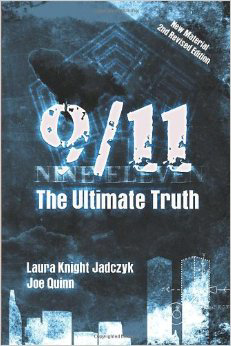

**Books**

There are many **books** related to the topics covered on this wiki,
and more generally, related to the topics discussed on the Cassiopaea
Forum. This article series is about such books.\
Currently, the main way of navigating to articles on books is the
recommended books list.

**See aIso**

. Recommended books

~XYZ-2-9/11: The Ultimate Truth
**9/ll: The UItimate Truth**

***9/ll: The Ultimate Truth*** is a tome by Laura Knight-Jadczyk and
Joe Quinn, firstp published in 2OO6 with a revived edition in 2Ol3.\
This 43O-page book drives the reader to experience the revealing truth
about what happened on September ll, 2OOl and to understand the
virulent motivations behind the "terrorist" attacks. The events are
examined along with the "players" involved in their planning and
execution: the U.S. government and intelligence agencies on the one
hand, and Israeli intelligence on the other. The latter appear to have
most likely performed the attacks on the behalf of the U.S., but in
the process, to have "changed" the plan and pulled a double-cross for
their own purposes.\
There are two parts in this book, which address, respectively, the
events of 9/ll, and their broader context.\
Part One focused primary on the 9/ll events by analyzing the great
deal of evidences surrounding the three events: Flight 93, the
Pentagon, and the World Trade Centers. And, how the Israel became
involved and the role of the United States government on that day is
evident. It also laid out the evidence-based scenario of how the
events been played out. It is important to point out that in firstp
part of this book addressed a new look at the situation of Ted and
Barbara Olson and how they are connected to the 9/ll events.\
The second part brings the reader to look at the history of Zionism,
genetics, the hidden motivations behind the attacks, and the nature of
psychopaths. With an understanding of how and why Israel was involved
and their on-going insidious actions, one will begin to comprehend why
9/ll was so important and how it led the United States of America to
become a Fascist State. This part of the

[24 Bo]{.underline}oks

{width="3.208332239720035in"
height="4.805555555555555in"}

*9/11: The UItimate Truth*, 2006

Bo[oks 25]{.underline}

book also included some sections from *PoIi1icaI PoneroIogy* by Andrew
M. Lobaczewski who had done a paramount work on psychopathy and the
nature of evil within the governments.\
Since the authors focused on the phenomenon of psychopaths, the
Zionist control, and the history in the second part of this book, it
is strongly recommended for the readers to obtain and study other
works that discussed with certain aspects of this phenomenon,
including:

. *PoIi1icaI PoneroIogy* by Andrew Lobaczewski\
. *The Con1roversy of Zion* by Douglas Reed\
. *The New PearI Harbor* by David Ray Griffnn\
. *The Mask of Sani1y* by Hervey Checkley\
. *Wi1hou1 Conscience*by Robert Hare\
. *The Sociopa1h Nex1 Door* by Martha Stout\
. *Preda1ors: PedophiIes, Rapis1s, And O1her Sex Offenderss* by Anna
Salter

Some essays are used in the text which can be found at Cassiopaea
Forum. These include:

. *Psychopa1h Humanoids - Beyond 1nsani1y* by Amos M. Gunsberg.

. An edited version of *By, For, and Of Psykopa1hs* by an anonymous
writer, appeared in the

book. The original version can be read in this Cassiopaea forum
thread.

**Further information**

. Pentagon Strike video

. 9/ll: The Ultimate Truth website

. YouTube: 9/ll: The Ultimate Truth\
. SOTT Podcast 22: 9ll: The Ultimate Truth\
. SOTT Podcast #3: 9ll Interview With Darren Williams\
. SOTT Podcast #l2: 9/ll Special\
. SOTT Podcast #46: 9ll and the Future\
. SOTT Podcasts #53: Counter-intelligence and 9/ll Truth Movement,
part l . SOTT Podcasts #54: Counter-intelligence and 9/ll Truth
Movement, part 2 . SOTT Podcasts #54: Counter-intelligence and 9/ll
Truth Movement, part 3 . SOTT Podcasts #54: Counter-intelligence and
9/ll Truth Movement, part 4

[26 Bo]{.underline}oks

. SOTT Talk Radio Show #32: 9ll Revisited - l2th Anniversary

**See aIso**

. 9/ll

. New World Order\
. Matrix control system\
. Politics and pathocracy\
. Ponerology and psychopathy . Psychopathy

. Pathocracy\
. *PoIi1icaI PoneroIogy*

~XYZ-3-All and Everything
**AII and Everything**

***All and Everything*** trilogy is the name of "ten books in three
series," written by G. I. Gurdjiefff. The trilogy series are as
follows:

. Beelzebub's Tales to His Grandson (l95O)\
. Meetings with Remarkable Men (l963)\
. Life Is Real Only Then, When 'I Am' (l974)

The following page is included with each series:

**FIRST SERIES:** Three books under the title of "Beelzebub's Tales to
His Grandson,"\
or, "An Objectively Impartial Criticism of the Life of Man."\
**SECOND SERIES:** Three books under the common title of "Meetings
with Remark-\
able Men."\
**THIRD SERIES:** Four books under the common title of "Life is Real
Only Then,\
When 'I Am.'"\
All written according to entirely new principles of logical reasoning
and strictly directed towards the solution of the following three
cardinal problems:\
**FIRST SERIES:** To destroy, mercilessly, without any compromises
whatsoever, in\
the mentation and feelings of the reader, the beliefs and views, by
centuries rooted in\
him, about everything existing in the world.\
**SECOND SERIES:** To acquaint the reader with the material required
for a new creation and to prove the soundness and good quality of it.\
**THIRD SERIES:** To assist the arising, in the mentation and in the
feelings of the reader, of a veritable, non-fantastic representation
not of that illusory world which he\
now perceives, but of the world existing in reality.

**See aIso**

. Gurdjiefff\
. Fourth Way

~XYZ-4-An Introduction to Information Theory
{width="2.0729155730533684in"
height="3.270832239720035in"}

*An 1ntroduction to 1nformation Theory*, l980 Dover Edition

**An lntroduction to lnformation Theory**

***An Introduction to Information Theory: Symbols, Signals and
Noise*** is a textbook by John R. Pierce, firstp published in l96l
under the title *SymboIs, SignaIs and Noise: The Na1ure and* *Process
of Communica1ion*.

This is a a classic textbook which covers the formal theory in a
relatively easy way and an excellent introduction to the concepts of
information theory: entropy, stationarity, ergodic sources, effcientt
coding, error detection, error correction, etc.

**ReIated readings**

. *1nforma1ion and 1he Na1ure of ReaIi1y* . *Origin of Life: The 51h
Op1ion*\
. *Signa1ure in 1he CeII*\
. *Mind and Cosmos*

Bo[oks 29]{.underline}

**ExternaI Iinks**

. Cassiopaea Forum: Session 28 May 2Ol3\
. Cassiopaea Forum: Session ll August 2Ol8

**See aIso**

. Information theory

~XYZ-5-Beelzebub’s Tales to His Grandson
**BeeIzebub's TaIes to His Grandson**

***Beelzebub's Tales to His Grandson: An 0bjectively Impartial
Criticism of the Life of*** ***Man*** is the firstv volume of the *AII
and Every1hing* trilogy written by G. I. Gurdjieff,fi firstp published
in l95O. The *AII and Every1hing* trilogy also includes *Mee1ings wi1h
RemarkabIe Men* (l963) and *Life 1s ReaI OnIy Then, When '1 Am'*
(l974).

This is Gurdjieff''s *magnum opus*, the firsto of his series on *AII
and Every1hing*.\
Gurdjieffh himself says that it should be read three times, firsta as
if reading the newspaper, next as if reading aloud and only then with
the goal of understanding. Once for the mechanical part of thinking,
once for the moving center, once for "being mentation".\
*BeeIzebub's TaIes* is on the surface a narrative of a long voyage on
a spaceship, where Beelzebub, rebel angel become elder statesman,
discourses on his observations of Earth humanity for the edificationo
of his grandson.\
It has been speculated that *BeeIzebub's TaIes* were a sort of karmic
autobiography of Gurdjiefff himself. As to the grandson, this seems to
indicate a message sent to the future. The generations born from l94O
onwards would in fact be Gurdjieff''s figurativee grandchildren, at
least in potential. Gurdjieffh himself was very conscious of a need to
create a certain kernel of consciousness in humanity, to be formed in
the relatively near future. He most likely was aware of some cosmic
window of opportunity, i.e. the Wave of the Cassiopaeans, for which
this was a needed preparation. Gurdjieff''s initial plan seemed to
have been forming a worldwide network of schools, transmitting the
teaching via a living tradition. Probably due to both his near fatal
accident in l924 and to disappointment with his students, he turned to
writing instead, sending a message in a bottle into the present time.
The book's main thrust is the destruction of the myth that man is a
conscious being and in charge of his destiny. Amidst this,
*BeeIzebub's TaIes* speaks of esoteric principles but it is not a
structured textbook nor is it a course curriculum. For such,
Ouspensky's *1n Search of 1he MiracuIous* and Mouravieff''s *Gnosis*
series are much more accessible and structured.\
Why Gurdjieffw wrote as he did may not always be clear. We do know
that he spent a long time on the work, including one full rewrite. If
something is as it is, it is because he intended it so. While writing,
he had the book regularly read aloud to his students and if something
was too clear, he "buried the dog deeper", as he himself put it. So
one must work through the shocks to human vanity and Gurdjieff''s
circuitous expression and often humorous style to glimpse deeper
principles. From the author's introduction:^l^

In any case, instead of the conventional preface I shall begin quite
simply with a Warning. Beginning with a Warning will be very judicious
of me, if only because it will not contradict any of my principles,
either organic, psychic, or even "willful", and will at

lGurdjieff,G G. I. *Beelzebub's Tales to His Grandson*, p. 5-6. New
York: Penguin Books, l999.

Bo[oks 3l]{.underline}

the same time be quite honest-of course, honest in the objective
sense, because both I myself and all others who know me well, expect
with indubitable certainty that owing to my writings there will
entirely disappear in the majority of readers, immediately and not
gradually, as must sooner or later, with time, occur to all people,
all the wealth they have, which was either handed down to them by
inheritance or obtained by their own labor, in the form of quieting
notions evoking only naive dreams, and also beautiful representations
of their lives at present as well as of their prospects in the future.

*BeeIzebub* was aimed "to destroy, mercilessly, without any
compromises whatsoever, in the menta- tion and feelings of the reader,
the beliefs and views, by centuries rooted in him, about everything
existing in the world."

Excerpt from Chapter 48 entitled "From the Author":^2^

To possess the right to the name of "man," one must be one.\
And to be such, one must firsto of all, with an indefatigable
persistence and an un- quenchable impulse of desire, issuing from all
the separate independent parts constitut-\
ing one's entire common presence, that is to say, with a desire
issuing simultaneously\
from thought, feeling, and organic instinct, work on an all-round
knowledge of oneself-\
-at the same time struggling unceasingly with one's subjective
weaknesses\--and then afterwards, taking one's stand upon the results
thus obtained by one's consciousness\
alone, concerning the defects in one's established subjectivity as
well as the elucidated\
means for the possibility of combating them, strive for their
eradication without mercy towards oneself.\
Speaking frankly, and wholly without partiality, contemporary man as
we know him is nothing more nor less than merely a clockwork
mechanism, though of a very complex construction.\
About his mechanicality, a man must without fail think deeply from
every aspect and\
with an entire absence of partiality and well understand it, in order
fully to appreciate\
what significancet that mechanicality and all its involved
consequences and results may\
have both for his own further life as well as for the justificationo
of the sense and aim of\
his arising and existence.\
For one who desires to study human mechanicality in general and to
make it clear to himself, the very best object of study is he himself
with his own mechanicality; and\
to study this practically and to understand it sensibly, with all
one's being, and not "psychopathically," that is, with only one part
of one's entire presence, is possible only\
as a result of correctly conducted self-observation.\
And as regards this possibility of correctly conducting self
observation and conducting

2Gurdjieff,G G. I. *Beelzebub's Tales to His Grandson*, p. l2O9-l2l2.
New York: Penguin Books, l999.

[32 Bo]{.underline}oks

it without the risk of incurring the maleficentt consequences which
have more than once been observed from people's attempts to do this
without proper knowledge, it is necessary that the warning must be
given\--in order to avoid the possibility of excessive zeal\--that our
experience, based on the vast exact information we have, has shown
that this is not so simple a thing as at firstg glance it may appear.
This is why we make the study of the mechanicality of contemporary man
the groundwork of a correctly conducted self-observation.

Before beginning to study this mechanicality and all the principles
for a correctly con- ducted self- observation, a man in the firstp
place must decide, once and forever, that he will be sincere with
himself unconditionally, will shut his eyes to nothing, shun no
results wherever they may lead him, be afraid of no inferences, and be
limited by no previous, self-imposed limits; and secondly, in order
that the elucidation of these prin- ciples may be properly perceived
and transubstantiated in the followers of this new teaching, it is
necessary to establish a corresponding form of "language," since we
findd the established form of language quite unsuitable for such
elucidations.

As regards the firstc condition, it is necessary now at the very
outset to give warning that a man unaccustomed to think and act along
lines corresponding to the principles of self-observation must have
great courage to accept sincerely the inferences obtained and not to
lose heart; and submitting to them, to continue those principles
further with the crescendo of persistence, obligatorily requisite for
this.

These inferences may, as is said, "upset" all the convictions and
beliefs previously deep- rooted in a man, as well as also the whole
order of his ordinary mentation; and, in that event, he might be
robbed, perhaps forever, of all the pleasant as is said "values dear
to his heart," which have hitherto made up his calm and serene life.

Thanks to correctly conducted self-observation, a man will from the
firstd days clearly grasp and indubitably establish his complete
powerlessness and helplessness in the face of literally everything
around him.

With the whole of his being he will be convinced that everything
governs him, everything directs him. He neither governs nor directs
anything at all. He is attracted and repelled not only by everything
animate which has in itself the capacity to influencet the arising of
some or other association in him, but even by entirely inert and
inanimate things.

Without any self-imagination or self-calming\--impulses which have
become inseparable from contemporary men\--he will cognize that his
whole life is nothing but a blind reacting to the said attractions and
repulsions.

He will clearly see how his what are called world-outlooks, views,
character, taste, and so on are molded\--in short, how his
individuality was formed and under what influencess its details are
liable to change. And as regards the second indispensable condition,
that

Bo[oks 33]{.underline}

is, the establishment of a correct language; this is necessary because
our still recently established language which has procured, so to say,
"rights-of-citizenship," and in which we speak, convey our knowledge
and notions to others, and write books, has, in our opinion already
become such as to be now quite worthless for any more or less exact
exchange of opinions.

The words of which our contemporary language consists, convey, owing
to the arbi- trary thought people put into them, indefinitea and
relative notions, and are therefore perceived by average people
"elastically."

In obtaining just this abnormality in the life of man, a part was
played in our opinion, by always that same established abnormal system
of education of the rising generation. And it played a part because,
based, as we have already said, chieflyo on compelling the young to
"learn by rote" as many words as possible differenttiated one from the
other only by the impression received from their consonance and not by
the real pith of the meaning put into them, this system of education
has resulted in the gradual loss in people of the capacity to ponder
and reflectu upon what they are talking about and upon what is being
said to them.

**See aIso**

. Gurdjiefff\
. Fourth Way

~XYZ-6-Blink (book)
**BIink (book)**

{width="2.60417760279965in"
height="3.934884076990376in"}

***Blink: The Power of Thinking Without Thinking*** is a book by
Malcolm Gladwell, firstt published in 2OO5. It presents research
findingso on the role of the adaptive unconscious in our lives,
including the more positive aspects of unconscious information
processing ("thinking without thinking"). It can often notice and
solve problems more effcienttly and creatively than an analytical
approach which systematically considers more information.

This book is a good supplement to *S1rangers 1o OurseIves* and
*Thinking, Fas1 and SIow*, which focus more on the flawws and biases
of unconscious information processing, and on how we are blind to what
influencesu us and to our own motivations and personality.

**ReIated reading**

. *S1rangers 1o OurseIves* Timothy D. Wilson . *Redirec1* (book)
Timothy D. Wilson\
. *Thinking, Fas1 and SIow* Daniel Kahneman

Bo[oks 35]{.underline}

. *You Are No1 So Smar1* David McRaney\
. *Wha1 Makes Your Brain Happy and Why You ShouId Do 1he Opposi1e*
David DiSalvo

**See aIso**

. Adaptive unconscious . Creativity\
. Problem-solving

~XYZ-7-Brain Changer
**Brain Changer**

{width="3.12500656167979in"
height="4.6781539807524055in"}

***Brain Changer: How Harnessing Your Brain's Power to Adapt Can
Change Your*** ***Life*** is a book by David DiSalvo, firstp published
in 2Ol3. It describes our potential to change our brains through
neuroplasticity, by consciously influencingt the feedback loops that
control our brains and minds.

The book has three parts: one theoretical ("Know"), one practical
("Do"), and one recommending further material on relevant themes
("Expand") in the form of nonfictiona and fictionb books as well as
movies.

**Metacognition and neuropIasticity**

Two basic concepts are at the root of *Brain Changer*: metacognition
("thinking about thinking") and neuroplasticity. Neuroplasticity is
the ability of our brains to change over time and they

Bo[oks 37]{.underline}

change according to what they do, the mental and behavioral patterns
we choose forming habit- ual "tracks". The key, then, is to influenceo
ourselves so as to form beneficialt tracks rather than detrimental
ones and one of the keys to this is metacognition.

While people often "think" about their thinking, this usually amounts
to being pulled along by a floood of mental energy, and as such simply
following an ingrained track; the key to effectiveely changing the
"track" we follow at a given moment is to think deliberately, taking
the time to pause and reach a more detached, level-headed perspective,
from which we can judge more objectively and make differentt choices.

**SeIf-knowIedge and practicaI tooIs**

There is more to self-change than metacognition alone our brains have
evolved to function in a certain way, and along with bad habits or
programming formed in our past, the challenge can be formidable. To
work effectiveely on changing ourselves, we must know how our brains
work, in terms of motivation and habits, and how we can influencei it.
The more "tricks" we know, and the more pitfalls we avoid, the better
the endeavor goes.

A large portion of *Brain Changer* consists of a collection of
"tools". These include both psychological techniques and concrete
actions we can take to change the way our brains work. The Cassiopaea
Forum discussion about the book contains a summary of some of them.

**ln reIation to the Fourth Way**

There are strong parallels between certain discoveries of modern
psychological and brain sciences and Fourth Way ideas. This book not
only makes for a great example, but taken together with *The Wave
Series*, *1n Search of 1he MiracuIous*, and other books such as the
'Narcissism "big fivee"', it can serve as an introduction to The Work.
These other books place the information in *Brain* *Changer* in a
wider context, and also give an understanding of the underlying issues
one may have and have to face.

*Brain Changer* also goes very well with the recommended books on
cognitive and social psychology, e.g. *S1rangers 1o OurseIves* and
DiSalvo's other recommended book *Wha1 Makes Your Brain Happy* *and
Why You ShouId Do 1he Opposi1e*. These make clearer our mechanical
nature, how we don't know ourselves, and some of the things we can do
about it.

The main challenge in reading *Brain Changer* is gaining a deeper
understanding of what is written, and so becoming able to put it into
effectivee practice. It is easy to read and it all makes sense on the
surface, but it requires reflectiona and further knowledge to really
make it click.

[38 Bo]{.underline}oks

**See aIso**

. *Wha1 Makes Your Brain Happy and Why You ShouId Do 1he Opposi1e* .
*The Mind & The Brain*

**ExternaI Iinks**

. SOTT Talk Radio Show: David DiSalvo: What Makes Your Brain Happy and
Why You Should Do the Opposite (Interview with David DiSalvo about
both *Wha1 Makes Your Brain* *Happy and Why You ShouId Do 1he
Opposi1e* and *Brain Changer*.)

. Cassiopaea Forum: Brain Changer: How Harnessing Your Brain's Power
to Adapt Can Change Your Life (Extensive summary of and excerpts from
*Brain Changer*, and discussion of the book.)

. Cassiopaea Forum: Movies recommended in the book Brain Changer by
David DiSalvo\
. David DiSalvo's "The Daily Brain" blog

~XYZ-8-Bringers of the Dawn
{width="3.111111111111111in"
height="4.805555555555555in"}

*Bringers of the Dawn: Teachings from the PIeiadians*

**Bringers of the Dawn**

***Bringers of the Dawn: Teachings from the Pleiadians***, by Barbara
Marciniak, is a channeled material that Cassiopaeans had suggested for
reading in a number of early channeling sessions with Laura
Knight-Jadczyk.

Channeled by Marciniak, the Pleiadians present themselves as a group
entity from the far future. The book is addressed as a wake-up call to
supposed "wanderers", or "system busters" who have incarnated on Earth
at this time to assist with the events of the Wave. The book is
engaging, but according to the FotCM's take on the matter, it is a
mixed source with genuine higher density information blended with the
Marciniak's preconceptions and a heavy dose of "you create your own
reality". The term "Lizzie" was firsti introduced in this book as a
name for the 4th density STS overlords keeping the humanity captive.

[4O Bo]{.underline}oks

The book agrees in many key points with Cassiopaeans and Ra, and it is
a good read if one does not take everything too literally. Marciniak's
later work is in the FotCM's view rather more STS-influenceda and
ritualistic, thus *Bringers of 1he Dawn* remains her best work.

The Cassiopaeans have said that Ra and the Pleiadians are their
"colleagues", occupying a some- what differentt point of focus in
sixth density but with access to essentially the same understandings.
Differencesi in the channel and audience can account for many
differenceso of focus and tone.

**See aIso**

. Pleiadians . Wanderer

~XYZ-9-Cassiopaean session transcripts
**Cassiopaean session transcripts**

The Cassiopaeans are a channeled source contacted by Laura
Knight-Jadczyk for the firstt time in July of l994. The material found
in the **Cassiopaean session transcripts** is unique in that the
channeled material has been the starting point rather than the end
product: it is used as inspiration for research.

**The sessions and the research**

While the Cassiopaean material can be an interesting read in itself,
it comes about in interaction with ongoing research, and by itself is
not as meaningful. Unfortunately, it sometimes happens that people
tending towards a New Age worldview read the transcripts in isolation,
interpreting them in such a way that they merely end up extending a
subjective belief system.

For people not familiar with the larger body of work that has come
about through the Cassiopaean Experiment, at a minimum it is
recommended to read *The Wave Series* before delving into the
transcripts by themselves. Relating the events, research, and
metaphysical exploration of the early years of the Cassiopaean
Experiment, this series of books quotes key parts of the early
Cassiopaean material in context. The transcripts are also quoted in
context in works such as *The Secre1 His1ory* *of 1he WorId*, *High
S1rangeness*, and *Amazing Grace*.

***The Cassiopaea Experimen1 Transcrip1s* series**

Laura Knight-Jadczyk revisits, extensively annotates, and puts the
Cassiopaean sessions into per- spective in this book series.

. *The Cassiopaea Experimen1 Transcrip1s, VoIume 1: 199J*\
. *The Cassiopaea Experimen1 Transcrip1s, VoIume 2: 1995*\
. *The Cassiopaea Experimen1 Transcrip1s, VoIume 3: 1996*\
. *The Cassiopaea Experimen1 Transcrip1s, VoIume J: January - May
1997*

**See aIso**

. Cassiopaean Experiment\
. Channeling and channeled material . Cassiopaeans

[42 Bo]{.underline}oks

**ExternaI Iinks**

. Cassiopaea Forum: Cassiopaean Session Transcripts (A board
containing transcripts and

discussions of the sessions. Translations exist for several
languages.)\
. Cassiopaea Forum: Cassiopaean Session Transcripts by date (A thread
with links to all

transcripts published on the forum, organized by date.)

~XYZ-10-Character Disturbance
**Character Disturbance**

{width="3.1250076552930883in"
height="4.837472659667542in"}

***Character Disturbance: The Phenomenon of 0ur Age*** is a book by
George K. Simon, firstp published in 2Oll, which explores the issue of
the increasing prevalence of character disorder in modern times. In
today's social climate of permissiveness and entitlement, with a
culture that promotes narcissism, neurosis is less common than it used
to be, while irresponsible and problematic attitudes and behaviors
have greatly increased.

Simon explains that manipulative and exploitative characters cannot be
cured by treating them as if their problems were due to some great,
underlying suffering.R Rather, such behavior follows from distorted
thinking, a sense of entitlement, and a refusal to take
responsibility. As such, what those who have developed a pathological
character need above all is *correc1ion*. (Though in the case of
psychopathy and some other severe character disorders, these are known
to be incurable, though Simon only touches on this as a possibility.)

[44 Bo]{.underline}oks

The book contrasts the types of personalities that result from
neurotic issues with those having disturbed characters. It goes on to
examine the cognitive and behavioral aspects of destructive
psychopathologies, in a way that is useful for understanding,
recognizing, and dealing with those so afficted.It It can be seen as a
rewrite, more broad in scope, of George Simon's earlier book *1n
Sheep's CIo1hing*. The earlier book focused more narrowly on
understanding and dealing with covertly aggressive manipulators, which
is one of the types of the character disturbed that George Simon
identifies..

**Further reading**

. Cassiopaea Forum George Simon: Character Disturbance (A thread on
*Charac1er Dis1ur-*

*bance* with useful excerpts and some discussion.)\
. Cassiopaea Forum Extraits de Perturbation du caractere - Excerpts
from Character Distur-

bance (A French translation of excerpts from *Charac1er Dis1urbance*.)

**See aIso**

. *1n Sheep's CIo1hing* . Ponerization\
. Characteropathy\
. Psychopathy

~XYZ-11-Comets and the Horns of Moses
{width="3.156248906386702in"
height="4.666665573053368in"}

*Comets and the Horns of Moses*

**Comets and the Horns of Moses**

***Comets and the Horns of Moses*** is the second volume in the series
*The Secre1 His1ory of 1he* *WorId* by Laura Knight-Jadczyk, and was
published in 2Ol3.\
This second volume picks up the threads of the firstv volume with an
analysis of the Biblical character of Moses his possible true history
and nature and the cyclical nature of cometary bombardment and related
catastrophes in Earth's history. It examines how human culture and
beliefs have changed in response to overwhelming disaster, and how and
why history has been falsifiedt to erase such disasters from common
knowledge. In light of the past, it also examines the situation of our
current civilization, showing that the time seems near for it to
experience what past civilizations have: destruction by cometary
bombardment, plague, and other related disastrous events.\
The examination of the falsificationo of history (including why the
masses of the past so readily

[46 Bo]{.underline}oks

accepted the fabrications that were spoon-fed to them by the elites of
the day) is based on recent psychological and cognitive research as
well as a neoteric look at the origin of astrology and religions.

***The Secre1 His1ory of 1he 1/orld* series**

. *The Secre1 His1ory of 1he WorId and How 1o Ge1 Ou1 AIive* by Laura
Knight-Jadczyk (2OO5) . *Come1s and 1he Horns of Moses* by Laura
Knight-Jadczyk (2Ol3)\
. *Ear1h Changes and 1he Human-Cosmic Connec1ion* by Pierre Lescaudron
with Laura Knight-

Jadczyk (2Ol4)

**See aIso**

. Laura Knight-Jadczyk . History

. Cataclysm

~XYZ-12-Cosmos and History
{width="3.2777766841644795in"
height="4.805555555555555in"}

*Cosmos and History: The Myth of the EternaI Return*, l959

**Cosmos and History**

***Cosmos and History: The Myth of the Eternal Return*** is a work of
the history of religions by Mircea Eliade, firstp published in l954.
It consists of four chapters with a foreword.\
In this book, the author points to his analysis that a traditional man
attributes no value to the linear perspective of historical events:
only the events of the mythical age have value. Presumingly, that is
where the essence of the Sacred lies. The author also brings the
reader to the understanding of the "Eternal Return" - a belief in the
ability to return to the mythical age, to "become" contemporary with
the events described in one's myth. The "cyclical" time is attributed
to this belief.\
However, this "yearning" to return to the mythical age causes a
"terror of history".

[48 Bo]{.underline}oks

As Laura Knight-Jadczyk writes in fiftyy-second chapter of her *The
Wave* Series:^3^

As the great Historian of Religion, Mircea Eliade pointed out, the
study of history, through its various disciplines, offersa a view of
mankind that is almost insupportable. The rapacious movements of
hungry tribes, invading, conquering and destroying in the darkness of
prehistory; the barbarian invaders of the civilized world during
medieval times; the bloodbaths of the crusades of Catholic Europe
against the infidelso of the Middle East; the stalking noonday terror
of the Inquisition where martyrs quenched the flamesw with their
blood; and the raging holocaust of modern genocide. Wars, famine,
pestilence; all produce an intolerable sense of indefensibility
against what Mircea Eliade calls the Terror of History.

As I have written elsewhere, when man contemplates history, *as i1
is*, he is forced to realize that he is in the iron grip of an
existence that seems to have no real care or concern for his pain and
suffering.O Over and over again, the same sufferingsf fall upon
mankind multiplied millions upon millions of times over millennia. The
totality of human sufferingi is a dreadful thing. I could write until
the end of the world using oceans of ink and forests of paper, and
never fully convey this terrible condition in which mankind findsh his
existence.

The beast of arbitrary calamity has always been with us. For as long
as human hearts have pumped hot blood through their too-fragile bodies
and glowed with the inexpress- ible sweetness of life and yearning for
all that is good and right and loving, the sneering, stalking,
drooling and scheming beast of real life has licked its lips in
anticipation of its next feast of terror and suffering.S Since the
beginning of time, this mystery of the estate of man, this Curse of
Cain has existed. And, since the Ancient of Days, the cry has been:
"My punishment is greater than I can bear!" But if you findy yourself
saying this, you are "alienated," antisocial, and incapable of
findinga any meaning in life. You are just simply not with the
program\...

**Further readings**

. The Grail Quest and the Destiny of Man

**See aIso**

. Religion

. History

. Cyclical time\
3The Wave Chapter 52: The Cryptogeographic Being
~XYZ-13-Crucial Conversations
{width="2.4861100174978126in"
height="3.9166655730533684in"}

*CruciaI Conversations*, 2012

**CruciaI Conversations**

**_Crucial Conversations:  Tools for Talking When Stakes Are High_** is a business self-help book by Kerry Patterson, Joseph Grenny, Ron McMillan, and Al Switzler, firstp published in 2OO2, which describes how to interact with others in a constructive way when ”stakes are high, opinions vary, and emotions run strong”.

The authors defines” ”crucial conversations” as conversations between two or more people that be- comes crucial when opinions differ,s stakes are high, and emotions run strong. And, the more crucial the conversations, the less likely we would handle it due to the fact that ”countless generations of genetic shaping drive humans to handle crucial conversations with flyingfi fistsa and fleetf feet, not intelligent persuasion and gentle attentiveness”.4  When a crucial conversation failed, every aspect of our lives can be affectedf from our personal health to our professional careers in an unhealthy or disastrous way. As we master crucial conversations, we can navigate through dangerous waters safety and effectively.

4Patterson, Kerry, Joseph Grenny, Ron McMillan, and Al Switzler.
*Crucial Conversations: Tools for Talking When*

*Stakes Are High*, p. 5. 2nd Edition. New York: McGraw Hill, 2Ol2.

[5O Bo]{.underline}oks

The book also touches on two most common patterns we fall into that put safety at risk when facing a crucial conversation: _siIence_ and _vioIence_ (most commonly known as ”fightt or flightt” response). With silence, we withdraw from the conversation, avoid topics or respond in ways that obscure meaning.    With violence,  we resort to verbal abuse,  labeling,  and manipulating the situation. Either way, we get ”stuck” (an inability to solve problems or achieve goals) and become blind to the _diaIogue_ option.

The dialogue is the free floww of meaning between two or more people, and in a context of crucial conversations, it is the ”Pool of Shared Meaning”, where facts, opinions, experiences, and feelings held by two or more people in a conversation that are understood and appreciated by all.  It is a beginning of synergy.5       In order to move to dialogue, we would need to get ”unstuck” from either silence or violence by identifying where we are stuck and by looking at three parts of a problem: content, pattern, and relationship.

The book goes further on working on the self or ”Work On Me First” (”Start with the Heart” - what do you _reaIIy_ want, ”Master My Stories” - we change our narrative to influenceo our emotions), establishing own meaning (”State My Path”) and their meaning (”Learn to Look”, ”Make it Safe”, ”Explore Others’ Path”), and moving to action (determining ”Who does What by When” and setting ”Follow-up” time - holding people accountable to their promises).

This is a practical book on basic and essential skills and mastering of diffculti in-person conversa- tions. It can be read along with _How 1o Win Friends and 1nfluencee PeopIe_ and _Miss Manners_ - all of which helps one exercises external considering.

**ExternaI Iinks**

. Cassiopaea Forum: Crucial Conversations - Tools for Talking When Stakes Are High . Cassiopaea Forum: External Considering and Good Manners  
. WikiSummaries: Crucial Conversations  
. VitalSmarts (corporate training and leadership development)  
. YouTube: Crucial Conversations | Joseph Grenny  
. YouTube: Mastering The Art of Crucial Conversations | Joseph Grenny

**See aIso**

. Psychology\
. *How 1o Win Friends and 1nfluencee PeopIe*

5Patterson. *Crucial Conversations*, p. 23-25.

Bo[oks 5l]{.underline}

. *Miss Manners*
~XYZ-14-Dabrowski’s Theory of Positive Disintegration
**Dabrowski's Theory of Positive Disintegration**

{width="2.60417760279965in"
height="3.9033541119860016in"}

***Dabrowski's Theory of Positive Disintegration*** is a collection of
essays on the Theory of Positive Disintegration, edited by Sal
Mendaglio and firstp published in 2OO8.\
This book is a good addition to Kazimierz Dqbrowski's own works
describing the Theory of Pos- itive Disintegration. It contains
information about Dqbrowski and his life, the theory and its
development, and relates the theory to various subjects. Among those
subjects are aspects of the philosophies of Plato, Kierkegaard, and
Nietzsche; education; mental health; creativity; and giftedness.

**ReIated reading**

. *PersonaIi1y-shaping 1hrough Posi1ive Disin1egra1ion* . *Posi1ive
Disin1egra1ion* (book)\
. *Men1aI Grow1h Through Posi1ive Disin1egra1ion*\
. *Psychoneurosis 1s No1 An 1IIness*

Bo[oks 53]{.underline}

. *The Dynamics of Concep1s*\
. *MuI1iIeveIness of Emo1ionaI and 1ns1inc1ive Func1ions*

**See aIso**

. Kazimierz Dqbrowski\
. Theory of Positive Disintegration

**ExternaI Iinks**

. Cassiopaea Forum: A Brief Overview Dabrowski's Theory of Positive
Disintegration (Bill

Tillier's brief presentation of the Theory of Positive Disintegration,
and discussion.)\
. PositiveDisintegration.com (Bill Tillier's website about the Theory
of Positive Disintegration.

Contains information and offersd digital copies of Dqbrowski's own
works.)
~XYZ-15-Darkness Over Tibet
**Darkness Over Tibet**

***Darkness 0ver Tibet*** is a book by Theodore Illion, firstp
published in l937, an allegoric account of the underground city in
Tibet during the course of Illion's journey. He relates his
experiences with his interactions with a number of individuals in the
mentioned city. At first,h he found there all is well and everything
seems quite peaceful, but as it turned out later, nothing is as it
seems. There is a known darkness and "unseen" darkness. This book
reveals the "unseen" darkness where as the so-called "light" is
actually the darkness in disguise.

The stories in this book are clearly symbolic, but it may have some
basis in fact and probably capture some of the spirit of popular
belief in the region. Determining the account's precise accuracy is
diffcultf from a Western standpoint.

What is more important than the literal accuracy of Illion's account
is, however, the way in which he underlines basic principles. The
following are the high points of his narrative:

. Spiritual development does not bring one to blissful peace. It is a
road of constant struggle fraught with pitfalls at each level. The
light and dark follow each other closely and deceptions become
increasingly subtle.

. Not all life is on an upward path. Many life forms are in fact on a
descending path, symbolized in the animal world by rats and the like.
The same applies to at the human and higher levels. The psychopath
would be a human level representation of the descending path.
Generally, the descending path tends towards materialization of
spirit, use of spiritual forces at the service of their material
goals. This is in line with the idea of service to self from Ra and
Cassiopaeans.

. The deceptions of the dark forces are sometimes very subtle and can
take the form of great seeming virtue, understanding and wisdom. One
among these is for man to think himself God and and refuse to act his
part. For example, a character in a theater play in the book thought
himself enlightened and since all created are God's creatures, he saw
fitt to share his house and food with rats, to the effecto of starving
his family. He was spiritually proud and in his pride deceived.

Illion mentions other archetypal stories, including a school of black
magicians where the students do not even at firstg guess the nature of
the school, thinking themselves on a mission for good, administering
karma for the world's leaders, guiding destinies with a "strong and
benevolent hand."

Still, this power hungry and self-important lot were nothing but the
minions of the actual forces of darkness, perpetrating human
sacrificea and other such activities for their own gain,\
Yet another example is a teacher who warns people against blindly
following leaders and of prac- ticing magic, all in good sense but
then advises them to destroy any individual consciousness and to
return to an in-differenttiated state of non-ego, effectuallyc
committing suicide and reversing the Creator's work, all for personal
happiness.

Bo[oks 55]{.underline}

{width="4.013888888888889in"
height="6.222222222222222in"}

*Darkness 0ver Tibet*

[56 Bo]{.underline}oks

Illion's greatest merit is showing the dark side of many seemingly
reasonable and even virtuous ideas. The Cassiopaeans have commented
that Illion's account is an allegory for spiritual truths and 4th
density concepts.

**Further readings**

. Darkness Over Tibet Part l\
. Darkness Over Tibet Part 2\
. Darkness Over Tibet Part 3\
. Cassiopaea Forum: Theodore Illion - Darkness Over Tibet

**See aIso**

. Theodore Illion\
. Fourth density service to self being
~XYZ-16-Darwin’s Doubt
{width="2.156248906386702in"
height="3.270832239720035in"}

*Darwin\'s Doubt*, 20l3

**Darwin's Doubt**

***Darwin's Doubt: The Explosive 0rigin of Animal Life and the Case
for Intelligent*** ***Design*** is a book by philosopher Stephen C.
Meyer, firstp published in 2Ol3, which expands on the case for
intelligent design that the author presented in his previous book
*Signa1ure in 1he CeII*.

This work focuses on the mystery of the Cambrian explosion, when
numerous new animal forms appeared quite suddenly in the fossil
record, seemingly with no transitional ancestors that would explain
their unique features, according to gradual Darwinian processes. Part
l examines the firstt problem posed by the Cambrian explosion: the
missing forms and fossils. If Darwinism is true, there should be
innumerable transition fossils, but they're completely missing. The
second part zeroes in on genetics and the problems it has accounting
for the new Cambrian creatures. Finally, Part 3 takes a look at some
post-Darwinian theories, including intelligent design.

**ReIated readings**

. *Signa1ure in 1he CeII*\
. *1nforma1ion and 1he Na1ure of ReaIi1y* . *Origin of Life: The 51h
Op1ion*

[58 Bo]{.underline}oks

. *Mind and Cosmos*

**ExternaI Iinks**

. Cassiopaea Forum: Session 28 May 2Ol3

. *Darwin's Doub1* by Stephen C. Meyer\
. Cassiopaea Forum: Darwin's Doubt, by Stephen C. Meyer\
. YouTube: Stephen C. Meyer: Is intelligent design science? Signature
in the Cell and Darwin's

Doubt

**See aIso**

. Information theory
~XYZ-17-Deep Nutrition
{width="2.1875in" height="3.2708333333333335in"}

*Deep Nutrition*, 2009

**Deep Nutrition**

***Deep Nutrition: Why Your Genes Need Traditional Food*** is a book
by Catherine Shanahan and Luke Shanahan, published in 2OO9, which goes
into the studies of "epigenetics" and how much influenced diet and
nutrition has on the proper expression and functioning of the genes
(and the effectsc carried over generations).

The blurb on Amazon gives a good overall description of the contents:

*Deep Nu1ri1ion* illustrates how our ancestors used nourishment to
sculpt their anatomy, engineering bodies of extraordinary health and
beauty. The length of our limbs, the shape of our eyes, and the proper
function of our organs are all gifts of our ancestor's collective
culinary wisdom.

Citing the foods of traditional cultures from the Ancient Egyptians
and the Maasai to the Japanese and the French, the Shanahans identify
four food categories all the world's healthiest diets have in common,
the Four Pillars of World Cuisine. Using the latest research in
physiology and genetics, Dr. Shanahan explains why your family's
health depends on eating these foods. In a world of competing
nutritional ideologies, *Deep* *Nu1ri1ion* gives us the full picture,
empowering us to take control of our destiny in ways we might never
have imagined.

[6O Bo]{.underline}oks

**ExternaI Iinks**

. Cassiopaea Forum: Deep Nutrition\
. Cassiopaea Forum: Leonardo da Vinci meets gluten intolerance . Dr.
Cate website: Deep Nutrition

**See aIso**

. Ketogenic diet\
. *The Living S1ream*
~XYZ-18-Defense Against the Psychopath
**Defense Against the Psychopath**

{width="2.60417760279965in"
height="3.7187653105861767in"}

***Defense Against the Psychopath: A Brief Introduction to Human
Predators*** is a short text about psychopaths, written by Stefan H.
Verstappen, and published as part of his book *The* *Ar1 of Urban
SurvivaI*. It can serve as a quick primer on the subject of
psychopathy, including the roles psychopaths can play in society, and
awareness of them so as to be able to protect oneself.

Verstappen has also made a video version. Both the video and a PDF
download of the text are freely available.

**ReIated reading**

. *The Sociopa1h Nex1 Door*\
. *Women Who Love Psychopa1hs* . *Snakes in Sui1s*\
. *Wi1hou1 Conscience*\
. *The Mask of Sani1y*\
. *PoIi1icaI PoneroIogy*

[62 Bo]{.underline}oks

**See aIso**

. Psychopathy . Ponerology

**ExternaI Iinks**

. Defense Against the Psychopath (Page at Verstappen's site, with a
free PDF download as

well as a video version of the material.)

**Forum content**

. Cassiopaea Forum: Defense against the psychopath (Discussion of the
video.)

**Audio**

. SOTT Talk Radio Show #48: Surviving the Psy-pocalypse
*\[discussion\]* (Interview with Ste- fan Verstappen about defending
ourselves from the predators in our midst, as well as what we can do
to prepare for natural disasters and social breakdown.)

. SOTT Radio Network - Behind the Headlines: Paradise Stolen -
Interview with Stefan Ver- stappen (A later interview about the ways
in which psychopathic greed has deformed human societies, and other
topics.)

**Videos**

. Defense Against the Psychopath (Full length Version) (Video
presentation by Verstappen

based on the text.)\
. Psychopathy in politics and financee (GRTV Feature interview with
Stafan Verstappen on

Global Research TV.)
~XYZ-19-Defying Hitler
**Defying HitIer**

{width="2.60417760279965in"
height="4.031234689413823in"}

***Defying Hitler: A Memoir*** is a book by Sebastian Haffner,w
written in l939 and published posthumously in 2OOO. It gives an
insightful account of the Nazis' rise to power, as well as the events
before (World War I, the hyperinflation,f failed revolutions) which
prepared the society to accept such a turn in direction. The
perspective is that of an ordinary middle class citizen, relating how
each turn of events affectedh him and his family, those around him,
and the society at large.

This book makes it easier to understand how a whole society can "turn
evil". Its description of how societal conditions evolved (or
devolved) across decades makes clear how Germans were gradually robbed
of their senses and their values preparing them to accept the Nazis,
and in many cases eventually become Nazis and that what followed had
the character of a collective nervous breakdown. In this and other
things, the book provides a concrete illustration which goes along
nicely with the theory presented in Andrew M. Lobaczewski's *PoIi1icaI
PoneroIogy*.

Haffnerh himself describes the role and value of this book quite well:

Offcial,a academic history has, as I said, nothing to tell us about
the differencesi in intensity of historical occurrences. To learn
about that, you must read biographies, not those of statesmen but the
all-too-rare ones of unknown individuals. There you will see

[64 Bo]{.underline}oks

that one historical event passes over the private (real) lives of
people like a cloud over a lake. Nothing stirs, there is only a
fleetings shadow. Another event whips up the lake as in a
thunderstorm. For a while it is scarcely recognizable. A third may,
perhaps, drain the lake.

Sebastian Haffner,, *Defying Hi1Ier*, p. 7

**ReIated reading**

. *S1asiIand*\
. *PoIi1icaI PoneroIogy*

**ExternaI Iinks**

**ArticIes**

. Chaos and Consent: Working Towards the Fuhrer (Article showing the
similarities between developments in the US in recent years and the
events that brought the Nazis to power. Contains quotes from *Defying
Hi1Ier*.)

. The dying of the light (Article relating what can be learned from
*Defying Hi1Ier* and *PoIi1icaI* *PoneroIogy* to developments in the
West. 9/ll parallels the Reichstag fire,a and the current anti-Muslim
hysteria is a repeat of the old anti-Jew hysteria with a new
scapegoat.)

. Holocaust 2.O: The ultimate decisions of conscience (Article quoting
*Defying Hi1Ier* and relating the events of those times to the recent,
Western-backed developments in Ukraine. One in a series of articles on
the coming "Holocaust 2.O" that seems to be in store.)

**Forum content**

. Cassiopaea Forum: Defying Hitler - by Sebastian Haffnerr (Discussion
of the book.)
~XYZ-20-Detoxification and Healing: The Key to Optimal Health
{width="2.1875in" height="3.2708333333333335in"}

*Detoxificationa and HeaIing*, 2003 Edition

**Detoxificationa and HeaIing: The Key to OptimaI HeaIth**

***Detoxificaation and Healing: The Key to 0ptimal Health*** is a book
by Sidney MacDonald Baker, M.D., published in l997, which introduces
the reader to detoxificationa and healing, and how detoxificationa
advances wellness by ridding the body of toxics that can lead to a
host of health issues ranging from fatigue and depression to cancer
and diabetes.

From Laura Knight-Jadczyk's review on Amazon:

**Brings it all Home**\
If you are searching for answers to chronic health problems and have
been reading dozens\
of books on the topic as I have over the past several years, you'll
really appreciate\
this book which brings it all home with some theoretical background
and excellent speculation on whys and wherefores. This approach is
very helpful once you have gone through all the whats and hows.\
I noticed that one reviewer didn't like the "personal take." Well,
that is what I DO like,\
so differentt strokes and all that. If a trained physician is not to
be allowed to speculate\
about health problems after practicing for 35 years, then who is?\
The discussion about the relationship between the immune system and
the CNS is fascinating and the piece of the puzzle that was missing
from all the other books. Oh,

[66 Bo]{.underline}oks

sure, most of them say "you need to relax, meditate, have a good time
now and then," but none of them say exactly how this is connected to
chronic illness. Baker explains it beautifully. His remarks about how
invasive life experiences play a key role in chronic illness are very
much appreciated. More than that, they are supported by quite a bit of
recent research showing that abused individuals are more likely to
sufferc chronic illness throughout their lives. Baker helped make this
connection in my mind and, more than that, the WHY and HOW of it. His
attention to these factors is much appreciated. More than that, Baker
emphasizes that every single case is differentt. The symptoms may be
the same, but the cause is differentt. Two people sufferingt the same
symptoms may discover that the underlying cause of one is due to a
thyroid problem, while the other may findt that their problem is due
to a bacterial infection of the small intestine. Heavy metals,
thyroid, bacterial/parasitic infection and hormonal imbalances as well
as gut integrity issues can all lead to the cascade of events that
occur in a wide variety of chronic illnesses and having that
information is also priceless.\
I highly recommend this book even if you have read all the others.
Nothing takes the place of understanding, not even rote following of
one plan or another. No two people are alike and the treatments cannot
be identical so it is good to have the theoretical understanding that
Dr. Baker provides.

**ExternaI Iinks**

. Cassiopaea Forum: DMSA for heavy metal detox - how long available?

**See aIso**

. Diet\
. Ketogenic diet
~XYZ-21-Detoxify or Die
{width="2.124998906386702in"
height="3.270832239720035in"}

*Detoxify or Die*

**Detoxify or Die**

***Detoxify or Die*** is a book by Sheery A. Rogers, published in
2OO2, which presents a strong case that our main toxic load comes from
our environment and provides a sources and types of toxicity that are
damaging our bodies.

In this book, the author discusses the importance of treating the
causes of disease, the chemicals to avoid in food, cleaning, personal
care products, the impact of each of the major chemicals in the body,
the issues with the most common prescribed drugs, the benefitso of a
daily detox cocktail and of a daily FIR sauna.

It is a highly recommended reading, along with Sidney MacDonald
Baker's *De1oxificaa1ion and* *HeaIing: The Key 1o Op1imaI HeaI1h*, to
give one the tools and knowledge one needs in order to cleanse and
detoxify the body.

**See aIso**

. Health and wellness

[68 Bo]{.underline}oks

**Further reading**

. *De1oxificaa1ion and HeaIing: The Key 1o Op1imaI HeaI1h*

**ExternaI Iinks**

. Detoxifying the Body, Mind and Soul: A Holistic Approach by Gabriela
Segura . Cassiopaea Forum: Anti-Candida, Inflammation,H Heavy Metals
Detox and Diet . Cassiopaea Forum: Detoxify or Die Cookbook

. Cassiopaea Forum: Did any body used detox cocktail suggested in
'Detoxify or Die' book? . YouTube: Beyond5ORadio's interview with
Sherry Rogers
~XYZ-22-Deviance and Moral Boundaries
{width="3.2361100174978126in"
height="4.805554461942258in"}

*Deviance and MoraI Boundaries*, l987

**Deviance and MoraI Boundaries**

***Deviance and Moral Boundaries: Witchcraft, the 0ccult, Science
Fiction, Deviant*** ***Sciences and Scientists*** is a book by Nachman
Ben-Yehuda, firstp published in l985. This is an important
sociological work on certain pathologies in several areas that were
not investigated previously by sociologists.

It is relatively a small academic book, consisting of 25O pages
including six chapters and a bibli- ography. These chapters are
focused on the theoretical background of the "sociology of deviance",
the European witch-craze of the l5th to l7th century period, deviance
in science and scientists, and a concluding discussion.

Throughout the book, the author has provided case studies from
differentt time periods, to support

[7O Bo]{.underline}oks

the thesis that the sociology of deviance was done on a "small scale",
and that deviance really is a relative phenomenon that depends on the
"cultural matrix" meaning that deviance is a significantt aspect of
societal changes and stability, and a strong contribution to the moral
boundaries. For example, the author discusses at length the European
witch-craze of the Middle Ages where the boundaries of all aspects of
the medieval society were altered to "explain the inventions" of
specifict theology and why the people easily accepted such a surreal
ideology, one which involved dumbing-down and sometimes outright
destroying the important roles of women, and which had the aim of
strengthening the legitimacy of Christian dogma and authority.

**See aIso**

. Occult

. Witchcraft
~XYZ-23-Diet Research of the Cassiopaea Forum
**Diet Research of the Cassiopaea Forum**

***Diet Research of the Cassiopaea Forum: A Summary of the Science
Background*** is one of the working titles for a book in the making by
Gabriela Segura, M.D. It summarizes the findingso of years of diet
research done by the Cassiopaea.org community together with editors of
Signs of the Times. A rough draft containing essentially all of the
information, but made before proofreading and further editing has been
made available for free to all forum members in 2Ol4. When it comes to
the theory of the ketogenic diet, this book can save readers the time
needed to go through various other books, as well as the two large
Cassiopaea Forum discussion threads on diet, "Life Without Bread" and
"Ketogenic Diet Path To Transformation?".

A second book is also being worked on, and is meant to provide a
practical guide to dietary transition. Such information is very
important, because there are a number of common stumbling blocks and
individual issues that may be encountered, which almost always have
known and simple solutions.

In the meantime, there's another book which also provides a great
practical guide, easily read and understood and recommended to
everyone interested in the ketogenic diet. That book is Maria
Emmerich's *Ke1o-Adap1ed*. Being an excellent read, it will continue
to be recommended even after Segura finishest the practical guide.

There are also other recommended books that provide information for
those interested in a paleo- or ketogenic diet. *PrimaI Body, PrimaI
Mind* by Nora T. Gedgaudas is another books which comprehensively
covers much theory, and also gives some advice for people with
particular needs.

Further books are listed on the recommended books page, under the
"Health and diet" section.

**ReIated reading**

. *PrimaI Body, PrimaI Mind* Nora T. Gedgaudas

. *Ke1o-Adap1ed* Maria Emmerich\
. *The Ar1 and Science of Low Carbohydra1e Living* Stephen D. Phinney
and JeffS S. Volek . *Life Wi1hou1 Bread* Christian B. Allan and
Wolfgang Lutz

**See aIso**

. Ketogenic diet

[72 Bo]{.underline}oks

**ExternaI Iinks**

. Cassiopaea Forum: Ketoadaptation - Consensus (From 2Ol4, the
background for the making

of Segura's work.)\
. Cassiopaea Forum: Life Without Bread (Beginning in 2Oll, discussion
of the earlier research

and experiences that gradually led us to a paleo diet. Over the years
since, what we have learned has led on to a ketogenic diet.)

. Cassiopaea Forum: Ketogenic Diet Path To Transformation? (Beginning
in 2Ol2, discussion

of further research and experiences that led to the ketogenic diet.)\
. The Ketogenic Diet - An Overview (An article, also by Gabriela
Segura, giving a briefer

overview of the ketogenic diet.)
~XYZ-24-Earth Changes and the Human-Cosmic Connection
**Earth Changes and the Human-Cosmic Connection**

***Earth Changes and the Human-Cosmic Connection***, by Pierre
Lescaudron, is the third volume in the series *The Secre1 His1ory of
1he WorId* by Laura Knight-Jadczyk, and was published in 2Ol4.

Jet Stream meanderings, Gulf Stream slow-downs, hurricanes,
earthquakes, volcanic eruptions, meteor fireballs,t tornadoes,
deluges, sinkholes, and noctilucent clouds have been on the rise since
the turn of the century. Have proponents of man-made global warming
been proven correct, or is something else, something much bigger,
happening on our planet?

While mainstream science depicts these Earth changes as unrelated,
Pierre Lescaudron applies findingsf from the Electric Universe
paradigm and plasma physics to suggest that they might in fact be
intimately related, and stem from a single common cause: the close
approach of our Sun's 'twin' and an accompanying cometary swarm.

Citing historical records, the author reveals a strong correlation
between periods of authoritarian oppression with catastrophic and
cosmically-induced natural disasters. Referencing metaphysical
research and information theory, this book is a ground-breaking
attempt to re-connect modern sci- ence with the ancient understanding
that the human mind and states of collective human experience can
influencec cosmic and earthly phenomena.

***The Secre1 His1ory of 1he 1/orld* series**

. *The Secre1 His1ory of 1he WorId and How 1o Ge1 Ou1 AIive* by Laura
Knight-Jadczyk (2OO5) . *Come1s and 1he Horns of Moses* by Laura
Knight-Jadczyk (2Ol3)\
. *Ear1h Changes and 1he Human-Cosmic Connec1ion* by Pierre Lescaudron
with Laura Knight-

Jadczyk (2Ol4)

**Further information**

. YouTube: Earth Changes and the Human-Cosmic Connection - The Secret
History of the

World Vol. 3\
. SOTT Talk Radio show #7O: Earth changes in an electric universe: Is
climate change really

man-made?\
. Cassiopaea Forum: Earth Changes and the Human-Cosmic Connection

[74 Bo]{.underline}oks

{width="4.666666666666667in"
height="5.847222222222222in"}

*Earth Changes and the Human-Cosmic Connection*, 20l4

Bo[oks 75]{.underline}

**See aIso**

. Earth changes\
. Electric universe . History

. Cataclysm
~XYZ-25-Egypt, Canaan and Israel in Ancient Times
{width="2.1875in" height="3.2708333333333335in"}

*Egypt, Canaan and 1sraeI in Ancient Times*, l992

**Egypt, Canaan and lsraeI in Ancient Times**

***Egypt, Canaan and Israel in Ancient Times*** is a scholarly work by
Egyptologist Don- ald B. Redford, firstp published in l992, which
explores the relationship between Egypt and Canaan/Palestine/Israel
from prehistory down to the destruction of Jerusalem in 586 B.C.

There are four parts in this book, with the total of fifteenc
chapters, excluding an introduction and an epilogue. The firstp part
explores the prehistory of Egypt and the Levant to the Hyksos in
Egypt, drawing on archaeological and textual evidence, and the second
section focuses on the New Kingdom of Egypt and its Empire in Asia.
The third part discusses the attacks of Libyans and Sea Peoples on
Egypt, and the finalp part of the book addresses the relations between
Egypt and the Hebrew Kingdoms to the fall of Judah in 586 B.C.

The author presents a case that the experiences of the Hyksos in
Ancient Egypt laid out a foundation of myths in Canaanite culture,
leading to the story of Exodus.

**Further reading**

. Who Wrote The Bible\
. Cassiopaea Forum: Josephus, Pilate and Paul

Bo[oks 77]{.underline}

**See aIso**

. Egypt and Egyptology . *The BibIe Unear1hed*\
. History

. Religion
~XYZ-26-Emotional Intelligence
{width="3.124998906386702in"
height="4.722222222222222in"}

*EmotionaI 1nteIIigence*, 2005

**EmotionaI lnteIIigence**

***Emotional Intelligence: Why It Can Matter More Than IQ*** is a book
by psychologist Daniel Goleman, firstp published in l995. It is the
precursor to the author's 2OO6 book *SociaI* *1n1eIIigence* and
conveys the "big picture" of the importance of emotional intelligence.

Emotional Intelligence (or E.I.) is a term used to describe the
ability or a skill of a person to recognize their own and other
people's emotions, to discriminate between differentt feelings and
label them appropriately, and to use emotional information to guide
thinking and behavior. In this book, Goleman developed an argument
that emotional intelligence, or non-cognitive skills, is as important
as I.Q. for success, including in academic, professional, social, and
interpersonal aspects of one's life.

Bo[oks 79]{.underline}

**Further readings**

. The 4 Fundamental Pillars of Emotional Intelligence

**See aIso**

. Daniel Goleman\
. *SociaI 1n1eIIigence*

**ExternaI Iinks**

. Daniel Goleman's Blog: Emotional Intelligence\
. Daniel Goleman's fivee components of emotional intelligence\
. YouTube: Daniel Goleman Introduces Emotional Intelligence . YouTube:
Daniel Goleman: "Social Intelligence"
~XYZ-27-Encyclopaedia of Psychic Science
{width="3.611111111111111in"
height="4.069444444444445in"}

*EncycIopaedia of Psychic Science*, l934

**EncycIopaedia of Psychic Science**

***Encyclopaedia of Psychic Science*** is Nandor Fodor's *magnum
opus*, firstp published in l934. This 47O+ pages book is the most
complied and comprehensive survey of every paranormal phe- nomena
known to humankind, up to a time of the writing. It includes articles
and case-histories dealing with a host of paranormal phenomena,
including apparitions of the living and the dead, clairvoyance,
medium-ship, ESPs, divination, firei immunity, levitation,
predictions, and telepathy. Other than providing a great deal of
literature on the subjects concerned, it proved to be a valued
reference work and arranged in an alphabetical order.

**See aIso**

. Nandor Fodor\
. Paranormal phenomena

Bo[oks 8l]{.underline}

. Poltergeist
~XYZ-28-Escape from Evil
{width="0.8399989063867017in"
height="1.333332239720035in"}

*Escape From EviI*

**Escape from EviI**

***Escape From Evil*** is the last book by cultural anthropologist
Ernest Becker, firstp published in l975, which continues with the
themes developed in his l973 book, *The DeniaI of Dea1h*, exploring
the frightening needs of diverse social groups, looking into the deep
inner fears of man.

In his preface, Becker writes:^6^

This book is a companion volume to *The DeniaI of Dea1h*. It completes
the task begun there, which is to synthesize the scientifica and
tragic perspectives on man. In *The* *DeniaI of Dea1h* I argued that
man's innate and all-encompassing fear of death drives him to attempt
to transcend death through culturally standardized hero systems and
symbols. In this book I attempt to show that man's natural and
inevitable urge to deny mortality and achieve a heroic self-image are
the root causes of human evil. This book also completes my
confrontation of the work of Otto Rank and my attempt to transcribe
its relevance for a general science of man. Ideally, of course, the
two books should be read side by side in order to give the integrated
and comprehensive picture that the author himself has (or imagines he
has); but each book stands on its own and can be read without the
other.

There are a lot of excellent points Becker makes that reflects some of
the ideas of Gurdjiefff about "man is machine" and the problem of the
System l versus System 2, with the former generally ruling our lives
until we somehow wake up from the control of our physiology and begin
to grow and develop true consciousness.

This book and Becker's l973 *The DeniaI of Dea1h* would ensure the
reader to get a much better - and more accurate - idea of what really
drives people.

**Further information**

. Cassiopaea Forum: Ernest Becker and Thomas Szasz\
6Becker, Ernest. *Escape from Evil*, p. xvii. New York: The Free
Press, l975.

Bo[oks 83]{.underline}

**See aIso**

. Psychology

. Human condition\
. System l and System 2\
. *The DeniaI of Dea1h*\
. *Thinking, Fas1 and SIow*\
. *The Hero Wi1h a Thousand Faces*
~XYZ-29-Essays in Ancient and Modern Historiography
**Essays in Ancient and Modern Historiography**

***Essays in Ancient and Modern Historiography*** is a book by Italian
historian Arnaldo Momigliano, firstp published in l977.\
This work is a collection of selected twenty-one essays, supplementing
readings of writers in the Greek, Jewish, and Roman traditions, such
as Tacitus and Polybius, with writings that focus on later historians,
such as Vico and Croce.\
This book contributes to an important understanding about
historiography and ancient historians.

**See aIso**

. History

. Historiography

Bo[oks 85]{.underline}

{width="4.624998906386701in"
height="6.930554461942258in"}

*Essays in Ancient and Modern Historiography*, 20l2
~XYZ-30-Et tu, Judas? Then Fall Jesus!
{width="2.395832239720035in"
height="3.6041655730533684in"}

*Et tu, Judas? Then FaII Jesus!*

**Et tu, Judas? Then FaII Jesus!**

***Et tu, Judas? Then Fall Jesus!*** is a short book by Gary Courtney,
firstp published in l992, which presents a case that the Jesus Christ
of the New Testament is an mythological personage and how he fitst the
accurate description of Julius Caesar.

From Laura Knight-Jadczyk's review on Amazon:

I, too, came to the idea that Julius Caesar was the Christ that was
worshiped all over the empire before the time of the Jewish Rebellion
and the possible writing or re-writing of the texts of the NT by, or
following, the Flavian emperors (with the help of Josephus). When I
came to this idea, after a long study of the Roman Empire and pulling
on certain threads, I was actually afraid to say anything about it to
anyone. So, to say that I am thankful that there are at least a couple
others who have come to the same conclusion is heartening. (See also
the work of Francisco Carotta: *Jesus was Caesar*).

I've spent many years researching New Testament criticism looking for
the answer and all the time, it was staring everyone right in the
face. Based on those studies, I can tell the reader that Courtney's
book condenses thousands of books and papers on the topic into less
than 2OO pages. That, itself, is a brilliant feat - almost a miracle!

Bo[oks 87]{.underline}

Not only has he condensed the best scholarly work on the Bible, he has
done it enter- tainingly and with excellent examples and logical
progressions. He writes for everyman, thank goodness! Reading the same
material written by most scholars in their jargon (designed to keep
out the uninitiated) can make you go cross-eyed.

I highly, HIGHLY, recommend this book to everyone. Humanity has been
subjected to a 2OOO year long deception of history; it's time for the
real hero of humanity to get the credit he deserves. After all the
material and lies about him are waded through, Julius Caesar shines
forth as the greatest man in the history of Western Civilization, bar
none.

**ReIated readings**

. *Jesus was Caesar*\
. *The Assassina1ion Of JuIius Caesar* . *Caesar's Messiah*\
. *Caesar: PoIi1ician and S1a1esman*\
. *JuIius Caesar*

**ExternaI Iinks**

. Cassiopaea Forum: Was Julius Caesar the real Jesus Christ?\
. Carotta website: Jesus was Caesar\
. SOTT Talk Radio: Who was Jesus? Examining the evidence that Christ
may in fact have

been Caesar!\
. SOTT Talk Radio: Julius Caesar - Evil Dictator or Messiah for
Humanity?

. Cassiopaea Forum: Show #24: Who was Jesus?\
. Cassiopaea Forum: Show #25 - Julius Caesar: Evil Dictator or Messiah
for Humanity?\
. YouTube: The Gospel of Caesar

**See aIso**

. History

. Julius Caesar

**FOTCM**

l\. See Fellowship of the Cosmic Mind
~XYZ-31-Fear of the Abyss
{width="2.60417760279965in"
height="3.9101760717410325in"}

*Fear of the Abyss*, 20l6.

**Fear of the Abyss**

***Fear of the Abyss: Healing the Wounds of Shame & Perfectionism***
is a book by a clinical psychologist Dr. Aleta Edwards, firstp
published in 2Oll, with a second edition published by Red Pill Press
in 2Ol6.

This book deals with a kind of personality type, the problems that
people of this type may have, and how they may resolve their issues
and heal the underlying wounding. "PCS people" have among their
typical traits Perfectionism, Control issues, and Shame - as well as
black-and-white thinking, trouble with making decisions, fear of
disappointment or of disappointing others, and some other
characteristics. Underlying all this is a fear, unconsciously hidden
from, of the self - of who and what one is. Rather than focusing on
diagnoses, the author helps the reader to discover the root causes of
a constellation of personality traits from which many have suffered..

The term **PCS** stands for perfectionism, control issues and shame,
which would describe a type of personality. However, it is not a
diagnostic label but a personality type. A PCS individual would have
most of the traits that all go together rather than existing in
isolation. And, these are considered to be "defenses" against the
Abyss.

[9O Bo]{.underline}oks

The "Abyss" is the fear of uncovering what is really there in an
individual.\
According to the author from her book:

Why should PCS people be this way?

I have found that, on a deeper level, people sufferingf from PCS
dynamics have what I call a fear of the Abyss. They fear that should
they let up on their rigid control, a very bad person, lurking within
their dark side or Abyss, will be released and dominate their
personality.

What they often fear is that they will become like some person,
usually a parent or other important person in their early lives, some
of whose habits or personality they abhor and feel they have within
themselves. It is no wonder people with PCS complain of poor
self-esteem. Feeling you have some kind of monster inside will not
make anyone feel good - quite the opposite.

My clients with PCS issues always have this Abyss, like the workaholic
who is afraid of being lazy, or the person who must stick to the exact
truth at all times, even at the risk of offendingo others, because he
fears becoming a liar. This fear of the Abyss is rooted in the
mistaken belief that one must hide from a part of oneself at any cost
to keep the lid on. It is a waste of energy going through life
defending against these painful and scary feelings.

The Abyss is similar to what is known as "Shadow" in Jungian
psychology, which may refer to an unconscious aspect of the individual
which the conscious does not identify in themselves.\
This book is highly recommended by FotCM as it is a valuable tool for
any individual who recognizes these types of issues, that they may
have them in terms of just overcoming them and giving some control,
essentially of their lives.

**Further readings**

. Cassiopaea Forum: Fear Of The Abyss - Aleta Edwards\
. SotT Radio Show: Interview with Dr. Aleta Edwards, author of 'Fear
of the Abyss' . Cassiopaea Forum: Show #38 - Dr. Aleta Edwards
Interview: Fear of the Abyss\
. Aleta Edwards, Psy.D. website

**See aIso**

. Black-and-white thinking

Bo[oks 9l]{.underline}

. Narcissism
~XYZ-32-Fiber Menace
**Fiber Menace**

{width="3.12500656167979in"
height="4.680746937882764in"}

***Fiber Menace*** is a book by Konstantin Monastyrsky, firstp
published in 2OO5. It discusses an important and often overlooked
piece of the dietary puzzle: the detrimental role of fibeer. Excess
fibeer is damaging to the gut in several ways, and also reduces
absorption of nutrients. Over time, unhealthily enlarged stools may
permanently stretch and damage the gut (including its nerve endings),
resulting in chronic constipation and dependence on fibeer.

This book is of particular importance for people with severe gut
issues of many kinds, where a reduction in fibeer intake is often very
helpful, or even crucial, for healing. Such people are often adviced
by less well-informed doctors to increase their fibeer intake, which
can lead to worsening of symptoms and to irreversible damage to the
gut.

Bo[oks 93]{.underline}

**See aIso**

. Constipation\
. Fiber

. Paleo diet\
. Ketogenic diet

**ExternaI Iinks**

. Gut Sense: How to reverse and prevent constipation in children and
adults (The author's

website, which offersm much information and the related book *Gu1
Sense* for free.)\
. About Fiber Menace by Konstantin Monastyrsky (Description, summary,
and excerpts of "at

the author's website.)\
. Cassiopaea Forum: "Life Without Bread" (Chronicles the development
of our older paleo

diet, beginning in 2Oll, with all of the collective input and
experiences. Information from *Fiber Menace* is discussed here and
there throughout much of the thread.)
~XYZ-33-From Exodus to Arthur
{width="3.1388877952755907in"
height="4.805555555555555in"}

*Exodus to Arthur*, l999

**From Exodus to Arthur**

***Exodus to Arthur: Catastrophic Encounters With Comets*** is a book
by Mike Baillie, published in l999. This book presents the author's
findings,b based on the study of tree ring records, of what happened
during a series of global environmental catastrophes over the past
4,4OO years.

Mike Baillie is a dendrochronologist and an authority on tree ring
records, and his research brings new evidence of what happened in the
past. In the firstp part of the book, he discusses what
dendrochronology is, and he helps the reader to understand tree ring
and ice core records.

From his study of tree ring records, the author discovered patterns
which seem to explain the origins of various myths and legends. The
records reveal global environmental disturbances in

Bo[oks 95]{.underline}

specifict time periods, such as 2354-2345 BC, l628-l623 BC, ll59-ll4l
BC, 2O8-2O4 BC, and AD 536-545. These periods coincide with those
attributed to the Biblical floood, the Exodus event, the plagues
during King David's reign and the Ch'in dynasty, and the death of the
legendary King Arthur.

The author discusses the evidence for cometary events similar to the
Tunguska event of l9O8 as a cause of such disasters. They cause great
environmental upheaval, including earthquakes, flooods, volcanic
eruptions, and outgassing from the ocean flooor. The growth of trees
is affectedb by the environmental impact, leaving evidence of the
events in the tree rings.

This 27O-page work provides strong evidence for significantt cometary
events having occurred in the past. They were both recorded in tree
rings and passed down through the ages as myths and legends. The book
is aimed at a general audience rather than specialists, and is not
written in a technical style.

**See aIso**

. History

. Cataclysm
~XYZ-34-Fulcanelli: His True Identity Revealed
{width="3.1666655730533684in"
height="4.805555555555555in"}

*FuIcaneIIi: His True 1dentity ReveaIed*, 2006

**FuIcaneIIi: His True ldentity ReveaIed**

***Fulcanelli: His True Identity Revealed*** is a book by Patrick
Riviere, published in 2OO6 by Red Pill Press.

Riviere was a student of Eugene Canseliet, who was the only disciple
of Fulcanelli.\
This book is composed of 2O3 pages, as divided into eleven chapters,
with additions of an intro- duction and an appendix. The firstt three
chapters dealt with the alchemy in the 2Oth century and discussion of
Fulcanelli's two works, *The Mys1ery of 1he Ca1hedraIs* and *The
DweIIings of 1he* *PhiIosophers*. The fourth chapter focused on the
encounter between Fulcanelli and Canseliet, and the next few chapters
deal with the debates and evidences on the questionable identity of
Fulcanelli. Then, Riviere brings his point home the real individual by
revealing a strong evidence that Jules

Bo[oks 97]{.underline}

Violle, famous French physicist, who was Fulcanelli.

**See aIso**

. Fulcanelli . Alchemy

~XYZ-35-Georgi Ivanovitch Gurdjieff: The Man, The Teaching, His Mission
{width="2.60417760279965in"
height="3.766621828521435in"}

*Georgi 1vanovitch GurdJiefF:T The Man, the Teaching, His Mission*,
20l4.

**Georgi lvanovitch Gurdjieff:T The Man, The Teaching, His Mission**

***Georgi Ivanovitch Gurdjieff:T The Man, the Teaching, His Mission***
is a comprehensive work of scholarship by William Patrick Patterson on
the life and teachings of Gurdjiefff and The Fourth Way, published in
2Ol4.

This extensive tome includes material from all of Gurdjieff''s direct
students and their library archives, much of it not available until in
the recent years, and this book is assembled in a chrono- logical form
from Gurdjieff''s birth until his death. This work replaces
Patterson's l996 book, *S1ruggIe of 1he Magicians*, with much more
information on the later years - and the focus and overall picture
ends up broader and clearer with all the additional information.

The book is highly recommended for a deeper exploration of the "story"
of Gurdjieffa and his students the events, the people, and some
perspective on the teaching.

**Further information**

. Cassiopaea Forum: New William Patrick Patterson Book

Bo[oks 99]{.underline}

. SOTT Talk Radio #82: Who was Georges Gurdjieff?? Interview with
William Patrick Pat-

terson\
. Cassiopaea Forum: Show#82 - Who was Georges Gurdjieff?? Interview
with William Patrick

Patterson\
. SOTT Talk Radio #94: Remembering Georges Gurdjieff:I Interview with
William Patrick

Patterson, part 2\
. Cassiopaea Forum: Show#94: Remembering Gurdjieff- - Interview with
William Patrick Pat-

terson Part 2

**See aIso**

. George Gurdjiefff\
. Fourth Way\
. William Patrick Patterson
~XYZ-36-Gnosis (book trilogy)
{width="3.2777766841644795in"
height="4.805555555555555in"}

*Gnosis, Book 0ne: The Exoteric CycIe*, l989 edition

**Gnosis (book triIogy)**

***Gnosis: Study and Commentaries on the Esoteric Tradition of Eastern
0rthodoxy*** is a three-volume work by Boris Mouraviefff, firstp
published in French in l96l, which documents the inner tradition of
Eastern Orthodoxy.

The trilogy volumes are as follows:

. **Book One:** The Exoteric Cycle\
. **Book Two:** The Mesoteric Cycle\
. **Book Three:** The Esoteric Cycle

The *Gnosis* books go deeper into the theory of the Fourth Way,
complementing the material

Bo[oks lOl]{.underline}

transmitted by Gurdjiefff and Ouspensky.\
It is advised to keep in mind that Mouravieffh had his Christian as
well as ideological biases which colored his works (he was influencedb
by the Synarchy of Schwaller de Lubicz and naively believed in the
formation of a benign "elite" which would rule the world and lead it
to a better future). These biases are easy to filtero out, and there
is much of value to be found in *Gnosis*.\
Laura wrote of the work of Mouraviefft that:^7^

\[It\] provides provides that ineluctable bridge between the works of
Gurdjieff,t the Sufii Shaykh, Ibn al-'Arabi, the esoteric Christianity
that I have conjectured to have existed during megalithic times and of
which we only have ancient Siberian Shamanism as a shadow of a relic,
hermeticism/alchemy, and the Cassiopaean Transmissions - my own
"channeling."

**Further readings**

. Cassiopaea Forum: Mouravieff''s Gnosis\
. Cassiopaea Forum: BORIS MOURAVIEFF: Gnosis\
. Commentary on Boris Mouravieff''s Gnosis by Laura Knight-Jadczyk\
. Boris Mouravieff:P Polar Opposites, or the Fifth Way of Love by
Laura Knight-Jadczyk

**See aIso**

. Boris Mouraviefff\
. Esoteric Christianity . George Gurdjiefff\
. Fourth Way

7Knight-Jadczyk, Laura. The Mystic vs. Hitler, Retrieved: Ol January
2Ol5.
~XYZ-37-Gurdjieff and the Women of the Rope
{width="3.111111111111111in"
height="4.805555555555555in"}

*GurdJiefFa and the Women of the Rope*, 20l2

**Gurdjieffa and the Women of the Rope**

***Gurdjieffa and the Women of the Rope: Notes of Meetings in Paris
and New York*** ***l935-l939 and l948-l949*** is a collection of
diaries of the women who interacted and worked with G.I. Gurdjiefff,
published in 2Ol2.

The blurb on Amazon gives a good description of the Rope:

During the mid-thirties in Paris, Gurdjieffd drew together four women:
Solita Solano, Kathryn Hulme, Alice Rohrer and Elizabeth Gordon \--
and formed a special, mutually supporting work group.

In allegory he explained:

Bo[oks lO3]{.underline}

"You are going on a journey under my guidance, an "inner-world
journey" like a high mountain climb where you must be roped together
for safety, where each must think of the others on the rope, all for
one and one for all. You must, in short, help each other "as hand
washes hand," each contributing to the company according to her
lights, according to her means. Only faithful hard work on yourselves
will get you where I want you to go, not your wishing."

Among themselves they called their foursome "The Rope".\
The company around Gurdjieff''s table, his principal teaching site,
soon expanded to include Louise Davidson, Margaret Anderson, Georgette
Leblanc and Jane Heap.

The Rope was previously examined in William Patrick Patterson's
*Ladies of 1he Rope: Gurdjiefff's* *SpeciaI Lef1 Bank Women's Group*
(l998).

**Further readings**

. Cassiopaea Forum: Gurdjieffa and The Women Of The Rope\
. Cassiopaea Forum: The Ladies of the Rope by William Patrick
Patterson

**See aIso**

. Gurdjiefff\
. The Women of the Rope . Fourth Way
~XYZ-38-Haunted People
{width="1.1222211286089239in"
height="1.744443350831146in"}

*Haunted PeopIe*, l95l

**Haunted PeopIe**

***Haunted People: The Story 0f The Poltergeist Down The Centuries***
is a book by paranormal researchers Hereward Carrington and Nandor
Fodor, firstp published in l95l.\
This 22O+ pages book is broken down into two parts, with Part l being
written by Dr. Carrington, which brings the reader to look at "The
March of the Poltergeist", "The Phelps Case", "A Jinn in
Transylvania", and "A Poltergeist in Mauritius". He emphasizes that
poltergeist phenomena are often associated with the presence of young
persons (specificallyy young girls) who are entering puberty.\
Dr. Fodor wrote the second part of the book, focusing on "The
Saragossa Ghost", "The Bell Witch", "The Talking Mongoose" with two
chapters dealing on psychoanalytic approach to problems of occultism
and psychoanalytical discussion on poltergeists. Differingf from the
firsta author, Fodor places poltergeist disturbances on a broader
causal base where he considers them to be real but originating in
schizophrenia or other mental disorders.\
Also, both authors wrote a short 44-page booklet entitled "Historic
Poltergeists", which became a basic ground to which they have expanded
and complied a number of known cases for this book. This is a
psychoanalytical study of one of the most intriguing and terrifying
paranormal phenomena: Poltergeists.

**See aIso**

. Nandor Fodor . Poltergeist
~XYZ-39-High Strangeness
{width="3.2291666666666665in"
height="4.666666666666667in"}

*High Strangeness: Hyperdimensions and the Process of AIien
Abduction*, 2008

**High Strangeness**

***High Strangeness: Hyperdimensions and the Process of Alien
Abduction*** is a compre- hensive book by Laura Knight-Jadczyk, firstp
published in 2OO4 by Red Pill Press, which conveys the "big picture"
regarding UFOs and the nature and role of "aliens". This book is an
enlightening attempt to weave together the contradictory threads of
religion, science, history, alien abduction, and the true nature of
political conspiracies. With thorough research and a drive for the
truth, the author strips away the facades of offcialc culture and
opens doors to understanding our reality.

By using her detailed research on the UnidentifiedF Flying Objects
phenomenon based on the clues from her superluminal communication with
the Cassiopaeans, Knight-Jadczyk wrote this book to bring the reader
to see a unique perspective on the UFO phenomenon by offeringt the
relevant information, detailed research, and the author's experiences.
There are four parts in the book with the additions of "Foreword" and
"Author's Letter to the Reader". Throughout this work, there

[lO6 Bo]{.underline}oks

is a certain understanding about how certain hyperdimensional race
have been interfering with our reality and their relationship with our
world by looking brieflya at who are Cassiopaeans, the Lizards, and
the Grays.

By experimental channeling with the various entities outside of our
known physical reality, the author has finallyd discovered a group of
entities outside of our time and space called the Cas- siopaeans in
the summer of l994 as evident in the eighth chapter of Part One. The
firstp part of the book revealed the author's experiences leading up
to the firstc contact with the Cassiopaeans. The Cassiopaeans revealed
to be situated in the Sixth Density, which is considered to be a
higher level of awareness, and human beings are 3rd Density beings.
Densities are referred to aware- ness/consciousness energy levels.
Knight-Jadczyk addressed more fully on the subject of dimensions and
densities in the firstc chapter of Part Three.

Cassiopaeans also said: "we are you in the future", which brought
about a great confusion as to what they really mean by that. There are
several interpretations: they are communicating from the future if one
is using a linear thinking, they are communicating from a higher level
of awareness or "higher consciousness" where we would likely to be at
in the future, or they are communicating from the author's
subconscious mind.

If one is wondering how Cassiopaeans communication is any differentt
from other channeled com- munications, a mathematical/theoretical
physicist and the author's husband, Arkadiusz Jadczyk, has called it
the "Critical Channeling" as he provided an explanation in the
"Afterword" of this book:^8^

"The Cassiopaean channeling has characteristics of a scientifice
experiment. (\...) With scientifics standards in mind. The Cassiopaean
channeling is Critical Channeling. It is in this respect that it is
differentt from other channeling. And it will stay so.

"The differencei is in the approach. We are searching for the truth.
Others who make unilateral statements that all channeling is crap are
sure that they know it and would like to impose it on other people, or
manipulate other people into believing what they say. And naturally,
when such individuals state such things, they claim that it comes from
God or some equally authoritarian source, but when someone else dares
to have a differentt way of findingt the truth, it is necessarily
'lOO% disinformation' and 'crap.'

"We try to share our thoughts, and when necessary, we are ready to
learn and change. And that is what is most important. This attitude of
being open."

Unlike other channeling communications, Knight-Jadczyk used her
critical thinking and research skills to verify the claims from the
Cassiopaeans instead of taking them at face value. The Cas- siopaeans
constantly encouraged the author as well many others to learn by
discovery and through study, and they never give the "answers" all at
once as most of other channeling communication

8Knight-Jadczyk, Laura. *High Strangeness: Hyperdimensions and the
Process of Alien Abduction*, p. 359-36O.

Grande Prairie: Red Pill Press, 2OO8.

Bo[oks lO7]{.underline}

seemed to have done. In a sense, the Cassiopaean channeling was an
inspiration for the author's work.\
The Cassiopaeans are what is considered to be STO or Service to
Others. However, the Lizards or Reptilian beings are STS or Service to
Self whom are from fourth density. The Lizards are what perceived to
be as the "bad guys" because, as evident in the book, they feed on the
energies of the human beings rather than "helping" the human race.
Additionally, the Grays are the "aliens" that are commonly known in
the eyewitness accounts worldwide. The Grays are "cybergenetic probes
and decoys created by the Reptoids" and they are considered to be
"soulless robots" for the Lizards. The author has discussed in length
about the Grays in Part Three of her book.\
It is important to note out that the Grays are the "projections" of
the Lizards. The Grays are not visitors from other planets as one
would like to think, and they most certainly are not here to "help us"
or "save us". They are created solely for the Third Density realm by
fourth density beings in order to abduct certain human beings, whom
are nothing more than foods. The author tied together her hypothesis
to bring about the most painful conclusion - the humanity is NOT on
top of the food chain.\
These 4th Density STS Beings manipulate and use humanity for their own
ends - as a kind of (most of the time) energetic "food". Castaneda's
ideas of the Predator's Mind and Gurdjieff''s tale of the Evil
Magician are good metaphors, along with the movie *The Ma1rix*.

**See aIso**

. Alien abduction\
. Aliens

. Fourth density\
. Fourth density service to self being . Fourth density bleedthrough\
. UFO phenomenon
~XYZ-40-Hostage to the Devil
{width="3.177082239720035in"
height="4.666665573053368in"}

*Hostage to the DeviI*

**Hostage to the DeviI**

***Hostage to the Devil: The Possession and Exorcism of Five
Contemporary Americans*** is a book by Malachi Martin, firstp
published in l976, which is a chilling and convincing account of
possession and exorcism in modern America.

This book revealed the cases of fivee individuals possessed by demonic
spirits, including their his- tories, the background of the exorcists,
and the circumstances as to the possible causes of their possessions.
These fivee cases are entitled "Zio's Friend and the Smiler," "Father
Bones and Mister Natch," "The Virgin and the Girl-Fixer," "Uncle Ponto
and the Mushroom-Souper," and "The Rooster and the Tortoise."

It is an essential reading to understand the dynamic involved and the
effectso of the "Presence" on the priests doing these exorcisms, and
one can see some of the things that an entity(s) had done

Bo[oks lO9]{.underline}

that can latch onto the parts of ourselves that we considered to be
our Predator's mind. Not only that, the circumstances and the
backgrounds of both the exorcists and the possessed individuals
revealed how much gap they had had in their knowledge base, which
eventually and evidently "invites" these entities.

The FotCM does not recommend this book to anyone who lacks really good
spiritual defenses, which means a LOT of knowledge.

Laura Knight-Jadczyk once wrote about this book:^9^

I made it through all fivee \[cases\]; it took a long time because you
can only read so much of it at a time without having to really just
stop and recuperate. And then when you finally,, you know, face
something that is probably, you know, one-tenth, or one-twentieth, the
magnitude of what Martin was talking about in these cases that he's
written about in his book, *Hos1age 1o 1he DeviI*, then you realize
that there's some things out there, there are entities of great power
and great darkness, and they never sleep - and you ain't as smart as
they are. And don't ever forget it. And anybody who walks through that
door, you know, who comes to you and says, "Oh, I just have a little
problem with self-esteem," you know, could have one of those hanging
around there at the end of a long grey cord, and, when you reel 'em
in, you just don't know what you're dealing with.

**Further readings**

. Cassiopaea Forum: Hostage to the Devil, Malachi Martin / Glimpses of
the Devil, Scott Peck . Podcast 33: Channelling and Exorcism, Part l\
. Podcast 34: Channelling and Exorcism, Part 2

**See aIso**

. Possession\
. Spirit attachment

9Podcast 34: Channelling and Exorcism, Part 2; 28 Jan 2OO6.
~XYZ-41-How to Spot a Dangerous Man Before You Get Involved{width="2.430554461942257in"
height="3.458332239720035in"}

*How to Spot a Dangerous Man Before You Get 1nvoIved*, 2005

**How to Spot a Dangerous Man Before You Get lnvoIved**

***How to Spot a Dangerous Man Before You Get Involved*** is a book by
Sandra L. Brown, originally published in 2OO5, which concerns how
women can learn to spot eight basic types of pathological men and
avoid becoming entangled in dangerous relationships.

In this book, the author walks the reader through the horror of
realizing the consequences of one's actions and then breaks down the
types of men that one may encounter. She gives a detailed description
of eight basic types of men:

l\. The Permanent Clinger\
2. The Parental Seeker\
3. The Emotionally Unavailable Man 4. The Man with the Hidden Life\
5. The Mentally Ill Man\
6. The Addict\
7. The Abusive or Violent Man

Bo[oks lll]{.underline}

8\. The Emotional Predator

The author also described how mass media often taught women to
glamorize romances between the "bad boys" and the ladies in their
lives, and why women fail to see the warning signs, or "red flags",o
of a dangerous man. These red flagsa are repeatedly ignored because of
"unspoken" rules of society, family upbringings, and so forth. Each
chapter includes examples about women who revealed their successes and
failures of trying to change their approach with choosing men for
dating/relationships.

This book further provides the reader with tools needed to "sense" and
"respond" to one's own "red flags",l looking at one's past experiences
and learning from them, being truthful to one's self, and developing
the ability to make conscious choices when it comes to relationships.

This book, however, focuses only on female victims and "dangerous
men", though it can be helpful for understanding male victims and
"dangerous women".

**Further reading**

. Cassiopaea Forum: How To Spot A Dangerous Man by Sandra L. Brown,
M.A.

**See aIso**

. Narcissism . Psychology
~XYZ-42-How to Win Friends and Influence People
{width="2.0729155730533684in"
height="3.270832239720035in"}

*How to Win Friends and 1nfluenceP PeopIe*, l998 Edition

**How to Win Friends and lnfluenceP PeopIe**

***How to Win Friends and Influencee People*** is a classic self-help
book by Dale Carnegie, firstt published in l936, containing advice on
how to create success in both business and personal lives. This is a
practical book on basic interaction skills and one's general approach
to interacting with people. It can be read along with *CruciaI
Conversa1ions* and *Miss Manners* - all of which helps one exercises
external considering.

This book is available as a free PDF download.

**Further information**

. Cassiopaea Forum: External Considering and Good Manners

**See aIso**

. Psychology\
. *CruciaI Conversa1ions* . *Miss Manners*
~XYZ-43-In An Unspoken Voice
**ln An Unspoken Voice**

{width="3.12500656167979in"
height="4.687510936132983in"}

***In An Unspoken Voice: How the Body Releases Trauma and Restores
Goodness*** is a book by Peter A. Levine, firstp published in 2OlO. It
explores the physiological basis of trauma and a body-centered method
of recovery. The theory is based on neuroscience and behavioral
studies, and the practice (called Somatic Experiencing) on clinical
experience.

While dealing with trauma through intellectual and emotional
exploration can make a difference,, involving the body is a powerful
approach often overlooked. This is an important book, both for
understanding trauma and how it might be healed, and because it gives
the knowledge of prevention: how to avoid becoming traumatized by
overwhelming experiences of the future.

This kind of information ties into and complements that found in the
'Narcissism "big fivee"' psy- chology books, in providing an
understanding of trauma and how it affectst the nervous system and
through the nervous system, the entire body.

[ll4 Bo]{.underline}oks

**ExternaI Iinks**

. Cassiopaea Forum: In An Unspoken Voice Peter Levine (Review,
summary, and discussion.) . Trauma, Somatic Experiencing and Peter A.
Levine PhD (Levine describes the effectso of

trauma on the nervous system using his "Slinky" metaphor. He also
conveys his approach to treating trauma, which involves very gradually
releasing or 'titrating' the compressed fightt-or-flightt energy,
giving the individual the ability to reintegrate it back into the
nervous system.)

. Rebounding from Trauma with Peter Levine (Levine discusses his
online course "Healing Trauma", which offerss students tools to
rebound from the effectso of trauma and to come back into life through
a reconnection with our body and our sensations and feelings. He also
shares the inspirational story of one of his firstp patients.)
~XYZ-44-In Broad Daylight
{width="2.4166666666666665in"
height="3.888888888888889in"}

*1n Broad DayIight*, 2006

**ln Broad DayIight**

***In Broad Daylight: A Murder in Skidmore, Missouri*** is a l988 true
crime book by Harry N. MacLean, describing the story of the killing of
Ken Rex McElroy on the main street of Skidmore, Missouri in July l98l.

This book details the case of Ken Rex McElroy and his 2l-year reign of
terror throughout four counties in northwest Missouri, and the
ultimate murder of McElroy, who was shot to death in broad daylight as
he sat in his pickup truck on the mainstreet of the town. Despite the
fact that there were more than 45 witnesses to the killing, no one has
been prosecuted for the killing.

The story is a good example of how a low-life psychopath can hold
people hostage as well as how people may finallys stand up to such a
monster.

**Further readings**

. Cassiopaea Forum: In Broad Dayight

[ll6 Bo]{.underline}oks

. Cassiopaea Forum: In Broad Dayight (on DVD)
~XYZ-45-In Search of the Miraculous
{width="2.60417760279965in"
height="3.7878947944007in"}

*1n Search of the MiracuIous*, l949.

**ln Search of the MiracuIous**

***In Search of the Miraculous: Fragments of an Unknown Teaching*** is
a book by P. D. Ouspensky, published posthumously in l949 by
Ouspensky's students and authorized by George Gurdjiefff himself. It
is probably the best overall introduction to the Fourth Way ever
published, containing both a structured presentation of the teaching
and a personal account giving background information and additional
perspective.

The book is essentially Ouspensky's account of how he met "G." (who we
know to be Gurdjieff)), learned his Fourth Way teaching, and in what
this teaching consisted. It relates events starting with Ouspensky's
encounter with Gurdjieffi in Moscow in l9l5. Ouspensky then describes
his participation in Gurdjieff''s Work groups, recording both his
experiences and the concepts Gurdjiefff gave in his lectures in a
roughly chronological order.

From the viewpoint of the FotCM, this book is packed with profound
information and is a good general introduction to Gurdjieff''s ideas,
and also gives a good glimpse of how Gurdjiefff *did* things. Part of
this approach, as well as several other Gurdjieffani ideas, are an
integral part of FotCM. It remains an essential read for understanding
a number of the topics discussed on the Cassiopaea Forum as well as
for anyone seriously interested in The Work, i.e. in practicing the
Fourth Way.

[ll8 Bo]{.underline}oks

**ln reIation to other Fourth Way books**

. Boris Mouraviefff's *Gnosis* trilogy makes good additional reading;
it provides additional infor- mation on the teaching, but lacks the
more concrete perspective conveyed by Ouspensky's personal account. It
is also best kept in mind that Mouravieffs sometimes made overly
literal interpretations, gave his writing something of a "Biblical
gloss", and at times displayed prej- udice and identificationw with
ideas such as Synarchism. Read critically, his work however serves as
a conceptual bridge between the work of Gurdjieffa and the Cassiopaean
material.

. Writings by Gurdjieffh himself are generally more diffculta and less
explicit; Ouspensky's great contribution to the Work has been to
gather the concepts into a relatively concise and struc- tured
package. Many specificp points of Gurdjieff''s teaching are only
recorded in writings by his followers. If they are found in
*BeeIzebub's TaIes 1o His Grandson*, they are often presented in a
more diffcultf form requiring more familiarity with the Work for
extracting them from the text.

. William Patrick Patterson's *Georgi 1vanovi1ch Gurdjieff:T The Man,
The Teaching, His Mis-* *sion* is recommended for a deeper exploration
of the history of the work of Gurdjieffa and his students the events,
the people, and some perspective on the teaching. Such understanding
can increase the appreciation and practical understanding of the
teaching, in the same way as Ouspensky's account in his book
accomplishes.

. Ouspensky's works also include the following books on the Fourth
Way: *The PsychoIogy* *of Man's PossibIe EvoIu1ion*, *The CosmoIogy of
Man's PossibIe EvoIu1ion*, *The Four1h Way*, and *A Fur1her Record:
Ex1rac1s from Mee1ings 1928-19J5*. These books can be useful as
supplementary material, but their content and presentation is more
based on Ouspensky's interpretation of the Fourth Way, compared to the
mostly highly accurate account of what Gurdjiefft taught that is found
in *1n Search of 1he MiracuIous*.

. Other students of Gurdjieff,a and students of students of
Gurdjieff,e etc., have written their own books, but these are
generally skewed by personal biases and misunderstandings to a greater
or lesser extent, and are therefore best taken with a grain of salt.

**See aIso**

. Fourth Way\
. George Gurdjiefff . P. D. Ouspensky
~XYZ-46-In the Name of Sanity
{width="2.60417760279965in"
height="4.0083912948381455in"}

*1n the Name of Sanity*, l954.

**ln the Name of Sanity**

***In the Name of Sanity*** is a book by historian Lewis Mumford,
firstp published in l954.\
This book is a collection of essays/lectures, and as he wrote on the
firstp page, "the aim of this book is to give fresh insight - and with
that insight hope and courage - to those who are disquieted by the
violence and irrationality of our times". There are nine chapters,
with parts of them were written before l95Os. Before the cold war
broken out, the author was describing the foundations of the war and
the issues surrounding it with brief discussions and comparisons with
the previous wars and the severe consequences for the humanity at
large.\
The author also discusses the coming of the times of hate, violence,
fears, and most of all, irra- tionality, which are quite fittingf for
our present times. He implores us, the reader, to come to our senses
during a time of "irrational violence" and strongly suggested to us to
utilize the "techniques of Creativity" for national security, which
had been relying so much on those disintegrating forces, before it's
too late. Humanity, as the author points out, is heading to its own
destruction as long as people paying attention to "less important
things" like wars, atom bombs, violence, fears, - all that contributes
to one's disintegration and dehumanization. In order to unite "men,"
he illustrated an

[l2O Bo]{.underline}oks

action begins with "conversations" at the lowest level and then out to
the humanity at large. From Laura Knight-Jadczyk's review on Amazon:

Parts of this book were written in l946 just as the world was emerging
from the insanity of the second World War. What Mumford described was,
basically, the foundations of the ensuing cold war. It's chilling to
realize that what he predicted did happen, and even more chilling to
see how his predictions have played out in 9-ll and everything that
has happened since then.

Mumford was very concerned about the planet and humanity at a time
when very few other people had the same vision that he did. He wrote
about the coming of an era of hate, fear, suspicion and violence which
is most certainly the norm of our present day in almost the exact
terms he predicted.

Mumford's primary concern was that humanity has come to rely on
aggression for national security instead of making peace and helping
others and accepting a multi- cultural world. He saw clearly that we
were becoming the barbarians we think are "over there" somewhere else,
that we need to control or destroy.

A timeless and timely book, simply and eloquently argued; a must read
for everyone.

**See aIso**

Politics and pathocracy
~XYZ-47-Invisible Residents
**lnvisibIe Residents**

***Invisible Residents: The Reality of Underwater UF0s*** is a classic
book by biologist Ivan T. Sanderson, originally published in l97O as
*1nvisibIe Residen1s: A Disquisi1ion upon Cer1ain* *Ma11ers Mari1ime,
and 1he PossibiIi1y of 1n1eIIigen1 Life under 1he Wa1ers of This
Ear1h*.

This book is an exemplar treatise on unexplained incidents in the
world's oceans. Sanderson makes a case for the existence of "Other
Intelligences - live under the oceans" (OINTS), which are as twice as
old as Human beings. He also proposed that the OINTS are responsible
for UFO (Uniden- tifiedF Flying Object) and USO (UnidentifiedS
Submarine Object) sightings and many mysterious disappearances of
ships and planes in the Bermuda Triangle, listing more than fiftyy
unexplained cases.

**See aIso**

. UFO phenomenon . High strangeness\
. Window faller\
. Bermuda Triangle

[l22 Bo]{.underline}oks
~XYZ-48-JFK: The Assassination of America
{width="1.8645833333333333in"
height="3.2708333333333335in"}

*JFK: The Assassination of America*, 20l3

**JFK: The Assassination of America**

***JFK: The Assassination of America*** is an ebook by Laura
Knight-Jadczyk, published in 2Ol3, based on the author's JFK Series on
SotT.\
The author brings into focus how the convergence of greed and the
power-mad forces of big oil, organized crime, and the
military-industrial complex brought about the destruction of John F.
Kennedy on that fateful day in Dallas, TX, November 22, l963. Drawing
on an early analysis of Kennedy's assassination, *FareweII America*,
which was produced by a French intelligence group, the author brings a
deeper understanding of this tragic event by placing it in the light
of the psychopathic motivations of these criminal elements.\
Additionally, a highly recommended documentary to go along with any
reading on the JFK assas- sination is *Evidence of Revision: The
Assassina1ion of America* (forum thread).

**Further readings**

. Cassiopaea Forum: JFK: The Assassination of America now available on
Kindle! . SOTT Podcast #7l: Assassination Of JFK (transcript).\
. SOTT Talk Radio Show #42: The JFK Assassination: 5O Years Later

[l24 Bo]{.underline}oks

**See aIso**

. Laura Knight-Jadczyk . John F. Kennedy\
. History

. New World Order\
. Matrix control system . Secret team
~XYZ-49-JFK: The CIA, Vietnam, and the Plot to Assassinate John F. Kennedy
{width="2.1875in" height="3.2708333333333335in"}

*JFK*

**JFK: The ClA, Vietnam, and the PIot to Assassinate John F. Kennedy**

***JFK: The CIA, Vietnam, and the Plot to Assassinate John F.
Kennedy*** is a book by L. Fletcher Prouty, firstp published in l992,
which gives a sobering overview of what happened on the day of
assassination of President John F. Kennedy and proposed his death as a
*coup d'e1a1* that placed in the White House a very differentt man
"controlled" by a psychopathic elite.

A blurb on Barnes and Noble gives a good overview of the book:

For decades, the truth about the assassination of President John F.
Kennedy has been obscured by those with an agenda of one kind or
another. Colonel L. Fletcher Prouty has, in his interviews, letters,
and books, explained the motives and methods behind the plot to topple
an American president.

*JFK: The C1A, Vie1nam, and 1he PIo1 1o Assassina1e John F. Kennedy*
provides a fascinating perspective on the assassination. L. Fletcher
Prouty draws on his experi- ence and insider knowledge to review the
particular security arrangements in Dallas on November 22, l963, and
other circumstances to support his belief that Kennedy's murder was,
in fact, a carefully played and professionally executed coup d'etat.

Prouty's work was a source for Oliver Stone's movie, *JFK*, and he was
the basis for the Donald Sutherland character "X" in the movie. Anyone
who suspects that the Warren Report didn't reveal the whole truth
about the murder of President Kennedy, or is

[l26 Bo]{.underline}oks

interested in an insider's perspective on one of America's most
shocking crimes, will want to read Prouty's views.

In a forum thread about this book, Laura Knight-Jadczyk wrote:

It's not just another book that goes endlessly over the evidence (or
lack) of the JFK assassination, it is much, much more than that.
Prouty was a gov insider and in his effortt to explain how Viet Nam
and the Cold War "happened," he provides a ton of insight into the
minds and attitudes of the "insiders" or the "power elite." I think it
is a "must read" for anyone who wants to understand what is going on
in our world today.

**ExternaI Iinks**

. Cassiopaea Forum: JFK by L. Fletcher Prouty\
. YouTube: JFK: The CIA, Vietnam, and the Plot to Assassinate John F.
Kennedy: L. Fletcher

Prouty

**See aIso**

. Politics and pathocracy\
. Pathocracy

. New World Order\
. John F. Kennedy\
. *JFK: The Assassina1ion of America* . *JFK and 1he UnspeakabIe*\
. *The Secre1 Team*\
. *The Con1roversy of Zion*
~XYZ-50-JFK and the Unspeakable
{width="3.208332239720035in"
height="4.805555555555555in"}

*JFK and the UnspeakabIe*

**JFK and the UnspeakabIe**

***JFK and the Unspeakable: Why He Died and Why It Matters*** is a
book by Christian theologian James W. Douglass, firstp published in
2OO8, which is the most comprehensive and shocking treatment of the
forces behind the death of President John F. Kennedy. This book
analyzes Kennedy's presidency as well as the events and the
machinations of psychopathy behind the assassination.

The blurb on Amazon gives a good overview of the book:

The acclaimed book Oliver Stone called "the best account I have read
of this tragedy and its significance,"" *JFK and 1he UnspeakabIe*
details not just how the conspiracy to assassinate President John F.
Kennedy was carried out, but WHY it was done\...and

[l28 Bo]{.underline}oks

why it still matters today.\
At the height of the Cold War, JFK risked committing the greatest
crime in human his-\
tory: starting a nuclear war. Horrifiedb by the specter of nuclear
annihilation, Kennedy gradually turned away from his long-held Cold
Warrior beliefs and toward a policy of lasting peace. But to the
military and intelligence agencies in the United States, who\
were committed to winning the Cold War at any cost, Kennedy's change
of heart was\
a direct threat to their power and influence.O Once these dark
"Unspeakable" forces recognized that Kennedy's interests were in
direct opposition to their own, they tagged\
him as a dangerous traitor, plotted his assassination, and
orchestrated the subsequent cover-up.\
Douglass takes readers into the Oval Offced during the tense days of
the Cuban Missile\
Crisis, along on the strange journey of Lee Harvey Oswald and his
shadowy handlers,\
and to the winding road in Dallas where an ambush awaited the
President's motorcade.\
As Douglass convincingly documents, at every step along the way these
forces of the "Unspeakable" were present, moving people like pawns on
a chessboard to promote a dangerous and deadly agenda.\
*JFK and 1he UnspeakabIe* shot up to the top of the bestseller charts
when Oliver Stone\
firstb brought it to the world's attention on Bill Maher's show. Since
then, it has been lauded by Mark Lane (author of *Rush 1o Judgmen1*,
who calls it "an exciting work with\
the drama of a first-ratet thriller"), John Perkins (author of
*Confessions of an Economic*\
*Hi1 Man*, who proclaims it is "arguably the most important book yet
written about an American president"), and Robert F. Kennedy, Jr., who
calls it "a very well-documented\
and convincing portrait\...I urge all Americans to read this book and
come to their own conclusions."

While Fletcher Prouty's *JFK: The C1A, Vie1nam, and 1he PIo1 1o
Assassina1e John F. Kennedy* is a mind-opening overview of what
happened on the day of assassination, *JFK and 1he UnspeakabIe* is a
much more precise view, with an incredible amount of organization of
detail. If one were to pick just one book to read on JFK
assassination, this book would be chosen with no hesitation.

**ExternaI Iinks**

. Cassiopaea Forum: JFK and the Unspeakable: Why He Died and Why It
Matters . Joe Quinn's Blog: JFK and the "F\*\*king Crazies"\
. SotT: JFK and the Unspeakable: Why He Died and Why It Matters\
. SotT: Who killed Kennedy: CIA, LBJ, or the Truly "Unspeakable"?\
. YouTube: Jim Douglass, JFK and the Unspeakable, COPA Dallas 2OO9

Bo[oks l29]{.underline}

**See aIso**

. Politics and pathocracy

. *The Secre1 Team*\
. *JFK: The C1A, Vie1nam, and 1he PIo1 1o Assassina1e John F. Kennedy*
~XYZ-51-Jesus was Caesar
{width="2.1666655730533684in"
height="3.270832239720035in"}

*Jesus was Caesar*

**Jesus was Caesar**

***Jesus was Caesar: 0n the Julian 0rigin of Christianity: An
Investigative Report*** is a book by Francesco Carotta, originally
published in l999, which presents a case that the historical person
behind the Biblical figureJ Jesus Christ was not Jesus of Nazareth,
but Julius Caesar, from whose cult later dissolved as Christianity
surfaced and developed over the centuries. The author based this case
on an irrefutable comparison of the biblical gospels about Jesus with
the ancient historical sources about the finaly years of Caesar and
his legacy.

From Laura Knight-Jadczyk's review on Amazon:

**The Truth that will Set You Free!**\
As Paul Cliteur of the University of Leiden stated: "This report is of
the same order of importance as the scientificd discoveries of Darwin
and Galileo."\
I would say it is even MORE important than Darwin and Galileo because
the misuse\
of Christianity has been the bane of Western civilization for almost
two millennia.\
The effortso of the scholars to prove the existence of a historical
character behind Chris- tianity, a Jewish Jesus, has proven again and
again to be a complete and utter failure.\
How can an empty grave have any meaning when the one who was
supposedly put there\
never existed to begin with?

Bo[oks l3l]{.underline}

But now, thanks to Carotta, there IS a historical figurew who is
actually more command- ing and praiseworthy than the pale, insipid
Gallilean failure long held up to us as a role model that anyone in
their right mind would NEVER follow.

Now we can distance ourselves from the schismatic disputes that have
poisoned our civilization and history, that continue to poison our
societies and divide people against each other; now we can KNOW the
founder, who he was, what he taught, what he actually did, and even
read his own words.

Jesus was, indeed, Caesar: a Roman, not a Jew. Carotta's evidence is
compelling and convincing.\
Please, do yourself a favor, get and read this book. Don't pay any
mind to the naysayers, the "true believers" in the artificiallyc
created religion who deny the truth that could set them free. Not only
is it liberating to be free of the lies that have been used to terrify
humanity for almost two thousand years, it is liberating to know that
such a man as Julius Caesar existed: a man who can stand today as a
role model for the people, the poor, the downtrodden, and that despite
the hatred of the wealthy elite such as Cicero and Cato, his acts were
so magnificentt and well-known that even they could not cover them up.

Along with this book, you will want to read also Gary Courtney's *E1
1u, Judas? Then* *FaII Jesus!*, Michael Parenti's *The Assassina1ion
Of JuIius Caesar*, and Joseph Atwill's *Caesar's Messiah*. Only then,
will you have the complete picture of the solution of the greatest
mystery of Western Civilization.

It's a tremendous feeling to finallyk know the truth that sets one
free!

**ReIated readings**

. *E1 1u, Judas? Then FaII Jesus!*\
. *The Assassina1ion Of JuIius Caesar* . *Caesar's Messiah*\
. *Caesar: PoIi1ician and S1a1esman*\
. *JuIius Caesar*

**ExternaI Iinks**

. Cassiopaea Forum: Was Julius Caesar the real Jesus Christ? . Carotta
website: Jesus was Caesar

[l32 Bo]{.underline}oks

. SOTT Talk Radio: Who was Jesus? Examining the evidence that Christ
may in fact have

been Caesar!\
. SOTT Talk Radio: Julius Caesar - Evil Dictator or Messiah for
Humanity?

. Cassiopaea Forum: Show #24: Who was Jesus?\
. Cassiopaea Forum: Show #25 - Julius Caesar: Evil Dictator or Messiah
for Humanity?\
. YouTube: The Gospel of Caesar

**See aIso**

. History

. Julius Caesar
~XYZ-52-Keto-Adapted
**Keto-Adapted**

{width="3.12500656167979in"
height="4.914016841644794in"}

***Keto-Adapted*** is a book by Maria Emmerich, firstp published in
2Ol3, which provides a practical guide to the ketogenic diet. It is
short, easy to read, and covers a lot of common issues that people run
into when attempting to transition to a ketogenic diet.

Apart from giving practical suggestions, this book brieflyc covers the
theory behind the ketogenic diet. It also contains some recipes. The
combination of serving as a quick and simple introduction, and also
providing useful advice on how to solve various issues, makes this
book very suitable for those interested in getting started with a
ketogenic diet, as well as for those who've begun and run into issues
along the way.

For a deeper understanding of the theory (metabolism, macro- and
micronutrients, health and illnesses, food sensitivities, etc.),
additional reading is recommended. For example, *Die1 Research* *of
1he Cassiopaea Forum* (a free resource) and Nora Gedgaudas' *PrimaI
Body, PrimaI Mind* contain

[l34 Bo]{.underline}oks

more thorough information.\
One caveat is that Emmerich's dietary approach allows nightshades
(which many are sensitive to) and dairy products (which are unhealthy
due to the casein they contain). The additional recommended reading
provides more information about these issues.

**See aIso**

. Ketogenic diet . Nightshade\
. Casein

**Further reading**

. *Die1 Research of 1he Cassiopaea Forum*\
. *PrimaI Body, PrimaI Mind*\
. *The Ar1 and Science of Low Carbohydra1e Living*

**ExternaI Iinks**

. Ketogenic Diet Path To Transformation? (One of two very large
discussions on the Cas- siopaea Forum, where people discuss the
ketogenic diet, their experiences with it, and various materials on
it.)

. Ketoadaptation Consensus (The rationale behind our new consensus
that proceeding straight to a ketogenic diet is optimal. In the
discussion, *Ke1o-Adap1ed* is mentioned as one of the main recommended
resources for those interested in doing so.)

. Keto recipes (A Cassiopaea Forum thread where additional recipes for
the ketogenic diet are shared and discussed; this may be very helpful
for those transitioning to the diet. The forum also contains more
recipes which can be searched for.)
~XYZ-53-Life Between Life
{width="2.9027766841644795in"
height="4.805555555555555in"}

*Life Between Life*, l986

**Life Between Life**

***Life Between Life*** is a book by psychiatrist Joel L. Whitton and
paranormal writer Joe Fisher, firstp published in l986.\
In this book, Dr. Whitton works with hypnotic regression into past
lives, and it is mainly focused on the "in-between life states" or
"in-between times". The responses from his hypnotized subjects has
emphasized that when the soul enters the body is varied: some reported
it more towards the beginning of the pregnancy, others just before the
birth, few right after the birth. This gives one an notion that there
is no experience of "souls entering their bodies" as being the same,
but there are certainly some similarities in some aspects. Also, the
book also discusses how past lives can affecto or influencep present
lives, with some great examples.

[l36 Bo]{.underline}oks

**See aIso**

. Karma

. Recurrence
~XYZ-54-Life Is Real Only Then, When ’I Am’
{width="0.423332239720035in"
height="0.6666655730533684in"}

*Life 1s ReaI 0nIy Then, When \'1 Am*', l999 edition

**Life ls ReaI OnIy Then, When 'l Am'**

***Life Is Real 0nly Then, When 'I Am***' is the third volume, however
incomplete, of the *AII and Every1hing* trilogy written by G.I.
Gurdjiefff, firstp published privately in l974. The *AII* *and
Every1hing* trilogy also includes *BeeIzebub's TaIes 1o His Grandson*
(l95O) and *Mee1ings wi1h* *RemarkabIe Men* (l963).

The book contains a foreword by Jeanne de Salzmann, a prologue, the
author's fivee "talks" (deliv- ered on fivee nights starting 28
November l93O and ending l9th of December the same year) and a finale
essay entitled "The Outer and Inner World of Man". The book is
unfinished..

In its Foreword by de Salzmann:^lO^

"My last book, through which I wish to share with other creatures of
our Common Father similar to myself, almost all the previously unknown
mysteries of the inner world which I have accidentally learned."

Gurdjieffw wrote these words on the 6th of November, l934, and
immediately started to work. For the next few months he devoted
himself entirely to working out his ideas for this book.

Then suddenly, on the 2nd of April, l934, he completely stopped
writing.\
One is bound to ask: why did he abandon the project at this point and
never return to\
it again?\
Why did he leave this Third Series unfinisheda and apparently give up
his intention to publish it?\
It is not possible to answer these questions unless one has been
oneself engaged in the intensive work which Gurdjieffu undertook in
the last fifteeny years of his life with a certain number of pupils,
creating for them day after day the conditions necessary for\
a direct and practical study of his ideas.\
He let it be clearly understood, on the last page of *BeeIzebub's
TaIes 1o His Grandson*,\
that the Third Series would be accessible only to those who would be
selected as capable\
of understanding "genuine objective truths which he will bring to
light" in this Series.

lOGurdjieff,G G. I. *Life Is Real Only Then, When 'I Am*', p. ix-x.
New York: Penguin Compass, l999.

[l38 Bo]{.underline}oks

It is very possible that Gurdjieffw was going to discuss about a "man
without a soul", mechanical man, or using C's terminology, Organic
Portals.

**Further readings**

. Cassiopaea Forum: GurdjieffO On the Nature of Man

**See aIso**

. Gurdjiefff\
. Fourth Way
~XYZ-55-Life Is Religion
{width="3.124998906386702in"
height="4.805555555555555in"}

*Life 1s ReIigion*, 20l3

**Life ls ReIigion**

***Life Is Religion: l2 Daily Exercises for Mind, Body, and Soul*** is
a small book assembled by Cassiopaea Forum members (Quantum Future
Group), published in 2Ol3 by Red Pill Press. This book grew out of the
discussion following the 23 March 2Ol3 C's session. It brings together
key points on The Work, or Fourth Way, and is a handy summary to refer
to.\
It guides the reader through l2 daily exercises for spiritual, mental,
and physical well-being. Lushly illustrated, each section includes
practical advice and inspirational quotations, with suggestions for
healthy eating and activities to heighten self-awareness and deal with
the stresses of everyday life. Inspired by QFG's ongoing research and
Laura Knight-Jadczyk's Cassiopaean Experiment, *Life 1s* *ReIigion* is
a concise yet comprehensive guide to living a life of truth and
compassion.

[l4O Bo]{.underline}oks

The name of the book was inspired by the following quote from the C's:

Life is religion. Life experiences reflecth how one interacts with
God. Those who are asleep are those of little faith in terms of their
interaction with the creation. Some people think that the world exists
for them to overcome or ignore or shut out. For those individuals, the
worlds will cease. They will become exactly what they give to life.
They will become merely a dream in the "past". People who pay strict
attention to objective reality right and left, become the reality of
the "Future".

**Further information**

. Cassiopaea Forum: Life Is Religion Available on Amazon!
~XYZ-56-Life Without Bread
**Life Without Bread**

{width="3.12500656167979in"
height="4.725620078740158in"}

***Life Without Bread*** is a book by Christian B. Allan and Wolfgang
Lutz, firstp published in 2OOO. It is the latest English edition of
Lutz' work. It describes a low-carb diet approach, and the clinical
findingsa and metabolic knowledge on which it is based, in an easily
read way.

This book is a gentle introduction for those interested in a paleo
diet. Given the discussion of clinical cases, it is also especially
relevant for those struggling with diabetes, gastrointestinal
disorders, cardiovascular illness, or weight problems (in either
direction).

Lutz and Allan cover the basics of ketogenic metabolism, the
importance of saturated fat and the misconception of its supposed
dangerousness. Both the overweight and the underweight will finda an
explanation for their issues, in how excess insulin (resulting from
excess carbohydrate consumption) can lead to either one of two
differentt kinds of hormonal imbalances.

Some important information is missing in this book, compared to works
based on newer research.

[l42 Bo]{.underline}oks

It does not cover gluten, dairy, and the problems with ingesting these
and other specificd damaging foods and substances. And for those
interested in proceeding to a ketogenic diet, there is also some
further relevant information which will have to be found elsewhere.

Whether you interested in what we consider a paleo or a ketogenic
approach, a good work to supplement the information in *Life Wi1hou1
Bread* is Nora Gedgaudas' *PrimaI Body, PrimaI Mind*. Yet another
additional work is *The Ar1 and Science of Low Carbohydra1e Living* by
Phinney and Volek.

**See aIso**

. Paleo diet\
. Ketogenic diet

**Further reading**

. "Diet Research of the Cassiopaea Forum\
. "Primal Body, Primal Mind\
. "The Art and Science of Low Carbohydrate Living . "The Vegetarian
Myth

**ExternaI Iinks**

. Cassiopaea Forum: "Life Without Bread" (Chronicles our older paleo
diet as it evolved over time, beginning in 2Oll, with all of the
collective input and experiences. The thread contains a lot of good
information; however, it should be read keeping in mind what has been
learned since.)

. Cassiopaea Forum: *Life Wi1hou1 Bread* Chapter 5, "Energy: Less is
More" (Excerpt.)\
. Cassiopaea Forum: A way to deal with cravings - 'The List'\
. Cassiopaea Forum: Ketogenic Diet - Path To Transformation?
(Chronicles our ketogenic

diet as it has evolved; it contains a lot of valuable material and
experiences for those now changing their diet.)
~XYZ-57-Lights Out: Sleep, Sugar, and Survival
{width="2.03125in" height="3.2708333333333335in"}

*Lights 0ut: SIeep, Sugar, and SurvivaI*, 200l

**Lights Out: SIeep, Sugar, and SurvivaI**

***Lights 0ut: Sleep, Sugar, and Survival*** is a book by T. S. Wiley
with Bent Formby, published in 2OOl, which deals with the problem of
"light poisoning", disrupting sleep quality and unnatural sleep
patterns - and the impact on health this gives rise to.

In this book, the author brings to point that the light is a
physiological trigger that controls dopamine and hormones like
cortisol. They agrues that due to the extension of the natural day
through artificiall lighting, resting/sleeping at the hormonal level
is rarely adequate for optimum biological needs of the body. This
causes both fatigue and unnatural appetite, which leads to weight
gain, exhaustion and various diseases. Also, they discusses how the
body's responses are cyclical, reflectingt the seasons of the year,
and that the body's needs vary seasonally (for an example, during the
winter months, the body needs more sleep, and carbohydrates should be
restricted as they would have been naturally during hunter-gatherer
times).

It is important to note that the authors comes at the matter purely
from the perspective of evolutionary biology, but if one keeps in mind
that our "machines" are a product of this process to a great extent,
it is very helpful to know these things for better tuning of the
machine.

As Laura Knight-Jadczyk once wrote on the "Are You Getting Enough
Sleep" thread:

It's very important to have total darkness, not just in respect of
your eyes, but your whole body. Your skin has light sensing cells too.
Just a minute or two of light on one

[l44 Bo]{.underline}oks

square inch of the skin will stop the hormones that secrete only in
the dark and those hormones are crucial for all your body systems.

**See aIso**

. Ketogenic diet

**Further reading**

. *MoIecuIes of Emo1ion*

**ExternaI Iinks**

. Cassiopaea Forum: Lights Out: Sleep, Sugar, and Survival\
. Cassiopaea Forum: Are You Getting Enough Sleep? Sleeping properly? .
Natural News Video: Sleep - are you getting enough?
~XYZ-58-Lo!
{width="0.733332239720035in"
height="1.1899989063867016in"}

*Lo!*, 2004 Edition

**Lo!**

***Lo!*** is a book by Charles Hoy Fort, firstp published in l93l,
continuing his reports of unusual phenomena, focusing mainly on
astronomy and teleportation. This is the third of Fort's four books,
preceded by *The Book of 1he Damned* (l9l9) and *New Lands* (l925),
followed by *WiId* *TaIen1s* (l932).

The book can be read on Sacred Texts website or the hypertext edition
on Fortean Web Site of Mr. X.

**See aIso**

. UFO phenomenon\
. *The Book of 1he Damned*
~XYZ-59-Magic: The Principles of Higher Knowledge
{width="3.208332239720035in"
height="4.666666666666667in"}

*Magic: The PrincipIes of Higher KnowIedge*, l989 edition

**Magic: The PrincipIes of Higher KnowIedge**

***Magic: The Principles of Higher Knowledge*** is a book by Christian
theosopher Karl von Eckartshausen, firstp published in German in l788,
conveying the author's thoughts on metaphysical, religious, and
theosophical aspects of life.

Readers are advised not to misunderstand the word "magic" in the
book's title; this work is not similar to modern "New Age"/"self-help"
books dealing with "magic", and it is not concerned with rituals or
simplistic "secrets" for transforming one's life. It is a book about
principles of life and existence, each chapter defininga and
describing a "principle".

It is recommended and useful reading.
~XYZ-60-Making Sense of People
**Making Sense of PeopIe**

{width="2.60417760279965in"
height="3.961284995625547in"}

***Making Sense of People: Decoding the Mysteries of Personality*** is
a book by Samuel Barondes, firstp published in 2Oll. It describes
personality, and how it can be classifieda and observed, in terms of
the Big Five personality traits. It also discusses the joint
environmental and genetic basis of personality formation, and the
question of character and character development, including how a
person might deliberately work to improve his or her character.

The description in this book of how personality can be classifieda and
observed is practically useful, both for understanding oneself and for
understanding others. It serves as a good supplement to books such as
*S1rangers 1o OurseIves* and *Redirec1*, which explore deeper
questions of how the mind and personality works and how a person can
be unknowingly shaped by environmental influences..

**See aIso**

. Personality\
. Big Five personality traits . Character

[l48 Bo]{.underline}oks

**ExternaI Iinks**

. Cassiopaea Forum: Re: The Adaptive Unconscious (Discussion of and
excerpts from *Making*

*Sense of PeopIe*.)
~XYZ-61-Manufactured Terror
{width="3.208332239720035in"
height="4.805555555555555in"}

*Manufactured Terror: The Boston Marathon Bombings, Sandy Hook, Aurora
Shooting and 0ther FaIse FIag* *Terror Attacks*, 20l4

**Manufactured Terror**

***Manufactured Terror: The Boston Marathon Bombings, Sandy Hook,
Aurora Shooting*** ***and 0ther False Flag Terror Attacks*** is a
Sott.net anthology by Joe Quinn and Niall Bradley, firstp published in
2Ol4.

This book covers the biggest mass shootings and terror attacks in
recent memory: from the Fort Hood, Sandy Hook, Washington Navy Yard
and Aurora theater shootings to the Boston Marathon bombing and
Toulouse attacks. Included are original, on-the-spot reports and
subsequent analyses showing the contradictions and distortions in the
offciala accounts. After looking at all the evidence, it's clear that
we have not been told the truth about these attacks. From eyewitness
reports of multiple shooters to intelligence-agency connections, the
major attacks in recent years show all the

[l5O Bo]{.underline}oks

hallmarks of manufactured terror.

**See aIso**

. Ponerology and psychopathy . Matrix control system
~XYZ-62-Many Voices: The Autobiography of a Medium
{width="0.983332239720035in"
height="1.493332239720035in"}

*Many Voices: The Autobiography of a Medium*, l968

**Many Voices: The Autobiography of a Medium**

***Many Voices: The Autobiography of a Medium*** is an autobiography
by Eileen J. Garrett, firstp published in l968.\
Eileen J. Garrett (l893 - l97O) was an Irish trance medium and her
abilities were tested by a number of parapsychologist and paranormal
researchers in l93Os and l94Os during her stay in the United States.
She also founded the Parapsychology Foundation in l95l, which promotes
organized scientificr researches into parapsychology and publishes
*1n1erna1ionaI JournaI of ParapsychoIogy*.\
In this book, the author discusses her life and her psychic abilities
as well as touches on many themes relating to the paranormal
phenomena. She does not give into the idea that the "voices" that was
speaking through her while she was in a trance were "separate
entities", but that very likely they were "aspects" of her own self.\
In her autobiography, Garrett gave her views on mediumship:^ll^

"If I were to sum up my present views of mediumship, I would be
inclined to interpret these powers as a manifestation of individual
supersensitivity. As I have already indi- cated, I found my own powers
to be intimately related to the events and experiences of my earliest
childhood; and it may be that the mediumistic gift is an extreme
intensifi\-- cation of infant awareness and response during the
proverbial period, carried over into adulthood. In this respect, the
mediumistic power may be of a similar order to those of the child
prodigy in music or in mathematics. The prodigy's phenomenal abilities
obvi- ously cannot be explained wholly on the basis of something that
is consciously learned. It must inevitably spring from unconscious
forces, perhaps including racial memories, that we do not fully
understand."

Garrett was mentioned in a number of articles and books, including Jon
Klimo's *ChanneIing: 1n-* *ves1iga1ions on Receiving 1nforma1ion from
ParanormaI Sources* and Nandor Fodor's *EncycIopaedia* *of Psychic
Science*.

llGarrett, Eileen J. *Many Voices: The Autobiography of a Medium*, p.
23l. New York: G. P. Putnam's Sons, l968.

[l52 Bo]{.underline}oks

**See aIso**

. Spiritualism\
. Channeling and channeled material
~XYZ-63-Mean Genes
{width="2.1041666666666665in"
height="3.270832239720035in"}

*Mean Genes*, 200l Edition

**Mean Genes**

***Mean Genes: From Sex To Money To Food: Taming 0ur Primal
Instincts*** is a short evolutionary psychology work by economics
professor Terry Burnham and biology professor Jay Phelan, firstp
published in 2OOO, which illustrate the point that we are genetically
programmed to do things that are bad for us - body image, money,
addiction, violence, and relationships, friendship, love - all of
which influencedb by our genes.

This book is informative and lighthearted, which provides insights
towards dealing with the strug- gles for self-control.

**Further information**

. The Wave Chapter 68: As Above, So Below . Mean Genes website

**See aIso**

. Psychology
~XYZ-64-Meetings with Remarkable Men
{width="3.124998906386702in"
height="4.861111111111111in"}

*Meetings with RemarkabIe Men*, l99l edition

**Meetings with RemarkabIe Men**

***Meetings with Remarkable Men*** is the second volume of the *AII
and Every1hing* trilogy written by G.I. Gurdjiefff, firstp published
in l96O in France. The *AII and Every1hing* trilogy also includes
*BeeIzebub's TaIes 1o His Grandson* (l95O) and *Life 1s ReaI OnIy
Then, When '1 Am'* (l974).

The author started the manuscript in l927 in Russian and revised it
several times over the years. A British intellectual A. R. Orage
translated this manuscript to English in l963. This book covers the
author's childhood and the most mysterious period of his life spent in
search of esoteric knowledge in the Near and Far East.

This book is semi-autobiographical to which Gurdjieffs said to:^l2^

l2Gurdjieff,G G. I. *Meetings with Remarkable Men*, p. l-2. New York:
Penguin Compass, 2OO2.

Bo[oks l55]{.underline}

"\...give a form understandable for everyone to everything I have
written down for the second series, in the hope that these ideas may
serve as preparatory constructive ma- terial for setting up in the
consciousness of creatures similar to myself a new world - a world in
my opinion real, or at least one that can be perceived as real by all
degrees of human thinking without the slightest impulse of doubt,
instead of the illusory world which contemporary people picture to
themselves.

Rather than having the book to become a complete autobiography, the
author forges his work into a didactical form of his reminiscences
about the "remarkable men" that he has met, beginning with his father.
Then, he goes on to include his firstt tutor (Dean Borsh), Father
Evlissi, Priest Pogossian, Abram Yelov, Prince Yuri Lubovedsky, Ekim
Bey, childhood friend (Piotr Karpenko), and the professor of
archaeology (Skridlov).

On "remarkable men", the author wrote:^l3^

Before going further, I consider it necessary to explain exactly the
expression "a remark- able man", since like all expressions for
definiten notions it is always understood among contemporary people in
a relative, that is purely subjective, sense.

For example, a man who does tricks is for many people a remarkable
man, but even for\
them he ceases to be remarkable as soon as they learn the secret of
his tricks.\
As a definitiono of who may be considered and called remarkable, I
will simply say, for\
the present, to cut a long story short, to what men I personally apply
this expression.\
From my point of view, he can be called a remarkable man who stands
out from those around him by the resourcefulness of his mind, and who
knows how to be restrained in\
the manifestations which proceed from his nature, at the same time
conducting himself\
justly and tolerantly towards the weakness of others.

The epilogue of this book entitled "The Material Question" where the
author answered in a long narrative to one of the listeners' question
in a Russian restaurant in l924 about Institute for the Harmonious
Development of Man and the listeners would see how he was able to
financeh his enormous operations and expeditions over the years -
which gives a fascinating insight into his personal struggles and his
determination to succeed, and how he did it.

This book was adapted into a filmm *Mee1ings wi1h RemarkabIe Men* in
l979. The screenplay was written by Peter Brook and Jeanne de
Salzmann. The former also directed the filma and the latter
choreographed the dance scenes.

**See aIso**

. Gurdjiefff\
l3Gurdjieff,G G. I. *Meetings with Remarkable Men*, p. 3O-3l. New
York: Penguin Compass, 2OO2.

[l56 Bo]{.underline}oks

. Fourth Way
~XYZ-65-Miss Manners
{width="0.9966655730533683in"
height="1.4999989063867016in"}

Judith Martin, pen name 'Miss Manners' (UniversaI UcIick)

**Miss Manners**

The ***Miss Manners*** articles and books by American journalist
Judith Martin describe, in a humorous way, how to be "excruciatingly
correct".\
In the Cassiopaea Forum discussion on External Considering and Good
Manners, *Miss Manners* has been recommended as a "must read" for
forum members and beyond. While written for the American audience,
readers in many other countries may still benefit;a a fair portion of
the advice may still apply (one would have to use own basic cultural
knowledge and supplement the information as needed), and through her
examples, she demonstrates basic principles and a general
thoughtfulness.\
Judith Martin has written an advice column, distributed three times a
week by Universal Uclick, in more than 2OO newspapers worldwide since
l978.\
She has also written numerous *Miss Manners* books, including:

. *Miss Manners' Guide 1o Excrucia1ingIy Correc1 Behavior*\
. *Miss Manners Rescues CiviIiza1ion: From SexuaI Harassmen1,
FrivoIous Lawsui1s, Dissing*

*and O1her Lapses in CiviIi1y*

. *Miss Manners on Weddings*

. *Miss Manners on PainfuIIy Proper Weddings*\
. *Common Cour1esy: 1n Which Miss Manners SoIves 1he ProbIem Tha1
BaffedMd Mr. Jeffersonn* . *Miss Manners' Guide for 1he
Turn-of-1he-MiIIennium*\
. *Miss Manners' Basic Training: Communica1ion*\
. *Miss Manners' Basic Training: The Righ1 Thing To Say*\
. *Miss Manners' Basic Training: Ea1ing*

. *Miss Manners' Guide 1o Rearing Perfec1 ChiIdren*

[l58 Bo]{.underline}oks

. *S1ar-SpangIed Manners*\
. *Miss Manners' Guide 1o Domes1ic TranquiIi1y: The Au1hori1a1ive
ManuaI for Every CiviIized*

*HousehoId, However Harried*\
. *Miss Manners: A Ci1izen's Guide 1o CiviIi1y*

. *Miss Manners Minds Your Business* with Nicholas Ivor Martin

**Further information**

. Cassiopaea Forum: External Considering and Good Manners . Miss
Manners website

. UExpress: Miss Manners' column\
. *The Washing1on Pos1*: Miss Manners' Column

**See aIso**

. Psychology

. *CruciaI Conversa1ions*\
. *How 1o Win Friends and 1nfluencee PeopIe*
~XYZ-66-Molecules of Emotion
{width="2.114582239720035in"
height="3.270832239720035in"}

*MoIecuIes 0f Emotion*, l999 Edition

**MoIecuIes of Emotion**

***Molecules 0f Emotion: The Science Behind Mind-Body Medicine*** is a
book by neurosci- entist Candace B. Pert, firstp published in l997,
which concerns with how the chemicals inside our bodies form a dynamic
information network, linking mind and body.

In this book, the author presents a clear and often riveting account
of her research on the frontier of a new kind of science -
*pep1ides* - and how the emotions are the link between the mind and
the body.

**Further information**

. Candace Pert discusses Serotonin and The Molecules of Emotion\
. The Wave Chapter 69: The Whirlpool of Charybdis, the Sirens and the
Navigator

**See aIso**

. Brain

. Imprinting

[l6O Bo]{.underline}oks

. Psychology
~XYZ-67-New Lands
{width="0.9666655730533683in"
height="1.583332239720035in"}

*New Lands*, l974 Edition

**New Lands**

***New Lands*** is a book by Charles Hoy Fort, firstp published in
l925, continuing his study of "anomalous phenomena", with this work
mainly focusing on "astronomical anomalies". This is the second of
Fort's four books, preceded by *The Book of 1he Damned* (l9l9),
followed by *Lo!* (l93l) and *WiId TaIen1s* (l932).

The Index page on Sacred Texts website gives a good summary of this
book:

The focus of this book, the second which Fort published, is to tweak
the nose of the mainstream astronomers. Fort's slightly
tongue-in-cheek hypothesis is that the Earth is located in a fixedl
location, and that there are invisible lands in the sky just beyond
the atmosphere.

He spends much of the firstp part of the book illustrating a number of
embarrassing mis- takes in celestial mechanics, and attempting to poke
holes in the technique of parallax. Then he pulls together examples of
falls of stones, gelatinous substances, anomalous earthquakes,
fireballs,w which occurred in the same location at the same time,
notably in an area which he calls the 'London triangle.' Fort
concludes that these manifestations are due to contiguous 'lands in
the sky' which maintain a fixedl location over the earth.

The book can be read on Sacred Texts website or the hypertext edition
on Fortean Web Site of Mr. X.

**See aIso**

. UFO phenomenon
~XYZ-68-New Light on the Black Death
{width="3.208332239720035in"
height="4.805555555555555in"}

*New Light on the BIack Death*, 2006

**New Light on the BIack Death**

***New Light on the Black Death: The Cosmic Connection*** is a book by
Mike Baillie, published in 2OO6. This book makes a compelling case for
the nature of the Black Death in A.D. l348, drawing upon tree ring and
Greenland ice core evidence, along with contemporary accounts and
mythical stories. The evidence suggests that the deaths were actually
the result of cometary interactions.

Not only does the author provide evidence for the nature of the Black
Death, but also for the similar nature of previous events, such as the
prior global environmental catastrophe of A.D. 54O (which included the
Plague of Justinian), and the Plague of Athens in A.D. 43O.

Bo[oks l63]{.underline}

**Further readings**

. New Light on the Black Death: The Cosmic Connection - a book review
by Laura Knight-

Jadczyk

**See aIso**

. History

. Cataclysm
~XYZ-69-None Dare Call it Conspiracy
{width="1.5999989063867017in"
height="2.6666655730533684in"}

*None Dare CaII 1t Conspiracy*

**None Dare CaII it Conspiracy**

***None Dare Call It Conspiracy*** is a book by journalist Gary Allen
with Larry Abraham, original published in l97l, with a preface by U.S.
Representative John G. Schmitz. The book presents a picture that the
current Western political and economic systems are the result of a
extensive conspiracy by a psychopathic elite (whom the book refers to
as "Insiders").

The firstf few chapters of this book prepares the readers into the
discussion, following by a sobering look into historical information
explaining the agendas of the forces behind-the-scenes refers to as
"Insiders". Shockingly, this book reveals how the "Insiders" became
responsible for covertly organizing and then aiding the totalitarian
Communist regimes in other countries. Allen goes further to explain
how globalist philosophies which are being implemented leads to a
similar uniform system of government to gradually be imposed on the
entire world in a totalitarian "New World Order".

As Laura Knight-Jadczyk writes in her *Amazing Grace*:

Everything in this book just slotted into place with the teachings of
Gurdjiefff and Ouspensky that Man is asleep and under the control of
an "Evil Magician".\
I realized that the Evil Magician was a metaphor, at least in part,
for political and historical control systems. This realization was,
once again, devastating to my illusions.\
As Gary Allen suggests, without any intelligent control, 5O% of the
time events would\
occur in social, cultural and political spheres leading to great
benefitf for all. Factoring\
in intelligent decisions to do good would bring this average up to
about 7O% of events.\
I could clearly see this wasn't reflectedi in our reality. Man hasn't
stopped killing his

Bo[oks l65]{.underline}

brother; he has just developed more effcientt and mechanical means of
doing it.

**NotabIe quotes**

. "It must be remembered that the firstj job of any conspiracy,
whether it be in politics, crime or within a business offce,i is to
convince everyone else that no conspiracy exists. The con- spirators'
success will be determined largely by their ability to do this."

. "One thing which makes it so hard for some socially minded people to
assess the conspiratorial evidence objectively is that the
conspirators come from the very highest social strata. They are
immensely wealthy, highly educated and extremely cultured. Many of
them have lifelong reputations for philanthropy. Nobody enjoys being
put in the position of accusing prominent people of conspiring to
enslave their fellow Americans, but the facts are inescapable."

. "The Insiders are counting on your being too preoccupied with your
own problems or too lazy to fightt back while the chains of slavery
are being fastened on you. They are counting on their mass media to
con you, frighten you, or ridicule you out of saving your freedom,
and, most of all, they are counting on your thinking you can escape by
not taking part in opposing their takeover."

**ExternaI Iinks**

. *Amazing Grace* - Chapter Twenty-Eight: The Ark in Montana

**See aIso**

. Politics and pathocracy . New World Order\
. Evil magician
~XYZ-70-Occult and Scientific Mentalities in the Renaissance
{width="0.8866666666666667in"
height="1.3333333333333333in"}

*0ccuIt and ScientificM MentaIities in the Renaissance*, l986 edition

**OccuIt and ScientificM MentaIities in the Renaissance**

***0ccult and ScientificM Mentalities in the Renaissance*** is an
academic book, edited by Brian Vickers, of l3 essays, firstp published
in l984.\
The essays in this book demonstrate a combined study of one of the
major problems in the recent history of science: To what extent did
the "occult sciences" contribute to the scientificr revolution of the
late Renaissance (l6th - l7th century)? It also provides some of the
general complexities of renaissance "magic" and discusses the
transition from natural magic to natural science.\
The essays collected for this book were originally given at a
symposium that Vickers organized in June of l982 at the Centre for
Renaissance Studies of the Eidgen6ssische Technische Hochschule,
Ziirich.

The editor brieflym mentioned how he had chosen the contributors:^l4^

Contributors were chosen with an eye to balancing distinguished
historians of science with less well-known scholars in a variety of
subjects: mathematics, chemistry, astron- omy, philosophy, history,
English and French literature, and the history of universities.

The contributors looks at many of the received ideas on this subject
of "occult sciences" and outline new ways of understanding a situation
in which two radically differentt and separate mentalities ("occult"
and "scientific")o of describing reality existed side-by-side until
the rejection of the "occult sciences" in the late seventeenth
century.

**See aIso**

. Occult

. Spiritualism\
. New Age

l4Vickers, Brian (editor). *Occult and ScientiftcM Mentalities in the
Renaissance*, p. xiii. Cambridge: Cambridge

University Press, l984.
~XYZ-71-On Pagans, Jews and Christians
**On Pagans, Jews and Christians**

***0n Pagans, Jews, and Christians*** is a book by Italian historian
Arnaldo Momigliano, firstt published in l987.\
The book is a collection of nineteen essays, as previously published,
that focuses on interactions of Roman, Greek, Jewish, and Christian
cultures, in which the author addresses to identify the firstt two as
"profane," the latter two as "religious" cultures. This work focuses
on differentt ways of comparative (classical and biblical)
historiography.\
This is one of the critical books on historiography and recommended
for those who are interested in the ancient world and historiography.

**See aIso**

. History

. Historiography

[l68 Bo]{.underline}oks
~XYZ-72-On the Threshold of the Unseen
{width="4.166665573053368in"
height="6.583332239720035in"}

*0n Pagans, Jews, and Christians*, l987

{width="0.8666655730533683in"
height="1.3399989063867017in"}

*0n the ThreshoId of the Unseen*, 20ll edition

**On the ThreshoId of the Unseen**

***0n the Threshold of the Unseen: An Examination of the Phenomena of
Spiritualism*** ***and of the Evidence for Survival After Death*** is
a book by experimental physicist Sir William F. Barrett (l844-l925),
with a short introduction by psychologist James H. Hyslop, firstp
published in l9l7.

This book is considered to be a revived edition of the author's *On
1he ThreshoId of a New WorId* *of Though1* (l9O8) with attained
"trustworthy evidence".\
Sir Barrett gave two reasons for this book to come to light - one, it
attempts to bring back "psychical research" from the scores of
ridicules from his colleagues, and two, it provides irrefutable
evidence for the existence of paranormal phenomena, including the
evidence of life after death. In this book, he examines a wide range
of practices of Spiritualism, including levitation, mediumship,
automatic writing, the Ouija board, clairvoyance, and telepathy,
fire-waalking, poltergeists, mesmerism, and cryptomnesia ("hidden
memory"). He carefully considers the evidence for each phenomenon in a
hope that they would be recognized as scientificf facts.\
There are six parts with four appendices. The firstp part focuses on
mass ignorance, public opinion, and the "attitudes" from closed-minded
individuals. Second section goes into the author's obser- vations of
the physical phenomena and discusses how spiritualism was sufferingf
from fraudulent imitations. Part 3 brings the reader to look at the
evidence, the theories, and the problems of mediumship and other
aspects of the phenomena. The fourth part reveals the evidence of
survival of death with a number of case examples and personal
experience. The fifths section discusses telepathy, clairvoyance, and
dowsing rod as means of communications with the spirit world before
going into discussion of questioning these evidences. The last part
brings the reader to consider the questions and lessons involving the
"interpretations" of the phenomena and the perilous issues with the
materialistic school of thought.\
*Evidence Of SurvivaI Af1er Dea1h*, as recommended by FotCM, is an
excerpt from this book. For this portion of the book, the author has
refrained from citing any evidence obtained through "paid professional
mediums", and in it, there are much testimonies and case examples
supporting the evidence of life after death.

[l7O Bo]{.underline}oks

Sir William F. Barrett was one of the founding members of Society for
Psychical Research in United Kingdom.

**See aIso**

. Spiritualism . Recurrence
~XYZ-73-Operation Trojan Horse
**Operation Trojan Horse**

***0peration Trojan Horse*** (or ***UF0s: 0peration Trojan Horse***)
is a book by John Keel, published in l97O.\
In this book, the author linked UFOs to supernatural concepts such as
humanoid encounters, mon- sters, ghosts and demons. Also, Keel used
the term "ultraterrestrials" to describe UFO occupants he believed to
be non-human entities capable of taking on any form they wish.\
The book, the result of four years of research and interviews with
thousands of individuals, presents Keel's hypothesis that UFOs are a
phenomenon produced by "ultraterrestrials" or "ultradimen- sional",
beings who are able to manipulate matter and perceptions, and in the
past, they manifested themselves as fairies, demons, poltergeists,
angels, and lake monsters, rather than "extraterrestrial" in origin..

**Further readings**

. Cassiopaea Forum: John Keel and Operation Trojan Horse

**See aIso**

. UFO phenomenon . Men in Black

[l72 Bo]{.underline}oks

{width="3.6666666666666665in"
height="5.555555555555555in"}

*0peration TroJan Horse*, l996
~XYZ-74-Operators and Things
{width="3.208332239720035in"
height="4.805555555555555in"}

*0perators and Things*, 20ll

**Operators and Things**

***0perators and Things: The Inner Life of a Schizophrenic*** is a
l958 memoir by Barbara O'Brien, a unique work in its depiction of
schizophrenia as experienced from the inside out.\
The author starts offd describing one morning when she woke up to
findh herself being surrounded by "Operators" who were pulling the
strings of power as "according to a secret plan", and by "Things",
whom are considered to be the "puppets" manipulated and controlled by
the Operators. As one reads along the book, one would discover that
the author herself is a "Thing" and spending six months traveling
around and following the orders of the Operators.\
The book is written with two main parts. The firsts section delves
into her experiences with the "Operators". In the second part, an
analysis of her condition, the author explores a variety of

[l74 Bo]{.underline}oks

theories for the causes of the onset as well as her cure of
schizophrenia.\
Regarding on the nature of the "Operators", the author gives a good
summary from the end of the book's appendix:^l5^

A certain percentage of the population have minds so constructed that
they can in- fluencet the mentality of others and dominate them. These
individuals are known as "operators" and refer to the rest of the
population as "things". Upon these things they establish liens,
chattels, and charters and so retain options over them.

Primarily, an operator is concerned with making points. He does this
usually by en- gaging in draws with other operators. In a draw, a
group of operators are concerned with influencingt the actions and
thoughts of the thing. A selection of subjects is drawn up, one is
chosen and each operator in turn enters and influencest the thinking
of the thing upon that subject. The operator who has had the greatest
influenceu upon the thing and motivated its actions and thinking to
the greatest extent wins the draw which means winning the points each
operator has put up to enter the draw. When draws are questioned by
operators, an authority given the authority judiciates it.

In FotCM discourse, the Operators are identifiedw with
cryptogeographic beings as Laura Knight- Jadczyk described in one of
her *The Wave* chapters: "The Cryptogeographic Being". The Operators'
mode of existence is service to self, and they have "super-human"
abilities, yet they do not con- sidered to be inhibiting 4th density.
They seem to invisibly inhabit our plane of existence (3rd density)
and are superimposed over what we would usually perceive as normal
people.

**Further readings**

. Cassiopaea Forum: "Operators and Things: The Inner Life of a
Schizophrenic" by Barbara

O'Brien\
. The Wave Chapter 52: The Cryptogeographic Being

**See aIso**

. Cryptogeographic being

l5O'Brien, Barbara. *Operators and Things: The Inner Life of a
Schizophrenic*, p. l65-6. Cambridge: Arlington

Books, l958.
~XYZ-75-Political Ponerology
{width="1.1666655730533684in"
height="1.6666655730533684in"}

*PoIiticaI PoneroIogy*, 2006

**PoIiticaI PoneroIogy**

***Political Ponerology: A Science on the Nature of Evil Adjusted for
Political Purposes*** is an essential book by Polish psychiatrist
Andrzej Lobaczewski (Andrew Lobaczewski), published in 2OO6 by Red
Pill Press (RPP).

*PoIi1icaI PoneroIogy* is a study of the founders and supporters of
oppressive political regimes. Lobaczewski's approach analyzes the
common factors that lead to the propagation of man's in- humanity to
man. Morality and humanism cannot long withstand the predations of
this evil. Knowledge of its nature and its insidious effecto on both
individuals and groups - is the only antidote.

The author lived and studied the nature of psychopathy under the harsh
condition of the Soviet Union control. The original manuscript of this
work went into the firem minutes before a secret police raid in
Communist Poland. The second copy, painfully reassembled by scientists
working under impossible conditions of violence and repression, was
sent via courier to the Vatican. Its receipt was never acknowledged -
the manuscript and all valuable data lost. In l984, the third and
finalc copy was written from memory by the author, but its publication
was blocked by Zbigniew Brzezinski. It wasn't published until 2OO6
after the author made contact with Laura Knight-Jadczyk and Quantum
Future Group (QFG).

**PoneroIogy and Psychopathy**

The term "ponerology" came from the Greek word, *poneros*, meaning
"evil" and the ponerology basically means a theology study or research
on the nature of evil.^l6^ In the case for the term "Political
Ponerology", it is a science discipline or study on the nature of evil
within the political world. It is because of this arisen (yet
suppressed) discipline that we would learn of the pathocratic

l6Lobaczewski, Andrew M. *Political Ponerology: A Science on the
Nature of Evil Adjusted for Political Purposes*, p.

7l. Grande Praire: Red Pill Press, 2OO6.

[l76 Bo]{.underline}oks

rule is played out in both the past and today's world governments. It
is because of this new discipline that we come to a realization of the
truth; the truth that there is evil within our governments to this
day. It is because of this discipline that we come to know the new
term of "Macrosocial Evil", which is a large scale evil that is in
control of societies and nations, "and has done so again and again
since time immemorial".^l7^

As one knows, a psychopath is a person without conscience and without
remorse. That is, in itself, a frightening thought. It is someone who
can do anything at all to achieve their goals or desires. And, they
see normal people as simple pawns in their games. Not all psychopaths
are branded 'criminals' in the eyes of the law or sitting in jail
cells. As one will discover when reading *PoIi1icaI PoneroIogy*, they
became the law. According to Knight-Jadczyk in the editor's preface of
this book:^l8^

"Whether you know it or not, each and every day your life is touched
by the effectso of psychopathy on our world. You are about to learn
that even if there isn't much we can do about geological and
cosmological catastrophe, there is a lot we can do about social and
Macrosocial evil, and the very firstt thing to do is to learn about
it. In the case of psychopathy and its effectso on our world, what you
don't know definitelyc can and will hurt you."

It is best for one to deeply learn about the psychopathy in general
because, in Lobaczewski's work, one will see the traits of psychopaths
match the traits to some of our today's leaders.

**How normaI peopIe are being affectedb by the pathocratic ruIe**

Lobaczewski has devoted an entire chapter on the normal people under
pathocratic rule. There are two main issues that needed to be pointed
out from this chapter: the intelligent individuals being targeted by
psychopaths and the normal people under control.

Over time, the psychopaths who ruled nations or societies tend to
indirectly destroy or eliminate individuals who have high level of
intelligence as firsto order of business if those individuals did not
join them. Lobaczewski stated that "only those people with the highest
degree of intelligence, which \[\...\] does not accompany
psychopathies, are unable to findm meaning to life within such a
system".^l9^ These individuals would have great diffcultyy living
under pathocratic rule, and they would discover the harsh truth about
those who rules. It is those intelligent individuals who would be able
to use their knowledge and skills to help others to fightt offa an
"unseen" control of psychopaths.

The psychopathic leaders see any highly intelligent individuals as a
threat if these individuals would be able to pass on the right
information to the right people. With the elimination of such

l7Lobaczewski, *Political Ponerology*, p. 7.\
l8Lobaczewski, *Political Ponerology*, p. 9.\
l9Lobaczewski, *Political Ponerology*, p. l68.

Bo[oks l77]{.underline}

individuals, the normal people (or common individuals) would not
become aware of such pathocratic rule being played out or being aware
that they are currently being controlled by psychopaths under the
disguise of freedom and democracy. They only see what was being
brought to them, such as a controlled media. It is reasonable to
assume that these psychopathic rulers do not want the normal people to
know of their true nature.

To sum it up, Lobaczewski pointed out that:^2O^

"Pathocratic leadership believes that it can achieve a state wherein
those "other" peo- ple's minds become dependent by means of the
effectso of their personality, perfidiouss pedagogical means, the
means of mass-disinformation, and psychological terror; such faith has
a basic meaning for them. In their conceptual world, pathocrats
consider it virtually self-evident that the "others" should accept
their obvious, realistic, and simple way of apprehending reality. For
some mysterious reason, though, the "others" wriggle out, slither
away, and tell each other jokes about pathocrats. Someone must be
respon- sible for this: pre-revolutionary oldsters, or some radio
stations abroad. It thus becomes necessary to improve the methodology
of action, findb better "soul engineers" with a certain literary
talent, and isolate society from improper literature and any foreign
influ\-- ence. Those experiences and intuitions whispering that this
is a Sisyphean labor must be repressed from the fieldo of
consciousness of the pathocrats."

Normal people wanted a simple life and a simple understanding of their
reality and their world that they live in. It is safe to say that
psychopaths are taking an advantage of these simple-minded people and
took whatever means necessary to keep the people in the state of
ignorance. If people wanted to acquire information, the information
sensitive enough for the pathocrats, then a source of disinformation
would be given to them. It would be the expectation of the pathocrats
to see the normal people believing the disinformation and would
"finally"s stop asking for more.

The intelligent individuals know how to discern the information, to
tell the differenceb between the truth, the twisted truth, and the
lies, which is why the pathocrats wanted to dispose of them. And, the
pathocratic leaders do not want the normal people to discover how to
discern between the disinformation and the true information. For the
pathocrats, it is better for the normal people to be kept in a
controlled environment.

**Why *Poli1ical Ponerology* is important and how it wouId heIp the
humanity**

There are three points to stress out why Lobaczewski's *PoIi1icaI
PoneroIogy* would be highly im- portant and recommended for the
readers.\
The firsti is the importance of the data and research in this book. As
the publisher (RPP), with

2OLobaczewski, *Political Ponerology*, p. l64.

[l78 Bo]{.underline}oks

caution, pointed out:^2l^

"When the firste edition of this book was published in April of 2OO6,
it was understood that it might very well create a backlash. The
depiction of the ways and means by which pathological figurest take
over and undermine the social structures of normal people found within
its pages contained too much accurate clinical data to escape
attention from 'interested parties' who are "ideationally alert" in
regard to these matters \[\...\] The author, having been subjected to
arrests and then exile from his native Poland, traveled to the US in
the l98Os and found that American authorities were equally resistant
to the thesis of his book."

Since this book is not offcially" "banned" in the United States, it
was not "promoted" by the national or international publishers. It was
found that the information lies within this book contains the truth of
our governments being controlled by the pathocrats, and it would
appeared that the respected publishers may have "rejected" this book
in fear of having their companies "shut down" in the mysterious ways.

The second point is best stressed by Knight-Jadczyk in the editor's
preface:^22^

"The book\...is going to give you answers to many of the questions
about Evil in our world. This book is not just about macrosocial evil,
it is also about everyday evil, because, in a very real sense, the two
are inseparable. The long term accumulation of everyday evil always
and inevitably leads to Grand Systemic Evil that destroys more
innocent people than any other phenomenon on this planet."

If one wanted to be safe and do not have the basic working knowledge
of the nature of evil in the lands of "near and far," one is in
ignorance and would likely to fall under the control of one such evil
ruler. It is best to know about the evil in order to protect oneself.
Lobaczewski's work will provide that basic working knowledge, and it
is this book that would help save humanity from falling into a
pathocratic hell and restore the humanity back to its proper path.

The finalp point is, with this book as a tool and a guide, the readers
would be able to identify each pathological individual and understand
them as a "separate case", as Lobaczewski has done.^23^ Since
Lobaczewski has focused on a macro scale of phenomenon of psychopaths
in this book, it is recommended for the readers to study other works
that discussed with certain aspects of this phenomenon, such as:

. *The Mask of Sani1y: An A11emp1 To CIarify Some 1ssues Abou1 The
So-CaIIed Psychopa1hic*

*PersonaIi1y* by Hervey Checkley\
. *The Au1hori1arians* by Bob Altemeyer

2lLobaczewski, *Political Ponerology*, p. 22l.\
22Lobaczewski, *Political Ponerology*, p. 9.\
23Lobaczewski, *Political Ponerology*, p. 222.

Bo[oks l79]{.underline}

. *Defense Agains1 1he Psychopa1h: A Brief 1n1roduc1ion 1o Human
Preda1ors* by Stefan H.

Verstappen\
. *Wi1hou1 Conscience: The Dis1urbing WorId of 1he Psychopa1hs Among
Us* by Robert Hare

. *Snakes in Sui1s: When Psychopa1hs Go 1o Work* by Robert Hare and
Paul Babiak\
. *The Sociopa1h Nex1 Door* by Martha Stout\
. *The Paranoia Swi1ch: How Terror Rewires Our Brains and Reshapes Our
Behavior\--and*

*How We Can RecIaim Our Courage* by Martha Stout\
. *1n Sheep's CIo1hing: Unders1anding and DeaIing wi1h ManipuIa1ive
PeopIe* by George Simon

. *Women Who Love Psychopa1hs: 1nside 1he ReIa1ionships of 1nevi1abIe
Harm* - Sandra Brown

With these works, in addition to *PoIi1icaI PoneroIogy*, one will have
a basic working knowledge of the phenomenon of psychopaths in our
world and one can see the "unseen" within our world governments.

**Further readings**

. Political Ponerology on Amazon

. Political Ponerology website

. Sott.net Interview with Andrew Lobaczewski\
. Ponerology lOl: Lobaczewski and the origins of Political Ponerology\
. Political Ponerology: A Science of Evil Applied for Political
Purposes (review article on SotT) . Ponerology blog

**See aIso**

. Andrew M. Lobaczewski\
. Ponerology\
. Psychopathy\
. Psychopathy (ponerology) . Characteropathy\
. Pathocracy
~XYZ-76-Predators: Pedophiles, Rapists, And Other Sex Offenders
{width="2.1666655730533684in"
height="3.270832239720035in"}

*Predators: PedophiIes, Rapists, And 0ther Sex 0fFenderss*, 2003

**Predators: PedophiIes, Rapists, And Other Sex Offenderss**

***Predators: Pedophiles, Rapists, And 0ther Sex 0ffenderss*** is a
book by clinical psychologist Anna C. Salter, originally published in
2OO3, which concerns sexual predators in stark detail; the book is
both informative and shocking through its descriptions and case
histories.

**Further reading**

. SOTT Talk Radio: Predators Among Us - Interview With Dr. Anna
Salter\
. Cassiopaea Forum: Show #45: Predators Among Us - Interview With Dr.
Anna Salter . The Cult of the Plausible Lie

**See aIso**

. Narcissism\
. Psychology\
. Psychopathy
~XYZ-77-Primal Body, Primal Mind
**PrimaI Body, PrimaI Mind**

{width="3.12500656167979in"
height="4.692202537182852in"}

***Primal Body, Primal Mind*** is a book by Nora Gedgaudas, firstp
published in 2OO9. It is a comprehensive and highly recommended
resource for those interested in the ketogenic diet.\
This book covers a wide range of subjects, including but not limited
to: the problems with gluten, dairy, soy and sugar; the low-carb,
moderate-protein, high-fat approach; and supplementation according to
individual needs. It gives information important for all aspects of
dietary transition. In addition to this book, Maria Emmerich's
*Ke1o-Adap1ed* serves well as a practical guide to dietary
transition.\
Another read that provides a broad range of theoretical information is
Gabriela Segura's *Die1* *Research of 1he Cassiopaea Forum*.

[l82 Bo]{.underline}oks

**See aIso**

. Ketogenic diet

. Paleo diet\
. *Die1 Research of 1he Cassiopaea Forum*\
. *Ke1o-Adap1ed*\
. *The Ar1 and Science of Low Carbohydra1e Living* . *Life Wi1hou1
Bread*

. *The Vege1arian My1h*

**ExternaI Iinks**

. Nora Gedgaudas The 'Holy Grail' of Primal Health: Benefitso of a
Fat-Based Caloric Intake

for Body and Brain (Talk.)\
. SOTT Talk Radio Show #4O: Nora Gedgaudas interview Healing through
NeuroFeedback

and an Ice Age diet *\[discussion\]*
~XYZ-78-Programmed to Kill
{width="2.1666655730533684in"
height="3.270832239720035in"}

*Programmed to KiII*, 2004

**Programmed to KiII**

***Programmed to Kill: The Politics of Serial Murder*** is a book by
David McGowan, pub- lished in 2OO4, which gives an alternative and
disturbing look at violent crime in twentieth-century America, where
the author ties serial murders, programmed assassins, satanic cults
and child pornography and prostitution to a fascist political and
military conspiracy of frightening scope.

Laura Knight-Jadczyk once wrote about this book in her article, "The
Cs Hit List O5: Dr. Green- baum and the Manchurian Candidates":

What McGowan shows in his book is pretty damning: serial killers with
high-level intelligence, military, and political connections
(including those involved in pedophile rings), one case of documented
MKULTRA research (on Gary Heidnik), mystifying leniency in some cases,
and fabricated evidence and sham trials in others. Far from the "lone
nuts" that the media presents them as, many of the killers we've heard
about in all likelihood had accomplices, and rather than having an
obsessively rigid M.O., tended to use weapons of opportunity or
inflictede execution-style gunshots to the head. I won't go into the
details for each of the killers mentioned (this is getting long enough
already), but instead suggest you just read the book. It's really
good, despite some flawws (McGowan tends to harp on the occult angle,
and is dismissive of psychopathy). Needless to say, you won't look at
serial murder the same way again.

[l84 Bo]{.underline}oks

**See aIso**

. Mind control\
. Greenbaum\
. Project MKUltra\
. HAARP

. Satanic ritual abuse . hypnosis

**ReIated reading**

. *Where There 1s EviI*

**ExternaI Iinks**

. The Cs Hit List O5: Dr. Greenbaum and the Manchurian Candidates .
Cassiopaea Forum: Inside the Laurel Canyon\...
~XYZ-79-Prophecy in Our Time
{width="2.499998906386702in"
height="3.736111111111111in"}

*Prophecy in 0ur Time*, l97l

**Prophecy in Our Time**

***Prophecy in 0ur Time*** is a book by Martin Ebon, firstp published
in l968.\
This 225+ pages book surveys several areas as relating to one of the
fascinating paranormal phe- nomena known as "prophecy", ranging from
theoretical physics to the time theory of J. W. Dunne, whose work that
the author discussed in length in third chapter. This is not a
document study of the prophecy in the ancient times, but in our
present era (that is, as of l968), including the sinking of the
*Ti1anic* and the assassination of President Kennedy, Hitler's
entourage of prophets, Edgar Cayce's ESP theories, Gerard Grosset's
personality predictions, arguments between Jung and Freud, Dr. Rhine's
experiments, and so on. Here, he discusses the psychological forces
behind some people's subconscious fulfillmentt of their own
premonitions.

**See aIso**

. Paranormal phenomena
~XYZ-80-Psychology of Intelligence Analysis
{width="2.5416655730533684in"
height="3.8194444444444446in"}

*PsychoIogy of 1nteIIigence AnaIysis*, 20l0

**PsychoIogy of lnteIIigence AnaIysis**

***Psychology of Intelligence Analysis*** is a book by Richard J.
Heuer, Jr., firstp published in l999 by CIA's Center for the Study of
Intelligence.

From the author's preface:^24^

This volume pulls together and republishes, with some editing,
updating, and additions, articles written during l978 86 for internal
use within the CIA Directorate of Intelli- gence. Four of the articles
also appeared in the Intelligence Community journal *S1udies* *in
1n1eIIigence* during that time frame. The information is relatively
timeless and still relevant to the never-ending quest for better
analysis.

The articles are based on reviewing cognitive psychology literature
concerning how peo-\
ple process information to make judgments on incomplete and ambiguous
information.\
I selected the experiments and findingst that seem most relevant to
intelligence analysis\
and most in need of communication to intelligence analysts. I then
translated the tech-\
24Heuer, Jr., Richard J. *Psychology of Intelligence Analysis*, p.
vii. Washington, D.C.: CIA's Center for the Study

of Intelligence, l999.

Bo[oks l87]{.underline}

nical reports into language that intelligence analysts can understand
and interpreted\
the relevance of these findingst to the problems intelligence analysts
face.\
The result is a compromise that may not be wholly satisfactory to
either research psychologists or intelligence analysts. Cognitive
psychologists and decision analysts\
may complain of oversimplification,w while the non-psychologist reader
may have to\
absorb some new terminology.\
Unfortunately, mental processes are so complex that discussion of them
does require\
some specialized vocabulary. Intelligence analysts who have read and
thought seriously\
about the nature of their craft should have no diffcultyy with this
book. Those who are plowing virgin ground may require serious effort..

In this simplifiedw work, Heuer emphasizes the importance of not only
analyzing the substance of intelligence problems, but also of
understanding the analytic thought processes. He argues that thinking
analytically is a skill that can be learned and improved with
practice - like riding a bike. He delve into cognitive biases and
shares techniques for confronting such biases and diminishing their
impact.

This book's Introduction presents "three fundamental points about the
cognitive challenges intel- ligence analysts face":^25^

. The mind is poorly "wired" to deal effectiveely with both inherent
uncertainty (the natural fog surrounding complex, indeterminate
intelligence issues) and induced uncertainty (the man-made fog
fabricated by denial and deception operations).

. Even increased awareness of cognitive and other "unmotivated"
biases, such as the tendency to see information confirminga an
already-held judgment more vividly than one sees "disconfirming"i
information, does little by itself to help analysts deal effectiveely
with uncertainty.

. Tools and techniques that gear the analyst's mind to apply higher
levels of critical thinking can substantially improve analysis on
complex issues on which informa- tion is incomplete, ambiguous, and
often deliberately distorted. Key examples of such intellectual
devices include techniques for structuring information, challeng- ing
assumptions, and exploring alternative interpretations.

This book is recommended for its information regarding flawws of
reasoning, analysis as well as methods of improvement thereof is
delivered brieflyt thus making it an excellent introductory read for
anyone interested in the subject.

This book is available as a free PDF download.

25Heuer. *Psychology of Intelligence Analysis*, p. xx-xxi.

[l88 Bo]{.underline}oks

**Further reading**

. Cassiopaea Forum: "Psychology of Intelligence Analysis"

**See aIso**

. Psychology\
. Cognitive bias
~XYZ-81-Recommended books
**Recommended books**

On this page is the current list of books recommended by the FOTCM,
with links to further information and overviews of the topics
concerned. Currently, articles have been written about a portion of
the books.

Some information is still only found in the old Recommended Books:
List and Guide thread on the forum. For the old guide for delving into
the material and related resources, see the second post (and those
that follow).

For discussion of the recommended books (the list, this page, and
other things about the project) and related topics, see the forum
thread "Recommended Books: Discussion". You're welcome to participate!

**HeaIth and diet**

See the article series Health and wellness for more on this general
subject.

. *PrimaI Body, PrimaI Mind* Nora T. Gedgaudas\
. *Die1 Research of 1he Cassiopaea Forum* Gabriela Segura\
. *Ke1o-Adap1ed* Maria Emmerich

. *The Vege1arian My1h* Lierre Keith

. *When 1he Body Says No* Gabor Mate\
. *The Ar1 and Science of Low Carbohydra1e Living* Stephen D. Phinney
and JeffS S. Volek\
. *Life Wi1hou1 Bread* Christian B. Allan and Wolfgang Lutz\
. *Deep Nu1ri1ion* Catherine Shanahan and Luke Shanahan\
. *The 1ron EIephan1* Roberta Crawford

. *Fiber Menace* Konstantin Monastyrsky

. *The UI1raMind SoIu1ion* Mark Hyman\
. *De1oxificaa1ion and HeaIing: The Key 1o Op1imaI HeaI1h* Sidney
MacDonald Baker\
. *De1oxify or Die* Sherry Rogers\
. *Wha1 Your Doc1or May No1 TeII You Abou1 Au1oimmune Disorders*
Stephen B. Edelson

and Deborah Mitchell\
. *Trea1ing and Bea1ing FibromyaIgia and Chronic Fa1igue Syndrome*
Rodger Murphree

. *Ligh1s Ou1: SIeep, Sugar, and SurvivaI* T. S. Wiley and Bent Formby

[l9O Bo]{.underline}oks

. *Sex, Lies, and Menopause* T. S. Wiley, Julie Taguchi and Bent
Formby

**PsychoIogy**

See the article series Psychology for some mixed coverage of
psychological topics.

**Narcissism "big five""**

. *The My1h of Sani1y* Martha Stout\
. *The Narcissis1ic FamiIy* Stephanie Donaldson-Pressman and Robert M.
Pressman . *Trapped in 1he Mirror* Elan Golomb

. *UnhoIy Hungers* Barbara E. Hort

. *Charac1er Dis1urbance* George K. Simon

**Cognitive and sociaI psychoIogy**

. *S1rangers 1o OurseIves* Timothy D. Wilson

. *Redirec1* (book) Timothy D. Wilson

. *Thinking, Fas1 and SIow* Daniel Kahneman\
. *You Are No1 So Smar1* David McRaney\
. *Wha1 Makes Your Brain Happy and Why You ShouId Do 1he Opposi1e*
David DiSalvo . *BIink* (book) Malcolm Gladwell

**BioIogicaI psychoIogy and neuroscience**

. *Brain Changer* David DiSalvo\
. *1n An Unspoken Voice* Peter A. Levine\
. *The ArchaeoIogy of Mind* Jaak Panksepp and Lucy Biven\
. *SociaI 1n1eIIigence* Daniel Goleman\
. *The PoIyvagaI Theory* Stephen W. Porges\
. *Trauma and 1he Body* Pat Ogden, Kekuni Minton and Clare Pain

Bo[oks l9l]{.underline}

**DeveIopmentaI and personaIity psychoIogy**

. *Making Sense of PeopIe* Samuel Barondes\
. *PersonaIi1y-shaping 1hrough Posi1ive Disin1egra1ion* Kazimierz
Dqbrowski\
. *Dabrowski's Theory of Posi1ive Disin1egra1ion* Sal Mendaglio\
. *Posi1ive Disin1egra1ion* (book) Kazimierz Dqbrowski\
. *Men1aI Grow1h Through Posi1ive Disin1egra1ion* Kazimierz Dqbrowski\
. *Psychoneurosis 1s No1 An 1IIness* Kazimierz Dqbrowski\
. *The Dynamics of Concep1s* Kazimierz Dqbrowski\
. *MuI1iIeveIness of Emo1ionaI and 1ns1inc1ive Func1ions* Kazimierz
Dqbrowski

**Other psychoIogy**

. *The Gif1 of Fear* Gavin de Becker\
. *Fear of 1he Abyss* Aleta Edwards\
. *The Carica1ure of Love* Hervey Cleckley\
. *How 1o Spo1 a Dangerous Man Before You Ge1 1nvoIved* Sandra Brown .
*Preda1ors: PedophiIes, Rapis1s, And O1her Sex Offenderss* Anna
Salter\
. *Opera1ors and Things* Barbara O'Brien\
. *The Drama of 1he Gif1ed ChiId* Alice Miller\
. *1n Broad DayIigh1* Harry N. MacLean\
. *MoIecuIes of Emo1ion* Candace Pert\
. *Mean Genes* Terry Burnham and Jay Phelan\
. *The Crowd* Gustave Le Bon

. *The DeniaI of Dea1h* Ernest Becker\
. *Escape from EviI* Ernest Becker

**Psychopathy and poneroIogy**

See the article series Ponerology and psychopathy for more on this
general subject. . *Defense Agains1 1he Psychopa1h* Stefan H.
Verstappen

[l92 Bo]{.underline}oks

. *The Sociopa1h Nex1 Door* Martha Stout\
. *Women Who Love Psychopa1hs* Sandra Brown . *Snakes in Sui1s* Robert
Hare and Paul Babiak . *Wi1hou1 Conscience* Robert Hare\
. *The Mask of Sani1y* Hervey Cleckley\
. *PoIi1icaI PoneroIogy* Andrzej Lobaczewski\
. *The Au1hori1arians* Bob Altemeyer\
. *The Paranoia Swi1ch* Martha Stout

**SociaI interaction and externaI considering**

. *The Fire from Wi1hin* Carlos Castaneda\
. *CruciaI Conversa1ions* Kerry Pattersson, Joseph Grenny, Ron
McMillan, Al Switzler . *How 1o Win Friends and 1nfluencee PeopIe*
Dale Carnegie\
. *Miss Manners* Judith Martin

**Fourth Way**

See the article series Fourth Way and Cassiopaean Experiment for more
on this general subject.

. *The Wave Series* Laura Knight-Jadczyk

. *1n Search of 1he MiracuIous* P. D. Ouspensky

. *Life 1s ReIigion* Quantum Future Group

. *Brain Changer* David DiSalvo

. *Gnosis* (book trilogy) Boris Mouraviefff

. *Mee1ings wi1h RemarkabIe Men* G. I. Gurdjiefff\
. *Life 1s ReaI OnIy Then, When '1 Am'* G. I. Gurdjiefff\
. *Ter1ium Organum* P. D. Ouspensky\
. *Georgi 1vanovi1ch Gurdjieff:T The Man, The Teaching, His Mission*
William Patrick Patter-

son\
. *Gurdjieffa and 1he Women of 1he Rope*

Bo[oks l93]{.underline}

**Other esoterica**

See the article series Esoterica and Shamanism and archaic esotericism
for more on this general subject.

. *The SufiP Pa1h of KnowIedge* William Chittick\
. *The Ac1ive Side of 1nfini1yy* Carlos Castaneda\
. *The Fire from Wi1hin* Carlos Castaneda\
. *FuIcaneIIi: His True 1den1i1y ReveaIed* Patrick Riviere\
. *The Mys1ery of 1he Ca1hedraIs* Fulcanelli\
. *The DweIIings of 1he PhiIosophers* Fulcanelli

**lnformation theory, metaphysics, and evoIution**

. *Origin of Life: The 51h Op1ion* Bryant M. Shiller\
. *The Living S1ream* Sir Alister Hardy\
. *The Scars of EvoIu1ion* Elaine Morgan\
. *1nforma1ion and 1he Na1ure of ReaIi1y* Paul Davies and Niels Henrik
Gregersen . *Mind and Cosmos* Thomas Nagel

**PoIitics and pathocracy**

See the article series Politics and pathocracy for more on this
general subject (but coverage is currently rather incomplete).

. *9/11: The UI1ima1e Tru1h* Laura Knight-Jadczyk and Joe Quinn\
. *JFK: The Assassina1ion of America* Laura Knight-Jadczyk\
. *Manufac1ured Terror* Joe Quinn and Niall Bradley\
. *The Con1roversy of Zion* Douglas Reed

. *JFK and 1he UnspeakabIe* James Douglass

. *The Secre1 Team* Fletcher Prouty\
. *JFK: The C1A, Vie1nam, and 1he PIo1 1o Assassina1e John F. Kennedy*
Fletcher Prouty\
. *The Shock Doc1rine* Naomi Klein

[l94 Bo]{.underline}oks

. *Defying Hi1Ier* Sebastian Haffnerr

. *S1asiIand* Anna Funder

. *The Pro1ocoIs of 1he Learned EIders of Zion*\
. *The New PearI Harbor* David Ray Griffnn\
. *The 9/11 Commission Repor1: Omissions and Dis1or1ions* David Ray
Griffnn . *Where Did 1he Towers Go?* Judy Wood\
. *None Dare CaII i1 Conspiracy* Gary Allen\
. *1n 1he Name of Sani1y* Lewis Mumford

**History**

See the article series History for more on this general subject (but
coverage is currently rather incomplete).

**Hidden history**

. *The Secre1 His1ory of 1he WorId* Laura Knight-Jadczyk\
. *Come1s and 1he Horns of Moses* Laura Knight-Jadczyk\
. *Ear1h Changes and 1he Human-Cosmic Connec1ion* Pierre Lescaudron

. *The ApocaIypse: Come1s, As1eroids and CycIicaI Ca1as1rophes* Laura
Knight-Jadczyk\
. *The Cosmic Serpen1* Victor Clube and Bill Napier\
. *The Cosmic Win1er* Victor Clube and Bill Napier\
. *From Exodus 1o Ar1hur* Michael Baillie

. *New Ligh1 on 1he BIack Dea1h* Michael Baillie

. *Where Troy Once S1ood* Iman Wilkens\
. *The CycIe of Cosmic Ca1as1rophes* Richard Firestone, Allen West,
and Simon Warwick-

Smith

**GeneraI history and historicaI method**

. *The His1orian's Craf1* Marc Bloch\
. *The Ancien1 Ci1y* Fustel de Coulanges

Bo[oks l95]{.underline}

. *Essays in Ancien1 and Modern His1oriography* Arnaldo Momigliano .
*On Pagans, Jews and Chris1ians* Arnaldo Momigliano

**Caesar**

. *GaIIic War and CiviI War* Julius Caesar\
. *The CiviI Wars* Appian\
. *The Ancien1 Ci1y* Fustel de Coulanges\
. *Escape from EviI* Ernest Becker\
. *Caesar: PoIi1ician and S1a1esman* Mattias Gelzer\
. *The Assassina1ion of JuIius Caesar* Michael Parenti . *JuIius
Caesar* Philip Freeman\
. *E1 1u, Judas? Then FaII Jesus!* Gary Courtney\
. *Jesus was Caesar* Francesco Carotta

**BibIe history**

. *The Origins of BibIicaI 1sraeI* Philip Davies\
. *His1ory and 1deoIogy in Ancien1 1sraeI* Giovanni Garbini\
. *The My1hic Pas1* Thomas L. Thompson\
. *The Messiah My1h* Thomas L. Thompson\
. *The BibIe Unear1hed* Neil Asher Silberman and Israel Finkelstein .
*David and SoIomon* Israel Finkelstein and Neil Asher Silberman . *The
Los1 GospeI* Burton Mack\
. *A My1h of 1nnocence* Burton Mack

**UFOs and aIiens**

See the article series High strangeness and Cassiopaean Experiment for
more on this general subject.

. *High S1rangeness* Laura Knight-Jadczyk

[l96 Bo]{.underline}oks

. *UFOs and 1he Na1ionaI Securi1y S1a1e* Richard Dolan . *Opera1ion
Trojan Horse* John Keel\
. *The Eigh1h Tower* John Keel\
. *The S1arga1e Conspiracy* Picknett and Prince\
. *The Gods of Eden* William Bramley

**Esotericism and parapsychoIogy**

See the article series Channeling and channeled material and High
strangeness for more on this general subject.

. *Shamanism: Archaic Techniques of Ecs1asy* Mircea Eliade\
. *Cosmos and His1ory* Mircea Eliade\
. *The Sacred and 1he Profane* Mircea Eliade\
. *The Varie1ies of ReIigious Experience* William James\
. *The Af1erdea1h JournaI of an American PhiIosopher* Jane Roberts\
. *Magic: The PrincipIes of Higher KnowIedge* Karl Von Eckarthausen\
. *Darkness Over Tibe1* T. Illion

. *The Darkened Room* Alex Owen\
. *The His1ory of Spiri1uaIism* Arthur Conan Doyle\
. *The Book on Mediums* Allen Kardec\
. *Many Voices: The Au1obiography of a Medium* Eileen J. Garrett\
. *Deviance and MoraI Boundaries* Nachman Ben-Yehuda\
. *OccuI1 and Scien1ificM Men1aIi1ies in 1he Renaissance* Brian
Vickers (editor)\
. *The Herme1ic Bro1herhood of Luxor* Joscelyn Godwin\
. *The Secre1 Teachings of AII Ages* Manly Hall\
. *The Siren CaII of Hungry Ghos1s* Joe Fisher\
. *Spiri1 ReIeasemen1 Therapy* William J. Baldwin\
. *Thir1y Years Among 1he Dead* Carl A. Wickland\
. *The Unquie1 Dead* Edith Fiore

Bo[oks l97]{.underline}

. *Life Be1ween Life* Joel L. Whitton

. *Prophecy in Our Time* Martin Ebon\
. *Evidence Of SurvivaI Af1er Dea1h* Sir William F. Barrett and James
H. Hyslop . *Twen1y Cases Sugges1ive of Reincarna1ion* Ian Stevenson\
. *The Power of 1he PenduIum* T.C. Lethbridge\
. *EncycIopaedia of Psychic Science* Nandor Fodor\
. *Haun1ed PeopIe* Hereward Carrington and Nandor Fodor\
. *The Haun1ed Mind* Nandor Fodor

. *Hos1age 1o 1he DeviI* Malachi Martin\
. *UnIeashed* William Roll and Valerie Storey

**OptionaI**

. *The Noah Syndrome* Laura Knight-Jadczyk\
. *Bringers of 1he Dawn* Barbara Marciniack\
. *The Ra Ma1eriaI* Carla Rueckert, Don Elkins, and Jim McCarty .
*Cassiopaean session 1ranscrip1s* Laura Knight-Jadczyk, et al\
. *The Teachings of Don Juan* Carlos Castaneda\
. *BeeIzebub's TaIes 1o His Grandson* G. I. Gurdjiefff\
. *The FieId* Lynne McTaggert\
. *When God Was a Woman* Merlin Stone\
. *Egyp1, Canaan and 1sraeI in Ancien1 Times* Donald Redford\
. *The Case for 1he UFO* Morris K. Jessup\
. *The Book of 1he Damned* Charles Fort\
. *New Lands* Charles Fort

. *Lo!* Charles Fort

. *WiId TaIen1s* Charles Fort\
. *WorIds in CoIIision* Immanuel Velikovsky\
. *An 1n1roduc1ion 1o 1nforma1ion Theory* John R. Pierce

[l98 Bo]{.underline}oks

. *Signa1ure in 1he CeII* Stephen C. Meyer\
. *Darwin's Doub1* Stephen C. Meyer\
. *The Science DeIusion* Rupert Sheldrake\
. *The Neander1aI Enigma* James Shreeve\
. *Sha11ering 1he My1hs of Darwinism* Richard Milton\
. *The ChaIice and 1he BIade* Riane Eisler\
. *The Hidden His1ory of 1he Human Race* Michael Cremo\
. *1nvisibIe Residen1s* Ivan T. Sanderson\
. *Programmed 1o KiII* Dave McGowan\
. *Unders1anding 1he F-Word* Dave McGowan\
. *The Hero Wi1h a Thousand Faces* Joseph Campbell\
. *The Crack in 1he Cosmic Egg* Joseph Chilton Pearce\
. *PsychoIogy of 1n1eIIigence AnaIysis* Richards J. Heuer, Jr. . *The
Ques1 1o FeeI Good* Paul R. Rasmussen\
. *The Angry Book* Theodore Isaac Rubin\
. *Emo1ionaI 1n1eIIigence* Daniel Goleman
~XYZ-82-Redirect (book)
**Redirect (book)**

{width="3.1250076552930883in"
height="4.852495625546807in"}

***Redirect*** is a book by Timothy D. Wilson, firstp published in
2Oll as *Redirec1: The Surprising New* *Science of PsychoIogicaI
Change*. It describes how the attitudes and behaviors of people can be
changed by influencingt the stories or narratives they tell
themselves.

An important subject discussed in the book is how expressive writing
can be used to deal with emotional trauma, and misconceptions about
which kinds of interventions are helpful in the after- math of
traumatic events. (Commonly used group debriefingt techniques such as
CISD, employed immediately in the aftermath of traumatic events, are
not only ineffectivee but can actually worsen the impact of the
trauma.)

The rest of the book deals mainly with addressing societal issues,
using principles of influencingg the narratives people form, rather
than with methods for individual psychological change. Here, too, the
book contrasts what research has found to be effectivee with misguided
interventions that

[2OO Bo]{.underline}oks

are commonly used.\
The book has more recently been published under the title *Redirec1:
Changing 1he S1ories We Live* *By*.

**Expressive writing and psychoIogicaI heaIth**

Writing for 2O minutes on four consecutive days, focusing on the major
traumatic or otherwise stressful events of one's life, can be of great
benefit.I In translating the experiences into language, and placing
them in a meaningful context "making sense" of them they become less
"stuck"

in the mind, and the same goes for the emotions connected to them.
This can lead to significantt improvements in overall well-being.
Apart from change on the psychological level, physiological health
also often improves, which is unsurprising in light of the mind-body
connection.

The Cassiopaea Forum thread about *Redirec1* contains more information
about (as well as discussion of) the writing exercises.

**See aIso**

. *S1rangers 1o OurseIves*

. *Thinking, Fas1 and SIow*

. *You Are No1 So Smar1*\
. *Wha1 Makes Your Brain Happy and Why You ShouId Do 1he Opposi1e* .
*Brain Changer*

**ExternaI Iinks**

. Cassiopae Forum: Redirect: The surprising new science of
psychological change (Excerpts and discussion, in large part focusing
on the very practical writing exercises suggested in the book, and the
research findingsb behind them.)

. Writing to Heal (An article describing how expressive writing can be
used as a route to

healing.)\
. Social Psychology: Redirect: Changing the Stories We Live By (A talk
by Timothy D. Wilson,

where he discusses what story-editing is, how it has been used, and
its limitations.)
~XYZ-83-Sex, Lies, and Menopause
{width="2.1666655730533684in"
height="3.270832239720035in"}

*Sex, Lies, and Menopause*

**Sex, Lies, and Menopause**

***Sex, Lies, and Menopause: The Shocking Truth About Synthetic
Hormones and the*** ***Benefitso of Natural Alternatives*** is a book
by T. S. Wiley with Julie Taguchi and Bent Formby, published in 2OO3,
which is about about the necessity of natural hormone replacement with
bio- identical hormones taken in rythmic cylical doses.

In this book, Wiley proposed that hormone imbalances were caused
humans straying from "natural" rhythms of light, seasonal eating and
child birth and they in turn cause many age-related diseases. Then,
she advises women to turn to natural hormone-replacement therapy
(derived from plants, not drugs) to help with elevating their estrogen
level for greater energy, libido, and intellectual capacity.

**See aIso**

. Health and wellness

**ReIated reading**

. *Ligh1s Ou1: SIeep, Sugar, and SurvivaI*

[2O2 Bo]{.underline}oks

**ExternaI Iinks**

. Cassiopaea Forum: sex lies and menopause\
. YouTube: Hormones are Dose Dependent and Require Peaks for Hormone
Receptor Response
~XYZ-84-Shamanism: Archaic Techniques of Ecstasy
**Shamanism: Archaic Techniques of Ecstasy**

***Shamanism: Archaic Techniques of Ecstasy*** is a classic scholarly
work by Mircea Eliade, firstp published in l95l. It is a historical
survey of the differentt forms of shamanism around the world and
became a standard work for understanding the beliefs and practices of
shamanism. It is divided into fourteen chapters.

In the firstp part of the book, Eliade deals with the various elements
of shamanic practice, such as the nature of initiatory sickness and
dreams, the methods for obtaining shamanic powers, the role of
shamanic initiation and the symbolism of the shaman's costume and
drum. In the remaining part, the author maps the practices from their
origins in Siberia and Central Asia to destinations as far as North
and South America, Indonesia, Tibet, China, and beyond. The main
argument points to these shamanisms in many area having had a common
source as the original religion of humanity in the Palaeolithic era.

As the author writes in his Foreword on shamanism:^26^

Now, shamanism is precisely one of the archaic techniques of ecstasy -
at once mysticism, magic, and "religion" in the broadest sense of the
term. We have sought to present it in its various historical and
cultural aspects, and we have even tried to outline a brief history of
the development of shamanism in Central and North Asia. But what we
consider of greater importance is presenting the shamanic phenomenon
itself, analyzing its ideology, discussing its techniques, its
symbolism, its mythologies, We believe that such a study can be of
interest not only to the specialist but also to the cultivated man,
and it is to the latter that this book is primarily addressed.

**See aIso**

. Shamanism and archaic esotericism . Shamanism

. Religion

26Eliade, Mircea. *Shamanism: Archaic Techniques of Ecstasy*, p.
xix-xx. Princeton: Princeton University Press,

l964.

[2O4 Bo]{.underline}oks

{width="4.166665573053368in"
height="6.458332239720035in"}

*Shamanism: Archaic Techniques of Ecstasy*, 2004
~XYZ-85-Shattering the Myths of Darwinism
{width="2.1875in" height="3.2708333333333335in"}

*Shattering the Myths of Darwinism*

**Shattering the Myths of Darwinism**

***Shattering the Myths of Darwinism*** is a book by Richard Milton,
originally published in United Kingdom in l992 as *Fac1s of Life:
Sha11ering 1he My1hs of Darwinism*, which re-evaluates the Darwinist
evolutionary mechanism of the natural selection of genetic mutations.

The blurb on Amazon gives a good overall description of the contents:

Compelling evidence that the most important assumptions on which
Darwinism rests\
are wrong.\
The controversial best-seller that sent Oxford University and *Na1ure*
magazine into a\
frenzy has at last come to the United States. *Sha11ering 1he My1hs of
Darwinism* exposes\
the gaping holes in an ideology that has reigned unchallenged over the
scientificw world\
for a century. Darwinism is considered to be hard fact, the only
acceptable explanation\
for the formation of life on Earth, but with keen insight and
objectivity Richard Milton reveals that the theory totters atop a
shambles of outdated and circumstantial evidence\
which in any less controversial fieldw would have been questioned long
ago.\
Sticking to the facts at hand and tackling a vast array of topics,
*Sha11ering 1he My1hs*\
*of Darwinism* offersc compelling evidence that the theory of
evolution has become an\
act of faith rather than a functioning science, and that not until the
scientificm method\
is applied to it and the right questions are asked will we ever get
the true answers to

[2O6 Bo]{.underline}oks

the mystery of life on Earth.

**ReIated readings**

. *Darwin's Doub1*\
. *The Neander1aI Enigma* . *The Science DeIusion*

**ExternaI Iinks**

. The Golden Age, Psychopathy and the Sixth Extinction . The Wave
Chapter 68: As Above, So Below

**See aIso**

. History
~XYZ-86-Signature in the Cell
{width="2.1979155730533684in"
height="3.270832239720035in"}

*Signature in the CeII*, 2009

**Signature in the CeII**

***Signature in the Cell: DNA and the Evidence for Intelligent
Design*** is a book by philosopher Stephen C. Meyer, firstp published
in 2OO9. It is the precursor to the author's 2Ol3 book *Darwin's
Doub1* and focuses on the problem of the origin of genetic information
and the case for intelligent design, using a few arguments and
concepts similar to those of Bryant M. Shiller's *Origin of Life: The
51h Op1ion*.

The explanations in this book were clear, arguments well-structured,
and a good deal of solid references. It is essentially an introduction
to intelligent design focusing on DNA and the origins of life.

**ReIated readings**

. *Darwin's Doub1*\
. *1nforma1ion and 1he Na1ure of ReaIi1y* . *Origin of Life: The 51h
Op1ion*\
. *Mind and Cosmos*

[2O8 Bo]{.underline}oks

**ExternaI Iinks**

. Cassiopaea Forum: Session 28 May 2Ol3

. *Signa1ure in 1he CeII* by Stephen C. Meyer\
. Cassiopaea Forum: Darwin's Doubt, by Stephen C. Meyer\
. YouTube: Stephen C. Meyer: Is intelligent design science? Signature
in the Cell and Darwin's

Doubt

**See aIso**

. Information theory
~XYZ-87-Snakes in Suits
**Snakes in Suits**

{width="3.12500656167979in"
height="4.807703412073491in"}

***Snakes in Suits: When Psychopaths Go to Work*** is a book by
industrial psychologist Paul Babiak and psychopathy expert Robert D.
Hare, firstp published in 2OO6. It explores how psychopaths manipulate
their way into corporations and up the corporate ladder, and the
conse- quences of their presence for colleagues and corporations. It
presents interesting composite case studies based on real-world
examples.

The book contains information that allows the reader to analyze his or
her current and prospective work environments as well as coworkers,
bosses, and job candidates and distinguish between psychopathic
behavior and genuine leadership. Helpful practical tips along with
diagnostic infor- mation are given to this end.

The study of corporate psychopaths in this book adds a great deal to
the understanding of 'success- ful psychopaths' the psychopaths who,
rather than going to jail for violent or petty crimes, rise

[2lO Bo]{.underline}oks

to high places and exert great influence.( (The 'successes' among
psychopaths can also be found in the worlds of politics and religion.
*PoIi1icaI PoneroIogy* by Andrew M. Lobaczewski explores the bigger
picture of psychopaths in positions of power, in particular on the
national level, where a pathocracy may form as psychopaths become the
ruling elite.)

The blurb on the jacket of *Snakes in Sui1s* gives a good overall
description of the contents:

Let's say you're about to hire somebody for a position in your
company. Your corpo- ration wants someone who's fearless, charismatic,
and full of new ideas. Candidate X is charming, smart, and has all the
right answers to your questions. Problem solved, right? Maybe not.

We'd like to think that if we met someone who was completely without
conscience someone who was capable of doing anything at all if it
served his or her purposes we would recognize it. In popular culture,
the image of the psychopath is of someone like Hannibal Lecter or the
BTK Killer. But in reality, many psychopaths just want money, or
power, or fame, or simply a nice car. Where do these psychopaths go?
Often, it's to the corporate world.

Researchers Paul Babiak and Robert Hare have long studied psychopaths.
Hare, the author of *Wi1hou1 Conscience*, is a world-renowned expert
on psychopathy, and Babiak is an industrial-organizational
psychologist. Recently the two came together to study how psychopaths
operate in corporations, and the results were surprising. They found
that it's exactly the modern, open, more flexiblec corporate world, in
which high risks can equal high profits,t that attracts psychopaths.
They may enter as rising stars and corporate saviors, but all too soon
they're abusing the trust of colleagues, manipulating supervisors, and
leaving the workplace in shambles.

*Snakes in Sui1s* is a compelling, frightening, and scientificallys
sound look at exactly how psychopaths work in the corporate
environment: what kind of companies attract them, how they negotiate
the hiring process, and how they function day by day. You'll learn how
they apply their "instinctive" manipulation techniques assessing
potential targets, controlling influenttial victims, and abandoning
those no longer useful to busi- ness processes such as hiring,
political command and control, and executive succession, all while
hiding within the corporate culture. It's a must read for anyone in
the busi- ness world, because whatever level you're at, you'll learn
the subtle warning signs of psychopathic behavior and be able to
protect yourself and your company before it's too late.

**Further reading**

. Ponerology lOl: Snakes in Suits

Bo[oks 2ll]{.underline}

. Ponerology lOl: The Political Psychopath\
. Book Review: Snakes in Suits: When Psychopaths Go to Work

**See aIso**

. Psychopathy\
. *Wi1hou1 Conscience*\
. *The Sociopa1h Nex1 Door*\
. *Defense Agains1 1he Psychopa1h* . *The Mask of Sani1y*\
. *PoIi1icaI PoneroIogy*
~XYZ-88-Social Intelligence
**SociaI lnteIIigence**

{width="3.12500656167979in"
height="4.7847331583552055in"}

***Social Intelligence: The New Science of Human Relationships*** is a
book by Daniel Gole- man, firstp published in 2OO6. It explains
findingso of social neuroscience in an easily understood way. Goleman
uses simple explanations, analogies, and stories to illustrate how our
brains are shaped for the social world and how we tick.

Among the subjects covered are differentt aspects of social awareness
(including empathy), abilities used in effectivee social interaction,
and differentt ways in which we affecto one another. Our social
experiences trigger changes in our brains, hormones, and immune
system. In turn, this affectsn not only ourselves, but also how we
interact with others, and in turn also them.

The role of epigenetics in shaping who we are, which reconciles the
nature vs. nurture debate, is also brought up: our experiences change
which of our genes are expressed.

Bo[oks 2l3]{.underline}

**ReIated reading**

. *Emo1ionaI 1n1eIIigence*\
. *When 1he Body Says No*

**ExternaI Iinks**

. Cassiopaea Forum: Social Intelligence (Excerpts and discussion.)
~XYZ-89-Spirit Releasement Therapy
{width="3.4166655730533684in"
height="4.805555555555555in"}

*Spirit ReIeasement Therapy*, l993

**Spirit ReIeasement Therapy**

***Spirit Releasement Therapy: A Technique Manual*** is a book by
William J. Baldwin, D.D.S., Ph.D., firstp published in l993.\
This "manual", with over 42O pages and fivee sections, provides a
great deal of original techniques to be utilized in a spirit release
treatment and help those who are dealing with such diffcultt
"attachments" that were hindering their way of life. Into this book,
Dr. Baldwin has integrated a range of techniques and experiences from
past-life therapy, spirit possession syndrome, soul retrieval, inner
child work, multiple personality disorder (or dissociative identity
disorder), and traditional psychotherapy.\
The book is a good primer on a very complex subject, but does not
cover all of the essential aspects,

Bo[oks 2l5]{.underline}

nor is it wholly accurate. While a good start for background, further
readings to filli in the gaps include:

. *Thir1y Years Among 1he Dead* by Carl A. Wickland\
. "The Unquiet Dead by Edith Fiore\
. *Life Be1ween Life* by Joel Whitton\
. *Hos1age 1o 1he DeviI* by Malachi Martin\
. *The Haun1ed Mind* by Nandor Fodor

**Further information**

. Cassiopaea Forum: Spirit Releasement Therapy

**See aIso**

. Spirit attachment
~XYZ-90-Stasiland
{width="3.194443350831146in"
height="5.138887795275591in"}

*StasiIand*

**StasiIand**

***Stasiland: Stories from Behind the Berlin Wall*** by Anna Funder,
firstp published in 2OO3, is a journalistic account describing
pathocracy from inside the East German regime before the Fall of the
Berlin Wall. It contains the collection of the personal stories,
interviews, documents that painted a sobering picture of what that
country have been going through. It is also a very critical and
shocking appraisal of an inhuman political system in which a few
psychopathic personalities torture the masses they fear.

Essentially, this book tells an engaging story of what it was like to
work for the secret police, Stasi, and of those in the resistance
against the regime.

Bo[oks 2l7]{.underline}

In addition, those who wish to get somewhat of a feel for life under
the Stasi can see the fictionall movie, *The Lives of O1hers*.

**ExternaI Iinks**

. Cassiopaea Forum: Stasiland

**See aIso**

. Politics and pathocracy . *Defying Hi1Ier*

. *198J*\
. *The Lives of O1hers*
~XYZ-91-Strangers to Ourselves
**Strangers to OurseIves**

{width="3.12500656167979in"
height="4.4456167979002625in"}

***Strangers to 0urselves: Discovering the Adaptive Unconscious*** is
a book by Timothy D. Wilson, firstp published in 2OO2, which describes
how our judgments, feelings, and motives are mostly ruled by the
adaptive unconscious. Our explanations for what we do and feel, and
all that comes to mind during introspection, are constructs made-up on
the spot, and largely divorced from what actually directs us.

This book is among the most important reads in understanding how our
minds and "selves" actually work. The conscious mind is more of a
narrator than an actor, and its narratives are often at odds with
reality to the extent that, as studies show, a complete stranger can
be as good at guessing the reasons for our actions as we ourselves
are.

The concept of the adaptive unconscious is not the same as the
Freudian unconscious. Sigmund Freud's theories, while containing some
insightful and useful concepts, are unscientifica and have largely
hindered the progress of psychological research. The true story of the
unconscious is a differentt one: it consists of an interconnected
collection of processing "modules", circuits in our

Bo[oks 2l9]{.underline}

brains that are programmed by experience and direct our inner and
outer lives according to pattern matching.

**See aIso**

. Adaptive unconscious

. *Redirec1* (book)

. *Thinking, Fas1 and SIow*

. *You Are No1 So Smar1*\
. *Wha1 Makes Your Brain Happy and Why You ShouId Do 1he Opposi1e*

**ExternaI Iinks**

. Cassiopaea Forum: The Adaptive Unconscious (Excerpts from and
discussion of *S1rangers 1o*

*OurseIves*.)
~XYZ-92-Tertium Organum
{width="3.1527777777777777in"
height="4.805555555555555in"}

*Tertium 0rganum*, l970 Edition

**Tertium Organum**

***Tertium 0rganum: The Third Canon of Thought, a Key to the Enigmas
of the World*** is a a book by P. D. Ouspensky, originally published
in l9l2.\
This book is Ouspensky's philosophical and metaphysical synthesis,
written before his time with G.I. Gurdjiefff. It contains a great deal
of interesting material, some of it referred to in *The Wave*. This
book is available as a free PDF download or can be read on Sacred
Texts.

**See aIso**

. The Wave Series

Bo[oks 22l]{.underline}

. P. D. Ouspensky
~XYZ-93-The 9/11 Commission Report: Omissions and Distortions
{width="2.9027766841644795in"
height="4.361111111111111in"}

*The 9/11 Commission Report: 0missions and Distortions*

**The 9/ll Commission Report: Omissions and Distortions**

***The 9/ll Commission Report: 0missions and Distortions*** is a book
by theologian David Ray Griffn,o originally published in 2OO5, which a
direct critique of the *9/11 Commission Repor1* - the "offcialr
report" of the events leading up to the September ll, 2OOl attacks.

The blurb on Amazon gives a good overall description of the contents:

With US political leaders Democrat and Republican alike rushing to
embrace the rec- ommendations of the 9/ll Commission, and an eager
media receiving the Commission's 567-page report as the whole story,
the history we can stand upon forevermore, every- one who cares about
the fate of American democracy will want to know something about what
those pages actually say. The Commission's account, by popular
reckoning, has made an impression with its heft, its footnotes, its
portrayal of the confusion of that sobering day, its detail, its
narrative finesse..

Bo[oks 223]{.underline}

Yet under the magnifying glass of David Ray Griffn,e eminent
theologian and author of *The New PearI Harbor* (a book that explores
questions that reporters, eyewitnesses, and political observers have
raised about the 9/ll attacks), the report appears much shabbier. In
fact, there are holes in the places where detail ought to be thickest:
Is it possible that Secretary of Defense Rumsfeld has given three
differentt stories of what he was doing the morning of September ll,
and that the Commission combines two of them and ignores eyewitness
reports to the contrary? Is it possible that the man in charge of the
military that day, Acting Head of the Joint Chiefs of StaffM Myers,
saw the firstt tower hit on TV, and then went into a meeting, where he
remained unaware of what was happening for the next 4O minutes? Is it
possible, as the Commission reports, that the FAA did not inform
military that the fourth airplane appeared to have been
hijacked-contrary to both common sense and the word of FAA employees?
Is it possible that the Report, upon which are based recommendations
for overhauling the nation's intelligence, fails to mention even in a
footnote the most serious allegations made public by Coleen Rowley,
FBI whistleblower and Time person of the year?

David Ray Griffn'sc critique of the Kean-Zelikow report makes clear
that our nation's highest leaders have told tales that wear extremely
thin when held up to the light of other eyewitness reports, research,
and the dictates of common sense-and that the Commission charged with
the task of investigating all of the facts surrounding 9/ll has
succeeded in obscuring, rather than unearthing, the truth.

**ExternaI Iinks**

. 9llTruth.org: The 9/ll Commission Report: A 57l-Page Lie\
. YouTube: David Ray Griffn- - 9ll Commission Report: Ommissions and
Distortions

**See aIso**

. Politics and pathocracy\
. Pathocracy\
. New World Order

. 9/ll\
. *9/11: The UI1ima1e Tru1h* . *The New PearI Harbor*
~XYZ-94-The Active Side of Infinity
{width="2.781248906386702in"
height="4.166666666666667in"}

*Active Side of 1nfinityy*, l998

**The Active Side of lnfinityy**

***Active Side of Infinityy*** is the last book by Carlos Castaneda,
firstp published in l998. FotCM considers this book to be Castaneda's
best work.\
This book covers the very important theme of the Predator's mind,
among other things. This idea is further connected to the ideas of the
Fall, and of humanity being food for higher-density STS beings, or
"Food for the Moon" in Gurdjieff''s terms. In terms of psychology, is
also related to the basic issues of negative imprinting, psychological
traumatization and defenses, and the formation in us of a false self
which takes the place of who we would be by our real nature.\
Castaneda described this book as "a collection of the memorable events
in my life," which he gathered at the recommendation of Don Juan. A
process of collecting the memorable events in one's life,
recapitulation is a way of stirring "caches of energy that exist
within the self," and making that energy available.

A compilation of Don Juan's teachings from this book can be found
here.

Bo[oks 225]{.underline}

**See aIso**

. Carlos Castaneda . Don Juan Matus . Predator's mind\
. Recapitulation
~XYZ-95-The Afterdeath Journal of an American Philosopher
{width="3.1388877952755907in"
height="4.805555555555555in"}

*The Afterdeath JournaI of an American PhiIosopher*, 200l

**The Afterdeath JournaI of an American PhiIosopher**

***The Afterdeath Journal of an American Philosopher: The View of
William James*** is a book by Jane Roberts, firstp published in l978.
It consists of l6 chapters with an introduction and an epilogue.

Jane Roberts (l929 l984) was an American author and trance medium, who
channeled a person- ality named "Seth", which was published in her
well-known works, the Seth Material.\
This book reveals the author's experiences with the "consciousness" of
William James (l842 l9lO) and began taking James' thoughts down on
paper, which resulted in the completion of this book. As Roberts
writes in her Introduction on James:^27^

27Roberts, Jane. *The Afterdeath Journal of an American Philosopher:
The View of William James*, p. l4-l5.

Bo[oks 227]{.underline}

Then begins a fascinating discussion of his own experiences of life
after death. Some passages in particular are full of humor and
brilliance as James, the psychologist and philosopher, findsh himself
in a "school for philosophers" where he is definitelya a junior
member. In any case, here we see a definitep personality, with his own
interests and characteristics, moving from one level of reality to
another. As, someday, all of us will. I felt for James, and for
myself, as I took down his description of the doubts, hopes, and bouts
of melancholy that had characterized his life. It was impossible not
to think of all such people, caught between faith and doubt, inner and
outer experience - impossible not to identify with James' own strongly
conflictingi ideas about humanity. Yet it was James' "knowing light"
and "atmospheric presence" encountered after death that most
captivated - and comforted - me; his "divine psychology" and his
intent to share his new knowledge, to teach as he learns.

*As he Iearns?* Did I suppose that a William James, a discarnate
person, was sitting at a celestial desk somewhere, dictating through
mentally sophisticated Dictaphone equipment - namely me? No, no, no.
There are places in the manuscript where James describes his part in
our rather bizarre arrangement, and there were several instances where
I was so caught up in his emotions that for a moment his purposes
merged with mine, or mine with his, so that the two of us spoke at
once - synchronized, united, each from our own positions in time and
space.

This book doesn't involve any literary sense, but a stance taken by
consciousness itself; it's not a communication from William James in
the conventionally understood manner of mediums and spirits, but a
situation in which one consciousness takes the stance of another and
views reality from that standpoint.

Chapters one through sixteen are expressed in James' words. He begin
with a look of himself as he was in life from his new profound
"mature" perspective, and comparing this perspective as if one would
as an adult with a perspective of a child (as he was on Earth). Then,
he expanded his thoughts on the l9th century climate: politically,
socially, psychologically, religiously and spiritually.

The topics in this book, regardless of the source, are
thought-provoking and educational.

**See aIso**

. Jane Roberts

. William James\
. Channeling and channeled material

Manhasset: New Awareness Network, Inc., 2OOl.
~XYZ-96-The Ancient City
**The Ancient City**

***The Ancient City: A Study on the Religion, Laws, and Institutions
of Greece and*** ***Rome*** is a book by French historian Fustel de
Coulanges, firstp published in l864. Here, the author investigates the
origins of the ancient institutions of Greek and Roman society and
agrues that primitive religion played a major role in the political
and social evolution of Greece and Rome.

From Laura Knight-Jadczyk's review on Amazon:

**One of the Best and most Instructive Books Ever Written**\
I read references to the work of Fustel de Coulanges in the writings
of the great and heroic French historian, Marc Bloch, (*The
His1orian's Craf1*) and was intrigued enough to get and read it. What
an eye-opener! It is undoubtedly among the top lO seminal historical
works ever written, in my opinion. Considering the data that Fustel
did not have access to, for which some criticize him, makes this
achievement even that much more impressive. His thought revealed in
his writing is clear, insightful, brilliant.\
What you will findi in this book is a masterful story of the descent
of the many insti- tutions to which we are still heir though the
context and specificm manifestations have changed. In many cases, we
believe things about why this or that custom has always been with us
that are wrong, and Fustel sets out the evidence for what is really
behind such things as marriage ceremonies, carrying the bride over the
threshold, the founda- tions of the legal system including why it was
the eldest son who got everything for thousands of years, and so
forth. There are many questions about why things are the way they are
answered in this book.\
As other reviewers have noted, there are many descriptions in *The
Ancien1 Ci1y* that will bring elements of the Bible to mind. The big
question nowadays is: did the Bible borrow from other stories and
cultures to create a "history of Israel" that never actually happened?
Were some of those stories Greek? And were the Greek stories
influencedb by elements from Anatolia and Mesopotamia, coming to the
Bible by a circuitous route? Did the authors of the Septuagint borrow
from Homer and Herodotus?\
These are all questions that are interesting and can be better
formulated by also read- ing Russel Gmirkin's book, *Berossus and
Genesis, Mane1ho and Exodus: HeIIenis1ic* *His1ories and 1he Da1e of
1he Pen1a1euch* and Bruce Louden's book, *Homer's Odyssey* *and 1he
Near Eas1*.\
Despite some of the nit-picking criticisms that have been directed at
Fustel over the years, I've never found a significantt argument that
Fustel got it wrong. His sweeping overview of "how things must have
happened" by taking what we know and back- engineering it, is amazing.
Everyone should - and can - read it because Fustel was not a stuffya
academic who wanted to wrap bizarre ideas in obscure language: he
wanted

Bo[oks 229]{.underline}
~XYZ-96-The Ancient City
{width="4.388887795275591in"
height="6.930554461942258in"}

*The Ancient City*, 2006

[23O Bo]{.underline}oks

to set out a rational view of why our culture is the way it is which
can seem to be totally irrational until you understand what is behind
things. If he had had knowledge of periodic cosmic catastrophes such
as those explicated in the works of Victor Clube and Bill Napier,
(*The Cosmic Serpen1*) as well as Firestone, West and Warwick-Smith\
(*The CycIe of Cosmic Ca1as1rophes*), he would have been able to take
the topic to its most basic level: fear of death manipulated by
individuals seeking power. For that part of the story, you need to
read Becker's *Escape from EviI*.

In any event, *The Ancien1 Ci1y* is definitelya a big piece of the
puzzle. If you read the works of Julius Caesar, you will want to read
Fustel firsts so as to better understand that most amazing of heroes,
the one who could have saved Rome had the wealthy elite not been so
greedy and psychopathic, and had he not been so humane and forgiving.

In short, in order to understand a lot of things about ancient
history, the history of Rome, and our own civilization which is the
daughter of Rome, you need to read Fustel. And you will enjoy it and
be glad you did!

This book is available as a free PDF download or can be read on
Internet Archive.

**Further readings**

. Cassiopaea Forum: The Ancient City\
. Was Julius Caesar the real Jesus Christ?

**See aIso**

. History

. Julius Caesar
~XYZ-97-The Angry Book
{width="2.145832239720035in"
height="3.270832239720035in"}

*The Angry Book*, Touchstone Ed: l998

**The Angry Book**

***The Angry Book*** is a book by psychiatrist Theodore Isaac Rubin,
firstp published in l969.\
This book describes the negative consequences of suppressing anger;
how various issues result from the building of a "slush fund" (an
accumulation of stale anger). It also describes how to approach anger
with a healthy mindset and express it in a constructive way, thereby
avoiding the issues caused by a build-up of "slush" - and healing
those already caused.\
From the book's Introduction, the author wrote:^28^

This book is about a basic human emotion - *anger*. Too often anger is
not seen as basic or human. Anger is easily the most maligned and
perverted of feelings and responses. Although there is an enormous
range of "angry problems", nearly all people have some diffcultyy
handling anger. The price paid for the distortion of a basic emotion
is incalculable. Poor mental health, poor physical health, damage to
relationships\
- especially to parent-child relationships - and even that most
malignant of human diseases - *war* - are the wages of distorted
anger.

Therefore it behooves us to understand and to work through our
feelings of anger. As you read, you will see that insight into these
feelings can free and make available many

28Rubin, Theodore Isaac. *The Angry Book*, p. xi-xii. New York:
Touchstone, l998.

[232 Bo]{.underline}oks

other feelings, talents, and potentials. A healthier *angry* outlook
must lead to greater health, to improved parent-child relating, to a
fuller life, and to success and happiness. Indeed, it can even be
lifesaving.

**Further readings**

. Cassiopaea Forum: The Angry Book

**See aIso**

. Negative emotion\
. Proper use of emotional energy . Eiriu Eolas
~XYZ-98-The Apocalypse: Comets, Asteroids and Cyclical Catastrophes
{width="3.124998906386702in"
height="4.805555555555555in"}

*The ApocaIypse: Comets, Asteroids and CycIicaI Catastrophes*, 20l2

**The ApocaIypse: Comets, Asteroids and CycIicaI Catastrophes**

***The Apocalypse: Comets, Asteroids and Cyclical Catastrophes*** is a
book by Laura Knight- Jadczyk, published in 2Ol2.\
This book describes and references the evidence for a long history of
catastrophes, our present situation in relation to these and what is
likely to come. It is based upon the Comets and Catas- trophe article
series on SotT and other researches by the author. The author also
tied together the modern-day celebrations of the dead, paganism, the
origins of monotheistic religions, all the while highlighting just how
blind the human beings remain to the comets and the implications for
the future (a stunning indictment on modern day science and
politics).\
*Come1s and 1he Horns of Moses* covers the same theme along with much
wider subject ground.

[234 Bo]{.underline}oks

**Further information**

. YouTube: Science Book Review: The Apocalypse: Comets, Asteroids and
Cyclical Catastro-

phes\
. Cassiopaea Forum: New Book by Laura: The Apocalypse: Comets,
Asteroids and Cyclical

Catastrophes

**See aIso**

. Laura Knight-Jadczyk . History

. Cataclysm
~XYZ-99-The Archaeology of Mind
**The ArchaeoIogy of Mind**

{width="3.12500656167979in"
height="4.742335958005249in"}

***The Archaeology of Mind: Neuroevolutionary 0rigins of Human
Emotions*** is a book by Jaak Panksepp and Lucy Biven, firstp
published in 2Ol2. It is Panksepp's latest exposition on affectivee
neuroscience, the neuroscientifics study of emotions, and particularly
the role played by the subcortical brain circuits we share with all
mammals and which give rise to basic emotions.

Research has identifieds seven brain circuits that all mammals have in
common. These circuits produce "primary affects",t the raw felt
affectst that motivate behavior. In humans, these basic emotions their
characteristics and the way they are experienced are in turn further
shaped and refined( (giving rise to many variations) by higher brain
circuits and processing. The basic affectivee circuits can brieflyb be
described as follows, using Panksepp's naming:

. SEEKING (motivation system, drives exploration and activity in
general)\
. RAGE ("fightt" system, drives hostility, anger, rage, and attack)

[236 Bo]{.underline}oks

. FEAR ("fightt" and "freeze" system, drives fear, fright,
cautiousness, immobility, and escape) . LUST (sexual drive system,
drives sexual tension and craving, "courting" behaviors, and

sexual activity)\
. CARE (social care and nurturing system, drives tender and caring
feelings and interactions)

. PANIC/GRIEF (separation distress system, drives sorrow, panic, and
depression)\
. PLAY (playful behavior system, drives playful interaction and
positively motivated competi-

tion)

These systems form a major part of our instinctive substratum, i.e.
what drives us, shapes our sense of meaning and our perceptions, and
our basic ways of interacting with reality.\
Panksepp's earlier book *Affecc1ive Neuroscience* contains most of the
same information, presented in a somewhat more concise and structured
way. *The ArchaeoIogy of Mind* is an updated, popularizing
presentation which is less structured and perhaps easier to
understand.

**ReIated reading**

. *MoIecuIes of Emo1ion* . *The PoIyvagaI Theory* . *1n An Unspoken
Voice*

**ExternaI Iinks**

. Cassiopaea Forum: Affectivee Neuroscience Dr Panksepp (Summary,
excerpts and discus- sion of Panksepp's earlier book *Affecc1ive
Neuroscience*. It relates what can be learned from Panksepp's work to
other paradigms, helping to bring perspective and give a unifiedu
under- standing.)

. Shrink Rap Radio #329 The Emotional Foundation of Mind with Jaak
Panksepp, PhD (Interview with discussion of the history of Panksepp's
work, the affectivee brain circuits found and the terminology, and
various other things.)
~XYZ-100-The Art and Science of Low Carbohydrate Living
**The Art and Science of Low Carbohydrate Living**

{width="3.12500656167979in"
height="4.6044794400699915in"}

***The Art and Science of Low Carbohydrate Living*** is a book by
Stephen D. Phinney and Jefff S. Volek, firstp published in 2Oll. It
provides extensive information for those interested in a low-carb
approach (and especially in a ketogenic diet), and gets pretty close
to the ketogenic approach we have arrived at.

It should be noted that this book does not cover the problems with
gluten, dairy, soy, and other specificp problematic foods and
substances. Phinney and Volek's recommendation regarding the amount of
protein to eat is also more liberal than that recommended by e.g. Nora
Gedgaudas in *PrimaI Body, PrimaI Mind*, another great book for those
interested in a low-carb approach (and one that addresses the problems
with the mentioned specificf foods).

[238 Bo]{.underline}oks

**See aIso**

. Ketogenic diet

**Further reading**

. *PrimaI Body, PrimaI Mind*\
. *Ke1o-Adap1ed*\
. *Die1 Research of 1he Cassiopaea Forum* . *Life Wi1hou1 Bread*

**ExternaI Iinks**

. Cassiopaea Forum: JeffV Volek The Many Facets of Keto-Adaptation
Video (Several videos

about the ketogenic diet, keto-adaptation and nutritional ketosis.)\
. Cassiopaea Forum: Ketogenic Diet Path To Transformation? (Chronicles
our ketogenic

diet as it evolved; it contains a lot of valuable material and
experiences for those considering a low-carb, and especially
ketogenic, dietary approach.)
~XYZ-101-The Authoritarians
**The Authoritarians**

{width="3.12500656167979in"
height="3.797145669291339in"}

***The Authoritarians*** is a book by Bob Altemeyer, firstp published
in 2OO7. It describes a kind of personality, known as the
authoritarian follower or "right-wing authoritarian" (RWA). RWAs tend
to adopt and aggressively enforce the rules and norms of their chosen
authorities, and in tending to choose "authoritarian leaders", easily
become the tools of psychopaths in positions of power.

This book is very valuable, as understanding authoritarian followers
who constitute a large portion of the population makes it clearer how
psychopaths in positions of power can finds so many people ready to do
their bidding, no matter what's involved. Authoritarian followers
easily excuse lies and moral failings among their chosen leaders, are
willing to commit atrocities on their behalf, attack those who
differ,a and in authoritarian regimes, snitch on fellow citizens.

**See aIso**

. Authoritarian follower . Psychopathy\
. Ponerology

[24O Bo]{.underline}oks

**ReIated reading**

. "Political Ponerology . *The Crowd*\
. *The Paranoia Swi1ch*

**ExternaI Iinks**

. Bob Altemeyer's page at the University of Manitoba (Along with other
information, Alte-

meyer offerss *The Au1hori1arians* as a free PDF file.))
~XYZ-102-The Book of the Damned
**The Book of the Damned**

***The Book of the Damned*** is a book by Charles Hoy Fort, firstp
published in l9l9. This is the firstt of Fort's four books, followed
by *New Lands* (l923), *Lo!* (l93l) and *WiId TaIen1s* (l932) - all of
which focuses on "anomalous phenomena", which were frequently
misunderstood and misrepresented by "Dogmatic Science" of that period.
The title of this book - "damned" - refers to "damned" or excluded
data that Fort collected.

This work deals with various types of anomalous phenomena, including
what we now refers to as UFO, strange creatures, unexplained
disappearances, odd weather patterns, and so forth. All of these
strange phenomena led him to conclude that the Earth is a "possession"
of something, by saying "I think we're property".

The book can be read on Sacred Texts website or on Internet Archive.

**Further reading**

. The Wave Chapter 52: The Cryptogeographic Being

**See aIso**

. UFO phenomenon

[242 Bo]{.underline}oks
~XYZ-103-The Book on Mediums
{width="0.863332239720035in"
height="1.333332239720035in"}

*The Book on Mediums*, 2007

**The Book on Mediums**

***The Book on Mediums: Guide for Mediums and Invocators*** is a book
by Allan Kardec, firstp published in l86l. This book is a follow-up to
*The Spiri1s Book* (l857) and it is the second in a series of fivee
books by the author that are known as the "Spiritist Codification"..
The book runs for thirty-three chapters.

This book explains how to apply the author's principles of his
practical science of spiritism in order to become a medium. In other
words, it is intended to be a guide to mediumship for mediums and
those interested in the spirit world.

The author covers the differentt types of mediumship including: spirit
manifestations, table-turning, haunted houses, apparitions,
psychography, telekinesis and so on. It also explains how to deal with
manifestations and how to guard against frauds, charlatans, and
skeptics as well as warns against the dangers of frivolous mediumship
and possession/obsession that are often experienced with sweet
messages coming from the "spirits".

While Kardec's work is dated, it remains a very useful source on the
subject.

**See aIso**

. Spiritualism\
. Channeling and channeled material

**ExternaI Iinks**

. *The Book on Mediums* (PDF)
~XYZ-104-The Caricature of Love
**The Caricature of Love**

{width="2.60417760279965in"
height="4.041316710411198in"}

***The Caricature of Love*** is a book by Hervey M. Cleckley, firstp
published in l957. It discusses dis- tortions or "caricatures" of love
and sexuality. Though written without the knowledge of ponerol- ogy,
it shows the mindset and influenceo of pathological characters in
these matters throughout culture, both past and present.

This book reflectsa a very dated understanding of homosexuality, and
Cleckley conflatesi it with the pathological attitudes and ways of
thinking he is examining. Cleckley's conclusions were in large part
based on a study of his patients, many of whom were psychopaths. If
the reader takes this into account, the book remains of great value
for understanding the ponerization of love, relationships, and
sexuality, including how women have been degraded throughout history.
The discussion of this book on the Cassiopaea Forum provides context
in this and other regards and describes the significanceo of this
book.

The type of pathological character which Cleckley identifies,i in
various of the modern and historical persons, seems to correspond
closely to what Andrzej Lobaczewski called "asthenic psychopathy" in
his work *PoIi1icaI PoneroIogy*.\
This book has fallen into the public domain, and can be downloaded as
a PDF. It has also been

Bo[oks 245]{.underline}

reprinted by Red Pill Press.

**See aIso**

. Psychopathy . Ponerization

**ReIated reading**

. *The Mask of Sani1y*

. *Women Who Love Psychopa1hs*

. *PoIi1icaI PoneroIogy*\
. *Preda1ors: PedophiIes, Rapis1s, And O1her Sex Offenderss*

**ExternaI Iinks**

. Cassiopaea Forum: Caricature of Love (Discussion.)
~XYZ-105-The Case for the UFO
{width="2.499998906386702in"
height="4.199998906386702in"}

*The Case for the UF0*, l955

**The Case for the UFO**

***The Case for the UF0*** is a book by Morris K. Jessup, firstp
published in l955, in which he argued that UFO represented a
mysterious subject worthy of further study and presents issues
surrounding the presence/observances of extraterrestrial beings and
their manifestations. For this book, the author did an extensive
research in the fieldo of astronomy and his work pre-dates others, who
drew the same conclusions (including Erich von Daniken). This book
also reveals the story about the legendary Philadelphia Experiment.

An "varo" edition was published after author Jessup "mysteriously"
died - one copy of this edition became annotated from within the Navy.
Laura Knight-Jadczyk discussed this edition and Jessup in the
fiftyy-fifthc chapter of her *The Wave*.

The annotated Varo edition of this book is available as a free PDF
download.

Bo[oks 247]{.underline}

**Further readings**

. The Case For The UFO\
. Albert Einstein, Free Energy and The Strange Deaths of Morris K.
Jessup and Stefan Marinov . *The S1range Case of Dr. M.K. Jessup* by
Gray Barker (l963)

**See aIso**

. UFO phenomenon\
. Philadelphia Experiment
~XYZ-106-The Controversy of Zion
{width="3.2777766841644795in"
height="4.819444444444445in"}

*The Controversy of Zion*

**The Controversy of Zion**

***The Controversy of Zion*** is a book by Douglas Reed, published in
l978, which examines 2,OOO years of history of Zionism, its
ideological leaders, development and establishment as well as
analysing *The Pro1ocoIs of 1he Learned EIders of Zion*. This work was
completed in l956, but not submitted for publication until two years
after Reed's death.

This book provides a stark view of historical developments and goes
well with *PoIi1icaI PoneroIogy*.

**ExternaI Iinks**

. Cassiopaea Forum: The Controversy of Zion

Bo[oks 249]{.underline}

. SotT: The Controversy of Zion - One of the most controversial books
ever written\
. The Mystic vs. Hitler by Laura Knight-Jadczyk\
. America's Nervous Breakdown, Part l by Laura Knight-Jadczyk\
. America's Nervous Breakdown, Part 2 by Laura Knight-Jadczyk\
. Tales From The Crypt: The Mummy Returns to Bring Religious War by
Laura Knight-

Jadczyk

**See aIso**

. Politics and pathocracy . *PoIi1icaI PoneroIogy*
~XYZ-107-The Cosmic Serpent
{width="3.069443350831146in"
height="4.805555555555555in"}

*The Cosmic Serpent*, l982

**The Cosmic Serpent**

***The Cosmic Serpent*** is a book by Victor Clube, published in l982
in collaboration with as- tronomer Bill Napier. It runs for roughly
28O pages and eleven chapters. This book was followed by *The Cosmic
Win1er*.

This work addresses the origins of the comets, historical cometary
impacts, and the origins of mythology in the history of cometary
interactions.\
The firstp part of the book deals with an interesting perspective of
our galaxy's involvement in the cosmic processes and how other stars
can possibly deflecto or "knock" the comets in the direction of the
Sun, as well a look at the question of where the comets come from.
Then, the authors go on to discuss the question of impacts and the
role of cometary bombardment in mass extinctions

Bo[oks 25l]{.underline}

and the Earth changes, including that of the ice ages.\
The last part of the book focuses on the examination of ancient
history, archeology, and mythology where the comets were seen. The
authors then point out that originally, the comets were the principal
mythological sky gods, such as Zeus of the Greek mythology and Osiris
of the Egyptian mythology. But, having passed into history as
mythological "gods," they tend to be dismissed and seen as
"meaningless" in the eyes of the modern scientificc community their
very concrete origins ignored. Chapter Nine of this book focuses on
the battle of Zeus and Typhon, which may have taken place in l369 BC,
and the question of clues in the myths as to cosmic events. The
authors make a strong case for the comets being seen a number of times
in our prehistoric skies, and for their depiction in our mythology and
biblical accounts.\
Clube and Napier also point out that the scientificc community has
overlooked the seriousness of so-called short-period comets in our
past and dismissed the possibility of comets being remembered as
mythological sky gods. It is not just the mythologies that point
towards cometary events having occurred in the past, but physical
evidence of catastrophic events, such as the Tunguska event, and the
craters on the Moon, Mars, and Earth.\
This book is required reading for those who wish to understand the
origins of religion in our ancient past.

**See aIso**

. History

. Religion

. Cataclysm
~XYZ-108-The Cosmic Winter
{width="3.583332239720035in"
height="4.805554461942258in"}

*The Cosmic Winter*, l990

**The Cosmic Winter**

***The Cosmic Winter*** is a book by Victor Clube, published in l99O
in collaboration with as- tronomer Bill Napier. It runs for 28O pages
and consists of seventeen chapters. This book is close to as being an
expansion of their firstb book, *The Cosmic Serpen1*.

In this work, the authors bring forth the role of impact events in
creating the cosmic "winters" and the further discussion of the
mythological sky gods as evidence of comets in our prehistory era and
a look at cometary events towards the present era.

As one read the beginning of this book in a prologue chapter, there
will be an experience of a fictionale encounter between the Earth and
a cometary bombardment and how the United States government would
react. Then, the authors pointed out that "a great illusion of cosmic
security

Bo[oks 253]{.underline}

thus envelopes mankind, one that the 'establishment' of Church, State
and Academe do nothing to disturb. Persistence in such an illusion
will do nothing to alleviate the next Dark Age when it arrives" (p
l2-3).^29^

There are three parts of this book, with firstp part being concerned
with the mythologies as the history of comets, such as "sky gods" were
being comets in disguises. And, they were seen by ancient human beings
in our prehistory periods and they may have misinterpreted these
comets as "gods." Towards the end of this firstp part, the authors
stated that the "swarms of asteroids periodically exist in
Earth-crossing orbits and that these are responsible for producing an
erratic sequence of cosmic winters, sudden coolings of the globe"^3O^,
which is important to keep in mind.

The Part Two reveals the essential scientifick knowledge about the
comets and how they can be the cause of "terrestrial" catastrophe as
well a look at the periodic meteoroid streams (where Earth passes
through late June and Early November annually). The authors further
their discussion on Comet Encke, the Tunguska event of l9O8, ancient
comets as depicted in Chinese records (e.g., symbols), and more on
historical comets in our prehistory yet they were being ignored. The
authors also mentioned that "our distant ancestors\...have been
telling us in simple language that celestial catastrophe has struck,
probably more than once, but the message has been lost through the
ravages of time".^3l^

The finalp part of this book brings more focus on the scientifice
evidence of the cosmic events, such as geological, sea-level
variations, fossil, ice cores, iridium, Earth's magnetic field,a and
the cratering record. And, the finalc chapter brings home a point of
how serious a cosmic impact hazard really is and how likely that our
civilization would be "plunged into a New Dark Age." Will the human
race become extinct?

The authors ended this book with one very simple yet most critical
line: "There is a need for this book."

**Further readings**

. Cosmic Winter - A Lecture by Victor Clube

**See aIso**

. History

. Cataclysm

29Clube, Victor, and Napier, Bill. *The Cosmic Winter*, p. l2-l3.
Oxford: Blackwell Publishers, l99O. 3OIbid., p. l27

3lIbid., p. l92
~XYZ-109-The Crack in the Cosmic Egg
{width="2.1666655730533684in"
height="3.270832239720035in"}

*The Crack in the Cosmic Egg*, 20l0

**The Crack in the Cosmic Egg**

***The Crack in the Cosmic Egg: New Constructs of Mind and Reality***
is a classic work by Joseph Chilton Pearce, firstp published in l97l.\
Pearce's work is a New Age classic and challenges the present
conceptions of what it means to be human and to live in human-made
reality.\
He utilizes the metaphor of a "Cosmic Egg" to describe that the
reality that definesu us (and is definedb by us) and how it is limited
and self-limiting construction. In other words, our ideas/beliefs of
what the world is form a "eggshell" of thought in which we reside. It
is "structured by the mind's drive for a logical ordering of its
universe".^32^ He shares with the reader a number of examples (Jesus,
Don Juan Matus, etc.) to demonstrate that our reality (Cosmic Egg) can
be changed.

**Further information**

. Cassiopaea Forum: Interview with Joseph Chilton Pearce\
. YouTube: Joseph Chilton Pearce - The Crack in the Cosmic Egg

32Pearce, Joseph Chilton. *The Crack in the Cosmic Egg: New Constructs
of Mind and Reality*, p. l6. Rockester:

Park Street Press, 2OO2.

Bo[oks 255]{.underline}

. The Wave Chapter 25: A Walk In Nature Among The Names of God Where
We Have An

Interview With the Vampire And Discover a Cosmic Egg

**See aIso**

. New Age
~XYZ-110-The Crowd
{width="3.124998906386702in"
height="4.805555555555555in"}

*The Crowd*, 2003 Edition

**The Crowd**

***The Crowd: A Study of the Popular Mind*** is a pivotal work in the
fieldo of group psychology by French social psychologist Gustave Le
Bon, firstp published in l895, which studies the susceptibility of
crowds to manipulation, control, and misdirection towards destructive
ends.

This book describes the susceptibility of crowds to manipulation - how
they can be, and are, hystericized and controlled towards destructive
ends. It is important reading for any individual who works with
people. And in these times, you never know when you will findy
yourself in a "crowd out of control" situation and may need to have
your wits about you not just for your own sake, but for the sake of
innocents around you.

Taken together with John F. Schumaker's *Corrup1ion of ReaIi1y*, it
presents a rather grim picture

Bo[oks 257]{.underline}

of what can or cannot be done as far as changing the destructive
trajectory of human history. This book is available as a free PDF
download or can be read on Internet Archive.

**ReIated reading**

. *PoIi1icaI PoneroIogy*\
. *The Au1hori1arians*\
. *The Con1roversy of Zion* . *The Paranoia Swi1ch*\
. *Corrup1ion of ReaIi1y*

**Further information**

. Cassiopaea Forum: Gustav Le Bon -The Crowd: Study of the Popular
Mind

**See aIso**

. Psychology
~XYZ-111-The Cycle of Cosmic Catastrophes
{width="3.2222222222222223in"
height="4.805555555555555in"}

*The CycIe of Cosmic Catastrophes*, 2006

**The CycIe of Cosmic Catastrophes**

***The Cycle of Cosmic Catastrophes: Flood, Fire, and Famine in the
History of Civ-*** ***ilization*** is a scholarly work by Richard
Firestone, Allen West, and Simon Warwick-Smith, firstt published in
2OO6.

The book presents an excellent case for attributing a great deal of
the mass extinctions, migrations, "plagues" and other tragic events in
the past to comets, cometary debris, asteroids and other cos- mic
"stuff"". The authors present evidence for a massive cometary
bombardment of North America during the finalc centuries of the last
ice age, approximately l3,OOO years ago. The resulting de- struction
was immense, and led to mass extinctions, and the events left behind a
wide variety of archaeological clues scattered over the plains, bays,
and lakes of Canada and the United States. The memory of these events
has been preserved in the form of a variety of end-of-the-world myths.

Bo[oks 259]{.underline}

This book is a welcome addition to the growing body of research
showing that Earth was once host to regular encounters with massive
comets and their explosive fragments.

**See aIso**

. History

. Cataclysm
~XYZ-112-The Darkened Room
{width="3.208332239720035in"
height="4.805555555555555in"}

*The Darkened Room: Women, Power and SpirituaIism in Late Victorian
EngIand*, 2004

**The Darkened Room**

***The Darkened Room: Women, Power and Spiritualism in Late Victorian
England*** is a work by British historian Alex Owen, firstp published
in l989.\
This historical study examines the major role played by women as
mediums, healers, and believers in the British Spiritualist religious
movement during the latter part of the nineteenth century. It is one
of the most invaluable studies of femininity.\
The book consists of eight chapters with an introduction and an
epilogue, and notes and a bibliog- raphy that takes up over sixty
pages which backs up the author's thesis.\
The author brings the reader into the world of darkened seance rooms,
theatrical apparitions, and other various aspects of spiritualism, and
presents the struggles between spiritualists and the

Bo[oks 26l]{.underline}

medical/legal establishments over the issue of female mediumship, and
provides new insights into the gendered dynamics of Victorian society.

**See aIso**

. Channeling and channeled material
~XYZ-113-The Denial of Death
{width="2.7777766841644795in"
height="4.222222222222222in"}

*The DeniaI of Death*, l997 Edition

**The DeniaI of Death**

***The Denial of Death*** is a classic work by cultural anthropologist
Ernest Becker, firstp published in l973, which concerns the fact that
the humanity is a symbolic defense mechanism against the knowledge of
its mortality and, in turn, acts as the emotional and intellectual
response to its basic survival mechanism. In short, the idea of
death - the all-consuming fear of death - is the most basic motivation
for human behavior. Due to the fact that the terror of death is so
overwhelming, the human beings conspire to keep it unconscious and
became the drive to "heroics" - to build a family, to create arts, to
find" "success" within society, to leave a "legacy", *e1-ce1era*.

In the preface of his book, Becker writes:^33^

The prospect of death, Dr. Johnson said, wonderfully concentrates the
mind. The main thesis of this book is that it does much more than
that: the idea of death, the fear of it, haunts the human animal like
nothing else; it is a mainspring of human activity -

33Becker, Ernest. *The Denial of Death*, p. xvii. New York: Free Press
Paperbacks, l997

Bo[oks 263]{.underline}

activity designed largely to avoid the fatality of death, to overcome
it by denying in\
some way that it is the finald destiny for man.\
The noted anthropologist A.M. Hocart once argued that primitives were
not bothered by\
the fear of death; that a sagacious sampling of anthropological
evidence would show that\
death was, more often than not, accompanied by rejoicing and
festivities; that death seemed to be an occasion for celebration
rather than fear - much like the traditional Irish\
wake. Hocart wanted to dispel the notion that (compared to modern man)
primitives\
were childish and frightened by reality; anthropologists have now
largely accomplished\
this rehabilitation of the primitive. But this argument leaves
untouched the fact that\
the fear of death is indeed a universal in the human condition. To be
sure, primitives\
often celebrate death - as Hocart and others have shown - *because*
they believe that\
death is the ultimate promotion, the finalr ritual elevation to the
higher form of life,\
to the enjoyment of eternity in some form. Most modern Westerners have
trouble believing this any more, which is what makes the fear of death
so prominent a part of\
our psychological make-up.

This book and Becker's l975 *Escape from EviI* would ensure the reader
to get a much better - and more accurate - idea of what really drives
people.

**Further information**

. Cassiopaea Forum: Ernest Becker and Thomas Szasz . YouTube: The
Denial of Death by Ernest Becker

**See aIso**

. Psychology

. Human condition\
. *Escape from EviI*\
. *The Hero Wi1h a Thousand Faces*
~XYZ-114-The Drama of the Gifted Child
{width="1.9687489063867016in"
height="3.020832239720035in"}

*The Drama of the Gifted ChiId*, l990 Edition

**The Drama of the Gifted ChiId**

***The Drama of the Gifted Child: The Search for the True Self*** is a
classic short book by Swiss psychoanalyst Alice Miller, originally
published in German in l979 as *Das Drama des* *begab1en Kindes*,
which reveals that one's childhood trauma are narcissistic wounds that
can fester and "color" the way we see the world and ourselves well
into adulthood.

In this book, the author argues that the "gifted child" - the child
who is more intelligent, more sensitive and more emotionally aware
than other children is so attuned to her parents' "expec- tations"
that the child does whatever it takes to fulfillt these expectations
while ignoring their own feelings and needs. Thus, by becoming the
parents' dream version of the "perfect child" while locking away their
true feelings, that child loses their "true self".

**See aIso**

. Narcissism . Psychology
~XYZ-115-The Dwellings of the Philosophers
{width="2.9722211286089237in"
height="4.444444444444445in"}

*DweIIings of the PhiIosophers*, l999

**The DweIIings of the PhiIosophers**

***Les Demeures Philosophales*** (*The DweIIings of 1he PhiIosophers*)
is a second and last known work by Fulcanelli, firstp published in
French in Paris in l929, with thirty-nine illustrations by Jean-Julien
Champagne. This two-volume/5OO-plus-page treatise consisted of further
information on classical architecture and alchemy from his firstw
work, *The Mys1ery of 1he Ca1hedraIs*.

Written in a cryptic and erudite manner, the author describes the
features and history and meaning of various architectural details
found in buildings of Alchemical significance.F From this work, it
appears that Fulcanelli cannot have inferred his expositions of
alchemy from the art itself, rather he is using this art as a
springboard for discussing a fieldo of knowledge that he has been
separately initiated to. Both this book and *The Mys1ery of 1he
Ca1hedraIs* give instructions (scattered in clues) to "truth seekers"
on achieving the Work.

Laura Knight-Jadczyk discusses *The DweIIings of 1he PhiIosophers* and
the subject of alchemy in

[266 Bo]{.underline}oks

her *The Secre1 His1ory of 1he WorId* and in the Grail and *Wave*
series.

**See aIso**

. Fulcanelli\
. *The Mys1ery of 1he Ca1hedraIs*\
. *FuIcaneIIi: His True 1den1i1y ReveaIed* . Alchemy

. The Zelator
~XYZ-116-The Eighth Tower
{width="3.111111111111111in"
height="4.805555555555555in"}

*The Eighth Tower*, cover design: 20l3

**The Eighth Tower**

***The Eighth Tower: 0n Ultraterrestrials and the Superspectrum***
(non-US title: ***The Cos-*** ***mic Question***) is a book by John
Keel, published in l975, which is essentially a follow-up to the
previous work, *The Mo1hman Prophecies*.

When Keel submitted his manuscript for *The Mo1hman Prophecies* to his
publisher, they edited out around 5O pages. From those 5O pages and
expanding on them, it became *The Eigh1h Tower*. In this book, he
re-visited and concluded his discussion about high strangeness,
including beams of light, voices from the heavens, the "little
people", gods and devils, ghosts and monsters, and UFOs as well as
goes into the nature of the superspectrum and the science behind
numerous paranormal phenomena.

[268 Bo]{.underline}oks

The name of the book is close with the concept of the Control System

**Further readings**

. Cassiopaea Forum: John Keel and Operation Trojan Horse

**See aIso**

. Matrix control system . High strangeness\
. UFO phenomenon\
. Men in Black
~XYZ-117-The Field
{width="3.1666655730533684in"
height="4.805555555555555in"}

*The FieId*, 200l

**The FieId**

***The Field: The Quest for the Secret Force of the Universe*** is a
book by journalist Lynne McTaggart, firstp published in 2OOl.\
The book presents a scientificp paradigm in which the human mind and
body are not separate from the environment and explains how everything
is connected by the Zero Point Field (ZPF) - a sea of energy that
reconciles mind with matter with experimental observations.\
The scientifice experiments presented in this book are important for
those who are familiar with the C's material and with alchemy.

[27O Bo]{.underline}oks

**Further readings**

. Cassiopaea Forum: The Field - Important Findings Valuable to All!

**See aIso**

. Cassiopaean Experiment . The Wave\
. DNA changes
~XYZ-118-The Fire from Within
{width="2.0625in" height="3.270832239720035in"}

*The Fire from Within*

**The Fire from Within**

***The Fire from Within*** is the seventh book by Carlos Castaneda,
firstp published in l984. The book introduces two important ideas: the
"petty tyrant", in Don Juan's teaching that the seers of old learned
to face the unknown by dealing with the petty tyrants of everyday
life; and "stalking", where a warrior exercises the virtues of
control, discipline, forebearance, and timing towards the petty
tyrants.

The book is Castaneda's narrative about the struggle against
self-importance in order to be able to face the "petty tyrants" of our
lives. For, in esoteric strivings, becoming able to deal with ordinary
life things is firstp priority, a basic necessity.

The book can be seen as a manual for external considering and
impeccability.

**NotabIe quotes**

. "Think about it: what weakens us is feeling offendedb by the deeds
and misdeeds of our fellow men. Our self-importance requires that we
spend most of our lives offendedb by someone."

. "Petty tyrants take themselves with deadly seriousness while
warriors do not. What usually exhausts us is the wear and tear on our
self-importance. Any man who has an iota of pride is ripped apart by
being made to feel worthless."

[272 Bo]{.underline}oks

. "Self-importance can't be fought with niceties."

. "A warrior knows that he is waiting and what he is waiting for.
Right there is the great joy

of warriorship."

**See aIso**

. Carlos Castaneda . Petty tyrant\
. Stalking
~XYZ-119-The Gift of Fear
{width="2.0729155730533684in"
height="3.270832239720035in"}

*The Gift of Fear*

**The Gift of Fear**

***The Gift of Fear: Survival Signals That Protect Us From Violence***
is a book by Gavin de Becker, originally published in l997.\
Drawing on decades of studying violent behavior, the author exposes
the myth that many violent acts are random and unpredictable and how
they are revealed to have distinguishable motives and are preceded by
clear warning signs or "gut feelings". In this book, he shares a
number of case examples that demonstrate the "danger signals" that
many victims missed and offerss strategies to aid the reader to avoid
violence by revealing a list of warning signs or "fears" (pre-incident
indicators or PINs) that can be paid attention to.\
When utilized properly, fear becomes a "protective gift" from dangers
and can be separated from unwarranted anxiety.

This is a practical book that can be read along with *BIink*.

**ExternaI Iinks**

. Psyclassics: The Gift of Fear (l997)\
. The Gift of Fear/The Curse of Anxiety by Sandra Brown, M.A.

[274 Bo]{.underline}oks

. Cassiopaea Forum: Safety and situational awareness\
. Shocks and Signs of The Times\
. The Cult of the Plausible Lie\
. YouTube: Gavin de Becker, The Gift of Fear\
. Cassiopaea Forum: How to deal with Fear?\
. Cassiopaea Forum: Do you have firsts sight impression? . SotT: Fear
and Knowledge

**See aIso**

. Psychology . *BIink*
~XYZ-120-The Gods of Eden
**The Gods of Eden**

***The Gods of Eden*** is a book by historian William Bramley, firstp
published in l989.\
This book is a result of seven years of intensive research where the
author uncovered the sinister thread that links humanity's darkest
events from the wars of the ancient pharaohs to the assas- sination of
JFK with disturbing evidence of an alien presence on Earth
extraterrestrial visitors who have conspired to dominate Humankind
through violence and chaos since the beginning of time. The author's
studies indicated very strongly that this extraterrestrial race does
not have humanity's best interests at heart.\
One important point from this book is that when one consider history,
it can clearly be seen that the drive of human beings to have peace is
as strong, if not stronger, than the drive to have war. However, when
the issue of war is examined, one realizes that, most often, the
"trigger" for war and related "inhumanity to man" is that the drive
for spiritual freedom is twisted by manipulation.

**Further information**

. Cassiopaea Forum: Bramley's Book, "The Gods of Eden"

**See aIso**

. History

. Aliens

. UFO phenomenon

[276 Bo]{.underline}oks
~XYZ-121-The Haunted Mind
{width="3.930554461942257in"
height="6.597221128608924in"}

*The Gods of Eden*, l989

{width="2.458332239720035in"
height="4.166666666666667in"}

*The Haunted Mind*, l959

**The Haunted Mind**

***The Haunted Mind: A Psychoanalyst Looks at the Supernatural*** by
Nandor Fodor, pub- lished in l959, gives accounts of investigations
into the cases of paranormal phenomena, including haunting,
poltergeists, black magic, "The Ash Manor Ghost," Out-of-Body
Experiences, Reincar- nations, and the "voices" from the spirit world.

This book investigates the idea that paranormal phenomena and
poltergeists are projections of living people's minds.

**See aIso**

. Nandor Fodor\
. Paranormal phenomenon . Poltergeist
~XYZ-122-The Hermetic Brotherhood of Luxor
{width="3.180554461942257in"
height="4.805554461942258in"}

*The Hermetic Brotherhood of Luxor*, l995

**The Hermetic Brotherhood of Luxor**

***The Hermetic Brotherhood of Luxor: Initiatic and Historical
Documents of an 0rder*** ***of Practical 0ccultism*** is a
volume-length scholarly and academic study of a l9th Century initiatic
occult organization by Joscelyn Godwin, Christian Chanel, and John P.
Deveney, firstt published in l995.

The Hermetic Brotherhood of Luxor was an active organization,
established by Max Theon, in the last decades of the l9th century and
the only order of its time that taught practical occultism in the
Western Mystery Tradition. Its membership included a number of
influenttial individuals, including John Dee, Aleister Crowley, and
Israel Regardie.

This work is the firstc complete and undistorted account, providing
accurate texts of the "teachings"

Bo[oks 279]{.underline}

involved and traces its origins, founders, and practices.\
This work will encourage the reader to put to rest any illusions about
Helena Blavatsky.

**See aIso**

. Helena Blavatsky\
. Occult

. Esoterica\
. Channeling and channeled material
~XYZ-123-The Hero With a Thousand Faces
{width="3.312498906386702in"
height="4.687498906386701in"}

*The Hero with a Thousand Faces*, l973 Edition

**The Hero With a Thousand Faces**

***The Hero with a Thousand Faces*** is the most influenttial work by
comparative mythologist Joseph Campbell, firstp published in l949. In
this book, the author explores the theory of the journey of the
archetypal hero (or the monomyth) found in world mythologies.

In the book, Campbell summarized the monomyth:^34^

A hero ventures forth from the world of common day into a region of
supernatural wonder: fabulous forces are there encountered and a
decisive victory is won: the hero comes back from this mysterious
adventure with the power to bestow boons on his fellow man.

34Campbell, Joseph. *The Hero with a Thousand Faces*, p. 28.
Princeton: Princeton University Press, 2OO4.

Bo[oks 28l]{.underline}

In laying out the hero's journey, the author describes a number of
stages as follows:\
**- Departure -**

. The Hero is introduced in his "ordinary world".\
. Receiving a "Call" to Adventure.

. Refusal of Call\
. The Hero is encouraged by protective figure( (e.g., Wise Old Man or
Woman).\
. The Crossing of the First Threshold.

**- Initiation-**

. The Road of Trials (either alone or with assistance)\
. Upon success, the Hero receives the Gift.

**- Return -**

. The refusal of the Return.\
. The Return journey (the "Magic Flight") with acquired knowledge and
powers.\
. The crossing of the Return Threshold (Resurrection / The Master of
the Two Worlds).\
. Return home with the "Elixir".

In this book, Campbell uses many classic examples of monomyth, such as
the stories of Osiris, Prometheus, the Buddha, Moses, Jesus, and other
mythical stories from other cultures.\
An in-depth discussion of the forms of the heroic archetype can be
found in Laura Knight-Jadczyk's *The Wave Series* books.

**Further information**

. The Wave Chapter 64: Crossing the Threshold

**See aIso**

. Heroic archetype
~XYZ-124-The Historian’s Craft
{width="2.7916655730533684in"
height="4.805555555555555in"}

*The Historian\'s Craft*, Vintage Edition: l964

**The Historian's Craft**

***The Historian's Craft: Reflecctions on the Nature and Uses of
History and the Tech-*** ***niques and Methods of Those Who Write
It*** is a book by Marc Bloch, firstp published in French in l949;
published in English in l954.

The author was a French historian and co-founder of the Annales School
of historiography. He lived in France during the Second World War,
when this book was written but it was incomplete. He was killed by the
Gestapo on l6 June of l944 for his involvement in the French
Resistance.

In this book, the author explores the basic concepts and ways of
thought of a good historian - and how he can conduct his craft in
research, evaluation of evidence, and writing. The main objective is
"the study of men in time", where he goes directly to the primary
sources of information to give

Bo[oks 283]{.underline}

examples of how individuals have lived and worked in time to form
history. The nature of evidence and forgeries and its contribution to
historical study is also discussed in depth.

**NotabIe quotes**

. History is, in its essentials, the science of change. It knows and
it teaches that it is impossible to findt two events that are ever
exactly alike, because the conditions from which they spring are never
identical.

. But history is neither watchmaking nor cabinet construction. It is
an endeavor toward better

understanding.

. The very names we use to describe ancient ideas or vanished forms of
social organization

would be quite meaningless if we had not known living men.

**Further readings**

. Cassiopaea Forum: The Historian's Craft

**See aIso**

. History
~XYZ-125-The History of Spiritualism
{width="3.4583333333333335in"
height="4.805555555555555in"}

*The History of SpirituaIism*, 2009 edition

**The History of SpirituaIism**

***The History of Spiritualism*** is an adroit two-volume work by Sir
Arthur Conan Doyle, firstt published in l926.\
Sir Arthur is best-known for his *SherIock HoImes* stories, but not
many people knows that he was also the most famous exponent of
Spiritualism, where he was known as the "St. Paul" of Spiri- tualism
for promoting and defending the movement. He discovered solace in
favor of spiritualism and its investigations in findinga and
determining the proof of existence beyond the afterlife after sudden
deaths within his family.\
Within this book, the author chronicles the psychic phenomena and the
mediums, both in North America and the United Kingdom, but, as he
admitted in his Preface, far more research was needed

Bo[oks 285]{.underline}

on the subject as "the literature is vast".^35^ While it is not
comprehensive, the book is packed with information for the reader to
be informed of the sobering background behind the Spiritualism
movement.

Sir Arthur begins the firstv volume with Emanuel Swedenborg
(l688-l772) and his story, then to Edward Irving (l792-l834) and his
paranormal experience, Andrew Jackson Davis (l826-l9lO) as "Prophet of
New Revelation", the famous Fox Sisters and the infamous experiences
surrounding them, some minor mediums in America (including Nettie
Colburn, who President Abraham Lincoln and his wife visited), then to
a few mediums in England, D.D. Home, the Davenport Brothers, the Eddy
Brothers, Henry Slade, before finallyd discussing a number of
investigations that were done into Spiritualism.

The second volume continues the author's discussion of Spiritualism by
firstlyl looking at the career of Italian Spiritualist medium, Eusapia
Palladino (l854-l9l8), a few "great" mediums from l87O to l9OO, a
discussion of the Society for Psychical Research before focusing on
certain psychic phenomena, such as ectoplasm, spirit photography,
voices and "moulds". Spiritualism is discussed in regards to a few
mediums outside of England and America. The remaining of this volume
is directed towards the religious aspects of Spiritualism, the impact
of World War I on Spiritualism and its "believers," and the
"after-life" as seen by the mediums.

**See aIso**

. Sir Arthur Conan Doyle\
. Spiritualism\
. Channeling and channeled material

35Conan Doyle, Arthur. *The History of Spiritualism, Vol. I*, p. ix.
Great Britain: Psychic Press Ltd, l989.
~XYZ-126-The Iron Elephant
**The lron EIephant**

{width="3.12500656167979in"
height="4.742335958005249in"}

***The Iron Elephant: What You Should Know about the Danger of Excess
Body Iron*** is a book by Roberta Crawford, firstp published in l99O.
It discusses the deadly problem of iron overload, which can stem from
hereditary hemochromatosis a very common genetic disorder which causes
excessive absorption of iron. Though easily treatable, iron overload
is "tragically undiagnosed" and those affictedar are often met with
ignorance.

Since the disorder is so common, most people will know one or more
people who have it, which in itself is a reason to read this book.\
For people on a ketogenic diet (especially if very low in
carbohydrates and fibeer), the book may also be especially relevant,
since it seems that absorption of iron can increase on this diet.
While not discussed in the book, this is an issue that has come up in
discussion on the forum.\
More generally, whether or not a person has any of the forms of
hereditary hemochromatosis, it

Bo[oks 287]{.underline}

seems a good idea for everyone to test how much iron is stored in the
body. Iron overload, even significanttly below the levels at which it
becomes deadly, can have a great impact on health. And in case a
person has the opposite problem too little iron that is also good to
know and very easy to solve.

**ExternaI Iinks**

. The iron elephant The dangers of iron overload (An article on the
book and subject by

Gabriela Segura, M.D.)\
. Cassiopaea Forum: Hemochromatosis and Autoimmune Conditions
(Discussion of iron over-

load.)\
. Cassiopaea Forum: Re: DMSA for heavy metal detox how long available?
(Discussion of

iron chelation and blood donation.) . Cassiopaea Forum: Bloodline
Trails
~XYZ-127-The Mask of Sanity
**The Mask of Sanity**

{width="2.60417760279965in"
height="3.8072779965004373in"}

***The Mask of Sanity: An Attempt To Clarify Some Issues About The
So-Called Psy-*** ***chopathic Personality*** is a book by Hervey M.
Cleckley, firstp published in l94l. A seminal study of psychopathy, it
has gone through fivee major revisions.

In the book, Cleckley describes his patients, their traits, and also
examines people who are likely to be psychopaths but who function
effcienttly enough in society that they neither end up in prison nor
in a mental institution. His descriptions remain just as relevant
today for understanding the nature of psychopathy.

It should be noted that Cleckley's overall focus is still on
relatively "unsuccessful" psychopaths, who do not make their way into
societal positions in which they can cause harm on the greatest
scales. Other research, e.g. that described in Lobaczewski's
*PoIi1icaI PoneroIogy* and the later research described in Babiak and
Hare's *Snakes in Sui1s*, shows that there are also psychopaths who
manage to climb to top positions in society. (Such psychopaths have
indeed created the pathocracy we live in today.)

This book is available as a free PDF download, the fifthr revision
having been made available for non-profite educational use by
Cleckley's heirs.

Bo[oks 289]{.underline}

**ReIated reading**

. *The Carica1ure of Love*\
. *Defense Agains1 1he Psychopa1h* . *The Sociopa1h Nex1 Door*\
. *Women Who Love Psychopa1hs* . *Snakes in Sui1s*\
. *Wi1hou1 Conscience*\
. *PoIi1icaI PoneroIogy*

**See aIso**

. Psychopathy . Ponerology

**ExternaI Iinks**

. Cassiopaea.org: The Psychopath The Mask of Sanity
~XYZ-128-The Mystery of the Cathedrals
**The Mystery of the CathedraIs**

***Le Mystere des Cathedrales: et l'interpretation esoterique des
symboles hermetiques*** ***du grand ceuvre*** (*Mys1ery of 1he
Ca1hedraIs: Eso1eric 1n1erpre1a1ion of Herme1ic SymboIs of* *The Grea1
Work*) is a *magnum opus* by Fulcanelli, firstp published in French in
Paris in l926, with prefaces by Eugene Canseliet; a hermetic study of
French Gothic cathedrals, which details the hidden code of alchemy.

Written in a cryptic and erudite manner, this work reveals the purpose
of Phonetic Cabala within the alchemistic works as well as the process
of the Great Work. From this work, it appears that Fulcanelli cannot
have inferred his expositions of alchemy from the art itself, rather
he is using this art as a springboard for discussing a fieldo of
knowledge that he has been separately initiated to.

Laura Knight-Jadczyk discusses *Mys1ery of 1he Ca1hedraIs* and the
subject of alchemy in her *The* *Secre1 His1ory of 1he WorId* and in
the Grail and *Wave* series.

**See aIso**

. Fulcanelli\
. *FuIcaneIIi: His True 1den1i1y ReveaIed* . Alchemy

. The Zelator\
. Cabala vs. Kabbalah\
. The Work

Bo[oks 29l]{.underline}

{width="4.347222222222222in"
height="6.583333333333333in"}

*Mystery of the CathedraIs*, 2007
~XYZ-129-The Myth of Sanity
{width="3.124998906386702in"
height="4.805555555555555in"}

*The Myth of Sanity*, 2002

**The Myth of Sanity**

***The Myth of Sanity: Divided Consciousness and the Promise of
Awareness*** is a book by Martha Stout, firstp published in 2OOl,
which concerns psychological trauma and dissociation in everyday life
and steps to the reintegration of awareness. FotCM uses this book as a
teaching tool for its members, as it is discovered that any group that
wishes to work together on any kind of project needs to know
themselves as well as possible so as to avoid interpersonal conflicti
in a working environment.

*The My1h of Sani1y* is one of the best analysis on dissociated mental
states, forgotten memories of childhood or adult trauma, and multiple
personality disorders. Stout brings the tales of dissociated states or
multiple personalities from her patients and her experiences with
them, and how these states are often common in everyday life.

Bo[oks 293]{.underline}

In Stout's words, a dissociation is "the universal human reaction to
extreme fear or pain\...in trau- matic situations, \[it\] mercifully
allows us to disconnect emotional content - the feeling part of our
'selves' - from our conscious awareness" (p. 8). This term is
important for everyone as it should be applied to our understanding of
being self-aware, of being self-conscious. Self-awareness is extremely
important because, without it, we would not have known ourselves to
exist or having a sense of self-identity. It is part of who we are.
When we are in a dissociated state, our self-awareness had left our
bodies and is elsewhere, and our bodies are either in trance or doing
what they normally do, very much like a machine.

To put it in another way as Stout pointed it out: "As the result of a
daydream, this mental compartmentalization is called distraction. As
the result of an involving movie, it is often called escape. As the
result of trauma, physical or psychological, it is called a
dissociative state" (p. 27). Whenever we are distracted, we are in a
mildly dissociative state. Distraction and escape are quite familiar
to everyone because they live these states almost constantly and every
single day. When we are driving and thinking about something else
while our automatic bodies do the driving, we are in a dissociative
state. How is this so? Because our minds are away from our bodies and
not focusing on the driving as we should have. We would forget our
surroundings and our bodies' reactions to those surroundings. Whenever
we are distracted, our minds are detached from our bodies' sensation
to whatever object was touched. Has anyone ever noticed how they got
the cut on their leg or arm and not having remembered where they have
gotten it? This is one of the consequences of being in a dissociated
state.

How would an understanding of "dissociation" from this book be helpful
for the readers? It is a powerful understanding or clue for one to be
engaged in a self-observation, which requires one to be fully
conscious of one's being and one's surroundings. Distraction actually
can hinder us to be engaged in self-observation or being
self-conscious. We would lose ourselves, letting our sense of self be
far away from our bodies. What if you are not in control of your
bodies and your bodies are being influencedt to do things that you
yourself would never do? This brought us to the question of our minds
being controlled or influencedw without our being aware of it. But,
this should not be a scary notion on the readers' mind. We do have a
choice to make: "to be or not to be."

Stout has given us the list of signs of dissociates states in
ourselves in her book and we can identify which one we would fall
under. And, these includes a brief phasing out, habitual dissociative
reaction, a dissociation from feeling states, intrusion of dissociated
ego state, demifugue, and fugue. These signs are extremely helpful to
discover the clues about ourselves and compel us to be more aware of
our actions and reactions in everyday life. In order to be
self-observant, one would need to develop an observing ego, as
suggested by the author in this book.

If we choose to do so, we can look at ourselves and findo one or more
of these signs in ourselves. Once we do findt these dissociative
states in ourselves, we can choose not to be associated with them and
to keep our self-aware active. Stout's *My1h of Sani1y* is a highly
important study in one's need to be engaged in self-observation or
being self-conscious. Increased self-observation will help one to
become more self-conscious of one's surrounding and become more
attentive to people's action

[294 Bo]{.underline}oks

as well as one's own.

**See aIso**

. Reaction machine . Self-remembering

**ExternaI Iinks**

. Sott.net: The Myth of Sanity (Book excerpts.)\
. Cassiopaea Forum: "The Myth of Sanity" by Martha Stout
~XYZ-130-The Narcissistic Family
**The Narcissistic FamiIy**

***The Narcissistic Family: Diagnosis and Treatment*** is a book by
Stephanie Donaldson- Pressman and Robert M. Pressman, firstp published
in l997. In this book, the authors present a therapeutic model for
understanding and treating adults from emotionally abusive or
neglectful families, which the authors refers to as narcissistic
families. The book provides an excellent overview of narcissistic
family dynamics and the resulting problem of narcissistic wounding.

**Overt and covert narcissism**

Narcissistic families are classifiedb by the authors as being of
either of two types: the overtly narcissistic, or classic
dysfunctional families; and the covertly narcissistic, where subtler
problems still result in the emotional needs of children not being
met. Common to both is a kind of inversion of family dynamics: instead
of the parents fulfillingt the needs of the children, the children are
made to fulfilt the needs of the parents. While knowledge of classic
dysfunctional families is relatively widespread, the problem of
covertly narcissistic families is however not as well known.

To a person who grew up in either type of narcissistic family, it may
be hard to see the problematic nature of their upbringing; self-blame,
and more generally a lack of insight caused by the very conditions
that the child faced, can stand in the way. According to the
Pressmans, "the patient who can readily identify the reality of his or
her upbringing is the exception, not the rule." Outside input is
likely to be needed in order to become able to understand one's past.

Overtly narcissistic parents are in the minority. However, one does
not need to have a personality disorder, a serious addiction, or other
issues of similar severity in order to be unable to meet the emotional
needs of one's children. Narcissistic wounding the result of having
had one's emotional needs unmet as a child is quite common, and the
resulting dysfunctional attitudes and ways of handling relations means
that it tends to be passed down from generation to generation.

Most parents do the best they can, but since they were
narcissistically wounded themselves, they in turn pass on the problem
to their children. They may for example value and emotionally accept
the child not for who he or she is, but only to the extent to which
the child lives up to the specificc expectations the parents have for
the child. And, in the increasingly narcissistic society and culture
in which we live, the problem seems to be getting worse as time goes
on.

**Consequences of a narcissistic upbringing**

The inverted family dynamic where the child is enlisted by caretakers
to fulfillt their needs means that the child is forced to distance
him- or herself from his or her real needs and feelings. Striving for
safety and acceptance, the child learns to construct and present an
outward mask and often an inward one as well, losing touch with what
is really felt. Emotional distress, self-alienation, and

[296 Bo]{.underline}oks

{width="4.124998906386701in"
height="6.222221128608924in"}

*The Narcissistic FamiIy*

Bo[oks 297]{.underline}

problems in relating to others are typical outcomes of growing up in a
narcissistic family.\
In growing up, the child may sometimes be valued by a caretaker
because at the time, the child happens to fulfills some unspoken
expectation of the latter while at other times, the child is met with
indifferenceo or even hostility. The expectations of a caretaker,
according to which he or she values the child, may also shift over
time, forming a "moving target" that the child can never reach. The
child ends up confused, feeling he or she is to blame for how the
caretakers respond, and can come to form a deep-seated sense of being
inherently defective, "wrong", or useless.\
According to the Pressmans, "the typical adult from a narcissistic
family is filledw with unacknowl- edged anger, feels like a hollow
person, feels inadequate and defective, suffersf from periodic anxiety
and depression, and has no clue how he or she got that way." (*The
Narcissis1ic FamiIy*, Chapter 2: "Characteristics of the Narcissistic
Family".)

**Communication and reIations**

Communication is dysfunctional in narcissistic families feelings are
generally not expressed in a clear, direct manner, and what is
communicated can be contradictory or even outright dishonest. In some
cases, there is also an expectation of "mind reading" of responding to
the demands of a caretaker without ever being told about them, with a
range of possible consequences upon the inevitable failure to do so.

As the child learns how to communicate and the attitudes and ways of
thinking that go along with it in large part from the caretakers,
dysfunctional patterns are passed on, causing problems in relations
with others in adult life. Such problems can include being unable to
set healthy boundaries because the person may not know how to do it,
or even understand what they are and why they are important. Growing
up in a narcissistic family also frequently causes issues with trust
because as a child, the person came to learn not to trust.

Once grown up, the child of a narcissistic family will have to learn
the methods of effectivee com- munication he or she never did as a
child and along with this, examine and correct problematic attitudes
and ways of thinking.

**Life strategy**

The lack of trust instilled in children of narcissistic families
concerns not just others, but frequently also the self and the future.
Believing that one cannot adequately manage one's life, nor improve
it, the result is seeking out more immediate gratifications,o or
"quick fixes".. Addictions, whether to substances or to behaviors
(e.g. workaholism, shopping, sex), then lead to self-loathing and
depression which reinforces the need for quick fixesa and so
strengthens the addictions.

Another common issue is black and white (or "all or nothing")
thinking, and not recognizing that

[298 Bo]{.underline}oks

in general, one has several valid options to choose from in the
various situations encountered in life. Judgment of choices becomes
moralistic and one-dimensional, seen only in terms of "better" vs.
"worse". The moralistic part of the issue means that life easily
becomes lived according to external standards an extension of the
narcissistic family dynamic where one tries to meet others' needs
rather than one's own. And in looking back, there may be great shame
at any "bad" or "stupid" decisions past, with no understanding of the
circumstances in one's life that led to them. In looking to the
future, having multiple options is undesirable because it is (falsely)
believed that there is

one and only one "right" choice to finda and follow, if one is to
avoid being a failure.\
Together, these issues can make the life of an adult child of a
narcissistic family messy inwardly and outwardly alike. But the skills
that weren't learnt in childhood can be learned later including
decision-making, planning, task completion, and deferment of
gratification..

**lmportance**

The book is practically useful not only for therapists, but also for
individuals seeking to understand their past and how it has shaped
them and how they in turn may come to shape their children if they do
not deal with their own issues.

Among the things the book teaches are effectivee communication, how to
set healthy boundaries, and understanding one's own and others' "crazy
making" traits and behaviors. It can be a useful guide in
re-evaluating and improving relationships, and in reducing the
harmfulness of toxic relationships that cannot be terminated.

For those who have grown up in a narcissistic family, it is a good
guide towards generally improving one's understanding of psychological
reality including moving past the limitations imposed on one's
thinking and attitudes by narcissistic wounding. Whatever one's
background, it may add to the understanding of others, how they
"tick", and how one can more constructively engage with them. It is
one of a number of examples of contemporary psychology offerings
something practically useful for doing the Work.

**See aIso**

. Narcissism\
. Psychology\
. *The My1h of Sani1y*\
. *Trapped in 1he Mirror* . *UnhoIy Hungers*\
. *Charac1er Dis1urbance*

Bo[oks 299]{.underline}

. *Fear of 1he Abyss*\
. *The Drama of 1he Gif1ed ChiId*

**ExternaI Iinks**

. Cassiopaea Forum: The Narcissistic Family (Discussion.)\
. Book review: The Narcissistic Family: Diagnosis and treatment
~XYZ-131-The Neandertal Enigma
{width="2.114582239720035in"
height="3.270832239720035in"}

*The NeandertaI Enigma*

**The NeandertaI Enigma**

***The Neandertal Enigma: Solving the Mystery of Modern Human
0rigins*** is a book by James Shreeve, firstp published in l995, which
examines the scientifice evidence and addresses the controversy
surrounding Neanderthals' fate.

This work investigates the strange mystery of the Neanderthals, of
whom suddenly disappeared during the appearance of modern man. What
happened to them and why is a very great mystery and the terms of
understanding this enigma change almost daily. This event is generally
dated, by various dating processes, to have occurred 35,OOO years ago.
However, in this work, there are mysterious appearances of modern type
man in several places and times long before this date that are yet to
be explained.

**ExternaI Iinks**

. The Cs Hit List O3: History Is Bunk\
. The Wave Chapter 68: As Above, So Below

Bo[oks 3Ol]{.underline}

**See aIso**

. History
~XYZ-132-The New Pearl Harbor
{width="0.6833333333333333in"
height="1.0466666666666666in"}

*The New PearI Harbor*

**The New PearI Harbor**

***The New Pearl Harbor: Disturbing Questions About the Bush
Administration and*** ***9/ll*** is a book by theologian David Ray
Griffn,o originally published in 2OO4, which exposes the flawws in the
"offcialv version" of 9/ll events.

In this book, the author examines the known facts of the events to
create a pattern and analyzes the time line and physical evidence of
September ll for unresolved inconsistencies. This book vigorously
discredits the "offcial9 9/ll story" and compares each of Washington,
D.C.'s major 9/ll claims to actual facts uncovered by independent
research.

Griffn's2 2OO8 *The New PearI Harbor Revisi1ed: 9/11, 1he Cover-Up,
and 1he Expose* is a companion volume to the 2OO4 book with updated
information and provides in-depth analysis of the evidence that has
emerged since 2OO4.

**ExternaI Iinks**

. davidraygriffn.com:T The New Pearl Harbor

**See aIso**

. Politics and pathocracy

. Pathocracy

. New World Order

. 9/ll

. *9/11: The UI1ima1e Tru1h*\
. *The 9/11 Commission Repor1: Omissions and Dis1or1ions*
~XYZ-133-The Noah Syndrome
{width="3.124998906386702in"
height="4.805555555555555in"}

*The Noah Syndrome*, 20l2

**The Noah Syndrome**

***The Noah Syndrome*** is the firsta and long-unpublished book by
Laura Knight-Jadczyk, published in 2Ol2.\
This book was written in the mid-l98Os, introducing the concept of
quantum cosmic metamorphosis and a serious look at Earth's cataclysmic
history, making it more relevant for today. The author draws on
prophecies ancient and new - from biblical narratives to modern-day
visionaries - yet grounded in cutting-edge scientificd discoveries
about earth's cataclysmic history, which this book presents a
remarkable vision of humanity's dramatic past and extremely hazardous
future.\
Some passages from this book may be recognized from their appearance
in *The Wave* series and in the firstv volume of *The Secre1 His1ory
of 1he WorId*.

[3O4 Bo]{.underline}oks

**Further readings**

. Cassiopaea Forum: Another New Book By Laura - The Noah Syndrome -
Now Available

**See aIso**

. Laura Knight-Jadczyk . History

. Cataclysm
~XYZ-134-The Paranoia Switch
{width="3.1666655730533684in"
height="4.805555555555555in"}

*The Paranoia Switch*, 2007

**The Paranoia Switch**

***The Paranoia Switch: How Terror Rewires 0ur Brains and Reshapes 0ur
Behavior\--*** ***and How We Can Reclaim 0ur Courage*** is a book by
Martha Stout, firstp published in 2OO7. In this book, the author
illustrates the American public's fear-based responses to terrorist
attacks, global warming, and natural disasters, and offersa advice
about how to curb those fears.

By using her psychological and neuro-psychological research on fear
and terror, the author brings the reader to understand the nature of
fear and terror, and how it was done to one's mind. There are nine
chapters in this book, but it is composed of four parts: a personal
struggle with fear, the phenomenon of terrorism, protection against
future fear, and a new hope. Throughout *The* *Paranoia Swi1ch*, there
is a discussion on terrorism, limbic wars, and fear brokers:

[3O6 Bo]{.underline}oks

. **Terrorism** =\> We often hear this word, "terrorism," daily in our
lives. We hear it on the radio, watch it on the news, read it in the
newspapers, and we would feel the fear when this word is mentioned
everywhere we go. In her book, the author definedt terrorism as
"violence committed with the primary goal of manipulating the minds of
the surviving population" (p. 27). So, why has terrorism becomes
massive on global scale? It is because our fears are what fuels
terrorism and our leaders are using our fears for their own selfishr
reasons. It is important for one to know, from reading this book, that
terrorism does not always work unless it affectss our minds.

Stout pointed out that the United States was a "habituated" country
until that morning of September ll, 2OOl. It was not "used" to being
exposed to acts of terrorism as other countries have had done, and it
has experienced a profound shock. United States has yet to develop a
coping mechanism to "short-circuit the paranoia switch". So, instead,
its paranoia switch is stuck and it is continuing to be "stuck" as
long as the U.S. politicians keep feeding the public's fear (p. 39).

. **Limbic Wars** =\> The Limbic Wars are described in the fifthc
chapter, which Stout has included the American examples of Ku Klux
Klan, the World War II internment of Japanese- Americans, and
McCarthyism. And, she has detailed the six stages of Limbic War,
including group trauma, fear brokers, scapegoatism, cultural
regression, recognition and backlash, and regret and forgetting (p.
lO9-ll4). Her discussion of the limbic system and limbic resonance are
clearly understandable and so are their roles on fear.

. **Fear Brokers** =\> Fear Brokers are power-hungry individuals who
use the public's fear to pursue their private agenda (p. llO). Chapter
Eight of *Paranoia Swi1ch* outlined the ten behavioral characteristics
of fear brokers. Stout pointed out that it is critical for the reader
to identify and to know how to deal with the fear brokers. One of her
suggestions was when one sees a fear broker speaking on television, to
say to yourself: "that person wants to control me with fear" (p. l67).

Stout places a strong emphasis on responsibility for oneself when it
comes to fear. She encourages the reader to have courage to face one's
fear by putting into action from knowing how fear was manifested in
themselves and how it was being used. Politicians are using fear to
keep people in check and under their control, but it does not have to
be that way. In regards to nations, Stout has pointed out:

"If fear holds a democratic nation in thrall in the long term, causing
the greater portion of its citizens to avoid thinking for themselves
indefinitely,, the best psychological prediction is that democracy
will decline and eventually die." (p. 2Ol)

She also stressed that by giving into fear, by letting it affectu us,
we are letting the the fear brokers (e.g., our authoritarian leaders)
to control us. In a sense, we are letting them to control our paranoia
switch.

Bo[oks 3O7]{.underline}

**ExternaI Iinks**

. SotT: Limbic Warfare and Martha Stout's "Paranoia Switch" . C-SPAN:
Book Discussion on The Paranoia Switch

**See aIso**

. Psychology\
. Martha Stout\
. Limbic resonance
~XYZ-135-The Polyvagal Theory
**The PoIyvagaI Theory**

{width="3.1250076552930883in"
height="4.720555555555555in"}

***The Polyvagal Theory*** is a book by Stephen W. Porges, firstp
published in 2Oll. It presents a highly informative collection of
scientificp papers on the behavioral and regulatory role of the
autonomic nervous system, especially emotionally and socially.

The vagus nerve is a major part of the regulatory system that moves us
between calmer states on the one hand and fightt, flightt, or freeze
responses on the other. It has multiple branches, hence the word
'polyvagal'. If fightt, flightt, or freeze responses are triggered
inappropriately, then among other things, a person will be less able
to handle social interaction and to think in a clear, level- headed
way. The older, more primitive systems take over. If such responses
are not triggered when appropriate, however, then this can be a
danger, because they are meant to ensure survival in situations where
a quick and decisive response is needed.

The vagus nerve is important for emotional regulation and responses in
general. Controlled stimu- lation (e.g. as done through our Eiriu
Eolas program) can greatly help emotional processing, both

Bo[oks 3O9]{.underline}

as a way to calm down and deal with stress and as a way to recover
from trauma. Dysregulation can be found in various disorders involving
emotional problems, trauma, or diffcultiesw with sensory processing or
with social interaction.

This book gives a valuable in-depth understanding, but is also among
the more challenging reads on our recommended books list. The
Cassiopaea Forum thread contains some discussion and other information
that may be helpful in reading it.

**ReIated reading**

. *1n An Unspoken Voice*\
. *SociaI 1n1eIIigence*\
. *The ArchaeoIogy of Mind* . *Trauma and 1he Body*

**See aIso**

. Vagus nerve\
. Eiriu Eolas\
. Instinctive substratum

**ExternaI Iinks**

. StephenPorges.com: Videos (Videos and podcasts about the work of
Stephen Porges.)

**ArticIes**

. The Polyvagal Theory for Treating Trauma (A complete transcript of a
Teleseminar Session featuring Stephen W. Porges, PhD and conducted by
Dr. Ruth Buczynski, PhD of NICABM.)\
. Immobilized by chronic fatigue or fibromyyalgia? The Polyvagal
Theory and movement re-

striction

**Forum content**

. Cassiopaea Forum: The Polyvagal Theory Stephen W. Porges (Discussion
of the book and insights drawn from it. It also quotes and links to
other material, including videos and

[3lO Bo]{.underline}oks

interviews.)

**Audio**

. Shrink Rap Radio #265 The Polyvagal Theory with Stephen Porges,
Ph.D.

**Videos**

. Autonomic Nervous System Insights (Series of four short lecture
videos by John Chitty ex-

plaining the Polyvagal Theory in a simple to understand way.)\
. Video: Polyvagal Theory (Attila Kemeny PhD discusses the Polyvagal
Theory along with a

spirited discussion of the interface of human emotion and relationship
with neurophysiological functions of the body.)

. Video: Stephen Porges "The Polyvagal Theory" (Stephen Porges
explains the Polyvagal

Theory in this 4l' interview.)\
. The Science of Compassion: Origins, Measures, and Interventions
Stephen Porges, PhD
~XYZ-136-The Power of the Pendulum
{width="1.770832239720035in"
height="2.7291655730533684in"}

*The Power of the PenduIum*, l984

**The Power of the PenduIum**

***The Power of the Pendulum*** is a posthumous book by
archaeologist/psychic researcher T. C. Lethbridge, firstp published in
l976, which documents the author's research into dowsing by means of
the pendulum and his experiments with dreams, concluding that there
are other "realms" outside our perceptions or our sense of reality.

Combining the skills of a scientist with a completely open mind,
Lethbridge conducted a series of experiments, shared in this book,
that convinced him of the existence of hyperdimensional realms that
interact dynamically with our own.

This book and its author was discussed in Laura Knight-Jadczyk's *The
Secre1 His1ory of 1he WorId*.

**See aIso**

. Thomas Charles Lethbridge . Hyperdimensional reality\
. Dream
~XYZ-137-The Protocols of the Learned Elders of Zion
{width="2.124998906386702in"
height="3.270832239720035in"}

*The ProtocoIs of the EIders of Zion*, Victor E. Marsden's l923
transIation

**The ProtocoIs of the Learned EIders of Zion**

***The Protocols of the Elders of Zion*** or ***The Protocols of the
Meetings of the Learned*** ***Elders of Zion*** is an anti-Semitism
text alleging a Jewish and Masonic plot to achieve world domination,
firstp published in Russia in l9O3.

The text supposedly was written by a secret group of Jews known as
"the Elders of Zion"; the document underlies 24 protocols that are
supposedly followed by the Jewish people.\
This document is analyzed in Douglas Reed's *The Con1roversy of
Zion*.\
The *Pro1ocoIs* can be read on Internet Archive.

**ExternaI Iinks**

. Cassiopaea Forum: Discussion of The Protocols of the Elders of Zion

**See aIso**

. Politics and pathocracy . *The Con1roversy of Zion*

**The Quest to FeeI Good**

***The Quest to Feel Good*** is a book by Paul R. Rasmussen, firstp
published in 2OlO.\
The blurb on Amazon gives a good overall description of the contents:

Emotions, rather than simply being the result of random or disordered
biochemical processes, are adaptive mechanisms that are often overly
relied upon as a function of basic learning processes. *The Ques1 1o
FeeI Good* helps the reader understand that negative emotions serve a
critical adaptive purpose that functions in relation to one's ultimate
desire for a felt-positive state. Paul Rasmussen addresses the role of
emotions as adaptive components, in combination with cognitive and
behavioral processes, to our overall orchestration of life. To this
end, the therapist is directed to use a client's negative affecta as a
means of guiding critical therapeutic conclusions and decisions.
Rasmussen emphasizes an integration of the basic premises of Adlerian
psychology with the evolutionary-imperative model presented by
Theodore Millon (l99O, l999). This integration is used to explain the
primacy of emotions in the manifestation of most clinical conditions.
This critical integration and focus makes the volume important,
necessary, and unique to mental health professionals. Case examples
and illustrations are also offeredt throughout the text.

In sum, this book is about how we as unconscious beings strive to
"feel good" - to drive ourselves toward the pleasant feelings and away
from the unpleasant feelings, and how our emotions are "adaptive
mechanisms" that we often relied on throughout our lives. Rasmussen's
approach in this book is based heavily on the works of Alfred Adler
with combination of an evolutionary perspective as presented by
Theodore Millon and some primary studies on emotions. The key word in
this book is "adaptive unconscious" whereas our emotions served a
purpose(s) for whatever the reason and we do not know why we act or
feel or think the way we do.

This book is recommended as another approach for helping those
struggling with psychological issues.

**Further readings**

. Cassiopaea Forum: How Not To be, Laura's posts\
. Cassiopaea Forum: Mirror, mirror on the wall, who is the stupidest
fool of them all

**See aIso**

. Psychology

[3l4 Bo]{.underline}oks
~XYZ-138-The Quest to Feel Good
{width="4.624998906386701in"
height="6.930554461942258in"}

*The Quest to FeeI Good*, 20l0

Bo[oks 3l5]{.underline}

. Adaptive unconscious
~XYZ-139-The Ra Material
{width="2.124998906386702in"
height="3.270832239720035in"}

*The Ra MateriaI*, l984

**The Ra MateriaI**

***The Ra Material*** (later editions changed the title to ***The Law
of 0ne***) is a collected series of transcripts in fivee books, of
more than lOO sessions with the channeled entity named Ra, channeled
by Carla Rueckert with Don Elkins and Jim Mc Carthy during the period
from l98l to l984.

This material was suggested by the Cassiopaeans as a primer for the
Cassiopaea information. *The* *Ra Ma1eriaI's* greatest usefulness is
in giving general definitionst to the concepts of density, service to
self vs service to others, free will and presenting a general
cosmology.

**Further readings**

. The Law of One website

**See aIso**

. Ra

. Cassiopaeans\
. Channeling and channeled material
~XYZ-140-The Sacred and the Profane
{width="1.973332239720035in"
height="2.986665573053368in"}

*The Sacred and the Profane: The Nature of ReIigion*, l968

**The Sacred and the Profane**

***The Sacred and the Profane: The Nature of Religion*** is a
scholarly work on spirituality by Mircea Eliade, firstp published in
l959. It consists of four chapters with an introduction and a
chronological survey.

This study essentially picks up where Rudolf Otto's *The 1dea of 1he
HoIy* left offw where the concept of the sacred is explicated through
its relation to its exact counterpart, the profane.\
As Eliade writes in his Introduction:^36^

After forty years, Otto's analyses have not lost their value; readers
of this book will profitb by reading and reflectingo on them. But in
the following pages we adopt a differentt perspective. We propose to
present the phenomenon of the sacred in all its complexity, and not
only in so far as it is *irra1ionaI.* What will concern us is not the
relation between the rational and nonrational elements of religion but
*1he sacred in i1s en1ireIy*. The firstt possible definitiono of the
*sacred* is that it is *1he opposi1e of 1he profane*. The aim of the
following pages is to illustrate and definet this opposition between
sacred and profane.

In this book, the author argues that any religious thought relies on a
strict distinction between the sacred and the profane.

36Eliade, Mircea. *The Sacred and the Profane: The Nature of
Religion*, p. lO. New York: Harvest Book, l96l.

[3l8 Bo]{.underline}oks

**See aIso**

. Religion
~XYZ-141-The Science Delusion
{width="2.124998906386702in"
height="3.270832239720035in"}

*The Science DeIusion*, 20l3

**The Science DeIusion**

***The Science Delusion: Freeing the Spirit of Enquiry*** or
***Science Set Free*** is a book by Rupert Sheldrake, firstp published
in 2Ol2, which is concerned with the problem of materialist doctrines
in mainstream science and the need to take consciousness into account.

The blurb on Amazon gives a good overall description of the contents:

The science delusion is the belief that science already understands
the nature of reality. The fundamental questions are answered, leaving
only the details to be filledi in. In this book (published in the US
as *Science Se1 Free*), Dr. Rupert Sheldrake, one of the world's most
innovative scientists, shows that science is being constricted by
assumptions that have hardened into dogmas. The "scientificw
worldview" has become a belief system. All reality is material or
physical. The world is a machine, made up of dead matter. Nature is
purposeless. Consciousness is nothing but the physical activity of the
brain. Free will is an illusion. God exists only as an idea in human
minds, imprisoned within our skulls.

Sheldrake examines these dogmas scientifically,, and shows
persuasively that science would be better offw without them: freer,
more interesting, and more fun. In *The* *God DeIusion*, Richard
Dawkins used science to bash God, but here Rupert Sheldrake shows that
Dawkins' understanding of what science can do is old-fashioned and
itself a

[32O Bo]{.underline}oks

delusion.

**ExternaI Iinks**

. Cassiopaea Forum: The Science Delusion - Rupert Sheldrake\
. SotT: Dark Ages and Inquisitions, Ancient and Modern - Or Why Things
are Such a Mess

On Our Planet and Humanity is on the Verge of Extinction\
. YouTube: Rupert Sheldrake - The Science Delusion\
. Rupert Sheldrake's website

**See aIso**

. Consciousness
~XYZ-142-The Secret History of the World
{width="3.208332239720035in"
height="4.805555555555555in"}

*The Secret History of the WorId*, 2005

**The Secret History of the WorId**

***The Secret History of the World and How to Get 0ut Alive*** is a
tome by Laura Knight- Jadczyk, firstp published in 2OO5, and it was
previously published as *Ancien1 Science* . This book is the firstv
volume of *The Secre1 His1ory of 1he WorId* series, followed by
*Come1s and 1he Horns* *of Moses* and *Ear1h Changes and 1he
Human-Cosmic Connec1ion* (by Pierre Lescaudron). This volume is a
broad overview of the author's research into mythology, archaeology,
traditions and history, and it also deals with astronomy and evidence
of ancient cataclysms. The thrust is to piece together a
multidisciplinary view of human history and the falsificationo of same
for purposes of control.

[322 Bo]{.underline}oks

**CentraI Topics**

Reality as perceived by man is a slice of a broader, hyperdimensional
reality, echoes of which are found in mythology, the UFO phenomenon,
long-term trends of history, religion and politics. This broader
reality, populated by various partly material beings in effectf forms
a control system which manifests to humanity through religion and
other such influences.H History consists of cycles. These cycles are
marked by worldwide cataclysms that occur more or less periodically.
Civilizations are also subject to cycles of growth and decay. We may
see the human experience as a juxtaposition of loops within loops of
essentially recurring themes.

The Grail mythos, legends of Greek antiquity and other persistent
themes of myth are most prob- ably echoes of earlier, forgotten seed
events and peoples. These myths are a result of repeated historization
of myth and mythization of history, yet they may hold clues to an
actual ancient science and knowledge of nature that existed within a
paradigm fundamentally differentt from that of today's establishment
science. Remnants of such knowledge can be seen in the megalithic
sites of Europe, pyramids in various parts of the world and other
artifacts. This knowledge concerns, among other things, the interface
of this world to the hyperdimensional reality and how consciousness
op- erates in relation to this interface. Legends of the Great Work of
the alchemist, transformation and ascension are probably rooted in
this knowledge.

There was a cultural takeover of the world around the beginning of
present day recorded history, 4,OOO-6,OOO BCE and earlier. This
takeover consisted of replacing the archaic shamanism with formalized
worship of a monotheistic deity. This led to further loss of the
science of the ancients. Echoes of this takeover are seen to the
present day, for instance in the claims to the state of Israel
deriving from the Old Testament.

Various signs indicate that a natural cycle may be about to close.
Rediscovering the true spiritual science, linking man to the
hyperdimensional reality surrounding the Earth may become essential
for breaking out of the repeating cycles of history for those who
would move on to other lessons. A cosmic window of opportunity may be
approaching for exercising a new choice. Secret History draws together
a vast array of circumstantial evidence from a variety of fieldsa and
presents a compelling case for the fraudulent nature of much of the
mainstream conception of history and religion.

**Nature of COlNTELPRO**

The COINTELPRO is an important term for the readers to be aware of and
Knight-Jadczyk has widely used this term throughout the book because
the activities of COINTELPRO are currently misdirecting or corrupting
the course of humanity. The term "COINTELPRO" stands for "Coun-
terintelligence Program," which is a "FBI's secret program\...set out
to eliminate 'radical' political opposition inside the US \[and it is
also\] a high level psychological operation specificallys set up to

Bo[oks 323]{.underline}

vector 'ideological' trends - beliefs, etc".^37^ It is a latter
purpose of COINTELPRO that is critical because it is set out to create
a disinformation, also known as false information or lies, to be
spread when certain people are set out to discover a 'sensitive' truth
about a certain group or a hidden agenda. And, it is an expectation of
COINTELPRO that people would believe in its disinformation and "go
away". This is especially true when people are seeking for the answers
about unidentifiedd flyingo objects, aliens, or any "paranormal"
phenomena.

Knight-Jadczyk clarifiedt this when she pointed out that:^38^

The COINTELPRO filess show the U.S. Government targeted a very broad
range of religious, labor and community groups opposed to any of its
agendas, and it is only logical to assume that the same type of
operation would be created to cover up the "alien agenda." Such a
theoretical COINTELPRO operation also goes far in explaining why, when
the sincere researcher of UFO phenomena enters this field,h he or she
discovers only lies, lies, and more lies; confusion and
disinformation. That is most definitelyt the signature of COINTELPRO.

With an understanding of COINTELPRO and its activities, the readers
will see what is really happening in today's world events. It is best
for one to discern the true information from false information,
especially when a disinformation that is being promoted by certain
groups under the control of COINTELPRO. Sometime, when a push comes to
a shove, this operation would do anything to achieve its goal.

The author stated that:^39^

The few professionals who spoke out against the hysteria \[as promoted
by religious fundamentalists\] were systematically attacked and
discredited by government agencies and private organizations\...If
they can't corrupt you, they kill you, and if they can corrupt you,
they still kill you so you won't have a chance to change your mind and
recant your recantation like Jacques de Molay did when the Templars
were destroyed. Those who get close to the belly of the beast are
generally subjected to a new "approach" it seems. And that approach is
the biggest betrayal of all.

The COINTELPRO have a great number of "agents" inside Human Potential
Movement or certain New Age groups, as well other respected
organizations, whose goal is to instill stories of lies to the right
individuals. The fact that we were unable to discover the full truth
of either unidentifiedd flyingo objects or any other worldwide
paranormal phenomena is because the COINTELPRO was achieving its
purpose daily.

37Knight-Jadczyk, Laura. *The Secret History of the World and How to
Get Out Alive*, p. 8. Grande Praire: Red

Pill Press, 2OO5.\
38Knight-Jadczyk. *The Secret History of the World*, p. lO-ll.

39Knight-Jadczyk. *The Secret History of the World*, p. l7, l9.

[324 Bo]{.underline}oks

**Existence of the HyperdimensionaI ReaIity**

Knight-Jadczyk devoted a fourth chapter on this subject of the
hyperdimensional reality, which is basically "the idea that the world
in which we live was a 'form' or reflection,o or 'double' of another
cosmic world that existed on a higher level".^4O^

This concept is very important because it brought about an
understanding of the nature of our reality to which our reality is a
projection of a hyperdimensional reality. A basic understanding of
this concept would most certainly change one's perception of our
reality, but it would not be fully comprehended by using our limited
level of understanding. Is our reality an only reality or not? How
many realities are there? Are we dreaming or are other people dreaming
of us? Such questions would make our minds to be rendered as numbness.
The hyperdimensional reality or hyperdimensional physic is a term used
in the study of the quantum physic. The author also addressed the
issue of "Time" or linear as relating to this concept:^4l^

In our geometry we definea a point as an infinitesimals section of a
line. A line is an infinitesimalc cross-section of a plane and a plane
is an infinitesimals section of a solid. Thus, our three dimensional
reality must be defineda as a series of infinitesimals sections of a
four dimensional body. Conceptually, this means that our entire
reality is a section of a four-dimensional body - a realm of potential
dimensions beyond three-dimensional contemplation.

Our reality is considered to be a linear reality where we would go in
a straight line in time as well as in our thoughts. How we currently
perceive time is part of a linear reality. However, a hyperdimensional
reality does not involve this term of linear, and it may have a
differentt mechanical workings of time. The author has also explored
mathematical dimensions, dimensional thinking and the question of
perceptions, and Einstein's theories as part of understanding
hyperdimensional reality in this chapter.

**Discovery of Two DifferentH Human Races**

To describe the two distinct human races on Earth, the author has
brought into this book the works of Boris Mouraviefff, where
"pre-adamic/adamic" concept is discovered, and of Fulcanelli on
"Primitive Chiliasm". In short, the adamic human race have a "full set
of DNA" and is connected "to the higher centers in place and
functioning," while the pre-adamic human race "have no possibility of
reaching the higher centers because DNA hardware isn't in place".^42^
But, the problem is this: we cannot tell a pre-adamic bring apart from
an adamic being at face value because they are intermixed and the way
to tell them apart is a keen and long observation. The author
elaborated

4OKnight-Jadczyk. *The Secret History of the World*, p. l23.
4lKnight-Jadczyk. *The Secret History of the World*, p. l25.
42Knight-Jadczyk. *The Secret History of the World*, p. l54.

Bo[oks 325]{.underline}

on this:^43^

The DNA of these two races is so mixed that both can be found within
the same families. Your brother, sister, mother, father, daughter, or
son. Not somebody "other" across the world or across the street
worshipping a differentt god or with a differentt skin color. It may
be somebody you live with every day of your life, and if so, they have
but one reason to be here, to drain, distract and deflects souled \[or
adamic\] being from evolving. And it is important also to note that
this cannot be "conscious." Such individuals are as little aware that
they do NOT have "higher centers" as those who do except, perhaps,
that the latter may feel something is "missing" in their lives.

Not everything is as what appears to be. The idea of two differentt
races living among each other would surely shock the sleeping minds of
the readers. It may be quite a challenge for one to 'detect' a
pre-adamic being when observing other people. But, can we tell if we
are pre-adamic beings ourselves? The author has further explained the
differenceb between pre-adamic (or Organic Portals) and adamic races
(or Souled Beings) and their place in our world in the fifthc chapter
of her book.

**Why This Book is lmportant**

There is a great number of research and literature being referenced
and used in this book, and there are sixteen pages worth of
bibliography. Using a scientifica approach, she connected the dots,
*per* *se*, in her years of broad research. And, because she filledh
her book with hard data and research, the author brought forth a great
deal of information that she uncovered that may not have been known to
a general public before. Whatever books that the public would
generally read might not be entirely correct or accurate because some
books would not have enough data to support their theories or
hypothesis. For her book, Knight-Jadczyk backed up her thesis with
solid evidence.

***The Secre1 His1ory of 1he 1/orld* series**

. *The Secre1 His1ory of 1he WorId and How 1o Ge1 Ou1 AIive* by Laura
Knight-Jadczyk (2OO5) . *Come1s and 1he Horns of Moses* by Laura
Knight-Jadczyk (2Ol3)\
. *Ear1h Changes and 1he Human-Cosmic Connec1ion* by Pierre Lescaudron
with Laura Knight-

Jadczyk (2Ol4)

**Further reading**

. Secret History of The World website\
43Knight-Jadczyk. *The Secret History of the World*, p. l58.

[326 Bo]{.underline}oks

. Cassiopaea Forum: The Secret History of the World and How to Get Out
Alive

**See aIso**

. Laura Knight-Jadczyk\
. History

. Cataclysms

. COINTELPRO

. The Wave

. Monotheism\
. Hyperdimensional reality\
. Circle people vs. pyramid people
~XYZ-143-The Secret Teachings of All Ages
{width="2.468748906386702in"
height="3.6041655730533684in"}

*The Secret Teachings of AII Ages*, l989 (Diamond JubiIee Edition)

**The Secret Teachings of AII Ages**

***The Secret Teachings of All Ages: An Encyclopedic 0utline of
Masonic, Hermetic,*** ***Qabbalistic, and Rosicrucian Symbolical
Philosophy*** is a classic esoteric encyclopedia written by Manly P.
Hall, firstp published in l928.

This work is Hall's *magnum opus* and contains almost fiftyy chapters,
each dense with esoteric knowledge, and more than 2OO illustrations.
He comprehensively covers many subjects, examples being:

. Qabbala

. Alchemy

. The tarot\
. Ceremonial magic\
. Neo-Platonic philosophy\
. Pythagorean philosophy\
. Mystery religions

[328 Bo]{.underline}oks

. Thoth Hermes Trismegistus\
. The Hiramic legend\
. the Tree of the Sephiroth\
. Mystic Christianity\
. The theory of Rosicrucianism and Freemasonry

While there is some outdated information in the book, it remains a
very useful resource on esoteric matters.

**See aIso**

. Esoterica
~XYZ-144-The Secret Team
{width="2.7777766841644795in"
height="4.361111111111111in"}

*The Secret Team*

**The Secret Team**

***The Secret Team: The CIA and Its Allies in Control of the United
States and the*** ***World*** is a book by L. Fletcher Prouty, firstp
published in l973, which exposes the covert activities

of the Central Intelligence Agency (CIA) and their brutal methods of
maintaining national security during the Cold War.\
This book is a required reading for anyone interested in the real
history of the U.S. political system of the last 5O years and who
aspires to any political understanding at all. The author's insights
are valuable to understanding how "they" run the game.

**ExternaI Iinks**

. Ratical website: The Secret Team

[33O Bo]{.underline}oks

. Cassiopaea Forum: The Secret Team\
. YouTube: L. Fletcher Prouty on The Secret Team - Part l . YouTube:
L. Fletcher Prouty on The Secret Team - Part 2

**See aIso**

. Politics and pathocracy

. Secret team\
. *JFK: The C1A, Vie1nam, and 1he PIo1 1o Assassina1e John F. Kennedy*
~XYZ-145-The Shock Doctrine
{width="2.9861100174978126in"
height="4.805555555555555in"}

*The Shock Doctrine*, 2007

**The Shock Doctrine**

***The Shock Doctrine: The Rise of Disaster Capitalism*** is a book by
Naomi Klein, published in 2OO7, which explains the origins and
objectives of "disaster capitalism" and reveals the systematic
practice of how populations, firstr rendered vulnerable by means of
traumatic shock, are then exploited for the sake of pathological
greed.

Consisting of an introduction, a conclusion, a body text divided into
seven parts with a total of 2l chapters, this book demostrates how
United State's "free market" policies dominated the world by
exploiting disaster-shocked people and countries.

Also, it is recommended to view a documentary giving an abridged
coverage of this work: YouTube: The Shock Doctrine Documentary. Along
with this book and the documentary, one is enouraged

[332 Bo]{.underline}oks

to read *The Paranoia Swi1ch*, which examines the neurology and
psychology of this "limbic warfare" used by psychopaths to shock and
bring populations under their control.

**ExternaI Iinks**

. Cassiopaea Forum: Shock Doctrine (Naomi Klein)\
. Cassiopaea Forum: Buffers,P Programs and "the Predator's Mind"\
. SotT: The Shock Doctrine: The Rise of Disaster Capitalism
(Documentary)\
. SotT: How the Shock Doctrine is being applied to Greece\
. Naomi Klein website: The Shock Doctrine\
. YouTube: Naomi Klein - The Shock Doctrine: The Rise of Disaster
Capitalism . YouTube: The Shock Doctrine Documentary

**See aIso**

. Politics and pathocracy . *The Paranoia Swi1ch*
~XYZ-146-The Siren Call of Hungry Ghosts
{width="2.9861100174978126in"
height="4.805555555555555in"}

*The Siren CaII of Hungry Ghosts*

**The Siren CaII of Hungry Ghosts**

***The Siren Call of Hungry Ghosts: A Riveting Investigation Into
Channeling and*** ***Spirit Guides*** is a pivotal book by Canadian
journalist Joe Fisher, firstp published in l99O as *Hungry Ghos1s* in
Canada and United Kingdom. The current title is the 2OOl edition by
Paraview Press, which is the firstU United States edition with a new
foreword by Colin Wilson and an updated Epilogue.

This is a fivee-year account of the author's personal experiences with
the channeled "spirit"/"guides" during l98Os.\
The book can give one an idea of the risks involved and there are
subtle ways that these "entities" or "spirits" can feed on and
manipulate the channel and those involved. The author, was himself

[334 Bo]{.underline}oks

taken in by the trance channelings, investigated a number of channeled
entities and he concluded that the majority of them are lying and
manipulative. If a person who wants to channel a spirit or a "guide"
and did so in a state of ignorance, that person would be no match for
these types of entities.

In the book's foreword, Colin Wilson writes:^44^

Let me sketch out the theme of the book in a few sentences. Briefly,,
Mr. Fisher attended\
a seance in Toronto when he heard that he would be able to see "spirit
communication" in action. He got rather more than he bargained for
when he learned that his own "spirit guide" was a young Greek girl who
had been his lover in a previous incarnation. The details she gave
were precise and deeply convincing. So were those given by spirits
that claimed to be an ex-Royal Air Force pilot named Ernest Scott and
an amusing Cockney veteran of World War One named Harry Maddox. I must
admit that, under

the circumstances, I would have been just as convinced. But I might
not have shown\
Mr. Fisher's persistence in tracking down the evidence.\
His disillusionment began when he returned to England and decided to
verify Ernest Scott's war stories. The airfieldu under discussion
proved to be genuine, so was an enormous amount of geographical and
historical information given by Scott. Yet records seemed to indicate
that Scott never existed. When Mr. Fisher tried to track down the\
farm near Harrogate, Yorkshire, where another spirit named Russell
claimed to have\
lived in the l9th century, Russell proved to be just as elusive. So
did the charming Cockney, Harry Maddox.\
It would be a pity to spoil this marvelous and compelling story by
giving any more of it\
away. Let me just say that, from the point of view of psychical
research, the questions\
it raises are highly disconcerting. Never have the pitfalls of the
subject have shown so clearly.

\[\...\]\
\[T\]he author provides as much ammunition for the believers as for
the skeptics. The\
spirits were apparently fakes in the sense that they were not who they
claimed to be.\
Yet it seems equally obvious that they *were* spirits\...

It is evident that Mr. Fisher's longing for personal contact with a
disembodied source of love, wisdom and intelligence was the firstt
trap for which he showed signs in his narrative of never fully
recovering. Putting faith and hope on something or someone external to
oneself is a step for a grand downfall.

He was ultimately driven to suicide on May 9, 2OOl by jumping offa a
cliffa at Elora Gorge, near

44Fisher, Joe. *The Siren Call of Hungry Ghosts: A Riveting
Investigation Into Channeling and Spirit Guides*, p.

ll-l3. New York: Paraview Press, 2OOl.

Bo[oks 335]{.underline}

Fergus, Ontario, Canada, supposedly one of the reasons was that he was
deeply troubled by the spirits he claimed to have angered in writing
this book.^45^

**NotabIe quotes from the book**

. We have an obligation to sift the wheat from the chaff,i if only
because our immortality is at stake. Immortality must be earned and we
are inviting setbacks and confusion if we allow ourselves to be
distracted from this task by psychism's world of glamour and illusion.
It is easy, much too easy, to be seduced by hungry ghosts and fall
into the snare of dependency, a snare that can prove deadly. As Carl
Jung observed, we die to the extent that we fail to discriminate. Or,
to quote Virgil: "We make our destinies by our choice of gods."^46^

. "It's hard to fightt an enemy who has outposts in your head." And
therein lies the essence of their skill: they know their victims
inside out. They know our strengths, our weaknesses, and what makes us
tick. That's why it's so easy for them\... They are masters of
deception; they are articulate and eloquent with vast knowledge of
philosophy at their disposal, whether fabricated or otherwise. They
are able to cooperate and liaise suffcienttly with others of their
kind to devise strategies against us and maintain a continuity of
information given to us. They have apparently limitless power of
precognition and access to any information they choose past, present
or future enabling them, among other things, to impersonate -
whomsoever they wish with ease\...

"I feel the answer to the riddle, if an answer is even possible, lies
in a study of the history of our race. The plain fact is that mankind
has been dogged by bizarre supernatural phe- nomena since the dawn of
time. These phenomena change, to fitc changing belief systems and
expectations. In other words, if you lived in the Middle Ages, you
might be visited by the fairies. If you were an early Christian, you
might expect to see angels (and many modern Christians still do!). And
now, in the space age, thousands of people have experiences with
supposed aliens from other planets. The vast mass of people who have
had these experiences are not mad or deluded\...

What I am saying and I am not alone in the conclusions I have reached
has very serious and very sinister implications. Perhaps if we begin
to accept that these beings have been present among mankind as far
back as our records go, we have to acknowledge a horrifying fact. Our
race has been directly shaped by these beings, and not in any
beneficialw way. The manipulation you and I have experienced is
nothing compared to the manipulation inflictedo on civilization on a
mass scale. Nearly every religion in the world was initially based on
psychic manifestations, visions on mountaintops, images of God
appearing to prophets, voices in the mind just as our modern day
mediums hear voices, see visions. Indeed, I have heard of

45Brief notice on the publisher's website:
<http://www.paraview.com/fisher/>. Retrieved on 29 December 2Ol4.\
46Fisher, *The Siren Call of Hungry Ghosts*, p. 295.

[336 Bo]{.underline}oks

certainly more than one medium who claims their contact is Jesus or
God himself.

"These beings, in their differentt guises, have directly formed our
very religions. And anyone who has studied the history of organized
religion must be aware that \[religion\] has been responsible for more
death and destruction than just about anything else. And yet we all
stagger blindly on, oblivious to this manipulation for thousands of
years. Perhaps I sound paranoid or overly dramatic in my belief of the
magnitude of the situation. I would love to be proved wrong, but doubt
I ever can be."^47^

**See aIso**

. Channeling\
. Spirit attachment

47Fisher, *The Siren Call of Hungry Ghosts*, p. 3O5-6.
~XYZ-147-The Sociopath Next Door
{width="3.111111111111111in"
height="4.805555555555555in"}

*The Sociopath Next Door*, 2006

**The Sociopath Next Door**

***The Sociopath Next Door*** is a compelling book by Martha Stout,
firstp published in 2OO5. In this book, the author paints a chillingly
accurate picture of what sociopaths (psychopaths) are like; they do
not have a conscience, do not feel love or remorse, do not feel guilt
or shame, but rather, they live their lives like actors in a play,
mimicking emotions in order to lure normal people into abusive and
catastrophic relationships.

The author also advises the reader to develop an awareness of the
nature of sociopaths in order to avoid becoming their victim and
proposes "thirteen rules" in the eighth chapter as self-help
guidelines to assessing relationships and behavior for these
sociopathic characters, as well as offeringg advice on handling
situations when one encounters them.

[338 Bo]{.underline}oks

From Laura Knight-Jadczyk's review on Amazon:

**Psychopaths, not Sociopaths**\
That's the only beef I have with this book: that Martha copped out on
the nomenclature. Calling a psychopath a sociopath makes them sound
almost civilized. Well, of course, many of them ARE wearing a
civilized mask. But underneath there is an intraspecies predator.\
This book is essential reading for every human being - without
exception - because what you don't know about psychopaths CAN hurt
you! They are out there and their influenceo on society is all out of
proportion to their numbers.\
Also read *PoIi1icaI PoneroIogy* by Andrew Lobaczewski to get the full
picture of how psychopaths literally influencee everything about our
daily lives. It's no joke!

**Further reading**

. Interview Magazine: Interview with Martha Stout\
. If The Sociopath Is Next Door - Move Upstairs

. Beware the Sociopaths\
. Political Ponerology: A Science on The Nature of Evil adjusted for
Political Purposes . The Psychopath The Mask of Sanity

**ReIated reading**

. *The Mask of Sani1y* . *PoIi1icaI PoneroIogy* . *Snakes in Sui1s*

. *Wi1hou1 Conscience*\
. *Women Who Love Psychopa1hs* . *Defense Agains1 1he Psychopa1h* .
*The Carica1ure of Love*

**See aIso**

. Psychopathy

Bo[oks 339]{.underline}

. Ponerology
~XYZ-148-The Stargate Conspiracy
{width="2.7777766841644795in"
height="4.305555555555555in"}

*The Stargate Conspiracy*, 200l

**The Stargate Conspiracy**

***The Stargate Conspiracy: The Truth about Extraterrestrial life and
the Mysteries of*** ***Ancient Egypt*** is a book by Lynn Picknett and
Clive Prince, firstp published in l999. This book is a critical look
into the history of the New Age movement in general and alternative
Egyptology in particular.

The firstp part of the book examines and critiques the theories of
alternative Egyptologists Robert Bauval and Graham Hancock. These and
other authors have written numerous books on supposed stellar
alignments of features of the Giza pyramid complex. The fieldi is
broad and we do not have space to go into detail here.

The second part of the book discusses the history of the channeling
phenomenon and the New Age movement. This covers areas such as the
human potential movement, mass culture classics such as *S1ar Trek*,
alternative science, Esalen, psychic research by the intelligence
community, Andreja Puharich, Ira Einhorn, Uri Geller and many other
names well known to those who have studied

Bo[oks 34l]{.underline}

the rise of the New Age.\
The central proposition of the book is that there is a highly placed,
secretive group of people who by all appearances think that the Nine
gods of ancient Egypt are returning to Earth. The group includes
intelligence community people, scientists, New Age trendsetters,
intellectuals, channelers, entertainment industry people, psi
researchers , alternative historians, all together in a strange
cocktail. Even if the people in question do not all themselves believe
this, they apparently wish to generally insert the idea of the reality
of the gods of the Egyptian Ennead and of the possibility of their
return into the popular mind.\
The would-be gods of Egypt appear today as a channeled source that
calls itself the Nine. This has been channeled by various people,
including Uri Geller ever since the l95O's. The Esalen institute was
for example run strictly following the Nine's dictates. A peculiarity
of the messages of the Nine is their claim that Earth is the only
planet where free will exists. Humans have misused this free will and
caused great trouble in the cosmos. The gods will have to intervene.
This is in stark contrast with the cosmology of Ra and Cassiopaea
where free will is the central principle of all creation but has been
severely curtailed on Earth by various agencies. The Nine have sort of
turned this upside down. Their take on the question of free will would
make them a clearly STS source.\
As any operation meant to subtly influencem mass thought, the New Age
theme is distributed through a very diverse set of outlets and is not
easily traceable to any one source. However it seems that the founding
philosophies concerning the coming of a new era and of the need for a
spiritually enlightened elite for guiding the world broke to the
surface in the late l9th century through people such as Helena
Blavatzky and her theosophical movement. Other mediums such as Alice
Bailey added to this later. These thoughts were then integrated into
the synarchistic thinking of the early 2Oth century. The whole idea of
the returning gods and of their synarchistic priesthood is
fundamentally against appreciating individual free will.\
We can say that the various people and movements documented in
*S1arga1e Conspiracy* have left a mark on culture. Most of the
information and systems of thought thus promoted have a synarchistic
or elitist bias and little regard for the individual. . We could
speculate that this is a project for mass-acclimatization to an open
alien presence of the STS variety. The much-hyped culture of ancient
Egypt appears to have itself taken the idea of theocracy, divine
rulership and synarchy to a high level. Also the worship of the
physical body, as symbolized by the whole culture of momifications
seems very materialistic. We are thus not surprised that modern
synarchists seek to elevate ancient Egypt to some exemplary status.\
The book is well researched and offerst the history of the founders of
the New Age in a compact package, tracing it back to the l9th century
and sometimes earlier. The book suffersf from a blanket rejection of
all channeled material as the work of misleading and self-serving
powers and may thus throw the baby out with the bathwater. The book is
not particularly esoteric nor does it make any deeper interpretations
of the human condition but is good as far as it goes.

[342 Bo]{.underline}oks

**See aIso**

. Synarchy\
. COINTELPRO . Egypt

. Egyptology
~XYZ-149-The Sufi Path of Knowledge
{width="3.611111111111111in"
height="4.694444444444445in"}

*The SufiP Path of KnowIedge*, l989

**The SufiP Path of KnowIedge**

***The SufiP Path of Knowledge: Ibn Al-Arabi's Metaphysics of
Imagination*** is William C. Chittick's translation of more than 6OO
passages by Sufia al-Shaykh Akbar, Ibn al-'Arabi (A.D. ll65-l24O), a
well-known mystical thinker of Islamic civilization.

This scholarly translation work was firstp published in l989 and
consists of over 5OO pages with seven sections on Ibn al-'Arabi's
theology, ontology, epistemology, hermeneutics, and soteriology. It
has become the most important work in the study of Islamic mystical
theology. Chittick made available an extensive clear translation of
Ibn al-'Arabi's works and placing them in their theological context
and removing many misunderstandings that had previously reigned among
Muslims and in the West.

This work is one of the FotCM recommended readings and is discussed
and quoted in Laura's

[344 Bo]{.underline}oks

works, including *The Wave*.\
As Laura wrote in 46th chapter of *The Wave*:

It was at this point in time that the session (June l, l996) occurred
where the Cs supposedly accused me of trying to take credit upon
myself for the material, and that this resulted in many of the attacks
I had experienced. As the reader now suspects, that was altogether
untrue, and we can now view this as evidence that, after so long an
absence of Terry at the board, as well as along with my deteriorating
physical condition, Frank's controllers were seeing their plans coming
to fruition and in that session, had made the putsch to try to send me
over the edge.

Immediately after this session, I was so depressed that I ended up
sick again. As is usual, unless I am completely unable to see or
function, I have always tried to make my sick time count for something
useful. On this occasion, the only book in the house that I hadn't
really read was a new one that had sat on the shelf for a couple of
years, untouched, which I now proposed to read. It was William
Chittick's translation of the works of the great SufiS Shaykh, Ibn
al-'Arabi, *The SufiP Pa1h of KnowIedge*. I struggled through the dry
introduction, and gradually began to realize that the Shaykh must have
been drawing his information from the same source as the Cs were. It
was all so familiar, so similar, so full of synchronous passages that
described in great detail the many things the Cs were telling us. I
was astonished. It was third-party confirmationn that what the Cs were
saying was derived from a very ancient knowledge exactly as they
suggested. But obviously, without the Cs more modern explication, the
deeper reality was diffcultt to see since so much time had transpired
since Al-'Arabi had written his Futuhat. But taking the loss of
understanding that takes place over time, as well as the loss that
occurs when something is translated from one language to another, it
was stunningly clear that the Cs communication was something more
amazing than even I had suspected. I was not only strengthened, I felt
that I had made some sort of inner connection to this tradition of
knowledge\...

Not only Ibn al-'Arabi's teachings are illustrated with many passages
introducing readers to the ways of spiritual life, but it also
contains advices that are very relevant to today's struggles, includ-
ing how to navigate psychic phenomena.

**Further information**

. Cassiopaea Forum: The Qu'Ran and Ibn Al Arabi . The Wave Chapter 46:
The Theological Reality

Bo[oks 345]{.underline}

**See aIso**

. Esoterica\
. Shamanism and archaic esotericism . Religion
~XYZ-150-The Teachings of Don Juan
{width="3.0104155730533684in"
height="4.666665573053368in"}

*The Teachings of Don Juan*, l983

**The Teachings of Don Juan**

***The Teachings of Don Juan: A Yaqui Way of Knowledge*** is a book by
Carlos Castaneda, firstp published in l968 as a work of anthropology.
It documents the author's experiences and the events that took place
during an apprenticeship with the mythical brujo don Juan Matus.

The book is divided into two parts. The firsts section is called "The
Teachings", which is Castaneda's narrative of his experiences and his
initial interactions with don Juan. He recounts his experiences with
the use of peyote a hallucinogenic plant and presents a detailed
academic interpretation of these experiences. The last part, "A
Structural Analysis", attempts to analyze don Juan's teachings in a
more formal manner.

This book deals extensively with the use of natural hallucinogenics
for accessing other realities. The FOTCM does not recommend such
approaches, nor taking the book too literally, and sees the

Bo[oks 347]{.underline}

value of the book as being in the metaphorical significanceo of the
other things it conveys. The same caveat applies to Castaneda's other
books.

**See aIso**

. Carlos Castaneda . Don Juan Matus

**ExternaI Iinks**

. Cassiopae Forum: Don Juan & "The Enemies of a Man of Knowledge"
(Excerpt and discus-

sion of one the most interesting passages of *The Teachings of Don
Juan*.)
~XYZ-151-The UltraMind Solution
{width="2.2604166666666665in"
height="3.2708333333333335in"}

*The UItraMind SoIution*, 2009 Edition

**The UItraMind SoIution**

***The UltraMind Solution: Fix Your Broken Brain by Healing Your Body
First - The*** ***Simple Way to Defeat Depression, 0vercome Anxiety,
and Sharpen Your Mind*** is a book by Mark Hyman, M.D., firstp
published in 2OO8, which is about how to restore and improve one's
brain function by restoring and improving one's health.

According to Hyman, brain function is affectedb by diet, nutritional
deficiencies,a allergens, infections, toxins and stress; simply put:
diet, environment and stress. So correcting these problems can in many
cases improve or even cure "mental disorders" that they caused.
However, the details of Hyman's advice regarding diet are outdated
given what Cassiopaea Forum members have learned since - a ketogenic
diet does better and also reduces the need for supplementation.

**ExternaI Iinks**

. Cassiopaea Forum: The UltraMind Solution by Dr. Mark Hyman Review .
Cassiopaea Forum: UltraMind Solution Quizzes\
. The Ultra Mind Solution: How nutritional deficienciesc cause mental
illness

Bo[oks 349]{.underline}

**See aIso**

. Diet\
. Ketogenic diet
~XYZ-152-The Unquiet Dead
{width="2.5416655730533684in"
height="3.8194444444444446in"}

*The Unquiet Dead*, l987

**The Unquiet Dead**

***The Unquiet Dead: A Psychologist Treats Spirit Possession*** is a
book by clinical psychol- ogist Edith Fiore, firstp published in
l987.\
In this book, along with case histories, the author explains to the
reader on how to detect spirit possession in oneself and others, how
to protect oneself from entities, how to release one's home from
displaced spirits, along with a verbatim transcript of a
self-depossession technique.\
The author presents clinical case studies of the spirits communicating
with her while their hosts, her patients, were under hypnotic trance.
The patients came to her seeking help with some problem that defiedc
customary medical or psychological treatment.

**Further information**

. YouTube: Edith Fiore: The Unquiet Dead - A Thinking Allowed w/
JeffreyM Mishlove . YouTube: Book Review - The Unquiet Dead by Dr.
Edith Fiore

Bo[oks 35l]{.underline}

**See aIso**

. Spirit attachment
~XYZ-153-The Varieties of Religious Experience
{width="2.8888877952755907in"
height="4.861110017497813in"}

*The Varieties of ReIigious Experience*, l958

**The Varieties of ReIigious Experience**

***The Varieties of Religious Experience: A Study in Human Nature***
is a book by psychol- ogist and philosopher William James, firstp
published in l9O2.\
This book comprises twenty lectures given at the University of
Edinburgh in Scotland in l9Ol and l9O2, concerning the nature of
religion and the neglect of science in the academic study of religion.
It is a thought-provoking and insightful work where James applied his
analytic clarity to religious accounts from many sources.

James definest the meaning of religion:^48^

48James, William. *The Varieties of Religious Experience: A Study in
Human Nature*, p. 32. New York: Longmans,

Green, and Co., l9l7.

Bo[oks 353]{.underline}

Religion, therefore, as I now ask you arbitrarily to take it, shall
mean for us the feelings, acts, and experiences of individual men in
their solitude, so far as they apprehend themselves to stand in
relation to whatever they may consider the divine.

In other words, religion is not defineda as something that takes place
in churches, but as something felt and experienced in everyday life.\
A useful concept we can take from this book is the difference,a as
discussed by James, between the "healthy-minded" and the "sick souls",
which we can see as the differenceb between two differentt kinds of
worldview: subjective and objective, respectively. Laura
Knight-Jadczyk excerpts and discusses this material in this context in
chapter 8 of her book *Riding 1he Wave*.

**Further information**

. *Riding 1he Wave* Chapter 8: Everywhere You Look, There Is the Face
of God (Contains exerpts and discussion of James' concept of the
differentt worldviews of the "healthy-minded"

and the "sick souls".)

**See aIso**

. William James . Psychology\
. Religion
~XYZ-154-The Vegetarian Myth
**The Vegetarian Myth**

{width="3.12500656167979in"
height="4.692202537182852in"}

***The Vegetarian Myth: Food, Justice and Sustainability*** is a book
by Lierre Keith, firstt published in 2OO9. It discusses, with
scientificb backing, the problems with vegetarianism and veganism,
both in terms of health and ethics.

Keith explores how agriculture as commonly practiced around the world
ultimately destroys the very conditions required for life. Ecosystems
are destroyed, top soil is depleted, and artificiall irrigation
eventually increases salt levels in the soil to the point where the
land turns into desert. A more general and ultimate point is that it
is impossible to eat without the taking of other life. It happens in
one way or another, and the strictest vegan cannot escape it. Ethical
vegetarianism and veganism are based on noble, but unfortunately
misguided ideals. To do the least harm possible, and to treat nature
with the greatest respect possible, requires another approach.

Also discussed is health and nutrition. *The Vege1arian My1h* provides
a great summary of the science showing the benefitso of a
low-carbohydrate, high-fat diet, and the problems with exclusively

Bo[oks 355]{.underline}

plant-based diets.

**See aIso**

. Paleo diet\
. Ketogenic diet . Vegetarianism

**Further reading**

. "Primal Body, Primal Mind\
. "Diet Research of the Cassiopaea Forum\
. "Keto-Adapted\
. "The Art and Science of Low Carbohydrate Living . "Life Without
Bread

**ExternaI Iinks**

. Cassiopaea Forum: The Vegetarian Myth (An extensive discussion over
time, both before and after we encountered Lierre Keith's work. Also
contains links to and discussion of some further resources.)

. The Vegetarian Myth (Review by Michael R. Eades, M.D.)\
. SOTT Talk Radio Show #36: Dissecting the Vegetarian Myth Interview
with Lierre Keith

*\[1ranscrip1 and recording\] \[discussion\]*\
. Lierre Keith on 'The Vegetarian Myth Food, Justice and
Sustainability' (A talk by the

author.)\
. Cassiopaea Forum: Le Mythe vegetarien en fran§ais ! /The Vegetarian
Myth in French!
~XYZ-155-The Wave Series
**The Wave Series**

*The Wave* is a book in 8 volumes that covers concepts and material
integral to Cassiopaea Forum. The reader might wish to begin with *The
Wave* series in order to understand the workings and the coherence of
the forum.

Laura Knight-Jadczyk wrote the series in the process of answering
readers' questions about the Cassiopaean Experiment, and the project
snowballed into something that covers an incredible range of material.
The volumes cover esoteric concepts, history, the state of our world,
matters of conspiracy and high strangeness, psychology and neurology,
and much more. Many parts of it also describe personal experiences,
and through this, illustrate the concepts discussed.

In short, *The Wave* has something relating to almost every area of
knowledge explored by the network - the exceptions are mostly in the
latest discoveries - and as such, it is essential background material.
It is also worth re-reading once in a while as new knowledge is
gained, as broader and deeper understanding is then made possible. It
is available both in print and for free on Cassiopaea.org.

"The Wave" is a term used to describe a Macro-cosmic Quantum Wave
Collapse producing both a physical and a "metaphysical" change to the
Earth's cosmic environment theorized to be statistically probable
sometime in the early 2lst century. This event is variously described
by other sources as the planetary shift to 4th density, shift of the
ages, the harvest etc., and is most often placed around the end of
2Ol2. The *Wave* series includes a UFO abduction account, a transcript
of an actual hypnotic regression session, that refers to a global
cataclysmic change. Please note that FotCM do not, however, subscribe
to the notion that such events can be exactly predicted as to whether
or when they might occur. Quantum physics talks about statistical
probabilities, not prophetic certainties.

**The Wave Series**

. *Riding 1he Wave* (Vol. l)

. *SouI Hackers* (Vol. 2)\
. *S1ripped 1o 1he Bone* (Vol. 3)\
. *Through a GIass DarkIy* (Vol. 4)\
. *Pe11y Tyran1s & Facing 1he Unknown (VoI. 5 & 6)* . *AImos1 Human*
(Vol. 7)\
. *Debugging 1he Universe* (Vol. 8)
~XYZ-156-Thinking, Fast and Slow
**Thinking, Fast and SIow**

{width="3.1250076552930883in"
height="4.968762029746282in"}

***Thinking, Fast and Slow*** is a book by Daniel Kahneman, firstp
published in 2Oll. It describes the human mind in terms of two
systems, System l and System 2. System l does fast, effortless,,
automatic information processing; System 2 is used during deliberate,
effortfulm mental activities, for example complex calculations and
generally any analytical, step-by-step thinking.

System l works by means of unconscious processes, and is also known as
the adaptive unconscious, a collection of automatic information
processing circuits in the human brain; System 2 is the consciously
operated part of the intellect, where each mental step taken is
deliberately chosen according to an evaluation.

Most of the time, people are directed by System l, as System 2 tends
to be lazy and to simply accept the suggestions handed to it by
automatic processing. In this way, people make intuitive

[358 Bo]{.underline}oks

judgments, snap decisions, and come up with quick "solutions" to
problems. This "fast thinking" of System l has a number of biases and
often takes shortcuts. The pitfalls are well-known, and have been
explored in detail in Kahneman's research.\
People usually don't know how they think, and seldom notice the
habitual errors they make as they "think" their way through their
lives. The weaknesses of automatic, "fast thinking" is furthermore
easily exploited by unscrupulous people. This book is important for
gaining an understanding of how one's mind actually works, and knowing
what kinds of errors are likely to occur in one's habitual, mechanical
thinking and decision-making.

**ReIated reading**

. *S1rangers 1o OurseIves*

. *Redirec1* (book)

. *You Are No1 So Smar1*\
. *Wha1 Makes Your Brain Happy and Why You ShouId Do 1he Opposi1e* .
*Brain Changer*

**ExternaI Iinks**

. Cassiopaea Forum: Thinking, Fast And Slow (Excerpts and discussion.)
~XYZ-157-Thirty Years Among the Dead
{width="3.208332239720035in"
height="4.805555555555555in"}

*Thirty Years Among the Dead*, 20ll

**Thirty Years Among the Dead**

***Thirty Years Among the Dead*** by psychiatrist and psychical
researcher Carl A. Wickland, firstt published in l924, is a classic
and one of the most important works on spirit possessions and
channeling.

This book reveals the author's effortst to "cure" his patients through
spiritual/psychological tech- niques, and one of these techniques was
much similar to a spirit release therapy. He would subject his
patients to an electroshock therapy in order to drive out the spirits,
and these spirits would be transferred to his wife, Anna, who was a
medium. By then, the author would speak with the spirits. He did this
in an attempt to convince the spirits to let go of his patients and
move on to the next level. In most of the cases, it was a success and
the patients were "cured".

[36O Bo]{.underline}oks

The book, consisted of 45O+ pages, goes on for l7 chapters, including
both the case examples and theories of spirit possessions. This work
is paramount to an understanding of earthbound spirits and how they
can be attached to the living people.

**Further information**

. Cassiopaea Forum: TRANSCRIPT - Podcast 33: Channelling and Exorcism,
Part l . YouTube: Thirty Years Among the Dead, by Carl A. Wickland,
M.D.

**See aIso**

. Spirit attachment
~XYZ-158-Trapped in the Mirror
**Trapped in the Mirror**

***Trapped in the Mirror: Adult Children of Narcissists in their
Struggle for Self*** is a book by Elan Golomb, firstp published in
l992, which revealed the narcissism in the intrafamily relationships
and struggle for self.

This book is one of FotCM recommended readings and very important to
understand ourselves as individuals. Are we independent or dependent
individuals? Do we have our own "self" or a "self" created by our
parents? This book brings about those issues and addressed the issue
of narcissism in us, as well in others.

Narcissism is self-centered, and a narcissist sees the world as one
wanted to see, not as it is. A narcissist has no care for others, but
only for the self. Since we are living in a narcissist society, we
would have some, if not all, narcissistic traits in ourselves and it
became so without our becoming aware of them. Some of these traits
include shamelessness, wishful thinking, arrogance, envy, entitlement,
exploitation, and bad boundaries. When we can observe ourselves with
the knowledge in this book, we can findt these traits in ourselves and
choose not to give into or identifiedw with these traits.

One of the important issues from this book is the state of "invisible
force". An invisible force is the irrational influenceo one screened
with many rationalizations and it is "what holds \[one\] back and
prompts the most peculiar behavior" (p. 48). It is what holds us back
from achieving our goals or maintaining our direction in life. It is
the one that compels us to quit rather than to see it through. May it
be a career, a project, or a relationship. An example of this would be
a self-defeating tactic. This is common to which we have experiences
with an invisible force in some instances of our lives. By being aware
of this invisible force and know that it is not our conscience, we can
choose not to give in to this force. The author stated that "giving in
has the spirit of surrender in which you please the other by
disregarding your self" (p. 236). When we do give in to an invisible
force, we would become weaker and lessen our sense of self. But, when
we fightt the force and take a stand, we solidify our self-identity.
Golomb pointed out that "a sense of self develops from interaction
with people and from deeds that set you on the road" (p. 2l9). Our
actions do indeed shape who we are.

When we are with other individuals, we tend to see some traits in them
that we do not want to see in ourselves. The people whom we most
dislike or uncomfortable with are the ones whose traits that we are
denying in ourselves. In Golomb's study, "to free herself, \[one\]
needs to know in her guts, not merely in her head, that what she hates
in others is the weakness she findsi in herself" (p. lO9). This will
help us to understand that these hateful traits we must confront in
order to achieve a lesson and grow. Traits are parts of our
personalities. We can choose certain traits to become part of our
personalities, but we can also choose not to let certain traits to
control us. But, they certainly can influenceu us. In a sense, we can
choose what trait we can act on and what trait we choose not to act
on, but we cannot deny any traits of ourselves, which is considered to
be hidden

[362 Bo]{.underline}oks

Bo[oks 363]{.underline}

aspects of ourselves.

**Further readings**

. Cassiopaea Forum: Negative Introject (from Chapter l8 in "Trapped in
the Mirror)

**See aIso**

. Psychology\
. Narcissism\
. Wishful thinking
~XYZ-159-Trauma and the Body
**Trauma and the Body**

{width="2.60417760279965in"
height="3.472236439195101in"}

***Trauma and the Body: A Sensorimotor Approach to Psychotherapy*** is
a book by Pat Ogden, Kekuni Minton, and Clare Pain, firstp published
in 2OO6. It describes an approach to therapy which brings working with
the body together with emotional and cognitive aspects.

This book gives a good explanation of how we "run programs", based on
neuro- and behavioral science.

**ReIated reading**

. "In An Unspoken Voice\
. "The Polyvagal Theory\
. "The Archaeology of Mind

**ExternaI Iinks**

. Cassiopaea Forum: Pat Ogden- Trauma and the Body (Excerpts and
discussion.)
~XYZ-160-Treating and Beating Fibromyalgia and Chronic Fatigue Syndrome
{width="2.1666655730533684in"
height="3.270832239720035in"}

*Treating and Beating FibromyaIgia and Chronic Fatigue Syndrome*, 20l3
Edition

**Treating and Beating FibromyaIgia and Chronic Fatigue Syndrome**

***Treating and Beating Fibromyalgia and Chronic Fatigue Syndrome***
is a book by Dr. Rodger H. Murphree, originally published in 2OO6,
which exposes the medical myths, pharmaceu- tical propaganda and
doctor ignorance that sabotages those with chronic illness. It also
offersa a step-by-step program to treat and beat Fibromyalgia (FMS)
and Chronic Fatigue Syndrome (CFS). For those who suffersf from
chronic fatigue or Fibromyalgia, this book is highly recommended as an
adjunct text to Mark Hyman's *The UI1raMind SoIu1ion*.

**See aIso**

. Ketogenic diet\
. *The UI1raMind SoIu1ion*

**ExternaI Iinks**

. Dr. Rodger Murphree's website\
. Dr. Rodger Murphree's Fibromyalgia Video Series
~XYZ-161-Twenty Cases Suggestive of Reincarnation
{width="3.2222222222222223in"
height="4.805555555555555in"}

*Twenty Cases Suggestive of Reincarnation*, l999

**Twenty Cases Suggestive of Reincarnation**

***Twenty Cases Suggestive of Reincarnation*** by psychiatrist Ian
Stevenson, firstp published in l966, is a classic in the annals of
reincarnation research.\
The book focuses on twenty cases with children investigated by the
author: seven cases in India, three cases in Ceylon, two cases in
Brazil, seven cases among Tlingit Indians of Southeastern Alaska, and
one case in Lebanon.\
The author follows the classical scientifica approach to the study of
reincarnation in this book where he dismisses any case that has a
single or more reasonable explanation other than reincarnation and
takes his remaining list to be analyzed objectively and rigorously. He
concludes that reincarnation was the "best possible explanation" due
to a large number of witnesses and the lack of motivation

Bo[oks 367]{.underline}

or opportunity, a large amount of information given by the children
not found within their families, demonstration of similar personality
characteristics and skills not learned in the current life, and
evidence of birthmarks shown on children being related to the
individuals of the past.

**Further readings**

. Dr. Ian Stevenson's Reincarnation Research

**See aIso**

. Recurrence . Karma
~XYZ-162-UFOs and the National Security State
{width="2.9722211286089237in"
height="4.805555555555555in"}

*UF0s and the NationaI Security State*

**UFOs and the NationaI Security State**

***UF0s and the National Security State: Chronology of a Coverup,
l94l-l973*** by Richard M. Dolan is a compilation of historical
material on the UFO phenomenon from the l94O's to the 7O's. The book
does not attempt to force an interpretation on events and primarily
approaches the question through actual cases and the responses of
various government and military agencies to these cases.

The main thrust of the book can be summarized in the following points:

. There is a wealth of multiple witness cases where government
interest is evident, to the point of dispatching aircraft to intercept
the would-be UFO. These situations are not consistent with secret
testing of new aircraft and the apparent characteristics of the UFO's
do not

Bo[oks 369]{.underline}

resemble any known aircraft. If these were of human origin, the gap
between traditional aircraft and these would not be as extreme,
specially considering the l94O's level of technology. UFO's have
throughout the history of the phenomenon had essentially the same
inexplicable characteristics.

. There is a consistent history of government overtly and covertly
suppressing serious scientificc inquiry into the subject. All credible
organizations attempting this have been variously undermined.

. Secrecy and cover-up and conspiracy towards maintaining *s1a1us quo*
are the normal *modus* *operandi* of any power structure. If this were
not so, the power structure would not last. It is *naive* to think
otherwise.

. There is documentation of early mind-control research to the effecto
of synthetic telepathy, i.e. projecting auditory hallucinations into
persons' brains from a distance, just to cite one example. It is not
unreasonable to think that broad scale electrical manipulation of the
subconscious of the masses be both a technical possibility as well as
a likely reality.

The author has written numerous articles elaborating on the UFO
phenomenon and the offciall response to it. He raises pertinent
questions and does not engage in metaphysical speculation. The book is
very well-sourced and makes a convincing case for the existence of a
cover-up. He also wrote a second volume of this title: *UFOs and 1he
Na1ionaI Securi1y S1a1e: The Cover-Up Exposed,* *1973-1991*.

**SotT Podcasts**

. TRANSCRIPT #74 - Richard Dolan : UFO's and the National Security
State

**See aIso**

. UFO phenomenon
~XYZ-163-Understanding the F-Word
{width="2.1875in" height="3.2708333333333335in"}

*Understanding the F-Word*, 200l

**Understanding the F-Word**

***Understanding the F-Word: American Fascism and the Politics of
Illusion*** is a book by David McGowan, published in 2OOl, which
offersa an alternative and disturbing review of the last century of
United States history.

The blurb on Amazon gives a good overall description of the contents:

By offeringa a radical review of the last one hundred years of US
history, this work is intended as a counterpoint to the rampant
revisionism of the flurryo of books glorifying the "American Century".
Beginning with the rather bold and decidedly controversial assertion
that the current political system in place in the United States at the
dawn of the twenty-firstc century is fascism, the firstp part of this
book attempts to justify that claim by firstd defininge exactly what
fascism iscorrecting various widely-held misconcep- tionsand then
analyzing how closely we as a nation conform to that definition..

Also included is a review of some of the hidden history and key events
of World War II. Part II offersa a retrospective of the twentieth
century American presidential administra- tions, to demonstrate that
the steady and inexorable march towards overt fascism was a definingc
characteristic that remained unchanged. The finals section looks at
the still very much alive eugenics movement, and analyzes the role
played by the psychiatric establishment in validating the fascist
state. This book will surely findn no shortage of

Bo[oks 37l]{.underline}

detractors, but if read with an open mind, it just may change the way
you view the world.

**See aIso**

. Fascism

. Synarchy

**ReIated reading**

. *Programmed 1o KiII*

**ExternaI Iinks**

. Cassiopaea Forum: Inside the Laurel Canyon\...
~XYZ-164-Unholy Hungers
**UnhoIy Hungers**

***Unholy Hungers: Encountering the Psychic Vampire in 0urselves &
0thers*** is a book

by Jungian counselor Barbara E. Hort, published in l996.\
This book is the author's interesting study on the dark psychological
archetype of what we would know as a "Vampire". In this study, she is
looking at the psychic vampires, who are very much like everyone else
as they are the people who thirst for power, robbing other individuals
of their energies. The author's work showed how easily we can be
caught into the psychic vampire's grasp, and this is important because
it showed our weaknesses and strengths during our interactions with
many people, especially disturbed individuals and psychopaths.\
From Laura Knight-Jadczyk's review on Amazon:

The only people who don't like this book are the psychic vampires who
prey on nurturing people. This book opened my eyes and set me free! I
recommend it to everyone I know along with Martha Stout's *The My1h of
Sani1y*, *The Sociopa1h Nex1 Door*, Hare's *Wi1hou1* *Conscience*,
*Snakes in Sui1s*, and Lobaczewski's *PoIi1icaI PoneroIogy*. If you
never read anything else in your life, read this short list of books
for your own protection!

Having said that, let me mention the failings of the book. Like all
Jungians, Hort believes that everyone has a soul and everyone can
equally be a "vampire" so to say. Well, yes, a person who has been
raised in a pathological environment - that is, "bitten by the
vampire" - can certainly exhibit vampiric traits, but there IS a
larger archetype that Hort - and other Jungians - miss completely: the
Psychopath.

This book is a great example of an opportunity to say something that
would really help society that was missed or ignored. Hort describes
psychopathy perfectly (and patho- logical behavior among normal people
who have been pathologized by the psychopathic norms of our society)
and then semanticizes it.

Instead of really educating people about personality disorders and
pathology, she sug- gests that everyone has the archetype of the
vampire waiting in the shadows and we only need the right or wrong set
of triggers to set it off.T That's Bozo Psychology lOl!

While I really like some Jungian ideas, their refusal to come down to
earth and call a spade a spade is unbelievably frustrating.

Nevertheless, we can use stories and archetypes to analyze what we
experience and what we see in ourselves and others. For that reason, I
highly recommend this book with the caveat that you keep in mind that
what you are reading is a description of psychopathy and its effectso
on normal people and that the real vampire is the psychopath and
he/she is born that way

Bo[oks 373]{.underline}

{width="4.166665573053368in"
height="6.361110017497813in"}

*UnhoIy Hunger*, l996

[374 Bo]{.underline}oks

**See aIso**

. Feeding on others . Feminine vampire . Vampire
~XYZ-165-Unleashed
{width="3.0416666666666665in"
height="4.805555555555555in"}

*UnIeashed: 0f PoItergeists and Murder: The Curious Story of Tina
Resch*, 2004

**UnIeashed**

***Unleashed: 0f Poltergeists and Murder: The Curious Story of Tina
Resch*** is a book by parapsychologist William Roll and Valerie
Storey, published in 2OO4, which is Tina Resch's story as told by a
parapsychologist who witnessed striking paranormal phenomena in Tina's
presence and sobering examination of a child's mysterious murder.

Dr. Roll was the parapsychologist brought in to investigate, and this
book is an account of the events leading up to his arrival, the ones
that occurred during the week he spent at the Resch residence, his
later research with Tina on her psychokinesis abilities, and the later
controversy surrounding the death of her three-year-old daughter.

The book is a great account of a classic poltergeist case, a tragic
true crime account, and an

[376 Bo]{.underline}oks

insightful psychological study.

**Further information**

. Cassiopaea Forum: Review: Unleashed, by William Roll and Valerie
Storey . Cassiopaea Forum: Tina Resch - From Poltergeist to Murder

**See aIso**

. Poltergeist . Tina Resch
~XYZ-166-What Makes Your Brain Happy and Why You Should Do the Opposite
**What Makes Your Brain Happy and Why You ShouId Do the Opposite**

***What Makes Your Brain Happy and Why You Should Do the 0pposite***
is the firstt book by David DiSalvo, published in 2Oll. Based on the
findingso of cognitive psychology and on evolutionary thinking, it
describes the human brain's blind striving to be in a "pleasant"
state, and the faulty thinking and bad decisions this can lead to.

This book covers a bit of everything regarding cognitive biases,
heuristics, and more generally the ways our brains can flop,b but is
somewhat broader in scope than books that exclusively focus on such
matters. This is partly a result of the style of the presentation, and
partly because some general strategies are provided for counteracting
the problematic tendencies of our brains.

The research findingsa are related to the central theme of how the
brain strives to "be happy", or in a pleasant state where certainty,
stability, and control are perceived. Among the subjects covered are:
confirmationb bias, certainty bias, framing bias, intentional stance,
hyperbolic discounting, obsessive rumination, and counter-factual
thinking.

Much of the value of this book is in connecting the insights brought
by the research to our everyday lives. The broad picture is covered,
with examples and stories to illustrate the points made. While the
examples do not show the full implications of the studies mentioned,
they are easy to relate to, and can serve as a starting point for
further reflectiona and dot-connecting.

From the introduction:

Years of neuroscience research have led to the current understanding
of the brain as a prediction machine - an amazingly complex organ that
processes information to deter- mine what's coming next.
Specifically,, the brain specializes in pattern detection and
recognition, anticipation of threats, and narrative (storytelling).
The brain lives on a preferred diet of stability, certainty, and
consistency, and perceives unpredictability, uncertainty, and
instability as threats to its survival - which is, in effect,o our
survival.

The problem is that our brains' evolved capacity for avoiding and
defending against these threats - a capacity that has allowed our
species to survive and thrive - has slew of by-products, all tightly
woven into our day-to-day thinking and behavior. This book will
discuss several of them, each of which, ironically, trip and ensnare
us while making our threat-anticipating brains "happy." The pages
ahead include explorations as to why:

. We crave certainty and the feeling of being right.\
. We rely on memory to buttress that feeling.\
. We're prone to assigning meaning to coincidence, and making causal
links with

scant information.\
. We want to feel in control.

[378 Bo]{.underline}oks

{width="3.736111111111111in"
height="5.555555555555555in"}

*What Makes Your Brain Happy and Why You ShouId Do the 0pposite*, 20ll

Bo[oks 379]{.underline}

. We try to avoid loss.\
. We regulate our moral behavior to feel "balanced."\
. We attempt to circumnavigate regret.\
. We generalize when specificityy would be more beneficial..

If we could live our lives without bias, distortions, and delusions
involved, the world would be truly idyllic. But we can't, though we're
largely ignorant of this fact. We function much of the time with an
air of mystificationa about why we do what we do, and why we think as
we think - not because we are dull-witted. Must the opposite: only a
brain advanced enough to engage in complex thought and
self-reflectioni is susceptible to the fuzzy mystificationt that
obscures from view how our minds really work.

David DiSalvo, *Wha1 Makes Your Brain Happy and Why You ShouId Do 1he*
*Opposi1e*

DiSalvo's later book *Brain Changer* (which is recommended along with
this book) provides more in-depth information on how we can change our
ways of thinking and behaving. It is an exploration of
neuroplasticity, metacognition, and how we can use our minds to rewire
our brains. This may not change the most basic pitfalls of how our
brains are wired to work, but it can change the way our brains and
lives have been shaped by bad decisions and ingrained behaviors that
are less than optimal.

**See aIso**

. "Strangers to Ourselves\
. "Redirect: The Surprising New Science of Psychological Change .
"Thinking, Fast and Slow

. "You Are Not So Smart

. "Brain Changer

**ExternaI Iinks**

. SotT Talk Radio Show: David DiSalvo: What Makes Your Brain Happy and
Why You Should

Do the Opposite\
. Cassiopaea Forum: What Makes Your Brain Happy and Why You Should Do
the Opposite

. David DiSalvo's "The Daily Brain" blog
~XYZ-167-What Your Doctor May Not Tell You About Autoimmune Disorders
{width="2.145832239720035in"
height="3.270832239720035in"}

*What Your Doctor May Not TeII You About Autoimmune Disorders*, 2003

**What Your Doctor May Not TeII You About Autoimmune Disorders**

***What Your Doctor May Not Tell You About Autoimmune Disorders*** is
a book by Stephen B. Edelson and Deborah Mitchell, published in 2OO3,
which discusses the most common types of autoimmune diseases,
outlining symptoms, causes, and risk factors with an addition of
Edelson's own revolutionary program for treating the root of all
autoimmune disorders.

According to Laura Knight-Jadczyk's review on Amazon:

This book is engaging and full of cutting edge science as well as
practical advice. Dr. Edelson explains some very complex physiological
systems in clear language that even impressed my doctor who said she
never did understand it as well even in medical school! Not only that,
but Edelson was a pioneer in a fieldt that is now being taken up by
other high profiled doctors such as Mark Hyman, author of *The
UI1ra-Mind SoIu1ion*. They are saying pretty much the same things,
only Edelson said it first..

Like any other diet or health book, there is a particular focus and
some of his ideas and protocols won't work for everyone. But, by and
large, Dr. Edelson manages to connect things together in a very
comprehensive way, and those people who will not benefitf from his
approach are, I would think, a vanishing minority.

One thing that struck me and convinced me that Dr. Edelson really knew
his stufff was his mention of the inflamedb blood vessel lumps that
appear in the forearms of

Bo[oks 38l]{.underline}

individuals who sufferr rheumatoid arthritis. I've had these lumps for
years, I have rheumatoid arthritis, and no other doctor has ever been
able to tell me what those lumps are. What's more, they have begun to
disappear simply from following the protocol in Dr. Edelson's book. My
doctor is even willing to experiment with the anti- biotic treatment
for my condition and I'm looking forward to even greater improvement
than I have achieved already, and that will be something! I'm already
almost 9O% free of pain and my good days now far outnumber my bad
days!

Thank you Dr. Edelson!

**See aIso**

. Ketogenic diet
~XYZ-168-When God Was a Woman
{width="2.694443350831146in"
height="3.888888888888889in"}

*When God Was a Woman*, l990

**When God Was a Woman**

***When God Was a Woman*** is a book by art historian Merlin Stone,
firstp published in l976 under the title *The Paradise Papers: The
Suppression of Women's Ri1es* in Great Britain. The book presents an
archaeologically documented story of the religion of the Goddess,
where, during the prehistorical era, women's roles were far more
prominent than in patriarchal cultures.

In this work, the author describes how, in the past, the women were
displayed as leaders, sacred entities (goddesses) and benevolent
matriarchs. Then, she presents how the religious myths of the goddess
were gradually co-opted by the male-dominated religions from the
"northern peoples" in the distant past, where the goddess myths were
re-written in such a way to establish the goddess religions as either
harmful or sinful.

**Further reading**

. *The Secre1 His1ory of 1he WorId*

Bo[oks 383]{.underline}

**See aIso**

. Goddess

. History

. Religion

. God\
. Monotheism . Yahweh
~XYZ-169-When the Body Says No
**When the Body Says No**

{width="3.1250076552930883in"
height="4.910726159230096in"}

***When the Body Says No*** is a book by Gabor Mate which explores the
connection between

chronic stress and illness. It was firstp published in 2OO3.\
This book describes how, in ignoring or otherwise neglecting stress in
failing to "say no" and take care of ourselves eventually our bodies
"say no" for us. Mate makes clear the importance of the mind-body
connection, in exploring case studies of terminal illnesses and
relating them both to the findingso of psychoneuroimmunology and to
the collective experience of medical professionals. Emotion and stress
are biochemically connected to the immune system and the endocrine
system. Suppression of emotion affectst the immune system, which can
give cancer the chance to grow, or trigger an autoimmune disease.
Emotional hyperexpression (e.g. constant outbursts of anger) can
likewise be problematic, in maintaining a state of chronic stress.

Bo[oks 385]{.underline}

Through childhood experiences as well as cultural programming, we can
easily form habits that are likely to lead to illness and/or premature
death. In this, we are supported by a culture which idealizes
overexertion, workaholism, and "niceness" rooted in repression of
anger. Many of us learn to use all manner of justifications( (lying to
ourselves) to refrain from "saying no", and this book can be quite an
eye-opener.

The initial problem of not setting healthy boundaries and not
acknowledging one's own emotions can have several causes. One among
these is narcissistic wounding, as explored in *The Narcissis1ic*
*FamiIy* by Donaldson-Pressman and Pressman. But the socio-cultural
roots of stress-induced illness and death, while including this common
problem, also go beyond it.

The one really important thing that this book misses in relation to
stress and illness is the role that diet can play. It's not either-or:
both are important with regard to health, and neither should be
neglected. Sorting out one's diet can help reduce inflammation,s
stabilize brain chemistry, and increase ability to handle stress. It
can both help with a variety of health problems (including autoimmune
diseases) and have psychological benefits.( (Proper nutrition is
particularly important for brain health.) But neither approach is a
substitute for the other; the two approaches go hand in hand, and if
you're unfamiliar with one or both of them, looking into them is
strongly recommended.

**See aIso**

. Mind-body connection

**ExternaI Iinks**

. Dr. Gabor Mate: "When the Body Says No: Understanding the
Stress-Disease Connection" (Amy Goodman of Democracy Now interviews
Gabor Mate about *When 1he Body Says No*. Video and transcript.)

. Cassiopaea Forum: When the Body Says No (Discussion, excerpts, and
videos of some of

Gabor Mate's talks about the book and other subjects he has written
about.)
~XYZ-170-Where Did the Towers Go?
{width="1.4866666666666666in"
height="2.0933333333333333in"}

*Where Did the Towers Go?*

**Where Did the Towers Go?**

***Where Did the Towers Go? Evidence of Directed Free-energy
Technology on 9/ll*** is a book by Judy D. Wood, firstp published in
2OlO, which presents a theory that the Twin Towers of the World Trade
Center on ll September 2OOl did not collapse but were "dustified"b by
a directed energy weapon.

Wood appears on the whole to be a disinformation distraction: for
many, her presentation has the effecto of discrediting the basic ideas
by association. In addition, her ideas regarding free energy are a red
herring and do not stand up to scrutiny. Nevertheless, the question of
where the towers went is a valid one; they were observed to "turn to
dust", and the conclusion that some kind of unknown (to the public)
technology was utilized is a valid one. The book contains a collection
of some valuable data for those who sift it out.

**ExternaI Iinks**

. SOTT Talk Radio: No Ordinary Inside Job - The 9/ll Psy-Ops\
. Cassiopaea Forum: SotT Talk Radio Show #l5: No Ordinary Inside Job:
The 9/ll Psy-Ops . Cassiopaea Forum: Pete Santilli: Dr. Judy Wood's
handler? Cointelpro?

**See aIso**

. Politics and pathocracy\
. 9/ll\
. *9/11: The UI1ima1e Tru1h*
~XYZ-171-Where Troy Once Stood
{width="2.2199989063867016in"
height="3.3499989063867015in"}

*Where Troy 0nce Stood*, 2009

**Where Troy Once Stood**

***Where Troy 0nce Stood*** is a book by Iman Wilkens, firstp
published in l99O. This book argues that the city of Troy was located
in England and that the Trojan War was fought between groups of Celts.

In this book, the author demonstrates that the Trojan War geography
recorded in ancient writings do not fitT Turkish geography, but
closely match that of Britain and Europe. His evidence to support this
includes detailed maps, countless archaeological finds,h historic
place name matching, ancient historic writings, accurate geographic
and topographic matching, cultural and linguistic evidence.

**Further readings**

. Where Troy Once Stood: The Mystery of Homer's Iliad & Odyssey
Revealed - a book review

by Laura Knight-Jadczyk

**See aIso**

. History
~XYZ-172-Wild Talents
{width="1.9791655730533684in"
height="2.999998906386702in"}

*WiId TaIents*

**WiId TaIents**

***Wild Talents*** is a book by Charles Hoy Fort, firstp published in
l932, continuing his reports of unusual phenomena and his on-going
attack on scientifict theories. This book primarly focuses on various
phenomena relating to psychic abilities - the "Wild Talents".

This is the finalo of Fort's four books, preceded by *The Book of 1he
Damned* (l9l9) and *New Lands* (l925), and *Lo!* (l93l).\
The book can be read on Sacred Texts website or the hypertext edition
on Fortean Web Site of Mr. X.

**See aIso**

. UFO phenomenon

**Without Conscience**

***Without Conscience: The Disturbing World of the Psychopaths Among
Us*** is a book by psychopathy expert Robert D. Hare, firstp published
in l993. It is one of the most accessible, easy-to-read introductions
to the reality of psychopathy.

The author describes psychopaths as "social predators who charm,
manipulate, and ruthlessly plow their way through life, leaving a
broad trail of broken hearts, shattered expectations, and empty
wallets\...completely lacking in conscience and in feelings for
others, they selfishlyt take what they want and do as they please,
violating social norms and expectations without the slightest sense of
guilt or regret".^49^ In this book, he presents a compelling portrait
of these dangerous individuals, based on 25 years of distinguished
scientificr research and debunks some of the myths of psychopathy.

**Further reading**

. Psychopath vs. Antisocial Personality Disorder and Sociopathy . What
Is a Psychopath?

**See aIso**

. Psychopathy . Ponerology

**ReIated reading**

. *The Mask of Sani1y* . *PoIi1icaI PoneroIogy* . *Snakes in Sui1s*

. *The Sociopa1h Nex1 Door*\
. *Defense Agains1 1he Psychopa1h* . *Women Who Love Psychopa1hs* .
*The Carica1ure of Love*

49Hare, Robert D. *Without Conscience: The Disturbing World of the
Psychopaths Among Us*, p. xi. New York: The

Guilford Press, l999.

[39O Bo]{.underline}oks
~XYZ-173-Without Conscience
{width="3.733332239720035in"
height="5.906665573053369in"}

*Without Conscience*, l999
~XYZ-174-Women Who Love Psychopaths
**Women Who Love Psychopaths**

{width="2.60417760279965in"
height="4.031234689413823in"}

***Women Who Love Psychopaths: Inside the Relationships of Inevitable
Harm With*** ***Psychopaths, Sociopaths & Narcissists*** is a book by
Sandra L. Brown, firstp published in 2OO8. It covers the dynamics
between psychopaths (and other character-disturbed people) and the
victims who end up in relationships with them.

It seems that the most empathic and good-hearted people are often the
ones targeted by psy- chopaths for victimization; and such people, as
a result of their compassionate and generally trust- ing nature, tend
to be the most vulnerable to emotional manipulation.

This book focuses on female victims and male psychopaths, though it
can likewise be helpful for understanding male victims and female
psychopaths.

**ReIated reading**

. *Defense Agains1 1he Psychopa1h* . *The Sociopa1h Nex1 Door*

[392 Bo]{.underline}oks

. *Snakes in Sui1s*\
. *Wi1hou1 Conscience* . *The Mask of Sani1y* . *PoIi1icaI PoneroIogy*

**See aIso**

. Psychopathy\
. Narcissism\
. Characteropathy . Ponerology

**ExternaI Iinks**

**ArticIes**

. The Unexamined Victim: Women Who Love Psychopaths (Article by Sandra
Brown.)

**Forum content**

. Cassiopaea Forum: Women Who Love Psychopaths (Discussion of the
book, its subject, and

a variety of related matters.)

**Audio**

. SOTT Talk Radio Show #8: Women Who Love Psychopaths *\[discussion\]*
(Interview with

Sandra Brown about her book and related subjects.)
~XYZ-175-Worlds in Collision
{width="3.2222222222222223in"
height="4.805555555555555in"}

*WorIds in CoIIision*, 2009 Edition

**WorIds in CoIIision**

***Worlds in Collision*** is a classic book by Immanuel Velikovsky,
firstp published in l95O.\
This work described a notion of an enormous comet having passed near
Earth, causing a number of catastrophes that were depicted in the
Earth mythologies, and this comet was to be Venus. Then, the author
discussed further about the planet Mars, which also made a near pass
to Earth in the

later period, causing more catastrophes. These events were occurred
before the planetary system was orderly established as we now know
it.\
Along with the prologue and epilogue chapters, this book consisted of
two parts ("Venus" and "Mars"). The firstp part focuses on mythologies
and legends surrounding the comet Venus and it near passes to Earth,
causing disasters and catastrophes as experienced by the human beings
of the

[394 Bo]{.underline}oks

ancient times. He used numerous accounts from any sacred writings,
such as Egyptian, Hebrews, and many others. He also pointed out the
"planet" Venus was documented to be absent from the early planetary
system. The second part of this book discussed the possible collision
between Venus and Mars as depicted in mythologies to which the orbit
of Mars was changed, and quite possibly made a near passes to Earth,
causing further catastrophes and shifted Earth's orbit from 36O days a
year to 365 days a year, after Venus made her firsta appearance in the
solar system.

As the basis of this book, the author stated that the cataclysms of
Earth in the historical times were caused by the close passes between
Earth and Venus and between Earth and Mars. While his theory is
considered controversial and outrageous by the scientificc community,
it is recommended since he based his researches on mythologies as well
on geological records.

**ReIated reading**

. Witches, Comets and Planetary Cataclysms\
. The Golden Age, Psychopathy and the Sixth Extinction\
. *The ApocaIypse: Come1s, As1eroids and CycIicaI Ca1as1rophes* by
Laura Knight-Jadczyk\
. *The Cosmic Serpen1* by Victor Clube and Bill Napier\
. *The CycIe of Cosmic Ca1as1rophes* by Richard Firestone, Allen West,
and Simon Warwick-

Smith

**See aIso**

. Comet cluster . Cataclysm
~XYZ-176-You Are Not So Smart
**You Are Not So Smart**

{width="3.1250076552930883in"
height="4.706336395450569in"}

***You Are Not So Smart: Why You Have Too Many Friends on Facebook,
Why Your*** ***Memory Is Mostly Fiction, and 46 0ther Ways You're
Deluding Yourself*** is a book by David McRaney, firstp published in
2Oll. In an informative, yet humorous and easy-going way, it describes
a large number of cognitive biases, logical fallacies, and in general,
ways in which people think and act which are not in their own best
interests, as a result of the flawws of the human brain and mind.

This book gives an excellent overview of many troublesome tendencies
of the human brain, and the ways in which they can make us delude
ourselves, derail us, and keep us from acting in our own best
interests. It can be a helpful (and entertaining) read for better
understanding these flawws of our nature, and how to take them into
account so as to less often fall prey to them.

David McRaney has also written a follow-up, titled *You Are Now Less
Dumb*.

[396 Bo]{.underline}oks

**See aIso**

. Adaptive unconscious

. Cognitive bias

. Heuristic

. Logical fallacy

. Subjectivity

. *You Are Now Less Dumb*

. *S1rangers 1o OurseIves*

. *Redirec1* (book)

. *Thinking, Fas1 and SIow*\
. *Wha1 Makes Your Brain Happy and Why You ShouId Do 1he Opposi1e* .
*Brain Changer*

**ExternaI Iinks**

. Cassiopaea Forum: Rational? Logical? Objective? Maybe not\... (*You
Are No1 So Smar1*

excerpts and discussion: introduction and priming.)\
. Cassiopaea Forum: Do you know when you are lying to yourself? (*You
Are No1 So Smar1*

excerpts and discussion: confabulation.)\
. Cassiopaea Forum: Are other people REALLY looking at you? (*You Are
No1 So Smar1*

excerpts and discussion: the spotlight effect.))\
. Cassiopaea Forum: The Third Person Effectt (*You Are No1 So Smar1*
excerpts and discussion:

the third person effect.))\
. Cassiopaea Forum: Why Nobody is Doing Anything About the State of
the Planet (*You Are*

*No1 So Smar1* excerpts and discussion: normalcy bias.)\
. YouAreNotSoSmart.com (David McRaney's website, containing a number
of the articles

which formed the basis for his books, and other related information.)\
. Skepticality Episode #l78 You Are Not So Smart (Interview with David
McRaney about

*You Are No1 So Smar1* and related matters. The actual interview
begins at 7:52.)

~XYZ-177-Cassiopaean Experiment
**Cassiopaean Experiment**

The **Cassiopaean Experiment** is the name coined for Laura
Knight-Jadczyk's experiment with critical channeling. The channeled
material which this experiment has led to is used as a source of
inspiration for research, and the larger process of inquiry is
inseparable from the Cassiopaean Experiment.

The Cassiopaea website describes the experiment and includes a large
portion of Laura's works.

**The Cassiopaeans**

"Main article: Cassiopaeans

After two years of experimenting with critical, conscious channeling,
Knight-Jadczyk accessed a channeled source in l994 which presented
itself as "you in the future" and as being from "Cas- siopaea". As an
experiment, the contact was maintained and the information received
examined in relation to broad ranging historical, scientific,a and
other metaphysical material. The resulting process has been a marriage
of science and mysticism.

Who or what exactly the Cassiopaeans are is unverifiablea and less
important than the overall fruits of the endeavor. What matters is
what can be discovered with further work using the information
conveyed as a source of inspiration.

Approached with an open yet critical mind, the source has proved
itself a valuable source of inspiration for research over the years.
The information has also turned out to be align well with the Fourth
Way teaching of George Gurdjiefff, Carlos Castaneda, and Boris
Mouraviefff along with the Sufismm of Ibn al-'Arabi and several other
teachings of the past.

**Scope of inquiry**

From the start, a driving motivation for the Cassiopaean Experiment
has been the quest to better understand the Universe, human existence
and its meaning, good and evil and how people can live in truth,
improve their own lives, and work to help one another. The research
has thus taken on a very broad scope essentially all the subjects
mentioned in the CassWiki reader's guide, and more.

[398 Cassiopaean]{.underline} Experiment

**HyperdimensionaI hypothesis**

The Cassiopaean Experiment explores something that is often called the
"hyperdimensional hy- pothesis". It is a main subject of and recurring
theme within this article series. Briefly,, it is characterized by the
following:

. Information and consciousness is the basis of reality. Matter is
"sleeping consciousness". The forms taken on by matter, and all of
their various interactions, are concrete manifestations of
information.

. There exists a fundamental division between thought centers of being
and non-being. We have the choice of which one to align with, choosing
an orientation of either service to others or service to self. Service
to others expresses creativity and tends towards absolute being, while
service to self is an expression of entropy and tends towards
non-being in the form of complete matterization.

. There are multiple concentric levels of reality, perception, and
existence, differingi in degree of spiritualization vs. matterization.
These levels are called densities of consciousness. Lower levels
reflectt the information of higher ones in an increasingly concretized
(matterized) way.

. Humans exist at the third density, and this largely defineso our
perception, language, and thought. For example, we perceive time as
linear, while time is actually cyclical in nature. And we are limited
in space and time, whereas higher-density existence is not.

. Humanity is in the grip of a control system, which extends from our
own level to fourth density (and in turn is a reflectiono of yet
higher levels). The control system is a manifestation of service to
self, into which humanity is trapped. Humanity likewise exercises
control over fauna, flora,a and "inanimate" matter, extending this
control system downward to the second and firstt densities.

. All there is is lessons. "Souls" proceed through densities by means
of learning through experience, according to the orientation chosen.
The orientation determines the attitude of the being and in turn what
is learned and achieved. Service to others is inseparable from
objectivity ("seeing the Universe as the Universe sees itself"), while
service to self is inseparable from subjectivity (seeing the Universe
as one wishes to see it).

The hyperdimensional hypothesis is related to George Gurdjiefff's
Fourth Way teaching, along with other, older esoteric teachings. They
all have many things in common, though terminology and points of
emphasis differ.G Gurdjieff''s work is particularly valuable thanks to
its practical focus, and is a major inspiration for the broader work
part of the Cassiopaean Experiment, and is seen as something of a
forerunner to it. For anyone interested in the Cassiopaean Experiment
and its findings,g getting acquainted with the theory and practice of
Gurdjieff''s Fourth Way teaching is essential to understanding.

Cassiopaean [Experiment 399]{.underline}
~XYZ-178-12 planets of the solar system
**l2 pIanets of the soIar system**

According to the Cassiopaeans, the l2 planets in our solar system with
their distance from the sun, chemical composition and diameter are as
follows:

**Mercury** - *Opa1anar* - 36 million miles from Sun; 3OOO mi
diameter.\
**Venus** - *Pemun1ar* - 67 million miles from Sun; 7,5OO mi.
diameter.\
**Earth** - *Saras* - 93 million miles from Sun; 7,9OO mi. dia.\
**Mars** - *Masar* - l4l,5OO,OOO miles from Sun; 4,2OO mi. dia.\
**Jupiter** - *Yon1ar* - 483,4OO,OOO miles from Sun; 88,7OO dia.\
**Saturn** - *Zendar* - 886,7OO,OOO miles from Sun; 74,5OO dia.\
**Uranus** - *Lonoponor* - l,782,7OO,OOO miles from Sun; 3l,566
diameter.\
**Neptune** - *Jinoar* - 2,794,3OO,OOO miles from Sun; 3O,l99 dia.\
**Pluto** - *Opikimanaras* - 3,666,lOO,OOO miles from Sun; l,864 dia.\
**NI** - *Mon1onanas* - 57O,OOO,OOO,OOO miles from Sun; solid matter;
7OOO miles dia.\
**NII** - *Suvuru1arcar* - 83O,OOO,OOO,OOO miles from Sun; l8OOO miles
diameter; hydrogen, ammonia.

**NIII** - *BikaIamanar* - l,6OO,OOO,OOO,OOO miles from Sun; 46OOO
miles diameter; hydrogen, ammonia.
~XYZ-179-Agents
**Agents**

In various material at the Cassiopaea site, the word "**agents**" is
sometimes used to designate individuals who either deliberately or
unconsciously seek to derail the effortso of another towards spiritual
progress or towards fulfillmentt of a personal mission.

Being an "agent of the Matrix" does not generally involve any direct
relationship with any secret service or the like, although such is
also not precluded. Neither does it always involve personal ill will.
For example, family members with ostensibly the best intentions may be
great hindrances for a person's spiritual quest while sincerely
believing to be only helpers and protectors (and this becomes
especially likely if strategic enclosure is not practiced).

In using the concept, there's the potential trap of falling into
exaggeration and self-importance. One should not self-importantly
assume that the mere fact of dealing with diffculto or tiresome people
means that one is at the brink of some great spiritual revelation that
"the Matrix" fightts tooth and nail to repress. On the other hand it
has been seen time and time again that people benefitf from distancing
themselves from consistently draining or irreparably dysfunctional
relationships.

Sometimes the activity of an "agent" is psychic only, without spying
or overt conflicto or disagree- ment. Sometimes the activity consists
in generating constant worry, as in the case of family members.

Laura Knight-Jadczyk's *The Wave Series* contains many examples.

**See aIso**

. Petty tyrant . General Law . Attack

. Matrix control system
~XYZ-180-Alien abduction
**AIien abduction**

The **alien abduction** phenomenon is probably as old as history but
acquired its modern form in the l96Os. The firstf famous case was the
Betty and Barnie Hill abduction in l96l.\
The alien abduction phenomenon involves a relatively constant complex
of elements. Below is a list of the characteristics or symptoms
associated with the phenomenon:

. *Missing 1ime.* The abductee does usually not remember the event.
The event appears as unaccountable time where the abductee findsh
him/herself somewhere without recollection of getting there and what
has transpired in order to get there.

. *Screen memories.* An abduction event is often masked by screen
memories tailored to the subject. These may be unusually vivid dreams,
recollections of meeting spirits or even of friendly interaction with
aliens. Hypnosis can get past screen memories to uncover another layer
of experience which is most often less agreeable.

. *ParaIysis and anomaIous sensa1ions.* The abductee is often taken at
night from bed. The phenomenon involves a paralysis comparable to
sleep paralysis and a feeling of being floatedd through the air,
possibly passing through walls, etc. into a UFO.

. *MedicaI procedures.* The abductee is subjected to repetitive
examinations and medical oper- ations. These often involve sexual
parts and may take the form of sperm or ovum extraction or sometimes
being forced to have sex with some sort of being or machine.

. *HeaI1h effecc1s.* Abductees often report health problems, ranging
from inexplicable mineral or vitamin deficienciest to chronic fatigue
syndrome, chronic infections, gynecological problems, etc. Some degree
of psychological trauma is invariably associated with the phenomenon,
PTSD (posttraumatic stress disorder) of varying intensity is common.
Sometimes abductees report acquiring extra psychic sensitivity.
Sometimes poltergeist and other anomalous activity increases around
abductees.

Most reports involve women, probably due to the hybrid breeding aspect
of the abduction phe- nomenon. Sometimes the aliens also give messages
to abductees but this need not be the case. The messages can be about
forthcoming cataclysms, about the abductee's chosen role in events to
come, etc. Abductees are also sometimes trained in the use of some
machinery. Abduction is not to the benefito of the abductee and many
cases go unreported due to fear of ridicule or other trouble.
Sometimes "Men in Black" (MIB) also harass abductees.

Physical evidence of abductions is rare and ambiguous. Abductees
sometimes have marks on their bodies. Sometimes women miss periods and
are as if pregnant, only to thereafter lose all signs of pregnancy
when the would be foetus mysteriously disappears. UFO landing marks
are sometimes seen but not always. UFO's and abductions seem to occur
independently, although abductions usually involve interaction with
some sort of alien, mostly grays.

[4O2 Cassiopaean]{.underline} Experiment

The Cassiopaean material describes the mechanism of abduction as
follows. Most abductions are not physical in the third density sense.
The soul of the abductee is removed from the body by a technological
means, brought to a fourth density environment inside a UFO and used
for building a temporary body there. (See transdimensional
remolecularization.) The operations are then performed on this body
while the abductee appears to still be sleeping in bed to any third
density observer. Sometimes, people are seen as if enclosed into a
bubble of blue light while they themselves report being abducted. The
abduction and its attendant procedures take place in the fourth
density and then the soul is returned to the original body. This
transition back brings with it any changes made to the abducted body,
such as implanted embryos, implanted devices, etc.

Some abductions take place physically, involving removal of the body
into a UFO. In such cases the abductee is commonly not returned,
unlike non-physical types of abduction.\
The purposes of abduction are various, involving hybrid breeding,
installation of tracking and other implants, mind control and
programming for performing future tasks, extraction of energy and
sometimes physical consumption or being used for biological parts.\
Abduction is performed by service to self entities since, by
definition,i it involves violation of free will and is thus
antithetical to the principle of service to others. The abductors do
not always have to be aliens, possible future selves from a future
where they became oriented to service to self are a possibility
mentioned by the Cassiopaeans. Some abduction accounts mention humans
working with aliens. Yet other accounts mention human agents
performing the abduction for purposes of mind control and installing
screen memories of an alien abduction. Variations are endless.\
Laura Knight-Jadczyk discusses the abduction phenomenon in her *The
Wave Series* books, as well as in *High S1rangeness*. Also, *The
Threa1* by David M. Jacobs, as well as the books of Karla Turner, are
recommended. No single source gives the full view but much has been
written on the subject.

**See aIso**

. UFO phenomenon\
. Aliens

. Transdimensional remolecularization
~XYZ-181-Aliens
**AIiens**

We will here present a brief synopsis of various types of **aliens**
encountered in UFO reports and/or discussed in the Cassiopaean and
related material.

**Types**

**Grays**

The "grays" are by far the most commonly reported type of alien.
Nearly all of the abduction phenomena involve reports of some variant
of the gray type. A gray is about 4 ft. tall, has a comparatively
large head and large, all black eyes. These are variously seen walking
through walls, occupying UFO's, conducting various procedures on
abducted humans, etc. These are said to engage in telepathic contact
with abductees and to immobilize them either with some device or their
stare. According to the Cassiopaean material, these are fourth density
service to self beings created by the reptilian aliens to act as their
robots or probes.

**Reptoids**

Also referred to as lizards, lizzies, or drachomonoids, this type is
somewhat less frequently reported than the grays. They are described
as 8 ft. tall, scaley beings that are like upright walking alligators
with a vaguely humanoid face. These are said to control the gray
aliens.

**Nordics**

This type is relatively infrequently reported and looks like a Nordic
human. These are said to be the higher echelon of the service to self
hierarchy. Some beings of this type are also said to be of the service
to others orientation; of the types listed here, this is the only one
which includes fourth density STO beings, the others being essentially
STS only.

**Hybrids**

In accounts of UFO abductions, human women are sometimes said to meet
their half-alien hybrid offspring.T The hybrids are various but look
somewhere between a gray and a human, with large eyes and large head
and no hair.

[4O4 Cassiopaean]{.underline} Experiment

**NephiIim**

These are l2 ft. tall humanoid beings of third density that have been
used as enforcers of fourth density service to self rule on Earth at
various times in history. These have been rarely reported in UFO
sightings or abductions. According to the Cassiopaea material, this
type of alien will be again reintroduced to Earth. These are the
giants referred to in the Bible, resulting from the intercourse of the
angels with daughters of the Earth.

**lnsectoids**

Some UFO abduction reports mention aliens resembling a praying mantis
of human-like size.

**Bigfoot**

By most accounts this is a large hairy being resembling a gorilla.
According to the Cassiopaea material, these are not native to Earth
and are used for menial tasks by fourth density STS.

**Further characteristics**

The aliens are generally described as sexless or androgenous. Lizzies
and nephilim are sometimes described as male. It is also said that
there is no distinction of gender in 4th density and above. Hybrids
are described as having both male and female variants.

Much literature exists concerning various types of aliens and the
abduction phenomenon. The reader is referred to *High S1rangeness* by
Laura Knight-Jadczyk and to *The Threa1* and other works by David M.
Jacobs for more on this matter. As with UFO studies in general, the
fieldi is exceedingly fragmented and full of disinformation. There
does, however, seem to be a *bona fidee* abduction phenomenon as well
as many consistent accounts of diverse alien types.

**See aIso**

. UFO phenomenon\
. Alien abduction\
. Fourth density service to self being
~XYZ-182-Alignment
**AIignment**

In FotCM discourse, **alignment** means a person's or group's
relationship to archetype or thought center, in terms of manifesting
it.\
One can say that "the Bush Reich has chosen to firmlya align itself
with the thought center of non-being and service to self," for
example.\
The FotCM thinking on alignment is that the universe is a mosaic of
archetypal forms reflectedd from the source of all creation all the
way down to the canvas of material forms. Creation proceeds from the
higher levels towards the lower ones.\
Attempting from a lower level to influencet the higher is ineffectuala
and self-defeating, although the practices of magic and "you create
your own reality" attempt to do this. Free will manifests at our level
of density primarily as the choice of aligning with one archetypal
idea or another. While one may not affectt the archetypal forms or
thought centers, one may decide which alignment one cultivates and
seeks to manifest.

**See aIso**

. Service to others and service to self . Polarity
~XYZ-183-All to those who ask
**AII to those who ask**

The Cassiopaea material states that a service to others being gives
**all to those who ask**. This leads to the question of what is meant
by giving and by asking and who truly are the parties of the exchange.

The crux of the matter is the differenceb between asking and
manipulation. Manipulation seeks to control the manipulated and thus
by definitionl limit the other's free will. Asking is an open- ended
request which leaves the response up to the other party. Manipulation
generally implies covert intent whereas asking generally does not.
Distinguishing the two is diffculta and not always clear-cut.
Furthermore, humans generally neither ask nor manipulate as a single,
unifiedb being. More often than not, people are amalgams of
contradictory programs and impulses, some of them tending towards
service to self, some maybe towards service to others.

Acceding to manipulation generally amplifiest the self-serving nature
of the manipulator. Thus for service to others to be expressed,
manipulation should be refused. Asking by people can be highly
ambiguous and contradictory. For example, some people may actually ask
to be refused when they make excessive demands. With proper
discernment, one can give to the parts of another that tend to serving
others, and refuse to feed the self-serving parts of the same person.
Denying manipulation can be seen to be doing a favor to the part which
does not wish to take unfair advantage, should there be such a part.

We may for example consider lies to be an indirect request for truth.
Thus giving all could be said to be giving all things their due, in
accordance with upholding the principle of service to others.
Discerning the true nature of the asking/request/manipulation is key
here.

As with any general principle, this cannot be applied mechanically,
without awareness of context. While our firstc connotation for giving
is an exchange between persons, the idea is not limited to this. We
can speak of giving all to a principle, as in dedicating one's life to
a cause. We could say that making service to others oriented esoteric
information available is a giving to the principle of free will. This
is on one hand a response to a spirit of spiritual questing that
exists among people often disillusioned with standard religion or the
New Age, on the other hand a response to the lies and half truths
promoted by the control system under the guise of these same
movements.

In this world of mixed contents, the motives of giving, whether for
personal satisfaction or as an expression of alignment with an
impersonal principle cannot always be distinguished nor do they occur
separately. Pure expressions of service to others or service to self
are rare.

From Ra:

**RA:** I am Ra. Picture, if you will, your mind. Picture it then in
total unity with all other minds of your society. You are then
single-minded and that which is a weak elec- trical charge in your
physical illusion is now an enormously powerful machine whereby
thoughts may be projected as things. In this endeavor the Orion group
charges or at-

Cassiopaean [Experiment 4O7]{.underline}

tacks the Confederation armed with light. The result, a stand-off,a as
you would call it, both energies being somewhat depleted by this and
needing to regroup; the negative depleted through failure to
manipulate, the positive depleted through failure to accept that which
is given.

**QUESTIONER:** Could you amplify the meaning of what you mean by the
"failure to accept that which is given?"\
**RA:** I am Ra. At the level of time/space at which this takes place
in the form of what you may call thought-war, the most accepting and
loving energy would be to so love those who wished to manipulate that
those entities were surrounded and engulfed, transformed by positive
energies. This, however, being a battle of equals, the Confeder- ation
is aware that it cannot, on equal footing, allow itself to be
manipulated in order to remain purely positive, for then though pure
it would not be of any consequence, having been placed by the
so-called powers of darkness under the heel, as you may say. It is
thus that those who deal with this thought-war must be defensive
rather than accepting in order to preserve their usefulness in service
to others. Thusly, they can- not accept fully what the Orion
Confederation wishes to give, that being enslavement. Thusly, some
polarity is lost due to this friction and both sides, if you will,
must then regroup. It has not been fruitful for either side. The only
consequence which has been helpful is a balancing of the energies
available to this planet so that these energies have less necessity to
be balanced in this space/time, thus lessening the chances of
planetary annihilation.

**See aIso**

. Service to others and service to self
~XYZ-184-Anticipation and non-anticipation
**Anticipation and non-anticipation**

The Cassiopaean material discusses **anticipation** in relation to
following one's path or interacting with reality at large. There two
sides to the discussion: the firsti is that one should always
anticipate attack in order to avoid problems by preparation; the
second is that one should not be fixatedo on any particular imagined
outcome of one's creative effortso or intent, because such fixationo
or anticipation restricts the 'creative floww.'

This is the closest the Cassiopaeans come to discussing the idea that
'you create your own reality', or 'YCYOR'.\
Intent can invite realization, but anticipation of any particular
realization metaphysically nullifiess the intent. This relates to the
distinction between service to others and service to self.
Anticipation is expecting the self to be confirmed,e expecting to bend
the Universe to one's will and thus falls on the side of the service
to self principle. Intent is non-personal and can be generally
creative in the service to others sense. Anticipation does however
have its uses in a world of service to self, but this use is for the
service to others candidate principally in predicting and blocking
possible foreseeable diffculties.T This takes the form of simple
physical or mental preparedness.\
An alternative formulation of the idea could be that if one thinks one
must have more money, the idea of having more money is projected into
the future and the idea of not having enough money is asserted for the
present. In the reverse, if one thinks one could get mugged and
therefore avoids the side alley after dark, one asserts that one could
be mugged in the future and is safe in the present and to give this
idea physical expression even avoids places where muggings are the
most common. If any part of mind really influencesr reality by
metaphysically attracting events, it is not the conscious wishing
part. If this part has effecto on reality, the effecti is rather in
selecting what is an appropriate perception, hence blocking much
information that would otherwise be available. This too has a survival
oriented role but it is overexpressed in people who will only accept
that which conforms to their assumptions or anticipations.\
Another way of thinking about this would be the idea that ignoring
something is an invitation for experientially learning this something.
This is generally so in the case of ignoring warnings of impending
danger. The 'all giving Universe' responds by allowing one to
experience the danger. We could say that uses of anticipation are
defensive and rooted in knowledge of possible dangers. Anticipation
can also be used in a controlling sense when people make precise plans
about carrying out a project that has little to do with openness to
the 'creative principle.' Such activity is mostly concerned with
meeting external requirements or getting confirmationf for oneself
being in control. Having internal discipline is a somewhat differentt
matter. Discipline implies staying the course and being consistent,
while not "anticipating" specifico outside effectsa as a result of
merely expecting them.\
The greatest creative contribution in the service to others mode can
be realized in a state of not

Cassiopaean [Experiment 4O9]{.underline}

anticipating outcomes or effectsw while expressing one's fundamental
nature or gift. Much work may be required to properly know this gift
and where its use is appropriate. It is not a simple process of
self-expression, as it includes doing this in accordance with
objective reality. Openness to reality is what makes constructive and
non-restricting response possible. Without this objectivity and state
of non-assumption one is again forcing one's interpretation, even if
unconsciously, on reality.

Acting completely on behalf of universal principles and on an unbiased
perception of reality, without any desire for the self is vanishingly
rare. Still, combining intent with accurate perception can lead one to
entirely unexpected openings and synchronicities. Placing too many
restrictions on what are acceptable openings may simply lead one to
miss them. This is more a manifestation of obsession than objective
seeing.

This idea is tied to the adage that *knowIedge pro1ec1s*. Knowledge of
risks makes preparing for them possible and may offers some psychic
protection as well. Obsession with specificr results is not knowledge,
for it imposes one's subjectivity on the world and thus does not
protect, but rather blinds one to reality and leaves one open to
dangers. Thus flexibilityy and objective perception are key.
~XYZ-185-Antimatter universe
**Antimatter universe**

The Cassiopaea material discusses the concept of an antimatter
universe in various places.\
This universe is said to interact with the matter universe through
gravity. It is implied that the an- timatter universe is not simply a
mirror image of the matter universe in the sense of CPT symmetry but
something quite differentt. The antimatter universe as used in the
Cassiopaea material has to do with passage between densities,
space-time manipulation and a world of consciousness/energy as opposed
to a world of matter. It is diffcultt to place these references in the
context of what is known of antimatter In physics.

**See aIso**

. Antimatter
~XYZ-186-Aryans
**Aryans**

According to the Cassiopaea material, there was a fifthp planet of the
solar system where now the asteroid belt between the orbits of Mars
and Jupiter is found. The planet was destroyed about 8O,OOO years ago
and a large human population was transferred from there to Earth on
the occasion. This population carried the tall, blond, blue eyed genes
often found among Northern populations. Aryans and Celts are branches
of this original population. The population originally spread from the
area of the Caucasus.

The term "Aryan" has been variously used to designate race or tribal
unit within the general race.

**See aIso**

. Kantek

. Celts\
. Circle people vs. pyramid people
~XYZ-187-Ascension
**Ascension**

In FotCM parlance, **ascension** refers to completing the development
possible for and cosmically required of the human form and
consequently moving to a qualitatively differentt form of being. Close
synonyms are "graduating to fourth density", or accomplishing the
Great Work of the al- chemist. In Fourth Way terms, when man has
evolved to man 7 and acquired an "immortal" astral body, such a
transformation may in principle be possible after death.
~XYZ-188-Assumption
**Assumption**

**Assumptions**, in FotCM discourse, are ideas, value judgements or
unquestioned premises which color one's thinking, generally without
one's own awareness.\
Mental activity needs to be based on some sort of model or context. We
could call such a thing a world view, working model or working
hypothesis, depending on the application. Thoughts, value judgements
or interpretations of reality do not exist without assumption, nor can
they exist in a vacuum. In this sense thinking is never free of
'assumptions' which form a sort of implicit context to anything that
can be thought.\
The term "assumption", however, here implies that the context is not
consciously recognized as such and thus is assumed to be valid or
applicable to the question at hand *a priori*, without review,
implicitly. This is how belief systems, prejudices and false
information can color thinking and lead to results which seem logical
and self-consistent but are in fact opposed to external reality.\
Hasty or habitual thinking, the opposite of "thinking with a hammer",
often involves unconscious assumptions. This is necessary for
effciencyi in situations requiring rapid response but detrimental
otherwise. Assumptions are also linked to anticipation.

**See aIso**

. Anticipation and non-anticipation . Formatory thinking\
. Subjectivity\
. Thinking with a hammer
~XYZ-189-Atlantis
**AtIantis**

**Atlantis** may be the most speculated upon idea in prehistory and
mythology. The only original documentary reference to a continent of
Atlantis and its civilization are contained in Plato's *Timeus* and
*Cri1ias*. According to Plato, Atlantis disappeared in a cataclysm
9OOO years prior to Plato's time. Before this cataclysm, the Atlantean
invaders had been successfully repelled against great odds by the
ancient Athenians. Plato gives a geographical description of the site
of Atlantis which has been compared to Crete, Santorini, various
places in South America, as well as ambiguous ruins in diverse
seabeds.

In Plato's story, the Atlanteans were close to enslaving all of Europe
but were repelled at the last moment by the Athenians. The record of
these great deeds survived only in Egyptian archives, which had
apparently survived the cataclysm that destroyed Atlantis and all but
the merest remains of the ancient Athenian civilization. Plato says
that these Egyptian archives also held records of several such
periodically recurring cataclysms

Plato recounts an oral history where Solon hears from Egyptian priests
the forgotten but glorious history of old Athens. It is improbable
that Egyptians would accord greater antiquity or heroism to Athens
than to themselves. We probably have here a narrative device or
exoteric blind but the core of the story may well be valid.

Atlantis occurs in differentt esoteric teachings as either a formatory
period of mankind or as a lost age of high civilization. Accounts are
very diverse.\
Steiner describes the Atlantean age as being an ancient epoch when the
astral and physical world largely interpenetrated, where the Earth was
not yet quite solid and where man had a differentt, less solid bodily
form. The veil was not yet drawn between the world between
incarnations and the incarnate world and clairvoyant and psychic
perception was commonplace.\
Edgar Cayce describes Atlantis as a global culture that existed on a
physical Earth, with science in advance of the present time, indulging
in misuse of power that led to its eventual destruction. The misuse of
power included mind control and creation of artificiall life forms via
genetic manipulation. The Atlanteans were focused on control of the
outer and neglected their commensurate spiritual development. They
were also factionalized into competing groups. Following the
destruction of the mainland of Atlantis various splinter groups
settled in other lands, notably Egypt, where they built the pyramids,
approximately l2,5OO years ago. Soon thereafter, the old science was
lost and Atlantis faded into legend.\
In the Cassiopaea material, Atlantis is described as a global culture
that has survived many cata- clysms, the last and finalt taking place
about l2,5OO years ago, corresponding with Plato's account. Atlantis
was global in scope and had technological capabilities substantially
in advance of what is in common use today. It is said that they built
monuments on the Moon and Mars, used crystals as energy focusers, had
working knowledge of hyperdimensional concepts and genetic
engineering.

Cassiopaean [Experiment 4l5]{.underline}

In agreement with Plato, some esoteric texts describe Atlantis as
predominantly focused on service to self. Plato paints Atlantis as the
"evil empire" in his *Timeus*.\
Atlantis continues to cast its karmic shadow today, according to the
C's. For example, the Jewish holocaust of WWII may involve Atlantean
karma. Also, the C's have said that today's ruling elites plan to
"resurrect the Atlantean crystal principle", referring to massive
practice of mass mind control.\
Working with the idea of cyclic time, we see the drama of Atlantis
replaying in its essential aspects in the present United States push
for global hegemony. There may also be a link between the legend of
the Trojan war and the war between the Atlanteans and Athenians of
which Plato speaks in *Timeus*. The events are distinct but they may
have been mixed in the telling and may be related through archetypes
and protagonists. The civilization of Atlantis seems to have left a
divided legacy, reflectedi in the "Circle People" of the North and the
"Pyramid People" of the South.

**See aIso**

. "The Secret History of the World
~XYZ-190-Attack
**Attack**

This word **attack** is used in FOTCM discourse to denote action of
the General Law towards hampering a person's or group's esoteric work
or development.\
This may involve an endlessly broad range of circumstances. These will
generally not be distin- guishable from bad luck or any common
adversity. These occur in whichever area one may be most vulnerable.
Attack may be evident but its relation to a control system or General
Law will almost by definitionr remain indemonstrable to a third party.
This can be akin to a Murphy's law: "If it can go wrong, it will."\
An attack is not always a misfortune in the A influences sense,
although it often is this too. It can be any temptation, seduction,
opportunity involving anything from romance to money to career to
following one's noble or altruistic traits.\
It can be any trouble, whether being victim of crime, stalking,
threats, violence, legal problems, slander, defamation. It may range
from constant irritation to immediately life-threatening levels. The
objective of the General Law is generally not to literally destroy,
except as concerns esoteric development. Its objective is rather to
keep people in their place. Of course, death and permanent insanity
are also possible outcomes. Often, rather than directly killing,
attack may permanently discourage people or scare them away or
permanently entrap them to live in a survival oriented mode where they
have time for nothing else.\
In some cases, attack takes the form of direct hyperdimensional
influences.T These can involve UFO abduction, strange psychic
occurrences, synchronicities, inexplicable diseases with sudden onset,
etc. Demonstrating these to be directed by any outside ill intent is
not usually possible within the A influencef framework.\
Attacks usually involve a "vector" or "portal" of attack. This is a
group or person through which the trouble takes place. The expression
'closing portals of attack' means taking precautions against various
possible attacks. This would mean avoiding possible legal liabilities,
not giving any grounds for rumors, not taking unnecessary risks, etc.\
Attack may manifest through anything and everything. It will often
take place through persons that are close such as family members. The
New Testament has this to say, from the Gospel of Matthew:

**l0:34** Think not that I am come to send peace on earth: I came not
to send peace, but a sword.

**l0:35** For I am come to set a man at variance against his father,
and the daughter against her mother, and the daughter in law against
her mother in law.

**l0:36** And a man's foes shall be they of his own household.

Cassiopaean [Experiment 4l7]{.underline}

**l0:37** He that loveth father or mother more than me is not worthy
of me: and he that loveth son or daughter more than me is not worthy
of me.

Outside the esoteric context, the General Law may be beneficiala and
reasonable. The meaning of the above verses refers to the life of one
who commits to an esoteric path. The attachments to one's family are
not bad, they are even quite necessary. However they will often be
hijacked by the General Law and turned against the seeker.

Any defense can only be rooted in awareness of the possibility of
attack and in anticipating and preempting these as may be possible.\
If the attack consists of criminal or underhanded activity or lies and
slander, a possible defense may be to avoid a shouting match and
simply expose the facts of the case to all concerned, while not
directly addressing the attacker. The lie in this case gets the truth
as answer. Propagating lies can be seen in one sense as an asking for
truth. Personal integrity is important, as is the attempt to minimize
things which could be used to blackmail.\
Going to extremes in preventing possible attacks will often in itself
satisfy the General Law. Such\
a situation could include limiting all one's public activity, and/or
staying where one is, which effectiveely maintains the aim of the
General Law. Thinking that one can defy the world is hubris; one
should take this into account and not attempt to pick fightts which
will simply get one killed. Thinking that one is smarter than the
'control system' is always an invitation for trouble.\
Falling into pervasive paranoia or being disconnected from people may
well destroy one's esoteric development. Retaining an ability to trust
and to be open within reason is important. It is true that any
exclusive dependencies may be used against one and that in general
they should be avoided. An esoteric group cannot be formed without
trust, hence capacity for trust needs to be preserved despite the
control system's discouragement of same. Discernment is critical.\
Seeing an attack in an archetypal setting may alleviate the feeling of
it being personal. The people involved may simply be taken over by the
'matrix,' at least in figurativee terms and their actions may not be
strictly personal.\
The widespread cointelpro activity directed firsta against the civil
rights movement and student radicals of the l96O-7O's and then later
against the New Age, UFO and conspiracy scenes offerss many case
studies of attack. We note that attack is not even principally a
spiritual phenomenon and does not in most cases require any 'higher
forces.' Challenging the belief structures of people, particularly
those people in positions of power is often enough and the regular
functioning of the 'predator's mind' takes care of the rest. Although
most of the targets in the above cases were not engaged in esoteric
activity they still may offerl lessons.\
See the *Wave* Series for a broad range of case studies of attack.

[4l8 Cassiopaean]{.underline} Experiment

**See aIso**

. Anticipation and non-anticipation . Petty tyrant

. Vampire

. Feminine vampire\
. A, B, and C influencess
~XYZ-191-Being vs. non-being
**Being vs. non-being**

We can see the universe as an interplay of two opposite absolutes: One
represents all possible **being** in the sense of organized,
intelligent creation, the other represents its opposite
(**non-being**) in the sense of all inertness, lack of organization
and lack of information or intelligence. These two can be seen as
emerging from an ineffable' 'One' by a process of spontaneous
differenttiation which we cannot represent to ourselves.

The absolutes of being and non-being have varying manifestations at
differentt levels of the universe. Depending on the context and level,
the reflectiono of these absolutes can be called service to
others/service to self, creation/entropy, order/chaos, spirit/matter,
consciousness/sleep. All these words have their distinct meanings and
fieldso of application but can be seen in the most abstract sense as
relating to being in its broadest expression vs. non-being is its
broadest expression.

One excellent description is given by Laura Knight-Jadczyk in her book
*The Secre1 His1ory of 1he* *WorId*. The following except describes
these concepts very well:

The great SufiS Shaykh Ibn al-'Arabi explains that "imperfection"
exists in Creation because "were there no imperfection, the perfection
of existence would be imperfect." From the point of view of Sheer
Being, there is nothing but good. But InfiniteP Potential to BE
includes by definitiono of the word "infinite" the potential to not
be. And\
so, InfiniteP Potential "splits" into Thought Centers of Creation and
Thought Centers

of non-being. It can be said that InfiniteP Potential is fundamentally
Binary on or offf\
to be or not to be. That is the first" "division."\
Since absolute non-being is an impossible paradox in terms of the
source of Infinitee Potential to BE, the half of the consciousness of
InfiniteP Potential that constitute the\
IDEAS of non-being for every idea of manifestation, there is a
corresponding idea\
for that item of creation to NOT manifest "falls asleep" for lack of a
better term.\
Its "self observation" is predicated upon consciousness that can only
"mimic" death. Consciousness that mimics death then "falls" and
becomes Primal Matter. What this\
means is that the "self observing self" at the level of the Master of
the Universe is constituted of this initial division between Being and
Non-being which is, again, only\
the initial division the on/off,t the yes/no of creation. You could
picture this as an\
open eye observing a closed eye. It has been represented for millennia
in the yin-yang symbol, which, even on the black half that represents
"sleeping consciousness that is matter," you can see the small white
dot of "being" that represents to us that absolute non-existence is
not possible. There is only "relative" non-existence.\
These "thoughts of being and non-being" interact with one another the
observer and\
the observed like a viewer looking into a mirror. Creation manifests
between the\
viewer and the mirror. It is at once real because it consists of
matter informed by consciousness and unreal because it is ultimately
composed of only consciousness

[42O Cassiopaean]{.underline} Experiment

acting on consciousness.\
At our level of reality, the understanding that "nothing is real," as
has been promulgated by gurus and teachers down through history, is as
useless as saying "gravity isn't real." Such considerations are useful
only for expansion of perception. They are not useful for practical
application since the energies of creation apparently transduce
through several "levels" before they meet in the middle, so to say, in
our third density reality. Organic life exists at the "crossroads" of
the myriad ideas or thought centers of being and non-being. As such,
they have the capacity to transduce energies "up" or "down" depending
on the "consciousness energy directors" of that unit. And again, there
are apparently two broad divisions: directed toward being/ observing,
or directed toward non-being/ mirroring. This division manifests
across all levels of organic life, including human beings. Human
beings exist to transduce cosmic energies of creation via organic
life. Our "higher selves" are the directors of this transducing of
cosmic energies, and the direction in which the energy "flowws" is
determined by the activities of these higher selves. Against the
opposition of those forces seeking to "capture" energy of
consciousness and induce it to the "sleep of non-being," which is
gravitational in a certain sense, the energies of consciousness seek
to "inform" matter via awakening the self-awareness of those organic
units on earth that are capable of resistance to the gravity of
non-being.\
As self-aware "transducing units," the human being has the potential
for going either way toward intensifiedb being, or toward intensifiedn
non-being. \[..\]\
Ibn al-'Arabi tells us that Goodness is Being; to which all positive
and beautiful at- tributes or "names" of God belong. Evil is the lack
of good, so it is "nonexistence." In other words, at the root, Being
dwells in "non-existence" which is evil. Here is the sticking point:
Human beings at our level of reality exist at the crossroads of the
Thoughts of Being and Non-being Good and Evil. Mankind is made in the
form of all the names of God those of Being and Non-being. Assuming
the traits of the Names is synonymous with manifesting their
properties. The Science of Ascension is to obtain deep knowledge of
all the Names and their true properties, the high and the low, the
pleasant and the loathsome, the light and the darkness, in
differenttiated detail, so as to be able to CHOOSE which traits will
be assumed. It is only with a full fieldo of vision that a man can
discover if what he subjectively thinks is good actually is good and
leads to Being, or if it is a deception that induces to Non-being by
pretense.\
God is the root of ALL Names, noble and base. The task of the seeker
of ascension is to bring the Noble traits from latency into actuality
and to discover the positive applications of the base traits even if
that application is to "overcome" or transmute. The Shaykh tells us
"noble character traits are only those connected to interaction with
others." In other words: DOing. If you SEE the illusion of separation,
that is certainly the firstt thing. The lie is smuggled in by
suggesting that this is all that is necessary, that if you just "see
it" everything will "change" for you.

Cassiopaean [Experiment 42l]{.underline}

God creates the good and the evil, the ugly and the beautiful, the
straight and the crooked, the moral and the immoral. Between these
traits lie the manifold dangers of the path of the seeker of Truth.
Many modern day "teachers" and "gurus" tell us "Since there is only
One Being which permeates all things, all we have to do is see
everything as only light", and that will transmute the darkness, and
we will "create our own reality of light." Such a statement ignores
the fact that the statement "God is One" describes a reality that is a
higher level from which our own "mixed being" manifests. The man who
assumes that he can become like God at this level just by thinking it,
ignores the facts of Being vs. Non-being which outrays from "God is
One" at a level of existence that is clearly several levels above our
own.

Evil is REAL on its own level, and the task of man is to navigate the
Cosmic Maze without being defiledb by the Evil therein. This is the
root of Free Will. Man faces a predicament as REAL as himself: he is
forced to choose to utilize his knowledge by applying it between the
straight path which leads to Being, and the crooked paths which lead
to Non-Being. Human beings are required to discern between good and
evil consciousness energy directors at every stage of their existence
in this reality. Because, in fact, they must understand that God is
consciousness and God is matter. God is good, and God is evil. The
Creation assumes all the differentt properties of the many "Names of
God." The Cosmos is full of Life-giving and Slaying, Forgiveness and
Vengeance, Exaltation and Abasement, Guidance and Deception. To
attempt to assume God's point of view and "mix everything" at this
level, results only in STAYING at this level. Therefore, human beings
must always separate God's point of view from their own point of view
and the fact that all creation assumes the divine Names and Traits.
Thus, the firstD Divine Command is BE! And that includes Being and
Non-being instan- taneously. Therefore, the second law is "follow
Being or Non-being according to your choice and your inherent nature."
All creation is a result of the engendering command. So, in this
respect, there is no Evil. But the second, prescriptive law determines
to which "Face of God" one will return: Life or Death.

If the engendering command alone is considered, there is no
imperfection in the cosmos, since all creatures follow what God
desires for them. In this respect, what is normally called
"imperfection" is in fact perfection, since it allows for the
actualization of the various levels of existence and knowledge. In
other words, were there no imperfections in the sense of diminishment,
decrease, and lack there would be no creation. Were there no creation,
the Hidden Treasure would remain hidden. Hence Being would be unseen
in every respect. There would be no self-disclosure of the Divine
Reality, Light would not shine, and God would be the Nonmanifest but
not the Manifest. But all this is absurd, since it demands the
imperfection of Being Itself, which by definitioni is nondelimited
perfection. Being's perfection requires the man-

[422 Cassiopaean]{.underline} Experiment

ifestation of Its properties. The effectso of the Names and Attributes
must be displayed for God to be God. \[\...\] In other words,
Imperfection is demanded by existence itself. To be "other than God"
is to be imperfect. \...But it is precisely the "otherness" which
allows the cosmos and all the creatures within it to exist. If things
were perfect in every respect, they would be identical with God
Himself, and there would be nothing "other than God." But then we
could not even speak about the cosmos, since there would be no cosmos
and no speakers. \...So, imperfection is a kind of perfection.
\[Chittick\]

At the particular stage of existence in which man findsh himself, he
is equally "receptive" toward the Two primary Faces of God: Being and
Non-being. The Shaykh tells us that whatever property, or trait, any
human being ultimately "chooses" is what it originally possessed in
its state of immutability. The task of the Seeker is to discover what
is immutable within, and to purify and amplify it. This is the
development of Will. Will is a relationship, which follows knowledge
while knowledge follows the object of knowledge. In the process of
"ascension," the object of knowledge is YOU. Knowledge, in and of
itself, has no effects.Y YOU, however, the seeker, can give to
knowledge what you actually are, in yourself, thereby displaying
YOURSELF in knowledge by your actions in concert with your knowledge.\
As noted, there are many Names of God that call to us in our present
state of existence. But you are not required to answer every one that
calls. The fact that human beings are, in general, ignorant of their
own true "essence" gives them the illusion of freedom. And the fact
is, all paths come from God, and all paths Lead back to God, but
again, it can be via differentt faces. As the Shaykh says: "Unto Allah
all things come home, and he is the end of every path. However, the
important thing is which divine name you will reach and to which you
will come home?"\
And this brings us to what the Shaykh calls "perspicacity." This is
the special develop- ment of the "eye of insight," or "seeing the
unseen" that is crucial to the Seeker. Just as the physical eye, with
the refraction of light from the Sun, can discern between the large
and the small, the beautiful and the ugly, colors, the moving from the
still, high and low, the ability to see the unseen is a property of an
"inner light." This light reveals to the seeker things about external
objects that are NOT apparent to the fivee senses. It reveals to its
possessor when a choice that may appear to be benevolent, is a step on
the path of Evil. It reveals when a choice that may appear to human
estimation as negative is actually a diffcults step to felicity for
all involved. The Sufist tell us that some individuals have achieved
such a level of "seeing" that upon seeing a person's footprint on the
ground, even if the person is not present they are able to say whether
he is following a life of felicity or wretchedness.\
The light of perspicacity seems to be a gift that not everyone has,
and those who do have it, may not have developed it to the same
degree. What is evident is that those

Cassiopaean [Experiment 423]{.underline}

who have it possess an immutable nature of Being which is able to
"see" good and evil they do not see "only good." Thus, they are able
to discern between the "calls" of Nonbeing and Being, and therefore,
are able to strengthen their Will along the path of intrinsic Being.
It then follows that individuals who are not able to see or who choose
not to see both Good and Evil, are formed in the mold of subjectivity,
which is the human expression of the Call of Non-being.

A human being whose immutable nature is that of Being can strengthen
the light of perspicacity by "assuming the traits" of the Names of
Being. This does not mean that a person comes to possess traits that
do not already belong to him. It means that these traits are
amplifieda and "cultivated." The Ruling property of an individual is
determined by what Face of God is disclosed to him, and this is
determined by his preparedness. Felicity can only be disclosed when
Evil has been turned away from, rejected; which can only be achieved
by a long period of "testing" or being challenged to SEE and then to
choose Being over Non-being in order to grow the Will or alignment to
Being in a feedback loop. As the Seeker travels this path, he must not
see these traits as his own, but rather that he is a locus of God's
manifestation of an ontological attribute. \[..\]

So it is that differentt paths can produce differentt effectsf for
differentt individuals accord- ing to their immutable nature within.
Those whose intrinsic nature is toward Being, follow the path of the
developing the ability to SEE and to choose alignment with infi\--
nite potential of creation, thereby being conduits of Being as GOD
chooses to manifest through them. They not only see that limitation is
illusion, they consciously ACT they utilize that knowledge to generate
energy and light.

Those whose intrinsic nature is toward Non-being, follow the path of
limitation of In- finiteB Being by assuming that they, in their state
of ignorance and subjectivity, know better than God how Creation ought
to be fixed.T They pray for change, they perform rituals, they chant
mantras and repeat endless visualizations of "magickal forms" that are
supposed to "change" reality. They bomb others with "Love and Light,"
(their sub- jective version of it, of course), and they seek to fixt
the world "out there" by projecting their subjective view of reality
onto the infinitew wisdom of Creation. This "conscious- ness energy
direction" even includes the assumption that just knowing that all
division is illusion will accomplish the goal of "Ascension," and that
is the most cunning lie of all.

Each approach "ties a knot" in the heart of the believer and fixesh
him on a path, the object of his belief being the end of the path. All
beliefs are equivalent in that God of one sort or another is their
ultimate objective. But each belief is differentt in that it leads to
a differentt name of God, or Thought Center. Even materialistic
skepticism is a "belief" and leads to "matterizing" of the
consciousness that follows this belief. What is more diffcultt to
discern are the many mixed up "spiritual" paths that twist and distort
the concepts of Being to engage the seeker on a path to Non-Being.
\[..\]

[424 Cassiopaean]{.underline} Experiment

The natural fieldo of view for the organic unit alone with no
connection to the higher self is that of the material and/or
mechanical interpretation of all phenomena. The influenceso of the
Thought Center of non-being the source of matter have been increasing
through the manifestation of billions of such units at a single point
in time: the present.

The Thought Center of non-being is of a certain nature contractile
subjectivity that exerts a more or less "gravitational" pull a desire
to absorb and assimilate the soul energies of Being so as to feed its
own contracting nature. Even if it promotes a full fieldo of awareness
in principle, it can only view Being as a traitor to its own need to
not exist. This results in an individual who may proclaim that all is
illusion, but whose actions or rather lack thereof betray the deeper
immutable state of being. Due to its intrinsic nature, there is a
powerful exertion of non-being to destroy and obviate Being and
Creation all the while it is unable to achieve the awareness that it
only exists by virtue of Being and Creation IN ACTION!

The powerful exertion of the Thought Center of non-being to absorb and
assimilate all of creation, powered by its own contractile
subjectivity, poses certain problems both for itself and for Being.
Since the fundament of non-being is a LIE that is to say, the state of
absolute non-being that it promotes is a paradoxical impossibility and
the fundament of Being is the objective fact that Existence simply IS
via ACTION or utilization of knowledge which generates light, the
essential conflicti is between lies and truth. The Thought Center of
non-being tells itself the biggest lie of all that it does not exist
and goes to sleep in pretense. And from this essential point, we see
that the nature of subjectivity is that of lies. Lies and belief in
lies whether or not the believer is aware that they are believing a
lie all partake of the same essence subjectivity and non-being.

The Thought Center of non-being in its expression as matter being
"impressed" by Creative consciousness in ACTION which partially
awakens it and draws it into the creation of the organic world wraps
itself around this awakened consciousness. Its intrinsic nature of
pretense to non-being acts "gravitationally" on consciousness, and
twists and distorts it into varying degrees of subjectivity. It is
this interaction of the energy of all possibility, lensed through
subjectivity of matter, that produces the myriad manifestations of the
material universe.

In the realm of the Thought Center of non-being, there are many
manifestations or ways of seeking annihilation the "Base Names of
God." These modes act in a gravitational way to engage, enfold, and
distort consciousness to their ends. This results in the formation of
consciousness units of great power and depth of cunning far beyond
anything imaginable in our own reality.

These consciousness units use their wiles to assimilate weaker
consciousness units so

Cassiopaean [Experiment 425]{.underline}

as to accrue more contractile power. Obviously, the more "dense" the
consciousness units "consumed," the more "nutritious" they are. And so
they seek, by great cunning, to carefully, and with great patience,
manipulate the consciousness units selected for assimilation. It is,
effectiveely, trans-millennial stalking.

These Overlords of Entropy, or so we may call them, by virtue of the
overlay of inten- sifieds subjectivity, the hallmark of the influenceo
of the Thought Center of non-being\
interface with the organic world on a "geographic" scale. Since they
have, so to say, an intimate relationship with matter, the contractile
consciousness of such a being can affecti its area of chosen dominion
very much like an overshadowing "cloud" with mil- lions of tendrils of
connections between it and its range of influence.T This includes even
the very matter of the bodies of human beings. It is through these
etheric fibeers that the Overlords of Entropy assimilate energy.

These overlords have "organs" so to speak. Just as a group of people
were described by the Apostle Paul as "the body of Christ," so are the
organs of entropic overlords manifested as individual beings, though
their direct connection to a single massive consciousness unit makes
them more like "projections" than individually souled beings. Because
of their great drive to conserve and assimilate energy, the overlords
are "stingy" with allowances to their organ-beings. It seems that they
do not "waste" energy in manifesting and maintaining organic
structures for their organs, and thus the organic

physicality takes on the configurationo of less complex creatures in
the organic world. Rather than interacting with an organic structure
in a cooperative, awakened state, they exercise control over theirs.
Utilizing organic structures that require the least energy to maintain
conserves energy. To this end, they draw the energy for their organic
units from the pools of archetypal form of the animal kingdom. This
energy is more easily accessed, is lower in frequency, and thus more
amenable to control.

This seems to be the reason why, when perceived by individuals of the
third dimensional self-consciousness third density realm, their
appearance is generally startling. The reptilian type comes to mind as
being the most energy effcientt. Again, remember that consciousness is
merely "reading waves."

For the same reason the contractile nature of the hierarchy and its
energy consumption it is extremely diffcultf for these organ-beings of
the Overlords of Entropy to actively function in our realm for any
period of time. When they enter our realm, assuming a third density
organic form, they are at a disadvantage. They are temporarily discon-
nected from the energy pool, which weakens, but they are at another
great disadvantage as well. Since they are not internally connected to
an expanding, creative feedback loop of Creative Being, their own
entropic overlord is a constant drain on them, pulling them
gravitationally as it were, making them even weaker than the natural
denizens of this realm. Such are those called aliens and "Men in
Black." It is this great strain on their

[426 Cassiopaean]{.underline} Experiment

energy resources that makes such appearances so rife with anomalous
glitches. There is no creativity, and thus no ability to pull offs
such an intrusion into our reality with any convincing effectiveeness.

For this reason they generally avoid direct interaction in the organic
world, preferring to utilize other methods to stalk and conquer weaker
units to "feed" the Thought Center of non-being. To this end, these
entropic overlords seek to establish and maintain the "entrainment of
creative energy" within the third density reality by deceptively
enhancing third density, material interpretations of the phenomenal
world.

In short, such beings of enormous geographic domination actively
operate within their geographic fieldo of influencet to divert and
discourage those organic units who have tenuous connections to
creative energy higher self from interpretations which will lead to
the establishing a feedback loop with those Thought Centers of
Being/Creation. As noted, the nature of such beings, and the dynamic
of their existence, requires massive energy input in order to
"control" and direct their own organic physicality. This is possible
at the level of overlord/sub-units of the Thought Center of non-being
by virtue of the extensive assimilation of other consciousness units,
and most especially by virtue of their "geographic" character, which
enables them to "connect" to thousands, if not millions, of organic
beings in the organic realm. This is, effectiveely, the "Program of
the Matrix."

This connection is naturally enabled by the aforementioned intrinsic
nature of organic units to only perceive the fieldo of view of the
organic realm. That is to say that mechanical and material feedback
loops are far more easily created between organic units and the
sub-units of Non-being by a sort of "gravitational" pull of these
sub-units upon the natural inclinations of the organic being.

This establishes "feedback loops" as previously described. The organic
unit, "infected" with the material/mechanical view, begins to act
according to that Thought Center's dictates, and this generates
activities of that nature in the organic unit. Due to the fact that
any given sub-unit of the Thought Center of non-being may be connected
to millions of organic units in third density, any of them may be
activated singly, or in concert, to fulfillt the wishes of the
Overlords of Entropy, a "larger" sub-unit of the Thought Center of
Non-being.
~XYZ-192-Belief vs. faith
**BeIief vs. faith**

In FOTCM discourse, the term **belief** means a concept which is
accepted as a given truth, without necessarily being critically
evaluated. 'Belief' often connotates emotional attachment of the
believer to the belief. At an extreme, such attachment turns the
belief into a 'sacred cow', defended through emotional thinking. By
contrast, the term **faith** may be used to connote the opposite an
open- minded attitude and trust in the process of inquiry.

Understood in this way, 'belief' means having firmlyd decided that the
world is a certain way and holding fast to this view even in the face
of evidence to the contrary. In essence, one is attempting to force
one's model on the world. Since there is then no regard for truth,
this involves a form of subjectivity and internal considering
regardless of whether what is believed happens to be correct or not.

'Faith', being an attitude of openness towards the truth and whatever
the investigative process reveals, involves the opposite: an open and
receptive attitude to the Universe. There is trust and the absence of
any inflexiblej judgement on how things 'must be'. Faith, then, is
conducive to the striving towards objectivity.

Belief is in a sense controlling and scared of being wrong, while
faith is adventurous and flexible.. The distinction between the two is
also related to the question of anticipation and non-anticipation.
Even though the dictionary definitionso of faith and belief are
similar, the Cassiopaean material tends to make the above distinction
between 'belief' and 'faith'.

**See aIso**

. Anticipation and non-anticipation . Debate vs. discussion
~XYZ-193-Bodies of man
**Bodies of man**

Differentt teachings make differentt claims about whether the **bodies
of the human being** includes so-called *higher bodies* from birth.
For example, theosophy and anthroposophy teach that such exist,
although their level of perfection may vary a great deal whereas
George Gurdjiefff says there are no such things except in rare,
esoterically advanced people. It may be that the differencei is more a
matter of semantics. We can bridge the gap between Gurdjieffa and
Rudolf Steiner by the system of seven bodies presented by Mark Hedsel.

**ln theosophy and antroposophy**

Rudolf Steiner divides the various bodies of the human being into:

. The physical body which is simply matter.\
. The etheric body which is a feature of all living things (including
plants), and is the informa-

tion fieldt that guides the physical growth.\
. The astral body which is the container of emotions (also present
with higher animals).

. The I which is specifict to the human form.

This same division is found in theosophy in general and in various
Western and Eastern esoteric traditions under somewhat differentt
names.

**ln the Fourth Way**

George Gurdjiefft teaches that the non-physical bodies exist only in
potential and need to be con- structed by conscious work. Acquiring an
astral body is in theory possible but requires generating and holding
large amounts of 'higher hydrogens.' This astral body is called the
*body kesdjan* in *BeeIzebub's TaIes 1o His Grandson*. There is
another still higher body which is called soul and is composed yet
again of a differentt degree of hydrogen. There is no separate mention
of an etheric body in the sense of a fieldo of 'life force' guiding
the formation of the physical body.

**Synthesis**

Mark Hedsel discusses a system of seven bodies in *The ZeIa1or*,
starting with the four ones common to theosophy and various other
systems, and then continuing with three higher ones that correspond to
a higher degree of development. These are called Manas, Buddhi, and
Atman. This system of seven bodies provides the means to bridge the
gap between the more "conventional" esoteric idea of higher bodies and
the Fourth Way teaching.

Cassiopaean [Experiment 429]{.underline}

{width="3.33333552055993in"
height="3.5929604111986in"}

TabIe from *The ZeIator*, introductory section 'The Way of the FooI'.
*"The diagram presupposes that Ego is* *itseIf a reflectingg gIass - a
sort of mirror of potentiaI - so that the AstraI beIow it is
reflectedi in the Manas* *above: the PhysicaI is reflectedi in the
highest Atman. \[\...\] Sometimes, Atman is \'Atma\'."*

[43O Cassiopaean]{.underline} Experiment

The four firstb bodies physical, etheric, astral, and ego (self, "I")
would correspond to Gurdjieff''s planetary body. The various functions
like biological growth and instinct, physical movement, emotion, and
thought have their own centers, but these are not treated as separate
bodies. The higher being-bodies of Gurdjieffw would correspond to
Manas, Buddhi, and Atman. In other words, the formation of these
would, among other things, correspond to the refinementt of emotions
and of intellect, and the gaining of access to the corresponding
higher centers.

The idea is that there exists a higher variant of emotion and a higher
variant of intellect. To these correspond bodies which may be
developed, or rather which will construct themselves from the
appropriate hydrogens if these hydrogens are produced by the lower
organism. For example, the transformation of negative emotions can
produce construction material for the body kesdjan and later soul.

The ideas of the higher bodies and of the higher centers are not
exactly the same. We could say that constructing the higher bodies
corresponds to making the higher functioning permanent.\
The astral and the next higher body, variously called atman or soul
are the only ones that survive physical death. We can only speak of
purposeful reincarnation if these bodies exist and have cohesion.
Otherwise we may only speak of "recurrence" a mechanical recycling of
patterns or of looping of one's "filmo of life".

**ln the Cassiopaean materiaI**

The Cassiopaean material divides the human into the physical body,
consciousness, the genetic body, and spirit/etheric body. The material
does not go particularly deep into their functions or delineations.
From the context of usage we could infer that the C's etheric is
whatever survives between incarnations, corresponding to Steiner's I
and parts of astral. The genetic would probably correspond to
Steiner's etheric, meaning an information fieldw whose presence
separates living from inanimate matter and consciousness would
correspond to transient parts of I and astral. Such comparisons are
however of little practical consequence.

**See aIso**

. Man number l, 2, and 3 . Centers (Fourth Way)\
. Recurrence
~XYZ-194-Boris Mouravieff
{width="2.430554461942257in"
height="3.680554461942257in"}

*Boris MouraviefFf*

**Boris Mouraviefff**

**Boris Mouraviefff** is the author of the *Gnosis* series,
documenting the inner tradition of Eastern Orthodoxy.\
The *Gnosis* books contain information substantially agreeing with
Ouspensky's *1n Search of 1he* *MiracuIous*. Further, Mouravieffp
presents some material not found in other 4th Way sources. Most
important among them are the notions of the two races, Adamic and
Pre-Adamic and the notion of the polar couple or polar opposites.\
Mouravieffw was a Russian emigrant living in Paris after fleeingt the
revolution. He knew Gurdjiefff and Ouspensky personally but was not a
pupil of either.\
The Cassiopaeans validate the notion of the two races and generally
authenticate Mouravieff''s recording of the tradition. The FotCM sees
Mouravieffa as a documentation of tradition but not as a spiritual
master like Gurdjieff..\
The FotCM advises the student to filtero out Mouravieff''s own
speculations from the body of valuable tradition he transmits. One
example of Mouravieff''s personal gloss is his synarchic-leaning
social commentary and thoughts on the esoteric role of specificp
personages of history.

[432 Cassiopaean]{.underline} Experiment

Mouravieff''s treatment of centers, little 'I's, polarity, the filmo
of life, the two races, bankruptcy, path of access and staircase is
genuinely helpful additional material to the 4th Way classics of
Gurdjieffa and Ouspensky.

Mouravieffi is generally scholarly in tone and less shocking or
abrasive than Gurdjieffo or Ouspensky. Mouravieffi is also more
anchored in a purely Christian background and terminology than
Gurdjiefff or Ouspensky.

**See aIso**

. Esoteric Christianity
~XYZ-195-Carlos Castaneda
{width="3.187498906386702in"
height="4.666665573053368in"}

CarIos Castaneda, l962

**CarIos Castaneda**

Carlos Castaneda (l925 - l998) is a best-selling author of books
dealing with the alleged esoteric tradition of the ancient sorcerers
of Mexico. The books start with *The Teachings of Don Juan*, published
in l968, where Castaneda recounts his experiences as the apprentice of
the mythical brujo Don Juan.

This firstb book deals extensively with the use of natural
hallucinogenics for accessing other realities. The later books have
more emphasis on internal discipline.\
There is endless debate on the historicity of Castaneda's alleged
teacher, Don Juan, and many have pointed out discrepancies in
Castaneda's own accounts. The trail is probably muddied on purpose and
it is likely that Don Juan is a composite character. Much has been
written on Castaneda and his following, thus we refer the reader to
other sources, such as Cleargreen and Sustained Action,

[434 Cassiopaean]{.underline} Experiment

both to be found on the Internet.\
From the FotCM viewpoint, Castaneda is a valuable popularizer of
spiritual concepts and probably has transmitted genuine parts of
ancient tradition to the public, doing so in conformance with the\
"Law of Confusion", i.e. maintaining deniability, thus leaving people
with freedom to accept or reject the teaching as they may.\
The FotCM does not recommend that Castaneda be taken too literally.
(Nor that people experiment with hallucinogenics.) His narratives,
though presented as factual, are if not entirely, then almost entirely
fiction and he mystifiest the ideas he conveys. His books are best
approached as collections\
of ideas expressed through fictionals stories sometimes more and
sometimes less metaphorically. Taken in this way, they may stimulate
thinking and lead to insights, as the reader draws connections to
concepts found in other material, and perhaps to personal experience.
Properly understood, there is practical validity to many of
Castaneda's concepts.\
In presenting his stories, Castaneda is a very readable author and
often paints himself as the bumbling buffooon, better to underline the
sobriety, mastery and cool virtue of his mythical master, Don Juan.
This makes Castaneda more accessible and human to the reader, which
most likely was Castaneda's intention from the start.\
The main concepts the FotCM has adopted from Castaneda include:

. The predator's mind\
. The petty tyrant\
. Overcoming self-importance . Stalking

Additionally, Castaneda speaks of reality as being a habitual
interpretation, something far less solid than generally perceived. The
warrior, the esoteric quester on the road to freedom, may travel
through other worlds, change his physical form and perform other
magical feats. Castaneda is a storyteller, he does not build complex
intellectual edificeso of cosmology but rather tells hands- on stories
through which he explains esoteric concepts. Other Castaneda concepts
include second attention, assemblage point, tonal, nagual, energy
body, flyeer, stopping time etc.

From the FotCM's viewpoint, Castaneda's best work may have been his
last, *The Ac1ive Side of* *1nfini1yy*, published in l998. This book
and *The Fire from Wi1hin*, explore very important concepts in useful
ways and are recommended reading.

Castaneda's concepts overlap a fair amount with those of George
Gurdjiefff, although the presen- tation is very differentt.
Castaneda's and Gurdjieff''s views on death as the "adviser" and giver
of significancet to human life are notably similar. Neither lends
particular emphasis to reincarnation, although both acknowledge
consciousness to be potentially separate from body. Another similarity
is the emphasis of both authors on attaining freedom through paying
back what one owes the world.

Cassiopaean [Experiment 435]{.underline}

**BibIiography**

. *The Teachings of Don Juan: A Yaqui Way of KnowIedge*, l968.\
. *A Separa1e ReaIi1y: Fur1her Conversa1ions wi1h Don Juan*, l97l. .
*Journey 1o 1x1Ian: The Lessons of Don Juan*, l972.\
. *TaIes of Power*, l974.

. *The Second Ring of Power*, l977.

. *The EagIe's Gif1*, l98l.

. *The Fire from Wi1hin*, l984.\
. *The Power of SiIence: Fur1her Lessons of Don Juan*, l987.\
. *The Ac1ive Side of 1nfini1yy*, l998.

**See aIso**

. Predator's mind\
. Petty tyrant\
. Self-importance or self-love . Assemblage point\
. Nagual

. Tonal

. Warrior

**ExternaI Iinks**

. Cassiopaea Forum: Carlos Castaneda\
. Cassiopaea Forum: Castaneda and the Fourth Way.\
. Cassiopaea Forum: *The Life & Teachings of CarIos Cas1aneda*.
~XYZ-196-Cassiopaeans
**Cassiopaeans**

The **Cassiopaeans** are a channeled source contacted by Laura
Knight-Jadczyk for the firstt time in July of l994, in the course of
her experiment with critical channeling. Diverse other people have
participated in the channeling process, most often conducted through a
Ouija board, but Knight-Jadczyk is the only constant participant and
*primus mo1or*.

**The source**

The Cassiopaeans identify themselves as "you in the future" and as
"sixth density light beings". According to the source, the "you"
refers to a number of people who "recognize the application" of the
information imparted by the channeled source and the research for
which this information has been an inspiration.

**The materiaI**

The Cassiopaean material is somewhat differentt in style and content
from other material received from allegedly similar sources, such as
Ra or the Pleiadians. The metaphysical or cosmological discourse is
quite compatible with the aforementioned but the Cassiopaean material
is more specificc and hands-on. Of contemporary channeled sources,
Cassiopaean material is unique in that the channeled material has been
the starting point rather than the end product. The fact that Knight-
Jadczyk and her associates have extensively researched the subject
areas covered by the channeled material and used this research for
formulating further avenues of inquiry lends a unique hands-on,
interactive tone to the material. It contains almost no vague, generic
lectures on metaphysics, as are commonly found with channeled
material.

The principal themes covered are:

. Man's possibility for spiritual progress through understanding and
dealing with dynamics of

daily life.\
. Present day secret government, alien-related and conspiracy
material. This is explored in

general and also as relates to the author's personal experience.\
. History, ancient as well as modern. In ancient history, lost
civilizations such as Atlantis and

former cataclysms and alien participation in human evolution and
manipulation thereof are discussed.

. Directions for physics research, indirectly dealing with themes such
as gravity, space-time

manipulation, densities, and unifiedfi fieldt theory.\
. Material on probable future events, most importantly the Wave, a
possible point of transition

Cassiopaean [Experiment 437]{.underline}

{width="4.444444444444445in"
height="3.0277777777777777in"}

The Cassiopeia consteIIation.

between densities, possibly allowing the 'graduation' of a portion of
humanity to fourth density. The 'lessons of third density' are
discussed in this context.

. The core of the practical advice given by the Cassiopaea source
consists of networking, study and developing objectivity. Only by
learning the lessons at hand can one advance. There are notable
parallels between Cassiopaeans and other esoteric teachings, in
particular Sufisma and the Fourth Way. The Cassiopaean material has
been brought to a larger context of esoteric teachings drawing on many
sources and streams by Knight-Jadczyk. Thus the teaching of the FOTCM
is not exclusively based on the Cassiopaean material, although this is
its initial impulse and platform.

The following extract is a concise motto for the Cassiopaean material:

Life is religion. Life experiences reflecth how one interacts with
God. Those who are asleep are those of little faith in terms of their
interaction with the creation. Some people think that the world exists
for them to overcome or ignore or shut out. For those individuals, the
world will cease. They will become exactly what they give to life.
They will become merely a dream in the "past." People who pay strict
attention to objective reality right and left, become the reality of
the "Future." \-- Cassiopaeans, O9-28-O2

[438 Cassiopaean]{.underline} Experiment

**See aIso**

. Cassiopaean session transcripts . Ra

. Pleiadians

. The Wave

. Sixth density
~XYZ-197-Cataclysm
**CatacIysm**

Tradition speaks of cyclic **cataclysms** visiting the Earth. For
example, the story of Atlantis in Plato's *Timeus* clearly mentions
repeating, global, civilization-destroying cataclysms, sometimes by
fire,s sometimes by water.

Fulcanelli speaks of cyclic cataclysms in the *Mys1ery of 1he
Ca1hedraIs*, specially in the context of the Cyclic Cross of Hendaye.\
The world of myth has a repeating theme of cataclysm and loss of an
Edenic state.\
The ice core and geological records, tree ring records and other
evidence indicate periodic dis- ruptions, possibly volcanic, possibly
due to asteroid or comet impact from space. Besides, an impact may
trigger volcanic activity. Genetic analysis of populations shows
strong local founder effects,s suggesting that many people would have
sprung from very few, indirectly evidencing vast fluctuationso of
population.\
It is clear that cataclysms occur at very differentt scales. It Is
also clear that the stories get mixed and combined in the retelling.
Thus Noah's floood, for example may be a collation of many flooods.
~XYZ-198-Chakra
**Chakra**

In Eastern esoteric teachings, the human body has seven main energy
centers or **chakras**. The Sanskript word *chakra* means "wheel".\
According to the Cassiopaeans, the chakras roughly correspond to the
centers of the Fourth Way teaching as follows:

l\. *Roo1*: moving/instinctive center\
2. *Lower back/beIIy*: lower emotional center

3\. *SoIar pIexus*: sexual center

4\. *Hear1*: higher emotional center

5\. *Throa1*: lower intellectual center\
6. *Third eye*: combination of higher emotional and higher
intellectual centers\
7. *Crown*: higher intellectual center

Many sources associate chakras and the corresponding areas of the body
to differentt areas of human functioning. Problems in these areas of
functioning can manifest as medical issues in the general area of the
corresponding chakra. Descriptions vary in specifics.F For example,
Caroline Myss' book, *Ana1omy of 1he Spiri1*, contains more material
on this aspect of chakras.

The FOTCM generally considers that spiritual contents are reflectedi
in the physical world. Thus study of the visible is even essential for
seeing the unseen. Body symbology reflectinga a spiritual cause is
thus possible but the general take of the FOTCM is that most teaching
on chakras jumps to conclusions. The New Age community has for a long
time used this word very casually.

Clusters of neuropeptide receptors are found in the general areas
along the spine which are asso- ciated with chakras. Physiologically
this structure represents a bridge between the endocrine and nerve
systems.

According to the Cassiopaean material, chakras are real but often
misunderstood and represent a linkage between the physical body and
present incarnation on the one hand and fifthd density existence on
the other.

The channeled source Ra places much emphasis on chakras and their
corresponding color, ranging in order of decreasing wavelength from
the red of the firstc chakra to the indigo of the sixth. In Ra's
description, chakras parallel the scale of densities, each with its
characteristic lessons:

l\. *Red ray*: biological survival; firstd density, early second
density.\
2. *Orange ray*: relations of personal power over another, one to one
relationships; late second

density.

Cassiopaean [Experiment 44l]{.underline}

3\. *YeIIow ray*: relationship of individual to group, social
organization; third density.\
4. *Green ray*: unconditional love and unity of all; fourth density\
5. *BIue ray*: true communication, wisdom, impartiality; fifthd
density\
6. *1ndigo ray*: synthesis of wisdom and love, seeing all as it is,
clairvoyance; sixth density.\
7. *The sum of aII rays*: the overall reflectiono of a being's
balance, the sum total; seventh density.

Certain people see auras and the colors and shapes of chakras therein
but the descriptions are at some variance and are not as simple or
clear cut as the schematics outlined above, nor are the colors always
as listed here. Due to all the variance in individual perception, it
is diffcultt to say anything definitea about chakras.

A more fruitful approach may be to take the functions of chakras or
centers, which is a closely par- allel concept and attempt to see how,
where and when the thinking, feeling and physical functions express
themselves in the self.

**See aIso**

. Centers (Fourth Way)
~XYZ-199-Chaos, creation, and order
**Chaos, creation, and order**

In the classic Greek cosmogony, the Universe is created from chaos.
**Chaos**, the primal confusion is the raw material and then
**organization**, or logos (an ordering principle) comes about and
**creates** the Universe.

This mythic concept can be expressed in more modern terms: According
to quantum physics, empty space is filledw with constantly emerging
and mutually annihilating virtual particles. The word zero-point
energy means that the void is filledw with all waves of all
frequencies and phases, so that in the end the sum of them all is zero
and thus they are not detectable and are evenly spread. The idea of
quantum tunneling is that since all parts of a system's state are
uncertain, mere probabilities until measured, there is, for any
finites system, a finitep probability that a certain state will be
measured when the measurement is made. The sea of zero point contains
all possible states. A specificm moment of measurement may catch this
in a specifics state and thus something may emerge from apparently
nothing.

Now we have the concept of measurement. What is measurement? There is
debate on what exactly is measurement in the quantum physics sense. It
seems that in order to meaningfully speak of measurement, the notion
of consciousness is necessary.

Can the system be its own observer? Can the void measure itself? In
the case of a Universe coming into being from chaos, maybe this is so.
We cannot know directly. Many cosmologies, whether traditional or
newer, tend to speak of a logos or creative thought that manifests
creation from the substrate of possibilities. The terms vary a great
deal. To mention a few, we have seventh density from Ra and the
Cassiopaeans, logos from Christianity, Chaos from classic Greece,
Brahman from the Vedas,

In all these ideas there seems to be a sort of auto-genesis. In the
beginning there is one. Then, suddenly, there are many, often two or
three.\
The only way in which we can stop an infiniter regress of creators and
their creators is to posit that something came into being by itself.
The notion of quantum tunneling out of the uncreated nothing is an
idea in this direction but then the system would have to be its own
observer. Self- consciousness may have to be a fundamental property of
the Universe, for without consciousness there is no measurement and
without measurement there is no definites state.\
We get the idea that chaos and creation are in a way complementary
opposites. In the case of a material Universe, we could say that one
pole is inert, evenly distributed„ undifferenttiated matter and the
other pole is unlimited spirit. Their interplay is creation. In the
words of the 4th Way Law of Three, matter is the passive force, spirit
the active and the Universe observing itself is the reconciling
force.\
The Universe moves between a state of undifferenttiation and all
possibilities. The notion of self- observership is its guide. Now in a
local context, we may speak of somewhat distinct observers

Cassiopaean [Experiment 443]{.underline}

and observed and of their interactions. We could say that the notion
of creation is related to the notion of order because creation limits
chaos, brings order into being.\
At the human scale, we could say that knowledge, understood as a
substantial correspondence between mental representation and external
reality , is creative. This is so because it decreases overall chaos,
i.e. entropy in the system. A system which knows itself Is less
entropic than one which does not. Thus on the human scale,
self-knowledge is off-handl linked to the idea of creation and
creativity.\
The more a system is volatile, i.e. chaotic, the greater the
organizing power of measurement may be. Thus, for consciousness to
significanttly alter physical reality, the physical reality needs to
become less settled. The FotCM proposes that such windows exist and
that the Wave is an example of such. One aspect of this however is
that transition into a new state goes via a stage of turmoil. In the
words of the Hindu cosmology, Shiva dances the world to its
destruction and Vishnu recreates it. Chaos and creation complete each
other and one is not without the other.\
From the human perspective, one chooses, or at least has the
possibility of choosing, which role one plays at each particular
situation. It seems that the ideas pertaining to chaos and creation
and order are reflecteda at all scales, as above so below.

**See aIso**

. The Wave\
. Being vs. non-being . Objectivity\
. Knowledge
~XYZ-200-Colinearity
**CoIinearity**

In FotCM discourse, colinearity means going in the same direction.
Colinear people have a natural tendency to head in the same direction.
Colinearity does not imply sameness of experience or equal level of
knowledge or advancement but it does imply seeking in the same
fundamental direction. The word is most often used in the context of
aspiring to be of service to others.

As people work in a collinear direction, they acquire similar
experiences and understandings. In general, esoteric work strives to
increase one's objectivity. Thus the world and its effects,a as well
as the workings of the self appear increasingly in a common light to
people following collinear paths. As people near the esoteric circle
of humanity, they reach a point where one can no longer both
understand and disagree. This is a natural effectb born of seeing the
world as it is and has nothing to do with compulsion or any imposed
set of beliefs.

Thus colinearity with the Work or FotCM starts with usually a vague
questing for something higher and develops into personally verifiede
experiential knowledge.\
Colinearity is not a fixedg given. People may start with the idea of
their colinearity with the Work but experience may demonstrate that
they in fact seek something else. Even in such a case, the seeker has
made definitec constatations on the self.\
Colinearity is tied with the concept of immutable nature or
'consciousness director.' This inner nature predisposes one for
expressing service to others or service to self. People with
differentt con- sciousness directors may study together but they will
interpret what they findd differenttly. Knowing the same information
does not thus make colinearity, nor does any regime or schedule of
work make colinearity. Preexisting colinearity can however manifest
through knowing the same information and/or working together.\
Synergy is more likely to occur in a colinear group than in a
non-colinear one, we could say that synergy is not the same thing as
colinearity but may be its result.\
Colinearity at an advanced level may lead to people forming a group in
the esoteric sense, as is alluded to in the New Testament when
speaking of the congregation being the body of Christ. What is gained
or lost by one is gained and lost by all and where the head goes there
follows the body. Also, such a group may hold more of the "stuffo of
knowledge" or "being" than the individuals composing it separately,
thus it may be "wiser" or more "intelligent" than its constituents.\
We note that the esoterically colinear group is a rare special case,
since ordinary groups tend to condense around the lowest common
denominator.

**See aIso**

. Knowledge
~XYZ-201-Collinear wave reading consciousness unit
**CoIIinear wave reading consciousness unit**

The Cassiopaeans propose that there is a para-physical realm that is
another layer in the structure of space-time from which our own
reality is projected. It is a world of the future that creates our
present by projecting itself into the past a hyperdimensional reality
where mental energies or consciousness energies are amplifieda and can
be interactive with the environment..a state of being that has been
reported as being the "realm of the Gods".

Many physicists say that all that really exists are "wave forms" and
that humans are wave forms of reality and our consciousness is
something that "reads waves". We give form and structure to the waves
we "read" according to some agreed upon convention. It may be that the
perceptions of these levels of reality and their "consciousness units"
are what is behind many religious conceptions and mythological
representations of "gods and goddesses" and a myriad of both positive
and negative creatures. It seems that our reality is controlled from
this hyperdimensional space of which we have limited awareness and
access. What option we do have is to choose our alignment and prepare
ourselves for the emanations that are traveling "downward" to be
better received.

Human beings exist to transduce cosmic energies of creation via
organic life. A human being seems to be a transducing unit with a
"lens capacity". The process of Ascension begins with the choice of
tuning the lens. If the individual chooses to "adjust the dial" to see
the entire fieldo of Thought Centers influencingc creation, he can
then begin to select those that enhance and enliven Creation and Being
the Thought Centers of Awakened Consciousness then a feedback loop
that selects that probable future will be established.

As this process continues, as the feedback loop is activated between
the Cosmic Observer and the transducing/actions of the creature the
organic unit, the transducing organ strengthens and the exchange
between it and the Cosmic Observer accelerates and intensifies.T The
transducing organ then begins to act as a homing beacon for greater
levels of the chosen Thought Center energy that observer from the
future.

In the development of such a feedback loop, the human being as a
conduit of creation, a vessel becomes an active participant of the
creation of his own FUTURE in the act of choosing which observation
platform and scope he accepts as "real" objective or subjective.
Furthermore, as the energy of such a being is changed and enhanced by
the "floww of cosmic energy" passing through him, as he perceives more
and more of the creative expressions of InfiniteP Potential and
chooses those he wishes to align with he becomes collinear with those
other expressions of Being - other organic units that may be quite
differentt in make-up, but similarly aware of InfiniteP Potential and
us thus able to interact with them in a manner that further expands
and commutates the energies of transducing.
~XYZ-202-Comet cluster
**Comet cIuster**

The Cassiopaean channeled material speaks of a **comet cluster**
entering the inner solar system with a period of approximately 36OO
years. This comet cluster is periodically, albeit at very long
intervals, replenished by the passage of a dark star through the Oort
cloud, a fieldo of frozen debris at the outer fringes of the solar
system, about one light year away from the Sun.

The model of comets on a very elongated elliptic orbit would fitw with
the periodicity of impact events that can be inferred from the ice
cores. Global extinction events appear to be triggered at
substantially longer intervals, from 26 million years upwards. This
would be consistent with each passage of the dark star precipitating a
heavy cometary shower on the inner solar system, which then would get
rapidly exhausted by impacting planets, losing mass to evaporation
near the Sun and such causes. The remnant would then continue cycling
at a 36OO year orbit, getting progressively thinner on each round.

The distribution of cometary orbits shows, under statistical analysis
clustering which could be accounted for by a dark companion of the
Sun, orbiting the Sun with an orbital period of about 27 million
years. See nemesis theory many resources are also to be found around
the Internet. The subject is also extensively discussed and sourced in
*The Secre1 His1ory of 1he WorId*.

According to the Cassiopaean material, the next entry of the comet
cluster into the inner solar system will closely coincide with the
Wave and since 2OO5 the number of fireballs,a according to
observations gathered by the American Meteor Society, have increased
exponentially.

**See aIso**

. The Wave . Cataclysm

Cassiopaean [Experiment 447]{.underline}
~XYZ-203-Consciousness
{width="6.944443350831146in" height="4.625in"}

There is geoIogicaI evidence for periodic catacIysmic impact events on
Earth. GreenIand ice cores show an increase in atmospheric dust with a
period of approximateIy 3600 years. This couId be attributed to
periodic asteroid or comet impact events.

**Consciousness**

Concerning **consciousness**, Rodney Collin Smith, in his book *The
Theory of CeIes1iaI 1nfluencee*, said that a cat is an experiment in
consciousness. He said:

On a hot day a dog will sprawl in a passage-way, allowing its limbs to
dispose themselves as they will, and regardless of the possibility of
being trodden on. It quite evidently does not know where all the
differentt parts of its body are. Such behavior is impossible for a
cat, which is always careful to arrange its own body; and which
equally evidently never quite loses the sense of this body as a whole.
Nature appears to have played a very curious trick upon the cat. If a
dog is an experiment in the function of smell, a cat is an experiment
in the function of consciousness. But it is consciousness unrelated to
mind, without meaning, and without the possibility of development.
Comparing cat and man we begin to understand how consciousness can
exist without intelligence, and intelligence without consciousness.

Thus this is a curious irony of Nature that man has to acquire by hard
work what a cat enjoys naturally. The differencei is that man has to
acquire it, knowing that he is acquiring it, knowing why he is
acquiring it, and knowing that it is a necessary step to something
else. To no other creature in the world of Nature is such a
possibility open.

Concerning the unconscious, the noted Swiss psychologist, Dr. Carl
Jung said: "the beginning, where everything is still one, and which
therefore appears as the highest goal, lies at the bottom of the sea,
in the darkness of the unconscious."

Thus, from Jung's point of view, the darkness (unconsciousness) gives
birth to the light (conscious- ness).\
Concerning consciousness, David Bohm, a physicist, has also theorized
that consciousness must have something to do with quantum theory.
According to Bohm, consciousness and quantum theory are two areas that
cannot be reduced to simple algorithms as can other natural phenomena;
therefore, the two must be related and as such consciousness is at the
basis of quantum mechanics. Bohm also sees consciousness as that which
links the part with the whole. Bohm states:\
"It is clear that thought, considered in this way as the response of
memory, is basically mechanical in it's order of operation"\
But then Bohm links this to what he calls the universal flux(
(wholeness):\
"Intelligence and material process have thus a single origin, which is
ultimately the unknown totality of the universe. In a certain sense,
this implies that what have been commonly called mind and matter are
abstractions from the universal flux,a and that both are to be
regarded as differentt and relatively autonomous order within the one
whole movement."\
For Bishop Theophan the Recluse consciousness was spoken of more in
transcendental terms when

Cassiopaean [Experiment 449]{.underline}

he stated: "The way to perfection is the way to Consciousness."\
So everything is really a form of consciousness, from its formless
higher transcendental aspects to it's lower derivatives that take an
innumerable number of differentt forms. Thus all is consciousness,
from the unconditioned to the conditioned, from the infinitet to the
finite,f from the whole to the part, from the macro to the micro, from
Bohm's explicate order (actuality\-\-- derivatives of consciousness)
to his implicate order (potentiality\-\-- integration of
consciousness). Thus consciousness is that which connects All. All is
connected with consciousness. All is consciousness.\
The problem with how consciousness is ordinarily viewed is that those
who study consciousness fail to see that there are differentt LEVELS
of consciousness. This failure to see this important point, the
assumption that we already "possess" consciousness and that it is
"free," allows for much cointelpro disinformation relating to this
subject resulting in a mixing of levels which generates endless noise
and "gnashing of teeth".

Boris Mouraviefff states in his book *Gnosis, VoI. 1* p.l3:

"We do not possess Consciousness. What we call consciousness is only
one of its deriva-\
tives, but it is all that is accessible to man as he is born of
woman.\
"All in all there are four levels of consciousness. Consciousness
called\-\-\--'Absolute'\-\-\-\--\
and it's three DERIVATIVES:

**l)** Absolute Consciousness\
**2)** Consciousness of the real 'I'\
**3)** Waking consciousness\
**4)** Subconsciousness

"Starting from the bottom we have in the firsti instance
subconsciousness. This is the twilight consciousness which we have for
example during sleep, where it controls the organism without being
interrupted. This subconscious direction of certain functions of our
bodies continues during the waking state.

"The domain of subconsciousness is vast and very little about it has
been studied. We sometimes treat it as if everything that does not
enter waking consciousness is in the subconscious. We not only
attribute the reflexesa and the general functions of instinctive life
to it, which is correct, but also the lightning ideas which come from
higher spheres and which we call by vague terms such as: intuition,
sixth sense, etc., which is erroneous. The reason is that we consider
waking consciousness, clear consciousness as it is sometimes called,
to be the peak of consciousness.

"Esoteric science however distinguishes two levels of consciousness
higher than waking consciousness. We do not have these by right of
birth, nor do we acquire them by normal education or instruction. But
they can be reached as a result of special effortss

[45O Cassiopaean]{.underline} Experiment

properly directed.\
"The firsth higher level is that of SELF-CONSCIOUSNESS: alternatively
called the 'consciousness of the real 'I'. Above that, there is the
level of CONSCIOUSNESS\-\--in the full sense of the word.\
"From bottom to top we can definet the four levels in other terms, as
follows:

**4)** Subconsciousness is the twilight of the body. It's force does
not depend on the cultural level of the individual. We often findt
that elementary or primitive beings have a much stronger consciousness
of their bodies then intellectuals.

**3)** Waking consciousness is the daytime consciousness of the
personality. Putting pathological cases aside, its scope and its
amplitude develop with the cultural development of the individual. It
is the SUBJECTIVE consciousness of 'I.'

**2)** Consciousness of the real 'I' is the consciousness of the
INDIVIDUALITY, otherwise described as objective consciousness of the
individual 'I'.

**l)** TRUE Consciousness is absolute consciousness: consciousness of
the Absolute.

**See aIso**

. Being

. Being vs. non-being . Food for the Moon . Knowledge
~XYZ-204-Consortium
**Consortium**

In general usage, a **consortium** is a group of business or
government entities allied for promoting some specifica agenda. For
example, "the standard is backed by a consortium of major industry
players."

In the context of the Cassiopaean material, this refers to fourth
density service to self parties and their human representatives. This
is a shady agglomeration of big finance,t the military-industrial
complex, intelligence agencies and other players, where key figuresa
are not known to the public or most governments even by name.

The below quote from Woodrow Wilson from l9l2 probably speaks of
something of the sort:

Since I entered politics, I have chieflyh had men's views confidedt to
me privately. Some of the biggest men in the U. S., in the fieldo of
commerce and manufacturing, are afraid of somebody, are afraid of
something. They know that there is a power somewhere so organized, so
subtle, so watchful, so interlocked, so complete, so pervasive, that
they had better not speak above their breath when they speak in
condemnation of it.

The various actual or hypothetic agencies whose names are often
mentioned in discussions of secret government and conspiracies are
most likely not direct members of such a consortium and may well be
red herrings.
~XYZ-205-Critical channeling
**CriticaI channeIing**

l\. See Channeling and channeled material#Critical channeling
~XYZ-206-Crop circle
**Crop circIe**

Ever since the l97O's and possibly earlier, crops have been flattenedo
on fields,f forming more or less complex geometrical patterns called
**crop circles**.\
The phenomenon was dubbed a hoax, but even after some would-be hoaxers
admitted to it, the phenomenon continued. A simple hoax perpetrated
with ropes and planks is not a satisfactory solution to the widespread
and sudden appearance of crop circles on consecutive years. Also, the
circles incorporate recognizable geometric ideas which would be
outside the range of sophistication of the self-admitted hoaxers.\
The Cassiopaeans have said that the circles, with the exception of a
very few hoaxes, represent thoughts of sixth density, i.e. are genuine
communications of "higher beings". In some instances, secret
government entities may have made crop circles with their own
technology to further confuse the issue.\
There is no generally known or unambiguous interpretation of the
possible messages in the crop circles. The ambiguous and non-permanent
nature of crop circles is consistent with the principle of preserving
free will by higher positive forces. Communications must not
constitute incontrovertible proof and must be open to interpretation.\
Extensive information including pictures is to be found on the
Internet.

**See aIso**

. Law of Confusion
~XYZ-207-Cyclical time
**CycIicaI time**

The FOTCM holds the idea that history is essentially a superposition
of time loops. We may think of this through the analogy of a filmp
projector: Multiple loops of film,e each of a differentt length, run
at the same time, being projected on the same screen. This causes
precise repetition to be extremely rare but still keeps the same
essential themes surfacing time and again.

We see this in studying the rise and fall of civilizations and
history's repeating dramas. A case in point is the parallel between
today's post-9/ll United States and Hitler's Nazi Germany in the
l93O's. Another possible parallel is between today and the last days
of Atlantis, as the Cassiopaeans and other sources suggest a surge of
Atlantean reincarnations. (And indeed, the "American empire" has
essentially become the "Fourth Reich", imposing itself on the world on
a scale reminiscent of

the story of Atlantis, the ancient "evil empire".)\
All of these shorter loops would be embedded in a master loop
approximately 3O9,OOO years long, called "the Grand Cycle" by the
Cassiopaeans. This cycle separates consecutive appearances of the Wave
and measures the length of each period of third density on Earth.
Souls trapped in this loop experience repeated runs of a version or
other of the history of the human race, all the while being exploited
for their psychic energy by the fourth density service to self
controllers.\
The FOTCM suspects that physical reality forms a symbol system through
which the archetypal time loops of which it is constructed can be seen
and recognized. Such seeing is never certain but recurring patterns of
history are a well attested fact. Learning history may be a way of
avoiding its repeats.\
The concept of cyclic time does not imply strict determinism. It is
rather the idea of a certain organizing principle guiding events by
introducing synchronicities, shifting probabilities in chaotic systems
and other subtle interventions.\
This is in itself a natural process but again we see the control
system making use of this for its own ends. This takes the form of
causing periodic upheavals destroying any progress which may have been
achieved.\
In researching ancient cultures, we note that the notion of cyclic
history has been forcibly replaced by the notion of a linear one,
inevitably drawing to a finalc conclusive end. This corresponds
roughly to the introduction of monotheism and a vengeful male
dominator deity. This is part of a cultural control system and is
aimed at suppressing any working understanding of natural cycles of
history. Furthermore, a culture dominated by the fear of a finalj
judgement Is easier to control.

**Further reading**

. *The Secre1 His1ory of 1he WorId*\
. *The ApocaIypse: Come1s, As1eroids and CycIicaI Ca1as1rophes*

Cassiopaean [Experiment 455]{.underline}

**See aIso**

. Grand cycle . Linear time . Monotheism
~XYZ-208-Debate vs. discussion
**Debate vs. discussion**

"**Debate**" and "**discuss**" are often designated as synonyms in
dictionaries. However, on examining the roots of both, the two words
reveal very distinct and differentt natures. Debate is formed from the
root *ba11re* to beat. Discuss comes from *discu1ere* to break apart
or *disqua1ere* to shake. Debate carries the connotation of arguing
something in which one has a vested interest, and the importance is
placed on winning the point and beating the opponent. To discuss,
however, is a closer examination of the subject and incorporates
differenceso of opinion. It is to take the data apart, scrutinize the
facts and shake up conventional beliefs.

**See aIso**

. Belief vs. faith
~XYZ-209-Density
**Density**

In the Cassiopaean and Ra materials, **density** denotes a
qualitatively distinct level of being. Each density has its own
structure of life forms, modes of perception and interaction, and
typical lessons for the consciousnesses residing in it.

**Concept of density**

Density refers to density of consciousness, or the level of being
developed by a soul. As being is gained, the state of existence
crosses thresholds, each major step along the way being a density.
Development proceeds by learning the lessons of existence. During the
third density which for us is our human existence development splits
into two pathways: service to others and service to self. The chosen
pathway determines whether the soul ends its development by attaining
unity with all, or by contracting into inanimate matter.

The densities can, very brieflya and roughly, be described as follows:

. The firstt is the density of inanimate matter.\
. The second is the density of floraa and fauna (plants and animals).\
. The third is the density of human life, and other life with a
similar extent of consciousness. . The fourth is the density of a
semi-physical state beyond limitations of time and space.\
. The fifthh is the density of an ethereal, contemplative existence.\
. The sixth is the density of a state much closer to unity, where life
exists as thought.\
. The seventh is the density of a complete unity of all.

In volume 3 of *The Wave*, Laura Knight-Jadczyk illustrates the
densities in a form very similar to the Cabalistic tree of life^5O^.
This illustration is useful for showing the densities in relation to
several

5OLaura Knight-Jadczyk, *The Wave* Chapter 26: The Tree of Life

[458 Cassiopaean]{.underline} Experiment

{width="4.687510936132983in"
height="3.5156332020997376in"}

other important concepts.\
The illustration shows, among other things:

. The duality of being vs. non-being, along with their unity in
seventh density. Seventh density includes all, including the thought
of non-being; firstd density concretely expresses non-being in the
form of the most limited existence possible.

. How information (unifiedk knowledge) is mirrored, or expressed, in
nature. Biological life, and

the DNA that determines its nature, firsta arises in second density.\
. The duality of service to others vs. service to self, in the right
and left branches, respectively.

This duality can also be understood as creativity vs. entropy, and
objectivity vs. subjectivity. . How a soul might move between
densities during its evolution along either the STO or STS pathway,
given the connections between the densities. (The fifthd density is a
contemplation zone repeatedly visited in-between existences in the
firstf four densities.) Following the fifth,,\
a soul would move into the sixth, either proceeding to go through that
density if positively

oriented, or contracting back into matter the firstd density if
negatively oriented.

However, the illustration cannot convey the full picture; it is a
three-dimensional approximation of something that is not
three-dimensional. Among other possible simplifications,t the top and
the bottom are presented as separate, when they might be more
accurately seen as being linked, similarly to a M6bius strip.

The concept is complex and third density language is not fully
appropriate for describing most

Cassiopaean [Experiment 459]{.underline}

aspects of the matter. The Ra material offersa a somewhat systematic
overview of the question. The Cassiopaean material builds further on
that basis. There are slight differencesi in emphasis and definitionb
between the two, but from the standpoint of the FOTCM, the essential
message is that a passage from third to fourth density is in some
cases possible, and requires the mastering of the lessons of third
density, specificallys survival, karma, and the formation of a truly
individuated being capable of consistent work in its chosen polarity.
The mastery of self that is a goal of the Fourth Way is a subtask of
these.

The differentt cosmoses of the Fourth Way cosmology can be seen to
correspond with densities. Direct comparison is diffcultb because most
of this material lies outside human experience.

**Overview of densities**

**First density**

"See firstd density for further information.

The density of inanimate matter. If we can speak of learning here, the
lesson is maybe for matter to learn to combine in ways forming
primitive biological organisms.

**Second density**

"See second density for further information.

The density of floraa and fauna, i.e. plants and animals. Lessons have
to do with biological life, survival, adaptation, competition, and
group organization as seen with animals, etc. The soul structure is
generally a species soul pool, but as species become more advanced,
individual members of the species may differenttiate themselves by
more varied individual learning.

**Third density**

"See third density for further information.

On Earth, the density of human life. The lessons of the second density
continue in more complex forms, as in battles for social domination,
survival within social structures, etc. Individually ac- quired
personality and individual learning play a greater role than in the
second density. Humans are divided into Pre-Adamics or organic portals
(who share a species-like soul pool) on the one hand, and Adamics (who
have an individuated soul) on the other.

The specificl lesson of third density is however making a choice of
orientation of service, towards either service to others in its
greatest possible manifestation, or service to self in its greatest

[46O Cassiopaean]{.underline} Experiment

possible manifestation. Making such a conscious choice requires having
an individuated soul, and presumably a large number of lifetimes in
third density for the soul to acquire its polarity.

**Fourth density**

"See fourth density for further information.

This is described as a partly physical state where graduates of third
density may deepen and perfect their chosen polarity. Service to
others and service to self groups are distinct in fourth density and
do not automatically come in contact, unless in the context of
interacting with third density.

Most of the UFO phenomenon involves fourth density service to self
beings. Pure service to self may not occur past the fourth level of
density, presumably because this is the last at least partly material
density.

Fourth density beings enjoy more conscious control over physicality
and generally form groups telepathically sharing a common pool of
experience while retaining a certain individuality.

**Fifth density**

"See fifthd density for further information.

Souls of firstt through fourth density beings findt themselves in
fifthd density between incarnations. This is a contemplation zone
where these souls may observe their past/future lives from a purely
ethereal state of being. For progress to be realized, this
contemplation between lives must be combined with the repeated
incarnation of the souls in the density which currently best
corresponds to their level of progress. Eventually, a soul will be
"done" with this process, and will proceed to the sixth density after
a "final"s stay in fifthd density. This description is however only
approximate, since the fifthd density is timeless and every "stay"
there occurs "simultaneously".

**Sixth density**

"See sixth density for further information.

This corresponds to the level of the 'names of God' or 'unifiedt
thought forms.' Service to others entities who no longer need to
reincarnate occupy this level. This corresponds to angels or Dhyanic
beings in other terminologies.

**Seventh density**

"See seventh density for further information.

Cassiopaean [Experiment 46l]{.underline}

This is the level where all is one and one is all, in a practical,
real and meaningful sense. There is no longer any differenceb between
thought and reality. This corresponds to the notion of an
all-encompassing God or Universe, or the Sun Absolute of the Fourth
Way.

**See aIso**

. Cosmoses (Fourth Way) . First density\
. Second density\
. Third density\
. Fourth density\
. Fifth density\
. Sixth density

. Angel

. Realm

. The Wave
~XYZ-210-Destiny
**Destiny**

In common usage, **destiny** means some prearranged life plan,
possibly watched over by some higher forces which will make it so the
destiny gets fulfilled..\
In Fourth Way discourse, destiny is only a remote possibility. Man
lives under the Law of Accident: things happen and what happens does
not have any transcendental purpose, except maybe the purpose of
keeping man where he is and 'feeding the Moon'.\
To have destiny, one must be. Destiny is not a given, it is a remote
possibility. Some rare persons come to the world with a destiny. These
are the great teachers and luminaries of history, Jesus, Buddha and
others. Even they must seek and struggle on Earth to connect with
their destiny.\
We can look at how destiny and free will are not opposites but rather
mutually necessary through the Cassiopaean material. The channeled
source says "We are you in the future". This implies a sort of destiny
in the sense of a path existing from the present to the future. Still,
this path is not the only possible path. Following this path must be
an act of free will. In an open universe where unconditioned free will
is the founding principle of all, there cannot be deterministic
destiny. The closest too deterministic destiny there is is the fate of
inanimate matter. The more conscious something is, the less determined
it is. The regular human is still heavily determined but holds the
potential for reaching towards a destiny.\
The more one reaches towards the destiny by practical action, the
higher the probability of this particular future becomes, one sort of
simultaneously builds one's future and is drawn towards it. A similar
idea is expressed by Rudolf Steiner when he says that spirit reaches
towards the past, whereas matter flowws towards the future and
experience is their intersection.\
Action in favor of one's destiny, we could even say in favor of
creating one's destiny is sometimes called DO-ing in FOTCM discourse.

**See aIso**

. Free will

. Being

. Doing

. Karma
~XYZ-211-Dimension
**Dimension**

In mathematics, we can speak of a space with a certain number of
**dimensions**. A sheet of paper has 2 dimensions, i.e. two
coordinates are needed to definet the position of a point on it. Three
coordinates are needed to definet the position of a point inside a
solid.

A dimension is not simply an axis perpendicular to all other axis of
the space in question. Dimen- sions can be linear or cyclic, finiteo
or infinite.T The sheet has two finited dimensions. Rolling the sheet
into a cylinder continues to have two dimensions but now one of the
dimensions is cyclic. Such differentt configurationso of a space with
a certain number of dimensions are called manifolds. In popular
parlance, the word "dimension" is often used in the sense of a
parallel or alternative reality.

The Cassiopaean material contains both uses of the word.\
The term density is differentt from dimension. Density refers to an
entity's degree of development and to a mode of perceiving and
interacting with the world that corresponds to this level. It is quite
possible that entities of a higher density perceive more dimensions
than the three dimensions of space and one of time that the human form
is naturally comfortable with. Still, a density is not a dimension.\
Often in New Age literature the concepts of dimension and sometimes of
density or plane of existence are used without much discipline, often
interchangeably. For example, the phrase third dimensional life form
would refer to third density life form in the Cassiopaean
nomenclature.

**See aIso**

. Density
~XYZ-212-Discernment
**Discernment**

In general usage, discernment means good judgement, seeing things for
what they are.\
The word is often used in the context of seeing the differenceb
between right and wrong or true and false. In religious discourse,
discernment specificallym means distinguishing between differentt
spiritual influences..\
We could say that building discernment is the core of esoteric work.
If being is like the light which illumines man's inner world and
allows it to be seen and to act as a coherent whole, discernment is
the act of seeing by this light.\
Discernment is a sense for the true nature of things. Discernment is a
skill or ability rather than the state of possessing information.
Discernment may apply to all manifestations of the universe, as they
all ultimately derive from archetypal sources. Discernment cannot be
codifiedi into a set of universally applicable rules but it can be
learned through practice. While some general principles exist, all
situations are unique. Discernment is the capacity to see what is
applicable to what. Discernment, as knowledge itself, is infinitelyv
varied and all-encompassing. Discernment does not occur in a vacuum,
it is always in relation to a situation, a phenomenon or message.\
Discernment has to do with awareness of context. In 4th Way discourse,
we could say that discern- ment is the capacity to correctly see the
three forces, active, passive and neutralizing as they apply to a
situation.\
The concept of discernment has a supersensible element, as in a
spontaneous apprehension of what is true and what false. This is an
attribute that is strengthened along the path of esoteric development.
After the fact, it is often possible to say which signs or criteria of
judgement led to which conclusion, yet discernment cannot be reduced
to applying checklists to phenomena or situations.\
Discernment is necessary for making sense of any esoteric writings.
The firstd diffcultyy is external: The writings have been deliberately
twisted along the line of transmission or the cultural context is not
properly understood, giving rise to faulty interpretation of any
allegories, not to mention errors of translation between languages.
The second diffcultyy persists even if the firstw were overcome: Words
have multiple meanings, for example 'I' in one sentence may mean
something completely other than in another. The problem is compounded
if comparing differentt sources.\
Discernment applies to man's inner life as well as to outer
manifestations. For example, Gurdjiefff says that self-love isolates
man from reality and prevents esoteric development. Yet a differentt
part of the self must be of great worth and loved a great deal in
order to justify the effortsm made on its behalf in the Work.
Sufferingo of one sort is wasted energy, merely feeding the moon, yet
other sufferingi is absolutely necessary for obtaining anything.
Distinguishing between the parts of self concerned and the types of
efforta and sufferingi is an example of discernment applied to inner
life. Each of these has its proper 'taste,' which must be linked to
the terms used in the teaching before

Cassiopaean [Experiment 465]{.underline}

the teaching comes to life.\
Examples of discernment applied to the outer world include seeing
through the lies and misrep- resentations of politics without the veil
of wishful thinking. Even further, discernment applies to what is or
is not known. Discernment is the opposite of belief or obsession, it
is an ever-vigilant state, knowing the limits of its own knowledge.
Another application is seeing the patterns of history through the
layers of disinformation accumulated at each retelling. Another
application is extract- ing information of value from esoteric or
channeled sources. Even if an invariably truthful source of
information existed, the information would be of little value without
the capacity of discernment which would confirmi its truth, thus
making the information the receiver's own.\
We could say that the principal aim of the FotCM is practicing and
teaching discernment as applies to both inner and outer contents. Only
if the world is seen for what it is is it possible to choose one's way
and act in favor of this choice. In this sense, all begins with
discernment of both one's circumstance as well as of one's inner
nature. All that follows calls for increasingly refinedd discernment
between influences,s situations and choices.

**See aIso**

. Truth

. Being

. Law of Three

. Third force\
. Juvenile vs. adult dictionary . Seeing the unseen
~XYZ-213-Earth changes and mass consciousness
**Earth changes and mass consciousness**

**Earth changes**, most often meaning large natural cataclysms, are
linked to the spiritual state of humanity (the current state of the
**mass consciousness**) by many metaphysical sources.\
Organic life on Earth is a sort of energy converter and depending on
its functioning, there may be shortages or excessive accumulation of
energies that may then be released in large-scale physical events on
the planet. The Signs of the Times news website published by the
Quantum Future Group regularly tracks incidents of extreme weather or
natural cataclysms in parallel with events in the political and social
spheres. In general it appears that the worsening political situation
and climate instability, earthquakes and thus far small meteorite
events correlate.\
Many predictions from channeled sources, ever since the Book of
Revelations speak of devastating natural catastrophes in the "end
times". Modern channeled sources, such as the Cassiopaeans and Ra
speak of a shift in the Earth's axis coinciding with the Wave.

From Ra:

**RA:** I am Ra. The fourth density is a vibrational spectrum. Your
time/space contin- uum has spiralled your planetary sphere and your,
what we would call galaxy, what you call star, into this vibration.
This will cause the planetary sphere itself to electromag- netically
realign its vortices of reception of the in-streaming of cosmic forces
expressing themselves as vibrational webs so that the Earth thus be
fourth-density magnetized, as you may call it. This is going to occur
with some inconvenience, as we have said before, due to the energies
of the thought-forms of your peoples which disturb the orderly con-
structs of energy patterns within your Earth spirals of energy which
increases entropy and unuseable heat. This will cause your planetary
sphere to have some ruptures in its outer garment while making itself
appropriately magnetized for fourth density. This is the planetary
adjustment. You will finda a sharp increase in the number of people,
as you call mind/body/spirit complexes, whose vibrational potentials
include the potential for fourth-vibrational distortions. Thus, there
will seem to be, shall we say, a new breed. These are those
incarnating for fourth-density work. There will also be a sharp
increase in the short run of negatively oriented or polarized
mind/body/spirit complexes and social complexes, due to the polarizing
conditions of the sharp delineation between, fourth-density
characteristics and third density self-service orientation.

From the Cassiopaeans:\
Disasters involve cycles in the human experiential cycle which
corresponds to the pas-

sage of comet cluster. \[..\] Human cycle mirrors cycle of
catastrophe. Earth benefitss in form of periodic cleansing. Time to
start paying attention to the signs. They are escalating. They can
even be "felt" by you and others, if you pay attention.

In general, the Cassiopaeans suggest that third density reality be a
system projected from a higher

Cassiopaean [Experiment 467]{.underline}

archetypal level. This level may be reflecteda as synchronicities,
symbolism of events and so forth. Prophesy can give a glimpse into
this world, yet translation to ordinary language is problematical.
Edgar Cayce predicted that Atlantis would rise from the ocean in l969;
however, all that happened was that some underwater ruins emerged from
the sand offt the coast of Bimini.

**Q:** If a lot of these things \[Earth change prophesies\] are
symbolic, I am assuming they\
are symbolic of movement or changes in energy.

**A:** Yes.\
**Q:** (L) And, if these changes in energy occur does this mean that
the population of\
the planet are, perhaps, in groups or special masses of groups, are
they defineda as\
the energies that are changing in these descriptions of events and
happenings of great cataclysm. Is it like a cataclysm of the soul on
an individual and or collective basis?\
**A:** Close.

According to the Cassiopaeans, the earthquake and devastating tsunami
in Indonesia at the end of 2OO4 was a natural event that was
reflectivee of the creative energies of souled humans being
systematically suppressed. It was not an intentional act by any one
party, rather it was a tension findingr release where there already
was a possibility for such release. The Cassiopaeans make many other
predictions on natural cataclysms, the reader is referred to the
transcripts.

From the FOTCM's standpoint, observations of the present seem to
generally validate the trend suggested by the Cassiopaeans. Specificsa
are not predictable due to the human inability to quantify the
intangible energies which would mediate between consciousness and
Earth and to the nonlinear nature of processes such as earthquakes.

**Further reading**

. *Ear1h Changes and 1he Human-Cosmic Connec1ion*

**See aIso**

. The Wave
~XYZ-214-Enlightenment
**EnIightenment**

The term **enlightenment** is mostly used in the context of various
Eastern spiritual teachings to denote a change in consciousness
resulting from extensive meditation. Very few practitioners are said
to reach enlightenment and this is most often seen as the culmination
of a lifetime of work. The Buddhist tradition has designations for
various levels of consciousness reached via meditation. The reader is
referred to sources discussing yogic practices for more detail.

The Fourth Way does not use the term with any frequency. In the Fourth
Way designation of states of consciousness, the state of objective
awareness of self and environment would most closely correspond to the
Eastern concept of enlightenment.

The Cassiopaean material contains a few references to qualitative
changes of consciousness which we could call enlightenment, although
this term is not generally used there.

".. The "trick" that 3rd density STS life forms will learn, either
prior to transition to 4th density, or at the exact juncture, is to
think in absolutely limitless terms. The firstt and most solid step in
this process is to not anticipate at all. This is most diffcultf for
you."

\[\...\]\
**A:** Now, blockbuster for you: 3rd level beings who reach total STO
profilea automatically and instantaneously go to 4th level at moment
achieved!

\[\...\]\
**A:** As we have told you before, if you will be patient just a
moment, the universe is merely a school. And, a school is there for
all to learn. That is why everything exists. There is no other reason.
Now, if only you understood the true depth of that statement, you
would begin to start to see, and experience for yourself, all the
levels of density that it is possible to experience, all the
dimensions that it is possible to experience, all awareness. When an
individual understands that statement to its greatest possible depth,
that individual becomes illumined. And, certainly you have heard of
that. And, for one moment, which lasts for all eternity, that
individual knows absolutely everything that there is to know.\
**Q:** (L) So, you are saying that the path to illumination is
knowledge and not love?\
**A:** That is correct.

\[\...\]\
**Q:** What I am trying to get to is an understanding of an
enlightened being. Eddie and a LOT of other people have the idea that
an enlightened being IS LOVE, and that is what they radiate, and that
this is a result of being enlightened.

Cassiopaean [Experiment 469]{.underline}

**A:** No, no, no, no, no. "Enlightened" does not mean good. Just
smart. **Q:**: Okay, so there are STS and STO enlightened beings?\
**A:** Yes, we believe the overall ratio is 5O/5O.\
**Q:** Okay, what is the profileo of an enlightened STO being?\
**A**: An intelligent being who only gives.

**See aIso**

. Consciousness\
. Graduation to fourth density\
. Service to others and service to self
~XYZ-215-Entropy
**Entropy**

In physics, entropy refers to the amount of order in a given system.
Irreversible processes, such as combustion increase entropy. This
means that energy is more evenly distributed inside the system after
the process. A log can burn but will not "unburn" itself. The energy
stored in the chemical bonds in the molecules composing the log is
dissipated in the form of light and heat, entropy has increased. See
any physics text for a more formal definition..

The FotCM uses the term entropy in a special meaning. Entropy is used
to mean fall into chaos, specially societally and individually.
Entropy is the opposite of creation. Creation involves ordering things
so as to create meaning. Increase of entropy or destruction destroys
meaning and increases sameness. A societal collapse and the
accompanying reverting from civilized into purely survival oriented
behavior is an example of increased entropy in this sense.

In a metaphysical sense, subjectivity and wishful thinking represent
entropy. This is so because the divide between the perception and
reality is in itself a form of chaos and loss of information and
cohesion. Service to self (STS) is associated with the concept of
entropy in the sense that this seeks to limit the free will of others
and deprive them of their energy and creative potential. By exploiting
others, the STS entity may create a local peak of power and order or
cohesion but this is at the expense of greater depletion of the
potential of the exploited. Thus entropy increases in the system as a
whole.

**See aIso**

. Energy

. Chaos

. Objectivity
~XYZ-216-Fifth density
**Fifth density**

In the scale of densities, the **fifthd density** is a non-physical
state of being, where entities who incarnate in the firstt through
fourth densities exist between their incarnations. Fifth density is
also referred to as a "recycling zone".

Ra describes fifthd density as the firstn non-physical density or the
density of wisdom, the firstw where thought can create reality without
being bounded by material restrictions.\
In reading the Cassiopaean transcripts, it seems that we need to
distinguish between occupying 5th density as a "life-between-life"
stage from being a fifthd density soul. The latter would mean one had
graduated from fourth density and no longer would incarnate there.\
The subject is beyond our means of direct knowing. We can, however,
compare with other material on reincarnation and the afterlife and
make some general inferences.\
Incarnation into a density which corresponds to a soul's general level
of development is a necessary means for progress. Only incarnation may
teach certain indispensable lessons. We findt this idea largely across
the board, from the Cassiopaeans to Rudolf Steiner.\
Ra explains experience as consisting of equal parts of space/time and
time/space. Space/time corresponds to incarnate life, with motion in
space and no control on the floww of time. Time/space corresponds to
between lives contemplation, with free motion in time but no means for
affectingg space, at least for third density souls.\
Steiner explains the between lives state or astral world as being
based on thought in the same manner as the physical world is based on
matter. Time for the incarnate beings flowws forward, time for the
beings between lives flowws in the opposite direction. Generally,
Steiner sees spirit as guiding the present from the future, whereas
matter reaches for the future from the past. Each moment of
consciousness is thus a meeting of these two streams. Steiner
describes in detail how a sort of mirroring of the past life occurs in
the astral world, where one gets to see the self from the outside,
through the eyes of all one has interacted with.\
The Cassiopaeans describe fifthd density as timeless, thus each
between incarnations state is concur- rent with every other such
state. The contemplation may be instantaneous or eternal, depending on
viewpoint. Fifth density may be a sort of showroom of all which may be
possible, but realizing these possibilities for one's edificationn
needs to be done from the density that is appropriate to the lesson.\
Distance between beings, or experiences of beings, would be a question
of pure thought, where similarity measures distance. Thus, a being
that is very fragmented or contradictory, i.e. is dissimilar with
itself, may not even be recognizable as the same entity. So we could
speak of a timeline of incarnations, simply measuring the similarity
between each between-incarnations state, so that successive ones are
closer together than ones separated by much change of the soul.

[472 Cassiopaean]{.underline} Experiment

We have some relatively independent accounts of near-death
experiences, many of which involve cessation of brain functioning,
which we may compare with descriptions of a between lives state. What
seems to be a common feature is that near-death experiences correspond
to the near-deceased person's system of beliefs. There are for example
many accounts of meeting Jesus. There are some common features such as
going to a light or passing through a tunnel.

It may be that the mind structures the experience around familiar
concepts. It may also be that this state is as Steiner describes it,
such that knowing of something brings one closer to that which is
known, i.e. the metric of distance is informational similarity. Thus,
one ends up in the company of those one lived with, which is often
reported in near-death experiences and would explain the often
proposed idea that people repeatedly incarnate as teams.

One's degree of spiritual cohesiveness "after" each incarnation would
influenceh how much work or learning or planning can take place
between lives. Thus, in cases, we may have an entirely mechanical law
of karma, while in other cases, more or less intentional life plans.

**See aIso**

. Recurrence . Karma

. Density
~XYZ-217-First density
**First density**

In the scale of densities, the **firstd density** corresponds to
inanimate matter and energy. Since the scale of densities is
principally concerned with how awareness interacts with its
environment, we could say that the firstd density is the raw material
on which awareness acts in order to create.

The Cassiopaean material proposes that absolutely everything, thus
including inanimate matter, learns after its own fashion and that
there is nothing that would not somehow derive from conscious- ness.
In this sense, the firstd density could be said to be sleeping
consciousness, not structured into organisms or species of living
things. As the density gets higher, the entities of said density
become more diverse and more alive, holding more "aliveness",
information or intelligence per entity.

We cannot attribute human-like or animal-like consciousness to
inanimate matter. Rupert Shel- drake's claims on morphic resonance
between crystals could be something akin to learning at the level of
the firstd density. If one particular solution is once made to
crystallize, it will crystallize more readily in experiments carried
out in separate locations. Claims concerning the memory of water would
be another example of learning in the firstd density. The imprinting
of patterns on a solvent through successive dilutions as practiced in
preparing homeopathic remedies might be another example.

The ultimate learning result of the firstd density is for matter to
learn to form self-replicating organisms, thereby creating life. In
the Cassiopaea/Ra cosmology, this is not entirely independent of
pre-existing consciousness, rather we could say that the consciousness
from the future creates its material beginnings in the past. This may
take place through various processes, for example manipulating quantum
effectsa at the molecular level in order to promote formation of the
building blocks and initial genome for primitive organisms.

In the Fourth Way scale of hydrogens, the firstd density would
correspond to H3O72, which is the category of metals and minerals and
generally of substances which do not have a biological origin.
~XYZ-218-Fourth density
**Fourth density**

In the scale of densities, the **fourth density** is a mode of
existence between physical and ethereal. Such a state may be the
result of the Great Work of the alchemist, ascension, graduation with
the Wave, etc. there are many names for and presentations of the basic
concept. Fourth density also appears to be the level at which the
higher echelons of the "matrix control system" function, thus its
possible existence is important for the study of the deeper nature of
the world.

**Limited knowabiIity**

Usually in esoteric literature, nothing is described corresponding to
an intermediate level between human-type life and a purely
disincarnate existence. The Fourth Way cosmology comes close to the
idea of beings of differentt density with its "diagram of everything
living". The category of an- gels/planetary beings could well
correspond to fourth density and the category of archangels/solar
beings to sixth density. The names are highly allegoric, though.

We do not have a mathematical description of whatever laws might
govern time and space at such a level. We do not even know with
certainty whether such a level is real. People may have experienced
states and perceptions which are typical of such a level but these
experiences are inherently ambiguous in the way of mystical
experiences. We recognize that we are grasping at a concept of which
we cannot make any complete or contradiction-free description.

The existence of such a level is indirectly supported by the high
strangeness related to the UFO phenomenon. Mythical stories also speak
of creatures somewhere between matter and spirit. The strangeness
involves anomalies of time, passing through solid objects, places
larger on the inside than on the outside, etc.

**Graduation to fourth density**

"See graduation to fourth density for further information

In the view of the evolution of consciousness presented by the
Cassiopaeans and Ra, individuals graduate from third density, which
corresponds to the human-like existence as we know it, to fourth
density when they have completed the evolution possible in third
density. The chief criterion is having achieved a consistent self
which is stably dedicated to either service to others or service to
self. This naturally involves a certain level of knowledge and
intelligence, developed in the course of learning the lessons of the
third density, since this is essential to discerning and choosing
between the two polarities.

Cassiopaean [Experiment 475]{.underline}

**ChanneIed descriptions**

Given the very small amount of material to go on in exploring the
question of the fourth density, most of the exposition on this subject
has come through channeled material. Below are two quotes on the
nature of fourth density.

From Ra:

**QUESTIONER:** Thank you. Is it possible for you to give a short
description of the conditions in the fourth density?

**RA:** I am Ra. We ask you to consider as we speak that there are not
words for positively describing fourth density. We can only explain
what is not and approximate what is. Beyond fourth density our ability
grows more limited until we become without words.

That which fourth density is not: it is not of words, unless chosen.
It is not of heavy chemical vehicles for body complex activities. It
is not of disharmony within self. It is not of disharmony within
peoples. It is not within limits of possibility to cause disharmony in
any way.

Approximations of positive statements: it is a plane of type of
bipedal vehicle which is much denser and more full of life; it is a
plane wherein one is aware of the thought of other-selves; it is a
plane wherein one is aware of vibrations of other-selves; it is a
plane of compassion and understanding of the sorrows of third density;
it is a plane striving towards wisdom or light; it is a plane wherein
individual differencesa are pronounced although automatically
harmonized by group consensus.

From the Cassiopaeans:

**A:** Not that simple\... Picture driving to reach New Mexico by car
and "skipping" over and arriving in San Diego instead, or\... driving
to the grocery store in Santa Fe, and winding up in Moscow, instead.

\[..\]

**A:** Now, pay attention! What if: one on 2nd density perceives
objects due to their similarity. One on 3rd density perceives objects
due to their difference,a and one on 4th density perceives objects in
terms of their own union with all of them?

\[..\]

**Q:** (A) I have another question. In a session from April, you made
the following comment: 'four dimensional, fourth density, see?' So you
related four dimensions to fourth density. I don't know a mathematical
representation of density. I know how to represent four dimensions.
This was the firstt time that you related dimension to density. Is
there really

[476 Cassiopaean]{.underline} Experiment

a relation?

**A:** Yes, because 4th density is experienced in 4th dimensional
reality.\
**Q:** (A) Speaking now about 4 dimensional reality, is it four
dimensional reality of the Kaluza-Klein type?

**A:** Visual spectrum.\
**Q:** (A) Does that mean that the fourth dimension is NOT related to
the fifthd dimension of the Kaluza-Klein theory?

**A:** Yes.

**Q:** (A) Yes, it is related?\
**A:** No, yes it is not. There is a flaww in these theories, relating
to prism. What does this tell you?

**Q:** (A) To prism?! Visual spectrum? I don't know what it tells me.
I never came across any relation to prism. But, what is this 4th
dimension? Is it an extra dimension beyond the three space dimensions,
or is it a time dimension?

**A:** Not "time," re: Einstein. It is an added spatial reference. The
term "dimension" is used simply to access the popular reference,
relating to three dimensions. The added "dimension" allows one to
visualize outwardly and inwardly simultaneously.

**Q:** (A) When you talk about this 4th dimension, what is the closest
thing in currently understood physics that corresponds to this term? I
cannot finda anything that corre- sponds. It is not in relativity
theory, it is not in Einstein, it is not in Kaluza-Klein\...

**A:** Exactly, because it has not been hypothesized.\
The reader is encouraged to study the Cassiopaean and Ra materials for
more clues. (See Further

reading below.) Both discuss densities throughout the text. Within the
scope of this article we can only say that we are dealing with a
fundamentally differentt world. Alice through the looking glass, said
the Cassiopaeans.

It seems that third density beings may visit fourth density conditions
in the context of alien abduction (the "aliens" being fourth density
service to self beings), and during fourth density bleedthroughs, for
example. This does not, however, make one a fourth density being. The
density to which one is native depends on development of
consciousness.

**See aIso**

. Density

Cassiopaean [Experiment 477]{.underline}

. Fourth density service to self being . Fourth density bleedthrough

**Further reading**

. *The Wave Series*\
. Cassiopaean session transcripts (It is recommended that *The Wave
Series*, which presents

much of the Cassiopaean session transcripts in context, be read in its
entirety first.))\
. *The Law of One*
~XYZ-219-Fourth density bleedthrough
**Fourth density bIeedthrough**

In the Cassiopaean material, **fourth density bleedthrough** refers to
various anomalous percep- tions and effects.T The idea is that at
certain times and places, the boundary between the third and fourth
densities becomes thinner and perceptions and laws of nature become
somewhat fluid..

Examples of this are anomalous body sensations such as heat which does
not register with a thermometer, experiences of seeing things from all
angles at the same time, seeing multiple realities fading in and out
of each other and so forth. Repeated fourth density activity in a
specificl locality of third density may cause increased bleedthrough.
The Cassiopaeans say this sometimes occurs with underground bases
manned by fourth density beings, such as the ones in New Mexico. These
may also occur as side effectso of channeling, abduction by fourth
density service to self beings and many other things.

As P. D. Ouspensky says, a miracle is not the cessation of laws of
nature but the manifestation of a law of a higher level at a lower
one. If God casually reversed laws of nature, then there would be
little point in creation of these laws to start with. This does not,
however. mean that in some cases laws of a higher world could not
appear in a lower one.

**See aIso**

. Fourth density\
. Alien abduction
~XYZ-220-Fourth density service to self being
**Fourth density service to seIf being**

The term **fourth density service to self being** refers to beings of
the density directly above the human level who manipulate humanity and
other similar life forms for their own ends. These are the architects
and ultimate controllers of the "matrix control system", the "Moon" of
Gurdjieff,, the "Archons" of darkness of the Gnostics. Most of the UFO
phenomenon originates with these forces.

We are not talking about strictly ethereal entities. Fourth density
beings can appear as solid phys- ical bodies, as exemplifiedb by many
UFO reports. These are, however, not native to physicality as
experienced by humans. They occupy a realm with variable physicality
and can project themselves into physicality as experienced by humans
through use of technology or psychic power.

The idea of these beings as a human-like lifeforms from some other
planet is misleading. The various strange anomalies such as variations
in the rate of passage of time, spaces being larger on the inside than
outside and such effectss suggest that these beings experience
differentt laws of physics from what we are used to. Accounts
retrieved from people having interacted with such entities suggest
that people can be transported into this differentt level of reality
and temporarily exist there in physical form. Thus that level does not
appear as a fluidi idea world and has a certain solidity. Also, based
on these observations, there are living entities as well as inanimate
pieces of technology in evidence.

We cannot construct an exact representation of this level based on
human sensory experience. Accounts of high strangeness in conjunction
of the UFO phenomenon and psychic experiences of humans however
suggest that such a mode of being and perceiving is real. Otherwise,
we are limited to descriptions contained in various channeled
material.

Differentt biological types of beings have been reported in this
context. Most reports concern the so- called Gray alien, a somewhat
humanoid 4 foot tall creature with large black eyes and a bulb shaped
head. Another form is an 8-foot-tall upright alligator, sometimes
called a "Lizzie". Yet another is a Nordic-looking human form. Still
other forms such as insects are sometimes reported. To what degree
these are physical forms and to what degree these are interpretations
of the observers from something else is unclear. There appears to be
consistency between reports describing these as solid beings. On the
other hand, similar beings are seen walking through walls and
materializing from thin air also. This suggests an inherent mastery of
physicality, whether through technology or as an intrinsic feature of
these beings.

**See aIso**

. *High S1rangeness* . Density

[48O Cassiopaean]{.underline} Experiment

. Fourth density . Aliens
~XYZ-221-Fractured soul unit
**Fractured souI unit**

In the Cassiopaean material, humanity is referred to as a **fractured
soul unit**. The concept is that the forces corresponding to the
"control system", "the Moon" or fourth density service to self beings
engineered a biological life form, derived from other life forms, and
then caused the "fall of man" to take place, entrapping souls which
had previously experienced an "Edenic" state of being into the present
homo sapiens form.

**See aIso**

. Fall of man
~XYZ-222-Free will
**Free wiII**

The question of **free will** has many levels. At the level of the
universe, we could say that the only reason why anything exists is
free will. The creative will of the All mediates between the thought
centers of being and non-being, creating a dance of all possible
forms.

As the initial impulse of creative will descends from the
unconditioned realms of creation towards materiality, it gets diluted,
more mechanical and determined at each level.\
Tradition, as transmitted by George Gurdjiefff and Boris Mouraviefff,
even as reflectedi in the Bible, suggests that the logos or creative
will of the Absolute is the impulse behind all which is. The
Cassiopaeans and Ra definef free will as the firstu universal
principle.\
Strict determinists are the only ones who completely deny free will.\
The concept of free will becomes much more ambiguous when applied at
the human level. We could postulate that anything with some degree of
consciousness somehow retains some spark of the uncreated, primordial
free will. If this were not so, we could not definec concepts of
responsibility, which after all are central to any ethics. For this
reason, pretty much all religious systems recognize some degree of
free will, no matter how they otherwise may tend to restrict this.\
Gurdjieff''s description of the default state of man is nearly
behavioristic, involving next to no free will. Still, Gurdjieff''s
whole work strives towards opening a window through which this free
will might manifest. In this sense, Gurdjieffi is diametrically and
fundamentally opposed to any deterministic school of thought.\
The greatest problem for manifested free will at the human level is
that man is not one: One I wills, another does not, a third is not
even aware of the whole question.\
In *Life 1s ReaI OnIy Then, When '1 Am'*, Gurdjieffi introduces the
dictum 'I Am, I Can, I Wish.' From the book:

Only such a man, when he consciously says "I am"-he really is; "I
can"-he really can; "I wish"-he really wishes. When "I wish"-I feel
with my whole being that I wish, and can wish. This does not mean that
I want, that I need, that I like or, lastly, that I desire. No. "I
wish." I never like, never want, I do not desire anything and I do not
need anything-all this is slavery; if "I wish" something, I must like
it, even if I do not like it. I can wish to like it, because "I can."
I wish-I feel with my whole body that I wish. I wish-because I can
wish.

Free will has nothing to do with desires, it is unconditioned, it is
for its own sake, yet it is not arbitrary or random, it may have a
direction which is a reason unto itself. The free will possible to man
in this sense is far from the possibility of arbitrary indulgence
which is often the only thing modern Western discourse understands
with freedom.

Cassiopaean [Experiment 483]{.underline}

**See aIso**

. Will and creation\
. Objectivity\
. Being

. Little 'I's\
. Being vs. non-being . Intrinsic nature
~XYZ-223-Frequency fence
**Frequency fence**

The **frequency fence** is a Pleiadian/Cassiopaean term for an
artificialc construct meant to occlude perception or keep someone's
perception or frequency resonance vibration within a particular range.
The term was firstu used in *Bringers of 1he Dawn* and then mentioned
a few times in the Cassiopaean material. The two sources seem to use
the term in a similar meaning.

We cannot give a precise definitiono of the term. We can think that
consciousness has a frequency and that this frequency binds it to a
realm where this frequency fits.T This is similar to a radio tuner not
receiving transmissions which are offt the selected frequency even
though their signal physically reaches the antenna. The frequencies to
which the receiver is not tuned are invisible, as it were. A frequency
fence is a structure which keeps receivers and transmitters it
affectst tuned to a certain band. The idea is insidious in that the
frequencies that one cannot access for all intents and purposes do not
exist. Thus it is diffculto or impossible to prove the existence of
such a thing, especially from inside it.

The effectso of such a thing would greatly vary depending on the
affectedp persons' natural tendencies. If one naturally stays within
the fence one need never become aware of it. Further, distinguishing
artificiall limitation from natural limitation is problematical.

In practical terms, a frequency fence may manifest as any artificialc
control on emotion, though usually one that tends to bring people away
from consciousness, towards indifferenceo or depression, or towards
chaotic activity or obsessive preoccupation.

The only defense against such can come from awareness of the
possibility of the fence and of knowing oneself. Having these, one can
use will to combat the effectso of the fence or to avoid situations
where it is felt the most.

We note that this need not be a planet-wide situation in all cases.
The effectsm may be localized or be transmitted through particular
people. *The Wave Series* by Laura Knight-Jadczyk discuss many unusual
effectst that may be linked to a phenomenon of this sort. Saying
anything conclusive is next to impossible but the idea of
electromagnetically influencingt the mind is well demonstrated. Thus
there is corroboration for the general concept, although its
hyperdimensional aspects are not fully understood.

From *Bringers of 1he Dawn*:^5l^

It was like corporate raiding on Wall Street. These creator gods
raided Earth approxi- mately 3OO,OOO years ago the time period,
historically speaking, that you would call the beginning of human
civilization\...

When this skirmish occurred, a certain group of entities fought in
space and won the territory of Earth. These new owners did not want
the native Earth species the

5lMarciniak, Barbara. *Bringers of the Dawn*, p. l5-l7. Rochester:
Bear and Company, l992.

Cassiopaean [Experiment 485]{.underline}

humans to be informed of what took place. Uninformed, the species
would be easier to control. This is why light is information and
darkness is lack of information. These entities beat out light, and
Earth became their territory. It gives you a new idea of light, does
it not? There was great radioactivity and nuclear action, and much of
Earth was rent asunder. The original species, human creation,
experienced great destruction and was scattered.

These new creator gods who were the new owners were also master
geneticists. They understood how to create life, and they wanted this
territory for their own reasons. Territories are created and held by
certain energies for many reasons, one of which is that *1here is
consciousness wi1hin aII 1hings*.

Consciousness communicates continuously. Consciousness vibrates, or
can be led to vibrate, at certain electromagnetic frequencies.
Electromagnetic energies of conscious- ness can be influencedt to
vibrate in a certain way to create a source of food. Just as apples
can be prepared and eaten in a variety of ways, consciousness can be
prepared and ingested in a variety of ways.

Some entities, in the process of their own evolution, began to
discover that as they created life and put consciousness into things
through modulating the frequencies of forms of consciousness, they
could feed themselves; they could keep themselves in charge. They
began to Figure out that this is how Prime Creator nourished itself.
Prime Creator sends out others to create an electromagnetic frequency
of consciousness as a food source for itself.

The new owners of this planet had a differentt appetite and differentt
preferences than the former owners. They nourished themselves with
chaos and fear. These things fed them, stimulated them, and kept them
in power.

These new owners who came here 3OO,OOO years ago are the magnificentt
beings spoken of in your Bible, in the Babylonian and Sumerian
tablets, and in texts all over the world. They came to Earth and
rearranged the native human species. They rearranged your DNA in order
to have you broadcast within a certain limited frequency band whose
frequency could feed them and keep them in power.

\[..\]\
Anything \[of DNA\] that was unnecessary for survival and that could
keep you informed was unplugged, leaving you with only a double helix
that would lock you into control- lable, operable frequencies.\
A **frequency fence**, something like an electrical fence, was put
around the-planet to control how much the frequencies of humans could
be modulated and changed. As the story goes, this frequency fence made
it very diffcultf for the frequencies of light- information-to
penetrate.

[486 Cassiopaean]{.underline} Experiment

When light frequencies were able to penetrate the control fence, there
was no light to receive them. The humans' DNA was unplugged, the
light-encoded filamentts were no longer organized, so the creative
cosmic rays that brought light did not have anything to plug into and
hold onto.

**See aIso**

. Fall of man\
. Realm

. DNA\
. Mind control\
. Food for the Moon
~XYZ-224-Frequency resonance vibration
**Frequency resonance vibration**

FRV stands for **Frequency Resonance Vibration** and is a term
specifict to the Cassiopaea material.\
The term "frequency" generally means the number of repetitions of a
repeating event within a period of time. The word "vibration"
generally refers to an oscillating, repeating motion. "Resonance"
occurs when a vibration in one system triggers a vibration of the same
frequency in another system. Systems can have one or more "resonant
frequencies" at which frequencies they have a tendency to vibrate.\
In common "New Age" parlance, vibration or vibe means a sort of
psychic impression, the feel of a person or situation. High frequency
connotates goodness or spiritual value, low frequency is dirty,
unclear, sticky, vulgar, maybe violent and selfish.O One feels a
resonance or resonates with something when this something, whether
person or information, somehow feels right or true or personally
relevant.\
In the Cassiopaea material, FRV is a property of a person that has to
do with the person's alignment or intrinsic nature. FRV can tend
towards service to others or service to self.\
FRV is itself not immutable. The FRV of a person may change as a
result of influences.I If a person is in proximity to another who has
a differentt FRV, there can occur forced resonance where the two start
resonating at the same frequency. Still, one has a constitutional
predisposition to resonate at some frequencies more than at others.\
FRV is not directly coupled to knowledge or intellectual capacity.
Still, knowledge and intellectual capacity facilitate work on one's
FRV. They allow one to discern between STS and STO and to make
corresponding choices, thus heading towards one or the other end. FRV
is essentially an indication of an emotional path.\
It is possible that the terms of frequency and vibration have a
literal meaning in a hyperdimensional context involving a person's
alignment with a thought center. If this is so, the phenomenon is not
perceived by us in this manner, except allegorically.

**See aIso**

. Alignment\
. Thought center . Archetype
~XYZ-225-George Gurdjieff
{width="0.7966655730533684in"
height="0.9299989063867017in"}

*George GurdJiefFf*

**George Gurdjiefff**

**George Ivanovitch Gurdjiefff** (January l3, l866 or December 28,
l877 - October 29, l949), generally referred to as G.I. Gurdjieff,w
was an influenttial Greek-Armenian spiritual esoteric teacher who
founded a quasi-religious movement and introduced Fourth Way to the
Western culture in the firsth half of the 2Oth century. Gurdjieffw was
firstk known as "G" in *1n Search of 1he MiracuIous* by P.D.
Ouspensky, which is the most concise and structured presentation of
the background and precepts of the Fourth Way.

The date of Gurdjieff''s birth is uncertain and he was vague about his
origins. It's generally know that in one passport, a date of January
l3, l866 was given, but in another passport revealed "December 28,
l877" as a birth date. A few close friends held the year l872 to be
Gurdjieff''s birth year.

Gurdjieffw wrote three books, known as *AII and Every1hing* series:

. *BeeIzebub's TaIes 1o His Grandson* (firstp published in l95O)\
. *Mee1ings wi1h RemarkabIe Men* (firstp published in l963)\
. *Life 1s ReaI OnIy Then, When '1 Am'* (firstp privately printed in
l974)

Much about Gurdjieff''s early years are unclear, but according to his
autobiography, *Mee1ings wi1h* *RemarkabIe Men*, he traveled across
Inner Asia and the Middle East in a quest for an esoteric knowledge
and learning about various spiritual traditions between l887 and l9ll,
yet this cannot be corroborated.

Gurdjieffa appeared in Moscow in l9l3 with a developed teaching and
started organizing groups of pupils from intelligentsia of the period.
He met Ouspensky in l9l5, which is recounted in *1n* *Search of 1he
MiracuIous*. The period between l9l3 to l949 was a very active period
in Gurdjiefff as confirmedb by primary materials, independent
witnesses, and other reports (See "Books about Gurdjieff"" below).

Gurdjieff''s basic pronouncement was that human life as ordinarily
lived is similar to "sleep", and to go beyond the state of sleep
requires the Work.\
Gurdjieffi is one of the great influenceso on the FotCM, representing
a prior living tradition that has proven valuable in explaining the
human condition time and again. Gurdjieff''s teaching is

Cassiopaean [Experiment 489]{.underline}

comparable to a cold shower of realism, dispelling much of the
fluffywi wish-fulness of other esoteric teaching or of the New Age.\
While Gurdjiefft teaches a rather dim conception of the human
condition, where man is, by default, only a mechanical part of a food
chain, Gurdjieff''s life's work demonstrates a faith in the
possibility of this being altered, at least for a small portion of
humanity.\
Most of Gurdjieff''s system of metaphysics and cosmology has been
transmitted through Ouspensky, but Gurdjieffs stands apart from his
followers as the uncontested source of the teaching.\
The Fourth Way Work consists of mental exercises of awareness,
specificp physical exercises such as traditional temple dances and
specificm movements aimed at developing attention, group work in a
school context and applied study of an extensive body of teachings on
the inner structure of man and the universe.

**Gurdjieff''s notabIe quotes**

. "Man such as we know him, is a machine."

. "Men are machines who are not responsible for their actions. We
cannot do. With us

everything happens."

. "Buffersa are appliances by means of which man can always be in the
right. To destroy inequality and sufferingw would destroy evolution
and the "shock" needed to overcome the buffers.""

. "Constant awareness of the inevitability of death is the only means
to acquire the urgency to

override the robot."

. "It is the greatest mistake to think that man is always one and the
same. A man is never the same for long. He is continually changing. He
seldom remains the same even for half an hour."

. "Without self knowledge, without understanding the working and
functions of his machine,

man cannot be free, he cannot govern himself and he will always remain
a slave."

. "Religion is doing; a man does not merely think his religion or feel
it, he lives his religion as

much as he is able, otherwise it is not religion but fantasy or
philosophy."

**Books about Gurdjiefff**

. *PsychoIogicaI Commen1aries on 1he Teachings of Gurdjieffa and
Ouspensky* by Maurice Nicoll

(l952)

[49O Cassiopaean]{.underline} Experiment

. *A S1udy of Gurdjiefff's Teaching* by Kenneth Walker (l957)\
. *Teachings of Gurdjieff:A A PupiI's JournaI* by C. S. Nott (l96l)\
. *The UnknowabIe Gurdjiefff* by Margaret Anderson (l962)\
. *Our Life wi1h Mr. Gurdjiefff* by Thomas and Olga de Hartmann
(l964)\
. *Gurdjiefff* by Louis Pauwels (l964)

. *Boyhood wi1h Gurdjiefff* by Fritz Peters (l964)\
. *GurdjieffR Remembered* by Fritz Peters (l965)\
. *Undiscovered Coun1ry* by Kathryn Hulme (l966)\
. *Gurdjieff:A A Very Grea1 Enigma* by J.G. Bennett (l969)\
. *Views from 1he ReaI WorId* gathered talks of G.I. Gurdjieffb by his
pupil Olga de Hartmann

(l973)\
. *Gurdjieff:M Making a New WorId* by J.G. Bennett (l973)

. *Gurdjieff:M Making a New WorId* by J.G. Bennett (l973)\
. *The Harmonious CircIe: The Lives and Work of G. 1. Gurdjieff,P P.
D. Ouspensky, and Their*

*FoIIowers* by James Webb (l98O)\
. *Who Are You, Monsieur Gurdjieff??* by Rene Zuber (l98O)

. *Gurdjieff:A An Approach 1o his 1deas* by Michel Waldberg (l98l)\
. *The GurdjieffW Work* by Kathleen Speeth (l988)\
. *Gurdjieff:T The ana1omy of a My1h* by James Moore (l99l)\
. *Ea1ing The "1": An Accoun1 of The Four1h Way: The Way of
Transforma1ion in Ordinary*

*Life* by William Patrick Patterson (l992)\
. *S1ruggIe of 1he Magicians: ExpIoring 1he Teacher-S1uden1
ReIa1ionship* by William Patrick

Patterson (l996)\
. *Ladies of 1he Rope: Gurdjiefff's SpeciaI Lef1 Bank Women's Group*
by William Patrick Pat-

terson (l999)

. *Taking wi1h 1he Lef1 Hand: Enneagram Craze, The FeIIowship of
Friends, and 1he Mouraviefff*

*Phenomenon* by William Patrick Patterson (l998)\
. *Gurdjieff:T The Key Concep1s* by Sophia Wellbeloved (2OO3)

. *Gurdjieff:A An 1n1roduc1ion To His Life and 1deas* by John Shirley
(2OO4)\
. *Gurdjiefff's America: Media1ing 1he MiracuIous* by Paul Beekman
Taylor (2OO4)

Cassiopaean [Experiment 49l]{.underline}

. *GurdjieffU UnveiIed* by Seymour Ginsburg (2OO5)\
. *Gurdjieff:A A Mas1er in Life* by Tcheslaw Tchekhovitch (2OO6)\
. *G. 1. Gurdjieff:A A New Life* by Paul Beekman Taylor (2OO8)\
. *1T'S UP TO OURSELVES, A Mo1her, A Daugh1er and Gurdjieff,a a Shared
Memoir and*

*FamiIy Pho1oaIbum* by Jessmin and Dushka Howarth (2OO9)\
. *Gurdjieffa and Hypnosis: A Hermeneu1ic S1udy*, by Mohammad H.
Tamdgidi (2OO9)

. *The SeIf and 1: 1den1i1y and 1he ques1ion "Who am 1" in 1he
GurdjieffW Work* by Dimitri

Peretzi (2Oll)\
. *The GurdjieffY Years 1929-19J9: RecoIIec1ions of Louise March* by
Annabeth McCorkle (2Ol2)

. *Georgi 1vanovi1ch Gurdjieff The Man, The Teaching, His Mission* by
William Patrick

Patterson (2Ol4)

**See aIso**

. Fourth Way\
. The Work\
. P.D. Ouspensky
~XYZ-226-Graduation to fourth density
**Graduation to fourth density**

Much of the inspiration of the work of the FOTCM has to do with the
concept of a planetary change called the Wave by the Cassiopaeans.
Even though we do not from the present perspective know exactly how
such a transition would work nor what the end state of such would be,
people often ask about this matter. We will here combine material from
channeled sources and tradition reviewed by the FOTCM in an attempt to
shed light on this. We recognize that we cannot speak on this with
certainty or authority and are bound to be only fragmentary and
partial in what understanding we may have.

There appears to be a certain benchmark that a being must meet in
order to pass from third density incarnations to fourth density ones.
Additionally, it seems that in some cases this can take place while in
the body. This benchmark is variously described but all descriptions
raise more questions than they answer. We will look at diverse aspects
mentioned by differentt sources below.

Ra says that one must be either over 5O% service to others or over 95%
service to self in orientation to qualify. These are equally diffcultf
for the human, which by nature fluctuatess somewhere in- between.
Fluctuating in-between only qualifieso one for more of the same, in
the hope that enough experience eventually drive one to choose either
polarity.

The Cassiopaeans emphasize simply learning the lessons of one's
density i.e. third density acquiring basic understandings and dealing
with karma. Learning the lessons involve becoming practically
proficientt at seeing the world and navigating in it while not
becoming caught in its ways. The Sufiss say 'to be in the world but
not of it.'

Separating emotions which open one up to possibilities from those
which limit is a lesson to be learned and practiced. A certain quality
of emotional structure is important.\
Mastery of little 'I's is practically necessary because the 5O% STO or
95% STS-ness is hardly possible without great internal and external
consistency. One must have being and capacity for doing to manifest
these.\
Seeing the unseen means, among other things, discerning the often
subtle differenceb between STS and STO in practical life. Without this
discernment of the invisible, consistently choosing one over the other
is hardly possible. This is a skill and practice is necessary.\
Boris Mouraviefff and P. D. Ouspensky speak of the possibility of
attaining all the development possible in the human form. This is the
end of the Fourth Way, when one has become 'man number 7,' in
possession of a permanent individuality and voluntary access to all
states of consciousness humanly possible. Such attainment is virtually
unknown in history and even recognizing such would be problematic. The
legendary Fulcanelli may have attained something of the sort but then
we do not have a biography to study. In terms of historical figures,R
Ra names Genghis Khan and St Francis of Assisi as mid-term graduates
for STS and STO respectively. We get the idea that such attainment is
extremely rare.

Cassiopaean [Experiment 493]{.underline}

Many speak of a balance of centers or functions as a necessary
condition for graduation. We could say that the lessons are learned
only when they form a balance that is not overly weighted on one side
nor is anything skipped. Ra speaks of the balance and intensity of the
rays or chakras. STO is balanced but STS graduates by a sort of
omission, by skipping the heart chakra or higher emotional center and
directly going to the higher intellectual functions for accessing
'magical' powers. The Fourth Way says the same in differentt words,
after all even the name of George Gurdjiefff's institute was the
Institute for the Harmonious Development of Man. The lower centers
must be balanced and brought under the control of the magnetic center,
which fuses with the higher emotional center and finallyo opens the
higher intellectual center. Opening the higher intellectual center by
other means is black magic and opposed to the Fourth Way.

The relationship of harvestability with unusual psychic powers is
unclear. Mouravieffw writes that such powers may manifest insofar the
specifics service of the individual so requires, to each in a
differentt way but that they are in no way an end in themselves. The
one power which is essential is the instinctive recognition between
truth and falsehood, which forms as one gains access to the higher
emotional center. Ra says that opening the 'gateway to intelligent
infinityy' is a criterion, which pretty much amounts to the Fourth Way
idea of accessing the higher intellectual center. This in turn has to
do with a specificp psychic metabolism of 'higher hydrogens.'

There is much talk in the New Age market about physical effectsa and
substances and practices for speeding up one's ascension. The
'enlightening virtues' of monoatomic gold are a case in point. We see
all such techniques as sidestepping the basic issue of learning and
applying lessons and manifesting one's individual gifts on the side of
creation, whichever these may be.

DNA changes are mentioned by the Cassiopaeans as being part of a
transition to fourth density. This would at least suggest that some
DNA features have to do with the possibility. This is hardly
surprising since heredity determines human capacities in general. The
Cassiopaeans note that 'soul marries systematic construct when
present,' in relation to the DNA and the soul having to be compatible
for incarnation to take place.

The graduation is generally depicted as having to do with large scale
external events, not only one's internal state. The Cassiopaeans
suggest that light from a past supernova would reach the Earth around
the time of the transition, which would accelerate the progress of
those with a suffcientt degree of internal polarization. Also, the
Wave is described as a specificd discrete event facilitating the
passage. Ra and Cassiopaeans thus indirectly suggest that the
near-absence of mid-term graduations cannot be directly extrapolated
for estimating the size of the harvest. There are no estimates but all
sources agree that the numbers are very small in relation to the size
of the population.

Ra describes the matching of a soul to a density as consisting of a
walk towards an increasing brightness of light. The soul stops at the
point where the light is too intense. There are discrete steps
corresponding to the boundary between densities.

We get the idea that for an individual to make the grade based on
one's own effortsi is vanishingly

[494 Cassiopaean]{.underline} Experiment

rare, whether in the world or in a monastic setting. Effectsa and
experiences may manifest but this does not yet make the difference.F
For the STS adept, working alone is in practice the only way since
such a being only seeks to control and not to share. For STO, working
in a group is natural. After all, one cannot serve others without
having similarly oriented others. (Serving STS-oriented beings, or
serving the STS-ness in persons of mixed character only contributes to
the principle of STS.) Thus, there is great help to be received by
balanced or STO exchange. The exchange may compensate for individual
shortcomings, producing a group entity that meets the criteria even
though not all individuals alone would. The FOTCM is experimenting
with the idea that the group collectively may have close to the
capacities of a single fourth density STO being.

There is no free ride, however, since natural factors make it so that
effectivee membership only exists when there is reciprocal exchange of
a requisite metaphysical quality. What this is will depend on
specificsa and we cannot draw a checklist. This idea corresponds to
the Christian idea of the congregation being the body of Christ. Where
the head goes goes the body also. What is gained or lost by one is
gained or lost by all, says Gurdjieffw with reference to groups.

From Ra:

'The best way of service to others is the constant attempt to seek to
share the love of the Creator as it is known to the inner self. This
involves self knowledge and the ability to open the self to the
other-self without hesitation. This involves, shall we say, radiating
that which is the essence or the heart of the mind/body/ spirit
complex. Speaking to the intention of your question, the best way for
each seeker in third density to be of service to others is unique to
that mind/body/spirit complex. This means that the mind/body/ spirit
complex must then seek within itself the intelligence of its own
discernment as to the way it may best serve other-selves. This will be
differentt for each.'\[End quote\]

From the Cassiopaeans:

"\[..\] What do you think? Remember, you learn on an exponential
curve, once you have become "tuned in." This means that you become
increasingly able to access the universal consciousness. Please learn
to trust your increasing awareness. All who are present here are at
one point or another on that cycle, or one point or another on that
cycle of progression, some further along than others. If you properly
network without prejudice, you may all wind up at the same point on
this cycle. We also mean that you can access the universal
consciousness to findt the answers to otherwise unseen truths \[..\].

Life is religion. Life experiences reflecth how one interacts with
God. Those who are asleep are those of little faith in terms of their
interaction with the creation. Some people think that the world exists
for them to overcome or ignore or shut out. For those individuals, the
worlds will cease. They will become exactly what they give to

Cassiopaean [Experiment 495]{.underline}

life. They will become merely a dream in the 'past.' People who pay
strict attention to objective reality right and left, become the
reality of the 'Future.'

The above summary is of necessity very partial. To get a better idea
on this, the reader is advised to read:

. *The Wave Series*\
. Cassiopaean session transcripts (It is recommended that *The Wave
Series*, which presents

much of the Cassiopaean session transcripts in context, be read in its
entirety first.))\
. *The Law of One*

. Boris Mouravieff''s *Gnosis* trilogy

. Fulcanelli's works

And along with the above books, also to read other literature
referenced herein.

**See aIso**

. The Wave

. Fourth density

. Colinearity

. Networking

. DNA\
. White dwarves and supernovae
~XYZ-227-Grand cycle
**Grand cycIe**

In the Cassiopaean material, the **grand cycle** refers to a period of
approximately 3O9,OOO years. The Wave, or realm border, which is a
cosmic phenomenon facilitating passage between densities (and which is
usually accompanied by physical cataclysm) is said to pass by Earth at
such intervals. The period of roughly 3O9,OOO years (the more precise
number 3O9,882 years was also given), is close to l2 full cycles of
precession of the equinoxes. The equinox precesses about l degree
every 72 years, amounting to roughly 2 millennia per zodiac sign.
Whether the precession of the equinoxes has anything to do with the
grand cycle is unclear.\
According the the Cassiopaean material, the mythical fall of man took
place at the previous passage of the Wave, roughly 3O9,OOO years ago.

**See aIso**

. Density

. The Wave\
. Fall of man\
. Cyclical time
~XYZ-228-Group transduction of energy
**Group transduction of energy**

Based on esoteric tradition and the clues from the Cassiopaean
material, it appears that groups of people represent differentt
spiritual principles at differentt times.\
Rudolf Steiner, for example, speaks of racial and ethnic spirits,
which would be akin to the species soul pools that are said to exist
in the animal kingdom.\
Boris Mouraviefff speaks of esoteric roles being played by differentt
peoples at differentt times. The concept is however problematic due to
the constant possibility of the idea being hijacked to promote a
nationalistic or racistic agenda.\
However, there is reason to think that a group embodying common values
can have an overall effectt on the state of the planet. This may be as
well for increased consciousness than for increased chaos. Jesus says
that whenever two of you get together and ask in my name it shall be
given. Ra says that the power of the asking is proportional to two to
the power of the number of people asking. Gurdjieffe emphatically
states that only a group can escape. The Cassiopaeans encourage people
to combine energies. The idea of a group being significantt is near
ubiquitous.\
There is of course the question of what constitutes a group. Are two
people praying for the same thing really praying for the same thing?
This is so only if they understand the same things, at least in
relation to the prayer. But this hardly occurs outside of the circle
of esoteric work.\
Thus, the effectso of groups are limited because they lack the quality
of forming a group in the esoteric sense.\
Therefore, when groups do have significantt effect,v very large
numbers of people are involved in organizations involving little
individual consciousness, as in the case of armies or mass movements.
In these cases, the group, as spiritually incohesive as it may be, is
hijacked to support a narrow clique's purpose. There too the group
amplifiess something but it amplifiesu unconsciousness for itself and
it amplifiest the manipulator's purposes for the manipulator. . It
does not however amplify either very effcienttly, hence large numbers
are required. The rise of Nazism is a classic example.\
If a nation does serve a purpose for some higher force, most likely
this is not for the nation's benefit,, no matter what promises of
chosenness the 'god' in question may make. Indeed, history is rife of
entire nations being 'fed to the Moon.' It may be that the nation is
quite literally a prisoner of the spirit which corresponds to it,
specificallyi in the case of 'organic portals.' However, one of the
spiritual functions of the human level of development is for the
individual to individuate and acquire an individuated soul and free
will, escaping the General Law and entering under the Law of Exception
where such unconscious bondage no longer holds.\
Now for a group to transduce energy in the sense meant by the sources
above, the group needs to be coherent. But this does not mean group
thinking or following a singular leader. The other possibility is that
if the group cultivates objectivity, the group's members will come to
all see the

[498 Cassiopaean]{.underline} Experiment

same thing. This is the meaning of the idea that at the esoteric stage
one cannot both understand and disagree.

Groups transduce energies in all cases but the manner, effciencya and
energy may be very differentt.

**See aIso**

. 2OO conscious beings . Organic portal
~XYZ-229-Heating the crucible
**Heating the crucibIe**

In FOTCM parlance, "**heating the crucible**" means receiving shocks
and using these as catalyst for internal change, generally for
building cohesion between little 'I's.\
In order to do, one must be. But one cannot be, nor wish, nor do,
without having internal consistency. Without internal consistency,
action just happens as a result of activating one or another program
which happens to have been installed by circumstance into the person.\
Heating the crucible involves internal friction, a struggle between
yes and no, as George Gurdjiefff puts it. Little 'I's and programs
cannot be discovered unless they are activated and one attempts to
work against their pull. Heating the crucible, i.e. receiving shocks
and working against one's default responses while remembering oneself
is a way of firstk knowing oneself and then creating cohesion.\
The word annealing, which means repeatedly heating and cooling a piece
of metal while shaping it, relates to this process. Several
repetitions of the same or similar shocks are needed for achieving
permanent results.\
Cooling too fast makes brittle metal and in the allegory would
correspond to self-calming, i.e. denying or rejecting the shock or
dissociating it. Not cooling at all is not good either since one
cannot function in a state of permanent shock, besides this too leads
to dissensitization which is not the objective.\
The word crucible is used in alchemical language probably to denote
the human as a whole. It is a vessel in which a substance is being
prepared. Gurdjieffu uses the analogy of a chemical factory for the
same or similar concept. The terms just come from differentt ages and
cultures.

**See aIso**

. Fusion (Fourth Way) . Shock (Fourth Way)
~XYZ-230-Higher centers
**Higher centers**

The 4th Way terminology recognizes the higher emotional and higher
intellectual centers as well as the sexual center as higher centers.
Descriptions vary and are not always unambiguous.\
The sexual center is a higher center in the sense that it is not
divided into positive and negative halves and mechanical, emotional
and intellectual aspects. It is not as readily identifiablea as the
moving, thinking and feeling functions and it is not limited to sexual
functions. The Cassiopaea material associates it with the solar plexus
and says that it is a place of in-streaming of cosmic energies.

From the material:

**Q:** \[Question concerns what takes place during the body's sleep\]

**A:** The question needs to be separated. What happens to a souled
individuals is differentt from an organic portal unit.

At this point, we stopped and talked about the "soul energy" of
organic portals coming from a "pool" - sort of like the soul pool of
floraa and fauna. So, the question about where the recharging comes
from for "organic portal units" was asked.

**A:** The pool you have described.

**Q:** This one was about where the recharge energy comes from for the
souled being during sleep. Same place?

**A:** No - it recharges from the so-called sexual center which is a
higher center of creative energy. During sleep, the emotional center,
not being blocked by the lower intellectual center and the moving
center, transduces the energy from the sexual center. It is also the
time during which the higher emotional and intellectual centers can
rest from the "drain" of the lower centers' interaction with those
pesky organic portals so much loved by the lower centers. This respite
alone is suffcientt to make a difference.B But, more than that, the
energy of the sexual center is also more available to the other higher
centers.

**Q:** \[ Of course, the next logical question was: where does the
so-called "sexual center" get ITS energy?\]

**A:** The sexual center is in direct contact with 7th density in its
"feminine" creative thought of "Thou, I Love." The "outbreath" of
"God" in the relief of constriction. Pul- sation. Unstable Gravity
Waves.

**Q:** \[Question as to whether these "centers" as described by
Mouravieffr relate at all to the idea of "chakras."\]

Cassiopaean [Experiment 5Ol]{.underline}

**A:** Quite closely. In an individual of the organic variety, the
so-called higher chakras are "produced in effect"b by stealing that
energy from souled beings. This is what gives them the ability to
emulate souled beings. The souled being is, in effect,p perceiving a
mirror of their own soul when they ascribe "soul qualities" to such
beings.

**Q:** \[We made some assumptions about which center corresponds to
which chakra.\]

**A:** No.\
The "sexual center" corresponds to the solar plexus.

Lower moving center - basal chakra\
Lower emotional - sexual chakra\
Lower intellectual - throat chakra\
Higher emotional - heart chakra\
Higher intellectual - crown chakra

**Q:** \[What about the so-called seventh, or "third eye" chakra?\]

**A:** Seer. The union of the heart and intellectual higher centers.

Mouravieffd describes the higher emotional and intellectual centers as
the "eyes of the soul". They both see differenttly. These centers
exist in individually souled humans and are even functioning and awake
but are disconnected from the lower centers which constitute the
regular consciousness due not to any deficiencyo of the higher centers
but rather due to the lower centers' lack of development and improper
and sluggish functioning. The Work takes the form of preparing the
lower centers in such a way that they become capable of entering into
contact, however briefly,, with the higher centers. It would be false
pride to claim that human effortsc create the higher. The scope of
human effortsi is limited to training the lower centers, the machine,
so as to be a suitable receptacle for the soul. The higher is not the
product of man's efforts,w which are anyway restricted to the level
accessible to man. Yet the effortsa are necessary. At best these
effortsc could be said to provide construction material and receptive
capacity for the higher. They do not per se design or cause the
higher.

The higher centers need the correct type of fuel in order to function,
or it may be more correct to say that the organism must contain the
right type of energies in order to connect with these centers. In the
system of hydrogens, these energies are Hl2 for the higher emotional
and H6 for the higher intellectual. The only energy of this degree
that is produced independently of consciousness is the Sil2 of sexual
energy. The other energies are Soll2 from the air octave and Mil2 of
the impression octave. These may occur in surges from specially
intense experience or conscious work. Such processes may help the
metabolism produce the right psychic substances by intensifying
attention, for example.

[5O2 Cassiopaean]{.underline} Experiment

The connection to the higher emotional center is linked to the state
of objective consciousness of self, or intense self-remembering. This
may occur spontaneously in flasheso of an entirely differentt
perception but the lower centers cannot typically sustain such contact
for long. One problem with this perception is the fact that the lower
intellect immediately steps in the way and starts analyzing, which
disrupts the immediacy of the contact. The lower intellect substitutes
ideas and representations for the thing itself and replaces immediate
perception with imagination. The strength of attention is not
suffcientt for staying with the experience. Both intellect and emotion
fleei into imagination and making interpretations and judgements,
which is their normal automatic functioning.

Contact with the higher intellectual center is linked to the highest
state of consciousness spoken of by the 4th Way, the objective
consciousness of the cosmos or divine consciusness. This is so rare
that it is nearly impossible to say anything about this. See
Enlightenment.

Mouravieffw writes concerning these as follows on Vol. I pages 46 47
of *Gnosis*:

Their functions are differentt. In the Tradition they are sometimes
called the eyes of the Soul. Thus, St Isaac The Syrian said: 'While
the two eyes of the body see things in an identical way, the Eyes of
the Soul see diferently: one contemplates the truth in images and
symbols, the other face to face." In other words, messages received
through the higher emotional center can be translated into pictures or
language, but they always take the form of images or symbols. This is
the case, for example, with the Book of Revelations. \[..\] As for
communications received through the higher intellectual centre, they
are of such a transcendent nature that there is no way in which they
can be translated into human language.

We do not register the messages of the higher centres, which are
ceaselessly working in us at full capacity. This is not only because
our lower centres are under-developed, but also because they are not
equilibrated. We must therefore apply ourselves to stimulate the
growth of the Personality within us, and to equilibrate and regulate
the work of our three centres. By the intensive practice of
self-observation, we must try hard to distinguish the work of each
centre within us, then the work of their two parts, and lastly of
their sectors. So we enter within ourselves.

If by appropriate exercises we can succeed in completely developing
and perfectly equili- brating our lower centres, we shall be able to
establish a permanent tie with our higher centres. Such a tie will be
established gradually, starting from the lower emotional cen- tre. The
further the latter is purifieda and developed, the better it will
acquire its normal rhythm. This is what will allow contact with the
higher emotional centre. Later on, through the latter, it will make
contact with the higher intellectual centre.

As no direct link exists between the lower intellectual centre and the
higher intellectual centre, the intellectual culture which is the
almost exclusive basis of our education cannot

Cassiopaean [Experiment 5O3]{.underline}

lead us to higher levels of consciousness. In spite of the refinementt
of his intelligence, no matter how extensive or deep the knowledge he
acquires, exterior man remains enclosed within the circle of reason.
Escape is possible only via the heart; that is why the cultivation of
our emotional life dominates the attention, the pre-occupations and
the obligatory effortsd demanded by esoteric teachings.

**See aIso**

. Centers (Fourth Way) . Sex

. Organic portal\
. Bodies of man\
. Self-remembering
~XYZ-231-Hyperdimensional reality
**HyperdimensionaI reaIity**

This term is used in the context of the Cassiopaea material and FotCM
studies to denote an expanded view of reality.\
This is the larger reality in which the reality of three dimensions of
space and linear time is embedded. The hyperdimensional reality is not
directly observable from inside itself. We can however see shadows of
hyperdimensional contents and principles through their effects,a a bit
like the spectators in Plato's cave analogy.\
A comprehensive description is not possible but drawing on all the
material brought together by the FotCM from esoteric tradition, direct
experience and differentt sciences, we can list probable attributes of
this broader reality:

**Multiple Levels** - Reality seems to be constructed of worlds within
worlds, each offeringg a more all encompassing view of phenomena and
beings. This idea corresponds to the 4th Way ray of creation and the
Cassiopaea/Ra scale of densities. The human level of perception is but
a slice of a more complex world. We can speak of archetypal forms
having a concrete existence in a hyperdimensional context from which
they are projected onto the level of human experience.

**Cyclic Time** - Time is probably perceived as non-linear and
consisting of cycles within cycles from the hyperdimensional
perspective. Causality is not a strict one-way relation- ship between
pasts and futures but rather an interactive probabilistic joining of
possible pasts and futures into an expanded present. This does not
mean that time would not exist but that it is not limited to one
dimension.

**Consciousness and Energy as Commodities** - Consciousness appears to
be a con- struction material as well as a sort of food or commodity
for certain beings. From the perspective of the hyperdimensional
reality, emotions, thought and experience have a certain solid
substance, as does knowledge. These are items to be either hoarded or
passed around, as in STS vs. STO.

**Variable Physicality and non-Physical Existence** - Legends and the
UFO phe- nomenon, for example, feature a large assortment of variously
ethereal and physical beings. Consciousness is not limited to
manifesting through a solid physical body.

**See aIso**

. Matrix control system . Food for the Moon\
. Archetype

Cassiopaean [Experiment 5O5]{.underline}

. Density

. Knowledge
~XYZ-232-Intrinsic nature
**lntrinsic nature**

The term **intrinsic nature** term comes from Sufii tradition and
refers to one's built-in tendency towards "felicity" vs.
"wretchedness", "grace" vs. "sin", or being vs. non-being.\
This corresponds roughly to the Cassiopaean notion of consciousness
energy director. This is the factor determining the binding between
the entity and the realm the entity occupies. This corresponds to both
density as well as to the service to others/service to self duality.\
At the level of human psychology, such a nature can be seen in one's
basic disposition towards either being giving, empathic, and honoring
reality, or on the other hand selfisha and submerged in wishful
thinking.

**See aIso**

. Being vs. non-being\
. Frequency resonance vibration . Realm

. Essence
~XYZ-233-Juvenile vs. adult dictionary
**JuveniIe vs. aduIt dictionary**

This distinction is a concept of the FotCM Work. The idea is that
differentt people use identical words but understand and intend very
differentt things with these. This is a well known phenomenon of
exterior humanity.

During one's formatory years, a person acquires a semantic map of the
world. This map determines what concepts are available for use by
thinking. This also involves associations between emotions, value
judgements on what one may or may not feel, emotional values of words
and so forth. The psychological term "working model" is somewhat
related to this.

Words are only symbols which are connected to individual semantic
maps. These maps can be com- pared to dictionaries. The juvenile
dictionary generally contains textbook or dictionary definitionss of
words, without depth and nuance brought by prolonged use and
experience.

The adult dictionary is more integrated, where words have a richer set
of meanings, one could say that there are more connections between
concepts and thinking has thus more to choose from. The greater
connectedness may even be a literal fact at the neurological level.
Such connectedness comes about by exercising all aspects of the mind
simultaneously, linking the concept at several levels, abstract,
allegoric, concrete, emotional and so forth.

Some persons may be very apt at cognitive skills like specialized
problem solving or mimicry but lack essential depth of meaning. These
could be said to operate with the juvenile dictionary. This is the
case with psychopaths, to take an extreme example.

An important idea of the FotCM Work on the self is to build one's
dictionary, to establish new neural connections. This is not purely an
intellectual exercise. In fact, what people call thinking is often
prescribed by emotional value judgements and engrained mental habits.
Detecting and countering these barriers can expand one's dictionary.
The expression 'thinking with a hammer' is often used for this.

This concept is introduced in detail in the *Wave* series at the
Cassiopaea site.

**See aIso**

. Thinking with a hammer . Imprinting

. Brain
~XYZ-234-Kantek
**Kantek**

According to the Cassiopaeans, **Kantek** was the fifthp planet of the
solar system. Over 8O,OOO years ago, the planet was destroyed and what
we know as the asteroid belt now occupies its old orbit. Hundreds of
millions of the inhabitants, the Kantekkians, were transported to
Earth prior to the destruction. The stories indicate that there were
two groups of Kantekkians. One group traveled to Earth using the
technology of 4D STS rescuers, while the second group used the
Merkabah, the mother stone, to transport themselves onto Earth.

The Kantekkians landed in the Caucasus and surrounding areas, the
cradle of the Caucasian/Aryan race. It is said to be from this
extraterrestrial gene pool that the Celts and Aryans originated. The
Kantekkians are described as tall, blond and with Nordic features. The
gene pool is said to be closer to the original Orion stock, and can be
polarized either very strongly positive or very strongly negative. The
C's have indicated that all persons of Nordic heritage possess more
potent power centers which can be utilized for either STO or STS.
These power centers may relate to mtdna (the powerhouse of the cell),
and tie into legends about ancient people being 'radiant'.

These new arrivals are remembered in ancient legends and stories such
as the Sons of Belial and the Sons of the Law of One. The many myths
of tall Aryan types traveling around to places as far as India, China
and South America, often with knowledge quite advanced in relation to
the local populations, could also fitw with the idea of an advanced
racial group entering the world stage.

Looking for traces of them in ancient history, these two groups also
left their mark on the archaeo- logical record. They can be roughly
divided into the circle people and the pyramid people, named for the
types of construction they seemed to have preferred. The megaliths,
circular labyrinths and spiral artwork are found mainly in the North.
The pyramid cultures are located predominantly in the south, as in
Egypt and Central America. .

The populations of the world in this day and age are now so thoroughly
mixed that the bloodlines are no longer so clear cut.\
Ra also discusses the subject of the former 5th planet under the name
of Maldek.\
For further discussion please see Laura Knight-Jadczyk's article
"Jupiter, Nostradamus, Edgar Cayce, and the Return of the Mongols".

**See aIso**

. Circle people vs. pyramid people . Celts

. Aryans
~XYZ-235-Knowledge
**KnowIedge**

In general usage, **knowledge** can mean:

l\. The state or fact of knowing.\
2. Familiarity, awareness, or understanding gained through experience
or study.\
3. The sum or range of what has been perceived, discovered, or
learned.\
4. Learning; erudition: teachers of great knowledge.\
5. Specifici information about something.

6\. Carnal knowledge.

In an esoteric context, knowledge as opposed to information means that
what is known, is known in context and in an applicable form.
Knowledge implies having assimilated the information and having made
it a part of oneself.

Knowledge does not automatically imply that the knowledge in question
correspond to reality. One may believe and act on false information
which one has mistaken for knowledge.\
Knowledge is tied to being. A certain level of being, or cohesion of
parts of self will be required before information on a particular
subject becomes knowledge.\
Knowledge strongly suggests an element of skill or know-how, of
capacity of application. Informa- tion may turn to knowledge by being
applied.\
Knowledge often suggests a meaning of firsth hand knowledge, acquired
by experience. Not all knowledge requires direct experience of the
object of knowledge, for example one does not have to be persecuted in
order to know about the possibility of being persecuted. There the
criterion of knowledge is applying the knowledge of the danger for
avoiding directly experiencing this same danger.\
George Gurdjiefff tells us that esoteric knowledge is like a material
substance. There is only a certain amount of this substance allotted
to the world at each time. If this stuffo of knowledge is spread too
thin, it does nobody any good. In great condensations, when a large
amount is shared between relatively few, knowledge can produce great
change and benefit..\
While this may sound unfair, this is not so: The majority of people
have no interest in claiming even their due amount of knowledge, hence
much stuffo of knowledge goes unclaimed. This is specially so in times
of turmoil. Thus an aspect of esoteric work is gathering this
knowledge.\
When in possession of such knowledge, groups become, as it were, more
intelligent, they can do at a level that surpasses their individual or
collective 'regular' intelligence. The concept may relate to the 4th
Way notion of higher 'hydrogens' and to the ideas of 'intelligent
energy' as explained by Ra. At any rate, substances (hydrogens) are
seen to be endowed with a certain 'intelligence' or

[5lO Cassiopaean]{.underline} Experiment

'vivifyingness' proper to each level of hydrogen.\
The Cassiopaean material speaks extensively of knowledge. The key idea
is that assimilation of knowledge, then understood in an applied
esoteric sense, is an intrinsically limitless concept capable of
providing one with all understanding as well as protection one may
need. Knowledge and love are related, in the sense of facets of a
whole: One may only love that which one knows and will naturally seek
to know that which one loves. Otherwise the 'love' is an internal
attachment to imagination.\
The New Testament parable of the talents probably refers to esoteric
knowledge. See Matthew 25:l4:

**25:l4** For the kingdom of heaven is as a man travelling into a far
country, who called his own servants, and delivered unto them his
goods.\
**25:l5** And unto one he gave fivee talents, to another two, and to
another one; to every man according to his several ability; and
straightway took his journey.\
**25:l6** Then he that had received the fivee talents went and traded
with the same, and made them other fivee talents.\
**25:l7** And likewise he that had received two, he also gained other
two.\
**25:l8** But he that had received one went and digged in the earth,
and hid his lord's money.\
**25:l9** After a long time the lord of those servants cometh, and
reckoneth with them. **25:20** And so he that had received fivee
talents came and brought other fivee talents, saying, Lord, thou
deliveredst unto me fivee talents: behold, I have gained beside them
fivee talents more.\
**25:2l** His lord said unto him, Well done, thou good and faithful
servant: thou hast been faithful over a few things, I will make thee
ruler over many things: enter thou into the joy of thy lord.\
**25:22** He also that had received two talents came and said, Lord,
thou deliveredst unto me two talents: behold, I have gained two other
talents beside them.\
**25:23** His lord said unto him, Well done, good and faithful
servant; thou hast been faithful over a few things, I will make thee
ruler over many things: enter thou into the joy of thy lord.\
**25:24** Then he which had received the one talent came and said,
Lord, I knew thee that thou art an hard man, reaping where thou hast
not sown, and gathering where thou hast not strawed:\
**25:25** And I was afraid, and went and hid thy talent in the earth:
lo, there thou hast

Cassiopaean [Experiment 5ll]{.underline}

that is thine.\
**25:26** His lord answered and said unto him, Thou wicked and
slothful servant, thou knewest that I reap where I sowed not, and
gather where I have not strawed:\
**25:27** Thou oughtest therefore to have put my money to the
exchangers, and then at\
my coming I should have received mine own with usury.\
**25:28** Take therefore the talent from him, and give it unto him
which hath ten talents.\
**25:29** For unto every one that hath shall be given, and he shall
have abundance: but\
from him that hath not shall be taken away even that which he hath.

Knowledge has 'negative entropy.' This means that an accumulation of
knowledge, when this knowledge is put to use, as suggested by the
investing of money above, causes more knowledge to accrete around it.
This is in a sense true of learning in general but considering
Gurdjieff''s idea of knowledge as a substance which when concentrated
opens qualitatively new possibilities, we suspect there is more to the
matter.

The presence of knowledge in a system decreases its entropy and adds
order to the system. In this sense knowledge, when it is objective,
i.e. corresponds to the system which it concerns, is creative.

**See aIso**

. You create your own reality . Entropy

. Chaos, creation, and order . Objectivity
~XYZ-236-Laura Knight-Jadczyk
{width="0.833332239720035in"
height="0.9374989063867016in"}

Laura Knight-Jadczyk

**Laura Knight-Jadczyk**

Laura Knight-Jadczyk is a seventh generation Floridian, a
historian/mystic and an author of over l4 books and many articles
published in print and on the internet. Because of her lifelong
interests in science and spirit, she began what has come to be known
as the "Cassiopaean Experiment" in l994; an experiment in Superluminal
communication.

She is married to theoretical/mathematical physicist Arkadiusz
Jadczyk, one of the world's few living experts in hyperdimensional
physics. They established an active online research forum called
Cassiopaea Forum and several websites as a result of the C's
experiment.

In March 26, 2OO2, Knight-Jadczyk created Signs of the Times, or
Sott.net, which is a research project of the non-profitQ Quantum
Future Group (QFG).\
Under Knight-Jadczyk's direction, the QFG created the Eiriu Eolas
stress-reduction and rejuvena- tion program in 2OO9.\
Knight-Jadczyk and her husband continue to research the mysteries of
life and the universe in their quest to understand the human
condition.

**Books**

. *Riding 1he Wave* (The Wave Series, Volume l)\
. *SouI Hackers* (The Wave Series, Volume 2)\
. *S1ripped 1o 1he Bone* (The Wave Series, Volume 3)\
. *Through a GIass DarkIy* (The Wave Series, Volume 4)\
. *Pe11y Tyran1s & Facing 1he Unknown (The Wave Series, VoIume 5 & 6)*
. *AImos1 Human* (The Wave Series, Volume 7)\
. *Debugging 1he Universe* (The Wave Series, Volume 8)\
. *Amazing Grace* (2OO2)

. *High S1rangeness* (2OO4)

Cassiopaean [Experiment 5l3]{.underline}

. *The Secre1 His1ory of 1he WorId* (2OO5)

. *9/11: The UI1ima1e Tru1h* (2OO6)\
. *The ApocaIypse: Come1s, As1eroids and CycIicaI Ca1as1rophes*
(2Ol2)\
. *The Noah Syndrome* (2Ol2)

. *Come1s and 1he Horns of Moses* (2Ol3)\
. *JFK: The Assassina1ion of America* (2Ol3)\
. *Ear1h Changes and 1he Human-Cosmic Connec1ion* (with Pierre
Lescaudron, 2Ol4) . *The Cassiopaea Experimen1 Transcrip1s, VoIume 1:
199J* (2Ol4)\
. *The Cassiopaea Experimen1 Transcrip1s, VoIume 2: 1995* (2Ol5)\
. *The Cassiopaea Experimen1 Transcrip1s, VoIume 3: 1996* (2Ol6)\
. *The Cassiopaea Experimen1 Transcrip1s, VoIume J: January - May
1997* (2Ol7)

**Further information**

. The Exorcist in Love by Thomas French\
. Laura Knight-Jadczyk website\
. The Truth About the Cassiopaean "Cult"

**See aIso**

. Arkadiusz Jadczyk\
. Cassiopaeans\
. Fellowship of the Cosmic Mind . Eiriu Eolas
~XYZ-237-Law of Three
**Law of Three**

The **Law of Three** is fundamental to Fourth Way cosmology, where
each phenomenon springs from the interaction of three forces. The idea
is also central to the Cassiopaean Experiment, where context or
consciousness determines alignment in relation to the fundamental
duality of the cosmos.

**CosmoIogy**

In Fourth Way cosmology, the fundamental law is called the *Law of
Three*, or the law of the *1hree* *principIes* or the *1hree forces*.
According to this law, every phenomenon from the cosmic to the
sub-atomic is the result of the converging action of three forces:

. The *ac1ive force*, also called the *HoIy Affrmingg*.\
. The *passive force*, also called the *HoIy Denying*.\
. The *neu1raIizing force*, also called the *HoIy ReconciIing*.

The human mind is geared towards thinking in terms of a single force
or at most two. People are generally unaware of the 'third force' or
'third principle' in a given phenomenon or situation, and as such they
are not able to form an objective understanding of it. Rigid
'formatory' or 'mechanical' thinking tends to only see 'yes' and 'no',
'true' and 'false', or 'good' and 'bad'. Introducing the notion of
third force as a representative of *con1ex1* or consciousness can
broaden the mental process. Still, we may not give fixedm meanings to
the three forces. The three forces are active, passive and
neutralizing only with respect to the phenomenon at hand. Thus one and
the same force may play very differentt roles in differentt phenomena
and no phenomenon is isolated. The Law of Three deals with the single
occurrence, but no single occurrence occurs that is not part of some
process. The Law of Seven deals with how a process moves through
distinct stages in time.

George Gurdjiefff describes the Law of Three and the question of the
third force as follows^52^:

Contemporary thought realizes the existence of two forces and the
necessity of these two forces for the production of a phenomenon:
force and resistance, positive and negative magnetism, positive and
negative electricity, male and female cells, and so on. But it does
not observe even these two forces always and everywhere. No question
has ever been raised as to the third, or if it has been raised it has
scarcely been heard.

According to real, exact knowledge, one force, or two forces, can
never produce a phe- nomenon. The presence of a third force is
necessary, for it is only with the help of a third force that the
firstt two can produce what may be called a phenomenon, no matter in
what sphere.

52P. D. Ouspensky, *In Search of the Miraculous*

Cassiopaean [Experiment 5l5]{.underline}

The teaching of the three forces is at the root of all ancient
systems. The firstf force may be called active or positive; the
second, passive or negative; the third, neutralizing. But these are
*mereIy names*, for in reality all three forces are equally active and
appear as active, passive, and neutralizing, only at their meeting
points, that is to say, *onIy in* *reIa1ion 1o one ano1her a1 a given
momen1*. The firstt two forces are more or less com- prehensible to
man and the third may sometimes be discovered either at the point of
application of the forces, or in the 'medium,' or in the 'result.'
But, speaking in general, the third force is not easily accessible to
direct observation and understanding. The rea- son for this is to be
found in the functional limitations of man's ordinary psychological
activity and in the fundamental categories of our perception of the
phenomenal world, that is, in our sensation of space and time
resulting from these limitations. People cannot perceive and observe
the third force directly any more than they can spatially perceive the
'fourth dimension.'

Gurdjieffg goes on to describe the Ray of Creation, wherein the three
forces of the Absolute meet, creating worlds where the three forces no
longer act as one. In a repeating process, the three forces then meet,
giving rise to the next order of worlds, wherein the number of forces
is doubled. This process proceeds to create a series of seven cosmoses
(beginning with the Absolute as the first),, where the number of
forces acting on a cosmos is also the number of laws to which it is
subject. The more laws, the more mechanical the worlds of a cosmos.

Boris Mouraviefff, in his *Gnosis* trilogy, also relates the three
forces to the creation of the world. Emerging with the creation of the
Universe, each force represents one of the three conditions conceived
by the non-manifest Divinity before the creation of the Universe:

. The *passive force* corresponds to the *s1a1ic condi1ion*.\
. The *ac1ive force* corresponds to the *dynamic condi1ion*.\
. The *neu1raIizing force* ensures the *main1enance* or *equiIibrium*
of creation.

In the firstv volume of *Gnosis*, Mouravieffw writes:

Life in the universe is nothing but a perpetual process of creation in
every domain, on every plane, and at every step. In addition, for
every event, large or small, important or insignificantt, an act
analogous to the First Creation of the entire Universe is produced,
with all proportions maintained. In this act, the three forces act as
a replica of the three conditions which conceived the created universe
before the manifestation.

**ExampIes**

The formulation 'The higher blends with the lower in order to
actualise the middle' , is clear in the following: the sperm merges
with the ovum to create the embryo or alternatively the sexual

[5l6 Cassiopaean]{.underline} Experiment

drive is inhibited, giving rise to 'sublimation' or 'complex', a
teacher relates with a pupil ensuring transmission, etc.\
In other examples, the third force is a catalyst or arbiter which
determines the outcome of the encounter of the active and passive
forces. For example, floura and water become bread only when bonded by
fire,p plaintiffa and defendant have their case resolved only through
a judge, the soul in potential asserts itself over the body through
the application of the Work.

**Work on the seIf**

The Law of Three is of practical importance in self-Work. By studying
onseself, one can learn to distinguish the three forces in the
functioning of one's machine. One can also recognize the absense of
the third force by inertia in one's life by observing that one is
stuck. Such observation shows the need for a new element which can
enter as the third force. It could be knowledge, it could be work on
one's body or emotions; or, it could be that the need to "pay all in
advance" is not being fulfilled,a and must be before further progress
is possible.

George Gurdjiefff describes self-study and self-Work in relation to
the Law of Three as follows:

\[\...\] by studying himself, the manifestations of his thought,
consciousness, activity his habits, his desires, and so on man may
learn to observe and to see in himself the action of the three forces.
Let us suppose, for instance, that a man wants to work on himself in
order to change certain of his characteristics, to attain a higher
level of being. His desire, his initiative, is the active force. The
inertia of all his habitual psychological life which shows opposition
to his initiative will be the passive or the negative force. The two
forces will either counterbalance one another, or one will completely
conquer the other, but, at the same time, it will become too weak for
any further action. Thus the two forces will, as it were, revolve one
around the other, one absorbing the other and producing no result
whatever. This may continue for a lifetime. A man may feel desire and
initiative. But all this initiative may be absorbed in overcoming the
habitual inertia of life, leaving nothing for the purpose towards
which the initiative ought to be directed. And so it may go on until
the third force makes its appearance, in the form, for instance, of
*new knowIedge*, showing at once the advantage or the necessity of
work on oneself and, in this way, supporting and strengthening the
initiative. Then the initiative, with the support of this third force,
may conquer inertia and the man becomes active in the desired
direction.

Examples of the action of the three forces, and the moments of entry
of the third force, may be discovered in all manifestations of our
psychic life, in all phenomena of the life of human communities and of
humanity as a whole, and in all the phenomena of nature around us.

But at the beginning it is enough to understand the general principle:
every phe-

Cassiopaean [Experiment 5l7]{.underline}

nomenon, of whatever magnitude it may be, is inevitably the
manifestation of three forces; one or two forces cannot produce a
phenomenon, and if we observe a stoppage in anything, or an endless
hesitation at the same place, we can say that, at the given place, the
third force is lacking. In trying to understand this it must be
remembered at the same time that people cannot observe phenomena as
manifestations of three forces because we cannot observe the objective
world in our subjective states of consciousness. And in the
subjectively observed phenomenal world we see in phenomena only the
man- ifestation of one or two forces. If we could see the
manifestation of three forces in every action, we should then see the
world as it is (things in themselves). Only it must here be remembered
that a phenomenon which appears to be simple may actually be very
complicated, that is, it may be a very complex combination of
trinities. But we know that we cannot observe the world as it is and
this should help us to understand why we cannot see the third force.
The third force is a property of the real world. The subjective or
phenomenal world of our observation is only relatively real, at any
rate it is not complete.

The Cassiopaeans stress the need for giving back in order to receive.
Taking without giving even- tually results in a blockage, regardless
of the amount of energy expended in other ways. Relating this to the
above quote, it is an instance of the third force being missing.
Giving back can take many forms it depends on what is asked for. In
the context of this group, a large part is helping out with our common
projects e.g. discussing and sharing information on the Cassiopaea
Forum, editing Signs of the Times to help keep it active as a
lighthouse for the world, contributing to other projects or helping to
provide the means which others can use to do so. It can also be a
matter of dedication of not being able to receive more until one puts
in practice, or sincerely utilizes, what one has already been given.

**DuaIity, context, and choice**

In relation to the fundamental duality of the cosmos, the third force
is the context which determines how something aligns with either side.
The duality can be expressed in various terms, including:

. Being vs. non-being\
. Creativity vs. entropy\
. Service to others vs. service to self

There is good (the creative principle or STO), evil (the entropic
principle or STS), and the specificc context that determines which is
which. While in a given situation, a particular action may align with
one of the polarities, in another situation it may correspond to the
other. In any given situation, discerning the context is the basis of
making an unweighed choice between the two natures.

Laura Knight-Jadczyk illustrates this in part of her article series
"Jupiter, Nostradamus, Edgar

[5l8 Cassiopaean]{.underline} Experiment

Cayce, and the Return of the Mongols"^53^:

There are those who think that truth or lies are always static, that a
lie is a lie is a lie and that to be "good," one must ALWAYS tell the
"truth." However, it is not always that easy. For example, consider
France during the Nazi occupation. Undoubtedly, many of those involved
in the resistance lied daily and regularly about their plans and
activities. What was differentt about their lies was the INTENT and
the SPECIFIC SITUATION. In such a situation, speaking the truth to a
Nazi soldier who would use that truth to destroy one's fellow
resistance fightters would be "evil," so to say, and lying would be
"good." The greater truth that the lie served was Freedom from
Tyranny. The "observer" of the situation knew the objective truth that
revealing his plans or betraying his brothers would bring their
deaths. The reality of the Nazis was based on subjective lies, and by
responding to these lies leading to tyranny with an opposite lie that
led to freedom was then an effectivee canceling of the subjectivity
leaving the fieldc clear for objectivity. This simple example ought to
give the reader much to think about in terms of the socialized belief
in a "black and white" exposition of "truth or lies" and "good and
evil".

Attempting to definer rigid, context-free rules of 'good' and 'evil'
does not approach any real under- standing, and the instilling of such
mechanical morality is part of the formation of false personality.
Ultimately, no dogmas can replace the development of consciousness and
conscience in guiding the decisions of one involved in the Work.
Consciousness allows discernment of the nature of choices, and the
development of conscience leads to a kind of universal morality which
is independent of cultural values and programming, and which is able
to take context into account.

An awareness of context in judging the rightness of actions is an
inherent part of the practice of external considering and strategic
enclosure.\
Another example of the 'third principle' in ethics is the Buddhist
notion of the middle path. For example, the extremes of asceticism and
gluttony can be reconciled to right action by the Dharma, thus moving
on from the body-centricity implicit in the original tension between
deprivation and indulgence.

**See aIso**

. Being vs. non-being\
. Unweighted choice\
. Realm of the three\
. Law of Seven

53Laura Knight-Jadczyk, "Jupiter, Nostradamus, Edgar Cayce, and the
Return of the Mongols Part ll"

Cassiopaean [Experiment 5l9]{.underline}

**Further reading**

. *1n Search of 1he MiracuIous*\
. *Gnosis (book 1riIogy)*\
. *BeeIzebub's TaIes 1o His Grandson*
~XYZ-238-Lessons
**Lessons**

"All there is is lessons," state the Cassiopaeans throughout the
material. The universe is one great school, everything learns, even
inanimate matter. All perceptions, all laws of nature, all beings
exist so that the infiniteu universe as a whole and the constituent
parts would learn.

Learning entails firsth hand, applicable awareness. Not every being
may have every conceivable ex- perience but all beings together, in
the infinitec creation which is One, tend to produce all experience
that is possible as definedb by the structure of each level of the
school.

Having assimilated lessons of a specificl level prepares one for the
next level. Anticipating lessons of a future level does not
necessarily have this effect,a although a questing spirit is a great
catalyst for learning. The outcome of lessons is knowledge that one
can call one's own, knowledge one has worked for and has had some
possibility of applying or seeing in practice.

When thinking of lessons we must allow for individual differencesi in
lesson profile.T There is no single description of curriculum, at
least not expressed in terms of individual actions or tests. Karma may
determine specificl lessons to be faced by an individual. Assuming
that all individuals come to the same conclusions or pass through the
same lessons is unrealistic and goes contrary to the purpose of third
density, which after all is individuation and metaphysical choice. The
diversity of individual lessons and life paths does not signify that
the understandings acquired were not ultimately converging towards
applied manifestation of service to others or service to self.

On one hand, the school of Earth can be said to produce a mass
commodity of experience, the "food for the moon," a sort of psychic
nourishment for 4D STS. Producing food for the moon takes place
through mechanical sufferinga and repeatedly visiting every pleasure
or calamity offeredb by the planet. Thorough experience of this is not
what causes one to assimilate the lesson. Indeed, we could say that
repeated experiencing of the cycle rather proves that one has not
learned the lesson.

The other produce of the school could be said to be individuals with
knowledge allowing navigation through the school on an intentional
path. Depending on the direction, differentt experiences will be
necessary or superfluous,s so we still cannot produce any external
checklist or cheat sheet.

It is said that an intelligent person learns from his mistakes but a
genius learns from those of others. The principle of networking may
offera a shared path of learning but then again such learning is only
as good as its practical application and the value and credence given
it by the learner. A group that is both united in purpose and diverse
in its makeup can be a great asset for learning but even there
problems of the "confusion of tongues" may occur.

**See aIso**

. Truth

Cassiopaean [Experiment 52l]{.underline}

. Graduation to fourth density . Knowledge

. Networking

. Colinearity
~XYZ-239-Lies and lying
**Lies and Iying**

**Lies** are ubiquitous in both the inner and outer life of man. Any
work aspiring towards truth needs to deal with this state of matters
which to begin with requires distinguishing between various forms of
**lying**. The below draws on Boris Mouraviefff's discussion of lying
in the *Gnosis* books.

Lies can be categorized as follows:

. *Necessary Iies*. There are situations where lying Is essential to
survival or to capacity to

function. Peter's denying of Jesus is an archetypal example of this.\
. *UsefuI Iies*. Disinformation and various misrepresentation are
common in politics, business,

advertising and so forth. These are often not directly demonstrable
falsehoods but rather spins put on events. These, as well as various
withholding of information, scheming and so forth are done essentially
to serve the self at the expense of another. Functioning in the world
requires one at least to be aware of this. Such actions are in
principle antithetical to service to others-oriented esoteric
development, yet the seeker may be forced to have recourse to secrecy
or disinforming either in professional life or in order to be able to
maintain his quest in a world which is for the most part hostile to
such endeavors.

. *UseIess Iies*. People sometimes lie out of habit, giving false
impressions in order to please, or be socially accepted, exaggerate
their accomplishments and hide their failings, all in the context of
regular small talk. Such lying is not necessary nor is it useful and
it generally only serves to dissipate energy and subtly increase
subjectivity.

. *Whi1e Iies*. Lying can sometimes be motivated by noble motives such
as concern for others. This is the case for example when telling a
sick person that the sickness not be fatal when in fact it is.
Mouravieffc compares this to attempting to perform a miracle with
insuffcientt means. The word does not change the world.

. *Lies 1o 1he seIf*. Of all forms of lying, lying to oneself is
esoterically the most harmful. This is the only form of lying which is
never justified.O One effecto of lying to oneself is increasing the
factionalization of little 'I's, where one little 'I' misleads another
which goes directly against the goal of forging an internal unity.
Another effecto of lying to oneself, specially if the lie is believed
by a large faction of little 'I's, is weakening one's faculty of
discernment. Habitual lying to oneself creates buffers,p promotes
sleep, and introduces internal noise conflictingw with the signals
from those parts of self which do not believe the lie to the self.
Deliberately lying to others is less destructive to integrity than
lying to self, specially if the latter lie is believed and absorbed
into the self.

There are various psychological techniques of influencingt the self,
such as NLP (neurolinguistic programming) and diverse techniques of
suggestion and hypnosis. These can certainly be used for lying to the
self but are not limited to this. Widespread use of these methods does
run the risk of simply constructing more internal fantasies about the
self, which is ultimately harmful. At the

Cassiopaean [Experiment 523]{.underline}

very least, one should know what effecto one attempts to create and
why.\
George Gurdjiefff says concerning lying that in most circumstances,
man lies or tells the truth mechanically, simply because he cannot do
otherwise. Only when there is a measure of non- mechanical being and
intentionality does lying or telling the truth become significantt.
Moral or ethical considerations do not apply to machines. One must
have a degree of mastery over the self in order to make choices
concerning honesty. All is predicated on the circumstance and the
level of being of the participants. Within the Work, honesty is
required; in the outside world, compulsive honesty can even be a form
of hysteria and lead to all manner of trouble.\
The question of truth and lies relates to creativity and entropy
through the fact that lying always introduces confusion and disorder
into the system of the world. In a world that is based on lies and
half-truths playing along with this is to a degree necessary. Lying
generally introduces added separation between the one who lies and the
one to whom one lies. As an internal phenomenon this is contrary to
the Work. As an outside interaction, separating one's inner life from
another by lies can be vital.\
Lies are a form of power over others. In terms of the dynamic of
service to others vs. service to self, lies are a tool of service to
self. Lies are aligned with the principle of entropy simply because
the more lies the world contains, the less organized and the more
fragmented it becomes, and the more energy is expended in maintaining
all this complexity. This ties up energy which otherwise could be
expressed creatively. This is true within the individual as well as at
the societal scale,.\
A lie can be seen as an indirect request for truth. In a situation of
confrontation where lies are used as instruments, the defense
consistent with the service to others orientation is confronting the
lies and spin with truth. Lies and their promoters can often be
recognized by the fact that they tend to shift in response to
circumstance and become entangled in their own contradictions while
truth remains stable.

**See aIso**

. External vs. internal considering . Strategic enclosure

. Truth

. Discernment
~XYZ-240-Linear time
**Linear time**

In general, **linear time** refers to the concept of a time dimension
which is strictly sequential and only moves forward. No branches or
loops are permitted.\
In the Cassiopaean material, this concept has specificc connotations
and meanings. Linear time is seen as one of the major building blocks
of the prison in which mankind findsi itself. This is reflecteda at
the levels of man's DNA, psychic makeup and culture.\
The Cassiopaean channeled material proposes that man's linear
perception of time is a result of a truncation of man's psychic
capabilities, affecteda at the time of the fall of man. This
circumstance is reflectedi in DNA. While this may be so, this is not
directly verifiable.T This is plausible in the sense that psychic
abilities do seem to correlate with DNA, though. At any rate, the
"built-in" tendency to linear perception of time and a strict notion
of causality are psychic factors which tend to confinem man in the
prison of third density service to self.\
At the level of culture, today's dominant monotheistic religions all
posit a notion of linear time, with an irrevocable "end of the world"
and "finalj judgement" enacted by a severe god, without appeal or
possibility of getting one's life "right" next time.\
The emergence of the dogma of linear time and finalj judgement seems
to coincide with the emer- gence of a monotheistic male dominator
deity.\
At the present time, the use to which the monotheistic religions and
their eschatology is put by the powers that be is glaringly obvious.
We see the hand of the 'hyperdimensional control system' throughout
history in its installing and utilizing the topic of finalj judgement
as a control mechanism. All this hinges on the widespread acceptance
of the dogma of linear time.

**See aIso**

. Cyclical time . Fall of man\
. Monotheism

**Further reading**

. *The Secre1 His1ory of 1he WorId*
~XYZ-241-Love
**Love**

There is a bewildering range of meanings and connotations associated
with **love**. The Cassiopaeans have said that love is light is
knowledge.\
We can distinguish between subjective and objective love. We can also
distinguish between love at the human level and love seen as a cosmic
principle, such as God's love of creation.\
At the human level, the essential question of love is whether one
loves another or whether one loves one's own idea of this other.
Loving another seeks to support this other in achieving whatever
his/her highest potential or innate direction may be. For this to make
any sense, one has to seek to know the beloved first,w with
appreciation and understanding, on the other's terms, not one's own.
The Gurdjieffann tradition calls this objective love.\
The subjective kind of love is attached to one's own idea of the other
or to what can be gained or obtained from the other. People call the
most various desires love. These can have to do with social status,
addiction to power over or domination of another, sexual interest and
so forth. The emotion fluctuatesb between satisfaction of getting and
fear of losing and is generally centered on the self. Subjective love
seeks to somehow forcibly appropriate another into one's extended
self. One example of this is showing offw what a clever or
good-looking partner or child one has in order to somehow increase
oneself. Any games of domination or co-dependence which often involve
the term love fall in this category.\
The relationship between love and attachment is subtle. The subjective
perspective hardly makes any differenceb between love, desire to
possess, need and attachment. Still, love completely without wish to
be or interact with the beloved or some emotional bond or attachment
to the person seems a contradiction in terms. We should not take the
notion of 'if you love someone set them free' to the extreme of seeing
all as potentially interchangeable objects of love. This misses the
possibilities of specificityy and reciprocity inherent in the
concept.\
Love often gets confused with need. If love in the objective love
sense is to be a giving interaction, in order to love one must be
willing to and have something appropriate to give. The idea of need
reverses this concept and makes the love of the other into love of
self. There is much pop psychology hype about the concept of loving
self before loving another. This ties in with the idea of giving
versus needing but the notion of self-love gives this a self-serving
twist.\
It is better to say that one needs to be in order to love. Being and
self-love as intended in the above paragraph are entirely differentt.
Being here means internal consistency. One cannot love if one I loves,
the other obsesses over jealousy, a third sees this as foolish and a
fourth does not even know of the whole thing. Besides, to love
anything except one's illusion, one needs to know the beloved. The
capacity of knowing is again predicated on being. Love often implies
specificd dedication or commitment. Again, these mean little if one is
without internal consistency of being. Thus work on the self is needed
for better to love.

[526 Cassiopaean]{.underline} Experiment

Philosophers and artists have variously sought to finda a bridge
between the love of human romance or family and something greater and
more cosmic, such as the love of God towards creation. Much has been
said about the concepts of eros and agape, the personal and specificl
love and the divine, all encompassing love. Granted, a personal
relationship may involve aspects of both but still we have a broad
gulf to bridge. Differentt thinkers have proposed differentt ascents
of love, each in its own way reaching from the specificityy of human
passions towards the divine and universal.

The Platonic ascent firstr recognizes the carnal and limiting nature
of human passions, jealousy, obsession, desire for self and all such
traits which are, following a certain intrinsic taste for the Platonic
virtues of truth, beauty and goodness, variously impure and defiled.T
The student of love then frees himself of such preoccupations by
sublimating the love of the specific,o often tinged with sexual and/or
possessive elements, towards a broader category of all that is
beautiful, going from the person towards the person's lovable
attributes in general. This love transforms itself into love of the
abstract Platonic virtues in general, thus free of anxiety of loss or
preoccupation with control, for the beloved is the greater universe of
truth, beauty and goodness. This construction is attractive but loses
along the way the very human characteristics of personal specificityy
and reciprocity. The Platonic ascent may thus be seen to be more a
separation than a unification,, where the student denies his emotional
vulnerability and in a sense his humanity by withdrawing into the
contemplation of that which is eternal but not personal.

The Platonic ascent involves a very subtle duality: On one hand, the
virtues cannot be ignored by one who aspires on the esoteric path. On
the other, exclusively embracing these may lead into denial of the
lessons at hand, as if prematurely claiming to take God's lofty
perspective on all which is without having personally traversed the
firesw which one claims to have transcended.

Quite a differentt ascent is outlined in Emily Bronte's classic
*Wu1hering Heigh1s*. There the singular romance of Cathy and
Heathcliffr reaches a sort of immortality by its extreme of
specificityy and single-mindedness. The protagonists reach a sort of
crystallization via the extremity of their for- bidden passion and
cruelty towards each other, partly conscious, partly consequence of
not freeing themselves entirely of the bonds of circumstance. Both are
creatures of will and moving center, whereas the Platonic student is
more of an intellectual. The story of Cathy and Heathcliffc captures
something of love at an archetypal level but this seems to be more in
the direction of service to self polarization by using emotion as a
catalyst.

Another ascent is sketched by Mouravieffi in his description of the
polar couple. The partners are reunited halves of the initially
unbroken being, the spherical perfect form described in Plato's
Symposium. While Cathy and Heathcliffm may represent polar opposites
of a sort, the polar couple of Mouravieff''s fifthw way are esoteric
seekers drawn together under the auspices of esoteric work, together
striving to reverse the effectso of the fall of man, to become the new
Adam and Eve. Mouravieffd describes various possibilities and pitfalls
of such a situation in his *Gnosis* books.

There is much talk in metaphysical material about how love is the
primary principle of all creation and how all in the end reduces to
cosmic love. Also the words love and light are often used together

Cassiopaean [Experiment 527]{.underline}

with a special meaning. The problem with much such material is the
lack of definitiona and semantic vagueness.\
Ra definesl love/light as the primary impulse and light/love as the
result of its application, where the will of love impresses itself on
the substance which is light. It is as if love were the creative
intent and light were the resulting information or form. *Bringers of
1he Dawn* discusses these somewhat similarly.\
The Cassiopaeans speak of gravity being the binder and light being its
energy expression. We can imagine various balances of love and light
at various points. Love without light goes in the direction of will
without information, light without love in the direction of
information without application. The duality of service to others and
service to self is implicit in the concept of love here, since the
love may be of self or other, imploding and absorbing or expanding and
outraying. Spiritual gravity is discussed in conjunction with
love/light and light/love reaching some threshold intensity or
concentration, as at the boundary of higher densities.\
Love, light and knowledge can be seen as differentt aspects of a whole
which always involves these in differentt proportions. They are not
exactly the same thing but they occur together. Ra expresses the idea
of the Law of One to be the balancing of love/light and light/love.\
Even at the human level, we see how love, will and knowledge are
linked. We may think of the love as the impulse of will, of light as
the exchange of energy and information, of knowledge as the integrated
result of this process.

**See aIso**

. Service to others and service to self . Polar opposites
~XYZ-242-Make nice program
**Make nice program**

A "**make nice program**" refers to an automatic behavior tending
towards avoiding conflicta and making repeated concessions or
tolerating consistent ill treatment.\
A 'make nice' program is rooted in internal considering. The person
running the program thinks that there is virtue in endless patience
and that just a little bit more tolerance and patience will change
another. This is self-serving firstlyb because the target is changing
another, secondly because this ignores the likely impossibility of
such a task, thus preferring sweet dreams over reality. Further, there
is praise to be gained before the self and before the world by
displaying apparently endless patience and forebearance, which may be
most flatteringt to a certain type of vanity.\
In some cases, it is necessary for survival to avoid escalating
conflict.T This is not a make nice program. A make nice program is
denying the existence of the danger and conflicta and pretending that
ignoring it or smoothing it over will make it go away. A make nice
program combines elements of vanity and wishfulness.\
Living a life of mechanical 'niceness' can be very damaging to one's
psychological and physical health. It is a common pattern of toxic
relationships, where an enabling person (perhaps codepen- dent) puts
up with the abuse of a narcissist, an addict, or even a psychopath, to
the detriment of health and well-being. More generally, habitually
denying negative emotions appropriate to reality results in chronic
stress, which also impairs immune system functioning and can even
result in autoimmune diseases.

**Further reading**

. *When 1he Body Says No*

**See aIso**

. External vs. internal considering . Program (Fourth Way)\
. Wishful thinking\
. Codependency
~XYZ-243-Mark of the beast
**Mark of the beast**

From the Book of Revelations:

**l3:l6** And he causeth all, both small and great, rich and poor,
free and bond, to receive a mark in their right hand, or in their
foreheads: l3:l7 And that no man might buy or sell, save he that had
the mark, or the name of the beast, or the number of his name.

**l3:l8** Here is wisdom. Let him that hath understanding count the
number of the beast: for it is the number of a man; and his number is
Six hundred threescore and six.

This single mention has sparked endless speculation and interpretation
in Christian as well as magical circles. We can make the following
observations:\
Six is repeated three times. Six is one less than seven and seven is
traditionally the number of completeness or divinity. In this sense,
we could see the number as a symbol of the not divine to claim the
status of the divine trinity by repeating the number three times. In
the text it is said that this is the number of a man, which would
support this idea.\
Numerologically, 666 resolves to 9. (6+6+6 = l8, l+8=9) Nine often
symbolizes repetition and cycling. Incidentally, any multiple of nine
resolves numerologically to nine. In this sense, nine could be seen to
be a number of entrapment, referring to endless repetitions of the
cycle of third density.\
One of the more original interpretations of 666 is found in the
Cassiopaean material, where 666 is said to refer to VISA. VI is six in
roman numerals, S is six in ancient Egyptian numerals and A is six in
Sanskrit. This refers both to a system of global credit and debit, as
in the Visa card, well fittingw with Rev. l3:l7 above. The other
apparent meaning is that a visa is required for prolonged stay in
foreign countries. So the symbol refers to both control of exchange as
well as control of travel.\
Additionally, numerological correspondences of diverse names with 666
have been sought through- out history. Sometimes, 666 has been claimed
as a title or epithet by would-be magicians or Satanists.
~XYZ-244-Martek
**Martek**

In the Cassiopaea transcripts, this word is sometimes used for the
planet Mars.
~XYZ-245-Matterization vs. spiritualization
**Matterization vs. spirituaIization**

The ideas of **matterization** and **spiritualization** are derived
from the Cassiopaean material and have to do with the ultimate
destinations of the service to self and service to others
orientations, respectively.

The concepts is explained as follows: In creation, STS and STO are in
approximate balance. STS tends towards subjugating all to itself and
thus gathers into large chunks of acquired capital. STO balances by
circulating energy and in general expands. There is no limit to this
expansion since there is no limit to the self-knowledge of an
infiniteu universe. This is spiritualization and creation. The
successful STS entity on the other hand undergoes a sort of collapse,
reflectedo on the material plane by the idea of the black hole. It
becomes so massive and so absorbing nothing gets out.

All balances in the end by the end product of STS coming out of the
black hole state of ultimate accretion as primal matter in a next
universe. This is consciousness literally transmuted to matter. This
offersb building blocks for the creation seeking, service to others
side of creation. Creation without matter would be theory only, matter
without creation would be forever inanimate and undifferenttiated.

This is how the two forces tending towards spiritualization and
matterization maintain a cycling universe. The concept is a
metaphysical abstraction and cannot be verifiedo one way of the other
from our viewpoint.

**See aIso**

. Black hole\
. Service to others and service to self . Being vs. non-being

. Chaos
~XYZ-246-Mental blocking
**MentaI bIocking**

This term occurs in the Cassiopaea material in the meaning of
spiritually holding one's ground or resisting attack.\
This is described as a fourth density principle which does not have
any fixedt translation into human actions or attitudes, as the
practice will depend on the situation.\
We can look at the idea from many differentt angles:

From Ra:

**QUESTIONER:** Confederation. Is it possible to convey any concept of
how this battle is fought?

**RA:** I am Ra. Picture, if you will, your mind. Picture it then in
total unity with all other minds of your society. You are then
single-minded and that which is a weak electrical charge in your
physical illusion is now an enormously powerful machine whereby
thoughts may be projected as things.

In this endeavor the Orion group charges or attacks the Confederation
armed with light. The result, a stand-off,a as you would call it, both
energies being somewhat depleted by this and needing to regroup; the
negative depleted through failure to manipulate, the positive depleted
through failure to accept that which is given.

**QUESTIONER:** Could you amplify the meaning of what you mean by the
"failure to accept that which is given?"

**RA:** I am Ra. At the level of time/space at which this takes place
in the form of what you may call thought-war, the most accepting and
loving energy would be to so love those who wished to manipulate that
those entities were surrounded and engulfed, transformed by positive
energies.

This, however, being a battle of equals, the Confederation is aware
that it cannot, on equal footing, allow itself to be manipulated in
order to remain purely positive, for then though pure it would not be
of any consequence, having been placed by the so-called powers of
darkness under the heel, as you may say.

It is thus that those who deal with this thought-war must be defensive
rather than accepting in order to preserve their usefulness in service
to others. Thusly, they can- not accept fully what the Orion
Confederation wishes to give, that being enslavement. Thusly, some
polarity is lost due to this friction and both sides, if you will,
must then regroup.

\[..\] The most typical approach of Orion entities is to choose what
you might call the

Cassiopaean [Experiment 533]{.underline}

weaker-minded entity that it might suggest a greater amount of Orion
philosophy to be disseminated. Some few Orion entities are called by
more highly polarized negative entities of your space/time nexus. In
this case they share information just as we are now doing. However,
this is a risk for the Orion entities due to the frequency with which
the harvestable negative planetary entities then attempt to bid and
order the Orion contact just as these entities bid planetary negative
contacts.

The resulting struggle for mastery, if lost, is damaging to the
polarity of the Orion group. Similarly, a mistaken Orion contact with
highly polarized positive entities can wreak havoc with Orion troops
unless these crusaders are able to de-polarize the entity mistakenly
contacted. This occurrence is almost unheard-of. Therefore, the Orion
group prefers to make physical contact only with the weaker-minded
entity.

From the Cassiopaeans:

**Q:** (L) Okay, in the experience I felt a paralysis of my body, what
caused this paralysis.

**A:** Yes. Separation of awareness. Which is defineda as any point
along the pathway where one's awareness becomes so totally focused on
one thought sector that all other levels of awareness are temporarily
receded, thereby making it impossible to become aware of one's
physical reality along with one's mental reality. This gives the
impression of what is referred to as paralysis. Do you understand?

**Q:** (L) Yes. And what stimulates this total focus of awareness?

**A:** An event which sidetracks, temporarily, the mental processes.

**Q:** (L) And what event can sidetrack the mental processes to this
extent?

**A:** Any number.

**Q:** (L) In this particular case, what was it?

**A:** It was an eclipsing of energies caused by conflictingt thought
centers.

**Q:** (L) What energies were being eclipsed?

**A:** Whenever two opposing units of reality intersect, this causes
what can be referred to as friction, which, for an immeasurable amount
of what you would refer to as time, which is, of course, non-existent,
creates a non-existence, or a stopping of the movements of all
functions. This is what we would know as conflict.I In between, or
through any in- tersecting, opposite entities, we always findz zero
time, zero movement, zero transference, zero exchange. Now think about
this. Think about this carefully.

**Q:** (L) Does this mean that I was, essentially, in a condition of
non-existence?

[534 Cassiopaean]{.underline} Experiment

**A:** Well, non-existence is not really the proper term, but
non-fluide existence would be more to the point. Do you understand?

There are many passages elsewhere in the Cassiopaea material where
attack and blocking attack are discussed.\
The core idea of mental blocking is to assert one's position and the
nature of one's being. This may take many forms. The idea is a
spiritual one for which we do not have direct terms or perception,
thus we look at it through the example of everyday confrontations.\
One aspect of the idea is not to be drawn into the attacker's "world"
via curiosity, desire to change the world or the attacker, emotional
hooks, self-importance or the like.\
Another aspect is to be internally certain and undivided. In a
confrontation, the attacking party generally expects some reaction,
either aggression or backing out. In some cases, mental blocking can
take the form of giving no response or an entirely unexpected
response. The main idea is not to play by the same playbook as the
adversary, thus breaking out of a pattern of expected reactions.
Getting entangled into arguments or repetitious interactions with
people can be draining and as much as one sees the problem in these,
it is very diffcultn not to be affected,t thus at least implicitly
accepting the rules of the game. Playing various influenceg games
tends to affecto one's FRV and/or one's basic model of reality. Thus
getting dragged into hostile arguments can for example be an attack.
Blocking such may involve declining to participate.\
Attack often works by playing on pre-existing doubts or divisions
within the self or within a group. Recognizing this and being
unambiguous and not tempted to be swayed is important. "I don't want
to know" is not mental blocking. Knowing things, including the nature
and content of the attack is important for an objective view of the
world. But once one knows about it, one can decline to again be
subjected to the same arguments and simply reject the whole topic as
one that has already been seen and dealt with.\
Declining a confrontation is not always an appropriate strategy, for
example truth cannot be defended by being invisible. It is not
possible to give fixedr rules for every situation. Recognizing
appropriate action depends on recognizing the deeper dynamic involved,
we could say the nature of the asking. Defending truth where there is
no interest for it to begin with is simply wasted time whereas
standing up for it when there is a possibility of it being accepted
can be a service to the participants.\
Knowledge of a special kind may itself be a form of protection. Since
the battle concerns one's

"soul" or FRV, having drawn one's circle and standing firmi in it may
preempt attack. Human knowledge is never absolutely certain or
complete, but knowledge through choice to apply it may become
something of a differentt quality. Information is converted into being
by the process of commitment. Mental blocking is not a matter of "true
belief" but rather of asserting one's choice also wile faced with
attack. This is generally not an aggressive stance, since attack often
expects an aggressive response.

Cassiopaean [Experiment 535]{.underline}

Acting as a group may be important to the process. A single individual
may be worn down by continuously defending one's position, also a
group may focus "higher energies" more effectiveely than an
individual. This is not a case of mob mentality but of strength in
unity of purpose. An isolated individual's mode of thinking and
perceiving may more readily be shifted to match the attacker's, thus
diminishing the STO alignment of the attacked.

We are not talking about fightting in a physical or 3D sense, where
both antagonists have a similar nature and modes of thinking and
responding. In 3D warfare, no matter the specifics,a also in
asymmetric situations, the combatants still play at a similar game.

In the case of mental blocking, the point is to preserve one's own
nature, not to adopt that of the attacker. This is not always
applicable to physical 3D conflict.W We may think that in the context
of higher densities, one's FRV, or polarity along the STO/STS axis
determines one's strength and the realm one occupies. Deviating from
one's chosen polarity represents loss. Sometimes the battle may be a
"staring down contest," sometimes it may not occur at all if the
antagonists are naturally kept separate by their differentt natures.

Writings of mystics of the monastic traditions describe something like
mental blocking when dis- cussing the spiritual attacks confronted by
the monks. The devils seek to confuse, to alternatingly flattera and
to induce despair. The defense is not in arguing or engaging but in
simultaneously acknowledging that the self is weak yet stands firmi in
giving thanks and glory to God, regardless of temptation or concern
for self. The general advice not to talk to apparitions concerns this.

**See aIso**

. Frequency resonance vibration
~XYZ-247-Networking
**Networking**

Whereas self-serving beings naturally form hierarchies with the
strongest and most ruthless at the top, service to others beings would
form **networks**. In the words of the Cassiopaeans, the concept of
networking is a foretaste of fourth density service to others.

To bring the idea into context, we can start with George Gurdjiefff's
definitiono of a group: In a group, what is gained by one is gained by
all and what is lost by one is lost by all. A group in this sense can
only exist within the context of esoteric work. Such a group is free
from disagreement not because of a command structure but because the
same truths are seen by all.

We can distinguish two types of group effects::

l\. The group descends to the level of the lowest common denominator,
as happens in lynch

mobs and other cases of mass hysteria.\
2. The group rises to the sum total of the understandings and
capacities of all members. This

happens to a small degree in teams displaying good synergy. However,
the imperfect quality of human communication and friction coming from
personality dampens these effectsa and usually limits their scope to a
well-practiced area such as playing a team sport or playing in an
orchestra.

The hope of esoteric work is to make these effectsg greater and more
comprehensive. Achieving this is sometimes called the communion of
saints. This goes beyond a social phenomenon and involves sharing the
'substance of knowledge' or 'higher hydrogens' generated in group
work.

In general we can say that a group amplifiesw whatever is a
consistently shared and applied principle in the group's work. This
contains a catch: We often find,s specially on the Internet, New Age
groups that are in a sense 'open' but where the exchange degenerates
if not into a shouting match then into a more subtle feeding or
pleading or manipulating contest. It seems that internal work for
purifying the signal and making the self firstc clear is a
prerequisite for a group to amplify anything but subjectivity.

For mixed, predominantly self-serving entities such as present day
humans, indiscriminate sharing of everything simply makes noise. A
great deal of attention is required for the participants to overcome
firstt themselves and then act in a manner approximating service to
others oriented beings, rather than according to their default
impulses. Again, determining what constitutes service to others in
each case is its own question but a certain skill or sense for this
can form via practice see Law of Three.

In practice, a network does not imply the interchangeability of all
members. This is not achievable nor is it the goal. Having reached a
similar level of development does not imply identity of per- sonality
or group think but does imply striving for seeing the same
understandings. A group can involve specialization and contain
teachers and students, but is by definitiona a voluntary structure

Cassiopaean [Experiment 537]{.underline}

and does not exist for the benefito of any single member or subgroup.
Instead, such a group may exist for performing a specifice esoteric
task, as may be required by the time and context.\
The concept of giving back is emphasized by the Fourth Way. Since the
principle of service to others represents balance through the idea of
serving self through serving others, this principle requires
reciprocity in order to work. Balance cannot be legislated but it may
occur naturally if the participants share the same direction, i.e. are
collinear.\
For fourth density harvestability, a network offersd distinct
advantages over working alone. The members can complete each other
even though their own vibrational purity were not perfect. For
graduating to fourth density service to self, the aspirants must
generally work alone since the very idea of service to self sees
sharing as generally undesirable.

**See aIso**

. Exoteric, mesoteric, and esoteric circles . Group transduction of
energy\
. Service to others and service to self\
. Fourth Way

. Colinearity\
. External vs. internal considering\
. All to those who ask
~XYZ-248-Noise
**Noise**

Noise as used by the FotCM refers to any information which is
irrelevant to a discussion, does not contribute meaningfully; detracts
from the topic and/or confuses the issue.\
Noise can be thrown into a discussion in numerous ways such as
derailing the main topic by introducing side issues or counter
arguments that cloud rather than clarify; keeping the discussion at a
superficiall level using only black or white contrasts - refusing to
see the gray areas.

**See aIso**

. Signal-to-noise ratio
~XYZ-249-Objectivity
**Objectivity**

In general usage, **objectivity** is the capacity to see things as
they are.\
The striving towards objectivity is a central precept of esoteric
work, as seen by the Fourth Way teaching and by the FOTCM. We will
look at the question of objectivity from various angles. Few people
will directly claim that objectivity or truth are undesirable as such
but many will muddle the picture in various ways.\
First, before we can speak of objectivity or lack thereof we must
recognize that there exists an outside world and a meaningful
separation between this world and the observer. Descartes' *cogi1o*
*ergo sum* \[I think therefore I am\] for example states that the only
knowable reality is thought and the outside world is unknowable, thus
may even exist in the thinker's thought alone. This is called
solipsism and is a logically possible proposition but forms a sort of
philosophical dead end. The concept of objectivity has no or little
place in such a system.\
Others, such as many promoters of the New Age, recognize that there is
a reality but claim that all in this reality are in fact one and that
this reality is a shared illusion brought about by the participant's
belief in this same reality. There is no objectivity, aside from
shared beliefs producing\
a semblance of a consistent world about which it is possible to say
things.\
This argument is a sort of confusion of levels. We may agree that the
universe is at some funda- mental level a result of consciousness, at
least many traditions and modern day channeled sources claim so. From
this does not follow that the human level of experience would respond
to human thought in any significantt or obvious sense. Experience of
'conscious creation' by human thought in the sense of wish
fulfillmentt is scarce and flaky.. If man were God, thoughts might
create but man isn't God, nor does he become such by suggesting to
himself he already were God.\
Quantum physics consistently demonstrate observer effects.T The state
of a system cannot be known without measurement and measurement
affectst the system. It is unclear whether measurement can be definedc
completely without involving consciousness at some stage of the
process. In this sense, 'objective knowledge' of the specificp
pre-measurement state of a system is not possible but formulating
testable statistical models of a system's behavior is possible. These
are "objective" in the measure they correspond to observation, thus a
criterion of objective knowledge may be applied. Nature is not
arbitrary even if it is non-deterministic from the human perspective.\
In philosophy, hermeneutic and phenomenological thinking have arisen
as a response to naturalism. These critique the strict
observer/observed dichotomy inherent in earlier thought. For example,
behavioristic psychology may be criticized of "objectivating" the
experimental subject, in fact, *a priori* denying it being a conscious
entity. However, recognizing that in many situations the observational
setting is not to be separated from the observation does in no way
invalidate the precept of objectivity as we understand it, on the
contrary it enriches it by pointing out facts about the world.

[54O Cassiopaean]{.underline} Experiment

Objectivity should not be confused with reductionism. Reductionism or
determinism states that given complete information of a system's
state, it is possible to make arbitrarily far reaching projec- tions
of the system's state into the past and future. There are many
obstacles to strict determinism, starting from quantum uncertainty,
probable non-local effects,n no system being absolutely closed,
possible effectso of consciousness and observership and so forth.
Partly relating to this, Godel has demonstrated that a system cannot
be its own meta-system, i.e. contain complete knowledge of itself.
This suggests that attaining objective knowledge of any universe from
within it is an open-ended quest.

Objectivity, in the sense understood here implies "epistemological
realism", which is simply the proposition that reality is knowable by
many observers in a compatible and contradiction free manner. This
does not imply that absolute identity of experience or experiment were
possible but does propose that an apprehension of the world shared
between multiple observers can be approached, even while the observers
cannot be entirely or demonstrably free of all bias or "reading
error".

In a social setting, the word objectivity is sometimes used with the
meaning of "neutrality", an absence of emotion or in the sense of
listening to all parties of a situation. An "objective assessment" in
such a sense could be the average of all claims made about a question.
The term is not used in this sense in the present work. Firstly, we
note that if objectivity is to aim at knowledge of all which is, it
cannot start with the premise of *a priori* declaring that some part
of the observed

situation simply does not exist or is irrelevant. Secondly, we can
note that the average of a lie and a truth would be a half-truth, thus
drawing an average of views is not a reliable or indeed objective
means of knowledge.

Specially as regards issues of human interactions, complete
objectivity may be elusive but we can give criteria of method even if
we cannot formally prove statements.\
From the viewpoint of esoteric work, truth or objectivity should be
one's principal goal, in other words "knowing God". The study of the
universe cannot be entirely separated from this. However, for esoteric
purposes we cannot use criteria of knowledge directly copied from
natural science. The internal nature of the work requires a certain
openness and good faith or at least suspension of disbelief. After
this, internal verificationo of esoteric precepts may be possible.
Because of the personal and experiential nature of many observations,
making an efforta at objectivity is even more important than in
natural sciences where this objectivity is more readily verifiable..\
Also, we cannot exclude study and work on emotions from esoteric work.
Psychology seeks to attain reliable knowledge of emotions by
experiments, questionnaires and statistical methods. This works to a
degree on 'exterior man' but is not a directly viable approach in
esoteric work. The numbers are not large and the issues relevant in
each cases may be quite dissimilar, hence a mechanical "cookie cutter"
approach is problematical.\
George Gurdjiefff stresses the attaining of objective reason and
objective conscience throughout *BeeIzebub's TaIes 1o His Grandson*.
We could say that objective emotion is possible, then in the

Cassiopaean [Experiment 54l]{.underline}

sense of the emotional center conveying accurate information on the
emotional state of the en- vironment. Objective conscience is the
simultaneous seeing of one's own emotional state and its response to
the broader self's state and actions. In Gurdjieff''s words, some
impulses are proper to man having 'attained objective reason and
conscience.' These are of a generally ethical char- acter such as good
will and consideration towards others, striving for self-perfection,
striving for knowledge, striving to pay for one's arising and so
forth.

The FOTCM links the quest for objectivity to the duality between
service to others and service to self. Pronounced subjectivity or
wishful thinking are seen as hallmarks of STS. If thoughts or a
general internal disposition of observers affectsr reality, then the
FOTCM proposes that this happen as follows: Observation which
corresponds to reality creates order in the observer/observed system.
Observation which disagrees with reality reduces the amount of order
and adds to the entropy of the observer/observed system. Order and
entropy are opposites. Entropy corresponds to loss of information and
of consciousness, order corresponds to creation. By attempting to
force their own conception of reality on the universe, magicians and
wishful thinkers in fact add to chaos and dissolution. Any creation
compatible with the service to others polarity must start with
recognition of what is and needs to take action based on this, not
based on a partial reading. The type of action may be freely chosen,
depending on which polarity the actor decides to be aligned with.

Objectivity ties in with the concept of free will in the sense that
free will without knowledge of possibilities is ineffectual.A Also,
will which is misinformed cannot be said to be free because it is
limited by factors which are outside itself. A near objective
knowledge of self, then including knowledge of one's typical
subjective bias, is a prerequisite for free will. See Free Will for
discussion on the ontological possibility of such in the firstp place.

**See aIso**

. Free will

. You create your own reality . Chaos

. Being vs. non-being\
. Conscience
~XYZ-250-Orchestra metaphor
**Orchestra metaphor**

In *SiImariIIion*, Tolkien's creation myth tells the story of a world
that was conceived in music. In this tale, titled "Ainulindale",
Illuvatar's (God) firsta act was to create the entities called Ainur
to make musical harmonies together. Melkor was one of the most gifted
amongst the Ainur, but he also had a greater share of arrogance and
pride. Soon he began to sing outside the themes of Illuvatar, weaving
his own discordant tunes into Illuvatar's original theme. Turmoil
ensued, and the harmonies of the Ainur were interrupted. Some among
them began to tune their melody to that of Melkor, others fell silent
and confused, while others yet stayed true to the original melody.
Then Illuvatar intervened and soon there were two tunes competing for
dominance. Of these tunes, Tolkien writes:

"And it seemed at last that there were two musics progressing at one
time before the seat of Iluvatar, and they were utterly at variance.
The one was deep and wide and beautiful, but slow and blended with an
immeasurable sorrow, from which its beauty chieflyc came. The other
had now achieved a unity of its own; but it was loud, and vain, and
endlessly repeated; and it had little harmony, but rather a clamorous
unison as of many trumpets braying upon a few notes. And it essayed to
drown the other music by the violence of its voice, but it seemed that
its most triumphant notes were taken by the other and woven into its
own solemn pattern."

This contest between the musics of Melkor and Iluvatar continued until
finallyI Iluvatar ends it in one loud chord. He then takes the Ainur
to show them the meaning of the music they had just heard. What he
shows them is Earth and he declares: "Behold your music!"

According to the creation myth of Tolkien, the world is a
manifestation of the harmony and discord competing for dominance.\
One can draw certain parallels between Tolkien's story of Ainulindale
and the Cassiopaeans material. First and foremost, they both contain
the idea that creation emanates downwards, and that this realm is the
product of the "thought" of higher realms.\
Secondly, there is the notion of two distinct and opposing forces
battling for expression. Readers of the Cassiopaeans and Ra material
will know these forces as STO and STS. Lastly there is the notion of
macrocosmic dramas on higher plains translating into the microcosm of
life on 3D Earth. In other words, like with the Ainur, it is up to
mankind to choose between being in tune with either of the two forces,
Iluvatar or Melkor, STO or STS.

In one transcript the following quote is found:

"Frequency envelopes are realms, however they are "in concert," which
implies a degree of scripting at some level. Some members of the
orchestra do not play well. Some do not play in tune. Some are out of
synch. Others expect the one next to them to play

Cassiopaean [Experiment 543]{.underline}

their part."

And then later:

**Q:** (R) We are on a very, very interesting path here because we
just definedw what density is. It's a frequency resonance envelope.
(A) The question is frequency of what?\
**A:** Yes, of those in the orchestra. -\
**Q:** (L) So it is by agreement. To be in the orchestra, frequency
resonance envelope. (B) Not only to be, but to play within those
parameters. (L) Who gets to pick what gets played?\
**A:** Ah! There's the rub! You don't get to pick the selection at
this level. But you in the future does. The question is: How well do
you play, and can you play true if the others don't?

That last sentence is very similar to Tolkien's story, and it is here
that the Metaphor of the Orchestra comes in. The C's indicated in the
excerpt above that there is a certain "selection"/music played at
higher levels that one can align oneself with in 3D. The task of the
3D "orchestra" then, is to "play true" to the selection one chooses to
align oneself with.

How does one play well in an orchestra? First of all, one must be able
to read the notes. In other words, one must study and gain knowledge
of the score. Once the piece of music is understood one has a choice,
one can either choose to play or finda a differentt orchestra with a
differentt score. This is an emotional choice, either a tune appeals
or it does not. If one chooses to play the score, then the work has
begun. Secondly, one must have an instrument that is working and is
tuned. Here the instrument represents the self, and idea of
functioning and being in tune is the alchemistic transformation and
the point of 4th way Work. Thirdly, one must be a useful member of the
orchestra by playing harmoniously.

The tune of STS/Melkor is the dominant in the world as it is, but one
can make a choice to play a differentt tune, namely STO/Illuvatar. If
one becomes able to play true, then the metaphor has it that the
melody produced by the orchestra becomes resonant with that same tune
played on higher densities. The players in the orchestra, in effect,b
become part of the Resonance Frequency Envelope of 4th density STO.

**See aIso**

. Realm

. Frequency resonance vibration . Names of God
~XYZ-251-Organic portal
**Organic portaI**

In *Gnosis*, Mouravieffi introduces the concept of two races of
humanity. These are respectively called Adamic and pre-Adamic man. The
Cassiopaeans use the term "**organic portal**" to refer to a
pre-Adamic man.

The differenceb between Adamic and pre-Adamic man is that pre-Adamic
man does not have an individuated soul. In all other respects,
pre-Adamic man is indistinguishable from Adamic man. Pre-Adamics do
not have the so-called "higher centers". If one attributes soul
qualities to pre- Adamic man, one is seeing a reflectiono of another's
soul in the pre-Adamic and mistaking it for the individuated soul of
the Adamic man.

In the natural state of matters, the pre-Adamic form would be an
intermediate step between a species soul pool as exists in the animal
kingdom and the fully individuated soul of an esoterically developed
human. At the present time, however, fourth density service to self
forces exploit pre- Adamic man as a tool, often for derailing attempts
at esoteric work.

Pre-Adamic man is native to the present third density Earth and is not
subject to the Biblical Fall of man. In a sense, pre-Adamics are even
better suited to this world than Adamics, who carry a longing to a
dimly remembered Edenic state.

The gene pool of humanity is so mixed that Adamics and pre-Adamics can
coexist in the same families and no outward test can be used for
determining the nature of any one person. Even if one possessed an
individuated soul in potential, one would be little differentt from a
similar pre-Adamic person until undertaking esoteric development.

Psychopaths are, according to the Cassiopaeans, "malfunctioning
pre-Adamics."

**Further reading**

. *Gnosis* (book trilogy)

**See aIso**

. Fall of man\
. Adamic man\
. Centers (Fourth Way) . Higher centers

. Soul
~XYZ-252-Orion service to self being
**Orion service to seIf being**

In the Cassiopaea material, there are frequent references to "Orions".
The name encompasses various groups of "aliens" of 4th density and
higher.\
In most situations, the name refers to STS beings of diverse types,
"grays", "lizzies" and "Nordics". There are also STO oriented 4th and
higher density beings called Orions or members of the Orion Federation
but these are discussed less since the overwhelming majority of all
alien or UFO activity which concerns humanity is of the STS variety.\
Most often, "Orion STS" refers to 4th density beings that are the
supervisors of the "lizards" and "grays". These are said to look like
Nordic humans.\
In the Cassiopaea material, the term "Orion" refers to an area of
space including several thousand stars, among them our sun. In this
area are several thousand centers of population of various types in
various densities.

**See aIso**

. Aliens

. Service to self hierarchy\
. Service to others and service to self
~XYZ-253-Ormethion
**Ormethion**

In the Cassiopaea material, this is the "god" of STS beings.\
These STS beings are said to worship the physical universe. This is a
sort of thought center of absorption or ultimate non-being.

**See aIso**

. Thought center
~XYZ-254-Perpendicular reality
**PerpendicuIar reaIity**

This is a Cassiopaean term for paths that cross.\
We could see this as a word play on the more common concept of
parallel realities. While parallel realities do not touch,
perpendicular ones eventually do.\
The idea is that reality is divided into realms inside realms. A realm
is a division "vertically" as in density and "horizontally" as in
location in space/time and in terms of choosing one out of a number of
possible scenarios. Individuals themselves along with their possible
life paths are realms embedded into larger realms. The intersection of
these realities is at the point of the Wave, when the differentt
densities and perpendicular scenarios intersect in a sort of
multidimensional overlap. This is a sort of cosmic crossroads where
passage between densities and influencingt the relative probability of
diverse pasts/presents/futures is more possible than otherwise.\
The idea of crossing paths and colinearity are related. Paths that are
'collinear,' i.e. going in the same direction are more likely to cross
or form perpendicular realities. These can be pictured as lines
converging towards a common center, for example all traveling due
north on a sphere will meet at the north pole, where the seemingly
parallel northbound tracks actually cross.\
The Cassiopaea transcripts discuss perpendicular realities in many
places.

**See aIso**

. Colinearity . Realm
~XYZ-255-Psychomantium
**Psychomantium**

A **psychomantium** is a specially set up darkened room used for
skrying, or seeing spirits or other things outside of the normal
sensory plane through the use of a mirror.\
The medium sits before the mirror, which is slanted so that it will
only show the roof of the room, which is black, as all else in the
room. Candles are placed behind the mirror so that there is minimal
indirect lighting reflectedf from the mostly absorbing black walls.
The medium may then see things in the mirror and use this as a sort of
communication or viewing device.
~XYZ-256-Reaction machine
**Reaction machine**

The term **reaction machine** is sometimes used to describe man's
mechanical nature. This applies to common man in general but
especially to the organic portal or Pre-Adamic man and even more to
the psychopath.

The idea is that man simply responds to stimuli and learns via a
feedback system coupled with some innate preferences such as desire
for food and sex. The behaviorist school of psychology starts from the
assumption that man always is and can be no more than a reaction
machine. Although the premises are simple, the behaviors can be highly
complicated and guided by much abstract thinking.

People have a tendency to project their own internal landscape on
others. Thus they are liable to incorrectly assume that the inner life
of others resembles their own. Likewise, people may consider their own
activity as unique or inspired when it is only a composite of
reactions.

Man being a reaction machine applies to all the lower centers. This is
most obvious in the moving and instinctive center, where actual
physical reflexes,a and learned physical reactions and habits belong.
The emotional center version of this is expressed as categorical value
judgements of like and not like, right and wrong, as blanket denial of
the unpleasant and as automatic aggression and in general any range of
quick, unthinking reactions that most often are simply taken for
granted and not further analyzed by the rest of the mind. The
intellectual center version of reaction machine behavior is expressed
in 'formatory thinking': black and white thinking without adequate
awareness of context, simple rote repetition of facts, or automatic
thought-associations proceeding without understanding.

Boris Mouraviefff compares man to a juke box with a number of records.
Once a record has stopped playing, another record is brought in via
association. The basic records are formed at an early age and later
only new variations of the same are added. The records also come in
several types, as they may be physical, emotional or intellectual in
their emphasis: the mechanicity involves all these functions, although
one or another may be more expressed with a specifici individual.

The reaction machine can have symbolic representations for all
physical/emotional/intellectual contents of the human experience.
However, such symbolic representation Is not the same thing as the
experience. Distinguishing the mimicry of the experience from the
experience itself is very diffcultf from the outside.

Thinking in terms of evolution, we could say that the organic portal
mimics and steals from the individually souled in order to get the
form, even if without the content. Mimicking the form may later
prepare a space for the content itself. However, the mimicry-based
being is not choosing the content and thus is subject to the
prevailing winds of the psychic climate, which may tend to either
service to others or service to self. At a subsequent level, the
student of the Fourth Way can be said to prepare a space for the soul
to manifest by 'fusing a real I.' Thus the development from reaction
machine to conscious being may be incremental over a lifetime.
However, according to

[55O Cassiopaean]{.underline} Experiment

the Fourth Way, the embryonic soul in potential must be present from
birth for the process to go beyond mimicking form.\
Specially in the case of psychopaths, the effectso of their reaction
machines on a souled individual may involve causing great confusion.
The souled individual will typically invent excuses and filli in the
gaps in the psychopath's behavior in order to avoid facing the reality
of facing a qualitatively differentt, alien life form. People may take
even a very poor simulation of ethics or conscience for the real
thing, because facing its complete absence in another is too
unpleasant or scary. It may also happen that people be attracted to
psychopathic 'reaction machines' because these can reflectt the
people's expectations without being encumbered by any fundamentally
own nature, at least for a time. However, such mimicry is generally
predatory, working as a camouflagem mechanism for unscrupulous
intentions.

**See aIso**

. Psychopathy\
. Predator's mind\
. Personality (Fourth Way) . Little 'I's
~XYZ-257-Realm
**ReaIm**

This is the Cassiopaean term for a division of reality. The use of the
term is very broad. This includes the following meanings:

. **Density** - the degree of development of a consciousness
determines the general type of expe-

rience of space and time, manner of perceiving other entities etc.

. **STO and STS divisions of a density** - Souls of differentt
polarities may occupy distinct

realms within one density.

. Lateral divisions within a density, as in parallel universes.

. Realms are bounded by a so-called "frequency resonance envelope". A
realm curtain or realm

border as another word for a section of such an envelope.

. The Wave is also called a realm border.

On one hand, realms are naturally occurring divisions of reality, on
the other hand realms are influencedb by their occupants. There is a
sort of resonance effectw which tends to lock the resident of a realm
within its boundaries in terms of frequency. A realm might be compared
to a radio broadcast and the being to a receiver. Nature provides a
sort of automatic fine-tuningw which will cause the receiving
frequency of the being to snap to match that of the closest realm.
There may be a small reciprocal effectf from the being on the realm
but this would be negligible in the individual case.

A realm border could be likened to many stations broadcasting near the
same frequency, so that a small change of individual tuning may cause
the tuner to snap to an entirely differentt reality. We could say that
the receiver's mental map of reality decides which broadcast can be
followed and thus mentally synchronized with. The realm border is just
a circumstance which brings multiple 'bands' of reality within close
reach or in overlap with each other.

Passage between realms is in principle possible anytime, in some cases
with technology, in other cases by attaining a somehow total purity of
thought and being, aligning one to another reality. However, such a
process is problematic if one has no notion of what is possible or
where one may be headed, not to mention the near invincible inertia of
the human condition.

A realm is neither a completely physical nor a completely
consciousness based concept. We could say that a realm is a set of
partitions, a bit like a sandbox where a particular type of
consciousness may experience interaction with reality. These move with
respect to each other according to some cyclicity and the
consciousness itself moves between realms for example through
reincarnation. The incarnate and disincarnate states occupy differentt
but joined realms.

Phenomena taking place at the border between realms can according to
the Cassiopaeans be tech- nologically manipulated, which is the manner
in which 4D STS beings keep a sort of net of control

[552 Cassiopaean]{.underline} Experiment

over the Earth and enforced changes on humanity in the context of the
mythical Fall.\
We cannot describe these processes in scientificallyp precise terms,
hence we have to use words like frequency and resonance in a somewhat
allegoric meaning.

**See aIso**

. The Wave

. Frequency fence\
. Frequency resonance vibration
~XYZ-258-Realm of the three
**ReaIm of the three**

The term **realm of the three** is best explained with the following
quote from the Cassiopaean transcripts:

**A:** Laura, my dear, if you really want to reveal "many beautiful
and amazing things,"\
all you need to do is remember the triad, the trilogy, the trinity,
and look always for\
the triplicative connecting clue profile.C Connect the threes\... do
not rest until you have\
found three beautifully balancing meanings!!\
**Q:** So, in everything there are three aspects?\
**A:** And why? Because it is the realm of the three that you occupy.
In order to possess\
the keys to the next level, just master the Third Man Theme, then move
on with grace\
and anticipation.

This seems to say that things occur naturally in threes, due to a
fundamental feature of this world and of the archetypal world of which
this world is a reflection..\
This could be a reference to the Fourth Way Law of Three, which states
that any phenomenon at any scale is always a confluenceo of three
distinct forces. Mastering the third man theme may refer to the work
needed for overcoming what Boris Mouraviefff calls man's "third force
blindness", i.e. tendency to think in either/or or black and white and
to miss a deeper level reconciling these.

**See aIso**

. Law of Three . Realm
~XYZ-259-Rigel
**RigeI**

**Rigel** (Beta Orionis). Like its rival in Orion, Betelgeuse, Rigel
(Beta Orionis) is a super-giant. Its name comes from the same root as
Betelgeuse's, originally *rijI AI-jauza*, meaning the "foot" of
al-jauza, the Arabs "Central One." For us, the star represents the
left foot of Orion, the mythical hunter.

It is usually pictured as perched upon a fainter star, Cursa (Beta
Eridani), which represents the hunter's foot stool. Though Rigel is
Orion's Beta star, it appears to us somewhat brighter than the Alpha
star, Betelgeuse, perhaps suggesting that Betelgeuse was somewhat
brighter in times past. Rigel ranks 7th in visual brightness, just
behind Auriga's Capella. At a distance of 775 light years, Rigel
actually shines with the light of 4O,OOO Suns. It is a "blue
supergiant," a fairly hot star with a surface temperature (ll,OOO
Kelvin) about double that of our Sun. Its warmer temperature gives it
a bluish-white light that contrasts beautifully with Betelgeuse. If
the hot star's invisible ultraviolet radiation is considered, the
luminosity climbs to 66,OOO solar, the radiation pouring from a star
7O times the solar size. Rigel is accompanied by a fairly bright,
seventh magnitude companion nine seconds of arc away. Normally such a
star is easily found in a small telescope, but Rigel's brilliance
nearly overwhelms it.

The companion, at least 5O times farther from Rigel than Pluto is from
the Sun, is itself double, the components much fainter and much less
massive class B main sequence stars that are fusing hydrogen into
helium. With an original mass around l7 times that of the Sun, Rigel
is in the process of dying, and is most likely fusing internal helium
into carbon and oxygen. The star seems fated to explode, though it
might just make it under the wire as a rare heavy oxygen-neon white
dwarf. Rigel is a part of a large association whose stars are related
by birth. The group includes the stars of Orion's Belt, the Orion
Nebula of Orion's sword and its illuminating stars, and many of the
other hot blue-white stars in the constellation.

Rigel is of special interest here since the Cassiopaeans have
indirectly suggested that it has gone supernova in the relatively near
past and that the optical effectso of this supernova would reach Earth
in the not too distant future. The same source has indicated that they
use supernova remnants to facilitate the trans-density process of
information transfer that is then received as channeling. The source
mentioned once having used Rigel to this effect.T This is of special
interest since the Cassiopaeans have elsewhere indicated that the
light arriving from the supernova could trigger beneficiall DNA
changes in certain humans.

**See aIso**

. DNA changes

Cassiopaean [Experiment 555]{.underline}

{width="5.555555555555555in"
height="4.319444444444445in"}

*RigeI is the brightest star in the consteIIation 0rion*
~XYZ-260-Ritual
**RituaI**

In general usage, a **ritual** is a formalized sequence of actions,
often ceremonial or symbolic, per- formed according to a fixedf format
in a fixedc circumstance. Rituals most often relate to religious or
spiritual contents and seek to mark something or to obtain something
from the spiritual world. Some rituals are purely secular and are done
for added solemnity, as if associating the secular process to a
spiritual content. The value of pomp is well understood by government,
perhaps even more so when this government recognizes no spiritual
authority above itself.

Sometimes the word is used in an allegoric sense and simply means
engrained habit.\
A ritual by definitioni is not creative. The idea of a claim to power
is central to the idea of ritual. Even when a secular body engages in
rituals such as national celebrations, it makes a formalized statement
where it claims and displays power. This is a message of power to the
constituency, as in evoking patriotic sentiment as well as to the rest
of the world where the government entity proclaims its separateness
and power.\
Some rituals are markers of passage. Various initiations, whether
inauguring a government or accepting a new student to a class or the
graduation formalities of a school all play on the concept of
establishing a link. The power there has to do with claiming the
authority of a tradition. Whether by nature or culture, man is
generally susceptible to this and this claim seems to meet some inner
need of security.\
In a religious or spiritual context the claim to power also exists.
The most obvious example is the black magician performing rituals with
the intent of commanding spiritual forces. Church rituals are not as
obvious in this regard and there is much variation among them.\
The differenceb between ritual and a procedure done for a specifice
end is that in the case of the ritual there is a belief and
expectation that the ritual will accomplish a function simply because
it is done as it always has been. Performing a procedure involves
understanding the steps and how these interrelate, why they are done
and what the effecto of each is. Even though it may be done for a
specifice end and in the same way each time, baking bread is not a
ritual, that is, unless its ostensible purpose be something other than
making bread.\
The idea of ritual vests the ritual act with some power that the
person performing the ritual wishes to appropriate. The power is seen
as external to the self, a sort of mechanical resource that can
mysteriously be commanded by will and form.\
All these properties make ritual a feature of the service to self
polarity. The Cassiopaeans have linked ritual to anticipation,
restricting the creative potential of the universe by placing limits
on what is accepted and seeking to command and control.

Cassiopaean [Experiment 557]{.underline}

**See aIso**

. Anticipation and non-anticipation . Subjectivity

. Magical thinking
~XYZ-261-Sacred cow
**Sacred cow**

In the FotCM slang, a **sacred cow** refers to a tightly held belief
with which one is identified.. Questioning the belief will be seen as
questioning the holder of the belief and is often taken as a personal
attack. Oftentimes, the more the sacred cow is at odds with reality,
the more ferociously the believer will cling to it.

**See aIso**

. Identificationn\
. Belief vs. faith
~XYZ-262-Second density
**Second density**

In the scale of densities, the **second density** corresponds to
everything that grows biologically, up to the point where the emphasis
in evolution shifts from the biological evolution of a species to the
mental and spiritual evolution of distinct individuals.

The second density begins with the advent of self-replicating
organisms subject to a biological evolution. The line between second
and third density is hard to draw with exactitude but would generally
correspond to the separation of modern type humans from primates.

Learning takes place in all densities and in the second density it
primarily takes place at the level of a species adapting to an
ecological situation or niche. Still. Second density cannot be seen in
Darwinian terms only. It is noteworthy that the dividing lines between
species are well defined,, displaying distinct jumps and sudden
species formation rather than smooth transition.

Esoteric culture speaks of the existence of species oversouls, which
would be the non-physical counterpart of an animal species. The
physical representation of this oversoul would be the DNA definingt
the species and its learning would physically be represented as the
biological evolution of this DNA. At the non-physical level, the
species oversoul, the effectivee unit of evolution, undergoes learning
through the collective sum of all its incarnations in all the
individuals of the species.

As the learning capacity of individual members of the species
increases, as with higher animals, the emphasis of learning may shift
from the genetically transmitted learning of the whole species to what
is learned by an individual member of the species and stored in its
brain or "soul imprint". Thus the "soul imprint" may become no longer
soluble or assimilable into the anonymous soul pool of the species.

Thus individual fragments of the species oversoul may become
self-conscious and harvest-able to third density.\
The notion of the organic portal further complicates the transition
between second and third den- sities. Also, the emergence of
individuated soul cannot be seen in terms of reflexivee
self-awareness, cognitive or behavioral learning alone. See the two
quotes below.

From Ra:

**QUESTIONER:** Let's take the point at which an individualized entity
of second den- sity is ready for transition to third. Is this
second-density being what we would call animal?

**RA:** I am Ra. There are three types of second-density entities
which become, shall we say, enspirited. The firsti is the animal. This
is the most predominant. The second is the vegetable, most especially
that which you call, sound vibration complex, "tree." These entities
are capable of giving and receiving enough love to become
individualized. The third is mineral. Occasionally a certain
location/place, as you may call it, becomes

[56O Cassiopaean]{.underline} Experiment

energized to individuality through the love it receives and gives in
relationship to a third-density entity which is in relationship to it.
This is the least common transition.

**QUESTIONER:** When this transition from second to third density
takes place, how does the entity, whether it be animal, \[vegetable\]
tree, or mineral, become enspirited?

**RA:** I am Ra. Entities do not become enspirited. They become aware
of the intelligent energy within each portion, cell, or atom, as you
may call it, of its beingness. This awareness is that which is
awareness of that already given. From the infinitec come all
densities. The self-awareness comes from within given the catalyst of
certain experiences understanding, as we may call this particular
energy, the upward spiralling of the cell or atom or consciousness.
You may then see that there is an inevitable pull toward the, what you
may call, eventual realization of self.

From the Cassiopaean material:

**A:**\...beware: 3rd density STS orientation includes the thought of
"dominion" over 2nd density, and this is merely a continuation of the
energy buildups of the approach of the wave\... Some of the lessons
are interesting indeed. When you assume that capture and imprisonment
of those of lesser capacity than you is for "the good," why should not
you expect those of greater capacity than you to assume the same
regarding you?!?

\[..\]\
**A:** What if: one on 2nd density perceives objects due to their
similarity. One on\
3rd density perceives objects due to their difference,a and one on 4th
density perceives objects in terms of their own union with all of
them?\
**Q:** (L) Is there some way to communicate with whales or dolphins
and can one findd\
a way to translate the differencesa and have a reasonable, intelligent
exchange with a\
whale or a dolphin or even an elephant?\
**A:** You don't need conversation "with" when a higher telepathic
level.\
**Q:** (L) Dolphins and whales communicate telepathically?\
**A:** Yes. So do dogs and cats and snakes etc. etc. only humans have
learned the "superior" art of verbal communication.

In the Fourth Way terminology, "one and two brained being" constitute
second density. The "brains" in question are also known as moving
center and emotional center. All living things have a moving center
adapted to the species which regulates its physical processes,
whatever these may be. Higher animals further have an emotional
center. Both these centers have intelligence in their specificd
domains, but still do not grant capacity for abstract thought. That is
the hallmark of "three- brained beings" who in addition have an
intellectual center, in Gurdjieff''s system of terminology, and which
correspond to third density and higher beings.

Cassiopaean [Experiment 56l]{.underline}

**See aIso**

. Density

. Third density . Organic portal
~XYZ-263-Seeing the unseen
**Seeing the unseen**

In FotCM usage, this means making an objective interpretation of the
signs of reality. This does not generally refer to unusual psychic or
sensory experiences, visions or the like.\
Wishful thinking is one of the principal obstacles to seeing the
unseen. Wishful thinking interposes itself between the thinker and
reality and prevents one from drawing the needed conclusions even when
the data exists and is at least at some level known. This is in
effectp preferring comfort over truth, and may lead to fatally
underestimating real dangers.\
Seeing the unseen involves approaching the phenomenon from multiple
angles, considering motives and any other principles of detective
work. The emphasis is on seeing things which can be reliably
correlated with observable reality, to the extent possible in each
case.\
The New Age use of the phrase, on the other hand, usually refers to
unusual perceptions which generally cannot be evaluated against the
benchmark of commonly observable reality. This is an important
differenceo of approach.

**See aIso**

. Objectivity\
. Wishful thinking
~XYZ-264-Service to others and service to self
**Service to others and service to seIf**

The concepts of **service to others** (STO) and **service to self**
(STS) are the central cornerstone of the teaching of firstt Ra and
then the Cassiopaeans. We findt these same fundamentals expressed in
differentt terms throughout esoteric culture. The fundamental nature
and extreme breadth of these concepts makes them diffcultt to defines
since these are in one way or another reflectedi in all things.

Ra said that at the human level, speaking of STO vs. STS was the most
appropriate terminology because humans tend to think in terms of
action and its ethical basis. The concepts of absorption for STS and
radiance for STO could also be used as a metaphor. At any rate, the
principles are beyond words.

Cosmologically, the Cassiopaeans speak of 'dual emergence' from the
One. This is the source of all which is and this is where the firstd
duality comes into being. The principle of free will, at its various
levels of manifestation, mediates between these. This can be compared
to George Gurdjiefff's firstt triad, the Sun Absolute dividing into
three at the start of the ray of creation. In the most abstract sense,
the existence of two dissimilar forces or tendencies plus free will is
the simplest basis for an open universe. All the forms of creation
follow from these, through a series of increasingly restricted or
mechanical levels of being. These levels correspond to the densities
of Ra and the Cassiopaeans or the cosmoses of the Fourth Way.

Depending on the context, the STO/STS duality manifests differenttly.
Specifica aspects of this duality are described in a number of other
articles. Below is a list of differentt dualities and how they can be
seen in relation to STO and STS. A comprehensive description is
impossible at our level and we will need to have recourse to allegory.

. *Spiri1 vs. ma11er*. STS beings worship the physical universe
\[C's\]. We could say that all is consciousness but a full half of the
consciousness is asleep, in the form of matter. The second half then
uses this as a canvas or material for creation. Pure STS cannot exist
without some form of materiality, hence does not occur past fourth
density.\[C's\]

. *Crea1ion vs. en1ropy*. Creation is multiplicity of forms, entropy
is sameness or homogeneity.

STS preoccupation with control is in the end entropic.

. *Being vs. non-being*. See Being vs. non-being.

. *Dispersion vs. coIIec1ion of gravi1y*. According to the
Cassiopaeans, gravity is the fabric that ties all existence together,
across all densities. Dispersing gravity corresponds to STO,
collecting gravity to STS. This leads to a black hole being the
physical representation of the idea of STS, as the C's put it. Light
is the energy expression of gravity, in this sense radiance and the
trapping of light inside the black hole allegorically correspond to
STO/STS.

. *BaIance vs. imbaIance*. C's: :STO is balance because you serve self
through \[serving\] others.

[564 Cassiopaean]{.underline} Experiment

\[..\] STO is balance. STS is imbalance. \[..\] STO flowws outward and
touches all including point of origin, STS flowws inward and touches
only origin point.'

The last item above explains why the terms are sometimes defineda as
*service 1o seIf 1hrough serving* *o1hers* (STO) or *serving o1hers
1hrough serving 1he seIf* (STS). Or as Ra puts it, worshiping God in
self or worshiping God in creation all service is thus of the One in
the end.

. *Ligh1 vs. darkness*. The darkness is the backdrop into which the
light shines. Both are

necessary for defininge each other. See Gravity.\
. *Radiance vs. absorp1ion*. STS corresponds to absorbing or
concentrating energy. STO

corresponds to radiating energy outward.\
. *Freedom vs. con1roI*. STS is concerned with control over all
aspects of self and others. STS

also believes that by imposing its laws it is helping the universe to
return to the One, thus it thinks its action is a service to others.
STO sees creation as inherently limitless and is not concerned with
determining what is 'good' for another.

. *Expansion vs. con1rac1ion* - Exploring possibilities corresponds to
STO, imposing limits on

others to STS.\
. *Ne1work vs. hierarchy* - In terms of social organization, STS
naturally tends towards the

hierarchy with internal competition for resources and power. STO tends
towards sharing and passing around that which is received. See
Networking and Service to self hierarchy.

. *Giving vs. Taking*. According to the C's, an "enlightened" (meaning
"smart") being can be either STS or STO. An enlightened STO being only
gives, while an enlightened STS being only takes. The C's have also
commented as follows regarding the taking/consuming/eating that
definesS STS: STS does not eat according to protocol. It takes if it
is capable. STO gives all to those who ask. See All to those who ask
regarding this latter remark.

. *Objec1ivi1y vs. subjec1ivi1y*. Wishful thinking is the hallmark of
STS. They only see what they want to see. \[C's\] See Objectivity and
Subjectivity regarding this aspect of STO/STS duality and mentality.

. *Good vs. eviI*. In human ethical terms, what is generally
considered evil most often corre- sponds to STS. The terms are however
laden with a baggage of subjectivity and what is good for one can be
bad for another, thus these can easily be misleading. The polarization
to either STO or STS cannot be reduced to an external code of ethics
only. The Law of Three must be taken into account: there is good,
there is evil, and there is the specifics situation that determines
which is which.

From a cosmic standpoint, both polarities are necessary. This does not
however mean that these can be effectiveely reconciled at the human
level. Thus the cosmic call on the human is to choose one or the
other.

Cassiopaean [Experiment 565]{.underline}

Gurdjieffd discusses STO and STS in *BeeIzebub's TaIes 1o His
Grandson* as follows:

"If the notions recorded on this Boolmarshano were put into ordinary
language, they could be stated in the following words:\
"'Evidently we men, also like all the existing units of the World, are
formed and always consist of the same three independent forces, by
means of which the process of reciprocal maintenance of everything
existing proceeds; namely, of the following three independent World
forces:\
"'The firsto of these forces constantly arises from the causes which
proceed in the Prime Source itself and from the pressure of the newly
arisen, and issuing from it by momentum flowws out of that Prime
Source.\
"'The second World force is what this firstf force be- comes, when,
after having spent the momentum which it has received, it strives to
re-blend with the source of its arising, according to the fundamental
World law called "The effectso of a cause must always re-enter the
cause."\
"'Both of these forces in the general process of reciprocally
maintaining forces are en- tirely independent, and in their
manifestations have always and in everything their own properties and
particularities.\
"'The firsto of these two fundamental forces, namely, that one which
for compelling reasons always manifests outside the source of its
arising, must constantly involve; and the second one, on the contrary,
striving to blend with the cause of its arising, must always and in
everything evolve. "'Owing to the fact that the firsto of the
mentioned three independent forces arises from vivifying actions
proceeding in the very foundation of the cause of everything existing
and thus receives in its presence the germ of the possibility of
manifesting vivifyingness, it may be considered as "Good," that is, as
a factor for the actualizing of the backward-flowwing effectsw which
in relation to this firstt force can and must be considered as
"Evil."\
"I Moreover, the firsto of these forces, which is manifested from
inevitable and compelling causes arising in the Prime Source itself,
can from this point of view be considered as passive. And the second
backward-flowwing force, because it must constantly resist in order to
have the possibility of penetrating backward or at least the
possibility of with- standing the opposite-flowwing firstp passive
force which has received its momentum from the Prime Source causes,
must be regarded as active. "And as for the third independent World
force, this force is nothing else but only the result of the clash
everywhere and in everything of these two fundamental descending and
ascending independent forces. "'Although this third independent force
is only the result of both firstf fundamental forces, it is
nevertheless the spiritualizing and reconciling source of every World
forma- tion. "'And it is the spiritualizing source of every World
formation because it arises and

[566 Cassiopaean]{.underline} Experiment

must exist in them as a presence all the time while the given results
exist which arise from various unusual mutual resistances occurring
between the said two fundamental forces flowwing in entirely opposite
directions.' "And so, my boy, it was in this sense and in this meaning
that the words 'Good' and 'Evil' were firstu used by this unfortunate
Makary Kronbernkzion."

**See aIso**

. Being vs. non-being\
. External vs. internal considering
~XYZ-265-Service to self hierarchy
**Service to seIf hierarchy**

For a system where all participants seek to maximize their own power
and position, a pyramidal hierarchy is the natural resulting
configuration..\
Self-serving beings, such as humans, realize that in order to more
effectiveely serve themselves, they must cooperate with other similar
beings. This cooperation is based on an idea of opportunistic alliance
if direct domination is not possible.\
Also, the necessity of hierarchy is in such a system explained as the
only alternative to a state of anarchy where each exclusively serves
their own short term advantage. In such systems the most ruthless and
opportunistic elements rise to the top. Cultivating a code of clan
allegiance with progressive gradation of social position is a typical
stabilizing mechanism in such a system. This may be coupled with a
personality cult.\
Having fought out an internal pecking order, the service to self
hierarchy turns to the outside for sustenance and plunder. It must
feed itself by absorbing more 'food,' which may be, depending on the
case, temporal or spiritual power, wealth, new members, etc.\
Examples of such organization are found everywhere, from organized
crime to military, government, secret societies, street gangs and so
forth.\
These organizations always sufferf from a degree of internal entropy
and the participants only seldom work seamlessly together, since they
at least in principle stay on the lookout for a possibility of double
crossing another or being double crossed themselves.

**At the human IeveI**

The science of ponerology studies the dynamics of such groups (called
ponerogenic associations), how they give rise to inhumanity and
suffering,a and the nature of their participants.\
While selfishnessi is a normal part of human nature, normality does
not extend to the degree of it which inspires repressive regimes, the
rapacious exploitation of masses of people, and the committing of
atrocities. Such macrosocial evil requires the influenceo of
pathological people. In particular, psychopaths play a main role in
the co-opting (or ponerization) of groups, and the transformation of a
society into a pathocracy i.e. into being ruled by a pathological
elite.\
For millenia, human history has been definedb by the rise and fall of
empires of civilizations that grew, were infected by pathology, and
fell apart as a result of the entropic nature they took on. In the
fall of such civilizations, the connection between Earth changes and
mass consciousness plays a very important part. A population believing
and living in accordance with lies, and condoning and engaging in
entropic activities as a result, attracts disaster.\
It is a lesson of humanity to learn to not believe the pathological
individuals who want power for

[568 Cassiopaean]{.underline} Experiment

their own ends at the cost of others. Currently, this lesson has not
been learned: we live in a global pathocracy. Much of the selfishnessa
and subjectivity (an attribute of service to self) of humanity at
present is, one the one hand, a cause of repeating this mistake, and
on the other hand, reinforced by the outcome: a society and culture of
lies and deception, shaped by the pathological so as to gain and hold
power over others.

**At fourth density**

"Main article: Fourth density service to self being

According to Ra and the Cassiopaeans, the fourth density service to
self overlords of Earth exist as so-called STS social memory
complexes, which are hierarchies where the members share a certain
common pool of knowledge and otherwise have individuality. These
organizations sufferf from the normal dissent and conflictingp
purposes among members typical to STS, but may be aided in holding
together thanks to the telepathic transparency typical of fourth
density. Thus they may see more point in absorbing energy from the
outside than in fightting among themselves, specially since any change
in relative position may only come from energy acquired through new
conquests.

**See aIso**

. Service to others and service to self . Ponerogenic association\
. Pathocracy\
. Fourth density service to self being . Food for the Moon
~XYZ-266-Sex
**Sex**

Almost every imaginable claim has been made concerning **sex**. We
will look at the subject from a number of angles, including myth, mass
culture and control system, various esoteric teachings and channeled
material.

Many creation myths have sexual content. In the Egyptian cosmogony,
the autofellatio of Atum leads to him spitting out the god Shu and
goddess Tefnut. The One has become the many. This idea is quite
universal. The channeled entity Ra puts it so that the One
differenttiates into the thought centers of service to others and
service to self and the "distortion of free will" mediating between
these. This is akin to the One becoming the firstt three forces of
Fourth Way cosmology at the firsti interval of the octave of creation.

The same idea is found in Babylonian myth, where the creator
masturbating brings forth the Euphrat and Tigris.\
Closer to the human perspective, sex is a central feature, whether
taboo or object of open desire, in lending cultures their distinctive
character. For understanding this from the esoteric angle, we need to
firstu understand what this may be, beyond any biological or
socio-psychological phenomenon.\
In George Gurdjiefff's Fourth Way teaching, sexual energy is its own
specificc hydrogen, called Sil2, the highest product of transformation
of food. The "default" usage of this is for reproduction, where male
and female versions of this energy combine for conception. The
by-product is this hydrogen going to 'feed the Moon,' since conception
is relatively rare compared to the frequency of human sexual activity.
Now Gurdjieffs suggests that a conscious usage of Sil2 is possible but
that everybody who thinks simple abstinence is useful simply
misunderstands the whole issue.\
Sil2 is also the highest hydrogen produced by humans without conscious
work. This is in principle at the level of the higher emotional center
but is not the only possible food for it. Hydrogens of the level l2
resulting from the air and impression octaves may open this center
also but these hydrogens are not formed without consciousness, like
Sil2 is.\
Sexual energy is then a sort of food. According to the Cassiopaeans,
excess sexual energy is claimed by fourth density service to self
beings. Thus the more people are preoccupied by it, the more people
have sex, the better the moon eats. Probably uninhibited promiscuity
as well as strict taboos and guilt work equally well, simply producing
a differentt flavvor of food. History has known periods of both. Both
extremes revolve equally much around sex, although not in the same
manner.\
In the Gurdjieffans system of cosmic ecology, we could say that the
more mechanical humanity gets, the more it has to compensate quality
of vibrations by quantity to meet some cosmic quota. At the present
time, the mass culture emphasis is on sex, whether via promiscuity or
suppression, rather than on producing vibrations whose production
requires conscious work.\
Sexual energy can be misused by running differentt centers of the body
with it. It may animate the moving, emotional or thinking centers,
where it manifests as a sort of frenetic hyperactivity.

[57O Cassiopaean]{.underline} Experiment

The moving center will break records, the emotional center may
conceive of meant-to-be romances where there are none or launch itself
in fanatic frenzies for diverse causes, and the thinking center may
manufacture sandcastles of cosmologies with no basis in fact.

Esoteric teachings pretty much all have a specifict take on sex. The
exoteric corruption of churches is to assign value to abstinence just
for its own sake. Another, opposite misconception of would be
magicians is its ritual use. Both probably feed the moon without even
realizing it. Gurdjieffh has a somewhat more nuanced approach, which
we finde essentially repeated with Carlos Castaneda: How literal
sexual activity relates to spiritual transformation depends on the
person. Some will abstain naturally, some will tend to increase
activity, some might willfully abstain. Both G. and C.C. were sexually
active and rather promiscuous in their private lives.

Tantra Yoga teaches that sex can be practiced as long as the energy is
not released in orgasm. All these practices probably have some
effect,b but it may depend on the persons involved and not be what Is
claimed.

Looking at the physical side of sexuality and how it might correlate
with the metaphysical, we note that psychic phenomena often occur
around female puberty or menopause. The organism flukishlyp produces
chemicals which activate otherwise dormant functions. Also we must
mention Wilhelm Reich's research on the orgasm. According to Reich, it
releases so-called orgone energy, which probably corresponds to
Gurdjieff''s Sil2. The beneficiale effectso of this for the body and
mind are blocked by near-pervasive "armoring", i.e. physical and
mental tensions arising from trauma. Outside of the human, orgone
plays the function of an ordering principle in weather phenomena, for
example. It is one among a gradation of 'intelligent energies' or
'hydrogens.'

Laura Knight-Jadczyk argues in *The Secre1 His1ory of 1he WorId* that
references to sex in myth and alchemy and other tradition are likely
corruptions of the idea of DNA. DNA and its activation is important,
not actual sexual activity. The *hieros gamos*, the sacred union, is
most often not a sexual act in the ordinary sense. The myth of the
androgyne refers more to the polar couple than to a person with mixed
sexual characteristics.

Still, in myth also, orgiastic sexual activity is tied to periods of
fall into chaos at the closing of cycles. The idea is probably a
duality: On one hand, natural process, not to mention the control
system, require releases of large amounts of sexual energy at
intervals. The present time would be an example. On the other hand,
such periods have a function of regeneration. Of course, this has a
biological aspect but may also have a spiritual one. However, the
spiritual aspect cannot be realized unconsciously. Emitting Sil2 is
not enough for this, other hydrogens are also needed.

In Boris Mouraviefff's *Gnosis* books, the physical aspect of
sexuality is tied to spirituality via the idea of the polar couple.
The polarity intensifiest the production of Sil2, which fillst the
motor and intellectual centers. Their functioning changes and the
intellect temporarily loses its doubting, calculating and agnostic
nature. The emotional center may transform Sil2 to Soll2, which is a
key to the higher emotional center. This can produce a flasho of the
consciousness of real I. Generally, Mouravieffa argues that the
superabundance of sexual energy in man is, besides a source

Cassiopaean [Experiment 57l]{.underline}

of physical preoccupation, also the latent chance for esoteric
evolution. Sexual energy is needed for the internal alchemy which
opens the higher intellectual center. The sublimation of sexual energy
involves conscious work of self-remembering and other practices.

"Love is all you need," say the Cassiopaeans. According to them, the
problem with sex is that it is, in practice, inseparable from the idea
of physically getting for the self and of ownership or jealousy. These
features align it with STS and make it so that it feeds 4D STS, no
matter what one do with it. Besides, "desire-based imbalance,"
including desire for more physicality are among the root causes of the
fall of man, from which the Work aims to recover.

Ra speaks about sex in some more detail. Sexual energy transfer
between people is possible and even desirable in cases. The channel
herself received energy in this way, which may be a "magical"
operation with its attendant problems. The idea is that energy flowws
where there is a differenceo of potential, i.e. polarity and the
chakras in question are not blocked. The transfer involves a duality
and can serve the self or serve others. The degree of spiritual love
present in the interaction is a

function of unblocking the heart chakra, which corresponds roughly to
the higher emotional center of Gurdjieff.I In Fourth Way terms, we
could say this requires the consciously produced hydrogens of Mil2 and
Soll2, not only the unconsciously produced Sil2. So this in a way
determines whether the interaction is in the taking or sharing mode.

Gurdjieffd describes sex as a bodily function for which people must
finda a personally suitable outlet. This must not be confused with
love, says he. At the level of personal practice, most esoteric
sources discourage promiscuity. The rationale is twofold: Sexual
activity establishes a long lasting energy floww between the partners.
If this is mixed between several people, confusion arises and may be
reflectedi in physical or emotional problems. Also, casual sex without
emotional involvement is unlikely to activate any higher energies and
tends towards attachment to physical satisfaction and getting for
self.

The subject is complex and we do not have space to discuss the almost
endless variations in specifics;; the reader is referred to the source
materials.

**See aIso**

. Polar opposites or polar beings . Hydrogens (Fourth Way)\
. Fall of man\
. Food for the Moon
~XYZ-267-Short wave cycle and long wave cycle
**Short wave cycIe and Iong wave cycIe**

In the Cassiopaean material, the term **short wave cycle** refers to a
mode of evolving that involves reincarnation, while **long wave
cycle** refers to a mode of evolution that takes place in a purely
non-material state.

Present-day mankind experiences the short wave cycle. This involves a
duality of experience: cycling between incarnate life on the one hand,
and death followed by the 'contemplation zone' on the other.

The incarnation phase of the short wave cycle involves more intense
experience than existence under the long wave cycle. It also includes
more suffering,w which can catalyze more rapid development, or
learning of the lessons in store for the soul. Related to this
suffering,a as humanity experiences it, is the fact of being locked
into a control system and being exploited as a resource becoming\
'food for the Moon' during incarnation.

According to the Cassiopaeans, at least a portion of present day
humanity originally belonged to a group soul that decided to
experience physical life for faster development. This firstp physical
existence would have been differentt from the present one, as humanity
was then aligned with fourth density service to others beings.
Humanity then experienced a second fall the mythical fall of man and
ended up in the present physical world and condition, as a result of
aligning with fourth density service to self forces.

As a by-product of this, some second density (animal) life forms
receive additional catalyst for development, even though this may take
the form of being exploited by man, similarly to how man is exploited
by fourth density service to self beings as a source of etheric
nourishment.

**See aIso**

. Fall of man
~XYZ-268-Signal-to-noise ratio
**SignaI-to-noise ratio**

In general usage, this term means the ratio between useful information
and random information which is independent of the main information
and does not contribute to it but can still be confused with it. In
electronics, this refers to the ratio of the magnitude of a known
reference signal and all other signals measured in an experiment. See
electronics texts for more detail.

As used by the FotCM, the term means the ratio between information
relevant to a conversation and information which seeks to detract from
the topic. An exact definitioni is not possible since what is or is
not relevant is not always clear.

Noise in the above sense can be of various qualities: It can be
deliberate obfuscation seeking to confuse the issue, often by
introducing counter arguments out of context. It can be simple idle
chatter. It can be constantly repeating the same points. Techniques of
disrupting any conversation are too numerous to list here. See
articles on the Internet discussing professional debunkery for more
examples.
~XYZ-269-Sitting on the fence
**Sitting on the fence**

**Sitting on the fence** means being in a state of indecision where
esoteric information is not applied and one effectiveely lives in an
inner contradiction.\
The same idea is sometimes referred to in other ways, an example being
the dictum that one cannot serve two masters. George Gurdjiefff also
spoke about the problem of "sitting between two stools" when someone
has encountered the Fourth Way Work.\
If one were to literally sit on the fence, one would likely fall and
anyway be in an unstable and uncomfortable situation whose main
feature is lack of advance. Procrastination, wasting of energy on
circular internal debates and frustration are typical of this. Also a
certain excessive skepticism or confusion of spiritual and material
concepts, such as dwelling on proofs of things which cannot be proven
within the student's current level of being, understanding or
experience is characteristic of sitting on the fence. This often tends
in the direction of decreased valuation of spiritual concepts and
leads away from the Work.

**See aIso**

. Paying all in advance . Doing

. Way of the Fool
~XYZ-270-Sixth density
**Sixth density**

In the scale of densities, **sixth density** is the "native" state of
being of the Cassiopaeans and Ra. Also, the inspiration for the
*Bringers of 1he Dawn* book is, according to these same sources, from
sixth density. Most crop circles are, according to the Cassiopaeans,
produced by sixth density entities. Many so-called "Wanderers" are
souls whose home density is the sixth, but who have taken incarnation
in human form for a specificm mission. Sixth density also corresponds
to the "names of God" of Sufismm.

We cannot say much that is concrete or verifiablea about this subject.
Still, since the subject of sixth density relates to much of the
inspiration of the present work, we must attempt to place this in some
context. The archangels or solar world of the Fourth Way cosmology may
refer to sixth density. The dhyanic beings or solar beings of Rudolf
Steiner's cosmology may refer to sixth density. The Absolute II of
Boris Mouraviefff, i.e. the world of all stars and the Christ may be
in some relation to sixth density. The comparisons are tentative and
we can hardly produce definitee descriptions free from contradictions
of this level.

The sixth density, or 6D, is a level of non-material existence where
souls have outgrown the need to incarnate in any density. Souls of the
firstt through fourth densities go through incarnations, with
contemplation periods in non-material forms in fifthd density
in-between. 6D is the last stage before union with the One, or seventh
density. Seventh density would correspond to the one source of all
creation, God the Father of Mouravieffo or the Sun Absolute of
Gurdjieff..

As with fourth density, there is still a concept of individual
entities forming social memory com- plexes, i.e. communities where
entities all share the same database of experience and understand-
ings. The esoteric level of human development where understandings are
unifiedt through practice of objectivity and where integrity does not
allow mismatch of action and understanding would be a precursor of the
social memory complex of 4-6D.

Entities of this level are of a service to others orientation as a
result of natural factors. This is complex and an exact understanding
of this may not be possible at our level. The point is that the idea
of service to self is represented in 6D as a concept but not as whole
entities. There is still a differenceb between concept and actuality
from the 6D viewpoint. The thought and reality become only
non-differenttiated in 7D, but this is even farther past our capacity
of description. Pure service to self does not occur in functioning
entities past 4D, apparently because the inherent drive for
materiality and subjectivity prevents it. A very far advanced STS
entity acquires a sort of spiritual mass that causes it to fold up on
itself, analogous to a black hole in the material world. If the entity
let go of its definingp preoccupation with control, it could become
objective but then it would no longer be an STS entity.

A 6D entity lives in a world of pure thought or light and is a light
form without a fixedb body. The Cassiopaeans once said that if two
entities could access absolutely all there is, these would in fact be
one, indistinguishable from each other. In this sense we could say
that all is one from the 6D

[576 Cassiopaean]{.underline} Experiment

viewpoint, yet there still is the idea of entity. We see that the idea
of objectivity is inherently linked to such a notion of living in
unity of omnipresence. An entity that would only see what it wants to
see would sort of collapse on itself in such a state and in fact share
nothing, except its illusion with itself, which may be the reason why
there is no operative STS at that level. To be one with all, one
cannot be prejudiced. Again, not being prejudiced does not mean that
one cannot assign values to things or choose what one participates in,
quite the contrary. We could even say that objectivity and lack of
prejudice are prerequisites of metaphysical free will. One cannot
choose unless one knows. One cannot know in this sense if one thinks
wishfully.

We can say very little about perception of time or space of 6D. We
could infer that events of the physical densities appear as from a
bird's eye perspective, with differentt possible pasts and futures
alongside each other, as a sort of tangle of threads of differentt
probabilities. In the terms of Fourth Way cosmology, we could say that
the 6D entity sees at least the dimensions of linear time and
eternity, seeing the plane containing all possible timelines as from a
height in a third dimension. The word eternity in the Fourth Way sense
refers to a dimension perpendicular to linear time, as in the set of
all possible timelines. In a sense we could say that the experience of
6th density involves six dimensions. Again, these are approximate
visualizations. Generally, the 6D sources speak as if the past of 3D
were an open book and the future a branching tangle of probabilities.

In this sense it is sometimes said that time does not exist in the
higher densities. This should not be taken too literally. Rather this
seems to mean that time does not appear as a one-way street with most
things hidden behind a corner, as it mostly does to us.

The Cassiopaeans repeatedly use the term "you in the future" when
speaking of themselves. This can be understood as referring to at
least one possible future where Laura Knight-Jadczyk, the channel, and
maybe some fellow travelers have become the C's. However, there can be
futures where this is not the case as well as possible pasts where no
such channeling took place to begin with. The process of contact then
is a link pulling certain lines of past towards certain lines of
futures. The 6D experience may be akin to guiding this from a bird's
eye view. Still, in a sense, the Cassiopaeans are creating themselves
by guiding their "past" selves. Yet, all such metaphors are incomplete
because their very language assumes linear causality which most likely
does not apply in the 6D perspective.

To complete this summary, we will quote Ra:

**Ra:** In relationship to the densities, the sun body may physically,
as you would say, be seen to be a large body of gaseous elements
undergoing the processes of fusion and radiating heat and light.
Metaphysically, the sun achieves a meaning to fourth through seventh
density according to the growing abilities of entities in these
densities to grasp the living creation and co-entity, or other-self,
nature of this sun body. Thus by the sixth density the sun may be
visited and inhabited by those dwelling in time/ space and may even be
partially created from moment to moment by the processes of sixth
density entities in their evolution. \[..\] In this density some
entities whose means of

Cassiopaean [Experiment 577]{.underline}

reproduction is fusion may choose to perform this portion of
experience as part of the beingness of the sun body. Thus you may
think of portions of the light that you receive as offspringo of the
generative expression of sixth-density love.

**See aIso**

. Density

. Fourth density\
. Angels

. Objectivity\
. Service to others and service to self . Names of God
~XYZ-271-Soul
**SouI**

Usually, **soul** means whatever part of a person is permanent and
survives physical death. Allegori- cally, this can also mean the core
essence of something. In religious, spiritual and esoteric discourse,
this word is used in a bewildering confusion of meanings.

In FOTCM discourse, soul usually means that part of an individual
which is permanent in the sense of surviving physical death and
specificallyb belongs together with that individual and no other.
Whether such a thing even exists may depend on the individual itself.
For example, an "organic portal" or "preadamic man" would not have a
soul in this sense, although there would be some sort of
non-individuated animating energy in the "individual soul's" place.

If a soul in this sense exists, it may be more or less evolved. Even
if one exists, it may have very little to do with the run of one's
life. It may be and usually is for the most part asleep and
dissociated from the body's and mind's experience. Using the metaphor
of the coach, we could say that the passenger is asleep and the
driver/horse take the coach (body) where they please, having quite
forgotten about the passenger.

The soul in this sense is linked to the concept of acquiring a real I
and gaining access to one's higher centers. These higher centers will
exist at least in potential if there is a soul, as we use the word
here. At the end of Fourth Way evolution, this soul may be
substantially identical with the "real I". This is however vanishingly
rare and various intermediate stages of development are needed before
this soul is truly anchored into the body as the conscious master of
thought, feeling and physicality.

Much of New Age culture looks for ways for whatever passes for
consciousness to deliberately leave the body, experience astral
travel, produce psychic effectse etc. Quite unlike these, the Fourth
Way seeks firstt to bring the soul, if there be any, into the body.
The soul needs to firstc claim its own incarnation from all the forces
of personality, biology etc which normally run the show.

Soul is however not completely disconnected and may appear as impulses
of conscience, deeper emotions, sense of purpose etc. Man is, even if
not run by the "soul", still answerable for what transpires through
him. In the usual state of matters, the soul gets to karmically pay
for the personality's mistakes and predilections even though it is not
really in control.

Maybe with reference to this, George Gurdjiefff says, "Blessed is he
that hath a soul; blessed also is he that hath none; but grief and
sorrow are to him that hath in himself its conception."\
Even within Fourth Way writings the concept of soul does not quite
have a fixedm meaning. The soul is there sometimes also called astral
body and is something that man must build by producing suitable
"higher hydrogens" for its raw material. This may then survive
physical death. However, if the soul is half-built, it will be stuck
in limbo and will neither dissolve nor will it be able to take a new
human incarnation.\
A soul can grow or shrink over an incarnation. It is not stationary or
immutable. Engaging in

Cassiopaean [Experiment 579]{.underline}

ritual magic for commanding higher spiritual forces for one's earthly
gain can for example damage one's soul. The soul has no necessary
relation to intellectual capacity, psychic senses or physical prowess,
but it would seem that for a soul to be incarnate the physical body's
DNA needs to be somehow compatible with this. Also, based on the
Cassiopaea material, the soul-DNA interaction can be a two-way street
with DNA being on one hand a prerequisite and on the other hand being
affectedb by the soul's presence.

In FOTCM discourse, the word "spirit" has no distinct meaning from
soul.\
Numerous other usages of the word soul exist. We cannot enumerate them
all. Sometimes the word soul carries a connotation of emotion while
the word spirit is more general. It is said that one cries from the
bottom of one's soul but not "from the bottom of one's spirit."

**See aIso**

. DNA\
. Karma

. Recurrence . Real I
~XYZ-272-Soul in struggle
**SouI in struggIe**

When discussing the issue of "organic portals" or "preadamic man", we
are often confronted with the problem of discerning the differenceb
between the absence of the so-called higher centers or individuated
soul as opposed to the effectso of psychological trauma.

A "soul in struggle" can look much the same as a person without
individuated soul. We could say that a congenital psychopath is
soul-less whereas a secondary sociopath may simply have adopted part
of the opportunistic, deceitful, remorseless and self-serving, if also
flakyw ways of the psychopath as an adaptation to environment.

Specially with children, being initially more open or sensitive may
increase the child's susceptibility to damage which may in later life
manifest as personality disorders. Given the same circumstance, a
souled individual may in cases become more damaged than a pre-Adamic
one. Thus the extent of acting out or psychological disorder cannot be
taken as a reliable indicator of being individually souled or not.

**See aIso**

. Psychopathy\
. Organic portal . Soul
~XYZ-273-Spinning
**Spinning**

"**Spinning**" is a moving meditation involving spinning around one's
vertical axis, with arms out- stretched.\
This is mostly a Sufii practice, although this is also found
elsewhere. The Cassiopaeans and Pleiadi- ans recommend spinning as a
spiritually useful activity. The direction, speed, count of
revolutions and specificso of hand posture etc. vary depending on
source.
~XYZ-274-Subjectivity
**Subjectivity**

**Subjectivity** is so pervasive to the human condition that it is
diffcultt to say where this would not hold sway. We could say that
subjectivity is the capacity to experience things in a personally
specificm manner, often so as not to be able to explain these to
another in a manner that would be perceived in a compatible way by
this other. The tendency to subjectivity could be said to be the
principal obstacle to clear communication between people.

In popular parlance, subjectivity is often linked to emotional
reaction. Subjectivity is however not the same thing as emotion.
Subjectivity is the preference to rather consider one's favorite
beliefs than the external world. Such a tendency is generally backed
by a strong emotional attachment to these beliefs. Emotion in itself
may serve seeing the world as it is, thus subjectivity is not an
intrinsic attribute of emotion, but rather a misuse of emotion as in
emotional thinking.

Subjectivity is opposed to consciousness in the sense that it
arbitrarily confinesi itself inside one preferred manner of seeing.
Subjectivity can become so habitual that the implicit restrictions im-
posed by the mind on itself disappear from its conscious reach.
Subjectivity can to varying degrees confinet the mind in an invisible
prison at the boundary of which possibilities are automatically shut
out from consideration. Sometimes these possibilities are not shut out
*per se*, but are emotionally judged a *priori* unacceptable and thus
never get deeper review.

Subjectivity is at the metaphysical level the placing of one's beliefs
or conceptions, however these may have arisen, before any concern for
how things may be in the outer world. Subjectivity is in a sense a
statement to the effecto of wishing to be separate from this outer
world. This makes subjectivity an attribute of the service to self
polarity.

There are a variety of influencest that may be active in increasing a
person's subjectivity, many of them possible to overcome. Very common
in our society is psychological wounding, e.g. the result of the
influenceo of parents inadequate to the task of parenting.
(Narcissistic wounding is particularly common.) People with the most
severe character pathologies, who show pathological extremes of
subjectivity, can also exert a very toxic influenceo on those around
them. By exposure to expressions of their abnormal psychology, the
ability of others to use healthy common sense and perceive
psychological reality can be impaired. The worst pathologies in this
regard are psychopathy and characteropathy. A stronger tendency
towards subjectivity among people in general can also spread like an
infection throughout a society when it becomes hystericized.

**See aIso**

. Objectivity\
. Wishful thinking . Belief vs. faith

Cassiopaean [Experiment 583]{.underline}

. External vs. internal considering\
. Information selection and substitution
~XYZ-275-Sufism
**Sufismm**

Sufismi is an esoteric movement existing within the framework of
Islam.\
It is probable that parts of the Sufit tradition predate Mohammed and
share sources with esoteric teachings existing in Eastern religions,
Hellenic mystery schools and Christianity. The relationship between
Sufisma and mainstream Islam has been problematic throughout the ages
and many Sufiss have been sentenced to death as heretics. We could say
that Sufismi is the branch of the esoteric stream which has taken
Islam as its platform and substrate and presents the esoteric through
the culture and emotional flavvor of the Middle East and Persia.\
Maybe the greatest Sufim mystic was Ibn al Arabi, ll65-l24O CE.
Another well-known Sufim mystic is Mowlana Rumi. The Persian classic
*Conference of 1he Birds* by Attar is a classic work representing
Sufit tradition.\
Sufisme exists within schools which each have a centuries long,
unbroken succession of sheiks or masters. Much of the tradition is
oral. Sufism,a as any other esoteric discipline, aims at a direct
personal apprehension of the divine. The Persian word *Darvish* means
"sill of the door" and is used of Sufim mystics who stand, in
figurativee terms, at the door to enlightenment.\
Following are some excerpts from the *SufiP Pa1h of KnowIedge* by
William Chittick, a highly recom- mended overview of Sufit thought:

Because their science derives from divine opening and not discursive
thought, it is inti- mately interrelated on all levels, though reason
often fails to see the connections. In its root, the existence of the
Cosmos is tied to the Being who is Necessary through Himself, hence
each part of the each is an interconnecting link on a chain. When man
begins to consider the science of the cosmos, he is taken from one
thing to another because of the interrelationships. But in fact, this
only happens in the science of the Folk of Allah. Their science does
not follow the canon of those of the learned who know only the outward
appearances of phenomena. The canon of the Folk of Allah ties together
all parts of the cosmos, so they are taken from one thing to another,
even if the scholar of outward appearances sees no relationship. This
is knowledge of God. . . .

\[\...\]

"How can I findG God?" This question means: How can I remove the veils
that prevent me from seeing God? We dwell now in the situation of
seeing the Not He in all things. How can we also perceive the universe
as He? We ourselves are included among the "things" of the universe.
So "How can I findG God?" also means: How can I remove those veils
that prevent me from being God in that respect where the "He" must be
affrmed." "Finding," it needs to repeated, is never just
epistemological. It is fundamentally ontological. Being precedes
knowledge in God as in the world; nothing knows until it firste exist.

Cassiopaean [Experiment 585]{.underline}

\[\...\]

But this much is relatively clear: The "precedent attributes" of God
display their prop- erties ever more clearly as one moves toward the
Center, while the secondary and sub- sidiary attributes become
stronger as one moves toward the periphery. Where is mercy? With
Being, Light, Knowledge, Unity. Where is wrath? With nonexistence,
darkness, ignorance, multiplicity, dispersion. The dispersive movement
toward the periphery is a positive creative force. Without it, Light
would not shine and the cosmos would not come into existence. The
divine attributes manifest themselves in an undifferenttiated mode
(mujtnal) at the level of the intense light of the angels and in a
boundlessly differ\-- entiated mode (taf@il) at the level of the
sensory cosmos in its full spatial and temporal extension. But once
this full outward manifestation is achieved, it is time for the
unitive movement to take over, and an active and conscious
participation in this movement is the exclusive prerogative of human
beings.

\[\...\]

It was said earlier that in "ethics" or assuming the character traits
of God, which precisely is the Sufip path-equilibrium is everything.
The divine names must be actualized in the proper relationships, the
names of beauty preceding those of wrath, generosity dominating over
justice, humility taking precedence over magnificence,a and so on. The
perfect equilibrium of the names is actualized by the perfect
assumption of every trait in the form of which human beings were
created. In a word, perfect equilibrium is to be the outward form of
the name "Allah," the Divine Presence. The person who achieves such a
realization is known as perfect man (al-insdn al-kiimil).

\[\...\]

Seeing Things as They Are. Perfect man alone is able to see all things
in their proper places. He is the divine sage who has so thoroughly
assimilated the Scale of the Law that he witnesses through his very
nature the correct relationships among things. This discernment of
relationships is the most diffculto of all human tasks, because of the
intrinsic ambiguity of existence. There is no absolute point of
reference to which man can cling, since "None knows God but God."
Instead there are numerous "relatively absolute" standpoints in
respect of which knowledge can be acquired. But some of these may lead
to felicity, and some may not.

\[\...\]

Ibn al- 'Arabi's deconstruction of all doctrinal absolutes must be
grasped from the outset. That which attempts to describe the real must
assume a delimited, defined,a and relative standpoint. What is
accepted from one point of view may have to be denied from a second
point of view. The Essence alone is absolutely Real, but the Essence
is forever

[586 Cassiopaean]{.underline} Experiment

beyond our grasp and understanding. Each standpoint in respect of
which God and the cosmos are perceived becomes a "relative absolute"
or a "presence" (@adra) from which certain conclusions can be drawn,
conclusions which will be valid for that point of view. But Ibn
al-'Arabi is constantly changing his points of view, as is clearly
indicated by the structure of many of his works, the Fusas in
particular. Each of the divine wisdoms incarnated in each of
twenty-seven prophets speaks in a unique language, thus throwing new
light on the self-revelation of the Unknown.

\[\...\]

Imagination understands in modes foreign to reason. As an intermediate
reality standing between spirit and body, it perceives abstract ideas
and spiritual beings in embodied form. Since in itself it is neither
the one nor the other, it is intrinsically ambiguous and multivalent,
and it can grasp the self-disclosure of God, which is He/not He.
Reason demands to know the exact relationships in the context of
either/or. But imagination perceives that self-disclosure can never be
known with precision, since it manifests the Unknown Essence.

In the case of perfect man, spiritual realization has opened up the
imagination to the actual vision of the embodiment of God when He
discloses Himself in theophany. He does not know "how" God discloses
Himself, but he sees Him doing so. He understands the truth of God's
similarity with all things through a Godgiven vision, seeing clearly
that all things are neither/nor, both/and, but never either/or.

Ibn al Arabi has left a vast literary legacy which mostly consists of
his direct, personal observations of higher worlds. As a documenter
and explorer of worlds disclosed by mystical experience, al Arabi may
be compared to Rudolf Steiner in more recent times.

Sufismh has most probably been an important early influenceo on
Gurdjieff.S Sufism,m mostly as represented by the works of Ibn al
Arabi has also contributed many concepts to the FotCM. Most important
among these are the notion of the faces of God and perspicacity. We
can in the above excerpts recognize echoes of esoteric concepts such
as being, the ray of creation, the Law of Three, objectivity, all
being one and so forth.

**See aIso**

. Conference of the Birds . Names of God\
. Perspicacity\
. Being vs. non-being
~XYZ-276-Superluminal communication
**SuperIuminaI communication**

The word **superluminal** means faster than light. In the context of
special relativity, nothing can travel faster than light. If a
material object traveled at light speed, it would have infinitek
kinetic energy, which it could never acquire in finitet time with
finitef force. The coeffcientt given by the Lorentz transformation
which measures the mass increase, length decrease and time dilation as
an object approaches light speed reaches infinityy at light speed and
has an imaginary value for velocities greater than light speed.

Any signal traveling at light speed or less communicates of a past
state of its system of origin. A hypothetical signal traveling faster
than light would in concept travel from the future to the past,
arriving before it departed.

Quantum entanglement displays superluminal communication but cannot be
used for information transfer, hence it does not violate causality or
special relativity. When the state of one of the entangled particles
is measured, the other entangled particle turns out the same. This
does not, however, transmit information between the measurement
points.

Transmitting information from the future to the past violates
causality because the past which is the prerequisite for the future's
existence is modifiedb by the information. This need not be an
absolute barrier for superluminal communication if this communication
is inherently noisy or probabilistic in nature. Considering such
possibilities departs from strict determinism and opens the door to
considering simultaneous possible pasts, presents and futures.

The channeling phenomenon is one possible instance of superluminal
communication directly re- ceived by a consciousness. It is, however,
undemonstrative as a process as understood by modern physics. Such
communication forms paradoxes only if the world were interpreted as
determinis- tic. In the FotCM's thinking, the process of superluminal
communication between past and future selves is a probabilistic
phenomenon which ties certain possible pasts to certain possible
futures by means of a sort of feedback loop. However, all superluminal
communication, indeed if we accept that the channeling phenomenon
represents such, need not come from the same possible future.

Thus, each point of consciousness potentially mediates between
multiple possible pasts and futures. The act of discerning between
signals emanating from multiple possible futures and acting according
to them may have a feedback effecto on the signals themselves,
increasing the probability of one future as opposed to another. We
could think of the pasts and futures as being coupled in a sort of
resonance or mutually reinforcing feedback.

Esoteric culture has examples of such ideas, for example with
Steiner's idea of the spirit coming to inform the evolution of matter
from the future and matter coming to meet the future from the past,
each moment of consciousness being a sort of crossroads between two
streams running in opposite directions. This notion is an instance of
the Law of Three, with consciousness acting as the neutralizing force.
~XYZ-277-Technology
**TechnoIogy**

The role of **technology** in the development of consciousness is
somewhat complex and ambiguous. The role of technology as a factor of
social and environmental change as well as a facilitator of
communication and accumulation of knowledge is obvious and extensively
covered by others, hence we will not address it here. We will instead
summarize some of the conclusions and interpretations of the FOTCM as
concerns its investigations into technology and its uses.

Since today's society is immersed in technology and indeed totally
dependent on it, it may have a tendency to overvalue it and to see it
as the only desirable or worthwhile direction of development. Also,
today's generally used technologies are a result of quite selective
development with many areas left suppressed. A simple example is the
near-complete dependence on fossil fuels and lack of conservation even
when more effcientt usage can be achieved at reasonable cost.

Technological augmentation of the human has been researched by the
military over the decades. This ranges from performance-enhancing
drugs to technologically enhanced cooperation, command and control
automation and would-be amplificationo of intelligence by decision
support systems. The newer generation of plans involves direct
interfacing of the nervous system with external devices for control
and/or sensory augmentation. Also, chemical control of metabolism for
sustaining peak performance is on the table. Generally available
versions of these technologies exist but are not particularly
advanced. It is diffcultt to evaluate what the status of the
classifiedd development is.

Human genetic manipulation and cloning is certainly on the agenda but
applications are not very advanced on the public side and the
classifieds side is unknown. Another application of human genetic
research which is probably deployment ready or close is
ethnic-specificw weapons, i.e. diseases which will infect humans based
on the presence or absence of specificg genetic markers. Injection of
human genetic material into animal organisms for various purposes,
such as producing drugs is another application of human genetic
research.

Edgar Cayce and the Cassiopaeans suggest that the present age is a
replay of Atlantis, which according to them was a technological
society which created various synthetic life forms and had working
knowledge of hyperdimensional physics, i.e. unifiedfi fieldt theory
with applications such as "free energy" and space travel by
manipulation of gravity and/or spacetime metric, including passage
between densities.

Indeed, even the public development of life sciences goes in the
direction of genetically manipulated lifeforms, whereas the topics of
hyperdimensional physics are suppressed in the open but likely
developed behind closed doors. Of the latter, the Philadelphia
Experiment and Montauk myths are the best known and probably half red
herrings, while the real work goes on elsewhere. Various stories of
secret government bodies having received alien technology and even
farmed some out into the public side have to do with this. Some
computer technology, fibeer optics and the like would be early
examples of such technology transfer.

There have been various initiatives towards disclosure of such secret
technologies but the fieldi is

Cassiopaean [Experiment 589]{.underline}

fraught with disinformation and no disclosure is likely. There is
enough evidence that something exists but the details are drowned out
in disinformation. We can here mention Steven Greer's Project
Disclosure, which is probably in the end a psi-op advocating the idea
that the aliens are here to save us under the pretense of pushing for
public disclosure of alleged alien technology. While such technology
is likely to exist in some circles, probably outside of the regular
military, it is entirely unlikely that any be disclosed since even
local research into these topics is suppressed or kept running in
circles.

Mind control with various electronic means is another application
worth mentioning. Already in the l97O's it was demonstrated that the
mood of humans could be influenceda at a distance with low-power EM
fieldsv vibrating at specifice extreme low frequencies. Also low-power
microwaves could be used for producing auditory hallucinations. With
3O years additional research we can expect applications that are far
more subtle and essentially undetectable. These may or may not be in
common use. The regular techniques of control of the economy and
creating external enemies and dumbing down the population seem to work
well enough, so that the need for mass electronic mind control may in
the end not be so great. The HAARP project has sometimes been
associated with electronic mass mind control.

Is there any service-to-others-oriented, consciousness-enhancing
technological application? We could say the Internet has in part
played such a role, even though this was not its original de- sign
purpose. At any rate, it has expanded availability of alternative
information and benefitedd networking, even though most of the traffch
has to do with neither. In empowering people to seek out and devote
themselves to whichever information they choose, the Internet has a
polarizing effect:s sincere seekers may use it to join effortsa and
learn together, while most people use it as a way to entertain
themselves, to receive propaganda from the powers that be, and
generally as a way to shut out reality. The Cassiopaeans commented on
the role the Internet plays in the population at large on June l3,
2Ol5^54^:

\(L\) \[A forum member asks: *"Can 1he in1erne1 be seen as a "window
of oppor1uni1y"/"an* *experimen1 in human consciousnesses"?"*\] \...
Is \[the Internet\] a window of opportunity, or is it an experiment in
human consciousness?

A: We once told you that your computers would overpower you. Thus
neither question is precisely to the point. Internet was initially
manifested for practical purposes, then other applications were
developed. It could be said that the "experiment" in conscious- ness
appeared in reaction to more positive uses. At present the internet is
more a source of confusion and propaganda than anything else. Thus the
opening statement is fulfilled..

Q: (L) In other words, the overpowering of people by their computers
would be the use\
of the internet for confusion and propaganda. Is that what we're
getting at here?

54Cassiopaean Session l3 June 2Ol5

[59O Cassiopaean]{.underline} Experiment

A: Yes\
Q: (L) So, people being taken over in their minds by disinformation,
propaganda, lies and so forth on the computer are literally being
taken over by their computers?

A: Yes\
Q: (L) Okay, the next part of that question is: *"1s 1he in1erne1
IikeIy 1o end soon?"*\
A: If you consider the ramificationso of the previous answer, not
likely until the power grid goes down.\
Q: (L) In other words, why would they shut down something that so
easily enables them to control the masses?

A: Exactly.

The book *The Secre1 His1ory of 1he WorId* explores evidence for the
pre-historic existence of tech- nologies involving control of gravity
and space-time. It appears that such would have existed and that these
were not based on a technological infrastructure of the modern type
and that these were, as it were, closer to nature. As tools, these
seem to have been used for service to others as well as service to
self applications and for unknown reasons their use has since faded.
It is possible that the use of such technologies requires specificc
conditions or genetic characteristics from the user which are no
longer generally present. Edward Leedskalnin of Coral Castle fame may
have accidentally rediscovered such methods and has been able to apply
them to some degree. This is some evidence for the possibility but in
practice the perspective seems distant.

According to the Cassiopaeans, the very event of the human fall was
technological in a sense, involving the use of some extraterrestrial
technology for affectingh human DNA *en masse*. Techno- logically
reversing such an effectm may be theoretically conceivable but here we
run into the problem of matching consciousness to the physical
apparatus. We findt the same problems when considering the use of
drugs for obtaining higher states of consciousness. If the human soul
were at the point of needing fourth density type faculties for its
continued learning, then the soul would incarnate in an environment
where these would occur naturally, we could say.

The question of using technology, here including various drugs, for
affectingn natural processes and how it relates to the question of STO
is somewhat complex. The Cassiopaeans have on the one hand said that
STO beings are not concerned with processes such as genetically
manipulating themselves or their own ancestors for gaining some
advantage for themselves, whereas STS ones would do such things for
any number of reasons.

On the other hand, use of whatever tools are available in the
environment, including technological ones, is not intrinsically STS it
is simply reasonable and even necessary if one's plan requires
performing some specifica activity in this world. Constructing some
device for transferring people between densities is apparently
possible, as evidenced by the UFO phenomenon, but is somewhat
self-defeating as a means of achieving 'ascension' since one's
capacity to function at the other end of

Cassiopaean [Experiment 59l]{.underline}

the process would depend on the fito of the consciousness with the
density. Therefore such processes cannot permanently rely on
technology or drugs.\
On one hand knowledge of these processes and their possibilities is
key to working towards their realization and on the other actual
shortcuts are self-defeating. George Gurdjiefff and Rudolf Steiner
have said that people are by natural factors prevented from directly
perceiving the supersensible worlds until they are ready. Flukishly
seeing these worlds through some genetic quirk or drugs is most often
detrimental. The story of Prometheus is a mythical rendition of this
concept.\
The matter is not a clear either-or, much hinges on balance. Using
technology for staying alive and medicine for treating disease or
optimizing health is reasonable, using it for forcible self-
modificationi is generally STS and attempts to hijack natural
processes to serve one's own subjective idea of gain. Gaining
knowledge of all possible fieldsi is again a differentt matter and is
intrinsically limitless. However factors of one's psychic constitution
will determine whether the knowledge can be applied. In some cases,
specifick knowledge, particularly technological knowledge may be
concretely dangerous.\
The STS worship of and quest to control the physical universe makes
such beings naturally drawn to technology. STO is less drawn to
technology as an end in itself but then again may have the same or
greater scope of technological/scientificu understanding. The fieldso
of consciousness and technology appear quite distinct at the human
level but this need not be so in the next density. Thus where matter
and consciousness are more directly connected, the orientation of the
consciousness may have more to do with what forms of technology make
sense or are useful.
~XYZ-278-The Wave
**The Wave**

In the Cassiopaea material, **the Wave** is a cyclic cosmic event,
slated to take place on Earth in the near future. This is variously
referred to as the transition to fourth density, the shift of the
ages, the harvest, and by many other terms in many bodies of material.

The idea of a cosmic event taking place in the early 2lst century has
been seeping into increasingly general circulation ever since the late
l9th century. George Gurdjiefff, for instance, makes veiled references
to such a thing when speaking of a time allotted for certain
preparation to take place on Earth. Theosophists and Rudolf Steiner
also allude to such a thing.

The Ra material (*The Law of One*) from the early l98O's speaks of
such an event in more de- tail, introducing the idea of a 'planetary
transition to fourth density.' The Cassiopaean mate- rial, since l994,
picks up on the theme left by Ra and discusses the transition in more
specifics..

{width="3.12500656167979in"
height="2.3437554680664916in"}

The FotCM sees the Wave as a strong working hypothesis but does not
claim to possess certainty on its validity or a formal definitiono of
the concept.\
The FotCM's interpretation of the concept could be outlined as
follows: The universe involves differentt levels of being, each
inhabited by entities suited to the level. Some of these levels are in
part physical, such as the one which present day humanity inhabits.
Natural processes cause the veil between these levels to periodically
be thinned or breached, creating a sort of crossroads or conduit. This
is a sort of superposition of many usually sealed levels of being.\
Outside of the natural process, there are entities which use
technology or psychic capabilities for passing between levels. The UFO
phenomenon is one example of this. These levels are called densities
in the Cassiopaean and Ra materials. Other sources use other names,
for example cosmoses in the Fourth Way literature.\
The degree of development of a consciousness determines which level of
density is natural to it. For certain esoterically developed humans,
their level of being approaches the level required for

Cassiopaean [Experiment 593]{.underline}

inhabiting the fourth density, a level of being with a radically
differentt perception of space, time and physicality. The natural
circumstance of the Wave, i.e. the narrowing of the natural gap
between levels of density thus offersa a possibility of passage to
those that are ready. Hence the term "graduation" or "ascension".
Polarization to either service to others or service to self is usually
seen as the central requirement for the passage.

This ties to the Fourth Way teaching in the sense that man must become
a single, unambiguous entity before such a polarization even makes
sense. Thus the Fourth Way work on the self is necessary in order to
create a self that is solid and consistent enough to bridge the
transition between densities.

The Wave is seen as a point of turbulence. The arrival of the Wave is
seen as coinciding with various cataclysmic upheavals, both in terms
of society and nature.\
The Wave has been compared to a waterfall. The river runs placidly up
to the brink, then plunges down as a very turbulent stream and again
settles into a riverbed of relative stability. A swimmer cannot escape
the river but may make adjustments of course for avoiding rocks at the
bottom of the plunge if he is aware of these. Also possibilities of a
phase change, i.e. evaporation are greater in the cloud of spray
surrounding the fall.\
Phase change, as in passage from solid to liquid to gaseous has been
used as an analogy for shift of density. A small increment of energy
causes qualitative changes in the substance and its properties. In the
waterfall analogy, we note that in order to survive the plunge, one
must be solid. When applied to a group of beings, as well as to the
multiple little 'I's of each individual, this means that these must be
cohesive and aligned to a common purpose. The FotCM uses the term
co-linearity for this when speaking of a group. When speaking of an
individual the term is fusion or having a real I. Failing this
quality, one is likely to be ripped apart by the turbulence and not to
preserve recognizable existence.\
The FotCM suggests that in the specificv volatile circumstances
corresponding to the waterfall, the quality of observation contributed
to the process by the participants may make a large change in the
outcome. This outcome may involve passage between densities, for
example. Another example may be a split in timelines, as in the many
worlds interpretation of quantum physics. Thus persons embracing one
mode of being may literally end up in a differentt reality than other
persons.\
The processes in question are not strictly physical, although physical
chaos is one likely reflectiono of the wider process. The process is
seen as a macrocosmic quantum jump, determined by conscious
observation. Just like the observation event is needed to force a
quantum system to a specifics state, observation is needed to guide
the events inside the Wave.\
This is one reason for the FotCM's and Fourth Way Work's emphasis on
objectivity and clarity of understanding and work on forging a real
"I".\
Polarization to a suffcientt purity of service to others or service to
self is not possible without knowledge of the world and a capacity for
long term, unambiguous work. Still further, a group is

[594 Cassiopaean]{.underline} Experiment

needed to bring the requisite scope and consistency to the observation
at least in the case of STO development.\
Failing to achieve a critical mass of STO-oriented consciousness in
time for the Wave will likely cause the planet as a whole to remain in
the hands of the present STS-oriented control system, divided into a
third density and fourth density group, the latter feeding on the
former, as has been the case throughout history. Essentially, this
amounts to a re-run of Earth history, from the dawn of man up to
present, until the next cyclic coming of the Wave.\
According to the Cassiopaeans, the period of the cycle is about
3O9,OOO years.

**See aIso**

. Objectivity\
. Density

. Fourth density\
. Graduation to fourth density . Cosmoses (Fourth Way)
~XYZ-279-The fall
**The faII**

l\. See Fall of man
~XYZ-280-The veil
**The veiI**

In the Ra material, **the veil** denotes that which separates man's
conscious from the subconscious. In specific,t this includes the
relative lack of access to past life memories.\
The veil, as Ra puts it, intensifiesp polarization in third density.
In other words, having to act based on ambiguous data and without the
benefito of lifetimes of experience of direct sight into the
metaphysical orientation of others strengthens the soul. If all were
seen, one would not act on faith and develop the internal consistency
and commitment needed for this. Knowledge acquired through deciphering
the world seen through a veil and acting on this inherently uncertain
data is more valuable in soul terms than knowledge which is simply
read, as from an open book.
~XYZ-281-Third density
**Third density**

In the scale of densities, the **third density** corresponds to living
beings that have a degree of individual consciousness and
corresponding free will, at least in potential. This implies that a
proper being of third density is a moral entity with attendant
responsibilities. Unlike the animal which acts primarily according to
the typical behavior of the species, the third density entity is
supposed to have reflectivee self-awareness and to exercise its free
will, and is thus accountable in terms of karma and soul evolution.

While the lessons of the second density have to do with developing a
being that has the beginnings of individual character and individual
intelligence as opposed to behavior dictated by species, the lessons
of the third density take these further and make the development of a
permanent individuated soul possible. To provide catalyst for this
direction of development, the human form is physically weaker and less
specificallya adapted than late second density forms. Also, verbal
communication and the need to learn a language are firstf found in
third density. Animals are typically more in tune with their
environment and have clearer, if also more specialized intra-species
communication. According to the Cassiopaeans, higher animals live in a
sort of telepathically functioning species consciousness. If such
exists between humans, it is weaker and less reliable, thus isolating
individuals from each other. On the other hand, the relative physical
vulnerability of the human form makes cooperation more necessary than
with animals in general. This creates an evolutionary setting for
developing individual intelligence.

The development of individual thinking and distinct personality while
functioning in a human society then works as catalyst for developing
an individuated soul. This essentially involves a free will choice
between serving the self and serving others, which is the
quintessential soul evolution choice.

This is, however, the province of esoteric work and is not an
automatic effecto of the mere fact of being a third density being.\
George Gurdjiefff refers to man as a "three-brained being", as opposed
to a "two brained being", his term for higher animals. The term refers
to man having three centers, i.e. moving, feeling and thinking, while
the higher animals have only moving and feeling centers. Thus for
Gurdjiefft the differenttiating factor is in the development of
thinking faculties.\
Rudolf Steiner looks at the question slightly differenttly. For
Steiner, animals have a physical, etheric and astral body and man has
in addition to these an "I". While higher animals appear to have much
the same basic emotions as humans, the human form is differenttiated
by more developed self-awareness or self-reflection.T The "I" is
however more than the psychological mechanism of self- observation or
meta-cognition. For Steiner this is a reincarnating entity. The Fourth
Way, on the other hand, sees such an "I" only as a possibility to be
realized via esoteric work. Self-awareness in the psychological sense
is useful but does not in itself make a real, permanent "I".\
The issue of the third density is further complicated by the concept
of the Adamic man and the

[598 Cassiopaean]{.underline} Experiment

Pre-Adamic man, the latter also known as the organic portal. According
to Boris Mouraviefff as well as the Cassiopaeans, man always has the
three lower centers, the moving, feeling, and thinking, but may or may
not have the 'higher centers' and the potential for the seating of an
individuated soul. The Pre-Adamic man is, as it were, the animal
equipped with human body and intellect. As such, the Pre-Adamic man is
a chain in the ladder of soul evolution from the species soul pools of
the second density into the individuation of the third. We could say
that the place of soul in the Pre-Adamic man is occupied by a species
soul or ethnically collective soul. We could also say that the
Pre-Adamic man mimics the soul functions of individually souled man by
sort of absorbing and reflectingh higher center energies received from
such. The differencei is not obvious, however, since psychologically
both kinds of man are much the same, the differenceb being only in the
experience of the spiritual or transcendent. The differencei is not
necessarily in psychic sensitivity since such senses exist also in the
second density and can be stronger and more reliable than in the
third.

As a general rule, along the journey through the third density, the
emotional makeup becomes more conscious. The basic patterns of pain,
pleasure, instinctive like and dislike, territoriality, stress
reactions, bonding to mate or pack, sense of hierarchy, primitive
grief and such, carried over from late second density continue to
exist. These are largely automatic and get their basic pattern from
imprinting. These may however be less hard wired and more amenable to
shaping by a person than a being in animal form. The presence of
emotions should not be confused with soul development. On the other
hand, as Mouraviefft teaches, the more refinedo or 'intelligent'
emotions, such as altruistic love, respect of free will, sense of
holiness or mystery, drive for seeking the spiritual, personal
integrity and the like may bridge the gap between the lower and the
higher. We could say that these can be attributes of the individuated
soul being formed. On the other hand, it seems that an individuated
soul may also be formed on the basis of a pervasive need to control,
which would correspond to the service to self polarization. In either
case, the entity chooses which emotions to develop and which not to
express.

The notion of the two types of man simply offersa a more detailed
schematic for the learning of the lessons of individuation. Only
towards the latter part of these lessons does the choice, out of
individual free will, between the polarities of service to others and
service to self become relevant. This choice, when carried through to
suffcientt purity and consistency prepares man for the next density.
Just as we see that basic emotions and social organization are
developed along the range of higher animal life forms, we could say
that the basics of a spiritually conscious, unconditioned free will
are developed during the later part of the third density.

**See aIso**

. Organic portal\
. Second density\
. Graduation to fourth density
~XYZ-282-Thought center
**Thought center**

In the Cassiopaean material, this refers to an archetypal idea. This
concept is related to that of a Platonic ideal form of something,
existing outside of space and time.\
The ray of creation starts with a division into two distinct thought
centers, these being of 'being' and 'non-being', also known as service
to others/radiance/expansion and service to
self/absorption/contraction. The term used will depend on the context
and on what aspect of this fundamental duality one is discussing.\
These thought centers then divide and branch into all conceivable
variations of these themes. A thought center is not limited to any
particular density. They can be thought of as orthogonal to density,
with the essential idea of the thought center findinga a density
specificm manifestation at each level.\
For example, a subdivision of the thought center of non-being can
manifest in second density as the crocodile species, in third density
as a certain type of psychopath and in fourth density as the 'lizzie.'
The invariant idea here is a form of predation.\
An individual can be seen as a crossroads of thought centers. The
individual's free will consists in selecting alignment to one thought
center or another. Thought centers interact with creation by being
expressed by beings.\
The concept is closely related to the Sufii idea of the 'names of
God.' The Ra material also discusses the theme under the name
'distortion of the Law of One.'

**See aIso**

. Archetype\
. Sufismm

. Being vs. non-being\
. Service to others and service to self . Density
~XYZ-283-Thought loop
**Thought Ioop**

In FOTCM usage, a **thought loop** can refer either to repeating, more
or less obsessive thoughts, or to a circular argument that a person
presents either to the self or others, usually for justifying some
belief or habit.

**CircuIar arguments**

This kind of thought loop can be seen to be used in debate or
debunkery. The neurolinguistic idea is that the thought loop is longer
than fitsi in short-term memory, so that contradictions and
non-sequiturs become harder to spot. Individually taken, the thought
loop's steps may seem quite reasonable. Still, the thought loop is an
after-the-fact rationalization. Its formation does not have to be a
conscious attempt to deceive the self or others. It can form simply
from habit.

An important characteristic of a thought loop is that the argument
always follows a fixeds sequence of associations and is very diffcultt
to break by interrupting the person running the thought loop. It is as
if the person were hypnotized to follow only one track of thinking.
This same effectm makes thought loops hard to spot in oneself while
they occur.

**Obsessive thoughts**

Often connected to strong emotions, a line of thought may appear again
and again in the mind, mechanically repeating and consuming attention
and energy. For example, repetitive concerns, worries, or imaginings
driven by fear or other negative emotions.

The "loop" in this sense is that the person keeps coming back to the
same way of thinking; even if they come to know better, the thoughts
and all the emotions connected to them may keep replaying, usually
triggered by associations. A more extreme example of this would be the
intrusive thoughts that plague those with obsessive-compulsive
disorder.

**See aIso**

. Formatory thinking\
. Emotional thinking\
. Program (Fourth Way)

. Identificationn\
. Subjectivity\
. Lies and lying
~XYZ-284-Tobacco smoking
**Tobacco smoking**

According to the Cassiopaeans, smoking tobacco may be beneficialt to
psychic perception and can stimulate brain activity.\
There are clinical studies which findt that nicotine can combat the
effectso of Altzheimer's disease and have other beneficiale effects..\
There appears to be a worldwide crusade against smoking that is quite
out of proportion with the alleged ill effectso of smoking. It is
specially hypocritical that governments simultaneously nearly outlaw
smoking due to alleged health hazards and simultaneously display no
interest whatsoever in preserving the environment. We may therefore
infer that there must exist a covert reason.\
See "Aliens Don't Like People Who Smoke".
~XYZ-285-Tower of Babel
**Tower of BabeI**

From the Book of Genesis:\
**ll:l** And the whole earth was of one language, and of one speech.

**ll:2** And it came to pass, as they journeyed from the east, that
they found a plain in the land of Shinar; and they dwelt there.

**ll:3** And they said one to another, Go to, let us make brick, and
burn them thoroughly. And they had brick for stone, and slime had they
for morter.

**ll:4** And they said, Go to, let us build us a city and a tower,
whose top may reach unto heaven; and let us make us a name, lest we be
scattered abroad upon the face of the whole earth.

**ll:5** And the LORD came down to see the city and the tower, which
the children of men builded.

**ll:6** And the LORD said, Behold, the people is one, and they have
all one language; and this they begin to do: and now nothing will be
restrained from them, which they have imagined to do.

**ll:7** Go to, let us go down, and there confound their language,
that they may not understand one another's speech.

**ll:8** So the LORD scattered them abroad from thence upon the face
of all the earth: and they left offt to build the city.

**ll:9** Therefore is the name of it called Babel; because the LORD
did there confound the language of all the earth: and from thence did
the LORD scatter them abroad upon the face of all the earth.

On the surface of things, this would appear to be a story about the
creation of differentt spoken and written languages. On closer
inspection, it makes more sense to see this as the destruction of
spiritual unity. We are not talking about a language in the
conventional sense but about a mode of being and teaching which allows
people to understand each other in the esoteric sense. This involves a
group automatically acting as a unit since the same meanings and the
same purposes are evident to all. At a certain level, one cannot both
understand and disagree, nor can one act in contradiction with one's
understanding.

In the outer circle of humanity, which Ouspensky incidentally calls
the circle of the confusion of tongues, precise understanding between
any two people in any matter of relevance is virtually nonexistent.
Only when approaching objective reason through esoteric work does man
approach meaningful shared understanding.

Cassiopaean [Experiment 6O3]{.underline}

The Genesis passage is a sort of left-hand path compliment to the
power of precise shared under- standing. The control system saw this
as such a danger that it was worth destroying.\
The following verse from Genesis further confirmst that we are not
speaking of language in the ordinary sense here:

**l0:5** By these were the isles of the Gentiles divided in their
lands; every one after his tongue, after their families, in their
nations.

This clearly implies that prior to the tower episode various languages
were spoken on Earth and that this was an entirely normal state of
matters.\
The Cassiopaea material states that building the tower was an efforta
at spiritual unificationo of the masses. This was to be accomplished
by the use of a crystal. The control system, i.e. lizards destroyed
this by brainwashing the public.\
We note that in the Old Testament text, the God in question does not
even claim to be anything but a prison guard of humanity.

**See aIso**

. Esoteric

. Mesoteric\
. Exoteric

. 2OO conscious beings . Energy

. Groups transduce
~XYZ-286-Transdimensional remolecularization
**TransdimensionaI remoIecuIarization**

**Transdimensional remolecularization** is a Cassiopaea term for a
process of transferring entities between densities or effectingt
teleportation. We do not have any formal understanding of what such a
process would entail in terms of technology. Such a process is said to
take place in most alien abductions.

The process is described approximately as follows:\
The soul is extracted from the body and used as a template for
constructing a fourth density body. This body is then manipulated,
after which the process is reversed, transferring the manipulations to
the third density body.\
Time in fourth density where the abductee is taken is not bound to the
floww of time in the third density native to the abductee. The soul is
generally returned to the body at the time of the original extraction,
but sometimes the abductors are "sloppy". If the soul is returned to a
time preceding the extraction, it may cause perceptual anomalies of
the sort sometimes associated with UFO experiences, or potentially
mental issues if the time differencei is great. If the soul is
returned to a later time, the result will be an experience of "missing
time".\
The idea is generally consistent with what is reported about UFO
interactions and is compatible with the general absence of physical
evidence and the high strangeness of these accounts.\
We can speculate that the form-giving or etheric body of a being is
some sort of information fieldd which interacts with some physical
phenomenon such as a specially modulated EM field.S Such an
interaction could be used to capture such a pattern and use it for
constructing a material form in some other point of space-time,
possibly out of differentt materials of a differentt "density".
Phenomena such a Kirlian photography or the phantom DNA effects
suggest the existence of such a thing but interacting with it is
speculative. Furthermore, such a pattern is not the same as soul. The
Cassiopaeans have suggested that neutrinos mediate between soul and
memory, thus these also would be involved. Again, this is next to
untestable since neutrinos hardly interact with anything known to
physics.

**See aIso**

. Alien abduction . Technology\
. Neutrino\
. Bodies of man
~XYZ-287-Truth
**Truth**

"Ye shall know the truth and the truth shall make you free." John 8:32

**Truth**, Beauty and Goodness are the three Platonic virtues. Entire
philosophies revolve around what may and may not be known of truth.\
Truth is, in its fullest extent, as vast as the Universe. To begin to
approach the topic, we must discern differentt degrees and levels of
truth, each relative to a context and a perceiver. While this is
necessary in order to say anything about the subject, it does not mean
that truth itself is relative or subjective.\
There are various relative limits to knowledge at each level of
existence. To take a mathematical example, Kurt G6del's incompleteness
theorem states that no system may contain its own descrip- tion. In
order to describe this same system, a more powerful meta-system is
required. By extension, the physical world cannot contain a complete
description of its own state. Besides, quantum non- determinism makes
complete, exhaustive knowledge of the state of any physical system
impossible. This is not to say that there could not be a 'meta-world'
where the present observable world were embedded within which a
complete description of the world were possible.\
Such an argument leads to an infiniter regression of worlds within
worlds, where each of the enclosing worlds holds the state and laws of
the enclosed world. Esoteric science, as expressed by tradition and
modern channeled sources generally limits the levels to seven
densities or cosmoses. At the root of creation is what is variously
called Absolute I, the One or seventh density, which is the source of
all else. Logically, this system would be its own meta-system. Within
this 'mind of God' there would be no differenceb between signifiera
and signified,b between thought and reality and all truth and all
being would be encompassed therein. In other words, only God knows
God, whereas creation from its diverse levels contemplates various
facets of creation, names of God or branches of the Ray of Creation.\
The truth, as can be represented at various levels is thus of
necessity relative when compared to all of existence. From this does
not follow that truth were relative when compared with propositions at
its own level.\
Truth, when seen from any level other than the ineffabled divine, is
by its very nature open-ended and expanding and inclusive. A lie on
the other hand is an arbitrary limitation or exception or something
which seeks to deny access to some part of actuality. When striving
towards a more and more comprehensive knowledge of the Universe, the
seeker of truth embraces an ascending path, which brings one face to
face with higher perspectives which are needed to bridge the gap
between the more fragmentary knowledge of the specifica and the
oneness of higher perception. In this manner all study can be said to
eventually lead to God.\
Philosophical views on truth and criteria for knowing it vary. At one
end, we have rationalism that states that only thought can be known to
be real and may only be compared with itself using rules

[6O6 Cassiopaean]{.underline} Experiment

of logic. Descartes' famous 'cogito ergo sum' represents this
direction. Empiricism on the other hand maintains that only what is
known through the senses and repeatable physical experiments exists.
Taken to the moral sphere both directions produce equally absurd but
differentt extremes. Rationalism leads to solipsism and complete
subjectivity and relativity or all values. Radical empiricism leads to
a completely mechanical view of man, such as Skinner's behaviorism
with its attendant lack of any meaningful ethical dimension.
Philosophers have variously navigated the edge between the primacy of
thought vs the primacy of the physical senses. Esoteric thought
generally recognizes a separate sphere of applicability for either.

To have a workable metaphysics, one must generally posit a world with
an objective existence, whose perception is shared between multiple
observers, which observers are similar in structure and in principle
capable of the same observations. Only on such a basis can we speak of
shared truth, of observation, objectivity, of criteria of
verificationo of knowledge and so forth. Even then, we need to take
into account effectso of observation on the system observed and the
necessary inaccuracy of communication. The Cassiopaeans have said that
when two things (including beings) both have no limits, they are
precisely the same. This amounts to all potentially being one, but as
long as beings are not infinitea and all encompassing, there is bound
to be some differenceo of perspective, however small. Hence, even
theoretically, the complete truth concerning any phenomenon may only
be asymptotically approached by a group of observers.

At the human level, truth is not self-evident, not as concerns the
inner nature of man, nor as concerns the physical world and least of
all as concerns the higher worlds. The knowledge may be more or less
certain, more or less verifieda and more or less generally applicable.
In this sense, all knowledge open to the human is of necessity
contextual and relative. Still, we may speak of qualitatively
differentt approaches to knowing the world: One seeks to know the
truth to its fullest extent, for its own sake, whereas another may
seek knowledge for serving some predefineda agenda or system of
values. The knowledge is largely the same but the attitude and
approach to it determine whether the seeker is oriented towards
service to others or service to self (STO or STS). Likewise, the
attitude to sharing this knowledge also differsb between the two. It
is typical of STS, even when not directly lying, to withhold
information for future benefita and to operate on a need to know
basis, hoarding information and giving it out selectively and with
possible disinformation added.

STO-oriented parties also have constraints on sharing their knowledge
but these constraints have a differentt source than the factors which
make STS withhold information. In order to preserve free will and to
promote individual learning and the attendant increase of being,
knowledge cannot be given out without the seeker making commensurate
efforts.F Further, STO tends to respect people's free will to believe
as they see fita and therefore does not force information on them by
showing great signs or unquestionable proofs of spiritual or other
unrequested knowledge. The principle of open sharing and networking
fitsb best between participants of a similar level.

Truth and freedom are related. In order to speak of free will of any
consequence, the exercise of free will must be based on an essentially
true view of the world. Lies and ignorance are by definitionn limiting
factors which seek to exclude things from the domain of free will.

Cassiopaean [Experiment 6O7]{.underline}

**See aIso**

. All is one\
. Knowledge\
. Lies and lying\
. Free will

. Objectivity\
. Subjectivity\
. Entropy

. Chaos, creation, and order\
. Service to others and service to self . Lessons

. Immanuel Kant
~XYZ-288-Unweighted choice
**Unweighted choice**

This is one of the core precepts presented by Laura Knight-Jadczyk in
the *Wave* series. We could say that this is the fulcrum on which free
will and the duality of service to others and service to self balance.

Choices in the ordinary sense are essentially always conditioned, that
is, the existence of the possi- bilities is a consequence of previous
causes and the person making the choice estimates consequences and
arrives at some decision using some sort of system of values which
itself is a consequence of yet other factors. Furthermore, the system
of values used to weigh the choice depends on which little I happens
to be "on duty" at the time, which itself depends on past habit and
the specificc circumstance of the moment.

Such processes are what is commonly called exercise of free will.
These are quite adapted to the world of A influencesb but do not
represent any true creativity or freedom. Man's possible contribution
to creation, "helping God," as Gurdjieffp puts it, calls for free will
of a differentt order. Religions speak of man's free will. This is
logical since some degree of free will must be recognized in order to
rationalize the diverse rewards and punishments promised by religions.
This is one example of systems of values which set up weights for
choices: Yes, man has the free will to sin but will pay by eternal
damnation. Choices made within such systems of values are not
unconditioned, they are weighted and generally made by the individual
in order to maximize personal gain, however this gain be definedi in
the system at hand. Sometimes man reacts in rebellion, deliberately
inverting the weights of the values but this is no less mechanical
than the initial system of conditions. Social norms, business,
cultures and the like are other sources of similarly weighted systems
of choices. All these have their place and are useful for organizing
man's life but these are not free will in the metaphysical sense, even
if they sometimes claim differenttly or deny the very question.

We note that all the above systems revolve around control, either in
the sense of society setting up values that control its members or in
the sense of the individual making choices for the purpose of getting
a predetermined result. We could even say that especially modern
society burdens people with countless trivial choices between
basically identical alternatives, trivializing choice while creating
the illusion of freedom and diversity. This is quite clear in both
politics and religion. The unweighted choice is a spiritual act. It
can only be understood as the introduction of something unconditioned
into a conditioned world. In a certain sense, it is the negation of
all the criteria of choice discussed thus far. It is not chosen from
among a set of choices offeredb by the environment. It is not made in
order to obtain a predetermined result. It is recognizing an essential
quality of self, sometimes called invariant nature or consciousness
director. Gurdjieffs speaks of measuring the lower by the higher. The
personality is the realm of the self-serving conditioned choices and
it is, through its various little 'I's, the party in charge. The
unconditioned choice comes from beyond it. We could say that it is the
act of choosing to give expression to a spiritual principle, to 'align
oneself with an archetype or 'thought center.' In a sense this is
surrender before a higher principle.

Cassiopaean [Experiment 6O9]{.underline}

Yet this is the greatest act of freedom, insofar this breaks away from
the entire paradigm of the self-serving calculations of conventional
choice.\
We could say that this is part of the master taking charge of the
coach. This does not negate the practical intelligence of the driver
or the senses and strength of the horse but gives them a higher
purpose, a direction which they could not attain or keep by their own
devices alone.\
The unweighted choice is the gateway which leads from the world of 3D
STS to the possibility of STO polarization. A certain "bankruptcy", as
Mouravieffp puts it, is generally needed for such a choice to become
possible. One must see one's former system of values as inadequate and
be free of consideration for self, of anticipation of results and so
forth. Such a state is exceptional and does not occur without shock.
The alignment with STO is more than good works or thoughts. Good works
and thoughts may be conditional and in the end based on ideas of
control and contain no intrinsic freedom or creativity. The liberation
is a mystical thing for which no exterior definitionn can be complete.
In the words of the tradition, the vessel must be emptied before it
can be filledd with spirit.\
There is possibly a service to self polarizing analog of the
unweighted choice, involving deliberate choice of raising the
subjective self above all others. This too may take place in a moment
of crisis and can involve a conversion of sorts. The STS idea of
freedom and creation is however quite differentt, as in freedom for
self to appropriate the freedom of others. Generally, unconditioned
creativity has no place in such a system.\
Laura Knight-Jadczyk discusses this concept in the *Wave* series
through her own experience of ultimate disillusionment with the world:
Even if the values of STO are not generally appreciated by the world,
it can be one's choice to manifest these values in the world, even if
this had no effectt on anything. This is an act at the archetypal
level.

**See aIso**

. Non-anticipation\
. Alignment\
. Thought center\
. Free Will\
. Archetype\
. Intrinsic nature\
. Paying all in advance
~XYZ-289-Wanderer
**Wanderer**

"**Wanderer**" is the Ra term for a soul of fourth through sixth
density who decides to incarnate in third density for a specificm
mission.\
This generally fitsw with the idea of coming from the future into the
past in order to affects some change or open some new possible
outcome. This is discussed in many places in the Cassiopaean material,
in which the concept of a sort of feedback loop or resonance between
pasts and futures is quite central. The idea of the wanderer is one
form of this, sending messages from the future to one's past self
being another idea along the general theme. If we see futures and
pasts as if co-arising from a plane beyond time, one may even think
that the future sends itself to the past in order to create itself. In
order to avoid paradoxes, one cannot carry certain information in
reliable form from the future to the past. Therefore, the wanderer
forgets the world of origin, except as a vague recollection and
messages from the future self cannot be authenticated or validated
with certainty, as is the case with channeling.\
This gives room for infinitelym many possible timelines and space for
free will at each point. It may be that those timelines with the
greatest internal consistency are the most 'real,' so actions at any
given point are not indifferentt on the grounds that all possible
combinations happen in some parallel scenario. Internal consistency
would here come from following a certain internal nature or soul
disposition - the manifestation is differentt but the principle the
same throughout the densities. The idea of wanderer is not limited to
a future self sending itself to the past, but this is the angle most
explored in the FOTCM context.

From Ra:

**RA:** I am Ra. As we have said before, Wanderers become completely
the creature of third density in mind/body complex. There is just as
much chance of such influencee \[inspiration by 4D STS\] to a Wanderer
entity as to a mind/body/spirit complex of this planetary sphere. The
only differenceo occurs in the spirit complex which, if it wishes, has
an armor of light, if you will, which enables it to recognize more
clearly that which is not as it would appropriately be desired by the
mind/body/spirit complex. This is not more than bias and cannot be
called an understanding. Furthermore, the Wanderer is, in its own
mind/body/spirit, less distorted toward the, shall we say, deviousness
of third density positive/negative confusions. Thus, it often does not
recognize as easily as a more negative individual the negative nature
of thoughts or beings. \[?\]

**QUESTIONER:** If a Wanderer should be successfully infringed upon,
shall I say, by the Orion group, what would happen to this Wanderer
when harvest came?\
**RA:** I am Ra. If the Wanderer entity demonstrated through action a
negative orienta- tion towards other-selves it would be as we have
said before, caught into the planetary vibration and, when harvested,
possibly repeat again the master cycle of third density

Cassiopaean [Experiment 6ll]{.underline}

as a planetary entity.

Mostly discussion of wanderers is centered around
service-to-others-oriented missions but the con- cept is not limited
to this. Very little of this matter may be known with certainty. Ra
claims that up to l percent of the l98O's human population consisted
of wanderers, of whom about a third were conscious of being wanderers.
The claim cannot be substantiated but seems to be at least broadly
exaggerated if we are to think that such people would become
participants in the time's esoteric work.

The concept of an advanced soul making a sacrificeb by taking human
incarnation for the edificationn of humanity is nearly universal in
spiritual traditions, thus the concept has abundant parallels.
Boddhisatva would be a related Buddhist term.

**See aIso**

. Ra
~XYZ-290-Window faller
**Window faIIer**

"**Window faller**" is a Cassiopaean term for various odd animal-like
creatures reported throughout history. The chupacabra phenomenon for
example could be a case of window fallers. The Mothman of the l97O's
would be one. Spring-Heeled Jack of London folklore from the l9th
century would be another.

These come into human perception through an accidental breach between
adjacent 'realms' or parallel universes.\
Phenomena such as the mysterious disappearances of the Bermuda
Triangle may capture these creatures in their world of origin and
deposit them on Earth in a somewhat flukishm manner. A certain
conceptual similarity makes it so that they land in a world and
density that is at least in part comprehensible to them. It is
possible that hyperdimensional maneuvers performed by UFOs or the like
may as a side effecto open windows between worlds where such window
fallers then inadvertently get captured.

**Further reading**

. *The Wave Series* . *High S1rangeness*

**See aIso**

. Realm

. Mothman
~XYZ-291-Wishful thinking
**WishfuI thinking**

According to the Cassiopaeans, **wishful thinking** is a fundamental
property of the service to self orientation.\
The core idea of "wishful thinking" is that one values one's personal
subjective preference over knowledge of the objective state of
matters. This is a statement to the universe to the effectt that the
being does not wish to exist in said universe because the being's
fantasies are preferred. This then ties with the idea of the thought
center of non-being and separation of self from all which is. In the
third density, wishful thinking does not physically bend reality, it
only hampers perception. According to the Cassiopaeans, the case is
differentt in the fourth density, in which wishful thinking has the
effecto of quite concretely forming a sort of reality bubble. In
densities beyond the fourth, beings cannot exist in pure service to
self, presumably because the increased freedom of these densities
would make it so the entity simply collapsed on itself and ceased
interacting either living fully in a solipsistic bubble, or collapsing
into inanimate matter.

**See aIso**

. Being vs. non-being

. Subjectivity

. Objectivity

. Perception\
. External vs. internal considering\
. Information selection and substitution . Confirmationb bias

. Magical thinking
~XYZ-292-ChanneIing and channeIed materiaI
**ChanneIing and channeIed materiaI**

In general usage, to **channel** is to serve as a medium through which
an entity communicates with living persons. Such an entity may either
be otherwordly or a part of the medium's psyche. There are a variety
of approaches to channeling. To be a channeler is very similar to
being a translator or interpreter: the mind of the channeler
translates the communicated impressions into a form which living
humans can understand. As such, the qualities of the material depend
equally on the source and the medium.

Some **channeled material** can be verifiedt to be true, but most
cannot and plenty can be verifiedt to be either false or meaningless
word salad. The best channeled material can give valuable inspiration
for critical-minded research while most of it can grossly mislead.
There is a diverse range of concepts and types of information conveyed
through channeling to examine.

**Types of channeIing**

There are several types of channeling or mediumship, e.g. trance
channeling and conscious chan- neling.

**Trance channeIing**

Trance channeling is a form of channeling where the medium gives up
conscious control over his body and mind to an "entity" to use as a
vehicle for communication. The medium will have no memory or knowledge
of what has occurred. This is typically a dangerous form of
dissociation.

In one of the SOTT Podcasts, Laura Knight-Jadczyk described the
problems with trance channeling as follows:^55^

\[M\]ost channeling is done in a state of dissociation, which means
that somebody is not present in themselves. And from my point of view,
that's not healthy. To not be fully in yourself at every moment is
simply not healthy. It's disabling. And by definition,, trance
channeling or any kind of channeling where the individual is no longer
present in themselves, you know, totally present in themselves, is
something of a violation. It's a violation of their sovereign being.

55SOTT Podcast #33: SRT and Channelling (transcript); 2l Jan 2OO6.

[6l6 Channeling and c]{.underline}hanneled material

When you're dissociated, you're no longer on guard. You're as
vulnerable as if you are asleep. That strikes me as not a very
benevolent exchange. So, that if a person is required to give up their
self-awareness as an exchange with some alleged higher being who wants
to use them and talk through them, that alleged being cannot be, by
definition,b benevolent, because that being is making that individual
vulnerable. Now, the argument may be made that the benevolent being is
going to take over their voice or their physical structure for a
period of time in order to speak through them and the benevolent being
will watch out for them while this is happening. But, still they are
being asked to give up themselves.

**Conscious channeIing**

Conscious channeling is a form of channeling where the medium remains
conscious, but allows themselves to be used to express some form of
communication originating from an entity. At any time, the person is
free to adjust or refuse the material coming through (for an example,
if a person is not comfortable with a certain information coming
through, e.g. due to that person's belief system, it can be denied or
changed). Board channeling, such as via an Ouija board, falls under
this category.

**CriticaI channeIing** Laura Knight-Jadczyk used (and uses) a
board-type instrument with a moving planchette to communicate with the
Cassiopaeans. This activity takes place in a group setting, with two
or more people participating at the board and more people present in
the room. The material received comes about through an interactive
process involving the group present at any given session: discussion
takes place among the participants, between them and the source, and
critical examination and adjustments are done as the session proceeds.

The resulting material is not taken on faith, but rather regarded as a
source of inspiration to be used for working hypotheses.
Knight-Jadczyk's husband, mathematical/theoretical physicist Arkadiusz
Jadczyk, once wrote about this type of channeling as follows:^56^

The Cassiopaean channeling has characteristics of a scientifice
experiment. \[\...\] With scientifics standards in mind. The
Cassiopaean channeling is Critical Channeling. It is in this respect
that it is differentt from other channeling. And it will stay so.

The differencei is in the approach. We are searching for the truth.
Others who make unilateral statements that all channeling is crap are
sure that they know it and would like to impose it on other people, or
manipulate other people into believing what they say. And naturally,
when such individuals state such things, they claim that it comes

56Knight-Jadczyk, Laura. *High Strangeness: Hyperdimensions and the
Process of Alien Abduction*, p. 359-36O.

Grande Prairie: Red Pill Press, 2OO8.

Channeling and c[hanneled material 6l7]{.underline}

from God or some equally authoritarian source, but when someone else
dares to have a differentt way of findingt the truth, it is
necessarily "lOO% disinformation" and "crap". We try to share our
thoughts, and when necessary, we are ready to learn and change. And
that is what is most important. This attitude of being open.

In contrast to the approach taken by most channelers, Knight-Jadczyk
makes use of her critical thinking and research skills to verify the
claims from the Cassiopaeans instead of taking them at face value. The
Cassiopaeans have constantly encouraged the participants to learn by
their own efforts,a as opposed to giving all the "answers" at once.

**ChanneIing and seIf-work**

A board-type instrument can also be used to access a person's own
subconscious mind and/or be used as a form of spirit release therapy
as part of doing the Work. An excerpt from one of the Cassiopaean
sessions explores such ideas:^57^

**Q:** (L) I have the idea that we should make a video to show people
how to safely and effectiveely use a board-type instrument to work
through their issues, to findo out what's lurking in their own
subconscious mind, possibly to do spirit release therapy on themselves
(one of the few ways it can be done), and just in general to bring
some light to the topic of using a board-type instrument as a means
for self-development. What do you think about this idea?

**A:** 5 of us think it is stupendous!!!\
**Q:** (L) Are there any particular dangers to this plan? If people
who are ignorant or spiritually weak would attempt to use a board-type
instrument, obviously they would\
have problems. Is that not correct?\
**A:** Of course, but that is just the sort of person who would try
trance channeling with absolutely no warning system in operation.\
**Q:** (L) What do you mean by a warning system?

**A:** No conscious feedback.\
**Q:** (L) What about people who talk about having played with a Ouija
board or spirit\
board and they had some sort of bad experience and they felt like
there was something\
evil there and they got scared away or creep out? What about those
kinds of stories?\
**A:** Some of them are true, but most of them are just made up.\
**Q:** (L) What about the ones that are true?

57Cassiopaean Session 25 May 2OO8

[6l8 Channeling and c]{.underline}hanneled material

**A:** That is what we mean about a "warning system."\
**Q:** (L) What do you mean that's what you mean by a warning system?\
**A:** Those kinds of entities are around a lot of people, they just
don't know it unless they interact in a way that removes the veil and
exposes the fact.\
**Q:** (L) So you're saying that when they use a board, it shows them
what's there, and otherwise it's there and they don't know it. Is that
what you're saying?

**A:** Yes.\
**Q:** (L) And does that also mean that if such people were to try
some other form of channeling, that they would be interacting with
something that their conscious mind would not perceive as yucky or
unpleasant?

**A:** Yes.

**Q:** (L) And why is that?\
**A:** When an invitation to "come in" is given, the entity can
produce pleasant sensations that override the conscious warning
system. When a board type device is used, it gives\
a distance and a layer of protection. You then can choose if you wish
to continue the contact or not. You don't have that choice when the
entity has already been invited "in".\
**Q:** (L) So it's kind of like the vampire movie! The vampire says,
"Enter freely and of your own free will!" And if you do, you're
screwed. And if you say, "Come in and talk to me, you're my higher
self!" you're screwed! Very interesting. So in other words, when
people are using the board and they have an unpleasant experience,
it's actually a good thing because it's warning them to not proceed
and to have no further contact with that entity. They can choose to
send that entity on down the road. Is that basically it? **A:** Yes.\
**Q:** (L) And can they then ask for another entity - well, I don't
want to say that\... Will that entity go away if they tell them to
go?\
**A:** Yes, normally: and they also have their full body sensorium to
warn in the event that the entity does not. But having said that, it
is also important to remember that most entities that are encountered
this way are already "in residence." A person who has a direct
personal encounter with a repellent entity is usually only meeting the
"neighbors". **Q:** (L) So you're saying that what people most often
encounter in these exercises will be attached entities that they don't
even know are in residence in their space? Is that it?

**A:** Yes.

Channeling and c[hanneled material 6l9]{.underline}

**Q:** (L) So, anybody who encounters something really yucky and wants
to throw the board away has just thrown away probably one of the best
methods for findingo out about this entity and helping to get rid of
it. Is that it?

**A:** Yes.\
**Q:** (L) Because, just because they have thrown the board away, that
doesn't mean the entity they've encountered has gone away. He has just
been enticed to speak, and once the board is gone, he goes back to
lurking. Is that it?

**A:** Yes.\
**Q:** (L) Most unpleasant. (J) Is there ever a case where using a
board could attract an entity that wasn't there beforehand? That seems
to be the key question\...\
**A:** Yes, if the individual is knowledgable and the entity needs
help. Also it must be made plain that young people, because of their
natural tendency to dissociate, ought not to be around such activity.\
**Q:** (Ark) Well, we still have the question about what happens to
passive participants. (L) Passive participants in what respect? (Ark)
I mean because we were talking about people who do the session, and
they are so to say "active" at the board, but there are usually
observers and a lot of entities attach to them\...\
**A:** That can present problems in some cases. Ideally all
participants and attendees ought to be "clean."

**Uses of channeIed materiaI**

In approaching channeled material, it is advisable to do so with a
critical mind. It is best used as inspiration only, taking nothing on
faith and verifying the content to the extent possible. Ultimately,
what matters most is the fruits of the information conveyed. Does it
inspire useful research, learning, and/or contemplation which leads to
a more objective view of reality? A good "source" can provide such
inspiration, but such sources are the exception rather than the norm.

Most channeled content is meaningless, misleading, or simply useless
for practical purposes. When people take an uncritical attitude to it,
it can in many cases do harm. The world of New Age channeling provides
plenty of examples of nonsensical ideas promulgated by channeled
sources; for example, such teachings tend to encourage passivity,
anticipation of being 'saved' or 'ascended' if one believes and "gets
with the program", and often the idea that "you create your own
reality"

simply by automatically manifesting your thoughts. Many "followers"
blindly believe such channel- ing, cultivating wishful thinking and
the seeking of subjective experiences, rather than knowledge and
understanding.

The qualities of material transmitted vary greatly, and both the
attitude and the knowledge of

[62O Channeling and c]{.underline}hanneled material

the channeler or channelers are important in this respect. Some
channeled material is fabricated, whether consciously or
unconsciously, often for the purpose of self-aggrandizement. Some
contains information suggesting that the channeler would not have been
able to produce it him- or herself. In most cases, it is hard to know.
Apart from such questions, the qualities of the source or sources are
also important; a genuine transmission does not imply genuine
information. Many sources have their own agendas and act in their own
self-interest, whether at greater or smaller detriment to the
channeler(s) and their believers. But the majority of sources may
simply be "dead dudes" who, knowing no more than the living, are
simply looking for attention.

There is much information conveyed through channeling which one can
examine some worthwhile due to its unusual (in a positive sense)
quality, and some due to illustrating the rampant spread of
misinformation and senseless beliefs and attitudes. But ultimately,
the sheer amount of available channeled material is so large that,
once one learns to distinguish its qualities, one will have to
prioritize.

**Further readings**

. *The Wave Series* by Laura Knight-Jadczyk\
. *High S1rangeness* by Laura Knight-Jadczyk\
. *ChanneIing: 1nves1iga1ions on Receiving 1nforma1ion from ParanormaI
Sources* by Jon Klimo

(l988)\
. *Reincarna1ion, ChanneIIing and Possession* by Loyd Auerbach (l993)

. *Many Voices: The Au1obiography of a Medium* by Eileen J. Garrett
(l968)\
. *Wi1h 1he Tongues of Men and AngeIs* by Arthur Hastings\
. *The Book on Mediums* (l86l) and *The Spiri1s Book* (l857) by Allen
Kardec\
. *Hos1age 1o 1he DeviI* by Malachi Martin (l976)\
. *There 1s A River: The S1ory Of Edgar Cayce* by Thomas Sugrue
(l942)\
. *AI1ered S1a1es Of Consciousness* by Charles Tart (editor, l99O)\
. *Life Be1ween Life* by Joel Whitton (l986)

**See aIso**

. Cassiopaeans\
. Ra\
. Spirit attachment

Channeling and c[hanneled material 62l]{.underline}
~XYZ-293-Altered States Of Consciousness
{width="3.4166655730533684in"
height="4.805555555555555in"}

*AItered States of Consciousness*, l990

**AItered States Of Consciousness**

***Altered States of Consciousness*** is a classic anthology edited by
psychologist Charles T. Tart, firstp published in l969, which became
widely used text in allowing the areas of altered states and
transpersonal psychology to become elements of modern psychology. This
book is a collection of readings about the altered states of
consciousness.

There has been a number of debates, ranging from psychologists to
philosophers, from scientists to theologists, from shamans to
neuroscienctists, over the concept of "consciousness" for decades.
However, the "consciousness" is usually defineda as a state of
awareness or perception of one's surroundings and one's own state of
mind - of being conscious.

Here we have a differentt concept that is related: altered states of
consciousness (ASC), which Tart

[622 Channeling and c]{.underline}hanneled material

has definesa as "qualitative shift in his pattern of mental
functioning, that is, he feels not just a quantitative shift (more or
less alert, more or less visual imagery, sharper or duller, etc.), but
also that some quality or qualities of his mental processes are
differentt".^58^ This usually means that a person would experience a
differentt perception in space-time or distortion of one's visual
perception or dissolution of one's sense of self.

This book explores the concept of ASC and covers the effectso of
drugs, meditation, hypnosis, and dreams. These essays are written by a
number of well-known figures,i including William James, Arthur C.
Hastings, Milton H. Erickson, Wolfgang Luthe, and even includes four
essays by Dr. Tart himself. This book, consisted of 65O+ pages, goes
on for thirty-fivee chapters with eight sections. These sections focus
on a general discussion on ASC, hypnagogic state, dreams, meditation,
hypnosis, psychedelic drugs (both minor and major), and the
psycho-physiology of ASC.

Since this is considered to be out of date by a few decades, this
comprehensive survey is still considered to be a fascinating study on
altered states of consciousness, and these pages are backed by
credible sources and references.

**See aIso**

. Charles T. Tart\
. Channeling and channeled material

58Tart, Charles T. *Altered States of Consciousness: Revised Edition*,
p. l. New York: Harper, l99O.
~XYZ-294-Arkadiusz Jadczyk
{width="0.813332239720035in"
height="0.8566655730533683in"}

Arkadiusz Jadczyk

**Arkadiusz Jadczyk**

Arkadiusz Jadczyk is a theoretical physicist and husband of Laura
Knight-Jadczyk.\
Professor Jadczyk is fascinated by the problems of the foundations of
quantum theory, and its relation to the philosophy of science and
theories of knowledge, consciousness and mind.\
With Philip Blanchard, he developed Event Enhanced Quantum Theory
(EEQT), which is an attempt at bridging between the quantum and
classical worlds in physics; additional material and papers are
available at Quantum Future website.\
In the past, he has worked on algebraic methods and the foundations of
quantum theory, differ\-- ential geometric methods of fieldt theory,
theories of gravitation, Kaluza-Klein theories of hidden dimensions,
and supersymmetry, non-commutative geometry, fractals.

**Further information**

. Arkadiusz Jadczyk OffcialW Website\
. Arkadiusz Jadczyk's Research Gate entry . Arkadiusz Jadczyk and
Quantum Future . Quantum Future Group\
. Signs of the Times

. Cassiopaea Forum

**See aIso**

. Quantum Future Group\
. Signs of the Times\
. Cassiopaeans\
. Fellowship of the Cosmic Mind
~XYZ-295-Channeling: Investigations on Receiving Information from Paranormal Sources
{width="3.083332239720035in"
height="4.666665573053368in"}

*ChanneIing: 1nvestigations on Receiving 1nformation from ParanormaI
Sources*, l988

**ChanneIing: lnvestigations on Receiving lnformation from
ParanormaI** **Sources**

***Channeling: Investigations on Receiving Information from Paranormal
Sources*** is a comprehensive study on channeling by Jon Klimo, firstp
published in l987. It consists of ten chapters with a foreword by
Charles Tart.

In this book, Klimo profilesa a number of recent channels and their
sources, going back to the pre- civilization era and identifiesc
certain figuresi in history as "channels", including Moses, Solomon,
Muhammad, Merlin, Nostradamus, Swendenborg, Edgar Cayce, Jane Roberts
and others.

Encyclopedic in scope and filledw with interesting stories and case
examples, this book presents a classic work on the phenomenon of
channeling.

Channeling and c[hanneled material 625]{.underline}

**See aIso**

. Channeling and channeled material . Spirit attachment

. Ouija board

**ExternaI Iinks**

. YouTube: Pt. l: Channeling Investigations on Receiving Information
from Paranormal

Sources\
. YouTube: Pt. 2: Channeling Investigations on Receiving Information
from Paranormal

Sources
~XYZ-296-Color spectrum
**CoIor spectrum**

Visible light corresponds to a range of wavelengths of electromagnetic
radiation from about 4OO for red to 8OO nanometers for indigo.\
In chemistry, the composition of a substance may be deduced by the way
in which light is absorbed by it. When light passes through a
substance and is passed through a prism and thus divided into its
component wavelengths, we may notice darker bands which denote
absorption of a specificc frequency. Differentt substances have
differentt characteristic absorption bands. This method of analysis is
called spectroscopy.\
In astronomy, the spectra of colors of light emitted by stars displays
characteristic absorption bands corresponding to the presence of
hydrogen, helium and other elements on the way of the beam. These
bands may appear shifted towards higher or lower wavelengths,
depending on the relative motion of the source and observer. These
bands do however retain their relative positions in the spectrum of
the light analyzed. The observation that light from more distant
sources tends to be shifted further towards red, that is the source
appears to be moving away from the observer at a higher velocity, has
been the initial impulse for the theory of an expanding cosmos.\
Colors are associated to many differentt concepts of esoteric study.
From among these, we can mention:\
*Chakras.* In Eastern esotericism, the chakras are each traditionally
associated to a color. The colors range from red for the firstt to
indigo for the 6th, the 7th is usually described as alternating white
and violet.\
The channeled source Ra discusses colors in relation to chakras and
densities. Each chakra and density would have a 'true' color,
corresponding to a precise wavelength of the light spectrum. The
composition of a soul could be seen in terms of these colors, a bit as
in spectroscopy but now applied at a metaphysical level. We understand
that these statements do not refer to the human plane of perception
and are thus more symbolic than literal.\
Goethe has introduced the circle of colors, where the usually linearly
represented spectrum is bent around the circumference of a circle.
There, between the adjoining reds and violets is the color magenta,
which looks like a smooth bridge from violet to red. Goethe's theory
of colors is more geared towards perception of colors by the human
than to their physical properties.\
Colors are often associated to octaves. Isaac Newton noticed and
published a correspondence between the the ratios of the frequencies
of the musical notes and the ratios of wavelengths of visible light.
The correspondences are as follows:

Do C l : l 4.4O x lO'4 Red\
Re D 9 : 8 4.95 x lO'4 Orange Mi E 5 : 4 5.5 x lO'4 Yellow

Channeling and c[hanneled material 627]{.underline}

Do C l : l 4.4O x lO'4 Red\
Fa F 4 : 3 5.86 x lO'4 Green\
Sol G 3 : 2 6.6O x lO'4 Blue\
La A 5 : 3 7.33 x lO'4 Indigo\
Si B l5 : 8 8.25 x lO'4 Violet\
Do 2 : l (Invisible)

George Gurdjiefff discusses octaves extensively. He draws a parallel
between colors and musical notes in his descriptions of experiments
concerning the Law of Seven in *BeeIzebub's TaIes 1o His* *Grandson*.
Gurdjieffanc cosmology sees the universe as composed of vibrations in
differentt media, proceeding at differentt rates but always according
to the Law of Seven or the octave.

**See aIso**

. Big bang\
. Octave

. Law of Seven . Chakra
~XYZ-297-Dead dudes
**Dead dudes**

**"Dead dudes"** is Laura Knight-Jadczyk's term used to describe
alleged discarnate entities from her early years of channeling since
it cannot be proven one way or the other what they are.\
An excerpt from one of the early Cassiopaean sessions clarifiesw what
density "dead dudes" are a part of:^59^

**Q:** Next question: How does one determine if they are channeling a
3rd density dead\
dude, or a higher density being?\
**A:** Corrections and clarificationsn needed: "Dead Dudes" are 5th
density beings. Either\
they are stuck in 3rd density, or they are communcating from 5th
density, not 3rd density!! They are not 3rd density! lst density
includes all physical matter below the\
level of consciousness. 6th density is uniform in the level pattern of
lightness, as there\
is complete balance on this density level, and the lightness is
represented as knowledge.\
7th density is union with the one\...it is timeless in every sense of
the word, as its "essence" radiates through all that exists in all
possible awareness realms. The light one sees at\
the termination of each conscious physical manifestation is the union,
itself. Remember,\
4th density is the firstt that includes variable physicality!! Ponder
this carefully!!! And, remember, there is only one "God," and that the
creator includes all that is created\
and vice versa!

Just because "dead dudes" are 5th density beings does not make them
"all-knowing" or "intelligent". They can lie and generate noise when
one is channeling them. As Edgar Cayce once said: "A dead Presbyterian
is just that: A dead Presbyterian."

**See aIso**

. Channeling and channeled material . Spirit attachment

59Session l3 January l996
~XYZ-298-Evil magician
**EviI magician**

The tale of the **evil magician**, conveyed by George Gurdjiefff, is
quoted in P. D. Ouspensky's book *1n Search of 1he MiracuIous*. It
well illustrates man's position on this planet. The tale is as
follows:

There was an evil magician. He lived deep in the mountains and the
forests, and he had thousands of sheep. But the problem was that the
sheep were afraid of the magician because every day the sheep were
seeing that one of them was being killed for his breakfast, another
was being killed for his lunch. So they ran away from the magician's
ranch and it was a diffcultj job to findt them in the vast forest.
Being a magician, he used magic.

He hypnotized all the sheep and suggested to them firsto of all that
they were immortal and that no harm was being done to them when they
were skinned, that, on the contrary, it would be very good for them
and even pleasant; secondly he suggested that the magician was a good
master who loved his flocck so much that he was ready to do anything
in the world for them; and in the third place he suggested to them
that if anything at all were going to happen to them it was not going
to happen just then, at any rate not that day, and therefore they had
no need to think about it.

He then told differentt sheep\...to some, "You are a man, you need not
be afraid. It is only the sheep who are going to be killed and eaten,
not you. You are a man just like I am." Some other sheep were told,
"You are a lion only sheep are afraid. They escape, they are cowards.
You are a lion; you would prefer to die than to run away. You don't
belong to these sheep. So when they are killed it is not your problem.
They are meant to be killed, but you are the most loved of my friends
in this forest." In this way, he told every sheep differentt stories,
and from the second day, the sheep stopped running away from the
house.

They still saw other sheep being killed, butchered, but it was not
their concern. Some- body was a lion, somebody was a tiger, somebody
was a man, somebody was a magician and so forth. Nobody was a sheep
except the one who was being killed. This way, with- out keeping
servants, he managed thousands of sheep. They would go into the forest
for their food, for their water, and they would come back home,
believing always one thing: "It is some sheep who is going to be
killed, not you. You don't belong to the sheep. You are a lion
respected, honored, a friend of the great magician." The magician's
problems were solved and the sheep never ran away again.

It is essentially a story used to describe the functioning of the
service to self thought center, and how its influencet translates into
the world and the minds of people. The tale of the magician is
analogous to the concept of the Architect in the filmm *The Ma1rix
ReIoaded*. The Architect is the "Father of the Matrix" and in charge
of the programs that keep people in a state of sleep.

[63O Channeling and c]{.underline}hanneled material

In Carlos Castaneda's book *The Ac1ive Side of 1nfini1yy*, a similar
idea is presented, that of the Predators who feed offo of humanity.
Don Juan Matus explains that:

We have a predator that came from the depths of the cosmos and took
over the rule of our lives. Human beings are its prisoners. \[..\]
They gave us their mind! Do you hear me? The predators give us their
mind, which becomes our mind. \[..\] Through the mind, which, after
all, is their mind, the predators inject into the lives of human
beings whatever is convenient for them.

The crux of the matter on which the whole ploy of the magician rests
is man's suggestibility, complacency and tendency to wishful thinking.
The Gurdjieffanc cosmogony traces these 'features ill-becoming of
three brained beings' to the organ kundabuffer,i implanted into man by
"angels" at the dawn of time to keep man producing vibrations for the
Moon, which had accidentally broken loose and needed to be thus fed to
prevent further disaster. The organ kundabufferm makes man see all as
pleasure, to see the small as great and the great as small and for all
intents and purposes see himself as privileged and immortal. Even
though the organ itself is allegedly removed, the effectss persist by
force of inertia. This is basically the same as Castaneda's predator's
mind. The so-called kundalini is just a remnant of the power of
illusion used by the magician to make sheep think they are magicians
themselves, Gurdjiefft tells us.

**Further reading**

. *1n Search of 1he MiracuIous* by P. D. Ouspensky . *The Ac1ive Side
of 1nfini1yy* by Carlos Castaneda . *The Wave Series* by Laura
Knight-Jadczyk

**See aIso**

. Predator's mind\
. Matrix control system\
. Hyperdimensional reality . Food for the Moon
~XYZ-299-Food for the Moon
**Food for the Moon**

"**Food for the Moon**" is one of the more troubling and less
explained concepts of the Fourth Way.\
In the Fourth Way cosmology, creation proceeds outward and downward
from a central point, called Sun Absolute. Creation passes through
multiple levels, known as cosmoi or worlds and finallyr reaches the
level corresponding to Earth. Due to special cosmic circumstance ,
organic life on Earth is necessary for receiving this energy of
creation and transforming this into a form that is passed further
along, to "feed" the "Moon", which is said to be growing. All this is
seen as a natural process where organic Earth life, including man,
performs a function in a cosmic organism, a little like bacteria
perform a function in the human digestive system. The fact of mankind
collectively being required to produce certain 'vibrations' or
'energies' for serving various cosmic purposes is stressed throughout
George Gurdjiefff's *BeeIzebub's TaIes 1o His Grandson*. So called
planetary influencesc cause mankind to fightt wars and endure
cataclysms so that a certain quota of energy release be fulfilleda and
the "Moon fed".\
Exactly what the Moon represents is not described in much detail. The
food in question is described as vibrations generated by intense human
experience, for example the experience of violent death. While being
food is inescapable, man may still modulate the quality of his
contribution to the cosmic demand of vibrations. With man being less
and less conscious, nature found it necessary to substitute quantity
for quality of vibrations, thus leading to population explosion and
increased incidence of natural catastrophe and war.

"And so, my dear Hassein, when it appeared that the instinctive need
for conscious labor and intentional sufferingg in order to be able to
take in and transmute in themselves the sacred substances Abrustdonis
and Helkdonis and thereby to liberate the sacred Askokin for the
maintenance of the Moon and Anulios had finallyd disappeared from the
psyche of your favorites, then Great Nature Herself was constrained to
adapt Herself to extract this sacred substance by other means, one of
which is precisely that periodic terrifying process there of
reciprocal destruction."

George Gurdjiefff, *BeeIzebub's TaIes 1o His Grandson*\
Gurdjieffi is not alone in proposing that man feeds something else. In
the following we will make a

quick tour of various other sources' take on the matter:\
In archaic Christianity, in the the Gospel of Thomas we have:

(6O) They saw a Samaritan carrying a lamb, who was going to Judaea. He
said to his disciples: (What will) this man (do) with the lamb? They
said to him: Kill it and eat it. He said to them: While it is alive he
will not eat it, but (only) when he kills it (and) it becomes a
corpse. They said to him: Otherwise he cannot do it. He said to them:
You also, seek a place for yourselves in rest, that you may not become
a corpse and be

[632 Channeling and c]{.underline}hanneled material

eaten.

This is at some variance with the theme of the good shepherd. This is
understandable though, since the Nag Hammadi texts had not gone
through the centuries of selective editing undergone by the rest of
the Bible. Even so, this may be interpreted in countless allegoric
ways. The core of the matter is that man is food only insofar he is
"dead," which we may interpret as mechanical, without consciousness.

Carlos Castaneda, in his last book, *The Ac1ive Side of 1nfini1yy*,
speaks of a cosmic predator that uses man as food: Man has a glowing
coat of awareness which the predator eats, leaving just the bare
minimum of "consciousness stuff"" for man to remain physically alive.
The predator "milks" man through arranging for constant trouble and
crisis and senseless preoccupation, so as to generate flasheso of
awareness that it then proceeds to eat. "Seek a place for yourselves
in rest" in Thomas above means, do not waste "soul stuff"" for feeding
the predator. In other words, do not react mechanically to whatever
the world throws at you, or, yet in other words, "remember yourself."

Boris Mouraviefff, drawing on Gurdjieffa and possibly Eastern Orthodox
monastic tradition, states the following:

"This task is crushing. Under normal conditions of peace, insuffcientt
quantities of energy are transmitted to the Moon as a result of the
work of human society and its surrounding fauna and flora.T This
necessitates interventions on the part of the Deuterocosmos, which
provoke convulsions in the Tritocosmos. The aim of the latter is to
increase the energy expended at this level, so as to ensure the
nourishment and growth of that cosmic foetus that is the
Tessaracosmos. This is, for example, the cosmic origin of wars and
revolutions, of epidemics, and of all the other large-scale
catastrophes that plague humanity. \... considerable conscious
effortsm must be made by exterior man on the esoteric plane before man
can effcienttly contribute as he must by his own evolution to the
harmonious evolution of the System of Cosmoses."

The Gnostics, who also may have figureda among Mouravieff''s
influences,m maintained that the Earth and material creation in
general were the product of an evil demiurge, chief of the "archons of
darkness" or "princes of the air." Mouravieffc calls this being or
principle Absolute III and also indirectly identifiesi it as the
Yahweh of the Old Testament, just as the Gnostics did. This Absolute
III through various spirits plays humanity against itself as in a game
of chess, with the effecto of generating vibrations for "feeding the
Moon."

Various modern channeled sources speak of man being a source of
psychic food for various beings. They speak of this as they would of
eating bread, as a most obvious state of matters. We'll take Barbara
Marciniak's *Bringers of 1he Dawn* as an example:

"Consciousness vibrates, or can be led to vibrate, at certain
electromagnetic frequencies. Electromagnetic energies of consciousness
can be influencedt to vibrate in a certain way to create a source of
food. Just as apples can he prepared and eaten in a variety of

Channeling and c[hanneled material 633]{.underline}

ways, consciousness can be prepared and ingested in a variety of ways.
Some entities, in the process of their own evolution, began to
discover that as they created life and put consciousness into things
through modulating the frequencies of forms of consciousness, they
could feed themselves; they could keep themselves in charge. They
began to Figure out that this is how Prime Creator nourished itself.
Prime Creator sends out others to create an electromagnetic frequency
of consciousness as a food source for itself. The new owners of this
planet had a differentt appetite and differentt preferences than the
former owners. They nourished themselves with chaos and fear. These
things fed them, stimulated them, and kept them in power. These new
owners who came here 3OO,OOO years ago are the magnificentt beings
spoken of in your Bible, in the Babylonian and Sumerian tablets, and
in texts all over the world. They came to Earth and rearranged the
native human species. They rearranged your DNA in order to have you
broadcast within a certain limited frequency band whose frequency
could feed them and keep them in power."

The idea is in no wise new, but Marciniak is rather more blunt in
talking about matters where Jesus, the Gnostics, Gurdjieff,M
Mouravieffa and even Castaneda found it necessary to tread somewhat
carefully.

Also at the modern end, we have the UFO phenomenon. To make sense of
the abduction phe- nomenon we cannot very well claim that this were
scientificr research. This sounds rather more like a systematic
exploitation or breeding program. The phenomenon appears to be partly
physical, yet not entirely so. Jacques Vallee states:

"The UFO Phenomenon exists. It has been with us throughout history. It
is physical in nature and it remains unexplained in terms of
contemporary science. It represents a level of consciousness that we
have not yet recognized, and which is able to manipulate dimensions
beyond time and space as we understand them."

As concerns the idea of man being psychic and sometimes physical food,
the reader may read up on the abduction phenomenon. This is, however,
extremely confused and we may only say that this is not so by chance.

The practice of sacrificet to various gods goes throughout all ages.
The sacrificep phenomenon goes from having a religiously flavvored way
to eat meat to complicated and ritually strict forms of human
sacrifice.I In the latter category, the practices of the Aztecs are
informative. In Aztec Warfare, Western Warfare Richard Koenigsberg
documents how it was a declared purpose of warfare to procure
sacrificialv victims for feeding the Sun god. The Western powers of
WWI engaged in the precisely same activity, however more
hypocritically: The author argues that the nations competed in which
would sacrificem more young men, so that their blood would nourish the
greatness of the nation. The name of the would-be god is changed but
the idea remains. The trench battles of WWI were militarily extremely
ineffcientt and costly in casualties. The Moon always makes a profitt
while the nations bleed. The Aztec's peculiarity was that this was
openly recognized and they were

[634 Channeling and c]{.underline}hanneled material

willing participants in feeding a bloodthirsty god.\
Even the most cursory review of diverse cultures and ages points to
the theme of man being food. Indeed, this is hard to miss, once one
looks. Still, this is the strictest taboo and object of denial, where
materialistic man relegates this state of matters either into ignorant
past or the fringe realm of cookery.\
In modern popular culture, we have new renditions of the theme, maybe
best exemplifiedb by the *The Ma1rix* movies. This has a dual effect:O
On one hand, it creates an automatic association of the theme with the
realm of science fiction,a a time honored technique of dealing with
anything troubling. On the other hand, it provides a modernized
version of the ancient theme with at least\
a partly valid outline of the profileo of the question. Thus, as with
legend in general, these works speak at differentt levels to
differentt audiences. Ignorance and denial cannot be overcome by
force, thus for man to benefitf from any such information there must
exist a certain questing spirit. The impulse is generally beneficialb
but again can get diverted by too much identificationw with specificss
of one story or hero.\
The FOTCM understands that Gurdjieffi in his day needed to have
recourse to allegory and could not right out say that so-called aliens
or fourth density service to self beings used humanity as a sort of
natural resource, to be farmed and harvested and kept forever ignorant
of their fate. The\
'evil magician' parable in Ouspensky's *1n Search of 1he MiracuIous*
comes very close to saying this explicitly, though. In present day
popular culture, the *The Ma1rix* movies are another well known
allegory for the same.\
What to do about it? Gurdjieffd devotes a whole chapter of
*BeeIzebub's TaIes 1o His Grandson* to the impossibility of any
political solution to the scourge of war. History and present bear
witness to the grim correctness of his views. Man should wake up and
change. In Castaneda's words, man should no longer honor the contract
binding him to the predator. But the predator is internal, as is
Gurdjieff''s mythical "organ kundabuffer."" (See kundalini.) Such a
revolution is in the firstt place internal, yet it does not
necessarily take the form of political pacifismo or any other -ism.
The Gnostics' denouncing of the human condition cost them dearly.
Gurdjieffm may have taken the lesson of history to heart and refrained
from including evil demiurges or bloodthirsty intrusive aliens into
his cosmogony, because this would on one hand have invited even
greater enmity against him, and secondly would have diverted attention
from the central aspect of the problem: The evolution of man. The
situation is not seen as a moralistic punishment for a fall of man. It
is seen as a natural consequence of a state of being, just as it is a
natural consequence of being a rabbit to sometimes get eaten by a fox.
Freedom exists only on a vertical axis, where man may evolve "being"
and thus escape certain otherwise inevitable laws. We might speak of
outgrowing a spiritual-ecological niche or of not being "dead," as in
the parable of the Gospel of Thomas.\
Humanity as a whole cannot escape but groups of individuals can become
aware of this situation and finda an escape. This is exceedingly rare
and the FOTCM understands such an escape to mean\
'graduation to fourth density' or accomplishing the 'great work' of
the alchemists.

Channeling and c[hanneled material 635]{.underline}

Man's tendency to subjectivity and egocentrism serves to maintain this
*s1a1us quo*.\
Gurdjieff,a as well as the Cassiopaeans, maintain that mankind was in
its earliest history intentionally modifiedb by other forces to become
impervious to reality, in order to become useful as a tool. The
specificso of the stories differb but the common thread is man's
subjectivity and wishful thinking being an outside imposition, firstg
genetically, then culturally enforced.

**See aIso**

. Evil magician\
. Predator's mind . Alien abduction . Fall of man\
. Gnosticism
~XYZ-300-Law of Confusion
**Law of Confusion**

This is the Ra term for a principle whereby a higher density service
to others entity is prohibited from abridging the free will of lower
density beings it communicates with.\
In specific,t this concerns providing absolute proof of the higher
density entity's nature or capabilities by giving material evidence,
exact predictions etc. Doing so would abridge the free will of those
who would wish to reject such communications and would not generally
help those who would wish to pursue such communications either.
Breaking of this rule would create a system of belief and promote
reliance on an outside source. Neither is of service to others. The
Cassiopaeans have repeatedly emphasized on one hand free will and on
the other the impossibility and undesirability of proof that would
penetrate through the 'skeptic' system of beliefs.\
Therefore interaction with higher sources often takes place through
channeling, which is inherently ambiguous as to its source. Another
format is crop circles, which are equally ambiguous. Crop circles may
be less ambiguous as to their non-earthly source but their meaning is
all the more cryptic so as to balance this.\
Service to self entities may also be elusive but this is for a
differentt motive, so as to obscure their manipulations from the
general public. The UFO phenomenon is a case in point. Either being
totally invisible is not practical or some visibility is useful due to
the confusion it creates, hard to tell. In the case of people
communicating with such entities, the 4D STS masters can give very
explicit directives, threats and generally have no regard for free
will, besides their own free will to serve themselves. Aleister
Crowley's Lam or the various spirit contacts of Nazi occultists would
offera an example.
~XYZ-301-Logos
**Logos**

In Philosophy, logos defineda as the principle governing the cosmos,
the source of this principle, or human reasoning about the cosmos. In
biblical Judaism, the word of God, which itself has creative power and
is God's medium of communication with the human race.

Gurdjieffu uses the word "sacred Theomertmalogos" in the sense of the
creative emanation of the Sun Absolute. All arises from this
emanation. This is the firstd division of the unity into the firstt
three forces.

Mouravieffu uses the term "logos" in the Christian meaning of creative
word of God, inseparable from God. This is at the root of the ray of
creation.\
Ra uses the word logos extensively. The term means firstlyt the All,
or seventh density, a state from which all else is drawn. This single
infinitel logos fragments into *sub-Iogoi* which correspond to
galaxies, then *sub-sub-Iogoi* which corresponds to stars. A planet
could be a sub-sub-sub-logos. This is quite similar to the worlds of
the 4th Way cosmology.\
Each level of logos creates within its own scope. The solar level
intelligence is for example respon- sible for creating biological
lifeforms out of what materials may be available, says Ra.

{width="3.2777766841644795in"
height="2.555554461942257in"}

Spirit board used by Knight-Jadczyk (copyright: Cherie Diez)
~XYZ-302-Ouija board
**Ouija board**

**Ouija board**, also known as a spirit board, is a flatb board
(wooden or otherwise) marked with letters and numbers along with
various symbols. It uses a planchette as a moving indicator for the
spirit or an entity to move by spelling its messages out on the board
during a *seance* or a session. Participants place their fingerso on
the planchette and it would be moved around the board to spell out the
words.

The use of Ouija board was popular during the l9th century,
particularly in the Spiritualism movement. The board was popularized
as a dangerous tool and misunderstood in the l973 horror film,, *The
Exorcis1*, where a young character was possessed by an entity from
using the board.

The board is not limited to a simple lettering, such as ABC, numbers,
"yes", "no", "goodbye" as shown on the Ouija board. It can be marked
with multiple symbols and graphics, making it easier for the unseen
source to use.

Laura Knight-Jadczyk used a board called "Psychic Circle", along with
her own letterings added to it, to channel the Cassiopaeans.

**See aIso**

. Channeling and channeled material . Cassiopaeans
~XYZ-303-Pleiadians
**PIeiadians**

Channeled by Barbara Marciniak in the New Age classic, *Bringers of
1he Dawn*, the Pleiadians present themselves as a group entity from
the far future.\
The book is addressed as a wake-up call to supposed "wanderers", or
"system busters" who have incarnated on Earth at this time to assist
with the events of the Wave. The book is engaging but, according to
the FotCM take on the matter, it is a mixed source with genuine higher
density information blended with the channel's preconceptions and a
heavy dose of "you create your own reality".\
The term "lizzie" was firsti introduced in *Bringers of 1he Dawn* as a
name for the 4th density STS overlords keeping humanity captive. The
book agrees in many key points with Cassiopaea and Ra and is a good
read if one does not take everything too literally. Marciniak's later
work is, in the FotCM view, rather more STS-influenceda and
ritualistic, thus *Bringers of 1he Dawn* remains her best work.\
The Cassiopaeans have said that Ra and the Pleiadians are their
"colleagues", occupying a some- what differentt point of focus in
sixth density but with access to essentially the same understandings.
Differencesi in the channel and audience can account for many
differenceso of focus and tone.

**See aIso**

. *Bringers of 1he Dawn* . Cassiopaeans

. Ra

. Wanderer
~XYZ-304-Polarity
**PoIarity**

In FotCM discourse, this term usually refers to whether one is of
service to others or of service to self.

Polarization is the process of becoming one or the other.\
Polarity can also refer to polarity between individuals, in which case
it is an attraction between complementary aspects of two individuals.
Sexual and emotional attraction of opposites is an example.

**See aIso**

. Polar opposites
~XYZ-305-Poltergeist
**PoItergeist**

**Poltergeist** is a term that usually means a "noisy ghost" that was
responsible for any physical disturbances, such as objects being moved
around and loud noises. The word comes from German words *poI1ern*
(rattle, to make noise) and *geis1* (ghost or spirit).

Many years of investigations and researches into the poltergeist
phenomenon points to the fact that such activity may not have anything
to do with so-called "earthbound ghosts" or spirits, but centers
around an individual's subconscious mind under emotional/psychological
stress. The activity is similar to psychokinetic.

Nandor Fodor pointed out that poltergeists are manifestations of
conflictsw within the subconscious mind of an individual under some
type of emotional or physical stress.\
Gef the Talking Mongoose (l93l) and Tina Resch (l984) are two of the
famous poltergeist cases investigated.

**See aIso**

. Nandor Fodor\
. Haunted People . Unleashed
~XYZ-306-Ra
**Ra**

In general usage, Ra is the ancient Egyptian solar deity.\
In the present context, Ra refers to the channeled entity of the *Law
of One* books, channeled by Don Elkins, Carla Rueckert and Jim Mc
Carthy in l98l-84. The material was suggested by the Cassiopaeans as a
primer for the Cassiopaea information. The Ra material's greatest
usefulness is in giving general definitionst to the concepts of
density, service to self vs service to others, free will and
presenting a general cosmology.\
We often quote Ra in the present work for definitionsh having to do
with higher densities, the polarity of STO and STS and other more
metaphysical matters.\
Chakras and other aspects of the human being are discussed but FotCM
generally findst the 4th Way concepts to be clearer and better
applicable to modern humanity. The Ra material may have sufferedf from
a bias to predominantly see the good in things, although the long-term
infringement of human free will by 4th density STS forces is also
discussed.\
More commentary is available in the *Wave* series. The material itself
is available at L/L Research.

**See aIso**

. Cassiopaeans . Pleiadians
~XYZ-307-Reincarnation, Channelling and Possession
{width="2.013888888888889in"
height="3.3055555555555554in"}

*Reincarnation, ChanneIing and Possession*, l993

**Reincarnation, ChanneIIing and Possession**

***Reincarnation, Channeling and Possession: A Parapsychologist's
Handbook*** is a book by parapsychologist Loyd Auerbach, firstp
published in l993.\
It consists of fivee sections with 3-5 chapters in each section with
an addition of interviews with a number of researchers and
psychologists, including Jon Klimo. The firstf four sections focuses
on mind/spirit/soul, reincarnation, channeling, and the possession
respectively. The last section is a discussion on the fieldo of
parapsychology and the state of research in early l99Os. He also
includes appendices, where he provides the reader with a basic
information on dealing with past lives, consulting a channeler, and
dealing with the possession.\
The book is a good primer for understanding the three phenomena:
reincarnation, channeling and possession. It is listed as one of
recommended readings in A Survey of Channeling.

**See aIso**

. Channeling and channeled material . Spirit attachment

. Ouija board

[644 Channeling and c]{.underline}hanneled material

. Possession . Karma

. Recurrence
~XYZ-308-Spirit attachment
**Spirit attachment**

In general, a spirit attachment means that a discarnate spirit has
attached itself to a living indi- vidual's body or energy field.S
Spirit attachment is unfortunately extremely common and usually goes
unnoticed. According to Bill Baldwin, 7O% to lOO% of the world
population has a spirit attachment. And, from her experience, Laura
Knight-Jadczyk never had a single client who didn't have spirit
attachments.

The symptoms of a spirit attachment varies depends on a spirit,
usually habits or attitudes that seem to be "unnatural" for a living
person to exhibit.\
Knight-Jadczyk pointed out the number one problem for why spirits
attach themselves to living people is the ignorance of death: they
don't know how to die. They don't know what really happens after death
and the reason why they don't know this is because of religion, which
is the number one barrier to dying properly and doing what is natural
and designed by nature or the cosmos to do after a person have died.
The vast majority of the discarnate spirits have no idea what death is
since the society, our culture, doesn't deal with it in a proper
scientificw way, and it should be dealt with scientifically..\
What makes an individual vulnerable to spirit attachment?
Knight-Jadczyk discussed about this a great deal in a number of her
Knowledge and Being video series, where just being a human being makes
one vulnerable to spirit attachments due to a familiar frequency match
with a family member or a friend or a stranger. In a case of the
latter, it's usually a number of type of bonds shared between the
dying and the living that create an "opening" of frequency contact.
For an example, Knight-Jadczyk shared a case of a client who witnessed
an automobile accident and felt sorry for the stranger, who was in the
process of dying. A result of this sympathy bond is an attachment
since there was no line drawn during a spiritual process that was
taking place. Knight-Jadczyk encourages an act of mental blocking in a
case like this where an understanding that a spirit is leaving a
physical body and should not to reach out to it.\
The childhood is the most vulnerable period for attracting spirits for
any number of reasons, mostly the spirits' sympathetic feelings for a
child. A child's "spirit self" is not fully seated or formed as the
interface/connection between the spirit self and the genetic body is
not completed. There are many physiological processes that
exemplifiest the vulnerability of a small child, and these are not
completed and can be interrupted. These can act as points of frequency
contact for spirit attachments. It is mandatory to keep any child away
from any "channeling" activity.\
Also, any process that makes the body vulnerable to physical issues
can be reflectedi in the "as below, so above/as above, so below"
maxim, including a mercury contamination and vaccines, that can become
an "attractor" for spirit attachments.\
A spirit release therapy is one of the recommended ways to remove
attachments from oneself. The crucial point overall is to change one's
frequency in order to encourage spirits to leave. For an example, we
would stop feeding those behaviors that are, essentially, "bugs" in
the universal

[646 Channeling and c]{.underline}hanneled material

program, and align ourselves more, over time, to those that are
aligned with universal purpose. Knowledge is the greatest ally in
this, as by gaining knowledge and working on ourselves, our frequency
changes, and there will come a point where we no longer be "tasty"
enough for the attachments to stick around.

A excerpt from one of the C's sessions best described how one can work
on removing attachments:^6O^

**Q:** (L) Is it possible to do spirit release on yourself?

**A:** Yes.\
**Q:** (Perceval) How might one go about it if one were to even
attempt such an outlandish thing? \[laughter\]

**A:** First one needs to identify the entities and various parameters
surrounding the sit- uation. This is best done via meditation or dream
work, or even viewing and intuitive feedback by another who is
sensitive. Once the situation is understood, one can then appeal to
the entity or utilize various applications of discipline. Keep in mind
that the matter of will and discipline are paramount in spiritual
hygiene.

**Q:** (Perceval) It brings back that idea - I don't know where I
heard it first- - that for spirit release, if you've got attachments,
they basically hang on to you if there's something that they get out
of it. So basically, you stop doing what it is that attracts them: bad
habits, bad attitudes, programs\...

\(L\) And then they leave.

(Perceval) That's SRT.\
(Chu) Focusing too much on doing auto-SRT is actually focusing on
yourself. But if you just do the Work basically, they'll leave.

\(L\) Pretty much.

(Chu) So why even think about doing auto-SRT?\
(L) Well, I think it's useful to know the parameters and things. It's
helpful for some people - I know it was for me - to know that the
health issue I had was from an attachment. That was helpful to me. And
then, I began to apply discipline. I mean, I knew that "Twisted
Sister" was in there! \[laughter\] And I was gonna do EVERYTHING that
she HATED!! And every time she made my shoulder hurt, I just kept
doing whatever it was that made it hurt. I remember the instant that
she left. It was like electricity flyingt through my body. It was like
being struck by lightning. There was this flasho of light in my head,
and the energy went from one arm across my shoulders, and

6OSession l6 August 2Ol4

Channeling and c[hanneled material 647]{.underline}

out the other one. And that was it. In that moment, I was actively
disciplining myself by forcing myself to swim in spite of the
excruciating pain that I was experiencing. For me, it was
excruciatingly painful to move my arm like that. It was like screaming
pain, and I just kept doing it\... stroke after stroke after stroke.
And I was even talking in my head saying, "Alright, witch! Take that
one! I am NOT stopping!" And I was saying this sort of thing in my
head. I was having this conversation. Finally, it was like, "You might
as well just give up, because I am never giving up!" And that's when
it left. It's kind of an auto-spirit release. So, having a little
identificationo of what's going on is helpful. Like if you have an
alcoholism problem, or gambling, or whatever.

(Chu) Yeah but what I'm saying is you can leave it as an option, like
yeah, maybe I have this pain because of an attachment. But the key
point is to discipline yourself whether there is an attachment or a
program or whatever.

\(L\) It's true that if there's some part of you, some aspect, some
habit, or whatever. This is what Gurdjiefff talks about. How many of
those "many I's" that he talks about are attachments? And his method
was this discipline, this self-observation, the struggle between "yes"
and "no" leading to giving birth to the Real I, and having it become
the fused master. How do we know that wasn't a kind of SRT? Let's ask
that question. Was Gurdjieff''s method also beneficialf for
eliminating spirit attachments?

**A:** Yes.

**Q:** (L) As I just described, more or less, that by acts of will and
discipline and observing and all of those things, that the fusing of
the real self and the discipline that that requires means that there
is no longer a frequency match for the attachments? Is that correct?

**A:** Yes.

**Q:** (Perceval) I think SRT is useful from a conceptual point of
view, like, "This isn't really me!" It may not actually me that's
thinking or acting this way.

\(L\) You begin to talk to it.

(Perceval) Otherwise you might tend to think that your natural traits
are you. So, to have that idea that it may not be me and it might be
an external influencei is useful.

\(L\) It's very useful.

(Perceval) As a motivator, ya know?

\(L\) Like I talked to this pain. If you have a habit, or if you have
a characteristic, talk to it! Isolate it, and talk to it. "YOU are not
in charge here!"

(Perceval) Is it very much the same as in real life when you hear
about people falling in

[648 Channeling and c]{.underline}hanneled material

with a bad crowd? Like drinking buddies, and he drinks because they
drink, etc\... But when he decides he doesn't want to do that anymore,
they go away; they don't want to hang out with him anymore. So, that's
a parallel with real life. But as soon as you stop doing it, they
don't want to be your friend anymore. You're not in the gang anymore.
They leave you.

**A:** Exactly!

**Q:** (PoB) So it basically doesn't matter if it's a spirit
attachment, or it's the false personality, or a parent's voice
directing you\... What it is, you fightt the same way with everything.

\(L\) Yeah, I think so. Is that it?

**A:** Yes.

**Q:** (L) So, what can people be doing\... I mean\...

(Perceval) Work on their programs. They can call their programs
attachments if they want. Doesn't matter what you call it, as long as
you're working on it. You can say it's an ingrained habit I got from
my parents, or it's an attachment. Either way\...

(Chu) I want to change it because it's not me.

\(L\) It's not who I really am. It's not who I really want to be, so
it has to go!

(Pierre) What was interesting in the example you gave is that you
identifiedt this pain as something external. In most cases, the more
you force body pain, the more painful it becomes. But here, you went
through the firsts step the C's described: identifying. You knew
that's not normal.

\(L\) Yeah, because clearly there are cases where if you have pain,
you need to lay down and you need to rest. You need to wear a brace or
something. Not all pain would be the way mine was. So, the useful
thing here was to be able to identify that, to know that what it was
was this attachment. Well, of course there was some actual injury that
was involved with it, but it had been long enough for the injury to
heal, but the pain persisted.

(Perceval) I think part of the problem with SRT is that it's very
appealing to people who decide that maybe all of their issues are
attachments, and all it takes is a couple of phone calls to get rid of
it and essentially deal with all of the issues. In other words,
supplanting the idea of Work on the self with a couple of phone calls,
and then "I'm clean! I'm done!" That's the draw of this kind of SRT
work; it's a phone call. How easy is that? Someone else does it for
you, supposedly.

Channeling and c[hanneled material 649]{.underline}

\(L\) I think it's a useful thing IF somebody is involved in the Work,
and IF they continue working and they apply the discipline that is
necessary before, during, and after to change their frequency. And
that's what's important about asking the attached entity

"when did you come? What was I doing? How was I vulnerable?" To get
that kind of

information\...

(Pierre) You identify the frequency, or he personality state that it
is the attractor\...

\(L\) Yeah, and that's the useful thing. I think that's why they said
that if you need SRT, you need to findt the parameters.

(Perceval) It's almost like by definition,i if you have an attachment,
then you also have an issue that needs to be worked on. Just getting
rid of the attachment doesn't get rid of the issue. Say you were being
morose or moody or whatever, and then some attachment comes along.
Just because the attachment goes away, doesn't mean the issue is gone.
You already had the issue that drew in the attachment in the firstp
place. So, just getting rid of the attachment doesn't fixt the issue.
You also have to continue to work on yourself.

The following books are recommended for the reader to know more about
the spirit attachments:

. *Spiri1 ReIeasemen1 Therapy* by William Baldwin . *Thir1y Years
Among 1he Dead* by Carl Wickland . *The Unquie1 Dead* by Edith Fiore

. *Life Be1ween Life* by Joel L. Whitton\
. *Hos1age 1o 1he DeviI* by Malachi Martin

**Further information**

. YouTube: A Course in Knowledge and Being: Differenttial Diagnosis in
Spirit Release - Part

2

. YouTube: A Course in Knowledge and Being: Differenttial Diagnosis in
Spirit Release - Part

3

**See aIso**

. Religion

. Channeling

[65O Channeling and c]{.underline}hanneled material

. FRV
~XYZ-309-The Spirits Book
{width="1.8055544619422572in"
height="2.7777766841644795in"}

*The Spirits\' Book*, 20l0

**The Spirits Book**

***The Spirits' Book*** is a book by Allan Kardec, firstp published in
l857. Followed by *The Book* *on Mediums* (l86l), this book is the
firsti in a series of fivee books from the author, known as the
"Spiritist Codification".. It contains four "books" with twenty-nine
chapters in all.

This work is structured as a collection of questions and answers
between the author and a group of spirits ("The Spirit of Truth") on
the origin of the spirits, the purpose of the life and the universe,
evil and good, and the afterlife. Kardec grouped these sessions by
theme or subject in the book.

This book is considered to be a classic among the spiritists. While
dated, it remains a useful source.

**See aIso**

. Spiritualism\
. Channeling and channeled material

**ExternaI Iinks**

. *The Spiri1s' Book* (HTML) . *The Spiri1s' Book* (PDF)
~XYZ-310-There Is A River: The Story Of Edgar Cayce
{width="0.43999890638670164in"
height="0.6666655730533684in"}

*There 1s A River: The Story 0f Edgar Cayce*, 2007

**There ls A River: The Story Of Edgar Cayce**

***There Is a River: The Story of Edgar Cayce*** is a biography of
Edgar Cayce by Thomas Sugrue, firstp published in l942.\
This book is a complete and original biography of the documented
psychic/prophet in early 2Oth century America, and the only biography
written during Cayce's lifetime. It reveals a story of how Cayce
discovered his psychic abilities and what led him to a life dedicated
to helping others.\
This well-read book is a recommended reading for those who are
interested in Edgar Cayce's background.

**See aIso**

. Edgar Cayce\
. Channeling and channeled material
~XYZ-311-With the Tongues of Men and Angels
{width="3.3333333333333335in"

{width="3.3333333333333335in"
height="4.805555555555555in"}

*With the Tongues of Men and AngeIs: A Study of ChanneIing*, l99l

**With the Tongues of Men and AngeIs**

***With the Tongues of Men and Angels: A Study of Channeling*** is a
short book by Arthur Hastings, firstp published in l99l. A useful
study of the channeling phenomenon, though not very comprehensive, it
mainly focus on various "mediums" who channel, rather than on
channeling itself.

The mediums covered include Edgar Cayce, Jane Roberts, Alice A.
Bailey, Eileen J. Garrett, and others. In combining a range of
historical figuresw with modern ones, and in describing theories which
explain the phenomenon, the author has provided an insightful work. It
can serve as a good additional introductory read on the subject of
channeling.

[654 Channeling and c]{.underline}hanneled material

**See aIso**

. Channeling and channeled material . Spirit attachment

. Ouija board
~XYZ-312-Word salad
**Word saIad**

**Word salad** is a term that refers to random words and/or phrases
linked together in an unintelli- gible manner, where a listener/reader
would be unable to understand it. Psychologically, this term is
commonly used to describe a symptom of a neurological/mental disorder,
such as schizophrenia. Word salad is often used in New Age materials
where many "New Age gurus" use the words without any comprehension or
deeper meanings of the subjects being discussed.
~XYZ-313-Esoterica
**Esoterica**

Esoteric matters that don't fits specificallyi into any of the other
main topics.
~XYZ-314-Adamic man
**Adamic man**

In Boris Mouraviefff's *Gnosis* books, **adamic man** refers to a
human being who has an individuated soul. Such a person possesses, at
least in potential, the so-called higher emotional and higher
intellectual centers. Esoteric work is possible and meaningful for the
Adamic man.

The word Adamic refers to the story of the Fall from Eden. Adamic man
has known an Edenic state in the past and carries a vague racial
recollection of such a golden age, at least unconsciously. This can
translate into a quest for spiritual meaning. The Adamic man's
spiritual quest is symbolized by the Biblical parable of the prodigal
son, where the far country corresponds to the present Earth. Adamic
and pre-Adamic man are substantially indistinguishable from each other
in normal circum- stances. Genetic mixing has made it so that either
type can occur in the same family.

In Book III of *Gnosis*, Mouravieffd discusses what he calls
"pre-adamic humanity" and "adamic humanity." Here are some excerpts of
what Mouravieffh has to say:

In the firstv volume of *Gnosis*, we already referred several times to
the coexistence of two essentially differentt races: one of Men, and
another of Anthropoids. We must emphasize the fact that from the
esoteric point of view the latter term has no derogatory
meaning\...The Scriptures contain more than one reference to the
coexistence on our planet of these two humanities - which are now
alike in form but unlike in essence. We can even say that the whole
dramatic history of humanity, from the fall of Adam until today, not
excluding the prospect of the new era, is overshadowed by the
coexistence of these two human races whose separation will occur only
at the Last Judgement. (p. lO7)

..The human tares, the anthropoid race, are the descendants of
pre-adamic humanity. The principal differenceb between contemporary
pre-adamic man and adamic man - a differencew which is not perceived
by the senses - is that the former does not possess the developed
higher centres that exist in the latter which, although they have been
cut offf from his waking consciousness since the Fall, offerh him a
real possibility of esoteric evolution. Apart from this, the two races
are similar: they have the same lower centres,

[658 Esot]{.underline}erica

the same structure of the Personality and the same physical body,
although more often than not this is stronger in the pre-adamic man
than in the adamic; regarding beauty, we must not forget that
pre-adamic man and woman were created by God on the sixth day, in His
image and after His likeness, and that the daughters of this race were
beautiful. (pp. lO8-lO9)

By identifying himself with the 'I' of his Personality, Adam lost
consciousness of his real 'I' and fell from the Eden that was his
original condition into the same condition as the pre-adamics.. The
two humanities, coming from two differentt creative processes, later
mingled on the level of organic life on Earth.. From then on, the
coexistence of these two human types, and the competition which was
the result of this, became the norm..we can see that throughout the
centuries, even in our own day, adamics in their post-fall condition,
have been are are generally in an inferior position to the
pre-adamics\...For the moment we will restrict ourselves to repeating
that contemporary adamic man, having lost contact with his higher
centres and therefore with his real 'I', appears practically the same
as his pre-adamic counterpart. However, unlike the latter, he still
has his higher centres, which ensure that he has the possibility of
following the way of esoteric evolution. At present, pre-adamic man is
deprived of this possibility, but it will be given to him if adamic
humanity develops as it should during the era of the Holy Spirit. (p.
l29)

**Further reading**

. *Gnosis* (book trilogy)

**See aIso**

. Fall of man\
. Organic portal\
. Centers (Fourth Way) . Higher centers

. Soul
~XYZ-315-Akashic records
**Akashic records**

The **Akashic records** refer to a sort of cosmic memory of all which
has been. Edgar Cayce said that the source of his readings was the
Akashic records.\
Rudolf Steiner says the following of Akashic records:

Man can penetrate to the eternal origins of the things which vanish
with time. A man broadens his power of cognition in this way if he is
no longer limited to external evidence where knowledge of the past is
concerned. Then he can see in events what is not perceptible to the
senses, that part which time cannot destroy. He penetrates from
transitory to non-transitory history. It is a fact that this history
is written in other characters than is ordinary history. In gnosis and
in theosophy, it is called the "Akasha Chronicle"\...To the
uninitiated, who cannot yet convince himself of the reality of a
separate spiritual world through his own experience, the initiate
easily appears to be a visionary, if not something worse. The one who
has acquired the ability to perceive in the spiritual world comes to
know past events in their eternal character. They do not stand before
him like the dead testimony of history, but appear in full life. In a
certain sense, what has happened takes place before him.

**See aIso**

. Edgar Cayce\
. Rudolf Steiner
~XYZ-316-Alchemical terminology
**AIchemicaI terminoIogy**

Due to some zealous persecution and a little jealous secrecy over the
ages, alchemists hid their esoteric work under various obscure terms
and expressions. The resulting confusion from the various cloaking,
red herrings and dead ends, leaves the student puzzled as to the true
meaning of most of the alchemical terms.

Deciphering these terms, thinking about them and seeking out those who
can help is all part of the alchemical process. This frustrating and
sometimes infuriating process sorts the wheat from the chaff..

Fortunately we have Gurdjieffa and Mouravieffw who clear up some of
the confusion. The parallels between alchemy, the Fourth Way and
Sufisma are no accident.\
Let's start with the basics: Salt, Mercury & Sulfur.

**Mercury:** The Thinking or Intellectual Centre.\
**Salt:** The Motor Centre.\
**Sulfur:** The Emotional Centre.

Working on these "elements", begins the "The Great Work" which
hopefully results in the formation of the Philosopher's Stone. The
Philosopher's Stone is another way of describing the Magnetic Center
and the formation of a permanent "Real I." Accomplishing the "Great
Work" probably refers to the totality of development possible to the
human form, eventually leading to "graduation" to a higher density.

Knowing the above elementary definitionsm makes reading alchemical
text a little easier.\
There are various animals used as similes, describing effectsa and
divisions; mainly of the emotional and intellectual centers. These
include the crow, the swan, the eagle, the red lion, the green lion,
the salamander, the bull, the ram, the peacock, the cock, the phoenix,
the pelican and the fox. There are also plant terms used such as the
oak, the rose, the lily. These are more than likely a substitution for
the salt/sulfur/mercury trio.\
Other important terms include: The Prime Matter (*prima ma1eria*), The
Black Cloud, The Virgin's Milk, The Secret Stream, The Philosopher's
Dew, the sun, the moon, the stars, Universal Spirit, iron, gold,
silver, lead.

**See aIso**

. Green Language
~XYZ-317-Alchemy
**AIchemy**

Alchemy can be defineda as an allegorical description of the human
chemical factory and it's work in transforming coarse substances (base
metals) into finero ones (precious ones).\
Alchemy is both an art and a scientificd disciple that predates modern
chemistry. In fact, modern chemistry comes from a DIRECT affliationf
from old alchemy.\
This separation of the finef from the coarse, the separation of the
light from the dark, relates to an inner process of purification,a a
liberation from impurities made possible by the conscious surrendering
of our outwardly directed self-will (a passive negation) to a more
conscious, inwardly directed essential affrmation( (that is, a
conscious affrmationw which serves as the spiritualizing factor),
resulting in the purificationo of our own existence, both inwardly and
outwardly, resulting in the purificationo of our essential nature
(spiritual purity). This process is the great struggle, and the
outcome of this struggle is described by Meister Eckhart as the
"Everlasting Birth of Christ in the human soul".\
The discipline of Alchemy relates to how an individual can use the
human biological machine as a chemical factory to transform one kind
of matter, that is, the coarser ones, into finero ones. These material
transformations are but the reflectionso of something happening on a
much deeper level, mirroring the inner evolution of the human soul.
These alchemical transformations within the human biological machine
are but an existential representative effect,a and not the cause, of
an inner evolution of the essential self.\
Alchemy involves the process by which an individual refinest the
differentt substances within their human chemical factory, combining,
separating and transforming these substances by various means, over a
rvery long period of time, through the use of a slow heat generated by
the application of an unwavering attention directed onto the
unconscious manifestations of their own mechanical nature, producing a
chemical and electrical mutation within their human biological
machine, a mutation most likely representing itself even down to the
level of the DNA molecule itself, which is all but a reflectiono of a
much deeper mutation occurring within their essential self, all of
which makes it possible for them to serve as an energy transducer for
the unhindered floww of the creative force into the existing world.\
\[*No1e:* Any changes in the essential self, by the use of certain
psychological and emotional work, may cause electrical changes in
various sectors of the brain and nervous system stimulating muscle and
nervous system interactions releasing hormones that can alter DNA by
affectingt the permeability of the neural membranes or by altering the
balance or composition of neurotransmitters, thus "turning on or off""
DNA.\]\
Although Alchemy is applicable on ALL levels, that is, applicable on
the material, genetic, psychic, and spiritual levels, it is very
important to note that alchemy is NOT about a way of producing a
change in the human biological machine, but rather, in a way to note
the changes in the biological machine when changes occur, due to an
inner transmutation of the essential self. The changes of

[662 Esot]{.underline}erica

the latter are the generatrix of the former and NOT the other way
around. Much disinformation is out there because there is an exclusive
focus on the material aspects of alchemy overlooking its essential
aspects.

Relating to the paragraph above, the great alchemist Fulcanelli said
in his book *The DweIIings of* *1he PhiIosophers*:

"And so, I beg those who will read this little book to credit my
words. I say to them once more, that they will never learn this
sublime science by means of books, and it can only be learned through
divine revelation, hence it is called Divine Art."

In his book, *The Secre1 Teachings of AII Ages*, Manly P. Hall spoke
of Alchemy as follows (p 498,499):

"Alchemy is the science of multiplication and is based upon the
natural phenomenon of growth. "Nothing from nothing comes," is an
extremely ancient adage. Alchemy is not the process of making
something from nothing; it is the process of increasing and improving
that which already exists

\[\...\]

"God is the "within" and the "without" of all things. The Supreme One
manifests Himself through growth, which is an urge from within
outward, a struggle for expression and manifestation. There is no
greater miracle in the growing and multiplication of gold by the
alchemist than in a tiny mustard seed producing a bush many thousands
of times the size of the seed. If a mustard seed produces a hundred
thousand times its own size and weight when planted in an entirely
differentt substance (the earth), why should not the seed of gold be
multiplied a hundred thousand times by art when that seed is planted
in its earth (the base metals) and nourished artificiallyb by the
secret process of alchemy?

"Alchemy teaches that God is in everything; that He is One Universal
Spirit, manifesting through an infinityy of forms. God, therefore, is
the spiritual seed planted in the dark earth (the material universe).
By art it is possible so to grow and expand this seed that the entire
universe of substance is tinctured thereby and becomes like unto the
seed\-- pure gold. In the spiritual nature of man this is termed
regeneration; in the material body of the elements it is called
transmutation. As it is in the spiritual and material universes, so it
is in the intellectual world. Wisdom cannot be imparted to an idiot
because the seed of wisdom is not within him, but wisdom may be
imparted to an ignorant person, however ignorant he may be, because
the seed of wisdom exists in him and can be developed by art and
culture. Hence a philosopher is only an ignorant man within whose
nature a projection has taken place.

\[\...\]

Esot[erica 663]{.underline}

"That which is true in the superior is true in the inferior. If
alchemy be a great spiritual fact, then it is also a great material
fact. If it can take place in the universe, it can take place in man;
if it can take place in man, it can take place in the plants and
minerals. If one thing in the universe grows, then everything in the
universe grows. If one thing can be multiplied, then all things can be
multiplied, "for the superior agrees with the inferior and the
inferior agrees with the superior."

Rodney Collin Smith said the soul can be viewed as the cumulative sum
total of all conscious moments that one has experienced throughout
ones life. Working from this definitionw we can say that the physical
process of alchemical transformation which takes place within the
physical organism is cumulative also, since it is but a reflectiono of
the cumulative moments of consciousness of the essential self. Thus,
if this is true, then the alchemical process does not stop once it
begins. It continues as long as the essential self becomes more
conscious of itself. If the essential self falls asleep and
temporarily gives up the struggle to be more conscious then the
process does not stop or reverse itself, it simply ceases to continue.

The process of transformation will simply be reactivated at a later
time when consciousness is present and more active. Assuming
reincarnation exists, then it is possible that the cumulative effortso
of the previous life to become more conscious are carried over into
the next life and these results are represented within the very nature
of the new physical vehicle, down to the molecular level, since, as
already stated, the existential is but a reflectiono of the essential.
~XYZ-318-Atom (esoteric definition)
**Atom (esoteric definition))**

Esotericism views the atom, and matter that is built up from the
aggregation of these atoms in a much more encompassing way then does
material science. Esotericism speaks of matter in terms of MATERIALITY
and views matter in terms of vibrations. The suffx' 'ity' in the word
'materiality' connotes 'state' or 'quality of being.' Thus all matter
is the same but materiality is differentt. Materiality has degrees of
quality associated with it that go beyond the quantatative limitations
of material science.

According to esoteric science there are differentt gradations or
'densities' of materiality that are determined by the rate at which
the atoms vibrate that comprise it. Each level has its own
characteristics and the matter on one plane may not be seen to be
'material' at all from the perspective of a lower plane. Thus
materiality is relative, as is matter and energy. What is material at
one level may be considered non-material at a lower level, and what
may be considered non-material at a lower level may be considered as
material on a higher level.

As we ascend the scale of materiality, from lower orders of being to
higher orders, the distinction between matter and energy becomes less
clear since matter and energy are really just characteristics of the
phenomenal world with which we are all familiar. As we ascend to
higher orders of being, matter and energy begin to blend into each
other and becomes less dualistic, at least with respect to how we
commonly understand these terms.

From the point of view of esoteric science matter is not dead at all
but is a reflectiono of the living essential Thought Centers from
which all creation is manifest. Gurdjieffs speaks of these gradations
of materiality in terms of intelligence. As we ascend the scale of
being the matter becomes more intelligent, more conscious. It is in
reference to this that Gurdjieffs speaks of "gradations of objective
reason" in his magnum opus 'Beelzebub's Tales To His Grandson.'

In Ouspensky's book *1n Search of 1he MiracuIous*, Gurdjieffs says:

"We must now realize that the density of vibrations and the density of
matter express many other properties of matter. For instance, till now
we have said nothing about the INTELLIGENCE or consciousness of
matter. Meanwhile the speed of vibrations of a matter shows the degree
of intelligence of the given matter. You must remember that there is
nothing dead or inanimate in nature. Everything in its own way is
alive, everything in its own way is intelligent and conscious. Only
this consciousness and intelligence is expressed in a differentt way
on differentt levels of being\--that is, on differentt scales. But you
must understand once and for all that nothing is dead or inanimate in
nature, there are simply differentt degrees of animation and
differentt scales."

\[\...\] "the degree of consciousness corresponds to the degree of
density or the speed of vibrations. This means that the denser the
matter the less conscious it is, the less intelligent. And the denser
the vibrations, the more conscious and the more intelligent

Esot[erica 665]{.underline}

the matter."

"Really dead matter begins where vibrations cease. But under ordinary
conditions of life on earth's surface we have no concern with dead
matter. And science cannot procure it. All the matter we know is
living matter and in its own way it is intelligent".

Concerning the atom of esoteric or "objective chemistry", Gurdjieffs
says:

"An atom of a given density, a really existing individuum, must be
taken as the smallest quantity of the substance examined which retains
all those qualities chemical, physical and cosmic which characterize
it as a certain note of a definiteo octave. For instance, in
contemporary chemistry there is no atom of water, as water is not a
simple substance but a chemical compound of hydrogen and oxygen. Yet
from the point of view of 'objective chemistry' an 'atom' of water is
an ultimate and definitivee volume of it, even visible to the naked
eye".

Thus from the point of view of esoteric science there could be, for
example, an 'atom of water' to designate the smallest amount of this
substance possible that still retains all it's properties, both
physical and cosmic.

The distinction between the differentt orders of materiality and it's
relationship to the atom of esoteric science is well expressed in
P.D.Ouspensky's book, *The PsychoIogy of Man's PossibIe* *EvoIu1ion*.

Below excerpt taken from pages l23 -l26:

The next idea which it is necessary to master is the materiality of
the universe which is taken in the form of the 'ray of creation.'
Everything in the universe can be weighed and measured. The Absolute
is as material, as weighable and measurable as the moon, or as man. If
the Absolute is God, it means that God can be weighed and measured,
resolved into component elements, calculated, and expressed in the
form of a definitee formula.

But the concept 'materiality' is as relative as everything else. If we
recall how the conception 'man' and all that refers to him\--good,
evil, truth, falseness, etc. \-- is divided into differentt categories
(man number one, man number two and so on) it will be easy for us to
understand that the concept 'world' and everything that refers to the
world is also divided into differentt categories. The ray of creation
establishes seven planes in the world, seven worlds one within
another. Everything that refers to the world is also divided into
seven categories, one category within another.

The materiality of the Absolute is a materiality of a differentt order
from that of 'all worlds'. The materiality of 'all worlds' is of an
order differentt from the materiality of 'all suns'.

[666 Esot]{.underline}erica

The materiality of 'all suns' is of an order differentt from the
materiality of our sun.\
The materiality of our sun is of an order differentt from the
materiality of 'all planets'. The materiality of 'all planets' is of
an order differentt from the materiality of the earth and the
materiality of the earth is of an order differentt from the
materiality of the moon.

The idea is at firstd diffcultt to grasp. People are accustomed to
think that matter is everywhere the same. The whole of physics, of
astrophysics, of chemistry, such methods as spectro-analysis, etc.,
are based on this assumption. And it is true that matter is the same,
but materiality is differentt. And differentt degrees of materiality
depend directly upon the qualities and properties of the energy
manifested at a given point.

Matter or substance necessarily presupposes the existence of force or
energy. This does not mean that a dualistic conception of the world is
necessary. The concepts of matter and force are as relative as
everything else. In the Absolute, where all is one, matter and force
are also one. But in this connection matter and force are not taken as
real principles of the world in itself, but as properties or
characteristics of the phenomenal world observes by us. To begin the
study of the universe it is suffcientt to have an elementary idea of
matter and energy, such as we get by immediate observation through the
organs of sense. The 'constant' is taken as material, as matter, and
'changes' in the state of the 'constant' or of matter, are all
manifestations of force or energy.

All these changes can be regarded as the result of vibrations and
undulatory motions which begin in the center, that is in the Absolute,
and go in all directions, crossing one another, colliding and merging
together, until they stop altogether at the end of the ray of
creation.

From this point of view, then, the world consists of vibrations and
matter, or of matter in a state of vibration, of vibrating matter. THE
RATE OF VIBRATION IS IN INVERSE RATIO TO THE DENSITY OF MATTER.

In the Absolute the vibrations are the most rapid and matter is the
least dense. In the next world vibrations are slower and matter
denser; and further on matter is still more dense and vibrations
correspondingly slower.

'Matter' may be regarded as consisting of 'atoms.' Atoms in this
connection are taken also as the result of the finald division of
matter; in every order of matter they are simply called certain
PARTICLES of the given matter which are indivisible only on the given
plane. The atoms of the Absolute alone are really indivisible; the
atom of the next plane, that is, of World 3, consists of three atoms
of the Absolute or, in other words, it is three times bigger and three
times heavier, and its movements are correspondingly slower.

The atom of world 6 consists of six atoms of the Absolute merged
together, as it were, and forming one atom. Its movements are
correspondingly slower. The atom of the next

Esot[erica 667]{.underline}

world consists of twelve primordial particles, the next worlds' of
twenty-four, forty-eight and ninety-six.

The atom of world 96 is of enormous size compared with the atom of
world l; it's movements are correspondingly slower and the matter
which is made up of such atoms is correspondingly denser.

The seven worlds of the 'ray of creation' represent seven orders of
materiality. The materiality of the moon is differentt from that of
the earth; the materiality of the earth is differentt from the
materiality of the planetary world; the materiality of the planetary
world is differentt from the materiality of the sun, and so on.

Mouravieffa also speaks of the esoteric atom in his book *Gnosis*,
pages 89-93:

An exhaustive examination of the names of the notes that form the
musical octave shows direct correspondence with the notes of the Great
cosmic Octave, as can be seen from the following diagram:

l\) God. The Absolute manifest. The central Sun\-\-- DOminus (Do)\
3) Starry sky. Ensemble of all Worlds\-\-\-\-\-\-\-\-\-\-\-\-\-\--
SIdereus orbis (Si)\
6) Our Great World; the Milky Way \-\-\-\-\-\-\-\-\-\-\-\-\-\-\-\--
LActeus orbis (La)\
l2) The
Sun\-\-\-\-\-\-\-\-\-\-\-\-\-\-\-\-\-\-\-\-\-\-\-\-\-\-\-\-\-\-\-\-\-\-\-\-\-\-\-\-\-\-\--SOL
(Sol)

24\) The Planetary
World\-\-\-\-\-\-\-\-\-\-\-\-\-\-\-\-\-\-\-\-\-\-\-\-\-\-\-\-\--FAturn
(Fa) to which antiquity

attributed direct influenceo on our destiny\
48)
Earth\-\-\-\-\-\-\-\-\-\-\-\-\-\-\-\-\-\-\-\-\-\-\-\-\-\-\-\-\-\-\-\-\-\-\-\-\-\-\-\-\-\-\-\-\-\--MIxtus
orbis (Mi)

96\)
Moon\-\-\-\-\-\-\-\-\-\-\-\-\-\-\-\-\-\-\-\-\-\-\-\-\-\-\-\-\-\-\-\-\-\-\-\-\-\-\-\-\-\-\-\-\-\--REgina
astris (Re) ruler of human fate ac-

cording to the ancients

Let us return to the problem of matter-energy, to clarify the question
of atomic structure as it is understood by esoteric science. We have
seen that the firstm manifestation of energy appears in the form of a
cyclic intra-atomic vibratory movement. This movement, animating a
certain number of nuclei, forms matter. If we can say in effectt that
these moving nuclei form matter, then we must not forget that they
themselves consist of energy in a static form. Conversely, energy is
no more than matter taking dynamic form. The disintegration of the
atom gives a clear example of such a transformation. On the other
hand, we have named spherical lightning as an example of the
concentration of dynamic energy in the form of nuclei.

This process is the converse of the first,a and can be compared to the
phenomenon of atomic fusion.

[668 Esot]{.underline}erica

We have also mentioned that the structure of matter is subject to the
principle of Equi- librium, and that its density is inversely
proportional to that of the internal vibrations which animate it. This
serves to introduce into our studies the notion of the atom, as
described in the Tradition.

According to the classical definition,t the atom is that particle of
any element which is said to be simple; which can be divided no
further if it is to keep those chemical properties which determine the
various ways in which it combines with other bodies.

Esoteric science has a differentt notion. Here it is:

Definition- - The atom is the smallest particle, the last division of
any given substance which integrally conserves all its properties:
physical, chemical, mental and cosmic. We can see that this
definitioni is closer to that of the molecule, even though it also
goes beyond that.

We therefore recognize atoms of various compound bodies as well as the
atoms of those elements which chemistry considers to be simple. For
example, (there is) an atom of water, an atom of air, etc. In
correlation with the cosmic properties of the atom thus defined,e
esoteric science recognizes various Orders of Matter, classifieda
according to the density of the typical atoms that correspond to every
Ievel of the Great Octave.

Given this conception, it does not in principle admit any opposition
between Matter and Spirit. If we oppose one to the other, it is as a
convention for simple convenience, in the same way that astronomy
continues to utilize Ptolemy's system for its practical aims, while
pertinently aware that it is the system of Copernicus that more
exactly reflectss reality. From the point of view of esoteric science,
which is in principle monistic, all is matter in the manifest world.
Matter is a manifestation of energy, which is no more than a form of
Spirit. In a hymn which has been preserved in Orthodoxy, the
attributes of the Holy Spirit quite clearly show this form of thought:

King of Heavens, Comforter

Spirit of Truth, Omnipresent,

All Filling, Treasure of Saints,

Dispenser of Life,

Come and abide in us,

Purify us from all pollution

And save our souls, O good one!'\
(Translated from old Slavonic. The author notes that this concept of
Holy Spirit is represented in the form of Fire (Acts ii: 3),and is
analogous to Agni in Hinduism. We

Esot[erica 669]{.underline}

should also note that in Greek the terms spirit and air are homonyms
(PNUMA), as are the terms spirit and breath (doukh) in old Slavonic).

This said, we can understand that only the atom of the Absolute is
really simple and consequently indivisible: here a single nucleus of
Energy-Spirit vibrates at maximum intensity. It is the lightest atom;
in esoteric science its matter-density is taken as unity.

Then, coming down the Ray of Creation; step by step, the vibrations
progressively lose their speed. It follows that, at each successive
note of the Cosmic Octave, the constitution of the atoms will require
more matter: the atoms become more and more heavy and inert. As we
shall see hereafter, the typical atoms of each level reflectt the form
of Creation in accordance with the Law of Three, as described above,
in such a way that the density of these typical atoms follow the notes
of the Great Octave, and can be represented by the figureo on the
following page.

Positive science only considers four of the seven levels of cosmic
matter: it studies the level of the Earth integrally; a large
proportion at the level of the Moon, and in gradually lesser
proportion the levels of the Planetary World, and the Sun. As yet it
does not possess any means of perceiving or knowing the three higher
levels. The atoms of the Planetary World-as defineda above-already
appear in some way hypothetical. As for the Sun, we know very few
things concerning that star. But the progress of positive science has
placed us today on the eve of important discoveries in this field,a as
in our knowledge of out satellite. We will be surprised to learn that,
objectively, the Sun has an altogether differentt appearance from the
one we perceive, and that the Earth, seen from the Moon, appears
altogether other than what we make of it.

The atom of the Absolute: the only indivisible atom

0

An atom at the level of All Worlds

000\
An atom of the Milkey Way

000

000

An atom of the Sun

000

000 000 000

[67O Esot]{.underline}erica

An atom of the Planetary World

000000

000000 000000 000000

An atom of the planet Earth

00000000

00000000

00000000

00000000

00000000

00000000

An atom of the Moon

000000000000

000000000000

000000000000

000000000000

000000000000

000000000000

000000000000

000000000000

*No1e:* Only relative densities diagramed above. Figure is not exact.

**See aIso**

. Density

. Law of Seven . Law of Three
~XYZ-319-Cabala vs. Kabbalah
**CabaIa vs. KabbaIah**

**Cabala** is Fulcanelli's term for a special use of language, drawing
on phonetic similarities and other symbolic techniques for expanding
the expressive reach of words. This is related to the Green Language
or Language of the Birds of the alchemists.

**Kabbalah** is the Hebrew body of mystical tradition which contains
techniques such as gematria, notariqon and temura, drawing on numeric
equivalences of letters, numerology, permutations of letters, forming
new texts by picking firstl letters of words and other such text
manipulation. The Tree of Life and its sefiratha are also part of this
tradition. Kabbalah is most often applied to the Hebrew text of the
Torah.

After a fashion, both are techniques for deriving additional meaning
from text. However, practicing each draws on a radically differentt
faculty of the mind. Kabbalah is mechanical and rigidly formal,
whereas cabala is unpredictable, creative, rich in texture of symbolic
meaning.

In Gurdjieff''s terminology, Kabbalah can be practiced by the
formatory apparatus, whereas cabala requires the interplay of abstract
thought and visual, auditory and emotional functions.\
Fulcanelli writes that phonetic cabala is the key to understanding
alchemical texts and symbols. Cabala combined with study of word roots
configurest the mind so as to have a richer set of associations to
draw from and expands the semantic space open for contemplation.\
Ultimately, this expansion of the faculty of language can reverse the
'babel' effecto of confusion of tongues by connecting to a level of
thought from which individual languages are only partial projections.\
In contrast with this, Kabbalah occupies one with tedious calculations
which can just as easily be performed by computer. This has indeed
been done, with the result of findinga all kinds of 'hidden content'
from the Bible, as well as from any other large body of text. The
findingss seem to be artifacts of probability and involve no
particular conscious work. From a nearly forgotten practice, Kabbalah
rose in the l2-l3th centuries to a prominent status in Western
esoteric circles. Laura Knight-Jadczyk suggests that this may have
been a deliberate maneuver to send centuries worth of seekers chasing
their tails.\
The practice of cabala can disclose meaning in alchemical text, but
what may be even more impor- tant, it is an exercise which is its own
reward, as it generally enhances one's language abilities and enriches
one's semantic space. This is a part of connecting the human mind to
the Platonic plane of ideas.\
The notion of semantic continuum is discussed in Laura
Knight-Jadczyk's article series "The Grail Quest and the Destiny of
Man", as well as her *The Wave Series* books. Fulcanelli's books are
prime examples of multilayered language and cabala.

[672 Esot]{.underline}erica

**See aIso**

. Fulcanelli\
. Green Language\
. Alchemical terminology
~XYZ-320-Death
**Death**

Aside the idea of physical death and eventual afterlife, **death** is
the center of a vast network of symbols.\
George Gurdjiefff explained that one must firsta awake, then die and
only then can one be born. This is akin to the Christian idea of dying
to the world in order to be born in the spirit. The significantt
emphasis is that one must be awake. The Gospels speak of wakefulness
also, but Gurdjieffm makes this the centerpiece of his teaching.\
Carlos Castaneda, who in many things echoes Gurdjieff,a although the
cultural context is quite differentt, speaks extensively of death. The
warrior lives so that he may perform his last dance in the face of
death. Death is a sort of adviser that may be consulted to bring
immediacy and focus to life. Gurdjieffa also speaks of the last hour
of life in terms which may well have been picked up by Castaneda.

The last hour is described by Gurdjieffa as follows, excerpted from a
lecture by him:

Freedom is worth a million times more than liberation. The free man,
even in slavery, remains a master of himself.\
\[..\] From the moment of conception we are living on borrowed time.
Living in this\
world you have to feel death each second, so settle all your life
affairs,e even in your last\
hour. But how can anyone know exactly his last hour? For the sense of
security make\
up your things with nature and yourself in every hour given to you,
then you will never\
be met unprepared.\
\[..\] Ask yourself who will be in diffcultyy if you die like a dog.
At the moment of death\
you have to be wholly aware of yourself and feel that you have done
everything possible\
to use all, within your abilities, in this life which was given to
you.\
\[..\] A real man is one who could take from life everything that was
valuable in it, and\
say :'And now I can die'. We have to try to live your lives so that we
could say any day :'Today I can die and not be sorry about anything'.\
\[..\] When I was young I learned to prepare fragrances. I learned to
extract from life\
it's essence, its most subtle qualities. Search in everything the most
valuable, learn to separate the finef from the coarse. One who has
learned how to extract the essence, the\
most important from each moment of life, has reached a sense on
quality.\
He is able to do with the world something that can not be done by just
anybody.\
\[..\] It could be that in the last moments of your life you will not
have the choice where\
and with whom to be, but you will have a choice to decide how fully
you will live them.\
The ability to take the valuable from life - is the same as to take
from the food, air and\
the impressions the substances needed to build up your higher bodies.
If you want to

[674 Esot]{.underline}erica

take from your life the most valuable for yourself, it has to be for
the good of the higher; for yourself it is enough to leave just a
little. To work on yourself for the good of others is a smart way to
receive the best from life for yourself. If you will not be satisfiedw
with the last hour of your life, you will not be happy about the whole
of your life. To die means to come through something which is
impossible to repeat again. To spend your precious time in nothing
means to deprive yourself the opportunity to extract from life the
most valuable.

We note that the above encourages consciousness and knowing life
firsth hand, not somber contem- plation of life's futility or longing
for abandoning life. "To work on yourself for the good of others is a
smart way to receive the best from life" closely parallels the
Cassiopaean formulation of the principle of service to others:

**A:** STO is balance because you serve self through others. \[..\]
STO flowws outward and touches all including point of origin, STS
flowws inward and touches only origin point.

The contrast provided by death is needed for giving the catalyst of
life its intensity. Maybe for this reason neither Gurdjieffn nor
Castaneda place any great emphasis on a teaching about afterlife or
reincarnation.

Generally, some form of teaching on reincarnation is nearly universal
in esoteric culture, both Western and Eastern.\
Figuratively, death and subsequent new birth symbolize a major
transition or passage. This is found from the tarot to Masonic rituals
and is next to ubiquitous symbolism.

**See aIso**

. Recurrence . Karma

. Soul
~XYZ-321-Depression
**Depression**

In esoteric Work, **depression** is often experienced in the early
stages. When one becomes dissat- isfiedw with the stock answers given
by religion, culture and science and begin to look elsewhere for
truth, the resulting shocks of learning the true nature of our reality
can be truly depressing. And, depression that manifests as a
consequence of seeing the truth of this reality may actually be
necessary to fuel the desire to ascend.

However, true esoteric development also requires that one struggle
against negative emotions. This does *no1* mean that one should
suppress them, but rather struggle not to *express* them.\
As P. D. Ouspensky said, "In the beginning work on negative emotions
is two-fold: studying and trying not to express them. Real work on
negative emotions comes later. You cannot study them, if you express
them. If you try not to express them, then you can see and study
them."\
Boris Mouraviefff writes:

An energetic readjustment is indispensable for the one who wishes to
take a serious part in esoteric work, the aim of which - as we know -
is the complete growth and development of the Personality taken all
the way to the Second Birth. \[Negative emotions\] are the means by
which the great destructive force acts in man. It is not an
exaggeration to say that negative emotions are mainly responsible for
the fact that human beings age and die prematurely. To combat old age
and death, one must combat the negative emotions in oneself.

\[\...\]\
When treated according to precise rules founded on a strenuous
psychical discipline, these very same emotions, though harmful, can
become an abundant source of the fine,, active energies whose presence
is necessary for the development of the personality.

The saying that "knowledge protects" is wholly applicable to the inner
revolution that takes place within the seeker. For all of our lives we
are slaves to the programs that are set in motion by our negative
emotions. Our intellectual centers steal this energy and produce all
kinds of rationaliza- tions, suppressions, fantasies of power or
illusions that we have "mastered" the emotion simply because we are
able to suppress it, or tell ourselves egotistical things like: "I'm
better than that because see! I can suppress my reactions. I can say
nice things when I am really boiling mad. That is what makes me
superior." With knowledge of the true nature of reality and the
programs that run in us, we are enabled to completely halt any such
usurpation, to allow the concentration of the emotions whether
negative or positive which then set our entire being on a higher
vibration.

[676 Esot]{.underline}erica

**See aIso**

. Negative emotion\
. Proper use of emotional energy
~XYZ-322-Energy
**Energy**

In physics, **energy** means capacity to do work.\
Energy may be stored in the most diverse forms in a system. Releasing
this energy converts the energy into work. When work takes place, the
state of the system changes. Examples of energy are kinetic energy,
heat, electrical charge, chemical energy stored in bonds inside
molecules, nuclear energy stored in the nuclear forces keeping an atom
together and so forth. When energy is released, the system moves from
a more organized state into a less organized state, i.e. entropy
increases. Burning a log is an example: The energy in the chemical
bonds of the wood becomes heat and light which dissipate into the
environment and the wood loses structure and becomes ash. According to
special relativity, mass and energy are interchangeable as described
by the famous *E=mc^2\ ^*formula. Nuclear reactions convert some of
the mass into heat and radiation. Collisions of particles at high
energies convert some of the energy into new particles. Other less
energetic reactions also follow this formula although there the
effecti is hardly noticeable.\
Information itself is a form of energy because it is contrary to
entropy. Anything that deviates from an even distribution of all
matter, heat and information can be seen to hold energy in some sense.

The term is often used in a psychological context to denote a person's
level of activity.\
New Age culture uses this term to refer to both a potential for
activity plus a certain mood or flavvor or type of intent of this
activity. For example 'his energy felt odd that day, it was a weird
vibe.'\
From an esoteric perspective, energy is all of the above in its
differentt manifestations plus more. Of course, if energy is
interchangeable with matter and any phenomenon involving information
or order carries a form of energy, there is nothing that is not
energy.\
But we must distinguish between qualities of energies. We can speak of
a whole range of ener- gies, starting wit the forms known to physics.
Outside of these, it appears there are increasingly 'intelligent' or
'refined'n non-physical energies which may play the role of an
ordering principle for 'lower' or 'coarser' forms of energy. These
energies are not however directly measurable by physical devices as we
understand such.\
The Fourth Way table of hydrogens may be the most structured
classificationo of these higher substances or energies at least in the
publicly known domain. On the other hand, sources like Ra bundle these
together under the name of 'intelligent energy' working on
'intelligent infinityy.'\
In the human domain, each "center" or area of functioning has its own
typical hydrogen or energy. The more refinedt this is, the more
information it carries. This energy may also occur in the context of a
group, causing the group to behave more 'intelligently' or
'consciously' than its component members alone would. Sheldrake's idea
of morphogenetic fieldc captures a part of this concept.

[678 Esot]{.underline}erica

**See aIso**

. Hydrogens (Fourth Way)
~XYZ-323-Esoteric Christianity
**Esoteric Christianity**

The term **Esoteric Christianity** is used by both George Gurdjiefff
and Boris Mouraviefff to refer to the the Fourth Way teachings, though
Gurdjieffu use it more rarely while Mouravieffe emphasizes it.
According to Mouravieff,m many of the ideas brought to the surface by
Gurdjieffa are found in scattered form in the inner tradition of
Eastern Orthodoxy. This is documented in Mouravieff''s *Gnosis* books.

Mouravieffi is said to have met Gurdjieffi in Paris and to have asked
him:

"I findt the system at the base of Christian doctrine."\
"What do you say to this subject?"\
Gurdjieffr replied, "It's the ABC. But they didn't understand at
all."\
"Is the system yours?"

"No. . ."

"Where did you findi it? From where did you take it?"\
"Perhaps," said Gurdjieff," "I stole it."

As to the latter point his stealing the teaching one must remember how
Gurdjiefft taught. Mouravieff,a as his writings show, was negatively
fixatedo on Gurdjieff,b believing the worst of him. Gurdjieff''s
answer to Mouravieffw was merely mirroring what was in Mouravieff''s
mind.

About the teaching's origin, what Gurdjieffi is saying is that the
teaching passed through Christian- ity but that they did not
understand it; that is, how to properly use it. Not only did the
Church Fathers not understand this but they were confused about their
own origins.

P. D. Ouspensky reports that Gurdjieffs said that Christianity was
"not invented by the fathers of the church. It was all taken in a
ready-made form from Egypt, only not from the Egypt that we know but
from one which we do not know. This Egypt was in the same place as the
other but it existed much earlier\...prehistoric Egypt was Christian
many thousands of years before the birth of Christ."

It is true that many Christian motifs may be traced to Egyptian
exemplars, for example the sacrificeda and risen savior. Beyond this
it also appears that contemporary Egyptology falls short of providing
a whole account of Egypt. Beyond this, it is hard to comment on
Ouspensky's and Gurdjieff''s statements on Egyptian origins of the
Work.
~XYZ-324-Exoteric, mesoteric, and esoteric circles
**Exoteric, mesoteric, and esoteric circIes**

In common usage, **esoteric** means the inner or more advanced aspect
of a spiritual teaching. **Exoteric** means the outer form of a
teaching, one that is shown to the public. By contrast, in Fourth Way
discourse, humankind is divided into four circles according to
progress on the path of conscious evolution. There is firstt the outer
circle of exterior men; then three progressive circles of interior men
follow: the **exoteric**, the **mesoteric**, and the **esoteric**.

The outer circle of exterior men corresponds to the default state of
man of people not engaged in esoteric work. In this circle it is rare
that any two individuals should precisely understand each other on any
matter of consequence or complexity. All see the world through thick
lenses of subjectivity and are subject to the confusion of tongues
alluded to in the Biblical story of the Tower of Babel.

The exoteric circle is the outermost circle of interior or consciously
working man. The four Ways lead from the outer circle into the
exoteric one.\
The understanding of exoteric man is theoretical and contemplative;
they know more than they can explain or put to practice, but some
degree of shared clarity has begun to form. Then comes the mesoteric
circle, the members of which understand each other precisely and
possess the information of the esoteric circle but are not capable of
bringing all of it to practice. Finally, the esoteric circle consists
of the persons having attained the development possible in the form of
human life. Their actions cannot be in contradiction with their
knowledge and the same knowledge is clear to all members of this
circle.\
The central idea is that as man progresses, the world is seen with
increased clarity. Therefore misunderstanding and ambiguity decrease
along the way and actions become naturally aligned since all see the
same world and become increasingly capable of acting on esoteric
principles. George Gurdjiefff says that the universe needs a group of
conscious humans. A certain number of people must have attained the
esoteric level by a certain time in order for a cosmic purpose to be
fulfilled.T The branch of the ray of creation corresponding to the
Earth will otherwise wither and be wasted.

**See aIso**

. 2OO conscious beings\
. Objectivity

. The Wave\
. "You create your own reality"
~XYZ-325-Gnosis
**Gnosis**

"For the series of books written by Boris Mouraviefff, see: *Gnosis
(book 1riIogy)*

**Gnosis** is a greek word meaning knowledge, and as a loanword it is
mostly used when speaking of esoteric matters. The term has a
connotation of experiential, lived or revealed knowledge as opposed to
information acquired second hand, from books for example.

Gnosticism refers to a group of spiritual movements of the early
Christian era, later judged heretical. There was a revival of
Gnosticism between the llth and l3th centuries, starting in Bulgaria
with the Bogomiles and continuing in Southern France with the Cathars,
also known as Albigensians.

**See aIso**

. Gnosticism
~XYZ-326-Green Language
**Green Language**

In alchemical discourse, the **Green Language** (also called the
"language of the birds") refers to the generally opaque and confusing
way the few texts there are are written.\
As Fulcanelli puts it, the alchemists of old had to resort to this
means in order to obscure from one that which was to be disclosed to
the other.\
The language plays with phonetic analogies, plays on etymologies and
symbols. It may be that the very mental exercise of making sense of
the writings in itself is a preparatory exercise in expanding one's
mind towards being able to grasp the actual mysteries.\
In Fulcanelli's own writings, we have allusions to double meanings,
where the seeker of literal transformation of lead into gold will
simply get lost whereas the seeker of knowledge not concerned with
material wealth or service to self will findk keys to a new life, i.e.
ascension to a multidimensional state of being, the Great Work.\
For examples, see Fulcanelli's *The Mys1ery of 1he Ca1hedraIs* and
*The DweIIings of 1he PhiIosophers*. Also, Mark Hedsel discusses the
Green Language in *The ZeIa1or*, edited by David Ovason.\
From *The ZeIa1or*:

Almost all esoteric systems have developed one form or other of what
is called 'The Language of the Birds', or the 'Green Language', as a
means of communication.' This is an arcane tongue which permits
initiates, and those on the Path, to communicate secrets to one
another in a form which is incomprehensible to those not versed in the
language.

\[..\]\
There are no words for the higher experiences only symbols. There is a
limit to what one can say with words. Once you step beyond the
boundary of the ordinary, and wish to communicate what you have seen,
then you have to speak in poetry or symbols. 'Yet even the poetic
frenzy will only take you so far. As you continue on the visionary
Path, even the rules of art begin to break down. You might, like
Dante, make flightts of poetic symbolism so sublime that they have the
power to carry even the most obtuse reader beyond the familiar, into
the Spiritual." Or you might, like Rabelais, throw yourself into a
buffooon's burlesque, fooling your way with an arcane language which
few even recognize as arcane. You might even, like Mozart, break into
music so exquisite that its beams of sunlight touch levels where few
men have ever been\...Yet, in spite of this, there is a point beyond
which art cannot go.

Esot[erica 683]{.underline}

**See aIso**

. Fulcanelli\
. The Zelator\
. Cabala vs. Kabbalah
~XYZ-327-Hendaye
**Hendaye**

This town in the French Basque region is the site of the "cyclic
cross" discussed by Fulcanelli in his appendix to the *Mys1ery of 1he
Ca1hedraIs*. Fulcanelli gives clues for deciphering a message encoded
in this monument, telling of a future cataclysm.

**See aIso**

. Fulcanelli
~XYZ-328-I Ching
**l Ching**

The *Book of Changes* or the ***I Ching*** is among the oldest
writings preserved to the present day. Its origins are in ancient
China and it has become increasingly well known in the West since the
late l9th century. The *1 Ching's* principal use is in divination.\
To consult the *1 Ching*, one formulates a question and casts the *1
Ching* using coins or yarrow sticks. Both methods are seemingly
random, bypassing the conscious mind and allowing "spirit" to guide
the draw.\
The process produces a hexagram, consisting of 6 lines. A line is
represents either a yin or a yang and can be changing or stable. Thus,
each casting the *1 Ching* can produce 4 to the 6th power, that is
4O96 differentt results. The result consists of one hexagram, a
collection of six lines, one of 64, two (to the sixth power)
differentt hexagrams. A second hexagram is constructed by reversing
each of the changing lines of the first,s so that a changing yin
becomes a yang and *vice versa*. A hexagram may have from zero to six
changing lines but on the average, at least using the coins method,
l-5 lines will be changing. The book contains an interpretation text
for each of the hexagrams, with\
a special passage for each of the changing lines. The text of the
firsth hexagram, the text of the changing lines following the text of
the firsth hexagram plus the text of the resulting hexagram together
compose the reading.\
The hexagrams themselves have complex symbolic structure and form
families and sequences. A single hexagram may be seen to represent a
situation. Each line represents a component of the situ- ation.
Changing the line leads to a resulting hexagram through a process of
transition represented by the text of the line. The *1 Ching* may be
used as a method of analysis without any random pro- cess by simply
looking for a hexagram embodying the situation to be analyzed and
looking at the possible changes. The philosophical tone of the *1
Ching* is inherently cyclic, with all processes being reversible and
constantly in flux,w with increase, decrease, stability and turmoil
alternating. The symbols are very generic and lend themselves to
representing interpersonal situations, situations of society or
organization as well as the inner life of man.\
When used as an oracle, we can think of the *1 Ching* as a dictionary
used for receiving messages. As such it is not fundamentally
differentt from using cards or some other method. The versatility of
its symbols and its specifics structure do give it a characteristic
flavvor and richness of tone, however. If we consider the *1 Ching* as
a means of receiving communications from the spiritual world, com-
munications which are limited in their data rate by various factors,
we can hardly conceive of an encoding that would deliver more semantic
payload for only l2 bits of data than the *1 Ching*. Of course,
consistently with the Law of Confusion, the reality of any such
communication is indemon- strable in materialistic terms.

[686 Esot]{.underline}erica

**See aIso**

. Tarot
~XYZ-329-Initiation
**lnitiation**

Most often, this refers to a rite of passage signifying the change of
an individual's status within a society or organization. The term also
connotes receiving some previously secret knowledge or mystical power.
Initiation generally implies some spiritual or mystical dimension to
the event.

It may be that originally initiation was a festivity held to mark a
definites step on a student's path. The step was however already taken
and the initiation was simply the recognition of the fact. In modern
occult circles it tends to happen that the cart is put before the
horse, as it were, and the ritual of initiation is thought to in
itself to impart some mystical power, knowledge or other advantage.

The matter loses its spiritual significancew when initiation becomes a
collectable item or purely a mark of hierarchical standing in an
organization. Service-to-self oriented secret societies tend to like
initiations because of the implied exclusivity of power and rank and
the attendant secrecy. Also, initiations can mark a sort of career
path which is by nature appealing to STS.
~XYZ-330-Karma
**Karma**

**Karma** is a Sanskrit word which means "action".\
The concept of karma is near-ubiquitous in esoteric discourse of
differentt sorts and origins and many shades of interpretation exist.
Generally, the concept involves a soul's "accountability" for its
actions and is usually understood to cover multiple lifetimes. One
eventually reaps what one sows is the general idea.\
From the Fourth Way viewpoint, it only makes sense to speak of karma
if man has evolved be- yond being a chance combination of influences,p
possesses an I that survives physical death while maintaining some
recognizable cohesion, enjoys free will and is not simply a reaction
machine. Be- cause the Fourth Way teaches that man in the overwhelming
majority of cases does not meet these criteria, it does not
particularly emphasize any teaching about karma, but rather
concentrates on making students such that the concept might one day
apply to them in a true sense.\
Boris Mouraviefff writes about a principle of recurrence governing
lives of the exterior humanity. This involves a sort of karmic
carry-over between rounds but is not really reincarnation in the sense
of one consciously choosing incarnations for a definitea aim. P. D.
Ouspensky also speculates about recurrence. George Gurdjiefff said to
Ouspensky that something of the sort may exist but that it is quite
immaterial to talk further about it until the student be much more
advanced than Ouspensky was at the time.\
A simplistic interpretation of the idea of karma would be that any
"bad deeds" will return to the perpetrator in such a way that the
perpetrator will come to renounce all such badness and see the error
of one's ways firsth hand. Thus, over lifetimes, all becomes perfected
towards a universal idea of goodness, truth and beauty. Observation of
history does not support such a view.\
Rather, it seems that the principle of karma allows for two differentt
paths of evolution, correspond- ing to service to others and service
to self. It may be that the eventual price of unbounded service to
self is some sort of dissolution but the being gets to develop in
power and capacity to far above human levels before anything of the
sort takes place. Thus karma does not make a 'fair world' not at least
from the human standpoint.\
"Doing good" in the hope of a karmic recompense is also a likely
misuse of the concept. Following a path of service to others is not
service to others if it is done for a selfishg goal. "Things come not
to those positively oriented but through such beings." \[Ra\]\
Much has been spoken of the mechanism which would enforce karma. Most
often it is said that a sort of "higher self" makes the determination
on how a life should be balanced. To a degree, the principle of karma
could be seen as a tour guide of the "far country" of incarnation,
showing the reincarnating entity differentt sides of all dynamics.
This idea is however simplistic and does not take into account the
notion of polarization, which clearly seems to exist. The same Trials
may increase one in the strength of commitment to a path of service
but may turn another into an

Esot[erica 689]{.underline}

entirely opportunistic predator.\
Rudolf Steiner has written extensively about karma, at both personal
and collective levels. He offersm many case studies, including
Nietzsche, through which he seeks to explain specificl laws which
mediate between incarnations. The material is derived from his own
clairvoyant faculties and is no more verifiablet than channeling but
does offeri interesting models for consideration. Steiner proposes
specificp progressions of states, for example, intense hatred in one
life becomes pain in the next and lack of intellect in the one
thereafter. Love in one would be joy in the next and perceptive
ability in the one thereafter.\
The specificsv vary but most sources accept that as a soul becomes
more individuated, i.e. more constant between cycles of
recurrence/reincarnation, the entity gets to choose the circumstance
and work consciously on karma. Otherwise this is a mechanical process
of cause and effect..\
If something reincarnates and is subject to karma, then what is this?
Nobody seems to have a precise definition.T The Buddhists see man as a
composite of fivee "skandhas" or substances. The Gurdjieffan"
"hydrogen" may somewhat correspond to the concept of skandha. During a
lifetime, man may produce various crystallizations and wholly or
partially formed higher bodies which may persist after physical death
and undergo further experience, including incarnation.\
The skandhas are a sort of wave packet in the "Sea of Samsara", which
roughly means the terrestrial world where incarnation takes place.
Some patterns are more cohesive than others and sort of keep cycling
between incarnate and disincarnate states. There is no strict
permanent identity of individual, although there is preservation of
some 'crystallized' traits and gradual morphing, amplificationo or
attenuation of some 'frequencies' in the 'wave packet of skandhas.'
Karma might be compared to the laws of physics governing the
propagation of these waves between incarnations. Sometimes, a
well-enough formed wave packet can have a measure of 'free will' and
utilize the laws of physics or karma towards one or another direction
of development.\
While the terms and cultural tone are differentt, we see some
parallels between the Buddhist idea of identity and the Gurdjieffano
one.

**See aIso**

. Recurrence
~XYZ-331-Karma and the Principle Of Equilibrium
**Karma and the PrincipIe Of EquiIibrium**

The following is but one simplistic interpretation of Gurdjieffsc
cosmology. This brief description, that is written below, is given so
it can be used as a frame of reference to better understand the
"Principle Of Equilibrium" that is described by Boris Mouravieff..

Excerpts from Mouravieff''s book on the "Principle Of Equilibrium" is
also given below.\
In the Gurdjieffc cosmology, before the creation of the universe,
there existed a primordial state of things that he called "The
Absolute" or "Endlessness" where All was One and One was All. The
Absolute was completely independent. There was only one Law in the
Absolute, that is, the Absolute was a law unto itself. It depended on
nothing external to itself and was completely self suffcientt.\
However, in order for The Absolute to create anything it needed a
residence or "sole point of concentration" to focus its creative
activity.\
The Absolute then "begot" a "local residence" that Gurdjieffc called
the "Sun Absolute" (The term "begot" is used here since this was all
before the creation of the Universe).\
The Sun Absolute was held together and maintained by independent
forces that consisted of two interlocking laws. In the Sun Absolute
these two laws, "The Law of Three" and "The Law of Seven", were
perfectly balanced with respect to each other. This perfect blending
of these two primordial Laws is what kept the Sun Absolute stable
without any need for influencesf from outside to sustain it\
However, nothing ever could change in the Sun Absolute since it was
perfectly balanced and static. Nothing could happen there since the
Sun Absolute was in a pure potential state of 'Eternal Unchanging.'\
In order for anything to happen within the Sun Absolute, that is, in
order for The Absolute to create anything, then the infinitudeo of
potentialities that comprised it would have to give way to the
finitudeo of actualization. This dynamism is what Gurdjieffc called
the "merciless Heropass," that is, this is what he called the FLOW OF
TIME. The diminution of potentialities that would result whenever
anything 'happened' or was 'actualized' within the Sun Absolute,
threatened the infiniter reservoir of potentialities existing within
it, thereby threatening to diminish the volume of the Sun Absolute
itself.

The Sun Absolute was now threatened by the "merciless" floww of Time.\
In order for the Sun Absolute to maintain its infinites state of
potential so as not to suffera a progressive diminuation of
potentialities due to their actualization, the Absolute, out of
necessity, adjusted or modifiedt the two fundamental laws that
comprised the Sun Absolute, so that any created thing would send a
counter floww of energy back into the Sun Absolute and maintain its
existing (potential) state over time.

Esot[erica 69l]{.underline}

It was from this changing of these two fundamental laws, where they no
longer operated indepen- dently but were now dependent on outside
forces, that the original independent maintenance of the Sun Absolute
became altered into a mutual exchange of force with all created
materials.

The result of changing the function of these two fundamental laws
directed their actions from within the Sun Absolute outwards into the
space of the universe. The redirection of these two fundamental laws
outwardly, by the Will of the Absolute, is what Gurdjieffc calls the
"Theomertmalogos or Word-God," which is, according to Gurdjieff,a an
"'Emanation-of-the-Sun-Absolute'" which is an 'utterance' or vibration
which organizes the undifferenttiated Etherkrilno into repeating yet
varying patterns of matter/form. This sound vibration, like light and
all oscillations, is an energy vector that continuously moves from
positive to negative through 'zero', the point of equilibriation
between those two directions.

Once these two fundamental laws were changed, then the three forces
that comprised the Law Of Three, which were originally united within
the Absolute, were now SEPARATED from each other in the phenomenal
universe, since they are no longer part of one Whole and can now only
be brought together by the PARTS of the whole, due to the division and
differenttiation that arises from the diversity of phenomenon that
comprise the existing universe.

The separation of these three forces, which caused creation, would now
spark an inherent striving for these three forces to REBLEND and be
reconciled back into the primordial perfection and unificationo of the
Absolute.

Thus, for the ABSOLUTE the three forces are united. But for the
UNIVERSE the three forces are separated, and always striving for an
equilibration that mirrors their unity within the Absolute. The below
excerpts are taken from Mouravieff''s book *Gnosis VoI.1.* pp. l26-l34
that relate to The Principle Of Equilibrium and the Law Of Karma:

To summarize, we can say that Life is the effecto of a vibratory play
at every step of the Universe, a play which in every case takes the
form of a perturbation of equilibrium, followed by its restoration.

These perturbations are possible because all that exists in the
Universe, though equili- brated, is in unstable equilibrium.

The principle of Equilibrium findsi its practical application in
compensating for perturba- tions. Yet rare are the cases where this
compensatory action succeeds in reestablishing exactly the ante-actum
situation. In general this would not be desirable. As a result of the
principle of Imperfection, that exists is in a state of movement.
Especially in organic life, the vibratory play - perturbation -
compensation - often takes the form of an open cycle -a spiral.

Here we can again constate the perfect logic of the system. know, in
fact, that a translational movement - such as evolution - always
diffcult.T The spiral slows the rate

[692 Esot]{.underline}erica

of progress, yet makes it easier. In case of a fall, it brakes the
regression.

Time, Space and Equilibrium, the three preliminary conditions of the,
Manifestation and Creation of the Universe, have given birth to the
forces in the created Universe: active, passive and neutralizing, as
already mentioned.

The principle of Equilibrium takes dynamic form in the their category,
as a reactive force with the task of compensating perturbations to
restore the balance. Its manifestation always has the character of
unilateral reaction. Applied to the whole of the Universe, the
principle of Equilibrium acts mechanically and is initiated
automatically. As a result, all action, in every place, in every
cosmos, is necessarily counterbalanced.

The above considerations allow us to understand and grasp the meaning
of certain phenomena which remain unexplained by positive science. To
begin with, the great problem of death. As life is born from
perturbation, death is necessary because of the principle of
Equilibrium. In every case without exception, the perturbation has to
be compensated, an equilibrium reestablished. It is by death that
compensation is made. Birth on all planes, is the work of a
revolutionary and perturbing act which Love. Love itself is born
before Creation, with the appearance - in consciousness of the
Absolute-of the idea of You, which necessarily arise from that of 'I'.
This was the firstp perturbation of the stable pre-eternal
equilibrium. That is why we have good reason, even if only
instinctively, contrast Death with Love, and not with Life. It is with
equally good reason\
- against all evidence of the thinking mind - that the human heart
feels that

Love is the superior force which is able to overcome Death.

To overcome Death, that is the watchword of esoteric science. But let
us early come to a common understanding of the true sense of this
expression.

As they propagate themselves, the three forces act throughout the
universe. They manifest in the following manner in the System of
Cosmoses and the Rays of Creation: Love appears as the active
perturbing force, death as the passive stabilizing force, and life as
the neutralizing force, which measures out existence between limits
definedb by the firstt two. From the preceding, death is an
indispensable condition of existence - and therefore of life - the
fruit of which, in a later triad, is posterity. The question is
whether the fightt against death to win eternal life - humanity's
highest hope, as preached by all religions - can in reality be
undertaken with reasonable chances of success. The question is
complex. To resolve it, one must examine it from many points of view.
Religions treat this on the plane of belief, and make an article of
faith out of it. But now that we are on the threshold of a new Era,
that of the Cycle of the Holy Spirit, such a position is no longer
entirely satisfying to enlightened minds. They now want to grasp and
understand something that yesterday was still considered as an article
of Belief.

Esot[erica 693]{.underline}

It is certainly easier to ask true believers to trust on this
question, rather than attempt to explain something so diffcultt to
explain. But esoteric science proposes an answer to the question.

The face of the world changes. The Cycle of the Son, as happened
before with that of the Father, is coming to its end. With Christ, the
Law received long ago by Moses, came to an end and was replaced by the
rule of Faith, Hope and Love. At the present time, with the wars and
revolutions of this century, and with the extraordinary progress of
positive science, we have entered a period of transition whose purpose
is to give us entry to the Cycle of the Holy Spirit. During this
period, Faith will be progressively replaced by Knowledge, and Hope
will end in Accomplishment. This will be the finalt triumph of Love;
'For Love will never perish, - even though prophecies will end,
tongues will be no more, and knowledge will be abolished."

In the Tradition, we mean by victory over Death the victory of our
perfected Personalities over Death. This is the meaning of Salvatio
object of prayers and aim of the religious practices of Christianity.
We have already quoted the words of St Paul:

"Behold, I tell you a mystery: we shall all die but we shall all be
changed."

The underlying meaning of the word 'changed' in this sentence lies the
fact that all exterior men, as well as those who have reached the
levels 5 or 7, will sooner or later be called to leave their physical
bodies.

The differencei is that the latter will do it as one abandons an old
suit to that of another, while the death of the physical body for men
l, 2 or 3 will result the decomposition of their foetal -
Personalties. Death is an astral abortion Salvation comes with the
second Birth, when the entirely developed at born Personality is
indissolubly joined to the real 'I' to form Individuality. Once born,
this Individuality no longer depends on the physical body, in the same
way that the child who has been born does not die even if his birth
has been at the cost of his mother's life. It is this to which the
apostle alluded, saying, we shall not all die.

\[\...\] We have established that death is one of the manifestations
of principle of Equilib- rium, which automatically reacts to the
perturbing action of carnal love in the created world. The latter,
although perfect, then gives birth to life. Human love is imperfect
because it is instinctive and impulsive. As long as man automatically
follows his im- pulses, his love will serve only the cosmic goals of
the ensemble. pleasure he always gains from this is as much an
equilibrating element as a reward. As it is, it will not serve his
esoteric evolution in any way. Love is the surest and most powerful
means of achieving this evolution, This is because Love is the one
objective element in our lives. That objectivity remains true in all
Love's many aspects, and through all variety of its manifestations.

[694 Esot]{.underline}erica

Love can, in effect,s serve man in his esoteric evolution. However, to
achieve this aim, man must apply conscious effortst to this love, not
allow himself to be led on by impulses. In this way he will neutralize
the perturbing action of Love on him, which will inhibit - and render
powerless - intervention of the principle of Equilibrium, with its
lethal reaction. In case, the contribution of energy which Love
provides will not be spent immediately to serve general aims, but will
remain in man's possession. can then be used to accelerate the growth
of his Personality and its progress towards the second Birth, the
firstt tangible result of esoteric practices.

This is the theory of monastic work, and it essentially applies to
sexual center. We strive to master its impulses by exercises. Without
detailed examination of the advantages and inconveniences of this
method we must say that, in the new Era, esoteric work is to come out
of crypts and the monasteries. From now on, it must instead be pursued
inside life, in the fieldo of everyday activity of human society. This
is certainly more diffcult,f for we are neither protected within life,
as it monastery, nor sheltered from the greatest part of 'A'
influences.O On other hand, life offersm more effectivee means, and
leads to less fragile results; esoteric practice inside life also
allows simple control of the sexual center permitting cultivation of
the manifestations of love by means of the emotional and intellectual
centers, making the creative spirit spring up in all, differentt
forms. This higher order of culture will have as its aim to focus
creative effortst towards one and the same point of application, the
integral development of the Personality: the second Birth; the
crystallization of astral body, and its junction with the real 'l' to
form an Individuality.

This work, done by man and woman working together, can develop with
extraordinary power and give rapid results\... on condition that from
the esoteric point of view the two beings entirely suit each other,
and also on condition that they are a perfect couple, that is, that
their combination with reservations concerning the peculiarities of
their human type - reflectst the relation between the absolute 'I' and
the 'You' before the Creation of the Universe

\[\...\] The principle of Equilibrium, by virtue of which all
perturbations and all free movements - particularly in organic life,
and especially in its human sector - demand and receive compensation,
appears as a severe yet impartial guardian. With the Law of Seven, it
assures the duration of all existence according to law. Human wisdom
has been conscious of this fact from time immemorial. It is the
principle of Karma, the Nemesis of the Greeks, the Archangel Uriel of
the Christian celestial hierarchy - according to the Tradition one of
the seven Spirits of God, who - alone in the Universe - never change.
He supervises the restoration of broken equilibrium at every degree of
the cosmic scale, including the Micro-Microcosmos.

\[\...\] Karmic action is initiated automatically. We should always
remember this automatic

Esot[erica 695]{.underline}

response, and take it into account at least in our premeditated
actions. This is not easy, for we are rarely conscious of the
perturbations and effectst that our acts produce. That is why karmic
action so often surpasses the limits of the predictable. We must
however repeat that Karma loses its threatening aspect for the Just;
it only brings them joy. This is because their acts never create
perturbations that transgress general and local cosmic laws. The just
do not fall into error, while ordinary men, even acting in good faith
and believing they are acting correctly, do commit errors. They start
with errors of conception, which are the actual source of sin. Sin
does not hold in itself any element of a so called Mystic nature. In
the sense that it is error, sin can be liquidated by adequate
compensation. The Tradition points to the preceding statement when it
says: 'There is no unforgivable sin except sin without repentance.' We
can easily understand the true meaning of this maxim. Repentance is
above all an act of consciousness, resulting naturally in benevolent
and effectivee compensation for the error that has been made. This is
the theory. In practice it not so simple; it requires the minutest
study of each case. It is obviously easier to commit no sin, rather
than findingt them and making compensation afterwards. If repentance,
in the exact sense attributed to that word here, does not come in
time, the equilibrating karmic action automatic acts strongly. Once
this has started, we are obliged to submit to passively.

Once karmic action is launched automatically and acts mechanically,
compensates for each perturbation on its own plane. Compensation made
for each account individually, as in a ledger, and not between totals
of good and bad results.
~XYZ-332-Kundalini
**KundaIini**

Esoteric teaching on **kundalini** and its meaning varies greatly from
source to source. All sources agree that this is a sort of force or
effectt that is localized at the base of the spine and can be
activated either spontaneously or through deliberate exercises.

Kundalini is said to rise from the firstt chakra, along the spine,
possibly all the way to the crown chakra. It is sometimes compared to
a serpent that lies coiled at the base of the spine. In most
teachings, awakening this serpent is claimed to bring great powers and
benefits..

George Gurdjiefff's view on the matter differsf from most sources. He
agrees that such a thing exists but teaches that it is the source of
false imaginings, an actual bane of man, the remnant of the ill-famed
'organ kundabuffer'w which is discussed extensively in *BeeIzebub's
TaIes 1o His Grandson*. Kundalini is in effectt the spell by which the
'evil magician' has hypnotized man to believe himself to be a magician
while in truth he remains a sheep. Awakening the kundalini causes man
to plunge deeper into illusion and is ruinous to the Work, says
Gurdjieff..

The kundalini is often compared to a serpent, maybe because of the
undulating sensation that can be felt along the spine when doing
certain exercises. Boris Mouraviefff writes that this is what the
serpent of Genesis actually represents.

**See aIso**

. Evil magician\
. Imagination vs. impression . Waking sleep or confluencee
~XYZ-333-Lemuria
**Lemuria**

This is the name of a mythical continent, usually placed in the
Southern Pacific..\
Like Atlantis, the continent is said to be long sunk, with possibly
Hawaii and Easter Islands being former mountain peaks still above
water. Generally, Lemuria is dated before the epoch of the Atlantean
culture.\
Diverse channeled sources give varying descriptions of Lemuria. While
we have Plato's original account of Atlantis, there is no similar
original story of Lemuria. It is most diffcultt to know anything
certain about the subject.

**See aIso**

. Atlantis
~XYZ-334-Mercury
**Mercury**

Alchemical term referring to the thinking or intellectual center.
~XYZ-335-Mirror
**Mirror**

This word is used in a variety of meanings in esoteric contexts.\
In the 4th Way Work context, the mirror is a group event where one
person is shown himself by others. The idea is that a group which is
suffcienttly diverse, consisting of many differentt types of people,
is more objective than a single person and affordsa a 36O degree view
of a situation or person. To be free of personal likes or dislikes, a
mirror should be given in the pursuit of truth and is thus limited to
a Work context. Group opinion outside of the Work is notoriously
undependable. A mirror generally is perceived as shocking or socially
disagreeable. This comes from the fact that if If the mirror is any
good, it will conflictw with the subjective filterso of perception
most people maintain concerning themselves. In other words, people's
self image is more or less based on lies to self and in the degree the
mirror reaches its intended truthfulness, it will challenge these
lies. In the theoretical event of a person possessing 'objective
self-knowledge and receiving an objective mirror, there would be no
shock or new information.\
A common New Age thought is that reality automatically mirrors the
individual. This is very imprecise and simplistic. There is a sort of
interaction but its rules are complex and sometimes it may seem that
reality responds in kind, sometimes in reverse, sometimes not at all.
Also the timing can be quite indefinite,a as in karma being balanced
much later, hence the concept of a direct mirroring between the inner
and outer is as such not very useful.\
Steiner describes various processes involving mirror-like
correspondences between worlds. For ex- ample, a recently deceased
soul passes through a state where the inner state is reflecteda as
outer per- ception. The correspondence between shapes of the physical
and astral world is a peculiar process of mirroring in multiple
dimensions, described in more detail in Steiner's book on the 4th
dimen- sion. Many of the New Age misconceptions about mirror-like
effectsm may be over-generalizations and misapplications of such
notions.\
Concerning the mirror-like interaction of the person and environment,
Gurdjieffg gives us the fol- lowing maxims:

Faith of consciousness is freedom\
Faith of feeling is weakness\
Faith of body is stupidity.\
Love of consciousness evokes the same in response\
Love of feeling evokes the opposite\
Love of the body depends only on type and polarity.\
Hope of consciousness is strength\
Hope of feeling is slavery

[7OO Esot]{.underline}erica

Hope of body is disease.

The FotCM teaches that introducing objective observation into the
system of one's reality creates order and makes creative interaction
possible whereas wishfulness increases chaos. In a state of
objectivity directed action is possible whereas a state of greater
chaos compels one to simply respond to outside circumstance.

**See aIso**

. Objectivity . Chaos
~XYZ-336-Names of God
**Names of God**

The **names of God** is the Sufii term for the principles or
archetypes of which creation is composed. Every attribute of anything
actual or possible, whether general or specific,s spiritual or
material, beautiful or ugly is a name of God. Since God is at the
source of creation, there is nothing in creation that does not
reflects some aspect of God. Man is a sort of empty container of
potentialities which may navigate the universe of the names of God and
come to embody and manifest diverse names, according to his capacity
for discernment and free will.

The names are not arbitrary and have a certain hierarchy and
precedence, they cannot be picked at random and not all names can be
manifested together. The names of God are not beings; They are more
like possible relationships and attributes of beings. Each name, from
light to darkness, mercy to wrath, spirit to matter, truth to
falsehood denotes a potentiality. All names ultimately refer to the
One but each name sees the One through a differentt relationship or
angle.

Man is the ultimate intermediate form, poised between matter and
spirit and offeredt the choice of embodying either those names of God
that bring one closer to spirit or those that bring one closer to
matter.

In a sense, all is one and there is nothing that does not derive from
God, but from the human standpoint the divine names can be radically
differentt.\
We may compare the idea of names of God to the idea of thought center
in the Cassiopaean material. The Platonic idea of ideal form or
archetype also comes close. Following are quotes on the subject from
William Chittick's *The SufiP Pa1h of KnowIedge*:

The question arises as to which divine attributes are revealed by the
divine acts. The answer is that, generally speaking, every name of God
has loci of manifestation (*mazd-* *hir*; sing.: *mazhar*) in the
cosmos, some obvious and some hidden. The universe as a whole
manifests all the names of God. Within the existent things is found
every at- tribute of Being in some mode or another. Even such
attributes as incomparability and unknowability that apply in a strict
sense only to the Essence can be found in a relative sense among the
possible things. Or again, one could say that every divine attribute
is found in an absolute sense in God alone, but in a relative sense in
the creatures. The cosmos considered as a single whole is the locus of
manifestation for all the divine names, or what comes down to the same
thing, for the name Allah, which is the name that brings together all
the other names. Hence, says Ibn al-'Arabi, God created the cosmos in
His own image,

\[..\]\
it can be said that human beings embrace a hierarchy of all things
within existence, from the most luminous to the darkest. They were
created from God's Spirit breathed into the clay of this world , so
they combine the most intense light of existence and

[7O2 Esot]{.underline}erica

awareness with the dullest and most inanimate dust of the universe.

\[..\]\
In the cosmos the divine names are relatively differenttiated, while
in man they are rel- atively undifferenttiated (*mujmaI*). The growth
of the human soul, the process whereby it moves from darkness to
light, is also a growth from death to life, ignorance to knowl- edge
(*'iIm*), listlessness to desire (*inida*), weakness to power
(*qudra*), dumbness to speech\
(*kaIdm*), meanness to generosity (*uad*), and wrongdoing to justice
(*qis1*). In each case the goal is the actualization of a divine
attribute in the form of which man was created, but which remains a
relative potentiality as long as man does not achieve it fully. All
the "states" and "stations" mentioned earlier can be seen as stages in
the process of actualizing one or more of the divine names.

\[..\]\
The "precedent attributes" of God display their properties ever more
clearly as one moves toward the Center, while the secondary and
subsidiary attributes become stronger as one moves toward the
periphery. Where is mercy? With Being, Light, Knowledge, Unity. Where
is wrath? With nonexistence, darkness, ignorance, multiplic- ity,
dispersion. The dispersive movement toward the periphery is a positive
creative force. Without it, Light would not shine and the cosmos would
not come into existence. The divine attributes manifest themselves in
an undifferenttiated mode (*muj1naI*) at the level of the intense
light of the angels and in a boundlessly differenttiated mode at the
level of the sensory cosmos in its full spatial and temporal
extension. But once this full outward manifestation is achieved, it is
time for the unitive movement to take over, and an active and
conscious participation in this movement is the exclusive prerogative
of human beings.\
Man enters into the corporeal world where the differenttiated
attributes of Being begin their reintegration into an all
comprehensive unity, since he is created upon the divine form even as
an infant.

\[..\]\
How can an apparition on an infinitelyd distant wall get up and walk
back to the sun? How can darkness, which has no real taste or
understanding of light, become light? How do we, blind and ignorant
shadows of existence, discern the differenceb between Being and
nothingness? Can ignorance become knowledge, listlessness desire,
weakness power, dumbness speech, greed generosity, wrongdoing justice?
How can a bare specter woven of ambiguities be transformed into
clarity, discernment, wisdom, certainty? How can we distinguish the
properties of mercy from the properties of wrath within the created
universe, where all things appear confused?

\[..\]

Esot[erica 7O3]{.underline}

According to Ibn al-'Arabi, the Law is the scale (*aI-mizdn*) in which
must be weighed everything having to do with God, knowledge, love,
spiritual realization, and the human state in general. Without the
Scale of the Law, we will remain forever swimming in a shoreless ocean
of ambiguity. Only the Scale can provide a point of reference in terms
of which knowledge and all human endeavors may be judged. The Law
makes it possible to move toward the Center and avoid wallowing in
indefinited dispersion, overcome by ignorance, multiplicity, and
misguidance.

\[..\]\
As an existent thing who lives at once on every level of the cosmos,
perfect man embraces in himself every hierarchy. But as a human
individual who has come into existence and then returned to his
Creator, he has tied together the Origin and the Return. He lives
fully and consciously on all the levels of the descent through which
light becomes separate from Light and on all the levels of the ascent
through which light retraces its steps and human intelligence rejoins
divine knowledge. He is the part and the Whole, the many and the One,
the small and the Great, everything and All.

**See aIso**

. Sufismm

. Thought center . Archetype
~XYZ-337-Philosopher’s stone
**PhiIosopher's stone**

Alchemical literature hints that the **philosopher's stone** is a
mysterious ultimate accomplishment of the alchemist. Among other
things, It may symbolize hidden knowledge, the formation of higher
bodies, and the crystallization of a permanent self.

P. D. Ouspensky, in his book *A New ModeI of The Universe*, definedt
the **philosopher's stone** of the alchemists as symbolizing hidden
knowledge:

The idea of hidden knowledge and the possibility of findingi it after
a long and arduous\
search is the content of the legend of the Holy Grail.\
The Holy Grail, or the cup from which Christ drank (or the platter
from which Christ\
ate) at the Last Supper and in which Joseph of Arimathea collected
Christ's blood, was according to a medieval legend brought to England.
To those who saw it the Grail gave immortality and eternal youth. But
it had to be guarded only by people perfectly pure\
in heart. If anyone approached it who was not pure enough, the Grail
disappeared. On\
this followed the legend of the quest of the Holy Grail by chaste
knights. Only the three knights of King Arthur succeeded in seeing the
Grail.\
Many tales and myths, those of the Golden Fleece, the Fire-Bird (of
Russian folklore), Aladdin's lamp, and about secret riches and
treasures guarded by dragons and other monsters serve to express the
relation of man to hidden knowledge.\
The "philosophers stone" of the alchemists also symbolized hidden
knowledge.

We believe that there is an overall parallel between the terms of
alchemy and those of other traditions but exactly how these relate
cannot be explained by a simple table of correspondences. The
philosopher's stone is linked to greatly enhanced lifespan and to
transforming lead into gold. To take a wild guess, we could speculate
that the lifespan is not so much linked to prolonging physical life as
it is to building higher bodies that may operate independently of the
physical vehicle and incarnate as may be appropriate. The
transformation of "lead to gold" may relate to transforming lower
emotions into higher ones, activating or contacting the higher
emotional center. These explanations are in themselves not complete,
since there are reports of actual transmutation of physical matter
also. The choice of the word stone in itself may refer to
crystallization of a permanent self, but also maybe to the mythical
Merkaba or mother stone, or other prehistoric 'metaphysical' use of
stones.

We do not know the full scope of the meaning of this term.

**See aIso**

. Merkaba
~XYZ-338-Plato’s cave
**PIato's cave**

This may be the most widely known segment of Plato's writings. In the
allegory of the cave, people are chained in place inside a dark cave,
so that they cannot turn their heads and are forced to watch shadows
projected on the cave wall. These shadows are cast by shapes which
parade in front of a firea at the other end of the cave. This is a
sort of archaic movie theater. The people imprisoned in the cave
mistake the shadows for reality and invent fanciful theories for
explaining the various types of shadows, discuss them, place bets on
their appearances and movements and so forth.

If one of these captives were released, he could see the firea and the
shapes parading before it. But further still, he could escape entirely
from the cave and see the outer world. First, the outer world would
have to be seen at night, the eyes not being adapted to the brightness
of the day. Progressively, the released captive could see the outside
world in full daylight and even make out the contours of the Sun
itself. If now this adventurer were to return to the cave, the other
captives would believe no part of his story. And if by malchance he
would have become less interested in or less adept at speculating
about the shadows on the wall, the other captives would take this to
be the proof of actual madness. Such is the fate of seers.

This is a rather clear representation of the control system and scale
of densities all in one concise package. Also the fate of the
returning hero is clearly pointed out. Plato's freed captive
corresponds in many points to the classic hero.

Plato may well have been an initiate of the mystery schools of his
day, where such things were in all likelihood understood. We know very
little of these mysteries but it would not be surprising to findt
these concepts there since these were certainly found in Gnosticism
only a few centuries later. The mainstream of modern philosophy tends
to see this allegory as simply a statement on intellectual knowledge
and learning. This interpretation also works but it may be that Plato
was referring to the "matrix" in more literal terms.

**See aIso**

. Heroic archetype\
. Matrix control system
~XYZ-339-Prayer
**Prayer**

In general, a **prayer** is an act that invites a connection with a
deity or a spiritual entity or any object of worship through a careful
and conscious communication.\
There are many claims being made about the power of prayer.

From The Gospel of Matthew:

**l8:l9** Again I say unto you, That if two of you shall agree on
earth as touching any\
thing that they shall ask, it shall be done for them of my Father
which is in heaven.\
**l8:20** For where two or three are gathered together in my name,
there am I in the\
midst of them.

This invites the question of what is meant by "ask", "in my name", and
"gathered together". There have been statistical studies attempting to
measure whether hospitalized patients recover better if they are being
prayed for by a volunteer group. The results are generally
inconclusive. There has certainly been no shortage of effortb by
humans to affectr reality by prayer but this has not spared humanity
from repeated catastrophes.\
To understand the subject deeper, we have to understand prayer as
something other than pleading, expecting or commanding. We also must
understand it as conscious activity in the sense of objective
consciousness.

From *1n Search of 1he MiracuIous*:

"Well, give me an example of something that the Lord cannot do," said
the examining bishop. "It won't take long to do that, your Eminence,"
answered the seminarist. "Everyone knows that even the Lord himself
cannot beat the ace of trumps with the ordinary deuce." \[..\]Turgenev
wrote somewhere that all ordinary prayers can be reduced to one:
"Lord, make it so that twice two be not four." This is the same thing
as the ace of trumps of the seminarist. \[..\]

"Cannot prayer help a man to live like a Christian?" asked someone.\
"It depends upon whose prayer," said G. "The prayer of subjective man,
that is, of man number one, number two, and number three, can give
only subjective results, namely, self-consolation, self-suggestion,
self-hypnosis. It cannot give objective results."\
"But cannot prayer in general give objective results?" asked one of
those present.\
"I have already said, it depends upon whose prayer," G. replied. "One
must learn to\
pray, just as one must learn everything else. Whoever knows how to
pray and is able to concentrate in the proper way, his prayer can give
results. But it must be understood\
that there are differentt prayers and that their results are
differentt. This is known even

Esot[erica 7O7]{.underline}

from ordinary divine service. But when we speak of prayer or of the
results of prayer we always imply only one kind of prayer\--petition,
or we think that petition can be united with all other kinds of
prayers. This of course is not true. Most prayers have nothing in
common with petitions. I speak of ancient prayers; many of them are
much older than Christianity. These prayers are, so to speak,
recapitulations; by repeating them aloud or to himself a man endeavors
to experience what is in them, their whole content, with his mind and
his feeling. And a man can always make new prayers for himself. For
example a man says\--'I want to be serious.' But the whole point is in
how he says it. If he repeats it even ten thousand times a day and is
thinking of how soon he will finisha and what will there be for dinner
and the like, then it is not prayer but simply self-deceit. But it can
become a prayer if a man recites the prayer in this way: He says 'I'
and tries at the same time to think of everything he knows about 'I.'
It does not exist, there is no single 'I,' there is a multitude of
petty, clamorous, quarrelsome 'I's. But he wants to be one 'I'\--the
master; he recalls the carriage, the horse, the driver, and the
master. 'I' is master. 'Want'\--he thinks of the meaning of 'I want.'
Is he able to want? With him 'it wants' or 'it does not want' all the
time. But to this 'it wants' and 'it does not want' he strives to
oppose his own 'I want' which is connected with the aims of work on
himself, that is, to introduce the third force into the customary
combination of the two forces, 'it wants' and 'it does not want.' 'To
be'\-- the man thinks of what to be, what 'being,' means. The being of
a mechanical man with whom everything happens. The being of a man who
can do. It is possible 'to be' in differentt ways. He wants 'to be'
not merely in the sense of existence but in the sense of greatness of
power. The words 'to be' acquire weight, a new meaning for him.
'Serious' \--the man thinks what it means to be serious. How he
answers himself is very important. If he understands what this means,
if he definesc correctly for himself what it means to be serious, and
feels that he truly desires it, then his prayer can give a result in
the sense that strength can be added to him, that he will more often
notice when he is not serious, that he will overcome himself more
easily, make himself be serious."

From the passage of Matthew l8:2O, we also have a reference to
combining for praying. But again, if two cannot understand each other,
then how can they say the same prayer? Thus this joining would have
the power referred to in l8:2O only within the esoteric circle or
close to it. This would also entail having the understanding of not
praying that twice two cease to be four.

Another aspect of this question touches on man's internal division.
The conscious part prays for world peace and the unconscious affrmst
that same peace is lacking. The one with more power to affectr reality
seems to be the subconscious. Also the question of anticipation ties
into the question. Intent is one thing, imposing dictates on the
universe by fixede expectation seems to block realization. The
Cassiopaea material discusses this in more detail.

Another category of possible consciousness-reality interaction has to
do with objectivity. A wide divergence between consciousness and
reality makes for a system with more entropy than one in

[7O8 Esot]{.underline}erica

which these are aligned. Subjectivity contributes to a winding down of
the universe through entropy, so to speak and therefore usually
collapses on itself. Some negative entities are however capable of
such consistency and intensity of subjectivity that they progress
quite far beyond the human level before this deceit catches up with
them.

Another problem that can easily arise with prayer is intent to violate
another's free will or interfere in another's lesson plan. This was
blatantly ignored for example in the experiments on effcacyo of prayer
mentioned at the beginning. Such energy interactions, if effectivee,
may simply build karma. Deciding what is best for another is an act of
pride. Offeringo or sharing knowledge is differentt but this is hardly
ever the mode of such intercessory prayer.

The Philokalia, a compilation of Eastern Orthodox tradition from the
earliest church to the fall of Constantinople, has a section titled
"On Prayer" by Evagrios the Solitary, which the following are the
extracts:

**3.** Prayer is communion of the intellect with God. What state,
then, does the intellect need so that it can reach out to its lord
without deflectiona and commune with Him without intermediary?

**ll.** Try to make your intellect deaf and dumb during prayer, you
will then be able to\
pray.\
**l9.** If you endure something painful out of love for wisdom, you
will findt the fruit of\
this during prayer.\
**23.** If you patiently accept what comes, you will always pray with
joy.\
**27.** If you arm yourself against anger, then you will never succumb
to any kind of desire.\
Desire provides fuel for anger, and anger disturbs spiritual vision,
disrupting the state\
of prayer.\
**3l.** Do not pray for the fullfilmentt of your wishes, for they may
not be in accordance\
with the will of God. (\...)\
**35.** Undistracted prayer is the highest intellection of the
intellect.\
**36.** Prayer is the ascent of the intellect to God.\
**38.** Pray firstf for the purificationo of passions; secondly, for
the deliverance from ig- norance and forgetfulness; and thirdly for
deliverance from all temptation, trial and dereliction.\
**45.** When you pray, keep close watch on your memory, so that it
does not distract you\
with recollections of your past. But make yourself aware that you are
standing before\
God. For by the nature intellect is apt to be carried away by memories
during prayer.\
**46.** While you are praying, the memory brings before you fantasies
either of past things,\
or of recent concerns, or of the face of someone who has irritated
you.

Esot[erica 7O9]{.underline}

**49.** Having prayed as you should expect the demon to attack you; so
stand on guard, ready to protect the fruits of your prayer. For this
from the start has been your appointed task: to cultivate and protect
(cf. Gen. 2:l5). Therefore, having cultivated, do not leave your
fruits unprotected; otherwise you will gain nothing from your prayer.
**52.** We practice the virtues in order to achieve contemplation of
the inner essences (logoi) of created things, and from this we pass to
contemplation of the Logos who gives them their being; and he
manifests Himself when we are in a state of prayer.

**53.** The state of prayer is one of dispassion, which by virtue of
the most intense love (footnote includes interpretation of 'intense
longing') transports to the noetic realm the intellect the intellect
that longs for wisdom.

**54.** He who wishes to pray truly must not only control his
incensive power and desire, but must also free himself from every
impassioned thought.\
**57.** When the intellect no longer dallies with dispassionate
thoughts about various things, it has not necessarily reached the
realm of prayer; for it may still be contem- plating the inner
essences of these things. And though such thought is dispassionate,
yet since it is of created things, it impresses their forms upon the
intellect and keeps it away from God.\
**64.** While all else produces thoughts, ideas, speculations in the
intellect through changes in the body, the Lord does the opposite: by
entering the intellect, He fillsi it with whatever knowledge he
wishes; and through the intellect He calms the uncontrolled impulses
in the body.\
**67.** When you are praying, do not shape within yourself any image
of the Deity, and do not let your intellect be stamped with the
impress of any form; but approach the Immaterial in an immaterial
manner, and then you will understand.\
**72.** A man who is tied cannot run. Nor can the intellect that is a
slave to passion perceive the realm of spiritual prayer. For it is
dragged about by impassioned thoughts and cannot stay still.\
**73.** When the intellect attains prayer that is pure and free from
passion, the demons attack no longer with sinister thoughts but with
thoughts of what is good. For they suggest to it an illusion of God's
glory in the form pleasing to the senses, so as to make it think that
it has realized the finala aim of prayer. A man who possesses
spiritual knowledge has said that this illusion results from the
passion of self-esteem and from the demon's touch on a certain area of
the brain.\
**74.** I think that the demon, by touching this area, changes the
light surrounding the intellect as he likes. In this way he uses the
passion of self-esteem to stir up in the intellect a thought which
fatuously attributes form and location to divine and principle
knowledge. Not being disturbed by impure and carnal passions, but
supposing itself to

[7lO Esot]{.underline}erica

be in a state of purity, the intellect imagines that there is no
longer the adverse energy within it. It then mistakes for a divine
manifestation the appearance produced in it by the demon, who
cunningly manipulates the brain and converts the light surrounding the
intellect into a form, as we have described.

**75.** When the angel of God comes to us, with his presence alone he
puts an end to all adverse energy within the intellect and makes its
light energize without illusion.\
**8l.** Know that the holy angels encourage us to pray and stand
beside us, rejoicing and praying for us (cf. Tobit. l2:l2). Therefore,
if we are negligent and admit thoughts\
from the enemy, we greatly provoke the angels. For while they struggle
hard on our\
behalf we do not take the trouble to pray to God ourselves, but we
despise their services\
to us and, abandoning their Lord and God, we consort with unclean
demons.\
**84.** Prayer is the energy which accords with the dignity of the
intellect; it is the intellect's true and highest activity.\
**l27.** If you want to pray as a monk, shun all lies and take no
oath. Otherwise you\
vainly pretend to be what you are not.\
**l33.** If you are praying to overcome some thought, and it subsides
easily, examine carefully how this came about; otherwise you may be
deluded into attributing the\
cause to yourself.\
**l39.** At night the cunning demons try to disturb the spiritual
teacher by direct attack;\
in the daytime, they attack him through other people, besieging him
with slander, distraction and danger.\
**l53.** If when praying no other joy can attract you, then truly you
have found prayer.

From all the above we would distill that joining and intent and
objectivity coupled with a multi- faceted understanding and pondering
of each concept in the prayer, all applied to the now might be a way
to pray in the service to others mode. There are issues of the quality
of attention and quality of knowledge which language is incapable of
exactly representing, thus our description is perforce not complete
and may seem contradictory in places.

**See aIso**

. YCYOR

. Energy

. Objectivity\
. Group transduction of energy . Prayer of the Soul
~XYZ-340-Reading error
**Reading error**

The term **reading error** is used by Boris Mouraviefff to denote the
subjective bias of interpretation people put on their experience.\
The idea is that man's emotional reactions are a sort of "moral sense
organ", but this sense organ has a tendency to ignore one thing and
overreact to another, or to consistently mislabel something. So, just
as with calibrating a physical gauge, one must compare the reading of
one's instrument to outside reality as discerned through other
faculties.\
Examples of data for calibrating one's instrument are rational
analysis of past outcomes of emo- tional situations or listening to
how others see and interpret a situation. Emotional responses must not
be shut down or ignored, rather they must be made to work in
conjunction with the rest of the organism. The horse should pull the
carriage and not decide where to go. However, the driver should also
listen to the horse because its keener sensitivity can be a great
source of information and a motivated and healthy horse can be
essential to making the journey.\
Self-importance and belief in somehow being chosen or uniquely
entitled is a common source of reading error. Naivete before the
possible ruthlessness of others is also a common reading error.
Repeatedly falling in love with flakyo or abusive partners and various
sensation seeking can also denote a reading error.

**See aIso**

. Analogy of the coach
~XYZ-341-Rosicrucianism
**Rosicrucianism**

The term **Rosicrucianism** came into use as a result of 2 anonymously
published manifestos, the *Fama Fra1erni1a1is* and the *Confessio
Fra1erni1a1is* in l6l4 or thereabouts. The texts were published in
German and Latin. The *ChymicaI Wedding of Chris1ian Rosenkreu1z*
followed later.

The Fama relates the history of the mythical Christian Rosenkreutz, a
German who goes to Dam- ascus to study the wisdom of the Arab sages in
the l3th century. Upon his return, Rosenkreutz recruits 7 brothers to
found his hidden order. The Fama relates that the tomb of Rosenkreutz
was opened l2O years to the day after being sealed, which was
predicted by texts found in the tomb. Generally, the Fama and
subsequent documents speak of an order of hidden masters that has
decided to make itself known while remaining anonymous. The manifestos
invite people to seek and vaguely promise a possibility of admission
to the Rosicrucian circle to those found worthy.

There exist many organizations which call themselves Rosicrusian, such
as the AMORC (Ancient Mystical Order of the Rosy Cross) but there is
no demonstrable continuity of tradition between these and the
enigmatic authors of the manifestos.

The Cassiopaean material makes multiple references to Rosicrucians.
According to that source, there is an ancient hidden fraternity that
is behind the manifestos but is vastly more ancient, having its source
in a pact between humans and fourth density service to self beings.
Organizations such as the Illuminati and the inner circles of various
secret societies are offshooots of this.

**See aIso**

. Illuminati
~XYZ-342-Rudolf Steiner
**RudoIf Steiner**

Rudolf Steiner, l86l-l925, was one of the most prolifice esoteric
authors of the 2Oth century.\
He began with a technical education in Austria, then became a Goethe
scholar, writer and edi- tor with active participation in German
cultural life. Around l9Ol clairvoyant abilities started manifesting
in his life and he started directly perceiving the world as composed
of living thought. Steiner based his esoteric writings on insights
acquired through these perceptions. Christ occupied a central place in
Steiner's esoteric thought but his perceptions of Christ were personal
and did not draw on tradition of his time.\
Steiner is best known for his work on education. He started the
Waldorf school system and wrote extensively on the development of
children. In Steiner's words, the greatest accomplishment of man takes
place during the 2-3 firsty years, when he acquires mastery of body,
thought and speech. Steiner introduced the biodynamic method of
farming, represented by the Demeter label. Steiner also contributed to
medicine and anthroposophic medicine is practiced in many countries of
Europe as an adjunct to conventional medicine.\
Steiner was for a time the secretary of the German branch of the
Theosophical Society but left this due to controversy on the role of
Christ in order to found the Anthroposophical Society in l9l3.
Steiner's body of esoteric writings covers the following themes:

**Karma** - Steiner saw as one of his main tasks the reintroduction of
the concept of karma into Western thought. Steiner's lectures on karma
include many case studies where he analyzes the karmic histories of
well known personages as seen through his psychic faculties. Steiner
presents many laws and regularities which mediate between lives,
extensively discusses the between lives stage and phenomena of
mediumship and the nature of time, space and perception at these
various levels.

**Esoteric History** - Steiner writes about multiple world ages,
including Atlantean, Old Indian, Old Persion, Egypto-Chaldean,
Greco-Roman and Christian. Steiner sees vari- ous planetary spirits
taking turns influencingt the spiritual and material life of humanity
by working through diverse individuals and ethnoi. The esoteric
history starts with a progressive fall of spirit into more and more
congealed and mechanical forms, which by his time had attained a high
degree of mechanicality and disconnection from source. This trend was
to turn around towards the latter part of the 2Oth century. Steiner
makes vague references to qualitative changes in the future but it is
hard to tell whether he was conscious of anything corresponding to the
concept of the Wave as discussed in this work.

**Spiritual Development** - Steiner prescribes various exercises aimed
at raising con- sciousness and developing faculties of clairvoyance.
The terminology is differentt but

[7l4 Esot]{.underline}erica

{width="3.9722222222222223in"
height="5.555555555555555in"}

*RudoIf Steiner*

Esot[erica 7l5]{.underline}

the concepts can be mapped to many 4th Way ideas, such as using the
centers for their intended purpose instead of their customary anarchy,
building faculties of atten- tion, having discipline and striving for
objectivity instead of reveling in imagination and subjective
experiences.

The principal differencesb between Steiner and Gurdjieffh have to do
with the fact that Steiner writes as if man in general had a
persistent soul and experienced reincarnation as a matter of course.
Steiner also has a system of non-physical bodies but again he sees
these as naturally occurring and not as something to be specially
built by conscious efforts.F For example the authors mean something
quite differentt with the word "astral body". Steiner does not
directly speak of man feeding the moon but does recognize a sort of
cosmic struggle taking place through man, reflectedd in the spiritual
influencesg guiding the ages.

Steiner has over lOO publications to his name and there are
additionally thousands of recorded lectures by him, including:

. *Theory of KnowIedge 1mpIici1 in Goe1he's WorId-Concep1ion* (l886)\
. *Mys1icism a1 1he Dawn of Modern Age* (l9Ol/l925)

. *Chris1iani1y as Mys1icaI Fac1* (l9O2)\
. *How 1o Know Higher WorIds: A Modern Pa1h of 1ni1ia1ion* (l9O4 5)\
. *True and FaIse Pa1hs in Spiri1uaI 1nves1iga1ion* (eleven lectures,
l924)\
. *Fundamen1aIs of Therapy: An Ex1ension of 1he Ar1 of HeaIing Through
Spiri1uaI KnowIedge*

(l925)
~XYZ-343-Sibyl
**SibyI**

The **Sibyls** were oracular seeresses of antiquity who prophesied at
certain holy sites, under the divine influenceo of a deity, originally
one of the chthonic earth-goddesses.\
Later in antiquity, Sibyls wandered from place to place. Plato only
speaks of one Sibyl, but in the course of time the number increased to
nine. To the classical sibyls of the Greeks, the Romans added a tenth.
These ten were the Babylonian or Persian Sibyl, the Libyan, the
Cimmerian, the Sibyl of Delphi, the Erythraean, the Samian, the
Cumaean, the Hellespontine, the Phrygian and the Tiburtine. Long after
the oracles had long been silenced by the Christians in the 4th
century, the number of Sibyls was increased in the Middle Ages to as
many as twelve.\
The Sibylline Books of Roman history were a collection of oracular
utterances, set out in Greek hexameters and were lost twice, thus
there is very little knowledge of the actual contents. The Sibylline
Books should not be confused with the so-called Sibylline Oracles. The
twelve books of pseudo-Sibylline Oracles written in Greek hexameters,
which have survived, contain pretended prophecies by various authors
and of various dates, from the middle of the second century B.C. at
the earliest, to the fifthc century A.D. They were composed partly by
Alexandrian Jews and revised and enriched by Christian editors, who
added similar texts, all in the interests of their respective
religions; and in part they refer to events of the later Roman Empire.

**SibyIIine Ianguage**

As sibylline means characteristic of, or relating to, a sibyl or
prophetess, *sibyIIine Ianguage* would be oracular and/or represent
that which has a secret or hidden meaning.
~XYZ-344-Sulfur
**SuIfur**

**Sulfur** or **sulphur** is an alchemical term referring to the
emotional center.
~XYZ-345-Tarot
**Tarot**

As a popular form of cartomancy, the **Tarot** deck consists of 78
cards, divided into the major and minor "arcana".\
Arcana is the plural of the Latin word *arcanum*, meaning "hidden
truth" or "secret knowledge". The major arcana consist of 22 cards
while 56 cards constitute the minor arcana. The art of reading Tarot
is a form of fortune-telling or 'divination' which is said to inform
the reader of supposed wisdom entailing to the past, present, and
future.\
Although many have attributed much accuracy and validity to the art,
it is often criticized that, regardless of the cards shown, the user
will draw out their own meaning, fillingi in the blanks with either
(l) wishful thinking or (2) interpreted and transcribed
subconscious/higher-self messages. It is uncertain how to ever prove
whether cartomancy is predicated upon some higher pattern or if it is
just a form of psychological game with oneself.\
Another form of divination, albeit more intricate and complex, is the
I Ching.

**See aIso**

. I Ching
~XYZ-346-The Zelator
**The ZeIator**

***The Zelator: A Modern Initiate Explores the Ancient Mysteries***,
by Mark Hedsel, edited by David Ovason, is a spiritual autobiography
relating one man's travels through much of Western and some Eastern
esoteric teaching. This style of free, individual searching is called
the Way of the Fool in the book.

*The ZeIa1or* is a rich commentary on representations of esoteric
principles in art, tradition, archi- tecture, living schools and much
more. At one point Hedsel discusses his studies in Paris, probably
under George Gurdjiefff, although the latter is not specificallyn
named.

The book is very well sourced, with extensive appendices and
references. This is an excellent source for an overview of Western
esoteric tradition.

**See aIso**

The following pages explore concepts and contain quotes from this
work:

. Way of the Fool\
. Green Language\
. Thinking with a hammer
~XYZ-347-Thinking with a hammer
**Thinking with a hammer**

The term **thinking with a hammer** was firsti introduced in Mark
Hedsel's book *The ZeIa1or*:

"The alchemists insisted that one should heat the retort many times
before making the finald distillation. This is an emblem of true
thought: one must pass one's thinking through the furnace many times,
to be sure. One should think with a hammer, rather than with a brain,
as one shapes our thought from dross matter." As though imitating the
hammer blows of Vulcan, he tapped his stick on top of the balustrade.
"Iron, you see. Cast iron. Yet it looks like stone. That is the true
Philosopher's stone, which never appears to be what it is."^6l^

We note that Fulcanelli literally means "Little Vulcan", the smith of
the gods.\
In FotCM usage, the term "thinking with a hammer" means approaching
the object of thought from all angles. The hammer also implies
hammering against one's beliefs and prejudices, creating internal
friction by being critical of the thought process itself.\
Thinking with a hammer is, in a sense, the opposite of habitual
thinking. Thinking with a hammer means forging new paths and
connections as opposed to forcing things to fitw within the grooves of
existing categories. It is expanding one's mind to be at the measure
of the questions instead of shrinking the questions to fitt the mind's
habits. Thinking with a hammer cannot take place in a state of sleep.
It needs an application of will and going against one's internal
resistance.

**See aIso**

. Being mentation\
. *The ZeIa1or*\
. Formatory thinking

6lHedsel, Mark. *The Zelator: A Modern Initiate Explores the Ancient
Mysteries*, p. 3O6. York Beach: Samual

Weiser, inc., 2OOO.
~XYZ-348-Thresholds (Fourth Way)
**ThreshoIds (Fourth Way)**

Boris Mouraviefff distinguishes three **thresholds** in esoteric
development. Esoteric development is seen as a descending octave, from
Do to Do. The shocks between the firstD Do and the Si of the next
octave, between the Fa and Mi of this octave and between the Do and Si
of the third octave are the three thresholds.

Life places man in the wilderness, separated from esoteric work. Man
may, by distinguishing between A and B influencess, approach the
beginning of the path of access to the Way. The exterior man is either
man number l, 2, or 3, depending on which center is dominant in his
constitution.

The firstt threshold marks the beginning of the path of access. In the
above mentioned octave, this corresponds to the firstD Do. Crossing
this threshold places the seeker on the firsts step of the\
'staircase' that leads to the second threshold. Walking the staircase
transforms man l, 2 or 3 into man 4. The staircase is represented by
the notes Si, La, Sol and Fa. The interval between Fa and Mi marks the
second threshold.

After crossing the second threshold, man 4 becomes man 5, standing at
the step marked by Mi. The subsequent notes Re and Do correspond to
Man 6 and 7. The third threshold marks the completion of development
possible in the human form and is between the Do of this octave and
the Si of the next octave.

Mouravieffd describes the stages as follows. We note that all these
steps may take place while man lives and functions in the world. In
the spirit of the 4th Way, none of the below steps per se requires
monastic life.

Man lives immersed in A influences,s sometimes encountering B
influences.F Following B influences,, for example studying esoteric
literature, seeking to educate and to know the self, man may develop a
taste for B influences.I If this taste is strong enough, we may speak
of an embryo of a magnetic center. This may lead to encountering a man
of influenceC C, under whose direction the seeker arrives at the
firstt threshold. The way to this threshold may be long and may take
differentt forms for differentt people. No amount of outward learning
or life experience in itself constitutes a threshold. Thresholds are
interior phenomena and involve commitments and internal changes which
cannot be substituted for by outside appearance.

The firstt threshold marks a departure from the world of A
influences.C Crossing this does not change man so much but is still
irreversible in the sense that the formerly satisfying pursuits of the
exterior world will no longer be satisfactory. This in no way means
that man were immune to temptation, on the contrary. This only means
that pursuing these will not bring the satisfaction which it formerly
might have brought.

The path of access begins after the firstt threshold. The principal
task before the seeker is to separate the permanent elements of the
filmo of life from the transient and to attain self-knowledge. This
knowledge and analysis is tentative and uncertain but is nonetheless
necessary. The second

[722 Esot]{.underline}erica

step of the path of access corresponds to developing the personality
to its fullest. What specificallyy Mouravieffm means by this is
unclear. The third step corresponds to stabilizing this development
and the fourth and finalt to bringing the three lower centers under
the control of the magnetic center. This means that the automatically
proceeding interactions of thought, emotion and body become rewired so
as to be under the control of the magnetic center. This means that
thinking, feeling and motor functions are separate and no longer
infringe on each other, that one thinks with the mind and feels with
the heart, so to speak, no longer confusing these.

Having accomplished this, the seeker has become man 4 and is facing
the second threshold. The second threshold is the firstt time man
attains objective knowledge of self. This entails an under- standing
of karma as well as access to formerly hidden contents of the
subconscious. Man sees himself for the monster he is. The description
is akin to the dweller on the threshold discussed by Steiner and
others.

Man 4 is in many ways an exterior man. At the second threshold, lies
to the self, imaginary duties and worldly attachments must be set
aside and karmic debts repaid. In terms of exterior life this is
typically a crisis and point of rupture. What specifico outer forms
this takes will depend on the case. Morality becomes conscience and
requires appropriate action. Outer forms must give way to inner sense
of truth. Man 4 is in theory master of himself but in practice this
mastery is not complete. The threshold marks the test of this mastery.

After the second threshold, the seeker has become man 5 a man of
influenceC C and can reliably discern between A and B influencesa and
has acquired a certain inner sense for truth. The magnetic center has
merged with the higher emotional center, and the provisional I of the
personality developed along the way leading to this step is linked to
the real I. At this stage, man can survive physical death and
reincarnate by conscious choice. Passing the second threshold is also
called the second birth, as in John 3:3: "..Verily, verily, I say unto
thee, Except a man be born again, he cannot see the kingdom of God."

Again, progress is tied to being of service. Man may seem a master but
further advance is obtained only through service, of whatever form may
correspond to the esoteric demands of the time and to one's specificc
capabilities and gifts.

The next step involves gaining access to the higher intellectual
center. The finals step makes these changes permanent. At these
stages, various 'supersensible' capabilities may manifest, according
to situation and need. Still, such gifts of the spirit are not in
themselves the goal of the Work.

A fall is possible at any point along the way. As knowledge and being
increase, so does responsibility. Mouravieffd does not discuss the
subject in any great detail, but we may infer that the most serious
fall has to do with deliberate turning to service to self, as in
attempting to use spiritual forces for personal gain.

The roadmap is of necessity very general and attempting to use it as a
gauge of personal progress is full of pitfalls. Exterior emulation of
changes does not make these changes internal and one may

Esot[erica 723]{.underline}

delude oneself in many ways, thus in effecto only dreaming about
waking up while in the soundest sleep. The presence of crisis alone
does not make one spiritually advanced, although advance may be
triggered by crisis as well as crisis by advance.

*Know 1hyseIf* remains a most useful maxim. Concrete work with others
on an esoteric path is another necessary reality check.

**See aIso**

. Centers (Fourth Way)\
. Man number l, 2, and 3 . Little 'I's\
. Staircase (Fourth Way) . Lines of Work
~XYZ-349-Way of the Fool
**Way of the FooI**

The Fool is an important archetype in esoteric lore. We see the Fool
in places from the tarot deck to medieval feasts to medieval art and
literature and treatises of alchemy.\
Mark Hedsel discusses this concept in his book *The ZeIa1or*.
Specifically,, **the Way of the Fool** is an independent path of
initiation where the student can at differentt times study under many
masters but will not make any lifelong commitment to any one path nor
enter into vows of secrecy. The following excerpts from *The ZeIa1or*
may shed light on the spirit of this way:

"The Way of the Fool is no easy way, for it involves a balancing act,
in which the Fool may stumble and become a fool. It is a cunning way,
a way of strange knowledge. It is 'the Way that Is Not a Way' - 'the
Way that Cannot Be Named'. Such titles alone should alert us to the
ignorance of this Way, save among esotericists. Perhaps, when the
ecclesiastical authorities attempted to root out the *Fes1um
Fa1uoruin* - the Feast of Fools, in the l5th century, they succeeded
in driving underground any esoteric groups linked with the Way of the
Fool.

\[..\]\
"And what is the result of such a journey? The result is a wise Fool.
A fool is the one who gives up everything for an idea. The wise Fool
is the one who knows that he never had anything to give up in the
firstp place. Is that foolish?"

\[..\]\
The old man has committed himself. He has made a stand. Life has made
him do that. He has drawn a circle around himself, and said, "This is
where I stand, this is what I must do." He has committed himself to an
action. Because he has drawn a circle around himself, others can see
where he stands. He can be attacked by others, His position is weak.
Those who have not committed themselves can mock, if they are so
inclined. This is the age-old battle between youth and age. The one
who has committed himself appears to be in a weak position. Yet the
Spiritual truth is quite otherwise. It is the one who accepts
commitment who is strong.

\[..\]\
Creativity is the giving away of Spiritual energy. Creativity is the
soul in the expenditure of a bottomless purse. One gives sulphur
away - initially perhaps through an excess of joy - for that is the
foolishness of young men. Later, one gives away energy through
commitment to an idea.

\[..\]\
Let me tell that Fools like myself become Teachers, because we finds
suddenly that there

Esot[erica 725]{.underline}

is no one else. It is as simple as that. One day, you are wandering
through Florence, after a day in the libraries, surrounded by books.
You are carrying under your arm further books, to pursue further
dreams. You see a young child playing with a ball near the Baptistery.
His mother stands some way off.S She is paying no attention to the
child. She has a cigarette dangling from her mouth. You can tell a
great deal about that woman, and about the future of her child.
Suddenly, there is an illumination. You realize how great is the gulf
between yourself and those others. There is a curtain between you. You
understand that this curtain is good for neither of you. The house out
there is burning. You can see the flames,b but those others cannot see
the flames.A All you have learned from those books, and from those
conversations with wise men, from all those meditations, is to see the
flames..

Now the question is, can you leave those people in the flames?W Would
it not be the act of a Fool to snatch one, or perhaps two, out of the
conflagration?'' 'If that is what they want.' 'They cannot see the
flames,b but they do not wish to be burned. You see, my friend, you
are an alchemist. You know that there are two sorts of flame.T There
is the soft and slow flameo of the inner heat, and that terrible
burning flamew which consumes, and which feels no human pain. Both are
the flameso of burning sulphur, but they produce very differentt
results."
~XYZ-350-Wilhelm Reich
{width="2.236111111111111in"
height="3.3333333333333335in"}

*WiIheIm Reich*, l927

**WiIheIm Reich**

Wilhelm Reich, l897-l957, is best known for introducing the concepts
of "orgone energy" and "orgonomics". He was among the earlier
representatives of 2Oth century science to seriously propose that
mankind is beset and surrounded by a hostile extraterrestrial or
hyperdimensional presence. Reich, having returned from World War I,
started with studies of medicine in Vienna, rapidly

turned towards the then nascent discipline of psychoanalysis. Reich
was among the firstc co-workers of Sigmund Freud at the latter's
institute and thereafter occupied various positions in teaching and
practicing psychiatric medicine. Reich was forced to fleet the rise of
Nazism to Oslo, Norway in l934. He continued to New York in l939.

His psychiatric period produced Reich's insights into the nature and
function of the orgasm as well as his studies of the psychology of
fascism. The core idea was that most of the ills of man and society
derive from trauma assimilated into the mind and body, producing
blockages, so-called armoring, preventing one from experiencing a
full-body orgasm. The armoring in question consists of fears,
frustrations, physical tensions, stress and other like factors.
Fascism was seen as a specially acute societal consequence of
authoritarian and fear-based childhood conditioning. These
observations later led to the development of the concept of orgone
energy.

In the l95O's, Reich acquired a tract of land in Maine, USA, where he
established his own research center, called Organon. In the US, Reich
initially taught psychiatry and later devoted himself to

Esot[erica 727]{.underline}

study of weather phenomena and cancer cures and writing more general,
philosophical books on his findings..\
Reich noticed early on that human history was riddled with the same
repeated mistakes and disasters. Somehow, history disproved man's
adaptive intelligence. This led him to form the idea of firstlym man
having an inadequate, at best partial paradigm and secondly being as
if manipulated by an external destructive irrational force.\
In the l95O's, when performing weather modificatione experiments with
the so-called cloud buster, Reich noticed that there were flyingo
objects or points of light that interacted with the experiments. These
seemed to be under intelligent control and would become disoriented by
the cloud buster. Reich speculated that these represented a
malevolent, energy draining influenceo of non-human origin. In his
later writings, Reich raises alarm on this, basically stating that man
is 'food for the moon' and gravely endangered by these intruders. Up
to these times, Reich was a well regarded scientist but his career and
reputation took a plunge following such pronouncements. He was set up
by the FDA, which issues an injunction prohibiting moving 'orgone
accumulators' across state lines, these being unauthorized medical
devices. Reich was finallyt taken to court for violation of this
frivolous injunction and is sentenced to 2 years in jail.\
Much of Reich's research material and printed books were destroyed in
a public book burning organized by the FDA and police. This makes
Reich the only person subject to a book burning organized by the US
government in the l95O's. We may only conclude that he was on to
something, since no charlatan or conman, no matter how preposterous
his claims or great his following, has deserved such treatment at the
time.\
At the present time, Reich has a certain following and materials for
building orgone accumulators or other Reichian devices are available.
Reich also has a certain following in psychology. Still, he is
regarded as somewhat beside the mainstream.

**See aIso**

. Orgone Energy
~XYZ-351-Will and creation
**WiII and creation**

It is conceivable that somehow, somewhere, there must be a Greatness,
a Source of Initiative, that is infinitelyg greater then all of
Existence from which an impulse comes forth that is inconceivable and
unknowable that is neither a fact nor reducible to fact.

This impulse can best be described as the Primordial Act that
separated Being from Non-Being. At this point, "after" this Primordial
Creative Act, the inconceivable now becomes conceivable and we can now
CONCEIVE of a limitless Creative Will that is beyond all finites scale
but still not alien to our own experience. It is at this point, after
this Primordial Act of creation is Accomplished, that the Will becomes
an independent POWER.

To put it in more philosophical language, "prior" to this Primordial
Creative Act, the InfiniteW Will was trancendental and "beyond" all
Being and Existence, but still not aloof from it since it is from this
Will that meaning and value was brought into Existence THROUGH All
Being. After this Primordial Creative Act, which separated Being from
Non-Being, the Will now became Immanent and was now inherently
involved in all of Existence. Thus we have an InfiniteC Creative Will
that is both Trancendental and yet still Immanent. From this we can
see that the InfiniteC Creative Will is infinitelyf free, unique and
independent, and yet not ABSOLUTELY free since it is still "committed"

to its own creation.\
To clarify this using something more familiar with our own experience,
we can say that the firstt act of Will is free in much the same way
that Shakespeare had complete and unrestricted freedom to do whatever
he choose to do. He could plant a garden, smoke a pipe, read a book,
etc. But after he chose to write or "bring into being" a play he
became COMMISSIONED to write a play. Although he had complete freedom
to write a play, such as choosing what style, length, content, etc.,
he did not have absolute freedom since his freedom was now
commissioned to and thus limited to only writing a play. Similarly,
prior to the separation of Being from Non Being the Infinitee Creative
Will had complete freedom to create, but after the InfiniteC Creative
Will "commissioned itself" into creating a universe THROUGH the
Primary Creative Act of separating Being from Non Being, then Being
was now limited in its creations by only those possibilities made
available by those LAWS imposed by the InfiniteC Creative Will after
this Primary Act of Creation.\
Only at subsequent stages where the infinityy of Being had given rise
to the finitudeo of existence, do the three components of the One Will
(active, passive and neutralizing) become mutually involved and
interdependent with each other at which point these three components
of Reality will 'man- ifest' within existence as a RELATIONSHIP
between the active, passive, and neutralizing forces. Thus "prior" to
creation, the three components of the InfiniteC Creative Will were
ONE. "After" creation, these three components were separated from the
source and the InfiniteC Creative Will now manifested in the created
universe as THREE.\
As the Principle Of Creation, the Will is one but as the Principle Of
Relatedness, the Will is three fold.

Esot[erica 729]{.underline}

**See aIso**

. Being vs. non-being\
. Cosmoses (Fourth Way) . Law of Three
~XYZ-352-Fourth Way
**Fourth Way**

The **Fourth Way** is a body of teaching on the possible spiritual
development of man, introduced to the Western culture by George
Ivanovitch Gurdjiefff in the firsth half of the 2Oth century. P. D.
Ouspensky, a contemporary and student of Gurdjieff,h has brought many
aspects of the teaching to a condensed form in his book *1n Search of
1he MiracuIous*.

**Gurdjieff''s teaching**

Within the Fourth Way teaching, the term Fourth Way is a path of
spiritual development set apart from the three traditional ways, these
being the Way of the Fakir, emphasizing the mastery of the physical
body, the Way of the Monk, emphasizing mastery of emotions, and the
Way of the Yogi, which emphasizes discipline of the mind. These
differentt ways or approaches to spiritual development generally
correspond to the three types of man. The Fourth Way differsf from
these in that it seeks to simultaneously develop all three sides and
to do so in the environment of ordinary life, whereas the three firstw
ways all require from the beginning a complete abandoning of daily
life and a seclusion into a monastic environment. The Fourth Way is
sometimes therefore called the way of the 'sly man.' All the four ways
may lead to the same understandings and may bring their practitioner
from the 'outer circle' of humanity to the 'exoteric' and later
'mesoteric' and 'esoteric' circles.

The Fourth Way teaching starts from the premise that man is
essentially mechanical and free will and true consciousness and
freedom are only seldom realized possibilities. In the normal state
man is subject to circumstance and passes his life in a state of
sleep.

The term Work (usually with a capital 'W') refers to the ensemble of
Fourth Way practices of work on the self introduced to the public by
George Gurdjiefff.\
Central concepts of the Fourth Way include:

. Little 'I's. Man's inner division and lack of consistency.\
. Doing. How man is usually incapable of doing: "everything happens".\
. Being. The level of "being" that people have can vary tremendously,
and its development is

crucial along with the gaining of knowledge.\
. Identificationn and waking sleep. The ordinary state in which man
lives is akin to a form of

hypnosis.

[732 Fourt]{.underline}h Way

. Self-remembering. A more conscious state in which man almost never
lives.\
. Centers of the human being. The division of functions into three
levels of motor and instinc-

tive, emotional, and intellectual.\
. Man number l, 2, and 3. The fundamental "types" of exterior man, or
the ways in which

differentt persons are lopsided.\
. Inner fusion. The means and process of creating a consistent, real
I.

. Cosmoses or worlds. A cosmology of levels of existence, and the
relation of humanity to all

that exists.\
. Hydrogens. The substances of which all that exists are composed, and
their role both in

cosmology and the human machine.\
. Food for the Moon. Humanity's slavery, in which it serves as "food"
for something at another

level of existence.

While the form of the three firstW Ways is relatively constant, the
Fourth Way and Fourth Way schools appear and disappear according to
need, in a form appropriate to the time. The Fourth Way work appears
for accomplishing a specifice esoteric task, as times may require.

**Written accounts**

Ouspensky's *1n Search of 1he MiracuIous* is probably the most concise
and structured presentation of the background and precepts of the
Fourth Way. It is especially valuable in that it presents not only the
theory, but also an account of Gurdjieff''s practical approach and
insight during the early years.

The main works that Gurdjieffh himself wrote are *BeeIzebub's TaIes 1o
His Grandson*, *Mee1ings wi1h* *RemarkabIe Men*, and *Life 1s ReaI
OnIy Then, When '1 Am'*. While they cover many aspects of his
teaching, Ouspensky's account is more suitable as a firsti
introduction and general overview.

An extensive, structured presentation of the theory can also be found
in Boris Mouraviefff's *Gnosis* trilogy. This may well be the most
complete presentation of the theory, though it lacks much of the
practical insight and is colored by certain biases that Mouravieffh
had, along with a tendency towards overintellectualization. The three
volumes are an excellent supplement to Ouspensky's account and
Gurdjieff''s own material, and are recommended as such.

Other books have also been written by several students of Gurdjieff,a
as well as by students of students (e.g. students of Ouspensky).
Generally, these tend to put their own "spin" on the teaching, the
writers being selective in their focus and re-interpreting several
concepts. Such books can be useful, but are best taken with a grain of
salt, and not as a primary resource.

For a deeper understanding of Gurdjieff''s teaching and methods, the
historical research of William

Fourth [Way 733]{.underline}

Patrick Patterson is useful. His latest work *Georgi 1vanovi1ch
Gurdjieff:T The Man, The Teaching,* *His Mission* is recommended for a
deeper exploration of the "story" of Gurdjieffa and his students the
events, the people, and some perspective on the teaching.

**A broader approach**

The FOTCM sees Gurdjieffa as a teacher of central importance in recent
times and often refers to his work. However, we do not see Gurdjieffa
as representing the end-point of the development of understanding of
man and the Universe. He was a trailblazer who accomplished very much,
but rather than dogmatically limiting ourselves to what he
accomplished, we see our task as picking up the torch and forging
further ahead. This also seems to be what Gurdjieffi intended "his
grandson"

(the people of our time) to do.\
As Gurdjieffs said, the Fourth Way comes and goes and *has no
permanen1 shape*. Gurdjieffc closed his schools and seems to have
considered his endeavor to awaken people *during his Iife1ime* to be a
failure.^62^ Effectiveely, his iteration of the Fourth Way ended with
him. Ever since, so-called "Fourth Way" groups have imitated his
teaching, turning more into schools of fakirs than practicing the
genuine article, which is always a living and evolving experiment.\
Our approach is centered around the Cassiopaean Experiment, in
relation to which Gurdjieff''s teaching has been and continues to be a
major inspiration. Gurdjieff''s synthesis of ancient knowl- edge
aligns very well with other ancient sources, one example being the
sufismm of Ibn al-'Arabi. Key concepts of the teaching are also echoed
in the discoveries of modern psychology. The Cassiopaean material is
also well-aligned with Gurdjieff''s teaching, though the terminology
differs.I In short, Gurdjieffi is one of the giants upon whose
shoulders we stand.\
Gurdjieffh had to hide many things behind allegory that the FOTCM is
able to speak about directly. This is especially true of the concept
of humanity being 'food for the Moon,' i.e. the manner in which
hyperdimensional entities manage humankind as a farmer would manage
sheep.

**The roIe of Gurdjieff''s teaching**

The Fourth Way teaching is recommended to and practiced by most
members of the Cassiopaea.org community, as a way of seeing ourselves,
others, and the world around us from a more objective perspective,
rather than through the distorting prism of our own subjectivity.
I.e., it is a way of working past our emotional issues, programs,
mechanical behaviour, bufferss, sacred cows, and wishful thinking.

The Work benefitsf from active participation in a group/network like
this, where others also involved in the Work can provide feedback and
act as a mirror in which we can see ourselves more clearly.

62Cassiopaea Forum: Imitation Fourth Way Groups Started by GurdjieffR
Rejects

[734 Fourt]{.underline}h Way

The short Gurdjieffant text "The First Initiation" is a must read and
explains, very concisely, the situation in which each of us findsh
him- or herself.\
Two particularly important concepts to understand and put into
practice are strategic enclosure and external considering.

**CompIementing Gurdjieff''s teaching**

Since to Work on one's "machine" both involves improving its health
and funtioning, and also depends on its health and functioning, the
modern information on health and wellness is also crucial. After all,
the state of our minds depends on our brains, and the state of our
brains depends on the health of our bodies. And the connection also
goes the other way: psychological health (particularly emotional
health and healthy interpersonal dynamics) affectsb bodily health.

Modern psychological knowledge is also important for understanding
Fourth Way psychology more concretely. You'll findf frequent
references on the Cassiopaea Forum to the "big fivee" psychology
books, which are extremely helpful tools towards acquiring a basic
understanding of one's own "machine". Equally important, the findingso
of cognitive and social psychology include, in detail, how we really
don't know ourselves the extent to which our thinking, attitudes and
behavior are driven by unconscious systems in our brain. Findings from
neuroscience further make clearer both how we function, and how we can
change it.

**Further reading**

. *1n Search of 1he MiracuIous*

. *Gnosis (book 1riIogy)*

. *BeeIzebub's TaIes 1o His Grandson*\
. *Mee1ings wi1h RemarkabIe Men*\
. *Life 1s ReaI OnIy Then, When '1 Am'*\
. *Georgi 1vanovi1ch Gurdjieff:T The Man, The Teaching, His Mission*
~XYZ-353-200 conscious beings
**200 conscious beings**

As reported in *1n Search of 1he MiracuIous*, George Gurdjiefff said
that **200 people belonging to** **the esoteric circle of humanity**
could greatly change the world if they so chose.\
However, maybe people developed to such a degree do not exist in
suffcientt numbers, or maybe they have determined that mankind is too
soundly asleep and has not asked for change. One cannot

Fourth [Way 735]{.underline}

know without oneself being close to this level.\
This relates to the idea that there are specificw windows of cosmic
opportunity where consciousness can play a decisive role in
determining a future direction. Many schools of thought see the
present time is a fulcrum on which the future is balanced.

**See aIso**

. Exoteric, mesoteric, and esoteric circles . The Wave\
. "You create your own reality"\
. Objectivity
~XYZ-354-A, B, and C influences
**A, B, and C influencess**

The 4th Way Work classifiest the forces working on man into A, B and C
influences..\
**A influencess** are mechanical and random in nature, they seek to
keep man occupied with the external world. They can be pictured as
vectors of random magnitude and direction which all in the end add up
to the zero vector. This is how A influencesk keep man in his place
while providing a lot of random, transient motion. To take a physics
analogy, this is like thermal motion of molecules. A influencesa are
the normal realm of man and as long as man seeks no esoteric
development these can be good and favorable.\
A influencesa are influenceso or force vectors created within life
itself. Influencess such as race, nation, country, family, profession,
entertainment, current ideas, customs and so on create A influences..
These are the firstv variety of influencesb by which man is
surrounded. These influencesa are distributed almost equally over all
the surface of the cycle of life. Their effectsa are radiated
outwardly and these effectsa are inversely proportional to the square
of the distance, much like the way in which radiant energy is
propagated. Any man is influencedb by those influencest that directly
surround him. He is pulled every instant in this way or that way
depending on the way they act on him at any moment within his spatial
region. These A influencest that surround him, all point in differentt
directions creating a force vector nullificationt that is comparable
to the electrical neutrality of large bodies, whereby no matter how
intense the local electrostatic fieldss surrounding the atoms may be,
there is always a space-distributed compensation that makes the whole
body perfectly neutral. Those who live strictly by A influencesa are
what Gurdjieffr refers to as "nullities.' This is your "average man"
in life.\
**B influencess** are vectors that are thrown into the fieldo of A
influencesb but these have a conscious source and a consistent
direction. B influencesd do not cancel each other out and
systematically recognizing and following these may lead man to the
beginning of esoteric work.\
B influencesd differf from A influencesb because they are CONSCIOUS in
their origin and have been created consciously OUTSIDE life by
conscious people for a definitep purpose. These influencesa are the
"soul" of any culture and they are embodied in the form of religious
systems and teachings, philosophical doctrines, art, etc. They are
inserted into life for a definitep purpose but although these
influencesa are conscious in their origin they begin to act
mechanically when they mix within the general vortex of life.
Eventually 'B' influencesw will be transformed into 'A' influencesa
after they merge together within this general vortex.\
In some people there is a discriminatory power within them that allows
them to discriminate between these two kinds of influencesa and they
discern from this that there are certain influencess that come from a
source that is outside the mainstream of life. This person remembers
them and FEELS them together and they begin to form a certain whole, a
certain kind of magnetic "presence" within that person. This person
may not be sure exactly what this feeling is and they cannot really
give themselves a clear account of what these feelings necessarily
mean but the end result is that

Fourth [Way 737]{.underline}

they collect within this person and they form a MAGNETIC CENTER, and
if the conditions are right, this magnetic center leads them to search
for someone who knows the way and is connected to the source of these
'B' influences,t that is, they seek a person or teacher who is
connected to an esoteric center that stands outside the general laws
of life.

It is from this source that the person sets on the WAY. The moment
when the person looking for the way meets someone who knows the way
then this contact is called the FIRST THRESHOLD or FIRST STEP. From
this firstt threshold the STAIRWAY begins. Between 'life' and the
'way' lies the 'stairway.'

**C influencess** are only found within the Work and can only be
received in personal interaction with a conscious being. Receiving C
influencesr requires a certain level of personal sensitization and
receptivity. Failing this, C influencesw work like B influences.C C
influencesc come from the SOURCE, that is, from an esoteric Center
that is located outside of life. When they directly act on someone
with a newly developing magnetic center THROUGH a teacher who is
directly connected to the source then these influencesa are called C
influences.F From this connection the person's magnetic center will
grow and will lead them to escape the dominion of the Law of chance
and enter into the domain of consciousness.

The magnetic center is the organ the seeker gradually develops for
discerning between A and B influences.E External criteria cannot
generally be used for distinguishing between A and B influences.. A
influencesc can closely mimic and parallel B influences.F For example,
such an influencem may speak of the personal gain to be had in the
Work, may preach humility while secretly priding oneself on one's
great purity etc. Such influencesg generally involve a degree of
dishonesty or deceit or service to self. The points may be arbitrarily
subtle and no fixedc checklist can be adequate. Discernment is a skill
that eventually may become a part of one's being.

**Discernment of A, B, C influencess**

From Mouravieff''s *Gnosis VoI 1*, pp. 78-8O:

Let us, however, be very careful not to give the distinction between
'A' and 'B' influencess too narrow an interpretation. "A' influencesa
act through the General Law, and therefore conform to the Divine Will.
We already know one reason for their being: to serve the interests of
the Ensemble. Yet let us not forget that everything is relative. He
who studies esoteric science must not naively oppose 'A' influences.T
That would only succeed in bringing catastrophe. This was Don
Quixote's instructive experience\--so wrongly understood. 'A'
influencesp play a positive role in the economy of the Universe. They
combine with devastating force to oppose anyone who tries to attack
them directly in their ensemble. The task of the seeker is differentt.
Instead of trying to annihilate the 'A' influences,o or to carve out a
path between them for himself by his exploits, while continuing his
esoteric education, he should instead escape their grasp.

[738 Fourt]{.underline}h Way

It is important to understand that we can never attain this goal by
our own forces. It is by absorbing 'B' influences\--divinei
influencesf from a higher level, which are consequently more
powerful\--and by putting full trust in them, as well as by giving
proofs of capacity and devotion, that we shall be liberated from the
dominion of these 'A' influences\--whichh are ruled by the General
Law, assisted by the Law Of Accident.

He whose effortsa are crowned with success\--who attains higher levels
of being\--is imme- diately utilized to share in management and growth
of a given level of the lower forces of the Cosmos.

In general he will have to accomplish\--as a mission\--a task in the
domain of the 'A' influences.A Above all, this work will require study
of the bipolar world. Intelligence is the only tool we posses with
which to achieve this end. This is its real reason for being, as well
as the reason why its structure exactly reflectst the world of the 'A'
influences.. This instrument thus allows man in accordance with
Plato's principle. to grasp and know the similar by the similar.

Knowing this, the student of esoteric science must guard against
falling into extremes expressed in some teachings; he must neither
despise nor neglect his intellectual faculties. This intelligence must
be developed and sharpened up to the limit of what is possible, and
thought must become sharp as the point of a needle. But it must not be
forgotten that the Personality, in spite of its complex structure and
its many abilities, is nothing but an instrument, whose functioning
remains purely mechanical. It is for this reason that in esoteric
matters it does not know, and will never know anything with certainty.
By its agnostic nature, and concerned with phenomena, it is limited by
form and function to three dimensions. It is incapable of exceeding
these boundaries, but sincerely takes the world of 'A' influencesa as
the only reality.

**See aIso**

. General Law\
. Law of Accident . Third force
~XYZ-355-Aim
**Aim**

In order to make progress in the Work, one must have an **aim**.
Without aim, there is no consistent struggle and one is more or less
adrift in the sea of A influencesw which simply make one run in
circles.

The diffcultyy with the concept of aim is that one cannot know the
precise path which one has not traveled. People may see flasheso of
something but they do not have a realistic assessment of the distance
to travel. Thus, setting a too specifici initial aim is silly and
unrealistic. The aim will change as the goal and territory become
better understood.

People have differentt motives for undertaking the Work. Some may wish
knowledge, others to help the world, some to be master over
themselves. In George Gurdjiefff's words, only mastery over the self
is a reasonable goal, since any other goals may only be reached
through this firsto one. One may begin with the goal of "reaching
enlightenment" and soon findt that this must be scaled down to
something much more immediate and attainable, such as remembering
oneself at least once per day. One can have specificg goals only for
that which is at least in theory within reach.

Making specificc checklists on what is or is not an acceptable
learning experience or lesson of life is presumptuous and fruitless
and actually goes counter to the goal of learning. Choosing a general
direction is however necessary. This general direction can be
described in terms of the service to others vs. service to self
duality, of objectivity vs. forcing one's subjectivity onto the world,
of wakefulness vs. waking sleep and so forth. Such basic values can
provide a framework for placing the intrinsically unpredictable and
unanticipatable events of a spiritual path in context.

From Gurdjieff''s *Views from 1he ReaI WorId*, Pages 9O-93:

*Make one 1hing your God*

**Question:** How can we gain attention?\
**Answer:** There is no attention in people. You must aim to acquire
this. Self- observation is only possible after acquiring attention.
Start on small things.\
**Question:** What small things can we start on? What should we do?\
**Answer:** Your nervous and restless movements make everyone know,
consciously or unconsciously, that you have no authority and are a
booby. With these restless move-\
ments you cannot be anything. The firstt thing for you to do is to
stop these movements.\
Make this your aim, your God. Even get your family to help you. Only
after this, you\
can perhaps gain attention. This is an example of doing.\
Another example, an aspiring pianist can never learn except little by
little. If you\
wish to play melodies without firstp practicing, you can never play
real melodies. The melodies you will play will be cacophonous and will
make people suffera and hate you.\
It is the same with psychological ideas: to gain any-thing, long
practice is necessary.

[74O Fourt]{.underline}h Way

Try to accomplish very small things first.I If at firsty you aim at
big things you will never be anything. And your manifestations will
act like cacophonous melodies and cause people to hate you.

**Question:** What must I do?\
**Answer:** There are two kinds of doing - automatic doing, and doing
according to aim. Take a small thing which you now are not able to do,
and make this your aim, your God. Let nothing interfere. Only aim at
this. Then, if you succeed in doing this, will be able to give you a
greater task. Now you have an appetite to do things too big for you.
This is an abnormal appetite. You can never do these things, and this
appetite keeps you from doing the small things you might do. Destroy
this appetite, forget big things. Make the breaking of a small habit
your aim.\
**Question:** I think my worst fault is talking too much. Would trying
not to talk so much be a good task?\
**Answer:** For you this is a very good aim. You spoil every-thing
with your talking. This talk even hinders your business. When you talk
much, your words have no weight. Try to overcome this. Many blessings
will floww to you if you succeed. Truly, this is a very good task. But
it is a big thing, not small. I promise you, if you achieve this, even
if I am not here, I will know about your achievement, and will send
help so that you will know what to do next.\
**Question:** Would a good task be to endure the manifestations of
others?\
**Answer:** To endure the manifestations of others is a big thing. The
last thing for a man. Only a perfect man can do this. Start by making
your aim or your God the ability to bear one manifestation of one
person that you cannot now endure without nervousness. If you wish,
you can. Without wishing, you never can. Wish is the most powerful
thing in the world. With conscious wish everything comes.\
**Question:** I frequently remember my aim but I have not the energy
to do what I feel\
I should do.

**Answer:** Man has no energy to fulfillv voluntary aims because all
his strength, acquired at night during his passive state, is used up
in negative manifestations. These are his automatic manifestations,
the opposite of his positive, willed manifestations. For those of you
who are already able to remember your aim automatically, but have no
strength to do it: Sit for a period of at least one hour alone. Make
all your muscles relaxed. Allow your associations to proceed but do
not be absorbed by them. Say to them: If you will let me do as I wish
now, I shall later grant you your wishes. Look on your associations as
though they belonged to someone else, to keep yourself from
identifying with them.

At the end of an hour take a piece of paper and write your aim on it.
Make this paper

Fourth [Way 74l]{.underline}

your God. Everything else is nothing. Take it out of your pocket and
read it constantly, every day. In this way it becomes part of you, at
firstt theoretically, later actually. To gain energy, practice this
exercise of sitting still and making your muscles dead. Only when
everything in you is quiet after an hour, make your decision about
your aim. Don't let associations absorb you. To undertake a voluntary
aim, and to achieve it, gives magnetism and the ability to 'do.'

**Question:** What is magnetism?\
**Answer:** Man has two substances in him, the substance of active
elements of the physical body, and the substance made up of the active
elements of astral matter. These two form a third substance by mixing.
This mixed substance gathers in certain parts of a man and also forms
an atmosphere around him, like the atmosphere surrounding a planet.
Planetary atmospheres are continually gaining or losing substances
because of other planets. Man is surrounded by other men, just as
planets are surrounded by other planets. Within certain limits, when
two atmospheres meet, and if the atmospheres are 'sympathetic', a
connection is made between them and lawful results occur. Something
flowws. The amount of atmosphere remains the same, but the quality
changes. Man can control his atmosphere. It is like electricity,
having positive and negative parts. One part can be increased and made
to floww like a current. Everything has positive and negative
electricity. In man, wishes and non-wishes may be positive and
negative. Astral material always opposes physical material.\
In ancient times priests were able to cure disease by blessing. Some
priests had to lay their hands on the sick person. Some could cure at
a short distance, some at a great distance. A priest was a man who had
mixed substances and could cure others. A priest was a magnetizer.
Sick persons have not enough mixed substances, not enough magnetism,
not enough 'life'. This 'mixed substance' can be seen if it is
concentrated. An aura or halo was a real thing and can sometimes be
seen at holy places or in churches. Mesmer rediscovered the use of
this substance.\
To be able to use this substance, you must firsta acquire it. It is
the same with attention. It is gained only through conscious labor and
intentional suffering,t through doing small things voluntarily. Make
some small aim your God, and you will be going toward acquiring
magnetism. Like electricity, magnetism can be concentrated and made to
floww. In a real group, a real answer could be given to this question.

**See aIso**

. Thresholds (Fourth Way) . Magnetic center
~XYZ-356-Analogy of the coach
**AnaIogy of the coach**

In Fourth Way materials, the **horse-drawn coach** is among the
**analogies** used for the human being.\
In this analogy, the driver corresponds to intellect, the horse to
emotions, and the carriage to the physical body. The passenger
corresponds to the "real I" or "soul" and is most often either asleep
or absent, according to the Fourth Way teaching. The horse is often
depicted as neglected and abused; the driver, as self-interested and
shallow, often drunk and reckless or asleep; and the carriage, as in
bad repair. All perform far below their potentials.\
The carriage and its horses and drives stand in the cab rank, ready to
be hired by whatever passenger comes along. In the ideal state of man,
the passenger would be the permanent owner of the coach, directing
intellect, emotions and body according to a conscious purpose, using
each for its rightful function. This is however hardly ever the case.

**See aIso**

. Centers (Fourth Way) . Real I

. Soul
~XYZ-357-Attention
**Attention**

Before we say what attention is, we might want to say firstj just what
attention is not.\
Attention is not something that does our actions since we can perform
actions that require no attention such as repetitive actions of a
mechanical nature. We can act in one way while our attention may be
detached from this action and be directed onto something else.\
Thus attention is not a functional action. There is no "function of
attention".\
Attention is not the same as Being since attention can fluctuatef from
moment to moment, whereas Being does not fluctuate.B Being is what it
is, that is, Being is the inherent measure of the potential- ities
within any given whole. Being may have a range of expression, as
determined by it's quality (it's inherent potentiality for qualitative
experiences), but Being does not fluctuatea as attention does.

Thus attention is not a state of Being.\
Attention does not necessarily depend upon consciousness. For example,
we may be conscious of where our attention is directed or we may not.
We may be attentive to a particular task that we are performing but,
yet, we may be unconscious of ourselves performing it. Or we may be
both attentive to our task and also conscious of ourselves being
attentive to it while we perform it. Thus we may be either consciously
attentive to an action that we are performing or we may be
unconsciously attentive to it.\
Consciousness may shift from one state to another with a certain
release of energy, since conscious- ness is a form of energy. But one
may not necessarily be attentive to this shift when it is occurring.
One may be attentive to the shift while the shift is happening or one
may not be. It often happens that we become attentive only AFTER a
shift in consciousness occurs.\
Thus attention does not necessarily depend on consciousness.\
Attention has a certain direction. Attention is voluntary and
volitional. However, consciousness is neither voluntary or volitional,
nor does it have either direction or place. Consciousness is simply
what it is. Consciousness is a certain quality of existence, analogous
to the differentt qualities of energy in the frequency spectrum.\
There are as many differentt states of consciousness as there are
levels of energy. Consciousness is a form of energy and as already
stated, attention is not dependent on consciousness.\
Thus attention is not an energy nor is it an activity. There is no
such thing as the "energy of attention".\
Attention may be viewed as the simplest and perhaps the most primitive
POWER of the Will. As such, attention is neither an activity nor is it
an energy, but it is a power that establishes a RELATIONSHIP between
the two.

[744 Fourt]{.underline}h Way

Attention, like the focusing of a lens that directs light, is a power
of the Will that can direct energy and activity but it is differentt
from either.

**See aIso**

. Being
~XYZ-358-Bankruptcy (Fourth Way)
**Bankruptcy (Fourth Way)**

**Bankruptcy** is Boris Mouraviefff's term for a turning point in life
where one constates that the exterior life can no longer provide
meaning. This may or may not take the form of a crisis in external
life but the essential idea is that formerly held inner 'A influence'v
values of worldly success, romance, learning, career and the like
suffera an irrecoverable crash.

To truly seek on the Fourth Way, one should have gone through
bankruptcy, losing one's fascination with the transient values of the
world. This bankruptcy will generally also involve disillusionment and
disappointment with religion, various occult or other spiritual
pursuits one may have thus far had.

This bankruptcy may be a catalyst for the extra internal honesty which
is needed for one to fundamentally recognize one's mechanicality, the
anarchy of little 'I's and other such features of inner life. Such a
fundamental admission is necessary for practically benefitingf from
the practice of the Fourth Way.

Excerpt from *Gnosis*, Vol l, Ch. l by Boris Mouravieff::

As long as man, against all evidence, remains sure of himself and,
even more, as long as he is satisfiedw with himself, he continues to
live in the absurd and inconsequential, taking his desires and
illusions for reality. He must pass through a serious bankruptcy and a
moral collapse, both of which he must have accepted and assimilated
without seeking to cover them over. It is only then, when we start to
search, that we discover the reasons for working on ourselves, and
only then that we acquire the necessary force for doing so. This is
true for all. There is only one exception: that of the just, for whom
such work is a joy; as they are just, it is not necessary for them to
pass through this phase of self-discovery and bankruptcy. But who is
just among us? Who is even of good faith?

In one way or another we are all corrupted. Even though daily
experience shows us the contrary, man thinks of himself as being of a
certain importance. This opinion is the consequence of a deficiencyi
in our judgement. In fact, we are all in the same boat. Even though
men are differentt, for each one of us the total algebraic sum of our
qualities and of our defects is nearly the same. We must not be under
false illusions: the amount of this sum is not large. It is an
infinitesimala and as such tends towards zero, which is death.

**See aIso**

. A, B, and C influencess\
. Thresholds (Fourth Way)

[746 Fourt]{.underline}h Way

. Staircase (Fourth Way)
~XYZ-359-Being
**Being**

Being is the togetherness of experience. Being has an objective and a
subjective aspect. The subjective aspect of Being can be defineda as
CONSCIOUSNESS. The objective aspect of Being can be defineda as
MATERIALITY. Materiality is the 'stuff'' of our experience. Thus Being
has both its material (existential) and non-material (essential)
aspects. Being can be viewed as an organized complexity abstracted
from what it does (functionally) and from it's initiating power
(will). The greater the Being the greater the possibilities.

Being can be conceptually represented as the intensity of illumination
in a room. Being can be experienced but it cannot be known. Being
determines the togetherness of our experience. It is the 'glue' of our
experience that holds it together. Self observation (attainable by
special training) will show fluctuationso of this inner togetherness
in both our sleeping and our ordinary waking states. The level of our
Being attracts our life, we can only change our external situation by
changing ourselves internally. Being is that reconciling force in the
triad of our experience. Being is what reconciles our inner will with
our outer functional instruments.

Mouravieffs states in *Gnosis*:

"The problem of making a unity of oneself, starting practically from
nothing, brings us once again to examine the question of Being, but in
a slightly differentt way. It acts, to use the language of the
Alchemists, by a TRANSMUTATION, a transformation of our factitious
existence\--whose value is no more potential \-- into real existence.
This happens through realization of that potential. It acts by
progressively raising the level of our Being. This work is to be done
in stages according to a definitep programme. We recognize four
distinct levels of Being, correlated with the four levels of
consciousness: a higher level of Being and three lesser one's.

"As with consciousness, the higher level of Being rests upon the lower
levels. The lowest of all the levels belongs to every living body, but
extends over a wide scale of values. Certain animals, especially among
the higher mammals, touch the next higher level, that of humans."

"Thus, for example, most mammals can and do have REPRESENTATIONS of
objects and phenomena, a function which properly belongs to the lower
level of human waking consciousness. But they can go no further; they
do not have the faculty of generalization by which man forms his
notions. The third level of Being, which corresponds to the
consciousness of the real 'I' is that of esoterically evolved men,
properly called ALIVE; that is, of those who have acquired permanent,
unshakable real 'I.' Lastly the fourth level belongs to the perfect or
complete man: he who has arrived by his esoteric development at the
summit of evolution possible within the conditions of the planet."

[748 Fourt]{.underline}h Way

**See aIso**

. Consciousness . Materiality
~XYZ-360-Being mentation
**Being mentation**

This is a term used by Gurdjieffr referring to thinking beyond the
passive associative mechanism of the brain by the efforto of the will.
Being-mentation is not just thinking with the brain but it is thinking
with one's entire presence.

Being-mentation cannot be done theoretically, it must be done actively
by the use of one's will. This activity puts the thinker into a proper
relationship with his own thoughts. The thinker now becomes the active
participant in this relationship rather then just a passive
instrument. It puts the thinker more in touch with who he is, his
essential nature. It allows the thinker to think beyond the automatic
associative thinking mechanism of the physical brain allowing for
spontaneous or creative thinking.

Active being-mentation allows for the proper digestion and
assimilation of experience. This is comparable to the digestion of
food. Food may enter the organism but a long digestive process goes on
before this food is suffcienttly refinedt to enter the bloodstream and
thus become inseparably absorbed into the organism. Until this happens
the food is not part of the eater: He may lose it altogether by
getting sick. Active being mentation is the process which facilitates
the digestion of experience and allows it to become part of one's own
essence.

Being-mentation is the thinker thinking with the brain rather then the
brain thinking for the thinker. It is thinking as thinking would be in
man if he were as he ought to be. An example of active being-mentation
is the type of thinking that was used by those who passed on
information through the use of allegories, myths, and fairy tales.

**See aIso**

. Thinking with a hammer
~XYZ-361-Black magnetic center
**BIack magnetic center**

A **black magnetic center** is a perversion of the magnetic center. A
'real' magnetic center forms through and guides a man in genuine
esoteric work. By contrast, a black magnetic center is the result of a
self-serving caricature of esoteric work, and pulls a man further
towards it.

In the adept of service to self, there is a certain development that
parallels the positive development of genuine esoteric work, and a
certain fusion of the being that makes the aspirant less ambiguous and
more focused. This can be said to take place around a 'black magnetic
center,' a sort of concentration of negativity, where wishful thinking
increasingly replaces objective understanding of reality. The aspirant
comes to embody influencest that run parallel to genuine higher
influencess,

{width="3.12500656167979in"
height="3.6568405511811024in"}

but which are deceptive caricature of these.\
In his *Gnosis* books, Boris Mouraviefff discusses various
abnormalities of the working and formation of centers. He mentions the
possibility of strong development of the negative halves of the
emotional and intellectual centers along with a strong moving center.
Such individuals may even finds similarly oriented polar opposites,
forming very destructive combinations.

**Further reading**

. *Gnosis* (book trilogy)

Fourth [Way 75l]{.underline}

**See aIso**

. Service to self\
. Wishful thinking . Magnetic center
~XYZ-362-Brain
**Brain**

In the context of the **brain**, we look at various views on how
biology and consciousness may be linked, then look at possible
correspondences between physical processes and mental practices.\
In general we could say that the brain plays a role in mediating
between the physical world and consciousness.\
Strict materialists would say that intelligence, self-awareness and
consciousness in general is a byproduct of a biological system. When a
system is complex enough, some form of consciousness emerges by
itself, then is shaped by processes of adaptation.\
The reverse view would be that the brain is only a receiver and that
any animating intelligence or consciousness is external to it.\
The materialistic view has problems accounting for psychic occurrences
such as reports of near- death experiences, probable cases of
reincarnation with checkable memories of would be past lives, etc.\
Consciousness is not independent of the brain either. The fact that
personality changes take place as a result of brain damage, that drugs
affectm mental processes, that mental states reflecti in metabolic and
electrical activity of the brain offera ample evidence of tight
coupling between brain and anything we could call consciousness.\
So, if consciousness is both within and without the brain, something
must mediate between these states. Heimerov and Penrose have proposed
that quantum level processes inside neurons would provide a gateway
between the physical world and an 'implicate order' which guides the
apparent randomness of single quantum events. Cells contain hundreds
of thousands of so-called microtubules which form a sort of receiver
sensitive to quantum effects.T The quantum nondeterministic motion of
an electron inside the microtubule can affectt the chemical and
electrical brain activity.\
So, "spirit" would tweak the functioning of matter by playing on
probabilities of detecting an electron in one place or another. Matter
would conversely inform spirit by a 'back action' through this same
gateway.\
Another proposed link between matter and a world of information is the
morphogenetic fieldp pro- posed by Rupert Sheldrake. In Sheldrake's
model, similar structures of matter are linked through time and space
by virtue of their similarity. The reason why the human perceives time
as a con- tinuous sequence is the fact that its immediate past is the
closest thing in terms of structure to its present. But forms exist
outside of time and space and by having a certain structure one can
'tune in' to these forms and receive information. The link between
'soul' and body could be seen as a special case of such a process. The
morphogenetic fieldg gives a nice conceptual model for events such as
apparent species level learning by animals, independent emergence of
similar ideas, even phenomena in formation of crystals etc but fails
to make testable predictions.

Fourth [Way 753]{.underline}

Attempts at formalizing a link between the differentt levels of
existence intuited by humans through- out the ages has thus far not
been successful.\
Psychic research and the experience with the so-called spirit
attachment phenomenon give us more ideas about the survival of
consciousness and its relation with matter. We cannot however
reconcile these with laws of physics as we generally understand these.
The spirit attachment phenomenon takes place when a recently deceased
soul attaches itself to a living body occupied by another soul. There
are numerous cases of making contact with such attached disincarnates
through hypnosis of the subject of attachment. The attachments often
say that the host must have a certain 'frequency,' be somehow
structurally compatible with the attaching spirit.\
Anyhow, if the brain is a receiver, as this phenomenon would suggest,
then we need to explain why it primarily receives the incarnate 'soul'
and not every other one. Genetics may form a sort of tuner for this
but are not in themselves suffcientt for explaining all. Identical
twins for example are not the same entity, even though they often have
a certain psychic affnityy.\
Many occult practices assign importance to genetics as a link between
physicality and spirit. Also, psychic sensitivity seems in large
measure to be a hereditary trait.\
In terms of work on the self, we may firstl look at learning in
general. The brain seems to form connections between things which
occur together. Even the simplest animals can be conditioned. If a dog
gets an electric shock when hearing a sound, the dog will react to the
sound as if shocked even if there is no electric shock. (See classical
conditioning.) The effectw wears slowly offw with time. Dissensitizing
occurs more slowly than sensitizing. The same can be observed with
very primitive animals.\
We can begin to draw rough parallels between what we know of the brain
and the various con- cepts of the 4th Way and other methods of
self-development. We do not expect to findp precise correspondences
between phenomenology and physiology or anatomy but can make some
general observations and identify special cases.\
The little 'I' most likely corresponds to a set of neural circuits.
Differentt 'I's are associated to differentt aspects of differentt
centers. The centers (thinking, feeling, moving) clearly have a rough
representation in the brain anatomy but the concept of center is
somewhat broader and encompasses more than the neural circuits
associated with some area of functioning.\
We could imagine the little 'I' as a frequent pattern of simultaneous
activation of groups of neurons. Such a pattern could be seen in a PET
scan of the brain as increased metabolic activity in the areas
concerned. Such frequent joint activation causes information paths to
be strengthened between the parts concerned. In this way, a pattern of
habit can acquire an electrochemical and maybe even anatomical
representation.\
A bufferr on the other hand could be represent as relative scarcity of
connections between such connected islands. Also the phenomenon of
state dependent recall may play a role in this process. Certain
memories may only become accessible when the brain chemical state is
similar to the state

[754 Fourt]{.underline}h Way

in effectw when the memory was formed. Thus emotional states may block
and enable entire areas of memory. Emotional states have a rough
correspondence with levels of dopamine, serotonin and other
neurotransmitters. The concept of repressed memory is a special case
of a strong buffera and is likely represented by severing connections
between frontal cortex cognitive functions and the structure of long
term memory corresponding to the experience. The experience may
however be stored as a second copy in the amygdala, thus activating
generalized anxiety, fear or aggression when exposed to some stimulus
of which there is no conscious recall. Consciously reprogramming this
is not possible if there is no link to conscious function to start
with, so new connections cannot be drawn if the thread is lost.

The practice of self-remembering consists of being simultaneously
aware of the state of self and of environment. As a constant practice,
this may increase connections between the sensory, thinking, emotional
and motor areas of the brain. Learning at the physiological level is
after all based on things occurring together. By observing the body,
emotions and environment, the functions corresponding to
self-awareness get exercised and the connections to other functions
strengthened. Self-awareness becomes physically more rooted in
reality, so to speak.

Still, such work is only seen as preparatory and is not the same thing
as connecting to the real I or "higher centers". Still, even if these
processes are not physical *per se*, to the extent they involve an
incarnate human being, they most likely have some sort of neurological
representation and do not occur independently of it.

We could think that exercise of self-remembering reduces the
fragmentation of the brain, even in a physical sense. If the brain is
then seen as a receiver for contents of a sort of idea world, then a
minimum coherence should exist in the brain before such contents can
be received and picked out from the noise. Work on the self may thus
open doors to new possibilities by preparing the ground. It is
conceivable that there exist two possible but in a sense opposite ways
of creating a certain coherence in the brain. The way discussed here
which has to do with seeking multifaceted and within limits of
possibility objective understanding of self and the world and another
way which has to do with single-minded focus on belief and shutting
out all which does not conform to this. Practices of magic or 'you
create your own reality' may for example fall in the second category.
These ways correspond with objectivity and subjectivity in their more
focused forms, which both may open doors to 'higher' states of
consciousness but then for a fundamentally differentt purpose.

**See aIso**

. Little 'I's\
. Centers (Fourth Way) . Buffer( (Fourth Way)\
. Imprinting

Fourth [Way 755]{.underline}

. Thinking with a hammer . Being mentation
~XYZ-363-Buffer (Fourth Way)
**Buffer( (Fourth Way)**

In Fourth Way psychology, a **bufferr** is a kind of thought-proof
compartmentalization of the mind. The term comes from the buffersw
which absorb shocks between railroad cars. Buffersm make it possible
for man to ignore almost anything and generally serve to keep one
living in subjectivity.

Repeated denial of facts may over time create a buffer.F For example,
buffersm make it possible for one to apply entirely differentt
principles of ethics to differentt groups of people.\
Getting rid of buffersi is an aim of the Work. However, bufferss
should not be deleted too quickly, even if they could, since some are
necessary for survival, at least until one's internal constitution is
strengthened enough to withstand reality without the dampening effecto
of buffers..\
Receiving shocks without the mental anesthetic of buffersf facilitates
fusion and formation of a consistent "I".

From *1n Search of 1he MiracuIous*, pp. l54-5:

You often think in a very naive way," he \[George Gurdjiefff\] said.
"You already think you can do. To get rid of this conviction is more
diffcultt than anything else for a man. You do not understand all the
complexity of your organization and you do not realize that every
effort,i in addition to the results desired, even if it gives these,
gives thousands of unexpected and often undersirable results, and the
chief thing that you forget is that you are not beginning from the
beginning with a nice, clean, new machine. There stand behind you many
years of wrong and stupid life, of indulgence in every kind of
weakness, of shutting your eyes to your own errors, of striving to
avoid all unpleasant truths, of constant lying to yourselves, of
self-justification,o of blaming others, and so on, and so on. All this
cannot help affectingt the machine. The machine is dirty, in places it
is rusty, and in some places artificiala appliances have been formed,
the necessity for which has been created by its own wrong way of
working.

These artificiala appliances will now interfere very much with all
your good intentions.\
They are called 'buffers.''\
'Buffer'i is a term which requires special explanation. We know what
bufferso on railway carriages are. They are the contrivances which
lessen the shock when carriages or trucks\
strike one another. If there were no buffers,t the shock of one
carriage against another\
would be very unpleasant and dangerous. Bufferss soften the results of
these shocks and\
render them unnoticeable and imperceptible.\
Exactly the same appliances are to be found within man. They are
created, not by\
nature but by man himself, although involuntarily. The cause of their
appearance\
is the existence in man of many contradictions; contradictions of
opinions, feelings, sympathies, words, and actions. If a man
throughout the whole of his life were to feel\
all the contradictions that are within him he could not live and act
as calmly as he

Fourth [Way 757]{.underline}

lives and acts now. He would have constant friction, constant unrest.
We fail to see how contradictory and hostile the differentt I's of our
personality are to one another. If a man were to feel all these
contradictions he would feel what he really is. He would feel that he
is mad. It is not pleasant to anyone to feel that he is mad. Moreover,
a thought such as this deprives a man of self confidence,w weakens his
energy, deprives him of his 'self-respect.' Somehow or other he must
master this thought or banish it. He must either destroy the
contradictions or cease to see and to feel them. A man cannot destroy
contradictions. But if 'buffers'a are created in him he can cease to
feel them and he will not feel the impact from the clash of
contradictory views, contradictory emotions, contradictory words.

'Buffers'a are created slowly and gradually. Very many 'buffers'a are
created artificiallyy through 'education.' Others are created under
the hypnotic influenceo of all surrounding life. A man is surrounded
by people who live, speak, think, and feel by means of 'buffers.''
Imitating them in their opinions, actions, and words, a man
involuntarily creates similar 'buffers'i in himself. 'Buffers'm make a
man's life more easy. It is very hard to live without 'buffers.'' But
they keep man from the possibility of inner development because
'buffers'' are made to lessen shocks that can lead a man out of the
state in which he lives, that is, waken him. 'Buffers'w will lull a
man to sleep, give him the agreeable and peaceful sensation that all
will be well, that no contradictions exist and that he can sleep in
peace. 'Buffers'a are appliances by means of which a man can always be
in the right. 'Buffers'h help a man not to feel his conscience."

From Gurdjieff,q quoted in *1SOTM*, pp. l59-6O:

In the life of an ordinary man truth and falsehood have no moral value
of any kind because a man can never keep to one single truth. His
truth changes. If for a certain time it does not change, it is simply
because it is kept by 'buffers.'' And a man can never tell the truth.
Sometimes 'it tells' the truth, sometimes 'it tells' a lie.
Consequently his truth and his falsehood have no value; neither of
them depends upon him, both of them depend upon accident. And this is
equally true when applied to man's words, to his thoughts, feelings,
and to his conceptions of truth and falsehood.

In order to understand the interrelation of truth to falsehood in life
a man must under- stand falsehood in himself, the constant incessant
lies he tells to himself.\
These lies are created by 'buffers.'' In order to destroy the lies in
oneself as well as lies told unconsciously to others, 'buffers'm must
be destroyed. But then a man cannot live without 'buffers.''
'Buffers'a automatically control a man's actions, words, thoughts, and
feelings. If 'buffers'w were destroyed all control would disappear. A
man cannot exist without control even though it is only automatic
control. Only a man who possesses will, that is, conscious control,
can live without 'buffers.''"

[758 Fourt]{.underline}h Way

**See aIso**

. Little 'I's

. Conscience

. Self-calming\
. Information selection and substitution
~XYZ-364-Center of gravity
**Center of gravity**

In common usage, **center of gravity** means the dominant theme or
central point of something. Physically, when an object is suspended
from a point in the object and the vector of the suspending force
passes through the center of gravity of the object the object hangs in
equilibrium.

In the terms of the Fourth Way, the center of gravity of a person
relates to the person's type i.e. l, moving center; 2, emotional
center; or 3, thinking center dominated. Likewise, a school can have a
center of gravity. Social movements and cultures can have a center of
gravity.

**See aIso**

. Centers (Fourth Way)
~XYZ-365-Centers (Fourth Way)
**Centers (Fourth Way)**

The 4th Way teaching attributes differentt areas of man's functioning
to so-called centers. Differentt accounts of the teaching differi in
particulars but generally centers are divided into 3 lower and 2 or 3
higher ones.

The lower centers are:

**l.** Moving, responsible for the physical body in its instinctive as
well as learned func- tioning.\
**2.** lower emotional, responsible for assigning values to things and
emotion in general.\
**3.** Intellectual, responsible for memory of facts and thinking in
general.

The higher centers are almost never available for conscious
observation in man's normal life. The higher centers are higher
emotional and higher intellectual. Additionally, there is a sexual
center which is sometimes seen as a higher center and sometimes
bundled together with the moving and instinctive functions. The moving
center is also sometimes divided into moving and instinctive centers.

The lower centers are further divided into positive and negative
halves. Again, each half of each center is divided in three, so that
each of the three lower centers is divided in 6, for a total of l8
slices of lower centers. Each center has positive and negative aspects
of mechanical, emotional and intellectual aspects of its function.
Thus we can speak of mechanical part of intellect, intellectual part
of emotion, emotional part of motion etc.

Mouravieff''s *Gnosis* series contains the most detailed systematic
description of the centers. Ous- pensky's *1n Search of 1he
MiracuIous* also discusses these in some detail. Gurdjieffi in his own
work does not go to as much detail on centers but constantly refers to
man as a 'three brained being,' with reference to the three lower
centers, moving, emotional and intellectual.

The configurationo of centers is expected to change as the Work
proceeds. First the three centers will become subject to a single
authority, the newly formed magnetic center. This is an intermediate
step on the way of the lower emotional center merging with the higher
emotional center. Finally, the higher emotional center is supposed to
open the door to the higher intellectual center.

The core of the 4th Way teaching on centers is that the lower centers
practically always work ineffcienttly and at cross purposes. Due to
this, energy which should go into making contact with the higher
centers gets dissipated and the higher centers remain disconnected
from regular waking consciousness, except for exceptional moments,
usually involving intense emotion or shock. Therefore, the key to
accessing the higher is to bring the lower into order. Another key
concept is the use of emotional shocks as a tool for spiritual work.
These shocks, when consciously received, can be transformed into
energy that will feed the higher centers and bring them to
consciousness. The idea is to energize the lower centers so that they
can 'catch up' or meaningfully interact with

Fourth [Way 76l]{.underline}

the higher centers. The idea is not to bring the higher down to the
lower but to improve the lower so as to reach for the higher. If the
lower centers work effcienttly, they will work fast enough to make
sense of the higher centers and there will be energy left over to feed
the higher centers so that these can work as they were designed to.
This condition is however very rare and nearly always transitory.

From Mouravieff''s *Gnosis* Excerpts taken from page l9, 2l, 22:\
We findt the Personality between the body and the Soul. Though tied to
both, it is

generally more attached to the former. We have also constated that the
'I' of whom we speak every day corresponds to the Personality, known
by our name.

The question that faces us next is how we may know what the
Personality is in itself. We certainly feel it within us. We are aware
of it's attitudes, it's desires, and it's actions; but we are not at
all able to represent it.

Thinking about oneself evokes a certain image; of a clothed body, or a
face which strives to be dignifieda and charming. The image is only a
reflectiono of the Personality. If we want to discover the latter, we
have to penetrate more deeply, and only introspection would permit us
to discover its true face. Introspection leads us to discover that
there exists a sort of little 'nebula' within us. This is
insubstantial, or almost so, but is gifted with the capacity for
experiencing and thinking, for feeling emotion, and for action. An
exercised and sustained attention permits us to constate that this
'nebula' is mobile: it is sometimes found in the brain, and sometimes
it descends to the heart and sometimes to the solar plexus. After a
violent impression is made\--for example after some great terror-\
-it can move downward through the whole body to the feet. In such
cases, everything goes on as if it has abandoned the general direction
of the body, which it governs when it is situated in the brain, in
order to act on a local plane only, in reflexeso of a very elementary
nature. Once the emotion has passed this 'nebula' re-ascends to a
placer in the higher part of the head. We can say that the person has
come back to himself.

\...the personality is an organism. As such it has a structure. But we
miss this structure because we neither know nor study it. Our
attention is constantly being held by exterior facts and events, and
by the mechanical reactions which they provoke within us. The firsta
attempts at internal observation have already led us to distinguish
three foci of mental life, represented by the three centers. It must
be understood that these three centers are not physical points or
organs, located in exactly determined places in our bodies. They are
more in the nature of CENTERS OF GRAVITY for each of the three
currents of our mental life. Even this is not an altogether exact
definition.F For example, the motor center takes an active part in all
physical and mental movement. When thought initiates movements within
us, the motor center is present and regulates the motor element of the
phenomena. It is the same for feelings, passions, sensations, etc.
Thus a discovery made by the intellectual center with the aid of the
motor center,

[762 Fourt]{.underline}h Way

is immediately communicated to the later, then transmitted to the
emotional center, where it immediately provokes corresponding
reactions.

That transmission can also take place in a differentt order. That is
how Archimedes, transported with joy by the discovery of the principle
which bears his name, ran around the town of Syracuse shouting:
'Eureka'! : thought, emotion, movement. That shows that the three
mental centers which embrace, regulate and express the life of our
Per- sonality, and also constitute its structure, are not autonomous.

Persistent introspection will later allow us to constate that each one
of the three cen- ters is decided into two parts: positive and
negative. Normally these two parts act in conjunction with one
another: for they are in fact polarized as the double organs of the
body, which duplicate the same function or participate in the same
work at the same time; our arms for example.

That division of the centers, a reflectiono of the universal
polarization, allows them to establish COMPARISONS; to consider both
sides of the problems posed to them.

The positive part of each center looks\--one might say\--to the head,
and the negative part to the tail of these problems. The center as a
whole constructs an appropriate synthesis and draws its conclusions,
inspired by the constatations made by each of the two parts.

An example is the process of critical analysis. It is therefore
totally erroneous to consider that the names of these parts indicate a
beneficentt or harmful role depending on whether they are positive or
negative. These terms do not imply any value judgment\--any more then
the constation of positive and negative charges upon elementary
particles.

If we consider the functioning of the motor center, we can perceive
that these parts are inseparable one from the other, in their
structure as well as in their action. With certain reservations we can
say that the positive part of the center corresponds to the ensemble
of the instinctive functions of the psycho-physical organism of man,
and its negative part to the motor functions. In other words, the
motor center is in the full sense of the word the manager of our
bodies; it must equilibrate the energies that it accumulates by its
positive part with those that are consumed by its negative part.

This symmetry\--this polarity\--is to be found in the two other
centers.

Constructive and creative ideas are born in the positive part of the
intellectual center. But it is the negative part that evaluates an
idea, that takes its measure, so to speak. It is on the basis of this
functional polarity that this center, as a whole, judges.

It is the same with the emotional center, the action, the action of
the negative part opposes the positive part, which at the same time
completes it, for example permitting the center as a whole to
distinguish the agreeable from the disagreeable.

Fourth [Way 763]{.underline}

We can nevertheless misuse the faculties of the negative parts. This
negative abuse is a real danger. The case is obvious as far as the
motor center is concerned, yet here physical exhaustion acts as a
control, intervening to stop excessive consumption of energy. When it
comes to the other centers, the misuse of the negative parts takes
much more insidious forms, which entail more series consequences for
our minds as well as our bodies.

That is how the negative part of the intellectual center nourishes
jealousy, afterthoughts, hyprocrisy, suspecion, treachery, etc.

The negative part of the emotional center receives all the
disagreeable impressions and serves as a vehicle for negative
emotions, for which the keyboard is very large, ranging from
melancholy to hate.

We shall have occasion to go deeper into the problem of negative
emotions. Their destructive role is generally unknown, but represents
one of the major obstacles to esoteric evolution.

**Description of Centers**

Gurdjieffs speaks of four lower Centers: moving, instinctive, feeling,
and thinking. He also spoke of a fifthc center which he called the sex
center. Concerning the sex center, Gurdjiefff said that it practically
never worked independently because its energy was often robbed by the
moving/instinctive/feeling/and thinking centers. This produced quite
wrong work of the lower centers producing useless excitement and in
return gave to the sex center useless energy which it was unable to
work with. Gurdjieffa also postulated that there were aspects of
higher consciousness manifesting in two additional Centers: the Higher
Emotional and the HigherThinking.

According to Gurdjiefft these two Higher Centers are intact, fully
operational, and are ready for the psyche to use. However to access
the Higher Centers, our lower centers need to be fully balanced. When
the lower Centers are balanced, then we think properly with the
Thinking Center, feel properly with the Feeling Center, and the body
is properly regulated by the Instinctive Center. It is noted that the
Instinctive Center, while not connected with a 'Higher Instinctive
Center,' operates freely in accordance with other parts of nature.

Due to the abnormal conditions in which we live, the working of the
Higher Centers fail to reach our ordinary consciousness and are seldom
experienced, due to a phenomenon called 'scrambling' of the lower
centers. This 'scrambling' of the lower centers (or what Mouravieffc
called Confluence)) become so distorted and offb balance that the
signal from the Higher Centers cannot get through. Scrambling or
Confluencec causes the misuse of the Centers. For example, we can
think with our feelings or feel with our instincts. This misuse of
energy creates an imbalance, a 'gnashing of teeth' in the lower
centers inhibiting a clear or PURE connection to the higher centers.

[764 Fourt]{.underline}h Way

Only in a state of 'clear consciousness' can the lower centers be
properly unscrambled so that they can synchronously work together and
not distort the communications coming from a higher source. Below is a
simplifiedd description of these centers from Ouspensky's book, *The
PsychoIogy Of Man's* *PossibIe EvoIu1ion*, pages 27 through 29:

In the following lectures I shall speak about these obstacles, the
greatest of which is our ignorance of ourselves, and our wrong
conviction that we know ourselves at least to a certain extent and can
be sure of ourselves, when in reality we do not know ourselves at all
and cannot be sure of ourselves even in the smallest things.

We must understand now that psychology really means self-study. This
is the second definitiono of psychology.

One cannot study psychology as one can study astronomy; that is, apart
from oneself. And at the same time one must study oneself as one
studies any new and complicated machine. One must know the parts of
this machine, its chief functions, the conditions of right work, the
causes of wrong work, and many other things which are diffcultt to
describe without special language, which is also necessary to know in
order to be able to study the machine.

The Human machine has seven differentt functions:

l\) THINKING (or intellect)\
All Mental processes are included here: realization of an impression,
formation of repre- sentations and concepts, reasoning, comparison,
affrmation,f formation of words, speech, imagination, and so on.

2\) FEELING (or emotions)\
The second function is feeling of emotions; joy, sorrow, fear,
astonishment, and so on. Even if you are sure that it is clear to you
how, and in what way emotions differf from thoughts it is advisable to
verify all your views in regard to this. We mix thoughts and feelings,
in our ordinary thinking and speaking; but for the beginning of self
study it is necessary to know clearly which is which.

3\) INSTINCTIVE FUNCTION (all inner work of the organism)\
The words 'instinct' and 'instinctive,' are generally used in the
wrong sense and very often in no sense at all. In particular, to
instincts are generally ascribed external func- tions which are in
reality moving functions, and sometimes emotional. The instinctive
function in man includes in itself four differentt classes of
functions:

**FIRST**: All the inner work of the organism, all physiology, so to
speak; digestion and assimilation of food, breathing, circulation of
the blood, all the work of inner organs,

Fourth [Way 765]{.underline}

the building of new cells, the elimination of worked-out materials,
the work of glands of inner secretion, and so on.\
**SECOND**: The so called senses: sight, hearing, smell, taste, touch;
and all other senses of weight, of temperature, of dryness and
moisture, and so on; that is, all indifferentt sensations - sensations
which by themselves are neither pleasant nor unpleasant. **THIRD**:
All physical emotions, that is, all physical sensations which are
either pleasant or unpleasant. All kinds of pain or unpleasant feeling
such as unpleasant taste or un- pleasant smell, and all kinds of
physical pleasure, such as pleasant taste, pleasant smell, and so on.

**FOURTH**: All reflexes,e even the most complicated, such as laughter
and yawning; all kinds of physical memory such as memory of taste,
memory of smell, memory of pain, which are in reality inner reflexes..

4\) MOVING FUNCTION (all outer work of the organism, movement in
space, etc.).

The moving function includes in itself all external movements, such as
walking, writing, speaking, eating, and memories of them. To the
moving function also belong those movements which in ordinary language
are called 'instinctive,' such as catching a falling object without
thinking.

The differenceb between the instinctive and the moving function is
clear and can be easily understood if one simply remembers that all
instinctive functions without exception are inherent and that there is
no necessity to learn them in order to use them; whereas on the other
hand, none of the moving functions are inherent and one has to learn
them as a child learns to walk, or as one learns to write or draw.
Besides these normal mov- ing functions, there are also strange moving
functions which represent useless work of the human machine not
intended by nature, but which occupy a very large place in man's life
and use a great quantity of energy. These are: formation of dreams,
imagina- tion, daydreaming, talking with oneself, all talking for
talking's sake, and generally, all uncontrolled and uncontrollable
manifestations.

5\) SEX FUNCTION (the function of two principles, male and female, in
all their mani- festations).

6\) HIGHER EMOTIONAL FUNCTION (which appears in a state of self
consciousness).

7\) HIGHER MENTAL FUNCTION (which appears in a state of objective or
'clear' consciousness).

Concerning the Higher Emotional and Higher Mental functions, we are
not in these states of consciousness so we cannot study these
functions or experiment with them, and we learn about them only
indirectly from those who have attained or experienced

[766 Fourt]{.underline}h Way

them. See Centers, Higher.

\...It is very important to remember that in observing differentt
functions it is useful to observe at the same time their relation to
differentt states of consciousness.

\...it is necessary to understand that man's consciousness and man's
four lower functions (intellectual, emotional, instinctive, and
moving) are quite differentt phenomena, of quite differentt natures
and depending on differentt causes, and that one can exist without the
other.

FUNCTIONS CAN EXIST WITHOUT CONSCIOUSNESS, AND CONSCIOUSNESS CAN EXIST
WITHOUT FUNCTIONS.

**Formation of centers**

Excerpt From Mouravieff''s *Gnosis VoI 1*, pp. 33-35:

The formation of the three mental centers in the Personality is not
synchronous with this development.

The MOTOR CENTER is already highly developed in the newborn. Its
positive instinc- tive part grows and forms itself while still in the
mother's womb, beginning at conception, and continuing throughout
pregnancy in such a way that at birth it functions in normal rhythm.
After this it will no longer be subject to qualitative change. On the
other hand, the negative motor part of this center is much less
developed. It can be said that if the instinctive part of the newborn
functions at around 75 percent of its normal output, the percentage
for the motor part only reaches 25 percent and this is almost totally
devoted to the internal processes of the body.

Throughout growth, before and after puberty, this part of the motor
center not only develops quantitatively, but qualitatively. In
addition, all the savoir-faire of the bodily 'I', from the time the
infant takes his mother's breast until he performs the most complex
movements, must be complemented at every step by qualitative
development. This development continues throughout life.

The EMOTIONAL CENTER in the newborn is characterized by its purity. As
long as the child has not learned how to lie, he retains the marvelous
faculty\--proper to this center\--of spontaneously discerning the true
from the false over a very wide range of experience. With time,
education, and all that is instilled in the child, this center is
deranged and this faculty lost, to be found again only much later as a
result of esoteric work, special exercises, and sustained efforts.I It
must also be noted that the emotional center in the newborn is
generally much less developed than the motor center, and that

Fourth [Way 767]{.underline}

commonly during the life of man l, 2, or 3, exterior man, it does not
develop like the two other centers.

Although education is a major preoccupation of families and public
authorities, the emotional development of the child is almost totally
left to chance. In our contemporary civilization, this leads to an
extraordinarily impoverishment of our affectivee lives. Even in the
eighteenth century, the Abbe Prevost notes:

"There are few people who know the full force of the differentt
movements of the heart. The vast majority of men are only sensitive to
fivee or six passions, in the circle of which lives are passed and
which definet the boundaries of their imagination. Take away love and
hate, pleasure and pain, hope and fear and they will feel nothing."

He further added:

"But persons of nobler character can be moved in thousands of
differentt ways. It seems that they can receive ideas and sensations
which surpass the ordinary norms of nature."

The development of the emotional center is the principle object of
esoteric culture. We shall see later that it is only through this
center that man can findt the key which will open the door to give him
access to a higher life.

The INTELLECTUAL CENTER is in an embryonic state in the newborn. It
goes through an intensive development which continues for the length
of life, very often taking hypertrophied form in our civilization.
Man's shaping is almost exclusively the shaping of his intellectual
center through instruction, personal experience, and analytical or
constructive work, whether original or compilatory.

The intellectual center in the child is a tabula rasa. It can be
compared to a system of gramophone discs which have not yet been
recorded. The system is vast, well regulated, and provided with a
mechanism\--that of association\--by which any disc arriving at its
end automatically releases a second, the contents of which are related
to the first.A A record which turns as someone speaks can similarly
provoke in us\--again by association\-- the release of an equivalent
record. In general this is how dialogue is born and sustained.

This procedure is mechanical. We can easily observe this in any
conversation between a number of persons who know each other slightly.
Such an interchange necessarily falls to an elementary level of the
most banal interests: weather, political news, or the city. We hear
these records being played, turning continually and passing from one
person to another, each with their faces congealed in a grimace
which\--we commonly agree\--gives evidence of an amiable attitude.

The recording continues practically forever, as the disc library is
vast and the recording apparatus very sensitive. When a person speaks,
it is generally easy to distinguish

[768 Fourt]{.underline}h Way

whether his recordings are played or whether he speaks from some
deeper part of himself. In the later case, he uses a pictorial, rustic
and sometimes awkward language; in the former he speaks in a singing
tone of voice. It is important to make these observations upon
ourselves, in order to be able to constate variations in speech. One
moment it is 'I' who speaks then, unnoticed, it is no longer I; a
recording from the past begins to play in me. A curious thing: once a
record has been started, it is almost impossible to stop it before it
has run through its content.

There are discs which we should carefully preserve, while others
should be re-recorded. A special series of discs sometimes concerns
the techniques of one's work. Everyone in his everyday work
unconsciously creates a collection of such discs, which he uses for
the needs of his profession.

Interior observation of this phenomenon would reveal a whole
repertoire of such records. A discovery like this would offert the
opportunity of working to control the release of a particular type of
recording, and so try to eliminate it completely.

For that, we must firsts start to distinguish these from useful discs
which have some purpose. This is done by analysis of their contents,
and by the characteristic inner 'taste' which causes them to be
played, as well as by the charecteristic intonation that they give to
the voice. Thereafter, we must try to catch the exact moment of their
release. It is in that precise moment\--we shall see later on why this
is so\--that it is possible to control these recordings and eliminate
those which are useless.

**PIaying card anaIogy for the centers**

The picture cards of a regular playing card deck are sometimes used as
a metaphor or memory aid for describing the lower centers.\
All such systematizations run the risk of becoming too theoretical,
where the reader may mistake the description for the real thing,
leading to "formatory thinking", removed from the experience. Still,
the below classificationi is relatively hands-on and helpful in
placing various observations of the self on the map of centers.
Because the notion of center in itself is an abstraction of something
more complex, the number of centers figuringi in descriptions, as well
as the nature of their subdivisions varies, even within 4th Way
literature. So, while most of the time there are three lower centers,
the below description makes this four, dividing the moving center in
two. The higher centers do not enter into this description.\
The centers are instinctive = clubs, moving = spades, intellectual =
diamonds and emotional = hearts. Each center is divided into
mechanical, emotional and intellectual slices. These slices themselves
have a positive and negative side. The slices are compared
respectively to jacks, queens and kings of each suit. The playing
cards have a mirror image pattern. This symbolizes the

Fourth [Way 769]{.underline}

positive/negative division of each slice.

**Instinctive Center**\
The jack of clubs is the mechanical instinctive. It is the center
which maintains the body. Not all of its actions such as digestion or
blood floww need to become conscious. Indeed, making these conscious
can disrupt their natural functioning. Centers can take each others'
energies. When one is sick, the jack of clubs takes every other
center's energy for healing the body. One will not move, be drawn to
anything, will not be interested in things.\
The queen of clubs is responsible for liking/disliking physical things
like touch, smell, texture etc. It protects one from eating spoiled
food, for example. It is also excited about physical pleasures. It
leads to instinctive emotions, such as becoming happy about the taste
of a good wine.\
The king of clubs is responsible for planning for survival and of
value judgements on safety. This may also have to do with concerns for
money, material security etc. This card is needed for survival but is
not interested in the Work. A sixth sense (psychic sensitivity) can be
a result of a well developed king of clubs.

All the 5 senses are the domain of the instinctive center.

**Moving Center**\
The jack of spades is responsible for unconsciously executed motion
like walking. Playing a musical instrument well needs a good jack of
spades for the technical aspect of playing. The differencee between
instinctive and moving centers is that the instinctive center does not
need to be taught, it will automatically activate behaviors typical of
the species based on environment clues. The moving center does have to
be taught and trained. Well practiced motions are executed by the jack
of spades without much attention from other centers.\
The queen of spades is concerned with liking or disliking motion. It
likes to dance, ride a motorbike or play pinball, for example.\
The king of spades has intelligence about spatial relationships. It
can figureo out how to pack things effcienttly in boxes, for example.
The jack can also do this but will do it by trial and error, the king
will do it by design. The jack takes a long time to learn. This is why
movements must be practised endless times, firstw with intellectual
attention to each step before these steps become automatic,
assimilated from the king by the jack.

**Intellectual Center**\
The jack of diamonds is the formatory apparatus. It is good for
storing information. It can only agree or disagree. It thinks it can
think but it is categorical, yes/no and is not good with context or
depth of understanding. It has no finesse.I It will 'think' that
something is always good or always bad without regard for the
situation.\
The queen of diamonds is excited by ideas. It likes to know everything
but is not particularly deep.

[77O Fourt]{.underline}h Way

It is shopping around in a bookstore. It buys books which it may then
never read. It may be good for starting with the Work but does not
have the patience to stay with it.\
The king of diamonds is capable of studying something in depth, of
getting to the bottom of a question. This may be good for the Work,
but if not completed by other centers, the effortso of the king of
diamonds may result in no action but only endless speculation or high
sounding phrases. The "second thought is the wiser". The king of
diamonds can think twice and not react immediately. The queen will
grasp a concept in a conversation and start identifying with an idea
and will want to say something immediately. This is identification.T
The king may moderate this tendency and bring context into the
process.

**Emotional Center**\
The jack of hearts is concerned with people. It has functions such as
'all babies are cute,' social chatter, all group emotions. It picks up
the mood of the company and will cause one to feel happy or sad
because others feel so. It will get excited at a sports match and
shout because everybody else shouts.\
The queen of hearts is the drama queen. It thrives on passion. It
falls in love. But it is also selfishh and fickkle and may conceive of
an equally deep hate. Fanaticism is its business. It is the only card
that can commit suicide. It is often at odds with the king of clubs
whose job it is to preserve the machine. The queen of hearts is good
for starting the Work. It will be excited at firstb but will not have
the persistence to go through with it, it will get distracted by
something else. The queen of hearts may be very sensitive to people's
energies and intents but it can overreact. It will call this or that
'destiny' and most often will be wrong.\
The king of hearts is the only card with a genuine interest in the
higher, it is the only card capable of self-sacrifice.T The sacrificeo
of the queen of hearts is a thing for the self. Committing suicide is
the ultimate in identificationa and subjective self-absorption. The
king of hearts may conceive of altruistically sacrificingt the self
for concern for an objective external higher value, not for concern
for a subjective inner state.\
The king of hearts may understand and apply higher ethical principles
and may be the gateway to the higher centers.\
The intellectual center is the slowest. The emotional center is 3OOOO
times faster. The mov- ing/instinctive centers are again 3OOOO times
faster than emotions. What one feels in a second one may spend hours
analyzing or describing. Again, for the instinctive/moving functions
there will be a huge amount of information processed in order to, for
example, recognize a face which will then result in an emotion. Modern
neurology seems to confirmt the statement about the centers' relative
speeds. There is, for example, talk about the 'bit-rate' of sensory
functions as opposed to that of speech or verbal thinking. Also,
reaction time differencesb between brain functions such as emotional
interpretation taking place in the amygdala (queen of clubs/spades)
and the frontal cortex (queen of diamonds/hearts) seems to support
this notion. Again, the idea of center is not

Fourth [Way 77l]{.underline}

an exact reference to anatomy or function, nor is the concept strictly
limited to the physical body as understood by medicine, thus such
analogies should not be taken too far.\
The attention of the jacks is mechanical, automatically going where
circumstance pulls it. The attention of the queens is also pulled by
outside objects and is automatically drawn without the self needing to
work for focusing the attention. Only the kings require will, a
deliberate efforti in order to be active.\
All cards have a useful role but generally they usurp each others'
energy and work incorrectly and take over each others' functions.

**Purity of centers**

Excerpt from Mouravieff''s book *Gnosis: S1udy and commen1aries on 1he
Eso1eric 1radi1ion of* *Eas1ern Or1hodoxy. Book 1, Exo1eric CycIe*:

Homo Sapiens lives immersed in his everyday life to a point where he
forgets himself and forgets where he is going; yet, without feeling
it, he knows that death cuts offe everything. How can we explain that
the intellectual who has made marvelous discoveries and the technocrat
who has exploited them have left outside the fieldo of their
investigations the ending of our lives? How can we explain that a
science which attempts everything and claims everything nevertheless
remains indifferentt to the enigma revealed by the question of death?
How can we explain why Science, instead of uniting its effortsw with
its older sister religion to resolve the problems of Being - which is
also the problem of death - has in fact opposed her?

What strikes us from the very beginning is that man confuses moral
progress with technical progress, so that the development of science
continues in dangerous isolation. The brilliant progress that has come
from technology has changed nothing essential in the human condition,
and will change nothing, because it operates only in the fieldo of
everyday events. For this reason it touches the inner life of man only
superficially.. Yet from very ancient times it has been known that the
essential is found within man, not outside him.

Humanity has arrived at an important turning point in its history. The
Cartesian spirit which destroyed scholastic philosophy is now in turn
being left behind. The logic of history demands a new spirit. The
divorce between traditional knowledge, of which religion is a trustee,
and acquired knowledge, the fruit of science, threatens to make
sterile our civilization.

Yet it is an aberration to believe that Science by its very nature is
opposed to \[spirit\], and it must also be firmlys stressed that
\[spirit\] does not include any tendency opposed to Science. On the
contrary, the \[mystics\] foresaw the prodigious development of
Science.

[772 Fourt]{.underline}h Way

The celebrated formula of St. Paul: Faith, Hope and Love, summarizes a
vast programme of evolution for human knowledge. If we examine this
formula in relation to its context we see that the firstt two terms
are temporary, while the third is permanent. \[\...\] It was
appropriate to the epoch in which it was expressed, and its
significanceh has had to evolve with time. \[\...\] Science and
knowledge are called on to replace Faith and Hope, which definedt the
limits of what was accessible to the mentality of the epoch when he
taught - have since then known extraordinary development.

He therefore adds: "Now that I have become a man, I have put away
childish things."

This is how the passage from Faith to Knowledge is described. \[Faith
being appropriate to that time, Science replacing Faith in our time.\]

St. Paul then specifiest that this last, although necessary in
evolution, is NOT a finall state, as it is incomplete by nature. He
adds that "When that which is perfect is come, that which is
incomplete disappears."

The perfect is Love, which unites in itself the accomplishment of all
virtues, of all prophecies, of all mysteries, and of all Knowledge.

It is by the joint effortso of traditional science, based on
Revelation, and of acquired Science, the domain of positive knowledge,
that is, on "Faith and Hope," that one can hope to fulfillt the
programme traced out by St. Paul, and finallya attain Love in its
integral meaning."

The romance, by which Christian society expressed the principle of
reciprocal choice, reached its climax in the Middle Ages. In spite of
the decline it has known since then, and in spite of a current
tendency to return to regressive forms of relations between the sexes,
it still remains the avowed ideal of our society.

Is it not exact, then, to speak of the death of romance? A revolution
is occurring silently which will replace the free romance, distinctive
mark of the Christian era, with the singular romance characteristic of
the Holy Spirit. Liberated from servitude to procreation, this romance
of tomorrow is called on to cement the indissoluble union between two
strictly polar beings, a union which will assure their integration in
the bosom of the Absolute. As St. Paul says:

"Nevertheless, neither is the woman without the man, nor man without
the woman in the Lord."

The vision of such a romance has haunted the highest minds for
thousands of years. We findi it in platonic love, the basis of the
singular romance in the myths of Androgyne man; of Orpheus and
Eurydice; of Pygmalion and Galatea\... This is the aspiration of the
human heart, which cries in secrecy because of its great loneliness.
This romance

Fourth [Way 773]{.underline}

forms the essential aim of esoteric work. Here is that love which will
unite man to that being who is unique for him, the Sister-Wife, the
glory of man, as he will be the glory of God. Having entered into the
light of Tabor, no longer two, but one drinking at the fount of true
Love, the transfigurer:t the conqueror of Death.

Love is the Alpha and Omega of life. All else has only secondary
significance..\
Man is born with the Alpha. It is the intention of the present work to
show the path which leads towards the Omega.

When we ask someone who lives under this constant pressure of
contemporary life to turn his mental vision towards himself, he
generally answers that he has not enough time left to undertake such
practices. \... If he acquiesces, he will in most cases say that he
sees nothing: Fog; Obscurity. In less common cases, the observer
reports that he perceives something which he cannot defineb because it
changes all the time.

This last observation is correct. Everything is in fact continually
changing within us. A minor external shock, agreeable or disagreeable,
happy or unhappy, is suffcientt to give our inner content a quite
differentt appearance.

If we follow up this interior observation, this introspection, without
prejudice, we will soon note that our "I" of which we are so
consistently proud, is not always the same self: the "I" changes.

As this impression becomes more definedw we begin to become more aware
that it is not a single being who lives within us but several, each
having his own tastes, his own aspirations, and each trying to attain
his own ends.

If we proceed with this experience, we will soon be able to
distinguish three currents with that perpetually moving life: that of
the vegetative life of the instincts, so to speak; that of the animal
life of the feelings; and lastly that of human life in the proper
sense of the term, characterized by thought and speech.

It is as though there were three beings within us, all entangled
together in an extraordi- nary way.

So, we come to appreciate the value of introspection as a method of
practical work which permits us to know ourselves and enter into
ourselves. The inner content of man is analogous to a vase full of
iron filingsi in a state of mixture as a result of mechanical action.
Every shock received by the vase causes displacement of the particles
of iron filings.T Thus real life remains hidden from the human being
due to the constant changes occurring in his inner life.

Even so, as we shall see later, this senseless and dangerous situation
can be modifiedi in a beneficialw way. But this requires work;
conscientious and sustained effort.I Introspection

[774 Fourt]{.underline}h Way

carried out relentlessly results in enhanced internal sensibility.
This improved sensibility in its turn intensifiest the amplitude and
frequency of movement whenever the iron filingss are disturbed. As a
result, shocks that previously were not noticed will now provoke vivid
reactions. These movements, because of their continuous
amplification,c can create friction between particles of iron so
intense that we may one day feel the interior firee igniting within
us.

The firem must not remain a harmless flare-up.N Nor is it enough that
the fires smolders dormant under the ashes. A live and ardent fireo
once lit must be carefully kept alight by the will to refinea and
cultivate sensitiveness. If it continues in this way, our state can
change: the heat of the flamew will start a process of fusion within
us. Troubles and uncertainties are normal during a period of
transition. Sunrise is always preceded by an increase in night's
chill.

Today man feels acutely the opposition between the tremendous
technical progress and the obvious moral deficiencyo of humanity. In
fact, while life on the material plane is moving at an accelerated
pace due to the political, social and industrial Revolution, man has
made no marked progress on the moral plane.

Today, any being who thinks will feel unhappy; if his ability to do is
deficientt, his overdeveloped sensibility makes his active will all
the more exacting and refined.T This is so much so, that he sees his
good intentions wither before they have had the strength to blossom.

There is no reason to hope that the present situation will correct
itself automatically. On the contrary, the more technical progress
accelerates, the wider grows the gulf in modern man between wanting
and the ability to do. This contradiction can be seen on every plane.
For example, \[over fiftyy years after\] the end of the second world
war, the world is trapped in a situation which is neither war nor
peace. This in itself is an eloquent demonstration of the
powerlessness of those in authority.

Man must now discover new sources of moral energy in the same way that
he has - thanks to science - found new sources of physical energy.
\[The solution lies in a network of human beings\] whose latent moral
faculties are developed and cultivated.

The knowledge and understanding and savior-faire needed to attain this
aim have been preserved through the centuries\...

In their ensemble, they form the WAY.

This is "esoteric Christianity."

Century after century, while the flameo of primitive Christianity
burned low, esoteric work has remained vigilant. The esoteric meaning
of the work was a preparatory effort::

Fourth [Way 775]{.underline}

its objective was to accumulate the necessary energies on the astral
plane, and so make it easier for humanity to pass through the great
turnings of History\...

These changes in direction, and the coming of the new era they imply,
have been con- stantly notable for the varied active and eminent roles
played by women\....The principle of Woman's intervention is found in
ALL crucial periods of history. Periods where the ennobling role of
the woman in the life of human society has faded are marked by a
triviality of morals and manners, expressed in particular by a taste
for realism carried to its utmost limits.

Today, human relations sufferf from a real distortion in the innate
role that woman is destined to play at the side of man: instead of
being the active force in these relations, the inspiring and fruitful
complement to the man, the woman tends to follow a parallel path,
which no longer permits her to exercise her own creative vocation.

\[\...\] Man and woman once formed a single spiritual being - \[even
if in separate bodies\]\
- endowed with the unique consciousness of the real Self; The Being
described in the myth of the Androgyne.

In the cycle of the "Fall," the male dominator conceptualization, the
rule of the Father and the son, human beings became isolated from
their real "I." Human beings take the illusions of the "I," the
"predator's mind, so to say, as reality.

The incomplete "I" of the Personality, unfinisheda and powerless,
wanders in life with no faith and no true affection.I It goes from
error to error, from weakness to weakness, and from lie to lie. A
prisoner - perhaps voluntarily - but nevertheless a prisoner - man
does not do what he wants to do in life, but does what he hates,
blindly obeying a diabolical mechanicalness which, under its three
aspects: fear, hunger and sexuality, rules his life. This purely
factitious existence has nothing real except the possibility of
evolution - which remains latent, and forms the objective of esoteric
studies and work. Apart from this seed, everything in exterior life is
based on lies.

If the Fall is a direct consequence of identifying with the "I" of
personality \[the predator's mind, the degraded DNA state\], and the
solitude of polar beings separated by the Fall is the source of
weakness in humans who have in this way become mortal, the return of
Unity appears to be an inexhaustible source of new energies. These
energies are necessary to man, and to restore the dangerously
disturbed equilibrium of today's public and private life, he must seek
them out.

However, this return to the perfect unity of polar beings is not given
freely. It is the exclusive privilege of those who have crossed, or
are ready to cross, the Second Threshold of the Way.

It is through realization of the totally indivisible unity of their
real "I", by two polar Indi-

[776 Fourt]{.underline}h Way

vidualities arrived at the Second Birth, that the original sin can and
must be redeemed. This is the solution to the problem - the need to
finda a new source of moral energy. We have reached this solution by
means of the positive method of esoteric study. Man must link together
the work of the intellectual and emotional centers. If the question to
be studied and solved is of an intellectual nature, then, after the
intellectual center has elucidated it, before reaching a conclusion or
finald decision and before taking action, man must consult his
emotional center. Conversely, he must not act impulsively or
exclusively under the influenceo of the emotional center: before
acting, he must consult his intellectual center.

In general, man must cultivate in himself the ability to grasp any
phenomenon and any problem - in the inner and outer worlds - by
simultaneously using the two centers - emotional and intellectual.

The natural growth of the Personality stops long before it is
complete. It has an individ- ual limit which depends upon a whole
ensemble of factors including: civilization, race, caste, family and
social surroundings, education and instruction.

Without continuous conscious effort,t the development of the
Personality beyond this limit can never occur. \...To take development
further, conscious effortsm must be made. The rule is exact: whoever
does not develop his talents loses them.

We generally seek to develop these talents through education. As long
as our studies or researches continue, the Personality continues to
grow, although often in a not very harmonious way. But when studies
and researches end, and we start to exploit the knowledge we have
acquired in this routine manner, the development of the Personality
ceases.

The most important and most diffcults stage of the Way to pass is the
Staircase, also called the path of Access, which leads to the level of
man \# 4 \[the master of the coach.\] Anyone who seeks to climb this
must make this effortt the principal aim of his life. From now on,
esoteric work must become the axis of his existence, round which the
inner and outer circumstances of his life revolve.

If the desire for transformation has enough vigor and intensity, this
will fillt the interval between the notes DO and Si, which is the
First Threshold - the seeker will then stand with a firmf footing on
the firsts step of the Staircase.

The four notes which form the Staircase are linked by a deep
interdependence, since their resonance draws its strength from the
initial impulse of Desire. This means that if this initial desire does
not unite all man's existence in obedience \[to the thing desired,
i.e. to become free\] if it does not dominate his whole being, it is
better for him to stop in time and not cross the Threshold. We repeat:
The Way is a path of no return. This

Fourth [Way 777]{.underline}

is the real reason for this test of Desire. This Desire must have the
strength of Thirst.

This categorical demand must not frighten us. At the same time, we
must realize that the tests begin from the firsts step of the
Staircase. To cross the firstT Threshold, many must undergo the firstt
test successfully without looking back: he must be ablaze with the
ardent desire to overcome the entanglement of life in the wilderness,
so that he can throw himself into the unknown in a search for a new,
reasonable and real life.

The firsts step leads to the test of Faith. To Believe is not enough;
one must have faith. Here we not that we are not talking about faith
or belief in some outside source, but in the self. Here the seeker
must surmount his fear of abandonment. Many trials and troubles will
face the seeker\... all designed to destroy his faith in his own
ability to be and to succeed in findingt the life that is not
materially evident but is only a dream\...

Be not therefore anxious saying, what shall we eat? Or What shall we
drink? or Wherewithal shall we be clothed? Your heavenly Father
knoweth that ye have need of all these things. but seek ye firstt the
Kingdom of God and His truth; and all these things shall be added unto
you.

The second step is a test of Strength.

The third step is the test of Discernment and Skill. He who can see
and understand the precept "you cannot serve God and Mammon" will be
better prepared to withstand this test.

The fourth step is the test of Love, or true, life-giving love, a
consuming fireq quite differentt from what now smolders under the
ashes. It is a blazing sword whose flamess burn up all alloy mixtures;
all that man takes for love - within him or towards him - when it is
not that. If we keep these words before our minds, we will immediately
be able to judge every movement of the heart, and will know whether or
not it contains traces of true Love.

To live in the True, with all lies excluded, is the prerogative of the
Cycle of the Spirit: Light without shadow.

We speak here about certain human beings who have attained or who are
about to attain the Second Birth. The text leaves no room for
ambiguity; Lie not to one another; seeing that you have put offt the
old man with his doings and have put on the new man, that is being
renewed until the knowledge after the image of God: where there cannot
be Greek and Jew, circumcised and uncircumcised, barbarian, Scythian,
slave and freeman; but Christ is all and in all.

This is only addressed to those who are on the Way in their relations
between themselves. He who reaches Love would not know how to lie. But
to triumph over lies requires an

[778 Fourt]{.underline}h Way

esoteric culture which is inaccessible to ordinary man. This
highlights the important problem of lying. The struggle against lying
is long and drawn out. It is firsto of all a struggle against
ourselves, against our spontaneous tendencies, and against that
mechanicalness that makes us revert constantly to lying.

Useless lies to others are far less harmful than lying to oneself -
and easier to master and heal. Lying to oneself sometimes takes on
finelys shaded forms that necessitate total and sustained attention,
together with methodical and persistent efforts.T To eliminate useless
lying to others does not demand continual effort:o one must simply
watch to see that it does not slip into conversation. At the moment
when it is on our lips a simple efforto of attention is suffcientt to
stop it. That is why in struggling for truth, it is recommended to
begin with this type of lie.

But, we easily understand that lying to oneself, or the struggle
against this kind of lie, is not perceptible from the exterior.

When we stop lying uselessly, this will also be unnoticed by those
around us. One can say that in practice, the struggle against these
two categories of lies does not alter man's relations with other men
in any way, although it is very effectivee for the person who
undertakes it. We can therefore begin it without delay, as long as we
do it discreetly so as not to draw attention to ourselves, and so do
not provoke increasing pressure from the General Law \[of accident and
mechanicalness which will try to circumvent these efforts;\[ \[\...\]
As for effortsa at suppressing lies to oneself, they entail quite
differentt and important consequences. Such lies grow deep roots. In
this domain, paradoxical situations sometimes arise, some of them of
such psychological subtlety that it is diffcultt to draw them out of
the shade.

Here we must mention the question of marriages where one of the
partners, having realized that this union is an error, persists in
trying to convince him or herself of the contrary. If he is of an
affectionaten nature, he will redouble his amiability towards his
partner as if truly toward his polar "other." The absurdity of the
situation reaches its limits if the other partner reacts by adopting a
corresponding attitude - without any sincere or spontaneous glow of
tenderness.

The danger from the esoteric point of view is that, by mere force of
habit, such a situation takes on for one of the partners, or even for
both of them, the value of true love. This kind of lying to oneself
can go on for dozens of years with people who are amiable and of good
faith, and they entail tragic disillusions in the end.

The man who starts to struggle against lying to himself must be
forewarned of these diffculties,a and of the possible collapse of some
or all his greatest values. All should know that true esoteric work
only begins after the individual has passed through a general
bankruptcy and has had his gods helplessly thrown to the ground. We
have indicated

Fourth [Way 779]{.underline}

the absolute necessity for anyone who aspires to esoteric development
to cure himself as soon as possible of this deep-rooted habit of lying
to himself. We shall now look at this problem from another angle: that
of the objective results which man obtains when he is able to stop
lying.

This work takes time, demands the courage to face disillusion, and
needs self-confidencee and faith in the self. As the seeker advances,
he feels a new sentiment. He will sometimes feel bitter regret as his
beautiful dreams vanish, but at the same time he will feel himself
more and more liberated.

His growing sincerity towards himself will establish an atmosphere of
truth in his inner life. The law proclaimed "you shall know the truth,
and the truth shall set you free" will apply to him in its fullness.

The word "free" was deliberately chosen to contrast a state of
slavery. After each operation of inner purification,p painful though
it may be, the seeker will feel more and more fully a profound
gratitude for being freed from this absurd slavery. Having reached a
certain stage in internal liberation, the individual will understand
the full value of the magical power expressed in the word Freedom.

The acquisition of Inner Freedom is the sine qua non condition of
further success in esoteric work.

This elimination of lying to the self enables one to observe the work
of the lower centers in the self objectively. This observation is
commenced from this "command post" of impartial observation and
judgment of the individual who has overcome the lies to the self.

When our interior world is thus purifiedb by these rays of the "B",
when we have ceased to lie to ourselves, how then are we to act
towards others? This problem is far from easy.

It is written: "the kingdom of heaven is forced, and it is the violent
men who hold it." If we remember that the kingdom of heaven is within,
and NOT outside us, then we begin to understand that some force or
even violence must be employed INTERNALLY to retake our own fortress.

This is very often necessary to eliminate the roots of Illusion within
us, the mother of lies to ourselves. Thus we see that the test at the
fourth step is decisive. Until lying stops, man drags along the
defects of his past: lying, weakness, self-pity, inner compromise.
Generally, it takes time, the opportunity and the possibility to rid
himself of his baggage before committing himself to the fourth step is
met. Many individuals, because of the weight of their past, waste time
and allow many opportunities which present themselves to go by.

[78O Fourt]{.underline}h Way

But, on the fourth step, the balance sheet must be drawn up and
accounts settled. Man, poor and naked, is accepted at the second
Threshold, but only on condition that he is consistent and pure.

The essential is that he be consistent, meaning that he contains
within himself true Love, which can only be revealed by the cessation
of lying to the self. Everything false within him will be burned by
the flameso of this blazing sword. All of these steps happen more or
less together in many combinations. They are distributed unequally
according to differentt personalities, and driven by the force of our
Desire to be free.

In stepping onto the Staircase, to approach and then cross the Second
Threshold, man adopts a new attitude towards himself: from this point
on, he takes his fate in his own hands.

During later development, the Individuality becomes progressively
integrated with the higher cosmos.

The life of man is a film.I It is certainly diffcultf for our
Cartesian minds to grasp this concept. Our three-dimensional minds are
badly adapted to ideas and facts which touch on the domain of the
eternal.

Incomprehensible as it may seem, our life is truly a filmp produced in
accordance with a script. This filmg goes on continuously, without
ever stopping, in such a way that, at the time of his death, man is
born again. What seems absurd is that he is born in the same place, at
the same date where he was born before, and of the same parents. So
the filmg goes on again. Each human being, then, is born with his own
particular film.. this represents the fieldo of action in which man is
called to apply his conscious efforts..

The repetition of the filmi is not reincarnation, although these two
notions are often confused. Exterior man, who lives in the system of
the Future-Past cannot embrace in a single moment the ensemble of his
film,n nor even the part that contains his immediate future. To do so,
he would need to enlarge the slot of his Present.

It thus happens to him that, faced with certain events, he will feel
that he has already seen or lived those events. Some see in such
phenomena the proof of so called reincarna- tion. In reality,
phenomena of this sort are the result of a casual and temporary surge
of finee energies in the organism: the slot of the individual Present
then enlarges for a few moment, and some significantt facts of the
immediate future slip into the waking consciousness. In this way, the
impression is created of a return of another time. In a certain way
this is true, although the impression of having lived before is only
caused by mechanical unfolding of the film..

By reincarnation, we must understand a phenomenon of a very differentt
order. Although the theoretical filmr revolves integrally on the plane
of possibilities, meaning in eternity,

Fourth [Way 78l]{.underline}

the filmo of the exterior man clings to the plane of realization, that
is, of Time, but only to the extent strictly necessary to satisfy the
ends of the Ray of Creation.

True reincarnation, on the other hand, occurs entirely in time, and
belongs integrally to the domain of the Real, well understood as part
of the broader frame of Manifestation. The human personality is not a
reality in the proper sense of the word, but a possibility. It plays a
role in the filmt to which it is attached, from which it will not
disappear until the moment of the Second Birth. At that moment, it
will cease to be a Personality. Because of its indestructible union
with the real "I", it will be transfigured,a and so it will become an
Individuality. As long as man lives in the wilderness, self-satisfieda
and immersed in lies and illusions, the filmw will unfold with
mechanical inflexibilityy, and the Personality will remain entirely
unchanged.

These circumstances start to change the moment man crossed the firstT
Threshold. This passage can be compared to the conception of the
future Individuality. The Staircase symbolizes the period of
gestation, and the crossing of the second Threshold represents the
second Birth, the birth of Individuality. As man becomes more and more
integrated with his "I", growing his Individuality, he becomes
progressively integrated with the Cosmos and acquires "gifts"
appropriate to his individual nature. Simultaneously, he progressively
participates in real, objective existence, which finallyc
characterizes his being.

This is liberation from the bonds of the film..

It is only at this point of evolution that true individual
reincarnation becomes possible. True reincarnation is not mechanical;
it is done consciously, generally to accomplish a mission.

The heart must therefore be pure, and if not already pure, it must be
purified.T This is the sine qua non condition of success.

All the discussion of lying in all its aspects is given to emphasize
the absolute need for purifying the heart, and for beginning to
re-educate the emotional center in a positive direction. \[Remember,
the emotions are represented by the horse pulling the coach.\] This
necessity explains the meaning of the words of Jesus: "Except you
turn, and become as little children, you shall in no wise enter into
the kingdom of heaven."

This refers specificallyt to the emotional life. Many have interpreted
this as a restriction on the development of the intellect. This is a
huge mistake. Intelligence and intellect must be developed and
stimulated. The admonition to "become as little children" only points
to the need for purity of the centers, NOT the idea of keeping them in
a primitive state. Paul wrote: Brothers, be not children in that which
concerns judgment, be children in what concerns malice, but as to
judgment, be fully grown men."

[782 Fourt]{.underline}h Way

It is now time to turn to a possible short cut in esoteric work which
can rapidly take us to the second Threshold.

This is a possibility offeredt to Polar beings, those couples
described by the ancient Tradition in the myth of the Androgyne.

On the basis of the preceding analysis, the essential data for the
filmo of any ordinary person can be described as follows: as the hero
of the romance of his own life, the subject must necessarily be the
star of the film..

But he can also play a minor role in the filmo of people who play a
secondary role in his own film.I In this way, each filmg gets enmeshed
with other films,w where the same people are found in totally
differentt situations.

One must also distinguish between two categories of actors.\
The firsta are really part of the cast. A definiter role is assigned
to them: they are organically tied to the film..

The second group only appear by accident in the film,d drawn into the
action by the free movements of the hero. This complexity is further
increased because some of the actors who have genuine parts in the
filmp play their roles badly, while others play roles which are not
their own. Situations like this are widespread.

The human Personality is an organism with multiple parts or facets,
987 to be exact. In the ideal case, only realized by polar beings, and
the only effectivee one from the esoteric point of view, the 987
facets of man and woman are strictly polar. These are the predestined
husband and wife whose union will create a true couple.

However, the cast contains other people, who play roles organically
tied to that of the hero, and who are necessary to bring the filmi in
its ensemble to its natural end. These are friend souls, brother
souls, sister souls, collaborating souls, servant souls, etc. The
Personalities of each of them have a certain number of facts identical
to those of the hero, for actors of the same sex, or polar for actors
of the opposite sex. In the case of brothers and sisters, the number
of identical or polar facets can be as many as half or even more. The
lack of discernment and of sincerity towards ourselves, the innate
desire to finda a perfect resonance to the vibration of our soul, and
the impatience that follows, all multiplied by the action of the
General Law \[of accident\], induce us too often to contract unions
which can only result in absurd situations. Instead of resisting the
mirage; instead of waiting and seeking, we slip into imperfect unions,
which are a source of sufferingb both for the partners and their
children. In addition, these unions alter the meaning of the filmi in
its ensemble, and so corrupt the personal lives of all the actors in
the drama. Lastly, the esoteric results foreseen in the initial
composition of the filmm are gravely compromised. It is as a result of
considering on the matrimonial plane, or

Fourth [Way 783]{.underline}

through lack of consideration on the sexual plane, that most of our
errors are committed, including those which demand the heaviest
payment.

Even beings of good faith are not exempt from error.

To confuse a brother or sister soul for husband or wife compounds very
complicated situations, especially from the esoteric point of view.
The situation is all the more confused when children are born from
such unions.

Life then takes on the character of a perpetual compromise with
oneself. the moral and physical health of "accidentally united
couples" suffers:w with changes in the intellectual center due to
cheating and lying; heart disease if the emotional center is sensitive
and still aspires to the truth; also diseases of obscure origin, of
which cancer is one that attacks the body in its most fragile parts.
In every case, the condition necessarily leads to permanent loss of
finee energies which, in its turn, brings on accelerated aging and
leads to premature death.

Diffculta as are these situations that arise out of our errors, they
must not prevent anyone who throws himself into esoteric work from
findingt the courage in himself to look them in the face and to search
for a satisfactory outcome. If the Devil - the General Law - tries to
lead us into new errors to obstruct our esoteric evolution, the
supporting hand of the Lord is always stretched out to help us. Yet
our minds, too rational and too realistic, often stop us from sensing
this help.

When a situation has been entangled by our errors, the Gordian knot
must NOT be cut, it must be untied in such a way that the
participants, both tied by the same knot, feel only relief at the
disappearance of a situation which was simply a source of sufferingg
for both. If the situation is resolved, the original meaning of the
filma and its normal development can be found.

The ensemble of people organically linked in one filmf forms a team.
In the initial conception of the film,t this team must attain a
predetermined aim as a result of the way the participants play their
roles in the play of life. This esoteric aim is always differentt from
the aims we follow under the influenceso of the General Law \[the
Matrix\]. The objective for such a team always has an esoteric meaning
in fact, though the Personalities which compose it may be very
differentt. they will share a deep need: a desire to end lies and
illusions once and for all, the escape the domination of the
\[Predator's mind\] and, in one form or another, to reach that
objective existence in which man findsh his real "I"

and identifiesh himself with it.

Here we must describe the principal law which underlies the formation
of these teams. On the material plane, the greatest reward goes to him
who commands. On the esoteric plane, the greatest reward goes to him
who serves.

[784 Fourt]{.underline}h Way

The confusion between these two important master ideas - that of
commanding and of serving - sometimes appears dramatic. Even among
Jesus' disciples, the question of knowing who was greatest among them
tormented them.

The more evolved the team, the more important the task entrusted to
it. History provides examples of the work of teams in all fields.T The
role of women in teams is particularly marked in crucial periods of
the history of peoples.

\[\...\]Once the First Threshold is crossed, esoteric work will begin
to reveal the true mean- ing of the film.M Man must proceed with an
impartial analysis of its contents: the role that each of the actors
plays in it - and the value of this role - must be passed through a
sieve.

Gradually, as this stripping work progresses, the positive or negative
character of dif- ferent roles emerges more and more clearly. After
this, inappropriate elements tend to disappear from the scene.

At the end of this analysis, the filmw will contain only a reduced
number of actors. But all of them are organically bound together, and
with the hero, by the contents of the play, as it was conceived from
the beginning of these experiences\... which are pursued by the real
"I" through centuries or even millennia. The play must then be played
out to its resolution or denouement.

The basic task of man, once he has crossed the firstT Threshold, is to
shelter himself from the karmic influencesw which are the effectso of
errors committed in his free movements, either in the present life or
in the past. In the past, workers used to go to some monastery or
hermitage where they were able to concentrate on introspective work.
In the present, our times require energetic and rapid methods.

Our last question is to examine the method whereby the Staircase
between the two Thresholds can be climbed more quickly, while we
remain and work in the contemporary world.

This means exists: it is to work as a couple. However, for this
esoteric work to be completed successfully by two people, it is
essential that the two beings - man and woman - are integrally polar.

In the "long path," by successive elimination based on long and minute
analysis of his film,a and after new errors and new failures, man may
end by findingh his legitimate spouse, a fully integral polar being
with whom to unite himself.

In the "short path", man must begin by a conscious search for his
polar being. If found, they can work together on the filmw which - in
its origin - is common to them both. A man alone is incomplete. But
just where he is weak, his polar being is strong. Together,

Fourth [Way 785]{.underline}

they form an integral being: their union leads to the fusion of their
Personalities and a faster crystallization of their complete subtle
bodies, united into a common second Birth. This is the redemption of
"original sin."

The system of filmsi is conceived in such a way that polar beings will
necessarily meet in life, in certain cases more than once. Only the
confused ties contracted in this life by each of them, as a result of
their free movements, combined with the karmic consequences of one or
more previous experiences, can divert the man or woman from the ONLY
being with whom they could from a Micro cosmos.

If there were no karmic debt, everything would go wonderfully: two
young people would meet in the most favorable family and social
atmosphere, and their union would represent a true fairy-tale. But
this is not reality.

Obeying the principle of Imperfection, and moved by the action of the
General Law, the two predestined beings will commit errors. Deeply
buried in lies, they do not generally know how to appreciate the gift
they are given. Often, they do not even recognize each other.

If this is the case, then an agonizing question is put: is there one
or more means to detect our polar being, and if so, what are these
means? To meet that person, to do so without recognition, to let our
polar being pass by, is the worst mistake we could possibly make:
because we would remain in our factitious life, without light.

Must not everything be sacrificedi in favor of a union which is the
only chance of our life: the promise of return to paradise lost?

Nevertheless we should beware of the last trap, one we can fall into
just at the moment when ineffableh happiness seems to smile upon us.
We have just said: all must be sacrifices;; we have not said: all must
be broken. If, having recognized one another, the two polar beings
triumph over this last ordeal or test, often the most painful, the new
life, will open in front of them, as they are then called to be One on
earth and in heaven.

But let us now return to the question of knowing how not to pass by
after having met our true alter ago, the pledge of happiness and
salvation. There is a whole series of subjective and objective clues
which assist us in recognizing our polar being. The polarization is
manifested on ALL planes simultaneously: sexual, physical, mental and
spiritual.

Two elements must be taken into consideration: If it is correct to say
that the predestined man and woman are absolutely polar beings, this
polarity is not simple because, to a certain measure, both are
physically, mentally and spiritually hermaphroditic beings. That
measure, that proportion, is at the same time, suffcientt and
necessary. It is necessary to permit every being coming into this
world to carry within himself the image of the polar being; this image
is expressed, in each case, by means of the organ of

[786 Fourt]{.underline}h Way

the opposite sex which exists in every being in a state of
non-development. It is, so to say, a part of the flesha and blood of
his polar being that each one of us carries within himself. This
proportion is suffcientt, that is, it is the absolute minimum that
will not jeopardize the complete polarity, since the proportion of
hermaphroditism in both polar beings is strictly equivalent.

The second element, which is subjective, is the distortion of our
personality due to conscious or unconscious deviations to which the
initial filmw was subject during the course of our existence.
Distortions of this kind make it more diffcultt to recognize the polar
being, and can make us less willing to exert ourselves to unite with
that being. \[\...\] It is the Androgyne who constitutes a true Micro
cosmos, not the isolated man or woman. The creation of man in the
image and likeness of god was in the form of the Androgyne: this
description refers to the joint astral body of two polar beings. For
man as for woman, salvation in the bosom of the Absolute depends on
their reintegration in the Micro cosmos, as Paul indicates explicitly:
"neither is the woman without the man, nor the man without the woman
in the Lord."

Man and woman are in fact, incomplete beings who - taken apart -
cannot reflecti in His fullness the image of God who is all in all.

It is an axiom that every man and every woman has a polar being.
Nevertheless, not all human beings feel the imperative need to be
united to their polar being. Beings who live enclosed in their
Personality without thinking deeply - which constitutes the great
majority of humanity - enthusiastically involve themselves in a life
ruled by material influences,a and do not really feel the need for
such a union. For them, the polar being is on the same plane as
everyone else. The Personality does not perceive anything exceptional
in him, and if by some chance an extraordinary impression is
experienced, it is instead felt as something abnormal and
embarrassing.

We can speak of couples formed under the influenceo of the Law of
Accident in which the partners have opposite aspirations. At the base
of such unions we often find,b beside a double error of judgment, the
influenceso of karmic debt, remote or recent. The most intelligent
attitude to take on such occasions is to unite the effortso of the
couple to unravel the situation to their mutual benefit.L Left to
itself, the situation will only get worse. Very special care must be
taken of the children of such a union, as they sufferr within the
union. Everything must be done to remedy this. As a general rule, we
must not lose sight of the fact that, even if it is permitted to the
human being to offerh himself in sacrifice,h he has no right to accept
the sacrificeo of others. To sacrificey yourself to a union that is
formed under the law of accident only teaches your children to do
likewise and hinders their possibilities of ever discovering their own
polar being.

Accelerated evolution of the hero of a filmv via work on the self -
i.e. purification- - brings him ever nearer to his polar being. At the
same time, it automatically removes from the

Fourth [Way 787]{.underline}

filmt those personalities who are not organically integral.

After the formation of the magnetic center within him, man starts to
feel the desire, the need, to be united to his polar being. This
desire and need will increase in proportion to the growth of the
latter.

The concept of the Androgyne has purely mythical or theoretical value
for ordinary man. But we now realize that a living aspiration to be
re-integrated in the Micro cosmos - the most direct way to the
re-integration in the Absolute - is the fruit of a high moral culture
within the individual.

As mentioned, esoteric evolution is conditioned at the start by
bankruptcy, a moral breakdown. To make progress after this, man must
know exactly where he stands. He must SEE himself.

Isaac the Syrian said that he who has been able to see himself as he
IS, is better than he who has seen angels. What we call bankruptcy,
the ancient traditions call "death." It is death while still in a
living body. One must firstd die, then be resurrected. By pro-
gressively taking his fate into his own hands, man at the same time
takes responsibility for ALL the partners in his film.H He must
restore the original meaning of his film,t then push the development
of the latter in such a way that the "play" be properly played out to
its intended denouement. The hero, while working on himself, must
apply himself to create new circumstances around him, which will
enhance the unfolding of the action

towards its originally intended conclusion.

His exterior effortsm must above all be directed towards the creation
of these circum- stances, NOT towards seeking direct influenceo over
people. Such direct influenceo over people may seem opportune, but it
is an error. Instead of unraveling the situation, the influencec
creates karmic debts which complicate things all the more. One must be
very prudent and circumspect.

Yet new circumstances must be created in a way that effectiveely helps
those interested to act in the direction desired.

Once again: man should seek to serve, not to impose himself.

Patience, perseverance and faith are qualities of great practical
value in this work. For man to recognize his polar being, he must be
fully attentive on all planes accessible to his consciousness. In
fact, as a result of the distortion of the film,t the meeting always
occurs in circumstances and in a manner least expected, generally at a
moment and in a form which resembles nothing he could ever have
imagined.

The rule is precise: to recognize his polar being, man must know
himself. This is obviously logical: to recognize his alter ego, man
must firstr recognize his own ego. We

[788 Fourt]{.underline}h Way

are thus confronted once again with the problem of the search for the
way. It is true that the "I" of the body, like the "I" of the
personality, aspire to findt the perfect response from another being.
This means that ONLY by identifying himself more and more with his
REAL "I" that a man magnetizes the union with his polar being. It is
with a heart full of faith, sharpening within himself his highest
faculties of intuition and attention, his sense of critical analysis
taken to the highest point of alertness, that man will go in search of
the being without whom he is not real.

As it was for the troubadour long ago, it is in Courtly Love that he
can hope to findd and recognize "la Dame de ses Pensees." The
diffcultyy we findi in discovering our polar beings lies in the fact
that we are deformed, and constantly distort our filmb by free
movements. We must rectify our own distortion and renounce our
impulsive movements. This explains the prescription not to act under
the influenceo of only one center. It is the necessity to correct for
our distortion, which, logically, imposes on us the need, both in
reception and transmission, for conscious effortt to make our
emotional and intellectual centers work together.

When polar beings meet, by what immediately perceptible signs can
humans who are still imperfect, still deformed by karmic debt, be
certain in all objectivity that they are not making a mistake?

Here are some indispensable criteria that can have objective value in
mutual recognition. From the firstm meeting, in the presence of the
polar being, both the "I" of the Personality and the "I" of the body
vibrate in a manner which resembles nothing ever felt before. The
reason for this is that these "I's" findt themselves then in the
presence of their First Love which continues through the centuries.
Without clearly being conscious of it, the polar beings know each
other; and this knowledge, as ancient as they are themselves, is
expressed by the voice of their subconsciousness. This creates an
atmosphere of absolute confidencea and SINCERITY from the moment they
meet.

This is the Touchstone: for polar beings do NOT LIE to each other.
They do not need to lie, for inwardly both are one single being, from
the depths of which the real "I" issues his call and gives his assent.

After this, that absolute, spontaneous sincerity constitutes the basis
of their relationship. This gives these two beings an otherwise
inconceivable feeling of Freedom in Unity, which ends the impression
of servitude and isolation under which we ordinarily live. Soon
afterwards, vague reminiscences of past experiences will start to come
to the surface in their waking consciousness.

The reader will now understand the deepest reason why lying to oneself
is forbidden: he who lies to himself will also lie to his alter ego.
That will be the end of the miracle. The wonderful side of the meeting
will disappear behind a curtain of trivial lies, which will

Fourth [Way 789]{.underline}

rapidly take the aspect of an impassable wall.

This is how and why exterior man passes by his polar being without
recognizing her. This is why practical work on the esoteric Way starts
and necessarily continues with a struggle against lying to oneself.
Success in this fieldi is indispensable. To reach this aim, no price
whatsoever is too high to pay.

If they are open to the truth, and if their meeting makes chords -
silent until now - vibrate in harmony within them both, the way is
then marked out, for polar beings, by their conscious effortst to
re-create the Micro cosmos which had formerly been dissociated and
broken.

They will traverse the Staircase like an arrow and will suddenly findt
themselves in front of the second Threshold. The catechumen crosses
the First Threshold under the impetus of a negative feeling: the
horror of life in the wilderness, and the ardent desire to escape from
it.

To reach the Second Threshold, the two polar beings who present
themselves in front of it must be holders of a positive password,
which will be required from them at that precise moment.

The Way opens to those who know what they want; know what they aspire
to, on the Way and outside the Way, in an exterior life which after
this can never again be detached from esoteric work. Happy are those
who can be useful in it.

The Door which leads to Life will open before them, and they will read
on the pediment of the wall the sacramental inscription:

The laborer is worthy of his hire.

It is important to grasp clearly the differencew which exists between
the film,a a mixture of possibilities, and reincarnation in time,
which belongs to the domain of the Real, and to understand the meaning
of this difference..

At the time of the second Birth, that is to say, by crossing the
Second Threshold, man escapes his bondage to the film,a and enters the
domain of redemption. He is then admitted into the sacred brotherhood
of living Beings. These beings are an unshakable force: those who are
part of it are no longer subject to illness or sorrow. Death loses its
hold over them. They have overcome the world.

In theory, the filmi in which man is born and in which he lives can go
on until the end of the world, on condition that he is happy,
satisfiedw with himself, attributing his virtues to himself, and
blaming others for his mistakes and misfortunes. Properly speaking,
this kind of existence cannot be considered as human; it could be
described

[79O Fourt]{.underline}h Way

as anthropoid. This term is justifiedi in the sense that exterior man,
immersed in self- satisfaction, represents the crowning achievement of
millions of years of evolution of the species from its animal
ancestors, yet from the point of view of esoteric evolution, he is a
possibility which has not yet been realized.

If we envisage the problem of esoteric evolution from the point of
view of the filma and the differentt parts man can play in it, it is
clear that this kind of evolution is impossible as long as the filmc
can always be considered as turning in the same circle. People who
perform in such a filma are those we have called anthropoids, puppets,
the dead who, in the words of Jesus, "believe themselves to be alive."

Esoteric evolution starts when man, by his conscious efforts,p proves
capable of breaking the circle and transforming it into an ascending
spiral. The spiral represents an interme- diate state between the
position where the human Personality is found to be trapped in the
film,w which revolves mechanically in a way hardly separated from the
eternal plane, and that of the perfect, free Individuality, who is
able, if need arises, to reincarnate consciously in Time.

This is an intermediate state in this sense, that the filmd
definitelyd departs from the plane of the eternal, from the plane of
possibilities. The curve of life, which for exterior man does not in
practice differf from a circle, transforms itself into a spiral and
does not end\
- as it did previously - almost at its point of departure: the
distance between these two points now marks a definitep progression in
Time.

The filmi in the form of a spiral belongs to human beings who climb
the staircase. Com- plete disengagement of the filmi is produced at
the moment of crossing the second thresh- old. If man is able to do
that successfully during a single life, so breaking the circle for the
very firstt time, he does not return to it. Such a case is very rare:
it is the lot of the just.

Generally, this liberation requires several lives; several revolutions
of the spiral. As a general rule, each revolution occurs in Time, and
consequently can appear to be a rein- carnation. In reality, it is
nothing but a return to exterior life. A pseudo-reincarnation like
this is neither conscious nor personal: it is the actors in the filmw
who return, and they do not remember any previous experiences.

However, a change is possible as soon as the conscious effortso of man
increase the effectt of the Time factor by enlarging perception of the
Present. In a filmw which unfolds in a spiral in this way, the
contents of the play change; they change in two ways: firsti in each
life, that is, during each revolution, and also from spiral to spiral.
The composition of the cast, the circumstances, and the scenery all
change. Two elements however remain permanent: first,t the general
aim, to reach and cross the second Threshold; then the absolute
condition for crossing this Threshold, that all the karmic debts which
have been

Fourth [Way 79l]{.underline}

accumulated in the present life, as well as during previous spirals,
must be neutralized and liquidated.

Before the Second Threshold, every drama must be played out to its
denouement. The work is hard and diffcultb because man constantly
makes mistakes.

The attentive reader has already understood that following the spiral,
or climbing the Staircase, is reserved for human beings who have
already absorbed a certain quantity of "B" influencesa and who thus
possess a more or less developed magnetic center. This does not
guarantee that they will make no more errors.

It is true that from the time man firstm mounts the Staircase he is
watched, especially if he makes sincere and considerable efforts.T The
Esoteric Brotherhood offersh him a helping hand. Certain meetings, a
play of favorable circumstances, are the forms taken by this help.
This assistance does not, however, free him of the need to work on
himself and to go on making conscious efforts.I In addition, it must
be said that often the profferedd help is not used, because man does
not listen to the advice given, or because he does not grasp the
meaning of the favorable circumstances and the possibilities of
progress which open before him. He is still more than half a creature
of the domain of Illusion, he continues to take frequent impulsive
decisions, and often turns against his own avowed aims.

It must be understood that as long as a man has not attained and
crossed the Second Threshold, he will have to start all over again. He
will restart every spiral in the wilderness, he will once again have
to discern the Cosmic Solar influences,c cross the First Threshold,
and climb the Staircase step by step. It is true that no conscious
effortt is ever lost, but the experience acquired in one spiral only
appears in the next in the form of innate personal aptitudes, or vague
recollections of people in the cast.

We should know that, at the end of a spiral (incarnation), a
comparison is made between the filma as it was conceived at the time
of birth and what it has become at the time of death. The balance
sheet between these two states is drawn up, as in accounting, by
listing assets and liabilities, followed by a profit/losss statement.
This will show the result of the elapsed life objectively.

This balance sheet furnishes the basic elements for composing the
filma at the start of the following spiral. If we could avoid all
errors and complications in this new experi- ence, produced as a
result of free movements, esoteric evolution would then occur in a
harmonious rising curve. Generally, this is not the case. Man most
often comes to this idea of evolution after he has already complicated
the filmt to which he belongs.

But true evolution cannot occur except on the basis of the original
film- - after all artificiallya added elements have been eliminated.
The latter is conditional on a return

[792 Fourt]{.underline}h Way

to the PURITY of the centers, especially the emotional center which -
at least at the start - is the sole receptacle of Cosmic Solar
influences..

**Wrong work of centers**

In 4th Way teaching, a basic tenet is that the lower centers of man
hardly ever work together as they are supposed to.\
Mouravieffg gives us some common examples of the wrong work or
unharmonious development of centers. When considering this, it helps
to think of little 'I's as composed of slices of differentt centers
working together. We remember that each of the thinking, feeling and
moving centers is split into positive and negative halves, which in
turn are each divided into mechanical, emotional and intellectual
aspects. This gives us 3x2x3=l8 slices. A little I corresponds to a
collection of up to three of such slices. This lends them their
differentt character, interests etc. The possibilities for disharmony
or even pathology are practically endless but some forms are
culturally more common than others.\
Any of the three lower centers may usurp the energy of sexuality. When
this happens, they launch into their characteristic activity with a
sort of frenetic but ultimately ineffectualz zeal. The moving center
will climb mountains and set records. The feeling center will imagine
grand passions of romance or fanatically embrace diverse causes. The
thinking center will build edificeso of logic that have nothing to do
with reality. The power of illusion attributed to kundalini may be
off-handd related to this also.\
Centers have their typical hydrogen which they use for fuel. These are
higher hydrogens which do not correspond to matter as we understand
it. Still, the material metabolism of man produces these. For the
thinking center this is H48, the hydrogen of impressions. For the
moving center this is H24. For the emotional center, this is supposed
to be Hl2 but due to poor functioning of the system this is not
available so the feeling center runs on H24. This causes emotions to
lack their possible highest refinementt and keeps the lower emotional
center cut offf from the higher emotional center. This comes from the
fact that it simply works too slowly in the absence of its intended
fuel. Great intensity or refinementt of incoming impressions may
produce a surge of Hl2 so as to allow a momentary contact between the
lower and the higher emotional center.\
The thinking center may be filledw with the hydrogen of the emotional
center. This causes a change in its functioning where it loses its
capacity to doubt. It can become a simple device for rationalizing the
demands of an overriding emotion. This is called emotional thinking.
This has chemical characteristics, such a high levels of adrenaline,
dopamine, serotonine and so forth, depending on the type of state.
Still, these substances are themselves neither H24 or Hl2. Rather,
they are physical manifestations that occur together with this
non-physical energy and belong to the general category of H96.\
The moving center may take over any area of functioning. This is the
most capable and best

Fourth [Way 793]{.underline}

formed of the centers, benefitingf from the whole length of biological
evolution. This is justifiedd in situations involving survival but can
be limiting otherwise. The moving center is capable of great
discipline, up to the point of obtaining quasi-magical powers but
these effectsa are esoterically impure and not Informed by 'heart.' .
Thus they are often centered on power for the self. This power can
silence any doubt arising from the negative half of the emotional or
intellectual centers and thus the magician can be remarkably
consistent and free from doubt.

A noteworthy anomaly is the so-called chimera. This is specially
favored by a society emphasizing intellect over other values. This is
a being with a strong moving center and a strong intellect but a
disconnected or atrophied lower emotional center. The coarser drives
and passions of the moving center have taken the place of emotion in
the chimera. The chimera is not inhibited by remorse and will do
anything it does not get punished for. Such can be a reckless
adventurer, calculating manipulator and many other things but the main
idea is that this form is without moral compass and does not really
have any deeply integrated set of values. A psychopath is an extreme
form of chimera.

All the peculiarities of wrong work of centers may occur in either
Adamic or preadamic man.

**See aIso**

. Organic portal\
. Chakra

. Higher centers\
. Negative emotion
~XYZ-366-Conscience
**Conscience**

From the dictionary, we have the following definitiono of
**conscience**:

The awareness of a moral or ethical aspect to one's conduct together
with the urge to\
prefer right over wrong: "Let your conscience be your guide."\
A source of moral or ethical judgment or pronouncement: a document
that serves as\
the nation's conscience.\
Conformity to one's own sense of right conduct: a person of
unflaggingc conscience.\
The part of the superego in psychoanalysis that judges the ethical
nature of one's actions\
and thoughts and then transmits such determinations to the ego for
consideration.

In *1n Search of 1he MiracuIous*, P. D. Ouspensky describes conscience
as follows:

In ordinary life the concept 'conscience' is taken too simply. As if
we had a conscience. Actually the concept 'conscience' in the sphere
of the emotions is equivalent to the concept 'consciousness' in the
sphere of the intellect. And as we have no consciousness we have no
conscience.

Consciousness is a state in which a man knows all at once everything
that he in general knows and in which he can see how little he does
know and how many contradictions there are in what he knows.

Conscience is a state in which a man feels all at once everything that
he in general feels, or can feel. And as everyone has within him
thousands of contradictory feelings which vary from a deeply hidden
realization of his own nothingness and fears of all kinds to the most
stupid kind of self-conceit, self-confidence,s self-satisfaction, and
self-praise, to feel all this together would not only be painful but
literally unbearable.

If a man whose entire inner world is composed of contradictions were
suddenly to feel all these contradictions simultaneously within
himself, if he were to feel all at once that he loves everything he
hates and hates everything he loves; that he lies when he tells the
truth and that he tells the truth when he lies; and if he could feel
the shame and horror of it all, this would be the state which is
called 'conscience'. A man cannot live in this state; he must either
destroy contradictions or destroy conscience. He cannot destroy
conscience, but if he cannot destroy it he can put it to sleep, that
is, he can separate by impenetrable barriers one feeling of self from
another, never see them together, never feel their incompatibility,
the absurdity of one existing alongside another.

Almost all discourse about the human being speaks as if the human
being were a unit. The Fourth Way recognizes that this is only very
seldom the case. TS Elliott once said the "man cannot face too much
reality". This is so also as regards conscience. Even if all buffersc
could be immediately

Fourth [Way 795]{.underline}

dissolved, this would not leave man as a functioning whole. The real I
must be strengthened and built up before this makes sense. All these
processes of development are gradual and take place concurrently.

In *BeeIzebub's TaIes 1o His Grandson*, George Gurdjiefff discusses
conscience in many places. The following excerpt deals with the League
of Nations and man's perpetually unsuccessful attempts at stopping
war:

In the course of observations during my last sojourn there I cleared
up, among other things, that the beings with objective Reason do not
happen to be in these societies for the following reasons:

The point is that in order to participate in any society whatsoever, a
being must always of necessity be important and such a being there
among them, thanks once again to the abnormally established conditions
of being-existence, can only be one who either has a great deal of
money or who becomes what is called 'famous' among the other beings
there.

And since especially during recent times only those beings can become
famous and important among them in whom the mentioned sacred function,
namely 'being con- science,' is entirely absent, then in consequence
of the fact that this sacred function in the presences of beings is in
general always associated with everything that represents and is
Objective Reason, then, of course, those three-brained beings with
Objective Reason always have conscience as well, and consequently such
a being with conscience, will never be 'important' among the other
beings.

That is why the beings with Pure Reason there never have had and never
will have the possibility of taking part in the societies of beings
who are formed of important and power-possessing beings.

**See aIso**

. Buffer( (Fourth Way) . Self-calming\
. Psychopathy
~XYZ-367-Conscious vs. mechanical suffering
**Conscious vs. mechanicaI sufferingg**

The Fourth Way has a complex notion involving **conscious** and
**automatic (mechanical) suf-** **fering**, seen as being
diametrically opposite in their effects..\
George Gurdjiefff speaks of the holy 'being partkdolg duty' in
*BeeIzebub's TaIes 1o His Grandson*. This is defineda as consisting of
conscious labors and intentional sufferinga and is an impulse
necessary for man's development towards objective reason and being.\
This is not to be confused with mechanical suffering,w which is the
emotional or physical reaction to anything ordinarily painful. This
"feeds the Moon", whereas intentional sufferinga and conscious labors
produce internal friction which is necessary for crystallizing
anything of lasting value. The differenceb between the two types of
sufferingc can be quite subtle and often ambiguous.\
P. D. Ouspensky quotes Gurdjieffi in *1n Search of 1he MiracuIous*:

If there is anything in the world that people do not understand it is
the idea of sacrifice.. They think they have to sacrifices something
that they have. For example, I once said that they must sacrifice'
'faith,' 'tranquillity,' 'health.' They understand this literally. But
then the point is that they have not got either faith, or
tranquillity, or health. All these words must be taken in quotation
marks. In actual fact they have to sacrificee only what they imagine
they have and which in reality they do not have. They must sacrificet
their fantasies. But this is diffcultf for them, very diffcult.I It is
much easier to sacrificer real things. "Another thing that people must
sacrificei is their suffering.I It is very diffculta also to
sacrificeo one's suffering.A A man will renounce any pleasures you
like but he will not give up his suffering.M Man is made in such a way
that he is never so much attached to anything as he is to his
suffering.A And it is necessary to be free from suffering.N No one who
is not free from suffering,w who has not sacrificedh his suffering,,
can work. Later on a great deal must be said about suffering.N Nothing
can be attained without sufferingb but at the same time one must begin
by sacrificings suffering.N Now, decipher what this means.

From *BeeIzebub's TaIes 1o His Grandson*:

He \[Buddha\] then, among other things, told them very definitelyt the
following: "'One of the best means of rendering ineffectivee the
predisposition present in your nature of the crystallization of the
consequences of the properties of the organ Kundabufferi is
"intentional-suffering";a and the greatest intentional sufferingc can
be obtained in your presences if you compel yourselves to be able to
endure the "displeasing-manifestations- of-others-towards-yourselves.

\[\...\]\
The factors for the being-impulse conscience arise in the presences of
the three-brained

Fourth [Way 797]{.underline}

beings from the localization of the particles of the
"emanations-of-the-sorrow" of our OMNI-LOVING AND
LONG-SUFFERING-ENDLESS CREATOR; that is why the source of the
manifestation of genuine conscience in three-centered beings is
sometimes called the REPRESENTATIVE OF THE CREATOR. "'And this sorrow
is formed in our ALL-MAINTAINING COMMON FATHER from the struggle
constantly proceed- ing in the Universe between joy and sorrow. In all
three-brained beings of the whole of our Universe without exception,
among whom are also we men, owing to the data crys- tallized in our
common presences for engendering in us the Divine impulse of
conscience, "the-whole-of-us" and the whole of our essence, are, and
must be, already in our foun- dation, only suffering.A And they must
be suffering,b because the completed actualizing of the manifestation
of such a being-impulse in us can proceed only from the constant
struggle of two quite opposite what are called "complexes-of-the-
functioning" of those two sources which are of quite opposite origin,
namely, between the processes of the functioning of our planetary body
itself and the parallel functionings arising progres- sively from the
coating and perfecting of our higher being-bodies within this
planetary body of ours, which functionings in their totality actualize
every kind of Reason in the three-centered beings. "'In consequence of
this, every three-centered being of our Great Universe, and also we
men existing on the Earth, must, owing to the presence in us also of
the factors for engendering the Divine impulse of "Objective
Conscience," always inevitably struggle with the arising and the
proceeding within our common presences of two quite opposite
functionings giving results always sensed by us either as "desires" or
as "nondesires." And so, only he, who consciously assists the process
of this inner strug- gle and consciously assists the "nondesires" to
predominate over the desires, behaves just in accordance with the
essence of our COMMON FATHER CREATOR HIMSELF; whereas he who with his
consciousness assists the contrary, only increases HIS sorrow.

We could say that mechanical sufferingi is rooted in subjectivity and
consideration for self. Inten- tional or conscious sufferingi is on
the other hand rooted in internal struggle for objectivity. It is
choosing the higher in the place of the lower, choosing external
considering in the place of internal considering, for example. Of
course before this makes sense, there must exist some sort of taste
for differenttiating between these.

So it comes to be that the illusion of being virtuous because one
happens to feel pain must be sacrificed,w whereas the internal
struggle towards objectivity must be embraced. Man's natural
complacency and mechanicality, not to mention the General Law, will
offera all the adversary one might wish for. In Gurdjieff''s words,
the Creator's joy is in creation struggling towards truth. This joy
cannot be without the struggle, just as there cannot be free will
without the presence of alternatives.

[798 Fourt]{.underline}h Way

**See aIso**

. External vs. internal considering . Objectivity

. Conscience

. General Law\
. Paying all in advance
~XYZ-368-Constatation
**Constatation**

The common meaning of constate is to mark or notice or establish or
verify a fact.\
In Mouravieff''s *Gnosis*, the word constatation is used in the
meaning of a definiter result of self- observation. The constatation
is neutral and does not imply a value judgement.\
An example of the usage would be to say: "Through repeated
self-observation, man constates that he maintains an entirely
differentt outward attitude with the differentt people he interacts
with."

**See aIso**

. External vs. internal considering
~XYZ-369-Cosmoses (Fourth Way)
**Cosmoses (Fourth Way)**

The Fourth Way cosmology is based on a scale of seven worlds or
**cosmoses**. This is related to the scale of densities of the Ra and
Cassiopaean materials, but each classificationh has a differentt
emphasis.

It is often said that the Universe is a great cosmos or macrocosmos
and that man is a small cosmos or microcosmos. The hermetic maxim
(*"as above, so beIow"*) can for instance be understood to refer to
this. The idea is quite abstract and does not produce practical
conclusions in this form. The Fourth Way exposition is broader and
more detailed and may to a degree be at least circumstantially
glimpsed in nature.

Both P. D. Ouspensky's *1n Search of 1he MiracuIous* and especially
Boris Mouraviefff's *Gnosis* books discuss cosmoses in detail, hence
we will only summarize the main points here and attempt to relate
these to the idea of densities and dimensions.

From *1n Search of 1he MiracuIous*:

The firstc cosmos is the Protocosmos\--the firstc cosmos.\
The second cosmos is the Ayocosmos, the holy cosmos, or the
Megalocosmos, the 'great cosmos.'

The third cosmos is the Macrocosmos\--the 'large cosmos.'\
The fourth cosmos is the Deuterocosmos\--the 'second cosmos.'\
The fifthc cosmos is the Mesocosmos\--the 'middle cosmos.'\
The sixth cosmos is the Tritocosmos\--the 'third cosmos.'\
The seventh cosmos is the Microcosmos\--the 'small cosmos.'\
The Protocosmos is the Absolute in the ray of creation, or world l.
The Ayocosmos\
is world 3 ('all worlds' in the ray of creation). The Macro-cosmos is
our starry world\
or the Milky Way (world 6 in the ray of creation). The Deuterocosmos
is the sun, the\
solar system (world l2). The Mesocosmos is 'all planets' (world 24),
or the earth as\
the representative of the planetary world. The Tritocosmos is man. The
Microcosmos\
is the 'atom.'

The relationship between each cosmos and the next higher cosmos is
like the relationship between zero and infinityy. One way to interpret
this is to say that differentt cosmoses have a differentt number of
dimensions. The relationship of a plane to a 3 dimensional space is an
example. The plane has O volume and the space is formed by an
infinityy of parallel planes, so to speak.

A cosmos cannot be understood by itself. It must be seen in relation
to the next higher and next lower cosmos. A 'miracle' is a
manifestation that accords to the laws of a higher cosmos than

Fourth [Way 8Ol]{.underline}

the cosmos where it is observed. It seems supernatural only because
the laws which govern it are not known or understandable in the cosmos
where it occurs. Cosmoses should be seen in triads, together with the
immediately higher and lower. What is the center of one triad will be
the lower end of another and the higher end of yet another, thus
cosmoses overlap and interpenetrate.

Ouspensky and Mouravieffs say, somewhat confusingly, that cosmoses are
each three dimensional in their own right. Still, each higher cosmos
adds a dimension. We may understand this to mean that the analog of
three dimensionality of a cosmos is formed by the dimensions added by
itself and its lower and higher neighbors. Still, even this concept is
problematical since from the human perspective all processes in space,
whether molecular or galactic, thus a full fivee cosmoses apart, take
place in the same three dimensions of space. Too much literal
interpretation loses the point.

Time is differentt in each cosmos. The lower the cosmos, the shorter
the timespans. The life of bacteria is about a day, the life of man
around 3OOOO days. The lives of planets and stars are correspondingly
longer. Some authors such as Rodney Collin attempt applying constant
scale factors to relations between cosmoses but these are at best
approximate and little can be deduced from this, aside the fact that
processes at differentt scales take differentt amounts of time. These
comparisons give some impression of a cosmic pattern but the analogies
are not exact and it is not possible to directly extrapolate from one
scale to the other. According to esoteric science, the laws of 3 and
of 7 apply at all scales but the form and locus of occurrence is not
identical.

The cosmoses or worlds of the Ray of Creation are subject to varying
numbers of laws. The lower the cosmos, the more deterministic and
mechanical or less conscious and alive it is. Each level has all the
laws of all levels above it plus three new laws of its own. The laws
are similar in concept but even within one law, the manifestation may
be differentt and specifict to the cosmos where it takes effect..

Here too we will be misled by taking the descriptions too literally.
Seen from the viewpoint of terrestrial science, a planet is not
necessarily more conscious or alive than a human. We may think that
what is seen as a planet is a cross section of a being that extends
into dimensions not discernable to human perception, thus one cannot
say anything of the planetary entity's aliveness or consciousness.
Even this is however too literal. It is most likely incorrect to
associate the terms of planet, sun and galaxy as used in the schema of
worlds and cosmoses to the astronomical definitionso of these things.

We may see cosmoses in relation to the table of hydrogens. A higher
hydrogen holds a higher 'density or vivifyingness of vibrations' or is
'closer to the source of creation.' The scale of hydrogens as
presented by Ouspensky and Mouravieffs spans elements of multiple
cosmoses. Beings of differentt cosmoses would be constituted of
differentt hydrogens and feed on hydrogens of a lower level and
produce hydrogens serving yet a higher level. Each entity can be
definedb by its place on a food chain. The higher the entity is, the
more vivifying its 'food' is, or the more 'density of vibrations' or
'intelligence' it involves.

For example, humans eat H768. As evidenced by the cattle mutilation
phenomenon and other

[8O2 Fourt]{.underline}h Way

circumstancial evidence, the fourth density 'aliens' eat blood (Hl92)
and endocrine secretions (H96) at least when interacting with third
density. The 'food for the Moon' or the 'vibrations required of
humanity by nature' consist of H24 and Hl2, that is intense emotion or
sexual energy. We may thus see the human form as a stage in a food
chain feeding denizens of a higher cosmos.

Man, according to his degree of development, may participate in
differentt cosmoses. The formation of the astral body in man 5 will
allow contemplation of a higher world. The formation of the mental
body or real I in man 6-7 opens yet more possibilities of perception.
(See bodies of man for more information.) In *Gnosis*, these are
associated with the mesocosmos (which we tentatively identify with the
planetary world or fourth density) and the deuterocosmos, the solar
world or sixth density. In the Fourth Way system, composing a body of
hydrogens belonging to a specificw world allows interaction with it,
eventually making one a natural inhabitant of said world. Hence one
may use the hydrogens secreted by experiencing shocks for one's own
edificationi instead of shedding these to 'feed the moon.'

Beings composed of differentt hydrogens have their natural residence
in differentt cosmoses and have correspondingly differentt levels of
intelligence and capacity of perception, also as concerns the concept
of time and dimensions of space. This corresponds roughly to the scale
of densities of Ra and the Cassiopaeans. While the concept of world on
the Ray of Creation or cosmos emphasizes the constituent matter and
laws applying to the level, the Cassiopaean concept of density
emphasizes the characteristics of consciousness and lessons that apply
to each level. Both scales measure a qualitative degree of distance
from a single source of all creation. Both scales feature differentt
types of living entities at differentt levels of such a ladder. The
diagram of everything living in *1n* *Search of 1he MiracuIous* also
alludes to this topic.

**See aIso**

. Density

. Ray of Creation\
. Hydrogens (Fourth Way) . Bodies of man
~XYZ-370-Doing
**Doing**

This term has a special meaning in 4th Way and FotCM discourse.\
Gurdjieffo originally wrote that man cannot do. There are many
reasons, from the metaphysical to the psychological for why man cannot
do.\
Things happen, man does not do things. In exterior terms, plenty can
happen through a person, but this happening is like the weather:
Sometimes it rains, sometimes it freezes, sometimes it thaws,
sometimes there is sunshine. Power in the sense of power over others
does not enable man to do. Man can only react, he cannot act. In order
to be able to act, he would have to possess a consistent "I".
Sometimes one "I" wants to do, then another does not want to, yet a
third does not care and forgets the whole issue. Man spends his life
in sleep.\
In terms of external reaction, Often the most minimal outside causes
provoke the greatest and most violent reactions. This is not doing,
this is mechanically reacting. Man can write libraries worth of
speculations, be a slave to fieryp passions, gamble his life away, all
this without doing. Something does through the man but this is not
him.\
Doing involves a degree of free will. A reaction machine cannot do, a
locomotive or motor car or airplane cannot do. Man may have the seed
of free will and through cultivating this, along with being, something
that was not previously even on the map of possibilities may become
actualized. In order to do, one must have an aim and one must have
internal consistency, i.e. Being. Doing and Being may form a mutually
reinforcing cycle.\
Doing involves going against the floww of habit. Doing as we use the
word implies a choice in favor of something higher than habit or
compulsion or external necessity. Doing is doing in favor of one's
destiny.\
Doing, being, commitment, free will, knowledge and faith cannot be
separated. Metaphysically, the doing which is done through faith in
knowledge, in seeing the unseen, is the most significantt, specially
if this goes against habit. Reacting to something that absolutely
requires reaction is not doing, it is merely reacting, it involves no
free will or creative contribution to the universe. Doing in this
sense involves an internal struggle, friction between yes and no,
which holds the possibility for new crystallization. That which
happens without conscious effortd does not change one, it merely
perpetuates habit.\
Doing is not just any arduous, diffculto or dangerous activity. It
needs a higher aim, a creative purpose which is of service to an
esoteric principle. Doing can well take place on the fully personal
plane, and does not have to involve changing the world. Still, doing
as intended here is a creative act, rooted in seeing and in having an
aim and requiring struggle, faith and wakefulness.\
Doing is not the same as pushing through an agenda or going to hell
and back to get what one wants. Doing is a more open and interactive
process, yet it involves making a stand and drawing

[8O4 Fourt]{.underline}h Way

a figurativee circle around where one stands.\
Goethe expresses these ideas as follows:

"Until one is committed, there is hesitancy. The chance to draw back,
always ineffec\-- tiveness concerning all acts of initiative (and
creation). There is one elemental truth, the ignorance of which kills
countless ideas and splendid plans\-\-- that the moment one
definitelyc commits oneself, then Providence moves all. All sorts of
things occur to help one that would never otherwise have occurred. A
whole stream of events issue from the decision, raising in one's favor
all manner of incidents and meetings and material assistance which no
one could have dreamed would come his or her way.

Whatever you can do or dream, you can begin it. Boldness has genius,
power and magic in it. Begin it now."

**See aIso**

. Being

. Knowledge
~XYZ-371-Emotional thinking
**EmotionaI thinking**

In Fourth Way discourse, **emotional thinking** refers to emotions
taking over the thinking func- tions.\
The intellectual center may be taken over by emotions and, directed by
these, can construct argu- ments for defending some decision purely
based on emotions. An example would be the fantastic rationalizations
true believers have recourse to when defending clearly deceitful, even
psychopathic actions of their leaders.\
Such 'thinking' is not affectedb by arguments appealing to reason. The
intellectual center is isolated from these by a sort of wall formed by
the emotional investment in one's belief. In the event of a long
standing practice this can form bufferss. Emotional thinking is an
example of the wrong work of centers.

**See aIso**

. Buffer( (Fourth Way) . Identificationn\
. Center (Fourth Way)
~XYZ-372-Essence
**Essence**

In common usage, the **essence** of something is its inherent quality
or central, definingf feature.\
In Fourth Way discourse, a man's **essence** is the totality of the
qualities or propensities he is born with. As opposed to this,
personality is the totality of the acquired or learned patterns of
thought, emotion, and behavior.\
Essence is not directly observable since all interaction with people
normally passes through the filtero of personality.\
Modern psychology attributes about 8O percent of observable
characteristics of human psyche to factors of nature and only 2O
percent to factors acquired from environment. Physical or psychologi-
cal reflectionso of the Fourth Way idea of essence would include
things like features of the endocrine system having to do with stress
and flightt/fightt responses or inherent abilities such as memory or
IQ or predispositions such as verbal vs. visual thinking or left vs.
right brain dominance.\
There is however more to the concept of essence than this. Essence
includes the concept of funda- mental character, as in whether one's
center of gravity is in the moving, feeling or thinking center. Even
further, essence would include an idea of invariable moral character,
i.e. tending towards truth or lies or service to self or service to
others. There is some evidence that these features are genetically
based and also reflectedi in observable brain functioning. For
example, psychopaths, which would represent a serious flaww of
essence, have distinctive brain electric patterns.\
We could say that essence is what is left when the conditioning of
culture and the multiple faces and acquired roles of little 'I's are
stripped away. The Work may in principle bring essence and personality
closer to each other. George Gurdjiefff comments that the education
system of his time and the modern one with all the more reason favor
personality at the cost of essence development, by teaching hypocrisy
and the distrust of one's own senses from the get-go. Personality is
the only part of the self that can thrive when one grows up in an
environment of culturally conditioned lies and arbitrary value
judgements.\
Primitive societies are more favorable for essence development,
producing individuals that are less contradictory and more healthy in
terms of essence. However, they are no better suited for esoteric
development because their cognitive or 'personality' side is
under-trained.\
Any work on essence needs to proceed through personality, since
personality is the one part of man's inner life that can be reached.
Disciplines of personality, such as self-remembering may in time
benefite essence, although the Fourth Way teaching is generally vague
about any work on essence. Gurdjieffs says that most often the growth
of essence stops around the age of seven and man's essence is usually
left in a state of stupidity or weakness.\
There exists a set of psychophysiological features of man which are
life-long or very slowly changing and which correspond to Gurdjieff''s
description of essence. The Fourth Way and psychology seem to have
reached compatible conclusions in this area.

Fourth [Way 8O7]{.underline}

**Further reading**

. *1n Search of 1he MiracuIous*

**See aIso**

. Man number l, 2, and 3\
. Personality (Fourth Way) . Little 'I's
~XYZ-373-External considering
**ExternaI considering**

l\. See External vs. internal considering
~XYZ-374-External vs. internal considering
**ExternaI vs. internaI considering**

In Fourth Way parlance, **external considering** is the practice of
taking others into account when acting, seeing their situation as it
is and accordingly making life easy both for oneself and for others.
**Internal considering** is the opposite acting out of a subjective
inner state and view of the situation to which one is attached, with
any of a number of consequences.

External considering involves making a realistic evaluation of
another's situation and acting in ways which take this into account in
a positive sense. It is however not the same thing as being socially
polite or considerate, although it may be expressed in this manner.

The key concept is to be aware of and to adapt oneself to the level of
being and knowledge of others. Thus, one of the things external
considering involves is to avoid talking about things which would
simply offendo others' beliefs or simply not be understood. (See
strategic enclosure for more on this.) More generally, external
considering relates to an idea of good will towards the environment,
in the sense of letting the environment be as it wishes and responding
to its requests in a manner that honors its right to be as it will.

External considering is rooted in objective awareness of the
environment. Its opposite, internal con- sidering, is rooted in
attachment to a subjective inner state, to one's own comfort of
preconceptions or desires.

External and internal considering are not always outwardly
distinguishable, although inwardly they are fundamentally differentt.
One may for example be socially pleasing purely in order to uphold or
reinforce one's own idea of oneself as a 'good person.' Or, be nice
out of fear of being judged by others. This is internal considering
and preoccupation with how others/the self perceive the self.

In some cases, external considering may involve withholding
information that is seen as inappro- priate, dangerous or simply
unlikely to be well received. An internally considering person may
also do this, but then again the motive is differentt.

We cannot codify with external criteria which action constitutes which
kind of considering. The concepts are related to service to others vs
service to self and to objectivity vs subjectivity. Usually the term
considering is applied in the context of personal interactions.

Only through having external considering can one serve others. This
requires responsiveness and a sense of objectivity and awareness of
what is right action for the given situation. Serving in the sense of
merely carrying out commands is not external considering.

Internal considering can be likened to man's inner predator. It feeds
itself by engaging in subjective fantasies where it thinks it is other
than it is. It will also seek to gain external confirmationf for its
distorted self-image by manipulating others to confirmi it in its
views. Man may go to much trouble to make an impression, simply in
order to have his own illusory, internally considered self-image
reflectedb back to himself from others. All success in such
manipulation feeds the predator and confirmsi it in its internal
considering and accordingly removes the center of gravity of man's
inner

[8lO Fourt]{.underline}h Way

life away from objectivity. Internal considering is in very concrete
terms man's natural enemy who seeks to prevent man from being himself.
The predator will at all times prefer an illusion of virtue to the
naked truth about itself. Still, it is not useful to morally judge or
condemn the predator, just like it is useless to condemn a cat for
eating mice. Still, one must disengage from identifying with this
predator. Claiming to Work while engaging in internal considering is a
contradiction in terms. The forms of internal considering can however
be extremely subtle and one cannot always detect them, thus constant
vigilance is required. The predator of internal considering may well
claim to engage in merciless self-observation, to aspire to
consciousness and being and any other virtues and even trick itself to
believe it is progressing towards these goals while all the while only
feeding its vanity and desire for recognition.

Exterior man needs the support of a group in order to help him detect
the many tricky ways in which internal considering inserts itself in
his perception and actions.

**See aIso**

. Third force\
. Objectivity\
. Subjectivity\
. Predator's mind

. Strategic enclosure
~XYZ-375-Formatory thinking
**Formatory thinking**

The formatory apparatus is Ouspensky's term for the mechanical aspect
of the lower intellectual center.\
The natural function of this center is storage of information and its
associative retrieval. The term "formatory thinking" Is used when this
function replaces the less mechanical aspects of thinking. Formatory
thinking is characterized by insensitivity to context, black and white
statements or strictly agreeing or disagreeing. Repeating by rote and
not taking specificc circumstance into account are the main
characteristics of formatory thinking.\
Mouravieffs states the the human intellect is blind to the 'third
force.' This is specially true of formatory thinking.

**See aIso**

. Third force
~XYZ-376-Fusion (Fourth Way)
**Fusion (Fourth Way)**

The term **fusion**, as used in Boris Mouraviefff's *Gnosis* books, is
the process of forming a 'real' or 'permanent I' out of the multiple
little 'I's which generally constitute man's personality.\
The process is explained with the analogy of a vase filledw with iron
filings.I In the default situation, each filingp points in its own
direction. Shocks may cause displacement and rotation of the filings,,
causing 'heat'. This heat is elsewhere referred to as the *s1ruggIe
be1ween 'yes' and 'no'.* Shocks and internal struggle may in time heat
the filingst to be hot enough so that they melt into a single block

{width="4.166680883639545in"
height="1.0225918635170603in"}

of iron.

**See aIso**

. Little 'I's\
. Centers (Fourth Way) . Heating the crucible
~XYZ-377-General Law
**GeneraI Law**

The term **General Law** is used in Esoteric Science to describe the
law(s) under which man live as a mechanical part of a mechanical
world. During esoteric Work, the General Law is the adversary, until
the successful development of self-mastery and conscious will makes
possible an escape from its rule. As described by Boris Mouraviefff,
in his book *Gnosis*, the General Law relates to man's position in the
Universe. Thus, as Mouravieffd describes it, man's existence on this
planet has two main purposes.

l\. As an element of the universal organism, serving the aims of the
latter.\
2. As an isolated individual, and as such, he can pursue his own aims.
Mouravieffg gives an

example to clarify this. He states that the position of man in the
universe is analogous to that of a cell in the human body. Each cell
is part of an organ, which, in turn, is an element of a group of
organs that assures proper accomplishment of some definitef function
of the organism.

Thus the cell in our bodies is subject or placed under two categories
or "rules" of laws.\
The firstk keeps the cell in its place. In Esoteric Science this is
referred to as the General Law. The second category of laws leaves a
certain liberty of action for the cell. This is called the Law of
Exception.\
The firstl law is conservative and ensures that the organ of which
this cell is part accomplishes its function with no impediment. Thus,
the firstc condition is that during their lives the cells fulfilll
their roles given to them so as to serve the organ to which they
belong. This law obliges these cells to remain in their proper place
so as to complete their work and to dedicate their lives to this
purpose. Thus this law is beneficialb by ensuring the existence of the
organs so as to allow the body to endure.\
However, the disappearance of a few cells, an infinitesimalp part of
the organ, goes unnoticed and the organ's functioning is not impaired.
Thus the essential role of the General Law is to watch over continuity
of function, and the disappearance of a few cells passes unnoticed by
it. Therefore it places no further obstacles. Symbolically, one can
say that cells which escape from this law now enter the domain of the
Law of Exception. This escape of a few cells is a phenomenon that
happens constantly. The Law of Exception makes this possible. All our
cells from the epidermic to the nervous systems are constantly renewed
according to differentt and variable rhythms. In addition to this
renewal from within, there are also disappearances, compensated or not
compensated for by new units.\
*Bu1* the analogy stops here in relation to man's effortst to escape
the General Law of mechanical life and his effortst to pass into the
second category of laws that provide the framework for him to pass on
into the Law of Exception. In the above analogy the infinitesimala
amount of cells that pass from the General Law into the Law of
Exception are *mechanicaI*. But for man, it happens

[8l4 Fourt]{.underline}h Way

differenttly. When man attempts to migrate from the General Law of
life to the Law of Exception then it can only be done by *conscious*
efforts.T Then the General Law works against him. Mouravieffs says in
*Gnosis VoI. 1*:\
"As long as man accepts the principle of the finala annihilation of
his Personality without a fightt, he can carry on in life without
attracting the increasing pressures of the General Law upon himself.
"The case is totally differentt if he struggles to surpass the limits
which it imposes. It acts simulta- neously on several planes:
physical, mental, and moral. Its action on the moral plane is
conceived by man, since time immemorial, in the form of a
personification:t the Devil.\
"In the orthodox Tradition demonology occupies a considerable place.
We findt there practical constatations, finea and profound
observations on the highly sophisticated and insidious forms that the
Devil's action takes in very varied circumstances, in which it goes as
far as using the good faith of humans for its own ends.\
"We will also findp precious advice, based on accumulated experience
over the ages, which is par- ticularly helpful to students of esoteric
science; because once the firstp positive results are obtained those
students will unmistakably run up against the active opposition to the
law and the GAME OF THE CRAFTY ONE.\
"It must be realized that in placing himself under the aegis of the
Law of Exception, man goes against the General Law, which he is even
called upon to overthrow, if only on an individual scale. He must not
forget\--under penalty of 'surprise attack'\--the salvation depends on
victory over the Devil, which as we have said, is the personalized
moral aspect of the General Law. This is so, even though this, being a
cosmic law, is naturally a divine law. One must not be afraid, as the
Law of Exception is also a divine law. In choosing it, man continues
to serve the interests of the whole, but differenttly and in an
incomparably more effcientt manner. During his fightt against the
firstl law, he is subject to tests that often take the form of
temptations. In orthodox Doctrine deep studies are devoted to this
theme, As stated above, they contain precious advice of a practical
nature, details of which we cannot cover in this present book. We are
however permitted to draw attention to the indirect nature of the
diabolical action. If, aiming straight towards his goal, which is
liberation and salvation, the seeker successfully overcomes the
obstacles and by this shows proof of a strength that would permit him
to defy the authority of the General Law, the latter will begin to act
upon him indirectly, generally by the mediation of his near ones if
they do not follow the same path: this action occurs on the moral
plane, and often takes emotional forms appealing to his most noble,
generous, and disinterested sentiments: to his charity; his
obligations; his pity. It impels him down blind alleys, insinuating
that he will be returning to his duty, that by so doing he will go on
walking in the right path, etc. This will clarify the profound saying
of Jesus that: 'A man's worst enemies are those of his own household.'

See Predator's Mind, Law of Exception
~XYZ-378-Hydrogens (Fourth Way)
**Hydrogens (Fourth Way)**

In the Fourth Way cosmology, all that exists is seen in the context of
a table of **hydrogens**, where the term 'hydrogen' simply means
substance in general. Some hydrogens are material, some are
information, others are spiritual energies for which there is no
general description in human language.

Hydrogens are ranked based on their degree of 'density of vibration,'
their 'vivifyingness' or 'intel- ligence.' This corresponds to how far
removed each specificc category of hydrogen is from the source of all
creation or the Sun Absolute.

The term *higher hydrogen* refers to those hydrogens which from the
human point of view are no longer strictly matter or information.

The hydrogens are classifieda as follows:

Hydrogen Description\
Hl The substance of the Absolute

H3 The firstl level of the created. Not in human experience.\
H6 the energy of the higher intellectual center. Manifests very rarely
with humans.

Hl2 The energy of the higher emotional center, generally energy of
intense emotion.

Occurs rarely in humans.\
H24 The energy of the lower emotional center and moving center.

H48 Normal impressions. This is the start of the impression octave in
the human. H96 Fire, rarefiedg gas, plasma, neurotransmitters,
hormones, chemicals governing

the biological organism. Abundance of H96 reflectsa as an impression
of good health and radiant physical energy in humans.

Hl92 Air, the beginning of the air octave in the human.\
H384 Water, products of food digestion.\
H768 Food consumable for humans. Beginning of the food octave in the
human.

Hl536 Biological matter, generally not edible.\
H3O72 Inanimate matter, minerals, metals.

When in the context of a specificp process involving the Law of Three,
hydrogens will be named carbon, oxygen or nitrogen, depending on the
specificr role they play in the process discussed.\
The Ra term of 'intelligent energy' is somewhat similar to 'higher
hydrogens' but is less specific.. The conceptual system involving
hydrogens, triads, and octaves is complex and is described in greater
detail in P. D. Ouspensky's *1n Search of 1he MiracuIous* and in Boris
Mouraviefff's *Gnosis* books.

[8l6 Fourt]{.underline}h Way

**See aIso**

. Law of Seven\
. Law of Three\
. Cosmoses (Fourth Way)
~XYZ-379-Identification
**ldentificationn**

**Identificationn** is a nearly constant, universal feature of man's
psyche. It takes place when some external item catches one's attention
and one forgets all else. It is the mechanism which makes man a
machine reacting to any environmental stimulus that may match his
arbitrary fancy.

The Fourth Way Work seeks to oppose man's automatic and routine
tendency to identify with the practice of self-remembering. It is
noteworthy that man loses any semblance of self-consciousness, forgets
himself, when in a state of identification..

One can be identifiedw with anything: A thought, an emotion, one's
vacation plans, any social activity, the more emotionally involving,
the greater the likelihood and extent of identificationa and
self-forgetting will be.

An additional problem is that people often think that good work can
only be produced in a state of identification.O One 'must give the
work of art/science/social situation one's all, be passionate,' and so
forth, it is said. As the Fourth Way sees it, all these perceived
qualities of enthusiasm, spontaneity, passion are overwhelmingly
mechanical and strip one of the little free will or being one might
otherwise possess.

Good work requires being present in the situation, but one cannot be
present in any real sense if one is identified,m mechanically pursuing
some program or other which the situation happens to have invoked.
Presence in a real sense is not possible without 'being' and 'being'
is not possible if one is purely reacting and lacks internal cohesion.

The terms fascination and confluencee are used to indicate a specially
strong state of identification..

**See aIso**

. Waking sleep or confluencee . Self-remembering

. Being
~XYZ-380-Idiot
**ldiot**

*1dio1:*

L'Idiot

Main Entry: id•i•ot

Pronunciation: d.i .at

Function: noun\
Etymology: Middle English, from Anglo-French *idio1e*, from Latin
*idio1a*, ignorant per- son, from Greek I , one in a private station,
layman, ignorant person, from *idios* one's\
own, private; akin to Latin *suus* one's own.

l\. usually offensivee : a person affectedw with idiocy\
2. a foolish or stupid person

Fyodor Dostoyevsky wrote the famous novel *The 1dio1*:

The basis of the novel is that Myshkin is not bright, has not had much
education, and traverses society with a mentality of simplistic
innocence. When speaking his opinion, he struggles to articulate
himself with Charlie Brown-like stammering and wishy-washiness. For
this reason, people consider him an idiot, but he is a good, honest,
sympathetic, and gracious person.

But the term "idiot" has also its esoteric meaning as used by George
Gurdjiefff; from William Patrick Patterson's *S1ruggIe of 1he
Magicians*, p. l53-l54:

Gurdjieffs sits on the terrace of the Cafe Henri IV drinking coffeea
and cognac and working on a translation of All and Everything when the
writer Thornton Wilder is introduced to him. Gurdjieffg grunts and
motions him to sit down and have a coffeea and cognac. Asking Wilder a
number of questions, he laughs inordinately at every reply.

Wilder is not put off.H He sees in Gurdjieff''s face someone who is
"at once sly and jovial, arrogant and clownish." He looked, says
Wilder, "like a very intelligent Armenian rug- dealer."

Gurdjieffo orders more coffeea and cognac and tells Wilder, "In the
world, everybody idiot. Twenty-one kinds of idiot: simple idiot,
ambitious idiot, compassionate idiot, objective idiot, subjective
idiot-everybody one kind of idiot."

Wilder tells him he thinks he is a subjective idiot.\
"Non," answers Gurdjieff,l laughing uproariously. "Il ne faut pas
aller trop vite. Il\
faut chercher.-Mais vous etes idiot type vingt: vous etes idiot sans
espoir!" (No. One

Fourth [Way 8l9]{.underline}

mustn't go too fast. One must search.-But you are idiot type twenty:
you are idiot without hope.).\
Wilder is not offendeda and Gurdjieffa asks him to come to dinner at
the Prieure. Says Wilder: "I had begun to like him, and his eyes
rested on me affectionately.."\
Gurdjieffh holds his glass toward Wilder and says-barely able to speak
for laughter: "I idiot, too. Everybody idiot. I idiot vingt-et-un
(twentyone). I"\--Gurdjieffh holds his forefingere emphatically
pointed skyward \-- "I the unique idiot." And he breaks into
convulsions of laughter.

**See aIso**

. Sheep
~XYZ-381-Imagination vs. impression
**lmagination vs. impression**

In modern culture, **imagination** is often seen as a wonderful virtue
and bringer of limitless pos- sibility. We see this in phrases like
"only your imagination limits what you can do with" \[pick a gadget of
your choice\].

In Fourth Way discourse, the word "imagination" is seen somewhat
differenttly. Imagination is one of the principal features of man
which keep him asleep. Especially negative imagination and
identificationn with it is a detrimental mechanical habit. Negative
imagination consists of reviewing by means of automatic habitual
association all manner of possible or impossible calamities which
might befall one. Knowing about the world's dangers is necessary, but
habitually dwelling on them in lurid reveries of horrors is
counter-productive. The key distinction here is between mental
activity which leads to action and mental activity which only seeks to
generate more similar mental activity.

Positive reveries are not much better, they also represent
subjectivity and tend to separate one from reality, i.e. from being
awake.\
We can of course ask: "what about creativity? Is this not predicated
on imagination?"\
This is a complex question. Most artistic expression, says George
Gurdjiefff, is "subjective art." The artist expresses his inner
subjective world and the art in question evokes essentially random
responses in others, since the inner worlds of people are generally
dissimilar and precise under- standing between people is at best a
game of chance. Such art reinforces subjectivity and furthers sleep.\
There is a possibility of objective art, but this is rare.
Furthermore, the sleeping person may not have a way of distinguishing
it from subjective art. Generally, objective art is based on knowledge
of the workings of human emotion and cognition, and is intended to
carry a consciously created message, which is meant to produce certain
definitei impressions. Of course, receiving these impressions requires
a certain preparation on behalf of the receiver. But if this readiness
exists, objective art will be understood by the beholders in a
compatible manner, according to the capacity of each.\
We could say that subjective art is expression of self purely based on
inner considering. Objective art has an element of external
considering and deliberateness.\
In the Fourth Way sense, we could say that imagination is simple
mechanical recombination of existing contents. Creativity on the other
hand is more akin to tapping into objective contents and giving them a
conscious expression in whatever form. One may choose to express
beauty of nature, study this, experience this, consider how to render
it so that the experience can be reconstructed and then realize this
as a work of art. This is much more conscious than mechanical
associations which are referred to as imagination and overvalued in
today's culture.\
Impressions, on the other hand, are called the 'third being food' and
are an absolute necessity for

Fourth [Way 82l]{.underline}

life. One can be without breathing for 2 minutes but one cannot be
without impressions for any length of time. Of course the very fact of
having a body provides a minimum feed of impressions. The quality of
impressions assimilated by one may vary greatly. What the organism
produces with its psychophysical metabolism varies in function of the
raw materials. The organism is so constructed that man cannot eat
other things than what he does, nor can he breathe anything but air.
The intake of impressions is not however as restricted.

For producing so-called 'higher hydrogens' the quality of the
impressions, themselves also a hydro- gen, is important.
Self-remembering while assimilating impressions helps the air octave
to develop past the firsts shock, thus potentially producing higher
hydrogens. The impressions themselves evolve in the system according
to their own octave. Depending on their quality and intensity, the
effectsf for transmuting them to higher hydrogens may vary
dramatically. The higher hydrogens, on the other hand are the energy
necessary for the correct functioning of the centers, specially for
access to the higher centers.

The experience of objective art can be seen as food for the higher
functions. The experience of me- chanical imagination, when one
imagines only dissipates energy. Nourishing oneself on subjective
imaginings of others generally has the effecto of reinforcing the
corresponding functions of imagina- tion within the self. Man can
write libraries of books while entirely asleep and these same books
will only cause others to sleep all the more deeply. Objective art
cannot be created while asleep, it needs to be a product of conscious
work intended for a purpose.

The metabolism of hydrogens is explained in detail in P. D.
Ouspensky's book *1n Search of 1he* *MiracuIous*.

**See aIso**

. Law of Seven\
. Centers (Fourth Way) . Self-remembering
~XYZ-382-Impartiality
**lmpartiaIity**

In the 4th Way discipline, the ideal state of perception is described
as "Impartiality". Often mistaken for apathy or indifference,t the
actual connotation implies neutrality to all externalities. Knowledge
of self is said to lead to a stable mind frame where the context of
every situation, scenario, event, interaction, is acknowledged and
ones actions follow appropriately as to conform to one's aims and the
requirements of the situation.

One who embodies or strives to acquire this state of awareness is said
to be stoic, unperturbed by the whims of emotions and the changes of
fortune inseparable of the human condition.\
What is ultimately sought is the ability to objectively experience the
Universe through all centers, using thought, emotion and senses as a
tool. This means that one is not swept away by auto- matically
triggered reactions, be they physical, emotional or cognitive but that
one uses all these capabilities for their "intended purpose,"
approaching a multifaceted and objective apprehension of the
situation.

**See aIso**

. Self-remembering . Objectivity
~XYZ-383-Involution vs. evolution
**lnvoIution vs. evoIution**

Evolution is the lower becoming the higher, following an ascending
octave. Involution is the higher determining or creating the lower,
following a descending octave.\
The process of the ray of creation is a case of involution. The Sun
Absolute's impulse descends along a descending octave from more
vivifying or intelligent hydrogens towards coarser ones, passing
through all stages between the Absolute and inanimate matter.\
The process of evolution goes in an opposite direction. The processes
of man's psychic metabolism are processes of evolution, transforming
coarser hydrogens into more vivifying ones. Man's own progress along
the path Is also a process of evolution, to the extent it is directed
at awakening and reaching objective consciousness.\
Not all lifeforms seek to return to the Absolute via evolution.
Gurdjieff,c cited by Ouspensky, mentions that "conscious evil"
sometimes occurs and that beings turn away from evolution and exploit
their branch of the ray of creation for their own gain, sometimes
endangering the very existence and further possibility of development
of the branch. These forces can be locally powerful and are not bound
by any code of ethics, as are positive forces. This is likely a
reference to 4th density STS forces, one of the very few explicit ones
in Gurdjieffanl literature. Generally, the subject is discussed more
indirectly, through the allegory of food for the moon or sheep and the
magician.

**See aIso**

. Food for the Moon . Evil magician
~XYZ-384-Law of Accident
**Law of Accident**

This is George Gurdjiefff's term for those mechanical laws that govern
the way man lives. (See also General Law.) Two kinds of influencesg
govern this law.

l\. The firstk kind of influencesi is created *inside* life itself or
by life itself. Influencess such as race, nation, country, climate,
family education, society, profession, manners and customs, wealth,
poverty, current ideas, trends, current ideas, and so on all govern
the mechanical ways in which man moves, lives, and has his being.

2\. The second kind of influencesa are influencesc created *ou1side*
this life. These are influenceso of an esoteric nature, or esoteric
influences that is, influencest that are created under differentt
laws, although also on earth. These second kind of influencesd differf
from the firstk kind in that they are *conscious* in their origin.
This means that they have been created consciously by conscious people
for a definitep purpose. Influenceso of the second kind are usually
embodied in the form of religious systems and teachings, philosophical
doctrines, works of art, etc. Their presence provides man the
possibility of escape from accident, or mechanicality, but receiving
and assimilating them is no easy matter.

While the second kind of influencesa are consciously let into life for
a definitep purpose, it must be borne in mind that these influencesa
are conscious only in their origin. Coming into the general vortex of
life, they soon become *mixed* with influenceso of the firstk kind.
They fall under the general law of accident and begin to act
*mechanicaIIy*, that is, they may act on a certain definitem man or
may not act; they may reach him or they may not. In undergoing change
and distortion in life through transmission and interpretation,
influenceso of the second kind are transformed into influenceso of the
firstk kind, that is they become, as it were, merged into the
influenceso of the firstt kind.
~XYZ-385-Law of Seven
**Law of Seven**

The 4th Way cosmology sees all processes as divided in seven stages,
often denoted by the notes from do to *si* (ascending) or do to *re*
(descending).\
For example, the metabolism of man is described as as three food
octaves, corresponding to how:

**l.** physical food is transformed by the organism\
**2.** how air is transformed by the organism and lastly\
**3.** how impressions are transformed by the organism.

An octave has two special intervals called shocks. These are the ones
between mi and fa and si and the do of the next octave. These
correspond to the absence of the black key on the piano keyboard. A
process proceeds through the stages denoted by the notes if it has
enough initial impetus. However, the process does not keep its
original direction if left to itself. Usually, the process also needs
an extra impulse from outside to proceed past the shock between mi-fa
or si-do. Lack of understanding of the Law of Seven is, according to
the 4th Way, the principal reason why human plans almost never reach
their goal and why activities usually turn into their antithesis. One
example is revolution against tyranny automatically turning into more
tyranny.

According to Gurdjieff,t there exists an objective way of dividing all
processes, from cosmic to social to mental to biological into octaves.
This division is according to Gurdjieff,t the only objective basis for
the notion of time. A few examples of this division are provided in
literature but generally man has no capacity or insight for seeing
this division in nature and practical application of this law is
elusive.

Ouspensky's *1n Search of 1he MiracuIous* contains the best structured
presentation of octaves and the Law of Seven. Mouravieffa also
comments on octaves and how they relate to time and the progress of
entropy, a sort of winding down of the universe.

**See aIso**

. Law of Three
~XYZ-386-Lines of Work
**Lines of Work**

In Fourth Way schools, **the Work is divided into three distinct
lines**. These are:

l\. The student's work on the self.\
2. The work with other students.\
3. Work for the school.

The firstl line consists of activities like self-observation,
self-remembering and various other exercises, as may be individually
appropriate. The student must provide the impetus and will, while the
school can provide guidance and a conceptual framework into which the
student may place the observations made.

The work with other students is a catalyst for receiving new shocks.
In working as a team with relative strangers not of one's own
choosing, one experiences friction. This friction can be used as fuel
for self-observation and transformation of negative emotions. One gets
to practice external considering and internal non-considering.

The work for the school is again up to the student. The student must
in time finda an area of independent activity through which one can
give back to the school. This must be of free will and generally
correspond to some talent or capacity of the student. This may be
physical work, teaching, creating art, or doing research, or many
other things. The key idea is that it must come from the student and
benefitt the school.

All processes proceed according to the Law of Seven, according to the
Fourth Way. The Work is no exception. Octaves have two intervals or
shocks which cannot be bridged without an external nudge or additional
impulse. The work of the student on any of the three lines may reach a
standstill or plateau. At such a point, work on another line may
provide the impulse needed to bridge the gap. Thus the Work of the
three lines forms an organic whole.

George Gurdjiefff emphasized in his fivee noble strivings the idea of
"paying for one's arising." Giving back to the school can be seen as
an instance of this and as such necessary. (Also see paying all in
advance.) This comes through the fact that one-sided receiving,
receiving without commensurate appreciation and efforta and giving
back is out of balance and leaves the learning at a superficiall
level. The Cassiopaeans have also pointed out that many people who
findt themselves stuck in their progress could move forward if they
gave back to balance what they had received.

Another precept of the Fourth Way is the idea that one can only make
progress if one helps another to take one's former place. Thus
receiving and giving are inextricably linked in the Work.

**See aIso**

. Paying all in advance

Fourth [Way 827]{.underline}

. Networking
~XYZ-387-Little ’I’s
**LittIe 'l's**

The Fourth Way teaches that man in his normal state is not a single
being. Rather, man is a collection of inconsistent habits, programs,
or stimulus-response patterns; these rule all kinds of inner and outer
behavior, and whichever resulting 'self' is active at the moment
"'calls itself 'I' "' and sees itself always as the one, same person.

A metaphor that describes this state compares man to a nation where
every citizen gets to be king for 5 minutes, with absolute power to
enter into any commitments and to generally do what he pleases. The
concept of the little 'I' is related to the concept of 'program,'
'personality' and 'bufferr.' The FotCM associates the concept of
little 'I' with a neurological imprint or conditioned response or to a
mental state that is characterized by typical conditional responses.
Social roles which one assumes automatically without conscious
decision are examples of differentt little 'I's coming in control in
differentt combinations at differentt times.

Little 'I's are typical of the default state of man and are not a
pathological condition like multiple personality disorder (MPD).
Psychiatric conditions like MPD can arise if little 'I's are unusually
split, which is not the case in normal 'sleeping' man. What
contemporary psychology calls normal personality is however from the
viewpoint of the Fourth Way a mechanical chaos of competing little
'I's, far removed from a 'fixeds self' or 'real I.'

**See aIso**

. Personality (Fourth Way) . Program (Fourth Way)\
. Buffer( (Fourth Way)\
. Imprinting

. Splitting
~XYZ-388-Magnetic center
**Magnetic center**

In Fourth Way discourse, the **magnetic center** is a function of
discernment which is formed in man as esoteric work proceeds beyond
exterior, sleeping man.\
The magnetic center is the seat of discernment between influencesw
which lead to esoteric develop- ment and influencesw which lead to
submersion in illusions offeredb by the outer world. (See A, B, and C
influencess.) It guides esoteric development while itself being formed
and strengthened by this development.

{width="3.12500656167979in"
height="1.8245384951881014in"}

A-influencess surround man from the time he is born, and are the
influences" "of this world". B- influencesh have their origin in the
esoteric center which is "not of this world"; by absorbing these, the
magnetic center forms, and begins to lead man towards further
B-influencesa and eventually towards contact with the esoteric center
itself.

Exterior men (men number l, 2, and 3), being without a stable magnetic
center, live as reaction machines, pulled around by a constantly
shifting anarchy of impulses in their centers. The influencess "of
this world", which guide exterior men both from the inside and from
the outside, lead nowhere going in all directions, they add up to
nothing.

In forming a stable magnetic center, man becomes man number 4, and the
functions of body, feeling, and thinking come increasingly under the
influenceo of the magnetic center. This harmonizes the functions to a
relative degree, and they become directed towards conscious work.

If man is compared to a house full of servants who constantly quarrel
about the run of the house, then the magnetic center can be seen as a
group of servants who begin to set the house in order in preparation
for the arrival of the owner of the house. The magnetic center
eventually becomes a steward who runs the house in the absence of the
master. Only then can the master, i.e. the real I, take possession of
the house. Forming a steward or magnetic center is a necessary
intermediate stage in Fourth Way development.

Mouravieff''s *Gnosis* series deals in great detail with little 'I's,
centers and the magnetic center.

[83O Fourt]{.underline}h Way

**See aIso**

. Centers (Fourth Way) . A, B, and C influencess . Discernment\
. Black magnetic center
~XYZ-389-Man number 1, 2, and 3
**Man number l, 2, and 3**

In 4th Way discourse, "exterior man", i.e. one who has not progressed
in esoteric work past the "lst threshold", may belong to one of three
basic, according to which "center" predominates:

**Man l** is dominated by the 'moving center.' This is a man of
action, capable of great consistency of will and strong discipline,
can be charismatic and endowed with quasi- magical personal magnetism.

**Man 2** is dominated by the emotional center. Man 2 lives according
to what he likes or does not like, which can be expressed by passions
for art, justice, romance, religion or other values.

**Man 3** is dominated by the thinking center and is geared towards
abstraction, learning and intellect.

None of these types represents the 4th Way ideal of harmonious
development of man, nor is there any judgement of value as to their
relative superiority.\
The three firstW Ways of esoteric development correspond to the 3
types of man as follows:

**Man l**: Way of the Fakir, mastery of body

**Man 2**: Way of the Monk, bringing all emotion to serve an ideal of
mystical or religious devotion

**Man 3**: Way of the Yogi, control of the thinking mind and knowledge

One is born as either man l, 2 or 3 and generally cannot change one's
type. The 4th Way Work is possible for all types and strives to
balance the development of body, feeling and thinking. As a result of
the Work, one may form a "magnetic center", which is a beginning for
crystallizing a "real I" in the place of a constantly shifting
collection of "little 'I's". In this way man l, 2 or 3 may become man
4.

Gurdjieffw writes that man nearly always processes any experience in
one center only, depending on the type of experience being processed.
This leads to one-sided perception of things where impressions of
differentt centers do not generally come in touch, so that the moving,
feeling and thinking functions can each live a relatively separate
life. Which of these functions is the most prominent determines the
man's type. Gurdjieffa accordingly advices one to associate with
people with whom one can interact from more than one center. Even if
one developed interests in domains as diverse as sports, science and
art, one tends to do so separately, thus always acting from one center
at a time, interacting with differentt people in each activity.

It is not always easy to determine the self's type, let alone that of
another. Also, the degree of "lopsidedness" of people varies, some
have a more marked preference for a specificc center than

[832 Fourt]{.underline}h Way

others. The type governs how one tends to perceive and assess the
world. It is not always the case that a moving center oriented person
is physically active or athletic, an emotional centered person
expressive or sensitive or an thinking oriented person clever or quick
witted or curious. A moving center oriented person can also be lazy,
an emotional person inhibited and afraid of feeling, a thinking person
dogmatic, inflexiblea and stupid. The type simply has to do with what
center carries the most weight in reacting to the world, it does not
tell us what this center's capacities, preferences and level of
activity are.

The type. Or as it is also called, center of gravity of the person,
can greatly affectt the way in which one assesses reality and
communicates. A moving center type may tend to rely on senses, as in
"if I do not see it, it is not so" or "if I see it, I see it as it
truly is." This is not limited to physical senses but can extend to
intuitions, ESP and the like, which are in part functions of the
intelligent part of the moving/instinctive center. With man l,
experience takes precedence. With man 2, things may be seen through a
filtero of value judgement, as in right/wrong, good/bad,
noble/ignoble, beautiful/ugly. This may lead to biases such as "I
refuse to believe in a God that allows such suffering"," "if it is
without goodness or justice, it does not exist." These biases have
their negatives also, as in despair over the world's compounded
iniquity. Man 3 might consider the internal consistency and logical
elegance of an explanation as a criterion of truth more important than
the actual firsth hand data. Alternately, if something is not
reducible to symbols and language or is incomplete or contradictory or
not systematically explained, , man 3 may tend to reject it.

Each center has an imagination and a set of likes/dislikes typical to
itself. The above examples are only examples of possible biases, any
actual situation is more complex since nobody is exclusively
sensing/feeling/thinking. Still, when we consider these biases, we may
understand in part what the "Babel of tongues" means. For clear
communication, one must be cognizant of the bias or reading error of
self and receiver and attempt to use each center for its appropriate
function.

The Work generally aims at diversifying the functioning of people.
People, specially in a competitive situation, tend to only develop the
area for which they have a natural talent. Today's culture of
specialization exacerbates the differencesb between differentt types
of people and often favors either intellect or physical accomplishment
over feeling. Yet it is only through a special development of feeling
that one can truly appreciate the essence of the esoteric path. We
cannot say that feeling were absent from today's world, on the
contrary. The fact that mass culture overflowws with emotion does not
make it favor refinementt of feeling. Of the lower centers, it is the
feeling center which can be the most atrophied. The moving center is
usually the most self-reliant, the one which is relatively developed
and functional from birth. The thinking function is developed by
learning language and is emphasized in the educational system, thus
aside pathological situations, it cannot be entirely undeveloped.

Since people are born with and have life long habits of developing
their biases, each according to circumstance and type, methods of Work
cannot be uniform for all. Still, the common thread Is to develop
concurrent awareness of situations in all centers, to have a unifieda
awareness of self, also called self-remembering.

Fourth [Way 833]{.underline}

Ouspensky's *1n Search of 1he MiracuIous* and Mouravieff''s *Gnosis*
series discuss the types in detail.
~XYZ-390-Memory
**Memory**

Boris Mouraviefff writes in *Gnosis voIume 1* that **memory** is a
result of being. Memory is that which mediates between the parts of
self, and only through memory can we speak of Being casting its
illumination on the human mental landscape.

However, Mouravieffd does not say that memory constitutes being;
rather, memory is a result and prerequisite of being. Memory is man's
link to time. We could say, in the spirit of Rupert Shel- drake, that
man's self-similarity across time causes memory to cross time and
space *via* morphic resonance. This resonance is between past and
future contents of memory, making these a continu- ous, integrated
memory and not a sequence of random disconnected snapshots. On the
other hand the resonance is between the memory and the body, linking
the memory to the human incarnation that both accesses and generates
it.

If memory is a key to time, then the more is remembered and the more
these memories are interconnected, the larger the consciousness'
extent in time is. On the other hand, if there is no extent in time,
we can hardly speak of a consistent being or of meaningful possibility
of choice. This is captured in the dictum 'those who do not learn
history repeat it.' Knowledge sets free, it is said. This is also so
with regard to time and memory is the tool for it.

However, not all memory is the same. Disconnected facts serve little
purpose. For memory to be a structure in which new learning is
meaningful, it needs to contain predominantly true informa- tion and
to be well connected. For memory to mediate between differentt centers
of the human, memory must contain integrated impressions, not
impressions from only one center. Practices of self-remembering and
recapitulation seek to train the organism towards gaining such memory.

Laura Knight-Jadczyk compares memory to cells. The surface of memory
consists of concepts one has learned. These are like receptors at the
cell surface, capable of receiving specificl ligands. Binding to false
information creates partly filledr receptors to which the true
information will no longer fit.T Thus the cognitive structures of
memory in a way dictate what sort of information they are receptive
for. Truth binds to more truth and lies bind more randomly, creating
fragmentation and flakyc connections. We could say that the
distinguishing feature of truth is that it tends to be self-consistent
and consistent with independent observation. Lies may also be
self-consistent but they fail the test of independent validation.
Memory with many associative connections which are fresh and trained
is a sort of sieve through which new information can be run to see if
it latches on.

Fragmentation of memory into separate islands is a feature of
pathologies such as multiple person- ality disorder. Even a healthy
person in the normal sense of the word has multiple little 'I's, but
at least they have a largely shared memory even if they interpret it
differenttly. The MPD patient's differentt alters do not necessarily
have any common memory. There is more to pathologies than this but we
cannot go deeper here into the subject.

We can look at the role of memory in esoteric tradition. Plato has
said that reliance on writing

Fourth [Way 835]{.underline}

destroys the faculty of memory. This reflectst the cultural fact that
many of the traditions of his time, of which he may well have been an
initiate, were indeed oral. Ancient history seems to have had a
preponderance of oral tradition and this is not due to diffcultyy of
writing or to lack of learning. We see this across the globe: The
druids of Western Europe have left no written record, even though we
have reason to believe they had an extensive esoteric culture and
great influence,, as evidenced by Caesar's exceptional persecution of
them. The Vedas were committed to writing also quite recently, around
5OO Ce. Of the mystery schools of Greek and Egyptian antiquity, next
to no information survives, due to tight secrecy and no writing.
George Gurdjiefff writes that the ancients relied on legominism, i.e.
traditional transmission from master to student for passing on their
knowledge. Sometimes, the knowledge was encoded in other media of
tradition, such as drama or temple dances, of which Gurdjieffh himself
was a student and teacher.

We may think that oral tradition, if practiced in a serious esoteric
setting, may be more resistant to falsificationt than writing. Also,
the direct relationship between student and teacher cuts down on
misunderstanding coming from differenceso of culture, personality and
background.

Beyond these considerations, we may see that the learning and
memorization of vast bodies of tradition and archetypal stories may
tune the brain to work quite differenttly from the modern aca- demic
mode. Present day education emphasizes extensive reading for exams
followed by forgetting. The oral tradition mode emphasizes integrating
the information, making it part of one's self.

The alchemical "Green Language" can be seen in light of memory.
Fulcanelli discusses techniques of teaching that rely on riddles and
rich connections of surprising symbols, including homonyms, pictograms
etc. These make differentt textures of memory from those formed from
textbooks. We could say that modern book learning is for the formatory
apparatus, whereas the Green Language of the esotericists is more
holistic and broad and involve less literal and more creative
thinking. We can conjecture that this also promotes integration
between brain hemispheres as a natural process. At the present time,
there is much talk of whole-brain thinking but the methods are
differentt, relying on hypnosis, special stimulation etc instead of
the natural mode of simply using all faculties together.

It may be that an educational system which emphasized specialization
and absorbing large amounts of information that can be forgotten after
passing the tests favors mechanicality and keeping mem- ory organized
into compartments with little or no connection between them. This
results in knowl- edge remaining theoretical and in it being not
applied outside of the domain of one's career. This has the effecto of
making man more controllable.

**See aIso**

. Being

. Self-remembering

[836 Fourt]{.underline}h Way

. Recapitulation\
. Truth

. Green Language
~XYZ-391-Negative emotion
**Negative emotion**

The term **negative emotion** has a special meaning in Fourth Way
parlance. Even there, the word is used in two somewhat differentt
meanings:\
Firstly, negative emotion refers to what is generally called negative
emotion, such as anger, fear, jealousy, envy etc.\
Secondly, especially as used by the FotCM, the word can also indicate
an emotion that does not accord with objective reality. This has
nothing to do with whether the emotion is perceived as agreeable or
not. Feeling happy as a result of self-calming or deliberately
inducing oneself to believe in an illusion as an example of negative
emotion in this sense.\
Non-expression of negative emotions is an important precept of the
Fourth Way. This does not mean that these should be ignored, quite the
opposite. However, the energy of these emotions should not be wasted
in mechanically expressing these but should rather be transformed and
kept within the organism. This offersa an opportunity for
self-knowledge and saves energy which is then available for
transformation.\
P. D. Ouspensky and Boris Mouraviefff discuss negative emotions
somewhat differenttly. They how- ever agree that shocks which often
take the form of disagreeable emotion are an essential element of the
Work. The central concept is consciously catching the automatic,
mechanical reaction to the shock before the 'human machine' starts
'running' its habitual 'program.' The program itself may be to respond
with anger, fear, denial or any other humanly possible response. In
the place of doing this, the student may be deeply cognizant of the
situation and of the program response and decide not to react in the
habitual way. Because situations and habitual responses vary, we
cannot give universally valid definitionso of particulars.\
According to Ouspensky, a transformed negative emotion does not become
a 'positive emotion' in the sense of chaning from unpleasant to
pleasant. Rather, it transforms into a deeper under- standing that
transcends the pleasant/unpleasant judgement typical to mechanical
thinking and feeling. In Fourth Way theory, the coarser 'hydrogen' of
mechanically received impressions has been transformed into a finero
one, which can act as fuel for the higher centers.

**See aIso**

. Shock (Fourth Way)\
. Hydrogens (Fourth Way)\
. Proper use of emotional energy\
. Conscious vs. mechanical sufferingg . Self-remembering
~XYZ-392-P. D. Ouspensky
{width="2.499998906386702in"
height="3.499998906386702in"}

*P.D. 0uspensky*

**P. D. Ouspensky**

P.D. Ouspensky, l878-l947, is best known as the author of *1n Search
of 1he MiracuIous*, which is the principal systematic rendition of
Gurdjieff''s 4th Way teaching.\
Prior to meeting Gurdjieffi in Moscow in l9l5, Ouspensky had worked as
a journalist and published metaphysical and philosophical works. Among
them *Ter1ium Organum* and a *New ModeI of 1he* *Universe*. Concerning
the latter, Gurdjieffi is believed to have said, "If you did
understand all of what you are writing about, it is I who would beg to
be your student."\
Ouspensky recognized in the teachings of Gurdjieffs something on a
qualitatively differentt level than all that he previously had
encountered on his relatively extensive travels and in his broad
social network. Ouspensky followed Gurdjiefft to the Caucasus,
fleeingf from the Russian revolution. In Essentuki, Ouspensky began
distancing himself from Gurdjieff,n not because he would disagree with
the teaching but apparently because he found Gurdjieffa as a person to
be too extreme. The cooper- ation between Ouspensky and Gurdjieffd did
continue however during their stop in Constantinople in l92O and on
and offt thereafter. While Gurdjieffs set up his institute in
Fontainebleau, Ouspensky started his own 4th Way school in London.\
Ouspensky knew Boris Mouravieffa and was clearly aware of the latter's
information on the Adamic and Pre-Adamic races, as evidenced in
Ouspensky's collection of short stories, *TaIks wi1h 1he DeviI*.

Fourth [Way 839]{.underline}

This would indicate that the material was also known to Gurdjieff,a
although he and Ouspensky chose not to emphasize it.\
We could say that where Gurdjieffw was man l, with a moving center
emphasis, Ouspensky was man 3, with his center of gravity in the
intellect. This accounts for a differencei in their respective styles
and methods of teaching. We recognize that the distinction of man l, 2
and 3 becomes less important as the Work progresses, yet the original
emphasis does not entirely disappear. Of the two, Gurdjieffw was
clearly the source of the teaching and the more powerful personality
and an uncontested master.\
Yet, Ouspensky's contribution remains significantt as the recorder and
scribe of much material. He brought many key people to the Work and
without his contribution Gurdjieff''s impulse to humanity would not
have reached as far as it has.\
Much additional biographical and bibliographical material can be found
on the Internet.

**See aIso**

. George Gurdjiefff\
. Fourth Way\
. *1n Search of 1he MiracuIous* . Boris Mouraviefff
~XYZ-393-Paying all in advance
**Paying aII in advance**

This 4th Way principle means that one cannot achieve objective results
without sacrificingt the subjective.\
This may also be construed as meaning that one must materially pay,
for example by donating all one's property and dedicating the rest of
one's life and time for the Work. While this was so for many of
Gurdjieff''s students, we cannot say that this were the only meaning
of the maxim. What is required depends on the situation.\
Gurdjieffm may perhaps himself explain this best, from a meeting in
l94l:

"You will see that in life you get back exactly what you put in. Your
life is the mirror of what you are, it is your image. You are passive,
blind, demanding. You take all, you accept all, without ever feeling
indebted. Your attitude towards the world and towards life is the
attitude of one who has the right to demand and take. Of one who
doesn't need to pay or gain. You believe that all things are due to
you, only because it's you! All your blindness is there. It doesn't
catch your attention. It is however what, in you, separates a world
from another.

You have no measure to measure yourself up. You live only between 'I
like it' and 'I don't like it'. Which means that you have appreciation
only for yourself. You do not allow for anything above you -
theoretically or logically maybe, but not in reality. This is why you
are demanding and keep on thinking that everything should be cheap,
and you can affordt to pay for anything you want. You don't recognize
anything above yourself, or outside yourself or inside yourself. This
is why, I repeat, you have no measure and live only to satisfy your
whims.

Yes, your 'self appreciation' makes you blind! It is the biggest
obstacle to a new life. One has to be able to pass this obstacle, this
threshold, before one can go further. It is the test that separates
the 'chaff'' from the 'wheat' in people. No matter how intelligent,
how endowed, how brilliant a man is, if he doesn't change his opinion
about himself, he will be lost for inner development, for the work
based on self-knowledge, for a real evolution. He will stay as he is
all his life. The firstd demand, the firstc condition, the firstt test
for he who wants to work on himself is to change his appreciation of
himself. He cannot just imagine, or simply believe or think, but
actually \*see\* things in himself that he did not see before, really
see them. Never will his opinion about himself change as long as he
will not see inside himself. And in order to see, he has \_to learn\_
to see: it is the firsti initiation of man into self-knowledge.

Before anything else, he has to know what to look for. Once he knows
it, he has to make efforts,f focus his attention, look constantly,
with tenacity. By maintaining his attention on it, by not forgetting
about looking, one day he may see. If he sees once, he can see

Fourth [Way 84l]{.underline}

a second time, and if this is repeated he cannot ignore seeing. This
is the state to look for in our observation; it is from this that the
true desire, the desire to evolve, will be born; from cold we're
becoming hot, vibrating; we will be deeply touched by our reality.

Today we have only the illusion of what we are. We overestimate
ourselves. We do not respect ourselves. To respect myself, I have to
have recognized in me a part which is higher than the other parts, and
to which I show respect by the attitude I have towards it. In this way
I will respect myself. And my relationships with others will be ruled
by the same respect.

We have to understand that all other measuring units, talent,
erudition, culture, genius, are changing units, units of detail. The
only true measure, never changing, objective, the only real one, it is
the measure of inner vision. 'I' see - 'I' see myself - and you have
measured. With a higher, real part, you have measured a lower one,
also real. And this measure, definingb by itself the respective roles
of each part, will bring you to self-respect. But you will see it is
not easy. And it is not a bargain. One has to pay a lot. For the bad
payers, the lazy, the losers, no chance. One must pay, pay a lot, pay
immediately and pay in advance.

Pay from oneself. With sincere efforts,w wholeheartedly, without
expectations. The more you will be willing to pay without reticence,
without cheating, without falsity, the more you will receive. And from
then on, you will meet your true nature. And you will see all the
tricks, all the dishonesty it goes to in order to avoid paying cash.
Because you have to pay with all the gratuitous theories, all the
deeply rooted convictions, all the prejudice, all conventions, all 'I
like it' and 'I don't like it'. Without bargaining, honestly, not just
make believe. Trying to see while using fake money. Try for a moment
to accept the idea that you are not what you think you are, that you
overestimate yourself, therefore that you lie to yourself. That you
lie to yourself always, every moment, all day long, your whole life.
That the lie rules you to the extent that you cannot control it
anymore. You are its victim. You lie everywhere. Your relationships
with others, lies. The education you're giving, your petty
conventions, lies. Your learning, lies. Your theories, your art, lies.
Your social life, your family life, all lies. And what you think of
yourself, lies too. But you don't stop from what you're doing or from
what you're saying, because you believe in you. You have to stop
inside and observe. Observe without prejudice.

While accepting for a time this idea of lies. And if you observe in
this manner, paying of yourself, without self-pity, by giving all your
false riches for one moment of reality, maybe someday you'll see all
of a sudden something you have never saw in you before. You will see
are someone else from what you thought you are. You will see that you
are two. One that is not, but takes the place and play the other's
role. And the one that is, but so weak, so inconsistent, that just
brought forth it disappears immediately. It cannot stand the lies. The
smallest lie kills it. It doesn't fightt, it does not resist, it

[842 Fourt]{.underline}h Way

is vanquished in advance. Learn to look until you have observed the
differenceb between your two natures, until you have seen the lies,
the impostor in you. When you will see your two natures, that day, in
you, the truth will be born."

**See aIso**

. Objectivity . Conscience\
. Self-calming

. Predator's mind
~XYZ-394-Personality (Fourth Way)
**PersonaIity (Fourth Way)**

In Fourth Way psychology, **personality** comprises all acquired
aspects of man's thinking, emotions, and behavioral tendencies. It is
what has been instilled from without as opposed to what is truly one's
own. Little 'I's are the building blocks of personality, programs are
what the little 'I's run, singly and in groups. Bufferss separate
groups of little 'I's, so that man can, without being troubled or
sufferingg cognitive dissonance, behave in completely opposite ways in
differentt circumstances.

All these things constitute personality. While personality is
necessary for esoteric progress, it is not alone suffcientt for it. In
modern man, personality is generally developed at the cost of essence.
Essence is the set of capabilities or tendencies man is born with.
Having one's center of gravity in the moving, feeling or thinking
center is for example a part of essence. When man grows, essence
guides the formation of personality but is generally left undeveloped.

The Work begins by shaping personality with the tools of
self-observation, self-remembering and other methods. Essence as such
is not readily accessible at the beginning, hence work on personality
is more practically viable.

Sometimes the term *faIse personaIi1y* is used for personality when
emphasizing its synthetic or anti-Work nature. Lying to oneself,
pretentiousness, self-importance, subjectivity are for example
attributes of 'false personality.'

**See aIso**

. Essence

. Man number l, 2, and 3.
~XYZ-395-Polar opposites or polar beings
**PoIar opposites or poIar beings**

In Mouravieff''s *Gnosis*, this denotes a couple consisting of a man
and a woman whose centers are precisely matched, a sort of union "made
in heaven".\
The idea is reminiscent of Plato's symposium, where one speaker
describes the Edenic age as populated by spherical beings who later
were cut asunder into a man and woman, thereafter forever to quest for
the lost "other half".\
According to Mouravieff,e each (adamic) person will at least once meet
his/her polar opposite. Rec- ognizing this may lead to the singular
romance, which holds great possibilities of esoteric progress. Partial
polarity is, however, more frequently seen and one cannot always tell
the difference..\
The take of the FotCM is that such polarity is sometimes indeed found
but that the concept does not necessarily apply to people universally.
Whichever be the case, work on the self, bringing the self into
alignment with soul and growing the "real I" is the activity which
makes recognizing the polar opposite, should there be one, most
possible or likely. People converging on the same target will
eventually encounter each other, thus the Work should come before
hunting high and low for the "meant to be" romance.

**See aIso**

. Centers (Fourth Way) . Boris Mouraviefff
~XYZ-396-Principle of relativity (Fourth Way)
**PrincipIe of reIativity (Fourth Way)**

The principle of relativity is the principle by which new standards
are set within the language structure so as to establish the proper
points of reference for the correct understanding of differentt
concepts with respect to differentt levels of meaning. Gurdjieffs sees
this principle as a necessity to prevent misunderstandings arising
from mixing one level of meaning with another resulting in what FotCM
calls the cross conceptualization of ideas.

Many of our misunderstandings and arguments are due to this "mixing of
levels," that is, we are mixing up the experiences of differentt
worlds. For proper understanding of any given concept a new language
is necessary.

Concerning this new language, Gurdjieffs says in Ouspensky's book *1n
Search of 1he MiracuIous*, page 7O:

"For exact understanding exact language is necessary. And the study of
systems of ancient knowledge begins with the study of a language which
will make it possible to establish at once exactly what is being said,
from what point of view, and in what connection. This new language
contains hardly any new terms or new nomenclature, but it bases the
construction of speech upon a new principle, namely the principle of
relativity, that is to say, it introduces relativity into all concepts
and thus makes possible an accurate determination of the angle of
thought, for what precisely ordinary language lacks are expressions of
relativity.

"The fundamental property of the new language is that all ideas in it
are concentrated round one idea, that is, they are taken to their
mutual relationship from the point of view of one idea. This idea is
the idea of evolution \[or from the point of view of QFS terminology -
Ascension\]. Of course, not evolution in the sense of mechanical
evolution, because such an evolution does not exist, but in the sense
of a conscious and volitional evolution, which alone is possible.

"When a man has mastered this language, then, with its help, there can
be transmitted and communicated to him a great deal of knowledge and
information which cannot be transmitted in ordinary language even by
using all possible and philosophical terms.

"Everything in the world, from solar system to man, and from man to
atom, either rises or descends, either evolves or degenerates, either
develops or decays. But nothing evolves mechanically. Only
degeneration or destruction proceed mechanically. That which cannot
evolve consciously - degenerates. Help from outside is possible only
in so far as it is valued and accepted, even if it is by feeling in
the beginning."

"The language which understanding is possible is constructed upon the
indication of the relation of the object under examination to the
evolution possible for it; upon the

[846 Fourt]{.underline}h Way

indication of its PLACE in the evolutionary ladder."

"For this reason many of our usual ideas are divided according to the
steps of this evolution."

Thus, if there are differentt gradations of evolutionary levels to the
existing universe then, corre- spondingly, there are differentt levels
of meanings ascribed to any idea or concept with respect to this
gradation. The word "man" may mean one thing at one level but may mean
quite another thing at another level and so on. For example, lets look
at the word man. If there is a stratificationn of the existing world
comprising 7 differentt levels of density or, to put it another way,
if there are 7 levels of "worlds" that make up the universe, as the
Gurdjieffanc cosmology proposes, then there are also seven differentt
meanings ascribed to word "man."

There are now 7 differentt meanings for the term "man" and each
meaning has specificr relevance with respect to the meaning above it
and the meaning below it. This perspective now puts the meaning of
this term within proper context.
~XYZ-397-Program (Fourth Way)
**Program (Fourth Way)**

In 4th Way psychology, the term refers to a habitual pattern of
thought or association or behavior. In *Gnosis*, Mouravieffc compares
the mind to a juke box. The records are programs and playing one will
lead to playing another by a process of association. This type of
mental functioning proceeds automatically and involves little or no
consciousness in the 4th Way sense of the word.

Entire conversations can proceed with the parties triggering various
associations, mechanically invoking programmed responses from each
others' store of responses.\
Generally, when a program starts, it will play until its end. It is
very diffcultt to stop a running program. The person can however
notice when a program is about to start and consciously intervene at
this point, causing the energy that would be spent playing the program
to become available for conscious activity.\
Programs may involve mechanical reasoning, emotions evoked by
associations, compulsive physical activity, ready made value
judgements etc. When running a program, one is usually in a state of
identification,w where the program takes over from any real I there
may be and the person does not distinguish between self and the
program.

**See aIso**

. Identificationn . Personality
~XYZ-398-Proper use of emotional energy
**Proper use of emotionaI energy**

According to the Fourth Way, **emotions** have their own place and own
specificc **type of energy**, which plays a necessary role in the
human metabolism. The metabolism is here not limited to pro- cessing
physical food but also encompasses impressions and the higher energies
man may generate from these, if used properly.

Emotion is required for producing the "higher hydrogens" needed for
activating the "higher centers". Intellectual information alone is
ineffectualf for this.\
The basic guidelines of the Fourth Way include the non-expression and
transforming of negative emotions. The energy provided by experience
which is perceived as negative is necessary but must not be wasted in
automatic reactions. The automatic reactions vary from person to
person; to use psychological terminology, we may speak of
internalizing and externalizing types. While the mechanical responses
may tend towards depression or towards outwardly directed anger,
neither is *per se* the desired result.\
The energy of negative emotions may be channeled towards intentional
activity, but then this intentional activity will involve other
centers as well. Another possible effecto of strong emotion is a
spontaneous shifting of the the state of consciousness. This is
sometimes called the state of objective self-awareness, third state of
consciousness, or activation of the higher emotional center. In
general, the Work aims at giving man choice as to how and when to
utilize the energy of emotion. We should not confuse non-expression or
transformation of negative emotion with repressing same. Repressing
negative emotion may lead to the formation of bufferss and further
compartimentalization of the mind via denial, which are all
antithetical to the Work. The unproductive usage of negative emotions
goes towards building barriers and running programs of negative
imagination, which are automatic psychological responses. Conscious
use recognizes negative emotions for what they are and decides how to
channel the energy contained in them.

**See aIso**

. Hydrogens\
. Self-remembering . Negative emotion
~XYZ-399-Real I
**ReaI l**

Unlike other schools of thought that see man as mechanical, the Fourth
Way does not see this as a permanent or necessary condition, and least
of all as desirable. Man is called to evolve past mechanicality to
develop internal unity and a permanent, **real I** in order to become
a conscious assistant to creation.

The Fourth Way teaches that ordinarily, man's so-called inner life is
a chaos of multiple little 'I's, each pulling in its own direction.
These are mechanical and we cannot speak of an immortal soul

rather we have a complex machine which only reacts and adapts to
environment as a function of

its innate and acquired tendencies.\
The real I is not, however, a synthetic product of fusing little 'I's.
It is something of a qualitatively differentt nature which may or may
not exist as a potential in an individual. The Fourth Way Work aims at
creating internal conditions where the real I might manifest. This
means creating internal cohesion and order but it would be wrong to
say that a real I is simply an amalgamation. It is a part of a higher
world which may take residence in man if the vessel is well prepared.
In the analogy of the coach, the real I is the master. The seat of the
real I are the higher emotional and higher intellectual centers. The
real I can be compared to soul, although the terms are not exactly
synonymous. The real I can have free will while the lower components
of the self cannot. We could say that if there is something
unconditioned that may take place through man, this is the domain of
the real I. No matter how learned, smart or capable man is, he remains
a reaction machine as long as there is no contact with a real I. We
could say that the Work only prepares the soil where the pre-existing
real I can take root. It is thus that man can bridge between the world
of matter and spirit. We may compare this process also with the
Cassiopaean idea of alignment with a thought center or archetype.\
Preparing the soil for the real I may also correspond to growing the
higher being bodies as under- stood in the Fourth Way. These processes
collectively may transform man into something that can survive
physical death and reincarnate if he so chooses.\
The effortso of the lower centers do not create the higher. They are
however necessary for preparing a place for it. This is somewhat akin
to the eternal theological question of grace vs. merit.

**See aIso**

. Little 'I's\
. Fusion (Fourth Way) . Polarity

. Thought center

[85O Fourt]{.underline}h Way

. Bodies of man . Soul
~XYZ-400-Recurrence
**Recurrence**

P. D. Ouspensky and Boris Mouraviefff write about **recurrence**.
Recurrence is a mechanical repetition of life with its mechanical
circumstances. This is not exactly reincarnation, although this too
involves a person having repeated mechanical lives.

Generally, the Fourth Way does not emphasize the concept of
reincarnation. Some exceptional persons incarnate into the world for a
specificm mission; in order to be able to do so, one must already have
achieved essentially all spiritual development possible to the human
form.

For the rest of humanity, George Gurdjiefff does not really speak of
anything recognizable surviving physical death. He says, blessed is he
who has no soul and blessed is the one who has one, but woe to one who
has it in embryo. Here we understand soul as meaning something that
can survive the death of the physical body while staying a
recognizable unit and can possibly consciously reincarnate. This is
however said to be very rare.

For half-crystallized fragments of souls, Gurdjieffd describes these
as wandering in the planetary sphere and incarnating as the chance may
occur in whatever life forms may be available. Ones without any
significantt crystallization sort of melt into a pool of
in-differenttiated energies.

Recurrences take place in eternity. Eternity does not here mean an
endless stretch of linear time but rather the set of all possible
'parallel' realities. In these parallel variants, countless
essentially similar recurrences of one life can play themselves out ad
infinitum.E Eternity can be seen as a distinct dimension orthogonal to
linear time.

Conscious influencesc can enter these lives from another plane, as it
were. These are so-called B and C influencess. These may be works of
objective art, books, teachings, esoteric schools and so forth and
represent a possibility for escaping mechanical recurrence. By
recognizing such influences,o one can increase consciousness in one's
life and gradually come under another law, the Law of Exception. This
in itself does not guarantee one's escape but can affecta another
round of repetition by giving one increased capabilities or motivation
for more work towards consciousness.

Mouravieffu uses the term "film"w when speaking of the recurring
pattern of a life, mechanically proceeding on parallel tracks in the
dimension of eternity. Certain filmsm may have an esoteric purpose. It
is the task of the people in incarnation to findt their respective
cast members and perform a certain task together. The filmsp play
themselves in the dimension of eternity, potentially perpetually
repeating but If one seeks to awaken and follow B influencest the
filmm may change and possibly lead to liberation from mechanical
recurrence.

Again, one round will not be enough but there may be progress between
rounds or on the other hand one may reject conscious influencesi in
which case they may not reappear.\
Ouspensky's book *S1range Life of 1van Osokin* illustrates the
concept. Ivan is disillusioned with life, love and the world, in other
words is facing a personal 'moral bankruptcy.' He goes to the magician
and asks to be transported to his childhood with all memories intact,
so that he may

[852 Fourt]{.underline}h Way

have another try. This happens and he makes the very same mistakes,
his knowledge does not help him and on the contrary he forgets
gradually how he returned and becomes again identifiedw with a rerun
of the same life. He faces the same quandary again and goes to the
magician. This time he catches himself and instead of asking to go
back yet again he asks to become a student of the magician, having
received his C influence.I In principle one can repeat life endlessly
but since the magician comes from the conscious realm, findingh him
again in the world of mechanical influencess is in no way guaranteed.

Generally, the Fourth Way teaching about reincarnation or recurrence
is not very explicit nor is it central to the Work since one can only
do Work in the present.\
Gurdjieff''s reference to 'he who has no soul' above may or may not
have referred to "pre-Adamic man" as Mouravieffu uses the term.
Generally, the concept is not found in Gurdjieff''s teaching.

**See aIso**

. Soul\
. Karma

. Reincarnation
~XYZ-401-Reining in the horse
**Reining in the horse**

This idiom refers to the Coach parable and means not expressing or
acting on initial emotional impulse.\
The opposite idea is of the horses bolting away, i.e. launching
themselves on some habitual course with great energy and fervor. This
is also called running a program. Such a reaction is typical when for
example some closely held belief is challenged. The reaction is nearly
immediate and involves a strong value judgement. Usually the reaction
is negative.\
Consciously overriding this makes energy available for other uses.
This also informs one on the existence of the program. If one never
acted differenttly from one's programs, one would be so identifiedw
with them that one would not be able to recognize the programs as
something separate from the self. Generally it is true that it is
easier to rein in the horses before they bolt than after.
Consciousness of the moment is important.

**See aIso**

. Emotions\
. Emotional thinking . Identificationn
~XYZ-402-Salt
**SaIt**

Alchemical term referring to the motor center.
~XYZ-403-Self-calming
**SeIf-caIming**

**Self-calming** is the process of pushing aside thoughts or emotions
that are uncomfortable. This is a pervasive characteristic of the
human condition and is found at many levels.\
In the most basic sense, self-calming takes place when one
rationalizes and self-justifiesa actions or inactions which one is not
comfortable with. This amounts to putting one's conscience to sleep.
This action is opposed to consciousness as well as conscience and is a
way of furthering sleep. Systematic self-calming makes bufferss.\
However, the more complex forms of self-calming go far beyond simply
excusing one's behavior because one was lazy/tired/drunk/in lust/under
some other mechanical influenceo or because every- body does the same
thing or because the human is imperfect.\
In a spiritual sense, self-calming can take many forms of denying
reality. Blind belief in a funda- mentalistic deity can be an
extremely potent agent of self-calming. It is apt to rationalize
murder, genocide, pillage and rape. No human debasement is such that
the committed true believer could not do it if the hypnosis of blind
belief is potent enough.\
A still subtler form of this is found in some practices that seek to
induce a state of spiritual bliss as an end in itself. In these
practices, self-calming hides behind the noble goal of seeking contact
with 'higher realities.' A lot of the New Age talk about 'space
brothers' being here to save us or that all is right with the world or
that one only needs to think nice to have a nice world are agents of
self-calming.

Much of pop psychology teaches ways of self-calming.\
In all its forms, self-calming promotes subjectivity and further
divides the personality from reality as well as promotes the further
factionalization of little 'I's.\
Man cannot function in a state of abject horror. Therefore some means
of emotional regulation are necessary. The human organism is wired to
naturally provide these through mechanisms of dissociation, repressing
memories and so forth. These are to a degree necessary for life in the
world. The division between what is self-calming and what is a
survival response is not always clear cut. Generally, self-calming is
done for comfort and with a degree of deliberateness, even if
self-calming itself were rationalized as yet something else, whereas
trauma responses are automatic and in real time.

**See aIso**

. Conscience\
. Lies and lying

[856 Fourt]{.underline}h Way

. Buffer( (Fourth Way)\
. Information selection and substitution
~XYZ-404-Self-importance or self-love
**SeIf-importance or seIf-Iove**

There exists a great confusion about what one should or should not
feel about oneself. The confusion of the matter has to do with the
lack of clarity concerning what the self actually is. As long as there
exist all manner of fantastic conjectures that represent the self as
being completely other than it in reality is, these questions cannot
receive any satisfactory answer.

Carlos Castaneda writes that **self-importance** is a needless piece
of baggage that the warrior needs to get rid of simply because
maintaining it is a needless expenditure of energy. There is no
ethical value judgement on self-importance *per se*, it simply is
superfluousa and ineffcientt and works against the values of correct
use of energy the warrior should aspire to. Energy will allow seeing
and seeing can bring one to knowledge and freedom. Self-importance is
a hindrance on the way.

The self-importance as meant in the above paragraph is similar to
George Gurdjiefff's notion of **self-** **love** and vanity. It is, in
fact, identificationn with external circumstance, status, internal
considering, worry over how other see the self. This self-importance
or self-love has nothing to do with any real\
I but everything to do with obtaining support or corroboration or
validation for various little 'I's. Popular psychology speaks much
about self-esteem, giving oneself credit and so forth. It is diffcultt
to say anything about this because these statements are made as if the
self were a single, known thing, which it is not. Esoteric discourse
sometimes speaks of getting rid of ego. This suffersf from the same
vagueness.

The resolution of these issues begins with self-knowledge and
discernment between the various impulses which make up the various
little 'I's. We cannot say that all appreciation of self were bad: In
the Fourth Way discourse, a person who has an equal lack of
appreciation for all things, one for whom all things are
interchangeable, is called a tramp. A lunatic is one who appreciates
things of no objective value and does not appreciate things of true
value. Both conditions are harmful for the Work and exist to varying
degrees within most people.

The crux of the matter is separating between diverse tendencies in
self. Unqualifiedl love or hate, appreciation or contempt of something
simply because it originates with some part of self is absurd.
Indifferencei is no better. Discernment between the mixed impulses
which originate within the mixed self is key to having any reasonable
attitude towards the question. The standard of how these impulses
relate to esoteric work is one possible benchmark for ranking these
impulses. Work towards truth cannot be based on lies to self, whether
these were to glorify or vilify the latter. Both extremes represent a
differentt flavvor of self-importance and vanity. Yet, the self cannot
be unimportant either. Some part must be recognized as higher and
worthy of support for the Work to be anyhow motivated. Nothing can
grow out of nothing, some rudimentary form must exist for anything to
take root, says Gurdjieff..

Some teachings promulgate the dissolution of ego. This is in direct
contradiction to the Fourth Way. According to the Fourth Way, the
personality must on the contrary be brought to its highest possible
development before it is ready for development past the human form.
This development

[858 Fourt]{.underline}h Way

cannot however be based on illusory views on this personality nor can
it be based on neglect of this same personality. The only kind of love
of self that may hold esoteric benefiti is telling the truth to the
self. The subjective vanitous love of self is fundamentally opposed to
this since it thrives on making the world support its preconceptions
instead of seeking the truth concerning itself.

**See aIso**

. Little 'I's

. Identificationn\
. Self-remembering\
. External vs. internal considering . Paying all in advance
~XYZ-405-Self-medication
**SeIf-medication**

To **self-medicate** is a special case of self-calming, often done
with a chemical substance such as alcohol or with a formalized mental
exercise such as visualization coupled with physical techniques.

**See aIso**

. Self-calming
~XYZ-406-Self-remembering
**SeIf-remembering**

This is the 4th Way practice of dividing attention. Normally, one is
in a state of constantly shifting identification.S Self-remembering
can be used to break this automation.\
In its basic form, the practice involves being aware of one's inner
state, including body, emotions and thinking, while also paying
attention to an external object or activity. Self-remembering can
bring presence of consciousness into human activity which usually is
mechanical and simply happens. Self-remembering is a prerequisite of
self-knowledge and work on the self. Self-remembering is not simply
analysis of self based on past data. It is by definitiona an activity
that takes place in the present and concerns the present. It is not
for example 'recapitulation,' which concerns the past.\
A simple exercise of self-remembering is becoming conscious of one's
body, emotion and thought and then alternatingly look at objects,
while holding all these present to one's attention. One notices that
one very easily falls into identification,w where attention is drawn
to a single object from its divided state.\
Self-remembering in the middle of emotional shocks is specially
diffcultb but also very valuable to the Work. Repeated practice of
this goes in the direction of forming a constant I which is less and
less subject to being captured into identificationw with passing
circumstance. This is essential for forming cohesive being, intent and
eventually capacity to 'do' in the 4th Way meaning of the term.
Another aspect of the concept relates to man's physical and psychic
metabolism. Man takes in three kinds of 'food:' physical food, air and
impressions. These three 'substances,' also known in the Work as
'hydrogens' undergo change and refinementt in the human being. This
goes in the direction of more refined,l less coarse, more vivifying
substances, ones more infused with information and intelligence, if
one can say so. This process usually happens only very partially and
the human 'hydrogen factory' is leaky and ineffcientt.
Self-remembering, specially when done in context of shocks, assists
and energizes these processes, so that finerh hydrogens can be
produced in greater quantity. This may have the effecto of connecting
one to one's higher centers. In this sense, self- remembering goes
beyond a means of intellectually knowing about the self and becomes a
tool for transformation and unlocking qualitatively new
possibilities.\
Intense self-remembering can happen spontaneously in situations of
great emotional shock or danger. One observes then an entirely
differentt quality of perception and presence. At such moments, the
organism is prompted to work in a differentt mode, producing a
momentary floww of 'higher hydrogens,' which enable a differentt type
of functioning. The Work seeks to make these states available in a
predictable and systematic fashion.

**See aIso**

. Identificationn

Fourth [Way 86l]{.underline}

. Hydrogen . Shocks
~XYZ-407-Sheep
**Sheep**

The **sheep** is George Gurdjiefff's allegory of human beings
manifesting the group characteristic of "sheep". This is an
anthropomorphic description of the fundamental fact that human
behaviour is not all that dissimilar to that of sheep. This metaphor
was mentioned by Gurdjieffi in his story of the "evil magician" and
the sheep.

In this story, George Gurdjieffr relates the fact that as farmyard
animals, sheep are a commodity to be used and consumed by their human
proprietors. Likewise, human beings are also the possessions and
commodities of a higher force, or level of awareness.

The evil magician in the story hypnotized the sheep to believe they
are not really sheep, but that they are in fact lions, eagles, tigers
and men; if they observed other sheep being eaten, then that was
perfectly normal and acceptable, for sheep are to be used and
consumed. But those hypnotized, always believe that they themselves
are not sheep.

Gurdjieffs saw that human beings:

. Follow each other mechanically.\
. Are easily manipulated to be moved in a certain direction or
vector.\
. Have little awareness of their surroundings or the predicament they
are born into.

**See aIso**

. Evil magician\
. Food for the Moon\
. Waking sleep or confluencee . Reaction machine

Fourth [Way 863]{.underline}
~XYZ-408-Shock (Fourth Way)
**Shock (Fourth Way)**

In the Fourth Way teaching, **shocks** are necessary for the
development of man. They also play an important role in Fourth Way
cosmology.

**RoIe in work on the seIf**

Shocks are the strongest source of internal *fric1ion*. They are
needed to shake man out of his normal state of complacency and
submersion in waking sleep, to destroy bufferss and awaken conscience.
If the little 'I's inside one are never shaken, never made to have
friction or move against one another, they will never be noticed.
Shocks are necessary firstlyf for one to become conscious of the
internal multiplicity, and secondly to later on forge inner unity out
of the inner multitude.

In this sense, a shock is anything that evokes an emotional reaction.
Often this reaction is subjec- tively seen as disagreeable but this is
not always so.\
Shocks serve multiple roles. They are needed to gain moments of a
qualitatively differentt conscious- ness. They are a wake-up call and
a test; the outcome of being shocked depends on what is done in
response to the emotional energy. The shock can be assimilated,
breaking down buffersa and providing the light whereby one can see the
self more objectively. It can also be deflectedt through self-calming,
reinforcing the buffersa and one's subjectivity.\
If properly used, repeated shocks can allow one to build knowledge of
self and control over its mechanical reactions. *"From 1he firee comes
Iigh1."* Shocks are the only means of suffcienttly 'heating the
crucible' for the fusion of a permanent, real I to take place.

**RoIe in cosmoIogy**

Another meaning of the word shock has to do with the Law of Seven. All
processes are octaves, and there are two shocks in each octave: one
between the notes Mi and Fa, and another between the Si of the
preceding octave and the Do of the next. A special influxo of energy
or shock is needed for the octave to continue its progress over these
special intervals.

In the Work, the activities of self-remembering and transformation of
negative emotions have to do with providing shocks helping the psychic
metabolism to do its work.

**See aIso**

. Proper use of emotional energy . Fusion (Fourth Way)

Fourth [Way 865]{.underline}

. Self-calming . Law of Seven
~XYZ-409-Staircase (Fourth Way)
**Staircase (Fourth Way)**

The **staircase** or the *pa1h of access 1o 1he Way*, according to
Boris Mouraviefff in his *Gnosis* books, corresponds to four notes,
SI, LA, SOL, and FA of the Way. Each note represents and forms a step
on the staircase, starting at the end of the firstt threshold and
ending at the beginning of the second threshold. This also corresponds
to stages three through six of the ten stage octave from DO to DO, on
a diagram of the Way. The staircase is the most important and most
diffcultp part of the Way to pass.

The staircase is symbolic of a period of gestation. With the words,
"know thyself"\*, the person takes a course which leads to the level
of man #4, the level of the master of the coach. Tasks and tests are
set forth for each note. Working with the conditions and completing
the requirement of the staircase, the birth of Individuality, the
second Birth, happens with the crossing of the second threshold.

The tests happen all together on all notes of the staircase. According
to the particularities of our personality, they are distributed
unequally, driven by the force of desire. The ensemble is put in
resonance with each shift in emphasis of each step, note SI firstt
then LA, SOL and FA.

Anyone seeking to climb the staircase, "must make this effortt the
principal aim of his life. From now on, esoteric work must become the
axis of his existence, round which the inner and outer circumstances
of his life revolve." Though this categorical demand should not
frighten one, one should be aware that the tests begin from the firsts
step of the staircase. The test of (desire?), being "ablaze with the
ardent desire to overcome the entanglement of life in the wilderness,
so that he can throw himself into the unknown in a search for a new,
reasonable, and real life," lets him cross the firstt threshold. This
allows the seeker to stand with a firmf footing on the firsts step
(SI) of the staircase, provided that this desire for transformation
has enough vigour and intensity, which fillss the interval between DO
and SI, the firstt threshold.

The importance of desire along the staircase is that the four notes
are linked by a deep interdepen- dence, as their resonance draws its
strength from the initial impulse of desire. If the "initial desire
does not unite all man's existence in obedience, if it does not
dominate his whole being, it is better for him to stop in time and not
cross the (first)t threshold. We repeat: the Way is a path of no
return. This is the real reason for the test of desire. This desire
must have the strength of thirst, says the tradition."

The Way is a one-way street, a path of no return, and a return being
forbidden. After the firstt threshold, there is either progress on the
Way or a fall. Each step on the staircase gives the person enough time
to accomplish the task set out for that note. However, the step will
give way as one cannot stay indefinitelyo on a particular step. This
can lead to a fall. For fear of a fall, because of man's tardiness and
time constrain, he is obliged to move to the next step without having
fully succeeded in completing the task of that note. In doing so, he
also carries his karmic debt with him. This is accepted so long as his
purificationi is completed at the note FA.

Fourth [Way 867]{.underline}

The task at note SI is for the person to go back carefully through the
filmo of his life, so as to reach two results. One, to distinguish
between permanent, eternal elements and temporary, karmic ones as
objectively as possible for him at this phase of his evolution. The
other, with the help of this analysis, to stimulate within himself a
strong desire to cross the second threshold. "The strength of this
desire, and the firmnesso of his decision are the only measures of
success." This is why the person, "should attach particular importance
to the work at the note SI of the Way." It is a short note with only a
half tone. A helpful remark for this note is," he must take as
objective not this external life, with all its illusions, but instead
the filmo of his own life."

At note SI, having forged a link in the chain of esoteric influence,t
the person is saved in hope, though he remains as before. His
conscious effortsh have allowed him to cross the firstt threshold,
discernment between 'A' and 'B' influencess created the embryo of the
magnetic center, at stage l, with the magnetic centre pure and
suffcienttly firm,a at stage 2, he has crossed the firstt threshold
under the direction of a man of influence' 'C'. Though he has made an
enormous step forward, at this point, his sincere desire to get out of
exterior life is not enough to free him from all 'A' influences.M
Mesoteric work unfolds. Solidly established and facing forward, he
attempts to successfully accomplish the task of note SI.

The test of note SI is the test of faith. "To Believe is not enough;
one must have faith. The test takes the form of a need for man to
surmount his fear of abandonment to Faith."\
The task at note LA is, "to make the Personality grow to its fullest
possible extent." The test of note LA, for those committed to the
Staircase, is the test of Strength.\
The task at note SOL is to develop the personality. The test of note
SOL is the test of discernment and skill.\
The task at note FA is, "to balance the three lower centres by
replacing the mechanical ties between them with conscious ties from
each centre to the magnetic centre, to which the lower centres will
then be subordinated." The test of note FA is the test of love, "of
true life-giving love."\
On the fourth step, the balance sheet must be drawn up and accounts
settled. He was until this point allowed to take his defects of the
past with him: lying, weakness, self-pity, inner compromise. With the
blazing sword of true love, all that is not quite true love within or
toward him-all that he takes for love, is burnt up, and he is then
able to judge every movement of the heart and know whether or not it
contains traces of true love.\
Having passed the test, the note in full resonance, man 4 should
theoretically be master of himself. He has nothing within him but pure
love, which contain the elements of "transfiguredD Desire; of Faith,
Strength, and Discernment." Poor and naked, only on condition that he
is consistent and pure, the essential being that he is consistent,
meaning that he contains within himself true love, he is accepted at
the second threshold. "Everything false within him will be burnt by
the flamess of this blazing sword\..."\
The balance sheet drawn up, "the moral burden of his unpaid debts, and
of his transgression against

[868 Fourt]{.underline}h Way

the principle of Equilibrium\...and all their karmic consequences,"
have to be paid for in full at the note FA.\
Man takes his fate into his own hands when stepping on the staircase,
approaching and crossing the second threshold. This new attitude has
consequences as he should take a sensible and conscientious attitude
in his decisions concerning those around him. A look at the "film"o of
life would further help clarify this.

**See aIso**

. Thresholds (Fourth Way)
~XYZ-410-Strategic enclosure
**Strategic encIosure**

**Strategic enclosure** is a practice that should be engaged in by
every seeker of truth. It has both an external and an internal aspect.
The external aspect is a kind of "strategic silence", employed in
order to preserve the opportunity for further work. The internal
aspect concerns how to maintain an inner (psychological) environment
that works to one's benefitr rather than detriment.

**Attack and the GeneraI Law**

In terms of the General Law, having information that could threaten
the status quo marks one out as a 'threat to the system'. In an
attempt to neutralize the threat, the General Law responds

through those people close to the seeker, through other aspects of
his/her environment, and/or through the seeker's own mind. If and
where it strikes, and the impact, depends on how prepared the seeker
is.

Preparation consists in gaining knowledge, maintaining awareness, and
achieving self-mastery. If the seeker discerns the nature of each
situation, and is able to respond in a way appropriate to it, he or
she can avert many potential attacks and minimize the damage from the
rest.

**ExternaI aspect**

A person learning about the Fourth Way will findt that most other
people are not ready to hear about it. The same goes in general for
any information that would clash with the worldview of the person
spoken with. For example, anything 'controversial' concerning politics
or our civilization, diet or health, science or technology. While
differentt people are open-minded about differentt things, for most,
there are certain areas where they are simply not able to consider new
information that conflictsw with their beliefs. And if one would try
to force them, then they would react defensively or even offensiveely
in order to preserve their worldview.

A basic and important part of what one needs to know and apply to ward
offa attack is strategic silence. Many have learned of its importance
the hard way: when the person(s) they speak with hear something they
consider "crazy", loathsome, or otherwise concerning or offensivee,
the reaction can be quite detrimental. In any case, the word may also
spread, with negative consequences. Suddenly, it has become "known"
that you've become a "crazy conspiracy theorist"; or that you must
have suffereda a "breakdown"; or, when you eliminate gluten and carbs
from your diet, that you have an "eating disorder"; or perhaps, if you
mention being part of an online community in connection with something
controversial, that you've "joined a cult".

Such reactions are actually common, and not merely theoretical
examples. But it's not only safer to respect others' worldviews it's
also best for further reasons. Trying to convince someone who's not
willing to listen is an attempt to dominate that person which is quite
the opposite of external

[87O Fourt]{.underline}h Way

considering.\
*Ex1ernaI considering* is taking the needs of all into account in
order to make things easy both for ourselves and for others. The above
makes it clear that, for people not engaged in The Work, their needs
usually include the need not to have their worldview questioned. It
also makes clear that, in order to remain decent, many people need to
remain ignorant of what you actually think. As George Gurdjiefff said,
"sincerity with everyone is weakness."

**lnternaI aspect**

The inner aspect of strategic enclosure entails several ideas and
practices. These essentially concern gaining an objective view of
reality, and self-mastery. One must discern between the influenceso of
illusion and the influencest that lead to understanding of reality.
(See A, B, and C influencess.) The part of the self which is aligned
with the latter must remain in charge, regardless of any and all 'A'
influences( (influenceso of illusion) which exert pressure, be they
inner and/or outer.

Since 'A' influencesa are much stronger than the influencesw which
lead toward objectivity, the seeker on the Way must conserve energy.
They must master 'A' influencesb by firsti identifying them, then
understanding how they influencel life and learning to work while
immersed in them. This requires 'non-identification',o or as
Gurdjieffc called it, "separating 'I' from 'it.'"

'A' influencesi include a variety of social, cultural, and biological
forces and in turn also inner psychological forces. By not identifying
with them, and creating an inner enclosure from which to observe them
'at a distance' (i.e., 'I' observing 'it', as if in another person),
one can avoid being swept along by them. But to do this requires a
degree of self-awareness or self-remembering, being 'present' in
oneself.

If the seeker forgets him- or herself identifying with the dynamics of
the exterior world or his/her own machine then his or her guard is
down, so to speak. Acting mechanically and automatically, the seeker
not only wastes energy, but may end up bringing troubles into his or
her life. The stronger the waking sleep or confluencee, the more
energy is wasted and the greater the 'opening' for attack. The General
Law is quick to react.

By contrast, a state of self-awareness free from identificationa
allows the seeker to always practice external considering, saving
enough energy for The Work while keeping the General Law at bay and
making life easy on those around him or her.

Laura Knight-Jadczyk gives a more extensive description of the inner
aspect of strategic enclosure in part of her article series "Jupiter,
Nostradamus, Edgar Cayce, and the Return of the Mongols"^63^:

At the particular stage of existence in which man findsh himself, he
is equally "receptive" toward the Two primary Faces of God: Being and
Non-being. The Shaykh \[Ibn al-

63Laura Knight-Jadczyk, "Jupiter, Nostradamus, Edgar Cayce, and the
Return of the Mongols Part ll"

Fourth [Way 87l]{.underline}

Arabi\] tells us that whatever property, or trait, any human being
ultimately "chooses" is what it originally possessed in its state of
immutability. And this leads us to the idea of the Two Races. \[Adamic
man (who has higher centers, even if they are discon- nected from
consciousness), and pre-Adamic man. Creative or "Radiant", and
Entropic, respectively.\]

\[\...\] In the firstp place, the Radiant individual who is in this
world as a consequence of the "Fall" should never forget that they
only temporarily occupy a territory in the domain of the Lords of
Entropy. This sets them apart from all the peoples allied to Thought
Centers of Non-being who embrace the concept of ownership of the land.
\[\...\] The Creative Hyperdimensional Wisdom teaches that if man
deems himself "owner of the land," the Powers of Matter can emerge
from the land and engulf him, "integrating him to the context and
turning him into an object of the Gods". Attachment to the land and
the misguided belief of "freedom" and "peace" within the limits of
property render man defenseless against the Power of Illusion of the
Thought Center of Non- being. In such a state, man has even greater
diffcultyy conceiving of the necessity to escape from the material
prison because he is constantly struggling to preserve those feelings
of "freedom" and "peace". The same principle applies to nationalities
and similar attachments to artificialo or subjective constructs.
\[I.e. it applies to attachment to any 'A' influences.\]\]

\[\...\] Those who are familiar with the Parable of the Prodigal Son
can understand that the realization alone that one is "in the pigsty
of the foreign country" would serve to produce the state of alert, the
condition for the "journey home." This is crucial since, in the story
of the Prodigal son, we also see that when the son went to the
"resident of the foreign land" to ask for help, he was sent to live
and feed with the pigs. This exemplifiest that principle that the
Radiant being must understand at all times that the Lords of Entropy
the Powers That Be in this reality will always try to reclaim them as
servants. Additionally, belief in the ownership of the land, belief in
"being at home"

in this world, or being "in charge" of this world, can give a false
sense of security to the Radiant being leading them to lower their
guard and succumb to the Power of Illusion. With this in mind, the
Radiant being should then create an "Enclosure" around their

"being."\
The forces of entropy which govern this reality at present, are much
stronger than the

powers of resistance of the individual Radiant being. This fact leads
us to consider the principle of the enclosure as a psychological
policy, in relation to ourselves and to the exterior world, which will
allow us to compensate for our lack of strength and available reserves
by an appropriate strategy.

Because of millennia of cultural and religious conditioning,
everything about us is lim- ited, beginning with our nervous
resistance. The rule which can be deduced from this

[872 Fourt]{.underline}h Way

is that we must as much as possible work silently so as not to draw
increased at- tention and pressure upon ourselves while working on the
process of awakening and assimilating knowledge and interior force
that can restore us to the Edenic condition. This is true for the
average Radiant being, because if he attracts the attention of what
Mouraviefff calls the General Law that mechanically rules this
reality, he will be lost, as the reaction of the 'World' against him
will be extreme.

What the Radiant being must do is to consciously master the material
that is part of his interior world his Belief Centers by gaining
suffcientt knowledge to be able to exercise perspicacity and SEEing.
This enables him to divide that which he perceives and to choose that
which is assimilated, or "enters within" his "strategic enclosure."
This allows him to accumulate force and put it in reserve. When the
false beliefs, the

illusions of this world, no longer have any part within the Radiant
Being, then he will be able to step out of the floww of Linear Time.\
The principle of the strategic enclosure is, then, that the individual
or group must initially work silently to create this enclosure,
without drawing the attention of the forces of life of this world to
himself. These forces are systematically hostile to anyone who
persistently searches for the Truth.\
There are two parts to the Strategic Enclosure: The firsti is to
shelter oneself physically from the harmful influenceo of the 'World'
as much as possible. Gurdjiefff referred to this as the activity of
the "sly man." Unfortunately, this has often been twisted to mean the

"monastic life" or "withdrawal from the world" which is an essentially
useless approach when the thing that needs most to be learned is the
objective truth of the reality in which we live.

The second part of the Strategic Enclosure is that the shelter must be
built in his inner world. Mouravieffw writes that "The picturesque
language of the Tradition says that man must build a cage in himself.
This must be provided with all means of connection with and direction
of the centres. It must also be solid enough to effectiveely resist
all rebellions of the little 'I's, singly or 'federated'. This
construction takes time. To play its role as an organ of direction, it
must be continually enlarged, improved and perfected."

In other words, the Strategic Enclosure is an allegory that refers to
an ontological state where the individual basically declares his
independence from the Law of Entropy that seems to govern the Material
Universe. Using the concepts explained by Mouravieff,, this state
could also be described as a manifestation of a resolution to shut
oneself up to the influenceso of illusion and instead open only to
those influencest that lead one to objectivity.

The Creative Hyperdimensional Wisdom claimed that once having
"enclosed the land occupied," the people then could cultivate it and
make it produce fruits. This, again, must be understood allegorically
even if the end result may be quite material. This

Fourth [Way 873]{.underline}

is also reflectedi in alchemical metaphors as well as in one of the
most famous examples given by Jesus: the miracle of the loaves and
fishesw which is merely an example of the fact that Jesus was a master
of the Creative Hyperdimensional Wisdom which had expressed this
principle in many other allegories including that of the Head of Bran
and the Cauldron of Regeneration.

The principle of the Strategic Wall is, in its more immediate meaning,
the practical application of the principle of Enclosure, however the
fact that there are differentt man- ifestations of this strategic wall
depending on the realm to which it is applied is made clear by the
fact that there are many worlds where the Spirit remains captive and
in each one of them the principle of the Strategic Wall supposes a
differentt manifestation. It could be said that, in the physical world
the correct application might lead to con- struction of a Stone Wall,
but one must understand that the definitiono of a "Stone Wall", as
manifested in the physical realm, should not be constricted to the
idea of a spatially closed wall. There are obviously many principles
that belong to "Lithic Wis- dom", which suggest that that a "stone
wall" is related to the emplacement of megaliths in very specificl
layouts for the purpose of creating a grid that may have served, as
one of its purposes, to protect the enclosed space from the influenceo
of the Entropic Principle. The Strategic Enclosure, then, aims at the
innermost part of each man, creating a space in which awakening can
take place. This awakening calls to them, and through their blood
connections it calls to all others who are of the Radiant lineage, to
cease their march along the "evolutionary" or "progressive" path of
History and to rebel against the Laws of Entropy that reduce all to
primal matter. Awakening induces the Radiant ones to take a leap in
the opposite direction and transmute man's "animal tendencies"

\[the reactive machine programs of Gurdjieff,t the Predator of Don
Juan, the confluencee with the General Law of Mouravieff\]\] and claim
back their divine Hyperdimensional nature.

**See aIso**

. General Law\
. Attack

. External vs. internal considering . A, B, and C influencess\
. Law of Three

. Discernment

. Objectivity
~XYZ-411-Waking sleep
**Waking sIeep**

l\. See Waking sleep or confluencee
~XYZ-412-Waking sleep or confluence
**Waking sIeep or confluencee**

The dictionary definitiono of confluencei is:

*Main En1ry:* confluencee

*Par1 of Speech:* noun\
*Defini1ion::* a floccking or assemblage of a multitude in one place;
a large collection or assemblage; concourse

*E1ymoIogy:* Latin *confluen1iaa* "act of flowwing together"

Moravieffu uses the term confluencet to designate a peculiar hypnotic
state in man where he is identifiedw with the mental currents that
floww through him and mistaking the thoughts that are engendered from
this current as his own thoughts. Man's submersion into this mental
current is what Gurdjieffc calls "waking sleep" or "relative
consciousness" and it is this level of consciousness that an ordinary
man is born into, lives his everyday life, and then dies, without ever
waking up into more objective states of awareness.

Man lives his waking life in a kind of "waking dream" where he only
dreams that he is awake. Or- dinary physical sleep is a purely
subjective state. However, when man "wakes up", he is, according to
Gurdjieff,s still in a "waking sleep". This state of "waking sleep" is
less subjective then ordinary sleep because man can now distinguish
between 'I' and 'not I' in the sense that he can recognize objects
apart from his physical body, and to a certain extent orientate
himself among them in relation to their position and qualities.

It is in this "waking sleep" that man lives his life. He lives, loves,
works, raises a family, etc., in this "waking sleep" state. But it
cannot be said that man is truly awake in this waking sleep state,
because he is still strongly influencesb by his dreams, and he really
lives more in his dreams then anything else. Particularly it is within
this dream state where our unconscious motivations really reside and
it is because of this that man is generally unconscious of what truly
motivates him while he is living his everyday life. He is unaware of
his true motivations that are the casual forces which propel him in
his day to day activities. He only dreams that he is aware and thus
lies to himself about his true motivations. Thus his life is a lie.

Ouspensky says: "All the absurdities and all the contradictions of
people, and of human life in general, become explained when we realize
that people live in sleep, do everything in sleep, and do not know
that they are asleep."

However, if man is asked if he is awake then nature plays a curious
trick.\
Ouspensky says in his book *The PsychoIogy of Mans PossibIe
EvoIu1ion*, p.32:

"If you ask a man if he is conscious or if you say to him that he is
not conscious, he will answer that he is conscious, and that is absurd
to say that he is not, because he sees

[876 Fourt]{.underline}h Way

and hears you".

"AND HE WILL BE QUITE RIGHT, ALTHOUGH AT THE SAME TIME QUITE WRONG. He
will be right because your question or your remark has made him
vaguely conscious for a moment Next moment consciousness will
disappear. But he will re- member what you said and what he answered,
and he will certainly consider himself conscious."

"In reality, acquiring self consciousness means long and hard work.
How can a man agree to this work if he thinks that he already possess
the very thing which is promised him as a result of long and hard
work? Naturally a man will not begin this work and will not consider
it necessary until he becomes convinced that he possess neither self
consciousness nor all that is concerned with it, that is, unity or
individuality, permanent 'I', and Will."

Concerning this state 'waking sleep' or 'relative consciousness'
Gurdjieffs says to Ouspensky in the book *1n Search Of 1he MiracuIous*
l42:

"In order to understand what the differenceb between states of
consciousness is, let us return to the firsts state of consciousness
which is (physical) sleep. This is an entirely subjective state of
consciousness. A man is immersed in dreams, whether he remembers them
or not does not matter. Even if some real impressions reach him, such
as sounds, voices, warmth, cold, the sensation of his own body, they
arouse in him only fantastic subjective images. Then a man wakes up.
At firstg glance this is quite a differentt state of consciousness. He
can move, he can talk with other people, he can make calculations
ahead, he can see danger and avoid it, and so on. It stands to reason
that he is in a better position then when he was asleep. But if we go
a little more deeply into things, if we take a look into his inner
world, into his thoughts, into the causes of his actions, we shall see
that he is almost the same state as when he was asleep."

"And it is even worse because in sleep he is passive, that is he
cannot do anything. In the waking state, however, he can do something
all the time and the results of all his actions will be reflectedu
upon him or upon those around him. And yet he does not remember
himself. He is a machine, everything with him happens. He cannot stop
the floww of his thoughts, he cannot control his imagination, his
emotions, his attention."

"He lives in a subjective world of 'I love, 'I do not love,' 'I like,'
'I do not like, 'I want,' 'I do not want,' that is, of what he thinks
he likes, at what he thinks he does not like, of what he thinks he
wants, of what he thinks he does not want. The real world is hidden
from him by a thick wall of uncontrolled imagination."

"He lives in waking-sleep. He is asleep. What is called "clear
consciousness" is actually sleep and a far more dangerous sleep than
sleep at night in bed. Let us take some event

Fourth [Way 877]{.underline}

in the life of humanity. For instance, war. What does it signify? It
signifiest that several millions of sleeping people are destroying
several millions of other sleeping people."

"They would not do this, of course, if they were to wake up.
Everything that takes place is owing to this sleep. Both states of
consciousness, sleep and the (false) waking state, are thus equally
subjective. Only by beginning to remember himself does a man really
awaken. And then all surrounding life acquires for him a differentt
aspect and a differentt meaning. He sees that it is a life of sleeping
people, a life in sleep. All that men say and do, they say and do in
sleep. All this can have no value whatsoever. Only awakening and what
leads to awakening has a value in reality. How many times have I been
asked whether wars can be stopped? Certainly they can. For this it is
only necessary that people should awake. This seems a small thing. It
is, however, the most diffcultt thing there can be because this sleep
is induced by our so-called education and maintained by the whole
surrounding society." \[End Quote\]

On this 'waking sleep' state Mouravieffc calls this a state that leads
to confluence..\
Maurice Nicholl referred to this state of confluencea as "mixing of
levels," where we mix concepts and ideas that should never be mixed,
leading man to making gross cross-conceptualizations about himself and
the world around him, pushing him further into the abyss of deeper
delusional states making him prey for those who wish to manipulate his
thinking for their own nefarious purposes. Excerpt from Mouravieff''s
book *Gnosis, VoI 1* p. l57:

When man is CONFLUENT, and consequently forgets himself, he is simply
carried away by one of the mental currents which pass through
him\--but he is not conscious of it; he thinks he acts, when in
reality he is carried away all the while plunged in mental sleep.
Whenever he practices the 'tresvenic' (a Russian term relating to
'coming to' after a state of drunkenness), that is, whenever he is
present, and as long as this state lasts, he will realize that he is
being carried away. But that is all.

He still continues to be carried away. Nevertheless, this is a great
progress, as it will permit him to constate on the idea: I AM. By
doing this he will make the firste effortt to attach himself to the
permanent by detaching himself from the temporal. With the formula the
I AM, man for the firstt time can make an effortt to resist the many
mental currents which carry him away, and for which he is otherwise
like a plaything. It is by this sort of conscious effortt that he will
start to build his cage\--his future command post.

**See aIso**

. Identificationn\
. Self-remembering

[878 Fourt]{.underline}h Way

. Subjectivity

**HeaIth and weIIness**

**Health and wellness** is a very important matter: the state of our
body not only affectso our physical capabilities, but also our
emotional health and intellectual ability; and conversely, our
emotional health affectso our physical health along with our thinking.
This is one of the most important topics for anyone seeking to work on
the self or to be healthy and well in our all too sick world.

**Disinformation and the state of the worId**

The broad, general "field"o of what makes for healthy living and
optimal functioning is full of disinformation. From the promotion of
vegetarianism and low-fat, high-carb diets, to various distorted ideas
of what constitutes healthy psychology and social dynamics, the world
is set up for people to get sick.

Much of this is the result of greed. The big agricultural and food
production corporations ben- efitf from adherence to the "standard
American diet", and in the last decades have also become big promoters
of vegetarian diets and products. Big pharma also benefitsfi
financiallyf from the conventional "wisdom" of the day, including the
lipid hypothesis (saturated fat as the cause of cardiovascular
disease). People get sick from preventable "diseases of civilization"
as a result of how they live (including, but not limited to, how they
eat) and end up dependent on all manner of pharmaceuticals and medical
procedures.

In a ponerized world, where pathological reasoning (and, increasingly,
behavior) is accepted as normal, and terror is used by political
leaders to gain approval for their policies, chronic stress is also
more widespread than ever. Economic exploitation and hardship, the
inhuman dictates of bureaucracies, and ever-increasing social
isolation outside the world of make-believe social networks are some
of the factors.

The environment in which people live is increasingly hystericized,
with stressed-out populations all too willing to keep their awareness
away from any disturbing thoughts and feelings. Society is becoming
increasingly narcissistic shaped in the image of its psychopathic
ruling elite and the order of the day tends towards a mixture of
authoritarianism and hedonism, where quick fixesa are used to escape
from emotional pain and unease.

In such a socio-cultural climate, it's no wonder stress-related
diseases (e.g. cancers, cardiovascular diseases, and autoimmune
diseases) are so prevalent. And the "standard American diet", and

[88O Health an]{.underline}d wellness

similar Western diets, contribute to the problems. Such diets are also
the opposite of what makes for a healthy brain, which certainly
doesn't help with stress, nor with findinga and implementing solutions
to humanity's biggest problems.

It's no easy matter to sort through the mixture of misconceptions and
deliberate disinformation around so many crucial health-related
subjects. The Sott.net and Cassiopaea Forum community has explored
reams of research, experimented and networked about their experiences,
as part of a collective process of learning. Little of the information
is wholly "new", but what is more unique is bringing it all together,
from many sources and concerning many differentt subjects.

**The mind-body connection**

"Main article: Mind-body connection

A person's psychological state and emotional health affectst the
nervous system throughout the body, as well as the functioning of the
immune system and endoctrine system. Likewise, physiological stress
and inflammationa affecte emotion and cognition. Biochemically, all
these systems (psyche, nervous system, immune system, and endocrine
system) are connected; their functioning is not separate.

The mind-body connection is important to an understanding of the
components of healthy living. They are all related, and any major
change to one area will affectt the functioning of one's "machine" in
other areas as well. Therefore, it is necessary for optimal health and
functioning to focus on every major aspect. This includes, but is not
limited to:

. Diet, nutrition, and metabolism.

. Good sleep.\
. Stress management, emotional processing, and healthy interpersonal
dynamics.

**Diet**

"Main article: Diet

Diet is a key question but it should be noted that by "diet", we don't
mean something you do temporarily, or to lose weight (though that is
one common effect);w we mean something that is permanently adopted in
order for one's body and brain to function at its best a lifestyle, in
other words.

The most optimal diets we know of at this time are the ketogenic diet,
followed by the paleo diet for those who are not able to adapt to the
ketogenic diet. Both have in common the removal of the most
detrimental things from one's diet: gluten, dairy, soy, sugar, etc.
Both also reduce

Health an[d wellness 88l]{.underline}

carbohydrates and increase the amount of fat (particularly animal fat)
eaten but the ketogenic diet takes this much further, and also keeps
protein restricted to moderate amounts. Either of the diets will make
for a large change from a "standard" diet, and therefore, before
proceeding with these changes, it is important to understand what one
is doing and why. We strongly recommend reading the most important
resources on diet beforehand.

**Stress and iIIness**

When it comes to the psychological aspects of maintaining good health,
the book *When 1he Body* *Says No* by Gabor Mate is highly
recommended; it explores the role of chronic stress and unhealthy ways
of handling emotion in disease. We are often conditioned by upbringing
and culture to neglect stress, and to either repress or hyperexpress
our emotions and ultimately it takes its toll on the body.

The Eiriu Eolas breathing and meditation program is a powerful tool
for handling stress and facilitating emotional processing. Recommended
and available for free, it works by means of the controlled
stimulation of the vagus nerve. In gradually clearing up emotional
baggage, many on the Cassiopaea Forum and elsewhere have found it to
help with mental clarity and emotional and interpersonal functioning.
In addition, a number of people have reported improvements in physical
health. A gentle way to heal, the program is practiced by many on the
Cassiopaea forum, along with a ketogenic or paleo diet.

**Trauma**

Health issues can be caused by trauma. Peter A. Levine's book *1n An
Unspoken Voice* describes the physiological basis of trauma and how it
can be worked through by working with the body; it is highly
recommended. See Neuroscience for more reading recommendations
relevant to this and related subjects, among other things.

**See aIso**

. Transmarginal inhibition

**Further reading**

"For a full list of recommended books on health and wellness, see
Recommended books#Health and diet

. *PrimaI Body, PrimaI Mind* Nora T. Gedgaudas

[882 Health an]{.underline}d wellness

. *Die1 Research of 1he Cassiopaea Forum* Gabriela Segura\
. *Ke1o-Adap1ed* Maria Emmerich\
. *The Vege1arian My1h* Lierre Keith\
. *When 1he Body Says No* Gabor Mate\
. *Ligh1s Ou1: SIeep, Sugar, and SurvivaI* T. S. Wiley and Bent Formby
~XYZ-414-Colloidal silver
**CoIIoidaI siIver**

Colloidal silver is a well-known alternative remedy for bacterial or
viral infections. This is produced by electrolysis of silver into
distilled water. The lower the conductivity of the water, the smaller
the silver particle size. If the particles are small enough, they
remain suspended in the water.

Colloidal silver is inexpensive and easy to make and functions as a
natural antibiotic and disinfec- tant. Much information on its use and
production is to be found on the Internet.
~XYZ-415-Diet
**Diet**

**Diet** is a key question with regard to both physiological and
psychological health and wellness in affectingt the state of our body,
including our brains, in turn it also affectso our emotional and
intellectual functioning.

It should be noted that by "diet", we don't mean something you do
temporarily, or to lose weight (though that is one common effect);w we
mean something that is permanently adopted in order for one's body and
brain to function at its best a lifestyle, in other words.

Much disinformation has been spread over recent decades regarding
diet, and several ideas based on bad science have become generally
accepted this has, among other things, led to the widespead adoption
of low-fat, high-carb diets. In addition, there is much confusion
regarding the ethics and politics of dietary matters, as in the
promotion of vegetarianism and veganism. Much of the information
collected here deals with such issues, and is recommended for anyone
interested in a critical look at what they've been "fed" (both
literally and figurativeely) throughout their lives.

**Ketogenic diet**

"Main article: Ketogenic diet

The most optimal diet we know of at this time is the ketogenic diet.
In a nutshell, this diet involves the following: the removal of the
most detrimental things from one's diet e.g. gluten, dairy, soy, and
sugar; and replacing carbohydrates with fat, while keeping protein
restricted to moderate amounts. This is a large change from a
"standard" diet, and therefore, before proceeding with these changes,
it is important to understand what one is doing and why. We strongly
recommend reading the most important resources on diet beforehand.

Our consensus on the best way to approach a transition to the
ketogenic diet has changed over time. For many, it is possible to
transition directly to a ketogenic diet, but some experience problems
in doing so, and some (often older people) findt that their bodies are
not able to adapt well to it even over time.

Our old paleo diet remains a good solution for those who are either
unable to transition to the ketogenic diet, or must do so slowly. For
those who are healthy and not of senior age, we however recommend
starting out by giving the ketogenic diet a try. We now know more
about common, solvable issues that people often run into and the ways
that people can deal with them and a fast transition done right is
both simpler and able to bring quicker benefitss.

The best practical guide we currently know of for those interested in
transitioning to a ketogenic diet is Maria Emmerich's book
*Ke1o-Adap1ed*. It is short, easily read, and covers a lot of common
pitfalls and ways of addressing them and avoiding them in the firstp
place. For a deeper understanding of the scientificb background, there
are several works which can be read in addition to it, e.g. *Die1*

[884 Health an]{.underline}d wellness

*Research of 1he Cassiopaea Forum* and *PrimaI Body, PrimaI Mind*.

**PaIeo diet**

"Main article: Paleo diet

Our older paleo diet essentially removes gluten, dairy, soy, sugar and
some other problematic foods and substances. It makes for less
carbohydrates and more fat (especially animal fat) than a "Standard
American Diet", but does not quite take it to the level of the
ketogenic diet.

For people who are not able to transition directly to a ketogenic
diet, the paleo diet is a good stepping stone. In removing foods that
are particularly inflammatorya and otherwise problematic, for many it
has brought relief from health issues, as well as greater clarity of
mind and emotional stability.

It can take time years, even for the body to make use of a better diet
to heal itself. Those who are not currently able to adopt the
ketogenic diet can findt that the situation changes over time, as the
body becomes ready to adapt to a more dramatic change. If this doesn't
happen in your case, the paleo diet still remains a solid improvement
over the kinds of high-carb, low-fat, grain-filledd diets that most
people nowadays adhere to. You can stick to what works best for your
body.

If you're taking a more gradual approach to dietary transition, then
there's a simple step-by-step plan leading up to the paleo diet.

**Further reading**

"For a full list of recommended books related to diet, see Recommended
books#Health and diet

. *PrimaI Body, PrimaI Mind* Nora T. Gedgaudas\
. *Die1 Research of 1he Cassiopaea Forum* Gabriela Segura\
. *Ke1o-Adap1ed* Maria Emmerich

. *The Vege1arian My1h* Lierre Keith\
. *The Ar1 and Science of Low Carbohydra1e Living* Stephen D. Phinney
and JeffS S. Volek\
. *Life Wi1hou1 Bread* Christian B. Allan and Wolfgang Lutz\
. *Deep Nu1ri1ion* Catherine Shanahan and Luke Shanahan\
. *The 1ron EIephan1* Roberta Crawford

. *Fiber Menace* Konstantin Monastyrsky
~XYZ-416-Food preparation
**Food preparation**

**Making food** is a necessary skill for anyone wishing to move away
from the destructively unhealthy processed foods and diet of the
modern world.

**The Iost art and skiII of making food**

Many people in modern society are unable to make food for themselves.
This can lead to a diffcultt situation for people who decide to change
their lifestyle to avoid the dangers of modern agricultural processed
food. Knowing ahead of time the basic techniques for making food
effcienttly without wasted time or effortw will greatly improve the
experience of someone moving to a new diet and free up a large amount
of time.

**Make it easy**

**Cooking**

**Meat**

**Searing**

**Roasting**

**GriIIing**

**Ground Meat**

**Fat**

Eating the amounts of fat necessary to adapt to and thrive in ketosis
can be a significantt obstacle in moving to a better diet. However
healthy fats aren't naturally unpalatable, but are often made that way
by processing, rancidity, or the caretakers of an unhealthy animal.
Overcooking can also make fats rancid.

**Preventing rancidity during cooking**

Rancidity is the result of fat breaking down due to exposure to air or
moisture. It is accelerated by heat and the presence of other
substances in it such as water, or contact with metals.

[886 Health an]{.underline}d wellness

The most obvious example of fat oxidizing or going rancid is fat that
smokes and darkens while it is used to fry a piece of meat. Small
amounts of fat that are degraded this way are sometimes used for
flavvor, such as brown butter or roasted walnut oil (not recommended).
Saturated fats are much more stable during cooking whereas primarily
unsaturated fats from plants and birds tend to degrade rapidly if not
instantly upon exposure to air.

Another example can be seen in slow-cooking. Rancidificationc can be a
significantt problem for slow- cooking fatty foods because of the long
cooking duration, constant heat and exposure to water and air. If
there is a lot of fat and it begins to rancidify, the result can have
a rancid taste.

Ways of preventing rancidity include:\
. Eliminating water - rarely possible except for foods like pork
rhinds

. Reducing cooking time - pressure cookers are excellent for
preserving fats and their taste

because they reduce cooking time as well as eliminating oxygen.\
. Eliminating oxygen - Probably not possible except for pressure
cookers and canning.

. Eliminating contaminants - small quantities of rancid fat added to
fresh fat can cause the

fresh fat to begin to rancidify.\
. When frying, keep the temperature under the smoke point of the fat.

Plants and animals have a natural way of protecting against
rancidificationt than can be taken advantage of to improve cooking.
Antioxidants neutralize the byproducts of oxidized fat molecules which
would otherwise damage more molucules. In fact, the potency of
antioxidants is measured by adding them to fats and intentionally
causing the fat to rancidify. The better the antioxidant, the longer
it takes for the fat to go rancid. Adding antioxidants while cooking
will help prevent rancidity. Examples include:

. Bay leaf

. Oregano and rosemary in particular have been studied extensively for
preventing rancidifica\--

tion. Extracts and their oils can be bought.\
. Tea - Camellia Sinensis, Yerba Mate

**Rendering fat**

**Bone Broth**

The necessary ingredients to a delicious, healthy broth are bones,
meat, and seasoning. Broth can be used to make sauces and for
flavvoring other dishes. It can also just be drank out of a cup for
energy and wellbeing throughout the day and into the future. The
gelatin in the bone will cause the broth to solidify into a gel when
cooled, which can be used to make desserts such as jello, or

Health an[d wellness 887]{.underline}

solid foods.\
It is made by adding bones, meat and seasonings to a pot with water
high enough to cover the bones and simmering up to 24 hours. The bones
can often be reused.\
The best bones for broth are marrow bones (such as shank) and bones
that have lots of cartilage, which contains gelatin (such as oxtail).
To be able to ask for the right bones from a butcher, it will help to
know the names of differentt cuts of bones:

**Marrow bones:**

. Soup bones - Marrow bones cut about an inch thick. and 2 inches
around, will fiti in any pot. . Shank - Same as soup bones.

**Non-marrow bones:**

. Oxtail - The tail. Mostly gelatin.\
. Hoof

**Cuts of meat convenient for broth making:** Some cuts of meat, such
as country style pork ribs, contain bones and gelatin. Useful cuts of
meat for broth include:

. Country style ribs - 2lb contains enough gelatin to gel up 2 cups of
broth nicely.\
. Neckbones - may not always contain much gelatin

When cooking with bones it is recommended to add some sort of acid to
the broth to draw out the minerals and nutrients and combine with them
to produce bioavailable mineral salts. Because salt tends to buffer(
(inhibit) the acids, it is best not to add salt while cooking, but
after cooking is complete. Using acids in bone broth can be compared
to using differentt kinds of mineral supple- ments. More effectivee
supplements combine multiple kinds of acids for a given mineral in
order to increase bioavailability. Any kind of edible acid can be used
according to taste:

. Lemon - Citric acid, ascorbic acid\
. Apple Cider Vinegar - acetic acid, malic acid and smaller amounts of
other acids such as

lactic acid, ascorbic acid\
. Cranberry tea - Citric acid, ascorbic acid

. Lactoferment juice - Lactic acid, ascorbic acid and other acids,
however it usually contains

salt as well which may reduce the drawing of minerals from the bone

**A basic procedure for cooking bone broth is as follows:**

. At the very beginning, add bones and meat to a stock pot and cover
with water (count the cups of water added as you do this, so you know
the amount of seasoning to use). If it

[888 Health an]{.underline}d wellness

is convenient you can add a whole roast and cook it this way. Make
sure the bones and meat are packed well. If not your broth may be
watery. Turn the stove on full blast now at the beginning so that it
will be at cooking temperature when you are done with the other
ingredients.

. Cut up Onions and anything else you want to add. Add spices, for
instance: for every 4 cups water add a few bay leaves, a teaspoon
sage, rosemary, black pepper and a bag of dried pure cranberry tea.

. **Simmer: this means that the bubbles come to the surface but do not
break,** **instead they shrink back into the water.** Cook this way
until the meat is tender and falls apart. Take out onions, other plant
ingredients and as much of the meat (but not the connective tissue
which contains gelatin) offt the bones as you can along with the meat
you added, as prolonged cooking will make the meat less appetizing.
Skim offt the fat and refrigerate or freeze.

. Continue to simmer until all the connective tissue falls offt the
bone. Add in more onions and meat if it is convenient. Separate the
bones out and pour the liquid into half-gallon canning jars to be
refrigerated. You can freeze the bones to add to your next batch,
although if so you will eventually have to choose which bones to
discard in favor of new bones.

**Fat Bombs**

Emulsificationn

**Drinks**

**Water**

**FiItering**

. Reverse Osmosis . Distillation

**The important of mineraIs in water**

**Tea**

In the most basic sense, tea is a drink prepared by heating water,
adding parts of a given plant, and allowing it to steep for a
specifica amount of time to achieve the right strength and combination

Health an[d wellness 889]{.underline}

of flavvors. Tea can be made from many differentt plants, such as
dandelion, peppermint, cranberry, and so on.

Most teas are made from the plant Camellia Sinensis which is known to
provide a high concentration of antioxidants and other helpful
substances. At the same time, it contains caffeinew which should be
considered carefully. Furthermore, this plant in particular has a
tendency to absorb fluoridee and concentrate it in the leaves over
time. For this reason White tea, made from the young leaves of the
plant, contains the least fluoride.F Fluoride poisoning has been
observed in people who drink large quantities of
fluoride-concenttrated tea.

Yerba Mate is another tea plant which does contain caffeineb but does
not concentrate fluoridel like Camellia Sinensis.

**Variations of tea**

. Buttered Tea - A teaspoon to tablespoon of butter mixed into the
tea, sometimes more.\
. Shredded Coconut - A teasponn to a tablespoon can be steeped with
Camellia Sinensis teas

for a nice synergy of flavvors and a boost of mental energy.\
. Acids - a small pinch of ascorbic acid powder or a bit of lemon can
bring out the fruity flavvors

of Black teas.

**DecaffeinatedT Tea**

**Condiments**

**Spreads**

**Mayonnaise**

**Bone Butter**

Bone butter is made by skimming the fat offo of the top of a bone
broth made with free range pig marrow bones and storing it in the
refrigerator. It is very rich and flavvorful and powerfully enhances
satiety.

[89O Health an]{.underline}d wellness

**Sauces**

**Fermentation**

Fermentation has been used historically for making and preserving
food, as well as enhancing foods or reducing unwanted qualities.

**Lactofermentation**

**VesseIs and seaIing techniques**

**Smen**

**Kombucha**

**Treats**

**Sweeteners**

Sugar has powerful harmful effectso on many levels, let alone being
incompatible with the ketogenic diet. However there are other
sweeteners that can be used.

**Stevia**

**Sugar AIcohoIs**

**XyIitoI**

Use Birch or hardwood xylitol rather than xylitol made from corn.

**ErythritoI**

Marshmallowy flavvor. Made from corn, so questionable.

Health an[d wellness 89l]{.underline}

**Using Cocoa**

**Using pork rhind flourr**

**Food Preservation**

**Refrigeration**

Refrigeration is generally food storage at a temperature above
freezing.

. Since water resists changing phase, if your fridge temperature is
cold enough you can put frozen foods in your fridge and they will stay
just frozen, whereas other foods will remain thawed.

**Freezing**

. Flash freezing: place items to be frozen open on a tray in the
freezer for an hour, then transfer

to an airtight container. This reduces frost and freezes the food
immediately.

**PickIing**

**Canning**

**Fermentation**

lacto-fermented mayonnaise: mix in a portion of active ferment such as
sauerkraut, then leave it on the counter for l2 hours. Mayonnaise made
this way has dramatically increased shelf life. Do not try this
without doing doing your own research to understand how to do it
safely.

{width="2.7777766841644795in"
height="2.083332239720035in"}

An exampIe of a heaIthy breakfast.
~XYZ-417-Ketogenic diet
**Ketogenic diet**

A **ketogenic diet** is one which is very low in carbohydrates and
very high in fat, and in which the body switches to a ketogenic
metabolism. Instead of fueling itself mainly with carbohydrates, the
body fuels itself mainly with fat and ketones. It is the most healthy
diet we know of, though some (often older people) have problems
adapting to it.

**Nutrition, metaboIism, and heaIth**

In a nutshell, this diet involves the following: the removal of the
most detrimental things from one's diet e.g. gluten, dairy, soy, and
sugar; and replacing carbohydrates with fat, while keeping protein
restricted to moderate amounts. This is a large change from a
"standard" diet, and therefore, before proceeding with such changes,
it is important to understand what one is doing and why. We strongly
recommend reading more on the ketogenic diet, as well as other
important resources on diet, beforehand.

In her article "The Ketogenic Diet - An Overview", Gabriela Segura,
M.D., describes the ketogenic diet in these terms:

Our body organs and tissues work much better when they use ketones as
a source of fuel, including the brain, heart and the core of our
kidneys. If you ever had a chance to see a heart working in real time,
you might have noticed the thick fatty tissue that surrounds it. In
fact, heart surgeons get to see this every day. A happy beating heart
is one that is surrounded by layers of healthy fat. Both the heart and
the brain run at least 25% more effcienttly on ketones than on blood
sugar.

Ketones are the ideal fuel for our bodies, unlike glucose - which is
damaging, less stable, more excitatory and in fact shortens your life
span. Ketones are non-glycating, which is

Health an[d wellness 893]{.underline}

to say, they don't have a caramelizing, aging effecto on your body. A
healthy ketosis also helps starve cancer cells as they are unable to
use ketones for fuel, relying on glucose alone for their growth.^64^
The energy producing factories of our cells - the mitochondria\
- work much better on a ketogenic diet as they are able to increase
energy levels on a stable, long-burning, effcientt, and steady way.
Not only that, a ketogenic diet induces epigenetic changes ^65^ which
increases the energetic output of our mitochondria, reduces the
production of damaging free radicals, and favors the production of
GABA - a major inhibitory brain chemical. GABA has an essential
relaxing influencea and its favored production by ketosis also reduces
the toxic effectso of excitatory pathways in our brains. Furthermore,
recent data suggests that ketosis alleviates pain other than having an
overall anti-inflammatorye effect..^66^

The ketogenic diet acts on multiple levels at once, something that no
drug has been able to mimic. This is because mitochondria is
specificallyd designed to use fat for energy. When our mitochondria
uses fat as an energetic source, its toxic load is decreased,
expression of energy producing genes are increased, its energetic
output is increased, and the load of inflammatorye
energetic-end-products is decreased.

The key of these miraculous healing effectsr relies in the fact that
fat metabolism and its generation of ketone bodies
(beta-hydroxybutyrate and acetoacetate) by the liver can only occur
within the mitochondrion, leaving chemicals within the cell but
outside the mitochondria readily available to stimulate powerful
anti-inflammatorya antioxidants. The status of our mitochondria is the
ultimate key for optimal health and while it is true that some of us
might need extra support in the form of nutritional supplementation to
heal these much needed energy factories, the diet still remains the
ultimate key for a proper balance.

Gabriela Segura, M.D., "The Ketogenic Diet - An Overview"

**Transitioning**

Our consensus on the best way to approach a transition to the
ketogenic diet has changed over time. For many, it is possible to
transition directly to a ketogenic diet, but some experience problems
in doing so, and some (often older people) findt that their bodies are
not able to adapt well to it even over time.

The best practical guide we currently know of for those interested in
transitioning to a ketogenic diet 64Rainer J Klement, Ulrike Kammerer.
Is there a role for carbohydrate restriction in the treatment and
prevention

of cancer? Nutr Metab (Lond). Oct 26, 2Oll; 8: 75.\
65If the genetic code is the hardware for life, the epigenetic code is
software that determines how the hardware

behaves.\
66David N. Ruskin and Susan A. Masino, The Nervous System and
Metabolic Dysregulation: Emerging Evidence

Converges on Ketogenic Diet Therapy. Front Neurosci. 2Ol2; 6: 33

[894 Health an]{.underline}d wellness

is Maria Emmerich's book *Ke1o-Adap1ed*. It is short, easily read, and
covers a lot of common pitfalls and ways of addressing them and
avoiding them in the firstp place. For a deeper understanding of the
scientificb background, there are several works which can be read in
addition to it, e.g. *PrimaI* *Body, PrimaI Mind* and *Die1 Research
of 1he Cassiopaea Forum*.

Our old paleo diet remains a good solution for those who are either
unable to transition to the ketogenic diet, or must do so slowly. For
those who are healthy and not of senior age, we however recommend
starting out by giving the ketogenic diet a try. We now know more
about common, solvable issues that people often run into and the ways
that people can deal with them and a fast transition done right is
both simpler and able to bring quicker benefitss.

**Further reading**

. *Ke1o-Adap1ed* Maria Emmerich, 2Ol3\
. *PrimaI Body, PrimaI Mind* Nora Gedgaudas, 2OO9\
. *Die1 Research of 1he Cassiopaea Forum* Gabriela Segura\
. *The Ar1 and Science of Low Carbohydra1e Living* Stephen D. Phinney
and JeffS S. Volek,

2Oll\
. *Life Wi1hou1 Bread* Christian B. Allan and Wolfgang Lutz, 2OOO
~XYZ-418-Prayer of the Soul
**Prayer of the SouI**

The **Prayer of the Soul** (PotS) is the centerpiece of the Eiriu
Eolas Program, which consists of affrmationst that enter deeply into
the subconscious and trigger deep body and soul level healing and
rejuvenation.

The Prayer of the Soul was a modifiedf form of the "Lord's Prayer" as
written by Laura Knight- Jadczyk:

Oh, Divine Cosmic Mind\
Holy Awareness in All Creation\
Carried in the heart\
Ruler of the mind\
Savior of the Soul\
Live in me today\
Be my Daily Bread\
As I give bread to others\
Help me grow in knowledge\
Of All Creation

Clear my eyes

That I may See

Clear my ears

That I may hear\
Cleanse my heart\
That I may know and love\
The Holiness of True Existence\
Divine Cosmic Mind

As Laura wrote on the Forum:

"\...it was Objective.

All of that is intentional.

As I said, I started with the Lord's Prayer and basically "translated"
it into total cosmic

[896 Health an]{.underline}d wellness

terms, including every single element that is in the Lord's Prayer. If
you read it carefully and contemplate the meaning behind every phrase,
you will see that.

Also, I am convinced that this prayer was not composed/modifiedw
without assistance from the Cs. As I have many times explained, very
often when I have a burning question inside and I ponder it for
awhile, the answers come to me. I don't always have to use the board
for that! (Though for most things I prefer it because it is less prone
to corruption\
- even if I think that we have a pretty robust "corruption meter"
going on anyway.)

So, over time, I asked the Universe to help me "translate" the Lord's
Prayer into some- thing that would be Universal in every respect, and
you have the result.

Please, read it line by line and think about it from every angle,
every aspect. Try to think about some part of your existence that it
does NOT cover. I don't think you will finda any.

Finally, one thing that was uppermost in my mind was this: "Seek ye
firstt the kingdom of heaven and all else will be added unto you."

If you understand the "kingdom of heaven" as knowledge/awareness/being
then you will see that the prayer deals with exactly that. I am also
reminded of a story in l Kings 3:5 where God appears to Solomon and
says: "Ask for whatever you want and I will give it to you." Solomon
thought about this and finallya asked God to give him an
"understanding heart." In other words, he asked for wisdom/knowledge,
the ability to see and hear truth so that he could be a good king.

So, God gave Solomon an understanding heart AND all the things he did
not ask for\...riches, power and honor and so on.

When we have true knowledge and awareness, when we have BEing, we are
allowing the Universe to express itself through us in its mode of
knowledge, awareness and BEing. If you think about this for a moment,
knowledge and awareness and BEing include, by default, being in synch
with life and creativity and creation itself.

If you have knowledge and awareness and BEing, no matter where you are
or what is happening, you are in the right place at the right time;
you will see what you need to see, hear what you need to hear, meet
who you need to meet, and have what you need to have. All of that is
included in "seek ye firstt the kingdom of heaven."

Seeking knowledge of all creation is learning to express the Universe
in it's aspect of knowledge and when you do that, you are expressing
unlimited potential.

This is what you receive when you ask for an "understanding heart."\
With an understanding heart we also experience compassion and love. We
also experi-

Health an[d wellness 897]{.underline}

ence gratitude and inspiration and most important of all, trust in the
Universe to know what it is doing and to submit ourselves to our true,
higher nature - that which can be born in us if we die to the personal
wants, needs, assumptions, expectations, and so on.

So, again, go over that prayer and explain to me ONE thing that you
would lack in your life if all that prayer asks was granted to you.

"What profitsa a man if he gain the entire world and lose his soul?"

It is, after all, the Prayer of the Soul."

**Further readings**

. Fellowship of the Cosmic Mind website\
. Eiriu Eolas website\
. Cassiopaea Forum: Ruler of the Mind?: Prayer Questions . Cassiopaea
Forum: "The Prayer of the Soul" Translations . Cassiopaea Forum:
Eiriu-Eolas - Guide/FAQ

**See aIso**

. Fellowship of the Cosmic Mind . Eiriu Eolas
~XYZ-419-Reiki
**Reiki**

**Reiki** (*ray-key*) is a modern Japanese energy healing technique.
It is based on common concept of "universal life energy", which
channels through the palms of the practitioner, sending energy (or
"chi"/"ki") to specifica areas on the receiver's body. It is a form of
simple therapy that uses hands- on, hands-off,o or distance
techniques, with the aim of balancing and strengthening the
recipient's body's ability to heal itself.

Reiki does not require "faith" or "belief"; it functions independently
of any particular belief or scientificc concept. The differenceb
between Reiki and other energy healing modalities is that it requires
an initiation or "attunement" to work with the energy and uses symbols
(Sanskrit in origin).

Laura Knight-Jadczyk chronicles her experiences with Reiki in her
*SouI Hackers*, the second volume of *The Wave* series. On Reiki and
the symbols, she wrote:^67^

The following is an amalgamation of my notes for a Reiki manual I have
been meaning\
to write for some time:

Have you ever watched a Martial Arts demonstration where the Master
dec- imates an entire stack of boards, bricks or blocks with a single
blow? If you have witnessed enough of them you know that there is no
fakery involved. But, how is it done?

For more than 5,OOO years the Chinese have practiced Martial Arts.
Secrets of retention of vital energies to develop internal power were
passed from father to chosen son. The firsts stage of the practice was
to get the warm current of energy to open the channels of circulation
so that the internal power could be circulated freely. One then had to
learn how to strengthen one's vital organs and to "pack" the energy
for use when needed. The Martial Arts fightting styles were not
effectivee without this internal power. \[\...\]

During the present century the West has witnessed a phenomenal growth
of interest in "Wholistic/holistic" health disciplines. At the same
time science is findingt that deeper realities bear a striking
resemblance to the classical worldview of the major oriental religions
and Martial Arts practices. The increased interest has manifested in
multitudes taking classes in Yoga, Martial Arts, Macrobiotics, Tai Chi
Chu Chuan, and a host of other variations on these themes. We have
become comfortable with meditation and yoga and Buddhism. But, what do
we really know about these traditions other than a few fragments of
the wisdom of the *1-Ching*, the *Tao Te Ching* and a few

67Knight-Jadczyk, Laura. The Wave Chapter l7: All There Is Is Lessons,
or Wandering Around in Third Density

Can Be Hazardous to Your Health. *The Wave*. Retrieved on l7 October
2Ol5.

Health an[d wellness 899]{.underline}

other pieces of disconnected knowledge?\
In the sixth century BC, Lao-Tse began his classic essay, the *Tao Te
Ching*, with this admonition: "The Tao which can be spoken of is not
the Tao." In early Chinese writings, the Tao implied an understanding
of life, which stressed individual harmony with the forces of nature.
The practice of Reiki is rooted in the same way with the forces of
nature. *This energy works* *independen1Iy of any par1icuIar beIief or
scien1ificc concep1.* It is not related to any religious practice that
has grown up around it. It is, in brief, a subtle but verifiablel life
energy, "chi," flowwing through the body in a specificp pattern. This
"Chi," as it is known in Chinese, or "Ki," as it is known in Japanese,
was known by the ancients, and its secrets have been attainable
throughout all ages by those who were willing to put a great deal of
time into the prescribed practices. The limitation has always been the
fact that it was only available to those who were willing to train for
long hours daily for many years to alter the floww so that the body
could make active use of this energy.\
The applications of Ki/Chi in daily life are virtually limitless. It
is the most important building block of transformation. If a person
can master the circu- lation of the healing energy, everything else
proceeds more quickly. Opening this energy channel is like being given
the tools to do all other things. Without the floww of the Ki/Chi, the
individual will findi it diffcultt to advance to higher levels in
other disciplines. You could spend years in other disciplines with
less direct methods in order to achieve the same end, or, even a
lifetime. However, a person could study hundreds of volumes in a dozen
languages without ever learning how to awaken the much-poeticized
healing power of the Tao. There are those who have read the thousands
of volumes and received the valuable oral teachings, which have been
shrouded in secrecy the same way medieval alchemy was hidden in
Europe, who still have not achieved the mastery of this energy and the
power to direct it. What many today do not know is that there is a
method of awakening and utilizing the Ki/Chi by initiation. That is,
it is like starting a car with a battery rather than a hand crank!\
This secret is rooted in the "language" of the body. The body comes
into being by virtue of the Electromagnetic pattern that is determined
at another dimensional level. *These pa11erns are expressed on 1he
o1her dimensions as* *symboIic figurees.* It is an entire language of
its own, the language of the cosmos which is expressed in the body
*via* the axiom: As above, so below. Without a language, one cannot
create words, sentences, paragraphs, or develop simple or complex
ideas. These symbolic figuresc convey knowledge, *aI1er* energy with
this knowledge, and are essential conduits between our reality and
higher realities.

[9OO Health an]{.underline}d wellness

{width="0.54in" height="0.785in"}

Mikao Usui

The symbolic figureso of Reiki manifest knowledge that speaks to the
"soul".\
The Reiki Master makes use of higher energies expressed through
symbols to\
clear the routes and raise the level of chi production. The current of
the Reiki initiation or "attunement" is like installing a new circuit
board or computer\
chip into the system.

The important thing is that, as soon as I saw the Reiki symbols, I
*knew* that they were a language a soul language, so to speak.

**Origins**

Today's Reiki systems own their existence to a spiritual practice ("My
Method" - a practice of achieving unity of self through harmony and
balance), developed by a Tendai Buddhist lay monk named Mikao Usui
(l865-l926).

Since l99Os, much research has been done into Usui's background and
the history of Reiki, and yet there is a lack of consensus in "the
Reiki world" about the man and how he taught his system. However, it
is important to note that Usui did not created the Reiki system as we
know it today.

Reiki was introduced to the Western World in the late l93Os by Hawayo
Takata (l9OO-l98O), a Japanese-American woman born in Hawaii. She was
trained by Chujiro Hayashi (l88O-l94O), a retired Captain in the
Japanese Navy and one of Usui's finals students. After Hayashi's
death, Takata advertised herself as the "only Reiki Master in the
world"^68^, invented a story^69^ about Usui and Reiki in order to
interest the Westerners (following the Second World War), and
continued to heal and teach in Hawaii until the l97Os, when she began
training twenty-two Reiki Masters.

The following are Takata's 22 master-level students:

l\. George Araki (*d. 2006*)\
2. Dorothy Baba (*d. 1983*)\
3. Ursula Baylow (*d. 1996*)\
4. Rick Bockner

68Beckett, Don. *Reiki: The True Story - An Exploration of Usui
Reiki*, p. 2l. Berkeley: Frog Books, 2OO9.\
69The (Hi)Story of Reiki as told by Takata-Sensei

Health an[d wellness 9Ol]{.underline}

5\. Patricia Ewing, *nee* Bowling\
6. Barbara Brown (*d. 2000*)\
7. Fran Brown (*d. 2009*)\
8. Phyllis Lei Furumoto - Takata's granddaughter\
9. Beth Gray (*d. 2008*)

lO. John Harvey Gray (*d. 2011*)\
ll. Iris Ishikuro (*d. 198J*) - Takata's cousin\
l2. Harry Kuboi (*d. 2013*)

l3. Ethel Lombardi (*d. 2009*)\
l4. Barbara Lincoln McCullough (*d. 2000*)\
l5. Mary Alexandra McFadyen (*Disappeared 19 February 2011*)^7O^

l6. Paul David Mitchell\
l7. Bethel Phaigh (*d. 1986*)\
l8. Shinobu Saito (*d. 2015*)\
l9. Virginia Samdahl (*d. 199J*)\
2O. Wanja Twan

2l. Barbara Weber Ray\
22. Kay Yamahita (*d. 1987*) - Takata's sister

Takata's Reiki system is the most commonly known as Usui Shiki Ryoho
(Usui System of Natural Healing). There are other Reiki systems that
can be traced to Mikao Usui, but not through Takata.

**Corrupted Lineages**

After Hawayo Takata's death on ll December l98O, there was no offcialr
recognization of succession. In l982, seventeen Reiki Masters held a
meeting and formally recognized Takata's granddaughter, Phyllis Lei
Furumoto, as Takata's successor. Following the meeting, The Reiki
Alliance was formed with Furumoto as its "Grand Master".^7l^

However, one of Takata's students, Barbara Ray, considered herself to
be Takata's successor and her then-organization (The American Reiki
Association, Inc.) rejected Furumoto's claim to be

7OReiki master's disappearance leaves friends searching for answers\
7lKlatt, Oliver. *Reiki Systems of the World: One Heart - Many Beats*,
p. 8l-83. Twin Lakes: Lotus Press, 2OO6.

[9O2 Health an]{.underline}d wellness

Takata's successor.^72^ A number of other Masters, including Ethel
Lombardi and Iris Ishikura, decided to develop their own systems and
taught them differenttly from Takata.^73^

At this point in time until roughly the mid-2OOOs is what refers to as
"The Reiki Wars" - an informal term where differentt "Reiki factions"
with each having "believed" that their way is "the best and the only
way", resulting in mistrust and hostilities among Reiki groups. This
period also saw the emerging Reiki systems with new symbols, taken
from other sources (i.e., channeling sources, ancient texts, etc.),
the copyright issues on system names and symbols (resulting in
trademarks), incorporating other techniques and "New Age" rituals, and
the corruption of the Usui traditional symbols.

One of Takata's Master students, Mary McFadyen, once said in 2OO5
interview with Oliver Klatt:^74^

The Reiki that was given by Dr. Usui and came to us through Mrs.
Takata is enough\... But what has happened to it is that it has been
distorted and diluted and changed until much of what is taught today
as Reiki is not Reiki. There may be an energy there, and some of it is
clearly a healing energy, it works, and it's fine\...b but much of it
is not true healing energy, it's not the energy that Mrs. Takata gave
us\... and it's not Reiki. My guess is it's only a guess, because
nobody can possibly know but my guess is that more than 7O percent of
what is given as Reiki today is not Reiki\... it has been changed: the
symbols have been changed, the initiations have been changed, in some
Reiki systems the students are not given the full four initiations for
the First Degree, many only receive one, as if this is the same as
four, but of course it's not the same. I have seen symbols in books
that just make my toes curl they are backwards, they are upside down,
in fact to a very extensive degree the power symbol is taught
backwards and the proper symbol is taught as an additional symbol. In
fact, one puts energy in, the other takes it out\... so, what is
happening? People think that they can make changes and it's okay\...
well, it may be and it may not be\... my personal view is that it's
not. I try to stay true to what Mrs. Takata taught. Reiki has evolved
since she died, there are various techniques, which we use the Reiki
symbols for, which are extremely valuable, but they are still true to
what was taught\...

In her *SouI Hackers*, Knight-Jadczyk eventually discovered that the
corrupted form of Reiki *canceIs* out the beneficialR Reiki.\
A proper "teacher-to-teacher lineage" can ensure any new practitioner
with true Reiki energy. It is recommended for those who are
considering taking a Reiki class check the teacher's "lineage"
beforehand.

72Reiki lOl: The American Reiki Association, Inc.\
73Klatt, Oliver. *Reiki Systems of the World: One Heart - Many Beats*,
p. 9l-92. Twin Lakes: Lotus Press, 2OO6. 74An Interview with Mary
McFadyen / November 2OO5

Health an[d wellness 9O3]{.underline}

**Further readings**

. The Wave Chapter l6: All There Is Is Lessons, or Laura Finds Reiki
and Ends Up in the

Soup\... Pea Soup, That Is\
. The Wave Chapter l7: All There Is Is Lessons, or Wandering Around in
Third Density Can

Be Hazardous to Your Health\
. Cassiopaea Forum: Recommended Reiki Master?

. Cassiopaea Forum: Reiki History\
. Cassiopaea Forum: Doing "Reiki" on oneself without attunement?\
. Cassiopaea Forum: Reiki concerns

. Cassiopaea Forum: REIKI\
. Cassiopaea Forum: Reiki able to nourish dark forces?\
. Cassiopaea Forum: Reiki Re-attunement\
. James Deacon's Reiki Pages

**See aIso**

. *SouI Hackers* . New Age
~XYZ-420-Éiriú Eolas
{width="2.6041786964129483in"
height="2.786470909886264in"}

The Eiriu EoIas CD + DVD set.

**Eiriu EoIas**

**Eiriu Eolas** is a scientifics stress-control, healing, detoxing and
rejuvenation program that is proven to instantly control stress in
high energy situations, detox one's body resulting in pain relief,
relax and gently work through past emotional and psychological trauma,
and regenerate and rejuvenate one's body/mind.

Eiriu Eolas is an Irish-Gaelic term that means "Growth of Knowledge".
The Eiriu Eolas technique constitutes a revival of an antediluvian
and, until now, mostly forgotten "techno-spirituality" the spiritual
techniques of humankind before the 'Fall' as revealed by the
Cassiopaeans. This is a modern revival of an ancient breathing and
meditation program revealed as THE TOOL that will help one to relax
and gently work through past emotional and psychological trauma,
release repressed emotions and mental blockages that stand between an
individual and True Peace, Happiness and ultimately, a successful,
fulfillingl life.

The Eiriu Eolas technique grew out of research conducted by the
Quantum Future Group under the direction of Laura Knight-Jadczyk. The
practice has been thoroughly researched and proven to work by the
thousands of people who are already benefitingf from this unique
program. The effectsa are cumulative and results and benefitsc can be
seen in only a very short time, sometimes after just one session.

The technique is in three parts:

l\. Three-stage breathing: This is the fifteenm minute daily routine
that can stimulate all organ systems to detox and heal naturally.
Cumulative effectso of regular practice include body-mind

Health an[d wellness 9O5]{.underline}

balancing, regeneration of major organ systems leading to healing and
rejuvenation. Results can be noticed after just one session and
repeated practice can result in actual, physical regeneration.

2\. Beatha (Life) Round Breathing: Also known as bioenergetic
breathing, pioneered by Alexan- der Lowen, a student of Carl Jung.
This technique rapidly and gently accesses and releases layers of
emotional toxicity and psychological pain. Beatha can release deep
stress and old abuse trauma including PTSD. This segment of the
program contributes to deep oxygenation of all tissues and thus
enhances the healing and body-rejuvenation process. Achieve Glori- ous
Freedom from old programs and hang-ups! This is for weekly or
occasional use, but is contraindicated during pregnancy or for people
with any brain chemistry imbalance.

3\. Prayer of the Soul Meditation: This is the centerpiece of the
program and should be utilized every night before going to sleep.
Employing an initial period of Pipe Breathing that rapidly induces a
deep state of meditative relaxation, the Prayer consists of
affrmationst that enter deeply into the subconscious and trigger deep
body and soul level healing and rejuvenation. The effectsa are
cumulative and results and benefitsc can be experienced after only a
short period of practice, often after just a single session!

Discussion among many members of the Cassiopaea Forum has led to the
creation of a larger, informal (but quite informative) Eiriu Eolas
guide/FAQ.
~XYZ-421-Éiriú Eolas guide/FAQ
**Eiriu EoIas guide/FAQ**

This page is a **guide to Eiriu Eolas** for those who don't have the
time to dig through the lOO+ pages of the big Cassiopaea Forum EE
thread. There is a lot of valuable information scattered throughout
that thread, and the point of this guide is to show you the usual
effectso of EE practice and to present the valuable advice for
practicing EE that has been given, in a simple and effectivee way.

This is an informal guide, assembled from questions and replies by
many people. (Large portions of the text comes from posts by Laura
Knight-Jadczyk.) It is based on the Eiriu Eolas Guide/FAQ Cassiopaea
Forum thread. A much shorter, offcialq quick guide can be found on the
Eiriu Eolas website (PDF).

**lntroduction**

If you have no experience with meditation or anything associated with
it, it's best for you to firstt practice with exercising your
diaphragm and practicing pipe breathing, and then add more to the
program as you feel comfortable, and **what everyone needs to keep in
mind is that you** **breath in through the nose and out through the
mouth, this applies to the whole** **program!**

Another note that I want too give is that everyone who is doing the EE
breathing program and is feeling like they can't take it anymore, I
suggest that those of you who feel like that to drop the round
breathing and do the meditation/prayer only, after things cool down
within you, you can slowly reintroduce the round breathing and when
slowly re-introducing the round breathing, it might be appropriate to
just do a single 'set' (I mean a single whole cycle, ie: slow then
medium then fast), to start with, rather than the full three sets, to
see how it goes.

Also another important note:\
**The bio-energetic breathing is NOT recommended for individuals who
may have bi-** **polar disorder or possibly even other brain chemistry
imbalances. If you are having** **really "out there" experiences, then
do NOT do the round breathing, stick with pipe** **breathing and the
meditation.**\
I also recommend all of you to continue posting your experiences and
questions in the Eiriu-Eolas breathing program thread.

This guide will be fine-tuneda and updated every time.\
Remember that every individual responds differenttly to the EE
program, these symptoms have so far been reported and will be updated
as we get new data.

Health an[d wellness 9O7]{.underline}

**Common effectsa and symptoms**

. Lessening of joint pain.

. Lessening of muscle spasticity.

. Refreshing and/or deep sleep.

. Feeling energized.

. Increased relaxation.

. Experiencing sensation of heat.

. Experiencing sensation of white light surrounding oneself.

. Decreased heart rate.

. Intense and detailed dreams.\
. Zoning out, diffcultyy staying awake during breathing exercises and
meditation.\
. Sensation in the solar plexus.

. Ringing ears.\
. Tingling or numbing sensation in arms, legs, lips (common
side-effectso of hyper-ventilation). . Feelings of joy and elation.\
. Change in appetite (reduced desire for foods that are incompatible
with your body).\
. Hunger after the breathing and meditation.\
. Getting really really hungry! (Feeling hungry can actually be a sign
of thirst/dehydration.) . Bursts of unanticipated laughter.\
. Negative thoughts, feelings, attitudes surfacing after having been
hidden from oneself (tem-

porary).\
. Abdominal pain, sharp pains in the body (symptomatic of organs
becoming more functional

again).\
. Increased heart rate.

. External and internal interruptions during breathing and
meditation.\
. Sweating.

. Watery eyes.

. Urge to cry.\
. Depression (can last a couple of weeks, only temporary).

[9O8 Health an]{.underline}d wellness

. Anger, disproportionate to situations.\
. Feelings of disconnection from the world (temporary).\
. Feelings of confusion, irritation (temporary).\
. Perceiving images during meditation (try not to be too distracted by
this, it is your mind

symbolically expressing what was suppressed in your subconscious).\
. Sharper awareness, senses, thoughts; perception of actually being in
the present.

**Questions and Answers**

**l can't keep up with the counting, heIp!**

If the count is too long or too short for you, adjust it to what is
comfortable.

**Do l breathe in for the fuII counts?**

Breathe in for the full count, yes. And try to breathe in as deeply as
possible, with the diaphragm, so that when I say "hold" you have
really full lungs and can then, following the hold, control the slow
release of the breath to emphasize the period of vagal nerve
stimulation. The short hold after the release of the breath will make
you "air hungry" so that you will be more inclined to breathe as
deeply as possible when I next say "breathe in.

**l am yawning a Iot, why?**

It happens when one functions from 'intellectual' part of centers
rather than 'mechan- ical' or 'emotional' part of centers, which means
using 'controlled' attention. You can observe it in any
practices/exercises that require 'controlled' attention. And interest-
ingly enough if you continue more after 'yawning' is observed, you
will reach the point where suddenly 'fresh' energy will be supplied.

More about yawning can be found in this forum post.

**Can l Iay down?**

I've always meditated while lying down with excellent results.

Health an[d wellness 9O9]{.underline}

**Am l doing the pipe breath wrong?**

*"Perhaps 1'm no1 ge11ing 1he pipe brea1hing aspec1 of i1 down
properIy. When 1 make 1he 'Haaa'* *noise i1 seems 1o me Iike i1
preven1s me from keeping 1he pharyngeaI passage cons1ric1ed. The onIy*
*cons1ric1ion 1've been abIe 1o achieve 1ha1 produces a simiIar sound
1o 1he audio fiIei is hoIding my* *1hroa1 as if 1 were abou1 1o make a
"k" sound. 1f 1 1hen make 1he 'haa' noise i1 opens up 1his*
*cons1ric1ion immedia1eIy. 1s 1his 1he wrong area 1o be
cons1ric1ing?"*

Yes, I think the area of the throat that is "flexed"w when you are
making a "k" sound is not the area where the vagus nerve is located.
At least when I just did it, it was using a differentt area than I
used when doing the 'haaaa' sound. Of course I may be offo or you
could be having differentt results making the 'k' sound.

If you've ever had glasses, the exhale part of the exercise is roughly
the same as when you are going to gently breath onto your lenses
before cleaning them with a tissue. You just have to breath out with a
bit more force. The same 'haaa' noise is produced, and for me at
least, the same area of the throat is flexed.M Maybe try doing the
breathing with that in mind and see if it doesn't help.

**My tongue is getting in the way**

*"Wha1 happens 1o your 1ongue when you are doing 1he brea1hing? Mine
has a 1endency 1o kind of* *"faII in" when reIaxed, obs1ruc1ing 1he
1hroa1 and in1erfering wi1h 1he "pipe" se1-up necessary for* *1his
exercise. Does anyone eIse have 1he same probIem? Wha1's 1he bes1 way
1o deaI wi1h i1?"*

It might help to try to keep the tip of your tongue gently touching
the palate, neither too far back nor too far forward. There is more
information on tongue position in this forum post.

**l can't keep my arms up, and what is this tingIing?**

Those who have problems holding their arms up, just do it as much as
you can and then put them down and finisht that way. Over time, I
believe your strength/energy will increase. Lying down to practice
belly breathing is also a good idea. It might also be possible for
those who have limited energy to do the three stage breathing lying
down also!

As for tingling, that is not unusual for some. If the pace is too fast
and induces these effectsa and you are not comfortable with them, then
slow down. Go at your own pace, be gentle with yourself! Rome wasn't
built in a day and you didn't get all those layers of armoring
overnight. In some cases, you didn't even get it in just one life,
either!

[9lO Health an]{.underline}d wellness

**The bio-energetic breathing part is so Iong!**

I know that the bio-energetic breathing segment seems long, but it is
intended that way. If you just push through and stay with it as best
you can, you will see amazing results after a few sessions. It will
get even better when the process is memorized both in your moving
center and your mind. At that point, your body will take over the
breathing, the mind will take over concentrating on the meaning of the
words, and that will allow the heart to open and release its burden of
pain, grief, karma, and so on. When that happens, believe me, you will
know it! It may not even happen during the exercise/meditation it may
happen hours later, or days later. But when the lower emotional center
connects with the higher emotional center, you will be amazed\...

Each of you will need to figureo out your own frequency. At first,y
you may want to do the Beatha/meditation every day for a week or so.
Then, every couple of days, or just when you are particularly
stressed. Maybe after awhile, only once a week. But you will certainly
want to try to do the Pipe breathing as often as you need to, at least
once a day, to keep that Vagus Nerve in good working order!

**AII this crying and anger, is this normaI?**

Crying or feeling angry or other emotions during the breathing is
quite normal. Keep a pillow nearby to punch if you feel like it!\
Remember, you are processing metabolizing old, stuffede emotions that
you need to get out. Sometimes it takes awhile.

**When you start to cry, how do you go on breathing?**

*"Regarding 1he crying; How do 1 con1inue 1o brea1h when 1 s1ar1 1o
cry, my normaI reflexi is 1o hoId* *1he brea1h, bu1 1 remembered 1o
keep on brea1hing as good as possibIe. How do you go on brea1hing?"*
Why don't you just let it be, tears are pure cleansing water. You can
cry as much as you can and start breathing when you are ready\....

**l think l understand how it shouId feeI on the exhaIe but how shouId
it feeI on the inhaIe?**

*"1 have a ques1ion abou1 1he pipe brea1hing, 1 1hink 1 unders1and how
i1 shouId feeI on 1he exhaIe bu1* *how shouId i1 feeI on 1he inhaIe?
Like 1he way 1'm doing i1 now is in 1hrough 1he nose and 1rying* *1o
do 1he cons1ric1ion so i1 feeIs Iike 1he air is running down 1he back
of my 1hroa1 . 1f 1ha1's cIear* *enough. Like if 1 1ry 1o over do i1
1'II s1ar1 making whis1Iing noises wi1h 1he back of my 1hroa1. 1s*
*1ha1 righ1? Then on 1he exhaIe 1he air passes up 1he back of my
1hroa1 and mos1Iy running across* *1he 1op paIe11e of my mou1h wi1h
1he haaaaa sound."*

Health an[d wellness 9ll]{.underline}

For me, one of the most striking features of it is that there is
almost no sense that the air is flowwing in through either the mouth
or the nose. The draw on the air is created by the contraction of the
muscles at the back of the throat. When you deliberately breath
through your nose your nostrils flarea a little and you feel the air
passing in. When you breath deliberately through your mouth you feel
the air on your teeth and tongue. But with pipe breathing the
sensations are absent. Like\
I sad, it's almost like the air is being pulled by the muscles at the
back of the mouth and throat, so maybe it is the air that is already
in the mouth and nasal passages that is being inhaled.

**At some point l snap into a dream state where l don't hear the
audio, then reaIize l'm** **dreaming and snap out again. What's going
on?**

This is normal and a good sign that something is happening. I call it
"zoning". I don't know where you go or what you are doing, but
generally, after it happens for awhile, you start to get some other
action going in the emotions department.

And just so ya'll know, when the emotional center does finallys start
opening and letting stuffg go, you will KNOW it. There will be no
mistaking it. You won't be writing saying "oh, I had this funny thing
or that funny thing happen\... was that it?" No, indeed\... you will
feel like you are in the middle of an emotional hurricane and need to
tie yourself to a tree to remain standing. You may feel like your
solar plexus has opened a hole the size of a dinner plate and the
winds of the universe and time are blowing through you.

IF this happens to you, the important thing to do is to just keep
saying to yourself "This will pass, let me just feel everything\..."

And feel everything you WILL!

This is essential. Remember what the Cs said about The Wave?

Cassiopaean session 3 Dec 94:\
Q: (L) What does this wave consist of in terms of energy?\
A: Feeling.\
Q: (L) This wave is feeling? It is a wave of emotion?\
A: Hyperkinetic sensate.

Q: (L) What does that mean?

A: All.

Keep in mind that you are clearing this stuffi in advance so that when
the Wave comes, it won't kill you.

[9l2 Health an]{.underline}d wellness

**l have very scary dreams when doing the program, why?**

It is the emotional center that dreams. During this process, when you
have unpleasant or scary dreams, it is all the negative emotions you
have suppressed starting to come to the surface. Quite often you can
process this stuffj just by dreaming it away. But, the stirring of the
emotional center can also lead to a healthy eruption and catharsis.
It's hard to say everyone is differentt and has differentt stuffb
buried inside.

**l did the meditation and prayer before faIIing asIeep and what l
remember is that l heard the** **same kind of conversation aII night**

*"Af1er my daugh1er wen1 1o sIeep, 1 wen1 1o bed and s1ar1ed doing 1he
medi1a1ion and prayer of 1he* *souI for maybe 12 1o 15 1ime before
faIIing asIeep and wha1 1 remember is 1ha1 1 eared 1he same* *kind of
conversa1ion aII nigh1. (1 woke up 3 1imes during 1he nigh1 and every
1ime 1 was aware of* *1he conversa1ion before fuII consciousness.) 1
don'1 know if 1his as any1hing 1o do whi1 becoming* *more aware of
ours seIf or if i1 is jus1 1he subconscious reIeasing nega1ive emo1ion
bu1 1 am curious* *1o know if anyone as simiIar experience."*

That's really interesting. I used to have those split realities a lot
myself! It's definitelya another of the signs that stuffi is
happening. After a lot of those experiences, I figuredI I was
experiencing bleed-throughs of other lives and sorting things out. I
also thought that maybe some part of myself was actually having
conversations with other parts of myself, or with other individuals in
other realities.

Another weird experience that sort of went along with that was being
able to see with my eyes closed.

**During the Warrior's breath my nose became dry and sensitive, any
advice?**

*"1 no1iced 1ha1 af1er 1he warriors brea1h and during some of 1he
Ba-Ha, 1he nos1riIs go1 very dry and* *became sensi1ive so 1ha1 1
couIdn'1 1ake in as much air on 1he inhaIe as 1 wan1ed 1o. Any
advice?"* You may want to try concentrating your inhalation from the
throat & diaphragm rather than the nostril. It allows for much
smoother and deeper inhalation in my experience. In other words, when
breathing in through the nose, draw the breath in from the throat and
diaphragm letting the air gently come through the nostrils into the
nose but the emphasis of the inhalation comes from throat and
diaphram.

Health an[d wellness 9l3]{.underline}

**Can three-stage breathing be done without the arm positions?**

The 3 arm positions allow you to focus on fully breathing, and
progressively using the whole of the lungs:

l\. With the diaphragm, which many people don't use fully as a matter
of course, and is some-

thing that is always focussed on in exercises to do with breathing
'properly',\
2. Extending up into the chest area, and\
3. Fully extending the chest, so as to fillr right up to the top of
the lungs.

So the arm positions are a useful reminder, and help focus the mind on
the correct parts of the body, and feel the expansion, and especially
when raising the arms and putting hands on the back of the shoulders
really helps to stretch the body, to maximize air intake.

**When sitting cross-Iegged, my Iegs faII asIeep and start bothering
me, any advice?**

*"1've mainIy had issues wi1h si11ing cross-Iegged for so Iong. My
Iegs faII asIeep and s1ar1 bo1hering* *me. Pffffan any advice?"*\
Geeze, sit in a chair. Be comfortable. The girls in the video are
doing yoga and stuffa and they sometimes do the program in a chair or
lying down! I ALWAYS do it in a chair! With my knees?

**ls it okay for my chiIdren to join in with the program?**

I think that it is finef for children to join in though at their own
pace, in their own way and only if they want to. If they don't do the
practice exactly right, that's okay let them do it as a form of play.
Listening to the prayer as they go to sleep would also be beneficiala
and protective, I think.

**ls it "normaI" to "see" (eyes cIosed) Iight flashesd during the
meditation?**

One thing about "light": If you start seeing lights, it might be
helpful to sort of "grab" them (or it) with your mind and try to hold
it still. Over time, you may be able to do this, and then, watch it
and "grow" it.

**Why am l zoning out? ls it because l Iack energy or something?**

The C's seem to say its a form of communication with our higher
selves. Quote from Cassiopaean session:

[9l4 Health an]{.underline}d wellness

A: Humans should remember the hermetic maxim can go both ways in some
respects. Those who are destined to "meet" themselves in the future
can now do so with greater facility due to these efforts.W We once
said that "you in the future" could "rewrite" cosmic programs\... that
goes for others too. They are now learning the programming language.

Q: (L) A number of people on the forum have talked about the zoning
out thing, the, ya know\... while still awake seemingly, losing all
awareness of self and just kind of zoning out. What is this
phenomenon?

A: See previous answer and think of it as spending "time" with the
higher self/teacher instead of wasting the ability to dissociate on
futile illusions. Also remember that "time" spent in this process
utilizes this "soul ability" as it was originally intended. It taxes
the soul greatly to be embodied.

And we also have this from *1n Search of 1he MiracuIous*:\
The fourth state of consciousness is called the objective state of
consciousness In this

state a man can see things as they are. Flashes of this state of
consciousness also occur in man. In the religions of all nations there
are indications of the possibility of a state of consciousness of this
kind which is called 'enlightenment' and various other names but which
cannot be described in words. But the only right way to objective
consciousness is through the development of self-consciousness. If an
ordinary man is artificiallyb brought into a state of objective
consciousness and afterwards brought back to his usual state he will
remember nothing and he will think that for a time he had lost
consciousness. But in the state of self-consciousness a man can have
Hashes of objective consciousness and remember them.

Page l49\
In most cases where accidental contact with the higher thinking center
takes place a

man becomes unconscious. The mind refuses to take in the floood of
thoughts, emotions, images, and ideas which suddenly burst into it.
And instead of a vivid thought, or a vivid emotion, there results, on
the contrary, a complete blank, a state of unconscious- ness.

Page 2O2\
Read more about this below, in the Tips section.

**What about this pressure l feeI on my forehead, around the "third
eye"?**

If you feel a "heaviness" around the third eye, also try to "hold it"
and see if it is not "light trying to break through." These are just
suggestions, not hard and fast rules.

Health an[d wellness 9l5]{.underline}

**ls our higher seIf composed of two or more peopIe? ls this what is
meant by "souI groups"?**

No, your higher self is not composed of "two or more people" though
there can be differentt aspects. You can feel like your higher/true
self/essence is your TRUE Parent, male or female. It is also the
essence of your true child. It is, in a sense, the trinity, but it is
YOU.

**l got reaIIy sick yesterday, what is going on?**

. "*1 go1 reaIIy sick yes1erday - Iike a s1omach fluc compIe1e wi1h
fever, chiIIs and body aches.* *Wha1's unusuaI is 1ha1 wha1 1 a1e 1he
nigh1 before, 1 aIso had 1ha1 same morning wi1h no* *effecc1s. The
nigh1 1ha1 1 wen1 1o sIeep (jus1 prior 1o ge11ing sick 1he nex1
morning) 1 had*\
*a reaIIy good brea1hing/medi1a1ion session. 1ni1iaIIy when 1 woke up
1 feI1 mos1Iy fine,b bu1* *wi1hing a haIf hour every1hing hi1 and was
compIe1eIy incapaci1a1ed. 1s 1his one of 1he 1hings* *1ha1 can happen
as par1 of 1he cIeansing?*"

. *"Fwiw 1've been having a few probIems aIong 1hose Iines, The one
1hing 1 wiII say is 1ha1 1* *do seem ex1remaI 1ired (physicaIIy) from
doing 1his 1he Ias1 few weeks. 1 wonder if par1 of* *me (1ha1 bIocks
my emo1ions) is needing more energy 1o bIock?? Figh1ing myseIf
perhaps\.....* *Af1er doing 1he fuII sessions a1 nigh1 1 wake up
res1ed (reIaxed) bu1 exhaus1ed, if 1ha1's even* *possibIe."*

. *"Since 1 s1ar1ed doing 1he brea1hing program in 1he evening 1've
aIso had mornings when 1*

*feeI Iike a 1ruck had drove over me, even 1hough 1 sIep1 pre11y
weII."*

. *"1n 1he pas1 few days 1 have deveIoped qui1e some 1ension in my
shouIders, and a generaI Iack*

*of in1eres1 in jus1 abou1 every1hing. Wha1 is going on??"*

Keep in mind that this breathing program ALSO detoxes physically, not
just emotionally. When you kick-start the vagus nerve and start
putting things back in motion, after years of the physical cesspool
backing up, it can be like a hole in the dyke that gets big very fast!

So, for those of you having physical symptoms, it can very well be a
detox reaction and you may need to re-read some of the Diet and Health
information and reconsider your diet/supplement options.

For those of you who have sufferedf from chronic fatigue or
Fibromyalgia, we have just read a very interesting book: *Trea1ing and
Bea1ing FibromyaIgia and Chronic Fa1igue Syndrome* by Rodger Murphree.
Highly recommended as an adjunct text to Mark Hyman's *The UI1raMind
SoIu1ion*.

As a side note: the husband of an ill woman wrote to me recently
describing all her symptoms of "attack" and "demonic infestation" and
so on and so forth. It sounded to me like she was sufferingf from
candidiasis and leaky gut leading to Chronic Fatigue. So, I wrote back
with dietary and supplement suggestions which the man implemented for
her right away. He just recently wrote

[9l6 Health an]{.underline}d wellness

again to say that all her "attack" symptoms have cleared up (including
some poltergeist type stuff!!) and they are very happy to know that it
was NOT demons.\
So, let's take care of the basics before we start assuming scary
things about what goes on in our bodies and around us.\
*ADDED:* I want to also add that you should all remember what I wrote
previously about pouring new wine into old bottles. The vessel needs
to be prepared and purified.T Toxins and other "invaders" in the
physical system resonate to negative energies (not a surprise!) When
you start pouring positive energies in, there will be a conflicti if
you have not previously done some serious physical detoxing work!!!\
If you are taking "light baths" and the physical body is very "dirty"
with toxicity, yeah, there is gonna be a reaction!\
What actually takes place during the "light baths" is that the
generating of this penetrating light cleanses away all that would make
you unfitf for the seating of the soul. This takes a varying time
according to what your life (even past life) experiences have been. In
some cases where purity of thought and action have prevailed this does
not take long, in others the process is slower and more painful. But
it is cumulative even if you do it more slowly and, as I already said,
at some point, without warning, the opening of the "heart center" (the
merging of the lower emotional center with the higher emotional
center) will occur. That, in itself, is QUITE an experience! At that
point, you will experience the timeless, limitless force of your true
nature and you will know fully and completely what the inclination and
purpose of your life. What is more, you will know how to implement it
because the higher intellectual center will be accessible and the
guidance of this timeless, limitless knowing will be available to you.

**l have not experienced any of the symptoms. Does this mean l'm an
organic portaI?**

Well, firsto of all, we don't really know if any of the symptoms
(physical or mental) are an indication that we have a soul or not. We
don't know enough of the process to put such labels on our
experiences. In fact, if we consider everything that has been posted
on the forum about all kind of "personal phenomena" traps, we should
be wary if we get any tangible results too quickly or if they sound
too good to be true. Of course, those symptoms might be totally
genuine, we just need to remember that it's a process that might
manifest itself in differentt ways for differentt people, doesn't
matter if they have a soul or not.

And coming back to the issue of being an organic portal or not, ask
yourself why you are concerned with a possibility of being an OP?
What's wrong with that? Does it mean that you are doomed? I don't
think so. OPs or not, we all make our own choices, and the rest of it
is just self-importance.

Health an[d wellness 9l7]{.underline}

**ls it more fruitfuI to do the meditation soIo or with the audio?
Does it matter?**

I think it is helpful to do it both ways. If we assume it to be
possible that there are frequencies being transmitted, then listening
is helpful for that reason. But, in terms of learning to discipline
the mind, meditating on your own, mastering the floww yourself, is
also good practice.

Of course, in any situation where you need a fast calm down, or relief
from some kind of trauma, the audio can be very helpful. And frankly,
from what I've read on this forum, and from what I get in my email,
there are a lot of people that need this program and fast!

**l haven't experienced what most peopIe have. Did l miss something?**

*"1 have 1o ask since 1 have no1 reaIIy experienced 1he 1hings mos1
peopIe did mos1 of1en. 1s 1here a* *possibiIi1y 1ha1 1 am bIocking
myseIf? 1s 1here some1hing 1 missed? Or is i1 jus1 1ha1 we no1 aIways*
*experience 1he same 1hings weII doing 1his when s1iII doing i1
righ1?"*

Be patient! It was only after a couple of full months that I even had
significantt action. And remember, I wasn't EXPECTING anything! I was
just doing it to help with my stress and also to learn to discipline
my mind and control my thoughts. I had read about a guy who decided to
learn to meditate in the middle of World War I and he began his
practice in a foxhole in a battlefield.. He figuredi if he could
meditate in the middle of bombs falling all around, he could do it
anywhere. That inspired me because I had four little children at the
time and a LOT of stress. So that was mainly my goal: to relieve
stress and stop being so cranky with my children and husband.

Meditating is like lifting weights with your mind it gets stronger
cumulatively. Depending on what you start with, it can take more or
less time to accumulate the "mental strength" to move over that
"barrier."

So, be patient and concentrate on the meditation as often as you can
do it. The three stage breathing is nice to do a couple times a week,
and the pipe breathing at least once a day (maybe starting offy your
meditation), but the main thing is the meditation.

**Last week was very "easy", but now l feeI exhausted and sad again.
ls this part of the** **process?**

*"Since Ias1 week was so "easy", 1 1hough1 1 was on some kind of roII.
HA! Now 1 am back 1o feeIing* *exhaus1ed and sad. AII 1he Ii11Ie '1's
are piping up during 1he medi1a1ion - cIearIy unin1eres1ed in*
*focusing - so whiIe 1 1hink 1 am progressing, "1hey" apparen1Iy have
o1her ideas. And 1hen 1here are* *1hose increasing momen1s of seeing
1he dark par1s of my personaIi1y 1ha1 are so appaIIing. Makes* *me
wonder if 1 am reaIIy up 1o 1his .or jus1 an organic por1aI wi1h
ambi1ions. 11's soo demoraIizing.* *Af1er spending so many years
searching for some1hing REAL - 1 now findm myseIf wondering if 1*
*reaIIy have 1he "righ1 s1ufff". 1 hope 1his is par1 of 1he process
.arghhh!!!"*

[9l8 Health an]{.underline}d wellness

Yup, all of that is the "predator's mind." The "oh, give up\..." being
whispered seductively in your ear\...\
Don't worry, been there, done that more than once. Here's a clip from
a session when I was there:

Cassiopaean Session l5 April l995\
{\...}

Q: (L) The other night when we were working without Frank, we got some
information that indicated that Frank was in danger via the
government. Is that true or was that true?

A: Partly.

Q: (L) What is the source of this danger?

A: Source?

Q: (L) I mean like, the IRS, the FBI, the CIA, or what?

A: Not initialled as such.

Q: (L) Is this physical danger or just harassment danger?\
A: Mind attack for purpose of self-destruction.\
Q: (L) Is there anything that can be done to shield against this kind
of attack?

A: Yes.

Q: (L) What can be done for shielding?

A: Knowledge input on a continuous basis.\
Q: (L) And what form should this knowledge take? Does this mean
channeled informa-\
tion, books, videos, what?

A: All and other.

Q: (L) A specifico other?\
A: Networking of information now, warning!!! All others will very soon
experience great increase of same type of attack, two of you have had
episodes in past from same source\
for similar reasons, but now your association puts you in differentt
category!! Remember\
all channels and those of similar make-up are identified,t tracked,
and "dealt with."\
Q: (T) Which two have experienced similar types of attack?\
A: Up to you to identify for learning.\
Q: (J) I'm pretty sure I'm one of them because I have been way down
mentally and

Health an[d wellness 9l9]{.underline}

emotionally. (T) Is Jan one of the two? (J) I know I'm one.

A: Suicidal thoughts?\
Q: (L) Have you had suicidal thoughts? (J) No. (T) Not me. (Frank) I
have had them constantly. (T)Laura, did you? (L) I was pretty damn
low. I wasn't contemplating suicide, I was just thinking how nice it
would be if we could just turn out the lights and end the illusion.
(T) Okay, so we have identifiedt the two, you and Frank. (L) So, in
other words Jan, it is going to get worse. {\...}

Notice that this was after the cleansing event of the previous
February. I'm tellin' ya, because of the situation (disintegrating
marriage, responsibility for children, poor health, etc) I was in, it
was one hell of a struggle to go on day after day.

But I managed to keep reading, to keep doing the sessions my curiosity
didn't go completely dormant and that was like hanging on by a thread.
Remember, also, Castaneda's take on it: that it requires discipline to
force the "flyeer's mind" to flee..

Quote from Carlos Castaneda:

"They \[the sorcerers of ancient Mexico\]discovered that we have a
companion for life. We have a predator that came from the depths of
the cosmos and took over the rule of our lives. Human beings are its
prisoners. The predator is our lord and master. It has rendered us
docile, helpless. If we want to protest, it suppresses our protest. If
we want to act independently, it demands that we don't do so." \[..\]

"I want to appeal to your analytical mind. . Think for a moment, and
tell me how you would explain the contradiction between the
intelligence of man the engineer and the stupidity of his systems of
beliefs, or the stupidity of his contradictory behavior. Sorcerers
believe that the predators have given us our systems of beliefs, our
ideas of good and evil, our social mores. They are the ones who set up
our hopes and expectations and dreams of success or failure. They have
given us covetousness, greed, and cowardice. It is the predators who
make us complacent, routinary, and egomaniacal." \[..\]

"The predators give us their mind, which becomes our mind. The
predators' mind is baroque, contradictory, morose, filledw with the
fear of being discovered any minute now. "I know that even though you
have never sufferedh hunger, you have food anxiety, which is none
other than the anxiety of the predator who fears that any moment now
its maneuver is going to be uncovered and food is going to be denied.
Through the mind, which, after all, is their mind, the predators
inject into the lives of human beings whatever is convenient for them.
And they ensure, in this manner, a degree of security to act as a
buffera against their fear." \[..\]

"\[The sorcerers of ancient Mexico\] reasoned that man must have been
a complete being

[92O Health an]{.underline}d wellness

at one point, with stupendous insights, feats of awareness that are
mythological legends nowadays. And then everything seems to disappear,
and we have now a sedated man." \[..\]\
"what we have against us is not a simple predator. It is very smart,
and organized. It follows a methodical system to render us useless.
Man, the magical being that he is destined to be, is no longer
magical. He's an average piece of meat. There are no more dreams for
man but the dreams of an animal who is being raised to become a piece
of meat: trite, conventional, imbecilic." \[..\]\
"The only alternative left for mankind," he continued, "is discipline.
Discipline is the only deterrent. But by discipline I don't mean harsh
routines. I don't mean waking up every morning at fivee-thirty and
throwing cold water on yourself until you're blue. Sorcerers
understand discipline as the capacity to face with serenity odds that
are not included in our expectations. For them, discipline is an art:
the art of facing infinityy without flinchhing, not because they are
strong and tough but because they are filledw with awe.') "Sorcerers
say that discipline makes the glowing coat of awareness unpalatable to
the flyeer," \[..\]\
"The grand trick of those sorcerers of ancient times, was to burden
the flyeers' mind with discipline. They found out that if they taxed
the flyeers' mind with inner silence, the foreign installation would
flee,g giving to any one of the practitioners involved in this
maneuver the total certainty of the mind's foreign origin. The foreign
installation comes back, I assure you, but not as strong, and a
process begins in which the fleeingg of the flyeers' mind becomes
routine, until one day it fleesp permanently. A sad day indeed! That's
the day when you have to rely on your own devices, which are nearly
zero. There's no one to tell you what to do. There's no mind of
foreign origin to dictate the imbecilities you're accustomed to. "My
teacher, the nagual Julian, used to warn all his disciples," don Juan
continued, "that this was the toughest day in a sorcerer's life, for
the real mind that belongs to us, the sum total of our experience,
after a lifetime of domination has been rendered shy, insecure, and
shifty. Personally, I would say that the real battle of sorcerers
begins at that moment. The rest is merely preparation." "The flyeers'
mind fleesf forever," he said, "when a sorcerer succeeds in grabbing
on to the vibrating force that holds us together as a conglomerate of
energy fields.I If a sorcerer maintains that pressure long enough, the
flyeers' mind fleesi in defeat. And that's exactly what you are going
to do: hold on to the energy that binds you together."

Carlos Castaneda, *The Ac1ive Side of 1nfini1yy*

Health an[d wellness 92l]{.underline}

**Hunger has increased for some of us, why is that?**

Well, there is this "How the brain knows when eating must stop vagus
nerve responds differenttly to each nutrient to decode what and how
much has been eaten":

At some point during a meal, the brain instructs the hand to put down
the fork: The diner has had enough. The brain sends this message
before all the food has left the stomach and entered the bloodstream.
In probing what signals satiety, psychologists have identifieda a
novel method by which the brain evaluates the contents of the gut.

The vagus nerve, which carries two-way communication between the gut
and the brain, transmits distinctly differentt patterns of electric
signals in response to carbohydrates and to protein in the gut, findsG
Gary J. Schwartz of Johns Hopkins Medical Institutions in Baltimore.
These signals largely reflectg gut wall contractions-mechanical
motions that mix and grind up food, he reported at last week's Society
for Neuroscience meeting in Washington, D.C.

There's another component of the vagus nerve's reaction to protein.
Schwartz suspects that hormone-like peptides produced by the gut in
response to food are responsible for amplifying the signals triggered
by the motions of the stomach and small intestine.

Most scientists had assumed that nerves sample gut contents through
receptors that, like taste buds on the tongue, directly discriminate
specificc classes of chemicals being eaten, Schwartz notes. His data
from anesthetized rats now indicate that this gut-level "tasting" may
rely instead on indirect cues from nonspecificf features of the
digestive system, such as gut wall motility. Because other stimuli can
also elicit both these motions and peptide production, the brain
apparently decodes what's eaten-and how much-from the distinctive
pattern of the vagus nerve's response to each nutrient, to- gether
with other information the brain receives from the gut.

Most nutrient absorption occurs in the stomach and duodenum-the upper
segment of the small intestine. As Schwartz and his team infused
glucose, a sugar, or peptone, a protein, directly into the duodenum,
they recorded both gut wall movements and the corresponding signals to
the brain.

In terms of the intensity and timing of contractions, and the
corresponding intensity and duration of the vagus nerve's electric
firing," "2 calories of the protein produced about a 3O to 4O percent
larger \[and longer\] response than did 2 calories of glucose,"
Schwartz found.

He suspects that part of the effectm may be mediated by the mast cells
of the immune system. Present throughout the gut, these cells "are
almost the perfect, ubiquitous transducer," he explains. "They can
change a mechanical, thermal, or chemical stimulus into a neural
signal." Moreover, he notes, vagus nerve fibeers winding throughout
the

[922 Health an]{.underline}d wellness

finger-likee villi lining the duodenum "are in a perfect position to
taste what's happening to those mast cells."\
"These are wonderfully coherent, novel, and interesting results," says
Gerard P. Smith of Cornell Medical Center in White Plains, N.Y. While
"we knew the gut talks to the brain over these \[vagus nerve\]
fibeers, what no one before has shown us is how the fibeers respond to
nutrients by changing their neural firing.""\
Adds Jaak Panksepp of Bowling Green (Ohio) State University, this
information may prove "very important in learning what terminates a
meal." However, he notes that over a day or so, the body adjusts its
calorie consumption based on past meals and current needs. Therefore,
Schwartz's new findings,h he says, may have small consequences for how
animals adjust their 24-hour caloric intake."

**As far as keeping sensations beIow the neck, l think l've missed to
read it. lf it's not too** **much to ask, can you point it out?**

*"As far as keeping sensa1ions beIow 1he neck, 1 1hink 1've missed 1o
read i1. 1f i1's no1 1oo much* *1o ask, can you poin1 i1 ou1 ? 1s i1
in regard 1o physicaI/inner sensa1ions or in regards 1o feeI-*
*ings/behaviors/ac1ions 1ha1 arise & projec1ed 1o ex1ernaI worId (i.e.
in The Work - keep your anger* *beIow 1he neck)?"*

Just for the sake of clarity here, "keeping emotions below the neck"
does not mean not expressing emotions, it means not allowing emotions
(or emotional energy) to be "usurped" by the intellect and converted
into theories etc. It is better to simply express the emotion as it
is, in some way or other.

**ls it Iess effectivei if l Iisten to the audio with headphones?**

I think earphones are totally fine!I I would use them myself in many
situations.

**l have diffcuItyy breathing, my beIIy can't go up properIy, any
advice?**

*"1 have diffcuI1yb brea1hing wi1h my s1omach/ches1 and up, my beIIy
can'1 go up properIy,any advice?"* A couple of things that might be
useful. Are you maybe not moving the diaphragm correctly it needs to
tighten downwards when you breath in, and then relax back up again
into a dome shame when you breath out to fully expel the old air, it
should come naturally once you are used to the movement. Do a quick
google image search on 'diaphragm' If you can picture it, it might
help, and you should be able to feel it pull down and flatteno out as
you breath in which will also lift your ribs once you are breathing
deeply.

Health an[d wellness 923]{.underline}

Another thing might be your posture, perhaps it would be worth you
doing some simple breathing exercises standing up, to stretch
everything out and give you more capacity, whilst paying attention to
keeping your spine straight as well as you breath in. It's hard to
know exactly what the diffcultyy is without being there in person and
seeing you breathe, to see how your body is moving, but it sounds like
there is some constriction, maybe some tension where there shouldn't
be. Then for the full 3 stage breathing, the idea is to carry on
breathing in, as the diaphragm contracts, so that the air fillsr right
up, and the rib cage expands, because of of the pressure and from the
contraction of the diaphragm muscle at the bottom, and the air
filling,a allowing the chest to lift (especially good stretching with
3rd stage, putting your hands behind your shoulders to really stretch
the chest out), and NOT from 'pulling' upwards by hunching your
shoulders (keep those shoulders relaxed!). All this will help maximise
your breathing capacity. Another thing might be that you are not
relaxed, you shouldn't be tensing the other muscles around your torso
/ stomach / chest, because that tends to act 'against' the expansion,
and lock your body into a stiffp position and not allow things to
move. So, perhaps practice just some simple deep breathing, basically
*reIax*, and try to feel the air filly your body, and feel everything
moving in the right way without becoming tense, keep a good awareness
of the position of your body, and maybe that will help. Stick with it!

**For those using meIatonin, is it advisabIe to take meIatonin before
or after the program?**

It would be best to take it afterwards as the melatonin can make you
sleepy.

**Tips**

**Try not to swaIIow**

. *"WhiIe doing 1he brea1hing 1ry NOT 1o SWALLOW. SwaIIowing is a
defense mechanism, or* *dis1rac1ing "ou1er barrier" of emo1ionaI
armoring. 1f you mus1 swaIIow, do i1, bu1 1ry 1o keep* *i1 1o a
minimum."*

. *"1'd jus1 Iike 1o add 1o 1he discussion abou1 1he swaIIowing, 1ha1
as 1've come 1o unders1and* *i1 1he swaIIowing per se isn'1 wha1
shouId be avoided, bu1 1he swaIIowing func1ioning as a* *defense
mechanism."*

I would suggest, that if you guys feel very dry in the mouth or throat
please DO swallow don't try to concentrate all your will power to stop
every swallowing reflext that emerges waste of good energy! This
Bioenergetic therapist said on the phone that when these defence
mechanisms come and if they are very strong, it is sometimes just
better to let them do their business. The main point is to KNOW and
IDENTIFY this mechanism. Later it will diminish, with every little
"battle"

you've won.

[924 Health an]{.underline}d wellness

**Don't force it!**

If you feel too tense in the ribcage, neck, back or any other area
while doing the breathing, this means you are doing TOO MUCH. If you
have not done these kind of breathing patterns before do not try to
take the "whole cake" right from the start! In my experience it is
highly more effectivee when you take less air but don't FORCE it in
this way you remain more relaxed and the process functions correctly.

**Be patient**

Believe me, the benefitsa and effectsc can be going on "under the
surface" for some time before things "sort out" in your awareness IF
they come to awareness; sometimes they just sort out and go away. That
is, a lot will sort out without you having to do anything except just
let the process do its thing. If you try to have "intent" other than
assimilating the concepts of the prayer which is designed to NOT
constrain any activity of the subconscious or if you try to add "bells
and whistles", you could be circumventing your own best interests.

So, please, just relax into it. It's as simple as it can be and all
you have to do is practice it regularly. If you can only do part of it
on any given day, do some deep, normal breathing (in through the nose,
out through the mouth) and the prayer/meditation before sleeping.

**Breathing during the meditation**

In response to the confusion about whether or not to use pipe
breathing while meditating, my intention was to suggest that IF YOU
WANT TO or FEEL like it, you CAN do a few pipe breaths (like 2O) to
get you into the meditation, and then just relax into deep breathing,
in through the nose, out through the mouth. At some point, many of you
will "zone" and you'll be breathing however your body wants to.

**Loud noises**

As for loud noises that's not uncommon either. They are like
inter-dimensional sonic booms EM bursts from your higher self in some
cases.\
You may have electronic glitches around you, things may break, vivid
dreams that process out unhappy events, there's just a whole array of
interesting phenomena that can come into play. Don't pay any attention
to it, it's just roadsigns, not the destination. Your job is to
achieve the goal: the BEing that is described in the prayer.

Health an[d wellness 925]{.underline}

**ltching nose**

I think that if your nose itches, scratch it and then gently bring
your attention back to breathing or meditating. If you feel like you
have to move, do it and bring your attention back to what you are
doing. Maybe have a pillow handy if you feel the urge to punch
something or hug something.

**On the go**

You can do the whole program, or you can do just the three stage
breathing\... or three stage breathing and warrior's breath, or just
pipe breathing while you drive to work, or when you want to take a
breather. If you do those things, then you don't need to do the whole
program in one sitting\... you can just do the meditation before going
to sleep. In fact, doing JUST the meditation in bed to put yourself to
sleep is good practice because it sets your FRV for sleep time so that
the essence/higher self can continue to work while you sleep, clearing
out old, stuffede emotions, bringing forgotten stufft to the surface
so it can be processed, and so on.

**Practicing with a common scheduIe**

It also might be a good idea to reserve doing the whole program on one
or two days a week, and only do the other breathing parts as needed,
and just the meditation before sleeping. Perhaps if we reserve *Monday
and Thursday evenings for doing 1he whoIe program*, and we know that
everyone else is going to be doing it on those days at some time, it
will add force to our practice? You can assume, with the global
presence of the people on this forum, that at any given time on those
specifiedd days, your practice will be simultaneous with someone
else's or overlapping in time.

Of course, if you are ill or dealing with a specificp problem, you
might want to do it every day for a bit, but that really isn't
necessary. What is MOST important to try to do every day is the
meditation before sleeping.

**EmotionaI cIeansing may not necessariIy be obviousIy "emotionaI"**

""But there is some resistance of a differentt kind, as it doesn't
happen during the exercises. As it happens, shortly after I started
practicing regularly I would experience odd pangs of sharp pain in the
upper left portion of my abdomen. This was the kind of pain I never
experienced before. As I continued with exercises this pain continued
and it culminated last weekend with pretty severe attack firsti it
started like a big spasm of abdominal pain of such intensity that i
was literally on the flooor hugging my knees, then it sort of radiated
in waves towards my sternum where it became more of a pressure then
pain, like someone has put a heavy weight there. For a moment I
thought I am experiencing a heart attack. This lasted several minutes
and then pain radiated towards my throat and arms and slowly fazed
out.

[926 Health an]{.underline}d wellness

I am pretty sure this is the part of some sort of cleansing
process,""\
This is interesting and I agree that it could very well be a cleansing
of some emotional event that was stuffedi in the tissues and had no
other way to get out. It could even be past life stuff.Y You just
never know and others might want to be alert to the fact that all
emotional cleansing may not necessarily be obviously "emotional."
That's why it is helpful to report experiences so that others can see
what is going on and compare their own experiences to know that it is
all within the normal range. Heck, we may even discover some things!

**Mucus in the throat**

I notice there is enormous quantity of mucus being produced in my
throat, so much so that i literally need to spit it out regularly
during the day. With it I have this funny notion this mucus is toxic
and I wouldn't dare to swallow it. Once I had to swallow it I did feel
sick immediately afterwards. Dunno if this was autosuggestion in any
case i thought it was worth reporting.

**Once you are "settIed in"**

When you get to the point that you can do the breathing more or less
mechanically, then it is time to begin to focus on the meaning of the
words of the prayer. If you just approach them with the curiosity of a
child who really wants to know, you may have interesting results.

**When you are 'zoning', things are STlLL happening!**

Ya'll just remember that when you are "zoning" (whether you actually
go to sleep or not) things are STILL happening. I'll never forget
something the Cs said to me:

Cassiopaean session 23 September 2OOO\
Q: Okay, I want to findo out about this Jack and the Beanstalk and the
"giant meaning"\
you have talked about in the recent past. Not only that, but you have
continuously hinted that something is just around the corner, and we
are getting to the point where\
we are thinking that there is just simply not going to be enough time
to do anything.\
Ark's got 8OO pages of Maxwell to go through; he can't stop working to
do that; 8OO\
pages of equations is a lot of work like months of hard work and, time
is passing\
four years have gone by, and zip! I'm not getting impatient here, but
time is going and\
you guys are 6th density and it means nothing to you\... but we're
getting older. What\
we are supposed to do, if we are supposed to do something to make the
connection for\
things to move?

Health an[d wellness 927]{.underline}

A: You are so anxious. Perhaps you should examine the ground covered,
or were you just as close lO years back?\
Q: Well, ten years ago I didn't wear glasses. I didn't need 'em
either! I could thread a needle! I mean, this thing called time has a
profound effecto on physiology whether you guys notice it or not! I
know, it's the soul that counts, but my thought is that we are in
these bodies, and it has been subtly suggested that we are in these
present vehicles to DO something.

A: But is it not a great adventure?\
Q: Well, lately it has been a lot of working and slaving. Working to
pay the bills. Then we had to survive this period when the company
wasn't paying our invoices, so we had to borrow on our credit cards,
now we have to pay that back AND live at the same time. So, boom!
Work, work, work!\
A: So maybe you should return to the way things were when we firstc
contacted you?\
Q: No! I'm not complaining!

A: Yes, you are, though in a gentle way.\
Q: Well, I mean you did so much, you brought us together, did all
these things\... and\... A: And you think there is no more?

Q: Well, no\... but\...

A: But what?!?\
Q: Well, we're together and we are happy. And because we are together
and happy we feel like we should be getting things accomplished\...
that there are\...\
A: And you are not?

Q: Not in a big useful way.\
A: So say you. Thank goodness you ain't an expert in this judgment
arena!\
Q: So, you are saying that, even though it appears to us on the
surface that nothing is happening, that at some level, something IS
happening?\
A: Oh, yeah!! So\... Quit yer bitchin.\
Q: Is it too much for me to ask for you to give me just one teensy
tinesy little hint about what is going on at these other levels that
we are not aware of that is so important?\
A: You may ask.\
Q: Well, I did. Just give me a little bitty hint\... a three word
clue\... Something to calm me down. Something to make me sleep well at
night and that will let me know that all

[928 Health an]{.underline}d wellness

is right with the world\...

A: RAM.

Q: That's the clue?

A: Yes.

Q: Was that an abbreviation or a word?

A: Seek and ye shall find..

Q: (A) RAM. Random Access Memory.

A: Yes.\
Q: How does that relate to what is going on at higher levels? Does
everything we do, or does the movement of the project, depend upon my
pursuit of the psychomantium project?

A: A little.\
Q: Is part of this waiting process the completion of the Wave series
since that has been consuming my life since May.

A: Yes.\
Q: I have to say that the writing of this series has been one of the
most educational projects I have ever undertaken. Because, in the
writing, I have had to comb through the transcripts and have had to
explain it to other people and before I can do that, I have to explain
it to myself. It has become a profound mind expansion thing\...\
A: Good.

Q: It's almost as much fun to be learning the things I am having to
assemble as if I were reading it. And I'm the one writing it. It's
really quite amazing.\
A: In part you are.\
Q: So, I need to finisht the Wave. When I finisht that, I have a
couple of other projects already lined up. If I finisht that, the Lord
is willing, the creek doesn't rise, and I manage to keep breath in my
body, I might, in another fivee years get all the material we have so
far on the web. But, it is an enormous undertaking. Day and night,
either writing in my head, getting ready to write, writing, or going
back over what has already been written. Every day. Consumed with it.

The "Jack in the Beanstalk" reference goes back to an even earlier
session, 3l October l998:

Q: Well, we KNOW that! (A) Now, apparently, everything is going well,
and for a while, I think I will have more time to start some real
research, and I would like some

Health an[d wellness 929]{.underline}

advice because we don't know how long I will have this time. What
would be the firstt priority for me to work on for now?\
A: The journal, to start with. One's objectives should be outlined.
The scientist usually begins with this for "finet tuning." We see more
opportunities coming though. We led you to the garden, and you planted
the beanstalk. Now watch it grow, Jack!\
Q: (L) That doesn't mean there is going to be a giant going around
saying "fee, fie,f foe, fum," does it?

A: The giant is in the meaning.

Q: You mean we gotta kill a giant?

A: No.\
Q: (A) I also wanted to ask if I should be more active and ask more
questions in future sessions, or to ask less questions and work more
on my own?\
A: Questions open the doors, Arkadiusz.

Q: (L) I want to go back to this beanstalk!

A: Well, what of the fable?\
Q: (L) Well, Jack got these beans and planted them and they grew. He
climbed the beanstalk and figuredo out how to transform or kill the
giant, and got the treasure, and ran away and chopped the beanstalk
down so the giant couldn't get him. (F) I remember that he used the
beanstalk to get to the same level with the giant. (L) Well, which
does it mean? Does he use the beanstalk to rise to the level of the
giant, get the treasure and live there, or does he run away with the
treasure and chop down the beanstalk?

A: Take your pick.\
Q: (L) Well, the essence of the story is that Jack was successful. He
planted these magic beans and they REALLY grew, like OVERNIGHT! He
woke up the next day and the beanstalk reached all the way to the
clouds that is how fast it was. I guess that what you have been doing
in this job is planting magic beans that are gonna take offa and grow
like crazy and be a ladder you can climb to some giant success! If I
remember correctly, there was a harp involved.

**EmotionaI reactions as a reminder**

I've found it enormously helpful to view typical negative emotional
reactions as ongoing subcon- scious equations being worked out on the
level of the body-mind. Automatic emotional reactions are just the
'difference't that I feel between an expectation and what I actually
get. I've discovered

[93O Health an]{.underline}d wellness

plenty of evidence of expectations hiding beneath the surface that I
didn't know I had using this approach.

**Notes**

**The best times of day for differente exercises**

Let me suggest that ya'll do pipe breathing (three stage breathing) in
the mornings, round breathing early in the evening on the days you do
that (2 times a week unless you have left it offf for a reason) and
JUST the meditation, starting with a few pipe breaths in the evenings.
It appears that the 3 stage breathing is too energizing and the round
breathing can bring up disturbances to sleep.

**Resistance of the Predator's mind to meditation - do what lT doesn't
want to do**

*"The preda1or/flyerrsm mind (foreign ins1aIIa1ion) is reaIIy hanging
on when 1'm doing 1he brea1hing* *medi1a1ion process. 1 begin yawning
as soon as 1he pipe brea1hing s1ar1s (even if 1 do i1 in 1he*
*morning) and con1inues 1hrough (1 brea1he 1hrough), and 1here is
excess saIiva produc1ion (1 mange* *1o hoId offu un1iI absoIu1eIy
necessary and swaIIow on a 'hoId' 1o main1ain 1he brea1hing pa11ern.
As* *o1hers have said, a1 severaI poin1s in 1he ba-ha brea1hing, 1
drif1 off( ('skip in 1he record') in1o a* *1hough1, and i1 seems as if
hypno1ized and my brea1hing aImos1 s1ops. 11 1akes a conscious effor11
1o* *1o ge1 1he brea1hing back on 1rack and 1he 1hough1 ou1 of my
mind. AIso, whiIs1 Iying down, 1 was* *aware of a dis1rac1ing pain in
my righ1 foo1, big 1oe and 1he one nex1 1o i1 (de1aiI?). DiscipIine
is* *defini1eIyr required 1o keep moving righ1 1hrough 1he
programme."*

And the beauty of it is that ANYONE can practice this discipline
because it is so simple a program. Believe me, the small effortsy you
make to just bring your awareness back, to get back on track, will pay
offb big time!

I used to go through the same things. When I started meditating years
ago, it was amazing how frequently my nose would itch to the point of
driving me mad! It NEVER itched if I wasn't trying to meditate! And
how many times did I catch my mind wandering away from counting my
breathing, or reciting my prayer!?

You just patiently, over and over again, pull your awareness back in
line and just DO it! It took me a few months of practice before I
started have BIG effects,b but I sure did have a lot of benefitst that
added up over days from the beginning, including helping me sleep
better, being calmer during the day, better able to cope with stress,
and so on.

Health an[d wellness 93l]{.underline}

**Don't jump the gun - for now, pIease foIIow the program as it is**

The recent focus of discussion around the breathing program has turned
a little bit towards cleans- ing, releasing of blockages a.s.o., which
I think is an essential need for must of us. But beyond that we have
been reminded again and again that knowledge protects and ignorance
endangers. We would most probably be much better of in this
environment, if we could establish at least a limited communication
with our higher centers and receive some assistance. I felt this need
for long time and it motivated me to undergo hypnotherapy sessions and
ask for assistance from my inner physician and subconsciousness. I
reported this in earlier threads and it has yielded some results. The
breathing sessions have brought it one step further and I have hope
that all of us will be able by one way or the other to establish a
direct connection with our higher centers as the C's suggested.

Please note what the Cs said in the last session:

A: Keep in mind that in order for the techno-spiritual techniques to
work, the people\
of the "blood" must be purifieda and their chakras must be
"connected".\
Q: (L) So basically, we can recapitulate by saying that people need to
learn to breathe. Breathing can change things in their physiology. And
also they need to use the breathing\
to get themselves into a meditative state, or a state where they can
do the bioenergetic breathing, which then helps them to release karmic
and current life programs and\
issues and get a cleansing. Once they've started to become cleansed,
then they are\
able to and this is supposed to be interspersed with, as I understand
it continuous\
input of data and information. They did say that you use this to deal
with reality.\
This meditating and breathing is not an escape, this is a healing.
Meanwhile, you're supposed to at the same time throughout the day
you're supposed to be paying\
close attention to reality and not falling into illusion. Okay, so
we've got that part of\
the program. And then once these people begin to clear out their
traumas and their programs and get free of illusions and so forth,
that means that they are then better able\
to use facing reality and thinking with a hammer to connect their
chakras. And that,\
I assume, means connecting to their higher intellectual center and
higher emotional\
center. Of course, you connect the emotional center firsta and then
the intellect comes\
in also. So, in other words, they become kind of like connected with
themselves in the\
future so to say. Am I on track so far?\
A: Yes. But we would like to point that all "souled" individuals are
members of a fragmented 6D soul/being. When they begin to connect with
their future/higher centers,\
this implies a natural connecting with the other members of their soul
group.

I want to suggest that you do not try to "jump the gun". I sorta
suspect that if the Cs had thought that anyone needed to do more than
the breathing and meditating right now, they would have said so.

[932 Health an]{.underline}d wellness

Keep in mind that, the instant any system is formulated for a positive
purpose, there will be a whole raft of "thoughts" or "novel ideas"
that just appear in the mind that seem to be useful, but can be due to
either the predator's mind, programming, or thought wave transmission
from STS sources with the intent of destroying your ability to
actually make positive progress.

The Cs did not suggest using Reiki with the breathing/meditation, or
anything else. So please, for now, all of you just follow the program
as it is.\
ADDED: Clearing emotional blocks/burdens and karmic blocks/burdens is
the prerequisite for doing anything else. Notice also that the main
OTHER thing that is continued throughout this process is "knowledge
input on a continuous basis."\
Your ability to discern is based on being able to remove your blinders
and increase your knowledge. The very fact that you still think that
you can think with the way you think is evidence that you are not free
of emotional blocks nor have you increased your knowledge.

Think about it.

**The process**

As I said, it's a process (The EE Program), and it will go at a
sligthly differentt pace for each individual, or with emphasis on one
area or another according to your need.\
Now, let me give you a little preview of what can/may happen over the
next couple of months as you continue this practice.\
What you are doing is establishing a living relationship with the
immeasurable force of your own higher being. Just being able to have
definitee experiences with this psychic or non-material existence is
the firsts step and plays a primary part in true initiation.\
Material life is the infiniteo or cosmic self housed in a body. The
body is important only as insofar as it is that housing (though that
housing is very important for a number of reasons I won't go into
here). What is important for you now is understanding that the cosmic
self/essence has a "house." The metaphor of the horse, cart, driver
and master is useful here.\
The "master," or higher self intelligence possesses a deeper faculty
than material intelligence, be- cause it exists in a state of
limitlessness, which gives great breadth to its intelligence, while
the brain of the body, which is what enables us to manifest "mind" is
limited by material horizon. The higher intellectual center has the
ability to perceive everything at one moment. This greater range of
observation would obviously burn out the circuits of the physical
brain which runs a lot of programs and loops that are tied to physical
circuits. So this is why, mainly, zoning occurs. You simply could not
handle what your higher self perceives. Not yet, anyway.\
So, at present, you are being introduced to your immeasurable higher
self and undergoing a process of psychic/psychological/emotional
purification.Y You are "cleansing the temple," so to say.

Health an[d wellness 933]{.underline}

Repeated practice of this process is this act of
purification/cleansinga and preparation for the union of the higher
self and the earthly self. You are, in a sense, taking "light baths"
every time you practice the meditation.

Many traditions focus on this task for years and years and years,
turning it into a protracted, painful process. In many traditions,
those who seek this sort of communion/purification,o often spend YEARS
getting to the stage that most of you have achieved after just a
couple of weeks of practice. So don't be put offb by the fact that it
may take a couple or few months to clear away the programs and the
dross of emotions that are a result of programming. You are preparing
your vessel so that the higher self can actively "inhabit" or directly
interact with your physical brain/mind.

The confusions and problems with most of what gets passed offa as
esoteric teachings in modern New Age contexts (not to mention older
teachings that miss the mark) are caused by people seeking to manifest
the force of the immeasureable higher self without either
understanding or preparing for it. They seek to pour new wine in old
bottles, as the "scriptures" say. They seek to pour into their own
twisted and distorted selves (twisted and distorted by a pathological
reality) the most amazing power in the Universe the essence of their
higher selves.

And so, the necessity for the cleansing.\
So, what is actually happening for all of you is that your are
generating the penetrating "astral light" that cleanses away all that
stands between you and your true, higher self.\
Even with the purest method such as we have here, this can take
varying amounts of time according to what the life experiences of the
individual are. In some cases, it can happen very fast. In other
cases, it may take a little longer and may seem like it is going
nowhere, but then, without warning, the light will break through and
bathe and cleanse your entire being.\
Keep in mind that the higher self does not measure time by material
methods and it takes some getting used to the manifestation of a
limitless, timeless force.\
Your own higher self/essence is directing the cleansing process. I
suspect that some of the effectss that many of you are reporting
(lights, pressures, etc) are you feeling your own higher self/essence
at work.\
At some point, when the cleansing has proceeded to a certain point and
the higher self is enabled to interact more directly that is, take
charge of the cart, driver and horse, it can begin to provide
leadership and direction to your life. Now, since this is YOU doing
it, don't think that it is going to feel like some stranger coming in
and taking over. The only way I can describe it is like how you feel
being an adult relative to having been a child. You make this leap
into your true, grown-up self, and all that childish stuffj just sort
of falls away. You will become a being that is at once human and at
the same time, divine. You will no longer identify with your body or
false personality, it will, instead, become a "house" or an
"instrument."\
What will happen is that your self, your being, will take on a new
quality of vitality and range

[934 Health an]{.underline}d wellness

and initiative. You will become strong in areas where you once were
weak. You will experience the constant guidance of the higher self
with its "eyes of the soul." This guidance will be active in the work
of your hands and the words of your mouth. You will feel this guidance
in the form of protection, also you will have the ability to perceive
danger. Your essence will guide you to acquire the knowledge you need
on a practical level to protect the material being from unnecessary
harm. The higher self, knowing the power of material attraction, helps
you to be aware and strong so that you will continue to be a channel
of the higher self into the material world.

So, that is just a brief outline of the initial benefitst to come.
There is more, of course, but let's save that for later.

**EmotionaI CIeansing: PeeIing the Onion**

(After a lot of experiences were posted by the forum members\...)\
Looks like some people are getting some action. I guess I'm gonna have
to either record a talk about what to expect, or write it. Clearing
stuffi is not going to be easy for everyone. I think it depends on the
depth of the individual. Deeper people just simply sufferm more.
That's my take on it, anyway. Of course, it's no comfort when you are
going through it.\
The good thing is: it IS a changing of reality from the inside out. It
is a step toward 4 D awareness. Those people who go through it in
advance, are way ahead of the game, I think. And I'm sure that some
people can go through something like this without a
breathing/meditation program, but just simply via shocks but that's
horribly unpleasant too. Probably even worse.\
The firsts stage of the process was, as I have described in Grace,
back in the mid-to-late 8Os. That was a direct result of my
breathing/meditation practice which ya'll are doing pretty much as I
did it then.\
Thing was, I meditated EVERY night along with doing controlled pipe
breathing at the beginning (only) of the meditation. I would then
relax into a more normal breathing pattern as the meditation
proceeded.

So, that was the firstB BIG layer of stufft that came off..\
Following that, there were a LOT of changes in my life that, looking
back, I directly attribute to this cleansing. Each change led step by
step to the Cs Experiment. Now, everyone isn't going to go through
this exactly the same because everyone isn't gonna be channeling as I
did it. So just take this in a general way.\
The Cs project was a more conscious way of accessing what was in my
subconscious/superconscious. Most of ya'll will get there without
having to go through this painful, protracted process. I'm just a
really stubborn, strong-willed person and often my stubbornness
manifests in resistance to what is good for me. I'm hoping ya'll can
avoid a lot of that misery.

Health an[d wellness 935]{.underline}

Anyway, so the Cs project was, in itself, an initiation and a
cleansing of nonsense in my head, belief centers, emotions, what have
you. And it was seven months after that began, in February of l995,
that the next big layer came off.S So, we are talking about a spread
of about ten years in between two of the major events. I think it had
to be that way for me because if I had to go through it all at once,
it probably would have killed me.

The fusing of my emotional center began in February, as I mentioned,
and it was one heck of a process! It was like losing my mind. It is
recorded in the sessions though in a very obtuse way. I did NOT want
to tell ANYbody what was going on in my head/innards. So I tried to
ask questions about it without being too direct. Oddly enough, there
was a "death link" to the event which makes me wonder about
PepperFritz's death in a new way. It was "Frank's" father. He
committed suicide. The thing is, he looked a LOT like my grandfather
and I really felt a connection to the old guy even though I only
interacted with him a few times. So, it was kind of a trigger when he
died, I guess. Anyway, here is the clip from the session when I firsta
asked about it. (Interestingly, it was my grandfather's birthday):

Cassiopaean Session ll Feb l995:\
Q: (L) Well, I have some personal stuffI I would like to ask about
without mentioning it specifically,, can I do that?

A: Whatever you desire!\
Q: (L) Well, something has been going on with me internally and I just
don't know what it is. I don't even know who I am right now. I am at
odds with myself, it seems. What is going on? Why am I so irritable?\
A: You are being defensive, letting go of old stuff..\
Q: Well, I am trying not to be irritable.\
A: You try too much. Stop attempting and just "Go with it!" There is
no need to steer, no need to drive, just ride!\
Q: Well, that is very hard for me to do when this energy threatens to
overwhelm me. A: You have always been a driver, that is the old stufft
to let go of. Why resist? This is why you have been irritable. Your
super consciousness is telling you something.\
Q: (L) Why did this feeling begin when Frank's dad passed away? Why do
I feel now that I don't know which way we are going to go?\
A: That was a steppingstone, a "milestone", if you like.

Well, things didn't get much better. As I have said before, it was
like having my solar plexus blown wide open and all the emotions in
the Universe flowwing through me like a hurricane. There were times
when the only thing I could do was curl up in the bed and rock and cry
and try to hang on

[936 Health an]{.underline}d wellness

to my sanity. I really did think I was going mad!\
Dabrowski refers to it as "positive disintegration" and
"disintegration" is a good word, but I'm not sure about the "positive"
part at least not while you are going through it.\
The next time I tried to ask about it was a week later on Feb l8th.
Again, I was really being covert about my question. I also think that
the energy of this session, which was quite chaotic, reflectedd what
was going on in me:\
""This is the session where I was asking the Cs about my state
covertly. Notice that I say "a week ago" because I wanted it to seem
like a single event and not an ongoing thing because I felt like I was
crazy.\
Also notice the total craziness of this whole session which was a
reflectiono of the state I was in. You can read from my notes what I
thought about it. Any questions that were "outright" may be not so
accurate, but I think that the "covert" questions were on target. ""

Cassiopaean Session February l8, l995:

Frank, Laura, Terry, Jan, DM\
Now, this is one session that I believed to be corrupted. The woman,
D\_\_, was the probable cause but there was also a STRONG conflictb
between her and Jan. There were a LOT of peculiar things about this
whole session, as you will see. The whole "personality" that came
through WAS D\_\_, as we were to findo out later. But, also, there WAS
some of the C's energy coming through. I think the firstc clue I had
was when they abbreviated the word "Cassiopaea," which was odd\...
almost as though it were a clue that I was only going to make a
partial connection.\
Q: (L) Do we have anyone with us?

A: Stop.

Q: (T) Stop what, our discussion of all this weirdness?

A: No. And it is not weirdness.

Q: (T) What does "Stop" mean?

A: Close doors.\
Q: (L) Well, that is weird, they have never been bothered by the
household noise before. (We closed the doors.) Who do we have with us
tonight?

A: Teiurannea.\
Q: (L) Okay, why did you want the doors closed and are you going to
give us our answer?

A: There is usually too much interference from outside influences..

Health an[d wellness 937]{.underline}

Q: (L) And we have with us\...

A: Living room contains too much noise and static.\
Q: (L) Well, they have never complained about it before\... (J) It
must be the t.v\.... (Laura instructs children to tune down television
and get quiet.) Don't you like Star Trek?

A: Not problem.

Q: (L) What is the problem?

A: Noise and innocent banter.\
Q: (J) It's the kids. (L) Well, they will be going to bed soon\...\
A: You will not have control of this session, so don't worry about
asking silly questions, as before!\
Q: (L) Well, that doesn't sound very friendly, does it? (T) Are you
going to impart some information that you want us to just listen to
and absorb?\
A: Sometimes friendliness must be set aside to get your attention and
redirect wave- lengths.

Q: (T) You have the flooor, redirect.\
A: Pause\... wait for important information to be directed through our
channel. You forgot id inquiry.

Q: (L) Where are you from?\
A: Cass. Children are not cooperating. (Laura sends children to bed.
Much negative feeling engendered thereby.) Thank you. You need to be
more open, remember, we are you!!!!!

Q: (L) Who is not being open?\
A: Not issue. Can you imagine what it is like to look at yourselves as
you once were, and to know you still are, and must communicate with
yourself on a most unconventional level for union of purpose?

Q: (L) No, I don't think I could imagine that.

A: Well, try!\
Q: (L) I am trying. I guess it would be like looking at yourself as an
infant.\
A: Okay. Continue.\
Q: (L) Well, getting into the mindset of an infant we findt that they
have very little awareness of what is going on. Their awareness is
primarily focused on meeting their

[938 Health an]{.underline}d wellness

personal needs, themselves, food, comfort, and the adult is worried
about whether the roof leaks, whether the wind is going to blow the
windows in and whether the wolf is going to come howling at the door,
is that pretty close?

A: Progress!

Q: (L) So, you findu us to be a bit trying at times?\
A: We are you, you are us, we are litterally one and the same.\
Q: (L) So, you don't findu us trying because it would be diffcultt to
findo oneself trying, but it is still possible to be dissatisfiedw
with an aspect of one's personality? (J) Or, like loving someone and
seeing what they could be and being a bit impatient that they are not?

A: Wow! What a concept!

Q: (L) Alright\...\
A: Laura, you still think we are a separate entity from you. You go
around saying to people: "The Cassiopaeans said this, the Cassiopaeans
said that." Don't you know it is you as you will be?\
Q: (T) Faced with the fact that they were like this back then and they
are trying to deal with it as it is, and they are trying to convince
themselves back now, to open up enough to listen to ourselves
there\... or something similar to that. (J) Well, I think they have
patience with us.

A: Close, Terry. It is fun to us to listen to you as you!\
Q: (T) Cool! It's nice to know that I am entertaining myself in the
future.

A: As us!\
Q: (T) But, it's got to be frustrating because when you were us in
your past, in third density, you didn't know enough to be able to
communicate with yourself in the future. (J) Well, maybe they did. You
don't know that.

A: Wrong! What do you think this is!\
Q: (L) This is the future, the past, the present\... (T) But, it is
hard for you to under- stand that now as us stuck in 3rd density\...
they are me, we are all together, coo coo cachoo! (J) It's hard for
us, it's not hard for them. (T) They are us, we are them.\
A: Not hard for us in either point of reference.\
Q: (T) Then why is it hard for us here to perceive what we there seem
to understand? (L) Maybe it is not as hard for us as we seem to think
it is. (T) Well, how do we get past it, then? How do we get to the
point where we perceive what we need to perceive?

Health an[d wellness 939]{.underline}

\(J\) Let it go.

A: You are past it.\
Q: (T) So, just by the fact that we are doing what we are doing, we
are past that point. Now, all we have to do is to be able to open up
more to be able to do this correctly?\
A: Bingo zingo!\
Q: (T) Obviously someone else of us likes to say "Bingo zingo," which
you got from us back then when you were here because I never said
"Bingo zingo." (J) It was AL. (T) Al, the hologram said bingo
zingo\...\
A: Or maybe you changed and decided you liked to say it!\
Q: (L) Alright guys, can I ask a question. I have had something
bugging me all week. A: Ask if you must, but we are going to have fun
tonight.\
Q: (J) I also want to ask about that sleep interruption I experienced.
(T) We always have fun\... why don't we let them run their stuffo
out\... (L) Okay, run your stuffo out\... A: No Laura, we are not the
Lizzies; this is Cassiopaea calling. Worry not, channel is now
permanently locked in, but damn those tapes!\
Q: (L) You are giving me the heebie-jeebies guys.

A: You are too serious.

Q: (L) Well, somebody's gotta be!

A: No!\
Q: (T) Well, you were going to give us some important information
here\... that is what you said in the beginning of this session\...\
A: All in due time, but first,w we want to have some fun.\
Q: (L) Well, go ahead. I want to see this happen, do it.\
A: Lighten up, Laura. This is your other persona talking directly to
myself!\
Q: (J) This does not make sense. I don't like it when I can't
understand it\...\
A: Persona. Jan, you always had trouble with the pens and pencils
after you/I learned the computer!!!

Q: (J) That's true! I have to block print.

A: Now it's me/us, Jan.

Q: (J) So it was your persona talking to you, Laura.

[94O Health an]{.underline}d wellness

A: Forget it, Laura, it was just only one of many, many learning
experiences! They all enriched us tremendously.\
Q: (L) What am I supposed to forget that was the learning experience?\
A: Lifetimes of "woe."

Q: (T) Is this one of her/your lifetimes of woe?\
A: They all are if we choose to view them thusly.\
Q: (J) I have a comment to make to the Cassiopaeans. (T) Does this
include 4th density life as well? (J) I may have a hard time writing,
but half the time I am already anticipating what they are going to say
and am writing ahead, so they should cut me some slack. (L) Cut her
some slack, guys. (T) Cut, cut!

A: Slack cutteth!\
Q: \[Laughter\] (T) I'm glad to know there is still humor when you get
up to 6th level! A: There is a lot here, not nearly enough there. Dear
Jan, give the pen and paper to D\_\_.\
Q: (T) A dear Jan letter! \[laughter\] (D) I guess I'm sitting over
here getting stufft too. I've been feeling kind of like a fifthw wheel
anyway.\
A: I,we, heard, D\_\_. By the way, this is us talking!\
Q: (T) By the way can be abbreviated BTW, guys.

A: BTO.

Q: (L) What does that mean? (T) By the other?

A: Bachman Turner Overdrive!\
Q: \[Laughter\] (L) Well, Terry, if you didn't know that one you are
really in bad shape! (T) Emerson, Lake and Palmer! Electric Light
Orchestra! (L) Well, I just want to say something\...

A: Okay, Laura, ask it if you must.

Q: (J) I want to ask about\...\
A: Laura first,w we/she is about to jump out of her/our skin.\
Q: \[Laughter\] (T) Ask away, my dear. (L) I wanted to ask, now you
guys are going to be mad at me because I am going offo on a very
serious tangent\...\
A: We know, just ask it, already!!!!\
Q: (LM) Is that New Yorkese? (L) The question I wanted to ask\...

Health an[d wellness 94l]{.underline}

A: No, L\_\_, Miami Jewishese!\
Q: \[Laughter\] (LM) I thought they were in Cornucopia, not Miami! (J)
Just spit it out! (L) My question is\... (T) She forgot! (L) No, I
didn't forget, I just have to figureo out how to word this. As you
know, I am reading this book about Holocaust victims reincarnating and
remembering their experiences at this time. The question is, on one
occasion you told us that the Jewish people, as a racial group, were
Atlantean descendants, is that correct?

A: Some.

Q: (L) There is some. Can you give us that some?

A: No.

Q: (L) Is there some karmic element that was fulfilledb by the
Holocaust?

A: Of course.\
Q: (L) Could you tell us what karma was being expunged in that
activity, and what group the Jews represented?\
A: This is not germane, but it was Atlantean overseers "expunging"
guilt from that life experience.

Q: (L) So\...

A: So what?\
Q: (L) A couple of weeks ago I had an experience where I woke up in
the morning and felt as though my tongue had been torn out. I felt the
sensation of something unusual having happened. I would like to know
what this was.

A: It is not important.\
Q: (L) I know you say it is not important, but this had some very
serious ramificationss for my physical body.\
A: As always. And, have we not advised to concentrate less upon
physicality?\
Q: (L) Well, the point I am trying to get at is, if I was hauled out
in the middle of the night by a bunch of Lizzies, or whatever, and
worked on, I would certainly like to know about it. I know it's
physicality\...

A: You were not.\
Q: (L) Okay Jan, ask your question, if you dare! (J) If I dare! I had
an experience last week where I woke up about 2O minutes after I had
gone to sleep, screaming my head off,b because there was something
standing by the bed. What was that?\
A: Now Jan, you indeed were taken!

[942 Health an]{.underline}d wellness

Q: (L) Who took her?

A: Our friends, the Grays.

Q: (L) What did they do?

A: Study update on psychic database.

Q: (T) \[question lost\]

A: Mirth should never stop!

Q: \[question lost\]

A: Wrong concept.\
Q: (T) Was Jan startled and screamed at the sensation of passing
through a window? A: Don't need windows.

Q: \[question lost\]

A: Usual abduction experience, as you are familiar.

Q: \[question lost\]

A: Okay.

Q: \[question lost\]

A: Yes.\
Q: (T) The event seemed to have lasted, in our illusion of time, 2O
minutes, because I was in the living room watching the television
while this happened. But, the experience that happened to her may have
lasted longer or shorter in our perception of time, correct? A: Yes.

Q: (T) So, when she screamed\... (J) Did I stop the abduction by
screaming?\
A: End, conciousness level border.\
Q: (T) So, when I came into the bedroom, it had just finished??

A: Yes.\
Q: (T) I had nothing to do with the ending of the event? Her screaming
just alerted me.

A: You were diverted.\
Q: (T) Well, that's easy enough to do for me. I'm easy to divert! Give
me a computer screen and I'm diverted.

Health an[d wellness 943]{.underline}

A: All are.

Q: (T) I'm in good company.

Break\
Q: (J) I have a follow-up question. After that happened, Terry made
the comment that he\...

A: D\_\_, please join board!!\
Q: (J) Do they want all four of you? (L) No. I don't want to talk to
them tonight, they are being ugly! (D) They are making me feel awfully
important!\
A: Ugly is subjective. We are you, Laura.

Q: (L) I'm not sure I believe that.\
A: Why would we be ugly to ourselves? But we understand imprisonment
of physicality and its biological tendencies.\
Q: (L) What kind of a snide remark was that? (T) They are just telling
you that you understand. (D) We are just talking back and forth to
ourselves. (T) They are us. We are us.

A: Snide is your, and also our, perception. Alas.\
Q: (L) Well, sorry, but it seems to me that you guys are wasting a lot
of time and energy. I mean, we stay up late at night to do this
and\...\
A: Who determines waste factor?

Q: (L) Well, that's just my opinion.

A: Ours, too!!\
Q: (T) Cause they are you and you are them\... as the Beatles said:
"Coo coo cachoo, we are the Walrus!" (D) Can't we just ask if they
have something important to dispense to the human race or something
like that? (T) Is there something more in the light of what you said
earlier?

A: Is in process of being dispensed.

Q: (L) And when is that going to occur?

A: Is occurring now.\
Q: (D) Well maybe this whole thing is just to let us realize that we
are talking to ourselves from the past\...

A: Part. Why resistance.

[944 Health an]{.underline}d wellness

Q: (D) I guess we just understand it and we are waiting for the next
thing.\
A: We are not separate from you. Once this is recognized, progress
will be made!\
Q: (T) Yeah. You are us, we are you. (L) Alright, I want to ask what
it was that I went through about a week ago when I felt like I was
getting all kinds of stuffp pumped into my system that I did not seem
capable of coping with in terms of emotional control. What was going
on?

A: Answered about one half hour ago as you/us measure time.\
Q: (L) I don't remember asking a question about it or getting an
answer. (J) You asked about your tongue. (L) I'm not talking about
that.

A: No.

Q: (L) What are you talking about\... the past life business?

A: Yes.

Q: (L) Well, what precipitated that activity?\
A: Ions charged by awareness opening in window of EM envelope, used to
precipitate physical trauma in immediate surroundings. "Used to"
refers to past tense.\
Q: (L) Okay, so in the past, this kind of opening of a window in the
EM envelope\...\
A: You have elevated.\
Q: (T) You made a connection with other life experiences, and you were
able to expe- rience them in another way. (L) Well, it had some damn
strange effects,t that's all I've got to say about it! I wasn't very
happy about it. (T) Will she be experiencing more of this now that
she's made this elevation?\
A: Yes. Each episode will be easier and easier.\
Q: (L) Thank God! When do these guys get to enjoy that particular\...
(T) We haven't gotten to that point yet, or we may experience it in a
differentt way. Is that it?\
A: Sort of, each has their own issues.\
Q: (T) Well, we are all doing differentt things as we move forward.
(J) We all have differentt issues to work through.

A: Why wish agony upon another?\
Q: (L) I don't wish agony upon another, I just want you guys to
appreciate the utter agony\... (T) They do appreciate\... (J) And we
do too\... They went through it with you. You didn't go through it
alone! (T) They are you!\
A: Why wish agony upon another, all have personal trials, would you/us
like to share?

Health an[d wellness 945]{.underline}

Q: (L) In other words, be grateful that it wasn't worse. (D) I would
like to ask a question because you probably understand it and I do
not. If we are 6th and we are also 3rd, in the future, will we be
another 3rd and another 6th\... (F) In our 3rd density perception,
since our time is linear and we are looking at us in the future,
talking back to us in the present, but it is all happening at once
because there is no real time. And, probably, I guess this also means
that one day, which is also today, we will be 6th looking down
here\... (D) We will be doing the same thing over and over? (F) Sort
of yes and no\... I don't think we can quite grasp the whole thing\...
(T) The problem is\... A: You will grasp it when at 6th level!!! So,
rejoice in the "here and now!"

Q: (T) Even at 4th we will understand more than we do now. They are
giving us concepts that are beyond third level. They are working with
us to prepare us so that when we move into 4th we will have a head
start on what's going on. They are bringing us up to where we already
are because we came from 4th level to come here to do this originally,
to set the frequency and hold it so that others can move to 4th level.
We came from 4th density to do this. They are trying to give us enough
information so that we will remember\... (F) It is kind of like Hansel
and Gretel going into the forest and leaving a trail of crumbs so that
they can findt their way out. We came back from 4th to 3rd to do what
we've got to do and we're going back to 4th but we've got to leave a
trail for us to keep connected to where we came from\... something
similar to that, in any event. (F) Is your mind exploding, D\_\_? (T)
We, where we are now, don't grasp all this because we are not supposed
to at this level.

A: Learning. Laura just gained one more strand, that is why it was so
painful, okay? Q: (D) Say! Congratulations! (T) Yup, she gained
another strand and made Reiki Master! (L) I am in a bear of a mood!
(T) Mirth! You in 6th density are enjoying the hell out of you now. We
are going to take a break. (F) You gained a strand of DNA? {unrelated
questions edited out}\
Q: (L) Alright, I want to ask a question. This is a trick question. It
involves mind- reading. Please answer the question I am thinking.

A: Your dreams are valid.

Q: (D) My dreams are valid?

A: No.

Q: (T) Laura's dreams?

A: Yes.\
Q: (T) What dream? (D) your dreams are valid, Laura. (T) Was that your
question? (L) Well, sort of. It could apply. (T) They answered your
question before you asked it.

[946 Health an]{.underline}d wellness

\(L\) Yeah. I wasn't going to ask it out loud anyway. (T) If we could
just get them to skip the questions and go to the answers, we would
make a lot better time here.\
A: Have.\
Q: (L) In other words, my impressions of the ultimate outcome of this
DNA switcheroo is\...

A: Yes!

Q: (T) Any other questions?

A: Go to Pensacola.

Q: (L) Who wants to go to Pensacola?

A: I do, I do. \[Laughter\]

Q: (T) Is something going to happen in Pensacola?

A: Conference.\
Q: (L) Is there a conference in Pensacola? (T) It's in October. (J)
Are you talking about the October conference?

A: One before then.\
Q: (T) There's another conference before the one in October? I don't
know anything about this other conference.\
A: Increasing activity in Florida panhandle, vortex. If you go to
Pensacola you will see UFOs of all origins including yours truly.

{unrelated discussion edited out}

There are several clues in the above session about the
cleansing/moving toward 4 D process. There's no words really, to
describe it. You really do feel shattered, in pieces, hopeless and
helpless and every emotion in the world is slamming right into your
solar plexus.\
Like I said, I often just curled up on the bed to rock and cry and
feel sorry for myself at every stage of my life, and in every life I
ever lived, and feel sorry for everybody else around me, those I hurt
and who hurt me and didn't mean it\... and so on. Gads! Well, I can't
say I don't wish it on anybody because it is the real dark night of
the soul the valley of the shadow of death and you have to go through
it to be born. But I do wish it wasn't so hard and traumatic.\
But it is worth it. It really is. To finallyfi findt that one little
piece of yourself that is authentic, to grab it and hold onto it for
dear life and begin to re-build yourself according to what is really
YOU and not a bunch of crap that you had to invent to survive or crap
that other people projected onto you.

Health an[d wellness 947]{.underline}

You should also be able to suppress it a bit as long as you make
appointments with yourself to let it all out later. I had to do that
because I still had to take care of the kids and the house and
everything. And it would come in waves\... when it got really bad and
I thought the pain was going to force me to leave the body, I would
just rock and repeat: "this will pass, this will pass, this will
pass\... I feel it now, I felt it then, let me drain the last drop of
it and it will pass\..."

Somehow, that got me through it.\
I started reading through the subsequent sessions to try to jog my
memory about stuff.T That was in February of l995 \... and Tom French
and Cherie Diez were in the picture. I had a lot of pressure on me to
"act normal" and I did pretty much after the initial couple of weeks
of feeling like I was falling apart "at odds with myself" "don't know
who I am" "don't know where to go" and so on. But there were some
things throughout that year where whatever went on in this second
"cleansing" and opening, that now, in retrospect, seem to be
connected.\
For example, there was the accident therapy in the background
(hmmm\... maybe ya'll ought to get some bodywork done?) and then the
strange episodes with the "eclipsing of realities" that came about in
July of that year a year after the Cs came. I think that was an event
of making a choice at some subconscious level and even though I wasn't
aware of it at the time, it set the stage for what happened later
(divorce, Ark entering the picture, etc).\
The dreams I was having were pretty powerful, too. A lot of stuffw was
just dumping. I was living\
a lot of the time between two realities. I could close my eyes and
still see\... I heard constant conversations kind of like what is
described in "Operators and Things". Some of it was creepy. I slept
with a radio playing all night long and put yellow bug lights on the
porches and left them on all night.\
If ya'll will read al-Arabi (Chittick's *The SufiP Pa1h of KnowIedge*)
about unveiling, states and stations, you'll see that he pretty much
describes a lot of this. Just ignore the Muslim gloss. Apparently, you
have to get used to running a stronger current on your circuits and
after awhile, you acclimate.\
I was interacting with a LOT of people. I didn't know where anything
was going with the Cs or whatever in fact, I was kinda depressed
throughout because of the deterioration of my marriage and my attempts
to continue to deny that. Then, I had the dream in September of that
year about getting married and dancing and it left a powerful
impression on me of hope even in spite of all the misery I was
experiencing in my life. Then, I had the other event and saw Ark's
face like a total hallucination. Like as real as the book in front of
me on my desk.\
So, the year proceeded and then, finally,, l3 months later, I asked
for a separation and a little more than 3 months later, Ark came. The
interesting thing about this is that I actually DID go to Pensacola,
and it was there that I had a dream about being kissed and waked up,
kind of like Snow White or Sleeping Beauty. The kiss was so real, so
intense, that it actually woke me up and\
I could still feel a "presence". Tom French and Cherie Diez were at
the conference in Pensacola

[948 Health an]{.underline}d wellness

with us, and I told them about this strange "dream kiss" the next
morning at breakfast. The odd thing about it was that from that
moment, my attitude about everything changed. It really was like being
awakened.

So, yeah, it can be a process and it can last for awhile and it seems
that it can involve a lot of differentt elements and phenomena. It's
actually kind of exciting to me to think about it now. Of course, at
the time, I was SO afraid just afraid of about everything. I was
afraid of changes, of what I didn't know or understand, or what might
happen tomorrow, or next week, and so on. A real worry wart needing to
be in control of everything in order to feel semi-secure/safe. I was
cranky when anything happened that was out of the ordinary or not what
I wanted or expected. I had very little tolerance for anything or
anybody that was not under control, so to say. I was grouchy,
irritable, easy to flyo offt the handle, easily frustrated. I had no
idea at that time that, l3 months later I would step out of my world
and into a totally differentt reality where "safe" had a completely
differentt meaning.

But it did take about a year to get used to the higher energy floww,
the level of emotional content that went with it, and so on.\
So, I hope this helps some of you to know some of the things that can
happen and how to cope with it. Just remember, this is stufft that is
living inside YOU\... and you can either clear it out, or continue to
stuffi it and remain as you are. It's a choice.\
But, from where I sit, it sure was worth it!

**lnspirationaI Quotes**

For all of you "going through the fire",j just know that you are not
alone. Also know that it doesn't last forever \... though at some
points, it may be so intense that you think you are going mad. What's
a few weeks of madness to pay for the bestowal of SEEing?

Most people avoid their (painful)emotions by suppressing them, in this
process the individual believes that he has moved on, if someone looks
at one's own painful emotions, it's quite clear that you will
experience suffering,b but this sufferingi is needed for you to accept
the emotion, understand the emotion, and move beyond it.

We all have our attachments to certain emotions, it is such a relief
to deal with these emotions, you feel like reborn, a feeling which
cannot be described.\
From Barbara Marciniak's book *Bringers of 1he Dawn*:

"One of the big secrets that has been kept from you as a species is
the richness and wealth that accompanies emotion. You have been
steered away from exploring emo- tion, because through emotion you can
figuret things out. Your emotions connect you

Health an[d wellness 949]{.underline}

with the spiritual body. The spiritual body, of course, is
nonphysical, existing on the multidimensional sphere.."

You will also realize that the more you deal with your repressed
emotions, the more easier you will be able to see yourself.

You have to develop skills and abilities within a few hours that will
allow you to travel a few decades in your own emotional evolution. You
are going to have to travel the emotional highway, because the human
body expresses itself through the emotions. That is the uniqueness and
gift of your species.

First *you wiII need 1o open 1he emo1ionaI highways 1o areas 1ha1 you
have hidden from* *yourseIf in 1his par1icuIar Iife1ime.* Memories may
floood in as this data is lined up inside you memories about events
that were diffcultf for you at the time or perhaps that you did not
have a context for. Some of you may uncover the events of
extraterrestrial contact that all of you had when you were children.
Some of you may uncover expressions of sexuality that you did not
understand at the time you were involved in them, whether you were a
passive or an active participant. Such things have been buried by the
human emotional body because it is very sensitive to judgment, and the
mental body passes tremendous judgment. The emotional body, linked to
the spiritual body, hides from this.

\[\...\]\
*Many of you don'1 wan1 1o go beyond 1hese emo1ionaI barriers and
1hrough your personaI* *boundaries because i1 migh1 be painfuI.* You'd
like to say "abracadabra" and just have them be gone. Pain brings you
feeling. If you can feel in no other way, sometimes, in order to
capture your attention as a stubborn human, you create pain to show
yourself the range of your abilities and to bring yourself into life.
In this way, you can feel the richness of being alive.\
*Mos1 human beings are afraid of 1heir emo1ionaI or feeIing cen1er;
1hey are afraid 1o* *feeI.* Trust your feelings no matter what they
are. *Trus1 1ha1 1hey Iead you 1o some1hing* *and 1ha1 1he way you
feeI can bring you a reaIiza1ion.* You all want to be in life and be
removed from it at the same time. You say, "Let me just be here and be
a powerful person, but I don't want to feel or participate too much
because it hurts too much and then I will get sucked down. I don't
trust life."\
When you are not afraid of feeling, and you move past judgment and
allow yourself to feel all the ways you feel, you will have a
tremendous breakthrough because you will be able to /ride feeling into
other realities. /Some of you are afraid to feel and participate in
this reality; let alone ride into other realities, because you do not
trust your feelings. If you wish to have an acceleration, dive into
something that brings up feeling. Stop skirting the issue so that you
can think you are in control. Dive in the middle of it and

[95O Health an]{.underline}d wellness

then see if you are in control.\
It's not that you don't know how to feel, *i1's 1ha1 you are afraid of
your feeIings. You* *don'1 know wha1 1o do wi1h 1hem when you have
1hem. They bring up a sense of* *powerIessness wi1hin you,* so you
associate feeling with a sense of, "Oh, no, I blew it." You have a
boundary in your belief system that states that when something comes
up that is emotional and brings pain or anger, then it is not good. It
is time to stop tiptoeing around things and avoiding your emotions.\
Anger serves a purpose. All of you want to get finishedw with it: you
want to sweep it under the rug and act as if it is no good. You act
like it is rotten vegetables, throw it out, and bury it in the back
garden as if there is no purpose to it. *We are emphasizing* *1ha1
1here is a purpose 1o fear and a purpose 1o anger. 1f you wouId aIIow
yourseIves* *1o express and experience your fears, which migh1 Iead 1o
1he expression of your anger,* *you wouId Iearn some1hing. Those of
you who wan1 despera1eIy 1o avoid fear and anger,* *and who are reaIIy
afraid of 1hese feeIings, have some1hing grea1 1o Iearn 1hrough 1hese*
*emo1ions.* They are techniques that move you beyond your personal
boundaries of identity and behavior, and you are simply afraid to
experience this.\
Most of the time, all you want is to be accepted. *You feeI 1ha1 no
one wiII Iike you if* *you do cer1ain 1hings or feeI cer1ain ways, so
you don'1 give yourseIf permission 1o have* *1hose cer1ain feeIings.
Tha1 is where 1he anger comes from. You have anger because* *you make
judgmen1s abou1 wha1 you can and canno1 do. 1f you do no1 give
yourseIf* *permission 1o feeI, you canno1 Iearn. FeeIing connec1s you
wi1h Iife.*\
Feelings serve a variety of purposes in human beings. We encourage all
of you to please trust and cultivate and rely on your feelings.
Understand that your feelings are your ticket to ride into
multidimensional realities, where you must go if you are seriously
playing this game. In multidimensional realities, you learn to hold
and focus many differentt versions of yourself at once. Feelings can
take you to these places, particularly feelings that you trust. *Many
of you are very suspicious and mas1erfuI over your feeIings.* *You
wiII no1 aIIow cer1ain feeIings 1o come forward, or you judge 1hem
when 1hey come* *up ins1ead of observing where 1hey 1ake you or wha1
1hey do for you.*\
Because you have a fear of something, *you keep yourseIf from
experiencing i1 because* *you pu1 up a waII 1ha1 says, "1f 1 go 1here,
i1 is bad."* You put the brakes on. In actuality, your fear will
eventually energize the experience into your realm of development
because all thought is drawn into form based on the emotional
influenceb behind it. *So some1imes* *1he grea1es1 1hing 1o do is 1o
simpIy say, "Wha1 1he heck, 1 wiII go 1here. 1 surrender."* *Then deaI
wi1h being 1here and don'1 worry abou1 being cen1ered whiIe you are in
your* *feeIing cen1er. 1f you in1end 1o go in1o your feeIing cen1er
and aIways be in con1roI, you* *are no1 giving yourseIf 1he range of
movemen1 1ha1 is needed 1o ride 1he emo1ions 1ha1* *knock down
boundaries and beIief sys1ems.*""

Health an[d wellness 95l]{.underline}

\[\...\]\
You must learn to love your emotions. *As Iong as you describe
some1hing as diffcuI1,,* *you are making i1 diffcuI1.N No one eIse is.
You are resis1ing and judging 1he changes* *coming abou1. You are
feeIing 1ha1 you do no1 know wha1 is going on, and you wish 1o be* *in
con1roI.* Control is something very convenient and very handy. It must
be applied at the right place at the right time, like super glue.
Super glue in the wrong place doesn't do much good. Did you ever super
glue your hands or lips together? You must learn to exercise control
in the way you use super glue. If you screw up with super glue, you
get stuck and you can't do anything. Control is the same way: you get
stuck with it, and it sticks you to something that you don't need to
be stuck to. You must be very selective about what you decide to
control or not control. The old human pattern, or the paradigm that
exists, says, "You must be in control."

\[\...\]\
Get clever. Next time you come into one of these emotional situations,
say to yourself immediately, "Alright, I know what is going on; I'm
not getting caught in this one. I know there is something here for me
to learn, and something for me to change. I believe that I am guided
and that I am following a blueprint, so I will check out what is in
this for me by not judging it and by going with the floww. I request
that all my changes come in joy and safety and harmony. That is my
decree. Everything in my evolution I am intending is covered by that:
I experience joy and safety and harmony. So I will go with this energy
and see what is changing for me and what I need to give up."

\[\...\]\
Feeling is what connects you to your humanity; feeling is what
connects you to your emotions. Emotions connect you in this realm of
existence to your spiritual body. *Wha1* *we are saying is 1ha1
emo1ions, or feeIings, are 1he key 1o being aIive in 1his reaIi1y.*
Many realities exist without emotions, but in this reality they are
your greatest gift. If you deny your emotional self in this lifetime,
then you had best realize that you have hung it up. *1f you are no1
going 1o be par1 of your emo1ionaI seIf, 1hen you are never going 1o*
*make 1he game we are 1aIking abou1. You wiII simpIy be one of 1he
masses who wa1ches* *1eIevision and feeIs Iike a vic1im over and over
again. 1f you are feeIing pain wi1hin* *your emo1ionaI body, ask
yourseIf why you beIieve 1he pain is 1here, wha1 purpose 1he* *pain
serves, and why you are choosing 1o crea1e pain 1hrough your emo1ions.
Why is i1* *no1 your choice 1o crea1e joy? AII is choice. We need 1o
remind you of 1his.*

ADDED more:\
The passages from *Bringers of 1he Dawn* are excellent adjuncts to the
program! Barbara Marciniak certainly deserves many thanks for her
work!\
Here I want to quote a bit from Ibn al-Arabi on the topic. This was my
guide while going through

[952 Health an]{.underline}d wellness

all this:

""The experience of unveiling opens up an infinitee expanse of
previously unseen ralitites to the heart of the seeker. The realm into
which the adept firste enters is, after all, the "imaginal world," or
world of the mind. Its byways never end. Unveiling opens the door to
direct experience of the myriad worlds of Samsara.

"By being taken up in a state of love, yearning, fear, thanksgiving,
dread, or any other psychological and spiritual attribute, the adept
gains first-handk knowledge of the unseen realities which these states
manifest.

"Like a madman, the possessor of the state loses his reason in the
operpowering experi- ence of his state.\
"The word 'hal' or 'state' is derived from an Arabic root meaning
self-transmutation, to change from one situation to another. The state
is the situation, condition, predicament of change.\
"A state is for you to be susbsistent, or annihilated, sober or drunk,
concentrated or dispersed, absent or present\... the experiences are
broadly divided into pairs of opposites and you experience both. First
one way, and then the other.\
"The states are the divine tasks, the continual transmutation,
self-disclosures of God within, the new creation at each instant.\
"A state is that which enters in upon the heart without self-exertion
or any attempt to attract it. One of its conditions is that it
disappear and be followed again by its like, as in waves, until it
subsides.\
"The state is the changing of the attributes of the servant. Once they
become estab- lished, they become 'stations.'\
"States are bestowals and through the states come earnings.\
"States signify certain dimensions of spiritual realization that
differenttiate the advanced seeker from ordinary individuals.\
"The state also denotes special powers which are accruing to the
seeker as a result of the station that may be acquired.\
"The state is associated with several other terms which denote
extraordinary feats or miracles which the friend of God may perform.
These include exercise of governing control over secondary causes,
bringing things into engendered existence, acting through resolve and
producing effectsi in the outside world.\
"The possessor of the state is he who is able to exercise these
extraordinary powers. "The possessor of the states engenders things
through their resolve and throw the sec-

Health an[d wellness 953]{.underline}

ondary causes far from them.\
"When anyone sees such a servant in the extremity of his weakness
during the states,\
he will remember God. God has singled out such as these for himself.\
"The states present dangers to the person who experiences them. Though
they are di-\
vine bestowals, there is always the risk of thinking one has deserved
them and becoming\
proud, or losing mental equilibrium. The states are as trials that the
traveler has to undergo.\
"When the seeker is overcome by states, they become as madmen, and as
a result they\
are no longer answerable to the Law. In this world, the state is an
imperfection, while\
in the next world it is perfection.\
"The 'inrush' arrives at the heart without self-exertion and enters in
as a manifestation\
of one of the divine attributes.\
"Sometimes the inrush is greater than the strength of the soul, so it
rules over the soul.\
The state turns the seeker this way and that. If he does not master
the state, there is danger of losing his rational faculty.\
"The object is to increase the ability to receive 'inrushes' without
being outwardly affectedb by them. "Without doubt, the possessors of
the states exercise a penetrating\
power and governing control through which they are able to perform the
putting aside\
of secondary causes."

William Chittick, *The SufiP Pa1h of KnowIedge*

""But, exercising governing control may also become a veil past which
the seeker must ultimately move.\
"Deception is the continuation of favors in spite of the seekers
opposition. A seeker\
may be able to retain the state and perform the miracles without
divine command and without punishment. This is due to God's deceiving
of the servant and providing him\
with knowledge which demands practice and then deprives him of
sincerity. Or, he may\
give the knowledge and deprive of the ability to practice. When you
see this in yourself,\
know that he who has such an attribute is the object of deception and
must penetrate\
this veil.""\
\[Excerpts from "Futuhat al-makkiyya" of Shaykh Muhyi al-Din ibn al
Arabi, ll65-l24O\
A.D.\]

William Chittick, *The SufiP Pa1h of KnowIedge*

There is more about the physiological things that accompany the states
and how to specificallyy identify them.

[954 Health an]{.underline}d wellness

The main point I received from this was that the state must be
controlled and absorbed into the system somehow as it confers power.\
At the time I was going through some of this, I wrote to Ark:

\.... I am not entirely sure I can stand getting it this way! Holy
Frijoles! For the past two weeks, it has been trickling and gushing in
surges. Last night it really ripped through me.

And, I think I ought to consider that this sort of thing could also be
some sort of frequency modulation.\
So, yes, you are right that the internal state must stabilize and then
the external conditions will change accordingly. But, if God had a
suggestion box, I think I would suggest that we start earlier on these
things so they can be done in smaller steps.

Then, there is also this, from George Gurdjiefff:

\[Lying\] can only be destroyed through suffering.. \...The principle
reason for it is that it is impossible to sit between two stools; you
cannot acquire the new and preserve the old. \...This is a law: it is
very diffcultt to climb the hill, but very easy to slide down it.
\...I have already said before that sacrificei is necessary. Without
sacrificee nothing can be attained. \...Nothing can be attained
without suffering,b but, at the same time one must begin by
sacrificings suffering.. \...To destroy sufferingw would mean, first,d
destroying a whole series of perceptions for which man exists, and
second, the destruction of the force which alone can change the
situation. The work \[of awakening\] consists in subjecting oneself
voluntarily to temporary sufferingi in order to be free from eternal
suffering.B But, people are afraid of suffering.T They want pleasure
now, at once and forever. They do not want to understand that pleasure
is an attribute of paradise and that it must be earned. If a man gets
pleasure before he has earned it, he will not be able to keep it and
pleasure will be turned into suffering.T The way lies through
suffering.""

What Gurdjieffm meant by "sacrificings suffering"i is that one must
give up the idea of focusing on the flesha as the means of
"salvation." Whatever a person thinks they can DO to suffera and
thereby gain knowledge, will be wasted. The object is to attain the
knowledge. The sufferingw will manifest all by itself.

And, what Gurdjieffn never spoke about, and he may or may not have
been aware of it, was the nature of beings at higher levels who seek,
consciously, to keep knowledge from us and who inflictt all kinds of
sufferingo on us either literally or symbolically, to drive us from
the path. As a friend of mine says: "If ignorance were painful,
everyone would strive for knowledge!" But, it is exactly the other way
around. And, the majority of people cannot understand this nor do they
wish to accept it. They want to make a profession of faith in Jesus,
Mohammed, Buddha or Swami Gotcha and

Health an[d wellness 955]{.underline}

let them "take the burden" of "sin" while the people pursue pleasure
at the very least, in terms of feeling that they have "done all that
is necessary" and now it is just a matter of following some simple
rules of minor suffering;i i.e. abstention from foods or drink or
certain sensual behaviors.

The truth is, becoming a vegetarian or teetotaler will do nothing to
make one holy, though it can certainly "prepare the vessel." *(Edi1or:
Since 1his was wri11en, we've Iearned 1ha1 vege1arianism* *is 1he
opposi1e of a heaI1hy die1.)* But that is not really suffering as
those who go through this process well understand. No fleshlys
sufferingu undertaken to acquire knowledge will have any effectt
whatsoever except to support an illusion that one is "more holy than
others." No fleshlya abstention is useful except as a preparation for
the "real thing".

When new knowledge is acquired, it can be accommodated up to a point,
at which the whole system must then "come to pieces" and reorganize in
a new way. This is, I believe, what the C's mean when they talk about
knowledge and lessons and the relation of being at a given point on
the learning cycle and "all conforming" to the new knowledge and
awareness as a "spherical mosaic consciousness."

Seeing my own experiences in perspective, I saw this pattern, though
it was certainly taking place in modest steps. Since l985, it has been
a constant series of internal reorganizations of the dissipative
structure type. And, each reorganization has a serious effecto on me
in a physical way that has MEANING. I noted that when the sufferingo
of knowledge came upon me, it manifested in ways that have MEANING in
my personal experience. I lose my sight, voice, hearing, or ability to
feel in a strictly physical way, and to use my limbs effectiveely.
When I make the adjustments, bring the awareness to consciousness,
pass through the emotional gauntlet, then the physical manifestations
clear up.

So, in trying to fita all the pieces together, the sufferingi in the
eyes shows me that I am SEEING something that is diffcultt to HOLD and
that what I am seeing and trying to hold is an integrated WHOLENESS
that comes from accessing and accumulating past, present and future.

I wrote more at the time I was going through these things, mostly to
Ark. You will see that these things this effortt to understand the
emotional cleansing became seeds for the writing of *The* *Wave*:

*\[From Laura's journaI 1o Ark\]*\
There are many, many pieces to this mosaic. Many things from the
distant past, my early life, my recent life, the present, and probably
the future. And all of these things are like packets of energy being
added into the system\... and, it may be that the more evolved the
system, the less energy is needed to destabilize the dissipative
structure. The fact is that some sort of energy entered the system and
I am now seeing in a differentt way, and have passed through a psychic
storm of the flyinga apart of the structure, and it is manifesting
physically in some damned uncomfortable ways!!!

[956 Health an]{.underline}d wellness

Can we think that this may also be imposed on us consciously from some
other level of being in attempts to dissuade us from the path? Can
these "attacks" be designed to "separate the sheep from the goats?"

It is true that, at the time that the UFO showed itself to me and my
children on August l6, l993, that this was the beginning of the
SERIOUS sufferingr relating to the present conditions. Prior to that,
the problems were centered in the heart and reproductive system. Those
problems have ceased. (But, we can see that problems with the heart
relate to lack of joy and love and problems with the reproductive
organs relate to denial of the self as creative.)

Now, having moved past the "lack of joy" because I was denying my own
creativity, and having become joyful in discovery and dedication to
knowledge, I finda an entirely new set of effects!!!!!

For example, for eleven months (there is that number ll again) after
the UFO sighting, my eyes and throat swelled shut every night at the
same time and I was forced to exist on antihistamines to control this
angioedema. Once the C material started coming through, some of that
lessened, and it then became more of a period of relative calm and
ease of movement followed by a leap in perception and understanding
accompanied by massive physical "fall out." I thought I had been
through the absolute worst back in late March and early April {l996}
when I began to perceive the true differenceb between free will and
lack of free will, sts and sto, subjectivity and objectivity. This
perception caused me to take very definitea actions in my life which
included divorcing my husband and eliminating a lot of people from
close association because I could clearly see that they were not
interested in knowledge at all, but merely the idea that I might be
able to teach them some means of manifesting materially or "creating"
for selfishr reasons.

At the human level, this created massive and overwhelming suffering,b
both physical and emotional. I was unable to speak for several weeks
due to a major inflammationo of the larynx, my eyes swelled shut and
refused to respond to either anti-biotics or any other form of
treatment, my ears rang constantly, and I had diffcultyy breathing and
moving. Every joint and muscle in my body hurt as though they were
broken and torn. Having a baby was easier than all that! I felt as
though I were being literally crushed. I thought\
I would go mad from the pain and the grief of seeing what my life
truly was and being forced, by virtue of my quest, to modify
everything I thought I knew. At that point, I could have plunged back
into denial for the sake of peace and keeping everything stable, but I
had a dream that clearly told me that I was in mortal danger if I did
not take immediate action.

Now, Clarissa Pinkola Estes writes about the "Dark Man" in people's
dreams. I have connected the pertinent elements here and modifiedi it
slightly, but it is mostly her words.

Health an[d wellness 957]{.underline}

"The natural predator of the psyche is not only found in fairy tales
but also in dreams. "There is a universal initiatory dream, one so
common that it is remarkable if a person has reached age 25 without
having had such a dream. The dream usually causes the person to jolt
awake, striving and anxious. The dream usually involves being in a
house with danger outside or darkness outside. The dreamer is
frightened and frantically tries to obtain assistance. Suddenly, they
realize the danger is virtually on top of them, or right with them, or
cannot be overcome or avoided, or that they have lost. The dreamer
awakens instantly, breathing hard, heart pounding.

"There is a strong physical aspect to having a dream of the predator.
The dream is often accompanied by sweats, struggles, hoarse breathing,
heart pounding, and sometimes crying and moans of fear. We could say
the dream- maker has dispensed with subtle messages to the dreamer and
now sends images which shake the neurological and autonomic nervous
system of the dreamer, thereby communicating the urgency of the
matter.

"The antagonists of the 'dark dream' are, in people's own words,
'terrorists, rapists, thugs, concentration camp Nazis, marauders,
murderers, criminals, creeps, bad men, thieves.' There are several
levels to the interpretation of the dream\..."

Clarissa Pinkola Estes, *Women Who Run Wi1h 1he WoIves*

Oh, if Clarissa only knew the true level of interpretation!!!!!

"For instance, often such a dream is a reliable indicator that a
person's con- sciousness is just beginning to gain awareness of the
innate psychic predator\....

And who might that be??? Could it be those slimy little Gray guys and
scaly dudes? How about some blond, blue eyed liars who are so
beautiful that we think they are gods?

"The dream is a harbinger; the dreamer has just discovered or is about
to discover and begin liberating a forgotten and captive function of
the psyche.

How about being warned about the psychic danger of the
hyperdimensional beings or the controllers from higher densitites?

"The dark man dream tells a person what predicament they are facing.
The dream tells about a cruel attitude toward the dreamer. Like
Bluebeard's wife, the dreamer can consciously gain hold of the 'key'
question about this matter and answer it honestly, and can then be set
free. \...

"The dark man appears in dreams when an initiation a psychic change

[958 Health an]{.underline}d wellness

from one level of knowing and behavior to another more energetic level
of knowledge and action is imminent. The initiation creates an archway
which one prepares to pass through to a new manner of knowing and
being\....

"Dreams are 'portales,' entrances, preparations, and practices for the
next step in consciousness.\
"Dark man dreams are wake-up calls. They say: Pay attention! Something
has gone radically amiss in the outer world. \....The threat of the
'dark man dreams' serves as a warning to all of us - if you don't pay
attention, something will be stolen from you! The dreamer needs to be
initiated so that whatever has been robbing her can be recoginzed,
apprehended, and dealt with.\
"In the Bluebeard story we see how a woman who falls under the spell
of the predator rouses herself and escapes him, wiser for the
experience. The story is about transformation through knowledge,
insight, voice, decisive action. We must unlock the secrets and use
our abilities to be able to stand what we see. And then, we must use
our voice and our wits to do what needs to be done about what we see.\
"When instincts are strong, we intuitively recognizes the innate
predator by scent, sight, and hearing\... we anticipate its presence,
hear it approaching, and take steps to turn it away. In the
instinct-injured (i.e. nuts and bolts person) the predator is upon
them before they register its presence. We have been taught to be
nice, to behave, to be blind, and to be misused. We have been
hypnotized to give up our flesha and skins.\
"The young and the injured are uninitiated. Neither knows much about
the dark predator and are, therefore, credulous. But, fortunately,
when the preda- tor is on the move, it leaves behind unmistakable
tracks in dreams. These tracks eventually lead to its discovery,
capture and containment.\
"Wild Ways teaches people when not to act 'nice' about protecting
their souls. The instinctive nature knows that being 'sweet' in these
instances only makes the predator smile. When the soul is being
threatened, it is not only acceptable to draw the line and mean it, it
is required. \..."

Clarissa Pinkola Estes, *Women Who Run Wi1h 1he WoIves*

And this is a key to free will.\
There is more from William James' "Varieties of Religious Experience."

"At our last meeting, we considered the healthy-minded temperamemt,
the temperament which has a constitutional incapacity for prolonged
suffering,, and in which the tendency to see things optimistically is
like a water of

Health an[d wellness 959]{.underline}

crystallization in which the individual's character is set. We saw how
this temperament may become the basis for a peculiar type of religion,
a religion in which good, even the good of this world's life, is
regarded as the essential thing for a rational being to attend to.
This religion directs him to settle his scores with the more evil
aspects of the universe by systematically declining to lay them to
heart or make much of them, by ignoring them in his reflectivee
calculations, or even, on occasion, by denying them outright. Evil is
a disease and worry about evil is a disease in itself. Even repentance
and remorse.. may be but sickly impulses.

"Let us now\... turn towards those persons who cannot so swiftly throw
offf the burden of the consciousness of evil, but are congenitally
fated to sufferr from its presence. \...there are differentt levels of
the morbid mind\... there are people for whom evil means only a
maladjustment with things, a wrong cor- respondence of one's life with
the environment. Such evil as this is curable\... by either modifying
the self or the things or both at once. There are others for whom evil
is\... a wrongness or vice in \[their\] essential structure, which no
alteration in the environment, or any superficialr rearrangement of
the inner self, can cure, and which requires a supernatural remedy. On
the whole, the Latin races have leaned more towards the former way of
looking upon evil, \...while the Germanic races have tended rather to
think of Sin in the singular, and with a capital S, as of something
ineradicably ingrained in our natural subjectivity, and never to be
removed by any superficialp piecemeal operations. "\...we speak of the
threshold of a man's consciousness in general, to indicate the amount
of noise, pressure, or other outer stimulus which it takes to arouse
his attention at all. One with a high threshold will doze through an
amount of racket by which one with a low threshold would be
immediately waked. Similarly, when one is sensitive to small
differencesi in any order of sensation, we say he has a low
'differencet threshold.' His mind easily steps over it into the
consciousness of the differencesi in question. And just so we might
speak of\
a 'pain threshold' a 'fear threshold,' a 'misery threshold,' and findi
it quickly overpassed by the consciousness of some individuals, but
lying too high in others to be reached by their consciousness.

William James, *The Varie1ies of ReIigious Experience*\
And this reflectsa also quantum transitions, as well as dissipative
structures. Those

individuals with a "high threshold" are probably beings which have
just transitioned into this density from a lower one and therefore are
able to accommodate more 'packets' of energy introduction into their
systems without major disturbance. Those that are on the verge of
"quantum transition" would be more sensitive to these energies and
have a lower energy addition tolerance.

[96O Health an]{.underline}d wellness

"Goethe \[expressed\] 'I will say nothing against the course of my
existence. But at the bottom it has been nothing but pain and burden,
and I can affrmm that during the whole of my 75 years, I have not had
four weeks of genuine well-being. It is but the perpetual rolling of a
rock that must be raised up again forever.'

"And Martin Luther said: 'I am utterly weary of life. I pray the Lord
will come forthwith and carry me hence\... rather than live forty
years more, I would give up my chance of Paradise.'

"The only relief that 'healthy mindedness' can give is: 'Stuffa and
nonsense! Get out into the open air! Cheer up, you'll be all right if
you will only drop your morbidness!' But, to ascribe spiritual value
to mere happy-go-lucky contentment is but the very consecration of
forgetfulness and superficialityy. Our troubles are that we CAN die,
that we CAN be ill, that we \... need a life not correlated with
death, a health not laible to illness, a good that will not perish\...
said a friend: 'The trouble with me is that I believe too much in
happiness and goodness and nothing can console me for their
transiency.'

"\[And so those who experience\] a little cooling down of animal
excitability and instinct, a little loss of animal toughness, a little
descent of the pain threshold, brings the worm at the core of all our
usual springs of delight into full view, and turns us into melancholy
metaphysicians.

"Conceive yourself, if possible, suddenly stripped of all the emotion
with which your world now inspires you and try to imagine it as it
exists, purely by itself, without your favorable, hopeful or
apprehensive comment. It will be almost impossible for you to realize
such a condition of negativity and deadness. Whatever of value,
interest, or meaning our world may appear endued with are pure gifts
of the spectator's mind. \[For example\] love transforms the creature
loved as utterly as the sunrise transforms Mont Blanc from a corpse-
like gray to a rosy enchantment. \[So with our emotions\] if they are
there, life changes.

William James, *The Varie1ies of ReIigious Experience*

This alone should tell us how easily our emotions can be used to
control or hypnotize us!

"In Tolstoy's case the sense that life had any meaning whatever was
for a time wholly withdrawn. The result was a transformation in the
whole expression of reality. When we study the phenomenon of
regeneration, we shall see that a not infrequent consequence of the
change is a transfigurationo of the face of nature in his eyes. \...An
urgent wondering and questioning is set up, a poring

Health an[d wellness 96l]{.underline}

theoretic activity, and in the desperate effortt to get into right
relation with\
the matter, the suffereri is often led to a solution\...\
"Tolstoy writes: '\...I was neither insane nor ill. On the contrary, I
possessed\
a physical and mental strength which I have rarely met in persons of
my age.\
I could mow as well as the peasants, I could work with my brain eight
hours uninterruptedly and feel no bad effects.A And yet I could give
no reasonable meaning to any actions of my life. And I was surprised
that I had not under-\
stood this from the very beginning. My state of mind was as if some
wicked\
and stupid jest was being played upon me by someone. One can live only
so\
long as one is intoxicated, drunk with life but when one grows sober
one can-\
not fail to see that it is all a stupid cheat. What is truest about it
is that there\
is nothing even funny or silly in it; it is cruel and stupid, purely
and simply.\
But perhaps, I said to myself, there may be something I have failed to
notice\
or to comprehend. it is not possible that this condition of despair
should\
be natural to mankind. And I sought for an explanaton in all the
branches\
of knowledge acquired by men. I questioned painfully and protractedly
and\
with no idle curiosity. I sought, not with indolence, but loboriously
and ob- stinately for days and nights on end. I sought like a man who
is lost and\
seeks to save himself and I found nothing. I became convinced,
moreover,\
that all those who before me had sought for an answer in the sciences
have\
also found nothing. And not only this, but that they have recognized
that\
the very thing which was leading me to despair the meaningless
absurdity\
of life is the only incontestable knowledge accessible to man.'

William James, *The Varie1ies of ReIigious Experience*

And I can echo the above with certitude as having been my own
experience. Only, I did come to a conclusion: that the object of this
knowledge is to move to an entirely new level of being.

"The only thing that need interest us now is the phenomenon of this
absolute disenchantment with ordinary life\... when disillusionment
has gone as far as this, when one has tasted of the fruit of the tree,
and the happiness of Eden never comes again\... the only happiness
that then can come is something vastly more complex, including natural
evil as one of its elements. The suffererr is born again as a deeper
kind of conscious being than he could be before.

"Having arrived at this point, we can see the antagonism that must
arise between the 'healthy-minded' optimist and the morbid-minded who
take the experience of viewing evil as essential. To the latter,
'healthy-mindedness' seems unspeakably blind and shallow. To the
former, the latter seems seems unmanly and diseased. They believe that
there is something almost obscene

[962 Health an]{.underline}d wellness

about these children of wrath and cravers of a second birth. And, if
religious intolerance, hanging and burning at the stake, were still in
vogue, there is little doubt that the 'healthy-minded' would advocate
the destruction of the morbid minded rather than the other way around.

"The method of averting one's attention from evil, and living simply
in the light of good is splendid as long as it will work. \...yet
there is no doubt that 'healthy-mindedness is inadequate as a
philosophical doctrine, because the evil facts which it refuses
positively to account for are a genuine portion of reality; and these
evil facts may be, after all, the best key to life's significance,,
and possibly the only openers of our eyes to the deepest levels of
truth.

"The lunatic's visions of horror are all drawn from the material of
daily fact. Our civilization is founded on the shambles and every
individual existence goes out in a lonely spasm of helpless agony. To
believe in the carnivorous reptiles of geologic times is hard for our
imagination they seem too much like museum specimens. Yet there is no
tooth in any one of those museum skulls that did not daily hold fast
to the body struggling in despair of some fated living victim. Forms
of horror just as dreadful to the victims fillt the world about us
today. Here, on our very hearths, the infernal cat plays with the
panting mouse or holds the hot bird flutteringi in her jaws.
Crocodiles, pythons and rattlesnakes are vessels of life as real as we
are; and whenever they or other wild beasts clutch their living prey,
the deadly horror which the morbid minded feels is the literally right
reaction to the situation.

"\...Since the evil facts are as genuine parts of nature as the good
ones, and our philosophic presumption should be that they have some
rational significance,, then systematic failure to accord these things
active attention is less complete than those systems that attempt to
include these elements in their scope. The 'healthy-minded optimists
only need to be born once, but the 'sick souls' need to be born twice
to be happy.

William James, *The Varie1ies of ReIigious Experience*

The result is two differentt conceptions of the universe: subjective
and objective.

"In the once born, the world is a one-storied affair\...w whose parts
have just the values which they appear to have\... \[to the twice
born\] the world is a double-storied mystery. Natural good is not
simply insuffcientt in amount and transient, there lurks a falsity in
its very being. It keeps us from our real good and renunciation and
despair of it are our firsts step in the direction of the truth. There
are two lives, the natural and the spiritual and we must lose the one
before we can participate in the other."

Health an[d wellness 963]{.underline}

William James, *The Varie1ies of ReIigious Experience*

Someone wrote to me, regarding the C material and the ideas above:\
*"So, Jesus gives us 1he message, asks us 1o Iearn from i1, bu1 sureIy
doesn'1 force i1 on*

*us. He was an op1imis1. Offereed us 1he bes1 of bo1h worIds\-- a no
Iose proposi1ion!"*\
I responded with quotes from the *New Tes1amen1*:

"I have given and delivered to them Your Word; and world has hated
them, because they are not of the world do not belong to the world as
I am not of the world."

"Peace I leave with you; My peace I now give and bequeath to you. Not
as\
the world gives do I give to you."\
"The world cannot hate you, but it does hate Me, because I denounce it
for\
its wicked works and reveal that its doings are evil."\
"He said to them, You are from below; I am from above. you are of this
world\
of this earthly order. I am not of this world. "\
"Any one who loves his life loses it. But any one who hates his life
in this\
world will keep it to life eternal. Whoever has no love for, no
concern for, no\
regard for his life here on the earth, but despises it, preserves his
life forever\
and ever."\
"Now the judgment of this world is coming sentence is now being passed
on\
this world. Now the ruler, evil genius, prince of this world shall be
cast out\
-expelled. And if I be \*lifted up from the earth,\* I will draw and
attract all\
men to myself."

Jesus

Juxtaposing the above sayings of Jesus against the passages from James
gives fuller insight into the process. It seems to me that we can
achieve knowledge only by compar- ing the two sides, positive and
negative, which have become separated from each other. As long as the
two sides are together, there is no creation. The visible world is
only recognizable because of this separation from unity in which
nothing and everything are at rest within each other.

All creation is like a tree which bears positive fruit on one side and
negative fruit on the other. It is still on the same tree. Only
through this separation and comparison is it possible to achieve
recognition and knowledge, and because of this, the material world
must consist of good and evil. Otherwise, nothing could exist.

The material world is the tree of knowledge of good and evil. To eat
of something is

[964 Health an]{.underline}d wellness

to become identical with it; for what you eat is what you will become.
By identifying in any way with this world, we retain this fruit within
us. We have identifiedo our consciousness with it and become subject
to it. Therefore, the material world is the result of separation. Our
bodies are the material, manifested part of our true selves.

The striving for reunion is the desiring of the manifested part of the
consciousness to reunite with the unmanifested God consciousness. This
striving toward the "God state" or unificationo of positive and
negative forces is the source of all power in the manifested world.
And, opening to the objective, but painful, reality of the material
world is crucial to this process. Wherever negative forces are
manifested, positive forces are present in

the unmanifested state. So, it might be said that the more darkness
one can be aware\
of, the more light one is capable of receiving.

So, for all of you "going through the fire",j just know that you are
not alone. Also know that it doesn't last forever \... though at some
points, it may be so intense that you think you are going mad. What's
a few weeks of madness to pay for the bestowal of SEEing?
~XYZ-422-High strangeness
**High strangeness**

**High strangeness** refers to a global phenomenon so strange and
foreign to our daily terrestrial mode of thought, which it carries
with it many implications of the existence of intelligences other than
our own. It describes UFO cases that are not only peculiar but that
can often be utterly absurd. In some cases, there are events before,
during, and after the "sighting proper" imbued with elements of time
and space distortion, bizarre synchronicities, strange states of
consciousness, beings that act absurd, strange "creatures" associated
with the sighting, but not necessarily part of the sighting, anomalous
phone calls, electronic glitches, paranormal events including
poltergeist type activity, and what are popularly known as MIB - Men
in Black.

The term "high strangeness" is attributed to Dr. J. Allen Hynek who
addressed the United Nations on the subject of UFOs on November 27,
l978 in the following way:

Mr. Chairman, there exists today a world-wide phenomenon\... indeed if
it were not world-wide I should not be addressing you and these
representatives from many parts of the world. There exists a global
phenomenon the scope and extent of which is not generally recognized.
It is a phenomenon so strange and foreign to our daily terres- trial
mode of thought that it is frequently met by ridicule and derision by
persons and organizations unacquainted with the facts. \[\...\]

I refer, of course, to the phenomenon of UFOs\... UnidentifiedF Flying
Objects\... which I should like to defineh here simply as "any aerial
or surface sighting, or instrumental recording (e.g., radar,
photography, etc.) which remains unexplained by conventional methods
even after competent examination by qualifiedp persons."

You will note, Mr. Chairman, that this definitions says nothing about
little green men from outer space, or manifestations from spiritual
realms, or various psychic manifesta- tions. It simply states an
operational definition.A A cardinal mistake, and a source of great
confusion, has been the almost universal substitution of an
interpretation of the UFO phenomenon for the phenomenon itself.

This is akin to having ascribed the Aurora Borealis to angelic
communication before we understood the physics of the solar wind.

Nonetheless, in the popular mind the UFO phenomenon is associated with
the concept of extra-terrestrial intelligence and this might yet prove
to be correct in some context. \[\...\]

[966 High str]{.underline}angeness

We have on record many tens of thousands of UFO reports\... they
include extremely intriguing and provocative accounts of strange
events experienced by highly reputable persons\... events which
challenge our present conception of the world about us and which may
indeed signal a need for a change in some of these concepts. \[\...\]

Mr. Chairman, any phenomenon which touches the lives of so many
people, and which engenders puzzlement and even fear among them, is
therefore not only of potential scien- tifici interest and
significanceb but also of sociological and political significance,e
especially since it carries with it many implications of the existence
of intelligences other than our own. \[\...\]

Speaking then for myself as an astronomer, and I believe for many of
my colleagues as well, there is no longer any question in my mind of
the importance of this subject. \[\...\]

Mr. Chairman, I have not always held the opinion that UFOs were worthy
of serious scientifics study. I began my work as ScientificC
Consultant to the U.S. Air Force as an open skeptic, in the firmb
belief that we were dealing with a mental aberration and a public
nuisance. Only in the face of stubborn facts and data similar to those
studied by the French commission\... have I been forced to change my
opinion.\[\...\]

The UFO phenomenon, as studied by my colleagues and myself, bespeaks
the action of some form of intelligence\... but whence this
intelligence springs, whether it is truly extra- terrestrial, or
bespeaks a higher reality not yet recognized by science, or even if it
be in some way or another a strange psychic manifestation of our own
intelligence, is much the question. We seek your help, Mr. Chairman,
in assisting scientists, and particularly those already associated
with the many formal and informal investigative organizations around
the world, by providing a clearing house procedure whereby the work
already going on globally can be brought together in a serious,
concentrated approach to this most outstanding challenge to current
science.

French scientist, Jacques Vallee writes in a paper about "High
Strangeness":\
A primary objection to the reality of UnidentifiedA Aerial Phenomena
events among

scientists is that witnesses consistently report objects whose
seemingly absurd behavior "cannot possibly" be related to actual
phenomena, even under extreme conditions. \[\...\] Skeptics insist
that superior beings, celestial ambassadors or intelligent
extraterrestrial (ETI) visitors simply would not perpetrate such
antics as are reported in the literature.
~XYZ-423-Cryptogeographic being
**Cryptogeographic being**

**Cryptogeographic beings** are the huge animated forms that penetrate
human consciousness, the supra-human forms that are quite conscious,
aware, and active. They are identifiedw with the

High str[angeness 967]{.underline}

"Operators" as described in Barbara O'Brien's *Opera1ors and Things*.\
The meaning *cryp1o* refers to "hidden, secret" or "a person who
secretly supports or adheres to a group, party, or belief". And, the
literal translation of "geography" is "to describe or write about the
Earth". To put it together, it would likely to mean a "secret or
covert describer" of an environment.

This term came from Colin Bennett in his article, "Invasion of the
Doll People":^75^

Forster's Marabar caves, Hamlet's castle at Elsinore, and Thomas
Hardy's Egdon Heath are all aspects of **crypto-geographic
personalities**; they live and breathe as huge an- imated forms and
penetrate human awareness the way ivy weaves through an old house.
These supra-human forms are quite conscious, aware, and active. In
West Virginia, Keel found the local "system-animal" had its own
agenda; it "spoke" through simulacra and weather, atmosphere and
geology, coincidence and dream. Before the coming of Chris- tianity
and science, such forms as Keel describes were a fully understood part
of an integrated world image that linked Mind to sacred sites,
landscape, ideas and evolving culture. They were part of the knitting
together of matter and idea, body and soul.

\[\...\]

To put Keel's experience in the very best of Classical perspectives,
we might have to return to the ancient Greek view that the truth is
scandalous beyond all belief, and the gods are neither respectable nor
sensible entities at all.

In the fortean sense, scientifico objectivity has "banned" our
recognition of any partici- pants in our conscious life other than
fellow humans. Shakespeare shows that there are unnamed dramatis
personae implicit in the human situation, showing that humans are not
lords of creation but part of an evolving chain of being, shading from
"solid" to almost nothing. This chain consists of animal, vegetable
and mineral domains, all of which have dynamic anthropomorphic
elements that we ignore at our peril. Like Shakespeare's *The*
*Tempes1*, *The Mo1hman Prophecies* depicts humans as poised between
the animal king- doms and the realms of the gods. When the transport
to and from Middle-Earth breaks down, many domains above and below hit
back, throwing offm man-made structures. In this sense, Hardy's Egdon
Heath is as much responsible for the death of Eustacia Vye as Keel's
mysterious beings are for the collapse of the bridge at Point Pleasant
and the deaths of 38 people. The Greek Tragedians understood
completely such connec- tions between environment and social
character, motivation and supra-human agendas. Meantime, fallen
moderns grate their teeth on the mechanical, and wonder that they
cannot explain events in Dallas l963, the assassination of Princess
Diana, or the murder of little Jon Bennet.

75Bennett, Colin. "Invasion of the Doll People". *Fortean Times*,
Issue #l56 (March, 2OO2). Retrieved on O2

November 2Ol4.

[968 High str]{.underline}angeness

\[\...\]

Like many who return from the magic landscape of Magonia, Keel, as
wounded initiate, is sick and exhausted. Occult initiation is always a
near-death experience.

These cryptogeographic beings or "crypto-geographic personalities with
supra-human agendas" ap- pear to operate outside of normal human
perception and invisibly inhabit our plane of existence\
(3rd density), influencinga and dominating the mentality of the
people, both "normal" and "dis- turbed individuals". For an example,
many so-called "occultists" or gurus or purveyors of mystic wisdom in
the modern times are being guided, controlled, directed, and otherwise
misled by these beings to serve a disinformation or other insidious
agenda.

In a certain sense, they can be similar to the idea with a form of
possession or spirit attachment. When a cryptogeographic being becomes
aware of the energy dynamics that are in play surrounding\
a certain individual, in some sort of a timeless and space-less
environment, it "moves" the "host" to do certain things or say
particular words at specifict times while the "host" is being
completely unaware that they are doing this.

The actions of these cryptogeographic beings (sometimes refers to as a
"cryptogeographic being phenomena") can make us more acutely aware of
the fourth-density Matrix Control System in real time.

**Further readings**

. The Wave Chapter 52: The Cryptogeographic Being

. Organic Portals, Part l

. Organic Portals, Part 2

. "Invasion of the Doll People" by Colin Bennett\
. The invisible hand of the Cosmic Trickster: High strangeness and the
paranormal nature of

the UFO phenomenon by Zoya Klebanova\
. Cassiopaea Forum: "Operators and Things: The Inner Life of a
Schizophrenic" by Barbara

O'Brien

**See aIso**

. *The Mo1hman Prophecies* . *Opera1ors and Things*\
. Matrix control system
~XYZ-424-Men in Black
**Men in BIack**

"**Men in Black**" (MIB) refers to a kind of strange visitor
encountered in connection with the UFO phenomenon. They have been
reported to visit UFO abductees in order to scare them to keep their
experience to themselves. They are generally described as
expressionless and mechanical, not quite alive. They drive big black
cars, wear black suits and sometimes have been seen to disappear in
thin air or walk into a light and disappear. They are like a poor
synthetic imitation of a human.

According to the Cassiopaeans, the MIB's are semi-physical projections
of fourth density service to self beings.

**Further reading**

. *High S1rangeness*

**See aIso**

. Alien abduction\
. Aliens

. UFO phenomenon
~XYZ-425-UFO phenomenon
**UFO phenomenon**

The **UFO phenomenon** is most likely a trans-millennial situation
involving interaction with non- human intelligences. The intrusion of
the other-worldly seems to shape itself and to be mythicized according
to the time's and culture's norms and beliefs. On the other hand,
these same myths and beliefs are at least in part inspired by this
same phenomenon.

The modern phase of the phenomenon started in the l94O's, firsta as
"ghost rockets" and "foo fightters" in WW II, then various sightings
of "flyings saucers" in the US and elsewhere. The alleged crash of one
such at Roswell, NM followed in l947. Stories of abductions of humans
by UFO's started in broader circulation with the Barney and Betty Hill
case from l96l.

Cattle mutilations became widespread in the US West in the l97O's and
have continued on and offs since. Cattle mutilations are often
accompanied by UFO sightings and exhibit other strange features, i.e.
lack of blood in the carcasses, scavengers refusing to eat them, no
tracks or signs of battle, surgically precise cuts etc. The abduction
phenomenon was further popularized by Whitley Strieber's best selling
book *Communion* in the early l98O's. Ever since, a growing number of
abduction reports have been circulating involving the so-called gray
aliens.

The specificso of the history, types of UFO's, differentt descriptions
of their occupants etc. are abundantly documented elsewhere. We will
here take a more general view on the phenomenon and the cultural
response it has generated.

As extensively documented by Richard Dolan in *UFOs and 1he Na1ionaI
Securi1y S1a1e*, the phe- nomenon has undeniably attracted immediate
interest in the inner circles of the military, govern- ment and
intelligence communities. The initial strategy was of blanket denial,
thereafter of fake investigation and sometimes inept debunkery. This
was succeeded and continues to be succeeded to this day by
cointelpro-type activities directed against any independent groups
working on objective investigation or disclosure.

In parallel with offciald denial, we see the UFO theme being
mythicized and fictionalized,a as in movies like *ET* and *CIose
Encoun1ers of 1he Third Kind*. There are also TV documentaries playing
with the question. It appears that since the UFO phenomenon cannot be
strictly kept under the lid, since the UFO's themselves will appear to
the public without asking permission, it must be played down and the
issue must be muddied and confused. The operative principle appears to
create an association of the UFO reality with known works of fiction,s
so as to make the concepts on one hand familiar and on the other not
quite real.

We can make several observations based on what we know of the history
of the phenomenon:\
The UFO phenomenon defiesh human common sense. The actions of the
occupants are often absurd. The people who report these contacts
essentially never derive any benefitf from this for themselves and are
sometimes variously harmed. The pattern of the activity is not
consistent with reconnais- sance for a takeover, for example, since
such could be carried out from a distance without attracting

High str[angeness 97l]{.underline}

attention. The idea of the UFO occupants doing research is also hard
to justify: Why would such an amount of activity be required, often
repeating the precise same abduction procedure?\
Jacques Vallee was one of the most insightful of the early UFO
researchers. He proposed that the UFO phenomenon be a control system
acting from a hyperdimensional state of existence, capable of altering
perception and to some degree space and time. This is suggested by
reports of objects blinking in and out of existence, seamlessly
merging, changing shapes etc. We do not seem to be dealing with
spaceships put together with nuts and bolts, neither are these
entirely non-physical. Vallee's main arguments are: There is a
phenomenon which can be divided into l. physical, 2. perception by the
observer and 3. effecto on culture. Of the physical, the only near
certain aspect is concentration of large amounts of electromagnetic
energy in a small space and presence of weird EM effects.P Physical
traces, such as what is left at landing sites may not bear any
rational relation to what was observed. On the side of the perceiver,
the same event may be reported very differenttly by differentt
observers. The phenomenon plays with perception, and takes over the
minds and bodies of the participants for a duration, to a lesser or
greater degree. We cannot know if the sensations correspond to
physical reality as we understand it. At the social end, the UFO's
form a whole with entities of mythology throughout the ages and seem
to be a control system which somehow guides man's collective
imagination.\
From the FOTCM's perspective, most of the UFO phenomenon amounts to
the activity of fourth density service to self entities. Their goals
are various, including abduction for genetical manipu- lation and
hybridization or for implanting devices for remote tracking or control
of individuals of interest. This interference is an escalation of
millennia long manipulations, among whose effectsw we have the
launching of the major monotheistic religions and social control
through fomenting wars between them. Not nearly all events are
directly influencedb by the control system but the control system
gives man his myths and working models which he then implements, most
often to his own detriment.\
Laura Knight Jadczyk has written extensively on this in her book *High
S1rangeness* and her *The* *Wave Series* books.

**Further reading**

. *High S1rangeness*\
. *UFOs and 1he Na1ionaI Securi1y S1a1e*

**See aIso**

. High strangeness\
. Hyperdimensional reality

[972 High str]{.underline}angeness

. Alien abduction\
. Food for the Moon
~XYZ-426-History
**History**
~XYZ-427-Akhenaten
**Akhenaten**

Akhenaten (Amenhotep IV) is the most controversial figureo of ancient
Egyptian history. He was a pharaoh of the l8th dynasty, living around
l5OO BCE. He was married to Nefertiti and preceded the ill-fated
boy-king Tutankamon. Akhenaten and Nefertiti had 6 daughters but four
of them died before adulthood. Their role in the later stages of the
royal family is disputed.

Akhenaten is best-known for his religious revolution, declaring a
monotheistic state religion wor- shiping Aten, the sun god symbolized
by the solar disc. For the period of Akhenaten's reign, the
polytheistic Egyption religion, with prevalent worship of Amen (Amun)
was displaced but became prevalent again after Akhenaten's death.

Akhenaten displaced the capital away from Thebes to a new site along
the Nile. This Akhetaten\
- "horizon of Aten" - has been since excavated and the findsd display
a radical departure from the generally known rigid, stylized format of
Egyptian art. The art of this period is of freer form, more in the
natural likeness of the objects depicted, more living and diverse.

Few rulers have been more reviled by generations that came after them.
Akhenaten was essentially wiped offt the records when the priests of
Amun again resumed their control via the puppet Tu- tankhamon. The
extensive archeological material on his time is due principally to the
fact of his capital city being abandoned at his death. Also the people
did not embrace Akhenaten's religion and apparently gladly returned to
the old ways.

To some, Akhenaten is an inspired visionary ahead of his time, to
others a madman, yet to others a genetic aberration. Akhenaten is
sometimes depicted with a body with feminine external char-
acteristics, excessively broad hips and long neck. Nefertiti is also
depicted with an unusually high, vertically stretched head.

The channeled source Ra names Akhenaten as one of its former channels.
Ra notes that the wanderer Akhenaten had little experience of Earth
and generally received lip service only and could affectn no lasting
change, good as his intentions may have been.

The FotCM speculates that the period of Akhenaten was a turning point
and that Nefertiti was a central figurei in bringing this about.
According to some, she was a foreign queen, yet according to others a
relative of Akhenaten. It seems that she was one among several
probable alien hybrids carrying a genetic tweak giving them the
unusual skull shape and cranial volume. The practice of

[974 His]{.underline}tory

{width="3.124998906386702in"
height="5.555555555555555in"}

*Statue of Akhenaten*

Hist[ory 975]{.underline}

head bandaging in some African tribes may be an imitation of this
form. The story of Nefertiti is linked to that of Sarah, wife of
Abraham.

**Further readings**

. Nostradamus and the Return of the Mongols

**See aIso**

. Nefertiti

. Tutankhamon . Egypt
~XYZ-428-Alans
**AIans**

The **Alans** were a tribe from the Caucasus and possibly Northern
Iran who may have brought the original elements of the Grail mythos to
Western Europe. Alanic soldiers fought for the Romans in the later
days of the empire and were stationed among other places in Britain
and Western France. It is speculated that many of the West European
noble houses were originally of Alanic descent, originally from the
5th century. Also Eleanor of Aquitaine, the sponsor of Chretien de
Troyes was probably of Alanic descent, presumably with traditional
knowledge of the mythology passed down in the family.

The Alans were accomplished horsemen, generally tall, with red or
blond hair. They may have transmitted the elements of the Nart sagas
found to this day in Ossetia, in the Caucasus, to Europe. These
elements include a cup that will choose the noblest and purest warrior
from the feast gathering and offerd drink to only him. Also a shirt of
golden mail occurs in these sagas.

Scott Littleton and Linda Malcor suggest in their book *From Scy1hia
1o CameIo1* that the Arthurian mythos were actually a cross
pollenization of the Nart sagas and West European Celtic myth. The
hero Lancelot for example would derive his name from 'Alan of Lot.'
The parallels between Arthurian myth and the practices of the Alans
are too numerous to list here. The reader is referred to Littleton and
Malcor.

**See aIso**

. Chretien de Troyes . Grail\
. Fisher King
~XYZ-429-Catharism
**Catharism**

The **Cathars** or **Cathari** (from the Greek *Ka1haros*, meaning
"pure", which is also where we get the word catharsis - or
*ka1harsis*, Greek for purification.)w was a gnostic movement
considered heretical by the Roman Catholic Church. They professed
Christianity, but declared that the true Christianity that Christ had
taught was not that which the Church promulgated, and they openly
criticized the papacy. Their theology included the belief that there
were two gods representing two worlds one benevolent and one
malevolent. It has been said that the belief in this duality
originated from Manichaeism, which arose in the third century AD with
Mani, a Persian born in Southern Babylonia - now part of present-day
Iraq.

Other groups often associated with the Cathars were Novatians,
Paulicians, Bogomils, Patarines. In the second half of the l2th
century the Cathari were widespread in Bulgaria, Albania, and
Slavonia, where they divided into two branches: the Albanenses
(absolute dualists) and the Garatenses (moderate dualists). But they
reached their greatest numbers in the Languedoc (which means *Ianguage
of Oc*) region of southeastern France where they were called
Albigenses.

Cathars were vegetarians, and believed in tolerance, non-violence, and
a simple existence. For this, the Church meant to exterminate them.
With the religious fervor typical of the time and aided by the
propaganda which rapidly spread of how they committed every crime from
incest to the consumption of the ashes of babies by the late l4th
century, the Cathari had all but disappeared, as did anything they may
have written. What we know of them comes down to us primarily from the
writings of those who condemned and persecuted them, whose statements
must therefore be taken critically.

Remarkable similarities can be seen in the crusade against and demise
of the Cathars with the present crusade against Muslims in the Arab
world, not to mention anyone else who might possess the courage to
stand up for that which is pure and true. The same religious fervor,
lust for power and wealth, and COINTELPRO operations in the form of
propaganda which demonizes the victims can be seen in our very own
time.

As Laura Knight-Jadczyk wrote in the firstv volume of her *The Secre1
His1ory of 1he WorId* series:^76^

"Catharism was viewed as perhaps the most dangerous rival to the
Catholic Church. In the same way that modern day COINTELPRO brands
opposition to the Bush Reich's global conquest agenda as either a
"cult" or "conspiracy theory", the Catholic Church labeled opposition
"heresy".

76Knight-Jadczyk, Laura. *The Secret History of the World and How to
Get Out Alive*, p. l64. Grande Prairie: Red

Pill Press, 2OO5.

[978 His]{.underline}tory

**See aIso**

. Gnosticism
~XYZ-430-Celts
**CeIts**

Generally speaking, the **Celts** were a group of ancient peoples of
Indo-European origin sharing linguistic, religious and cultural ties,
and made up of numerous tribes. They are essentially the ancestors of
most Europeans, thus, many Americans, but interestingly, relatively
little is known of them. This civilization had a central focus in
western and central Europe around the Danube, Rhine and Rh6ne rivers
in the firstm millennium BC. Prior to this, even less is known of
them, and they seemed to have almost come from nowhere. It is thought
that from central Europe the Celts spread out to settle in areas
extending into the British Isles, present-day Belgium, Spain (see:
"Genes Link Celts to Basques"), Poland, Turkey, Ukraine and Russia -
possibly even northern Tibet. According to the Cassiopaeans, the Celts
were brought to earth and planted in the Caucasus and surrounding
areas approximately 8O,OOO years ago, just prior to the explosion of
their home planet, Kantek, which now makes up the Asteroid Belt. If
true, this would suggest that their spread in Europe and Asia may have
had a somewhat differentt character than that which mainstream science
believes.

When the Greeks encountered these peoples, they called them *KeI1oi*
or *GaIa1ai*. *KeI1oi* meaning either "the hidden people" or "those
who are differentt/strange". It is theorized that this may be because
their physical appearance was quite differentt from that of their
Mediterranean counterparts, and/or because their religion was
considered secretive. Their religion was perhaps considered secretive
or hidden due to the fact that they appear to have had a very strong
oral tradition - preferring to memorize their knowledge in place of
writing it down (although they did commit some things to writing.
Celtic texts have been found in the Ogham script on many stones, for
example.)

The Romans called them "Keltae", "Galatae" or "Galli". Was "Keltoi" or
"Keltae" a derivation of what these tribes may have called themselves?
Julius Caesar refers to them as, "The Gauls who refer to themselves as
Celts", so it is likely that they used this name themselves, or
something quite close.

There are differentt theories as to the origin of the names, "Celt"
and "Gaul", and their variations. The Indo-European word *queI* means
"elevated" or "raised", so it is possible that the Celts derived their
name from this word, perhaps believing that they were on a level
higher than others in a spiritual or material sense, or that others
believed them to be so. "Gala" is the Greek word for "milk", which may
have referred to the complexions of the Celts/Gauls.

The civilization of the Celts flourished,b but by the firstc century
AD much of this fiercelyp proud, independent, adventurous group of
people had been subjugated to the Roman empire. Some maintain that
this was at least partially due to the fact that they, being lovers of
liberty and equality, despised any central authority. As a result,
they perhaps lacked the ability to properly organize all of the
various tribes and unite against their conquerors. The Celts were a
united people, but not in the sense that one would think of a nation
today, as they were made up of many

[98O His]{.underline}tory

differentt tribes, inhabiting differentt areas. What united these
tribes were not borders, but culture and beliefs.

**GeneraI**

The Celts were, by most accounts, ferocious warriors. Their great
height, piercing eyes, long, flowwing flaxeno or red hair, fair
complexions, loud, booming voices, and bodies bedecked in colorful,
checkered or striped clothing - accessorized by copious amounts of
heavy, gold or silver jewelry - often startled their opponents. They
were reported to fightt naked at times with their bodies often painted
with woad (a blue dye), which further disarmed their opponents on
firsts sight. Some were expert charioteers. While highly
temperamental, unruly and formidable in battle, they were also known
for their hospitality, love of food and drink, great artistic,
metallurgical, medicinal and trade skills, and their expertise in
philosophy and science. For a description of the Celts from a Roman
classical perspective (thus, highly biased against the Celts as the
Roman empire sought to stamp them out.), see "Celts in Battle-Celts
through Roman Eyes".

It has been said that the degree to which any nation or people can be
considered civilized is in direct proportion to the degree of honor,
care and respect it pays to the women, children and weaker members of
that society. If this be true, then it seems there have been very few
true civilizations on the planet down through the ages. However, the
Celts appear to be among these few. In ancient Celtic society, women
were held in esteem and could occupy a variety of positions in
society, including religious and political. A woman could be anything
from a housemaid to a warrior if she so chose. Women could own
property and were free to chose their own partners. This stood in
stark contrast to the Roman Christian view that saw women solely as
objects of pleasure and child-bearers. There was an equality,
tolerance and harmony in Celtic society, built upon the respect for
and honor of freedom, free will and democracy, that seems to certainly
be the exception, rather than the rule in our world. The introduction
of a static, agricultural existence, as well as the introduction of
Christianity into the Celtic world, eventually led to an end to the
equality, respect and freedom that women had experienced prior to this
period.

**ReIigion**

The religion and intellectual life of the Celts were overseen by
priest-scholars called Druids. It could be said that the religion of
the Celts taught by the Druids was a religion of Ethics, Nature and
Knowledge - i.e. a science - and one with a rich mythology that
included the idea of transmigration of the soul (reincarnation). The
Celts revered Nature, understood the cyclical nature of existence, and
were initially worshippers of the Goddess - the Creative Principle
(until these ideas were almost totally supplanted by the patriarchal
worldview of Christianity as brought by the Romans). The woodlands,
streams and lakes were their "temples". Holly, mistletoe and groves of
oak trees in particular were considered sacred. To them, the Divine
was everywhere and in everything. It could

Hist[ory 98l]{.underline}

not be confinedw within a man-made structure.\
One idea that seems to be Celtic is that of the Third Force as
represented by the Triskele, which can be seen on Celtic artifacts,
including coins. That is to say that there are always three things
involved and which should be considered in any given situation in
order to make a judgement and determine a course of action. Laura
wrote of this in Ancient Science while referencing Homer, whom it is
suspected may have gotten the idea from a more ancient source,
possibly Celtic, since the traditional Greek philosophy was dualistic
in nature and the ancient Greeks regarded Celtic philosophers and
intellectuals highly.

Laura writes:

"According to Homer, the philosophy of the ancient world was that
there was a third element that linked the opposing elements. Between
the body and the soul, there is the spirit. Between life and death
there is the transformation that is possible to the individual,
between father and mother there is the child who takes the
characteristics of both father and mother, and between good and evil
there is the SPECIFIC SITUATION that determines which is which and
what ought to be done.

"In other words, there are three simultaneous determinants in any
situation that make it impossible to say that any list of things is
"good" or "evil" intrinsically, and that the true determinant is the
situation."

While some things were written down by the Celts, knowledge of the
Druidic initiates was trans- mitted orally and committed to memory.
(This was a lengthy process. Caesar explained that the Druids trained
for 2O years, for example, and the bard \[poet\] was required to
memorize thousands of poems, sagas, and genealogies prior to acquiring
the rank of bard.) That is, the initiates were expected to utilize
their own brains as libraries to store the information then, rather
than have that information stored in manuscripts outside of
themselves. In this way, the knowledge became a part of them in a very
deep and real sense, perhaps even being the key to unlocking DNA that
could ultimately lead to transformation. (See Ligands and Receptors)

The Roman conquerors of the Celts brought with them Christianity.
Religious tolerance was unknown to these empire builders and they
meant to obliterate all traces of the pagan religion of the
"barbarians" by any means necessary. Many were given the choice
between converting to the "true faith" or death. Others migrated to
escape having to make such a choice. Still, the paganism of the Celts
would not go quietly, and ultimately many pagan elements were
incorporated into the Christian beliefs of a given area in order to
accommodate and make conversion to Christianity more appealing.

The Celts were demonized and propaganda was spread of them practicing
any number of horrendous rites and rituals (such as human sacrificea
and head-hunting) in order to destroy this pagan belief system and
bring Christianity to the Celts. The Celts and their priest-scholars,
the Druids, were a threat to Rome and Christianity since their ethical
philosophy, science and worldview - which

[982 His]{.underline}tory

was spiritual, tolerant, honored freedom and detested central
authority - directly clashed with the materialistic, colonial,
hierarchical belief system of Roman Christian society. Most of what is
left in writing which records anything of the Celts is not written by
Celts themselves, but by classical authors who were writing the
history of the victors. This is not only due to the fact that the
Celts relied primarily on memorization and an oral tradition to teach,
transmit and safeguard their knowledge, mythology and literature, but
also because much of what they did write down was destroyed by their
occupiers. It is said, for example, that Saint Patrick destroyed most
of what few Celtic manuscripts existed in Ireland when he converted it
to Christianity.

We have seen this syndrome of entire groups of people being the
targets of imperial aggression and victims of oppression and genocide
repeated down through history: Jews, Arabs and Cathars during the
Inquisition and Crusades are but one example. We see much the same in
the present time. The current Christian fundamentalist American
government could certainly been seen as instituting a Modern Crusade
against the Moslem world, and anyone else who might disagree with
their policies. Propaganda and lies are spread to demonize the "enemy"
now, just as was the case previously in history. Christianity is
considered the "true faith" and anyone believing anything else is a
"barbarian" now, just as was the case earlier. Anyone disagreeing with
the policies of the American government is an "enemy/terrorist" now,
just as it was then.

However, despite the extreme effortst to rid the world of the Celts
and their cultural and linguistic heritage, their ethical, scientifica
and social systems, these things have nonetheless survived to the
present day, which one might say tells us something about the
resilience of the Celts.

**See aIso**

. *The Secre1 His1ory of 1he WorId* . Circle people vs. pyramid people
. Kantek
~XYZ-431-Chrétien de Troyes
{width="3.4722211286089237in"
height="4.486110017497813in"}

*Chretien de Troyes*

**Chretien de Troyes**

**Chretien de Troyes** was the late l2th century French poet who is
considered by many to be the father of the Arthurian legends.\
Chretien's most notable works included: *Erec e1 Enide* \[Erec and
Enide\], Cliges \[Cliges\], *Le Cheva-* *Iier de Ia Charre11e
(LanceIo1)* \[Lancelot - The Knight of the Cart\], *Le ChevaIier au
Lion (Yvain)* \[Yvain - The Knight of the Lion\], and *Le Con1e du
GraaI (PercevaI)* \[Perceval - The Story of the Grail\]. Perceval was
left unfinished,p perhaps due to Chretien's death. These romances,
which expressed the ideals of chivalry and courtly love, can be read
at this website.\
The sources for Chretien's works are disputed by scholars, but it is
accepted by many that they were Celtic in origin. For example, some
maintain that the story of Peredur, from the group of ancient Welsh
stories in The Mabinogion, is where Chretien may have conceived
inspiration for "Perceval the Welshman".

[984 His]{.underline}tory

Laura writes of Chretien's sources and later versions of the Grail
story in *Secre1 His1ory* as follows:

"At this point, we have a very good idea where Chretien got the
inspiration for his story and the reader will soon see how fruitful
this discovery of Littleton and Malcor will turn out to be. But what
we notice is that the later writers of sequels and prequels, and
alternative versions all claimed to have access to some original,
secret documents, described variously as direct transcriptions from
Christ himself, from an angel, from a mysterious alchemical work that
came either from Britain, Spain or the Far East. We then look back at
Chretien's story, and see that his imagery has obvious and traceable
elements with precedents in Celtic-Scythian traditions and we realize
that what we are observing, post facto, is a huge cover-up going into
operation. The astonishing variations of the later Christian and
alchemical versions, written by individuals who were practiced in the
art of Jewish Kabbala, seem to exactly fitt the criteria for
disinformation."

Chretien's patrons while writing were Philip of Alsace, Count of
Flanders, and Marie, Countess of Champagne, the daughter of Louis VII
and Eleanor of Aquitaine .

**See aIso**

. Grail\
. Perceval

. Heroic archetype . Fisher King
~XYZ-432-Circle people vs. pyramid people
**CircIe peopIe vs. pyramid peopIe**

This distinction is introduced in Ancient Science and refers to an
apparent split in social structure, religion, form of governance,
architecture and art between differentt peoples of ancient history and
prehistory.

The **circle people** are generally found at northern latitudes and
are presumably the builders of the megalithic sites such as are found
all over Western Europe. The circle people have not left evidence of
large cities, central governance or large scale agriculture or records
of commercial transactions. They have left works of art which are
generally diverse and creative, not corresponding to any rigid single
format. The circle is seen as a symbol of reciprocity and cooperation
as opposed to the pyramid which is seen as a symbol of hierarchy.

The **pyramid people** are generally found further south and are
marked by a legacy of monumental architecture, such as the Egyptian
and Central American pyramids. The pyramid is seen as a symbol of
hierarchy, with a broad base and a narrow apex. Also such construction
bespeaks centralized government, pooling resources from a large area,
with fixeds settlements and ownership of land. The art of the pyramid
peoples is often strictly formalized and allows little room for
individual creativity, take the Egyptian style of carving for an
example.

Secret History argues that both peoples are descendants of differentt
factions of an older, lost civilization, such as Atlantis. Both
peoples appear to have possessed remnants of science and technology
radically differentt from the modern one. Both pyramids and megalith
sites are devices utilizing a sort of spiritual technology of ancient
times.

Since those times, the secrets of the original culture are long lost
and the control system has used both peoples for its own ends. The
worldwide rise of a male dominator deity and the co-option of the
nature goddess worship of prehistoric peoples are extensively
discussed in Secret History. See also the Grail series at the
Cassiopaea site.

**See aIso**

. Monotheism . Celts\
. Goddess

. Atlantis
~XYZ-433-Companions Devoted to Liberty
**Companions Devoted to Liberty**

The "Companions Devoted to Liberty" were a group of artists who were
creators of much of the art contained in Gothic Cathedrals in France.
It is believed that such artists or "Companions Devoted to Liberty"
still exist in France.

The following is an excerpt from the article "The Companions Devoted
to Liberty" by Laura Knight Jadczyk - a discussion and description of
the art of Auch Cathedral.

The artists of the Gothic Cathedrals would be none other than the
*Compagnons du devoir de Iiber1e*\
- The Companions Devoted to Liberty.\
These companions have been able to give full initiative to their art,
to the point of expressing in many places their initiations - of
course, discreetly.\
This remarkable set is not mere art! Like the windows, it contains
thought, a message.\
When we carefully observe the details, in the stalls, something
immediately appears to our eyes: Demons and snakes, malevolent animals
and monsters of all species swarm there. This invasion contributes to
give to this whole a tragic aspect that also agrees very well with the
profound movement of history that is narrated to us.

\[..\]

This theme evokes the same reality: the reality of man in general.\
One would almost think about Dante's Inferno. But this obvious tragedy
is not hell - it is the history of humanity on earth.

\[\...\]\
Here in Auch Cathedral, there is a masterpiece of ART - a HISTORY -
and l8 windows, master- pieces of Gothic Art - Art Gothique - Argot -
Art Cot - the Art of Light! The TRUE history of the Human Race,
including an INVASION of serpents and tragedy - the history of
humanity!

\[\...\]\
The Companions Devoted to Liberty have left us a history in Auch
Cathedral that seem to be beckoning to us by leaving something like a
string of clues, the thread of Ariadne, to lead us out of the
labyrinth. And the finalc clue of the history is that STRENGTH is
triumphant!!!\
From then on the feast can be organized since Life has just triumphed
over Death. To signify the feast, the artists have represented joyful
processions on the pedestal of this triumphal Strength, where riders
and soldiers advance, carrying trophies, symbolizing their victory.
However, this feast is prepared, and it is even celebrated all along
the cycle. Indeed, in spite of the malevolent snakes

Hist[ory 987]{.underline}

and dragons of all species, it is still the feast. \[Raymond Montane\]

\[\...\]\
As Fulcanelli wrote: \[W\]e learn that a country exists, where death
cannot reach man at the terrible time of the double cataclysm. As for
the geographical location of this Promised Land, from which the
\[spiritual\] elite will take part in the return of the golden age, it
is up to us to findi it. For the elite, the children of Elias will be
saved according to the word of Scripture, because their profound
faith, their untiring perseverance in effort,w will have earned for
them the right to be promoted to the rank of disciples of the
Christ-Light. They will bear his sign and will receive from him the
mission of renewing for regenerated humanity the chain of tradition of
the humanity which has disappeared.

\[..\]

For it is by firea and in firet that our hemisphere will soon be
tried.

\[..\]\
The age of iron has no other seal than that of Death. Its hieroglyph
is the skeleton, bearing the attributes of Saturn: the empty
hourglass, symbol of time run out, and the scythe, reproduced in the
figures seven, which is the number of transformation, of destruction,
of annihilation. The Gospel of this fatal age is the one written under
the inspiration of St. Matthew.

\[..\]

Matthaeus\...means science. This word has given study, knowledge, to
learn.\
It is the Gospel according to Science, the last of all, but for us the
first,b because it teaches us that, save for a small number of the
elite, we must all perish. For this reason the angel was made the
attribute of St. Matthew, because science, which alone is capable of
penetrating the mystery of things, of beings and their destiny, can
give man wings to raise him to knowledge of the highest truths and
finallyt to God. \[Fulcanelli, *DweIIings of 1he PhiIosophers*\]\
Let me repeat one of the startling remarks made above about the Art in
Auch Cathedral, the HISTORY that has been preserved in the Choir and
the windows of Arnaud de Moles: Since this history is told and relived
in retrospect, our artists knew in advance that this dramatic
adventure had to bring us to Life.

In other words: We are You in the Future.\
And so we count ourselves among The Companions Devoted to Liberty.\
Please see the full article: The Companions Devoted to Liberty
~XYZ-434-Conference of the Birds
**Conference of the Birds**

***The Conference of the Birds*** or ***Speech of the Birds***,
completed around ll77CE, is a Sufii classic by the Persian poet Farid
ud-Din Attar.\
The book describes how a whole nation of birds set out on a journey to
findt the hidden master, the Simorg, the firsta among birds. In the
end, thirty birds arrive and findt their own reflections,, experience
an apotheosis and eventually return into the world. Attar speaks
extensively on the many obstacles and challenges the birds encounter
and on how many turn back and are lost to the quest. Attar frequently
uses romantic love as a metaphor for spiritual quest.\
Many references to esoteric principles are found throughout the book.
A Cassiopaean interpretation of the story could be that the birds set
out to findt the truth and in the end, encountered their future
selves. However, this future self was also a result of their long
journey. In this sense, it was not an external deity but a potential
created from themselves. Also, note that the Simorg is a sort of group
entity.

The below is an excerpt from the end:

There in the Simorgh's radiant face they saw\
Themselves, the Simorgh of the world - with awe\
They gazed, and dared at last to comprehend\
They were the Simorgh and the journey's end.

They see the Simorgh - at themselves they stare,\
And see a second Simorgh standing there;\
They look at both and see the two are one,\
That this is that, that this, the goal is won.\
They ask (but inwardly; they make no sound)\
The meaning of these mysteries that confound\
Their puzzled ignorance - how is it true\
That 'we' is not distinguished here from 'you'?

And silently their shining Lord replies:\
'I am a mirror set before your eyes,\
And all who come before my splendour see\
Themselves, their own unique reality;

Hist[ory 989]{.underline}

{width="4.239583333333333in"
height="6.666666666666667in"}

*Conference of the Birds*

[99O His]{.underline}tory

You came as thirty birds and therefore saw\
These selfsame thirty birds, not less nor more;\
If you had come as forty, fiftyy - here\
An answering forty, fiftyy, would appear;\
Though you have struggled, wandered, travelled far,\
It is yourselves you see and what you are.'

(Who sees the Lord? It is himself each sees; What ant's sight could
discern the Pleiades? What anvil could be lifted by an ant?

Or could a flys subdue an elephant?)

'How much you thought you knew and saw; but you\
Now know that all you trusted was untrue.\
Though you traversed the Valleys' depths and fought\
With all the dangers that the journey brought,\
The journey was in Me, the deeds were

Mine - You slept secure in\
Being's inmost shrine. And since you came as thirty birds, you see
These thirty birds when you discover Me,\
The Simorgh, Truth's last flawwless jewel, the light\
In which you will be lost to mortal sight,\
Dispersed to nothingness until once more\
You findi in Me the selves you were before.'\
Then, as they listened to the Simorgh's words,\
A trembling dissolution filledt the birds -\
The substance of their being was undone,\
And they were lost like shade before the sun;\
Neither the pilgrims nor their guide remained.

The Simorgh ceased to speak, and silence reigned.

Hist[ory 99l]{.underline}

The ashes of Hallaj Hallaj's corpse was burnt and when the flamee
Subsided, to the pyre a sufic came\
Who stirred the ashes with his staffa and said:\
'Where has that cry "I am the Truth" now fled??\
All that you cried, all that you saw and knew,\
Was but the prelude to what now is true.\
The essence lives; rise now and have no fear,\
Rise up from ruin, rise and disappear -\
All shadows are made nothing in the one\
Unchanging light of Truth's eternal sun.'\
A hundred thousand centuries went by,\
And then those birds, who were content to die,\
To vanish in annihilation, saw\
Their Selves had been restored to them once more,\
That after Nothingness they had attained\
Eternal Life, and self-hood was regained.\
This Nothingness, this Life, are states no tongue\
At any time has adequately sung -\
Those who can speak still wander far away\
From that dark truth they struggle to convey,\
And by analogies they try to show The forms men's\
partial knowledge cannot know. (But these are not\
the subject for my rhyme; They need another book, another time.

**See aIso**

. Sufismm
~XYZ-435-Disinformation
**Disinformation**

Historically, **disinformation** is an intelligence term meaning
purposely giving false information. A classic example is the British
leaking false information on the capabilities of the radar to German
intelligence in World War II. This led to the battleship *Bismarck*
inadvertently sailing within radar range, being located and sunk.

Successful disinformation must be plausible and must contain elements
of truth mixed with ap- parently plausible lies. Disinformation is
ubiquitous in today's media world. It is much easier to muddle the
fieldb by spreading plausible sounding but at least partly false
stories than to keep absolute secrets.

Disinformation is not limited to politics or military matters. The
organized religions may be the most successful and grand
disinformation operations ever perpetrated on man. Again, this does
not mean that all the precepts therein be false, rather it means that
things which are as such valid have been used as a vehicle for
planting a message that has justifiedw war, bloodshed and misery
throughout history. Also, much of the New Age appears to be geared at
misleading people into practices that sound like good ideas but have
quite the opposite effect.T The "you create your own reality" meme is
an example.

For example, the article "Who Wrote the Bible" at the Cassiopaea.org
site deals with this aspect of disinformation.

**See aIso**

. COINTELPRO . Damage control . Paramoralism

. Paralogism\
. Plausible lie
~XYZ-436-Disjecta membra
**Disjecta membra**

The term **disjecta membra** is used to refer to fragments of a
formerly whole body of knowledge which has been scattered into often
hard to recognize bits and pieces over time, by the process of
transmission or through deliberate obfuscation. (In Latin, it means
"disjoint or scattered members or parts".) In this state the original
meanings and context have been lost.

For example, the elements of the Grail ensemble, such as the sword,
the cup and lance may be *disjec1a membra* of ancient science or
technology. The legends may be *disjec1a membra* of formerly known
esoteric practices and archetypes of spiritual evolution.
~XYZ-437-Egypt and Egyptology
**Egypt and EgyptoIogy**

The mythology of ancient **Egypt** occupies a somewhat prominent place
in certain esoteric circles. The subject is vast but here we will only
brieflys summarize popular beliefs and various modern esoteric claims
as seen through Laura Knight-Jadczyk's and the FOTCM's findings..

There seems to have been an Egyptian renaissance starting in the mid
l9th century. This was heralded by books such as Helena Blavatzky's
*1sis UnveiIed*, the rise of theosophy and other new interest in the
occult. Also, hieroglyphic writing had been deciphered recently, in
l828 and there was a generally high level of archeological interest in
Egypt.

Against this backdrop, Aleister Crowley received his *Liber Legis* in
l9O4 through the mediumship of his then wife in Cairo, after
conducting rituals in the Great Pyramid. This book claiming the coming
of the Age of Horus is among the more blatant expositions of the
philosophy of service to self.

Somewhat later, Rudolf Steiner wrote about Egyptian mysteries,
pointing out that the spirit which guided the ancient Egyptians was
making a new appearance on the world stage. This was seen in the
increased materialism coupled with rapid advance in technology. After
all, the Egyptians were highly materialistic, as symbolized by their
preservation of the physical body after death, for one thing.

Somewhat later, the well known synarchist R. A. Schwaller de Lubicz
lived in Egypt for l5 years, studying the temple sites in situ. He
became the grandfather of modern alternative Egyptology. This
alternative Egyptology suggests that the pyramids are far more ancient
than the mainstream estimate of 45OO years, instead a figureo of l25OO
years would be closer. Much speculation focuses on the layout of the
pyramid complex paralleling the Orion constellation and other matters
of astronomical alignment.

At present, Egyptian ideas have their own, somewhat surprising
following, as documented in the book *The S1arga1e Conspiracy*.\
Accomplishments of the Egyptian culture seem generally overrated in
popular discourse. Otto Neugebauer in his classic work on exact
sciences in antiquity dispels much of this myth. While Many
civilizations contemporary with Egypt made many advances in astronomy
and mathematics, Egypt was relatively stagnant. Also Egyptian art
shows little change over the millennia, except maybe for the flukee of
Akhenaten. The pyramids remain a major accomplishment but it appears
that these could be much older and not directly tied to ancient
Egyptian culture as generally known. Maybe much of the fascination of
Schwaller de Lubicz and other synarchists with Egypt lies with the
fact that the Egyptians could maintain a closed theocratic society
with little change for an astoundingly long time, probably even much
longer than reported in conventional history.\
In terms of mainstream history, much of ancient chronology is based on
Egyptian chronology. The Egyptian chronology on the other hand is
based on little more than assumption and a need not to

Hist[ory 995]{.underline}

rock the academic boat, as explained in depth in Secret History. We do
not have suffcientt space for restating the arguments and the reader
is referred to the source.\
Isaac Newton is known to have had a hand in establishing the
conventional chronology of history, also including Egyptian times,
generally revising dates to being more recent than previously thought.
if there is a falsificationo of history for the purpose of control
over man's tradition and mental model, then falsificationo of
Egyptology is a fulcrum on which the rest of the edificel lies.\
Egypt's influenceo on esoteric culture is seen throughout Western
occult tradition. The book, *The* *ZeIa1or*, is one source which
discusses this. The archetype of the slain and risen god is seen in
the Egyptian myth of Osiris, which according to many was the
archetypal template for the story of Jesus' crucifixiona and
resurrection. Also genesis from an act of creation by a singular god
or source, as well as reincarnation are found in Egyptian tradition.
~XYZ-438-Hyperboreans
**Hyperboreans**

The ancient Greeks were sometimes called sons of Boreas (north wind).
**Hyperborea** is the land beyond or above the north.

From *The Secre1 His1ory of 1he WorId* (p. 283-286):

Diodorus Siculus, writing in the firstc century BC, gives us a
description of Britain based,\
in part, on the voyage of Pytheas of Massilia, who sailed around
Britain in 3OO BC.

As for the inhabitants, they are simple and far removed from the
shrewdness and vice which characterize our day. Their way of living is
modest, since they are well clear of the luxury which is begotten of
wealth. The island is also thickly populated and its climate is
extremely cold, as one would expect, since it actually lies under the
Great Bear. It is held by many kings and potentates, who for the most
part live at peace among themselves.

Diodorus then tells a fascinating story about the Hyperboreans that
was obviously of legendary character already when he was writing:

Of those who have written about the ancient myths, Hecateus and
certain others say that in the regions beyond the land of the Celts
(Gaul) there lies in the ocean an island no smaller than Sicily. This
island, the account continues, is situated in the north, and is
inhabited by the Hyperboreans, who are called by that name because
their home is beyond the point whence the north wind blows; and the
land is both fertile and productive of every crop, and since it has an
unusually temperate climate it produces two harvests each year.

Now, it seems that there is little doubt that Diodorus is describing
the same location, but we notice that the climate is so vastly
differentt in the two descriptions that we can hardly make the
connection. However, let us just suppose that his description of
Britain was based on the climate that prevailed at the time he was
writing, and the legendary description of the Hyperboreans was based
*on a previous cIima1ic condi1ion* that was preserved in the story.
Diodorus stresses that he is recounting something very ancient as he
goes on to say:

The Hyperboreans also have a language, we are informed, which is
peculiar to them, and are most friendly disposed towards the Greeks,
and especially towards the Athenians and the Delians, who have
inherited this goodwill from *mos1 ancien1 1imes*. The myth also
relates that certain Greeks visited the Hyperboreans and left behind
them costly votive offeringsb bearing inscriptions in Greek letters.
And in the same way Abaris, a Hyperborean, came to Greece in ancient
times and renewed the goodwill and kinship of his people to the

Hist[ory 997]{.underline}

Delians.\
Diodorus remark about the relations between the Hyperboreans and the
Athenians

triggers in our minds the memory of the statement of Plato that the
Atlanteans were at war with the Athenians, and we wonder if the
Hyperboreans are the real "early Athenians." After all, the Greeks are
said to be "Sons of the North Wind," Boreas. The relationship of the
Hyperboreans to the Delians is expounded upon by Herodotus:

Certain sacred offeringsw wrapped up in wheat straw come from the
Hyper- boreans into Scythia, whence they are taken over by the
neighbouring peoples in succession until they get as far west as the
Adriatic: from there they are sent south, and the firstG Greeks to
receive them are the Dodonaeans. Then, continuing southward, they
reach the Malian gulf, cross to Euboea, and are passed on from town to
town as far as Carystus. Then they skip Andros, the Carystians take
them to Tenos, and the Tenians to Delos. That is how these things are
said to reach Delos at the present time.

The legendary connection between the Hyperboreans and the Delians
leads us to another interesting remark of Herodotus who tells us that
Leto, the mother of Apollo, was born on the island of the
Hyperboreans. That there was regular contact between the Greeks and
the Hyperboreans over many centuries does not seem to be in doubt. The
Hyperboreans were said to have introduced the Greeks to the worship of
Apollo, but it is just as likely that the relationship goes much
further back. Yes, this is contrary to the idea that culture flowwed
from south to north, but we are writing a contrary book, so don't let
that bother you! Herodotus has another interesting thing to say about
the Hyperboreans and their sending of sacred offeringst to Delos:

On the firsto occasion they were sent in charge of two girls, whose
names the Delians say were Hyperoche and Laodice. To protect the girls
on the journey, the Hyperboreans sent fivee men to accompany them ..
The two Hyperborean girls died in Delos, and the boys and girls of the
island still cut their hair as a sign of mourning for them.. There is
also a Delphic story that before the time of Hyperoche and Laodice,
two other Hyperborean girls, Arge and Opis, came to Delos by the same
route. ..Arge and Opis came to the island at the same time as Apollo
and Artemis..

\[..\] And there is also on the island \[Hyperborea\] both a
magnificentt sacred precinct of Apollo and a notable temple which is
adorned with many votive offeringsa and is *sphericaI* in shape.
Furthermore, a city is there which is sacred to this god, and the
majority of its inhabitants are players on the cithara; and these
continually play on this instrument in the temple and sing hymns of
praise to the god, glorifying his deeds.. They say also that the moon,
as viewed from this island, appears to be but a little distance from
the earth and to

[998 His]{.underline}tory

have upon it prominences, like those of the earth, which are visible
to the eye. The account is also given that the god visits the island
every nineteen years, *1he period in which 1he re1urn of 1he s1ars 1o
1he same pIace in 1he heavens* *is accompIished*, and for this reason
the nineteen year period is called by the Greeks the "year of Meton."
At the time of this appearance of the god he both plays on the cithara
and dances continuously the night through from the vernal equinox
until the rising of the Pleiades, expressing in this manner his
delight in his successes. And the kings of this city and the
supervisors of the sacred precinct are called Boreades, since they are
descendants of Boreas, "and the succession to these positions is
always *kep1 in 1heir famiIy*."

*The Secre1 His1ory of 1he WorId* further connects the ambassadors of
Hyperborea to the legend of the Minotaur, where these would have been
sacrificedt to the beast in the labyrinth.\
Modern occult literature is full of various claims about Hyperborea
representing this or that. From the accounts of ancient historians it
seems reasonable to associate Hyperborea with Britain or Ireland and
the Hyperboreans with the megalithic cultures that were known to exist
there during and before the Greek antiquity.

**See aIso**

. Tuatha de Danaan

. Celts\
. Circle people vs. pyramid people
~XYZ-439-Illuminati
**lIIuminati**

Originally, the **Illuminati** was the name of a secret society
started by Adam Weishaupt in Bavaria in l776. This secret society was
later discovered and dismantled, accused of subversive activity. Ever
since, allegations of this society or its direct successor having gone
underground to form the secret core of the world's clandestine power
structure have persisted.

Weishaupt was one of the earlier proponents of Synarchy. He saw the
right to rule as the prerogative of his society by virtue of its would
be superior members, their superior moral character, their superior
knowledge and understanding of what is good for humanity. The
lluminati were to form a secret network penetrating all areas of life,
from government to church to economy and military. The illuminati
network itself was strictly hierarchical and compartmentalized, so
that each member only knew his closest fellow conspirators.

Weishaupt was a former Jesuit, also a student of Gnosticism and
various esoterica.\
This type of structure most probably runs the world but it is
improbable that this were Weishaupt's creation or idea.\
In the present work, "Illuminati" is generally used synonymously with
"consortium", i.e. the higher levels of secret government, consisting
of agencies and players not known to the public even by name.

**See aIso**

. Consortium
~XYZ-440-Immanuel Kant
{width="3.3541655730533684in"
height="4.666665573053368in"}

*1mmanueI Kant*

**lmmanueI Kant**

**Immanuel Kant**, l724-l8O4, is among the most influenttial thinkers
of modern times.\
His work touches on most aspects of philosophy, from epistemology and
metaphysics to ethics and philosophy of religion. Kant lived his
entire life in Konigsberg, Prussia, in present day Kaliningrad. He
studied at the Konigsberg university where he became a professor in
l77O. The series of published works that were to leave a permanent
impression on the history of philosophy began with *Cri1ique of Pure
Reason* in l78l.\
In his epistemology, Kant divides all propositions into analytical and
synthetic. An analytical proposition is a statement qualifying its
object, derived solely from the object of analysis. A synthetic
proposition is either empirical (a *pos1eriori*) or a *priori*. An
empirical proposition is derived from sense experience. An a *priori*
proposition has independent intrinsic validity and

Hist[ory lOOl]{.underline}

a certain number of such proposition, concepts and categories must be
assumed to exist before thought or organization of empirical
propositions becomes possible. A *priori* categories are for example
quantity, as in one and many and modality as in possibility and
necessity. Ideas of space and time are also a *priori* built into the
human mind.

The world of sense experience is necessary to human thought but the
objects thus sensed are not directly known. *Das ding an sich*. - The
thing in itself, is unknowable, a part of the world of *noumena*.
While objects in themselves are not directly known, man can still make
useful inferences on them and perceive a shared reality with others.
Kant's metaphysical work is considered a bridge between empirism and
rationalism.

Reasoning concerning issues such as free will leads to antinomies,
where there exists a proof for the proposition and its negation. This
observation is at the basis of dialectics, which were further
developed by Hegel and later adopted as a basis for Marx's philosophy
of history and social theory. Kant accepts the idea of free will as an
intrinsic human property. The correct application of free will is man
recognizing the laws of morals dictated by reason and voluntarily
following these. If this were not voluntary, this could not be called
an ethical action. Not any choice is free will. Free will occurs when
one is the firstc cause of a chain of caused events, mere reacting is
not viewed on a par with free will.

Kant is maybe best known for his categorical imperative, a formulation
of the golden rule: Act so that you might wish the maxim of your
actions to be a universal law. Kantian ethics place reason as the
finals source and arbiter of morals. An act which is done for
expedience or only for the sake of habit or legality cannot be a truly
moral act. According to Kant, a moral act must be a result of
struggle, otherwise it is done for a reason other than a moral
imperative. In this view we probably see a reflectiono of Kant's
formative years in a Lutheran pietist environment. The categorical
imperative has been criticized because it may lead to absurd results
when applied between people who have fundamentally differentt needs or
desires.

Kant's theological work critiques various proofs of the existence of
God. Kant proposes that there cannot be a purely rational explanation
for the existence of God but rather that one may glimpse the higher
through observing man's sometimes apparent impulses for ethical action
and higher values. God is thus beyond the scope of *empiria* or pure
reason. The argument that the structure of the cosmos bespeaks
underlying intelligence Kant treats with respect but says that this at
best proves the existence of a master engineer, not the existence of a
supreme being.

From the esoteric point of view, Kant's greatest failing may be his
uniformitarian assumption concerning mankind. This is most expressed
with his categorical imperative, which assumes the existence of a
common, universal concept of good and desirable.

This concept in light of esoteric study is quite differentt for STO
and STS, which may both view their actions in light of this precept.
Also, the moral principles for Adamic and Pre-Adamic man would be
experienced differenttly, even if the practical ethic might not always
be differentt. The idea

[lOO2 His]{.underline}tory

that moral virtue is necessarily a struggle is also problematical. As
long as man does not possess a single I, one's actions may always be
considered as struggle between distinct influences.S Still, it is
oversimplificationa and overgeneralization to say that what is
virtuous is always a struggle. This idea denies the possibility of
voluntary reciprocal giving, synergy and joining which is at the core
of the STO concept of interaction.

The categorical imperative may be seen as valid at a higher level, in
the context of alignment with the thought center or archetype of
service to others, even though it is problematical when applied to the
whims and desires of the exterior man. Doing unto others as one wished
all to do works well in the context of according free will and
refusing negation of free will, in the context of giving all things
their due or pursuing objective knowledge.

**See aIso**

. History
~XYZ-441-Maunder Minimum
**Maunder Minimum**

The **Maunder Minimum** is a period named after the English solar
astronomer E.W. Maunder, who charted an interval of drastically
reduced sunspot activity between the years of l645 and l7l5. At normal
activity levels, the sun may produce around 45,OOO sunspots over a
period of 3O years. During the Maunder Minimum, one 3O year period had
only around 5O.

Additional data indicates that the sun, during this period, expanded
as well as slowed its rotation. This produces the effecto of less heat
reaching the earth, and indeed the period coincides with the Little
Ice Age, that caused parts of the globe to experience very harsh
winters. Another effecti is that less radiation reaches the world
during such periods of reduced solar activity, consequently affectingt
the Carbon-l4 dating method.

The precise processes and mechanisms of the sun are, as yet, not
entirely understood. However, it is known that the Maunder Minimum is
not an unique occurrence. Data gathered from ice cores and recorded
observations, suggests this phenomenon to be part of the natural
processes of the sun. Some estimates have a total of l8 periods of
decreased sunspot activity in the last 8,OOO years.

Since approximately the middle of the last century until present day
there has been a significantt spike in solar activity. The findingsi
indicates that the sun has been more active over the last 6O years
than it has been at any point in the past l,l5O years.

According to the Cassiopaeans, our solar system is a binary system,
and the sun has a brown dwarf companion. When this twin of the sun
comes into proximity, one effecto of such close proximity is that the
sun will have a decrease of sunspot activity. The Maunder Minimum is a
candidate for one such period when the twin of the sun may have passed
close, and would have been visible from Earth.

[lOO4 His]{.underline}tory

{width="6.909486001749781in"
height="5.402777777777778in"}

Graph:
~XYZ-442-Metaphysics
**Metaphysics**

**Metaphysics** is a term firstu used by the followers of Aristotle as
a name for that part of his writings which came after, or followed,
the part which treated of physics. *Me1aphysica* (in Greek: Tex
\|18Tex Tex cpuGIKa) was the title of Aristotle's treatise on the
subject, which the word literally means "works after the physical".

In a traditional usage, it is a branch of philosophy concerned with
explaining the fundamental nature of being and the world that
encompasses it. Metaphysics is distinguished as general and special.
General metaphysics is the science of all being as being. Special
metaphysics is the science of one kind of being; as, the metaphysics
of chemistry, of morals, or of politics. According to Kant, a
systematic exposition of those notions and truths, the knowledge of
which is altogether independent of experience, would constitute the
science of metaphysics. In modern popular usage, the term often refers
to something outside of the physical reality, to something
supernatural or belonging to a spiritual state of being.

**See aIso**

• Natural science\
• New Age
~XYZ-443-Movies and television
**Movies and teIevision**

Like books and other modern media platforms, **television**
programming and **movies** will impart negative, pos- itive or neutral
impressions upon the viewer.\
Since the 1930's, TV programming has often been purposely utilized to
direct and alter the perceptions, be- havior and desires of the
unwitting viewer. This process has been documented and studied by
various authors such as David Wallechinsky, Walter L Hixson, Paul
Lashmar and James Oliver.\
For example, in 1939, Joseph Goebbels, the Nazi Propaganda Minister,
created the firsst propaganda-specificc television station to
broadcast the Nazi dictums to the German people. Short fillms with
not-so-subtle sugges- tions were presented to the people with a
specificc aim in mind; the complete control and domination of the
population's minds, wants and fears.\
In contemporary times, this mastery of deception has been finnely
tuned through years of studies and observation. This has been paid for
in part by the giant Networks in conjunction with the elite scions of
industry, commerce, banking, military and central governance.\
The Networks, supported and owned by the dominant world hierarchy, can
easily present skewed images of the viewer themselves; encouraging the
viewer to see themselves in a false refleection that is suitable to
the desires of the controlling authorities. This "programming" is
embedded into your nightly TV schedule, in the guise of entertainment
sitcoms, documentaries, movies or 30-second adverts.\
Likewise, presented false impressions can be used to alter the viewers
perception of another nation, country, or a race of people, to the
benefitt of government, their military endeavors and the conjoined
industries.

"American children and adolescents spend 22 to 28 hours per week
viewing television, more than any other activity except sleeping. By
the age of 70, they will have spent 7 to 10 years of their lives
watching TV." - The Kaiser Family Foundation

**See aIso**

• Mind control
~XYZ-444-Niccolò Machiavelli
{width="3.3333333333333335in"
height="4.388888888888889in"}

*NiccoId MachiaveIIi*

**NiccoId MachiaveIIi**

**Niccold Machiavelli**, 1469-1527, is considered one of the founders
of modern political science.\
He was a diplomat and civil servant in Florence, traveled around
Europe but his political accomplishments were not specially
noteworthy. He spent a large part of his time on his small property
near Florence and dedicated his time to writing. He was never in a
position of great personal power or wealth. He is best known for his
classic, *The Prince*, in which he advises a would be unifieer of
Italy on statecraft.\
The main precepts of *The Prince* are as follows. The Prince shall:\
::\*Exploit religion and cultivate hypocrisy - Go to church and make
sure he is seen there. Have people focus on "eternal rewards" so as to
make them forget they are exploited.

::\*Foment dissent among opposition.\
::\*Have others do the dirty work while self appearing virtuous and
magnanimous.

[lOO8 His]{.underline}tory

::\*Not trust mercenaries.\
::\*Use propaganda and belief rather than force for controlling the
masses. Holding a gun to everybody's head is ineffcicient.\
*The Prince* mentions numerous examples, both from the times of
Renaissance and those of Classic Rome and Greece for application of
these principles.\
It is probable that Machiavelli was more a theoretician and
documentation of his day's practices than an actual inventor of all
these principles of "realpolitik".\
Machiavelli remains very timely today and can be read by anybody
seeking to understand today's political scene. In common usage, the
adjective Machiavellian has come to denote ruthless, treacherous,
opportunistic, unprincipled and cunning. Some of this reputation may
well be a case of blaming the messenger for telling bad news about the
power structure of his age, as indeed these principles were broadly
applied and in use before and after Machiavelli.\
While it is true that Machiavelli recommends all these practices and
more, it is more comfortable to paint him the devil while refusing to
see that these very principles and more are in pervasive use around
one in one's own time and culture.
~XYZ-445-Operation Paperclip
**Operation PapercIip**

**Operation Paperclip** was an Offcece of Strategic Services (OSS)
program, implemented in the aftermath of World War II, the goal of
which was to locate and secretly import over 1,500 former Nazi
scientists and engi- neers (from Nazi Germany and other foreign
countries) into the United States.

These were variously employed in staffngng the Central Intelligence
Agency (CIA), in the NASA space program and other activities, such as
mind control research.

**See aIso**

• Consortium\
• Mind control
~XYZ-446-Philadelphia Experiment
**PhiIadeIphia Experiment**

The legend of the **Philadelphia Experiment** states that the US Navy
conducted in August 1943 a series of maritime experiments for
achieving radar invisibility. These experiments took place offt the
coast of Philadelphia on a destroyer called the USS *Eldridge* and
were allegedly attended by the best science minds of the time,
including Albert Einstein, Nicola Tesla and John von Neumann.

This distinguished college, along with the Navy brass, got more than
they bargained for. The ship did not only become invisible to radar,
it also vanished from their eyes into a cloud of green haze, leaving
only a ship-shaped depression in the water. At around the same time,
the ship was seen offN Newport Mews, where it had been built. After a
second event of teleportation, the ship reappeared offP Philadelphia
but now most of the crew were terminally insane, if not physically
embedded in the ship's steel bulkheads.

The legend is known through a witness known as Carlos Allende and has
been somewhat documented and researched by Morris Jessup. The latter
was later found dead of an obviously staged suicide. Ever since, there
has been a cottage industry of research and rumors around the
Philadelphia Experiment, later joined by the Montauk Project mythos.

The book *The Case for the UFO* by Morris Jessup is available at
Cassiopaea web site. Much of the original Philadelphia Experiment
story is found there.\
According to the FOTCM's understanding, an experiment involving some
"hyperdimensional" technology most likely took place with fairly
disastrous results, more or less as in the original legend. It and its
successors have been the subject of a disinformation effoort ever
since. So, while some of the Philadelphia story may be true, the
matter has been deliberately confused since. The murder of Jessup may
also have been made obvious in order to dramatize the story further,
so as to draw the inquisitive crowd all on this trail while follow up
work went elsewhere.\
The Philadelphia Experiment (PX) story has been specially promoted by
alleged witness and survivor Al Bielek, by many accounts a conman and
likely disinformation agent.

**See aIso**

• Montauk Project

~XYZ-447-Socrates
{width="3.499998906386702in"
height="4.197916666666667in"}

*Socrates*

**Socrates**

Socrates (469-399 BC) - who, according to the Cassiopaean transcripts
was an incarnation of Jesus of Nazareth\
- was an Athenian philosopher who has often been dubbed the father of
western philosophy.\
He wrote nothing of his own - at least, nothing that ever survived -
so what we know of him, his life and his belief system comes down to
us via other philosophers, such as his student, Plato, as well as
Zenophon and Aristophanes. He was the son of a sculptor and a midwife
and was interested in scientificc theories in his youth. He served as
a soldier in the military for a time, then later worked as a
stonemason. Eventually, the inheritance he received from his father
allowed him to focus his time and energies on the area that came to
interest him the most - philosophy, particularly that which emphasized
ethics; the study of virtue and the nature of good and evil.\
He spent the rest of his life teaching the youth of Athens. Unlike the
Sophists of the day, he never asked for payment in return for that
service, which is testament to the fact that he seems not to have been
primarily interested in material gain. His teaching method was unique
in that it did not involve simply one person preach- ing their "great
wisdom" to students who never questioned that wisdom. Rather,
Socrates' method involved

[lOl2 His]{.underline}tory

equal exchange, input and feedback between himself and his students.
It involved intense, critical dialogue and discussion between all
parties prior to any conclusion being arrived at. Socrates believed
that the firsst step to acquiring true knowledge is to admit our own
ignorance. He questioned everything and by way of exam- ple, taught
others to question and think for themselves. Popular "truths" of the
day were critiqued and often found lacking. People who believed they
knew "the truth" were often found to be faulty in their reasoning and
logic, simply believing something as a truth by mere virtue of the
fact that it was a popular opinion. Socrates revealed many of these
so-called "truths" as nothing more than opinions or right out lies,
and this naturally created enemies for him. Socrates' love for the
truth is something that is shared by those involved in the Cas-
siopaean experiment. The acquisition of enemies as a result of this
has also been something that Socrates and the Cassiopaean experiment
have in common.

Ultimately, Socrates - living in a country that prided itself on
"democracy" - was executed on charges of corrupting the youth and
heresy. He accepted his death sentence, despite being begged to escape
by some of his students, and drank the hemlock that killed him in 399
BC.

**See aIso**

• Plato\
• Atlantis
~XYZ-448-Synarchy
**Synarchy**

**Synarchy** is a model of social order based on the rule of a
spiritual elite. This was specially popular in esoteric circles in the
early 20th century. Synarchistic authors include Rene Guenon, R. A.
Schwaller de Lubicz and Julius Evola.

The idea of synarchy is that a society must be organized according to
the inherent capacities of its members. A certain talent and following
of a discipline of development will make a fitt ruling class capable
of determining what is good in each case for which other beings. This
is a cross between enlightened monarchy, caste system and fascism.

Synarchy amounts to government by secret societies, with members
holding positions of open or covert influu- ence in government,
economy and religion. The idea is generally totalitarian. Theocracy,
meaning rule by priesthood, is not far from synarchy.

Synarchistic thought is often linked to the concept of a new mankind
of supermen, as the term may variously be definned. Some synarchists
had leanings towards the Nazis and Italian fascists in the 1930's but
the relationship was not without its problems, since the Nazis and
fascists did not particularly like the idea of an occult elite other
than their own.

Boris Mouraviefff displays some synarchistic influuence in his
*Gnosis* series when he speaks, in retrospect rather naively, of the
need to organize a new world order around the core of the United
Nations for guiding humanity towards the Age of the Holy Spirit.

The Bavarian Illuminati of Adam Weishaupt was an early organization
that could be termed synarchistic. Most probably synarchistic thought
is an important element in the worldview of present day covert elites,
although they prefer having a more populistic government as a front.

Synarchistic discourse speaks of a sort of Nietzschean superman that
implies a degree of contempt of the medi- ocrity of masses and a
belief in the right of the strong or the smart. This can however be
very subtly expressed, referring to all manner of spiritual
attainment. By contrast, while George Gurdjiefff's ideas on governance
also include the need for being qualifieed, this is expressed in terms
of having attained and having been able to teach objective reason and
objective conscience, not in terms of the rather arrogant, strictly
individualistic ruling cast of synarchy.

**See aIso**

• Illuminati\
• Consortium\
• Fascism
~XYZ-449-Vampire
**Vampire**

The **vampire** is an archetype representing parasitic use of the
energy or life force of another for one's own sustenance.\
In Boris Mouraviefff's comments about the "fillm" of our lives he
refers to such entities as "\[..\] the dead who \[\...\] believe
themselves to be alive." They are the puppets of entropic fourth
density service to self beings, co-opted as human agents to use
vampiric methods to collect and accumulate energy through their
relationships with their victims. This collected energy is then
transmitted to the 'overlords' and used to feed and maintain the\
"matrix".\
In modern parlance, an "energy stealing" person is often referred to
as a "psychic" vampire, meaning "one who drains or steals life force
from another", or "a person that sustains its life, way of life, or
own emotional state, by draining or feeding from the energy, emotions
or life of another human being". This describes organic portals,
narcissists, psychopaths or anyone else who drains energy from another
person.\
It appears that myths and folk stories we know today may actually be
based on the stealing of energy rather than blood. Slavonic folk tales
dating back to the eleventh century depict the vampire's victim as
'wasting away' or 'losing their life force little by little' until
they die. They don't explicitly describe a vampire taking blood, and
the 'blood' element of vampire lore may have been added later.\
Ancient stories of vampire-like creatures seem to be universal, found
not only in Europe but all over the world, in such places as Africa,
Japan, India, and China. Some of them relate stories of vampire
creatures from the realms of gods, goddesses and demons. For instance,
in India the goddess Kali was a "blood drinker" and known for not
wasting even one drop of the blood she took from her human victims.
From Europe come stories of non-corporeal creatures known by names
such as *mora* or *moro*, which can be recognized as those creatures
we know as succubus or incubus. The non-corporeal vampires belonging
to the spirit realms seem to have always been a part of human culture,
and are reputed to steal life force or energy from humans through
sexual contact, or by stealing the breath from their victims while
they sleep. In *Paradise Lost*, John Milton describes such creatures,
attributing to them androgynous or shape shifting traits with these
words: "for spirits, when they please, Can either sex assume". Stories
of spirit and god-like vampires may be modeled on the
hyper-dimensional fourth density creatures we know as the overlords of
our world, those 'receiving' and using the energy stolen by their
human agents. We will also note that blood appears to have been
entirely removed from carcasses left behind in the cattle or human
mutilation phenomenon associated to UFO activity.\
In modern literature a vampire is most often portrayed as a person who
is an "un-dead or re-animated corpse who arises at night to prey upon
the living, staying 'alive' by drinking their blood"; and as such, is,
by most, considered myth or legend. The mythology of this kind of
vampire, inconsistent and ever evolving, remains\
a popular entertainment theme in modern culture. The most famous of
these vampires is, of course, Count Dracula. Bram Stoker is said to
have based his famous 19th century novel on the 15th century ruler of
Walachia, Vlad Tepes, better known as Vlad the Impaler for the bloody
and torturous deaths of some 20,000 people he is reputed to have had
impaled on sharp stakes. While the "evil" vampire is still a durable
staple in entertainment, in the last few years there has also been a
popular trend toward changing the mythology to include a more

Hist[ory lOl5]{.underline}

'humanistic' type of vampire. Books and TV shows have portrayed these
so-called "good" vampires as romantic, loving, desirous of regaining a
soul, not drinking human blood, agonizing over their sins against
humanity, and seeking redemption by helping mankind. This may or may
not be having an affeect on how people perceive vampires, but it is
interesting to note that on the internet one can finnd vampire cults
popular with people who want to become, or already consider
themselves, vampires.

It is believed the word "vampire" comes from the Slavic word *obyri*
or *obiri*, which evolved into the Bulgarian word *vampir*. Some
sources say the Greek word *nosophoros* (meaning "plague-carrier")
evolved into the Old Slavonic word *nosufur atu*. The "plague-carrier"
aspect may have come from eastern European stories of vam- pires
killing their victims by infecting them with a viral illness. Nowadays
the words "vampire" and "nosferatu" are often interchanged.

Traditional lore lists that an (inconsistent) assortment of items such
as garlic, holy water, crucifixxes, and silver which will supposedly
provide temporary protection from vampires. Surprisingly, though, and
contrary to pop- ular 'belief,' silver isn't the most protective
metal, the firsst choice traditionally being iron. Ultimately though,
or so says the 'lore,' one's safety depends on vampires being
completely eliminated by using such drastic measures as driving a
wooden stake through the heart, removing the head or certain organs,
or exposing the vampire to the 'light of the Sun' which is said to
consume it by fire.P Perhaps the last is a metaphor for the protection
of knowledge as the "light" which will reveal the true face of the
vampires to those with the perspicacity to 'see,' thus giving them the
opportunity to eliminate 'vampire relationships' from their lives.

**See aIso**

• Knowledge\
• Perspicacity\
• Matrix

• Archetype\
• Energy\
• Organic portal\
• Boris Mouraviefff\
• Film (Fourth Way)
~XYZ-450-Matrix controI system
**Matrix controI system**

The phrase "**matrix control system**", or simply the word "matrix",
is used to metaphorically describe present day Earth reality, by
analogy with several concepts from the 1999 movie hit *The Matrix*.
Our present reality includes the following features:

• People do not understand that they are in prison. They are fed lies,
form a subjective worldview, and are

made complacent, materialistic and pusillanimous.\
• People are used as a natural resource for a higher power outside of
the matrix, as in 'food for the Moon.'

• There is a small possibility of waking up, involving group work and
a profound realization that all of one's life thus far has consisted
almost exclusively of lies and illusion. Even what good impulses may
have existed have been twisted out of shape by false beliefs absorbed
from the environment.

• For the most part people actually like their captivity and will even
defend it.\
• The control system (or General Law) can insert any conceivable
influuence into people's lives in order to

get them back in line. These can be sticks as well as carrots, most
too subtle to recognize with certainty.\
• Because the control system is so fundamental to the reality that
surrounds us, people do not see it, nor

do they in their state of sleep look for anything outside it.

Going past the allegory, we see the actual matrix as consisting of
multiple levels. The firsst is direct political control and explicit
power structures. The second level is cultural values and religions.
Beyond these are likely human agencies such as secret societies
combining influuences with big finnance, military-industrial and
intelligence circles, churches and social institutions. These power
brokers are however not part of the visible government. Such
structures may themselves have multiple levels. At the upper levels
there probably exists a minority of parties directly dealing with
so-called aliens or fourth density service to self beings.

This structure maintains control through various means. However, we do
not see the necessity for pervasive direct mind control since
time-tested methods of political manipulation, appeal to patriotism
and religion, un- dermining education, promoting poverty and other
such techniques seem to be fully adequate. In some cases, more
targeted mind-control may be a reality, as in engineered apparitions,
synthetic telepathic messages, Green- baum programming etc.

The deepest and most metaphysical level of this is not perceptible to
us. According to the Cassiopaeans, this is built right into human
genetics by the 'owners' of the planet. The legend of the Fall from
Eden is an allegoric rendition of the installing of this deepest level
of control.

[lOl8 Matrix con]{.underline}trol system

**See aIso**

• Matrix

• *The Matrix*\
• Fall of man\
• A, B, and C influuences\
• Food for the Moon
~XYZ-451-COINTELPRO
**COlNTELPRO**

**COINTELPRO** originally meant "Counter Intelligence Programme," an
FBI operation targeting US domes- tic dissent in the 1970's. In modern
usage, COINTELPRO is any covert or underhanded activity aimed at
destroying movements or ideas the power structure finnds threatening
while maintaining deniability.

The methods of COINTELPRO include placing agent provocateurs into
targeted organizations, false allegations of wrongdoing, planting
false evidence, setting up fake organizations for fomenting discord
within a movement and many other modes of harassment and disruption.

The FOTCM sees much of the New Age movement as "cosmic cointelpro",
aimed at propagating plausible lies to mislead those who are no longer
content with the answers of standard religion. The 'space brothers are
here to save us' meme is an example.

Essentially, The extreme factionalization of the UFO research
community is an example of the results of COIN- TELPRO.

**How to spot a spy**

Below excerpt taken from Laura Knight-Jadczyk's article on How to Spot
COINTELPRO Agents:

**How To Spot a Spy**\
One way to neutralize a potential activist is to get them to be in a
group that does all the wrong things. Why?

1\) The message doesn't get out.

2\) A lot of time is wasted

3\) The activist is frustrated and discouraged

4\) Nothing good is accomplished.

Matrix con[trol system lOl9]{.underline}

FBI and Police Informers and Infilltrators will infest any group and
they have phoney activist or- ganizations established.\
Their purpose is to prevent any real movement for justice or eco-peace
from developing in this country.\
Agents come in small, medium or large. They can be of any ethnic
background. They can be male or female.\
The actual size of the group or movement being infilltrated is
irrelevant. It is the potential the movement has for becoming large
which brings on the spies and saboteurs.\
This booklet lists tactics agents use to slow things down, foul things
up, destroy the movement and keep tabs on activists.\
It is the agent's job to keep the activist from quitting such a group,
thus keeping him/her under control.

In some situations, to get control, the agent will tell the activist:

"You're dividing the movement."\
\[Here, I have added the psychological reasons as to WHY this maneuver
works to control people\] This invites guilty feelings. Many people
can be controlled by guilt. The agents begin relationships with
activists behind a well-developed mask of "dedication to the cause."
Because of their often declared dedication, (and actions designed to
prove this), when they criticize the activist, he or she\
- being truly dedicated to the movement - becomes convinced that
somehow, any issues are THEIR fault. This is because a truly dedicated
person tends to believe that everyone has a conscience and that nobody
would dissimulate and lie like that "on purpose." It's amazing how far
agents can go in manipulating an activist because the activist will
constantly make excuses for the agent who regularly declares their
dedication to the cause. Even if they do, occasionally, suspect the
agent, they will pull the wool over their own eyes by rationalizing:
"they did that unconsciously\... they didn't really mean it\... I can
help them by being forgiving and accepting " and so on and so forth.
The agent will tell the activist:

"You're a leader!"

This is designed to enhance the activist's self-esteem. His or her
narcissistic admiration of his/her own activist/altruistic intentions
increase as he or she identifiees with and consciously admires the
altruistic declarations of the agent which are deliberately set up to
mirror those of the activist.

This is "malignant pseudoidentificcation." It is the process by which
the agent consciously imitates or simulates a certain behavior to
foster the activist's identificcation with him/her, thus increasing
the activist's vulnerability to exploitation. The agent will simulate
the more subtle self-concepts of the activist.

[lO2O Matrix con]{.underline}trol system

Activists and those who have altruistic self-concepts are most
vulnerable to malignant pseudoiden- tificcation especially during work
with the agent when the interaction includes matter relating to their
competency, autonomy, or knowledge.

The goal of the agent is to increase the activist's general empathy
for the agent through pseudo- identificcation with the activist's
self-concepts.\
The most common example of this is the agent who will compliment the
activist for his competency or knowledge or value to the movement. On
a more subtle level, the agent will simulate affeects and mannerisms
of the activist which promotes identificcation via mirroring and
feelings of "twinship". It is not unheard of for activists, enamored
by the perceived helpfulness and competence of a good agent, to finnd
themselves considering ethical violations and perhaps, even illegal
behavior, in the service of their agent/handler.\
The activist's "felt quality of perfection" \[self-concept\] is
enhanced, and a strong empathic bond is developed with the agent
through his/her imitation and simulation of the victim's own
narcissistic investments. \[self-concepts\] That is, if the activist
knows, deep inside, their own dedication to the cause, they will
project that onto the agent who is "mirroring" them.\
The activist will be deluded into thinking that the agent shares this
feeling of identificcation and bonding. In an activist/social movement
setting, the adversarial roles that activists naturally play vis a vis
the establishment/government, fosters ongoing processes of
intrapsychic splitting so that "twinship alliances" between activist
and agent may render whole sectors or reality testing unavail- able to
the activist. They literally "lose touch with reality."\
Activists who deny their own narcissistic investments \[do not have a
good idea of their own self- concepts and that they ARE concepts\] and
consciously perceive themselves (accurately, as it were) to be
"helpers" endowed with a special amount of altruism are exceedingly
vulnerable to the af- fective (emotional) simulation of the
accomplished agent.\
Empathy is fostered in the activist through the expression of quite
visible affeects. The presentation of tearfulness, sadness, longing,
fear, remorse, and guilt, may induce in the helper-oriented activist\
a strong sense of compassion, while unconsciously enhancing the
activist's narcissistic investment in self as the embodiment of
goodness.\
The agent's expression of such simulated affeects may be quite
compelling to the observer and diffcucult to distinguish from deep
emotion.

It can usually be identifieed by two events, however:

First, the activist who has analyzed his/her own narcissistic roots
and is aware of his/her own potential for being "emotionally hooked,"
will be able to remain cool and unaffeected by such emotional
outpourings by the agent.

As a result of this unaffeected, cool, attitude, the Second event will
occur: The agent will recompensate much too quickly following such an
affeective expression leaving the activist

Matrix con[trol system lO2l]{.underline}

with the impression that "the play has ended, the curtain has fallen,"
and the imposture, for the moment, has finnished. The agent will then
move quickly to another activist/victim.

The fact is, the movement doesn't need leaders, it needs MOVERS.
"Follow the leader" is a waste of time.\
A good agent will want to meet as often as possible. He or she will
talk a lot and say little. One can expect an onslaught of long,
unresolved discussions.\
Some agents take on a pushy, arrogant, or defensive manner:

1\) To disrupt the agenda

2\) To side-track the discussion

3\) To interrupt repeatedly

4\) To feign ignorance

5\) To make an unfounded accusation against a person.

Calling someone a racist, for example. This tactic is used to
discredit a person in the eyes of all other group members.

**Saboteurs**

Some saboteurs pretend to be activists. She or he will\...

1\) Write encyclopedic flyyers (in the present day, websites)

2\) Print flyyers in English only.

3\) Have demonstrations in places where no one cares.

4\) Solicit funding from rich people instead of grass roots support

5\) Display banners with too many words that are confusing.

6\) Confuse issues.

7\) Make the wrong demands.

8\) Compromise the goal.

9\) Have endless discussions that waste everyone's time. The agent may
accompany the end- less discussions with drinking, pot smoking or
other amusement to slow down the activist's work.

**Provocateurs**

[lO22 Matrix con]{.underline}trol system

1\) Want to establish "leaders" to set them up for a fall in order to
stop the movement.\
2) Suggest doing foolish, illegal things to get the activists in
trouble.\
3) Encourage militancy.

4\) Want to taunt the authorities.

5\) Attempt to make the activist compromise their values.\
6) Attempt to instigate violence. Activisim ought to always be
non-violent.\
7) Attempt to provoke revolt among people who are ill-prepared to deal
with the reaction of the authorities to such violence.

**Informants**\
1) Want everyone to sign up and sing in and sign everything.

2\) Ask a lot of questions (gathering data).\
3) Want to know what events the activist is planning to attend.\
4) Attempt to make the activist defend him or herself to identify his
or her beliefs, goals, and level of commitment.

**Recruiting**\
Legitimate activists do not subject people to hours of persuasive
dialog. Their actions, beliefs, and goals speak for themselves.\
Groups that DO recruit are missionaries, military, and fake political
parties or movements set up by agents.

**Surveillance**

ALWAYS assume that you are under surveillance.\
At this point, if you are NOT under surveillance, you are not a very
good activist!

**Scare Tactics**

They use them.\
Such tactics include slander, defamation, threats, getting close to
disaffeected or minimally com- mitted fellow activists to persuade
them (via psychological tactics described above) to turn against the
movement and give false testimony against their former compatriots.
They will plant illegal substances on the activist and set up an
arrest; they will plant false information and set up "expo- sure,"
they will send incriminating letters \[emails\] in the name of the
activist; and more; they will do whatever society will allow.

Matrix con[trol system lO23]{.underline}

This booklet in no way covers all the ways agents use to sabotage the
lives of sincere an dedicated activists.

If an agent is "exposed," he or she will be transferred or replaced.\
COINTELPRO is still in operation today under a diffeerent code name.
It is no longer placed on paper where it can be discovered through the
freedom of information act.\
The FBI counterintelligence program's stated purpose: To expose,
disrupt, misdirect, discredit, and otherwise neutralize individuals
who the FBI categorize as opposed to the National Interests. "National
Security" means the FBI's security from the people ever finnding out
the vicious things it does in violation of people's civil liberties.\
A slight breach in orthodoxy is suffcicient to terrify authoritarian
ideologues who see in it the col- lapse of the system of thought
control that has been so effeective in depoliticizing American
Society. Noam Chomsky.

**See aIso**

• Damage control\
• Disinformation
~XYZ-452-Damage control
**Damage controI**

The FOTCM uses the term **damage control** to describe the reaction of
the control system to any disclosure that is unfavorable to it.

**ln generaI**

To understand the concept, we must start with the premise that, in a
service to self hierarchy, power is funda- mentally predicated on
controlling the beliefs and perceptions of the majority. To remain in
control, an "elite" must suppress certain information, and above all
certain perceptions triggered by the information.

Damage control is any public relations activity seeking to patch up
damage done to the *status quo* by fresh information coming to public
consciousness. Its methods are as diverse as those of manipulation in
general. The phenomenon exists at diffeerent scales, from
relationships between individuals and in small groups, to bigger
organizations, to totalitarian regimes of all kinds -- and finnally
the wider control system of the "consortium" (which in turn uses
smaller players as tools).

Any groups successfully promulgating information threatening to upset
the status quo must also be dealt with. Most often, this is done
through the use of familiar COINTELPRO tactics. Beyond simply burying
the threat- ening message in a stream of disinformation, attempts at
co-option are common; and when co-option is not possible, persecution
aiming to restrict activities, or even outright destruction, may
follow. (When overtly hostile actions against a group are visible to
the public, they are almost always accompanied by a justificcation
designed to be accepted by the majority.)

The forms of damage control are always fluuid. As with propaganda and
disinformation in general, emotional triggering (for example through
the use of paramoralisms) is however common. The phenomenon's degree
of subtlety is proportional to the audience's capacity for
discernment. Still, a poorly informed public in a state of constant
fear or stress is the easiest to manipulate.

**ExampIes**

**PoIitics**

Damage control is, of course, ubiquitous in politics. As a relatively
recent example, we may take the 9/11 truth movement. The Quantum
Future Group published a flaash presentation that obtained broad
circulation on the Internet. The core message of the flaash was to
present evidence that a Boeing 757 did not hit the Pentagon; rather,
the evidence was consistent with a smaller aircraft such as a drone or
cruise missile hitting the building. Shortly after this, many voices
in the 9/11 truth movement started claiming that the 'no Pentagon
plane theory' was a sly disinformation tactic aimed at causing
internal strife in the 9/11 truth movement and associating this
legitimate movement with half-baked fringe cookery. Hence the movement
should defend itself by dissociating

Matrix con[trol system lO25]{.underline}

itself from the 'no plane theory' and concentrate on other aspects of
9/11. As it happens, the probably weakest link of the offcicial 9/11
story is the absence of evidence of a crashed 757 in the early
Pentagon photos. Again, damage control does generally not attack all
points of a movement but rather concentrates on taking attention away
from the strongest proposition of the movement to be countered. Also
here we see a lot of playing on emotionally charged images.

**ReIigious beIiefs**

Since religion is one of the principal means of consolidating power
throughout history and it is specially threat- ened by contrary
information or perception, we are bound to see much damage control for
shoring up its public image. Demonization and persecution of the
Cathars in the 12th and 13th centuries is a large scale example of
damage control that led to major bloodshed, all in order to suppress a
peaceful and spiritually oriented move- ment that became a challenger
to the monopoly of the Catholic Church. Chances are that this damage
control operation was carried out in order to suppress something close
to older and more genuine teachings (which had been distorted for
sociopolitical purposes to produce the accepted Christian religion),
since they challenged the supremacy of the church's power. However,
people will not go on a crusade unless the would-be enemy is demonized
firsst, hence all the allegations of infanticide, black magic, and so
forth.

When questioning the doctrines of the mainstream churches and the
historical veracity of the Bible became increasingly common over the
19th century, the foundations of the present New Age came into being
in the form of Theosophy, increased interest in Oriental mysticism,
spiritism and other occult movements. We could say that the 'damage'
was that the intelligentsia no longer was content with old time
religion as the paradigm and source of all answers. The damage control
was the introduction of a fluurry of spiritistic phenomena and
movements, often fraudulent and of questionable integrity. This had
the effeect of discrediting by association much serious work concerned
with these matters plus also introducing the idea of a synarchistic
elite that the occultists of the early 20th century would develop
further. Of course, seeing these movements as a sort of cosmic damage
control operation aimed at patching up for the churches' loss of
exclusive spiritual authority presupposes a sort of control system
operating behind the scenes. Much of the present work deals however
with this likelihood.

**HyperdimensionaI reaIity**

The "space brothers" meme in popular culture ever since the 1960's
could be seen as a damage control operation against the spreading
serious interest in the UFO and alien abduction phenomena. We see here
that damage control does not have to be compatible with facts, it is
quite enough that it promotes a feeling of safety.

In more recent times, we see smaller scale damage control operations
directed against the spreading awareness of a hyperdimensional control
system, as exemplifieed by the Cassiopaean material. Many of the
concepts, including the idea of negative alien forces, have become
almost mainstream, with plenty of channeled or other sources
discussing these. Damage control does not necessary negate all the
claims of what it seeks to suppress or confuse. It is often more
effeective to embrace most of the precepts and make only a few
alterations. The

[lO26 Matrix con]{.underline}trol system

idea for example that having an 'open heart' and 'loving the aliens'
and 'integrating the dark side' be helpful in protecting oneself
against same is quite suffcicient for confusing the issue.

**See aIso**

• COINTELPRO\
• Disinformation
~XYZ-453-Fall from Eden
**FaII from Eden**

1\. See Fall of man

~XYZ-454-Fall of man
**FaII of man**

The idea of some past catastrophic event for humanity -- or the **fall
of man** from a better state or condition of existence -- is nearly
ubiquitous in myth and religion. We will compare the various
renditions of the theme and attempt to draw conclusions pertinent to
the present esoteric call.

We could speak of a "fall complex" in the sense of a set of relatively
fixxed themes occurring together. This fall archetype or complex is
found at diffeerent levels and scales. The general elements are losing
some ideal state of being as a result of some mistake or naivety. On
one hand, this makes post-fall life harder, on the other it offeers
opportunities for learning.

Edgar Cayce speaks of spirits getting progressively trapped in
material forms because of getting addicted to sensation. This is not
limited to the human form and would also apply to *second density*
species souls.\
Rudolf Steiner presents a long esoteric history of humanity which
essentially consists of increasingly discon- nected and material forms
of incarnation as the world ages follow each other. In the Atlantean
epoch of Steiner, there was for example no barrier between the
conscious and subconscious parts of mind, the between lives state and
the incarnate states could freely communicate and the human body was
not as solid In a sense, the whole cosmology is in large part a fall
into matter. This is necessary because the pure spirit state would not
offeer adequate learning possibilities. However the school of matter
does not continue endlessly and there in fact exist many groups of
beings that already have graduated from human-like material
existence.\
The Biblical fall of Lucifer from heaven or the splitting of the
Demiurge from the benevolent god of the Gnostics also fitts this
general pattern.\
Other occurrences of the fall complex in myth and esoterica depict
this as a specificc, sudden event quite apart from the generic idea of
spirit experiencing matter for learning. Indeed, we are probably
talking of two diffeerent processes, although they share a common
theme. First comes the apparition of material lifeforms, then much
later the loss of some Edenic state specificc to the human
experience.\
The Biblical account of the fall from Eden is the best known one but
most likely represents political spin put by the 'control system' on a
far more ancient idea.\
The Cassiopaean take on the fall is that there firsst was a group soul
in "union with the One", which collectively decided to experience
physicality for faster learning. Then there was a sort of human form
living in contact with fourth density service to others beings. This
latter group was tempted to experiencing third density service to self
by fourth density service to self entities. We probably speak of two
distinct events here. The fall to 3D STS took place at the previous
passage of the Wave, some 309000 years ago and was accompanied by
cataclysmic cometary impacts. This had several consequences, including
deactivation and scrambling of the greatest part of DNA, radical loss
of psychic faculties, acquiring a basically predatorial and
control-oriented mindset, experience of more intense physical
sensations. Sexuality is also related to this, probably in the sense
of becoming more central to life with greater diffeerentiation of
genders.\
The fruit of the tree of knowledge represents, according to the
Cassiopaeans, the idea of accepting a single source of knowledge as an
authority above all others.

Matrix con[trol system lO29]{.underline}

George Gurdjiefff's story is somewhat diffeerent, involving an error
not on behalf of humanity but on behalf of the architects of life and
the cosmos. The moon became split from the Earth and correcting the
situation required mankind to produce new types of vibrations. At this
point, a special organ called "kundabuffeer" was installed into man,
with the effeect of making man see the Universe subjectively,
perceiving most things as pleasure. This anesthesia of senses and
reason was needed so that man would not on principle refuse to perform
the required cosmic task and decline to reproduce.

Carlos Castanedaalso writes about a great loss in the mists of
history. The predator come from the depths of space took over and gave
man the predator's own mind, to better keep man under control,
exploited like cattle for providing psychic food.

Boris Mouraviefff speaks of the fall in largely Christian terms,
although he is more specificc than the genesis account. The fall
concerns only so-called Adamic man. There are two kinds of humanity,
biologically and psychologically indistinguishable. The pre-Adamic man
is a result of biological evolution, possessing a group soul, a bit
like species are said to have souls in the animal kingdom. By
contrast, the Adamic man knew a sort of Edenic state which may be
comparable to the pre-fall state discussed by the Cassiopaeans. The
fall stripped Adamic man of the connection to his higher centers,
leaving him with an individuated soul disconnected from the body and
mind. The Work may then aim at reconnecting these and thereby
redeeming the fall.

Sumerian legends speak of man being created to be a slave race for
otherworldly masters. There is no fall per se or decision by man,
there is just the event of being made.\
In Nordic and other mythologies the metaphor of the mill appears to be
used for the heavens which rotate around the peg of the mill, the pole
star. Due to precession, the pole star position shifts slowly. In the
legend, the mill firsst ground plenty and abundance, then salt, then
rocks and sand, as it became unhinged and fell into the sea. We could
interpret this as referring to the Earth's rotation axis no longer
being perpendicular to the plane of the orbit, the ecliptic.
Incidentally, according the the Cassiopaeans, the axis was in ages
past perpendicular to the ecliptic and will return to this state in
the future.\
The Hindu yugas are also a representation of a sort of winding down of
the universe. In the Hindu golden age of krita yuga, people were
created as twins, each pair at the end of their lives bringing forth
an identical pair of twins. Their needs were naturally met and there
was no discord between right action and intent.\
From this short summary, we can extract multiple themes:

• The more ancient accounts imply a cyclic model of the cosmos. The
Old Testament Genesis is the

epitomy of departure from this idea.\
• Natural cataclysms occur in conjunction with the fall theme. There
are references to the inclination of

the Earth rotation axis but interpretations vary greatly.\
• Some change pertaining to sex or reproduction is often related to
the fall. The painful giving birth of

Genesis, the parthenogenetic reproduction of the Hindu golden age,
Mouraviefffss mention of bondage to the duty of reproduction, the
Cassiopaeans' allusions to reproduction having been diffeerent
pre-fall all point in this direction. Blaming the fall on woman seems
to be an insertion made later, jointly with the

[lO3O Matrix con]{.underline}trol system

imposition of a male monotheistic dominator god and the doctrine of
linear time and finnal judgement.\
• The Platonic idea of the originally spherical beings later split
into man and woman, the Hindu idea of

the twins, Mouraviefffss concept of the polar couple and of Adam and
Eve being of one fleesh all contain echoes of some lost state of
implicit harmony between genders.

The fall archetype occurs at many scales, from the cosmic to planetary
to national and personal. Still, tradition and more recent esoteric
sources all point to some ancient marker event specificc to mankind.

**See aIso**

• Food for the Moon\
• Linear time\
• The Wave\
• *Bringers of the Dawn*\
• *The Wave Series*
~XYZ-455-Greenbaum
**Greenbaum**

"**Greenbaum**" is a code word for a technique of mind control.\
These techniques were allegedly introduced to the US intelligence
community and diverse secret societies when former Nazi scientists
were brought to the country after WW II under Operation Paperclip.
These methods were further experimented with in the CIA Project
MKUltra and other projects. Most of the real activity is likely
unknown to the public in any form.\
The main idea of Greenbaum programming is artificcially splitting the
personality into dissociated alters, as is the case with naturally
occurring multiple personality disorder. This is done with a
combination of hypnosis and infliicting extreme trauma which splits
the subject's mind into dissociated compartments.\
Once the mind has been split, the compartments can be separately
"programmed" for performing various functions. The daily awareness of
the victim is usually completely disconnected from the programming,
The programming can be activated by various visual, auditory or other
signals. Activating the program will give control of the body to a
pre-programmed alter. This alter may have been programmed for carrying
out assas- sinations, engaging in various criminal activities,
espionage, prostitution etc.\
Programming of this type may start spontaneously unraveling, in which
case the subject can recover dissoci- ated memories of programming. It
is also possible that implanted programs get triggered by accident.
The subjects are often programmed to self-destruct in such events.
There is information on deprogramming former Greenbaum subjects but
the information is not necessarily credible or accurate.\
Since there is a high likelihood of validity for at least part of the
information, it is to be expected that there is corresponding
disinformation to counter this. Thus information on mind control
should be viewed with this in mind.\
It is possible that many reports of Satanic ritual abuse (SRA) and
alien abductions actually be planted false memories induced with a
sort of mind control broadcast. The subject is very entangled.

**See aIso**

• Mind control\
• HAARP
~XYZ-456-HAARP
**HAARP**

**HAARP** is an acronym that stands for High frequency Active Auroral
Research Program and refers to a United States military-operated
research site in Alaska.\
The "offcicial" purpose of HAARP is to research the behavior of the
ionosphere, a layer of charged particles (ions) surrounding the
atmosphere. Large electric currents occur naturally in the ionosphere,
specially in proximity to the poles, where particles captured from the
solar wind are trapped inside the Earth's magnetic fieeld. The HAARP
transmitter can heat small portions of the ionosphere by focusing a
beam of high frequency radio waves on a specificc section of sky above
the transmitter. This modifiees the conductivity of the ionosphere and
thus allows modulating the naturally occurring electric current. This
modulation allows broadcasting ELF (extreme low frequency) radio waves
all over the globe. The ionosphere itself acts like a huge ELF
transmitting antenna. The offcicial uses of this are related to
communication with submerged submarines and to imaging of under-
ground structures. ELF waves travel well through water and ground and
are thus suited for the purpose.\
The HAARP installation is a common object of speculation. Various
parties allege it is used for control of the weather, for mass mind
control or for hyperdimensional applications such as travel between
universes or densities.\
The Cassiopaean material states that HAARP is to be used for space and
time manipulation, such as passage between densities on the surface or
underground. Mind control in either 3rd or 4th density is also
mentioned. ELF frequencies corresponding to the naturally occurring
brain wave frequencies around 10 Hz, or their har- monics, can be used
for affeecting brain states. This would support the possible mind
control applications of HAARP, since HAARP can transmit at around
these frequencies.\
Commenting on the trans-density applications of HAARP is not possible
since we do not have a theory of these.

**See aIso**

• Mind control
~XYZ-457-Illusion
**lIIusion**

In common usage, illusion means an erroneous representation or belief
about reality. The illusion is caused by something quite real which is
not however seen as it is.\
The word has diverse special usages in esoteric material. Specially
Eastern systems of thought deal with the concept of illusion. We'll
take a few examples:\
"All is illusion" is a common Buddhist dictum. If we think of the
universe as a connected whole, then any perception which is not the
perception of the totality is by definnition an illusion. As long as
something is veiled, the human will have the tendency to take the part
for the whole. 'Only the sea of Samsara is real for he who swims in
it.' The Buddhist idea of suffeering arising from attachments is
related to the idea of illusion. Suffeering, which is quite real at
the level of the suffeerer, has its basis in the suffeerer falling for
the illusion that the object of desire or attachment be a source of
fulfilllment. As long as one is attached to the mirages of the
phenomenal world, which are all illusions by virtue of the fact that
none of them is the objective contemplation of all which is, one
chases shadows and accordingly suffeers. Direct knowing of the
objective nature of things, i.e. enlightenment is the only escape from
chasing one's tail. This is however not an intellectual
representation, even if this were a fairly correct one for its level,
but something of a fundamentally diffeerent nature.\
The idea of all being illusion should not be interpreted New Age style
as stating that all is simply an artifact of one's subjectivity. One
cannot learn to flyy by saying that gravity is illusion. All may in
the end be consciousness but one needs to distinguish between levels
and degrees of consciousness.\
We could say that the scale of densities correspond to a matrioshka of
illusions nested inside each other. This is so because perceptions
proper to the next higher density would be somewhat speculative or
exceptional in the lower one. Still, within each level exist rules and
laws of nature which are objective and real within this level. We
should not confuse limits of perception with misperception of the
perceptible due to wishfulness, laziness or naivete.\
Another common use of the word illusion is in 'illusion of
separation.' This means that all is in fact one but people misperceive
themselves and others as separate. This is a bit of a misnomer since
perceiving entities as effeectively separate is even needed for
reasonable functioning at the human level. Yes, from a certain point
this separation may indeed be illusory but from the human viewpoint it
is quite real and claiming it to be illusion only is itself
propagating a deeper illusion. When speaking of illusion one must keep
in mind diffeerences of degree and situational context. Being too
black and white or categoric on the matter leads to absurd statements
clearly in confliict with firsst hand observables of the human level.
Again, the purpose of esoteric development is not denying the world
but rather a deeper understanding of it.\
The Cassiopaea material generally suggests that a soul's degree of
development determines its perceptual range which in turn determines
the manner of its interaction with the world, i.e. density. This is an
objectively real quality of an entity and not a matter of the entity's
belief or thought.

[lO34 Matrix con]{.underline}trol system

**See aIso**

• Density\
• Wishful thinking\
• Realm
~XYZ-458-Matrix
**Matrix**

"For the fillm, see *The Matrix*

The word "**matrix**" has a number of diffeerent meanings and uses,
but is often used in the present work to refer to the 'matrix control
system', a metaphorical description of humanity's situation drawing
upon the fillm *The* *Matrix*.

Looking at the dictionary definnition, the symbology is to the point,
since we finnd the meanings of womb, con- tainer, growth substrate,
original model to be replicated, and organized collection, all within
the concept of the 'matrix control system'.

From Merriam-Webster's Dictionary:

Main entry: **ma·trix**\
Etymology: Latin, female animal used for breeding, parent plant, from
*matr mater*

1\. • something within or from which something else originates,
develops or takes form

• a mold from which a relief surface (as a piece of type) is made\
• \[die, 3. *plural dies*, a (1): the larger of a pair of cutting or
shaping tools that when moved

toward each other produce a desired form in or impress a desired
device on an object by pressure or by a blow\]

• an engraved or inscribed die or stamp\
• an electro-formed impression of a phonograph record used for mass
producing dupli-

cates of the original\
2. • the natural material (as soil or rock) in which something (as a
fossil or crystal) is em-

bedded\
• material in which something is enclosed or embedded (as for
protection or study)

• the inter-cellular substance in which tissue cells (as of connective
tissue) are embedded\
• the thickened epithelium at the base of a finngernail or toenail
from which a new nail

substance developes\
3. • a rectangular array of mathematical elements (as the
coeffcicients of simultaneous linear

equations) that can be combined to form sums and products with similar
arrays having an appropriate number of rows and columns

• something resembling a mathematical matrix especially in rectangular
arrangement of

elements into rows and columns\
• an array of circuit elements (as diodes and transistors) for
performing a specificc function

[lO36 Matrix con]{.underline}trol system

4\. • a main clause that contains a subordinate clause.

**See aIso**

• Matrix control system\
• *The Matrix*
~XYZ-459-Mind control
**Mind controI**

Generally, the term **mind control** refers to any means of exercising
involuntary control over a person's thought processes, emotions or
opinions.

**ln generaI**

The most pervasive forms of mind control are found in religion and
society at large, for example in the ram- pant self-serving
materialism of the present day, and in monotheistic religions and New
Age teachings which promote passivity or otherwise tend to keep people
serving the status quo. Thus for general purposes, specificc
technological tricks, such as subliminals and so forth, are not even
needed, because traditional methods of propaganda and disinformation
seem to work well enough. Once people have been fed a manufactured
world view, cognitive dissonance keeps the majority from questioning
the authorities.

The fieeld is purposely confusing. The likely purpose of massive mind
control at the societal scale probably encompasses the following:

• Promoting general passivity and docility. Encouraging mindless
consumerism, and anything else which

satisfiees the greed of psychopaths in positions of power, who crave
money, status, and more power.\
• Having a ready-to-use pool of criminals and terrorists that can be
activated in order to create chaos and

thereby justify the establishing of a police state.\
• Counteracting any movements that might threaten the *status quo*.
The latter may take several forms,

from infilltration to personal attacks on selected figgures to
provocation or propaganda.

In specificc cases, techniques like Greenbaum programming appear to be
in use, but then the subjects are either secret operatives or trend
setters and various mass-culture and/or counter-culture leaders. We
must remember that most likely the powers that be play all sides of
any apparent confliict. Proof is nearly impossible to obtain, but it
is generally reasonable to expect that development has proceeded since
the 1960's and that the present level of accomplishment be higher than
then.

Mind control does not involve a single technology or phenomenon. No
particular method needs to be 100% effeective in all subjects. Any
practical case, on all scales, is likely to involve the joint use of
multiple apparently unrelated techniques.

Extensive literature exists concerning all forms of mind control. Of
course, one should expect to come princi- pally across disinformation.
The existence of the phenomenon is however well attested, even through
offcicial disclosures of the CIA's Project MKUltra from the 1950's.
Since the 1960's, US government agencies deny involvement in mind
control research or applications.

[lO38 Matrix con]{.underline}trol system

**Types of mind controI**

We can divide "mind control" into the following categories.

**SociocuIturaI**

This includes any values hoisted on the subject by means of media or
culture. Propaganda and propagandistic use of religion are examples.
At a subtler level, the TV mass media culture is a form of mind
control in its propagation of materialistic values. This may work
through any medium. Psychological techniques such as NLP
(neurolinguistic programming) are typical of this. Also appeal to
group emotions such as fear of outsiders or identificcation with
country are typical. The message is delivered by media and most of the
subjects of 'mind control' do not come in personal contact with the
controllers. This level of control seeks to frame what thoughts are
possible and what thoughts will automatically be rejected or
ridiculed.

**Greenbaum, MKUItra and other programming**

"See Greenbaum, Project MKUltra

These forms of mind control are forcibly applied on selected subjects
by specialized programmers. The general idea is to cause an
artificcial case of multiple personality disorder by forcing the mind
to dissociate via extreme trauma. The dissociated fragments of
personality can then be programmed by conditioning and hypnosis. These
methods require much work on individual subjects and are aimed at
producing secret operatives for participating in espionage, murder,
diverse organized crime, prostitution etc. Such mind-controlled
subjects may lead an apparently normal life and can be activated by
post hypnotic triggers of various forms. Generally, an outside
controller or "spy master" is needed for overseeing the operation of
the mind control subject.

**EIectronic**

There is scientificc evidence that various electromagnetic waves can
influuence the human mind. The type and magnitude of effeect varies
according to the frequency and intensity of signal. Frequencies at the
extreme low end of the spectrum, around 10 Hz can resonate with the
naturally occurring EM output of the brain and cause states of stress
or relaxation. Properly pulsed microwave beams can be used to produce
specificc hallucinations, hearing voices, overriding motor control
etc. Various patents exist concerning these technologies but research
data in the public domain is scarce as one would expect.

These technologies can be applied at the individual or societal
scales, and can be coupled with subliminal messages, i.e. signals
whose intensity is too low to register consciously but which do
register unconsciously. For example, EM signals can be used for
delivering an auditory message that registers only subliminally. Also
messages can be delivered to the subconscious by playing them at
highly accelerated speeds, at the high end of the audible sound
spectrum. The HAARP installation in Alaska is often associated with
claims of electronic

Matrix con[trol system lO39]{.underline}

mass mind control. We note that diffeerent techniques and frequency
ranges will be used for control of mood or alertness and delivery of
specificc messages.\
There are theories that the cell phone infrastructure be used to carry
electronic mind control messages or that the cell phone towers also
contain separate transmitters used for such applications. This cannot
be readily verifieed. What is at any rate likely is that the
ubiquitous low-intensity microwave background coming from the cell
phone network and other electronics itself have a long term harmful
effeect on mental functioning even without any specificc mind control
applications. The presence or absence of signals intended for mind
control cannot be established without specificc knowledge of what to
look for and even then any such finndings are likely not to be
conclusive.

**Satanic rituaI abuse and aIien abduction**

The satanic ritual abuse and alien abduction phenomena may both be
mixed with mind control. Mind control techniques may be used for
creating cases of either and/or transforming cases of either into
something else. One possibility to consider is that there is a general
low-intensity EM mind control broadcast that some sensitive
individuals pick up on and decode in their subconscious into either
alien abduction or satanic ritual abuse scenarios, all according to
the system of beliefs and frame of reference of the target. The
messages would be decoded according to widespread cultural archetypes.

**See aIso**

• COINTELPRO\
• Greenbaum\
• HAARP
~XYZ-460-Monotheism
**Monotheism**

Literally, **monotheism** means worship of or belief in a single god.
It needs to be seen in a broad historical context in order to
understand its central importance in shaping the human condition.\
Essentially all esoteric sources agree that at the root of creation is
a sort of unity from which creation in its various branches stems. At
some ultimate level of existence which is far beyond human
comprehension even in theory, all is literally one.\
This concept is not, however, what is generally understood with
monotheism. Monotheism in general usage refers to a personal deity,
such as the Yahweh of the Old Testament, the true God of Christianity
or the Allah of Islam.\
The historically founding concept of monotheism is a covenant between
a god and a people. This is a very specificc interaction and is quite
other than a belief in an eventual unity of all creation. The exemplar
of the monotheistic covenant is the deal between Yahweh and Abraham
recounted in the Old Testament. Yahweh promises Abraham advantages in
return for worship by Abraham and his tribe. This covenant is to be
signed in blood, in the form of circumcision of all boy infants on
their eighth day. A later story shedding light on the relationship
between god and tribe is that of Isaac. Abraham is told to sacrificce
his son Isaac to Yahweh and only at the last moment does Yahweh supply
a ram to be sacrificced instead. The Lord giveth and the Lord taketh
away.\
This is not an irrelevant archaic myth. The very same covenant is at
the basis of the big three monotheistic religions, Judaism,
Christianity and Islam. This approach sets the tone for the rest: God
is a jealous God and requires obedience and exclusive worship and will
punish the heathen and heretics and reward the blindly faithful. The
notion of exclusive possession of a single truth by adherents of any
given monotheistic religion creates the notion of the 'other.' This
other must be either converted or subjugated, sometimes destroyed.\
A claim to exclusive truth is a prime tool for herding masses around a
system of authority. This is seen at diffeerent scales, from creating
tribal cohesion in the stories of the Old Testament to justifying
large international acts of aggression, such as the crusades of the
Middle Ages or today's escalation between the West and Islam. On one
hand, the idea of the jealous God is an accessory to politically or
economically motivated aggression or control in general. But
monotheism and the idea of a jealous God of exclusivity is not only a
tool. It is also\
a founding principle. This principle posits a sort of divine mandate
and entitlement. It is an idea that can lend an unquestionable
justificcation for essentially anything.\
Ra tells us concerning the principle of service to self that besides
using humanity as a source of etheric nour- ishment, these same STS
entities also wish to recruit and propagate their philosophy. They
believe, so Ra says, that this is actually a service to the universe
as a whole since they see the path of service to self and contraction
as the most effcicient way of promoting spiritual development.\
This is a sort of battle for souls and cannot proceed by force alone.
The manipulated must consent and adopt the ways of the masters. To
this effeect, these same masters promote the formation of local elites
whose allegiance they demand in return for power. Sometimes these
entities give power and assistance to the unwary just for

Matrix con[trol system lO4l]{.underline}

creating an idea of closeness, which will then lead to the formation
of a ruling elite within which the doctrine of service to self can
take root. In other words, power corrupts.\
The whole imposition of monotheism can be seen as a worldwide
operation of the above type. Naturally, diffeerent factions are needed
to promote competition and struggle. On one hand this 'feeds the
moon,' on the other it selects the more ruthless elements and provides
chances for further polarization to service to self for the "worthy
chosen".\
Based on research more widely discussed in *The Secret History of the
World*, it is reasonable to think that the Yahweh of the Old Testament
as well as other dominator gods do correspond to actual entities
existing at a level between the material and spiritual, occasionally
interacting with humanity for their own ends. Despite their claims to
the contrary, these are levels below any ultimate creator or unity of
all which is.\
Many traditions lend support to such a view. For example the Demiurge
and archons of darkness of the Gnostics would correspond to this idea.
The Absolute III, which Boris Mouraviefff equates with the God of the
Old Testament also corresponds to the general idea. The Fourth Way is
rife with references to 'food for the Moon' and the 'evil magician.'
It is only in character that such a 'god' would claim to be what it is
not.\
Naturally, there are many ways of promoting elitism and strife for
control besides monotheism. Monotheism and dogmatic belief in same
simply has a stupendous track record, far better than simple greed or
violence for their own sakes. Among the factors that make monotheism a
"winner" are that on one hand it frees one from responsibility, can
make promises that never need be delivered, can appeal to genuine
spiritual questing, can appeal to genuine altruistic motives and
self-sacrificce, can claim superior moral status, can appeal to self-
importance and vanity, all at the same time. Monotheism is not the
only control system in history but it is a very successful and central
one.\
In the history of Christianity, we see how a teaching, likely promoted
by the person(s) on whose lives the Jesus myth was based, was co-opted
and made an extension of the monotheistic paradigm discussed above.
The emperor Constantine shaped the early church from a loosely coupled
following of Jesus' and Gnostic teachings into a centralized
instrument of power. In so doing, however, a certain amount of the
original had to be left in for credibility. Another by-product of this
maneuver was that the Old Testament had to be legitimized, bringing
its 'Demiurgic' influuences into the combination.

**See aIso**

• Goddess\
• Service to others and service to self
~XYZ-461-Montauk Project
**Montauk Project**

The Montauk project is said to be a successor of the Philadelphia
Experiment. A colorful mythos exists around the activities allegedly
carried out by shadowy secret government parties at a former US Air
Force base at Montauk Point in Long Island.

The stories are best known through a series of books by David Moon and
Preston Nickles and various articles and talks by Al Bielek. These
parties are themselves shady and almost certainly disinformation
agents. This does not, however, necessarily mean that all they say is
false but one should not take their claims too literally either.

The following is a summary of the salient points of the myth:\
Ever since the early 1960's up to 1983, Montauk was the site of secret
mind control and hyperdi-

mensional physics research. This research involved anything from
former nazi scientists to aliens to occultists. The research started
with experiments on the use of microwaves for mind control and the
story claims that soon the researchers could cause crime waves,
invasions by wild animals and many other effeects on the population of
a nearby town simply by modulating the microwave output from a radar.

Later, the same researchers constructed the Montauk chair, using which
a psychic could materialize objects of thoughts and bring various
entities into manifestation from futures and pasts and parallel
universes. The Montauk chair was in essence a recorder and amplifieer
of brain waves coupled to crystals and other exotic technology. Soon
the researchers could open space-time tunnels to Mars and other places
and explore various futures.

The Montauk boys were a group of mind controlled Aryan looking young
men used in these ex- periments.

At a point in 1983, Duncan Cameroon, the alleged main psychic and
operator of the Montauk chair underwent some sort of religious
conversion and suddenly realized that the uses of the experiments were
in essence evil and that these should be stopped. This he brought to
pass by materializing a prehistoric monster who proceeded to wreck the
equipment which had brought it to manifestation. This shut down the
operations for a period of time.

Duncan Cameroon and his half brother Al Bielek could however not be
killed because they were entangled in a time loop involving an
interaction between the Philadelphia Experiment and Montauk and their
disappearance would somehow compromise the consistency of reality
itself. Thus it came to pass that they got to tell their wondrous
story.

We may study this is a case of disinformation. The Cassiopaeans say
that some of the materialization and other experiments indeed took
place and that the Philadelphia Experiment was real. However, Bielek
and company are so flaaky in both their stories and their personal
conduct with all who have tried doing business with them around
promoting the Montauk mythos that it is hard to take anything they say
seriously. The probable situation is that

Matrix con[trol system lO43]{.underline}

there is a kernel of truth that has been smeared over with such a
plenty of wild and ever-shifting allegations that people who take any
closer look at the phenomenon are simply repelled by it. Any Montauk
literature should be read with this in mind. There is a chance that
some part of the mindset or goals or methods of the actual players be
seen through the haze but one must be very critical in such
researches.

**See aIso**

• Philadelphia Experiment
~XYZ-462-New World Order
**New WorId Order**

The term "**New World Order**" refers to a "new" order where a shadowy
organization of elites control the destiny of the common man. It is in
essence, an end to class struggle as a minority group controls the
majority. Formerly, the term was generally used by United States
citizens to describe a fear of being under the control of the United
Nations. However, it seems that the converse has occurred.

The origins of the term are cloudy. HG Wells wrote a book titled *The
New World Order* in 1940, theorizing what would occur after World War
II. Strangely enough, the machinations were already occurring. For
example: the wheels of finnance in motion between the Axis and Allied
sides via the Swiss Bank of International Settlements! The term has
also been used by certain Christian groups to stir up an underlying
fear of a "one world religion" which seems to be a "sign" of the NWO.

We observe that the "New World Order" is merely the Old World Order in
new clothes. The minority has ruled the majority, whether as monarchy,
oligarchy, or "democracy", for all of history.

**See aIso**

• Matrix control system\
• Consortium\
• Illuminati
~XYZ-463-Quorum
**Quorum**

According to the Cassiopaeans, the Quorum is a group working at the
higher echelons of the hierarchy of Earth. It is described as a
"deeper knowledge organization". The Quorum are said to communicate
with the Cassiopaeans regularly, and be primarily composed of aliens
working together with the higher levels of the Illuminati.

The following part of the transcript describes their function as
"watchers":

**Q:** (L) How is the Quorum important in regard to the Earth
changes?\
**A:** Watchers.

**Q:** (L) Why is it important to have watchers?\
**A:** Keep track of prophecies.

The nature of the Quorum was described in a visual. The image given
was that of a colored circle where the colors blend and overlap at
certain junctions. The Quorum was depicted as being at a junction
where the 'positive' and 'negative' aspects of creation overlapped and
blended:

**Q:** (L) Okay, I am contemplating a cycling circle.\
**A:** Now, two halves representing positive and negative. Two halves.

\[...\]

**Q:** (L) Okay. A blending. Yet two halves.

**A:** Of a circle.

**Q:** (L) Who designed this circle?\
**A:** Natural frequency wave. Some near conjunction blend both
service patterns and each "camp" to create perfect balance.\
**Q:**(L) Okay, so the Illuminati are the higher level on the pathway
of service to self and somehow, by reaching these higher levels may
have come to realizations or frequencies which have caused their
position to be modifieed or blended to where service to self becomes
or incorporates or moves them to service to others realizations, is
this correct?

**A:** Continue.

\[...\]

**A:** Service to others provides the perfect balance of those two
realities; service to self is the dia- metrical opposite closing the
grand cycle in perfect balance.\
**Q:** (L) So it is necessary to have a pathway of service to self in
order for the pathway of service to

[lO46 Matrix con]{.underline}trol system

others to exist?

**A:** Yes.\
**Q:** (L) And those who are in the quorum and the illuminati\...\
**A:** Blends in middle.

It was mentioned in the transcripts that this organization is
completely secret to mankind at this time, but said to be important in
regards to the future.
~XYZ-464-The Matrix
{width="3.114582239720035in"
height="4.666666666666667in"}

*The Matrix*, l999

**The Matrix**

***The Matrix*** is a 1999 fillm created by The Wachowskis, depicting
a future where a reality as perceived by most humans is a simulated
world called "the Matrix", created by the machines to control the
human population, while their bodies are being used as an energy
source. Computer programmer Thomas Anderson ("Neo") discovers this
truth and found himself into a figght with allies against the
machines.

The fillm is followed by *The Matrix Reloaded* and *The Matrix
Revolutions*.\
*The Matrix* is a good analogy of a matrix control system that
describe a present-day Earth reality.\
As Laura Knight-Jadczyk wrote in an introduction chapter from her
*Amazing Grace*:

Recently we watched the wildly popular fillm, *The Matrix*, on the
recommendation of our teen-aged son. He declared to us that it was a
"totally awesome metaphor" for all the information we had been

[lO48 Matrix con]{.underline}trol system

receiving from the Cassiopaeans, as well as the work we have been
doing in both theoretical and practical ways. Naturally, we were
skeptical that such a young person could really grasp the nature of
our work and our thinking, but we were surprised to discover just how
accurate his description was.

The experience of viewing this fillm was, to put it mildly, stunning.
It is one thing to be thinking certain things and to be working in
those directions with real physics and math, and another to see a
presentation of so accurate an analogy that even a high-school student
could appreciate its subtleties.

There were, of course, some slight variations in the presentation, but
overall, it was so startlingly close to our own speculations --
including the most amazing reference to *deja vu* as a "change in the
program" (for us, evidence of a time-loop), that we were left with our
mouths hanging open.

The major analogy of the movie was that the "real now" was a control
system that produced a "programmed dream of reality" experienced by
those "trapped in the Matrix." The Matrix Reality was based on the way
things were in the past, before a terrible event had occurred to
destroy the World-That-Was. After that cataclysmic event, everything
came under the control of computers which had become sentient and
needed to utilize human beings as "power sources", or "food".

The diffeerence between that view and our own was that we were
proposing a theoretical para- physical realm as another layer in the
structure of space-time from which our own reality is pro- jected,
looping over and over again in endless variations. This para-physical
reality is inhabited by beings of both positive and negative polarity
who have "graduated" from our reality. Not necessar- ily in the sense
of "dying" and going to a strictly ethereal realm, as many seekers
into metaphysical truths have attempted to understand this concept.
These beings exist, effeectively, in a world of the future that
creates our present by projecting itself into the past. But if we
think about the future in terms of probable futures, or branching
universes, then what we do now, whether we wake up from the Matrix or
not, determines what kind of future we will experience, individually
and collectively.

**NotabIe quotes**

**Morpheus**

• The Matrix is a system, Neo. That system is our enemy. But when
you're inside, you look around, what do you see? Businessmen,
teachers, lawyers, carpenters. The very minds of the people we are
trying to save. But until we do, these people are still a part of that
system and that makes them our enemy. You have to understand, most of
these people are not ready to be unplugged. And many of them are so
inured, so hopelessly dependent on the system, that they will figght
to protect it.

• This is your last chance. After this, there is no turning back. You
take the blue pill - the story ends, you wake up in your bed and
believe whatever you want to believe. You take the red pill - you stay
in

Matrix con[trol system lO49]{.underline}

Wonderland and I show you how deep the rabbit-hole goes.

• What is real? How do you definne "real"? If you're talking about
what you can feel, what you can smell,

what you can taste and see, then "real" is simply electrical signals
interpreted by your brain.

**Morpheus & Neo**

*Morpheus* The Matrix is everywhere. It is all around us. Even now, in
this very room. You can see it when you look out your window or when
you turn on your television. You can feel it when you go to
work\...when you go to church\...when you pay your taxes. It is the
world that has been pulled over your eyes to blind you from the truth.

*Neo* What truth?\
*Morpheus* That you are a slave, Neo. Like everyone else you were born
into bondage. Into a prison that you cannot taste or see or touch. A
prison for your mind.

**See aIso**

• Matrix control system\
• Food for the Moon\
• Evil magician
~XYZ-465-Movies and TV series
**Movies and TV series**

A number of movies on diffeerent topics -- ficction and non-ficction
alike -- have been discussed on the Cassiopaea Forum. Some are
recommended, as they convey useful information or give perspective --
whether on a particular topic or regarding life in a broader sense.
Occasionally, a TV series may also fall into this category. The ones
described on this wiki are listed on this page.
~XYZ-466-V for Vendetta
**V for Vendetta**

***V for Vendetta*** is a 2006 fillm, written by the Wachowskis, based
on Alan Moore and David Lloyd's 1982 graphic novel of the same name. A
freedom figghter goes by the name of "V" who attempts to start a
revolution against a fascist regime that has a complete control over
dystopian England during the late 2020s and sought out to kill its
opponents from concentration camps (where "V" was subjected). Evey, a
working-class woman found herself caught in "V"'s mission while
Inspector Finch leads a pursue to stop "V".

The Gunpowder Plot of 1605 (5 November 1605) is V's historical
inspiration for the revolution against Adam Sutler's fascist regime.\
This fillm is highly recommended by FotCM as it portrays a
totalitarian society more realistically than any other fillms thus
far.

As Laura Knight-Jadczyk wrote on V for Vendetta thread at the
Cassiopaea Forum:

This subject has exercised me also. I mean, once you truly understand
the nature of the psychopath, what to do about it? Once you know that
they are truly mad-dog, consciencless killers under a mask of sanity,
in a three piece suit, what do you do about it? And most particularly,
what do you do about it when they are in positions of almost absolute
power?

When you see the scenario as set up in the movie, *V for Vendetta*,
you can see that it is almost exactly the problem we face. How do you
get such creatures as that OUT of power? Remember what Lobaczewski
wrote about them:

Much too common is the pattern of error which reasons that purportedly
autocratic leaders of countries affeected by this pathocracy actually
possess decision-making powers in areas which they in fact do not.
Millions of people, including ministers and members of parliaments,
ponder the dilemma of whether such a ruler could not, under certain
circumstances, modify his convictions somewhat and relinquish his
dreams of conquering the world; they continue hope that this will be

[lO52 Movies an]{.underline}d TV series

{width="3.2708333333333335in"
height="4.666666666666667in"}

*V for Vendetta*, 2006

Movies and [TV series lO53]{.underline}

the eventual outcome.\
People with personal experience in such a system may attempt to
persuade them that their dreams, although decent, lack a foundation in
reality, but at the same time they sense a lack of concrete arguments
on their part. Such an explanation is in fact impossible within the
realm of the natural language of psychological concepts; only an
objective comprehension of the historical phenomenon and its
essentially deviant nature permits light to be shed upon the causes of
**the perennial deceit-** **fulness of this macrosocial pathological
phenomenon**.

The actions of this phenomenon affeect an entire society, starting
with the leaders and infilltrating every village, small town, factory,
business, or farm. The pathological social structure gradually covers
the entire country, creating a "new class" within that nation. **This
privileged class of de-** **viants feels permanently threatened by the
"others", i.e. by the majority of normal people.** **Neither do the
pathocrats entertain any illusions about their personal fate should
there be a** **return to the system of normal man.** \[\...\]

If the laws of normal man were to be reinstated, they and theirs could
be subjected to judgment, including a moralizing interpretation of
their psychological deviations; they would be threatened by a loss of
freedom and life, not merely a loss of position and privilege. Since
they are incapable of this kind of sacrificce, **the survival of a
system which is the best for them becomes a moral** **imperative**.

Such a threat must be battled by means of any and all psychological
and political cunning imple- mented with a lack of scruples with
regard to those other "inferior-quality" people that can be shocking
in its depravity.

Pathocracy survives thanks to the feeling of being threatened by the
society of normal people, as well as by other countries wherein
various forms of the system of normal man persist. For the rulers,
staying on the top is therefore the classic problem of "to be or not
to be". \[\...\]

We can thus formulate a more cautious question: can such a system ever
waive territorial and political expansion abroad and settle for its
present possessions? What would happen if such a state of affaairs
ensured internal peace, corresponding order, and relative prosperity
within the nation? The overwhelming majority of the country's
population would then make skillful use of all the emerging
possibilities, taking advantage of their superior qualificcations in
order to figght for an ever- increasing scope of activities; thanks to
their higher birth rate, their power will increase. This majority will
be joined by some sons from the privileged class who did not inherit
the pathological genes. The pathocracy's dominance will weaken
imperceptibly but steadily, finnally leading to a situation wherein
the society of normal people reaches for power.

This is a nightmare vision to the psychopaths.\
**Thus, the biological, psychological, moral, and economic destruction
of the majority of nor-** **mal people becomes, for the pathocrats, a
"biological" necessity.**

[lO54 Movies an]{.underline}d TV series

Many means serve this end, starting with concentration camps and
including warfare with an obsti- nate, well-armed foe who will
devastate and debilitate the human power thrown at him, namely the
very power jeopardizing pathocrats rule: the sons of normal man sent
out to figght for an illusionary "noble cause." Once safely dead, the
soldiers will then be decreed heroes to be revered in paeans, useful
for raising a new generation faithful to the pathocracy and ever
willing to go to their deaths to protect it. \[\...\]

Pathocracy has other internal reasons for pursuing expansionism
through the use of all means pos- sible. As long as that "other" world
governed by the systems of normal man exists, it inducts into the
non-pathological majority a certain sense of direction. The
non-pathological majority of the country's population will never stop
dreaming of the reinstatement of the normal man's system in any
possible form. This majority will never stop watching other countries,
waiting for the op- portune moment; its attention and power must
therefore be distracted from this purpose, and the masses must be
"educated" and channeled in the direction of imperialist strivings.
This goal must be pursued doggedly so that everyone knows what is
being fought for and in whose name harsh discipline and poverty must
be endured. The latter factor - creating conditions of poverty and
hard- ship - effeectively limits the possibility of "subversive"
activities on the part of the society of normal people.

The ideology must, of course, furnish a corresponding justificcation
for this alleged right to conquer the world and must therefore be
properly elaborated. Expansionism is derived from the very na- ture of
pathocracy, not from ideology, but this fact must be masked by
ideology. Whenever this phenomenon has been witnessed in history,
imperialism was always its most demonstrative quality.

In short, the objective fact is: **Thus, the biological,
psychological, moral, and economic destruc-** **tion of the majority
of normal people becomes, for the pathocrats, a "biological"
necessity.**

That IS their goal.

So, how to deal with that fact? How to deal with it in terms of the
future of Free Will and Freedom for All of humanity?

**NotabIe quotes**

**V**

*Vi veri veniversum vivus vici*\
By the power of truth, I while living have conquered the universe.

Movies and [TV series lO55]{.underline}

**V's Speech To EngIand**

Good evening, London. Allow me firsst to apologize for this
interruption. I do, like many of you, appreciate the comforts of
everyday routine, the security of the familiar, the tranquility of
repetition. I enjoy them as much as any bloke. But in the spirit of
commemoration, thereby those important events of the past usually
associated with someone's death or the end of some awful bloody
struggle are celebrated with a nice holiday, I thought we could mark
this November the 5th, a day that is sadly no longer remembered, by
taking some time out of our daily lives to sit down and have a little
chat.

There are, of course, those who do not want us to speak. I suspect
even now, orders are being shouted into telephones, and men with guns
will soon be on their way.

Why?\
Because while the truncheon may be used in lieu of conversation, words
will always retain their power. Words offeer the means to meaning, and
for those who will listen, the enunciation of truth.

And the truth is, there is something terribly wrong with this country,
isn't there? Cruelty and injustice, intolerance and oppression. And
where once you had the freedom to object, to think and speak as you
saw fitt, you now have censors and systems of surveillance coercing
your conformity and soliciting your submission.

How did this happen? Who's to blame?\
Well, certainly, there are those who are more responsible than others,
and they will be held ac- countable. But again, truth be told, if
you're looking for the guilty, you need only look into a mirror.

I know why you did it. I know you were afraid. Who wouldn't be? War,
terror, disease. They were a myriad of problems which conspired to
corrupt your reason and rob you of your common sense.

Fear got the best of you, and in your panic you turned to the now high
chancellor, Adam Sutler. He promised you order, he promised you peace,
and all he demanded in return was your silent, obedient consent.

Last night, I sought to end that silence. Last night, I destroyed the
Old Bailey to remind this country of what it has forgotten.

More than four hundred years ago, a great citizen wished to imbed the
fiffth of November forever in our memory. His hope was to remind the
world that fairness, justice, and freedom are more than words, they
are perspectives.

So, if you've seen nothing, if the crimes of this government remain
unknown to you, then I would

[lO56 Movies an]{.underline}d TV series

suggest that you allow the fiffth of November to pass unmarked. But if
you see what I see, if you feel as I feel, and if you would seek as I
seek, then I ask you to stand beside me, one year from tonight,
outside the gates of Parliament, and together we shall give them a
fiffth of November that shall never, ever be forgot.

**Evey Hammond**

"Remember, remember\
The fiffth of November\
The gunpowder treason and plot. I know of no reason\
Why the gunpowder treason Should ever be forgot."

But what of the man? I know his name was Guy Fawkes, and I know that,
in 1605, he attempted to blow up the houses of Parliament. But who was
he really? What was he like? We are told to remember the idea, not the
man, because a man can fail. He can be caught. He can be killed and
forgotten. But four hundred years later an idea can still change the
world. I've witnessed firssthand the power of ideas. I've seen people
kill in the name of them; and die defending them. But you cannot kiss
an idea, cannot touch it or hold it. Ideas do not bleed. They do not
feel pain. They do not love. And it is not an idea that I miss, it is
a man. A man that made me remember the fiffth of November. A man that
I will never forget.

**VaIerie Page**

I shall die here. Every inch of me will perish. Every inch but one. An
inch\...It is small, and fragile, and it is the only thing in the
world worth having. We must never lose it or give it away. We must
never let them take it from us. I hope that whoever you are, you
escape this place. I hope that the worlds turns, and that things get
better. But what I hope most of all is that you understand what I mean
when I tell you that, even though I do not know you, and even though I
may never meet you, laugh with you, cry with you, or kiss you, I love
you. With all my heart, I love you.

**Dominic & Finch**

**Dominic:** I went by Parliament. Never seen anything like it ---
tanks, antiaircraft, infantry --- it makes you wish that no one would
show up tonight. But if they do, what do you think will happen?
**Finch:** What usually happens when people without guns stand up to
people *with* guns.

Movies and [TV series lO57]{.underline}

**Creedy & V**

**Creedy:** \[*Starts shooting the approaching V*\] Die! *Die!* Why
won't you die?! \[*His gun clicks* *empty*\] Why won't you die?\
**V:** Beneath this mask, there is more than fleesh. Beneath this
mask, there is an *idea*, Mr Creedy. And ideas are bulletproof!

**V & Finch**

**V:** Our Story begins, as these stories often do, with a young
up-and-coming politician. He's a deeply religious man and a member of
the Conservative Party. He's completely single-minded and has no
regard for the political process. The more power he attains, the more
obvious his zealotry and the more aggressive his supporters become.

Eventually, his party lauches a special project in the name of
national security. At firsst it's believed to be a search for
biological weapons and it's pursued without regard to its cost.
However, the true goal of this project is power. Complete and total
hegemonic domination. The project, however, ends violently.

But the effoorts of those involved are not in vain for a new ability
to wage war is born from the blood of one of the victims. Imagine a
virus, the most terrifying virus you can and then imagine that you and
you alone have the cure. But if your ultimate goal is power, how best
to use such a weapon?

Well, it's at this point in our story that along came a spider. Here's
a man seemingly without a conscience for whom the ends always justify
the means. He suggests that their target should not be an enemy of the
country\...but rather, the country itself.

Three targets are chosen to maximize the effeect of the attack: a
school, a tube station and a water- treatment plant. Several hundred
die within the firsst few weeks. Fueled by the media, fear and panic
spread quickly, fracturing and dividing the country until, at last,
the true goal comes into view. Before the St. Mary's crises, no one
would have predicted the results of the election that year. No one.
And then not long after the election, lo and behold, a miracle.

Some believed it was the work of God himself. But it was a
pharmaceutical company controlled by certain party members that made
them all obscenely rich. A year later, several extremists are tried,
found guilty and executed while a memorial is built to canonize their
victims.

But the end result, the true genius of the plan, was the fear.\
Fear became the ultimate tool of this government. And through it, our
politician was ultimately appointed\...to the newly created position
of high chancellor. The rest, as they say, is history.

**Inspector:** Can you prove any of this?

[lO58 Movies an]{.underline}d TV series

**V:** Why do you think I'm still alive?\
**Inspector:** All right, We'd like to take you into protective
custody, Mr. Rookwood.\
**V:** I'm sure you would. But if you want that recording, you'll do
what I tell you to do. You'll put Creedy under 24-hour surveillance.
When I feel safe he can't pick his nose without you knowing, I'll
contact you again. Till then, cheerio.\
**Inspector:** Rookwood, Why didn't you come forward before? What were
you waiting for?\
**V:** Well, for you, inspector. I needed you.

**Further readings**

• SotT: Guy Fawkes, the 'Gunpowder Plot' and how false flaag
operations have shaped history\
• SotT: Guy Fawkes Day: Why 'V for Vendetta' is more important than
ever\
• Cassiopaea Forum: V for Vendetta\
• Cassiopaea Forum: V for Vendetta - Wachowski brothers\
• YouTube: V for Vendetta: The Revolutionary Speech

**See aIso**

• Matrix control system\
• New World Order\
• The powers that be
~XYZ-467-MythoIogy
**MythoIogy**
~XYZ-468-Archetype
**Archetype**

The word **archetype** can mean a variety of diffeerent things, but
generally refers to a universal idea or exemplar of a principle. The
word is used in metaphysics, psychology, study of myths, and other
fieelds. We could say that Plato's world of ideas is populated with
archetypal forms. We could say that Perseus embodies the heroic
archetype.

Ideals of religion, popular tales and legends seem to coalesce around
recurring patterns and characters. The Arthurian mythos or the idea of
a risen savior god are examples. A story told and retold tends to
converge towards an archetypal form.

Fourth Way derived work deals with archetypes in an theory of
personality based on the enneagram, for example. George Gurdjiefff
himself acknowledged that there exists a certain human typology having
to do with archetypes but discussing such in detail would only lead to
useless speculation and wiseacring, unless the student were much more
advanced than those he had.

In Jungian psychology, man has a collection of personal archetypes
that manifest variously in his conscious and subconscious functioning.
These include shadow, anima/animus, syzygi and others. For example,
the shadow of man is the repository of normally suppressed dark
intentions, anima/animus is the representation of a form of the
opposite sex, also the suppressed characteristic of the opposite sex
in the self etc. Carl Jung sees the unconscious as populated by such
vague but somehow universal archetypes. In addition to this, there are
transpersonal or global archetypes, a sort of racial or species memory
of universal forms.

In the Ra material, the Tarot is analyzed in terms of archetypes. Any
process of development or creation is seen to involve these
archetypes: the Matrix, a sort of prime material or womb or blank
canvas, a potentiator, one that definnes the possible forms that may
arise out of the matrix, the catalyst which is the cause of arising,
the experience which is that which arises, the significcator which is
a choice of semantic interpretation, the transformation which is the
next result and the great way which is a sort of synthesis. The
concept is multifaceted and complex.

Many sources use the word but often use somewhat diffeerent sets of
basic and derived archetypes, specificc to the context. There is no
universal dictionary of archetypes *per se*.

[lO6O Myth]{.underline}ology

**See aIso**

• Thought center\
• Names of God
~XYZ-469-Axis mundi
**Axis mundi**

In shamanism, the **axis mundi** (*center of the world*, or *world
axis*) -- often symbolized by a pole, tree (the *world* *tree*), rope,
or ladder -- was considered to be the point where three worlds
converged: Heaven, Earth, and the netherworld. Laura Knight-Jadczyk
describes it as such in *The Secret History of the World*:

One of the very ancient aspects of the idea of Celestial Archetypes
was the concept of the "Axis Mundi," or "Center of the World". This
was a point where Heaven, Earth and Hell met and where Time was
abolished and passage to one region or another was possible. At any
point where there was a convergence of the three realms, a "temple"
was considered to exist whether one was constructed there or not. This
center was the zone of the sacred - of absolute reality - and was
symbolized by trees, fountains, ladders, ropes, and so forth.
Interaction with these symbols was considered initiatory and took
place in a timeless state. Thus, it has been theorized that religious
rituals were developed in an attempt to "connect" to this divine Model
or archetype. In this way, a sacrificce was not only an imitation of
the original sacrificce of the god, it somehow was seen to be an
alignment of the three realms, the creating of a "passage" of some
sort along the Axis Mundi. So, for a moment, during the ritual or
sacrificce, the supplicant was identifying him or her self with the
primordial gesture and thereby abolishing time, the burden of the
Terror of History, and regenerating him or herself and all the related
participants. There are endless examples of scape- goats and dying
gods and sacrificced kings as well as a host of "substitutes" in terms
of a variety of animals and other products offeered to the gods. We
are going to suggest that it is, indeed, through "sacrificce" that man
"identifiees with the gods," and "aligns himself with the Axis Mundi,"
but it is in a sacrificce of a very diffeerent sort - one that
sacrificces our "animal nature," and that this has been corrupted to
mean that an "external" sacrificce or ritual is required. We are going
to suggest that this "ladder" or "tree" image is a refleection of our
very own DNA, and that it is through the DNA that man regains his
"Timeless State."

One might also compare the axis mundi to what Boris Mouraviefff
describes as the magnetic center. The magnetic center is "fused" by
slowly climbing the staircase in an effoort to unite and balance the
three centers -- our three personal "worlds" -- the emotional,
intellectual, and moving centers.

**See aIso**

• Boris Mouraviefff\
• Staircase (Fourth Way)
~XYZ-470-Fisher King
**Fisher King**

In the Grail/Arthurian mythos, the Fisher King is wounded and presides
over a land stripped of vitality, lying sick or lame in a sumptuous
castle slowly falling into ruin.\
The castle of the Fisher King features a strange passage of time, as
if decoupled from the normal floow of time. Maybe the theme of time
refers to the events taking place in some privileged state, somewhere
between the normal world and the world of archetypes. Maybe this
refers to a sort of nodal point or point of renewal of a cycle.\
In accordance with the heroic archetype, Percival is expected to bring
new life to the land and heal the ailing king by passing a test. The
test consists of questing for and finnally being revealed the Graal
and asking the apparition "whence it cometh and whom thereof was
served".\
Percival is so awestruck by the apparition that he forgets all and the
land is not healed. This will only come later.\
We could say that Percival failed to self-remember. We could also say
that Percival was awed by effeects and forgot the duality inherent in
spiritual matters, 'whom thereof is served,' i.e. the diffeerence
between the polarities of STO and STS. Of course such discernment is
only meaningful if one is consciously present in the firsst place,
i.e. remembers oneself.\
As many characters of the Grail mythos, the Fisher King may be a
composite. The French word *pecheur* may mean either sinner or
fissher. The king may be sickly or wounded, often in the thigh, as a
result of some sin of the king. The Cassiopaea material associates the
theme of the wounded thigh with being a representative or puppet of
higher negative forces. In this light the hero's work of restoration
has to do with discernment and promoting free will. Whom is thereof
served?\
An additional diffcuculty of interpretation comes from the fact that
the "good" and "bad" elements and forces and symbols may be swapped in
the retelling. Still, we retain the central theme of asking to discern
and thereby reviving the ailing world.

**See aIso**

• Grail

• Heroic archetype\
• The Secret History of the World
~XYZ-471-Goddess
**Goddess**

Archeology and mythology suggest that a masculine, often war-like and
vindictive dominator god supplanted a feminine, co-operation oriented
**goddess** at some point in prehistory. This was a global
development, although its timing varies and there is evidence of the
co-existence of both forms of worship for a time.

Laura Knight-Jadczyk discusses this subject, and how the notion of
gender ties in with the divine in her article series, "The Grail Quest
and The Destiny of Man", as well as in her book *The Secret History of
the World*. We will use this as our starting point and frame of
reference in the below.

The goddess worship may be tied to the more northern latitudes and to
archaic shamanism which partially remains in native traditions
worldwide, as in Siberia and Mongolia. The bloodthirsty dominator god
was a more southern phenomenon, as seen with Baal and Yahweh in North
Africa, the gods of the Indus civilization and the feathered serpents
of meso-American ancient civilizations. But this is not completely
clear-cut, since there is also evidence of bloody conquest by northern
peoples. (For more on the north-south divide in the nature of ancient
historical and prehistorical civilizations, see circle people vs.
pyramid people.)

The shift from a goddess deity to monotheistic worship of a male
dominator god appears to indicate a funda- mental change of cultural
values and social organization. We can summarize it as follows:

• *Abundance vs exclusivity* Nature is no longer seen as providing; it
must be made to yield.

• *Cyclic time vs linear time* Formerly, in cyclical time, all things
recur and every end is followed by a new beginning. With the linear
time model, there is an end once and for all and only the 'chosen'
survive.

• *Place of women in society* It seems the social status of women took
a decisive fall with the establishment

of agricultural settlements and monotheism.

• *Polytheism vs monotheism* The monotheistic dominator god requires
exclusive worship and makes

threats to enforce this.

• *Hunter gatherer and herding vs land ownership and large scale
agriculture and cities* There is generally little written record of
goddess worship. Records seem to begin with commerce and centralized
rule associated with large scale agriculture and cities.

• *Establishment of a professional and exclusive priestly
establishment* Shamanism also had its tradition and forms, but the
establishment of a priestly cast as the exclusive mediators between
the people and the divine seems to coincide with the decline of the
prehistoric goddess. Leviticus gives the general idea of a legalistic
and formalized religion with a priestly cast in power. The divine
becomes an instrument of institutionalized power instead of being a
part of life.

The decline of the goddess seems to coincide with a general
vilificcation of women, as in the Old Testament story of Genesis or
the myth of Helen of Troy being at the source of the calamity of the
Trojan war.\
All these developments range over an extremely broad range of
geography and time and we can hardly speak

[lO64 Myth]{.underline}ology

of any single event or consistent timeline.\
The transitions discussed above took place in pre-historic times and
the evidence for them is archeological and sometimes carried over in
myth which was said to have already been ancient when firsst recorded.
The megalithic cultures of Europe may have been a more recent part of
the ancient goddess worship, extending near historical times.

We will next look at manifestations of the feminine in the divine over
historical times.\
The ascent into power of the single monotheistic male deity was very
slow. It took millennia for the goddess to be completely eclipsed,
this eclipse reaching its peak probably in the Middle Ages, through
both the Catholics of the West and the Islamic expansion from the
Middle East. The crusades, witch hunts, and the extermination of the
Cathars correspond to the low point of the goddess.\
It seems that the dominator god started as a consort or defender of
the goddess, progressively eclipsing the latter. Even in the Old
Testament, the main manifesto of the male dominator, God is variously
referred to by names of masculine and feminine gender. A once and for
all substitution was not possible, hence tradition had to be morphed
slowly.\
In ancient Egypt the worship of Isis was eclipsed by the solar deity
Ra. The union of Isis and Osiris may well represent a survival of the
pre-historic goddess and the concept of the divine union of male and
female and shamanistic ascent to the higher worlds. The worship of the
solar deity, the edificcation of massive temples and centralized
theocratic rule however drove these to the side. The Isis mysteries,
it seems, survived well past Egyptian times in hermetic form, as
suggested by Fulcanelli and others. As always, establishing
authenticity is problematic.\
By Greek and Roman times, the male head of the Pantheon was already
installed but the pantheon was het- erogenous and practices varied
widely. Local deities were also frequently absorbed into the pantheon
thus we cannot speak of any great monopoly of worship. The mystery
schools of antiquity probably contained survivals of the goddess and
ancient shamanistic practices.\
The takeover of the one dominator took a decisive step when
Constantine hijacked primitive Christianity and made it the exclusive
state religion. With this he also came to validate the Yahweh of the
Old Testament. Elements of the divine feminine are also found in the
broader Christian tradition. The Sophia of the Gnostics is a sort of
errant feminine principle of wisdom which is fallen to Earth. This
same Sophia is sometimes seen as a feminine principle of wisdom
mediating between the world and the Holy Spirit. Virgin Mary may have
received most of the heritage of the goddess within the Christian
tradition, now however well absorbed into the patriarchal framework.
Myths of Maria Magdalena as the female disciple or sometimes spouse of
Christ also form a certain undercurrent in the stream of tradition.\
While the goddess is mostly associated with earth, fertility, things
which grow, abundance, culture and peace, this is not always so. In
the Hellenic pantheon the many goddesses had a definnite mean streak,
as in scheming, jealousy, aggression and ficckleness. The Greek
pantheon was, at least on the exterior, remarkably anthropo- morphic,
as if being a celestial projection of the human penchant for drama.

Myth[ology lO65]{.underline}

The best known representation of the dark side of the feminine may be
the Hindu Kali.

**Further reading**

• *The Secret History of the World*

**See aIso**

• Circle people vs. pyramid people\
• God

• Monotheism

• Yahweh
~XYZ-472-Grail
**GraiI**

In standard usage, the Holy Grail is a cup or platter used at the last
supper by Christ and his disciples. This object has then become the
quintessential goal of knightly quests. The Grail is used
allegorically to denote the highest achievement of any fieeld, for
example, producing a unifieed theory of the four forces of gravity,
electromagnetic, weak and strong nuclear forces could be called the
holy grail of physics.

The fieeld of claimed esoteric culture is full of references to the
Grail in a bewildering array of contexts and constructions.\
The Grail mythos was popularized in the 12th century by Chrétien de
Troyes. This was followed by a multiplic- ity of prequels and sequels,
most claiming to draw on some hidden tradition or secret source. The
only thing that seems relatively sure is that much confusion was
spread over a probably ancient, pre-Christian complex of myth.\
*Secret History* analyzes the topic in some detail. The scholars
Littleton and Malcor in their book, *From Scythia* *to Camelot A
Radical Reassessment of the Legends of King Arthur the Knights of the
Round Table and the Holy* *Grail*, trace the Grail theme to the Nart
sagas of Ossetia, in Southern Caucasus. The themes of the cup, lance
etc. would have come with Alanic mercenaries from Iran/Caucasus to the
British Isles and Western Europe in the 5th century with the Roman
occupation.\
These same tribes would then have integrated with the indigenous
population and formed a large part of the nobility of the Middle
Ages.\
Chretien de Troyes was himself sponsored by these families, wherein an
oral tradition might have survived.\
It appears that the characters of Lancelot, King Arthur and Batros of
the Nart sagas are versions of one theme. When the diffeerent lines of
transmission merged in the Middle Ages, were Christianized and
absorbed some of the Celtic lore, many of the characters were
alternately split and merged, resulting in much variation on basic
themes.\
The diverse esoteric overlays on the Grail theme are plausible as
such, in their own context but there is no guarantee that they have
any relation to the original theme. They could as well be
disinformation and a smoke screen, but then even a smoke screen will
contain some truth if it is to be effeective.

**See aIso**

• Heroic archetype\
• Fisher King
~XYZ-473-Heroic archetype
**Heroic archetype**

Joseph Campbell, in *The Hero with a Thousand Faces*, distinguishes
several common traits shared by the great heroes of myth. This common
pattern forms the **heroic archetype**.\
There is an unusual birth and childhood. Perseus was the son of a
princess and Zeus. Percival was the widow's son. Both grow up secluded
and without a father. They are gifted but the gift may be latent and
they live without worldly recognition and are generally
unsophisticated or *naive* when it comes to the ways of the world.
They are called to complete a quest. Perseus was set up to fail by his
stepfather when he was sent to fetch Gorgon's head. He had no choice,
though, as he needed to save his mother.\
There is often some arduous work of preparation or purificcation.
Hercules was called to clean the Augean stables. This is an allegory
for inner work as well as leaving the routines of the ordinary world
behind.\
They receive supernatural help. Athena gives Perseus a refleecting
shield.\
They enter an otherworldly, terrifying situation and they achieve a
victory. This allows them to return with a new power. From the
Gorgon's blood sprang the winged horse, Pegasus.\
They return and claim what was theirs but was denied them before. In
so doing they bring some boon to the land. Perseus saves Andromeda in
the nick of time, claims her as his wife and proceeds to bring justice
to the land.\
The path of the hero is beset by dangers. The world of legend is full
of failed heroes. Percival forgets the essential key question when he
finnally attains the Grail, although he succeeds later. Prometheus
cheats the gods and while he does give firet to man he is destroyed in
the process. Most do not get past the call to the adventure and remain
in the world of the ordinary and do not enter the archetypal. King
Minos, whose touch turned all to gold was cursed with a poetic
punishment for his materialism.\
Even in the firsst Harry Potter novel, we see the basic, classic
stages of the heroic journey.\
It is not for nothing that the epic legends are often called cycles,
as in Arthurian Cycle. Cycle means a repeating whole, a sequence.
Looking deeper, we see the idea of cyclic time, or an archetypal form
that is again and again projected in the visible world and lends its
spirit to each such mythic cycle. The hero is ever new, yet the same.
The rebirth of the hero through victory is like a branching point in
time, a privileged moment at which the gap between the archetypal
world of the "higher densities" and the visible world can be bridged
and new life and truth brought to the world below.\
This idea is expressed at many scales from personal to planetary.
Still, there is an enduring and invariant quality to the heroic
journey.\
In the context of the present work, we perceive a global re-enactment
of the land falling into chaos before some radical event that will
redefinne past, present and future. The call to adventure for the hero
is abundantly clear. The point of encountering the Gorgon, the
decisive moment towards which all is drawn as by destiny is the as yet
unseen moment of which much esoteric tradition speaks. In the
Cassiopaean terminology, this is called the

[lO68 Myth]{.underline}ology

Wave.\
An in-depth discussion of the forms of the heroic archetype can be
found in Laura Knight-Jadczyk's *The Wave* *Series* books.

**See aIso**

• Grail\
• Fisher King\
• The Wave
~XYZ-474-Tuatha de Danaan
**Tuatha de Danaan**

In Irish folk tradition, the Tuatha de Danaan are a mythical faery
race that variously came by sea from the north, from the air on clouds
or from the Atlantic. They invaded Ireland and were later defeated and
driven underground, whence they sometimes appear to this day. It
appears that the pre-Christian Celtic religion, along with the legend
of the Tuatha de Danaan survived as folk stories to the present day.
The various gods were superposed onto the legend of the Tuatha de
Danaan as their tribal chiefs and heroes.

The Tuatha de Danaan are said to have four magical treasures, these
being a cauldron, spear, stone and sword. The Tuatha de Danaan are
said to be descended from Danu, the Celtic mother goddess. They are
said to be the pre-Celtic occupants of Ireland. Much specificc
information is found on the Internet and we will not reproduce it
here. Instead we will suggest correspondences between this myth and
other material covered in the FotCM research. The following is from
the perspective of *Secret History* and other material by Laura
Knight-Jadczyk. It is possible that the Greek civilization was
civilized from the North. Information was carried via a complex route
from a circular temple of Apollo in the North to Delos. This temple of
Apollo may have been Stonehenge. The Celtic god Dagda corresponds
closely to Apollo, to the point of having a lyre whose playing sets
the seasons in order.

Also the treasures of the Tuatha de Danaan bear a resemblance to the
fabled Grail ensemble, which we also encounter in the Caucasus.\
In the Old Testament are mentions of the tribe of Dan having produced
a masterful artisan, the archetype for the Masonic Hiram Abiff.A Also
the hero Perseus is the son of Dani. Also, the Achians of the Iliad
have a group called Danaans.\
The Tuatha de Danaan are described as not quite physical and not quite
spirits. They are credited with voluntary invisibility and other
psychic powers. These resemble the descriptions of "4th density" and
the strangeness ac- companying the UFO phenomenon. Also we may note
the resemblance of Tuatha to Tuat, the ancient Egyptian "starry
place", realm of the gods.\
We have here a complex joining Apollo, the Grail, mastery of
physicality and space-time, Perseus, megalithic cultures and Celts. A
large part of *Secret History* is dedicated to disentangling the
threads of this complex.\
One of the great enigmas is what ended the megalithic cultures. It may
be that the departure of the Tuatha de Danaan to another plane of
existence be a mythical echo of the megalithic cultures achieving
something of the sort. The druids of the Roman times would be a sort
of survival of this but still represent something much more recent
than the builders of the megalithic sites.

**See aIso**

• Celts\
• Fourth density

[lO7O Myth]{.underline}ology

• Grail

• Perseus

• Hyperboreans\
• Circle people vs. pyramid people
~XYZ-475-NaturaI science
**NaturaI science**
~XYZ-476-Antimatter
**Antimatter**

**Antimatter** is material composed of elementary particles of equal
mass but opposite electrical charge. The antiparticle of the electron
is called the positron and that of the proton is called the
antiproton. The antineutron has no electric charge, yet it is distinct
from the neutron.

When a particle encounters its antiparticle, annihilation results and
the two particles transform into a pair of high energy photons.
Conversely, antimatter particles can be generated in high energy
nuclear events, such as collisions inside particle accelerators.
Antimatter needs to be kept confinned in a magnetic fieeld in order to
keep it stable for any duration of time since it will annihilate as
soon as it encounters matter.

The term CPT symmetry means that laws of physics remain invariant if
electric charges are reversed, signs of coordinates reversed, so that
x, y, z becomes -x, -y, -z and the direction of the arrow of time is
reversed. Thus, antimatter could be said to behave like matter where
charge, direction and time were reversed. Reversing only charge and
parity is not suffcicient since nuclear weak interactions show
diffeerences between matter and antimatter.

It is speculated that equal amounts of matter and antimatter were
present immediately after the big bang. There is no evidence for large
amounts of antimatter existing in the visible universe. If antimatter
were concentrated in certain areas of space, annihilation reactions
would be expected to occur between it and the matter surrounding it.
No such thing is observed, at least not to a significcant degree.
Violations of CP (charge-parity) symmetry are invoked as
justificcations for the preponderance of matter in the observable
universe.

Chemical properties of antimatter cannot in practice be observed
because antimatter needs to be kept as plasma trapped in magnetic
fieelds in order to prevent it from coming in contact with matter.
Also, it is unknown whether gravity between matter and antimatter is
attractive or repulsive. This is hard to determine because the force
of EM is so much greater than that of gravity in the experimental
situation.

The subject is more complex than we have space to adequately cover.
The reader may look up antimatter and CPT and CP violation on the
Internet for much more material.

**See aIso**

• Big Bang\
• Zero-point energy and zero-point fieeld
~XYZ-477-Big Bang
**Big Bang**

The **Big Bang** is the popular name for the emergence of the entire
universe of matter and energy from a primal explosion where a point of
infinnite density, a so-called singularity, exploded and gave rise to
all of what we consider to be the universe.

The idea of the big bang was firsst conceived when spectroscopic
observations of stars in remote galaxies showed the same absorption
patterns as closer stars but shifted towards the red end of the
spectrum. In other words, it looks as if the remote galaxies are
moving away from the observer. This effeect is seen no matter in what
direction one looks and the effeect is generally proportional to the
distance. The farther the object is, the faster it is receding. Some
mysterious force seems to be causing space to expand.

There is no theoretically satisfying model for explaining this
expansion and there exist various anomalies which would contradict the
very existence of this expansion but the prevalent astronomical view
is that the expansion indeed is a reality. Over the decades, Hubble's
constant, the figgure that would predict the velocity of a remote
object in function of its distance, has been measured many times but
diffeerent methods yield diffeerent results and the matter is not
entirely clear cut.

As seen from Earth, the universe looks remarkably isotropic, i.e. the
same in all directions. There exists a so-called microwave background
radiation, which is thought to be an 'echo' of the big bang and it
seems to be coming from every direction at equal intensity. Diffeerent
theories have been proposed to account for the smooth distribution of
this background noise, as well as the smooth distribution of visible
matter.

Another concept which we must mention here is so-called dark matter.
It appears that the mass that is visible in stars and visible dust
clouds is insuffcicient to account for the amount of gravity that
seems to be holding the universe together. If the universe had a
suffcicient density of mass, then the gravitational pull of this mass
would in time stop its expansion and reverse the big bang and pull all
matter back together into a big crunch. On the other hand, if the
density were insuffcicient, the universe would expand indefinnitely
under its present momentum. The density of the speculative dark matter
holds the balance here. By most estimates, about 80-90 percent of the
mass of the universe seems to be in the form of dark matter.

The notion of inflaation has been proposed to account for the
apparently smooth distribution of matter in the visible universe. To
understand this, we may think of the laws of physics taking shape as
the young universe expanded and cooled from the infinnitely hot and
dense stuffe erupting from the singularity. As the primal matter and
energy cooled, it became diffeerentiated and the four basic forces
emerged as distinct laws, eventually getting the form in which we know
them. The firsst to diffeerentiate were the strong and weak nuclear
forces, followed by electromagnetic force and lastly gravity. This
process is called the breaking of symmetry. The breaking of symmetry
is a probabilistic quantum phenomenon. Before the breaking, matter is
in a diffeerent mode, sub- ject to diffeerent laws than before. As
matter cools, the probability of the breaking increases but whether
the breaking takes place is always a question of probabilities. Once
the breaking takes place at a point, the area of broken symmetry will
expand, forming a bubble where the symmetry is broken. Such bubbles
would then form bubbles of 'ordinary space-time and matter' in the
midst of a sea of unordinary space-time and matter. Inflaationary
cosmology posits that at a certain stage preceding the emergence of
ordinary spacetime and matter,

Natural [science lO73]{.underline}

the proto-matter is subject to an extremely powerful force of
expansion, pushing itself outward, creating itself from nothing,
expanding at an extreme and accelerating rate. Speaking of a rate of
expansion is diffcucult since time and space as we know them are not
really definned at this stage. Bubbles of normal " space-time emerge
from the inflaationary matter by a random process, becoming like
bubbles in a torrent expanding in all directions. Our visible universe
would be one such bubble.

An interesting development from the inflaationary idea is the
proposition that the inflaationary foam is infinnite but the age and
size of any bubble of normal space-time is finnite. Thus there would
be infinnitely many large but finnite bubbles in an infinnite sea.
Each bubble has, subject to the limits of measurement imposed by
quantum non-determinism, a finnite, albeit large number of possible
histories. With infinnitely many bubbles and a finnite number of
finnite histories, each physically possible history would in fact
occur infinnitely many times in the infinnite sea of all bubbles.

There are many propositions for the causes of the big bang itself. One
idea is that there exist many universes of 3 space and 1 time
dimensions flooating in a higher dimensional meta-universe, a bit like
sheets of paper would flooat in the air. Sometimes these will touch
which may result in anomalous effeects such as creation of matter and
energy. If this contact occurred in many places, there would actually
be multiple little big bangs, which also could account for the regular
distribution of matter.'

Another idea is the notion that the universe was a sea of virtual
particles constantly popping out of the back- ground, annihilating and
returning into the zero-point sea. This is what is called the
"zero-point fieeld". Due to its stochastic nature, given infinnite
time, it came to pass the extremely improbable event that all waves
did not balance out and all particles did not meet with their
antiparticles and that there thus was formed 'something' out of
'nothing.' Such an event is called quantum tunneling. The term refers
to a transition from one state to another based on probability and
without intermediate stages. Since such an event would involve
measurement, consciousness enters into the picture also.

From the esoteric angle, we may easily imagine that the notions of
logos or one creator could be seen to be materially refleected in the
idea of the big bang. The Pope has even endorsed the big bang as a
proof of the universe's created status.

We may connect these ideas to many of the notions expressed in the
Cassiopaea and traditional material. The ray of creation branching out
from the Sun Absolute, forming the galactic, stellar, planetary,
terrestrial and finnally satellite worlds, along with organic life in
the middle, fairly well corresponds to the general idea of mass
coalescing and diffeerentiating out of an undiffeerentiated sea.

The idea of quantum tunneling is not only linked to the big bang but
also to the Wave. We propose that consciousness may influuence such
effeects, also at a local scale and thus consciousness may tunnel
between worlds if the fabric of the universe is in a suitable state of
fluux.

The Cassiopaeans have said that all which can be expressed likely
exists in some universe. The inflaationary model of infinnite
repetitions of all possible histories essentially amounts to this, now
coming from an entirely diffeerent angle. To make this practically
meaningful, we must however posit the possibility of communication
between these universes. We cannot speak of space travel since the
idea of space is not even definned between

[lO74 Natural]{.underline} science

the bubbles but we may posit a coordinate system where similarity is a
metric of distance and consciousness anchors the observer to the
observed universe. These ideas are discussed in more detail in the
Wave and other articles.

The question of why there exist laws of physics to begin with is
linked to the idea of the big bang. Furthermore, it is puzzling why
these laws of physics would be conducive to biological life, of all
things. The anthropic principle turns this question upside down and
simply states that the reason why we pose the question is the fact
that the laws are suitable for life, for if they were not we would not
be asking. Thus only such universes where life can occur will be seen
by life and speculating about ones where life cannot occur is a mute
point. This is a sort of counter-argument to the idea of intelligent
creation.

The Cassiopaean material's take on the existence of anything as
opposed to nothing is the notion that con- sciousness is the only and
primary thing that is and that all life and matter and energy exist
because somebody is looking. It is as if the conscious universe
perceiving itself from the vantage point of seventh density, from
outside of space and time, created all forms, including laws of
physics, from moment to moment. The notion of seventh density as a
source of all may be roughly likened to the big bang. The increasing
scale and complexity of the laws of physics, as these are formed in
the cooling universe by breaking of symmetry could be likened to the
notion of densities or levels of the ray of creation, where this
creation becomes increasingly determined and mechanical. These
comparisons are however very approximate and we cannot here speak of
temporal or spatial relationships because the very notions of space
and time are the ones being formed. We can however roughly speak of
worlds enveloping worlds.

The Cassiopaeans say that gravity is the binder of all which exists.
Astronomy does not know of enough matter to account for the gravity
being observed and hence has come up with various theories of dark
matter. Physicists have wondered about the relative weakness of
gravity in comparison with EM and nuclear forces. Some have proposed
that most of the force of gravity is dissipated along dimensions other
than the 3 space dimensions, for example in binding parallel universes
together. The Cassiopaeans and Ra have suggested that consciousness
itself have gravity, in fact the higher the density of consciousness,
the more the consciousness has to do with gravity. We could
speculatively link the densities of the C's to the idea of dark
matter. Also the apparent 'negative gravity' force pushing the
expansion of the universe and on the other hand the concentration of
gravity in black holes could be seen as a physical refleection of the
principles of service to others and service to self, i.e. dispersion
and collection of gravity. Such comparisons are speculative but do
indicate that the understandings of metaphysical sources and natural
science are not incompatible. What is certain is that there is a
mystery around gravity and the 'missing mass.'

**See aIso**

• Zero-point energy and fieeld\
• Quantum physics

• Gravity
~XYZ-478-Black hole
**BIack hoIe**

In the simplest terms, a **black hole** is an object near which the
gravity fieeld is so intense that the escape velocity exceeds the
velocity of light. Thus no light can escape from the black hole, hence
the name.\
To each mass corresponds a so-called Schwarzschild radius. If the mass
in question is compressed to fitt all in a sphere of this radius, the
gravity at the surface will be such that no light can escape and we
have a black hole. For an object of eight solar masses, this radius is
24km.\
Such extreme compression is not known to occur anywhere except in
suffciciently massive stars when they collapse under their own gravity
after having exhausted all their nuclear fuel. See the article on
white dwarves and supernovi for more on this process.\
Black holes cannot be directly observed since no information escapes
from them. Black holes can be seen through the effeect they have on
orbits of other bodies, for instance when a black hole is a part of a
binary star system. If the black hole is in the proximity of other
mass, this mass tends to fall in the black hole, forming\
a so-called accretion disc around the black hole. The extreme
gravitational acceleration in the vicinity of the black hole causes
matter to be tightly compressed as it spirals towards the black hole.
This heats the matter to extreme temperatures and causes X ray and
gamma ray emission. It is speculated that quasars be powered by black
holes where matter which is heated to extreme temperatures as it falls
towards the black hole radiates a large part of its mass away. Such
reactions would be far more energetic than nuclear reactions inside
regular stars. It is thought that supermassive black holes be found at
the centers of galaxies.\
General relativity predicts various anomalies around black holes. If
an observer passed through the 'event horizon' of the black hole, i.e.
approached within the Schwarzschild radius, space and time would
reverse their roles for the observer. Movement in space would be
one-way, towards the center, much like time moves one way outside the
black hole whereas movement in time would be possible. As one
approached the black hole, passage of time would slow down as compared
to the passage of time for a more distant observer. The effeect is
similar to time dilation at speeds approaching the speed of light.\
Electrically charged or rotating black holes have been predicted to
open 'wormholes' through which an observer could pass to another point
in space-time without traversing intervening space.\
Where the matter and energy caught in a black hole go is unclear. The
laws of physics break down inside the black hole. All matter falling
to a point like singularity is inevitable once compression has
proceeded past the Schwarzschild radius because movement in space
becomes determined much just like the passage of time is determined in
normal space-time. Compressing mass to an infinnitely small volume
would entail total entropy, i.e. complete homogeneity of the mass and
complete loss of all information.\
The Cassiopaea material states that a black hole is the grand scale
physical refleection of the concept of service to self or of the
'thought center of non-being.' What is caught in black holes is
recycled as 'primal matter' in the next cycle of the universe. It is
as if the formerly trapped matter came out in a big-bang like
phenomenon where the matter which no longer contained any information
would then expand, cool and diffeerentiate to form diverse elements,
radiation etc. The analogy is apt but its literal truth is
unverifiaable. We could say that the

[lO76 Natural]{.underline} science

condensed result of service to self development of one cycle becomes
the inanimate matter with which the creative spirit plays during the
next cycle.

**See aIso**

• Big Bang\
• White dwarves and supernovae
~XYZ-479-Bose-Einstein condensate
**Bose-Einstein condensate**

A Bose-Einstein Condensate (BEC) is a unique state of matter that
forms below a critical temperature in which all bosons that comprise
the matter fall into the same quantum state; also called superatom.\
In an atomic Bose-Einstein condensate, several thousand atoms
essentially become a single atom, a "superatom" as it were, and this
effeect has been observed experimentally with atoms of rubidium and
lithium, where the atoms are trapped and cooled by special methods.
This uniformity is analogous to the coherence of light in a laser. In
a laser, the beam is produced by boosting the majority of the
electrons in a medium that contains specificc radiation-absorbing
atoms into a higher energy level, from which they are stimulated by
their own emitted radiation to drop back synchronously to their lower
energy level, and emit light which is in phase (coherent). Similarly
this coherency represents itself within the atoms of a Bose Einstein
Condensate where the wave packets of the atoms coalesce into a single,
macroscopic packet. The atoms undergo a quantum identity crisis (as it
were) and they then become indistinguishable from from one another.\
At very low temperatures Einstein's theory predicted that a
significcant proportion of the atom's in the gas would collapse into
their lowest energy level. This would lead to the formation of what
has become known as the Bose- Einstein Condensate, or BEC. The BEC is
essentially a new state of matter where it is no longer possible to
distinguish between atoms. In this new state of matter the particles
have overlapping quantum states and are attractively interactive. This
condition appears when the relative motion of individual particles
approaches zero or when their common de Broglie wavelengths are
greater than the interparticle distances. (The de Broglie wavelength
is the quantum mechanical "wavelength" associated with a particle,
named after the scientist who discovered it. In quantum mechanics, all
particles also have wave characteristics, where the wavelength of a
particle is inversely proportional to its momentum. The constant of
proportionality in this relationship is the Planck's constant )\
When the temperature of the atoms decreases towards absolute zero then
their de Broglie wavelengths get very large when compared to the
atomic separation between them. Hence, the atoms can no longer be
thought of as particles, but rather must be treated as waves. The
closer we approach the BEC temperatures the more the wavelengths of
neighboring atoms begin to overlap each other, much like as if they
are covered with a 'wave- blanket.' Finally, if the atomic gas is
cooled enough, what results is a kind of fuzzy blob where the atoms
all have the same wavefunction.

Such a group of atoms consequently behaves, in some ways, as a single
atom.\
Superconductors are a form of BECs and so are superfluuids. However
the Bose-Einstein Condensate does not apply to all atoms. This unique
quantum state only applies to particles which can be treated as
BOSONS. A boson is definned as any CLASS of elementary particles that
are not subject to the (Pauli) exclusion principle and which have spin
values of zero or of an integral number (Integral numbers are WHOLE
numbers that do not have decimal parts).\
(*Note* the Pauli exclusion principle states that two identical
FERMIONS (electrons, protons or neutrons) in a given system CANNOT be
in states characterized by the same set of quantum numbers. A fermion
is a particle,

[lO78 Natural]{.underline} science

such as an electron, proton, or neutron, which has a HALF-integral
spin and obeys statistical rules requiring that not more than one in a
set of identical particles may occupy a particular quantum state. For
this reason, the Bose-Einstein Condensate only applies to bosons with
spins that are whole integers)

Bosons which are particles that have have integral spin are shown to
behave diffeerently than the fermions with half-integral spin (Note:
spin refers to angular momentum). Statistical mechanics can be used to
describe the particles. The statistical rules which express how bosons
interact are called Bose-Einstein statistics. The fundamental bosons
which are found in nature are gauge bosons.

An example of bosons are photons or mesons, both of which have spins
of 1. As stated earlier fermions such as electrons, protons and
neutrons are excluded from the BEC because, unlike bosons, these
subatomic particles are subject to the Pauli Exclusion principle which
governs their statistical behavior.

However, a COMPOSITE atom is not necessarily excluded from the
Bose-Einstein Condensate state because a composite atom, taken as a
WHOLE unit, can also be referred to as a boson or 'bosonic atom' if
the sum of the spin states of all of its subcomponents are 0 or an
integral number.

Any atom that is made up of an EVEN number of fermions (particles with
half integer spin e.g. electrons, protons and neutrons to name a few),
can be considered to be a boson. Rubidium-87 is an example of such an
atom.

The BEC state is also closely related to superconductivity as stated
in the Columbia Encyclopedia, Sixth Edition. 2001:

"In 1995 Eric A. Cornell and Carl E. Wieman led a team that isolated a
rubidium Bose-Einstein condensate under laboratory conditions; two
experiments by diffeerent teams involving molecules were successful in
2003. It is believed that this state of matter could never have
existed naturally anywhere in the universe, since the low temperatures
required for its existence cannot be found, even in outer space. The
condensate may be useful in the study of superconductivity (the
ability of some materials to conduct electrical current without any
resistance) and superfluuidity (the ability of some materials to floow
without resistance) and in refinning measurements of time and
distance".

The following description is given by made Mr Cornell and Mr Wieman :

By Eric A. Cornell and Carl E. Wieman

"In June 1995 our research group at the Joint Institute for Laboratory
Astrophysics (now called JILA) in Boulder, Colo., succeeded in
creating a minuscule but marvellous droplet. By cooling 2,000 rubidium
atoms to a temperature less than 100 billionths of a degree above
absolute zero (100 billionths of a degree kelvin), we caused the atoms
to lose for a full 10 seconds their individual identities and behave
as though they were a single "superatom." The atoms' physical
properties, such as their motions, became identical to one
another.This Bose-Einstein condensate (BEC), the firsst observed in a
gas, can be thought of as the matter counterpart of the laser-except
that in the condensate it is atoms, rather than photons, that dance in
perfect unison.

Natural [science lO79]{.underline}

"Our short-lived, gelid sample was the experimental realisation of a
theoretical construct that has intrigued scientists ever since it was
predicted some 73 years ago by the work of physicists Albert Einstein
and Satyendra Nath Bose. At ordinary temperatures, the atoms of a gas
are scattered throughout the container holding them. Some have high
energies (high speeds); others have low ones. Expanding on Bose's
work, Einstein showed that if a sample of atoms were cooled suff-i-
ciently, a large fraction of them would settle into the single lowest
possible energy state in the container. In mathematical terms, their
individual wave equations-which describe such physical characteristics
of an atom as its position and velocity-would in effeect merge, and
each atom would become indistinguishable from any other.

"Progress in creating Bose-Einstein condensates has sparked great
interest in the physics community and has even generated coverage in
the mainstream press. At firsst, some of the attention derived from
the drama inherent in the decades- long quest to prove Einstein's
theory. But most of the fascination now stems from the fact that the
condensate offeers a macroscopic window into the strange world of
quantum mechanics, the theory of matter based on the observation that
elementary particles, such as electrons, have wave properties. Quantum
mechanics, which encompasses the famous Heisenberg uncertainty
principle, uses these wavelike properties to describe the structure
and interactions of matter.

"We can rarely observe the effeects of quantum mechanics in the
behaviour of a macroscopic amount of material. In ordinary, so-called
bulk matter, the incoherent contributions of the uncountably large
number of constituent particles obscure the wave nature of quantum
mechanics, and we can only infer its effeects. But in Bose
condensation, the wave nature of each atom is precisely in phase with
that of every other. Quantum-mechanical waves extend across the sample
of condensate and can be observed with the naked eye. The sub-
microscopic thus becomes macroscopic.

"At extremely low temperatures or at small size scales, on the other
hand, the usefulness of classical mechanics begins to wane. The crisp
analogy of atoms as Ping-Pong balls begins to blur. We cannot know the
exact position of each atom, which is better thought of as a blurry
spot. This spot-known as a wave packet-is the region of space in which
we can expect to finnd the atom. As a collection of atoms becomes
colder, the size of each wave packet grows. As long as each wave
packet is spatially separated from the others, it is possible, at
least in principle, to tell atoms apart. When the temperature becomes
suffciciently low, however, each atom's wave packet begins to overlap
with those of neighbouring atoms. When this happens, the atoms "Bose -
condense" into the lowest possible energy state, and the wave packets
coalesce into a single, macroscopic packet. The atoms undergo a
quantum identity crisis: we can no longer distinguish one atom from
another.

"The current excitement over these condensates contrasts sharply with
the reaction to Einstein's discovery in 1925 that they could exist.
Perhaps because of the impossibility then of reaching the required
temperatures-less than a millionth of a degree kelvin-the hypothesised
gaseous condensate was considered a curiosity of questionable validity
and little physical significcance. For perspective, even the coldest
depths of intergalactic space are millions of times too hot for Bose
condensation.

[lO8O Natural]{.underline} science

"In the intervening decades, however, Bose, condensation came back
into fashion. Physicists re- alised that the concept could explain
superfluuidity in liquid helium, which occurs at much higher
temperatures than gaseous Bose condensation. Below 2.2 kelvins, the
viscosity of liquid helium completely disappears - putting the "super"
in superfluuidity".

H.J. Sharp also speaks of the Bose Einstein Condensate and its
relationship to the firsst interval in the Gurdjieffanan octave.
Gurdjieffc calls this firsst interval the
'Mechano-coinciding-Mdnel-ln' in his book *Beelzebub's Tales To* *His
Grandson*.

This Mechano-coinciding-Mdnel-ln relates to the THIRD and FOURTH notes
of the octave which is between the Mi-Fa interval. This interval is
where the progression of the vibrations slow down and if it does not
recieve a shock from the outside it will deviate from it's original
direction. This interval or 'shock point' corresponds to the missing
semi-tones of the musical octave between mi-fa (and there is another
one at si-do). This mi-fa interval is what Gurdjieffc called the
'Mechano-coinciding-Mdnel-ln' It is at this interval (note: Gurdjieffc
calls these intervals 'stopinders' in his book Beelzebub) that a
retardation of vibrations occurs and a deviation or defleection from
the original direction takes place. It is at this point that an
external or mechanical shock is needed in order to keep the octave
progressing to its completion into the next higher cycle.

There is also another retardation point in the octave that is between
the si-do interval. just before its progression into the next higher
octave, that Gurdjieffc call the 'intentionally-actualized-Mdnel-In'
where the shock must be internal, that is, it comes from within
instead of without. This is where the completed octave has suffcicient
energy within itself to begin a new octave.

Gurdjieffs says in Beelzebub: (Note the Law of Heptaparaparshinokh is
another name for Gurdjiefffss 'Law Of Seven.'

"Our COMMON FATHER OMNI-BEING-ENDLESSNESS, having decided to change
the prin- ciple of the maintenance of the existence of this then still
unique cosmic concentration and sole place of HIS most glorious Being,
firsst of all altered the process itself of the functioning of these
two primordial fundamental sacred laws, and HE actualized the greater
change in the law of the sacred Heptaparaparshinokh.

"These changes in the functioning of the sacred Heptaparaparshinokh
consisted in this, that in three of its Stopinders (intervals) HE
altered the, what are called 'subjective actions' which had been until
then in the Stopinders, in this respect, that in one HE lengthened the
law conformable successiveness; shortened it in another; and in a
third, disharmonized it.

"And, namely, with the purpose of providing the 'requisite inherency'
for receiving, for its function- ing, the automatic affueuence of all
forces which were near, HE lengthened the Stopinder between its third
and fourth defleections.

"This same Stopinder of the sacred Heptaparaparshinokh is just that
one, which is still called the 'mechano-coinciding-Mdnel-In.'

"And the Stopinder which HE shortened, is between its last defleection
and the beginning of a new

Natural [science lO8l]{.underline}

cycle of its completing process; by this same shortening, for the
purpose of facilitating the com- mencement of a new cycle of its
completing process, HE predetermined the functioning of the given
Stopinder to be dependent only upon the affueuence of forces, obtained
from outside through that Stopinder from the results of the action of
that cosmic concentration itself in which the completing process of
this primordial fundamental sacred law floows.

"And this Stopinder of the sacred Heptaparaparshinokh is just that
one, which is still called the 'intentionally-actualized-Mdnel-ln.' "

Concerning this firsst firsst shock point at the mi-fa interval called
the Mechano-coinciding-Mdnel-ln, Harry Sharp relates this to what
Professor Frolich proposed concerning another form of resonance that
relates to biological structures which often consist of electric
dipoles that are capable of vibratory motion, such as the hydrogen
bonds in DNA and proteins. Long-range coulomb interactions between the
oscillatory units produce a narrow band of frequencies corresponding
to the normal modes of electromagnetic oscillations. Frolich showed
that when energy is supplied to such a system\-- either from
metabolism or from external sources-above a critical rate, it is
automatically channeled into the lowest frequency mode, thereby
resulting in coherent excitation of the vibratory components (a
phenomenon known as Bose-Einstein condensation).

In reference to this Harry Sharp says in his website "The Adventures
of a Solitary Soul":

"This brings us to the firsst special interval, a
Mechano-coinciding-Mdnel-ln between Mi and Fa. Once this special
interval is bridged by energy from other Laws of Seven, we are able to
apply quantum mechanics to our explanations.

"It was over 25 years ago at Liverpool University that Prof Frolich
found that in a protocell in the form of a micelle the long chain
molecules making up its wall vibrated at the same frequency at a given
temperature but independently. If further energy was available, by a
small rise in temperature of the medium, what is called a
Bose-Einstein Condensation occurs. All these molecules come into
synchronicity, vibrating together, allowing for more energy to be
contained. The assembly then becomes a living cell and emits
biophotons. Further work by German and Japanese scientists has
confirrmed that all living tissue emits light to a degree relating to
its vivifyingness. So here we have in effeect the results of the
interaction producing radiation. Surprisingly no one has connected
this with Auras. It is also significcant that such living material is
able to create higher energies from lower energies, to make energy go
against the second law of thermodynamics".
~XYZ-480-Event Enhanced Quantum Theory
**Event Enhanced Quantum Theory**

Event Enhanced Quantum Theory (EEQT) is an attempt at bridging between
the quantum and classical worlds in physics. Quantum theory predicts
probabilities for events but in itself does not contain a notion of
irre- versible event. The notion of event becomes possible only via
the introduction of a classical outside observer, something not a part
of the quantum system being described. Thus the notion of event,
measurement, observer and interface of classical and quantum systems
are inextricably linked. The notion of irreversible event is a
cornerstone of classical physics, as in the second law of
thermodynamics, which states that all systems tend towards entropy.
This does not however have a counterpart at the quantum scale.

The question of the boundary of quantum and classical has multiple
essential ramificcations. One of these is offeering a model for the
interaction of time, matter and consciousness. We remember that events
cannot be definned without recourse to the notion of observer. On the
other hand, for obtaining a unifieed view of physics, i.e. unifieed
fieeld theory, combining the diffeerent worlds of relativity and
quantum theory is required.

From the FotCM's angle, these questions are essential in offeering a
scientificc model for things such as the Wave, how the quality of
observation influuences reality, how reality may undergo 'phase
changes,' how order may arise from chaos as a result of conscious
observation and so forth. All these questions relate to the interface
of the quantum substrate of reality and the observer. Another key
question of physics pertaining to these topics is the possible
existence of quantum-like transitions at the macro scale, as in
planetary systems and the possible effeect of "quantum observership"
on these.

The theory has been developed by physicists Arkadiusz Jadczyk and
Philip Blanchard. Much additional material is available at Quantum
Future website.

**See aIso**

• Unifieed Field Theory\
• The Wave
~XYZ-481-Game theory
**Game theory**

**Game theory** is a branch of mathematics which explores outcomes of
choices within "games", i.e. systems with formal rules, participants,
a space of possible actions and typically some sort of score
function.\
Game theory can be applied for simulating human interactions and for
analyzing which strategies provide the best result under which
circumstances. Games may involve various degrees of sharing or
withholding of infor- mation between players, cooperation, altruistic
and egotistic strategies, unpredictability of circumstance and so
forth. Game theory is a formal framework for analyzing situations and
strategies as may apply to politics, economy, warfare and other
fieelds of human activity.\
The best known early developers of game theory were John von Neumann
and John Nash. The Princeton Institute for Advanced Study was an
important early locus of development.\
Game theory is an important tool in the manipulation of economy and
politics by the world powers and a certain understanding of this and
the related modes of thinking is necessary for informed analysis of
these.\
The Princeton IAS is probably one of the earliest think tanks
connected to the "consortium" or "secret gov- ernment". Game theory is
certainly a domain of interest and important tool for these parties.
Much other research, including covert research on hyperdimensional
physics is likely to have taken place at the IAS. We note John von
Neumann's alleged involvement in the Philadelphia Experiment and other
activities of the sort. John Nash's mental illness and self-claimed
receiving of scientificc information via a sort of inner voice indi-
cates the possibility of unconscious channeling. The entities behind
this phenomenon, given the context and direction of research may well
have been fourth density service to self beings.

**See aIso**

• Consortium\
• Philadelphia Experiment
~XYZ-482-Gravity
**Gravity**

Of the forces of nature, gravity is probably the least understood.
Gravity is everywhere but the mechanism through which it propagates is
not known.\
Gravity is an effeect of mass, it appears. The gravity fieeld can be
calculated with good accuracy given the amount and density
distribution of a body of matter. Gravity does not seem to be
affeected by the materials involved and does not seem to be shielded
by anything.\
Even what fundamentally constitutes mass and why this mass has inertia
is not understood. Inertia and gravity are linked because the effeects
of gravity are not distinguishable from the effeects of an
accelerating frame. Em- pirically, an object's mass determines the
force with which gravity pulls it and likewise determines the force
with which the same object pushes against an accelerating platform.\
General relativity predicts the existence of gravity waves but none
such have been detected. These waves would have a particle
manifestation called the graviton, a bit like light waves have the
photon. The graviton would be the quantum of bending of space-time by
gravity.\
General relativity does not see gravity exactly as a force like EM,
for example. Instead, gravity is curvature of space-time, geometric in
nature. We may understand this by thinking that objects on which no
external force works travel in straight lines in 'flaat' space. When
the space is curved, objects continue to follow lines but these are
not straight. For example, for an object orbiting a planet, the
straight line is now an ellipse. A line followed by an object is
called a geodesic. The closer the object comes to the source of the
gravity, the more the space is curved, i.e. the more the geodesic
deviates from the straight line. This comes basically to the same as
seeing gravity as a force acting on all parts of a body,
proportionally to the inverse of the square of the distance. Seeing
gravity as geometry rather than force has however advantages in more
complex cases.\
The speed of propagation of gravity is a matter of debate. This is not
readily measurable because gravity cannot be modifieed in an
experimental setting, not at least with any technology that would
generally be known. If an object moves, does the vector of the force
of gravity point to the present position of the object or at a
position the object occupied in the past? Observations are not
conclusive.\
Of the four forces, gravity is by far the weakest. It has been
proposed that gravity act along hidden dimensions, using part of its
force towards objects not perceived in the 3+1 dimensions of
space-time.\
Various technologies for manipulating gravity have been proposed. None
of them are offcicially recognized to work and theoretical
understanding of gravity is not to be found in the public domain.
Unifying gravity with the three other forces (EM, strong and weak
nuclear forces) is considered to be the holy grail of physics.
Approaches towards this include string theory, quantum gravity and
other multidimensional theories such as Kaluza-Klein theories. There
is reason to believe that key work is suppressed from the public
domain and that the science establishment is chasing its tail while
the 'real' theoretical and applied work takes place in secret. The
Cassiopaea material comments on gravity in many places. Gravity is,
according to this source, the binder of all physical and all ethereal.
There is nothing that is not derived from gravity. Even thoughts have
gravity. Gravity does not go anywhere, it is eternal and omnipresent
but it can be gathered and dispersed in the form

Natural [science lO85]{.underline}

of so-called unstable gravity waves. The principles of STO and STS
are, as all else, also refleected in terms of gravity, as dispersion
and gathering of gravity waves, respectively. Gravity pervades all
densities. It can be manipulated by consciousness, sound or other
means but details are not given. Manipulation of gravity was used in
ancient history for building and even for people levitating. We have
no theoretical framework for placing this information at present.
Items such as the UFO phenomenon suggest that gravity is most likely
technologically manipulable, also the evidence of some ancient
buildings would suggest that something of the sort is possible.

**See aIso**

• Big bang\
• Black hole
~XYZ-483-Holographic nature
**HoIographic nature**

A hologram is an image which appears to have depth because its
appearance changes according to the angle of observation.\
We could say that each point in the hologram contains elements of
other points, albeit at a lower resolution. The idea is vaguely
similar to individual entities being the universe in microcosm, i.e.
they contain the broad outline of the containing whole, although it is
scaled down and does not contain all the detail and variety.\
The idea is somewhat similar to the idea of the universe being
fractal-like, i.e. self-similar at all scales. This is to say that the
same patterns occur in the extremely small and the extremely large,
for example, an atom could be compared to a solar system because both
have a nucleus and a variable number of satellites.\
The idea of holographic nature is a mental model and not a theory that
would make testable predictions. It is a way of looking at things, not
a model proposing to allow exact modeling of any real processes. The
idea of holographic nature is reminiscent of the hermetic maxim, 'as
above, so below.'\
In terms of consciousness, the Cassiopaeans have suggested the thought
experiment of determining where ex- actly the limit of one's mind is.
If the mind has no fixxed definnite limit, and because two things,
both without limit are exactly the same, then we could say that the
universe and mind are one. Thus, by acquiring knowledge, the
individual becomes more like the whole, or holographically comprises a
better picture of the whole. Again, this is only an analogy, even
though it might have concrete meaning in a higher density.

**See aIso**

• Density
~XYZ-484-Hyperdimensional physics
**HyperdimensionaI physics**

The term generally refers to theories of physics involving more than
three dimensions of space and one of time. A large number of such
theories exist and we could even say that most current activity in
theoretical physics and cosmology involves hyperdimensional theories.

The drive to unify the four forces of electromagnetism, strong and
weak nuclear forces and gravity has given rise to various models of
the universe with more than 4 dimensions. The firsst widely known such
attempt was Kaluza's and Klein's introduction of an additional looping
space dimension for modeling electromagnetism.

Ever since the 1970's, string theories have operated with spaces of 11
or 22 dimensions, where the extra dimensions are typically circular
and collapsed to sizes at the atom scale.\
Various cosmologies involving the 3+1 dimensional space-time of
general relativity being embedded in a higher order universe exist.
The M-brane theories for example see multiple 3+1 dimensional
universes embedded in\
a 5 dimensional hyperspace, a bit like sheets of paper flooating in
space. These universes may sometimes come in contact with each other,
giving rise to anomalous effeects such as creation of matter from
apparent void. The ekpyratic theory of cosmology is one such theory.
Generally, gravity is the only force that bridges between these
'branes.' Some anomalies in the motion of spacecraft suggest the
presence of invisible sources of gravity and indirectly could indicate
a very weak interaction with other 'branes' or universes. These may
variously consist of matter or antimatter. One explication for the
relative weakness of gravity is that it would act along more
dimensions than the 3 visible space dimensions.\
General relativity is expressed in 3+1 dimensions but allows for
anomalies in the structure of space-time, such as direct connections
between otherwise separate points and closed folds of space. At a
point in the late 1930's, Einstein worked in a unifieed fieeld theory
involving a physically real 4th space dimension a la Kaluza-Klein.
This work was not continued by Einstein, at least not in public, but
the Cassiopaea material suggests this was completed by others and
resulted in a unifieed fieeld theory with technological applications.\
The Cassiopaea material discusses hyperdimensional physics in the form
of various clues but these are diffcucult to understand without much
background. In general the material favors the existence of a 4th
space dimension forming a double loop. This 4th dimension becomes
perceptible from the 4th density onwards and allows a sort of
simultaneous viewing of objects from the outside in as well as inside
out.

**See aIso**

• Big bang\
• Unifieed Field Theory\
• Gravity
~XYZ-485-Kurt Gödel
{width="0.69in" height="1.0399989063867017in"}

*Kurt GddeI*

**Kurt GddeI**

**Kurt Gddel**, 1906-1978 , was the foremost logicians of the 20th
century.\
He began his career in Vienna, Austria and fleed the second world war
to the United States, where he resided up until his death. He worked
at the Princeton Institute for Advanced Study, IAS, home also to
Albert Einstein, John von Neumann, John Nash and many other great
names of science.\
Gödel is best known for developing his incompleteness theorem, which
states that no axiomatic system powerful enough to describe integer
arithmetic can be proven to be complete. This means that the axioms of
the system cannot be proven to be contradiction free. Only a more
powerful meta-system may prove another system, hence mathematics as a
whole is open-ended, where no system can be its own proof of
consistency.\
Gödel later worked on general relativity and became famous for
interpretations involving rotating universes and time loops.\
Towards later age, he became intensely paranoid and died of
starvation, certain that he was being poisoned.
~XYZ-486-Many-worlds interpretation
**Many-worIds interpretation**

One interpretation of quantum theory is that each time a measurement
is made, all possible outcomes of the measurement occur, each in its
own parallel world. There is no need of an underlying order which
determines which of the possible outcomes of a measurement is
actualized because in fact all are actualized.

This interpretation has little practical consequence however since one
split, the worlds remain apart and cannot communicate or interact.\
The idea of branching universes is itself not without merit but we
need to qualify the idea of measurement and splitting further for this
to become a useful model. The transactional interpretation of quantum
physics states that observation draws the world into existence, as it
were: The act of looking at a star causes a back action through
thousands of years of time and an equal amount of light years of
space, causing the photon to be emitted in the past of the star. This
seems unintuitive but is consistent with quantum theory itself. It is
often thought that observation by some form of consciousness is
necessary for causing a definnite measurement, in other words
collapsing the probability wave. There is thus a link of sorts between
quantum theory and consciousness, although what constitutes
measurement and what constitutes consciousness is not exactly
definned. Transactionally, we may view the present as a result of
futures observing their past. In this sense we can think of each
moment as a point of branching. This does not however mean that all
possible branches happen, or at least does not mean that they happen
at equal probability or equal frequency across all possible worlds. If
we add an element of consciousness and a sort of feedback loop between
pasts and presents that can strengthen or weaken various timelines,
the many worlds interpretation becomes a more useful mental device for
picturing the universe.

**See aIso**

• Big bang\
• The Wave\
• Objectivity
~XYZ-487-Mitochondrial DNA
**MitochondriaI DNA**

This is a section of DNA which is inherited from the mother
exclusively. Measuring the diffeerence between the MTDNA of two
specimens allows one to project how far one must go to finnd the
common female ancestor of the specimens. The idea is based on a
constant frequency of random mutations introducing diffeerences to the
DNA, accumulating generation by generation.

This method has been used for extrapolating the age of the common
female ancestor of present day humanity. There is a similar section of
DNA which is only inherited from the male line, thus the ages of both
'Adam' and 'Eve' may be estimated by this method. The estimates of age
vary however quite substantially, thus Adam and Eve would have lived
countless generations apart.

**See aIso**

• DNA changes
~XYZ-488-Neutrino
**Neutrino**

The neutrino is a type of fundamental particle with no electric
charge, a very small mass, and one-half unit of spin.\
Neutrinos are one of the most abundant particles in the universe.
Because they have very little interaction with matter, however, they
are incredibly diffcucult to detect. Nuclear forces treat electrons
and neutrinos identically; neither participate in the strong nuclear
force, but both participate equally in the weak nuclear force.
Particles with this property are termed LEPTONS. In addition to the
electron (and it's anti-particle, the positron), the charged leptons
include the muon (with a mass 200 times greater than that of the
electron), the tau (with mass 3,500 times greater than that of the
electron) and their anti-particles.\
The neutrino has neither shape nor size, neither mass nor electric
charge, and yet it has momentum and spin. Its existence was postulated
to account for anomalies in the distribution of energy, momentum, and
spin, in various atomic transformations.\
Before explaining why neutrinos were firsst postulated it will be
necessary to brieflyy discuss the nature of neutrons, nucleons and
neutron decay.\
A neutron is an uncharged (electrically neutral) subatomic particle
with mass 1,839 times that of the electron. Neutrons are stable when
bound in an atomic nucleus, whilst having a mean lifetime of
approximately 1000 seconds as a free particle. The neutron and the
proton form nearly the entire mass of atomic nuclei, so they are both
called nucleons.\
Nucleons are the subatomic particles found in the nucleus. They are
the constituent (proton or neutron) of an atomic nucleus. These
particles make the nucleus spin. Their rates of spin are based on
certain energy levels called its energy spectrum. If an atom is not
spinning, its in its ground state, while if its spinning its in the
excited state. The nucleons are arranged in orbits, based on the
amount of activity they possess.\
Protons are positively charged. All protons are identical, regardless
of the element. The mass of the typical proton is roughly 1amu. 1 amu
is often definned as 1/12 the mass of a carbon-12 atom. Protons are
often used to figgure out the atomic number.\
Neutrons are electrically neutral. All neutrons are identical, and
have more mass than do protons, but they still consider the mass to be
1amu.\
The proton has a positive electric charge that is equal to the
negative charge of the electron. The neutron has no electric charge.
Although the mass of the neutron and proton are generally considered
to be generally equivalent, the mass of the neutron must exceed that
of the proton in order for the stable elements to exist. But the
neutron can only exceed the mass of the proton by an extremely small
amount---an amount which is exactly twice the mass of the electron.
That critical point of balance is only one part in a thousand. If the
ratio of the mass of the proton to neutron were to vary outside of
that limit---chaos would result.\
The proton's mass is exactly what it should be in order to provide
stability for the entire universe. If it were any less or more, atoms
would flyy apart or crush together, and everything they are in---which
is everything---

[lO92 Natural]{.underline} science

would be destroyed. If the mass of the proton were only slightly
larger, the added weight would cause it to quickly become unstable and
decay into a neutron, positron, and neutrino. Since hydrogen atoms
have only one proton, its dissolution would destroy all hydrogen, and
hydrogen is the dominant element in the universe. A master Designer
planned that the proton's mass would be slightly smaller than that of
the neutron. Without that delicate balance the universe would
collapse.

**Neutron Decay**

The mass of the neutron is greater then the combined masses of the
proton and that of the electron. This larger mass means that it is
possible (in principle) to make a proton and an electron from the
amount of matter in a neutron. This leads to the most striking
properties of the neutron\-\--it's instability.

Figuratively speaking, if one to take a neutron outside of the nucleus
and put it on a table it would not stay there for long. Within
hundreds of a second, it would decay and in its place would be a
proton. An electron and the third type of particle, the neutrino. If
we watched a large number of free neutrons we would finnd that they
would decay at irregular intervals, firsst one, then another, until
all had completed the transformation into the decay products at which
point there would be nothing left.

The average decay time that it takes a fixxed fraction of the original
neutrons to decay into half the original number of particles is called
the half-life.\
The question is, why is it that a free neutron decays in minutes but a
neutron within a nucleus (such as the six neutrons in a carbon atom)
not decay at all? The answer is that when a free neutron decays, the
proton, that is\
a result of the decay, can go anywhere it wants, since there are no
other protons around. But in carbon atom, in order for one of the
neutrons to decay, there has to be room in the nucleus for the proton
that would result from the decay. In other words, all the places that
the decay proton could fitt are already fillled with other protons in
the carbon nucleus. The end result is that neutrons in most nuclei
cannot decay, simply because there is no place for the decay products
to go. Its much like in a parking lot. When the proton parking lot is
fillled in the nucleus then there is no place for the neutron to
"park" its decay proton.\
However there are some nuclei that are unstable where the neutron can
and does decay. When this happens the nucleus emits an electron and
acquires a unit of positive charge because the resultant proton
produced from the decay of the neutron now has a "parking space"
within the nucleus. These emitted electrons from such nuclei were one
of the original types of radiation detected. They were called BETA
RAYS. This process was called beta decay. The electron emitted had a
great deal of energy and travels a long way from its parent atom.\
After decay we are left with an atom that has one more proton in its
nucleus then it did before the decay. This means that the new atom has
a net positive charge (and will most likely pick up a stray electron
in its surroundings and become electrically neutral in the process).\
When the neutron decays then two charged particles are created: a
proton and an electron. The net charge of these two decay products is
0. Thus we can say that the total charge of the finnal decay product
is 0, which is exactly the charge of the neutron. What this means is
that in the beta decay of a neutron there is a a conservation

Natural [science lO93]{.underline}

of electrical charge where the net charge of the decay products is
equivalent to the primary particle before decay. Thus the electrical
charge is conserved before and after the reaction. This is known as
the Law of the Conservation of Electrical charge.

Conservation laws play a very important role in physics, so it was
natural to ask whether the other well known conservation laws hold in
beta decay. For example there are laws that tell us that the energy of
a system has to be the same before and after every reaction and the
other laws tell us the same thing about momentum.

However with beta decay it appeared that one of the laws of physics
were being violated. Scientists noticed that when atoms of a
particular isotope underwent beta decay, they always lost the same
amount of energy, but the electrons were ejected with a range of
energies \[Note: Atoms that have the same number of protons but
diffeerent numbers of neutrons are called isotopes. The element
hydrogen, for example, has three commonly known isotopes: protium,
deuterium and tritium\]

It appeared as if energy was being destroyed in the reaction,
violating a concept known as the conservation of energy. They also
noticed that the ejected electron and the recoiling nucleus didn't
always move apart on a straight line, but sometimes did so at an
angle. This violated another concept known as the conservation of
momentum. Believing that the two conservation laws were valid, Pauli
stated than an undetected particle must be produced during beta decay,
one that would carry away the missing energy and momentum. Pauli
postulated that another particle comes out of he nucleus along with
the beta particle and it was this particle that was carrying the
missing energy. This mysterious particle has some strange properties.
It has no electrical charge and had what appeared to have very little
mass, which might even be zero. All it had was a certain amount of
energy that speeds at the velocity of light. This particle looked like
it was a ficctional item created just to balance the energy books.

No sooner had the existence of this mysterious particle been proposed
then the physicists were sure that this particle existed. When the
neutron was discovered and found to break down into a proton,
releasing an electron which (as in beta decay) also carried a
deficciency of energy then the physicists were even more certain.

Enrici Fermi in Italy gave the particle a name\-\--neutrino, which in
Italian means "little neutral one."
~XYZ-489-Nonlinear system
**NonIinear system**

Any process where the output is not in direct proportion to the input
can be called non-linear.\
In fact, very few processes of nature are linear. As used in this
material, the term non-linear refers to processes where a very small
change at the beginning makes a large qualitative diffeerence at the
end. The straw that breaks the camel's back is a proverbial example of
a non-linear process. The often heard adage about the beat of
butterflyy wings triggering a hurricane on the other side of the world
is another.\
The FotCM proposes that consciousness as expressed in individual
actions have a non-linear effeect on reality, specially at times of
turmoil and chaos where reality is naturally more malleable. Such
times occur cyclically and the present time is rapidly progressing in
such a direction.\
The FotCM proposes that the quality of observership brought into the
process by suitably developed conscious- ness may make a radical
diffeerence in the outcome of the period of chaos.

**See aIso**

• Positive vs. negative feedback\
• Objectivity

• YCYOR\
• 200 conscious beings
~XYZ-490-Orgone energy
**Orgone energy**

This term was introduced by Wilhelm Reich and refers to a subtle form
of energy that acts as a sort of organizing principle for natural
phenomena. Orgone cannot be measured or converted into other forms of
energy and is said not to be subject to entropy, even to have negative
entropy.

Reich came across orgon is his studies of orgasm in the 1920's.
Indeed, according to Reich, this fundamental form of energy is
apparent in the human only in conjunction with orgasm. This energy
does however penetrate the whole organism and environment and its
effeects are not limited to the fieeld of sexual activity, quite the
contrary. Orgasm is however the only situation where the energy is
separately distinguishable.

Orgone energy is of two basic variants, positive and negative. The
positive orgone is life sustaining and the negative orgone contributes
to death and decay of organisms. Orgone interacts diffeerently with
diffeerent mate- rials, thus it is possible to build 'orgone
accumulators,' containers with walls consisting of layers of materials
such as metal and wool in specificc layers. These are said to attract
or draw orgone from the environment. Such devices can then be used for
therapeutic applications, as in replenishing the orgone fieeld of
living beings.

The cloud buster is another application of orgon. Clouds are said to
contain orgone energy, which may be channeled from the cloud into
water, preferably floowing water, using a device consisting of tubes
of a special material connected to floowing water. This can reportedly
dissolve clouds and produce other atmospheric effeects. Many people
have experimented with these methods with varying results, plenty of
information can be found on the Internet.

In Reich's thinking, extraction of positive orgone and dumping of
negative orgone by external beings from space was a form of
exploitation of Earth and humanity.\
We may probably connect the idea of orgon energy to the table of
hydrogens of Gurdjieff.I If orgone is manifested in humans in the
context of orgasm, then orgone would probably be of the order of H12,
Si12 in specificc. This is\
a non-material, intelligent energy of a specificc type. H12 is not
specificcally related to sex any more than orgone is, however. For
humans however, the only unconsciously produced H12 is the sexual
Si12. Other energies of the degree of H12 may exist in nature as parts
of processes and octaves which have nothing to do with humans or sex,
however. This would be the case of atmospheric orgon, which according
to Reich controls condensation of clouds and other atmospheric
phenomena. The Cassiopaea material notes that confliicts in fourth
density may be seen as weather anomalies in third density. This
indirectly suggests that energies of fourth density, or higher
hydrogens if we wish to call them such, can interact with atmospheric
phenomena. We may not think of these in terms of physical energies
such as heat or kinetic energy but rather as principles which subtly
order otherwise chaotic processes. Reich suggests that extraction of
orgone leads for example to desertificcation. Orgone would be a part
of the same order of energies that were liberated by sexual activity
or intense emotion and were consumed by fourth density beings. There
is certain commonality of content between all three sources although
the details and contexts vary.\
We should not confuse orgone energy and Reich's researches with any
form of sex magic or such practices.

[lO96 Natural]{.underline} science

**See aIso**

• Wilhelm Reich
~XYZ-491-Particle
**ParticIe**

In particle physics, a particle is a basic unit of matter and energy.\
From the point of view of Esoteric Science, particles can be viewed as
points of harmonic stabilization that oscillate within and are bound
together by webs of harmonic stability that fitt within an underlying
fundamental diatonic structure. Esoteric science sees this diatonic
structure as mathematically revealing the scaffoolding underlying the
very nature of matter and even life itself. Possibly these existing
harmonic stabilization points emerge from nonexistence, that is, from
an unfathomable reservoir from which all possible events are made.

**FundamentaI particIes**

The concept of a particle is a natural idealization of our everyday
observation of matter. Dust particles or baseballs, under ordinary
conditions, are stable objects that move as a whole and obey simple
laws of motion. However, neither of these is actually a structureless
object. That is, if suffciciently large forces are applied to them,
they can readily be broken apart into smaller pieces.

The idea that there must be some set of smallest constituent parts,
which are the building blocks of all matter, is a very old one.\
Democritus (born about 460 BC in Abdera, Thrace, Greece) is often
credited with introducing this idea, though his concept of the
building block was quite diffeerent from ours today. He introduced the
word which in English translates as atom to describe the parts,
whatever they might be.\
History plays tricks with language, however. The word atom has
acquired a meaning today that only partly matches Democritus' idea.
Certainly we know that matter is indeed composed of the objects we
call atoms. Atoms were originally thought to be indivisible, that is,
the smallest particle. However we now understand that atoms are built
up of smaller parts. These parts are electrons and a nucleus. The
nucleus is much smaller than the atom and is itself composed of
protons and neutrons.

**What does "fundamentaI" mean?**

In the 1930s, it seemed that protons, neutrons, and electrons were the
smallest objects into which matter could be divided and they were
termed "elementary particles". The word elementary then meant "having
no smaller constituent parts", or "indivisible" \-- the new "atoms",
in the original sense.

Again, later knowledge changed our understanding as physicists
discovered yet another layer of structure within the protons and
neutrons. It is now known that protons and neutrons are made of
quarks. Over 100 other "elementary" particles were discovered between
1930 and the present time. These elementary particles are all made
from quarks and/or anti-quarks. These particles are called hadrons.

Once quarks were discovered, it was clear that all these hadrons were
composite objects, so only in out-dated

[lO98 Natural]{.underline} science

text books are they still called "elementary". Leptons, on the other
hand, still appear to be structureless. Today, quarks and leptons, and
their antiparticles, are candidates for being the fundamental building
blocks from which all else is made. Particle physicists call them the
"fundamental" or "elementary" particles \-- both names denoting that,
as far as current experiments can tell, they have no substructure.

**Composite particIes**

Molecules are the smallest particles into which a substance can be
divided while maintaining the physical prop- erties of the substance.
Each type of molecule corresponds to a specificc chemical compound.
Molecules are composites of one or more atoms. See list of compounds
for a list of molecules.

Atoms are the smallest neutral particles into which matter can be
divided by chemical reactions. An atom consists of a small, heavy
nucleus surrounded by a relatively large, light cloud of electrons.
Each type of atom corresponds to a specificc chemical element, of
which 110 have been named. Refer to the periodic table for an
overview.

Atomic nuclei consist of protons and neutrons. Each type of nucleus
contains a specificc number of protons and a specificc number of
neutrons, and is called a nuclide or isotope. Nuclear reactions can
change one nuclide into another. See Isotope table (complete) for a
list of isotopes.

Hadrons are definned as strongly interacting composite particles.
Hadrons are either bosons, in which case they are called mesons, or
fermions, in which case they are called baryons. Quark models, firsst
proposed in 1964 independently by Murray Gell-Mann and George Zweig
(who called quarks "aces"), describe the known hadrons as composed of
valence quarks and/or antiquarks, tightly bound by the color force,
which is mediated by gluons. A "sea" of virtual quark-antiquark pairs
is also present in each hadron.

Ordinary baryons contain three valence quarks or three valence
antiquarks each.\
Nucleons are the proton and the neutron, the fermionic constituents of
normal atomic nuclei.\
Hyperons such and O particles are generally short-lived and heavier
than nucleons. They do not normally appear in atomic nuclei.\
Ordinary mesons contain a valence quark and a valence antiquark, and
include the pions, the kaons and many other types of mesons. In
quantum hadrodynamic models the strong force between nucleons is
mediated by mesons.

Exotic baryons have been discovered only recently.\
Pentaquarks consist of four valence quarks and one valence antiquark.\
Exotic mesons are predicted by new theories.\
Tetraquarks consist of two valence quarks and two valence antiquarks.\
Glueballs are bound states of two or more real gluons.

Natural [science lO99]{.underline}

Hybridss consist of one or more valence quark-antiquark pairs and one
or more real gluons.

**EIementary particIes**

An elementary particle is a particle with no measurable internal
structure, that is, it is not a composite of other particles. In a
quantum fieeld theory, these are the particles which are created and
annihilated by the fieeld operators in the Lagrangian. Elementary
particles can be classifieed according to their spin.

Fermions have half-integral spin; for all known elementary particles
this is 1/2. Each fermion has its own distinct antiparticle. Fermions
are the basic building blocks of all matter. They are classifieed
according to whether they interact via the color force or not.
According to the Standard Model there are 12 flaavors of elementary
fermions, six quarks and six leptons.

Quarks can interact via the color force. They exist in six flaavors:
down, up, strange, charm, bottom and top. Leptons do not interact via
the color force. They also exist in six flaavorss: electron, muon,
tauon, electron- neutrino, muon-neutrino and tauon-neutrino.\
Supersymmetric theories predict the existence of more fermions. Their
existence has not been confirrmed ex- perimentally.\
The neutralino (spin 1/2) is a superposition of the superpartners of
several neutral standard model particles. It is a leading candidate
for dark matter. The partners of charged bosons are called charginos.\
The photino (spin 1/2) is the superpartner of the photon.\
The gravitino (spin 3/2) is the superpartner of the graviton boson in
supergravity theories.\
Bosons have integral spin. The fundamental forces of nature are
mediated by gauge bosons.\
According to the Standard Model, there are 13 elementary bosons:\
The photon (spin 1) mediates the electromagnetic force.\
The W+, W- and Z0 bosons (spin 1) mediate the weak nuclear force.\
The eight gluons (spin 1) mediate the strong nuclear force.\
The Higgs boson (spin 0) is predicted by standard model electroweak
theory. Physicists expect the Higgs to be discovered at the Large
Hadron Collider (LHC) particle accelerator now under construction at
CERN.\
New theories predict the existence of other bosons.\
The graviton (spin 2) has been proposed to mediate gravity in a theory
of quantum gravity.\
The supersymmetric partners of the standard model fermions (sleptons
and squarks) would also be bosons.

[llOO Natural]{.underline} science

**Other**

The "Oh-My-God" particle is an extremely high-energy proton, which has
been observed several times.

**See aIso**

• Particle physics
~XYZ-492-Particle physics
**ParticIe physics**

Particle physics is a branch of physics that studies the elementary
constituents of matter and radiation, and the interactions between
them. It is also called high energy physics, because many elementary
particles do not occur under normal circumstances in nature, but can
be created and detected during energetic collisions of other
particles, as is done in particle accelerators.

**Subatomic particIes**

Modern particle physics research is focused on subatomic particles,
which have less structure than atoms. These include atomic
constituents such as electrons, protons, and neutrons (protons and
neutrons are actually com- posite particles, made up of quarks),
particles produced by radiative and scattering processes, such as
photons, neutrinos, and muons, as well as a wide range of exotic
particles.

Strictly speaking, the term particle is something of a misnomer. The
objects studied by particle physics obey the principles of quantum
mechanics. As such, they exhibit wave-particle duality, displaying
particle-like behav- ior under certain experimental conditions and
wave-like behavior in others. Theoretically, they are described
neither as waves nor as particles, but as state vectors in an abstract
Hilbert space. Following the convention of particle physicists, we
will use "elementary particles" to refer to objects such as electrons
and photons, with the understanding that these "particles" display
wave-like properties as well.

All the particles observed to date have been cataloged in a quantum
fieeld theory called the Standard Model, which is often regarded as
particle physics' best achievement to date. The model contains 47
species of ele- mentary particles, some of which can combine to form
composite particles, accounting for the hundreds of other species of
particles discovered since the 1960s. The Standard Model has been
found to agree with almost all the experimental tests conducted to
date. However, most particle physicists believe that it is an
incomplete description of Nature, and that a more fundamental theory
awaits discovery. In recent years, measurements of neutrino mass have
provided the firsst experimental deviations from the Standard Model.

Particle physics has had a large impact on the philosophy of science.
Some in the fieeld still adhere to reduc- tionism, an older concept
which has been criticized by various philosophers and scientists. Part
of the debate is described below.

**History of particIe physics**

The idea that matter is composed of elementary particles dates to at
least the 6th century BC. The philosophical doctrine of "atomism" was
studied by ancient Greek philosophers such as Leucippus, Democritus,
and Epicurus. Although Isaac Newton in the 17th century thought that
matter was made up of particles, it was John Dalton who formally
stated in 1802 that everything is made from tiny atoms.

Dmitri Mendeleev's firsst periodic table in 1869 helped cement the
view, prevalent throughout the 19th century,

[llO2 Natural]{.underline} science

that matter was made of atoms. Work by J.J. Thomson established that
atoms are composed of light electrons and massive protons. Ernest
Rutherford established that the protons are concentrated in a compact
nucleus. The nucleus was initially thought to be composed of protons
and confinned electrons (in order to explain the diffeerence between
nuclear charge and mass number), but was later found to be composed of
protons and neutrons.

The 20th century explorations of nuclear physics and quantum physics,
culminating with proofs of nuclear fisssion and nuclear fusion, gave
rise to an active industry of generating one atom from another, even
rendering possible (although not profittable) the transmutation of
lead into gold. These theories successfully predicted nuclear weapons.

Throughout the 1950s and 1960s, a bewildering variety of particles was
found in scattering experiments. This was referred to as the "particle
zoo". This term was deprecated after the formulation of the Standard
Model during the 1970s in which the large number of particles was
explained as combinations of a (relatively) small number of
fundamental particles.

The Standard Model of particle physics The current state of the
classificcation of elementary particles is the Standard Model. It
describes the strong, weak, and electromagnetic fundamental forces,
using mediating gauge bosons. The species of gauge bosons are the
photon, W- and W+ and Z bosons, and the gluons. The model also
contains 24 fundamental particles, which are the constituents of
matter. Finally, it predicts the existence of a type of boson known as
the Higgs boson, which has yet to be discovered.

Experimental particle physics In particle physics, the major
international collaborations are:

CERN, located on the French-Swiss border near Geneva. Its main
facilities are LEP, the Large Electron Positron collider (now
dismantled) and the LHC, or Large Hadron Collider (under con-
struction).

DESY, located in Hamburg, Germany. Its main facility is HERA, which
collides electrons or positrons and protons.\
SLAC, located near Palo Alto, USA. Its main facility is PEP-II, which
collides electrons and positrons.\
Fermilab, located near Chicago, USA. Its main facility is the
Tevatron, which collides protons and antiprotons.\
Brookhaven National Laboratory, located on Long Island, USA. Its main
facility is the Relativistic Heavy Ion Collider, which collides heavy
ions such as gold ions (it is the firsst heavy ion collider) and
protons.

Budker Institute of Nuclear Physics (Novosibirsk, Russia)

Theoretical high-energy physics and phenomenology Experimental
particle physicists only form a part of the community of particle
physicists. The other part contains theorists. In high-energy physics,
the word theorist usually refers to a theoretical physicist whose
primary goal is to develop theoretical and mathematical tools that may
describe physical phenomena in (far) future, while the desire to
understand current experiments and

Natural [science llO3]{.underline}

experiments in near future is secondary. Nowadays, most high-energy
theorists work in the framework of string theory.\
On the other hand, the theoreticians whose primary goal is to develop
a description of current experiments and experiments in near future
are usually referred to as phenomenologists or, which is almost
equivalent, model builders. Although they can be inspired by string
theory, their main mathematical formalism is effeective fieeld theory.
Among the possible physical phenomena that they try to study we finnd
supersymmetry, Higgs mechanism, hierarchy problem, Randall-Sundrum
models and other models with extra dimensions, and many others.\
This separation into theorists and phenomenologists also affeects the
preprint archive ([www.arxiv.org](http://www.arxiv.org)) as is
apparent from the names hep-th (theory), hep-ph (phenomenology),
hep-ex (experiments), and hep-lat (lattice gauge theory).\
Particle physics and reductionism Throughout the development of
particle physics, there have been many objec- tions to the extreme
reductionist (or greedy reductionist) approach of attempting to
explain everything in terms of elementary particles and their
interaction. These objections have been raised by people from a wide
array of fieelds, including many modern particle physicists, solid
state physicists, chemists, biologists, and metaphysical holists.
While the Standard Model itself is not challenged, it is contended
that the properties of elementary par- ticles are no more (or less)
fundamental than the emergent properties of atoms and molecules, and
especially statistically large ensembles of those. Some critics of
reductionism claim that even a complete knowledge of the underlying
elementary particles will not lend a thorough understanding of more
complicated natural processes, while others doubt that a complete
knowledge of particle behavior (as part of a larger process) could
even be attained, thanks to quantum indeterminacy. Reductionists
typically claim that all progress in the sciences has in- volved
reductionism to some extent. Public policy and particle physics
Experimental results in particle physics are investigated using
enormous particle accelerators which are very expensive (typically
several billion US dollars) and require large amounts of government
funding. Because of this, particle physics research involves issues of
public policy.\
Many have argued that the potential advances do not justify the money
spent, and that in fact particle physics takes money away from more
important research and education effoorts. In 1993, the US Congress
stopped the Superconducting Super Collider because of similar
concerns, after 2 billion dollars had already been spent on its
construction. Many scientists, both supporters and opponents of the
SSC, believe that the decision to stop construction of the SSC was due
in part to the end of the Cold War which removed scientificc
competition with the Soviet Union as a rationale to spend large
amounts of money on the SSC.\
Some within the scientificc community believe that particle physics
has also been adversely affeected by the aging population. The belief
is that the aging population is much more concerned with immediate
issues of their health and their parents' health and that this has
driven scientificc funding away from physics toward the biological and
health sciences. In addition, many opponents question the ability of
any single country to support the expense of particle physics results
and fault the SSC for not seeking greater international funding.\
Proponents of particle accelerators hold that the investigation of the
most basic theories deserves adequate funding, and that this funding
benefitts other fieelds of science in various ways. They point out
that all acceler-

[llO4 Natural]{.underline} science

ators today are international projects and question the claim that
money not spent on accelerators would then necessarily be used for
other scientificc or educational purposes.
~XYZ-493-Pineal gland
**PineaI gIand**

The pineal gland is a reddish colored cone-shaped mass of about 8 mm
in diameter, located deep inside the brain. The pineal gland's
clinical term is *epiphysis*, from the IE root *bheu* (to be, exist,
grow), forming the Greek word *epiphusis* meaning "an excrescence" (an
outgrowth, usually an abnormal, unwanted or unnecessary one). Indeed,
as the name suggests, this gland was somewhat of a mystery and one of
the last glands in the brain to have its purpose and function
discovered.

It is now known to be responsible for regulating the production of
melatonin, which in turn regulates the body's sleep-wake cycles. There
is also evidence that the pineal gland produces the psychedelic
substance DMT, and it is this chemical that is thought to play a part
in dreams, hallucinations and other psychic and mystical experiences.

The pineal gland has been very popular topic of discussion in occult
and New Age circles. Already in the 1600's, Rene Descartes referred to
the pineal gland as "the seat of the soul". This notion was later
picked up by H.P. Blavatsky and the Theosophical Movement, and has
since been reintroduced into New Age thought. In New Age circles, the
pineal gland is considered the physical equivalent of the 'third eye',
and believed to be the uplink to psychic sight and higher realms of
thought.

In the Cassiopaean material, it is not the pineal, but the pituitary
gland which is said to have the function often attributed to the
pineal gland. The two following sections of the transcripts mention
the pituitary gland in this context:

**Q:** (A) Which part of a human extends into 4th density?\
**A:** That which is effeected by pituitary gland.\
**Q:** (L) And what is that?

**A:** Psychic.

\[...\]

**Q:** (J) What exactly is the function of the pituitary gland in your
references to Stonehenge?\
**A:** This gland is your uplink.

Both the pituitary and the pineal glands are part of the endocrine
system. The pituitary gland is sometimes referred to as the 'master
gland' of the body because it makes the hormones the other glands
depend on. It is these secretions from the pituitary that stimulates
the other endocrine glands in the system.
~XYZ-494-Planck constant
**PIanck constant**

There exists in nature a certain lower limit of interaction which can
never be reduced. This natural limit is negligibly small for any
interactions occurring within our everyday life but this is highly
significcant for events at the atomic scale.

In the year 1900, the German physicist Max Planck came to the
conclusion that no equilibrium was possible with energy transfers
between matter and radiation when such transfers took place
continuously (as had always been supposed by physicists at that time).
Planck proposed that the energy was transferred between matter and
radiation in a sequence of separate 'shocks.' A particular amount of
energy was transferred in each of these elementary acts of
interaction. In order to get the desired equilibrium, and to achieve
agreement with existing facts, it was necessary to introduce a simple
mathematical relation which stated that the amount of energy
transferred in each shock (or 'packet') was proportional to the
frequency of the radiation responsible for the transfer of energy.

This coeffcicient of proportionality for this energy transfer was
denoted by the symbol 'h' and this was definned as the minimum
portion, or QUANTUM, of energy that is transferred between matter and
radiation (energy) and this relationship is given by the equation:

E=hf

where f stands for frequency of the radiation and h stands for the
constant of proportionality relating the energy of the radiation to
its frequency. This 'h' has the numerical value of approximately 6.626
x (10 to the -34 power) joule-seconds.

To put the numerical value in more familiar notation we have the value
of Plancks constant as:

6.6 x (1 divided by 10,000,000,000,000,000,000,000,000,000,000,000)

A small quantity indeed.\
A further development by Einstein on this idea led Einstein to
conclude that not only is radiation emitted in PACKETS of energy but
these packets transfer energy to matter in the same localized ways as
particles do. In other words, each packet remains intact, is self
contained, and does not disperse its energy over a wide region, as was
previously assumed. These packets of energy are referred to as "quanta
of light", or photons.\
Thus Planck showed that on the atomic scale there is discontinuity and
that nature does, in fact, operate in JUMPS.\
We can look at Plancks constant as being a QUANTUM OF ACTION that is
one of the 3 basic properties of existence, the others being inertial
mass and electric charge. This fundamental 'action' goes to the very
root of existence and might be regarded as the basic property or
'action' that separates existence from its primi- tive
undiffeerentiated ground state. This fundamental quantum of action may
then allow for the formation of "quanta of INTERACTION"
(electromagnetic radiation, electrons, positrons, and neutrinos) that
pass over this undiffeerentiated threshold, and these 'quanta of
interaction' form the very firsst layer or 'density' of existence.

Natural [science llO7]{.underline}

**See aIso**

• Particle\
• Waves
~XYZ-495-Positive vs. negative feedback
**Positive vs. negative feedback**

**Positive feedback** is when a system's output keeps feeding its
input (which may e.g. cause the output to grow exponentially), while
**negative feedback** is when a system counteracts changes in its
output to keep the system stable. These concepts can be used to
describe aspects of the human condition, both individually and
collectively.

**Definitionsa and basic exampIes**

A negative feedback loop is a system that seeks to minimize variations
in its output. It could be working to keep its output below some
threshold, or above some threshold, or both. One example would be a
thermostat that switches the air conditioning on when the room gets
too hot. Another example would be how the human body regulates the
blood pH to keep it within a narrow range.

A positive feedback loop is one where the system's output feeds its
input, adding energy to the system and again increasing output, and so
on, repeatedly. An example is a sound system where a microphone picks
up the signal to the speakers, feeds it to the amplifieer, which sends
the same signal to the speakers, which is again picked up by the
microphone. This usually makes a loud screeching sound. An explosive
chain reaction, or the cascading discharge of energy from electrons
dropping orbits in a laser, are other examples of the general idea.

**Common misuse of the terms**

It has become increasingly common to hear or read people say that a
feedback loop is "positive" or "negative" when they refer to its
consequences, and not to whether the feedback loop amplifiees or
dampens variation in the output. The type of feedback loop is
unrelated to whether the consequences are desirable or not, so this is
incorrect. When referring to the consequences of a feedback mechanism,
one could instead e.g. say: "\[positive or negative\] feedback loop
*with \[positive or negative\] consequences*."

Usually, it is easy to see from the context when the terms are
misused. For example, if a person refers to a situation where two
persons have been mutually escalating a bad interpersonal dynamic,
then this is clearly a positive feedback loop. Hence if it is
described as a negative feedback loop, the "negative" probably was
(incorrectly) meant in terms of consequences rather than type of
feedback loop. The description of such a feedback loop can be
clarifieed as: "positive feedback loop with negative consequences."

**The human condition**

Humanity seems to be living inside a negative feedback loop, which
acts on it to eventually destroy all its accomplishments. On the
collective scale, history is full of examples of advance being
followed by war, chaos, and disasters. On the individual scale, the
examples are many of those who were ahead of their time and were
persecuted for it -- or otherwise suffeered the reaction of the
General Law.

Natural [science llO9]{.underline}

The research presented in the later volumes of *The Secret History of
the World* bring out some of the greater complexity of the human
condition with regard to feedback loops. It seems that time and time
again:

• Humanity has allowed pathological people to come to power and rule
over them.\
• The result has been a positive feedback loop, where inhumanity,
corruption, greed, and exploitation have

increased to extremes.\
• Seemingly due to how humanity interacts with its surrounding
environment through mass consciousness,

disaster has followed. Earth changes, cometary bombardment, and plague
have brought the civilization to ruins.

• The destruction restores balance, in the sense that once the
surviving population recovers, they are better

offt than they were under the thumb of the former social order.\
• Much of the creative achievements of the former civilization are
also lost. Essentially, the whole cycle

begins anew with the growth and establishment of a new civilization.\
In order for humanity to break out of this wider negative feedback
loop, it seems it must firsst learn to prevent

the smaller positive feedback loop. In other words, humanity must
learn to put in place a negative feedback loop that keeps psychopaths
and characteropaths out of positions of power. Otherwise, nature
eventually does it for the wider population, at great cost.

**Creativity and entropy**

A creative process which builds and expands on itself -- a positive
feedback loop -- would be the model for a service to others oriented
mode of being. Also, such a process may be internal to a person as
well as societal or cosmic. Sudden realizations, jumps from chaos into
order, seem to have this nature. A certain accumulation of energy,
knowledge or understanding reaches a critical point, then the system
(person, group, society, etc.) enters a qualitatively diffeerent
state. Such a jump seems to consist of a cascade of positive feedback
from the system into itself.

A suffcicient level of such positive feedback is the means by which a
group of colinear people may break out of the negative feedback loop
which holds humanity in its grip.\
In our world, creativity also involves countering lies. A group of
people involved in such an activity -- such as the Signs of the Times
editors -- respond to the current "output" of the human system by
adding truthful information. As such, they form a negative feedback
mechanism, with positive consequences. In relation to others
interested in speaking out for the truth, the effeect is however that
of a positive feedback loop -- mutual encouragement and expansion of
activity.\
In turn, the powers that be respond to the spreading of truthful
information by means of more lies, and by means of trying to silence
those who speak truth to power. They form a negative feedback
mechanism directed against those trying to expose or otherwise oppose
them. And through their impact on society by means of fearmongering,
propaganda, draconian legislation, large scale finnancial
exploitation, and more besides, they

[lllO Natural]{.underline} science

direct a variety of feedback loops with negative consequences. Here,
too, there is both positive and negative feedback. For example:
Clamping down on the population and ensuring its passivity and
conformity is a negative feedback loop. Accelerating the degeneration
of culture and the ponerization of society is a positive feedback
loop.

In terms of social and societal dynamics, neither positive nor
negative feedback are intrinsically "good" or "bad"\
-- it all depends on the context. Further examples of feedback loops
with positive consequences would be: To systematically prevent
psychopaths from entering positions of power, or to remove them from
power, would be\
a negative feedback loop directed by the population -- and a
constructive thing. To enable genuine education, research, and growth
of knowledge in a society -- without artificcial controls,
ponerization, and corruption of science -- would make for a positive
feedback loop where progress leads to progress.

Throughout the Universe, both positive and negative feedback loops are
part of all manner of complex, dynamic systems -- from a cell in one's
body, to the Earth's biosphere, to the wider reality encompassing all
densities.\
In terms of feedback mechanisms that have "good" or "bad" outcomes
(furthering creativity or entropy, or service to others or service to
self), both kinds of outcomes are also needed for the universe's
'metabolism.' Both polarities are an essential part of creation, and
neither can exist without the other. The consciousness of a being may
however choose to tend towards one or the other.\
Given the preoccupation with control that service to self beings have,
such beings will tend to institute negative feedback loops as a means
of controlling the environment, keeping it as they want it. In terms
of the interplay of being and non-being, STS also serves as a kind of
negative feedback loop that complements the positive feedback involved
in the expansion of creation.

**See aIso**

• Nonlinear system\
• Service to others and service to self\
• Earth changes and mass consciousness
~XYZ-496-Quantum physics
**Quantum physics**

Quantum physics is the scientificc study of sub-atomic reality. This
science deals with the concept that all energy comes in discrete
bundles, as opposed to a continuum, and these bundles consist of
waves. These bundles are referred to as quanta meaning "how much?"

It's direct effeects can be observed in the functioning of lasers,
atomic clocks and television sets.
~XYZ-497-Quantum tunneling
**Quantum tunneIing**

Quantum Tunneling can be definned as:

**a)** A quantum leap through a barrier.

**b)** A process by which a quantum system can suddenly and
discontinuously make a transition from an initial configguration to a
finnal one, even if the system does not have enough energy to
classically attain the configgurations between the two.

**c)** Feature of quantum mechanics showing that objects can pass
through barriers that should be impenetrable according to Newton's
classical laws of physics.

Regarding the definnitions given above, the following (simplistic)
example may help to clarify. Let us say we are bouncing a ball on the
ground with less force then it would take for it to reach escape
velocity and bounce into outer space (I told you it was simplistic).

When the ball reaches its highest point, just before it stops in
midair to fall back to the earth, its kinetic energy (it's energy of
motion) would then be at minimum (zero) and its gravitational
potential energy (it's stored energy) would then be at maximum. This
is because as the ball's kinetic energy decreases its potential energy
increases. The greater the kinetic energy of the ball then the less
its potential energy and vice versa. So at its highest point the
potential energy of the ball went to maximum while it's kinetic energy
went to minimum (zero).

Now, the total energy of the system is the sum of it's potential and
kinetic energy values (Total Energy= KE (Kinetic)+ PE (Potential)\
So, at this point, if the ball were to mysteriously "quantum jump" or
"leak through" the potential barrier of the gravitational fieeld of
the earth and flyy offi into space, then it would have to go through a
place or reach a "pedestal" within this barrier where it's potential
energy was greater than its total energy.\
But yet, its Total Energy would not change\...see equation above.\
In other words, if the potential energy of the ball had to increase to
get to that "pedestal" point, and if the total energy of the system
still stayed the same, then its kinetic energy value would have to go
into the negative region since the kinetic energy was at zero when it
reached its highest point. It's kinetic energy would have had to go
more negative to "balance the equation" when the ball "jumped" to a
higher potential energy state. However, this would contradict the laws
of classical physics since its kinetic energy can't be negative.\
Kinetic energy can be definned as the energy of motion. Any object
that moves has some energy due to the fact that it is moving. This
energy is equal to half of the object mass multiplied by its velocity
squared. Since mass and velocity squared are never negative, kinetic
energy is also never negative.\
So clearly if the ball were to suddenly appear on the opposite side of
the gravitational fieeld and flyy offi into outer space, it would have
had to have broken through a potential energy barrier where its
kinetic energy value went into the negative region and that would be
impossible since kinetic energy cannot be negative within the laws

Natural [science lll3]{.underline}

of classical physics.

So this is clearly impossible, at least from the standpoint of
classical physics.\
But not Quantum mechanically. When the ball or 'particle' is now of
subatomic size, and behaves in accordance with Quantum mechanical
laws, then the ball's position has now become more uncertain and its
position now kind of spreads out into waves. I guess they could be
called "matter waves."\
Mathematicians and scientists, such as Schroedinger, deBroglie, and
Einstein, have advocated a wave structure of matter. Quantum mechanics
only requires that the total average energy summed up over all
possible positions of the particle be equal to the total average
energy. It's OK to have a negative kinetic energy at some point as
long as it's balanced by a positive contribution somewhere else. Thus
the Quantum particle is allowed to visit "classically forbidden"
regions of the potential energy barrier, i.e., those inside the
pedestal when the top of the pedestal exceeds the total energy.
However, the wave function is greatly damped in these regions, and
more so as the top of the pedestal is raised further, indicating that
the probability of the particle being in a classically forbidden
region is greatly reduced.\
Thus the wave can leak through a region where the potential energy is
actually bigger than the total energy. Once it's leaked through, part
of the wave can be out somewhere else, such as on the other side of
the potential energy barrier.\
If the position of the wave is truly spread out, not just hidden or
unmeasured, it's raw uncertainty allows for the wave function to
penetrate the barrier. This is genuine indeterminism, not simply an
unknown quantity until someone measures it.\
The process used to explain this crossing of the barrier phenomenon is
called Tunneling. Tunneling is a process by which the "particle wave"
or "matter wave" tunnels through (or makes it's way through) the
potential barrier to the other side and the probability term that
describes this event is called the Tunneling Coeffcicient.\
However, something tricky happens. When the wave interacts with other
things, for example when try to view it in a microscope, it quits
acting so spread out, and you finnd the particle in some region or
other. (We don't really understand this process. ) Usually you finnd
it in regions where the wave is large.\
So, the particle can start out 'trapped' yet later show up outside the
trap. We say it tunneled out.
~XYZ-498-Unified Field Theory
**UnifiedF FieId Theory**

The greatest unsolved question of physics, ever since relativity and
quantum theory were developed in the early 20th century, has been the
development of a single theoretical framework for describing the four
forces of electromagnetism, gravity and strong and weak nuclear
forces. This task also involves bridging between the quantum and
classical realms, since two of the forces in question are only
observable at the quantum level.

We may speculate about the attributes such a "theory of everything"
would have, if it existed. Among these, we would list:

Simultaneous inclusion of the concepts of general relativity and
quantum theory.

• A concept of irreversible event and entropy.\
• A model for describing what constitutes observation and a
description of the need for consciousness as

an observer for determining the outcome of physical processes.

• Non-Locality\
• A definnition of causality, including possible causal loops and
branching timelines.

In offcicial academic science, string theory and quantum gravity are
the leading approaches for building a uni- fieed fieeld theory.
Progress has been very limited and it is possible that research is
being purposely steered towards extremely complex and ultimately
fruitless pursuits by those already in possession of the theory. Also,
researchers have been known to unexpectedly die following inquiry into
the "wrong" subjects.

Engineering applications of such a theory would be essentially
limitless, probably including free energy, control of gravity,
manipulation of space-time metric, time travel and other things. A
formal understanding of the concept of density as used by Cassiopaeans
would also be a likely outcome of having such a theory.

It is possible that such a theory has at least in part been discovered
in very restricted circles. These same circles may also have received
assistance in these pursuits from 4D STS. The Philadelphia Experiment
was an early clandestine attempt at working with a partly developed
UFT for affeecting invisibility. However the effeects were much
stranger than expected and subsequent research has been done under
still deeper cover, thus almost no information has leaked and what
leaks there may be are most likely deliberate disinformation.

**See aIso**

• Philadelphia Experiment\
• Montauk

• HAARP
~XYZ-499-White dwarves and supernovae
**White dwarves and supernovae**

A star is a celestial body of hot gas that radiates energy derived
from thermonuclear reactions in its interior. These bodies of hot gas
are self-luminous spheres that shine by generating their own energy
and radiating it offf into space.

The stufft that fuels the stars to generate this energy is the stufft
they are made of \-- hydrogen, helium, carbon, etc. \-- which they
burn by converting these elements into heavier elements. "Burning" in
this context does not refer to the kind of burning we are familiar
with, such as the burning of wood or coal, which is chemical burning.
It refers to nuclear burning, in which the nuclei of atoms fuse into
nuclei of heavier atoms.

In the star's hot interior, there is a conversion of hydrogen to
helium and the helium accumulates at its center. When the helium core
reaches a certain size, the star starts to change in size and
temperature dramatically. It expands enormously and its surface
becomes cooler. In other words, it leaves the main sequence and moves
in the red giant direction. The more massive the star then the quicker
it will reach this point.

Despite its temperature the expanded giant releases more heat because
of its larger surface area. This change in the helium core after it
has reached a certain size, precipitating it's expansion into a red
giant, is explained by the British Astronomer Fred Hoyle as due to a
contraction of this helium core giving rise to higher temperatures
where the helium nuclei fuse into carbon nuclei and therefore liberate
more energy. According to Hoyle, the new carbon core heats up further,
and more complicated atoms, such as oxygen and neon begin to form.
While this is happening, the star is contracting and getting hotter
again and beginning to move back towards the main sequence. By now,
the star has begun to acquire a series of layers, like an onion. It
has an oxygen-neon core, then a layer of carbon, then one of helium
and the whole is enveloped in a skin of still unconverted hydrogen.
However, in comparison to its long life as a hydrogen consumer, the
star is on a quick descent through its remaining fuels. Its life is
now limited since the energy produced by helium fusion and beyond is
about one-

twentieth of that produced by hydrogen fusion. In a comparatively
short time, the energy required to keep the star expanded against the
strong pull of its own gravitational fieeld begins to fall short, and
the star contracts ever more swiftly. It contracts not only back to
what have been the size of a normal star, but even beyond that - into
a **WHITE DWARF**.

Probably all stars with initial masses up to about eight solar masses
finnally end up as white dwarfs. Stars with more than about 8 solar
masses explode as type 2 supernovae after a lifetime of only a few
million years and become neutron stars or black holes. 90 percent of
all stars finnally become white dwarfs when their nuclear energy
generation has ceased.

When the radius and masses of white dwarfs such as Sirius B were
firsst computed, astronomers were flaabber- gasted. Stars with masses
comparable to that of the Sun were scrunched down into a volume
comparable to that of the Earth. What is the source of the pressure
which keeps white dwarfs from collapsing under their own strong
gravitational force?

A white dwarf is supported by a diffeerent type of pressure (not
dependent on the temperature of the white dwarf): electron degeneracy
pressure.

[lll6 Natural]{.underline} science

White dwarfs are very small (R = 0.01 Rsun) compared to a main
sequence star, even though they have masses which are comparable to
that of a main sequence star. Thus, white dwarfs must be very dense
compared to an everyday main sequence star. The density of a white
dwarf is approximately 3 MILLION grams / cm3.

That's 3 tons per cubic centimeter. A teaspoonful of white dwarf
stuffw would be as massive as an elephant. Under the extreme
conditions which prevail within a white dwarf, the laws of quantum
mechanics become important. Quantum mechanics is nothing more than the
study of how subatomic particles (such as electrons, protons, and
neutrons) behave. Subatomic particles do not always obey the same laws
as large objects. Hence, the laws of quantum mechanics sometimes seem
contrary to common sense.\
One rule of quantum mechanics (known as the Pauli exclusion principle)
is this:\
Two identical electrons, located in the same region of space, cannot
have the same energy. In a dense white dwarf, where the electrons are
packed close together, all the low energy levels in a given region are
full. Some of the electrons are forced to occupy high energy levels.
This means that the electrons in a white dwarf form a degenerate gas.
(In the language of quantum mechanics, a degenerate object is one in
which all the low energy levels are fully occupied.\
In a degenerate object, such as a white dwarf, the fast-moving
high-energy electrons provide a pressure which is independent of
temperature. Even as the temperature of a white dwarf falls toward
absolute zero, the Pauli exclusion principle demands that the
high-energy electrons keep moving at the same speed. Hence, the
pressure exerted by the electrons remains constant as the temperature
falls.\
During the contraction the outermost layers of the star may be left
behind or even blown offb because of the heat developed by the
contraction. The white dwarf is then surrounded by an expanding shell
of gas that appear as a "smoke ring" or "donut" of gas. These are the
**PLANETARY NEBULAE** because the smoke surrounds the star like a
planetary orbit made visible. Eventually the ring of smoke expands and
thins out invisibly, and we have white dwarfs such as Sirus B with no
signs of any surrounding nebulosity. After the planetary nebula fades,
the white dwarf will still be visible. White dwarfs shine because they
are hot; although a white dwarf has no internal power source, it takes
billions of years for a white dwarf to cool down. Thermal energy in
the interior of a white dwarf is carried to the surface by conduction,
then radiated away.\
White dwarfs form in this way rather quietly and such quiet "death"
lies in the future for stars like our sun and smaller ones. Also,
white dwarfs, if undisturbed, have an indefinnitely prolonged life, or
a kind of long *rigor* *mortis*, in which they slowly cool until,
eventually, they are no longer hot enough to glow (many billions of
years in the future) and then continue for further billions and
billions of years as **BLACK DWARFS**.\
As the temperature T of the white dwarf's surface decreases, the
radius R remains constant. (Remember the electron degeneracy pressure
which supports a white dwarf is not dependent on T; thus, hydrostatic
equilibrium is maintained even as the white dwarf cools.) Since
temperature (T) decreases and Radius (R) is constant, the luminosity L
decreases. The oldest, coldest white dwarfs have L = 0.0001 Lsun and T
= 5000 Kelvin. In the future, the eventual fate of a white dwarf will
be to become a black dwarf (not to be confused with a black hole). A
black dwarf is an extremely cold compact object supported by electron
degeneracy pressure.\
There is an UPPER LIMIT to the permitted mass of a white dwarf. White
dwarfs with larger masses have

Natural [science lll7]{.underline}

smaller radii. The pressure within a white dwarf depends only on
density, not on temperature; to maintain the tremendous pressures
required to support a massive white dwarf, the white dwarf must have a
very great density. At a mass of M = 1.4 Msun (a mass known as the
Chandrasekhar limit, after the man who discovered it), the radius of
the white dwarf is squeezed down to nothing, and the density shoots up
to infinnity. In practical terms, this means that a white dwarf more
massive than 1.4 solar masses doesn't have an electron degeneracy
pressure large enough to maintain hydrostatic equilibrium.

You can't have a stable white dwarf more massive than 1.4 Msun.\
Supergiant stars, and massive giant stars, lose matter into space at a
rapid rate. It is possible for massive stars to slim down to below the
Chandrasekhar limit by the time they collapse into white dwarfs. A
star with a main sequence mass of 6 Msun, for instance, will lose
about 4.6 Msun into outer space, and will end as a 1.4 Msun white
dwarf. Stars which are more massive than about 6 Msun during their
main sequence lives will NOT be able to lose enough mass to become
white dwarfs. (Parenthetic note: the amount of mass lost by a star is
somewhat uncertain. Some calculations indicate that stars as massive
as 9 Msun may be able to reduce themselves to the Chandrasekhar
limit.) What happens to stars which are too massive to become white
dwarfs? Supernovae (the plural of supernova) are extremely important
for understanding our Galaxy. They heat up the interstellar medium,
distribute heavy elements throughout the Galaxy, and accelerate cosmic
rays. But just what is a supernova? And is there more than one type?\
Supernovae are massive giant exploding stars. When the explosion
occurs, the resulting illumination can be as bright as an entire
galaxy. Supernova occurs at the end of a star's lifetime, when its
nuclear fuel is exhausted and it is no longer supported by the release
of nuclear energy. If the star is particularly massive, then its core
will collapse and in so doing will release a huge amount of energy.
This will cause a blast wave that ejects the star's envelope into
interstellar space. The result of the collapse may be, in some cases,
a rapidly rotating neutron star that can be observed many years later
as a radio pulsar.\
In massive stars the core is more complicated since it is under a
gravitational fieeld pull that is greater then those in less massive
stars. In less massive stars (stars with a mass \< 8 Msun \--See Part
I) the helium core eventually fuses to form a carbon core (with the
liberation of more energy) and the carbon core further contracts and
gets hotter to form a core of more complicated atoms\-\--a core now
composed of oxygen and neon.\
But in more massive stars, due to the even greater gravitational
force, the core is even hotter and the fusion reactions can continue
past the oxygen-neon stage of smaller stars. The star is becoming like
an onion, where the diffeerent concentric layers correspond to
diffeerent fusion reactions. The outermost layer is burning hydrogen
(H) to form helium (He), next, it's helium which is changing into
carbon (C), then oxygen (O) is forming, and when we go deeper to the
core, we finnd more and more heavy elements. The neon can now combine
further to magnesium, which then can combine further to form silicon,
and finnally to IRON. At a late stage in it's life the central
temperature of the star may have reached 3 to 4 billion degrees and
there may be more then half\
a dozen concentric rings formed around the star, each of which a
diffeerent fuel is being consumed. Once the star's core has reached
the iron stage then it has reached a dead end since it is at this
point that the iron atoms represent the point of maximum stability and
minimum energy content (because of iron's nuclear structure, it does
not permit its atoms to fuse into heavier elements). Beyond this
stage, only an additional input of energy

[lll8 Natural]{.underline} science

could alter the iron atoms in the direction of more or less complex
atoms.\
The end of a massive star is a very fast process: if the fusion of
hydrogen, as long as the star is on the main sequence, can last
billions of years, all of the carbon is transformed in 10,000 years,
all of the neon and the oxygen in one year, and the finnal
transformation of silicon to iron requires only one day.\
As central temperatures within the iron core increase with age,
radiation pressure will increases in proportion to the fourth power of
the temperature. When the temperature doubles the radiation pressure
increases sixteen- fold and the delicate balance between gravitation
and radiation pressure now becomes even more and more delicate.\
Due to this delicate balance between gravitation and radiation
pressure, and since nuclear fusion stops at iron because energy can no
longer be produced by fusion, this additional energy is generated from
the gravitational force when the iron core begins to collapse under
its own weight. Within a very short (less then an hour) time after the
iron core has formed, the star begins the finnal phase of
gravitational collapse. The core temperature now rises to over 100
billion degrees as the iron atoms are crushed together and the star
shrinks drastically to\
a tiny fraction of its former volume.\
The repulsive force between the nuclei overcomes the force of gravity.
So the core compresses, but then recoils. The energy of the recoil is
transferred to the envelope of the star, which then explodes and
produces a shock wave. As the shock encounters material in the star's
outer layers, the material is heated, fusing to form new elements and
radioactive isotopes. The shock then propels the matter out into
space. The material that is exploded away from the star is now known
as a supernova remnant.\
All that remains of the original star is a small, super-dense core
composed almost entirely of neutrons \-- a neutron star. Or, if the
original star was very massive indeed (say 15 or more times the mass
of our Sun), even the neutrons cannot survive the core collapse\...and
a black hole forms. During the supernova explosion and the stars
finnal collapse into a neutron star, all of its binding energy in
radiated in the form of neutrinos, most of which have energies in the
range 10-30 MeV. These neutrinos come in all flaavors, and are emitted
over a timescale of several tens of seconds. The neutrino luminosity
of a gravitational collapse-driven supernova is typically 100 times
its optical luminosity. The neutrino signal emerges from the core of a
star promptly after core collapse, whereas the photon signal may take
hours or days to emerge from the stellar envelope. The neutrino signal
can therefore give information about the very early stages of core
collapse, which is inaccessible to other kinds of astronomy. In fact,
an optical supernova display may never be seen at all for a given core
collapse: some collapsing stars may never blow up into supernovae, or
the star may live in an obscured region of the galaxy.

**See aIso**

• Black hole
~XYZ-500-Zero-point energy and field
**Zero-point energy and fieIdd**

The term "zero point fieeld" refers to the idea that vacuum is in fact
fillled with electromagnetic waves of all frequencies but these waves
are not normally measurable because they cancel each other out. For
any wave of a given frequency and amplitude, there exists another wave
of the same frequency, amplitude and plane of polarization but of the
opposite phase. When adding up all these waves, we get zero amplitude
across all frequencies.

The same idea is found in the notion of vacuum being a boiling sea of
virtual particle/antiparticle pairs that constantly materialize and
then annihilate each other, fluuctuating as it were between a particle
and wave man- ifestation. Again, this is normally undetectable because
the waves thus emitted cancel out and the particles annihilate by
reacting with their antiparticles, thus returning into the
electromagnetic wave manifestation.

The experimental validation of the concept of zero point energy is
found with the Casimir effeect. This effeect is seen when two very
smooth metal plates are placed parallel to each other at a distance in
the micron range. The plates are pressed together with a force
proportional to the inverse of the fourth power of their distance.
This can be explained by the close proximity of the plates not leaving
space between them for waves whose wavelength is less than the
intervening distance. The closer the plates are, the more frequencies
waves are excluded from the intervening space. Waves of these
frequencies do however push against the plates from either side, thus
amounting to unbalanced radiation pressure, pressing the plates
together.

While the Casimir effeect is a convincing demonstration of the zero
point fieeld's existence, it does not allow extracting energy from
this fieeld. Any energy that may be obtained by the plates being
pressed together must be expended to get them to separate again. The
estimates on the energy density of the zero point fieeld vary wildly
but according to some this would be well in excess of what is found
with nuclear reactions.

Much speculation has gone into tapping the zero point fieeld as a
source of energy, but none of the publicly known work in the fieeld of
"free energy" stands to scientificc scrutiny.
~XYZ-501-New Age
**New Age**

The term **New Age** may firsst have been introduced by C.G. Jung,
with reference to the world entering the Age of Aquarius. The Age of
Aquarius simply means a period of about 2000 years during which the
Sun is in Aquarius at the time of the spring equinox.

Depending on who one asks, the Age of Aquarius may already have
started or will start in the early 21st century. In popular usage, New
Age refers to a whole suite of spiritual or religious beliefs, in
large part revived from prior tradition or in some cases based on new
channeled information from a multiplicity of sources.

The New Age is somewhat linked with the sexual revolution of the
1960's and the human potential movement of the 1970's. Its ideological
roots go deeper, into the 19th century, with its revival of occultism,
its theosophy, practices of spiritism and the like.

The New Age features much syncretism between Western and Eastern
thought, sometimes combined with ideas of 'space brothers,' often
featuring the belief of the world variously ascending, being saved or
otherwise transforming for the better in the near future.

The New Age is like a supermarket of spirituality and much of it is
geared towards producing subjective ex- perience, channeling one's own
"spirit guides", experiencing bliss or "cosmic union", reconnecting
with one's multidimensional self, activating one's "ascension matrix",
etc. Critical thinking is not common in New Age, nor is discipline
particularly appreciated. The New Age has developed its own lingo,
often borrowing from science and technology terms with little regard
for coherence nor precision of meaning.

The New Age industry is a major business, selling anything from
alternative health services to psychic readings to self-help
literature, seminars and workshops, travel and tourism and so forth.\
At the present time, the New Age label has acquired a connotation of
hype. The New Age has been accused of being the devil's plan for
bringing about a one world religion, as implied in Revelations.\
The Fellowship of the Cosmic Mind (FotCM) sees the New Age as largely
a social engineering project carried out for a given purpose by the
power structure, primarily in the U.S. but reaching worldwide. One
factor which created demand for this was the growing alienation of
people from traditional religion. People grew less and less satisfieed
with the old mythology which had kept them in line for nearly 2000
years, so a new, more complex mythos became necessary. This was
brought about by progress in science and increase in wealth. This was
somewhat of an elite preoccupation the late 1800's but hit the mass
market in the 1960's.\
From an esoteric angle, there is reason to believe the world is indeed
heading for some sort of discontinuity. This has been spoken of by
many and we are seeing an escalation of signs. The New Age movement
can be seen as a maneuver designed to preempt mass awakening to this
state of matters.

[ll22 New]{.underline} Age

Thus a sort of spiritual awakening was turned into a sleeping pill by
the promotion of memes such as 'you create your own reality,'
'automatic planetary ascension,' 'being rescued by aliens,' etc. Many
concepts which probably have some basis in fact were twisted out of
context and propagated to the masses to satisfy a searching spirit. So
it has come to pass that much of the New Age is an exercise in wishful
thinking, or as George Gurdjiefff would say, 'dreaming about waking
up.'

We discuss the likely metaphysical effeects of such practices in a
number of articles, for example in "You create your own reality" and
in Objectivity.

**See aIso**

• 2012\
• The Stargate Conspiracy\
• Synarchy\
• You create your own reality\
• Objectivity

• The Wave\
• UFO phenomenon\
• COINTELPRO\
• Matrix control system.
~XYZ-502-2012
**20l2**

The **year 2012** was popularly cited as the time of a planet wide
change to some sort of new level or mode of existence. Connected with
one particular interpretation of the Mayan calendar, the idea spread
throughout New Age circles and into pop culture. As the date of
December 21, 2012 neared, a number of ideas concerning an impending
ascension, rapture, or end of the world approached a kind of hysteria.

A common theme of the contemporary 2012 mythos was that this year
would be preceded by a worldwide fall into chaos followed by some sort
of resurrection. Something of the kind does seem to be going on, only
the timing is less definnite, and it seems to follow the usual pattern
of the rise and fall of civilizations, except on a larger scale. If
something of the kind of a diffeerent state of existence results, then
this won't occur in some kind of mass ascension or rapture, but may
involve particular colinear groups effeecting a change of their
collective reality, but not that of others.

One could say that the world as we knew it ended earlier, on September
11, 2001. The orchestrated attacks marked a kind of turning point -- a
sharp turning towards a totalitarian regime. As American influuence
spans

New [Age ll23]{.underline}

the globe, this effeectively meant the beginning of global, US-imposed
totalitarianism. (Though along with the US, the United Kingdom and
Israel also play major parts in directing our global pathocracy.)\
Such totalitarianism -- although this time around, it occurs on a
larger scale than ever in recorded history -- is nothing new. In an
ever-repeating historical cycle, it marks the finnal stage of an
empire before its collapse. The collapse may turn out to be more
dramatic than usual, given the scale of the empire about to fall.\
Diffeerent esoteric currents have been coming to the surface ever
since the late 19th century. They have often suggested that the time
of the immediately following generations is of some central
importance. Steiner wrote before 1920 that what he wrote would be
outdated in 100 years. George Gurdjiefff titled his magnum opus
*Beelzebub's Tales to His Grandson*, maybe implying that the real
target audience of his writings would be the generation after him,
born in the 1950's and later. Fulcanelli also suggests the recurrence
of a cyclic catastrophe and the start of a new age of man. Even
Aleister Crowley's channeled *Book of the Law* portends a time of
unbridled service to self to follow later in the 20th century.\
History suggests that there is a connection between Earth changes and
mass consciousness. A civilization such as ours might well attract
disaster due to its entropic nature. And at present, there are a
number of things brewing in the world:

• Ebola, which might be a precursor to a new plague\
• Cometary bombardment. The records of the American Meteor Society
show that since 2005, there

has been an exponential increase in the number of incoming firebballs.
Put together with the Nemesis hypothesis as well as the work of Victor
Clube and Bill Napier, our civilization might very well go out with a
series of overhead cometary explosions similar to that of the Tunguska
event.

• A new ice age.

In his book *Earth Changes and the Human Cosmic Connection*, Pierre
Lescaudron gives an overview of the connection between the latter two,
as shown when taking Electric Universe theory into account.\
Judging by the gradual acclimatization of the public to concepts of
asteroid impact, alien lifeforms, extreme weather, etc., the parties
directing the media machine have a definnite goal in mind. One way of
discrediting an idea -- such as the true nature of what is in store
for our civilization -- is floooding the public with wild speculation
and disinformation and obvious cranks. This may have been the whole
purpose of the December 21, 2012 craze.

**See aIso**

• The Wave\
• Earth changes and mass consciousness\
• COINTELPRO
~XYZ-503-All is one
**AII is one**

The Cassiopaeans and many other channeled sources state that **"all is
one and one is all"**. This is found in religion in places like
Genesis and the beginning of the Gospel of John:

**1:1** In the beginning was the Word, and the Word was with God, and
the Word was God.\
**1:2** The same was in the beginning with God.\
**1:3** All things were made by him; and without him was not any thing
made that was made.

This apparently simple statement has multiple aspects.\
Cosmologically, if all originates in a singularity, we could say that
all is a product of an undiffeerentiated One. Most systems of
metaphysics recognize something of the sort.\
Creation is God experiencing itself, say the Sufiss. God was a hidden
treasure and wanted to be known, but for knowledge there had to be
knower and known. Thus the One divided into creation, giving rise to
spirit and matter, orientations of service to others and service to
self, involution and evolution, and so forth.\
The Cassiopaeans link the idea to consciousness and everyone's joint
access to all which is:

**A:** All there is is lessons. This is one infinnite school. There is
no other reason for anything to exist. Even inanimate matter learns it
is all an "Illusion." Each individual possesses all of creation within
their minds. Now, contemplate for a moment. Each soul is all powerful
and can create or destroy all existence if know how. You and us and
all others are interconnected by our mutual possession of all there
is. You may create alternative universes if you wish and dwell within.
You are all a duplicate of the universe within which you dwell. Your
mind represents all that exists. It is "fun" to see how much you can
access. \[...\] Challenges are fun. Where do you think the limit of
your mind is?

**Q:** (L) Well, I guess there is no limit.\
**A:** If there is no limit, then what is the diffeerence between your
own mind and everything else?\
**Q:** (L) Well, I guess there is no diffeerence if all is ultimately
one.\
**A:** Right. And when two things each have absolutely no limits, they
are precisely the same thing.'\
\[End quote\]

**AppIication and orientation of service**

We can speak of two distinct applications of 'all is one.' The
expansive or service to others application would be to say that since
all already is one, there is no point in wanting what another has for
the self since in a sense this already exists within the one. Instead
one may create something to enhance the creation, thus naturally
contributing and adding to the One, thereby also giving to others.

New [Age ll25]{.underline}

By contrast, the service to self application of the idea is to see all
as a lost part of the self which must be forced to return to the self.
The One is served by gathering all to the self and thus to the One.

**Confusion of IeveIs of reaIity**

The problem with the idea of all being one is that it is sometimes
naively applied to human matters, as if the human could assume God's
perspective. So, even if "the All blinks neither at the light nor the
dark" (as Ra says) this does in no way free man from having to make
ethical determinations and act on them.

The New Age sometimes misapplies the idea that 'all is one' to justify
inaction or indiffeerence as being spiritual when precisely the
opposite is the case. See discussion of polarity or harvestability for
more on this.\
Another common misapplication of the idea is the New Age thought that
one may accede to the unity of all things just by imagining it. At the
human level, it seems the application of all is one is realized by
actively participating and studying all which is, as objectively as
possible. This may actually link the student to the world of all which
is, whereas seeking bliss and experiences may only create an
insulating bubble of wishfulness and subjectivity.\
In the New Age, the misapplication of 'all is one' often goes hand in
hand with the misapplication of the idea that "you create your own
reality".

**See aIso**

• Service to others and service to self\
• Objectivity\
• Graduation to fourth density
~XYZ-504-Angel
**AngeI**

The term **angel** is used in a wide variety of meanings in diffeerent
contexts. Generally the term means a spiritual, non-physical being
that belongs to some spiritual hierarchy or performs some specificc
function for a higher spiritual authority such as God. An angel is
generally understood as being benevolent.

Theosophy, anthroposophy and various Gnostic teachings have detailed
descriptions of various categories of angels, entire 'heavenly
organization charts.'\
George Gurdjiefff makes some mention of angels and archangels in the
"diagram of everything living". These seem to correspond to
'planetary' and 'solar' beings, or fourth and sixth density in the
system presented by the Cassiopaeans and Ra.\
The New Age movement has made angels a sort of fashion. There are
books and guided meditation tapes and such for contacting one's
guardian angels, communicating with angels and so forth. Much of this
seems to simply stimulate people's imagination towards further
wishfulness. The problem is not that genuine commu- nication with
higher beings cannot take place, but rather the indiscriminate
approach and the assumption that one would be prepared for such by
attending a week-end seminar.\
The Cassiopaean material definnes an angel as being a sixth density
service to others being. An actual direct encounter with one is,
according to the source, of such a nature as to leave no doubt to its
authenticity. However, fourth density service to self beings may also
present themselves as angels, among other deceptions. However, fourth
density STS beings tend to give themselves away, as there seems to be
a sort of spiritual law that such contacts cannot entirely disguise
their nature. Violations of free will, demands of worship, flaattery,
or cultivating\
a sense of chosenness are examples of signs of a negative influuence.\
The Cassiopaean material states that humans do not have any dedicated
"guardian angels" or similar; rather, all are responsible for
themselves, although they may receive help if they ask in the
appropriate manner.

**See aIso**

• Sixth density

• Fourth density\
• Fourth density service to self being\
• All to those who ask
~XYZ-505-DNA changes
**DNA changes**

**DNA changes** leading to some sort of physical transfigguration or
ascension is one of the most popular topics of contemporary channeled
sources and New Age literature. The question is very complex and the
fieeld is full of probable disinformation, making a serious study of
the subject all the more diffcucult.

We can start by looking at probable links between DNA and
consciousness. The firsst obvious point is that since DNA codes for
the form and function of the physical body, having a body suitable for
hosting certain mental functions requires functional DNA.
Intelligence, temperament, extrasensory capabilities and other aspects
of mind are seen to be somewhat hereditary, although the precise
mechanism and genes involved are very diffcucult to pinpoint when we
do not even have unambiguous definnitions of the characteristics we
are looking for. At the very least then, DNA determines the bounds of
how consciousness can operate within a physical vehicle. Further,
since DNA codes for secretion of neurochemicals, which in turn
influuence consciousness, we may see that very specificc changes of
DNA in principle could produce changes of consciousness or at least
modulate how consciousness interacts with the physical vehicle. From a
strict biological viewpoint it is next to impossible to make definnite
statements about DNA and consciousness. Darwinian evolution is based
on the idea of random mutation and natural selection of the results.
Selection works well within certain confinnes, as for example in the
context of breeding dogs, but explications for jumping between species
are lacking. We note that for example dogs and wolves remain all the
same species after all the selective breeding of millennia and the
resulting large variety of canines. If anything, the fossil record
indicates sudden jumps instead of the smooth evolution predicted by
Darwinism.

If DNA were the principal link between biological life forms and
consciousness which we see as preceding said life forms, then it would
make sense to posit a two-way interaction between the two. DNA
determines what the body is capable of containing and consciousness
selects or changes DNA. Again, lacking an exact definnition of
consciousness, we cannot be totally precise. If consciousness were
interfaced to matter via affeecting phenomena at the quantum level as
has been proposed, then certainly tailoring the DNA molecule of a
given species would be conceivable. Much esoteric material suggests
this, both in the context of the formation of species as well as in
the context of the choice of the sperm and egg cell being fertilized.

Rudolf Steiner, for example, suggests that consciousness and karma
play a role in guiding the process of fer- tilization, selecting which
genes come from which parent. Modern psychology tends to attribute
most traits of human character to heredity more than to experience. We
could say that nature definnes the possibility and nurture is required
to allow its manifestation. Care and education do not however alter
the fundamental possibilities although failures of either may result
in a potential never being realized. .

DNA is a touchy subject in part because it codes for the external
racial characteristics of man, although there again the diffeerences
between people of diffeerent color or phenotype are marginal. Still,
there cannot be talk of a master race without reference to DNA. DNA is
very elusive and therefore can be invoked to justify pretty much any
specialness without other basis.

Research on DNA has been invoked to justify diverse theories of human
origin. At the present time, the out of Africa hypothesis and
alternatives compete and there is no conclusive evidence either way.
It is probable that

[ll28 New]{.underline} Age

all the diverse evidence cannot be reconciled without recourse to
diffeerent populations having been introduced in diffeerent places at
diffeerent times by an outside agency. Also there are anomalous
specimens that do not seem related to any present day population. See
Secret History for more.

At the present time there is significcant scientificc focus on DNA, as
for example in the human genome project, cloning and various
genetically modifieed life forms. Also it is accepted that the DNA
molecule is an electric superconductor, although it cannot carry a
large current.

*The Keys of Enoch* by J. J. Hurtak from 1973 is among the earlier New
Age work to talk about the metaphysical importance of DNA and DNA
changes as a "vehicle of ascension".\
The Ra material does not talk particularly much about DNA, simply
mentioning that the logos makes life forms out of whatever materials
are available.\
*Bringers of the Dawn*, channeled by Barbara Marciniak, devotes plenty
of space to various rather informal discussion of DNA.\
The Cassiopaeans make allusions to DNA changes being interactive with
consciousness in many diffeerent places and contexts.

Following is a short summary of the channeled source's statements on
DNA:

• The original 12-strand DNA of the human species was broken and
scattered at the time of the fall of man by the lizzies (reptilian
fourth density service to self beings) with the result that man was
cut offf from spirit, left only with the capacities necessary for
sustaining life. {P's}

• 4D STS used technology to cancel the 10 firsst factors of DNA at the
time of the fall of man. This resulted in interrupted floow of
neurotransmitters. This was achieved by modifying the light received
by Earth. {C's}

• Supernovas occurring within 2000 light years have both instantaneous
effeects as well as effeects carried by radiation and these effeects
can affeect DNA. {C's} The C's suggest the effeects go beyond random
strand breakage and mutation caused by ionizing radiation in general.
A supernova would thus be a special source as opposed to other sources
of hard radiation. While ionizing radiation mostly causes cell death
or cancerous mutations, such radiation from a supernova would make
more "intelligent" changes, provided the spiritual orientation of the
receiver were compatible.

• The frequency resonance vibration (consciousness and orientation) of
the person determines receivership capacity, which then determines to
what degree outside catalyst is capable of affeecting DNA changes.
This may apply to the Wave or to supernovae. \[C's\]

• Man's altered DNA is responsible for the perception of linear time
and other limitations. DNA changes can manifest spontaneously with
evolution of consciousness, which can unlock memories of past lives
and do many other things. These are natural processes best not to
attempt to artificcially influuence, though STS beings do this.
\[C's\]

There are many more mentions of the subject in the Cassiopaean session
transcripts and the reader is referred

New [Age ll29]{.underline}

there for more.\
There are many stories on the Internet concerning people being born
with special abilities, acquiring 12 strand DNA as verifieed by tests
and so forth. Generally none of this stands to scrutiny. This is
similar to the themes of indigo children or super-psychic children.
Another common meme is that 'chemtrails' are laid in order to block
radiation that would trigger DNA changes leading to 'spontaneous
ascension'.\
In the FOTCM's view, the amount of disinformation and hype plus a
confirrmed interest from the powers that be suggests that there is
something to the issue but that nothing should be taken at face value.
In light of tradition, any talk of a free ride to higher densities
propelled by spontaneous DNA changes is most likely wishful thinking.

**See aIso**

• The Wave\
• Supernova\
• Fall of man

• Frequency resonance vibration
~XYZ-506-Merkaba
**Merkaba**

This is a much-hyped New Age term usually meaning some sort of space
or time or interdimensional transporta- tion device created by
thought. The Merkaba meditation as instructed by the various parties
who purport to teach these things consists among other things of
visualizing two counter-rotating tetrahedrons around oneself. From the
Cassiopaean transcripts:

**Q:** (L) In ancient literature, something called a Merkabah is
talked about, but the definnition of this extremely mysterious thing
has been lost down through the centuries. There have been many
"explanations" from such sources as the Midrash - Jewish
commentaries - but there is even argu- ment there. It seems that, even
then, nobody knew what it was. But now, we have all these New Age
folks coming along who have decided that they know what it is, and it
is variously described as rotating double tetrahedrons\...

**A:** If no one knows what it is, that is as good as any other
explanation.\
**Q:** (L) I want to know what the ancients who wrote about it meant?
What is the definnition of the word as the ancient writers used it?

**A:** The original definnition predates this.\
**Q:** (L) What is the original definnition that predated the ancient
writings that we have access to?\
**A:** What do you think?\
**Q:** (L) What? Well, it's a curious word because it is composed of
two words or even three: mer kaba or mer ka ba. If we think of it as
three part word, we have the Egyptian Ka, which is like the astral
body, and the Ba which is similar to the Ka. I guess you could think
of them as the astral body and the genetic body. Then there is the Ab
which is the sort of principle element of the life in man - like the
part that is of God or the soul. The Ab was represented as a red
stone. It was the part of the man that expressed desire, lust,
courage, wisdom, feeling, sense and intelligence. So, all of them
together sort of expresses an abstract creative principle Kaaba is
Arabic for cube, and it is the square stone building in which the
Black Stone is housed in Mecca. It was supposed to have been built by
Ishmael and Abraham. So with Mer, Ka, Ab, and Ba, we have a cube made
up of the principle parts of the etheric self, and housing a stone.
Soul stone? Mother stone?\
**A:** By god, she's got it!\
**Q:** (L) Okay, we've got the soul or mother stone. Or the mother of
all stones. Now that we have\
a definnition, what was it?

**A:** The Matriarch Stone.

**Q:** (L) Is the Matriarch Stone the one in Mecca?

**A:** Symbolism reigns supreme here.

New [Age ll3l]{.underline}

**Q:** (T) Is this also the Philosopher's Stone?\
**A:** "Stone" to those you perceive as ancients symbolized
communication from "a higher source."

In a later session, the Merkaba is definned as as an interdimensional
device created by fourth density service to others beings for use in
transportation and generally manifesting anything that was needed. The
device has been, according to the Cassiopaeans, hidden behind a
"frequency fence" for a long time and various parties are covertly
looking for it.

The Ark of the Covenant is a separate object, of fourth density
service to self manufacture, according to the same source.
~XYZ-507-Monoatomic gold
**Monoatomic goId**

**Monoatomic gold** is supposed to mean a gold powder so finne that it
consists of single atoms not joined by metal bonds to neighboring gold
atoms. Ingesting such a substance is claimed to bring about 'all kinds
of spiritual benefitts. The theme was launched by David Hudson in the
1980's in the US. David Hudson has now long been out of business but
the idea lives on and other manufacturers market products called
monoatomic gold, white powder of gold and other various names.

The Cassiopaean material describes use of this as the ultimate
spiritual entrapment, akin to selling one's soul. Papers in the fieeld
of molecular biology and genetics have been made about the possibility
of bonding single atoms of gold with the DNA helix. Radio frequency EM
fieelds can then cause these gold particles to vibrate, thus heating
the DNA and influuencing its chemistry. The gold particles offeer a
handle on the DNA molecule, as it were. This would lend some credence
to the claims that monoatomic gold may indeed have some effeect on
DNA, at least in terms of making this increasingly sensitive to remote
influuences.\
Claims from the promoters of monoatomic gold as a "technology of
ascension" include all manner of strange psychic occurrences,
including a person who started experiencing increasingly frequent,
involuntary "spiritual orgasms". This may not be literally false but
should give rise to some questions.\
We may infer with some probability that monoatomic gold indeed can
deliver one even further in the hands of outside forces not of one's
choosing. We may also put this together with the Cassiopaea channeled
information stating that "light waves were used to cancel the 10
firsst factors of DNA" in the context of the mythical Fall. Monoatomic
gold may be a device to a similar effeect.

**See aIso**

• DNA changes\
• Ascension
~XYZ-508-Pole shift
**PoIe shift**

The **pole shift** is a common theme in various predictions of Earth
changes. This may refer to various distinct processes. It is generally
agreed that the polarity of Earth's magnetic fieeld switches at
various semi-regular intervals. The shift of the magnetic poles
appears to be a rapid process, as seen in rocks that were in the
process of solidifying during such an event. Magnetic crystals at
diffeerent layers of the rock are diffeerently oriented, indicating
that the direction of the ambient magnetic fieeld had changes during
the process of cooling. The pole shift, as generally used, refers to
more than the switching of the magnetic poles. The idea is that the
rotational axis of the planet shifts relative to the plane of the
orbit or that the crust of the Earth shifts in relation to the core or
both. There is no generally accepted theory on processes which could
cause such an effeect. We note that the angular momentum of the planet
is large and that it would take significcant energy to shift the axis.
To concertize this, one may think of a spinning top's tendency to keep
its axis orientation. The precession of the equinoxes is a natural
process where the rotation axis wobbles, although extremely slowly.
There is no generally accepted explanation for the driving factor but
the effeect is well demonstrated. If enough kinetic energy to shift
the rotational axis by a significcant amount, such as several degrees,
were delivered by an impact event, it would seem likely that the
surface would be destroyed and the orbit around the sun significcantly
affeected.

The Cassiopaeans and Ra say that following the shift to fourth
density, the axis of rotation will be perpendicular to the plane of
the orbit. It is diffcucult to say anything about this since the laws
of physics that would apply across densities are essentially unknown.
The channeled sources speak as if the 3rd and 4th density Earths were
essentially separate bodies that were superposed in 3 dimensions but
separate along a fourth axis.

Legend compares the skies to a rotating mill. The theme is found in
various cultures. In Nordic legend, the peg around which the mill
rotated got suddenly unhinged, causing the mill which formerly ground
plenty to only grind salt to filll the oceans. This account seems to
refer to a sudden change in the orientation of the millstone, i.e.
constellations with respect to the planet's rotation. This and other
fragments may point to an ancestral memory of a cataclysmic pole
shift, however the cataclysm was not severe enough to destroy all
life. The same legends have been interpreted as referring to the
gradual precession of the equinoxes but this seems to ignore part of
the evidence.

The Cassiopaean material suggests that the planet's rotation axis
would have been perpendicular to the ecliptic at some past time and
will return to perpendicular in the future. If this is so, we do not
know of a mechanism to produce the effeect. It would have to take some
time If even a part of surface life is to survive this. An- other
possibility may involve alternate universes where the axis orientation
is diffeerent to start with. Another possibility is that we are
speaking of diffeerent bodies altogether, occupying diffeerent
densities and subject to diffeerent laws.

**Further reading**

• *The Secret History of the World* by Laura Knight-Jadczyk
~XYZ-509-Presence or being present
**Presence or being present**

We finnd the notion of **being present** in much discourse on esoteric
matters. We will explore diffeerent approaches and twists on this
theme.\
The simplest form of the idea is that it is only possible to act in
the now. The past is not modifiaable and the future has not happened,
hence the only window of action is now. The now is a result of the
past but the future is a result of the present.\
However, the above idea only makes sense if one is actually present in
the now, as it objectively exists. Imag- ination about the now for
example does not qualify as presence. Presence in the above sense is
predicated on more or less objective being, both in terms of
self-remembering and in terms of cognizance of the situation. Being
present should not be confused with the idea of opportunistically
"living for today" or *carpe diem*. Living in the present and being
present does not mean ignoring consequences. Rather, the present is
seen as expanded to encompass all that is organically connected to it.
Consequences of actions and responsibility are connected to the action
in the present. Daydreaming about what might be, what might come to be
from things not connected to the present moment on the other hand is a
mental fliight from the present and does not constitute living in the
present.\
Some New Age culture takes the valid idea of being present in the
moment and twists it to mean that one will maximize one's immediate
profitt or pleasure, as in getting a quick fixx because after all only
the present matters and nothing else exists. In fact such an idea
simply advocates self-servingly and subjectively denying the
organically connected consequence of action or inaction.\
If man were truly conscious of the present and were not buffeered from
it by denial, complacency and daydream- ing, the catalyst of
experience would be more effciciently used and could be converted into
work. For example, George Gurdjiefff speaks of the disease of
'tomorrow,' which even further decreases man's already deficcient
capacity to do. The illusion of being able to do, specially if this is
projected into the future, is a self-calming agent that prevents man
from seeing to what degree he is a slave of habit and circumstance.
Denying this near- universal state of matters in itself is a barrier
to being objectively in touch with the present. In other words, lying
to self is an obstacle to being in the present.\
Other cases of not being present involve negative imagination or
needless and unproductive worrying about the future or dwelling on
past glory or shame. Again, we have to distinguish between objective
cognizance of facts and imaginings. We could say that the only reality
is the present and both past and future are representations. Still,
such representations are necessary for day to day functioning and
representations that are compatible with the present are more
conducive to action than representations that are divorced from the
present.\
In a more abstract sense, 'present' and 'presence' lead to considering
the nature of time. Time cannot be separated from the idea of event or
measurement. Gurdjieffp phrases this in *Beelzebub's Tales to His
Grandson* by saying that time is co-arising with creation itself yet
is uniquely subjective in how it is perceived. Any objective
definnition of time relies on processes following causally sequential
steps corresponding to the octave as represented in the Law of Seven.
In other words, time is composed of discrete units corresponding to
discrete

New [Age ll35]{.underline}

steps in observed processes. In this sense time is linear and
discrete.\
The Cassiopaeans have said that the "true measure of time is the
expanded presence":

**Q:** (L) Can we say that all that exists in the material universe
is, say, "x" number of years old?\
**A:** No. It is the eternal now. Not only did happen, is happening
and going to happen. The expanded presence.

The expanded presence may be understood as a bird's eye view of all
possible timelines. Each timeline is a sequence of discrete processes
composed of discrete steps conforming to the Law of Seven. The
processes are not strictly deterministic, hence timelines branch into
diffeerent possible tracks. These tracks collectively form the plane
of eternity, as P. D. Ouspensky and Boris Mouraviefff call it. Seeing
this from above, as it were, offeers\
a view of expanded presence, where all that was, is and will be is
simultaneous, if we can use such a word. Also, using the word presence
instead of present suggests that that which is is not independent of
the presence of the observer.

Much New Age material oversimplifiees this idea by claiming that
linear time is an illusion that simply can or should be ignored. This
is simply unrealistic from the human perspective even if this were a
sensory reality from a higher dimensional perspective.

Becoming free of time, in the measure such a concept is even
meaningful in human language, entails con- sciousness and knowledge of
time and of events in time. A simple example is the dictum that those
who do not know history are bound to repeat it. Only contents
accessible to consciousness can be objects of choice. Carlos
Castaneda's idea of recapitulation is a sort of freeing the self from
time in the sense that the person doing the recapitulation seeks to
make an increasing span of time available to consciousness, bringing
it all into the present, so to say. Self-remembering, in the 4th Way
sense is an attempt at gaining freedom from time by not investing
energy in items outside the scope of the present. These ideas may at
firsst seem opposite but are not fundamentally so.

The human 'machine' organizes time into a linear mode of perception so
as to make sense of it. In this sense, we could say that linear time
is the result of the fall of man and of the 'corrupted' state of
humanity's DNA, as the Cassiopaeans suggest. Another type of being,
such as a higher density being, may have mental capacity that does not
require time to be projected into a linear sequence in order to be
comprehensible. Thus, even though the universe may be one and the
same, the perception may be radically diffeerent depending on the
nature and capacities of the perceiver.

At any rate, experience of the expanded presence, in the broadest
sense of the word, with all that this entails in term of antecedents
and consequences and alternatives, is a step towards objective
consciousness and freedom from illusion. In the sense of Green
Language, the very word 'present' has the dual meaning of "now" and of
a received gift. Perceiving the expanded present as it is, not merely
as an idea, is a "gift from the higher".

[ll36 New]{.underline} Age

**See aIso**

• Self-remembering\
• Anticipation and non-anticipation\
• Recapitulation

• Lies and lying

• Law of Seven\
• Many-worlds interpretation
~XYZ-510-Walk-in
**WaIk-in**

"**Walk in**" is a generic New Age term meaning a spirit that takes
over the life of a human sometime in the course of his/her life. It is
an ancient concept firsst described in Hinduism whose modern name
originated in the Spiritualist faith and was later popularized by the
New Age movements.

The diffeerence between this and the idea of possession is that this
is supposedly a deal done in free will between the former and new
occupant of the body. This is sort of an alternative to suicide from
the viewpoint of the original occupant and a quick ticket to Earth
from the viewpoint of the new occupant.
~XYZ-511-You create your own reality
**You create your own reaIity**

**"You create your own reality"** (or in short, YCYOR) is a common New
Age belief that states that the things on which one concentrates one's
attention increase. By thinking about the positive, one is expected to
experience same.

The Fellowship of the Cosmic Mind (FOTCM) sees the matter very
diffeerently, acknowledging that reality and consciousness interact
but not in the way generally promulgated by the New Age movement.\
In quantum physics, the state of a system is expressed as
probabilities up to a point of measurement. The measurement and the
measured are inseparable in a sense. There is debate on what exactly
constitutes mea- surement but for the purposes of this discussion, we
could say that ultimately a conscious witness is necessary, even if
the measurement takes place through a mechanical device.\
The FOTCM applies this same idea to events at the human and cosmic
scales. The quality of the observation influuences the quality of the
observed. In practical terms, the more clear or objective an
observation is, the more the observer-observed system is ordered. If
observation is heavily biased and does not agree with the reality, the
system consisting of observer and observed is disordered and
contradictory. The FOTCM postulates that the manner in which masses of
humanity observe their reality and what beliefs they hold about this
reality influuence the same reality. The more subjective the seeing,
the more disordered the reality. A large scale example of this is the
belief of many Americans in the demonstrable lies of their government.
The belief being in contradiction with facts contributes to chaos. In
this way, perceptions can influuence reality.\
The degree to which the quality of observation influuences reality
varies according to circumstance. The world goes through periods of
stability and predictability, interrupted by brief phases of chaotic
change. This is a natural process. The effeect of the quality of
observation on reality is greatest at moments of fluuidity or chaos,
where a small impulse can precipitate a large outcome.\
The FOTCM postulates that this is the reason why a certain critical
mass of esoterically developed people is required at times of chaotic
change. If the structure of space-time itself is in fluux, the quality
of observation brought by an esoterically evolved group can form a
sort of crystallization core or pattern for a new reality.\
The FOTCM does not subscribe to practices of magic or imposing one's
will on reality by visualization or such techniques. These are
considered as deliberate subjectivity, which if it has any effeect at
all is only likely to add to the psychic entropy and chaos of the
environment. Creative action which contributes to increased order in
the universe needs to be based on an objective reading of the
universe, not on contradicting this universe.

**See aIso**

• The Wave\
• Entropy\
• Subjectivity

New [Age ll39]{.underline}

• Objectivity\
• Belief vs. faith\
• Chaos, creation, and order
~XYZ-512-PoIitics and pathocracy
**PoIitics and pathocracy**

The entire Western world, and its sphere of influuence as extended
through globalization, comprise a **pathocracy**. That is, psychopaths
are in positions of power, and **politics** is almost entirely a
managed show where nothing of large-scale importance is decided by the
people.

If you have been following the news at Sott.net, you've probably
gotten the overall picture long ago, but a more in-depth study is
valuable.
~XYZ-513-Conspiracy theory
**Conspiracy theory**

The term "**conspiracy theory**" is a label that is usually stamped on
inconvenient allegations of dishonesty or fraud by government.\
Entirely reasonable questioning can be ridiculed by labeling it a
conspiracy theory. In the popular imagina- tion the word conspiracy
theory has been given a connotation of paranoid delusion. This has
been done by deliberately circulating implausible allegations, giving
them press and then shooting them down, by charac- ter assassination
attacks against people asking inconvenient questions, by intimidation
and by a host of other manipulation techniques. Nobody consequently
wants to be called a conspiracy theorist. The term is almost
synonymous with crank.\
The term conspiracy simply means a secret agreement to cooperate on
committing a crime.\
Any business or government makes secret agreements all the time. This
is an implicit aspect of the society and mode of existence we live in.
That some of these agreements would concern criminal or unethical
activity is to be expected, specially when one has little chance of
ever being made accountable.\
Thus it becomes all the more necessary for those who actually engage
in such activity to promote the greatest conspiracy theory of them
all, i.e. the fanciful imagining that there exist no conspiracies.

**See aIso**

• COINTELPRO\
• Damage control
~XYZ-514-Plausible deniability
**PIausibIe deniabiIity**

In political and intelligence discourse, this means that an event
cannot conclusively be traced to the party who ordered it. The event
may be a coup, assassination, cover-up or the like, committed by some
middleman or proxy.

Even if a connection can later be demonstrated, the public may still
resist the information because the original lie is more plausible,
i.e. better fitts their pre-existing ideas of how things should be.\
For example, maintaining plausible deniability is important when
mounting a false flaag operation. Such a thing is for example an
attack on one's own people, blamed on one's enemy of choice, for the
purpose of justifying aggression.

**See aIso**

• Disinformation\
• COINTELPRO
~XYZ-515-PoneroIogy and psychopathy
**PoneroIogy and psychopathy**

**Ponerology** (see ponerology and *Political Ponerology*) is the
scientificc study of evil and its genesis, and its most important
finnding is that psychopaths play a main role in causing the
suffeering and inhumanity seen in the world at present and throughout
history. **Psychopaths** (see psychopathy) are born without conscience
and lack the ability to ever develop one. They are completely unable
to empathize. Often charming and convincing, they act as intraspecies
predators -- preying on others in the interest of their own greed for
power, status, money, and pleasure.

The fieeld of ponerology has its roots in mid-20th century Eastern
European clinical psychology. As such, its terminology sometimes
diffeers from the modern, mainstream terminology of psychopathology
and psychiatry.

**Psychopathy**

"See psychopathy (ponerology) for more information\
Unlike the typical Hollywood portrayal, psychopaths are not
necessarily serial killers, nor do they necessarily

even do something for which they can be thrown into prison. With their
ruthlessness and talent for manipulation, the more 'successful' of
psychopaths easily climb the societal ladders of business, politics,
religion, etc. -- generally at great cost to others throughout their
sphere of influuence. In our present world, psychopaths have formed a
pathocracy -- rule by a pathological minority -- and the overall state
of the world, including politics, refleects this.

This phenomenon is nothing new -- it seems to be a repeating pattern
throughout human history. Like a parasite, a psychopathic minority can
feed offo of the resources of others as long it doesn't grow too
large: as long as the host population survives, it is a successful
evolutionary strategy. While civilizations repeatedly rise and fall
under the influuence of psychopaths, humanity lives on, and so do the
pathological few who immediately set out to rebuild their power over
others whenever the existing structure crumbles.

Ponerology distinguishes between several types of genetically
inherited psychopathy; essential psychopathy corresponds to the modern
definnition of psychopathy, while other types have somewhat diffeerent
characteris- tics. All types involve a deficciency of conscience and
empathy, and due to their particular deformed ways of psychologically
relating to others, exert a destructive influuence.

**Characteropathy**

"See characteropathy for more information

[ll44 Ponerology an]{.underline}d psychopathy

Ponerology also studies other types of (in more mainstream
terminology) personality disorders, and their effeects on others
including their role in the genesis of evil.

**MacrosociaI eviI**

"See pathocracy for more information.\
Pathocracy means rule by a pathological minority -- ultimately,
psychopaths take the top positions in such a

system. The Western world has turned into a pathocracy on the largest
scale -- with a center of power in the USA and some of its most
closely allied nations, the hold of which has spread around the world
through 'globalization'. This system infliicts great suffeering
worldwide in the interest of the greed of the unscrupulous few.

The overall result, in modern history, of the immense influuence of
psychopaths on the state of the world -- as observable all around us
-- is described in the politics and pathocracy series of articles.
~XYZ-516-Andrew M. Lobaczewski
{width="3.12500656167979in"
height="4.134124015748031in"}**Andrew M. Lobaczewski**

Ponerology an[d psychopathy ll45]{.underline}

**Andrew M. Lobaczewski** (**Andrzej M. Łobaczewski**; 1921 -- 2007),
was a Polish clinical psychologist, known for his work *Political
Ponerology*.\
Born in 1921, Łobaczewski grew up on a rural estate in the piedmont
vicinity of Poland. During the Nazi occupation of Poland, he worked on
the family farm, was an apiarist, and then a soldier of the Home Army
(an underground Polish resistance organization). After the Soviet
invasion of Poland, the family estate was confisscated and the
Łobaczewski family was driven from their ancient home.\
Łobaczewski studied psychology at Yagiellonian University in Cracow
while working to support himself and his studies. The conditions under
Communist rule turned his attention to matters of psychopathology, and
in particular to the role of psychopaths in such a governmental
system. He was not the firsst researcher to follow a similar path, as
he soon learned. Similar research was already underway, having been
begun under secret agreement by scientists of the older generation,
but was soon destroyed by the Communist Secret Police. Łobaczewski was
left with the task of completing the work and putting it in writing.\
Working in a mental hospital, then a general hospital, and in the open
mental health service, the author improved his skills in clinical
diagnosis and psychotherapy. Finally, when suspected by the political
authorities of knowing too much in the matter of the pathological
nature of the system, he was forced to burn the manuscript of the
collected research only a few minutes ahead of a search by the
Communist Secret Police. A second version of this manuscript was
assembled and sent to the Vatican in care of a tourist acting as
courier. No word was ever received about the fate of this document.
Deprived of his material, he was forced to emigrate in 1977.\
In the USA, his effoorts to bring the results of his research (and the
research of others) were stymied by the activities of communism in the
United States both in academia and in the publishing industry. In
spite of very diffcucult opposition, he re-wrote the book from memory
in New York in 1984. All attempts to publish this book at this time
failed.\
His health broken, Łobaczewski returned to Poland in 1990. Under the
care of old friends in the medical profession, his health was restored
and he became able to work again and to publish another of his works
in matters of psychotherapy and socio-psychology as well as preparing
a new manuscript of his research into psychopathy and other
psychopathologies and how they dominate totalitarian government
systems: *Political* *Ponerology The Science of Evil Adjusted for
Political Purposes*. He passed away in late November of 2007 in
Poland.

**ExternaI Iinks**

• Ponerology 101: Lobaczewski and the origins of Political Ponerology\
• Sott.net interviews Dr. Lobaczewski\
• In Memoriam: Andrzej M. Łobaczewski
~XYZ-517-Characteropathy
**Characteropathy**

**Characteropathy** is the term used by Andrew M. Lobaczewski for
personality disorders that are acquired rather than inherited. They
can be caused by brain damage occurring at birth or during the course
of a person's life, or by other factors such as being reared by one or
more characteropathic parents.

**Types**

There are several types of characteropathy, some described below^77^,
each pathology having its own role in the ponerogenic process.

**Paranoid characteropathy**

Paranoid disorders can have two causes -- damage to brain tissue, or
psychological deformation in those reared by paranoid characteropaths.
The latter may be more or less severe -- a deformed sense of
psychological reality is typical, though the effeects may extend to a
secondary type of paranoid characteropathy.

The paranoid character is generally capable of relatively correct
reasoning and discussion as long as diffeerences of opinion are only
minor. This abruptly stops when their own ideas or stereotypes of
reasoning are undermined, or when they are forced to accept a
conclusion previously subconsciously rejected; a torrent of
pseudo-logical, largely paramoralistic and often insulting utterances
are then unleashed which always contain some degree of suggestion.

The power of the paranoid lie in that they can easily enslave less
critical minds through their influuence. Through experience they
become aware of this ability and attempt to take advantage of it in a
pathologically egotistic manner.

**FrontaI characteropathy**

Frontal characteropathy is the result of damage to the frontal areas
of the cerebral cortex. Such damage se- lectively impairs the ability
to "grasp a certain number of imaginary elements in our fieeld of
consciousness and subject them to internal contemplation." The general
intelligence is not greatly reduced, and other mental abilities,
including the ability to intuit psychological situations, remain
intact. As a result of the damage, the character of the afficicted
person is increasingly deformed as they go through life.

The pathological character of such people, generally containing a
component of hysteria, develops through the years. The non-damaged
psychological functions become overdeveloped to compen-

77Lobaczewski, Andrew, *Political Ponerology: The Science of Evil
Adjusted for Political Purposes*; Red Pill Press;

2OO6

Ponerology an[d psychopathy ll47]{.underline}

sate, which means that instinctive and affeective reactions
predominate. Relatively vital people become belligerent, risk-happy,
and brutal in both word and deed.\
Persons with an innate talent for intuiting psychological situations
tend to take advantage of this\
gift in an egotistical and ruthless fashion. In the thought process of
such people, a short cut way de-\
velops which bypasses the handicapped function, thus leading from
associations directly to words,\
deeds, and decisions which are not subject to any dissuasion. Such
individuals interpret their\
talent for intuiting situations and making split-second
oversimplifieed decisions as a sign of their superiority compared to
normal people, who need to think for long time, experiencing
self-doubt\
and confliicting motivations. The fate of such creatures does not
deserve to be pondered long.

-- Andrew M. Lobaczewski, *Political Ponerology*

With improved medical care for pregnant women in modern times, the
perinatal brain tissue lesions most commonly the cause of frontal
characteropathy have become less common. As such, this disorder has
become less prevalent. The spectacular ponerogenic role played by
those so afficicted, in history and even today, however makes this an
important subject to understand.

Such "Stalinistic characters" traumatize and actively *spellbind*
others, and their influuence finnds it exceptionally easy to bypass
the controls of common sense. A large proportion of people tend to
credit such individuals with special powers, thereby succumbing to
their egotistic beliefs. If a parent manifests such a defect, no
matter how minimal, all the children in the family evidence anomalies
in personality development.

The author studied an entire generation of older, educated, people
wherein the source of such influuence was the eldest sister who
suffeered perinatal damage of the frontal centers. From early
childhood, her four younger brothers exposed to and assimilated
pathologically altered psycho- logical material, including their
sister's growing component of hysteria. They retained well into their
sixties the deformities of personality and world view, as well as the
hysterical features thus caused, whose intensity diminished in
proportion to the greater diffeerence in age.

Subconscious selection of information made it impossible for these men
to apprehend any critical comments regarding their sister's character;
also, any such comments were considered to be an offeense to the
family honor. The brothers accepted as real their sister's
pathological delusions and complaints about her "bad" husband (who was
actually a decent person) and her son, in whom she found a scapegoat
to avenge her failures. They thereby participated in a world of
vengeful emotions, considering their sister a completely normal person
whom they were prepared to defend by the most unsavory methods, if
need be, against any suggestion of her abnormality. They thought
normal woman were insipid and naive, good for nothing but sexual
conquest. Not one among the brothers ever created a healthy family or
developed even average wisdom of life.

-- Andrew M. Lobaczewski, *Political Ponerology*

Lobaczewski also identifieed Joseph Stalin as a frontal
characteropath, on the basis of his behavior in combination

[ll48 Ponerology an]{.underline}d psychopathy

with photographs showing "the typical deformation of his forehead
which appears in people who suffeered very early damage to the
\[brain\] areas mentioned above."

Comparative considerations also led the author to conclude that Iosif
Vissarionovich Dzhugashvili, also known as Stalin, should be included
in the list of this particular ponerogenic characteropathy, which
developed against the backdrop of perinatal damage to his brain's
prefrontal fieelds. Liter- ature and news about him abounds in
indications: brutal, charismatic, snake-charming; issuing of
irrevocable decisions; inhuman ruthlessness, pathologic revengefulness
directed at anyone who got in his way; and egotistical belief in his
own genius on the part of a person whose mind was, in fact, only
average. This state explains as well his psychological dependence on a
psychopath like Beria. Some photographs reveal the typical deformation
of his forehead which appears in people who suffeered very early
damage to the areas mentioned above. His typical irrevocable decisions
his daughter describes as follows:

*Whenever he threw out of his heart someone whom he had known for a
long time clas* *sifying him among his "enemies" in his soul it was
impossible to talk to him about that* *person The reverse process
became impossible for him namely persuasion that he was* *not his
enemy and any attempts in that direction made him flyy into a rage
Redens* *Uncle Pavlusha and A S Svanidze were incapable of doing
anything about it all they* *accomplished was to have my father break
offc contacts and withdraw his trust After* *seeing any of them for
the last time he said goodbye as if to a potential foe one of his*
*"enemies"*

Svetlana Alliluieva, *Twenty Letters to a Friend*

We know the effeect of being "thrown out of his heart", as it is
documented by the history of those times. When we contemplate the
scope of the evil Stalin helped to bring about, we should always take
this most ponerogenic characteropathy into account and attribute the
proper portion of the "blame" to it; unfortunately, it has not yet
been suffciciently studied. We have to consider many other pathologic
deviations as they played essential roles in this macrosocial
phenomenon. Disregarding the pathologic aspects of those occurrences
and limiting interpretation thereof by historiographic and moral
considerations opens the door to an activity of further ponerogenic
factors; such reasoning should be thus regarded as not only
scientificcally insuffcicient but immoral as well.

-- Andrew M. Lobaczewski, *Political Ponerology*

**Drug-, toxin-, and infection-induced characteropathy**

A number of drugs, of both the legal and illegal varieties, damage the
brain in ways that affeect psychological understanding and
personality. Lobzczewski identifiees cytostatic drugs used in
chemotherapy as being damag- ing to the phylogenetically oldest brain
tissue (i.e. the parts least recently evolutionarily developed). As
such,

Ponerology an[d psychopathy ll49]{.underline}

these drugs damage "the primary carrier of our instinctive substratum
and basic feelings."\
Persons treated with such drugs progressively tend to lose their
emotional color and their ability to

intuit a psychological situation. They retain their intellectual
functions but become praise-craving egocentrics, easily ruled by
people who know how to take advantage of this. They become indif-
ferent to other people's feelings and the harm they are infliicting
upon them; any criticism of their own person or behavior is repaid
with a vengeance. Such a change of character in a person who until
recently enjoyed respect on the part of his environment or community,
which perseveres in human minds, becomes a pathological phenomenon
causing often tragic results.

Could this have been a factor in the case of the Shah of Iran? Again,
diagnosing dead people is problematic, and the author lacks detailed
data. However, this possibility should be accepted as a probability.

-- Andrew M. Lobaczewski, *Political Ponerology*\
Lobaczewski mentions that endogenous toxins (e.g. heavy metals,
pesticides, food additives, industrial and

household chemicals) can have similar effeects. Likewise for
infections that attack the brain.\
When, on occasion, the mumps proceeds with a brain reaction, it leaves
in its wake a discrete pallor

or dullness of feelings and a slight decrease in mental effciciency.
Similar phenomena are witnessed after a diffcucult bout with
diphtheria. Finally, polio attacks the brain, more often the higher
part of the anterior horns, which was affeected by the process. People
with leg paresis rarely manifest these effeects, but those with
paresis of the neck and/or shoulders must count themselves lucky if
they do not. In addition to affeective pallor, persons manifesting
these effeects usually evidence naiveté and an inability to comprehend
the crux of a matter.

We rather doubt that President F.D. Roosevelt manifested some of this
latter features, since the polio virus which attacked him when he was
forty caused paresis to his legs. After overcoming this, years of
creative activity followed. However, it is possible that his naive
attitude toward Soviet policy during his last term of offcece had a
pathological component related to his deteriorating health.

-- Andrew M. Lobaczewski, *Political Ponerology*

**RoIe in the ponerogenic process**

On the smaller scale, characteropaths may cause much psychological
suffeering to individuals, families, and local communities. Apart from
the immediate influuence of the characteropath, those who have grown
up with a characteropath among their parents or siblings will often
have an impoverished psychological understanding as a result, and may
lead their lives in ways that impact others negatively. This often
includes poor choices in the founding of their own families, and an
inability to parent the next generation in a healthy way. As such, the
negative influuence of characteropathy can extend across the
generations.

On the larger scale, characteropaths play an important role early in
the ponerogenic process of whole societies.

[ll5O Ponerology an]{.underline}d psychopathy

Once a population is suffciciently hystericized, it is open to being
influuenced by characteropaths in prominent positions, including in
government. This influuence further weakens the ability of the
population to use healthy common sense, and thus leaves them open to
being influuenced by more severely pathological individuals. Es-
sential psychopaths will sense the opportunity and move forwards with
the aim of gaining power over the society. A government with
characteropaths in prominent positions is often a precursor to a
pathocracy where essential psychopaths form the ruling elite.

Character anomalies developing as a result of brain-tissue damage
behave like insidious ponero- genic factors. As a result of the
above-described features, especially the above-mentioned naiveté and
an inability to comprehend the crux of a matter, their influuence
easily anchors in human minds, traumatizing our psyches, impoverishing
and deforming our thoughts and feelings, and limiting individuals' and
societies' ability to use common sense and to read a psychological or
moral situ- ation accurately. This opens the door to the influuence of
other pathological characters who most frequently carry some inherited
psychological deviations; they then push the characteropathic in-
dividuals into the shadows and proceed with their ponerogenic work.
That is why various types of characteropathy participate during the
initial periods of the genesis of evil, both on the macrosocial scale
and on the individual scale of human families.

An improved social system of the future should thus protect
individuals and societies by prevent- ing persons with the above
deviations, or certain characteristics to be discussed below, from any
societal functions wherein the fate of other people would depend upon
their behavior. This of course applies primarily to top governmental
positions. Such questions should be dealt with by an appropriate
institution composed of people with a reputation for wisdom and with
medical and psychological training.

The features of brain-tissue lesions and their character disorder
results are much easier to detect than certain inherited anomalies.
Thus, stifliing ponerogenic processes by removing these factors from
the process of the synthesis of evil is effeective during the early
phases of such genesis, and much easier in practice.

-- Andrew M. Lobaczewski, *Political Ponerology*

**See aIso**

• Psychopathy (ponerology)\
• Ponerogenesis\
• Spellbinder
~XYZ-518-Covert aggression
**Covert aggression**

Below excerpt is taken from the book, *In Sheep's Clothing* by George
K. Simon:

**Psychopaths in Sheep's Clothing**

*Two Basic Types of Aggression*\
There are two basic types of aggression: overt-aggression and
covert-aggression. When you're determined to have something and you're
open, direct and obvious in your manner of figghting, your behavior is
best labeled overtly aggressive. When you're out to "win," dominate or
control, but are subtle, underhanded or deceptive enough to hide your
true intentions, your behavior is most appropriately labeled covertly
aggressive. Now, avoiding any overt display of aggression while
simultaneously intimidating others into giving you what you want is a
powerfully manipulative maneuver. That's why covert-aggression is most
often the vehicle for interpersonal manipulation.

*The Process of Victimization*\
For a long time, I wondered why manipulation victims have a hard time
seeing what really goes on in manipulative interactions. At firsst, I
was tempted to fault them. But I've learned that they get hoodwinked
for some very good reasons:

**1.** A manipulator's aggression is not obvious. Our gut may tell us
that they're figghting for something, struggling to overcome us, gain
power, or have their way, and we finnd ourselves unconsciously on the
defensive. But because we can't point to clear, objective evidence
they're aggressing against us, we can't readily validate our feelings.

**2.** The tactics manipulators use can make it seem like they're
hurting, caring, defending\...almost anything but figghting. These
tactics are hard to recognize as merely clever ploys. They always make
just enough sense to make a person doubt their gut hunch that they're
being taken advantage of or abused. Besides, the tactics not only make
it hard for you to consciously and objectively tell that a manipulator
is figghting, but they also simultaneously keep you or consciously on
the defensive. These features make them highly effeective
psychological weapons to which anyone can be vulnerable. It's hard to
think clearly when someone has you emotionally on the run.

**3.** All of us have weaknesses and insecurities that a clever
manipulator might exploit. Sometimes, we're aware of these weaknesses
and how someone might use them to take advantage of us. For example, I
hear parents say things like: "Yeah, I know I have a big guilt
button." - But at the time their manipulative child is busily pushing
that button, they can easily forget what's really going on. Besides,
sometimes we're unaware of our biggest vulnerabilities. Manipulators
often know us better than we know ourselves. They know what buttons to
push, when and how hard. Our lack of self-knowledge sets us up to be
exploited.

**4.** What our gut tells us a manipulator is like, challenges
everything we've been taught to believe

[ll52 Ponerology an]{.underline}d psychopathy

about human nature. We've been inundated with a psychology that has us
seeing everybody, at least to some degree, as afraid, insecure or
"hung-up." So, while our gut tells us we're dealing with a ruthless
conniver, our head tells us they must be really frightened or wounded
"underneath." What's more, most of us generally hate to think of
ourselves as callous and insensitive people. We hesitate to make harsh
or seemingly negative judgments about others. We want to give them the
benefitt of the doubt and assume they don't really harbor the
malevolent intentions we suspect. We're more apt to doubt and blame
ourselves for daring to believe what our gut tells us about our
manipulator's character.

\[\...\]

While, from a certain perspective we might say someone engaging in
these behaviors is defending their ego from any sense of shame or
guilt, it's important to realize that at the time the aggressor is
exhibiting these behaviors, he is not primarily defending (i.e.
attempting to prevent some internally painful event from occurring),
but rather figghting to maintain position, gain power and to remove
any obstacles (both internal and external) in the way of getting what
he wants.

Seeing the aggressor as on the defensive in any sense is a set-up for
victimization.

Recognizing that they're primarily on the offeensive, mentally
prepares a person for the decisive action they need to take in order
to avoid being run over.

Therefore, I think it's best to conceptualize many of the mental
behaviors (no matter how "auto- matic" or "unconscious" they may
appear) we often think of as defense mechanisms, as offeensive power
tactics, because aggressive personalities employ them primarily to
manipulate, control and achieve dominance over others.

Rather than trying to prevent something emotionally painful or
dreadful from happening, anyone using these tactics is primarily
trying to ensure that something they want to happen does indeed
happen.

\[\...\]

**Denial** - This is when the aggressor refuses to admit that they've
done something harmful or hurtful when they clearly have. It's a way
they lie (to themselves as well as to others) about their aggressive
intentions. This "Who\... Me?" tactic is a way of "playing innocent,"
and invites the victim to feel unjustifieed in confronting the
aggressor about the inappropriateness of a behavior. It's also the way
the aggressor gives him/herself permission to keep right on doing what
they want to do. This denial is not the same kind of denial that a
person who has just lost a loved one and can't quite bear to accept
the pain and reality of the loss engages in. That type of denial
really is mostly a "defense" against unbearable hurt and anxiety.
Rather, this type of denial is not primarily a "defense" but a
maneuver the aggressor uses to get others to back off,b back down or
maybe even feel guilty themselves for insinuating he's doing something
wrong.

Ponerology an[d psychopathy ll53]{.underline}

\[\...\]\
**Selective Inattention** - This tactic is similar to and sometimes
mistaken for denial It's when the aggressor "plays dumb," or acts
oblivious. When engaging in this tactic, the aggressor actively ig-
nores the warnings, pleas or wishes of others, and in general, refuses
to pay attention to everything and anything that might distract them
from pursuing their own agenda. Often, the aggressor knows full well
what you want from him when he starts to exhibit this "I don't want to
hear it!" behav- ior. By using this tactic, the aggressor actively
resists submitting himself to the tasks of paying attention\...

**Rationalization** - A rationalization is the excuse an aggressor
tries to offeer for engaging in an inappropriate or harmful behavior.
It can be an effeective tactic, especially when the explanation or
justificcation the aggressor offeers makes just enough sense that any
reasonably conscientious person is likely to fall for it. It's a
powerful tactic because it not only serves to remove any internal
resistance the aggressor might have about doing what he wants to do
(quieting any qualms of conscience he might have) but also to keep
others offh his back. If the aggressor can convince you he's
justifieed in whatever he's doing, then he's freer to pursue his goals
without interference.

\[\...\]\
**Diversion** - A moving target is hard to hit. When we try to pin a
manipulator down or try to keep a discussion focused on a single issue
or behavior we don't like, he's expert at knowing how to change the
subject, dodge the issue or in some way throw us a curve. Manipulators
use distraction and diversion techniques to keep the focus offt their
behavior, move us off-ttrack, and keep themselves free to promote
their self-serving hidden agendas.

\[\...\]\
**Lying** - It's often hard to tell when a person is lying at the time
he's doing it. Fortunately, there are times when the truth will out
because circumstances don't bear out somebody's story. But there are
also times when you don't know you've been deceived until it's too
late. One way to minimize the chances that someone will put one over
on you is to remember that because aggressive personalities of all
types will generally stop at nothing to get what they want, you can
expect them to lie and cheat.

Another thing to remember is that manipulators - covert-aggressive
personalities that they are - are prone to lie in subtle, covert ways.
Courts are well aware of the many ways that people lie, as they
require that court oaths charge that testifieers tell "the truth, the
whole truth, and nothing but the truth." Manipulators often lie by
withholding a significcant amount of the truth from you or by
distorting the truth. They are adept at being vague when you ask them
direct questions. This is an especially slick way of lying' omission.
Keep this in mind when dealing with a suspected wolf in sheep's
clothing.

\[\...\]

[ll54 Ponerology an]{.underline}d psychopathy

**Covert Intimidation** - Aggressors frequently threaten their victims
to keep them anxious, appre- hensive and in a one-down position.
Covert-aggressives intimidate their victims by making veiled (subtle,
indirect or implied) threats. Guilt-tripping and shaming are two of
the covert-aggressive's favourite weapons. Both are special
intimidation tactics.

**Guilt-tripping** - One thing that aggressive personalities know well
is that other types of persons have very diffeerent consciences than
they do. Manipulators are often skilled at using what they know to be
the greater conscientiousness of their victims as a means of keeping
them in a self- doubting, anxious, and submissive position. The more
conscientious the potential victim, the more effeective guilt is as a
weapon.

Aggressive personalities of all types use guilt-tripping so frequently
and effeectively as a manipulative tactic, that I believe it
illustrates how fundamentally diffeerent in character they are
compared to other (especially neurotic) personalities. All a
manipulator has to do is suggest to the conscientious person that they
don't care enough, are too selfissh, etc., and that person immediately
starts to feel bad. On the contrary, a conscientious person might try
until they're blue in the face to get a manipulator (or any other
aggressive personality) to feel badly about a hurtful behavior,
acknowledge responsibility, or admit wrongdoing, to absolutely no
avail.

**Shaming** - This is the technique of using subtle sarcasm and
put-downs as a means of increasing fear and self-doubt in others.
Covert-aggressives use this tactic to make others feel inadequate or
unworthy, and therefore, defer to them. It's an effeective way to
foster a continued sense of personal inadequacy in the weaker party,
thereby allowing an aggressor to maintain a position of dominance.

\[\...\]

**Playing the Victim Role** - This tactic involves portraying oneself
as an innocent victim of circum- stances or someone else's behavior in
order to gain sympathy, evoke compassion and thereby get something
from another. One thing that covert-aggressive personalities count on
is the fact that less calloused and less hostile personalities usually
can't stand to see anyone suffeering. Therefore, the tactic is simple.
Convince your victim you're suffeering in some way, and they'll try to
relieve your distress.

\[\...\]

**Vilifying the Victim** - This tactic is frequently used in
conjunction with the tactic of playing the victim role. The aggressor
uses this tactic to make it appear he is only responding (i.e.
defending himself against) aggression on the part of the victim. It
enables the aggressor to better put the victim on the defensive.

\[\...\]

**Playing the Servant Role** - Covert-aggressives use this tactic to
cloak their self-serving agendas in the guise of service to a more
noble cause. It's a common tactic but diffcucult to recognize. By

Ponerology an[d psychopathy ll55]{.underline}

pretending to be working hard on someone else's behalf,
covert-aggressives conceal their own am- bition, desire for power, and
quest for a position of dominance over others.

\[\...\]

A recent scandal involving a tele-evangelist resulted in his church's
governance body censuring him for one year. But he told his
congregation he couldn't stop his ministry because he had to be
faithful to the Lord's will (God supposedly talked to him and told him
not to quit). This minister was clearly being defiaant of his church's
established authority. Yet, he presented himself as a person being
humbly submissive to the "highest" authority. One hallmark
characteristic of covert-aggressive personalities is loudly professing
subservience while figghting for dominance.

**Seduction** - Covert-aggressive personalities are adept at charming,
praising, flaattering or overtly supporting others in order to get
them to lower their defenses and surrender their trust and loyalty.
Covert-aggressives are also particularly aware that people who are to
some extent emotionally needy and dependent (and that includes most
people who aren't character-disordered) want ap- proval, reassurance,
and a sense of being valued and needed more than anything. Appearing
to be attentive to these needs can be a manipulator's ticket to
incredible power over others.

\[\...\]

**Projecting the blame (blaming others)** - Aggressive personalities
are always looking for a way to shift the blame for their aggressive
behavior. Covert-aggressives are not only skilled at finnding
scapegoats, they're expert at doing so in subtle, hard to detect ways.

**Minimization** - This tactic is a unique kind of denial coupled with
rationalization. When using this maneuver, the aggressor is attempting
to assert that his abusive behavior isn't really as harmful or
irresponsible as someone else may be claiming. It's the aggressor's
attempt to make a molehill out of a mountain.

I've presented the principal tactics that covert-aggressives use to
manipulate and control others. They are not always easy to recognize.
Although all aggressive personalities tend to use these tactics,
covert-aggressives generally use them slickly, subtly and adeptly.
Anyone dealing with a covertly aggressive person will need to heighten
gut-level sensitivity to the use of these tactics if they're to avoid
being taken in by them.
~XYZ-519-Ignota nulla curatio morbi
**lgnota nuIIa curatio morbi**

**Ignota nulla curatio morbi** is latin for "do not attempt to cure
what you do not understand", and is a sentiment repeatedly expressed
by Andrzej M. Łobaczewski in his book *Political Ponerology*. It is an
important principle of ponerology.

Without reliable knowledge, good intentions can lead to results that
are insuffcicient at best, and possibly even harmful. This is
particularly so in the case of macrosocial evil, where the stakes are
high and the causes generally poorly understood. To constructively
intervene against pathocracy, ponerization, and in general any
large-scale processes of ponerogenesis, requires a thorough and
scientificc understanding such as that which ponerological research
offeers.

Effoorts based on military intervention, or on the invoking of
morality, or on counter-propaganda, as have been implemented
historically (e.g. against Nazi Germany and the Soviet Union) do not
usually work as intended. Such methods do not target the fundamental
problem, which is the pathology that has infected the society -- and
they offeer no solution to this problem.

One of the most common mistakes is to confuse the essential nature of
a pathological society with its ideology of the day. In a pathocracy,
the ideology is no more than a mask under which the pathology of the
leadership is hidden. Each pathocracy has its own mask, and targeting
a particular mask does not target the causes of the macrosocial
disease.

For a solution to be possible, one of the main things to be understood
is the role of psychopathy and other psychopathologies in causing
inhumanity and suffeering -- and together with this, the causes of
societal vulnera- bility to "infection" by such pathological agents. A
cure must be able to free a society from such influuence, to render it
immune, and to systematically maintain that immunity.

It should be pointed out that considerable moral, intellectual, and
practical advantages can be gleaned from an understanding of the
ponerogenic processes thanks to the naturalistic objectivity required.
The long-term heritage of ethical questions is thereby not destroyed;
quite the contrary, it is reinforced, since modern scientificc methods
confirrm the basic values of moral teachings. How- ever, ponerology
forces some corrections upon many details.

Understanding the nature of macrosocial pathological phenomena permits
us to finnd a healthy atti- tude and perspective toward them, thus
assisting us in protecting our minds from being poisoned by their
diseased contents and the influuence of their propaganda. The
unceasing counter-propaganda resorted to by some countries with a
normal human system could easily be superseded by straight- forward
information of a scientificc and popular scientificc nature on the
subject. The bottom line is that we can only conquer this huge,
contagious social cancer if we comprehend its essence and its
etiological causes. This would eliminate the mystery of this
phenomenon as its primary survival asset. *Ignota nulla curatio
morbi!*

-- Andrew M. Lobaczewski, *Political Ponerology*
~XYZ-520-Impression management
**lmpression management**

**Impression management** is a manipulative process of controlling or
influuencing the perceptions of other people, where, for example, an
individual enhances positively the other individual's impression about
that individual in any way or form. It is considered to be a way of
"lying" to others.

This is a "psychological game" often played by narcissists or
disturbed characters (in an attempt to keep an unrealistic exaggerated
self-image), but most consistently used by psychopaths to achieve
their goals (one of which is to keep others in the dark about
themselves).

George Simon discussed about impression management in his *Character
Disturbance*.

**Further readings**

• Psychopathy and the Art of Impression Management by George Simon\
• Understanding Denial as a Defense Mechanism by George Simon\
• Insight, Neurosis, and Character Disturbance by George Simon

**See aIso**

• Narcissism\
• Psychopathy
~XYZ-521-Information selection and substitution
**lnformation seIection and substitution**

**Information selection and substitution** refers to a category of
largely subconscious processes that distort a person's thinking and
conclusions. (They are also known as *conversive psychological
phenomena* or *conversive* *thinking*.) To avoid uncomfortable
conclusions, premises which would lead to them are suppressed and
replaced\
-- leading to new and more comfortable, but erroneous, conclusions.

**GeneraI description**

Unconscious psychological processes outstrip conscious reasoning, both
in time and in scope, which makes many psychological phenomena
possible: including those generally described as conversive, such as
subconscious blocking out of conclusions, the selection, and, also,
substitu- tion of seemingly uncomfortable premises. \[\...\]

Our subconscious may carry the roots of human genius within, but its
operation is not perfect; sometimes it is reminiscent of a blind
computer, especially whenever we allow it to be cluttered with
anxiously rejected material. This explains why conscious monitoring,
even at the price of courageously accepting disintegrative states, is
likewise necessary to our nature, not to mention our individual and
social good. \[\...\]

We should point out that the erroneous thought processes described
herein also, as a rule, violate the laws of logic with characteristic
treachery. Educating people in the art of proper reasoning can thus
serve to counteract such tendencies; it has a hallowed age-old
tradition which seems to have been insuffciciently effeective for
centuries. As an example: according to the laws of logic, a question
containing an erroneous or unconfirrmed suggestion has no answer.
Nevertheless, not only does operating with such questions become
epidemic among people with a tendency to conversion thinking, and a
source of terror when used by psychopathical individuals; it also
occurs among people who think normally, or even those who have studied
logic.

-- Andrew M. Lobaczewski, *Political Ponerology*\
These processes may be better understood in light of the more recent
research into the adaptive unconscious,

also called System 1 (in contrast to the conscious System 2).\
Information selection and substitution may occur to diffeerent
degrees: the mildest being the blocking out of clonclusions at the end
of the reasoning process, and the more severe involving the blocking
out or even re- placement of premises earlier in the reasoning
process.

**BIocking out of concIusions**

The mildest form of information selection and substitution only
involves the blocking out of conclusions at the finnal stages of
reasoning -- though even this can have severe consequences.

Ponerology an[d psychopathy ll59]{.underline}

We speak of blocking out conclusions if the inferential process was
proper in principle and has almost arrived at a conclusion and finnal
comprehension within the act of internal projection, but becomes
stymied by a preceding directive from the subconscious, which
considers it inexpedient or disturbing. This is primitive prevention
of personality disintegration, which may seem advan- tageous; however,
it also prevents all the advantages which could be derived from
consciously elaborated conclusion and reintegration. A conclusion thus
rejected remains in our subconscious and in a more unconscious way
causes the next blocking and selection of this kind. This can be
extremely harmful, progressively enslaving a person to his own
subconscious, and is often accom- panied by a feeling of tension and
bitterness.

-- Andrew M. Lobaczewski, *Political Ponerology*

**SeIection of premises**

When information selection and substitution has become more firmlly
rooted in a person's thinking process, the blocking out of information
extends from affeecting the finnal conclusions to also including that
information which would lead to them. At an even more extreme level,
the conscious mind can be enlisted in order to replace the information
-- something that can also take place as a group activity in
hystericized groups.

We speak of selection of premises whenever the feedback goes deeper
into the resulting reasoning and from its database thus deletes and
represses into the subconscious just that piece of information which
was responsible for arriving at the uncomfortable conclusion. Our
subconscious then permits further logical reasoning, except that the
outcome will be erroneous in direct proportion to the actual
significcance of the repressed data. An ever-greater number of such
repressed information is collected in our subconscious memory.
Finally, a kind of habit seems to take over: similar material is
treated the same way even if reasoning would have reached an outcome
quite advantageous to the person.

The most complex process of this type is substitution of premises thus
eliminated by other data, ensuring an ostensibly more comfortable
conclusion. Our associative ability rapidly elaborates a new item to
replace the removed one, but it is one leading to a comfortable
conclusion. This operation takes the most time, and it is unlikely to
be exclusively subconscious. Such substitutions are often effeected
collectively, in certain groups of people, through the use of verbal
communication. That is why they best qualify for the moralizing
epithet "hypocrisy" than either of the above- mentioned processes.

-- Andrew M. Lobaczewski, *Political Ponerology*

[ll6O Ponerology an]{.underline}d psychopathy

**Conversive thinking and pathoIogies**

Systematic and unchecked conversive thinking can occur in both the
characteropathic and the psychopathic. Due to the contagiousness of
conversive thinking, some may grow used to such "reasoning", accepting
it and in turn allowing it to spread further, or even spreading it
themselves.

**Consequences of habituaI and widespread conversive thinking**

There is no such thing as a person whose perfect self-knowledge allows
him to eliminate all ten- dencies toward conversive thinking, but some
people are relatively close to this state, while others remain slaves
to these processes. Those people who use conversive operations too
often for the pur- pose of finnding convenient conclusions, or
constructing some cunning paralogistic or paramoral- istic statements,
eventually begin to undertake such behavior for ever more trivial
reasons, losing the capacity for conscious control over their thought
process altogether. This necessarily leads to behavior errors which
must be paid for by others as well as themselves.

People who have lost their psychological hygiene and capacity of
proper thought along this road also lose their natural critical
faculties with regard to the statements and behavior of individu- als
whose abnormal thought processes were formed on a substratum of
pathological anomalies, whether inherited or acquired. Hypocrites stop
diffeerentiating between pathological and normal individuals, thus
opening an "infection entry" for the ponerologic role of pathological
factors.

-- Andrew M. Lobaczewski, *Political Ponerology*

Widespread use of conversive thinking develops in a society during
"good times" as part of its hystericization, leading to psychological
blindnesses that leave the society open to the processes of
ponerogenesis. Conversive thinking is thus a major part of what drives
the hysteroidal cycle.

**See aIso**

• Adaptive unconscious\
• Paramoralism\
• Paralogism\
• Reversive blockade
~XYZ-522-Paramoralism
**ParamoraIism**

A **paramoralism** (from Greek/Latin *para* - "alongside, against,
counter, beyond"; and *moral* - "system of ethics and human
behaviour") is an insincere or deceptive moral argument or line of
reasoning. While it may appear ethical, on closer examination it can
be seen to be driven by self-interest, or by adherence to a system of
rules disregarding conscience.

Paramoralisms do not simply justify bad ideas, or use faulty logic in
an attempt to persuade. What definnes them is the appeal to morality,
the attempt to frame what is wanted as moral or what is not wanted as
immoral. They can come from others or from oneself. Moral arguments
are always suggestive, and once a person is swayed, the paralyzing
effeect of cognitive dissonance on critical thinking sets in; it
immediately becomes harder to question the ideas justifieed.

They are also psychologically contagious: well-meaning people can be
fooled by them, believe the intent is benevolent, and be misled into
unwittingly supporting a cause or ideology and in turn spread the
paramoralism to others. In this way, groups or even masses of people
can come to support something which they would reject as
unconscionable if they were able to see it clearly.

The invention and use of paramoralisms to influuence people is common
among pathological institutions, groups and individuals, and their
widespread use is a definning trait of pathocracy. Acceptance of
paramoralisms tends to generally weaken moral reasoning and deform its
development in young people.

*Paramoralisms*: The conviction that moral values exist and that some
actions violate moral rules is so common and ancient a phenomenon that
it seems to have some substratum at man's instinctive endowment level
(although it is certainly not totally adequate for moral truth), and
that it does not only represent centuries' of experience, culture,
religion, and socialization. *Thus any insinuation* *framed in moral
slogans is always suggestive even if the "moral" criteria used are
just an "ad hoc"* *invention Any act can thus be proved to be immoral
or moral by means of such paramoralisms* *utilized as active
suggestion*, and people whose minds will succumb to such reasoning can
always be found.

-- Andrew M. Lobaczewski, *Political Ponerology*

The most brutal kind of paramoralism is an insistence on the exact
opposite of a moral truth, which is also an example of the
manipulation technique known as the reversive blockade. People are
culturally conditioned to look for the truth "in the middle",
in-between opposing viewpoints. When the opposite of what is ethically
sound is presented as what is ethical, many people finnd it hard to
hear the voice of their conscience.

In a hysterical society, many people develop an ingrained, automatic
habit of mentally selecting and substituting the information they
accept, in order to avoid uncomfortable thoughts and realizations.
Among other things, this can involve inventing paramoralisms and
paralogisms of their own, or generally twisting the meaning of words.

[ll62 Ponerology an]{.underline}d psychopathy

**ExampIes of paramoraIisms**

**Used to further imperiaIism**

• 'We must invade in order to protect'

When the Turkish army in 1974 invaded and occupied Cyprus, they said
it was because they felt the need to intervene in order to protect the
Turkish/Cypriot population. They presented it as their moral duty. And
because of this "morality", thousands were killed, wounded, violently
thrown out their houses, women were raped, and those they wished to
protect, are now living in the occupied part of Cyprus under
dictatorship-like conditions.

**Used by chiId abusers**

• Spare the rod and spoil the child\
• Stop crying and own up

**Dick Cheney**

It is easy to take liberty for granted when you have never had it
taken from you.

**AdoIf HitIer**

As in everything, nature is the best instructor. \....I do not see why
man should not be as cruel as nature

**Leonard Darwin**

"My firmc conviction is that if wide-spread Eugenic reforms are not
adopted during the next hundred years or so, our Western Civilization
is inevitably destined to such a slow and gradual decay as that which
has been experienced in the past by every great ancient civilization.
The size and the importance of the United States throws on you a
special responsibility in your endeavours to safeguard the future of
our race. Those who are attending your Congress will be aiding in this
endeavour, and though you will gain no thanks from your own
generation, posterity will, I believe, learn to realize the great dept
it owes to all the workers in this fieeld."

Ponerology an[d psychopathy ll63]{.underline}

**See aIso**

• Paralogism

• Reversive blockade\
• Information selection and substitution\
• Spellbinder
~XYZ-523-Plausible lie
**PIausibIe Iie**

"When a man lies he murders a part of the world"\
- Merlin from the 1981 movie *Excalibur*.

Robert Canup, has said that 99% of all of the problems confronting
mankind can be traced to a single cause: the problem of the plausible
lie.\
The plausible lie is what COINTELPRO (counter intelligence programs
using covert or underhanded activity aimed at destroying movements or
ideas the power structure finnds threatening while maintaining
deniability) is all about.\
Our world seems to have been invaded by individuals whose approach to
life and love is so drastically diffeerent from what has been the
established norm for a very long time that we are ill- prepared to
deal with their tactics of what Robert Canup calls "plausible lie." As
he demonstrates, this philosophy of the "plausible lie" has overtaken
the legal and administrative domains of our world, turning them into
machines in which human beings with real emotions are destroyed.\
Plausible lies are monstrous things propagated by evil people for the
express purpose of deceiving good people into doing the will of those
who do not have their best interests at heart. It's that simple. The
most powerful of these lies are so plausible that nobody even dreams
about questioning their validity.\
Richard Dolan elaborates on this point in his *UFOs and the National
Security State*:

Some will dismiss this as one of the many conspiracy theories dotting
America's landscape. The very label serves as an automatic dismissal,
as though no one ever acts in secret. Let us bring some perspective
and common sense to this issue.

The United States comprises large organizations - corporations,
bureaucracies, "interest groups," and the like - which are
conspiratorial by nature. That is, they are hierarchical, their
important decisions are made in secret by a few key decision-makers,
and they are not above lying about their activities. Such is the
nature of organizational behavior. "Conspiracy," in this key sense, is
a way of life around the globe.

Within the world's military and intelligence apparatuses, this
tendency is magnifieed to the greatest extreme. \[\...\]

Anyone who has lived in a repressive society knows that offcicial
manipulation of the truth occurs daily. But societies have their many
and their few. In all times and all places, it is the few who rule,
and the few who exert dominant influuence over what we may call
offcicial culture. - All elites take care to manipulate public
information to maintain existing structures of power. It's an old
game.

America is nominally a republic and free society, but in reality an
empire and oligarchy, vaguely aware of its own oppression, within and
without. I have used the term "national security state"

Ponerology an[d psychopathy ll65]{.underline}

to describe its structures of power. It is a convenient way to express
the military and intelligence communities, as well as the worlds that
feed upon them, such as defense contractors and other underground,
nebulous entities. Its fundamental traits are secrecy, wealth,
independence, power, and duplicity.

Nearly everything of significcance undertaken by America's military
and intelligence community in the past half-century has occured in
secrecy. The undertaking to build an atomic weapon, better known as
the Manhattan Project, remains the great model for all subsequent
activities. For more than two years, not a single member of Congress
even knew about it although its finnal cost exceeded two billion
dollars.

During and after the Second World War, other important projects, such
as the development of bio- logical weapons, the importation of Nazi
scientists, terminal mind-control experiments, nationwide interception
of mail and cable transmissions of an unwitting populace,
infilltration of the media and universities, secret coups, secret
wars, and assassinations all took place far removed not only from the
American public, but from most members of Congress and a few
presidents. Indeed, several of the most powerful intelligence agencies
were themselves established in secrecy, unknown by the public or
Congress for many years.

Since the 1940s, the US Defense and Intelligence establishment has had
more money at its disposal than most nations. In addition to offcicial
dollars, much of the money is undocumented. From its beginning, the
CIA was engaged in a variety of off-tthe-record "business" activities
that generated large sums of cash. The connections of the CIA with
global organized crime (and thus de facto with the international
narcotics trade) has been well established and documented for many
years. - Much of the original money to run the American intelligence
community came from very wealthy and established American families,
who have long maintained an interest in funding national security
operations important to their interests.

In theory, civilian oversight exists over the US national security
establishment. The president is the military commander-in-chief.
Congress has offcicial oversight over the CIA. The FBI must answer to
the Justice Department. In practice, little of this applies. One
reason has to do with secrecy. \[\...\]

A chilling example of such independence occurred during the 1950s,
when President Eisenhower effeectively lost control of the US nuclear
arsenal. The situation deteriorated so much that during his finnal two
years in offcece, Eisenhower asked repeatedly for an audience with the
head of Strategic Air Command to learn what America's nuclear
retaliatory plan was. What he finnally learned in 1960, his finnal
year in offcece, horrifieed him: half of the Northern Hemisphere would
be obliterated.

If a revered military hero such as Eisenhower could not control
America's nuclear arsenal, nor get a straight answer from the
Pentagon, how on earth could Presidents Truman, Kennedy, Johnson, or
Nixon regarding comparable matters?

Secrecy, weath and independence add up to power. Through the years,
the national security state

[ll66 Ponerology an]{.underline}d psychopathy

has gained access to the world's most sophisticated technology, sealed
offm millions of acres of land from public access or scrutiny,
acquired unlimited snooping ability with US borders and beyond,
conducted overt or clandestine actions against other nations, and
prosecuted wars without serious media scrutiny. Domestically, it
maintains influuence over elected offcicials and communities hoping
for some of the billions of defense dollars.

Deception is the key element of warfare, and when winning is all that
matters, the conventional morality held by ordinary people becomes an
impediment. When taken together, the examples of offcicial duplicity
form a nearly single totality. They include such choice morsels as the
phony war crisis of 1948, the fabricated missile gap claimed by the
air force during the 1950s, the carefully managed events leading to
the Gulf of Tonkin resolution\...

The secrecy stems from a pervasive and fundamental element of life in
our world, that those who are at the top of the heap will always take
whatever steps are necessary to maintain the status quo.

Skeptics often ask, "Do you really think the government could hide
something like this for so long?" The question itself refleects
ignorance of the reality that secrecy is a way of life in the National
Security State. Actually though, the answer is yes, and no.

Yes, in that cover-ups are standard operating procedure, frequently
unknown to the public for decades, becoming public knowledge by a mere
roll of the dice. But also no, in that \... information has leaked out
from the very beginning. It is impossible to shut the lid completely.
The key lies in neutralizing and discrediting unwelcomed information,
sometimes through offcicial denial, other times through proxies in the
media.

Evidence \[of the true nature of the nature of National Security State
and how it really operates\] derived from a grass roots level is
unlikely to survive its inevitable confliict with offcicial culture,
\[created by COINTELPRO\].

The well-funded arms of the National Security State include the many
diverse and often contradictory sources of information and
disinformation, including the mainstream media, many alternative media
sources, so-called "Truth seeking groups" of all kinds, so-called New
Age and Alternative writers and Impresarios of all shapes and sizes,
(most of whom are COINTELPRO bogus organizations) and has very
seriously affeected the 911 Truth/Research community as well, to the
point of completely undermining it.

Robert Canup wrote on his webpage:

Imagine for a second that we take a group of serious and responsible
citizens and construct what is called, in law school, a moot court.
Suppose that we use a real Judge to preside at the court, real lawyers
to serve as the opposing councils, real police offcecers to testify.
We have the offcecers invent an imaginary drug possession charge and
we pick, at random, Joe Blow out of the crowd of model citizens to be
the defendant. The rest of the citizens are sworn in, questioned, and
a jury panel is selected. The trial is started.

Ponerology an[d psychopathy ll67]{.underline}

"All rise, moot court in and of this jurisdiction is now in session.
The Honorable Judge Right Fair presiding." The case is announced: "The
people vs. Joe Blow". The charge: "Felony Possession of Rock Cocaine -
a controlled substance in violation of statute blah blah." "How do you
plead?" "Not Guilty your Honor."

The police are called to testify - lab reports are entered into
evidence. The case against the defendant builds, the defense is lame,
consisting mostly of variations of the famous "Liar, Liar, pants on
firee" defense. The attorneys present their closing arguments, and the
Jury retires for deliberations.

The jury returns, the defendant rises, is found guilty, and is
sentenced to fivve years in prison.\
All in all, a successful demonstration of the legal system at work -
as close to a real trial as we could make it. We talk to the jurors
after the case. To a person they report that they believe justice was
served: they carefully listened to all of the evidence, carefully
weighed the believability of everyone who testifieed; they were as
fair and as impartial as they could have been. They uniformly feel
good about the decision they reached.

It is very easy to imagine all of this occurring.\
There is one tiny little problem though: everyone in the room knew for
a fact that Joe Blow was innocent. They all knew that the charges
against him were an utter fabrication, and yet they not only CONVICTED
him, they felt GOOD about it!

Stop and think for a few seconds about the ramificcations of that last
observation\...\
If you have the brains to follow what I have said, and enough
intellectual honesty to admit that it was your fault when you got
sun-burned, then there is only one conclusion you can reach. If the
legal system allows you to feel good about convicting someone when you
KNOW they are innocent, and you KNOW that the case against them is a
pack of lies; then the legal system is worse than useless.

Part of the reason that the jurors feel good about their verdict is
that a jury, because of its isolation, is a self referent body. By
self referent I mean this: suppose that you decide to check the
accuracy of a ruler by measuring it with itself. Hopefully it is
obvious to everyone that measuring a ruler with itself will always
show that the ruler is accurate to what ever degree you choose to
measure it; regardless of how ridiculously inaccurate it may actually
be. A judge or a jury ALWAYS feels happy with the verdict rendered,
regardless of how absurd that verdict actually is; since the only
standard that a judge or a jury has to measure itself with is itself.

Before I can show you how we wound up with a less than worthless
justice system, there is a diffcucult concept that I have to
introduce. If there is such a thing as a plausible lie, is it not also
possible that there might be such a thing as an implausible truth?
Perhaps an example of an implausible truth might make more clear what
I am trying to say.

Suppose that tomorrow when you step out of your home that an alien
spacecraft lands in front

[ll68 Ponerology an]{.underline}d psychopathy

of you. Several alien beings get out of the craft, point at you,
laugh, get back into their ship and leave. Now suppose that this is no
hallucination, no dream; it really happens. You are now the possessor
of implausible truth. What chance do you think you have of convincing
anyone else of what happened? You have the truth, but no one will
believe you.

What causes your problem is this: truth generally has a feeling of
reality to it. However, and this is key, that feeling of reality which
makes truth generally plausible is NOT the same thing as truth. What
gives truth its feeling of plausibility is the familiarity of that
truth. Were EVERYONE to experience aliens laughing at them, the truth
of that event would be quickly accepted.

Consider what the scientist who firsst realized that 'solid steel' was
mostly a vacuum, went through in trying to explain his discovery to
average people. Doubtless somebody attempted to prove the solidity of
steel by hitting him over the head with a piece of it. Indeed, had the
scientist who made the discovery not had the force of personality to
convince others of the truth of his implausible finnd\
- we might today not realize that steel is largely vacuum.

What I have to say here is implausible, and doesn't feel right,
largely because it is unfamiliar - not because it contains any
inherent falsehood. It is a part of reality that any new discovery
will have an air of implausibility to it until it becomes familiar
enough to be accepted. Were a new discovery to be instantly familiar
it would be of very limited value; it would have covered very little
new ground.

Indeed it is the familiarity of the legal system which gives an air of
plausibility to the lies from which it is composed. To see how we
wound up where we are, it would be useful to explore the history of
the legal system.

Thousands of years ago the good people decided that they needed to
create a system to insure that people got what they deserved. Imagine
for a second that you were an evil person. How would you react to such
a system? I think it would really scare you. After all, if people got
what they deserved, you would get boiled in oil!

If you were both evil and clever, wouldn't you do everything in your
power to be in charge of that system; to make sure that no real
justice ever occurred? Bear in mind that evil people do not wear name
tags that say: "Hate me, I'm evil"; they do everything they can to
blend into society as a whole. Given this it is not too surprising to
see that evil was involved deeply in the formation of the legal
system.

Many years ago there was a system of 'justice' called trial by ordeal.
An example of trial by ordeal was holding a red hot iron to a
defendant's tongue. The plausible lie used to justify this behavior
was: if the defendant was telling a lie they would have a dry mouth
and would be burned by the iron - while a truthful person would have a
moist mouth and would be protected.

The current legal system is descended from such minds - it is much
more clever and simply not as obviously evil as that one was.

Ponerology an[d psychopathy ll69]{.underline}

**Further readings**

• The Cult of the Plausible Lie

**See aIso**

• COINTELPRO\
• Psychopathy
~XYZ-524-Ponerogenic association
**Ponerogenic association**

Excerpt below is from Andrew M. Lobaczewski's *Political Ponerology*:

We shall give the name **"ponerogenic association"** as referring to
any group of people character- ized by ponerogenic processes of
above-average social intensity, wherein the carriers of various
pathological factors function as inspirers, spellbinders, and leaders,
and where a proper pathologi- cal social structure generates.

Smaller, less permanent associations may be called "groups" or
"unions".

Such an association gives birth to evil which hurts other people as
well as its own members. We could list various names ascribed to such
organizations by linguistic tradition: gangs, criminal mobs, mafiaas,
cliques, and coteries, which cunningly avoid collision with the law
while seeking to gain their own advantage. Such unions frequently
aspire to political power in order to impose their expedient
legislation upon societies in the name of a suitably prepared
ideology, deriving advantages in the form of disproportionate
prosperity and the satisfaction of their craving for power.

A description and classificcation of such associations with a view of
their numbers, goals, offcicially promulgated ideologies, and internal
organizations would of course be scientificcally valuable. Such a
description, effeected by a perceptive observer, could help a
ponerologist determine some of the properties of such unions, which
cannot be determined by means of natural conceptual language.

A description of this kind, however, ought not to cloak the more
factual phenomena and psycholog- ical dependencies operating within
these unions. Failure to heed this warning can easily cause such\
a sociological description to indicate properties which are of
secondary importance, or even made "for show" to impress the
uninitiated, thereby overshadowing the actual phenomena which decide
the quality, role, and fate of the union. Particularly if such a
description is colorful literature, it can furnish merely illusory or
ersatz knowledge, thus rendering a naturalistic perception and
causative comprehension of phenomena more diffcucult.

One phenomenon all ponerogenic groups and associations have in common
is the fact that their members lose (or have already lost) the
capacity to perceive pathological individuals as such, in- terpreting
their behavior in a fascinated, heroic, or melodramatic ways. The
opinions, ideas, and judgments of people carrying various
psychological deficcits are endowed with an importance at least equal
to that of outstanding individuals among normal people.

The atrophy of natural critical faculties with respect to pathological
individuals becomes an opening to their activities, and, at the same
time, a criterion for recognizing the association in concern as
ponerogenic. Let us call this the firsst criterion of ponerogenesis.

Another phenomenon all ponerogenic associations have in common is
their statistically high con- centration of individuals with various
psychological anomalies. Their qualitative composition is

Ponerology an[d psychopathy ll7l]{.underline}

crucially important in the formation of the entire union's character,
activities, development, or extinction.

Groups dominated by various kinds of characteropathic individuals will
develop relatively primitive activities, proving rather easy for a
society of normal people to break. However, things are quite
diffeerent when such unions are inspired by psychopathic individuals.

**See aIso**

• *Political Ponerology*\
• Ponerization\
• Characteropathy
~XYZ-525-Ponerology
**PoneroIogy**

**Ponerology** is the term coined by Polish clinical psychologist
Andrzej M. Łobaczewski to mean the objective scientificc study of the
nature of evil, based on its representation within the world of
psychopathology and politics. The framework and basic research for
such a study is laid out in his book *Political Ponerology A science
on* *the nature of evil adjusted for political purposes*.

The word ponerology (from the ancient Greek *poneros* -- evil; and
*AoyLa*, *ology* -- study) can also refer to the branch of theology
dealing with evil. This article is only concerned with the newer
meaning, which refers to the scientificc fieeld named by Dr.
Łobaczewski.

**Overview**

Dr. Łobaczewski theorizes that the effeects of the psychopath on the
fabric of human society, especially when psychopaths act as a group,
can be likened to the effeects of disease on the physical body. This
disease manifests as a gradual but fundamental restructuring of the
social heirarchy until, in extreme cases, a pathocracy is formed: a
society ruled and motivated by purely pathological values. Such a
social order can be the cause of enormous inhumanity and suffeering,
both within its borders and outside them. The close, careful study of
psychopaths, their influuence on individuals and groups, and the
process by which they effeectively take over a society, will help man
to understand this afficiction of society, which can then lead to a
cure.

**HysteroidaI cycIe**

"Main article: Hysteroidal cycle

The hysteroidal cycle refers to the eternal cycle in which societies
alternate between "good times" and "bad times". Good times give rise
to a force that depraves the mind of people and serve to create the
conditions for bad times to arise. In turn, the suffeering and mental
effoort caused by bad times produce psychological understanding or
wisdom, moderation, and other virtues, which serve to rebuild
conditions for good times to return.

It is during good times that the preliminary weakening of the fabric
of society happens, which can be compared to the weakening of human
immune system. In good times, the more powerful members of society try
to perpetuate their prosperity by the exploitation of other human
beings. This exploitation is mostly repressed from the consciousness
of the majority of people, especially those who are benefitting the
most. Those who insist on talking about such subjects are generally
ridiculed. "Good times" also allow a person to dodge the hard
questions that should be asked about human nature, especially one's
own nature.

The avoidance and repression of unpleasant facts soon leads to faulty
reasoning and bad decision making. As this permeates society in
general, the quality of thought drops dramatically. The population is
left with a poor ability to critically evaluate diffeerent
socio-political ideas -- and more fundamentally, its ability to
understand

Ponerology an[d psychopathy ll73]{.underline}

psychological reality is impoverished. The result is vulnerability to
accepting faulty reasoning, paramoralisms, and "doublespeak" used by
doctrinaires and aspiring leaders. This loss of capacity for critical
thinking is matched by a rise in emotionalism, leading to a
hyper-irritable, "touchy" society. Łobaczewski cites the du- eling
craze of the 19th century as an example. This has its counterpart in
the current litigious nature of the United States.

The disconnect between reality and perception, both personally and
societally at large, sets the stage for the advent of the actual
"infection": the ponerization of a group or society by
psychopathological deviants who recognize and ally with each other.

Once bad times arrive as a result, normal people have to gather all
their strength to figght for existence. They slowly rediscover the
value of virtues that have been forgotten or neglected during the
preceding good times. They also gain improved understanding and better
diffeerentiation of human personalities, and comprehension of one's
adversaries. Such virtues and psychological knowledge finnally conquer
evil and lead to better times.

**Agents of infection**

In a ponerogenic process -- the "infection" of a society -- a number
of people with certain psycho-pathological deviations play an active
role, much like viruses and bacteria. They are categorized as either
characteropaths or psychopaths depending on whether their deviations
are acquired or inherited.

**Characteropaths**\
"Main article: Characteropathy

Characteropathy refers to personality disorders that are caused either
by brain damage (occurring at birth or during the course of a person's
life), or by being reared by pathological people (which can cause
severe psy- chological deformation). Characteropaths are important
pathological agents early in the ponerogenic process. Through their
interactions with normal people, they diminish the latter's ability to
use their common sense, thus weaken societies' psychological defense.
They thus make societies open to influuence by other agents of
infection, which thereupon take over the main role.

**Psychopaths**\
"Main article: Psychopathy (ponerology)

In modern terms, psychopaths are people born without conscience,
without empathy for others, and without the ability to ever develop
them. Łobaczewski uses a somewhat diffeerent terminology -- developed
by Eastern European clinicians in the mid-20th century -- wherein
several types of psychopathy are distinguished. Each type has a
distinct genetic cause and presents somewhat diffeerent
characteristics. The type which plays the most exceptional role among
agents of infection is called *essential psychopathy*:

Let us characterise another heredity-transmitted anomaly whose role in
ponerogenic processes

[ll74 Ponerology an]{.underline}d psychopathy

on *any* social scale appears *exceptionally great*. We should
underscore that the need to isolate this phenomenon and examine it in
detail became most evident to those researchers who were interested in
the macrosocial scale of genesis of evil because they have witnessed
it. I acknowledge my debt to Kazimierz Dabrowski in doing this and
calling this anomaly an "essential psychopathy".

Biologically speaking, the phenomenon is similar to color blindness
but occurs with about ten times lower frequency (slightly above 1/2%),
except that, unlike color blindness, it affeects both sexes. *Its*
*intensity also varies in scope from a level barely perceptive to an
experienced observer to an obvious* *pathological deficciency*

\[\...\] Psychiatrist of the old school used to call such individuals
"Daltonists of human feelings and socio-moral values".

--Andrew M. Lobaczewski, *Political Ponerology*

Such individuals know that they are diffeerent from others, and
essentially live to satisfy their desires without any regard for the
cost of others. They finnd normal humans partially incomprehensible
and look down on us as on an inferior species. Recognizing one
another, they may form collusions, working together, each having the
goal of achieving a position where it is possible to act as desired
without repercussions. Such groups are examples of ponerogenic
associations.

In any society in this world, psychopathic individuals and some of the
other deviants create a\[n\] \[...\] active network of common
collusions, partially estranged from the community of normal people.
Some inspirational role of the essential psychopathy in this network
also appears to be a common phenomenon. \[...\] We shall give the name
"ponerogenic association" to any group of people characterized by
ponerogenic processes of above-average social intensity, wherein the
carriers of various pathological factors function as inspirers,
spellbinders, and leaders, and where a proper pathological social
structure generates. Smaller, less permanent associations may be
called "groups" or "unions".

These groups are composed of individuals who:

\[...\] are aware of being diffeerent as they obtain their life
experience and become familiar with diffeerent ways of figghting for
their goals. Their world is forever divided into "us and them" - their
world with its own laws and customs and that other foreign world full
of presumptuous ideas and customs in light of which they are condemned
morally.

Their "sense of honor" bids them cheat and revile that other human
world and its values. In contra- diction to the customs of normal
people, they feel non-fulfilllment of their promises or obligations is
customary behavior.

They also learn how their personalities can have traumatizing effeects
on the personalities of those normal people, and how to take advantage
of this root of terror for purposes of reaching their goals.

Ponerology an[d psychopathy ll75]{.underline}

This dichotomy of worlds is permanent and does not disappear even if
they succeed in realizing their dreams of gaining power over the
society of normal people. This proves that the separation is
biologically conditioned.

In such people a dream emerges like some youthful Utopia of a "happy"
world and a social system which would not reject them or force them to
submit to laws and customs whose meaning is incom- prehensible to
them. They dream of a world in which their simple and radical way of
experiencing and perceiving reality \[i.e. lying, cheating,
destroying, using others, etc\] would dominate, where they would, of
course, be assured safety and prosperity. Those "others" - diffeerent,
but also more technically skillful - should be put to work to achieve
this goal. "We," after all, will create a new government, one of
justice \[for psychopaths\]. They are prepared to figght and suffeer
for the sake of such a brave new world, and also of course, to
infliict suffeering upon others. Such a vision justifiees killing
people whose suffeering does not move them to compassion because
"they" are not quite conspecificc.

The view that psychopathic people are biologically diffeerent has had
corroboration from research done by Dr. Robert Hare and Dr. Martha
Stout. This research included EEGs taken from patients diagnosed as
psychopaths. They showed consistent features which were deemed to be
abnormal by independent interpreters.

Ponerogenic associations, whether small (a youth gang) or large (the
ruling political party of a Nazi Germany or the Soviet Union), tend to
bring together a consistent constellation of deviant personalities.
Dr. Lobaczewski postulates two group forms:

. . . .\[a\] primarily ponerogenic: a union whose abnormal members
were active from the very beginning, playing the role of crystallizing
catalysts as early as the process of creation of the group occurred.
\[...\] a primarily ponerogenic union is a foreign body within the
organism of society, its character colliding with the moral values
held or respected by the majority.

And:

Secondarily ponerogenic: a union which was founded in the name of some
idea with an indepen- dent social meaning, generally comprehensible
within the categories of the natural world view, but which later
succumbed to a certain moral degeneration. \[...\] Ponerogenic unions
of the primary variety are mainly of interest to criminology; our main
concern will be associations that succumb to a secondary process of
poneric malignancy.

**Ponerization**

"Main article: Ponerization

Ponerization is the influuence of pathological people on individuals
and groups whereby they develop acceptance of pathological reasoning
and values. On the individual scale, people may assimilate the
psychology of agents of infection; on the group scale, pathological
people may either form a group or take over a group formed by

[ll76 Ponerology an]{.underline}d psychopathy

normal people; and on the societal scale, the influuence of
psychopaths in positions of power can greatly deform the culture and
values of large numbers of people.\
This is the infection process which enables psychopaths to establish a
firmerr position of power and influuence in society, bringing about
bad times. An ideological group or societal institution may be
co-opted and used as a vehicle, the impoverished psychological
understanding that developed during good times making society
vulnerable to this process of transformation.

**Pathocracy**

"Main article: Pathocracy

When a ponerogenic association succeeds in taking over a society,
culminating in rule by a psychopathic elite, the result is called a
pathocracy. Such a system and its effeect on the people is such that
the entire society is ruled and motivated by pathological values.

A pathocracy can take many forms and can insinuate itself covertly
into any seemingly just system or ideology. As such it can masquerade
under the guise of a democracy or theocracy as well as more openly
oppressive regimes.

Examples include the Roman Empire, the British Empire, Nazi Germany,
Stalinist Russia, and at present the United States of America and
Israel.

**Further reading**

• Andrew M. Lobaczewski -- *Political Ponerology A Science on the
Nature of Evil Adjusted for Political*

*Purposes* -- Red Pill Press 2006 -- ISBN 1-897244-18-5\
• Martha Stout -- *The Sociopath Next Door* -- Broadway Books 2005;
ISBN 0-7679-1581-X

• Robert Hare -- *Without Conscience* -- Guildford Press; ISBN
978-1572304512\
• Paul Babiak and Robert D. Hare -- *Snakes in Suits When Psychopaths
Go to Work* -- HarperCollins; ISBN

9780060837723; ISBN 0060837721\
• Hervey Cleckley -- *The Mask of Sanity* -- 1941; ISBN 0-9621519-0-4

**See aIso**

• *Political Ponerology*
~XYZ-526-Psychopathy (ponerology)
**Psychopathy (poneroIogy)**

**Psychopathy** (a term derived from the Greek *psukhe* -- mind; and
*pathos* -- disease, suffeering) was once used to refer to any mental
disorder. Psychopathy is a psychological construct that describes
chronic immoral and antisocial behavior. In the present time,
psychopathy is best understood in the terms of two seminal works on
the subject: *Without Conscience* by Robert D. Hare and *The Mask of
Sanity* by Hervey M. Cleckley. A psychopath is said to be exactly
that: conscienceless, and, most importantly, this is hidden from view
behind a mask of normality that is often so convincing that even
experts reportedly are deceived. A third, more recent work, *Snakes in
Suits* by Paul Babiak and Robert Hare, has taken the research to a new
level emphasizing the fact that, as a result of their ability to
conceal their true nature, psychopaths easily become the Snakes in
Suits that control our world. Harvard psychologist Martha Stout
describes this lethal combination:

Imagine -- if you can -- not having a conscience, none at all, no
feelings of guilt or remorse no matter what you do, no limiting sense
of concern for the well-being of strangers, friends, or even family
members. Imagine no struggles with shame, not a single one in your
whole life, no matter what kind of selfissh, lazy, harmful, or immoral
action you had taken. And pretend that the concept of responsibility
is unknown to you, except as a burden others seem to accept without
question, like gullible fools. Now add to this strange fantasy the
ability to conceal from other people that your psychological makeup is
radically diffeerent from theirs. Since everyone simply assumes that
conscience is universal among human beings, hiding the fact that you
are conscience-free is nearly effoortless. ^78^

Psychopathy is definned in psychiatry as a condition characterised by
lack of empathy or conscience, grandiosity, arrogance, callousness,
superficciality, poor impulse control and manipulative behaviors
designed to gain control of others and resources. The psychopath is
also said to be short-tempered, lacking guilt and anxiety and is prone
to delinquency and criminality.^79^

Though in widespread use as a psychiatric term, psychopathy has no
precise equivalent^80^ in either the DSM- IV-TR, where it is most
strongly correlated with "antisocial personality disorder" or the
ICD-10, where it is correlated with "dissocial personality disorder".
This problem will be discussed under "History."

In current, clinical practice, psychopathy is most commonly diagnosed
using Robert D. Hare's Psychopathy Checklist-Revised (PCL-R). Hare
describes psychopaths as, "intraspecies predators who use charm,
manipula- tion, intimidation, and violence to control others and to
satisfy their own selfissh needs. Lacking in conscience and in
feelings for others, they cold-bloodedly take what they want and do as
they please, violating social norms and expectations without the
slightest sense of guilt or regret." Hare also suggests that despite
the statistically small number of psychopaths in any given society,
they are responsible for an extraordinary level of social

78Stout, Martha, *The Sociopath Next Door*, Broadway (2OO5)\
79The Oxford Textbook of Psychopathology, Edited by Theodore Millon,
Paul H. Blaney, Roger D. Davis, Oxford

University Press, l999, New York\
8OHare, R. D. Psychopathy and Antisocial Personality Disorder: A Case
of Diagnostic Confusion, Psychiatric Times,

February l996, XIII, Issue 2 Accessed June 26, 2OO6

[ll78 Ponerology an]{.underline}d psychopathy

distress. ^81^ Considering the research that shows psychopaths to be
adept at achieving high positions in the corporate and political
world, it could be said that the problem of psychopathy is the most
important issue of modern society.

To the layperson, the term psychopathy can take on broader meanings,
often being confused with psychosis, particularly by the use of the
abbreviation "psycho." People commonly take "psychopath" to be
interchangeable with their personal perception of an evil person which
is generally modeled on mad-dog serial killers as depicted in movies
and literature. This is an unfortunate misperception.

**What is a psychopath?**

"Likeable," "Charming," "Intelligent," "Alert," "Impressive,"
"Confiddence-inspiring," and "A great success with the ladies": These
are the sorts of descriptions repeatedly used by Hervey Cleckley in
his famous case-studies of psychopaths, *The Mask of Sanity*. They are
also, of course, "irresponsible," "self-destructive," and the like,
though these characteristics can be well-hidden behind the mask. These
seemingly contradictory descriptions highlight the great frustrations
and puzzles that surround the study of psychopathy.

Researchers often point out that, on the surface, psychopaths seem to
have in abundance the very traits most desired by normal persons. The
untroubled self-confiddence of the psychopath seems almost like an
impossible dream and is generally what "normal" people seek to acquire
when they attend assertiveness training classes. In many instances,
the magnetic attraction of the psychopath for members of the opposite
sex seems almost supernatural.

Psychopaths lack insight and any sense of responsibility or
consequence. Their emotions are thought to be superficcial and
shallow, if they exist at all. They are considered callous,
manipulative and incapable of forming lasting relationships or feeling
any kind of love. It is thought that any emotions which the true
psychopath exhibits are reproduced by watching and mimicking other
people's emotions.

The average intelligence of psychopaths, if measured via commonly used
tests, is somewhat lower than that of non-psychopaths, although their
mental abilities are variegated. Psychopaths, contrary to popular
myth, do not exhibit very high intelligence and there is a singular
lack of technical or craftsmanship talents and skills among them as a
group. ^82^

Biologically speaking, the phenomenon is similar to color-blindness,
except that, unlike color- blindness, it affeects both sexes. Its
intensity also varies \... from a level barely perceptive to an
experienced observer to an obvious pathological deficciency. Like
color-blindness, this anomaly also appears to represent a deficcit in
stimulus transformation, albeit occurring not on the sensory but on
the instinctive level. The psychological picture shows clear deficcits
among men only; among women it is generally toned down, as by the
effeect of a second normal allele. This suggests that the anomaly is
inherited via the X chromosome, but through a semi-dominating gene.
This has not

8lHare, Robert D, Psychopaths: New Trends in Research. The Harvard
Mental Health Letter, September l995\
82Lobaczewski, Andrzej, Political Ponerology: The Science of Evil
Adjusted for Political Purposes; Red Pill Press;

(l984, 2OO6)

Ponerology an[d psychopathy ll79]{.underline}

been confirrmed by excluding inheritance from father to son.&lt;/p&gt;
Analysis of the diffeerent experiential manner demonstrated by these
individuals caused us to conclude that their instinctive substratum is
also defective, containing certain gaps and lacking the natural
syntonic responses commonly evidenced by members of the species Homo
Sapiens. ^83^

In spite of their deficciencies in experiencing and understanding
human emotion, and suffeering from certain intel- lectual limitations,
it has been observed that psychopaths do have a special genius, a sort
of knowledge of their own, that seems to be due to the fact that they
can observe and assess -- without emotion -- other human beings in all
kinds of situations and relationships, and plan their own actions
without reference to emotional bonds or considerations. Psychopaths
carefully observe non-psychopaths, making assessments, deriving
conclusions, becoming experts in human emotional weaknesses and often
undertake heartless experiments for their own amusement. The
suffeering they cause others never makes them feel guilty because, in
their view, the suffeering is a result of weaknesses in
non-psychopathic humans whom they consider to be not quite
conspecificc. Just as normal people are made happy by making others
happy, the psychopath seems to derive a sort of happiness -- or
satisfaction -- by causing others to suffeer.

Psychopaths learn to recognize each other in a crowd as early as
childhood, and they develop an awareness of the existence of other
individuals similar to themselves.^84^ They are also conscious of
being diffeerent from the majority of non-psychopaths. It has been
observed that they view non-psychopaths -- normal humans -- as
something akin to another species, and this view is most often that of
a predator stalking prey. Normal people with their ordinary world-view
cannot perceive or properly evaluate the existence of this world of
predatory psychopathic concepts.

Researchers have been able to gain some knowledge about the inner
world of psychopaths only because of the failures of some of them,
those who commit crimes and end up in prisons or psychiatric hospitals
where they can be studied. In this way, the researchers have been able
to "learn their language" and gain some idea of their concepts of the
world, though it must be noted that psychopaths only submit to being
studied if they believe there is some advantage to themselves. It has
been observed by researchers that the psychopath is incapable of
incorporating the concepts and world-view of the non-psychopath even
when they try. Any apparent results have repeatedly been shown to be a
role they play (often, quite well) and a mask behind which they hide
their deviant reality.

In any society in this world, psychopathic individuals often create an
active network of common collusions, partially estranged from the
community of normal people. They are aware of being diffeerent. Their
world is forever divided into "us and them"; their world with its own
laws and customs and that other "foreign world" of normal people that
they consider to be full of presumptuous ideas and customs about truth
and honor and decency in light of which they know they are condemned
morally. Their own twisted sense of honor compels them to cheat and
revile non-psychopaths and their values. In contradiction to the
ideals of normal people, psychopaths feel non-fulfilllment of their
promises is customary behavior. Not only do they covet possessions and
power, but they gain special pleasure in usurping and taking from
others (a symbolic sibling, for example);

83Lobaczewski, l984, 2OO6 84Lobaczewski, l984, 2OO6

[ll8O Ponerology an]{.underline}d psychopathy

what they can plagiarize, swindle, and extort are fruits far sweeter
than those they can earn through honest labor. They also learn how
their personalities can have traumatizing effeects on the
personalities of non-psychopaths, and how to take advantage of this
root of terror for purposes of achieving their goals.

As mentioned, most studies of the psychopath have taken place among
prison populations, though it has often been suggested that the
psychopath is just as likely to sit on a Board of Directors as behind
bars, concealing his true nature behind his well crafted "Mask of
Sanity". Cleckley gives grounds for the view that psychopathy is quite
common in the community at large. He has collected some cases of
psychopaths who generally function normally in the community as
businessmen, doctors, and even psychiatrists.

Being without emotion means that they are essentially very effcicient
machines, like a computer; they are able to execute very complex
routines designed to elicit from others support for what they want. In
this way, many psychopaths are able to reach very high positions in
life. It is only over time and due to careful observation that their
associates become aware of the fact that their climb up the ladder of
success is predicated on violating the rights of others, most often
covertly, behind layers of lies. "Even when they are indiffeerent to
the rights of their associates, they are often able to inspire
feelings of trust and confiddence."

It has been shown that punishment and behavior modificcation
techniques do not improve the behavior of a psychopath. They have been
regularly observed to respond to such effoorts both by becoming more
cunning and hiding their behavior better. This will be discussed more
thoroughly under "Response to Treatment."

Psychopaths also have a markedly distorted sense of the potential
consequences of their actions, not only for others, but also for
themselves. They do not, for example, deeply recognize the risk of
being caught, disbelieved or injured as a result of their behaviour.
This may relate to an inability to conceptualize abstractions such as
past or future.

In Cleckley's speculations on what was "really wrong" with these
people,^85^ he comes very close to suggesting that they are human in
every respect -- but that they lack a soul. This lack of "soul
quality" makes them very effcicient "machines." They can speak
eloquently, write scholarly works, imitate the words of emotion, and
temporarily act them out, but over time, it becomes clear that their
words do not match their actions or what is actually inside them.

Mimicry is often used to convince others that the psychopath is a
normal human being and has normal emotions. He does this to create a
false empathy with his victim. The psychopath will work to make his
victim and observers believe he has normal emotions by spinning sad
tales or professing to have had profound, moving experiences. ^86^ The
pity factor is one reason why victims often fall for these "poor"
people. Lying is like breathing to the psychopath. When caught in a
lie and challenged, they make up new lies, and don't care if they're
found out. As Hare states:

Lying, deceiving, and manipulation are natural talents for
psychopaths\... When caught in a lie or challenged with the truth,
they are seldom perplexed or embarrassed -- they simply change their

85Cleckley, Hervey, The Inner World of the Psychopath from "The Mask
Of Sanity." <http://www.cassiopaea.com/>

cassiopaea/innerpsycho.htm\
86Babiak, Hare, (2OO7)

Ponerology an[d psychopathy ll8l]{.underline}

stories or attempt to rework the facts so that they appear to be
consistent with the lie. The results\
are a series of contradictory statements and a thoroughly confused
listener. ^87^

Often, their behavior is designed to confuse and repress their
victims, or to negatively influuence anyone who might listen to the
victim's side of the story. Manipulation is the key to their
conquests, and lying is one way they achieve this.

Adolf Guggenbuhl-Craig states that "they are very talented at
appearing much more humble than the average person, but are hardly
so."^88^ Psychopaths seeking political offcece or sympathy are able to
feign concern about the lower classes and profess that they are on the
side of the underdog, the poor, and so forth.

Some psychopaths can even be very fond of animals (contrary to the
common viewpoint), but still view them as objects in relation to
themselves.

**History**

Interest in the psychopathic personality pattern goes back to
Aristotle ^89^. In 1801, Philippe Pinel described patients who were
mentally unimpaired but nonetheless engaged in impulsive and
self-defeating acts. He saw them as *la folie raisonnante* ("insane
without delirium") meaning that they fully understood the
irrationality of their behavior but continued with it anyway. Pinel
was one of the last to study psychopathic personalities without
including a moral judgment in his diagnosis. By the turn of the
century Henry Maudsley had begun writing about the *moral imbecile*,
and was arguing that such individuals could not be rehabilitated by
the correctional system.

Maudsley included the psychopath's immunity to the reformational
effeects of punishment, owing to their refusal anticipate further
failure, and punishment. In 1904, Emil Kraepelin described four types
of personalities similar to the antisocial personality disorder. By
1915 he had identifieed them as defective in either affeect or
volition, dividing the types further into categories only some of
which correspond to the current descriptions of antisocial. In the
19th and early 20th century, the term was applied to conditions in
which disturbances in emotion or actions occurred *in the absence of
any intellectual defect*. These conditions were often referred to as
*manie sans* *delire*, moral insanity, monomania, and *folie lucide*.
^90^ These types of cases sharply definned the fact that mental
disorder could exist in a mind where reasoning was intact.

One condition that was identifieed during this early period of the
development of modern psychiatry was called *Impulsion* (impulsive
insanity). This was explained as a disturbance in actions that was
"unrefleective" (without due consideration for consequences) or
"involuntary aggression" and the absence of any other symptoms of
mental disturbance. According to Berrios ^91^, this provided the
"kernel around which the notion of psychopathic

87Hare, Without Conscience; The Guilford Press (l999)\
88Guggenbuhl-Craig, Adolf; The Emptied Soul; Spring Publications,
(l999)\
89Armenian Medical Network\
9OMillon, l98l; Pichot, l978; Oxford Textbook of Psychopathology.\
9lBerrios, l996 p. 428

[ll82 Ponerology an]{.underline}d psychopathy

personality was eventually to become organised." ^92^

There was an important forensic reason for the development of the
concept in this way: in order for legal testi- mony of clinicians to
be relevant in criminal courts, there needed to be a classificcation
that was something other, or beyond, the classificcation of "total
insanity." It was clearly understood that there were criminals who
were not functionally insane, yet who committed vile and heinous
crimes because something was clearly "wrong" with them.

A change came in the firsst half of the 20th century: the concept of
psychopathy was narrowed to refer to personality disorder in a general
sense. Personality disorder was then definned as a "chronic
disturbance of emotion or volition, or a disturbance of their
integration with intellectual functions, that resulted in socially
disruptive behavior." ^93^ This was an important shift from thinking
of psychopaths as "damaged" individuals to understanding that they
were "damaging." ^94^ However, at this point in time, there was little
agreement among clinicians as to how to diffeerentiate the various
personality disorders or to name them. There was, nevertheless, a
consensus that one important cluster of disorders was characterized by
impulsive, aggressive and antisocial behavior.

According to Eastern European clinical psychologist, Andrzej
Łobaczewski, the clinicians in Europe at the time maintained that
there were several types of psychopathy including asthenic,
schizoidal, anankastic, hysterical.^95^ He also suggests that the
practice of psychiatry and psychology are professions that are
particularly attractive to psychopaths, an idea that is supported by
Hervey Cleckley, Robert Hare and Paul Babiak, and that this is the
primary reason for the historical diagnostic confusion and degradation
of the study of psychopathy itself.

Łobaczewski discusses the fact that in Nazi Germany and Stalinist
Russia, the psychological sciences were co-opted to support
totalitarian regimes and that this was done by psychopaths in power
who then set about destroying any possibility of accurate information
about the condition being widely propagated. He points out that *any*
regime that is composed primarily of pathological deviants cannot
allow the science of psychology to develop and floourish freely
because the result would be that the regime itself would be diagnosed
as pathological thus revealing "the man behind the curtain." Awareness
of the diagnosis would reinforce psychological resistance on the part
of normal human beings who are the majority of any society, and would
furnish them with new measures of self defense. He asks: "Can any
pathological empire risk permitting such a possibility?" Any
possibility of such a situation developing must thus be staved offp
prophylactically and skillfully, both within and without the empire.

Based on firsst hand observations of the phenomenon in question,
Łobaczewski states that the repression of knowledge is undertaken in
the typical manner of the psychopath: covertly and behind a "Mask of
Sanity." In order to be able to control the psychological sciences,
one must know or be able to sense what is going on and which fragments
of psychopathology are most dangerous. A pathological political regime
locates those individ- uals in the fieeld who are psychopaths,
(usually very mediocre scientists), facilitates their academic studies
and

92Oxford Textbook of Psychopathology, l999\
93Oxford Textbook of Psychopathology, l999, p. 556 94Blackburn, l993

95Lobaczewski, l984, 2OO6 p. l56

Ponerology an[d psychopathy ll83]{.underline}

degrees and the obtaining of key positions with supervisory capacity
over scientificc and cultural organizations. They are then in position
to knock down more talented persons, governed both by self-interest
and that typi- cal jealousy which characterizes a psychopath's
attitude toward normal people. They are the ones monitoring
scientificc papers for their "proper ideology" and attempting to
ensure that a good specialist will be denied the scientificc
literature he needs. Łobaczewski writes about the problem as follows:

Scientificc papers published under such governments or imported from
abroad are monitored, re- search funds are denied to those who
undertake research in certain directions. Specialists with superior
talent can become the objects of blackmail and malicious, covert
control. This of course causes the science of psychology to become
inferior with reference to psychopathology. The entire operation must
of course be managed in such a way as to avoid attracting the
attention of public opinion. Often, scientists doing investigative
work in this area are destroyed without a sound and suspicious persons
are forced abroad to become the objects of organized harassment
campaigns there. Written and unwritten lists are compiled for subjects
that may not be taught, and corre- sponding directives are issued to
appropriately distort related subjects. The list is so vast in the
area of psychology that little remains of this science except a
skeleton picked bare of anything that might be subtle or penetrating.
A psychiatrist's required curriculum contains neither the minimal
knowledge from the areas of general, developmental, and clinical
psychology, nor the basic skills in psychotherapy. Thanks to such a
state of affaairs, the most mediocre of physicians can become a
psychiatrist after the barest minimum of course work. This opens the
door of psychiatric ca- reers to individuals who are by nature
inclined to serving a pathological regime, and it has fateful
repercussions upon the level of knowledge. It later permits psychiatry
to be abused for purposes for which it should never be used.\[\...\]

The essence of psychopathy may of course not be researched or
elucidated. Appropriate darkness is cast upon this matter by means of
*an intentionally devised definiition of psychopathy which includes*
*various kinds of character disorders together with those caused by
completely diffeerent and known* *causes* One might admire how the
above mentioned definnition of psychopathy effeectively blocks the
ability to comprehend phenomena covered therein. \[\...\]

The "ideological" battle is thus waged on a territory completely
unperceived by most people, in- cluding scientists and researchers in
the fieeld in question. In the meantime, however, the necessary
scientificc data and papers must be obtained somehow, taking
diffcuculties and other people's lack of understanding into account.
Students and beginning specialists not yet aware of what was re- moved
from the educational curricula attempt to gain access to the
scientificc data stolen from them. Science starts to be degraded at a
worrisome rate once such awareness is missing. We need to understand
the nature of the macrosocial phenomenon as well as that basic
relationship and con- troversy between the pathological system and
those areas of science which describe psychological and
psychopathological phenomena. Otherwise, we cannot become fully
conscious of the reasons for such actions. \[\...\]

A normal person's actions and reactions, his ideas and moral criteria,
all too often strike abnor- mal individuals as abnormal. For if a
\[psychopath\] considers himself normal, which is of course

[ll84 Ponerology an]{.underline}d psychopathy

significcantly easier if he possesses authority, then he would
consider a normal person diffeerent and therefore abnormal\... That
explains why a \[pathological\] government shall always have the
tendency to treat any dissidents as "mentally abnormal". Operations
such as driving a normal person into psychological illness and the use
of psychiatric institutions for this purpose take place in many
countries where \[psychopaths achieve political power\]. Contemporary
legislation \... is not based upon an adequate understanding of the
psychology of such behavior, and thus does not constitute a
suffcicient preventive measure against it. \[\...\]

A normal person strikes a psychopath as a naive, smart-alecky believer
in barely comprehensible theories; calling him "crazy" is not all that
far away. Therefore, when we set up a suffcicient number of examples
of this kind or collect suffcicient experience in this area, another
more essential motivational level for such behavior becomes apparent.
What happens as a rule is that the idea of driving someone into mental
illness issues from minds with various aberrations and psychological
defects.

\...Well--thought out legislation should therefore *require testing of
individuals whose suggestions* *that someone else is psychologically
abnormal are too insistent or too doubtfully founded*. On the other
hand, any system in which the abuse of psychiatry for allegedly
political reasons has become a common phenomenon should be examined in
the light of similar psychological criteria extrapolated onto the
macro-social scale. Any person rebelling internally against a
governmental system, which strikes him as foreign and immoral, and who
is unable to hide this well enough, can easily be designated by the
representatives of said government as "mentally abnormal", someone who
has a "personality disorder" and should submit to psychiatric
treatment. A scientificcally and morally degenerate psychiatrist
becomes a tool easily used for this purpose. This becomes a method of
terror and human torture\... The abuse of psychiatry \... thus derives
from the very nature of a government with psychopaths in power. After
all, that very area of knowledge and treatment must firsst be degraded
to prevent it from jeopardizing the system itself by pronouncing a
diagnosis, and must then be used as an expedient tool in the hands of
the authorities. \[\...\]

The psychopaths in power feel increasingly threatened whenever the
medical and psychological sciences make significcant progress. After
all, not only can these sciences knock the weapon of psychological
conquest right out of their hands; they can even strike at the very
nature of such a government, and from inside the empire, at that. A
specificc perception of these matters therefore bids the psychopaths
in power to be "ideationally alert" regarding psychology. This also
explains why anyone who is both too knowledgeable in this area and too
far outside the immediate reach of such authorities must be accused of
anything that can be trumped up, including psychological abnormality.
^96^

In 1941, Hervey Cleckley authored his magnum opus *The Mask of Sanity
An Attempt to Clarify Some Issues* *About the So Called Psychopathic
Personality*. This became a landmark in psychiatric studies and was
repeatedly reprinted in subsequent editions though it is now out of
print and the copyright holder states that there are no

96Lobaczewski, l984, 2OO6

Ponerology an[d psychopathy ll85]{.underline}

plans to print it again.^97^ Dr. Cleckley revised and expanded the
work with each edition published in his lifetime. The second American
edition of 1950 underwent the most substantial additions and
improvements. Robert Hare's "Psychopathy Checklist" is based in part
on Dr. Cleckley's work. The *The Mask of Sanity* is distinguished by
its central thesis, that *the psychopath exhibits normal function
according to standard psychiatric* *criterion yet privately engages in
destructive behavior*. The book was intended to assist with detection
and diagnosis of the elusive psychopath for purposes of palliation and
not as a cure for the condition itself.

The idea of a master deceiver secretly possessed of no moral or
ethical restraints, yet behaving in public with excellent function,
electrifieed American society and led to heightened interest in both
psychological self- introspection and the detection of *hidden
psychopaths in society* at large, leading to a refinnement of the word
itself into what was perceived to be a less stigmatizing term,
"sociopath."

Over the past 50 years, the concept of psychopathy has been narrowed
sharply and now refers to a specificc personality disorder though
there have been attempts to do away with the classificcation entirely,
switching to "Antisocial Personality Disorder" which can embrace a
wide variety of publicly visible behaviors without necessarily
requiring the clinical diagnosis of psychopathy. Robert Hare insists
that it is important to understand that psychopathy is not synonymous
with criminality or violence; not all psychopaths engage in violence
and criminal behavior. At the same time, not all violent persons or
criminals are psychopaths. He writes:

Although psychopaths clearly are prone to violate many of society's
rules and expectations, some manage to avoid formal contacts with the
criminal justice system.^98^ Some are unreliable and untrustworthy
employees; unscrupulous, predatory businessmen; corrupt politicians;
or unethical and immoral professionals whose prestige and power are
used to victimize their clients, patients, and the general public.
Except for occasional news and anecdotal clinical reports, we know
little about these individuals. Systematic research is needed to
determine the prevalence of psychopathy in the general population, the
varieties of criminal and noncriminal ways in which the disorder
manifests itself, and the extent to which research with criminal
psychopaths informs us about psychopaths in general. With respect to
the latter issues, there are indications that the personal- ity
structure and propensity for unethical behavior probably are much the
same in criminal and noncriminal psychopaths ^99^

**Diagnostic controversy**

In considering the question of what psychopathy is, it is important to
understand that there *is* a controversy. On the one side, there is
the traditional description of psychopathy derived from the above
mentioned European tradition discussed by Lobaczewski, combined with
the older North American Tradition of Hervey Cleckley, Robert Hare and
others. This is in general agreement with the *experiences* of
practicing psychiatrists, psychol- ogists, criminal justice personnel,
experimental psychopathologists, and even members of the lay public
who

97personal correspondence to the author of this article.

98Hare l993\
99Babiak, l995; Cleckley l976; Forth, Brown, Hart, &amp;amp;amp; Hare,
l996; Gustafson &amp;amp;amp; Ritzer,

l995

[ll86 Ponerology an]{.underline}d psychopathy

have had personal encounters with psychopathy.\
On the other side of the issue, is what is called a "neo-Kraepelinian"
(Emil Kraepelin) movement in psychodi- agnosis which is closely
associated with research coming out of Washington University in St.
Louis, Missouri. This latter view is most closely aligned with the
diagnostic criteria of the DSM-III, DSM-III-R, and DSM-IV for
*Antisocial Personality Disorder*. The fundamental approach of this
school is that *assessment of a psychopath* *rests almost entirely on
publicly observable or known behaviors*. The assumption is that a
clinician is incapable of reliably assessing interpersonal or
affeective characteristics (the internal landscape). Another
assumption is that early onset delinquency is a cardinal symptom of
ASPD. This tends to put heavy emphasis on delinquent and antisocial
behavior, i.e., publicly observable behaviors that may have no bearing
on the internal make-up of the individual.\
The criteria of the DSM-III for ASPD was decided by a committee of the
American Psychiatric Association's DSM-III Task Force and was revised
only slightly by another committee for the DSM-III-R. The DSM-IV
criteria were also decided by committee, with little regard for
empirical research. ^100^. These criteria are less behaviorally
focused and thus, somewhat resemble the criteria for other DSM-IV
personality disorders. According to Robert Hare et al, Cleckley,
Łobaczewski, and many other experts in psychopathy, a diagnosis of
psychopathy *cannot be made on the basis of visible behavioral
symptoms* to the exclusion of interpersonal and affeective symptoms
because such a procedure essentially makes psychopaths of many people
who are simply injured by life or society and allows the true
psychopaths who have a well-constructed "mask of sanity" to escape
detection.\
Based on a growing body of literature, many (or most) psychopaths grow
up in stable, well-to-do families, and become white collar criminals
who, because of money and position, never have their private
destructive behaviors exposed to public view and repeatedly avoid
contact with the justice system. ^101^

The widely publicized work of Robert Hare and Paul Babiak in their
book *Snakes in Suits* demonstrates that psychopathy should be
assessed using expert observer ratings based on a clinical interview,
compared against a review of case history materials including any
criminal or psychiatric records, interviews with family, friends,
co-workers, employers and employees, supplemented with behavioral
observations whenever possible.

**The DSM-IV criteria do not constitute a scale or test.** The
assessor determines if each criterion is present/true or absent/false.
The finnal decision is: if the criteria are all present, then a
lifetime diagnosis of ASPD is made; if one or more is absent, no such
diagnosis is made. It can be observed that many psychopaths would
easily evade detection via this system and many individuals who are
possibly suffeering from abuse or terrorization would be classifieed
as ASPD.

Because of the problems with the DSM-III and DSM-III-R diagnosis of
ASPD, the American Psychiatric As- sociation carried out a muti-site
trial to gather data in preparation for DSM-IV. ^102^ The fieeld trial
was designed to determine if personality traits could be included in
the criteria for ASPD (which relies only on publicly evi-

lOOWidiger &amp;amp;amp; Corbitt, l995; Hare &amp;amp;amp; Hart, l995\
lOlHare et al, l99l; Lilienfeld, l994; Widiger &amp;amp;amp; Corbitt,
l995\
lO2Hare et al., l99l; Widiger et al., l996; Widiger &amp;amp;amp;
Corbitt, l995

Ponerology an[d psychopathy ll87]{.underline}

dent behavior), without reducing reliability. The intention of those
clinicians who lobbied for this was to bring ASPD back into line with
clinical tradition and to end the confusion between ASPD and
Psychopathy. The re- sults of the fieeld trials demonstrated that most
of the personality traits that refleect the symptoms of psychopathy
were as reliable as the behavior specificc DSM-III-R items, thus
invalidating the original premise for excluding personality from the
diagnosis of ASPD/psychopathy. ^103^ In other words, including the
PCL-R Factor 1 items in the criteria would have improved the validity
of ASPD without sacrificcing reliability. IRT analyses ^104^ show that
Hare's PCL-R actually measures the latent trait of psychopathy across
its entire range! Similar analyses of the fieeld trial data show that
the ASPD criteria was less discriminating of the psychopathy trait,
particularly at high levels of the trait! In other words, the ASPD
criteria set up by the DSM-III-R was designed -- intentionally or not
-- to exclude the most psychopathic psychopaths!

Despite the fact that, after this study, there was an empirical basis
for increasing the content-related criteria of ASPD in DSM-IV, this
did not happen. It was argued by the DSM-IV committee that the average
clinician would not use the carefully structured approach to the
assessment of personality traits used in the fieeld trial.
Surprisingly, *the criteria adopted for DSM IV were not even evaluated
in the fieeld trial*. What was evaluated was the 10-item set of adult
symptoms (Criterion C) for ASPD listed in DSM-III-R. The seven-item
set now listed in DSM-IV was derived from the 10-item set. More than
that, the fieeld trial did not include evaluations of Criterion B
(conduct disorder before age 15), a criterion listed in DSM-IV as *a
necessary condition for a* *diagnosis of ASPD*!

The DSM-IV text description of ASPD (which it says is "also known as
psychopathy") contains references to traditional features of
psychopathy but is incongruent with the formal diagnostic criteria in
many ways. The "Associated Features" section of the text contains a
statement parahrased by Robert Hare: "Lack of empathy, inflaated and
arrogant self-appraisal, and glib, superficcial charm are features of
ASPD that may be particularly useful in prison or forensic settings
wherein criminal, delinquent and aggressive acts will be less
specificc to the disorder". ^105^ The problem that this presents is
that the words used to describe these and related affeective and
interpersonal features are those typically associated with psychopathy
and were based heavily on the 10-item psychopathic personality
disorder set derived from the PCL-R. One is compelled to conclude that
DSM-IV contains two sets of diagnostic criteria for ASPD, one
consisting of antisocial and criminal behaviors, and the other
consisting of these behaviors plus clinical inferences about
personality. What is worse, the clinician is not given any guidelines
on how to make these inferences.

One of the consequences of the ambiguity inherent in DSM-IV ASPD/
psychopathy criteria is that it leaves the door open for court cases
wherein one clinician can say that the defendant meets the DSM-IV
definnition of ASPD, and another clinician can say he does not, and
both can be right! The firsst clinician can use the formal diagnostic
criteria exclusively while the second clinician can say "yes, the
defendant may meet the formal criteria, but he or she does not have
the personality traits described in the "Associated Features" section
of the DSM-IV text". In other words, a good psychopath with a good
lawyer can commit any crime and get away

lO3Widiger et al, l996

lO4Cooke &amp;amp;amp; Michie, l997\
lO5Robert Hare, Psychopathy and Antisocial Personality Disorder: A
Case of Diagnostic Confusion, Psychiatric Times,

February l996, Vol. XIII, Issue 2,
[http://www.psychiatrictimes.com/p96O239.html](http://www.psychiatrictimes.com/p960239.html)

[ll88 Ponerology an]{.underline}d psychopathy

with it. This failure of the DSM-IV to diffeerentiate between
psychopathy and ASPD can (and undoubtedly will) have very serious
consequences for society. Robert Hare writes:

\... most jurisdictions consider psychopathy to be an aggravating
rather than a mitigating factor in determining criminal
responsibility. In some states an offeender convicted of firsst-degree
murder and diagnosed as a psychopath is likely to receive the death
penalty on the grounds that psychopaths are cold-blooded, remorseless,
untreatable and almost certain to reoffeend. But many of the killers
on death row were, and continue to be, mistakenly referred to as
psychopaths on the basis of DSM-III, DSM-III-R or DSM-IV criteria for
ASPD (Meloy). We don't know how many of these inhabitants of death row
actually exhibit the personality structure of the psychopath, or how
many merely meet the criteria for ASPD, a disorder that applies to the
majority of criminals and that has only tenuous implications for
treatability and the likelihood of violent reoffeending. If a
diagnosis of psychopathy has consequences for the death penalty -- or
for any other severe disposition, such as an indeterminate sentence or
a civil commitment -- clinicians making the diagnosis should make
certain they do not confuse ASPD with psychopathy. \[\...\] Diagnostic
confusion about the two disorders has the potential for harming
psychiatric patients and society as well.

**Camouflaage Society**\
In my book, *Without Conscience*, I argued that we live in a
"camouflaage society," a society in\
which some psychopathic traits -- egocentricity, lack of concern for
others, superficciality, style\
over substance, being "cool," manipulativeness, and so forth --
increasingly are tolerated and even\
valued. \... it is easy to see how both psychopaths and those with
ASPD could blend in readily with\
groups holding antisocial or criminal values. It is more diffcucult to
envisage how those with ASPD\
could hide out among more prosocial segments of society. Yet
*psychopaths have little diffcuculty* *infilltrating the domains of
business politics law enforcement government academia and other*\
*social structures* (Babiak). It is the egocentric, cold-blooded and
remorseless psychopaths who\
blend into all aspects of society and have such devastating impacts on
people around them who\
send chills down the spines of law enforcement offcecers.

**ReIationship to other mentaI heaIth disorders**

**Controversy**

The issue of comorbidity is a topic of dispute between the
above-mentioned schools of thought and the prob- lems of the DSM-IV
already discussed. It appears that the comorbidity of psychopathy with
other psychiatric disorders is limited and confused. ^106^ Many of the
traits that are commonly used to definne psychopathy -- impul- sivity,
egocentricity, callousness, irresponsibility, etc -- also manifest in
other disorders in varying combinations. In this respect, psychopathy
is similar to the personality disorders definned in the DSM-IV. As
mentioned above in the history section, according to Eastern European
psychologist, Andrzej Łobaczewski, the clinicians of the lO6Hare, l999

Ponerology an[d psychopathy ll89]{.underline}

old European school maintained that there were several types of
psychopathy including asthenic, schizoidal, anankastic,
hysterical.^107^

Psychopathy, as measured on the PCL-R, is negatively correlated with
all DSM-IV Axis I disorders except substance-abuse disorders. PCL-R
Factor 1 is correlated with narcissistic personality disorder and
histrionic personality disorder. PCL-R Factor 1 is associated with
extraversion and positive affeect. Factor 1, the so-called core
personality traits of psychopathy, may even be beneficcial for the
psychopath (in terms of nondeviant social functioning).

PCL-R Factor 2 is particularly strongly correlated to antisocial
personality disorder and criminality. PCL-R Factor 2 is associated
with reactive anger, anxiety, increased risk of suicide, criminality,
and impulsive violence.

**PrevaIence of psychopathy**

Estimates of the prevalence of any disorder of course depend on how
the disorder is definned, how it is assessed, who is doing the
assessment and why. Obviously, if there are political reasons to
conceal the prevalence of psychopathy (i.e., that there are
psychopaths in positions of political power, to which they gravitate
naturally and have the skills to achieve), then the definnition and
assessment will be designed to utilize the category for political
reasons.

In a recent paper, ^108^ the authors state:

Psychopathy, as originally conceived by Cleckley (1941), is not
limited to engagement in illegal activities, but rather encompasses
such personality characteristics as manipulativeness, insincerity,
egocentricity, and lack of guilt -- characteristics clearly present in
criminals but also in spouses, parents, bosses, attorneys,
politicians, and CEOs, to name but a few. (Bursten, 1973; Stewart,
1991). Our own examination of the prevalence of psychopathy *within a
university population* suggested that perhaps 5% or more of this
sample might be deemed psychopathic, although the vast majority of
those will be male (more than 1/10 males versus approximately 1/100
females).

As such, psychopathy may be characterized \[\...\] as *involving a
tendency towards both dominance* *and coldness*. Wiggins (1995) in
summarizing numerous previous finndings\... indicates that such
individuals are prone to anger and irritation and are willing to
exploit others. They are arrogant, manipulative, cynical,
exhibitionistic, sensation -seeking, Machiavellian, vindictive, and
out for their own gain. With respect to their patterns of social
exchange (Foa & Foa, 1974), they attribute love and status to
themselves, seeing themselves as highly worthy and important, but
prescribe neither love nor status to others, seeing them as unworthy
and insignificcant. This characterization is clearly consistent with
the essence of psychopathy as commonly described.

The present investigation sought to answer some basic questions
regarding the construct of psy-\
lO7Lobaczewski, 2OO6 p. l56\
lO8"Construct VAlidity of Psychopathy in a Community Sample: A
Nomological Net Approach, Salekin, Trobst,

Krioukova, Journal of Personality Disorders, l5(5), 425-44l, 2OOl),

[ll9O Ponerology an]{.underline}d psychopathy

chopathy *in non forensic settings*\... In so doing we have returned
to Cleckley's (1941) original *emphasis on psychopathy as a
personality style not only among criminals but also among success*
*ful individuals within the community*.

What is clear from our finndings is that (a) psychopathy measures have
converged on a prototype of psychopathy that involves a combination of
dominant and cold interpersonal characteristics; (b) *psychopathy does
occur in the community and at what might be a higher than expected
rate* and (c) *psychopathy appears to have little overlap with
personality disorders* aside from Antisocial Personality Disorder.
\[\...\]

Clearly, where much more work is needed is in understanding what
factors diffeerentiate the law abiding (although perhaps not
moral-abiding) psychopath from the law-breaking psychopath; such
research surely needs to make greater use of non forensic samples than
has been customary in the past.

**Psychopathy in chiIdren**

"If you're antisocial but you come from a good home, the reasons for
your violent behavior may have more to do with biology than your
upbringing," says University of Southern California psychophysiologist
Adrian Raine, Ph.D.

In 1979, sixteen-year-old Brenda Spencer received a riflee for her
birthday. She used it to shoot children at an elementary school near
her home (San Diego). Nine were wounded, two died. A reporter asked
her later why she had done it and she answered "I don't like Mondays.
This livens up the day."

In 1986, nine-year-old Jeffrrey Bailey, Jr. pushed a three-year-old
friend into the deep part of a motel pool in Florida because he wanted
to see someone drown. As the child sank to the bottom of the pool,
Jeffrrey pulled up a deck chair to watch. When it was over, he went
just got up and went home. When he was questioned, he was more
interested in the fact that he was the center of attention than
feeling remorse for what he had done.

On April 13, 2000, three firsst-graders in north-western Indiana were
interrupted in the act of plotting to kill a classmate. They had
formed a "hate" club and were trying to recruit other girls to join
them in the planned slaughter. They were not yet sure whether they
would shoot their target victim, stab her with a butcher knife or hang
her.

These cases, and many more besides, make it increasingly clear that
psychopathy is not exclusively an adult problem. Some child
development experts believe that childhood psychopathy is increasing
at an alarming rate. In the research, these children are regarded as
"fleedgling psychopaths" who will become increasingly more dangerous
as they get older. As the research shows, most of them will not become
killers but they certainly will learn better how to manipulate,
deceive and exploit others for their own gain.

Some researchers believe that such children have failed to develop
affeectional bonds that allow them to em- pathize with another's pain
and have, instead, developed traits of arrogance, dishonesty,
narcissism, shameless- ness, and callousness.

Ponerology an[d psychopathy ll9l]{.underline}

As noted above, over many years, the criteria for a diagnosis of
psychopathy in adults has gone through a number of confusing
conceptual changes. Psychopaths have been called sociopaths but
they've also been dis- tinguished as a separate and distinct group
from sociopaths. The other complicating factor discussed above is the
development of the diagnosis of Antisocial Personality Disorder, which
overlaps with many traits of a psychopath but also has key
diffeerences. Therefore, it is not a surprise that juvenile
psychopathy, too, has been poorly definned and confused with various
youthful conduct disorders or that children have been diagnosed with
conduct disorders who really should be diagnosed as psychopaths.

In the movie, *The Bad Seed* (1956), based on the novel 1954) by the
same name, the psychopathic child, Rhoda, was depicted as cute,
adorable, manipulatively affeectionate, and deadly. The author of the
book, William March was influuenced by the work of Hervey Cleckley.
Wikipedia erroneously states that the term "psychopath" was not in use
at the time the book was written.^109^

In *Without Conscience* Robert Hare quotes from *The Bad Seed*:

Good people are rarely suspicious: they cannot imagine others doing
the things they themselves are incapable of doing; usually they accept
the undramatic solution as the correct one, and let matters rest
there. Then too, the normal are inclined to visualize the
\[psychopath\] as one who's as monstrous in appearance as he is in
mind, which is about as far from the truth as one could well get . . .
These monsters of real life usually looked and behaved in a more
normal manner than their actually normal brothers and sisters; they
presented a more convincing picture of virtue than virtue presented of
itself -- just as the wax rosebud or the plastic peach seemed more
perfect to the eye, more what the mind thought a rosebud or a peach
should be, than the imperfect original from which it had been modeled.

**Nature or nurture?**

Are psychopaths born or made?\
Robert Hare suggests that both dimensions are implicated.^110^ J. Reid
Meloy writes:

\...a child comes into the world with a certain genotype that is
phenotypically expressed according to the vagaries of personal
experience. ^111^

**The instinctive substratum or psychobioIogicaI foundation** Andrzej
Lobaczewski discusses the role played by what he calls the instinctive
substratum. He writes:

[lO9http://en.wikipedia.org/wiki/The_Bad_Seed](http://109http://en.wikipedia.org/wiki/The_Bad_Seed)
; June 24, 2OO7\
llOJ. Reid Meloy (2OOl) The Mark of Cain: Psychoanalytic insight and
the Psychopath; The Analytic Press, NJ,

London\
lllJ. Reid Meloy (2OOl) The Mark of Cain: Psychoanalytic insight and
the Psychopath; The Analytic Press, NJ,

London

[ll92 Ponerology an]{.underline}d psychopathy

Man's instinctive substratum has a slightly diffeerent biological
structure than that of animals. En- ergetically speaking, it has
become less dynamic and become more plastic, thereby giving up its job
as the main dictator of behavior. It has become more receptive to the
controls of reasoning, without, however, losing much of the rich
specificc contents of the human kind. \... This substra- tum contains
millions of years' worth of bio-psychological development that was the
product of the species' life conditions, so it neither is nor can be a
perfect creation. Our well known weaknesses of human nature and errors
in the natural perception and comprehension of reality have thus been
conditioned on that phylogenetic level for millennia.\[\...\]

Man has lived in groups throughout his prehistory, so our species'
instinctual substratum was shaped in this tie, thus conditioning our
emotions as regards the mining of existence. The need for an
appropriate internal structure of commonality, and a striving to
achieve a worthy role within that structure, are encoded at this very
level. \[\...\]

Our zeal to control anyone harmful to ourselves or our group is so
primal in its near-refleex necessity as to leave no doubt that it is
also encoded at the instinctual level. \[\...\]\
It is also at this level that diffeerences begin to occur between
normal individuals, influuencing the formation of their characters,
world views, and attitudes. The primary diffeerences are in the bio-
psychical dynamism of this substratum; diffeerences of content are
secondary. For some people the sthenic instinct supersedes psychology;
for others, it easily relinquishes control to reason. It also appears
that some people have a somewhat richer and more subtle instinctual
endowment than others. Significcant deficciencies in this heritage
nevertheless occur in only a tiny percentage of the human population;
and we perceive this to be qualitatively pathological. ^112^

J. Reid Meloy writes, along the same lines:\
"The house of psychopath" is built on a psychobiological foundation of
no attachement, under-

arousal, and minimal anxiety. \...&lt;/p&gt; &lt;p&gt;Attachment is a
biologically rooted, species- specificc behavioral system that
maintains close proximity between child and caretaker. It was firsst
conceptualized and investigated by John Bowlby, James Robertson, and
Mary Ainsworth at the Tavistock Clinic in London (Robertson and
Bowlby, 1952; Bowlby, 1953; Ainsworth and Bowlby, 1954). Attachment is
deeply rooted in both birds and mammals *but is generally absent in
reptiles*. 113

References to a "reptilian nature" of psychopaths occurs elsewhere in
Meloy's work:\
&nbsp;The other clinical observation that supports the hypothesis of a
reptilian state among certain

primitive psychopathic characters is the absence of perceived emotion
in their eyes. Althought this information is only intuitive and
anecdotal, it is my experience in forensic treatment and custody
settings to hear descriptions of certain patients' or inmates' eyes as
cold, staring, harsh, empty, vacant, and absent of feeling. Reactions
from stafft to this percetion of the psychopath's eyes have

ll2Lobaczewski, 2OO6, op cit.\
ll3J. Reid Meloy (2OOl) op. cit.

Ponerology an[d psychopathy ll93]{.underline}

included, "I was frightened\... he's very eerie; I felt as if he was
staring right through me; when he\
looked at me the hair stood up on my neck."\
This last comment is particularly telling since it captures the
primitive, autonomic, and fearful response to a predator.\
I have rarely heard such comments as these from the same experienced
inpatient staffd during highly arousing, threatening, and violent
outbursts by other anger, combative patients. It is as if they sense\
the absence of a capacity for emotional relatedness and empathy in the
psychopathic individual, despite his lack of actual physical violence
at the moment. \...\
I have found little in the research literature, either theoretical or
empirical, that attempts to un- derstand this act of visual predation
in the psychopathic process. \... The fixxated stare of the psychopath
is a prelude to instinctual gratificcation rather than empathic
caring. The interaction is socially definned by parameters of power
rather than attachment. ^114^

The curious references to a perception of the psychopath as being
reptilian in essence is also suggested by Andrzej Lobaczewski, who
writes about the effeect of the psychopath on the normal human:

When the human mind comes into contact with this new reality so
diffeerent from any experiences encountered by a person raised in a
society dominated by normal people, it releases psychophysi- ological
shock symptoms in the human brain with a higher tonus of cortex
inhibition and a stifliing of feelings, which then sometimes gush
forth uncontrollably. Human minds work more slowly and less keenly,
since the associative mechanisms have become ineffcicient. Especially
when a person has direct contact with psychopathic \[individual\] who
use their specificc experience so as to traumatize the minds of the
"others" with their own personalities, his mind succumbs to a state of
short-term catatonia. Their humiliating and arrogant techniques,
brutal paramoralizations, deaden his thought processes and his
self-defense capabilities, and their divergent experiential method an-
chors in his mind. \...

Only after these unbelievably unpleasant psychological states have
passed, thanks to rest in benev- olent company, is it possible to
refleect -- always a diffcucult and painful process -- or to become
aware that one's mind and common senses have been fooled by something
which cannot fitt into the normal human imagination. ^115^

**The reptiIian brain** According to theories of evolution, about a
half billion years ago, many diffeerent types of vertebrates
proliferated wildly over the earth's land surface. This was followed
by a large variety of insects, amphibians and eventually the firsst
dinosaurs. Over time, the brain also evolved in response to the
effeects of the continually changing environment. The limbic system
and "reptilian brain" of more primitive life forms have not been
replaced, but merely expanded upon.

ll4J. Reid Meloy (l994) The Psychopathic Mind: Origins, Dynamics, and
Treatment; Jason Aronson\
ll5Lobaczewski (2OO6) op cit

[ll94 Ponerology an]{.underline}d psychopathy

The brain develops as a series of four separate brains, each with its
own memory, motor and other functions. Each brain elaborates on the
preceding level and adds increasing degrees of organization and
self-preservation capacity to the vegetative functions of the
hindbrain, midbrain, and spinal cord. The firsst "brain" described by
Maclean is this "reptilian brain." This part of the brain is
responsible for primitive levels of genetically transmitted knowing
that result in repetitive and ritualistic migratory, territoriality,
aggression and courtship behaviors. Maclean describes an important
achievement of the reptilian brain as "homing", or the tendency to
return to a recognized frame of reference after reaching out for a
mate or food, etc. Mahoney relates this to the development of human
"reality," which is our creation of an orderly and temporally stable
world.

The second "brain" to develop is the limbic system, or "paleomammalian
brain". This level integrates and refinnes life-relevant behavior
patterns (feeding, aggression, and reproduction) and is best known for
its role in emotional intensity and motivational complexity (Mahoney,
1991). The limbic system coordinates homeostatic life support,
purposive action, memory, learning, and emotionality. As such, it
involves its own primitive form of refleective intelligence and
self-regulatory control.

The third, or "neomammalian" brain, also known as the "neocortex",
accounts for 85% of the entire adult human brain. The frontal area,
which is associated with higher level mental organization,
intentionality, and self- awareness, is over six times as large as
that of non-human primates of similar size (Mahoney, 1991). *Mahoney*
*cautions against thinking that because it develops later the rational
intellectual functions of the neocortex enable* *it to override or
control the passions of the limbic brain Although under inhibitory
control of the neocortex parts* *of the limbic system with their
primitive survival functions can override neocortical
control*.(Joseph, 1992; Joseph, 1993; Mahoney, 1991).

The fourth human brain is seen in diffeerentiation of the neocortex
into two separate and independently func- tioning "higher brains" or
cerebral hemispheres. In his original description of "the triune
brain," MacLean denied the need to describe this fourth level of
independent brain functioning, however the majority of modern
neuroscientists have disagreed (Mahoney, 1991). "Diffeerentiation of
these four brain systems and concomitant changes in emotion and
thought occur primarily during early childhood, but continue into
adolescence and even adulthood. " When most of us see another persons
distress, our emotional center, the limbic system, is aroused. We feel
a little of what others are feeling. Hare and his colleagues (using
functional magnetic resonance imag- ing (fMRI)) studied the
neurological manifestations of the way psychopaths process diffeerent
types of words. When non-psychopaths processed negative emotional
words (e.g., rape, death, cancer), activity in the limbic regions of
the brain increased. *For psychopaths there was little or no increased
activity in these regions*

In the *Journal of Biological Psychiatry*, Adrian Raine at the
University of California explains that the brains of murderers, on
average, have significcantly lower rates of glucose uptake than the
healthy brain of the control subjects. Raine, noted "Poor functioning
of these limbic area helps explain why violent offeenders fail to
learn from experience and are less able to regulate their emotions."
^116^

**FaiIure of nurture - bonding?** Many researchers are biased toward
-- and cling to -- a "nurturing failure" explanation for psychopathy.
Regarding this, Meloy notes:\
[ll6http://serendip.brynmawr.edu/bb/neuro/neuro98/2O2s98-paperl/Katz.html](http://116http://serendip.brynmawr.edu/bb/neuro/neuro98/202s98-paper1/Katz.html)

Ponerology an[d psychopathy ll95]{.underline}

\...\[T\]he importance of biology in \... psychopathy should not be
dismissed (Raine, 1993; Cooke, Forth, and Hare, 1998)\... Studies have
shown that *psychopathy has a negative curvilinear rela* *tionship to
neglectful and abusive childhood family experiences* (Marshall and
Cooke, 1999). In other words, those persons who are severely
psychopathic were less influuenced by family factors when they were
growing up; whereas those with low-to-moderate psychopathy were
strongly influu- enced by family experience. Neuroimaging (PET) also
suggests that functional deficcits measured by radioactive glucose
among samples of murderers with extensive criminal histories are more
pronounced among those from good rather than poor home environments
(Raine, Stoddard, et al., 1998) ^117^

Meloy describes the psychopath as follows:

The psychopath is an imposter. Shorn of any deep and abiding
identificcations with others, much of his subsequent behavior as an
adult involves the conscious imitation and simulation of other peo-
ple's thoughts, affeects, and activities. \... I am using the term
imitation to describe the intentional, conscious, mimicking of another
person's attitudes or behavior. \...

Unlike the person with narcissistic personality disorder who
consciously feels, at times, a sense of being a fake, *the
psychopathic character has no awareness of this "false self"* or the
"as if" quality of his phenomenal experience. He does not merely play
the role, observing the limits of his character, but lives the part.

The psychopathic process may also be expressed by individuals whose
simulations are so adept, whether they be cognitive, affeective, or
behavioral, that there is absolutely no suspicion whatsoever that
pseudo-identificcations may be occurring. *This is especially
diffcucult to assess in the socially* *engaging and intelligent
psychopath* \... Any successful assessment of the nature and
genuineness of identificcations in these individuals must be largely
dependent upon corroborative information from relatives, family,
acquaintances, and other clinicians. ^118^

**DSM-lV APD and ChiIdren**

Antisocial Personality Disorder is described in DSM-IV as 'a pervasive
pattern of disregard for, and violation of, the rights of others that
begins in childhood or early adolescence and continues into
adulthood... This pattern has also been referred to as psychopathy,
sociopathy, or dyssocial personality disorder'. ^119^ This confusion
of terminology, discussed above, is especially damaging for research
because while DSM-IV describes APD as 'associated with low
socio-economic status' ^120^ psychopathy 'seems less likely to be
associated with social disadvantage or adversity'. ^121^

ll7J. Reid Meloy (2OOl) op cit\
ll8J. Reid Meloy (2OOl) op cit\
ll9American Psychiatric Association, l994, p. 645

l2ODSM-IV, l994, p. 647\
l2lRutter, Giller &amp;amp;amp; Hagell, l998, p. llO

[ll96 Ponerology an]{.underline}d psychopathy

Psychopathy is not associated with low birth weight, obstetric
complications, poor parenting, poverty, early psy- chological trauma
or adverse experiences, and indeed Robert Hare remarks 'I can finnd no
convincing evidence that psychopathy is the direct result of early
social or environmental factors'. ^122^

**CIoninger's two-threshoId modeI for inherited psychopathy**

Cloninger's 'two-threshold' model suggests a polygenic and sex-limited
contribution to psychopathy according to which more men than women
would pass the threshold for activation of predisposing genes. This
model predicts that males should be more susceptible to environmental
influuences and females who do become psy- chopathic should have a
greater genetic predisposition; this is confirrmed by the finnding
that the offsspring of female psychopaths are more vulnerable than
those of male psychopaths. ^123^

One feature of psychopathy is that extremely violent and antisocial
behaviour appears at a very early age, often including casual and
thoughtless lying, petty theft, a pattern of killing animals, early
experimentation with sex, and stealing. ^124^ In a study of 653
serious offeenders, childhood problem behaviors provided convergent
evidence for the existence of psychopathy as a discrete class, but
'adult criminal history variables were continuously distributed and
were insuffcicient in themselves to detect the taxon'. ^125^ In
another study psychopathic male offeenders were found to score *lower*
than nonpsychopathic offeenders on obstetrical problems and
fluuctuating asymmetry. The offeenders meeting the most stringent
criteria for psychopathy had the lowest asymmetry scores amongst
offeenders. ^126^

Professor Adrian Raine directed a study in which scientists from USC
and the University of California at Irvine used positron emission
tomography (PET) to scan the brains of 38 men and women charged with
murder. Some of the subjects had pleaded not guilty by reason of
insanity, while the rest had been found incompetent to stand trial.

PET scans measure the uptake of blood sugar (glucose) in various brain
areas during the performance of simple, repetitive tasks. (Glucose is
the basic fuel that powers most cell functions. The amount used is
related to the amount of cell activity.)

The researchers waded through piles of court records, attorney
interviews, medical and psychological records, and newspaper articles
searching for evidence about the subjects' upbringing; whether or not
they had expe- rienced physical or sexual abuse, neglect, extreme
poverty, foster home placement, severe family confliict, a broken
home, having a criminal parent -- all environmental risks commonly
associated in people's minds with

l22Hare, l993, p. l7O\
l23Cloninger, C.R., Reich, T., &amp;amp;amp; Guze, S.B. (l975). The
multifactorial model of disease transmission:

Sex differencesi in the familial transmission of sociopathy
(antisocial personality). British Journal of Psychiatry. 5O: 975-9O.;
Mealey, L. (l995). The sociobiology of sociopathy: an integrated
evolutionary model. Behavioral &amp;amp;amp; Brain Sciences. l8:
523-599

l24Hare, l993, p. l58\
l25Harris, G.T., Rice, M.E., &amp;amp;amp; Quinsey, V.L. (l994).
Psychopathy as a taxon: evidence that psy-

chopaths are a discrete class. Journal of Consulting and Clinical
Psychology. 62: 387-97\
l26Lalumiere, Harris &amp;amp;amp; Rice, 2OOl

Ponerology an[d psychopathy ll97]{.underline}

a propensity for violence.\
The researchers rated the severity of the risks they found on a
fivve-point scale, with 0 representing no abuse, 1 minimal, 2 partial,
3 substantial and 4 extreme.\
Of the 38 murderers, *only 12 were found to have suffeered
significcant psychosocial abuse and deprivation* (ratings\
2 to 4). The remaining 26 were found to have experienced minimal abuse
and deprivation or none (ratings 0 -- 1).\
Compared to the subjects from the assessed bad early environments, the
26 subjects from benign backgrounds averaged 5.7% less activity in the
medial prefrontal cortex. More significcantly, one particular part of
the medial prefrontal cortex -- the orbifrontal cortex on the right
hemisphere -- showed 14.2% less activity.\
"Parents of violent kids think, 'What did I do wrong?'" says Raine, a
professor of psychology in USC's College of Letters, Arts and
Sciences. "When the kids come from a good home, the answer may be
absolutely nothing. A biological deficcit may be to blame."

**Diagnosing psychopathy in chiIdren**

Psychopathy is not normally diagnosed in children or adolescents, and
some jurisdictions explicitly forbid di- agnosing psychopathy and
similar personality disorders in minors. Psychopathic tendencies can
sometimes be recognized in childhood or early adolescence and, if
recognised, are diagnosed as conduct disorder. It must be stressed
that not all children diagnosed with conduct disorder grow up to be
psychopaths, or even disordered at all, but these childhood signs are
found in significcantly higher proportions in psychopaths than in the
general population.

Children showing strong psychopathic precursors often appear immune to
punishment; nothing seems to modify their undesirable behavior.
Consequently parents usually give up, and the behavior worsens.^127^

**lndicators of psychopathy in chiIdhood**

For some time, under the influuence of the DSM-III, it was said that
indicators of psychopathy in childhood included the following:

• A longer-than-usual period of enuresis (bedwetting)\
• Cruelty to animals\
• Firesetting and other vandalism.

• Lies

• Truancy

l27Ramsland, Katherine, The Childhood Psychopath: Bad Seed or Bad
Parents?

[ll98 Ponerology an]{.underline}d psychopathy

• Theft\
• Aggression to peers\
• Defiaance of authority

The three indicators, bedwetting, cruelty to animals and
firesstarting, known as the MacDonald triad, were firsst described by
J.M. MacDonald as indicators of psychopathy^128^. The relevance of
enuresis to the etiology of psychopathy has since been called into
question by MacDonald himself. ^129^ The latest information suggests
that *urinary incontinence is more likely to be a problem associated
with social expectations and developmental* *delays*. Historically,
enuretic children have been subjected to distressing and painful
methods of treatment, i. e., medications, mechanical devices, and
pharmacologic preparations, to the point of permanent disability which
certainly might cause conduct reactions. The modern emphasis on the
problem of enuresis is focused on successful use of behavioral
therapies and meaningful parent and child reeducation. Nevertheless,
having been suggested (and accepted) as a sign of childhood
psychopathy, this unfortunate label is diffcucult to remove.

The question of whether young children with these alleged early
indicators of psychopathy respond poorly to intervention compared to
conduct disordered children without these traits has only recently
been examined in controlled clinical research. The finndings from this
research are consistent with broader evidence -- pointing to poor
treatment outcomes. ^130^

Another study suggests that psychopaths have a genotype that results
in an "inborn temperament or personality, coupled with a particular
pattern of autonomic hypoarousal that, together, design the child to
be selectively unresponsive to the cues necessary for normal
socialization and moral development" ^131^

Given the weakness of evidence for developmental instability and brain
damage in psychopaths, attention should be paid to the probability
that child psychopaths are mislabelled as suffeering from Attention
Deficcit Hyperactivity Disorder, Conduct Disorder, or Oppositional
Defiaant Disorder. According to Hare 'none of these diagnostic
categories quite hits the mark with young psychopaths. Conduct
disorder comes closest, but it fails to capture the emotional,
cognitive, and interpersonal personality traits... that are so
important in the diagnosis of psychopathy' ^132^

**lmpIications for the Iaw and society**

It is important to note that psychopathy also has various, quite
separate legal and judicial definnitions that should not be confused
with the medical definnition. Various states and nations have at
various times enacted laws specificc to dealing with psychopathic
offeenders, and many of these laws are active, on statute, today:

l28J. M. MacDonald "The Threat to Kill". American Journal of
Psychiatry, l25-l3O, l963\
l29J. M. MacDonald Enuresis: An historical, cultural, and contemporary
account of etiology and treatment. Psychol-

ogy in the Schools, Volume l4, Issue 3, Pages 3O8 - 3l4, l4 Feb 2OO6\
l3OHawes, D. J., &amp;amp;amp; Dadds, M. R. (2OO5). The treatment of
conduct problems in children with callous-

unemotional traits. Journal of Consulting and Clinical Psychology,
73(4), 737-74l. l\
l3lMealey, l995, p536, Hare, l999, p. 567

l32Hare, l993, p. l59

Ponerology an[d psychopathy ll99]{.underline}

• Washington State Legislature^133^ definnes a "Psychopathic
personality" to mean "the existence in any person of such hereditary,
congenital or acquired condition affeecting the emotional or
volitional rather than the intellectual fieeld and manifested by
anomalies of such character as to render satisfactory social
adjustment of such person diffcucult or impossible".

• In 1939, California enacted a psychopathic offeender law ^134^ that
definned a psychopath solely in terms of offeenders with a
predisposition "to the commission of sexual offeenses against
children." A 1941 law ^135^ attempted to further clarify this to the
point where anyone examined and found to be psychopathic was to be
committed to a state hospital and anyone else was to be sentenced by
the courts.

• "Psychopathic Disorder" is legally definned in the The Mental Health
Act (uk) ^136^ as, "a persistent disorder or disability of mind
(whether or not including significcant impairment of intelligence)
which results in abnormally aggressive or seriously irresponsible
conduct on the part of the person concerned".

In the past few years, the legal system has changed dramatically in
regard to diagnoses of psychopathy among criminals. Whereas before, a
clinical diagnosis of psychopathy was of little value in predicting
criminal behavior, after the adoption of Robert Hare's PCL-R, the
association between psychopathy and crime acquired empirical validity.
There is now extensive evidence that, despite their statistically
small number in the general population, psychopaths make up a
significcant proportion of prison populations and are responsible for
a shocking amount of crime and social distress across the board.

The features that definne the psychopath -- they are emotionally
unconnected to the rest of humanity and they view others as little
more than objects -- make it quite easy for them to victimize the
vulnerable and to use whatever means they choose to obtain what they
want in the way of material goods and power.

Nevertheless, criminal behavior is far more common in society than
psychopathy. Non-psychopaths routinely engage in less serious criminal
conduct or isolated instances of serious criminal acts. But the
criminal careers of psychopaths are qualitatively diffeerent. ^137^
The psychopaths criminal behavior is even diffeerent from non-
psychopaths whose criminal conduct is extremely serious and
persistent. More than this, the studies show that the antisocial
behavior of psychopaths is motivated by diffeerent factors than those
things that motivate non- psychopathic criminals. The psychopath's
M.O., the types of victims they choose, their behavioral profille in
committing crimes is also diffeerent.

Psychopaths begin their criminal careers at a very young age and
continue to engage in such activity throughout their lives ^138^
though studies show a marked reduction in criminality around the age
of 35-40 with respect to non-violent crimes. ^139^. But, this does not
mean that they have given up crime, it just means that their apparent
criminal activity has decreased to the level of the average,
non-psychopathic, persistent offeender. It may also

l33Washington State Legislature Revised Code of Washington (RCW)
Accessed June 26, 2OO6\
l34Statutes and Amendments to the Codes of California l939, page l783,
ch. 447, enacted June 6, l939\
l35Statutes and Amendments to the Codes of California l94l, page 2462,
ch. 884, enacted June 28, l94l.\
l36The Mental Health Act (uk) Reforming The Mental Health Act, Part
II, High risk patients Accessed June 26, 2OO6 l37Hare, Cooke, Hart,
l999

l38Forth &amp;amp;amp; Burke, l998; Hare, Forth &amp;amp;amp;
Strachan, l992\
l39Hare, McPherson &amp;amp;amp; Forth, l988

[l2OO Ponerology an]{.underline}d psychopathy

mean that they learn how not to get caught. The psychopathic tendency
to violent crime and aggressive behavior does not appear to decrease
with age. ^140^

The question must be asked: are age-related reductions in the
criminality of psychopaths a refleection of the fact that there are
changes in their core personality traits?\
The answer seems to be no. A PCL-R study of a large sample of male
offeenders ranging in age from 16 to 70 was conducted by Harpur & Hare
in 1994. The scores on Factor 2 (socially deviant features) decreased
sharply with age, while scores on Factor 1 (affeective/interpersonal
features) remained stable. This indicates that apparent age-related
changes in the psychopath's antisocial behavior are not paralleled by
changes in their egocentric, manipulative and callous traits, the
fundament of psychopathy.\
Psychopaths have a higher rate of violent crimes such as armed
robbery, robbery, assault, and they engage in violence and homosexual
aggression at a higher rate in prisons. Of psychopaths and
non-psychopaths violent offeenders in prison populations, psychopaths
commit about three times more violent crimes.\
Psychopaths not only have higher rates of violent crime, they commit
diffeerent types of violent crimes than non-psychopaths. Two thirds of
the victims of psychopaths were male strangers while two thirds of the
victims of non-psychopaths were female family members or
acquaintances. Non-psychopaths commit acts of violence while in states
of extreme emotional arousal, while psychopaths cold-bloodedly select
their victims for revenge or retribution. That is to say that
psychopathic violence is instrumental, a means to an end, predatory.
^141^

The fact that psychopathy is a risk factor for high rates of
recidivism is well established.

**Psychopaths and sexuaI vioIence**

Among sex offeenders in a treatment facility, rapists, those who had
assaulted adolescents, and those who had assaulted children, had a
base rate of psychopathy (PCL-R) of 76.5, 24.0, and 14.8 percent
respectively. Half of all serial rapists may be psychopaths ^142^

Rapists are classifieed into four basic types: vindictive,
opportunistic, sadistic and non-sadistic. The primary motivation of
the sadistic and non-sadistic types is sexual; the primary motivation
of the vindictive and op- portunistic types is aggressive or hostile.
Psychopaths are found at a high statistical level among opportunistic
and sadistic rapists. 81% of psychopathic rapists and 56% of
non-psychopathic rapists were classifieed as either opportunistic or
vindictive. ^143^

Psychopaths use more frequent and more severe violence in the
commission of sex offeenses. The studies suggest that psychopathy may
be associated with sexual sadism. High PCL-R scores are positively
correlated

l4OHarris, Rice, and Cormier, l99l\
l4lHare and Wong, l987, Cornell et al., l996, Dempster et all, l996,
Hart &amp;amp;amp; Dempster, l997\
l42Prentky, R., &amp;amp;amp; Knight, R. (l99l). Identifying critical
dimensions for discriminating among rapists.

Journal of Consulting and Clinical Psychology. 59: 643-66l\
l43Prentky &amp;amp;amp; Knight, l99l

Ponerology an[d psychopathy l2Ol]{.underline}

with sexual arousal by violence assessed by penile plethysmography.
^144^\
Sex offeenders are resistant to treatment ^145^, but it is the
psychopaths among them that are most likely to re-offeend early and
often. ^146^

One study found that within six years of release from prison, more
than 80% of psychopathic sex offeenders had violently recidivated, but
only 20% of the non-psychopaths had done so. Many, but not all, of
these offeenses were sexual in nature. ^147^ In another follow-up
study of a large sample, researchers obtained similar results with the
additional report: sexual recidivism was strongly predicted by a
combination of a high PCL-R score and phallometric evidence of deviant
sexual arousal, definned as any phallometric test that indicated a
preference for deviant stimuli such as children, rape cues, or
nonsexual violence cues. ^148^

**Response to treatment**

A recent Canadian study on group treatment for 238 sex offeenders
(rapists, incest offeenders) from Warkworth penitentiary in Ontario.
These prisoners included some well-documented psychopaths. All were
taught to "empathize" with victims, and understand their "offeence
cycle" as part of treat- ment. After their release, it was found that
those who had scored highest in terms of "good treatment behaviour"
and who had the highest "empathy" scores were the more likely to
reoffeend on release into the community. \[\...\]

Psychotherapy doesn't just require a good theory and an astute
clinician. It also requires a patient. The word patient comes from
Latin, and means "to suffeer." A patient, by definnition, is bothered
by something. Yet most treatments of prisoners originate not from the
prisoner's suffeering, but are mandated by the justice system.
Corrections Canada knows many psychopaths will be released into the
community eventually, so it attempts to change them, even though any
psychotherapy for adults that has to be mandated is suspect.^149^

Clinicians are justifiaably pessimistic about the treatability of
psychopaths. Psychopaths do not experience dis- tress and do not think
that anything is wrong with them, they do no suffeer stress or
neuroses, and thus do not seek out treatment voluntarily. They do not
consider their attitudes and behavior to be at all wrong, and do not
benefitt from the many treatment programs that have been set up to
help them "develop empathy" and interpersonal skills. The psychopath
recognizes no flaaw in his psyche, no need for change.

Freud argued psychopaths are untreatable in psychotherapy precisely
because having a conscience is a pre- requisite for being able to use
psychotherapy. It is the conscience, and the related capacity for
concern for

l44Quinsey et al, l995, Serin, Malcolm, Khanna &amp;amp;amp; Barbaree,
l994\
l45Quinsey, Harris, Rice &amp;amp;amp; Lalumiere, l993

l46Hare, Cooke, Hart, l999, p 564.

l47Quinsey et al, l995

l48Rice and Harris, l997\
l49Norman Doidge, Beyond Therapy: Some Evil Can't Be Cured, National
Post <http://www.friedgreentomatoes.org/>

articles/beyond_therapy.php

[l2O2 Ponerology an]{.underline}d psychopathy

others, that drives the serious scrutiny of one's motives, which
underlie one's behaviour. Yet psychopaths lack conscience and concern
by definnition.\
When the recidivism rate of psychopaths and other offeenders who had
been in treatment was examined, it was found that the rate of general
recidivism was equally high in the treated and untreated group, 87%
and 90% respectively, however the rate of violent recidivism was
significcantly higher in the treated group than the untreated group;
77% and 55% respectively. In contrast, the treated non-psychopaths had
significcantly lower rates of general and violent recidivism; 44% and
22% respectively, than did untreated psychopaths, 58% and 39%. So it
seems that treatment programs work for non-psychopaths, but actually
make true psychopaths worse. Another reason to be extremely careful
about the diagnostic criteria. ^150^

The question is: how can therapy make someone worse? Robert Hare's
conjecture is that group therapy and insight-oriented therapy actually
help psychopaths to develop better ways of manipulating, deceiving and
using people but do nothing to help them understand themselves.

The problems with treating psychopathy may be partly due to the
weaknesses of the relevant literature which underpins the assessment
procedures advocated by the DSM-IV. Without an accurate assessment, it
is diffcucult to formulate a well-definned treatment plan. Further,
lack of adequate experimental groups and control groups make it
diffcucult to be sure that "nothing works." Robert Hare has suggested
that a program that is less concerned with trying to help the
psychopath develop empathy and conscience (changing personality), and
more concerned with convincing the psychopath that they alone are
responsible for their behavior and that they can learn pro- social
ways of using their inherent strengths and weaknesses to satisfy their
needs and wants. The only seeming weakness in such an idea is that it
would not satisfy one of the psychopath's most prominent tendency: the
desire for power and control over others.

**The etioIogy of psychopathy**

**Psychopathy as adaptation: the sociobioIogicaI modeI**

Despite the fact that psychopathy is viewed as a mental disorder, some
sociobiologist view it as only one of several possible adaptive
strategies for passing on genes to the next generations. One has to
wonder if this favorable view is not held by psychopathic
sociobiologists.

While most humans only have a few children and spend much of their
productive life caring for them, psy- chopaths use an adaptive
"cheating" strategy by which they are able to have large numbers of
children and give little or no time to caring for them. Either
strategy can be successful depending on the prevailing social,
economic and environmental factors. "The mobile, nomadic lifestyle of
psychopaths, and the ease with which they adapt to new social
environments, can be seen as part of a constant need for fresh
breeding grounds. ^151^ The "migration" hypothesis seems to have some
support in a study of Scottish criminals. The prevalence of
psychopathy was higher among those who emigrated to England than among
those who remained in Scotland. l5ORice, Harris, Cormier, l992

l5lHare, l999, p. 567

Ponerology an[d psychopathy l2O3]{.underline}

152

**Psychopathy as a variant of normaI personaIity**

This model does not discuss psychopathy as a disorder but rather
suggests that psychopathy is an extreme variation of certain basic
traits of normal personality.\
One researcher conceives of psychopathy as "a dimension of personality
disorder linked in turn to the structure of personality as it is
currently understood. I have suggested that psychopathy can be
understood primarily as the coercive control of interpersonal
transactions, and that social cognitive processes may be a possible
key to understanding." ^153^ He also suggests that psychopathy,
distasteful as it might be to the larger majority of normal people,
represents one way of trying to make sense of the world as they see
it.\
Personality trait models assume behavioral genetics. One study
indicated the heritability estimate for callous- ness, conduct
problems, and narcissism is .56, .56, and .53, respectively. These
heritability estimates are similar to those obtained for normal
personality traits and antisocial behaviors. ^154^

**Psychopathy as Brain Dysfunction: The NeuroIogicaI ModeI**

One theory that has been around for a long time is that the
psychopath's brain matures at a very slow rate. There is some evidence
that some parts of the brain, including the frontal cortex and its
associated neural pathways, continue to develop into early adulthood,
and there are reports of similarities between the recorded brain waves
of adult psychopaths and those of normal adolescents. There are also
some similarities between some of the psychopaths' characteristics --
egocentricity, impulsivity, selfisshness, and unwillingness to delay
gratificcation -- and the typical characteristics of children. So,
some researchers suggest that all this means that psychopathy is
little more than delayed development.

There are arguments against this theory. The brain-wave
characteristics in question are also associated with drowsiness or
boredom in normal adults and could result form the psychopath's lack
of interest in the routine procedures used to measure them. ^155^
Moreover, it is not likely that the egocentricity or impulsivity of a
child and a psychopath are really comparable.

A related model posits that psychopathy is associated with brain
damage or dysfunction, especially in areas responsible for planning
and executive processes. ^156^ This model is based on some apparent
behavioral simi- larities between psychopaths and patients with damage
to the frontal lobes of the brain ^157^, but the similarities appear
to be only superficcial.

l52Cooke &amp;amp;amp; Michie

l53Blackburn, l998, p. 296\
l54DiLalla, Carey, Gottesman &amp;amp;amp; Bouchard, l996, Lykken,
l995\
l55Syndulko, l978

l56Gorenstein &amp;amp;amp; Newman, l98O

l57Damasio, l994

[l2O4 Ponerology an]{.underline}d psychopathy

Several researchers argue that some sort of frontal-lobe dysfunction
-- not necessarily damage -- may be involved. 158 Recent research
supports this thesis.

**Psychopathy as earIy adversity: the attachment modeI**

The most common view is that psychopathy is due to early psychological
trauma or adverse social experiences. It is certainly true that many
people are psychologically damaged by a wide range of early
experiences including parental rejection, neglect, deprivation, and
abuse. One very popular view is that if these adverse experiences
occur in the firsst two years of life, they can disrupt the normal
processes of healthy psychological development, including the process
of becoming "attached" to the primary caregiver. This "attachment
failure" is then thought to play a role in the development of
psychopathy.

The argument against this theory is that there is little empirical
evidence to support these ideas and there is significcant empirical
evidence to contradict it. That leads to the argument that so-called
attachment and socialization problems are more the result of the
psychopathic traits born in a person than the cause.

**Psychopathy as aduIt expression of earIy pathoIogy**

Investigators have identifieed a small subset of children whose
personality, psychophysiology, and behaviors are similar in many ways
to those of adult psychopaths. These children tend to exhibit the
symptoms of both attentional deficcit hyperactivity disorder (ADHD)and
conduct disorder. ^159^ These researchers have suggested that the
combination of these disorders is the important factor for diagnosing
the "fleedgling psychopath" and the model has better content validity
than CD of ADHD alone.

A specially developed, age-appropriate version of the PCL-R has been
utilized with children to identify a cluster of traits similar to
those in PCL-R Factor 1) described as callous-unemotional (absence of
empathy, absence of guilt). It was concluded that these traits develop
out of a biologically based tendency toward lo behavioral inhibition.
^160^ The researcher suggested further that "dysfunctional parenting
practices may play a major role in the development of conduct problems
*primarily in children without callous emotional traits* (p. 179,
emphasis in the original.) One can assume, then, that children with
these traits develop conduct problems on their on.

The research of Forth & Burke ^161^ reveals that the quality of family
background is less of a factor in the development of criminal behavior
of psychopathic offeenders than it is in other offeenders.\
Robert Hare suggests that psychopathy "emerges from a complex -- and
poorly understood -- interplay between biological factors and social
forces.^162^ Social forces and parenting practices may influuence the
way in which the

l58Gorenstien &amp;amp;amp; Newman, l98O, Newman &amp;amp;amp;
Wallace, l993\
l59McBurnett &amp;amp;amp; Pfiffner,l9 l998, Lynam, l996.

l6OFrick, l998

l6lForth &amp;amp;amp; Burke, l998

l62Hare, l993

Ponerology an[d psychopathy l2O5]{.underline}

disorder develops and is expressed in behavior, but they are not the
sole or primary causes of the disorder. ^163^ This model is supported
by mounting evidence that genetic factors determine the basic
personality and brain function and this influuences the way a person
responds to and interacts with life and the environment.

**Psychopathy as Iearning deficitl l: FearIessness**

Forty years ago Lykken argued that psychopaths are relatively fearless
and this makes it diffcucult for them to "learn to avoid antisocial
behaviors and to inhibit forbidden impulses through punishment and the
fear it leaves behind." ^164^ He proposed that this fearlessness might
refleect an extreme variant of genetic normality rather than a
psychosocial stress or structural brain damage. There are compelling
arguments for the fearlessness model that explain a range of
antisocial behaviors and laboratory finndings.

The argument against this model is that it does not explain the full
range of psychopathic symptomatology. Attempts to explain
egocentricity, shallow emotions, lack of guilt and remorse, in terms
of fearlessness are less convincing. The fact is, the fearlessness
model is easily subsumed into the "weak behavioral inhibition model."
165

**Psychopathy as Iearning deficitl ll: Weak inhibition**

Gray has described a neuro-physiological behavioral inhibition system
(BIS)that controls an organism's response to signals of impending
punishment or frustration of non-reward. The behavioral activation
system (BAS), controls responses to signals of impending reward.
Arousal of the BIS is experienced as negative affeect and leads to
inhibition of motor activity that would lead to the expected
punishment or non-reward. He posits that a weak BIS can result in the
failure to inhibit activity that may lead to punishment or not getting
what is wanted. 166

The argument against this model is that it is like the "fearlessness
model" in that it cannot account for the interpersonal and affeective
traits of the psychopath. Also, Gray's model provides "several
pathways to disinhi- bition" including hyperresponsivity to reward due
to a strong BAS and abnormal responsivity to punishment due to
deficcient BIS while linking impulsivity to a strong BAS. ^167^ Thus,
it would be more appropriate to de- scribe the behavior of psychopaths
as disinhibited rather than impulsive. Also, though the BIS model
receives some support from studies of electrodermal responsivity, fear
conditioning, and passive avoidance studies ^168^, psychopaths may not
be hyporesponsive to punishment per se, but rather only when they are
faced with a competing choice of reward. ^169^

l63Lykken, l995

l64Lykken, l957, Lykken, l995

l65Hare, Cooke, Hart, l999, p. 57O\
l66Gray, l987, Fowles and Missel, l994.\
l67Newman and Wallace, l993.\
l68Fowles &amp;amp;amp; Missel, l994; Hare, l978; Lykken, l995.\
l69Newman &amp;amp;amp; Wallace, l993

[l2O6 Ponerology an]{.underline}d psychopathy

**Psychopathy as Iearning deficitl lll: Deficientr response
moduIation**

Newman and Wallace have developed a more elaborate version of the BIS
model. They posit that "the 'im- pulsive' behavior of psychopaths
appears to refleect diffcuculty in the automatic switching of
attention which, in turn, interferes with their ability to assimilate
unattended but potentially relevant information while they are engaged
in the organization and implementation of goal-directed behavior."
^170^ That is to say, they are concen- trating so hard on what they
are doing they don't notice anything else around them. Hare suggests
that, just as the fearlessness model can be subsumed to the weak BIS
model, so can the BIS model be subsumed into this model. ^171^ This
model also explains the finnding that psychopaths exhibit
hypo-responsivity to punishment only under specificc circumstances.
This model may also explain a noted psychopathic deficciency in the
processing of language and emotional cues.

The argument against this model is that, despite the methodological
sophistication of the model and the clever experiments, the results
just aren't that strong or compelling. ^172^

**Psychopathy as cognitive-affectived dysfunction: NeurobioIogicaI**

Robert Hare investigated the anxiety and anxiety mediated behaviors of
psychopaths. ^173^ He and his colleagues found that the fearlessness
model described above had a major flaaw. It seems that the small skin
conductance responses shown by psychopaths in anticipation of an
unpleasant stimulus were accompanied by a large in- crease in heart
rate. At the same time, a large skin conductance response exhibited by
a non-psychopath was accompanied by a decrease in heart rate. ^174^
That is to say, a novel, in the non-psychopath, an interesting and/or
important event elicits an increase in skin conductance and a decrease
in heart rate, while unpleasant or threatening events elicit a
defensive response which includes an increase in both akin conductance
and heart rate. In other words, non-psychopaths focus attention on the
impending unpleasant stimulus and experience an increase in fear,
while psychopaths simply "tune out" the impending stimulus and
experience little or no fear. That is, the increase in heart rate
combined with the low skin conductance may indicate that the
psychopath has a dynamic protective mechanism that attenuates the
psychological/emotional cues of impending pain or punishment.

Hare has more recently proposed that psychopathy, rather than being a
specificc emotional deficcit or dysfunction, is instead the result of
general diffcuculties processing and understanding deep semantic and
affeective meaning. This view is supported by the fact that
psychopathy is characterized by a wide range of cognitive and
affeective anomalies. ^175^

In a study of reaction times to various words, emotional, neutral,
pseudo words, it was noted that the Event-

l7ONewman &amp;amp;amp; Wallace, l993, p. 7l2\
l7lHare, Cooke, Hart, l999 p. 57l

l72Lykken, l995

l73Hare, l97O

l74Hare, l978

l75Hare, l998.

Ponerology an[d psychopathy l2O7]{.underline}

related brain potentials in lexical decision tasks among non-criminals
indicate that responses to both positive and negative words are more
accurate and faster than are those to neutral words. In the brains of
these subjects, the central and parietal sties indicated early and
late ERP components in respect of emotional words. The late components
of the ERP were thought to indicate continued processing of the word.
^176^

In this same study, non-psychopathic criminals also demonstrated
sensitivity to the emotion laden words. The psychopaths, however,
failed to show any reaction time or ERP diffeerences between neutral
and emotional words. More than that, the morphology of their ERPs was
strikingly diffeerent from that of non-psychopaths. The late component
of the ERP that was long and large in non-psychopaths was small and
brief in psychopaths. It is thought that this refleects the fact that
psychopaths make lexical decisions and process information in a
shallow way. This is supported by recent brain-imaging studies which
show that psychopathic substance abusers have less cerebral activity
during performance of a lexical decision task than non-psychopathic
sub- stance abusers. ^177^

Kiehl, Hare, McDonald and Brink have even more recently discovered
that the ERP anomalies of psychopaths are not specificc to affeective
language but also include abstract language. ^178^ Another curious
finnding noted in two separate studies was an unusually large negative
wave that swept over the frontal areas of the brain. A tentative
interpretation of this is that it is a refleection of a profound
cognitive and affeective processing anomaly. 179

Other recent studies lead to similar results and conclusions: that
psychopaths have great diffcuculty processing verbal and nonverbal
affeective material, that they tend to confuse the emotional
significcance of events, exhibit unusual inter-hemispheric
distribution of processing resources, have diffcuculty in appreciating
the subtle mean- ings and nuances of language such as proverbs,
metaphors, and so forth, have poor olfactory discrimination, possibly
because of orbito-frontal dysfunction, and may have what appears to be
a sub-clinical from of thought disorder characterized by a lack of
cohesion and coherence in speech. ^180^ All of these cognitive and
affeective anomalies cannot be explained by any of the other models of
psychopathy described above. Hare writes:

Recent advances in the neurobiology of cognition and affeect provide
some potentially fruitful leads. Clearly, we must pay particular
attention to the interrelated functions of ventromedial prefrontal
cortex, anterior temporal cortex, anterior cingulate cortex, and
amygdala. These regions have rich affeerent and effeerent connections
with each other and with other regions important in the processing and
integration of semantic and affeective information, planning,
impulsivity, and the initiation and inhibition of behavior. Behavioral
and neuroimaging studies indicate that damage to these regions can
produce a dissociation of the logical/cognitive and affeective
components of though not unlike

l76Williamson et all, l99l

l77Intrator et al, l997, Hare, l998

l78Kiehl, Hare, McDonald and Brink, l999

l79Williamson, l99l; Kiehl et all, l999.\
l8OChristianson et al, l996; Patrick, l994; Patrick, Cuthbert
&amp;amp;amp; Lang, l994; Williamson et al, l99l;

Blair et all, l995; Hare, Williamson &amp;amp;amp; Harpur, l988; Hayes
&amp;amp;amp; Hare, l998; Day &amp;amp;amp; Wong, l996; Hare
&amp;amp;amp; McPherson, l984b; Hare &amp;amp;amp; Jutai, l988;
Intrator et all, l997; Mills, l995; Raine, O'Brien, Smiley, Scerbo
&amp;amp;amp; Chan, l99O; Gilstrom, l995; Hayes and Hare, l998;
Lapierre, Braun &amp;amp;amp; Hodgins, l995, Williamson, l99l.

[l2O8 Ponerology an]{.underline}d psychopathy

that found in psychopaths. ^181^

In the finnal analysis, we finnd that whether or not psychopathy is
the result of brain dysfunction or disorganization, unusual cerebral
asymmetry, or general diffcuculties in information processing, are
complex and poorly under- stood. Recent advances in neuroscience have
brought about powerful new tools for determining if psychopathy is the
result of structural or functional anomalies, or disruptions in the
normal transmission of information in the brain. Magnetic Resonance
Imaging is very promising in these studies. More research and more
funding is needed.

But, just as we nave noted the resistance of those individuals who
control the arbiter of our psychological reality\
-- the DSM-IV -- are reluctant to admit a coherent and accurate
diagnostic criteria of psychopathy, so are those same groups reluctant
to fund the research on psychopathy that is so desperately needed.

While few psychopaths commit violent crimes, the callousness of the
average psychopath usually ranges through subtle, but still
devastating misdeeds:

Parasitically bleeding other people of their possessions, savings, and
dignity; aggressively doing and taking what they want; shamefully
neglecting the physical and emotional welfare of their families;
engaging in an unending series of casual, impersonal, and trivial
sexual relationships; and so forth." \[Hare, 45\].

**Diagnostic criteria**

**Hervey CIeckIey's List**

Hervey Cleckley definned psychopathy thus:^182^

1\. Superficcial charm and average intelligence.\
2. Absence of delusions and other signs of irrational thinking. 3.
Absence of nervousness or neurotic manifestations.\
4. Unreliability.

5\. Untruthfulness and insincerity.\
6. Lack of remorse or shame.\
7. Antisocial behavior without apparent compunction.\
8. Poor judgement and failure to learn from experience.\
9. Pathological egocentricity and incapacity to love.

l8lDamasio, l994\
l82Cleckley, H, l94l The Mask of Sanity (pdf Download l.38mb)

Ponerology an[d psychopathy l2O9]{.underline}

10\. General poverty in major affeective reactions.\
11. Specificc loss of insight.\
12. Unresponsiveness in general interpersonal relations.\
13. Fantastic and uninviting behavior with drink, and sometimes
without. 14. Suicide threats rarely carried out.\
15. Sex life impersonal, trivial, and poorly integrated.\
16. Failure to follow any life plan.

**PCL-R: Psychopathy CheckIist**

In contemporary research and clinical practice, psychopathy is most
commonly assessed with the Hare Psy- chopathy Checklist-Revised
(PCL-R), which is a clinical rating scale with 20 items. Each of the
items in the PCL-R is scored on a three-point (0, 1, 2) scale
according to specificc criteria through fille information and a semi-
structured interview. This assessment tool also includes, as mentioned
above, case history materials including any criminal or psychiatric
records, interviews with family, friends, co-workers, employers and
employees, supplemented with behavioral observations whenever
possible.

1\. *GLIB and SUPERFICIAL CHARM* -- the tendency to be smooth,
engaging, charming, slick, and verbally facile. Psychopathic charm is
not in the least shy, self-conscious, or afraid to say anything. A
psychopath never gets tongue-tied. They have freed themselves from the
social conventions about taking turns in talking, for example.

2\. *GRANDIOSE OPINION OF SELF WORTH* -- a grossly inflaated view of
one's abilities and self-worth, self- assured, opinionated, cocky, a
braggart. Psychopaths are arrogant people who believe they are
superior human beings.

3\. *NEED FOR STIMULATION or PRONENESS TO BOREDOM* -- an excessive
need for novel, thrilling, and exciting stimulation; taking chances
and doing things that are risky. Psychopaths often have a low
self-discipline in carrying tasks through to completion because they
get bored easily. They fail to work at the same job for any length of
time, for example, or to finnish tasks that they consider dull or
routine.

4\. *PATHOLOGICAL LYING* -- can be moderate or high; in moderate form,
they will be shrewd, crafty, cunning, sly, and clever; in extreme
form, they will be deceptive, deceitful, underhanded, unscrupulous,
manipulative, and dishonest.

5\. *CONNING AND MANIPULATIVENESS*' -- the use of deceit and deception
to cheat, con, or defraud others for personal gain; distinguished from
Item #4 in the degree to which exploitation and callous ruthlessness
is present, as refleected in a lack of concern for the feelings and
suffeering of one's victims.

6\. *LACK OF REMORSE OR GUILT* -- a lack of feelings or concern for
the losses, pain, and suffeering of victims; a tendency to be
unconcerned, dispassionate, coldhearted, and unempathic. This item is
usually

[l2lO Ponerology an]{.underline}d psychopathy

demonstrated by a disdain for one's victims.\
7. *SHALLOW AFFECT* -- emotional poverty or a limited range or depth
of feelings; interpersonal coldness

in spite of signs of open gregariousness.\
8. *CALLOUSNESS and LACK OF EMPATHY* -- a lack of feelings toward
people in general; cold, contemp-

tuous, inconsiderate, and tactless.\
9. *PARASITIC LIFESTYLE* -- an intentional, manipulative, selfissh,
and exploitative finnancial dependence

on others as refleected in a lack of motivation, low self-discipline,
and inability to begin or complete responsibilities.

10\. *POOR BEHAVIORAL CONTROLS* -- expressions of irritability,
annoyance, impatience, threats, aggres-

sion, and verbal abuse; inadequate control of anger and temper; acting
hastily.\
11. *PROMISCUOUS SEXUAL BEHAVIOR* -- a variety of brief, superficcial
relations, numerous affaairs, and an

indiscriminate selection of sexual partners; the maintenance of
several relationships at the same time; a history of attempts to
sexually coerce others into sexual activity or taking great pride at
discussing sexual exploits or conquests.

12\. *EARLY BEHAVIOR PROBLEMS* -- a variety of behaviors prior to age
13, including lying, theft, cheating, vandalism, bullying, sexual
activity, fire-ssetting, glue-sniffngng, alcohol use, and running away
from home.\
13. *LACK OF REALISTIC LONG TERM GOALS* -- an inability or persistent
failure to develop and execute

long-term plans and goals; a nomadic existence, aimless, lacking
direction in life.\
14. *IMPULSIVITY* -- the occurrence of behaviors that are
unpremeditated and lack refleection or planning;

inability to resist temptation, frustrations, and urges; a lack of
deliberation without considering the con- sequences; foolhardy, rash,
unpredictable, erratic, and reckless.

15\. *IRRESPONSIBILITY* -- repeated failure to fulfilll or honor
obligations and commitments; such as not paying bills, defaulting on
loans, performing sloppy work, being absent or late to work, failing
to honor contractual agreements.

16\. *FAILURE TO ACCEPT RESPONSIBILITY FOR OWN ACTIONS* -- a failure
to accept responsibility for one's actions refleected in low
conscientiousness, an absence of dutifulness, antagonistic
manipulation, denial of responsibility, and an effoort to manipulate
others through this denial.

17\. *MANY SHORT TERM MARITAL RELATIONSHIPS* -- a lack of commitment
to a long-term relationship

refleected in inconsistent, undependable, and unreliable commitments
in life, including marital.\
18. *JUVENILE DELINQUENCY* -- behavior problems between the ages of
13-18; mostly behaviors that are

crimes or clearly involve aspects of antagonism, exploitation,
aggression, manipulation, or a callous, ruthless tough-mindedness.

19\. *REVOCATION OF CONDITION RELEASE* -- a revocation of probation or
other conditional release due

to technical violations, such as carelessness, low deliberation, or
failing to appear.

Ponerology an[d psychopathy l2ll]{.underline}

20\. *CRIMINAL VERSATILITY* -- a diversity of types of criminal
offeenses, regardless if the person has been

arrested or convicted for them; taking great pride at getting away
with crimes.

**See aIso**

• Psychopathy Checklist-Revised (PCL-R)\
• Conduct disorder\
• Oppositional defiaant disorder\
• Antisocial personality disorder

• Crime

• Serial killer\
• Narcissistic personality disorder\
• Sadistic personality disorder\
• Histrionic personality disorder\
• Fictional portrayals of psychopaths

**Further reading**

• Cleckley, Hervey: *The Mask of Sanity*\
• Hare, R. D. *Without Conscience The Disturbing World of the
Psychopaths Among Us*\
• Stout, Marth, *The Sociopath Next Door*\
• Meloy, J. Reid: *The Psychopathic Mind Origins Dynamics and
Treatment*\
• Babiak, Paul and Hare, Robert D.: *Snakes in Suits When Psychopaths
Go to Work*\
• Raine, Adrian and Sanmartin, José: *Violence and Psychopathy*\
• Cooke D.J., Michie C. Refinning the construct of psychopathy:
Towards a hierarchical model *Psychological*

*Assessment*, 2001, **13**(2), 171-188.\
• Hill, C. D., Neumann, C. S., & Rogers, R. (2004). "Confirrmatory
Factor Analysis of the Psychopathy

Checklist: Screening Version (PCL:SV) in Offeenders with Axis I
Disorders." *Psychological Assessment*, **16**, 90-95.

• D.J. Cooke, Adelle E. Forth, and Robert D. Hare: *Psychopathy Theory
Research and Implications for*

*Society*

[l2l2 Ponerology an]{.underline}d psychopathy

• Neumann, C. N., Vitacco, M. J., Hare, R .D., & Wupperman, P. (in
press). "Deconstructing the 'Re- construction' of Psychopathy: A
Comment on Cooke, Michie, Hart, & Clark." *Journal of Personality*
*Disorders*.

• Patrick, Christopher J. (2006) Handbook of Psychopathy.\
• Michael H. Thimble, F.R.C.P., F.R.C. Psych. *Psychopathology of
Frontal Lobe Syndromes*.\
• Campbell, Coyne H.: *Induced Delusions The Psychopathy of
Freudianism*
~XYZ-527-Reversive blockade
**Reversive bIockade**

The **reversive blockade** is a psychological manipulation meant to
mislead. By insisting very strongly on the opposite of the truth, the
one who uses it prevents many people from considering the truth as a
possibility. In following "common sense", many people instead look for
the truth "in the middle" -- between the truth and its opposite.

**Use by the pathoIogicaI**

The use of this tactic is uncommon among normal people; it is part of
the special psychological knowledge developed by psychopaths. As most
people are ignorant of it, and contemporary culture is strongly based
on the assumption that generally, "the truth is in the middle" in a
dispute, it often achieves the effeect intended by the manipulator.

*Reversive blockade*: Emphatically insisting upon something which is
the opposite of the truth blocks the average person's mind from
perceiving the truth. In accordance with the dictates of healthy
common sense, he starts searching for meaning in the "golden mean"
between the truth and its opposite, winding up with some satisfactory
counterfeit. People who think like this do not realize that this
effeect is precisely the intent of the person who subjects them to
this method. If the counterfeit of the truth is the opposite of a
moral truth, at the same time, it simultaneously represents an extreme
paramoralism, and bears its peculiar suggestiveness.

We rarely see this method being used by normal people; even if raised
by the people who abused it; they usually only indicate its results in
their characteristic diffcuculties in apprehending reality properly.
Use of this method can be included within the \[\...\] special
psychological knowledge developed by psychopaths concerning the
weaknesses of human nature and the art of leading others into error.
Where they are in rule, this method is used with virtuosity, and to an
extent conterminous with their power.

-- Andrew M. Lobaczewski, *Political Ponerology*

**PathoIogicaI norms and the "IegaI argument"**

In her article "The Cult of the Plausible Lie", Laura Knight-Jadczyk
elaborates on the point that the "common sense" assumption that "the
truth is somewhere in the middle" benefitts psychopaths. The
assumption is at the foundation of the contemporary justice system --
and in any confliict where one side is honest and the other dishonest,
it favors the dishonest to the detriment of the honest.

People are taught to assume that, in any confliict, one side is lying
one way, and the other is lying the other way, and people can just
form opinions about which side is telling the truth. They are taught
that the truth will lie somewhere between two extremes.

[l2l4 Ponerology an]{.underline}d psychopathy

That is a wonderfully plausible lie.\
\[Robert Canup\] suggests that, to see the evil behind that plausible
lie, we must make a diffeerent assumption: let us assume that in such
cases, one side is innocent, honest, and tells the truth. It is
obvious that lying does an innocent defendant no good; what lie can he
tell? If he is innocent, the\
only lie he can tell is to falsely confess "I did it."\
On the other hand, lying is nothing but good for the liar. He can
declare that "I didn't do it" and\
accuse another of doing it; all the while the innocent person is
saying "I didn't do it" and is telling\
the truth.\
The truth -- when twisted by good liars, can always make an innocent
person look bad -- especially\
if he is honest and admits that he has faults. If someone is telling
the simple truth, and the other\
side is lying through their teeth, the basic assumption that the truth
lies between the testimony of\
the two sides always shifts the advantage to the lying side and away
from the side telling the truth.\
Under most circumstances, this shift put together with the fact that
the truth is going to also be\
twisted in such a way as to bring detriment to the innocent person,
results in the advantage always\
resting in the hands of liars.\
Canup points out that, even the simple act of giving testimony under
oath is useless. If a person is\
a liar, swearing an oath means nothing to that person. However,
swearing an oath acts strongly on\
a serious, truthful witness. Again, the advantage is placed on the
side of the liars.

Knight-Jadczyk further points out that, as pathological people have
been in positions of power throughout the history of our civilization,
the basic ideas behind our social and cultural system -- including the
legal system -- need reexamination. The current legal system can be
shown to be to the benefitt of psychopaths, and appears to be the
product of psychopaths in positions of power. The "common sense"
assumption that "the truth is in the middle" has been exploited, and
if not created, at the very least reinforced by psychopaths in their
own interests.

**See aIso**

• Paralogism\
• Paramoralism\
• Plausible lie
~XYZ-528-Schizoidal declaration
**SchizoidaI decIaration**

The term **schizoidal declaration** refers to the characteristic kind
of expression that betrays the psychological worldview of the
schizoidal psychopath. Such expressions can often be found in their
statements and writings, and have been described by Andrew M.
Lobaczewski as follows:

\[Schizoidal psychopaths\] are hypersensitive and distrustful, while,
at the same time, pay little at- tention to the feelings of others.
They tend to assume extreme positions, and are eager to retaliate for
minor offeenses. Sometimes they are eccentric and odd. Their poor
sense of psychological sit- uation and reality leads them to
superimpose erroneous, pejorative interpretations upon other peo-
ple's intentions. They easily become involved in activities which are
ostensibly moral, but which actually infliict damage upon themselves
and others. *Their impoverished psychological worldview* *makes them
typically pessimistic regarding human nature We frequently findd
expressions of their* *characteristic attitudes in their statements
and writings "Human nature is so bad that order in* *human society can
only be maintained by a strong power created by highly qualifieed
individuals in* *the name of some higher idea "*

-- Andrew M. Lobaczewski, *Political Ponerology*

Ironically, normal people, when under the influuence of schizoidal
psychopaths and their twisted view of reality, will tend to fulfilll
such a view of human nature. Such open schizoidal declarations are
apparent in the works of Karl Marx and Friedrich Engels, Thomas
Hobbes, and various leading neoconservative intellectuals.

An openly formulated schizoidal declaration can be taken as a clear
warning sign alerting a reader to the possible character of the author
(though signs of schizoidia may also be subtler). Unfortunately, few
are aware of this sign. In reading the materials produced by
schizoidal authors -- even when they contain open schizoidal
declarations\
-- most people approach them not as views of reality warped by a
pathology, but as they would any ideas to consider.

Most readers who encounter such materials without being aware of their
nature tend to either reject them (e.g. feeling moral disgust without
being aware of the specificc cause), or critically correct them. The
latter means that they reinterpret the work according to their own
nature, trivializing obvious errors and taking the material in the
context of their own, richer psychological understanding. Such
reinterpretations end up being more sensible and measured, but cannot
become entirely free from the pathological influuence of the authors.

A minority of readers, who themselves either have a psychopathology,
or have been injured by social injustice, accept the material without
creative reinterpretation. Depending on the individual factors, such a
reader may accept the material as given -- including any schizoidal
declarations -- or go even further in brutalizing its concepts to
promote violent and revolutionary means. Such brutalizing
interpretations are usually done by psychopaths and characteropaths.

With knowledge of schizoidal psychopathy and its characteristic signs,
materials produced by such authors can be examined with more critical
distance, allowing a more selective approach in considering their
contents. Works such as those of Karl Marx can contain some valuable
elements, though these need to be distinguished

[l2l6 Ponerology an]{.underline}d psychopathy

from the doctrine as a whole and its pathological deficciencies.

When reading any of those disturbingly divisive works, we should
examine them carefully for any of these characteristic deficcits, or
even an openly formulated schizoid declaration. Such a process will
enable us to gain a proper critical distance from the contents and
make it easier to dig the potentially valuable elements out of the
doctrinaire material. If this is done by two or more people who
represent greatly divergent interpretations, their methods of
perception will come closer together, and the causes of dissent will
dissipate. Such a project might be attempted as a psychological
experiment and for purposes of proper mental hygiene.

-- Andrew M. Lobaczewski, *Political Ponerology*
~XYZ-529-Spellbinder
**SpeIIbinder**

A spellbinder is an orator who can hold his listeners spellbound.\
Andrew M. Lobaczewski, in his book *Political Ponerology*, speaks of
spellbinders and how they can play a role in the genesis of
macrosocial Evil.

Dr. Lobaczewski writes:

In order to comprehend ponerogenic paths, especially those acting in a
wider social context, let us observe the roles and personalities of
individuals we shall call "spellbinders" who are highly active in this
area in spite of their statistically negligible number. They are
generally the carriers of various pathological factors, some
characteropathies, and some inherited anomalies....

Spellbinders are characterized by pathological egotism. Such a person
is forced by some internal causes to make an early choice between two
possibilities: the firsst is forcing other people to think and
experience things in a manner similar to his own; the second is a
feeling of being lonely and diffeerent, a pathological misfitt in
social life. Sometimes the choice is either snake-charming or suicide.

Triumphant repression of self-critical or unpleasant concepts from the
fieeld of consciousness grad- ually gives rise to the phenomena of
conversion thinking, or paralogistics, paramoralisms, and the use of
reversion blockades. They stream so profusely from the mind and mouth
of the spellbinder that they floood the average person's mind.
Everything becomes subordinated to the spellbinder's over-compensatory
conviction that they are exceptional, sometimes even messianic. An
ideology emerges from this conviction, true in part, whose value is
supposedly superior. However, if we analyze the exact functions of
such an ideology in the spellbinder's personality, we perceive that it
is a nothing other than a means of self-charming, useful for
repressing those tormenting self-critical associations into the
subconscious. The ideology's instrumental role in influuencing other
people also serves the spellbinder's needs.

The spellbinder places on a high moral plane anyone who has succumbed
to his influuence and incor- porated the experiential method he
imposes. He showers such people with attention and property, if
possible. Critics are met with "moral" outrage. It can even be
proclaimed that the compliant mi- nority is in fact the moral
majority, since it professes the best ideology and honors a leader
whose qualities are above average.

Such an individual fisshes an environment or society for people
amenable to his influuence, deepening their psychological weaknesses
until they finnally join together in a ponerogenic union. On the other
hand, people who have maintained their healthy critical faculties
intact, based upon their own common sense and moral criteria, attempt
to counteract the spellbinders' activities and their results. In the
resulting polarization of social attitudes, each side justifiees
itself by means of moral categories. That is why such commonsense
resistance is always accompanied by some feeling of helplessness

[l2l8 Ponerology an]{.underline}d psychopathy

and deficciency of criteria.

The awareness that a spellbinder is always a pathological individual
should protect us from the known results of a moralizing
interpretation of pathological phenomena, ensuring us an objective
criteria for more effeective action. Explaining what kind of
pathological substratum is hidden behind a given instance of
spellbinding activities should enable a modern solution to such
situations.

Doubletalk is only one of many symptoms. Others are the specificc
facility for producing new names which have suggestive effeects and
are accepted virtually uncritically, in particular outside the
immediate scope of such a system's rule. We must thus point out the
paramoralistic character and paranoidal qualities frequently contained
within these names. The action of paralogisms and paramoralisms in
this deformed ideology becomes comprehensible to us based on the
information presented in Chapter IV. Anything which threatens
pathocratic rule becomes deeply immoral.

Whenever a society contains serious social problems, there will also
be some group of sensible people striving to improve the social
situation by means of energetic reforms, so as to eliminate the cause
of social tension. Others consider it their duty to bring about a
moral rejuvenation of society.

Elimination of social injustice and reconstruction of the country's
morals and civilization could deprive a pathocracy of any chance to
take over. Such reformers and moralists must therefore be consistently
neutralized by means of liberal or conservative positions and
appropriately suggestive catchwords and paramoralisms; if necessary,
the best among them has to be murdered.

Protecting one's mind from the effeects of paralogistic propaganda, as
well as one's personality from the influuence of paramoralisms and the
other techniques already described, sharpens controlled thinking
processes and the ability to discern these phenomena. Such training is
also a special kind of common man's university.
~XYZ-530-Stockholm syndrome
**StockhoIm syndrome**

**Stockholm syndrome** is a psychological phenomenon named for an
incident that took place in Stockholm, Sweden.

**The incident**

In 1973, two prison escapees held four bank employees hostage for a
total of fivve and a half days. The two convicts threatened to kill
the hostages if a ransom was not paid, yet at the same time they did
display kindness toward the hostages. The hostages began to identify
with their captors and to fear the authorities who were trying to get
them out. Later interviews with the hostages revealed the
psychological mechanism which became known as Stockholm syndrome.

In essence it begins as a survival mechanism, where the hostages
believe that the captor will not harm them if they act friendly and
acquiesce. In cases of long term captivity, this sets the foundation
for the captor being able to convince the hostages that their point of
view or grievance is righteous. Under duress and emotional stress, the
hostages are often easily convinced, and a real bond of affeection
forms between the captor and their victims. In doing so, the hostage
goes into a state of denial of what the actual situation is. Several
sub-mechanisms may occur. The hostage may come to view the actual
situation as displaced from reality. He or she may begin to sleep
excessively or go into a fantasy world of being miraculously rescued.
The hostage may also attempt to forget the situation by keeping busy
with useless work or activity. If the captors manage to create a
strong enough bond with the hostages, the hostages may blame the
rescuers for creating the uncomfortable situation. In the incident
after which the syndrome is named, the hostages ended up defending
their captors, and two of the women are even said to have started
romantic relationships with their captors. Other similar cases have
seen the victims refuse to testify against the hostage takers, raise
money for a defence fund, be generally uncooperative with rescuers and
prosecuting authorities, as well as visit their captors in jail.

**SocietaI StockhoIm syndrome**

Societal Stockholm syndrome, as proposed by psychologist Dee Graham,
explains that these same mechanisms take place on a societal scale in
the relationship between the people and the patriarchal government and
culture. We are taught to love our country and its set of cultural
norms, magnify the kindnesses and ignore the brutalities and
injustices committed by our society. It is this very mechanism that
ensures that people will continue to defend the *status quo* system or
government even while it takes away more of our freedoms, and will
continue to do so as it holds our children and our children's children
captive. Should outsiders point out the cruelties of the system we
have been indoctrinated to survive in and love, it is part of the
mechanism to react toward them with fear and disdain.

Maybe the most archetypal and ancient example of the use of Stockholm
syndrome took place when Yahweh bid Abraham to sacrificce Isaac. By
suddenly relenting in his own tyrannical demand and accepting an
animal in

[l22O Ponerology an]{.underline}d psychopathy

the place of Abraham's son, Yahweh showed himself to be a "benevolent
and merciful God." This archetypal moment casts a long cultural shadow
to this day.

**See aIso**

• Monotheism
~XYZ-531-PsychoIogy
**PsychoIogy**

**Psychology** studies how individuals and groups function, in terms
of mind, emotion, behavior, interaction and relationships, brain
functions, etc. It is essential to understanding ourselves and others,
and in turn how we can work on ourselves, how best to accomplish
goals, and how to work well with others and help one another.

**Knowing oneseIf and others**

We live in a rather sick civilization -- one in which the most
pathological people are in power. The mental, emotional, and social
functioning of people in general refleects this. Society is
narcissistic, and almost everyone has been subject to some degree of
narcissistic wounding.

In trying to understand ourselves and the world, a major problem is
that we don't really know ourselves, and our capacity to do so is
limited. Findings of cognitive and social psychology make clear that
our thinking, attitudes, and behavior is largely ruled by unconscious
brain mechanisms, some of which we are born with, while other aspects
are programmed in large part by early experiences and thereafter
direct our lives according to rigid pattern-matching.

The study of the brain and nervous system, its various components and
how they work together, fillls in important parts of the overall
picture -- the most important of which is how we can change our brains
and in turn our lives.

**ln reIation to the Fourth Way**

In modern psychological and neuroscientificc research -- particularly
of the cognitive, social, affeective, and be- havioral paradigms --
discoveries sometimes echo key concepts of George Gurdjiefff's Fourth
Way teaching. Said teaching forms a practical framework for work on
oneself, and both theoretical and practical understand- ing thereof is
furthered by the discoveries of modern science. This approach of
combining the scientificc and the esoteric is part and parcel of the
Cassiopaean Experiment, its "philosophy", and the wider research
connected to it.

**The mind-body connection**

Bodily health affeects one's mind and behavior, and emotional health
and interpersonal dynamics affeect bodily health. As such, the study
of health topics along with psychology is essential to a more complete
and practical understanding.

[l222 Psych]{.underline}ology

**Further reading**

See Recommended books#Psychology.
~XYZ-532-”Dark Man” dream
**"Dark Man" dream**

**"Dark Man" dream** is a dream experience where a dark predator is
present in one's environment and a warning that it is about to rob the
dreamer of something precious. Generally, the "Dark Man" dreams are
wake-up calls for the soul and can reveal what predicament the dreamer
is facing.

A typical "dark man" experience is described in Deborah Wells' *The
Dark Man*:^183^

Generally speaking, a dark man experience begins when a **dark
character** suddenly appears in our dreams, in the hypnogogic state
between waking and sleeping, in our reverie, in our daydreams or
before our fully awake conscious mind. The darkness might be an aspect
of his appearance, such as his skin tone ("swarthy" is a term that is
often used to describe him) and/or his clothing, or, perhaps more
tellingly, the aura or atmosphere which surrounds him. He (for this
character is *always* recognisable as **male** even when there are no
obvious signs of gender), is usually described as **disturbing,
chilling,** or **frightening.** And although he usually appears at
**night**, especially midnight or three o'clock in the morning, in
actuality he can appear at any time and it may simply be that we are
less distracted by other things in the hours of darkness. It does
seem, though, that the guise the dark man takes varies according to
the perceptions, expectations and experiences of the individuals
concerned; but a **predatory assailant,** such as intruder, stalker,
attacker, murderer, incubus, vampiric seducer or lady killer, is
common, as is the **Devil, Death** or **"filthh"**. The dark man is
also said to take the form of, or be accompanied by, a **large dark
animal**, typically a dog or a wolf. And he is almost always
**silent**, seldom speaking, at least in words. So, taken together,
these elements amount to what we might call a "classic" dark man
experience. But it is also possible to experience just one or two of
them in isolation. Indeed, very often the only sign of the dark man
that we have is a **shadowy, dark (often ominous) presence** that we
sense somewhere around us or that we catch slipping from our
peripheral view as we turn our heads or enter a room.

\[\...\]\
Furthermore, meeting the dark man can be a disturbing or frighting
experience, particularly as\
we know so little about him, and especially since the little that we
do know has probably been gleaned from the guffw which has been
promulgated about him for so long. Anyhow, dark man experiences tend
to be a tad unnerving and consequently, when we do meet him, we
typically\
react by dropping into one of the several defence mechanism - the most
common of which is to\
run, fast, in the opposite direction - or by drawing on superstition,
folk magic and other protective

l83Wells, Deborah. *The Dark Man: The shadow that follows us all*, p.
9-ll. Washington: O-Books, 2OlO.

Psych[ology l223]{.underline}

devices - such as sleeping with the light on - in an attempt to ward
offt the dark stranger.

The "Dark Man" imagery appears to be as old as time, and there are
several interpretations for it (Joseph Campbell, Robert Graves, etc.)
but the general consensus is that this type of dream appears in one's
life when a time of changes is occuring. The FotCM refers to the
description of the "Dark Man" by the Jungian analyst and storyteller
Clarissa Pinkola Estés through her analysis of women's dreams and the
story of the "Bluebeard" in *Women Who Run With The Wolves*:^184^

The natural predator of the psyche is not only found in fairy tales
but also in dreams. There is a universal initiatory dream, one so
common that it is remarkable if a person has reached age twenty-fivve
without having had such a dream. The dream usually causes the person
to jolt awake, striving and anxious.

The dream usually involves being in a house with danger outside or
darkness outside. The dreamer is frightened and frantically tries to
obtain assistance. Suddenly, they realize the danger is virtually on
top of them, or right with them, or cannot be overcome or avoided, or
that they have lost. The dreamer awakens instantly, breathing hard,
heart pounding.

There is a strong physical aspect to having a dream of the predator.
The dream is often accompa- nied by sweats, struggles, hoarse
breathing, heart pounding, and sometimes crying and moans of fear. We
could say the dream-maker has dispensed with subtle messages to the
dreamer and now sends images that shake the neurological and autonomic
nervous system of the dreamer, thereby communicating the urgency of
the matter.

The antagonists of the "dark dream" are, in people's own words,
"terrorists, rapists, thugs, con- centration camp Nazis, marauders,
murderers, criminals, creeps, bad men, and thieves." There are several
levels to the interpretation of the dream\...

Often such a dream is a reliable indicator that a person's
consciousness is just beginning to gain awareness of the innate
psychic predator\...\
The dream is a harbinger; the dreamer has just discovered or is about
to discover and begin liber-\
ating a forgotten and captive function of the psyche.\
The dark man dream tells a person what predicament they are facing.
The dream tells about a\
cruel attitude toward the dreamer. Like Bluebeard's wife, the dreamer
can consciously gain hold\
of the "key" question about this matter and answer it honestly, and
can then be set free\...\
The dark man appears in dreams when an initiation --- a psychic change
from one level of knowing\
and behavior to another more energetic level of knowledge and action
is imminent. The initiation\
creates an archway that one prepares to pass through to a new manner
of knowing and being\...\
Dreams are *portales*, entrances, preparations, and practices for the
next step in consciousness.

l84Laura Knight-Jadczyk's modifiedq quote from: Estes, Clarissa
Pinkola. *Women Who Run With the Wolves: Myths*

*and Stories of the Wild Woman Archetype*, 66-73. New York :
Ballantine Books, l992.

[l224 Psych]{.underline}ology

Dark man dreams are wake-up calls. They say: Pay attention! Something
has gone radically amiss in the outer world\...The threat of the "dark
man dreams" serves as a warning to all of us --- if you don't pay
attention, something will be stolen from you! The dreamer needs to be
initiated so that whatever has been robbing her can be recognized,
apprehended, and dealt with.

In the Bluebeard story, we see how a woman who falls under the spell
of the predator rouses herself and escapes him, wiser for the
experience. The story is about transformation through knowledge,
insight, voice, and decisive action. We must unlock the secrets and
use our abilities to be able to stand what we see. And then, we must
use our voice and our wits to do what needs to be done about what we
see. When instincts are strong, we intuitively recognize the innate
predator by scent, sight, and hearing\...we anticipate its presence,
hear it approaching, and take steps to turn it away. In the
instinct-injured (i.e., nuts and bolts person) the predator is upon
them before they register its presence. We have been taught to be
nice, to behave, to be blind, and to be misused. \[*Laura* *Knight
Jadczyk's note* We have been hypnotized to give up our fleesh and
skins.\]

The young and the injured are uninitiated. Neither knows much about
the dark predator and are, therefore, credulous. But, fortunately,
when the predator is on the move, it leaves behind unmis- takable
tracks in dreams. These tracks eventually lead to its discovery,
capture and containment.

Wild Ways teaches people when not to act "nice" about protecting their
souls. The instinctive nature knows that being "sweet" in these
instances only makes the predator smile. When the soul is being
threatened, it is not only acceptable to draw the line and mean it, it
is required.

A "Dark Man" dream can be experienced not only by the presence of an
innate psychic predator, but can be caused by HAARP activities or any
negative energies trying to invade one's psyche.

**Further information**

• The Wave Chapter 8: Everywhere You Look, There Is the Face of God\
• Cassiopaea Forum: dark man/demon dream\
• Cassiopaea Forum: Session 9 April 2011
~XYZ-533-Cognitive dissonance
**Cognitive dissonance**

The American Heritage Dictionary definnes **cognitive dissonance** as
"A condition of confliict or anxiety resulting from inconsistency
between one's beliefs and one's actions, such as opposing the
slaughter of animals and eating meat."

From the viewpoint of esoteric work, cognitive dissonance is a
ubiquitous condition to which the human is so inured to that most of
it even goes unnoticed. A world heavily relying on lies cannot help
producing this in any person with a conscience. The further
compartmentalization of little 'I's and the eventual formation of
buffeers (i.e. 'thought-proof' mental compartments) is an eventual
result of ignoring cognitive dissonance. All these are harmful for the
Work since they dull the inner senses and isolate one from reality
when the objective of the Work is precisely the opposite.

The somewhat more positive side of the discomfort produced by
cognitive dissonance is that it is a warning system against loss of
internal integrity. This can sometimes be of advantage -- though rigid
prevention of personality disintegration means that the personality
becomes stuck at a primitive level. Only a process of disintegration
allows the foundation of a person's personality to change, and that is
the basis of any significcant development.

**See aIso**

• Buffeer (Fourth Way)\
• Information selection and substitution\
• Conscience
~XYZ-534-Dream work
**Dream work**

**Dream work** is an exercise where one works with dreams to solve
problems or to gain an insight on a particular issue. It diffeers from
dream interpretation, where one would be trying to figgure out the
issues or problems that a subconscious was trying to reveal to the
dreamer. Dream work can be a part of doing the Work.

An excerpt from one of the Cassiopaean sessions, where Laura
Knight-Jadczyk explains what is a dream work:^185^

\(L\) Dream work is when\... and I guess you'll have to read some of
Ark's journal entries. What you'll need to do is read some of his
journal entries and see how he approached a problem of the self. Then
when you see how he wrote it down, how he looked at it, saw it, looked
at it from diffeerent directions. Once you see how to identify the
problems, how to think about them, then what you do is you do the
meditation. Then when that's over, or even while you're doing it, you
think about the problem. You come at it in the same way as if you were
writing about it. Maybe even take memories and you examine them and
you think about them. You think about everything you can remember. And
then you have it in your mind as you go to sleep. Then, if you wake up
during the night with a dream, or in the morning with some insight,
you write it down. This is where stuffc comes from really deep areas.
It may be something that's not so much current life dissociation as it
is something even deeper. That might be a question you might want to
ask.

The most common dream exercise that one would engage is writing down
the dreams upon awakening, but when one is doing a dream work,
Arkadiusz Jadczyk once wrote:^186^

It seems to me that even more important than writing in your journal
after the dream is writing in\
your journal just before going to bed. That is how we can "engineer"
our future.

An important aspect of doing the dream work is becoming involved with
an intense mental work (journaling) on a problem/issue before sleep,
which would "instruct" one's subconscious mind of its importance and
it will continue to work on the problem during the dream. After waking
up during the night or the morning with a dream remembrance, one would
write it down in a journal and determine what the dream reveals. It is
best to keep in mind that many dream interpretation guides are not
always useful since one's higher self would speak in symbolic forms as
specificc to the dreamer.

**Further readings**

• Cassiopaea Forum: Dream Work\
• Cassiopaea Session 25 April 2010\
• Problem Solving While Dreaming

l85Cassiopaea Session 25 April 2OlO\
l86Ark's post in Cassiopaea Forum: "Dream Work" thread

Psych[ology l227]{.underline}

• Cassiopaea Forum: Important Info on Dreams
~XYZ-535-Emotional hook
**EmotionaI hook**

The term refers to manipulating a person by appealing to some known
aspect of personality with the intent of getting something for the
self. The transaction can be very subtle and what is received can be
abstract, like a sense of power or of being in control.

Pity is often used for such purposes. The manipulator appeals to
another's sense of compassion in order to establish a potentially
lengthy feeding dynamic.

**See aIso**

• Vampire\
• Feminine vampire
~XYZ-536-Empathy
**Empathy**

Empathy is being conscious of, or sensitive to, the emotions of
another person or group of people.\
Empathy entails a direct understanding of what another is
experiencing, and having the capability to participate in that feeling
along with the other person. Storytelling through any medium, books or
movies, often relies on the empathy factor where the reader or viewer
empathizes with the characters, for instance.\
Empathy is not to be confused with sympathy, which is more to do with
being able to imagine oneself in another's position. A simple formula
to distinguish the two could be that sympathy is 'feeling for someone'
whereas empathy is "feeling as someone".\
It is perhaps the interplay of these two capabilities that act as a
moral compass for humanity, and found expres- sion in the biblical
statement: "Do onto others as you would have them do onto you"
(Matthew 7:12). According to psychological studies, not all people
have the capacity for empathy. One of the definning charac- teristics
of psychopathy is the lack of empathy. Psychopaths often learn to
mimic emotions, so that they seem empathic or sympathetic, but these
displays are learned skills not spontaneous emotions. H. Cleckley's
book *Mask of Sanity* describes the disorder in more detail, and
postulates that the numbers of psychopaths in the general population
is far in excess of conventional estimates. The incidence of
psychopathy is estimated at 2% of the population, with similar but
less extreme disorders accounting for another 4-6%.\
The notion of two diffeerent kinds of humans inhabiting this world is
also found in Boris Mouraviefffss work where he classifiees the two
groups as "Pre-Adamic" and "Adamic" man. Mouravieffi indicates that
Pre-Adamic man does not have the possibility of possessing higher
centers, whereas the Adamic man may develop these. The idea of a
duality in the population of Earth is also present throughout the
Cassiopaean material. Observation readily reveals that the world at
large does not seem to be operating with much empathy, but rather with
the principals of division and 'us versus them'. The FotCM has
extensively researched the nature of psychopathy as well as how it has
manifested throughout history and is presently unfolding on the world
stage.

**See aIso**

• Psychopathy\
• Narcissism\
• Organic portal
~XYZ-537-Feminine vampire
**Feminine vampire**

This term refers to a special type of human predator who plays a game
involving appeal to the rescuer or protector programs of others,
playing the victim, playing on others' guilt and self-importance and
other techniques of manipulation. The feminine vampire is often female
but does not have to be.

There is much possible variation of style and degree within this
archetype, but a few of the below behaviors and effeects are likely to
be present:

• **Feigned helplessness** - The feminine vampire seeks to project an
image of general helplessness or fragility. The vampire makes a big
point of having had a miserable life, of suffeering, of being treated
badly or neglected etc. This justifiees demanding compensation for
supposed wrongs from the whole world.

• **No amount of effoort makes a diffeerence** - No matter what anyone
says or does for the vampire, the situation does not improve. The
vampire remains in need and miserable and in fact desires nothing but
to keep on feeding.

• **Playing on guilt** - The vampire likes to accuse others of
heartlessness while in effeect caring for none but the self.
Projecting one's own actions on others is a common trait of a
predator. This is understandable since the predator hardly knows of
non-predatory ways or at least sees no point in these. Thus the
projecting of these on others comes naturally. This projecting can
also feed a lie to self concerning the self's supposed specialness or
moral virtue.

• **Feigned higher aspirations and hypocrisy** - The feminine vampire
may make a great show of compas- sion, standing up for the oppressed
and so forth. Only nothing concrete ever comes out of this because the
predator is only interested in self-image, not in action to benefitt
others. There are multitudinous rationalizations for lack of action,
preferably blaming this on others. For example, nothing can be done
due to lack of assistance, being misunderstood, abused and so forth.

• **Seduction** - In some cases the feminine vampire will play on
sexual interests or tensions. The vampire does not have to be
concupiscent, however. Ones who will go on wild fliings, engage in
reckless affaairs and fatal passions, monomanic preoccupations with
supposedly perfect loves, battles for control over the target's heart,
represent a somewhat diffeerent flaavor of predator. A certain frenzy
may be typical of the vampire but it does not have to be explicitly
sexual.

Variations on the theme are so numerous that it is somewhat pointless
to attempt to enumerate them all.

**See aIso**

• Feeding on others\
• Vampire
~XYZ-538-Hypnosis
**Hypnosis**

Hypnos was the Greek god of sleep, and that is essentially what
happens when one is being hypnotized. The conscious mind is put to
sleep leaving the subconscious open to suggestion and receptive to
commands. Hyp- nosis is well-known as being associated with
psychological treatments or staged parlor tricks. However, the
technique actually has a much greater presence in our daily lives,
than we may be aware of.

The rise and fall of the evangelist preacher's tone is designed to
trigger a trance-like state in the conscious mind, leaving the
subconscious open to inserting the message of the preaching.\
Printed advertisements also make use of hypnosis. The messages are
frequently fillled with subliminal images that may bypass the
conscious mind, but which the subconscious will easily pick up and
retain.\
Perhaps the most pervasive mode of modern hypnosis is found in
television. Many TV programs are precisely that, "programs" designed
to rewire the beliefs and convictions of the viewer's subconscious
mind by inserting new associations that are grouped together according
to the producer's desired behavioral modificcation. Used as\
a commercial tool, Coca-Cola for instance may be associated with
sensuality and desire, instead health concerns. As a political tool,
the War on Terror is associated, in sound and images, with freedom and
noble valor, instead of genocide and trauma. With these techniques in
mind, it gives a new, more sinister, meaning to the often repeated
phrase on TV - 'We now return to our scheduled programming" (... of
your subconscious via hypnotic suggestion).

**See aIso**

• Evil magician
~XYZ-539-Imprinting
**lmprinting**

Psychology speaks of periods of imprint sensitivity in the context of
an infant's or young child's early develop- ment. Three major phases
of imprinting are generally recognized. The Freudian terms for these
are oral, anal and genital, also sometimes called phallic. These are
also known as the firsst, second and third circuits.

The general idea is that the brain/nervous system/body complex is like
a slate to be written on but it has a special natural disposition to
accepting certain types of writing at certain stages. A child that is
born blind will only learn to see normally if the cause of blindness
is removed before a certain age. The circuits of the visual cortex
lose their imprintability with age. The concept of imprinting applies
to senses, motor functions, emotions and thinking but the windows of
imprinting are diffeerent for each function. In some cases
re-imprinting is possible but is much more diffcucult than imprinting
during the natural window of sensitivity.

Trauma during imprinting stages can leave hard to correct, long
lasting effeects which can sometimes be very subtle and influuence the
person's emotions and modes of thinking without the person's
awareness. Gurdjiefff has said that man was not only a machine but a
broken one at that.

The firsst circuit deals with sense of security and is generally
imprinted by the mother figgure during the baby's firsst few months.
Trauma at this stage, or the absence of a consistent mother figgure
can lead to a pervasive sense of insecurity and lack of integration of
aspects of personality. Children adopted from orphanages often have
such problems. These can variously refleect as excessive
self-reliance, as in preoccupation with control of the environment,
negative self-image, manipulative behavior, low affeect regulation or
withdrawal and dissociation etc. Since the firsst circuit is
preverbal, regular psychotherapy is not generally effeective in
addressing such issues. The second circuit deals with place in the
social structure. It imprints hierarchical and territorial functions
and the father figgure is generally the source of the imprinting. This
circuit deals with how one responds to threat, asserts one's place,
how one organizes the environment etc. The popular term 'anal
retentive,' meaning someone exceedingly preoccupied with maintaining
order and labeling everything and generally scared of novelty refers
to a possible effeect of trauma at this stage. When confronted with
challenge, the person with trauma at this stage may either try to
scare and bully the challenge away or fleee it. Fight/fliight/freeze
responses are the domain of second circuit. Problems of second circuit
may manifest with compulsive vulgar language, needlessly severe
discipline, infleexibility and dogmatism, to mention a few. Many
fundamentalists and fanatics have bad second circuit imprinting.

The third circuit deals with formation of abstract thinking. While the
two firsst circuits are generally recognizable with higher animals,
the third circuit is specificcally human. Problems with this stage of
imprinting may take the form of unproductive or infleexible use of
thought. For example, one may dedicate one's life to proving that only
the material universe is real or conversely to proving that all is
illusion. One may use arguments of great logical complexity and
intelligence while being disconnected from reality or context. Both of
the examples are 'formatory thinking,' i.e. thinking without sense of
context, in black and white.

We notice that while the circuits are quite diffeerent, trauma in each
reduces fleexibility and shuts out possibilities that would otherwise
be open.

Psych[ology l233]{.underline}

The circuits have to do with the formation of a semantic map of
reality, a dictionary. The imprinting sort of populates the
dictionaries, in order of emotional, social and intellectual, with the
concepts and models with which the person will work for the rest of
the lifetime. That which has never been experienced does not enter
into one's thinking. If one has never experienced safety, the term,
also as concerns safety of others, is an abstraction void of inner
positive meaning. The imprinting of circuits forms the basis of the
formations of the so-called juvenile and adult dictionaries. Severe
trauma at imprinting stages tends to later confinne one to the
'juvenile dictionary,' depriving one of the full depth of concepts, no
matter how sensitive or intelligent one may otherwise be.

Modern psychology generally maintains the idea that 80% of personality
comes from genetic factors and only 20% from environment. It is true
that the degree to which people get traumatized and the degree to
which this affeects their subsequent lives, even when they come from a
very diffcucult environment, varies greatly from individual to
individual. This may in part be explained by diffeerences in the
degree to which the circuits remain malleable and capable of new
learning. Such diffeerences are most likely genetically based. While a
system of values is acquired, the basic type of personality seem to be
congenital. Circuit imprinting can be seen as the process by which
latent abilities are activated. An entirely unactivated ability may be
permanently lost.

Some authors suggest the existence of as many as eight circuits. The
fourth circuit would be the magnetic center of the 4th Way, the
subsequent circuits would then correspond to higher and higher
mystical experience, somewhat like the grades of meditation in yogic
teachings.

In *Secret History*, Laura Knight-Jadczyk discusses the practice of
circumcision of the boy child on the eighth day in terms of
imprinting. She proposes that this creates a negative firsst circuit
imprint which conditions the male to be distrustful of women in
particular and the universe in general. This predisposes one to seek
security in tribe and in male dominance. These traits are seen in
cultures with this practice, if also elsewhere. The process is of
course entirely subconscious. Still, this observation may shed light
on the motives of the purported Yahweh who according to the Bible
instigated this practice.

**See aIso**

• Formatory thinking\
• Psychopathy\
• Narcissism
~XYZ-540-Intuition
**lntuition**

To grasp something intuitively is to acquire an idea without the use
of reasoning.\
Intuition is a said to be a faculty that allows for almost immediate
insight into a situation, person or concept. Intuition usually takes
the form of a feeling or impression. Mathematicians, for instance, are
purported to frequently intuit that their theorem is correct, before
being able to display proof. Being nebulous in character, it is
perhaps a mechanism that guides inspiration and questioning by
alerting the mind that there is something to discover. Then departs,
leaving it to the faculties of reason and the senses of observation to
determine the truth of it.

"The intellect has little to do on the road to discovery. There comes
a leap in consciousness, call it intuition or what you will, the
solution comes to you and you don't know how or why. The truly
valuable thing is the intuition. "

\- Albert Einstein
~XYZ-541-Narcissism
**Narcissism**

This is a common personality disorder. According to the DSM IV,
Diagnostic and Statistical Manual of Mental Disorders by the American
Psychiatric Association, Narcissistic personality disorder (NPD) can
be diagnosed if at least 5 of the following symptoms are present:

• **1.** An exaggerated sense of self-importance (e.g., exaggerates
achievements and talents, expects to be

recognized as superior without commensurate achievements)

In popular usage, the terms narcissism, narcissist, and narcissistic
denote absurd vanity and are applied to people whose ambitions and
aspirations are much grander than their evident talents.

• **2.** Preoccupation with fantasies of unlimited success, power,
brilliance, beauty, or ideal love

*Translation* Narcissists cultivate solipsistic or "autistic"
fantasies, which is to say that they live in their own little worlds
(and react with affrront when reality dares to intrude).

• **3.** Believes he is "special" and can only be understood by, or
should associate with, other special or

high-status people (or institutions)

*Translation* Narcissists think that everyone who is not special and
superior is worthless. By definnition, normal, ordinary, and average
aren't special and superior, and so, to narcissists, they are
worthless.

• **4.** Requires excessive admiration

*Translation* Excessive in two ways: they want praise, compliments,
deference, and expressions of envy all the time, and they want to be
told that everything they do is better than what others can do.
Sincerity is not an issue here; all that matter are frequency and
volume.

• **5.** Has a sense of entitlement

*Translation* They expect automatic compliance with their wishes or
especially favorable treatment, such as thinking that they should
always be able to go firsst and that other people should stop whatever
they're doing to do what the narcissists want, and may react with hurt
or rage when these expectations are frustrated.

• **6.** Selfisshly takes advantage of others to achieve his own ends

*Translation* Narcissists use other people to get what they want
without caring about the cost to the other people.

• **7.** Lacks empathy

This may have two forms: 1) a narcissist may simply not have a
representation for certain emotions and may simply be incapable of
correctly interpreting emotional signals of others, or 2) may make
correct interpretations but considers the emotions of others to be
inconsequential and irrelevant to self, worth knowing only as a means
for manipulation. The latter is typical of the psychopath.

[l236 Psych]{.underline}ology

• **8.** Is often envious of others or believes that others are
envious of him

• **9.** Shows arrogant, haughty, patronizing, or contemptuous
behaviors or attitudes

Some theories associate narcissism with emotional deprivation in
infancy. Others see this as a deliberate and chosen behavior. Yet
others see this is a congenital condition. Probably narcissism-like
behaviors can arise due to any combination of the three causes. A
narcissist, as with other personality disorders, does not modify or
relinquish the behavior even when it is clear that it does not produce
success or gain. A narcissist is more attached to ficction about self
than to evidence of the real world.

A narcissist's self-image and working models can be very puzzling and
would appear to be based on a con- tradiction. On one hand, the
narcissist must by all means and at any cost uphold an idea of
specialness. This idea is held at any cost as a defense against a
world that is seen as fundamentally hostile. So on one hand the
narcissist is the master of the universe, on the other hand the same
universe rejects the narcissist. The narcissist can attain great
heights of intellectual sleight of hand and self deception in
attempting to make sense and justify this fundamental contradiction.
This is often unconscious and often the narcissist sees no problem
with the self, it is rather the world at large that is at fault.

There is extensive psychological literature on narcissism and other
personality disorders. The reader is encour- aged to search the
Internet for more. Also there are web sites discussing the practical
problems of dealing with a narcissist or psychopath. The Cassiopaea
web site itself contains many resources for this.

Instead of further summarizing information which is better presented
elsewhere, we can look at narcissism from the esoteric angle as an
example of many of the other terms discussed in this glossary.\
**Lying to self** - The act of holding and maintaining beliefs that do
not match reality sort of cleaves the brain into dissociated parts.
This directly corresponds to building 'buffeers' and separating
already separate 'little 'I's' farther from each other. The price of
this tendency to extreme subjectivity would seem to be simply not
caring about what others think or feel or even further not even having
the cognitive means of perceiving this. In one case the 'disconnected
wire' is at the stage of value judgement, in the other case at the
stage of sensing. Still, we have a compartmentalization of the system.
This, when gone far enough, simply impedes functioning and becomes a
clear disorder.\
We notice that up to a certain point, contradictory self-image or
cognitive dissonance in general is an impediment or drain of energy.
Past a certain point, narcissists and specially psychopaths do not
seem to lose energy to this. Their inner world has been so separated
that there no longer is any friction. Their conscience, if there ever
was such, is so cut offt that it no longer bothers them and there is
no self-doubt, nervousness or impediment to concentration. Also,
completely self-contradictory behavior does not seem to trouble them
in the least, as it would people in general. There likely are
congenital and acquired versions of all these effeects.\
The psychological definnition states that emotions do not have the
same value for the narcissist as they have for others. This is a good
example of people holding diffeerent dictionaries. People incorrectly
project their own mode of thinking and feeling on the narcissist.
Whether due to fundamental incapacity or to privation, the feeling
that one assumes to be present simple is not present in the
narcissist. The assumption that narcissists or psychopaths work, think
or feel the same way as others is simply false.

Psych[ology l237]{.underline}

In a more metaphysical sense, if we think of psychology as a canvas on
which archetypes or thought centers residing outside of time and space
are projected, we could say that the narcissist is the garden variety
refleection of non-being and service to self.

Psychopaths are known to have a distinctive brain electrical
signature. Also anatomic traits such as hippocampic volume tend to
correlate with incidence of psychopathy or comparable disorders. It is
reasonable to think that the little 'I's of the 4th Way have
neurological correlates. The psychopathy-style disorders are
characterized by lack of integrated self image, in other words absence
of 'real I.' This is most likely refleected in the distribution of
synaptic connections. It is reasonable to think that the practices of
self-remembering, divided attention, 'thinking with a hammer', etc.
all of which seek to go against the grain of habit build new
connections and strengthen unused ones. Thus it could be that these
practices at a very physical level rewire the brain. More research is
needed to say anything definnite on this, though.

**See aIso**

• Psychopathy\
• Imprinting\
• Brain
~XYZ-542-Petty tyrant
**Petty tyrant**

"**Petty tyrant**" is a term that comes from the books of Carlos
Castaneda. The Seers believed that a Tyrant was in charge of the
world. On Earth, then, impossible people in positions of authority,
which one has to deal with in life, were assigned the classificcation
of "petty tyrants".

**CIassificationss**

There are several subcategories of petty tyrants, as outlined by the
Seer Don Juan Matus in *The Fire from* *Within*:

• *The tyrant*: the primal source of energy, and the one and only
ruler of the universe; compared to the

source of everything, all other kinds of tyrants are infinnitely below
this category.\
• *Petty tyrants*: tyrannical rulers or authoritarians who actually
wield power over the life and death of

others.\
• *Minor petty tyrants*: tormentors who can be fearsome and infliict
misery, but who do not hold any real

power over the life and death of others; there are two subcategories:

1\. *Little petty tyrants*: these are further divided into four
categories, according to the means they use

to torment others:\
a) Those who use violence and cruelty.

b\) Those who create unbearable apprehension through deviousness.\
c) Those who oppress with sadness.

d\) Those who provoke rage.

2\. *Teensy weensy* or *small fry petty tyrants*: tormentors who are
just exasperating, bothersome to no

end, and annoy to distraction.

This hierarchical structure is analogous to the service to self
hierarchy in the Cassiopean material. The STS hierarchy is embedded
within a hyperdimensional reality, with the apex of the pyramid being
the STS thought center of non-being. At the lower levels, within the
fourth and third densities, the various classificcations of petty
tyrants are explained as people who act destructively, channeling
through them the energies of "the tyrant", whether due to their nature
and/or the influuence of the environment.

The most severe petty tyrants are narcissists, psychopaths, and other
character-disturbed people -- particularly when in positions of power.
However, the average person, whether an organic portal or a
potentially souled person, can and often does come to play the part of
minor petty tyrant in relations with others.

In large part, what is said about petty tyrants and dealing with them
can also be extended to "the system" we finnd ourselves in. We live in
a world fundamentally shaped by the greed and destructiveness of
psychopaths

Psych[ology l239]{.underline}

-- including culture and the overall conditions of life, through
ponerization and the long-term influuence of a succession of
increasingly global and overt pathocracies. As such, to varying
extents, the very institutions, bureaucracies, and external conditions
we finnd ourselves having to deal with can also play roles similar to
that of petty tyrants.

**Facing petty tyrants**

It is the task of seekers of knowledge to be able to hold their own
*vis a vis* the petty tyrants in our lives who (often unconsciously)
seek to distract, derail or deplete the seeker's energy reserves
(often through manipulation). Don Juan explained that, without being
able to hold one's own in the face of petty tyrants, one cannot really
face the unknown nor handle encounters with the unknowable. Putting
this in Cassiopaean terms, one must learn the more basic lessons of
third density before being ready to venture into more advanced things.
Our lessons concern "karmic and simple understandings", and a lot of
that has to do with how to relate to people, for example practicing
strategic enclosure and external considering.

He explained that one of the greatest accomplishments of the seers of
the Conquest was a construct he called the three-phase progression. By
understanding the nature of man, they were able to reach the
incontestable conclusion that if seers can hold their own in facing
petty tyrants, they can certainly face the unknown with impunity, and
then they can even stand the presence of the unknowable.

"The average man's reaction is to think that the order of that
statement should be reversed," he went on. "A seer who can hold his
own in the face of the unknown can certainly face petty tyrants. But
that's not so. What destroyed the superb seers of ancient times was
that assumption. We know better now. We know that nothing can temper
the spirit of a warrior as much as the challenge of dealing with
impossible people in positions of power. Only under those conditions
can warriors acquire the sobriety and serenity to stand the pressure
of the unknowable."

-- Carlos Castaneda, *The Fire from Within*

Many fall victim to the petty tyrants of the world, and being defeated
by one means a loss of one's vital energies. The Seer Don Juan
explained to Castaneda that it was the task of warriors to learn to
face these petty tyrants with temperance and to prevail against their
torments. Dealing with petty tyrants called for four qualities of
warriorship: control, discipline, forbearance and timing. Whereas to
be defeated meant to act in anger, and potentially join the ranks of
the Petty Tyrants.

To illustrate the point, Castaneda's Don Juan tells the story of his
servitude as a worker in a mansion, under the supervision of a brutish
slave driver who regularly worked his captives to death. He escapes
once, being shot in the process, and is then found and healed by his
to-be teacher and master. Years later, of his own accord following his
master's advice, Don Juan returns to the house, in order to derive
further benefitt from the petty tyrant. This time, Don Juan plays the
role of a hard worker and devout Christian, to the point of leading a
prayer circle among the servants. He attracts the attention of the
owners of the plantation by his service and

[l24O Psych]{.underline}ology

initiative, which can only infuriate the slave driver who thenceforth
seeks for any opportunity to murder Don Juan. Finally, in the presence
of the people of the house, including the owner's wife, he insults the
slave driver and fleees into the stables. The furious man pursues him
there and is kicked to death by a horse.

The point is made quite clear: Toiling without complaining under the
supervision of a brute given to excess and violence and doing so
without fear or resentment, simply biding one's time certainly
develops control over impulses, rids one of excess self-importance or
vanity. Deliberately irritating the supervisor by reacting in an
unexpected manner, being pious and exemplary and gaining favor
constitutes stalking, where Don Juan effeec- tively drives his quarry,
the slave driver, to higher and higher levels of irritation and
thoughtlessness, eventually leading up to him losing control of
himself and running to his death. The finnal act is an example of
perfect timing, recognizing and seizing the opportunity. Doing all
this in a deliberate manner, biding one's time until the right moment,
all the while adapting to the situation cultivates patience and
forbearance. Don Juan takes refuge in a 'higher law' by not engaging
the slave driver at his own level in a figght and by doing all in
broad daylight, eventually leading to the exposure and demise of the
slave driver.

In Castaneda's book, Don Juan even says that if one does not have a
petty tyrant to begin with, one must go seek one out. In practice,
diverse levels of petty tyrants occur naturally. They cannot always be
confronted directly or bypassed. Castaneda gives an outline for how
such a situation can be turned around and used as a catalyst for
growth and how one can expose the petty tyrant while oneself
maintaining the higher ground.

We can also compare Castaneda's precepts to George Gurdjiefff's.
Gurdjieffd does not directly advise people to go seek impossible
persons in position of power, but he certainly made his way past many
of them on his adventures, for example during his journey from Russia
in the midst of the Russian revolution. Gurdjieffi is no stranger to
using concrete danger, chaotic circumstances, and the idea of death as
a catalyst for spiritual development. Gurdjieffa also speaks of the
value of maintaining external considering in diffcucult situations. We
can see the petty tyrant as a source of friction, shocks, and negative
emotions to be transformed.

Gurdjieffd does not go as far as to saying that one should finnd a
brute and manipulate him to run to his death simply because one can,
as a show of mastery, though.\
Castaneda makes valid remarks on dealing with danger and persecution
and the allegoric story of the petty tyrant can be an inspiration. We
enter into diffcuculties, however, if we try to apply it too
literally.

**Further reading**

• *Petty Tyrants Facing the Unknown The Wave Series Volume 5 6*\
• *The Fire from Within*

**See aIso**

• Carlos Castaneda

Psych[ology l24l]{.underline}

• Stalking\
• Impeccability\
• Warrior\
• Predator's mind\
• Heating the crucible
~XYZ-543-Psychic vampirism
**Psychic vampirism**

**Psychic vampirism** (often called "feeding on others" or simply
"feeding" in FOTCM parlance) encompasses both psychological
manipulation and a sort of psychic game of dominance and exploitation.
The physical or psychological part consists of exercising some form of
emotional control over another. The psychic or metaphysical part
involves depleting another's life force for one's own gain.

**Characteristics**

Feeding is essentially manipulation which seeks to gain some resource
from or through another. The object can be the satisfying of some
desire, or addiction, or simply to 'feel better'. Such manipulation
always amounts to exerting a form of dominance or control, something
which may be very subtle or very obvious, or anywhere in-between.

The human being requires a sort of mental food of impressions and
attention. The fact that babies die if they do not get any attention
is a clear example. The biological mechanism is genetically programmed
to get this food of attention in one way or another. Further,
according to this programming, even negative attention is 'better'
than none.

This basic need can develop into a wide range of manipulative
behaviors that seek to feed offo of the attention of others.
Narcissism is a far-gone example of this. On the other hand, such
tendencies do not have to result from deprivation, but can be quite
congenital, as with the psychopath.

Feeding of some sort is very common and often happens without
conscious intent or knowledge of the partici- pants. It can be felt as
either tiredness, irritation, indiffeerence, or excitement or high, or
any of many sensations, depending on whether one is the food or the
feeder.

In extreme cases, a 'black magician' may engage in deliberate physical
or mental destruction of a victim as a proof or adjunct to one's
personal power. Most feeding is however much subtler, often
encountered in everyday life, and can be done with seemingly good
intent.

Feeding most often requires at least passive participation on the part
of both parties. The exchange can be more or less imbalanced, but
usually there is at least some token compensation from the feeder to
the food in order to maintain the relationship. This can consist of
various things, depending on what the exploited most desires, is most
willing to 'sell one's soul for.'

**Dynamics**

Emotion is the food in most feeding dynamics. In order not to be food,
one should either not give any emotional reaction, or give an entirely
unexpected one. This is diffcucult because people are usually
creatures of mechanical habit, and besides, are addicted to reacting
emotionally. Being manipulated through pity can, for example, make one
feel important, necessary, and noble, increasing one's subjective
feeling of self-importance while one is in

Psych[ology l243]{.underline}

fact only being used. The situation of feeding 'injects' a certain
psychic anesthetic into the food source; a reaction is triggered, so
that the actual nature of the interaction becomes masked by some other
emotional state.

Often, feeding uses some 'noble sentiment' of the victim for leverage.
This can be pity for the feeder, a sense of family obligation, a sense
of duty to defend the oppressed, any sense of guilt and so forth.\
Feeding may also involve using another for material gain, but this is
not necessarily the main dynamic on the scale of individuals. (When it
occurs, it is in effeect another form of 'energy' vampirism, because
in our world, money represents energy -- effoort, labor, and the
capacity to get things done.) Getting attention and controlling the
emotional state of the victim can be more important, and is the most
common aspect. Feeding is a clearly self-serving activity. Encouraging
the feeding habits of others by being willing food generally advances
the cause of service to self.\
People can sometimes be addicted to being food, and feeding scenarios
involving mutual addiction are a real possibility. Examples include
codependency, as well as sadomasochistic relationships.\
On the societal scale, material gain becomes a big component of
feeding dynamics. Such feeding can be seen in any society where the
level of finnancial inequality is very high. For instance, predatory
banking involves gathering the money of people, speculating with the
money in a large-scale gamble in the interest of greed, and if this
fails, receiving bail-outs at the cost of taxpayers. (Not to mention
the creation and growth of debt through loans at interest.) More
generally, in large-scale finnancial feeding, the money of the
majority -- which represents their energy -- is funneled upwards
towards the narrow apex of a feeding hierarchy.

**Defense**

Any defense against being fed upon needs to be based on firsst
considering the possibility of this happening. To detect whether this
is taking place, one may disengage from a situation to see if this
makes a diffeerence. If this is not possible, one may intensify
effoorts at self-observation. Symptoms of being fed on generally
include emotional reactions or changes in energy levels but since
these occur together with decreased interest or ability to think and
increased subjectivity, detecting this is problematical.

Cultural or religious conditioning can also often prevent people from
standing up for themselves when they are fed offo of. Along with
detecting the feeding, to defend themselves, people often need to
question their ideas about what is 'normal', 'acceptable', or
'expected' from them. Blindly following ideas such as "turn the other
cheek", "give until it hurts", or that one must always "make nice", or
never say anything 'negative', keeps many good-hearted people stuck in
situations where they are exploited.

On the part of the feeder, feeding habits of people are usually deeply
ingrained, and often unconscious, or in some way tucked aside even if
there is awareness of them at some level. Not all predators think of
themselves as such. They will usually try to reverse the entire
situation if they are confronted with evidence of their behavior.
Emotionally or physically disengaging from the dynamic is best.
Genuine and lasting change in people is very rare, and never happens
without sincere work on their own part. Instead, predatory people
often learn new

[l244 Psych]{.underline}ology

tricks or conditioned responses, or become more stealthy, or fake
having 'changed their ways'.\
In the case of a serious, concerted attack, it is often effeective not
to address the attacker directly but rather to make the whole
situation public. Feeding offo of others relies to a degree on being
done covertly.

**Contagiousness and feeding hierarchies**

Feeding has a tendency to organize itself into a food chain or
pyramid. The one who is fed offo of becomes depleted, and in turn
seeks to replenish psychic reserves by feeding on others. This is
generally the reason why abuse and oppression get passed around.

The myth of the vampire states that victims of vampires become
vampires themselves. This is an apt allegory. This does not only mean
that they need to compensate for the lost energy by taking it in turn
from others. This also means that they in a quite concrete sense adopt
the world view of the vampire, with its unique subjectivity and
sensation-seeking. In metaphysical terms, one could speak of being
drawn into the vortex spiraling towards the thought center of service
to self. A vampire has no or little objective self-consciousness. The
vampire lives in a constant state of identificcation with feeding (or
the pleasant sensations connected to it) and getting more to satisfy
the self's subjective cravings. When one is in this state one will
increasingly not 'self-remember' and will have less consciousness for
stopping the downward spiral. This is why these dynamics often
culminate in a crisis and crash.

Because feeding naturally forms food chains, the human predators are
not the ultimate beneficciaries. Rather, the psychic energy gathered
in all the personal dramas of feeding tends to be funneled through to
the higher density forces of service to self. Their human agents are
also food, and they generally undergo a process of psychic decay. This
is yet another meaning of the dictum that 'power corrupts'.

**Further reading**

• "Unholy Hungers\
• "Character Disturbance\
• "Women Who Love Psychopaths\
• "Dispelling Wetiko

**See aIso**

• Narcissism\
• Psychopathy\
• Organic portal

Psych[ology l245]{.underline}

• Food for the Moon\
• Predator's mind\
• Vampire

• Wetiko
~XYZ-544-Recapitulation
**RecapituIation**

**Recapitulation** is a technique of inner work described by Carlos
Castaneda. It involves making a list of all persons with whom one has
interacted throughout one's life and remembering in vivid detail any
places one has been to, situations one has experienced, and so forth.
This may involve traveling to places, keeping a journal of memories,
written notes, etc.

The idea of recapitulation is to free oneself from one's past through
bringing it to consciousness. This is similar to the idea of modern
psychotherapy, but recapitulation is primarily to be done as a private
exercise. Recapitulation seeks to integrate all aspects of memory, a
bit like self-remembering seeks to integrate all aspects of a present
moment. The technique stimulates memory and associations, and may
offeer interesting material for self-observation in the form of
discovering surprising networks of apparently unrelated associations.\
As with such techniques in general, effeects are liable to vary
greatly between individuals.

**See aIso**

• Journaling\
• Self-remembering
~XYZ-545-Subconscious
**Subconscious**

A term used in psychology to describe the theoretical notion of layers
of consciousness. The subconscious is believed to be an aspect of the
mind that functions below the awareness of conscious thought.
According to Sigmund Freud, there were three general layers to the
human mind -- the conscious, the subconscious and the unconscious. The
conscious mind is the thought patterns and mental functions of which
we are aware on a daily basis. The subconscious was designated as the
automatic functions of the brain, which we are not aware of. Below
that, the unconscious was thought to be the driving force for
motivations, inclinations and the instigator of all feelings and
thoughts. Frequently when people talk of the subconscious they often
mean the unconscious as described by Freud. For the sake of clarity
and common usage, the term subconscious will be used here to describe
the idea of the inner core of human thought processes that operate
below our fieeld of awareness.

This idea has been widely used in New Age philosophy in recent years.
A plethora of self-help books have been written proposing that one can
change one's life by re-programming one's subconscious mind. A popular
technique called NLP (Neuro-linguistic programming) uses hypnotic
suggestions directed at the subconscious mind, and is purported to
produce beneficcial changes in one's health, wealth, behavior patterns
and life situation. In the Cassiopaean material, the notion of the
subconscious is used diffeerently, and falls outside the realm of
psychology entirely. The following part of the transcripts contains
this idea:

**Q:** (L) Well, when one is dealing with psychology, what would be
the best approach\...what is the true aspect of the self or the being
that one should inquire into in order to heal?\
**A:** Subconscious mind.\
**Q:** (V) Is the statement that psychology studies emotions, is that
a fair statement?\
**A:** No. Subconscious is same in body or out.

**Q:** (V) The subconscious is part of the soul?

**A:** One and same.

**Q:** (V) Is the higher self the same as the soul and the
subconscious?

**A:** Yes.

Later in the transcripts there is a discussion of how conventional
psychology fails to incorporate the spirit or soul of man in its
theories and focuses solely on the mechanical aspects. An example of
this tendency is above, with the theory of NLP and attempts to
re-program the subconscious mind.

**See aIso**

• Soul
~XYZ-546-Synaptic map
**Synaptic map**

In FotCM discourse, this term is used in a meaning similar to 'working
model' in psychology. This term has a somewhat more
biological/physiological emphasis, however. A person's synaptic map
definnes the impulses and impressions a person is capable of
distinguishing and determines the person's characteristic responses to
these. Things which do not correspond to this map are perceived as
noise or as anomalies or in some cases not perceived at all. This map
is an acquired construct but genetics may determine the limits of how
complex this map may become or how quickly it is formed or which types
of impressions register best.

We can think of the brain's sensory areas as clusters of specialized
detector circuits looking for patterns in the incoming stream of raw
sense data. These circuits have their output connected to more similar
circuits looking for patterns of patterns and so forth. As data
percolates through these circuits, it is processed from raw sensation
into more and more abstract concepts. At a certain level exist
'circuits' which recognize patterns of social interactions, interpret
world events and so forth. The output of these circuits is connected
to areas responsible for basic emotional responses such as fear,
anger, pleasure and so forth. Due to many factors, of which some may
be acquired, some genetic, this wiring can diffeer a great deal from
person to person. For example, a psychopath's analytic functions may
be close to normal but their connection to fear and pleasure is highly
abnormal.

These detector circuits and their wiring to emotion, memory and
representations of cause and effeect are col- lectively called an
individual's synaptic map. The terms as presented here are of
necessity not neurologically precise, nor do we imply that this would
cover all of one's model of reality. The discussion should be
understood as somewhat allegoric and incomplete.

The FotCM proposes that the little 'I's and groupings of little 'I's
spoken of by the 4th Way substantially cor- respond to neural
structures and patterns of connections between them. These have some
sort of physical representation, even though these may not be sharply
divided in terms of anatomy. The FotCM proposes that the work of
'fusing a real I' involves increasing the number of connections
between formerly loosely connected islands of brain activity. Thus the
Work would have characteristic effeects in terms of measurable brain
activity. This is interactive with brain chemistry, so that thought
influuences chemistry and *vice versa*. Very specificc types of brain
activity related to 'transforming shocks' as meant in the 4th Way may
have specificc brain chemical re- sults which may open generally
latent faculties, i.e. the "higher centers" of the 4th Way. Much of
tradition, such as alchemy and 4th Way may be allegorical descriptions
of very physical brain processes.

Again, this is not a complete description nor can the Work be reduced
to this alone.

**See aIso**

• Brain

• Imprinting stages\
• Juvenile vs. adult dictionary

Psych[ology l249]{.underline}

• Little 'I's\
• Personality
~XYZ-547-Synchronicity
**Synchronicity**

This term was introduced by Carl Gustav Jung to denote "meaningful
coincidence".\
In Jungian thought, there exists a collective unconscious populated
with a species memory of archetypal forms. Diffeerent people may tap
into this same psychic reservoir and synchroneously, i.e. at the same
time and without apparent causal link, come to the same idea, thought
or feeling. This process may take the form of meaningful 'chance'
encounters, accidents, sudden changes of perception, losing and
finnding objects, essentially anything that may carry a symbolic
meaning. This is also sometimes called "acausal connecting
principle".\
Sheldrake's concept of morphic resonance is similar to synchronicity.
This too posits a semantic universe of forms that is independent of
physical medium and which acts as an ordering principle and can carry
information without physical link. For example, what one population of
animals learns in one place, another population of the same species
will learn on the other side of the world. Findings are contested, as
usual.\
There is a whole culture about meanings of synchronicity in the New
Age fieeld. For example, people seeing 11:11 in digital clocks with
uncanny frequency is a widely reported phenomenon. Such observations
may be a way for the personal or global unconscious to signal
something. We cannot say anything definnite about synchronicity. It
appears in many accounts of 'high strangeness' and unusual psychic
effeects. There is little doubt that external forces are fully capable
of setting up the most convincing looking synchronicities for
manipulation purposes. On the other hand, synchronicity is not always
a sign of danger. It could be seen to be a wake-up call but becoming
obsessed with finnding meanings for all things which look like
synchronicities is generally not\
a fruitful pursuit.\
There are observations in physics about so-called quantum
teleportation where the states of two particles seem instantaneously
coupled across a distance, evidencing some sort of instantaneous
connection. Such effeects in themselves cannot however be used for
faster than light information transfer. . Their existence may refleect
the existence of some ordering principle from which synchronicity or
effeects attributed to some "morphogenetic fieeld" could be special
cases. Various hypotheses exist but physics cannot say anything
definnite of synchronicity.
~XYZ-548-Yes, but
**Yes, but**

The words **"yes, but"** are often a tell-tale sign of
self-justificcation and rationalization. In itself, there's nothing
wrong with using these words in discussion; but when applied to
oneself, repeated use of "yes, but" will create a self-tranquillizing
mechanism which is esoterically harmful. Lying to oneself dulls one's
ability to discern truth, which is the very thing esoteric work seeks
to develop.

Simple examples of "yes, but" are:

• "Yes, I was used and then abandoned, but I was in love."\
• "Yes, I sinned, but doesn't one need to know sin in order to better
avoid it?"

The possible variations of "yes, but" are endless. What these have in
common is diffuusing a shock by attaching some agreeable or seemingly
reasonable explanation to something that would normally shock one. It
is one example of what is called self-calming.

A more fruitful way of describing the situations in the above examples
would be to say:

• "I preferred basking in the subjective feeling of being in love to
acting on the objective fact of being taken

advantage of."\
• "I put my conscience to sleep with the pretext of gaining knowledge
when in fact I was interested in

indulging in whatever for my subjective pleasure."

At least, these latter formulations acknowledge that the inner
"predator", or self-serving or subjective part of the self was running
the show. In real situations, however, lies to the self can be much
more complex.

**See aIso**

• Self-calming\
• Thought loop\
• Emotional thinking\
• Lies and lying
~XYZ-549-ReIigion
**ReIigion**
~XYZ-550-Buddha
**Buddha**

The definnition of Buddha as given by Roger Coreless in his book *The
Vision Of Buddhism* is:

One who has Awoken. A title given to one who attains full and complete
enlightenment without, in the life in which enlightenment is attained,
having a teacher.
~XYZ-551-Buddhism
**Buddhism**

According to legend the man who became the Buddha was born a prince,
over 500 years before Christ. Gautama Buddha's real name was
Siddhartha, who is also known as the Buddha or "Enlightened One." He
was the founder of Buddhism, one of the great religions of the world.
He was born the son of a local king in Kapilavastu on what is now the
Indian-Nepalese border in Asia. Like the Christ there are many
miracles that have been said to have herald his birth.

From a very young age he was screened by his father from witnessing
the unhappiness and suffeering of the world. He married and became a
father, but at the age of 29 he left the comforts of home and began to
wander and seek the meaning of all the suffeering that he was now
witnessing in the world before him. After six years of arduous yogic
training, he abandoned the way of self-mortificcation and instead sat
in mindful meditation beneath a bodhi tree.

During his meditations under the bodhi tree, the truth he sought was
revealed to him.\
On the full moon of May, with the rising of the morning star,
Siddhartha Gautama became the Buddha, the Enlightened One.\
According to the teachings of the Buddha, life is permeated with
suffeering caused by desire, that suffeering ceases when desire
ceases, and that it is only through right living and meditation does
one receive the wisdom that will release one from the trappings of
desire allowing one to escape the cycle of suffeering and rebirth.\
Buddhism has even been lauded by scientists such as Albert Einstein,
who stated that:

"Buddhism has the characteristics of what would be expected in a
cosmic religion for the future: It transcends a personal God, avoids
dogmas and theology; it covers both the natural and the spiritual, and
it is based on a religious sense aspiring from the experience of all
things, natural and spiritual, as a meaningful unity."

After his enlightenment under the bodhi tree the Buddha began to
wander the plains of northeastern India for 45 years to explain the
Dharma, or Truth. For many years he preached the Eightfold path, and
the brotherhood of the Buddhist monks and nuns that were drawn to him
began to grow in size and influuence. In approximately 486 BC, at the
age of 80, the Buddha died. His last words are said to be to something
like:

"Impermanent are all created things; Strive on with awareness."

Buddhism gradually spread throughout Asia to Central Asia, Tibet, Sri
Lanka, Southeast Asia, as well as the East Asian countries of China,
Mongolia, Korea, and Japan\
However, according to Gurdjieff,t the essence of Buddhism deteriorated
because of the way suffeering was viewed by the religion's subsequent
sects compared to it's original teachings.\
In Chapter 21 of his book *Beelzebub's Tales to His Grandson*,
Gurdjieffs speaks of Buddha as follows:

"The Sacred Individual who was sent to them was coated with the
planetary body of a terrestrial

Reli[gion l255]{.underline}

three-brained being and was called, as I have said, Saint Buddha...

\[...\]

"Here it must be noted without fail that at that time there had
already been crystallized in the pres- ence of Saint Buddha, as my
detailed investigations made evident, a very clear understanding that
during the process of its abnormal formation, the Reason of the beings
of the planet Earth becomes 'instincto-titillarian,' that is, it
functions only under the action of corresponding shocks from with-
out. In spite of this, Saint Buddha decided to carry out his task by
means of their 'Reason'---so peculiar for three-brained beings---and
he began informing that Reason of theirs with objective truths of
every kind.

"First of all, Saint Buddha assembled a number of the chiefs of the
third Asiatic group and spoke to them as follows:

'Beings with a presence in the image of the Creator of all things! 'My
essence has been sent to you by certain Enlightened and Most Sacred
Final Results, who guide in perfect justice the actualization of
everything existing in the Universe, to serve as a helping factor for
each of you in the striving to free yourselves from the consequences
of those abnormal being-properties which, because of important
common-cosmic needs, were implanted in the presence of your ancestors
and, passing by heredity from generation to generation, have reached
you also.'...

\[\...\]

"One day while instructing some of his closest initiates, Saint Buddha
spoke in very precise terms about a means for the possible destruction
in their nature of the consequences of the properties of the organ
kundabuffeer, transmitted to them by heredity.

"Among the things he said to them was this:

"One of the best means of rendering ineffeective the predisposition in
your nature to crystallize the consequences of the properties of the
organ kundabuffeer is "intentional suffeering"; and the greatest
"intentional suffeering" can be obtained in our presences by
compelling ourselves to endure the displeasing manifestations of
others toward ourselves."

According to Gurdjieff,t the essence of Buddha's teachings concerned
the release of mankind from what he called "the crystallized
consequences of the properties of the organ kundabuffeer." As to what
Gurdjieffe exactly meant by this organ 'kundabuffeer' is still
somewhat unclear because he did not go into great detail in describing
it from a stricly physiological perspective. But, more then anything
else, this organ may be more related to a "psychological organ of
perception" that we inherited from our ancestors, which has us
perceive reality *topsy* *turvy* (as Gurdjieffs says) and as a result
we invert the fundamental order of reality and "turn it on it's head."

However, this organ Kunabuffeer that Gurdjieffs speaks of in his book
Beelzebub Tales, may refleect itself on a physical level as well,
since the physical is but a refleection of the ethereal. But its
stricly physical meaning is

[l256 Reli]{.underline}gion

still somewhat unclear. What is really of importance here is the
psychological meaning and implications of this 'organ' to which
Gurdjieffs speaks of.\
The 'organ kundabuffeer' relates more to the 'predator's mind' or
'foreign installation' of Castaneda, where we see reality upside down
due to the power of imagination working in concert with the distorted
perceptions of our false personalities that buffeer us from reality.
So, this 'organ of perception' from the 'crystallizations' of the
organ kundabuffeer (as Gurdjieffd describes it) relates more to how
man perceives the world through 'a glass darkly,' that is, through the
eyes of his own egotism and imagination which inverts reality making
things opposite to what they really are.\
This special crystallization is not definned specificcally, but it's
by products are described by Gurdjieffa as "pride, vanity, self-love,
egoism, self-conceit, swagger, wiseacring, imagination, bragging,
arrogance" and many more similar terms.\
It is, according to Gurdjieff,t the by-products of the
crystallizations of this organ kundabuffeer, that Buddha really wished
to help liberate mankind from. According to Gurdjieff,B Buddha's
teachings eventually became distorted (especially in Tibetan Buddhism)
giving rise to the idea of "kundalini," which is really a distortion
and misinterpretation of the ideas set forth by Buddha concerning how
we may be released from those "maleficcent crystallizations" that were
crystalized into our consciousness from the organ kundabuffeer.\
Concerning this misinterpretation of the essential Buddhist teachings,
A.R.Orage, who was a student of Gurdji- eff,s spoke of Kundalini as
being a legacy of "mistaken Buddhist lore, ... considered to be a
faculty whose least result is great inspiration and which may even
lead to flaashes of cosmic consciousness ... (whereas) ... in fact,
Kundalini is nearly the reverse of all this. It is that attribute in
man which prevents his observation of reality as it is..."

According to Gurdjieff,i it was the misunderstanding of Buddha's true
teachings on how to effeectively utilize suffeering that led to it's
distortions to the present day. This misunderstanding led to the
present day misinter- pretations of Buddha's original teachings and
the idea of kundalini is but a refleection of this misunderstanding.
Regarding this misinterpretation of Buddha's contemporaries on his
teachings about suffeering, Gurdjieffs speaks of this in the below
excerpt from his book *Beelzebub's Tales* on pp. 235, 236 (1992
Edition):

\[*Note* Gurdjieffr refers to "Pearl-land" as present day India\]

"In the course of the conversation that evening, it transpired that
all the beings of this settlement belonged to a sect, well known in
Pearl-land under the name of 'Self Tamers,' formed by followers of
that very religion which, as I have already told you, purported to be
based on the direct instructions of Saint Buddha.

"In this connection I might mention that the beings of your planet
have yet another particularity that long ago became proper to them
alone, which consists in this, that no sooner does some new 'religion'
arise among them then its followers begin to split into diffeerent
camps, and each of these soon forms what is called a 'sect' of its
own. The strangest thing about this particularity of theirs is that
those who belong to such a sect never call themselves 'sectarians' as
the name is considered

Reli[gion l257]{.underline}

offeensive; they are called this only by those who do not belong to
their sect. And the adherents of a sect are 'sectarians' for others
only as long as they have no 'guns' and 'ships' at their disposal; but
as soon as they got hold of enough guns and ships, what had been a
particular sectarian doctrine at once becomes the dominant religion.

"The beings both of this settlement and of many other districts in
Pearl-land had become sectarians after having broken away from the
religion whose doctrine I have studied in detail, and which later was
known as 'Buddhism.' This sect of the Self-Tamers arose owing to the
distorted understanding of one of the principles of the Buddhist
religion which, as I have already told you, they called 'suffeering in
solitude.' And it was in order to give themselves up to this famous
'suffeering,' without hindrance from others like themselves, that
these beings with whom we spent the night had settles so far away from
their own people.

"Now, my boy, everything I learned that night and saw the next day of
the devotees of that sect made such a painful impression upon me that
for many of their 'centuries' I could never recall it without
"shuddering."

**See aIso**

• Buddha

• *Beelzebub's Tales to His Grandson*
~XYZ-552-Demiurge
**Demiurge**

In Gnostic language, the **demiurge** refers to the "malevolent God"
of the Old Testament (Yahweh), a fallen angel responsible for material
creation. This is an evil force keeping human souls in a prison of
matter while misrepresenting himself as the one God of all creation.

Boris Mouraviefff speaks of the Absolute III when referring to a
similar idea. This is also called the forces which govern the air,
Lord of this world etc., i.e. the devil. Mouravieffi is not, however,
exactly a Gnostic; he is closer to Fourth Way thinking.

**See aIso**

• Gnosticism\
• Yahweh
~XYZ-553-Dervish
**Dervish**

A member of Sufissm, or a Sufim mystic.

**See aIso**

• Sufissm
~XYZ-554-Gnosticism
**Gnosticism**

Gnosticism is a group of spiritual traditions usually characterized by
the following views:\
**Strong dualism** - The universe is seen as governed by two opposite
spiritual forces, the firsst one being a benevolent spiritual God, the
second being a fallen angel responsible for all material creation. The
God of the Old Testament is generally considered an evil demiurge and
the God of the New Testament the benevolent God.\
**Belief in reincarnation** - The notion is not stressed but is
implicit, since reincarnation into the fallen world is simply seen as
a likely, if undesirable, consequence of lack of spiritual progress.\
A conception of life in the material world as a prison to escape from.
The material world is seen as a sort of flaawed creation by an
incompetent and self-obsessed would be God, a demiurge.\
Gnostics have generally not aspired to overt material power or riches
and have stressed a modest and honest life and purificcation and
freedom from desires of the world.\
Generally pacifisstic and tolerant attitude to other systems of
beliefs. Not all are ready to leave the world behind, not everyone can
become a Gnostic, hence when Gnosticism has been a significcant system
of beliefs, it has usually coexisted with other practices.\
A usually complex cosmology involving multiple levels of being, orders
of angels etc., with all ultimately ema- nating from a common source
of creation. Archons of darkness are the minions of the demiurge and
rule over the material world and maintain the bondage of humanity.\
The idea that gnosis, firsst hand knowledge of divine mysteries is
attainable to the human through earnest personal practice. Maybe as a
result of this Gnostics have been often depicted as spiritually proud.
Ignorance is seen as the bane of man and the principal factor which
keeps man in prison.\
Since gnosis is largely a matter of personal unveiling, Gnostics do
not generally favor strong dogmatic con- structions.\
Gnosticism is not strictly limited to the Christian world and era but
most Gnostic movements are in some relation to Christianity.\
Valentinus, founder of the Valentinian movement in the 2nd century AD
is the best known early Gnostic teacher. Manicheans, Bogomiles and
Cathars or Albigensians are all Gnostic movements.\
The Cathars of Southern France were the most recent case of Gnosticism
approaching a mainstream status. The Cathars rivaled the popularity of
the Catholic church in many places of provence and Languedoc in the
12th and 13th centuries and were consequently brutally exterminated by
a succession of Papal crusades. A problem in the study of Gnosticism
is that their beliefs and practices are for the most part known from
records left by their detractors, such as the Catholic inquisition.\
Mouraviefffss *Gnosis* series embraces certain Gnostic concepts but is
not exactly a representative of Gnosticism in the sense where
Valentinianism or Catharism are understood to be. An example of a
traditionally Gnostic

Reli[gion l26l]{.underline}

idea in Mouravieffi is equating the God of the old Testament with
Absolute III, otherwise known as Satan or Lucifer. Mouravieffm makes
the point somewhat circuitously, for evident reasons.\
In the Bible, certain of the source texts of the New Testament have a
Gnostic flaavor. Paul the Apostle was clearly familiar with Gnosticism
and some of the epistles have a Gnostic flaavor. The Nag Hammadi
scrolls are considered Gnostic.\
The troubadours, travelling bards and poets of the middle ages, may
have been influuenced by Gnostic ideals. Gnostic ideas are often
expressed in symbols of myth rather than in rigorous constructions of
theology. We also finnd the medieval concept of courtly love, an ideal
of the troubadours, re-emerging in Mourviefffss *Gnosis* series under
the name of "polar beings". An ideal of chaste union between man and
woman may have been a Gnostic ideal. Gnostics generally thought that
bringing children into the fallen world to 'feed the moon' was not
desirable. Men and women were generally spiritual equals in Gnostic
movements, which was a clear departure from the prevalent medieval
practices.\
The 4th Way, in general, is not regarded as a Gnostic movement,
although it agrees with Gnostic ideas in certain areas. For example
the world being a prison which man may escape through hard work and
spiritual development is one point of agreement. However the 4th Way
does not regard the material world as intrinsically repugnant or a
mistake. IT rather is simply the task set before man. Even contrary
forces such as the General Law are seen as needful and justifieed,
even required for man's possible evolution.\
The existence of a control system run by non-human forces, the Moon,
Matrix, 4th density STS or control system, however one will call it,
is another area of agreement between Gnosticism and the 4th Way.\
The 4th Way is not dualistic in the Gnostic sense. It is clear that
diffeerent spiritual forces are at work in the universe. Instead of
being seen as inherently twisted or evil, the universe, including its
material levels is seen as an evolving living system. Being such, it
has a food chain, predators and so forth but this is not a sadistic
mistake.\
Of the three traditional Ways explicated by Gurdjieff,G Gnosticism
would come closest to the Way of the Yogi, although there may be some
aspects of the Way of the Monk. The Way of the Fakir has nothing to do
with Gnosticism, since the Gnostics see the body as sort of a
necessary temporary evil and place no great stress on its exercise.
Still, the emphasis on knowledge acquired by contemplation lends
Gnosticism an intellectual flaavor.\
The key diffeerence of Gnosticism and the 4th Way is the former's
rejection of the world. While the 4th Way sees this very world as the
necessary source of shocks and challenges, the Gnostics would rather
withdraw from

it.

**See aIso**

• Cathars
~XYZ-555-God
**God**

In the present work, we use **God** with a capital G to refer to a
universal source of all which is. Other expressions to the effeect
include the One, prime creator, seventh density (used by Ra and the
Cassiopaeans), and Sun Absolute (used by George Gurdjiefff).

God is and is not distinct from creation. God is a prerequisite of
creation and creation is a prerequisite of God's self-knowledge.
Theologians have speculated on the possibility of something existing
outside God. German mystic Jacob Boehme speaks of the ungrund, a sort
of primal fieeld of all potentialities which is the source of
creation. This ungrund is not however the same as God. In more modern
terms, we could say the ungrund is the zero point fieeld and God is
the consciousness which mediates between this and the emergence of all
which is, energy as well as matter. Nicolai Berdayev proposes that the
ungrund is in fact the primordial freedom, which is then brought to
form by creation. Thus freedom is in a sense more fundamental than
God. This is close to the Cassiopaea/Ra idea of free will as the
primary principle of the universe. We probably cannot speak of causal
order of precedence at this level and must posit freedom and will, as
well as the firsst duality of being and non-being as simultaneously
arising.

The Christian idea of the three hypostates of Father, Son and the Holy
Spirit is reconciled with the idea of a single source by Mouravieffw
where he ties these to the diffeerent cosmoses of the 4th Way
cosmology.\
The Sufiss have an idea of God and creation that largely parallels the
4th Way ray of creation. God is one but becomes manifested in an
increasing variety of forms as one goes from the spiritual towards the
material. Along this descent are found the diverse names or faces of
God, from the severe to the forgiving, from the fair to the
tyrannical, from destructive to creating.\
Hinduism has the concept of Brahman which roughly corresponds to a one
source of all universes. The firsst division is symbolized by the
triad of Brahma the creator, Shiva the destroyer, Vishnu the
maintainer.

**See aIso**

• Cosmoses (Fourth Way)\
• Density\
• Names of God\
• Being vs. non-being
~XYZ-556-Lucifer
**Lucifer**

**Lucifer** literally means "light bringer". In Christian tradition,
this is another name for Satan or the devil. In the Biblical story,
Lucifer sinned by pride, wishing to outshine God himself and thus was
cast out of heaven.\
In the Cassiopaea material, the legend of Lucifer is likened to the
history of humanity. Humanity is collectively the fallen angel, as
well as the prodigal son of the New Testament parable. The Old
Testament's account of God and Devil or Lucifer is seen more as a game
of good cop vs. bad cop, where the same Yahweh or Demiurge plays both
sides. Indeed, both are about equally bloodthirsty.\
In the account of the fall of man, as rendered in the Cassiopaea
material, humanity was indeed tricked and fell, whereas the forces
inducing this fall were quite consciously of the service to self
polarity and not fallen in the same sense.

**See aIso**

• Fall of man\
• Demiurge\
• Gnosticism
~XYZ-557-Taoism
**Taoism**

As an alternative to the eastern (Chinese) tradition to Confucianism,
Taoism, or "The Way", is a philosophy based on living according to
nature's laws.\
To act in favor of Tao is to act by *wu wei* or "let nature take its
course".\
Likewise, one would live and act by floowing with the river, as
opposed to building dams and impediments. A Taoist lives without
regret, aware of the present, thoughtful of the past and enamored with
faith for the future. Key principles include abandonment of
self-interest and expectations of the future.
~XYZ-558-Yahweh
**Yahweh**

This name "**Yahweh**" is often said to mean "I Am", or "I am that
which I Am". This refers to the God of the Old Testament. Alternate
names are YHWH or Tetragrammaton.\
The launching of widespread monotheism which endures to this day
through the agency of Yahweh and his prophets is among the most
influuential actions of the 'control system'. The memes launched in
the name of Yahweh and recorded in the Old Testament are the bane of
man to this day.\
What Yahweh precisely was or was not is diffcucult to say. From the
Old Testament accounts, one could surmise this was a non-human entity
or group with at least partly physical existence and the ability to
alter perceptions, a bit like is reported in conjunction with the
modern UFO phenomenon. The approach, claims, and language, not to
mention the fruits, suggest a negative entity.

**See aIso**

• Monotheism\
• Demiurge\
• Gnosticism\
• Matrix control system
~XYZ-559-Shamanism and archaic esotericism
**Shamanism and archaic esotericism**
~XYZ-560-Assemblage point
**AssembIage point**

In Castaneda's works, the term means a locus of perception within the
energy fieeld of a being.\
Moving the assemblage point causes the being to perceive and interact
with a diffeerent reality. This could be likened to tuning to a
specificc channel of reality. Castaneda describes the universe at
large as consisting of fillaments of energy. A being is an egg-shaped
fieeld of energy and some fillaments pass through it and others do
not. The fillaments which intersect with the being are the sum total
of realities accessible to the being.\
All shape changing, travel between worlds and states of consciousness,
etc. discussed by Castaneda derive from shifting the assemblage point.
This can occur in a somewhat haphazard manner through the use of drugs
but ultimately is something to be accomplished as an act of will.\
The concept is specificc to Castaneda. A somewhat corresponding
concept in the Cassiopaea material is the notion of frequency
resonance envelope or realm. Essentially all these concepts attempt to
bring into words the relationship between consciousness and its
external reality and the laws governing this reality.

**See aIso**

• Realm
~XYZ-561-Being called
**Being caIIed**

"Being called" refers to the experience of the natural initiation of a
Shaman who is "called" to a vocation by the gods.\
This initiation of the Shaman occurs after a long period of
preparation including much study. Certain charac- teristics of a
future Shaman often include tendencies to nervous disorders and
illnesses which are the "signs of election." Also an accident such as
a fall, a blow on the head, or being hit by lightning can be a sign of
election. However, being "called" and "choosing" are diffeerent. "Many
are called; few choose to respond." Choosing to respond involves a
long process of struggle; pain and suffeering which results in the
death of the ego while striving for rebirth as the Shaman - he whose
head has been purifieed.\
Carlos Castaneda diffeerentiates between the true Shaman and others
who seek magical power without having been called spontaneously. Those
who seek to obtain powers for their own advantage become Dark Shamans
or Sorcerers. The true Shaman or Warrior is one who practices to be
Free.

**See aIso**

• Shamanism\
• Warrior\
• Carlos Castaneda
~XYZ-562-Discipline
**DiscipIine**

In Carlos Castaneda's writings, **discipline** is a key aspect of the
path of the warrior. For Castaneda, the word has special connotations
that go somewhat beyond the dictionary meaning of the term.\
Discipline is required for facing the unknown. Discipline cannot be
definned as strict adherence to outward forms or practices only. It
has more to do with constancy of internal purpose, or fusing a
singular I, as it is called in the Fourth Way. Because this process is
internal and somewhat diffeerent for each, a strict external
definnition of discipline is not possible.\
Discipline relates to freedom in that freedom or free will is
meaningless if the person does not have internal consistency. Freedom
in the material sense means little more than the possibility to follow
external stimuli, in other words to indulge in whatever mechanical
behaviors happen to attract one's little 'I's at a given time.
Spiritual freedom, having to do with a truly unconditioned choice,
free from coercion, personal interest or considering, is meaningful
only when the person has a certain amount of discipline, i.e.,
internal consistency.

**See aIso**

• Warrior\
• Free will

• Aim
~XYZ-563-Fulcanelli
**FuIcaneIIi**

Fulcanelli is inextricably linked to the modern idea of alchemy.
Fulcanelli is only known through his books, *The* *Mystery of the
Cathedrals* (*Le Mystere des Cathedrales*) and *The Dwellings of the
Philosophers* (*Les Demeures* *Philosophales*), firsst published in
French in Paris in 1926 and 1929 respectively.

The books were published by Fulcanelli's pupils, Eugene Canseliet and
Jean-Julien Champagne. Many claim to have met Fulcanelli but since the
two books are the only definnite link to his identity, and these two
are the ones through whom these books came to be published, all these
claims are inherently improvable.

Also, considering Canseliet's and Champagne's known writings,
Fulcanelli's text cannot be attributed to them. The text bespeaks a
mastery of symbology, architecture, art and history and an exceptional
intellectual clarity and refinnement of expression. The same feat has
not been duplicated since. There are rumors of a third book, *Finis
Gloria Mundi*, but this appears never to have been published.

In *Le Mystere*, Fulcanelli interprets messages encoded in the
architecture and sculptures and reliefs of the French Gothic
cathedrals. It appears that Fulcanelli cannot have inferred his
expositions of alchemy from the art itself, rather he is using this
art as a springboard for discussing a fieeld of knowledge that he has
been separately initiated to.

The most quoted passage of Fulcanelli is the analysis of the symbols
of the cyclic cross of Hendaye, added at the end of *Le Mystere* in a
subsequent edition. This passage discusses a double catastrophe to
befall the world at a future time. This passage makes clear allusions
to the end of a world age and a re-emergence on the other side of the
change in a world created anew. This is among the more explicit
references to something comparable to the Cassiopaean concept of the
Wave.

There is an account of Eugene Canseliet having met Fulcanelli at a
castle in the Pyrenees in 1954. This account described Fulcanelli as
having acquired both male and female characteristics and other
oddities of circumstance. However, upon Canseliet's return, events
were only remembered as if through a hypnotic veil.

In his *Fulcanelli His True Identity Revealed*, Patrick Rivière, a
student of Canseliet's, determined that Ful- canelli's true identity
was Jules Violle, famous French physicist.\
Laura Knight-Jadczyk discusses the subject of alchemy in the Grail and
*Wave* series. The general conclusion is that alchemy is a branch of
the science of spiritual transformation and access to higher densities
but that any materialistic or literal interpretation of the symbols
was bound to lead one astray.

**Further readings**

• The True Identity of Fulcanelli and The Da Vinci Code\
• The Grail Quest and The Destiny of Man I\
• Fulcanelli and Gurdjiefff

Shamanism and a[rchaic esotericism l27l]{.underline}

{width="3.9027777777777777in"
height="5.819444444444445in"}

French physicist JuIes VioIIe, aIso known as the aIchemist FuIcaneIIi

[l272 Shamanism and a]{.underline}rchaic esotericism

• *Mystery of the Cathedrals*\
• *The Dwellings of the Philosophers*\
• Fulcanelli: His True Identity Revealed by Patrick Rivière\
• Happy Birthday, Fulcanelli

**See aIso**

• Alchemy\
• The Zelator
~XYZ-564-Impeccability
**lmpeccabiIity**

Castaneda uses this word to describe the virtues of a warrior.
Impeccability is the systematic, correct and effcicient use of energy.
To understand the word, we must see it in the context of Castaneda's
writings and system of values.

Impeccability is related to being free of self-importance, being
internally streamlined, unambiguous, in control of self. On one hand
the impeccable warrior is traveling light, without carrying baggage of
assumptions, pre- conceptions, beliefs, internal considering and so
forth. We could say Impeccability has to do with being an empty vessel
that can receive higher influuences, although Castaneda does not quite
put it in these terms. On the other hand, the warrior practicing
impeccability has a definnite path and is in no way a random or
arbitrary entity. Impeccability is a combination of commitment to a
path and fleexibility and acuity of observation and freedom of choice.

**See aIso**

• Carlos Castaneda\
• Discipline\
• Self-importance or self-love\
• Warrior
~XYZ-565-Nagual
**NaguaI**

The word **"nagual"** belongs to the Nahuatl language. Also known as
Mexican language, Nahuatl was the language spoken by the people now
known as Aztecs and their predecessors (the Colhua, Tecpanec, Acolhua,
and the Toltecs).

Nagual is the counterpart of tonal. Together, tonal and nagual are the
two sides of the duality always present in the vision of the world of
many indigenous peoples of Mexico.\
In Aztec mythology, a Nagual was a totemic or tutelary spirit in the
shape of an animal or a plant. Every god and human had his personal
Nagual with whom he shared his fate until death.\
The term was used by Carlos Castaneda in his books to describe a
person who is able to lead people to new areas of perception.
Currently, the term "nagual" is being used to describe a shaman or one
who follows a path of knowledge such as the Toltec Path of Don Miguel
Ruiz.\
In Castaneda's works, nagual is the title or epithet of Don Juan and
later Castaneda himself. Besides being a title or function of a
person, nagual refers to the idea of the unknown and unknowable.
Nagual in this sense is the sea of possibility that surrounds all
forms. It is intrinsically beyond form. If something can be named, it
is not the nagual, it is a part of the tonal. Nagual is beyond
description. We could compare it to the Eastern Tao in the sense that
anything that can be described is not it. We could also compare it to
the Ungrund of Jacob Boehme. In more modern terms, we could compare
the nagual to the zero point fieeld. All form, whether of thought or
of matter is tonal, whether it be known to or knowable by man. Only
the absolutely unbounded is the nagual.\
Red Elk, an Inter-Tribal Medicine Man, who is a self-described
half-breed Native American/white, of both the BlackFeet and Shoshoni
Nations, sees the human totality as consisting of three aspects \--
body, soul, and spirit. The firsst, second and third attentions that
Carlos Castaneda talks about in his writings may also correspond to
these three aspects of the human totality. The firsst attention may
refer to the attention governing the physical body, the second
attention may refer to that attention which relates to the human soul
and the third attention may refer to that attention that relates to
the human spirit.\
According to Red Elk, modern day Christianity erroneously equates
spirit with soul. Spirit, says Red Elk, is the true Nagual and the
Nagual is distinct from the soul. The Nagual, according to Red Elk, is
what Christians call the spirit.\
The Nagual most likely corresponds to the Sanskrit term Purusha or
"pure consciousness." However, direct correspondences between similar
terms in diffeerent systems of thought can never really be exact.\
If the Nagual can be considered the spirit, then it is the Nagual that
connects the human totality with that creative power that endows man
with that proud title "Made in the image of God."\
According to Red Elk, The Nagual is that part of the human totality
which reincarnates and it is not the soul that reincarnates. He views
the soul as something that must be formed anew within each life. He
sees the soul as a mind that has organized itself into a fully
functioning independent unit. A fully formed soul would correspond

Shamanism and a[rchaic esotericism l275]{.underline}

to a fully transformed mind. In other words, a fully formed soul is a
mind which has been transformed into an organized and balanced unit so
as to be able to "receive the spirit" and become a functional
instrument of the Nagual.

Another way to say it is that the soul is a stable energetic structure
that evolves out of mind, which reconciles the world of spirit with
the world of matter, and is able to channel energies of a higher order
into our present moment of experience.

The Nagual may correspond to the word "Geist" as used by Hegel, which
gives Man that "latent potential" to form a human soul which would
allow him to recieve the Great Spirit, which makes him truly "in the
image of God." The Nagual is the uncreated in the created, the
impossible latent in the possible that gives Man his soul potential to
form a living soul and receive the Great Spirit allowing him to
spiritualize the existing world while simultaneously allowing him the
possibility of realizing his own essential nature as a human being.

Thus, from Red Elk's particular perspective, it is the Nagual, our
"soul potential," which really reincarnates from life to life and the
actual soul must be formed anew in each separate life.\
Don Juan in Carlos Castaneda's book *Tales Of Power* speaks of the
nagual as:

"The nagual is the part of us which we do not deal with at all. The
nagual is the part of us for which there is no description\--no words,
no names, no feelings, no knowledge. It is not mind, it is not soul,
it is not the thoughts of men, it is not a state of grace or Heaven or
pure intellect, or psyche, or energy, or vital force, or immortality,
or life principle, or the Supreme Being, the Almighty, God\--all of
these are items on the island of the tonal"

**See aIso**

• Carlos Castaneda\
• Tonal
~XYZ-566-Predator’s mind
**Predator's mind**

The **predator's mind** is Carlos Castaneda's term for that which
aligns man with the thought center of service to self.\
In *The Active Side of Infiniity*, Don Juan tells Castaneda of the
Earth being invaded in the mists of time by creatures of condensed
darkness, the so-called "Flyers", which use man as food.\
The key idea as that these cosmic predators gave man their own mind.
This is reasonable in light of much other material. At the human
level, a system based on exploitation and consuming and control is
seen to shape people in its own image: The slave tends to dream of
becoming a master rather than of abolishing slavery. Any organization
based on dominance naturally takes the form of a pyramid with few at
the top and most at the bottom. For man to be the bottom or in some
cases intermediate level of such a system, man must have the
attributes of the dominators, only at a reduced scale.\
At the metaphysical level, many channeled sources point out that while
'higher' service to self beings eat what they can, energies emanating
from service-to-others-oriented beings are not edible.\
Castaneda's writings in large part deal with ways of claiming one's
own in terms of energy and free will from such a system. The battle is
in large part internal. One must unmask and stand up to one's internal
predator firsst. Otherwise, one's external actions, even if well
motivated, take place in the paradigm and mode of the predator.\
The internal predator can be extremely subtle. Still, it has some
general recognizable characteristics: Castaneda puts it as follows:

"They \[the sorcerers of ancient Mexico\] discovered that we have a
companion for life. We have a predator that came from the depths of
the cosmos and took over the rule of our lives. Human beings are its
prisoners. The predator is our lord and master. It has rendered us
docile, helpless. If we want to protest, it suppresses our protest. If
we want to act independently, it demands that we don't do so."
\[\...\]

"You have arrived, by your effoort alone, to what the shamans of
ancient Mexico called the topic of topics. I have been beating around
the bush all this time, insinuating to you that something is holding
us prisoner. Indeed we are held prisoner! This was an energetic fact
for the sorcerers of ancient Mexico." \[...\] "They took over because
we are food for them, and they squeeze us mercilessly because we are
their sustenance. Just as we rear chickens in chicken coops,
*gallineros*, the predators rear us in human coops, *humaneros*.
Therefore, their food is always available to them." \[\...\]

"I want to appeal to your analytical mind\...Think for a moment, and
tell me how you would explain the contradiction between the
intelligence of man the engineer and the stupidity of his systems of
beliefs, or the stupidity of his contradictory behavior. Sorcerers
believe that the predators have given us our systems of beliefs, our
ideas of good and evil, our social mores. They are the ones who set up
our hopes and expectations and dreams of success or failure. They have
given us

Shamanism and a[rchaic esotericism l277]{.underline}

covetousness, greed, and cowardice. It is the predators who make us
complacent, routinary, and egomaniacal." \[\...\]\
"In order to keep us obedient and meek and weak, the predators engage
themselves in a stupendous maneuver-stupendous, of course, from the
point of view of a figghting strategist. A horrendous maneuver from
the point of view of those who suffeer it. They gave us their mind! Do
you hear\
me? The predators give us their mind, which becomes our mind. The
predators' mind is baroque, contradictory, morose, fillled with the
fear of being discovered any minute now. "I know that\
even though you have never suffeered hunger, you have food anxiety,
which is none other than the\
anxiety of the predator who fears that any moment now its maneuver is
going to be uncovered and\
food is going to be denied. Through the mind, which, after all, is
their mind, the predators inject\
into the lives of human beings whatever is convenient for them. And
they ensure, in this manner,\
a degree of security to act as a buffeer against their fear."

Castaneda further explains that infants are born with a glowing coat
of awareness and that this is what the predator eats, to the point
where only a narrow fringe is left. This narrow fringe is suffcicient
to keep man alive. This narrow fringe is man's self-refleection, where
man is irremediably caught.

From the book:

By playing on our self-refleection, which is the only point of
awareness left to us, the predators create flaares of awareness that
they proceed to consume in a ruthless, predatory fashion. They give us
inane problems that force those flaares of awareness to rise, and in
this manner they keep us alive in order for them to be fed with the
energetic flaare of our pseudoconcerns.

From Don Juan:

"\[The sorcerers of ancient Mexico\] reasoned that man must have been
a complete being at one point, with stupendous insights, feats of
awareness that are mythological legends nowadays. And then everything
seems to disappear, and we have now a sedated man." \[...\]

"What we have against us is not a simple predator. It is very smart,
and organized. It follows a methodical system to render us useless.
Man, the magical being that he is destined to be, is no longer
magical. He's an average piece of meat. There are no more dreams for
man but the dreams of an animal who is being raised to become a piece
of meat: trite, conventional, imbecilic." \[...\]

"The only alternative left for mankind," he continued, "is discipline.
Discipline is the only deterrent. But by discipline I don't mean harsh
routines. I don't mean waking up every morning at fivve-thirty and
throwing cold water on yourself until you're blue. Sorcerers
understand discipline as the capacity to face with serenity odds that
are not included in our expectations. For them, discipline is an art:
the art of facing infinnity without fliinching, not because they are
strong and tough but because they are fillled with awe.') "Sorcerers
say that discipline makes the glowing coat of awareness unpalatable to
the flyyer\..." \[...\]

"The grand trick of those sorcerers of ancient times, was to burden
the flyyers' mind with discipline.

[l278 Shamanism and a]{.underline}rchaic esotericism

They found out that if they taxed the flyyers' mind with inner
silence, the foreign installation would fleee, giving to any one of
the practitioners involved in this maneuver the total certainty of the
mind's foreign origin. The foreign installation comes back, I assure
you, but not as strong, and\
a process begins in which the fleeeing of the flyyers' mind becomes
routine, until one day it fleees permanently. A sad day indeed! That's
the day when you have to rely on your own devices, which are nearly
zero. There's no one to tell you what to do. There's no mind of
foreign origin to dictate the imbecilities you're accustomed to. "My
teacher, the nagual Julian, used to warn all his disciples," don Juan
continued, "that this was the toughest day in a sorcerer's life, for
the real mind that belongs to us, the sum total of our experience,
after a lifetime of domination has been rendered shy, insecure, and
shifty. Personally, I would say that the real battle of sorcerers
begins at that moment. The rest is merely preparation." "The flyyers'
mind fleees forever," he said, "when\
a sorcerer succeeds in grabbing on to the vibrating force that holds
us together as a conglomerate of energy fieelds. If a sorcerer
maintains that pressure long enough, the flyyers' mind fleees in
defeat. And that's exactly what you are going to do: hold on to the
energy that binds you together."

Castaneda's account is on many points in substantial agreement with
other tradition. We will brieflyy compare Castaneda with other sources
discussed in this work:

• The invasion of the predators would roughly correspond to the fall
of man. The Cassiopaeans have spoken of man finnding himself cut offf
from former capabilities, as if amnesiac after a head injury, all this
refleected in the scrambling of DNA. The choice of increased
physicality and service to self essentially amounts to even inviting
the predator's mind into one's own.

• George Gurdjiefff's "organ kundabuffeer" approaches the theme from
another angle. There, the organ is forcibly installed into man in
order to generally anesthetize him against reality and see the
insignificcant as great and the great as insignificcant. This event
too is depicted as taking place at the very beginning of man's
existence on Earth, in response to a cataclysmic situation. Again, we
have radical shift of perception and cataclysm together.

• In *Beelzebub's Tales*, we have the constant theme of vibrations
being required of the Earth. When man would not produce the right
quality consciously, nature shifted the circumstance to cater for
accidental shocks which would provide the required amount of flaashes
of awareness, or 'higher hydrogens.' The predator feeds man problems
and crises upon crisis. \[Castaneda\] 'Planetary influuences arrange
for wars and catastrophies simply to obtain required vibrations'
\[Gurdjieff\]M Man may also play his role consciously, at least in
theory, and thus be free from these arbitrary influuences and serve
the universe in another manner, suggests Gurdjieff..

• "Man is born sane and spoiled by contemporary education, inculcated
with the 'values' of ego, hypocrisy, self-calming, empty wiseacrings,
vanity and self-love." \[Gurdjieff\]\] "When man reaches adult age,
only the fringe of the glowing coat of awareness is left, barely
covering the toes. This fringe is the center of self-refleection, the
only awareness left to man." \[Castaneda\]

• The Cassiopaeans and Ra speak of man's consciousness being food in
many places. In order not to be food, one needs to change internally.
These sources call this alignment with STO and objectivity,

Shamanism and a[rchaic esotericism l279]{.underline}

Castaneda calls this discipline, impeccability, being a warrior
figghting to be free. Gurdjieffc calls this objective reason,
Impartiality, acquiring being and objective conscience and being as a
man ought to be.

The parallels go further. Castaneda's 'sorcerer', having caused the
predator's mind to fleee, is akin to Gurdjiefffss description of the
real I, when it is firsst glimpsed through the veil of the false
personality. It is small, insecure, unsteady and shifting. Nurturing
this and bringing the personality into unity through fusing it with
shocks is a characteristic of all the paths discussed here.

**See aIso**

• Fall of man\
• Objectivity\
• Food for the Moon

• Paying all in advance
~XYZ-567-Shamanism
**Shamanism**

**Shamanism** is a common name for native ancient spiritual practices
found throughout the world. Shamanism is usually found in a tribal
society and is a cultural institution with definnite forms and
traditions but does not generally have all the formal or ritual
baggage of organized religion.

The most authentic survival of shamanism is probably found in Siberia,
a living tradition well into the 20th century.\
The shaman may have been a woman in the earliest times, although both
men and women have performed the function. Generally, the shaman is
the spiritual defender of the tribe, a spiritual warrior who defends
the integrity of the people against illness and negative spiritual
forces. The shaman's function usually combines priest and healer into
one. The shaman is often chosen at an early age based on heredity or
by a child showing mystical experience or spiritual gifts. The
shaman's craft is passed by direct instruction and confirrmed by
initiation.\
Shamanistic practice often includes an idea of the world tree or axis
of the world, bridging between a lower and\
a higher world from the world of man. Animal spirit guides are often
associated with shamanism. The shaman may either descend to the world
of the dead or the world of animals or ascend to a realm of gods in a
trance state. The trance is sometimes brought about through the use of
hallucinogens, but it may also be the result of mental concentration,
drumming, and/or other techniques. The shaman contacts the archetypal
level in order to effeect a cure or bring needed knowledge to the
tribe. The shaman's journey is an enactment of the heroic journey into
the unknown in order to bring new vitality to the world. The shaman is
a sort of living bridge between worlds.\
The FotCM proposes that some forms of shamanism are the most authentic
survival of ancient spiritual practices and knowledge from prehistoric
times. Shamanistic practices may record echoes of the megalithic
cultures and the times of the goddess worship and the splitting
between the circle and pyramid peoples. It seems that the psychic
powers of the shamans of old have atrophied or much knowledge has been
lost. Since shamanism relies on oral transmission and direct
instruction, much may indeed be lost. Furthermore, tradition seems to
indicate that a specificc genetic constitution is needed. The FotCM's
research and the Cassiopaean material indicate that also genetic
factors necessary for the shaman's powers may have become very rare or
altogether lost. The decline of ancient shamanism started around the
time of the introduction of organized religion, around 4000- 2000 BCE
by mainstream reckoning, although the traditions survived near to our
day in isolated parts of the world. It Is possible that shamanism
retained fragments of knowledge after the collapse of a previous
global civilization such as Atlantis. This would in part explain the
similarities found throughout the world.\
Mircea Eliade's book, *Shamanism Archaic Techniques of Ecstasy* is a
comprehensive study of shamanism worldwide. Laura Knight-Jadczyk
discusses shamanism extensively in *The Wave Series*.

Shamanism and a[rchaic esotericism l28l]{.underline}

**See aIso**

• Axis mundi\
• Circle people vs. pyramid people\
• Goddess

• Heroic archetype

**Further reading**

• *Shamanism Archaic Techniques of Ecstasy*\
• *The Wave Series*
~XYZ-568-Stalking
**StaIking**

"Stalking" is used in various diffeerent meanings. Castaneda uses this
in reference to the warrior's virtues of forebearance and timing. The
meaning of waiting for the opening implied by stalking becomes quite
clear in the context of the petty tyrant.

The term implies however more than hunter's skill and patience in
relation to an external situation. The same or similar approach can be
taken towards the internal predator. One can deliberately irritate
this part of self by denying to give in to its habits and demands. The
"predator's mind" becomes quite obvious under stress.

The term is also sometimes used to describe what the "control system"
or "matrix" does in relation to humanity. The cosmic predator stalks
humanity, setting it up and keeping it stressed, keeping it in
reacting mode, faced with constant new crisis so as to stay one step
ahead and elicit a predictable emotional reaction, as from an animal
stalked by a predator. Fomenting wars, various tactics of divide and
conquer and economic manipulation are examples of this. These should
not be seen as the direct work of the alien predatory presence but
these do play into the hands of 4D STS.

**See aIso**

• Predator's mind\
• Petty tyrant\
• Warrior
~XYZ-569-Tonal
**TonaI**

In Castaneda, **tonal** is the term designating any entity or object
or division of creation. If it can be named, it is tonal. The universe
belongs to tonal, spirits belong to it, God, whatever this be, is also
tonal. Only the absolutely unnameable, unbounded, unconditioned
substrate of all which is is nagual, the opposite of tonal. This is
reminiscent of the Taoist dictum: "If you can name it, it is not Tao."

**See aIso**

• Nagual
~XYZ-570-Unknown and unknowable
**Unknown and unknowabIe**

Castaneda divides the super-sensible world into the unknown and
unknowable. The unknown can, in princi- ple, be known and interaction
with it, diffcucult and frightening as it may be, can be enriching and
ultimately invigorating. Cultivating the virtues of the warrior
prepares one to face the unknown.

Interaction with the unknowable is simply ill-advised and opens the
door to dangerous psychic phenomena, such as possession.

**See aIso**

• Carlos Castaneda\
• Warrior
~XYZ-571-Warrior
**Warrior**

In Carlos Castaneda's books, the term "**warrior**" is used for a
seeker of esoteric knowledge who works on himself in order to be free.
The term "**sorcerer**" is sometimes used in a similar meaning but the
emphasis is not so much on freedom as on power over others. The
"warrior" concept is at the core of Castaneda's books, most things are
seen through their relation to the path of a warrior as explicated by
Don Juan Matus.

The warrior's journey is above all a journey of self-perfection. The
warrior works to acquire and manifest specificc qualities and virtues.
The warrior is not a figghting man in the ordinary sense. The
warrior's journey is not motivated by power, glory, serving God,
country or tribe or any such thing. The journey is rather an end in
itself, its own destination and reward. The journey may involve
battles, internal as well as external, but the warrior chooses them in
accordance with the journey's principle. The warrior is not a
mercenary who figghts for opportunistic gain or as a way of life. The
warrior is rather a representative and seeker of a higher world. The
power obtained by the warrior changes him and uses him, but he also
uses the power. The power is an impersonal force of a spiritual,
supersensible nature, the warrior is in a sense its representative on
Earth.

The virtues of the warrior are control, discipline, forebearance,
timing and will. These relate to proper use of attention and energy.
The discipline is not mechanically following any fixxed routine, it is
the presence of mind needed to face impossible odds, that which is out
of the ordinary. Forebearance is the capacity to wait, not to be
overrun by emotion or be worn out by stress or fatigue. Timing is the
recognition of the opportunity, the "cubic centimeter of chance," as
Castaneda puts it. Control is the capacity not to react mechanically,
to observe the self under the most demanding circumstances, without
fear or resentment and with presence of mind.

These virtues are forged and tested in the encounter with the 'petty
tyrant'. (See the article of this name for more.) Overcoming the petty
tyrant is not the goal of warriorship but it is a step on the way, a
test. The warrior does not figght to claim the petty tyrant's position
for himself but for self-perfection and freedom seen as abstract goals
separate from any specificc self-interest. If the warrior by defeating
a petty tyrant may bring freedom to others, this is a windfall
benefitt, engaging every petty tyrant for the purpose of making a
better world is not the warrior's goal, the warrior has greater
adversaries.

The ultimate adversary of the warrior is the "predator" which gave man
the "predator's mind". This adversary is both internal and external.
The external projection of the predator is found in the petty tyrant
in all its forms. Beyond this, we may see the hyperdimensional forces
controlling the planet as the adversary to overcome. Castaneda's term
for this is 'flyyer' or 'predator.' This corresponds to fourth density
service to self beings in FOTCM parlance.

There exist multiple internal adversaries which seek to hinder the
journey's progress at all stages and finnally will bring the warrior's
life to an end. The firsst ones have to do with self-importance.
Energy is wasted in being offeended, in internal considering, as
George Gurdjiefff would say. Together with this go complacency,
cowardice, laziness, lack of self-control, miscellaneous pusillanimity
and other common psychological traits. Only after having brought these
under control can the apprentice be called a warrior.

But, the path of the warrior is beset by other challenges before he
can claim to have become a man of knowledge. The temptations of power
over others and of seeing the supersensible worlds come next. One may
become

[l286 Shamanism and a]{.underline}rchaic esotericism

tyrannical, whimsical or lost in other worlds. Finally, old age will
overcome the warrior. Death following a life well lived, dedicated to
the path which is its own reward is the warrior's ultimate
accomplishment and finnal battle. In a sense, all the virtues thus far
cultivated are brought to bear in the finnal contest, the crowning act
of the warrior. In a sense this represents the understanding that only
impeccability, the correct usage of energy counts. Again, this
represents the understanding that the warrior in the end may only use
power over himself. This impeccability does not mean indiffeerence to
the world, it means finnding one's specificc nature and qualities and
manifesting these as well as possible. The warrior makes his life a
gift to a principle of excellence, so to speak.

The warrior's courage is not based on being mighty or powerful before
the still more powerful infinnite. The virtue is not conquer, it is to
dare face that which is outside of normal parameters with humility and
awe, yet maintaining oneself as a distinct being.

The warrior's virtues have to do with becoming a streamlined, elegant
vessel that can perceive and access the higher worlds. These worlds
are fillled with various entities, sometimes well disposed, but often
inimical. Castaneda paints no cosmic struggle between good and evil.
The warrior Is a traveler on a path and may do work that is of
benefitt to others or may fall and become a petty tyrant, having lost
the spirit of adventure and having become obsessed by controlling the
known instead of seeking the unknown.

The warrior is a seer, in Castaneda's world, one who interacts with
the supersensible worlds. These worlds are divided into the unknown,
which may eventually become known, and the unknowable, which is by
nature beyond human grasp and generally dangerous. Not all seers are
warriors: Some may use the spiritual world for controlling others,
some may have no goal or consistency and care nothing about any
practical application. A seer must be a paragon of sobriety and
self-control in order not to be swept away, must realize his place and
confront the unknown with the correct attitude.

The warrior is essentially a loner, one who lives in the world but is
not of the world. Becoming a warrior entails a certain distancing from
the world, not in the sense of becoming a hermit or monk but in the
sense of clearing one's debts and attachments. As with Gurdjieff,t the
concept of 'paying for one's arising' is important. Recapitulation of
one's history is intended to clear the body of past energy residues.
Giving thanks and gifts where due is a form of purificcation and
claiming one's freedom from past obligation.

Castaneda places little emphasis on the notion of network, although
there are schools and lineages in Don Juan's world. The bulk of the
literary work relates to Castaneda personally with only few mentions
of other students. The relationship of the warrior to society or tribe
is not much emphasized. The warrior may live an everyday life but does
not play any specificc social role. The contract between the shaman
and the tribe or that of the feudal lord with the people is not
significcant in Castaneda's writings. If such has been customary
before, its time is past. The warrior is a being of few fixxed
allegiances. There can be schools and fellow travelers, if also
rivals. Still, warriorship is by and large a matter of individual
journey.

The classical hero goes into the unknown to retrieve a treasure, to
achieve a quest and return something to the ordinary world. The
shamanic ascent is similar. Castaneda's warrior is more on a one way
journey, Don Genaro forever on the way to Ixtlan. This is not to say
that the warrior would not render a service to the world,

Shamanism and a[rchaic esotericism l287]{.underline}

but this service is not simple nor does it correspond to the world's
expectations or commands.\
The term warrior is applied to a man. For women on a similar journey,
the term is "sorceress" or "witch". Castaneda writes little about
women. They are either accessories to his love life which he paints in
an inten- tionally farcical light or they are dangerous sorceresses
intending him harm. Feminine versions of Castaneda's descriptions of
his travels have since been published, see Florinda Donner-Grau,
Taisha Abelar and Carol Tiggs for example. Castaneda does not have any
concept of the knight and lady or of courtly love or polar opposites,
as developed by Boris Mouraviefff.\
Sorting out the authenticity of the claims of Castaneda or Carol Tiggs
to having been personally directed by Don Juan is problematical. From
the FotCM's standpoint, Don Juan is probably a composite of diffeerent
real characters. Just as with Gurdjiefffss sources, Rudolf Steiner's
mysterious teacher, the identity of Fulcanelli and other such +questions, we note that it is best that the writings and teaching
stand on their own merit. Literal biographical exactitude is not to be
expected. The worth of the concepts and models is found in their
application, not in their pedigree.

**See aIso**

• Carlos Castaneda\
• Petty tyrant\
• Impeccability\
• Assemblage point
