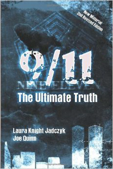

**Books**

There are many **books** related to the topics covered on this wiki,
and more generally, related to the topics discussed on the Cassiopaea
Forum. This article series is about such books.\
Currently, the main way of navigating to articles on books is the
recommended books list.

**See aIso**

. Recommended books

~XYZ-2-9/11: The Ultimate Truth
**9/ll: The UItimate Truth**

***9/ll: The Ultimate Truth*** is a tome by Laura Knight-Jadczyk and
Joe Quinn, firstp published in 2OO6 with a revived edition in 2Ol3.\
This 43O-page book drives the reader to experience the revealing truth
about what happened on September ll, 2OOl and to understand the
virulent motivations behind the "terrorist" attacks. The events are
examined along with the "players" involved in their planning and
execution: the U.S. government and intelligence agencies on the one
hand, and Israeli intelligence on the other. The latter appear to have
most likely performed the attacks on the behalf of the U.S., but in
the process, to have "changed" the plan and pulled a double-cross for
their own purposes.\
There are two parts in this book, which address, respectively, the
events of 9/ll, and their broader context.\
Part One focused primary on the 9/ll events by analyzing the great
deal of evidences surrounding the three events: Flight 93, the
Pentagon, and the World Trade Centers. And, how the Israel became
involved and the role of the United States government on that day is
evident. It also laid out the evidence-based scenario of how the
events been played out. It is important to point out that in firstp
part of this book addressed a new look at the situation of Ted and
Barbara Olson and how they are connected to the 9/ll events.\
The second part brings the reader to look at the history of Zionism,
genetics, the hidden motivations behind the attacks, and the nature of
psychopaths. With an understanding of how and why Israel was involved
and their on-going insidious actions, one will begin to comprehend why
9/ll was so important and how it led the United States of America to
become a Fascist State. This part of the

[24 Bo]{.underline}oks

{width="3.208332239720035in"
height="4.805555555555555in"}

*9/11: The UItimate Truth*, 2006

Bo[oks 25]{.underline}

book also included some sections from *PoIi1icaI PoneroIogy* by Andrew
M. Lobaczewski who had done a paramount work on psychopathy and the
nature of evil within the governments.\
Since the authors focused on the phenomenon of psychopaths, the
Zionist control, and the history in the second part of this book, it
is strongly recommended for the readers to obtain and study other
works that discussed with certain aspects of this phenomenon,
including:

. *PoIi1icaI PoneroIogy* by Andrew Lobaczewski\
. *The Con1roversy of Zion* by Douglas Reed\
. *The New PearI Harbor* by David Ray Griffnn\
. *The Mask of Sani1y* by Hervey Checkley\
. *Wi1hou1 Conscience*by Robert Hare\
. *The Sociopa1h Nex1 Door* by Martha Stout\
. *Preda1ors: PedophiIes, Rapis1s, And O1her Sex Offenderss* by Anna
Salter

Some essays are used in the text which can be found at Cassiopaea
Forum. These include:

. *Psychopa1h Humanoids - Beyond 1nsani1y* by Amos M. Gunsberg.

. An edited version of *By, For, and Of Psykopa1hs* by an anonymous
writer, appeared in the

book. The original version can be read in this Cassiopaea forum
thread.

**Further information**

. Pentagon Strike video

. 9/ll: The Ultimate Truth website

. YouTube: 9/ll: The Ultimate Truth\
. SOTT Podcast 22: 9ll: The Ultimate Truth\
. SOTT Podcast #3: 9ll Interview With Darren Williams\
. SOTT Podcast #l2: 9/ll Special\
. SOTT Podcast #46: 9ll and the Future\
. SOTT Podcasts #53: Counter-intelligence and 9/ll Truth Movement,
part l . SOTT Podcasts #54: Counter-intelligence and 9/ll Truth
Movement, part 2 . SOTT Podcasts #54: Counter-intelligence and 9/ll
Truth Movement, part 3 . SOTT Podcasts #54: Counter-intelligence and
9/ll Truth Movement, part 4

[26 Bo]{.underline}oks

. SOTT Talk Radio Show #32: 9ll Revisited - l2th Anniversary

**See aIso**

. 9/ll

. New World Order\
. Matrix control system\
. Politics and pathocracy\
. Ponerology and psychopathy . Psychopathy

. Pathocracy\
. *PoIi1icaI PoneroIogy*

~XYZ-3-All and Everything
**AII and Everything**

***All and Everything*** trilogy is the name of "ten books in three
series," written by G. I. Gurdjiefff. The trilogy series are as
follows:

. Beelzebub's Tales to His Grandson (l95O)\
. Meetings with Remarkable Men (l963)\
. Life Is Real Only Then, When 'I Am' (l974)

The following page is included with each series:

**FIRST SERIES:** Three books under the title of "Beelzebub's Tales to
His Grandson,"\
or, "An Objectively Impartial Criticism of the Life of Man."\
**SECOND SERIES:** Three books under the common title of "Meetings
with Remark-\
able Men."\
**THIRD SERIES:** Four books under the common title of "Life is Real
Only Then,\
When 'I Am.'"\
All written according to entirely new principles of logical reasoning
and strictly directed towards the solution of the following three
cardinal problems:\
**FIRST SERIES:** To destroy, mercilessly, without any compromises
whatsoever, in\
the mentation and feelings of the reader, the beliefs and views, by
centuries rooted in\
him, about everything existing in the world.\
**SECOND SERIES:** To acquaint the reader with the material required
for a new creation and to prove the soundness and good quality of it.\
**THIRD SERIES:** To assist the arising, in the mentation and in the
feelings of the reader, of a veritable, non-fantastic representation
not of that illusory world which he\
now perceives, but of the world existing in reality.

**See aIso**

. Gurdjiefff\
. Fourth Way

~XYZ-4-An Introduction to Information Theory
{width="2.0729155730533684in"
height="3.270832239720035in"}

*An 1ntroduction to 1nformation Theory*, l980 Dover Edition

**An lntroduction to lnformation Theory**

***An Introduction to Information Theory: Symbols, Signals and
Noise*** is a textbook by John R. Pierce, firstp published in l96l
under the title *SymboIs, SignaIs and Noise: The Na1ure and* *Process
of Communica1ion*.

This is a a classic textbook which covers the formal theory in a
relatively easy way and an excellent introduction to the concepts of
information theory: entropy, stationarity, ergodic sources, effcientt
coding, error detection, error correction, etc.

**ReIated readings**

. *1nforma1ion and 1he Na1ure of ReaIi1y* . *Origin of Life: The 51h
Op1ion*\
. *Signa1ure in 1he CeII*\
. *Mind and Cosmos*

Bo[oks 29]{.underline}

**ExternaI Iinks**

. Cassiopaea Forum: Session 28 May 2Ol3\
. Cassiopaea Forum: Session ll August 2Ol8

**See aIso**

. Information theory

~XYZ-5-Beelzebub’s Tales to His Grandson
**BeeIzebub's TaIes to His Grandson**

***Beelzebub's Tales to His Grandson: An 0bjectively Impartial
Criticism of the Life of*** ***Man*** is the firstv volume of the *AII
and Every1hing* trilogy written by G. I. Gurdjieff,fi firstp published
in l95O. The *AII and Every1hing* trilogy also includes *Mee1ings wi1h
RemarkabIe Men* (l963) and *Life 1s ReaI OnIy Then, When '1 Am'*
(l974).

This is Gurdjieff''s *magnum opus*, the firsto of his series on *AII
and Every1hing*.\
Gurdjieffh himself says that it should be read three times, firsta as
if reading the newspaper, next as if reading aloud and only then with
the goal of understanding. Once for the mechanical part of thinking,
once for the moving center, once for "being mentation".\
*BeeIzebub's TaIes* is on the surface a narrative of a long voyage on
a spaceship, where Beelzebub, rebel angel become elder statesman,
discourses on his observations of Earth humanity for the edificationo
of his grandson.\
It has been speculated that *BeeIzebub's TaIes* were a sort of karmic
autobiography of Gurdjiefff himself. As to the grandson, this seems to
indicate a message sent to the future. The generations born from l94O
onwards would in fact be Gurdjieff''s figurativee grandchildren, at
least in potential. Gurdjieffh himself was very conscious of a need to
create a certain kernel of consciousness in humanity, to be formed in
the relatively near future. He most likely was aware of some cosmic
window of opportunity, i.e. the Wave of the Cassiopaeans, for which
this was a needed preparation. Gurdjieff''s initial plan seemed to
have been forming a worldwide network of schools, transmitting the
teaching via a living tradition. Probably due to both his near fatal
accident in l924 and to disappointment with his students, he turned to
writing instead, sending a message in a bottle into the present time.
The book's main thrust is the destruction of the myth that man is a
conscious being and in charge of his destiny. Amidst this,
*BeeIzebub's TaIes* speaks of esoteric principles but it is not a
structured textbook nor is it a course curriculum. For such,
Ouspensky's *1n Search of 1he MiracuIous* and Mouravieff''s *Gnosis*
series are much more accessible and structured.\
Why Gurdjieffw wrote as he did may not always be clear. We do know
that he spent a long time on the work, including one full rewrite. If
something is as it is, it is because he intended it so. While writing,
he had the book regularly read aloud to his students and if something
was too clear, he "buried the dog deeper", as he himself put it. So
one must work through the shocks to human vanity and Gurdjieff''s
circuitous expression and often humorous style to glimpse deeper
principles. From the author's introduction:^l^

In any case, instead of the conventional preface I shall begin quite
simply with a Warning. Beginning with a Warning will be very judicious
of me, if only because it will not contradict any of my principles,
either organic, psychic, or even "willful", and will at

lGurdjieff,G G. I. *Beelzebub's Tales to His Grandson*, p. 5-6. New
York: Penguin Books, l999.

Bo[oks 3l]{.underline}

the same time be quite honest-of course, honest in the objective
sense, because both I myself and all others who know me well, expect
with indubitable certainty that owing to my writings there will
entirely disappear in the majority of readers, immediately and not
gradually, as must sooner or later, with time, occur to all people,
all the wealth they have, which was either handed down to them by
inheritance or obtained by their own labor, in the form of quieting
notions evoking only naive dreams, and also beautiful representations
of their lives at present as well as of their prospects in the future.

*BeeIzebub* was aimed "to destroy, mercilessly, without any
compromises whatsoever, in the menta- tion and feelings of the reader,
the beliefs and views, by centuries rooted in him, about everything
existing in the world."

Excerpt from Chapter 48 entitled "From the Author":^2^

To possess the right to the name of "man," one must be one.\
And to be such, one must firsto of all, with an indefatigable
persistence and an un- quenchable impulse of desire, issuing from all
the separate independent parts constitut-\
ing one's entire common presence, that is to say, with a desire
issuing simultaneously\
from thought, feeling, and organic instinct, work on an all-round
knowledge of oneself-\
-at the same time struggling unceasingly with one's subjective
weaknesses\--and then afterwards, taking one's stand upon the results
thus obtained by one's consciousness\
alone, concerning the defects in one's established subjectivity as
well as the elucidated\
means for the possibility of combating them, strive for their
eradication without mercy towards oneself.\
Speaking frankly, and wholly without partiality, contemporary man as
we know him is nothing more nor less than merely a clockwork
mechanism, though of a very complex construction.\
About his mechanicality, a man must without fail think deeply from
every aspect and\
with an entire absence of partiality and well understand it, in order
fully to appreciate\
what significancet that mechanicality and all its involved
consequences and results may\
have both for his own further life as well as for the justificationo
of the sense and aim of\
his arising and existence.\
For one who desires to study human mechanicality in general and to
make it clear to himself, the very best object of study is he himself
with his own mechanicality; and\
to study this practically and to understand it sensibly, with all
one's being, and not "psychopathically," that is, with only one part
of one's entire presence, is possible only\
as a result of correctly conducted self-observation.\
And as regards this possibility of correctly conducting self
observation and conducting

2Gurdjieff,G G. I. *Beelzebub's Tales to His Grandson*, p. l2O9-l2l2.
New York: Penguin Books, l999.

[32 Bo]{.underline}oks

it without the risk of incurring the maleficentt consequences which
have more than once been observed from people's attempts to do this
without proper knowledge, it is necessary that the warning must be
given\--in order to avoid the possibility of excessive zeal\--that our
experience, based on the vast exact information we have, has shown
that this is not so simple a thing as at firstg glance it may appear.
This is why we make the study of the mechanicality of contemporary man
the groundwork of a correctly conducted self-observation.

Before beginning to study this mechanicality and all the principles
for a correctly con- ducted self- observation, a man in the firstp
place must decide, once and forever, that he will be sincere with
himself unconditionally, will shut his eyes to nothing, shun no
results wherever they may lead him, be afraid of no inferences, and be
limited by no previous, self-imposed limits; and secondly, in order
that the elucidation of these prin- ciples may be properly perceived
and transubstantiated in the followers of this new teaching, it is
necessary to establish a corresponding form of "language," since we
findd the established form of language quite unsuitable for such
elucidations.

As regards the firstc condition, it is necessary now at the very
outset to give warning that a man unaccustomed to think and act along
lines corresponding to the principles of self-observation must have
great courage to accept sincerely the inferences obtained and not to
lose heart; and submitting to them, to continue those principles
further with the crescendo of persistence, obligatorily requisite for
this.

These inferences may, as is said, "upset" all the convictions and
beliefs previously deep- rooted in a man, as well as also the whole
order of his ordinary mentation; and, in that event, he might be
robbed, perhaps forever, of all the pleasant as is said "values dear
to his heart," which have hitherto made up his calm and serene life.

Thanks to correctly conducted self-observation, a man will from the
firstd days clearly grasp and indubitably establish his complete
powerlessness and helplessness in the face of literally everything
around him.

With the whole of his being he will be convinced that everything
governs him, everything directs him. He neither governs nor directs
anything at all. He is attracted and repelled not only by everything
animate which has in itself the capacity to influencet the arising of
some or other association in him, but even by entirely inert and
inanimate things.

Without any self-imagination or self-calming\--impulses which have
become inseparable from contemporary men\--he will cognize that his
whole life is nothing but a blind reacting to the said attractions and
repulsions.

He will clearly see how his what are called world-outlooks, views,
character, taste, and so on are molded\--in short, how his
individuality was formed and under what influencess its details are
liable to change. And as regards the second indispensable condition,
that

Bo[oks 33]{.underline}

is, the establishment of a correct language; this is necessary because
our still recently established language which has procured, so to say,
"rights-of-citizenship," and in which we speak, convey our knowledge
and notions to others, and write books, has, in our opinion already
become such as to be now quite worthless for any more or less exact
exchange of opinions.

The words of which our contemporary language consists, convey, owing
to the arbi- trary thought people put into them, indefinitea and
relative notions, and are therefore perceived by average people
"elastically."

In obtaining just this abnormality in the life of man, a part was
played in our opinion, by always that same established abnormal system
of education of the rising generation. And it played a part because,
based, as we have already said, chieflyo on compelling the young to
"learn by rote" as many words as possible differenttiated one from the
other only by the impression received from their consonance and not by
the real pith of the meaning put into them, this system of education
has resulted in the gradual loss in people of the capacity to ponder
and reflectu upon what they are talking about and upon what is being
said to them.

**See aIso**

. Gurdjiefff\
. Fourth Way

~XYZ-6-Blink (book)
**BIink (book)**

{width="2.60417760279965in"
height="3.934884076990376in"}

***Blink: The Power of Thinking Without Thinking*** is a book by
Malcolm Gladwell, firstt published in 2OO5. It presents research
findingso on the role of the adaptive unconscious in our lives,
including the more positive aspects of unconscious information
processing ("thinking without thinking"). It can often notice and
solve problems more effcienttly and creatively than an analytical
approach which systematically considers more information.

This book is a good supplement to *S1rangers 1o OurseIves* and
*Thinking, Fas1 and SIow*, which focus more on the flawws and biases
of unconscious information processing, and on how we are blind to what
influencesu us and to our own motivations and personality.

**ReIated reading**

. *S1rangers 1o OurseIves* Timothy D. Wilson . *Redirec1* (book)
Timothy D. Wilson\
. *Thinking, Fas1 and SIow* Daniel Kahneman

Bo[oks 35]{.underline}

. *You Are No1 So Smar1* David McRaney\
. *Wha1 Makes Your Brain Happy and Why You ShouId Do 1he Opposi1e*
David DiSalvo

**See aIso**

. Adaptive unconscious . Creativity\
. Problem-solving

~XYZ-7-Brain Changer
**Brain Changer**

{width="3.12500656167979in"
height="4.6781539807524055in"}

***Brain Changer: How Harnessing Your Brain's Power to Adapt Can
Change Your*** ***Life*** is a book by David DiSalvo, firstp published
in 2Ol3. It describes our potential to change our brains through
neuroplasticity, by consciously influencingt the feedback loops that
control our brains and minds.

The book has three parts: one theoretical ("Know"), one practical
("Do"), and one recommending further material on relevant themes
("Expand") in the form of nonfictiona and fictionb books as well as
movies.

**Metacognition and neuropIasticity**

Two basic concepts are at the root of *Brain Changer*: metacognition
("thinking about thinking") and neuroplasticity. Neuroplasticity is
the ability of our brains to change over time and they

Bo[oks 37]{.underline}

change according to what they do, the mental and behavioral patterns
we choose forming habit- ual "tracks". The key, then, is to influenceo
ourselves so as to form beneficialt tracks rather than detrimental
ones and one of the keys to this is metacognition.

While people often "think" about their thinking, this usually amounts
to being pulled along by a floood of mental energy, and as such simply
following an ingrained track; the key to effectiveely changing the
"track" we follow at a given moment is to think deliberately, taking
the time to pause and reach a more detached, level-headed perspective,
from which we can judge more objectively and make differentt choices.

**SeIf-knowIedge and practicaI tooIs**

There is more to self-change than metacognition alone our brains have
evolved to function in a certain way, and along with bad habits or
programming formed in our past, the challenge can be formidable. To
work effectiveely on changing ourselves, we must know how our brains
work, in terms of motivation and habits, and how we can influencei it.
The more "tricks" we know, and the more pitfalls we avoid, the better
the endeavor goes.

A large portion of *Brain Changer* consists of a collection of
"tools". These include both psychological techniques and concrete
actions we can take to change the way our brains work. The Cassiopaea
Forum discussion about the book contains a summary of some of them.

**ln reIation to the Fourth Way**

There are strong parallels between certain discoveries of modern
psychological and brain sciences and Fourth Way ideas. This book not
only makes for a great example, but taken together with *The Wave
Series*, *1n Search of 1he MiracuIous*, and other books such as the
'Narcissism "big fivee"', it can serve as an introduction to The Work.
These other books place the information in *Brain* *Changer* in a
wider context, and also give an understanding of the underlying issues
one may have and have to face.

*Brain Changer* also goes very well with the recommended books on
cognitive and social psychology, e.g. *S1rangers 1o OurseIves* and
DiSalvo's other recommended book *Wha1 Makes Your Brain Happy* *and
Why You ShouId Do 1he Opposi1e*. These make clearer our mechanical
nature, how we don't know ourselves, and some of the things we can do
about it.

The main challenge in reading *Brain Changer* is gaining a deeper
understanding of what is written, and so becoming able to put it into
effectivee practice. It is easy to read and it all makes sense on the
surface, but it requires reflectiona and further knowledge to really
make it click.

[38 Bo]{.underline}oks

**See aIso**

. *Wha1 Makes Your Brain Happy and Why You ShouId Do 1he Opposi1e* .
*The Mind & The Brain*

**ExternaI Iinks**

. SOTT Talk Radio Show: David DiSalvo: What Makes Your Brain Happy and
Why You Should Do the Opposite (Interview with David DiSalvo about
both *Wha1 Makes Your Brain* *Happy and Why You ShouId Do 1he
Opposi1e* and *Brain Changer*.)

. Cassiopaea Forum: Brain Changer: How Harnessing Your Brain's Power
to Adapt Can Change Your Life (Extensive summary of and excerpts from
*Brain Changer*, and discussion of the book.)

. Cassiopaea Forum: Movies recommended in the book Brain Changer by
David DiSalvo\
. David DiSalvo's "The Daily Brain" blog

~XYZ-8-Bringers of the Dawn
{width="3.111111111111111in"
height="4.805555555555555in"}

*Bringers of the Dawn: Teachings from the PIeiadians*

**Bringers of the Dawn**

***Bringers of the Dawn: Teachings from the Pleiadians***, by Barbara
Marciniak, is a channeled material that Cassiopaeans had suggested for
reading in a number of early channeling sessions with Laura
Knight-Jadczyk.

Channeled by Marciniak, the Pleiadians present themselves as a group
entity from the far future. The book is addressed as a wake-up call to
supposed "wanderers", or "system busters" who have incarnated on Earth
at this time to assist with the events of the Wave. The book is
engaging, but according to the FotCM's take on the matter, it is a
mixed source with genuine higher density information blended with the
Marciniak's preconceptions and a heavy dose of "you create your own
reality". The term "Lizzie" was firsti introduced in this book as a
name for the 4th density STS overlords keeping the humanity captive.

[4O Bo]{.underline}oks

The book agrees in many key points with Cassiopaeans and Ra, and it is
a good read if one does not take everything too literally. Marciniak's
later work is in the FotCM's view rather more STS-influenceda and
ritualistic, thus *Bringers of 1he Dawn* remains her best work.

The Cassiopaeans have said that Ra and the Pleiadians are their
"colleagues", occupying a some- what differentt point of focus in
sixth density but with access to essentially the same understandings.
Differencesi in the channel and audience can account for many
differenceso of focus and tone.

**See aIso**

. Pleiadians . Wanderer

~XYZ-9-Cassiopaean session transcripts
**Cassiopaean session transcripts**

The Cassiopaeans are a channeled source contacted by Laura
Knight-Jadczyk for the firstt time in July of l994. The material found
in the **Cassiopaean session transcripts** is unique in that the
channeled material has been the starting point rather than the end
product: it is used as inspiration for research.

**The sessions and the research**

While the Cassiopaean material can be an interesting read in itself,
it comes about in interaction with ongoing research, and by itself is
not as meaningful. Unfortunately, it sometimes happens that people
tending towards a New Age worldview read the transcripts in isolation,
interpreting them in such a way that they merely end up extending a
subjective belief system.

For people not familiar with the larger body of work that has come
about through the Cassiopaean Experiment, at a minimum it is
recommended to read *The Wave Series* before delving into the
transcripts by themselves. Relating the events, research, and
metaphysical exploration of the early years of the Cassiopaean
Experiment, this series of books quotes key parts of the early
Cassiopaean material in context. The transcripts are also quoted in
context in works such as *The Secre1 His1ory* *of 1he WorId*, *High
S1rangeness*, and *Amazing Grace*.

***The Cassiopaea Experimen1 Transcrip1s* series**

Laura Knight-Jadczyk revisits, extensively annotates, and puts the
Cassiopaean sessions into per- spective in this book series.

. *The Cassiopaea Experimen1 Transcrip1s, VoIume 1: 199J*\
. *The Cassiopaea Experimen1 Transcrip1s, VoIume 2: 1995*\
. *The Cassiopaea Experimen1 Transcrip1s, VoIume 3: 1996*\
. *The Cassiopaea Experimen1 Transcrip1s, VoIume J: January - May
1997*

**See aIso**

. Cassiopaean Experiment\
. Channeling and channeled material . Cassiopaeans

[42 Bo]{.underline}oks

**ExternaI Iinks**

. Cassiopaea Forum: Cassiopaean Session Transcripts (A board
containing transcripts and

discussions of the sessions. Translations exist for several
languages.)\
. Cassiopaea Forum: Cassiopaean Session Transcripts by date (A thread
with links to all

transcripts published on the forum, organized by date.)

~XYZ-10-Character Disturbance
**Character Disturbance**

{width="3.1250076552930883in"
height="4.837472659667542in"}

***Character Disturbance: The Phenomenon of 0ur Age*** is a book by
George K. Simon, firstp published in 2Oll, which explores the issue of
the increasing prevalence of character disorder in modern times. In
today's social climate of permissiveness and entitlement, with a
culture that promotes narcissism, neurosis is less common than it used
to be, while irresponsible and problematic attitudes and behaviors
have greatly increased.

Simon explains that manipulative and exploitative characters cannot be
cured by treating them as if their problems were due to some great,
underlying suffering.R Rather, such behavior follows from distorted
thinking, a sense of entitlement, and a refusal to take
responsibility. As such, what those who have developed a pathological
character need above all is *correc1ion*. (Though in the case of
psychopathy and some other severe character disorders, these are known
to be incurable, though Simon only touches on this as a possibility.)

[44 Bo]{.underline}oks

The book contrasts the types of personalities that result from
neurotic issues with those having disturbed characters. It goes on to
examine the cognitive and behavioral aspects of destructive
psychopathologies, in a way that is useful for understanding,
recognizing, and dealing with those so afficted.It It can be seen as a
rewrite, more broad in scope, of George Simon's earlier book *1n
Sheep's CIo1hing*. The earlier book focused more narrowly on
understanding and dealing with covertly aggressive manipulators, which
is one of the types of the character disturbed that George Simon
identifies..

**Further reading**

. Cassiopaea Forum George Simon: Character Disturbance (A thread on
*Charac1er Dis1ur-*

*bance* with useful excerpts and some discussion.)\
. Cassiopaea Forum Extraits de Perturbation du caractere - Excerpts
from Character Distur-

bance (A French translation of excerpts from *Charac1er Dis1urbance*.)

**See aIso**

. *1n Sheep's CIo1hing* . Ponerization\
. Characteropathy\
. Psychopathy

~XYZ-11-Comets and the Horns of Moses
{width="3.156248906386702in"
height="4.666665573053368in"}

*Comets and the Horns of Moses*

**Comets and the Horns of Moses**

***Comets and the Horns of Moses*** is the second volume in the series
*The Secre1 His1ory of 1he* *WorId* by Laura Knight-Jadczyk, and was
published in 2Ol3.\
This second volume picks up the threads of the firstv volume with an
analysis of the Biblical character of Moses his possible true history
and nature and the cyclical nature of cometary bombardment and related
catastrophes in Earth's history. It examines how human culture and
beliefs have changed in response to overwhelming disaster, and how and
why history has been falsifiedt to erase such disasters from common
knowledge. In light of the past, it also examines the situation of our
current civilization, showing that the time seems near for it to
experience what past civilizations have: destruction by cometary
bombardment, plague, and other related disastrous events.\
The examination of the falsificationo of history (including why the
masses of the past so readily

[46 Bo]{.underline}oks

accepted the fabrications that were spoon-fed to them by the elites of
the day) is based on recent psychological and cognitive research as
well as a neoteric look at the origin of astrology and religions.

***The Secre1 His1ory of 1he 1/orld* series**

. *The Secre1 His1ory of 1he WorId and How 1o Ge1 Ou1 AIive* by Laura
Knight-Jadczyk (2OO5) . *Come1s and 1he Horns of Moses* by Laura
Knight-Jadczyk (2Ol3)\
. *Ear1h Changes and 1he Human-Cosmic Connec1ion* by Pierre Lescaudron
with Laura Knight-

Jadczyk (2Ol4)

**See aIso**

. Laura Knight-Jadczyk . History

. Cataclysm

~XYZ-12-Cosmos and History
{width="3.2777766841644795in"
height="4.805555555555555in"}

*Cosmos and History: The Myth of the EternaI Return*, l959

**Cosmos and History**

***Cosmos and History: The Myth of the Eternal Return*** is a work of
the history of religions by Mircea Eliade, firstp published in l954.
It consists of four chapters with a foreword.\
In this book, the author points to his analysis that a traditional man
attributes no value to the linear perspective of historical events:
only the events of the mythical age have value. Presumingly, that is
where the essence of the Sacred lies. The author also brings the
reader to the understanding of the "Eternal Return" - a belief in the
ability to return to the mythical age, to "become" contemporary with
the events described in one's myth. The "cyclical" time is attributed
to this belief.\
However, this "yearning" to return to the mythical age causes a
"terror of history".

[48 Bo]{.underline}oks

As Laura Knight-Jadczyk writes in fiftyy-second chapter of her *The
Wave* Series:^3^

As the great Historian of Religion, Mircea Eliade pointed out, the
study of history, through its various disciplines, offersa a view of
mankind that is almost insupportable. The rapacious movements of
hungry tribes, invading, conquering and destroying in the darkness of
prehistory; the barbarian invaders of the civilized world during
medieval times; the bloodbaths of the crusades of Catholic Europe
against the infidelso of the Middle East; the stalking noonday terror
of the Inquisition where martyrs quenched the flamesw with their
blood; and the raging holocaust of modern genocide. Wars, famine,
pestilence; all produce an intolerable sense of indefensibility
against what Mircea Eliade calls the Terror of History.

As I have written elsewhere, when man contemplates history, *as i1
is*, he is forced to realize that he is in the iron grip of an
existence that seems to have no real care or concern for his pain and
suffering.O Over and over again, the same sufferingsf fall upon
mankind multiplied millions upon millions of times over millennia. The
totality of human sufferingi is a dreadful thing. I could write until
the end of the world using oceans of ink and forests of paper, and
never fully convey this terrible condition in which mankind findsh his
existence.

The beast of arbitrary calamity has always been with us. For as long
as human hearts have pumped hot blood through their too-fragile bodies
and glowed with the inexpress- ible sweetness of life and yearning for
all that is good and right and loving, the sneering, stalking,
drooling and scheming beast of real life has licked its lips in
anticipation of its next feast of terror and suffering.S Since the
beginning of time, this mystery of the estate of man, this Curse of
Cain has existed. And, since the Ancient of Days, the cry has been:
"My punishment is greater than I can bear!" But if you findy yourself
saying this, you are "alienated," antisocial, and incapable of
findinga any meaning in life. You are just simply not with the
program\...

**Further readings**

. The Grail Quest and the Destiny of Man

**See aIso**

. Religion

. History

. Cyclical time\
3The Wave Chapter 52: The Cryptogeographic Being
~XYZ-13-Crucial Conversations
{width="2.4861100174978126in"
height="3.9166655730533684in"}

*CruciaI Conversations*, 2012

**CruciaI Conversations**

**_Crucial Conversations:  Tools for Talking When Stakes Are High_** is a business self-help book by Kerry Patterson, Joseph Grenny, Ron McMillan, and Al Switzler, firstp published in 2OO2, which describes how to interact with others in a constructive way when ”stakes are high, opinions vary, and emotions run strong”.

The authors defines” ”crucial conversations” as conversations between two or more people that be- comes crucial when opinions differ,s stakes are high, and emotions run strong. And, the more crucial the conversations, the less likely we would handle it due to the fact that ”countless generations of genetic shaping drive humans to handle crucial conversations with flyingfi fistsa and fleetf feet, not intelligent persuasion and gentle attentiveness”.4  When a crucial conversation failed, every aspect of our lives can be affectedf from our personal health to our professional careers in an unhealthy or disastrous way. As we master crucial conversations, we can navigate through dangerous waters safety and effectively.

4Patterson, Kerry, Joseph Grenny, Ron McMillan, and Al Switzler.
*Crucial Conversations: Tools for Talking When*

*Stakes Are High*, p. 5. 2nd Edition. New York: McGraw Hill, 2Ol2.

[5O Bo]{.underline}oks

The book also touches on two most common patterns we fall into that put safety at risk when facing a crucial conversation: _siIence_ and _vioIence_ (most commonly known as ”fightt or flightt” response). With silence, we withdraw from the conversation, avoid topics or respond in ways that obscure meaning.    With violence,  we resort to verbal abuse,  labeling,  and manipulating the situation. Either way, we get ”stuck” (an inability to solve problems or achieve goals) and become blind to the _diaIogue_ option.

The dialogue is the free floww of meaning between two or more people, and in a context of crucial conversations, it is the ”Pool of Shared Meaning”, where facts, opinions, experiences, and feelings held by two or more people in a conversation that are understood and appreciated by all.  It is a beginning of synergy.5       In order to move to dialogue, we would need to get ”unstuck” from either silence or violence by identifying where we are stuck and by looking at three parts of a problem: content, pattern, and relationship.

The book goes further on working on the self or ”Work On Me First” (”Start with the Heart” - what do you _reaIIy_ want, ”Master My Stories” - we change our narrative to influenceo our emotions), establishing own meaning (”State My Path”) and their meaning (”Learn to Look”, ”Make it Safe”, ”Explore Others’ Path”), and moving to action (determining ”Who does What by When” and setting ”Follow-up” time - holding people accountable to their promises).

This is a practical book on basic and essential skills and mastering of diffculti in-person conversa- tions. It can be read along with _How 1o Win Friends and 1nfluencee PeopIe_ and _Miss Manners_ - all of which helps one exercises external considering.

**ExternaI Iinks**

. Cassiopaea Forum: Crucial Conversations - Tools for Talking When Stakes Are High . Cassiopaea Forum: External Considering and Good Manners  
. WikiSummaries: Crucial Conversations  
. VitalSmarts (corporate training and leadership development)  
. YouTube: Crucial Conversations | Joseph Grenny  
. YouTube: Mastering The Art of Crucial Conversations | Joseph Grenny

**See aIso**

. Psychology\
. *How 1o Win Friends and 1nfluencee PeopIe*

5Patterson. *Crucial Conversations*, p. 23-25.

Bo[oks 5l]{.underline}

. *Miss Manners*
~XYZ-15-Darkness Over Tibet
**Dabrowski's Theory of Positive Disintegration**

{width="2.60417760279965in"
height="3.9033541119860016in"}

***Dabrowski's Theory of Positive Disintegration*** is a collection of
essays on the Theory of Positive Disintegration, edited by Sal
Mendaglio and firstp published in 2OO8.\
This book is a good addition to Kazimierz Dqbrowski's own works
describing the Theory of Pos- itive Disintegration. It contains
information about Dqbrowski and his life, the theory and its
development, and relates the theory to various subjects. Among those
subjects are aspects of the philosophies of Plato, Kierkegaard, and
Nietzsche; education; mental health; creativity; and giftedness.

**ReIated reading**

. *PersonaIi1y-shaping 1hrough Posi1ive Disin1egra1ion* . *Posi1ive
Disin1egra1ion* (book)\
. *Men1aI Grow1h Through Posi1ive Disin1egra1ion*\
. *Psychoneurosis 1s No1 An 1IIness*

Bo[oks 53]{.underline}

. *The Dynamics of Concep1s*\
. *MuI1iIeveIness of Emo1ionaI and 1ns1inc1ive Func1ions*

**See aIso**

. Kazimierz Dqbrowski\
. Theory of Positive Disintegration

**ExternaI Iinks**

. Cassiopaea Forum: A Brief Overview Dabrowski's Theory of Positive
Disintegration (Bill

Tillier's brief presentation of the Theory of Positive Disintegration,
and discussion.)\
. PositiveDisintegration.com (Bill Tillier's website about the Theory
of Positive Disintegration.

Contains information and offersd digital copies of Dqbrowski's own
works.)
~XYZ-16-Darwin’s Doubt
**Darkness Over Tibet**

***Darkness 0ver Tibet*** is a book by Theodore Illion, firstp
published in l937, an allegoric account of the underground city in
Tibet during the course of Illion's journey. He relates his
experiences with his interactions with a number of individuals in the
mentioned city. At first,h he found there all is well and everything
seems quite peaceful, but as it turned out later, nothing is as it
seems. There is a known darkness and "unseen" darkness. This book
reveals the "unseen" darkness where as the so-called "light" is
actually the darkness in disguise.

The stories in this book are clearly symbolic, but it may have some
basis in fact and probably capture some of the spirit of popular
belief in the region. Determining the account's precise accuracy is
diffcultf from a Western standpoint.

What is more important than the literal accuracy of Illion's account
is, however, the way in which he underlines basic principles. The
following are the high points of his narrative:

. Spiritual development does not bring one to blissful peace. It is a
road of constant struggle fraught with pitfalls at each level. The
light and dark follow each other closely and deceptions become
increasingly subtle.

. Not all life is on an upward path. Many life forms are in fact on a
descending path, symbolized in the animal world by rats and the like.
The same applies to at the human and higher levels. The psychopath
would be a human level representation of the descending path.
Generally, the descending path tends towards materialization of
spirit, use of spiritual forces at the service of their material
goals. This is in line with the idea of service to self from Ra and
Cassiopaeans.

. The deceptions of the dark forces are sometimes very subtle and can
take the form of great seeming virtue, understanding and wisdom. One
among these is for man to think himself God and and refuse to act his
part. For example, a character in a theater play in the book thought
himself enlightened and since all created are God's creatures, he saw
fitt to share his house and food with rats, to the effecto of starving
his family. He was spiritually proud and in his pride deceived.

Illion mentions other archetypal stories, including a school of black
magicians where the students do not even at firstg guess the nature of
the school, thinking themselves on a mission for good, administering
karma for the world's leaders, guiding destinies with a "strong and
benevolent hand."

Still, this power hungry and self-important lot were nothing but the
minions of the actual forces of darkness, perpetrating human
sacrificea and other such activities for their own gain,\
Yet another example is a teacher who warns people against blindly
following leaders and of prac- ticing magic, all in good sense but
then advises them to destroy any individual consciousness and to
return to an in-differenttiated state of non-ego, effectuallyc
committing suicide and reversing the Creator's work, all for personal
happiness.

Bo[oks 55]{.underline}

{width="4.013888888888889in"
height="6.222222222222222in"}

*Darkness 0ver Tibet*

[56 Bo]{.underline}oks

Illion's greatest merit is showing the dark side of many seemingly
reasonable and even virtuous ideas. The Cassiopaeans have commented
that Illion's account is an allegory for spiritual truths and 4th
density concepts.

**Further readings**

. Darkness Over Tibet Part l\
. Darkness Over Tibet Part 2\
. Darkness Over Tibet Part 3\
. Cassiopaea Forum: Theodore Illion - Darkness Over Tibet

**See aIso**

. Theodore Illion\
. Fourth density service to self being
~